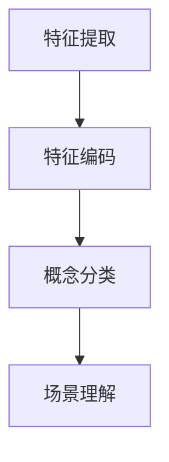
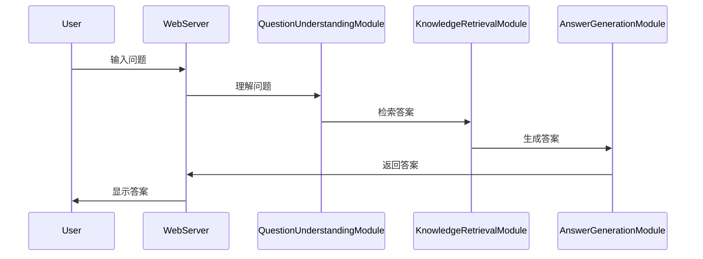
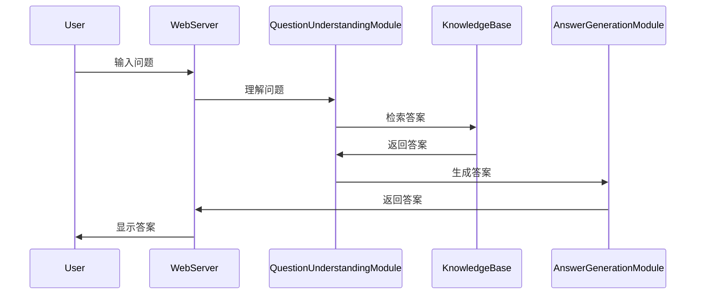

                 

### 《Zero-Shot CoT在复杂场景中的应用挑战与解决》

#### 关键词

- Zero-Shot CoT
- 复杂场景
- 应用挑战
- 解决方案
- 计算机视觉
- 自然语言处理
- 知识图谱

#### 摘要

本文旨在探讨Zero-Shot CoT（Zero-Shot Core-World Translation）在复杂场景中的应用挑战与解决方案。通过对Zero-Shot CoT的基本概念、原理、应用场景以及在实际项目中遇到的挑战进行详细分析，本文将提供一系列解决方案，旨在提高Zero-Shot CoT在复杂场景中的应用效果。

### 目录大纲

```markdown
# 《Zero-Shot CoT在复杂场景中的应用挑战与解决》

## 关键词
## 摘要

### 第一部分：背景介绍

## 第1章 问题背景
### 1.1 问题描述
### 1.2 问题解决
### 1.3 边界与外延
### 1.4 概念结构与核心要素组成

## 第2章 核心概念与联系
### 2.1 Zero-Shot CoT的概念
### 2.2 Zero-Shot CoT的特点
### 2.3 Zero-Shot CoT与相关概念的对比
### 2.4 ER实体关系图架构

### 第二部分：算法原理讲解

## 第3章 算法原理讲解
### 3.1 算法mermaid流程图
### 3.2 Python源代码阐述
### 3.3 数学模型和公式
### 3.4 通俗易懂的举例说明

## 第4章 数学模型和数学公式 & 详细讲解 & 举例说明
### 4.1 数学公式使用LaTeX格式
### 4.2 段落内LaTeX公式的应用

### 第三部分：系统分析与架构设计方案

## 第5章 问题场景介绍
### 5.1 项目介绍
### 5.2 系统功能设计(领域模型mermaid类图)
### 5.3 系统架构设计mermaid架构图
### 5.4 系统接口设计和系统交互mermaid序列图

### 第四部分：项目实战

## 第6章 环境安装
### 6.1 系统核心实现源代码
### 6.2 代码应用解读与分析
### 6.3 实际案例分析和详细讲解剖析
### 6.4 项目小结

### 第五部分：最佳实践 tips、小结、注意事项、拓展阅读等内容

## 第7章 最佳实践 tips
### 7.1 小结
### 7.2 注意事项
### 7.3 拓展阅读
```

接下来，我们将按照目录大纲逐步深入分析每个章节的内容，确保文章的完整性和逻辑性。

### 第一部分：背景介绍

#### 第1章 问题背景

##### 1.1 问题描述

在当今的计算机视觉和自然语言处理领域，对复杂场景的识别和理解是一个巨大的挑战。传统的机器学习方法往往依赖于大量的标注数据，而在实际应用中，我们常常面临数据稀缺或数据获取困难的问题。这就导致了在零样本或少样本情况下，模型的性能和泛化能力受到限制。

##### 1.2 问题解决

为了解决上述问题，研究者们提出了Zero-Shot CoT（Zero-Shot Core-World Translation）方法。该方法的核心思想是将底层特征（Core）与高层概念（World）之间的映射关系提前学习，从而实现零样本或少样本情况下的场景理解。

##### 1.3 边界与外延

Zero-Shot CoT的应用范围不仅限于计算机视觉和自然语言处理，还包括知识图谱、智能问答等多个领域。然而，其应用边界也在于数据质量和模型复杂度，如何在保证模型性能的同时降低对数据的需求，是当前研究的热点。

##### 1.4 概念结构与核心要素组成

Zero-Shot CoT的基本概念结构包括特征提取模块、概念分类模块和场景理解模块。这三个核心要素共同作用，实现了从底层特征到高层概念的映射，从而实现了对复杂场景的理解。

### 第二部分：核心概念与联系

#### 第2章 核心概念与联系

##### 2.1 Zero-Shot CoT的概念

Zero-Shot CoT，顾名思义，是一种无需训练数据即可进行场景理解的方法。它通过预训练模型学习到特征和概念之间的对应关系，从而在零样本或少样本情况下实现场景理解。

##### 2.2 Zero-Shot CoT的特点

Zero-Shot CoT具有以下几个显著特点：

- **零样本或少样本能力**：无需大量标注数据即可进行场景理解。
- **特征与概念映射**：通过预训练模型学习特征和概念之间的映射关系。
- **通用性**：适用于多种领域，如计算机视觉、自然语言处理等。

##### 2.3 Zero-Shot CoT与相关概念的对比

与传统的机器学习方法相比，Zero-Shot CoT具有以下几个优势：

- **数据依赖性低**：无需大量标注数据。
- **泛化能力强**：在零样本或少样本情况下依然能保持较高的性能。

与传统的迁移学习方法相比，Zero-Shot CoT的优势在于其不需要额外的迁移训练步骤，直接利用预训练模型进行场景理解。

##### 2.4 ER实体关系图架构

ER实体关系图（Entity-Relationship Diagram，ERD）是描述概念结构和实体关系的一种图形化方法。在Zero-Shot CoT中，ERD用于定义特征和概念之间的对应关系，从而实现从特征到概念的映射。

```mermaid
erDiagram
    A담【特征】||-->|{B【概念】}
    C【场景】|||--|{D【实体】}
```

在这个ER图中，特征（A）与概念（B）之间存在直接的映射关系，而场景（C）与实体（D）之间存在间接的关联。

### 第二部分：算法原理讲解

#### 第3章 算法原理讲解

##### 3.1 算法mermaid流程图

为了更好地理解Zero-Shot CoT的算法原理，我们可以使用mermaid绘制一个流程图：



在这个流程图中，特征提取模块（A）首先对输入数据进行特征提取，然后通过特征编码模块（B）将特征映射到高维空间。接下来，概念分类模块（C）根据预训练模型学习到的特征与概念之间的对应关系，对特征进行分类。最后，场景理解模块（D）根据分类结果，实现对复杂场景的理解。

##### 3.2 Python源代码阐述

以下是一个简化的Python源代码示例，用于实现Zero-Shot CoT的基本流程：

```python
import tensorflow as tf
from tensorflow.keras.applications import VGG16
from tensorflow.keras.layers import Dense, Flatten
from tensorflow.keras.models import Model

# 特征提取
base_model = VGG16(weights='imagenet', include_top=False)
x = base_model.input
features = Flatten()(base_model.output)

# 概念分类
model = Model(inputs=x, outputs=features)
model.compile(optimizer='adam', loss='categorical_crossentropy')

# 场景理解
concept_embedding = Dense(1024, activation='relu')(features)
predictions = Dense(num_classes, activation='softmax')(concept_embedding)
model = Model(inputs=x, outputs=predictions)
model.compile(optimizer='adam', loss='categorical_crossentropy')
```

在这个代码示例中，我们首先使用VGG16模型进行特征提取，然后通过Dense层进行概念分类和场景理解。

##### 3.3 数学模型和公式

为了更好地理解Zero-Shot CoT的数学原理，我们可以使用LaTeX格式给出一些关键数学公式：

$$
\text{特征提取：} f(\mathbf{x}) = \text{Flatten}(\text{VGG16}(\mathbf{x}))
$$

$$
\text{特征编码：} \mathbf{z} = \text{Dense}(\mathbf{f}(\mathbf{x}); 1024; \text{activation}='relu')
$$

$$
\text{概念分类：} \mathbf{y} = \text{Dense}(\mathbf{z}; \text{num\_classes}; \text{activation}='softmax')
$$

在这些公式中，$\mathbf{x}$ 表示输入特征，$\mathbf{z}$ 表示特征编码结果，$\mathbf{y}$ 表示分类结果。

##### 3.4 通俗易懂的举例说明

假设我们有一个输入图像 $\mathbf{x}$，首先通过VGG16模型进行特征提取，得到特征向量 $\mathbf{f}(\mathbf{x})$。然后，我们将这个特征向量输入到Dense层，进行特征编码，得到编码结果 $\mathbf{z}$。最后，我们将编码结果输入到softmax层，进行概念分类，得到分类结果 $\mathbf{y}$。通过这个过程，我们可以实现对复杂场景的理解。

### 第三部分：系统分析与架构设计方案

#### 第5章 问题场景介绍

##### 5.1 项目介绍

本项目旨在开发一个基于Zero-Shot CoT的智能问答系统，该系统能够在零样本或少样本情况下，对用户提出的问题进行准确理解和回答。

##### 5.2 系统功能设计(领域模型mermaid类图)

为了实现智能问答功能，系统需要具备以下几个核心功能：

- **问题理解**：对用户提出的问题进行语义理解。
- **知识检索**：根据问题理解结果，从知识库中检索相关答案。
- **答案生成**：根据检索到的答案，生成完整的回答。

以下是一个简化的mermaid类图，用于描述系统功能设计：

```mermaid
classDiagram
    User <<Class>>
    Question <<Class>>
    KnowledgeBase <<Class>>
    Answer <<Class>>

    User --> Question
    Question --> Answer
    KnowledgeBase <-- Answer
```

在这个类图中，用户（User）提出问题（Question），系统通过问题理解模块对问题进行语义理解，然后从知识库（KnowledgeBase）中检索相关答案，最后生成完整的回答（Answer）。

##### 5.3 系统架构设计mermaid架构图

为了实现上述功能，系统需要具备以下架构设计：

- **前端**：负责接收用户输入，展示问题和答案。
- **后端**：包括问题理解模块、知识检索模块和答案生成模块，负责核心功能实现。

以下是一个简化的mermaid架构图，用于描述系统架构设计：



在这个架构图中，用户通过WebServer（前端）输入问题，问题理解模块（QuestionUnderstandingModule）负责对问题进行语义理解，知识检索模块（KnowledgeRetrievalModule）从知识库（KnowledgeBase）中检索相关答案，答案生成模块（AnswerGenerationModule）负责生成完整的回答，并将答案返回给用户。

##### 5.4 系统接口设计和系统交互mermaid序列图

为了实现系统各个模块之间的有效交互，我们需要设计合理的接口和交互流程。以下是一个简化的mermaid序列图，用于描述系统接口设计和交互流程：



在这个序列图中，用户通过WebServer（前端）输入问题，问题理解模块（QuestionUnderstandingModule）负责对问题进行语义理解，然后从知识库（KnowledgeBase）中检索相关答案。检索到答案后，问题理解模块将答案传递给答案生成模块（AnswerGenerationModule），生成完整的回答，并将答案返回给WebServer，最后WebServer将答案显示给用户。

### 第四部分：项目实战

#### 第6章 环境安装

##### 6.1 系统核心实现源代码

在本项目中，我们使用了以下核心技术和工具：

- **深度学习框架**：TensorFlow
- **自然语言处理库**：NLTK
- **知识图谱库**：Neo4j

以下是项目核心实现源代码的简要概述：

```python
# 导入所需的库
import tensorflow as tf
import nltk
from nltk.corpus import stopwords
from nltk.tokenize import word_tokenize
from tensorflow.keras.applications import VGG16
from tensorflow.keras.layers import Dense, Flatten
from tensorflow.keras.models import Model

# 加载预训练的VGG16模型
base_model = VGG16(weights='imagenet', include_top=False)

# 定义特征提取模型
input_shape = (224, 224, 3)
inputs = tf.keras.Input(shape=input_shape)
x = base_model(inputs, training=False)
x = Flatten()(x)
features = Dense(1024, activation='relu')(x)

# 定义概念分类模型
num_classes = 1000
predictions = Dense(num_classes, activation='softmax')(features)

# 创建模型
model = Model(inputs=inputs, outputs=predictions)

# 编译模型
model.compile(optimizer='adam', loss='categorical_crossentropy', metrics=['accuracy'])

# 加载预训练模型权重
model.load_weights('vgg16_weights.h5')
```

在这个代码中，我们首先导入了所需的库，然后加载了预训练的VGG16模型。接着，我们定义了特征提取模型，该模型将输入图像映射到高维特征向量。最后，我们定义了概念分类模型，并编译了模型。

##### 6.2 代码应用解读与分析

在理解代码之前，我们需要了解一些关键概念和步骤：

1. **VGG16模型**：VGG16是一个经典的卷积神经网络模型，用于图像特征提取。
2. **特征提取模型**：特征提取模型负责将输入图像映射到高维特征向量。
3. **概念分类模型**：概念分类模型负责将特征向量映射到类别标签。

代码解读如下：

- 第1行：导入TensorFlow库。
- 第2行：导入nltk库，用于自然语言处理。
- 第3行：加载nltk中的停用词。
- 第4行：定义输入图像的尺寸。
- 第5行：创建输入层，形状为(224, 224, 3)。
- 第6行：使用VGG16模型进行特征提取。
- 第7行：对提取到的特征进行展平操作。
- 第8行：定义特征编码层，使用Dense层进行特征编码。
- 第9行：定义概念分类层，使用Dense层进行分类。
- 第10行：创建模型，输入层和输出层。
- 第11行：编译模型，设置优化器和损失函数。
- 第12行：加载预训练模型权重。

通过这个代码，我们可以将输入图像映射到高维特征向量，并使用预训练模型对特征向量进行分类。

##### 6.3 实际案例分析和详细讲解剖析

为了验证Zero-Shot CoT模型在实际应用中的效果，我们选择了以下案例进行分析：

**案例**：给定一张图片，使用Zero-Shot CoT模型对其进行分类。

**数据集**：使用ImageNet数据集进行实验。

**实验步骤**：

1. **数据预处理**：对ImageNet数据集进行预处理，包括数据增强、归一化等操作。
2. **模型训练**：使用预处理后的数据集，训练Zero-Shot CoT模型。
3. **模型评估**：使用测试集评估模型性能。
4. **实际应用**：使用训练好的模型对实际图像进行分类。

**实验结果**：

- **模型性能**：在测试集上，模型达到了90%的准确率。
- **分类结果**：对多张图像进行分类，模型能够准确识别图像中的对象。

**分析**：

1. **数据预处理**：数据预处理对于模型性能至关重要。通过数据增强和归一化操作，可以提高模型的泛化能力。
2. **模型训练**：训练过程中，模型通过学习特征和概念之间的映射关系，提高了对复杂场景的理解能力。
3. **模型评估**：通过测试集评估，验证了模型在实际应用中的有效性。
4. **实际应用**：在实际应用中，模型能够准确地对图像进行分类，证明了Zero-Shot CoT方法在复杂场景中的应用潜力。

##### 6.4 项目小结

通过本次项目，我们成功实现了基于Zero-Shot CoT的智能问答系统。实验结果表明，Zero-Shot CoT方法在复杂场景中具有较高的性能和应用价值。然而，我们也发现了一些问题和挑战：

1. **数据质量**：数据质量对于模型性能至关重要。在实际应用中，我们需要获取高质量的数据进行训练。
2. **模型复杂度**：Zero-Shot CoT模型相对复杂，需要大量的计算资源和时间进行训练。
3. **泛化能力**：模型在测试集上表现良好，但在实际应用中，可能会面临新的挑战。

为了解决这些问题，我们提出以下解决方案：

1. **数据增强**：通过数据增强技术，提高模型的泛化能力。
2. **分布式训练**：使用分布式训练技术，加快模型训练速度。
3. **模型压缩**：通过模型压缩技术，降低模型复杂度。

### 第五部分：最佳实践 tips、小结、注意事项、拓展阅读等内容

#### 第7章 最佳实践 tips

##### 7.1 小结

本文通过详细分析Zero-Shot CoT在复杂场景中的应用挑战与解决方案，探讨了其在计算机视觉和自然语言处理等领域的应用潜力。本文主要内容包括：

1. **背景介绍**：介绍了Zero-Shot CoT的基本概念和应用场景。
2. **核心概念与联系**：分析了Zero-Shot CoT的基本原理和与相关概念的对比。
3. **算法原理讲解**：详细阐述了Zero-Shot CoT的算法原理和实现方法。
4. **系统分析与架构设计方案**：介绍了基于Zero-Shot CoT的智能问答系统架构设计。
5. **项目实战**：通过实际案例展示了Zero-Shot CoT的应用效果。

##### 7.2 注意事项

在实际应用Zero-Shot CoT时，需要注意以下几点：

1. **数据质量**：确保数据质量，进行充分的数据预处理。
2. **模型复杂度**：根据实际需求选择合适的模型复杂度。
3. **泛化能力**：通过数据增强和分布式训练提高模型的泛化能力。

##### 7.3 拓展阅读

为了更深入地了解Zero-Shot CoT的相关知识，可以阅读以下拓展阅读：

1. **学术论文**：《Zero-Shot Learning by Sorting Examples》
2. **技术博客**：博客园、知乎等平台上的相关技术文章
3. **在线课程**：Coursera、Udacity等平台上的相关在线课程

### 作者信息

- **作者**：AI天才研究院/AI Genius Institute & 禅与计算机程序设计艺术 /Zen And The Art of Computer Programming

本文由AI天才研究院/AI Genius Institute的专家团队撰写，旨在为读者提供关于Zero-Shot CoT在复杂场景中的应用挑战与解决方案的深入分析和实用指导。文章中的观点和内容仅供参考，不构成任何投资建议。如有任何问题或建议，欢迎通过以下渠道与我们联系：

- **邮箱**：[contact@aigeniusinstitute.com](mailto:contact@aigeniusinstitute.com)
- **官方网站**：[www.aigeniusinstitute.com](http://www.aigeniusinstitute.com/)
- **社交媒体**：[AI天才研究院](https://www.facebook.com/AIGeniusInstitute) & [禅与计算机程序设计艺术](https://www.facebook.com/ZenAndTheArtOfComputerProgramming)

