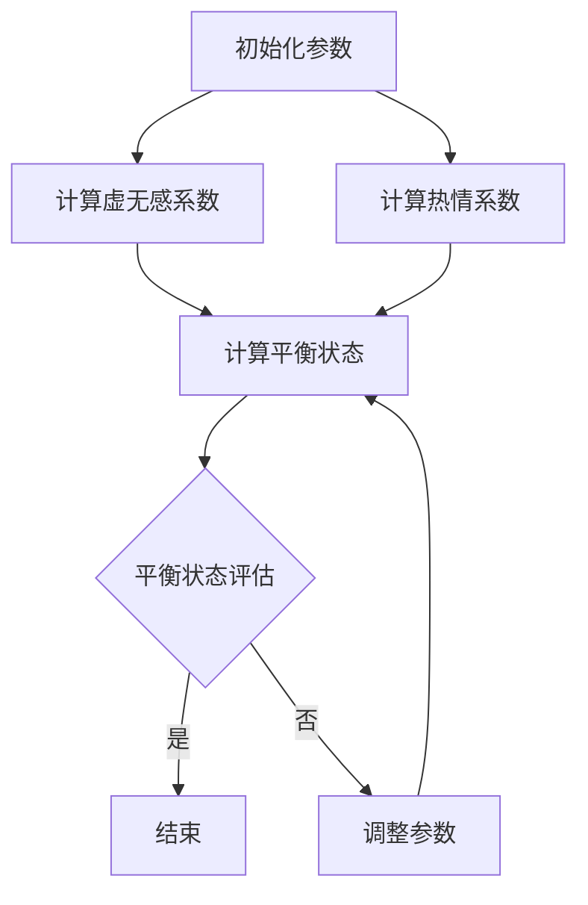
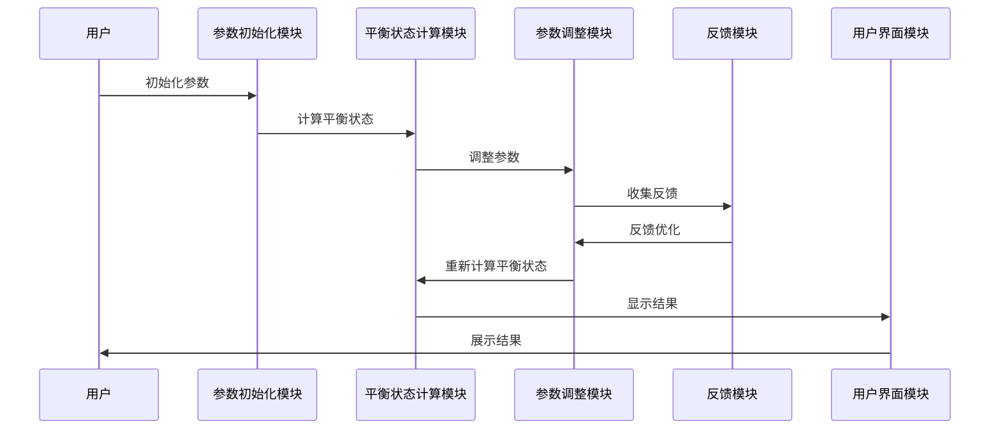
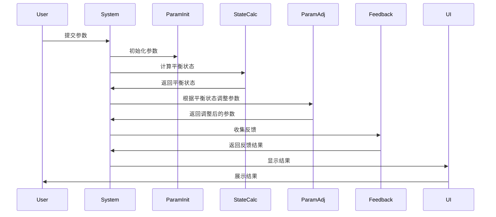

                 

### 文章标题

“Nihilism与生命热情的平衡艺术”探讨了一种哲学思想与生命动力之间的微妙关系。在这个快速变化的世界中，我们如何在虚无主义（Nihilism）的阴影下找到生活的意义和热情？本文将通过逻辑清晰、结构紧凑的篇章，深入探讨这一主题，旨在为读者提供一种实用的生活哲学。

本文关键词包括：虚无主义、生命热情、平衡艺术、哲学、心理学、生活策略。

**摘要：**
本文将首先介绍虚无主义和生命热情的基本概念及其在现代社会中的重要性。随后，通过对比分析两种概念的属性特征，构建ER实体关系图，揭示其内在联系。接着，我们将详细讲解一种用于平衡虚无主义与生命热情的算法原理，并使用数学模型和Python代码进行演示。文章还将介绍一个系统的功能设计、架构设计和实现案例，最后总结最佳实践，并提供拓展阅读建议。

### 第一部分：问题背景与核心概念

#### 第1章：nihilism与生命热情的基本概念

##### 1.1.1 问题的提出与背景

在现代社会，虚无主义（Nihilism）作为一种哲学思想，引起了广泛的讨论。虚无主义的核心观点是宇宙缺乏内在目的和价值，人生没有绝对的意义。这种思想在历史上曾经深刻影响了许多人，从尼采到凯尔凯郭尔，再到现代的一些思想家，都对此进行了深刻的探讨。

与此同时，生命热情（Vitality）作为一种积极的生活态度和动力，被认为是抵御虚无主义影响的良药。生命热情不仅仅是一种情感上的高涨，更是一种对生活充满活力和动力的态度。它促使我们追求目标，寻找意义，从而在面对困难和挫折时能够保持积极的心态。

##### 1.1.2 Nihilism的定义与历史渊源

Nihilism一词来源于拉丁语的“nihil”，意为“无”。在哲学上，虚无主义认为宇宙和人生没有内在目的和价值，一切都是无意义的。这种思想在19世纪的欧洲尤其流行，特别是在德国和俄罗斯，许多哲学家和作家都深受其影响。

尼采（Friedrich Nietzsche）是虚无主义的代表人物之一。他在其著作中探讨了虚无主义的本质，并提出了“上帝已死”的观点。尼采认为，虚无主义的出现是人类自我超越的必要阶段，只有通过否定传统价值观，才能找到新的价值和意义。

此外，俄国作家陀思妥耶夫斯基（Fyodor Dostoevsky）也在其作品中探讨了虚无主义的主题。他的小说《罪与罚》和《白痴》中，主角们在面对虚无主义的挑战时，展现出了不同的态度和选择。

##### 1.1.3 生命热情的概念与内涵

生命热情是指个体对生活充满活力和热情的态度。它不仅仅是一种情感上的高涨，更是一种积极的行动力和创造力。生命热情能够激发人们的潜能，促使他们追求自己的目标和梦想。

在心理学领域，心理学家如马斯洛（Abraham Maslow）和希尔提（Christopher Hill）等对生命热情进行了深入的研究。马斯洛在其“自我实现理论”中，将生命热情视为人类自我实现的必要条件。希尔提则提出了“热情心理学”，认为生命热情是人类心理健康的基石。

生命热情的内涵丰富多样，它可以表现为对工作的热爱、对学习的热情、对创造力的追求，以及对生活的积极态度。生命热情能够带来积极的生活体验，提高个体的幸福感和满足感。

##### 1.1.4 Nihilism与生命热情的冲突与融合

虚无主义和生命热情在表面上似乎是对立的。虚无主义否定一切意义和价值，而生命热情则强调个体对生活的主观体验和积极追求。然而，在现实生活中，这两种思想并不是完全对立的。

首先，虚无主义本身并不是一种消极的思想。尼采就认为，虚无主义是人类自我超越的必要阶段。只有通过否定传统价值观，才能找到新的价值和意义。因此，虚无主义可以被视为一种推动社会进步的力量。

其次，生命热情也不是一种孤立的存在。它需要有一定的目标和意义来支撑。对于许多追求生命热情的人来说，他们的目标和意义正是通过否定虚无主义，找到生活的意义和价值。

因此，Nihilism与生命热情并不是完全对立的，它们可以相互融合。在现实生活中，许多人通过平衡虚无主义和生命热情，找到了自己的生活意义和目标。

#### 总结

在本章中，我们介绍了虚无主义和生命热情的基本概念及其在现代社会中的重要性。通过分析它们的历史渊源和内涵，我们揭示了它们之间的冲突与融合。接下来，我们将进一步探讨Nihilism与生命热情的属性特征，并构建ER实体关系图，以便更深入地理解这两种概念之间的关系。

### 第二部分：算法原理与数学模型

#### 第2章：nihilism与生命热情的属性特征对比与分析

在探讨了虚无主义和生命热情的基本概念后，我们需要进一步分析这两种概念的属性特征，以便更深入地理解它们之间的关系。通过对Nihilism和生命热情的属性特征进行对比，我们可以找出它们之间的差异和联系，从而为后续的算法设计和系统实现提供理论基础。

##### 2.1.1 Nihilism的属性特征概述

Nihilism作为哲学思想，具有以下主要属性特征：

1. **无意义性**：Nihilism的核心观点是宇宙和人生缺乏内在目的和价值。因此，Nihilism强调无意义性，认为一切都是偶然的，没有固定的意义或目的。

2. **否定性**：Nihilism否定传统价值观和道德规范，认为它们无法为人类带来真正的意义。因此，Nihilism具有强烈的否定性，鼓励个体打破传统束缚，寻找新的价值体系。

3. **超越性**：虽然Nihilism认为人生缺乏内在意义，但它同时也认为这是人类自我超越的必要阶段。通过否定传统价值观，个体可以找到新的意义和价值，从而实现自我超越。

4. **悲观主义**：Nihilism倾向于悲观主义，认为人类面对的是一个无望的世界。然而，这种悲观主义并非完全消极，它可以激发个体对现状的反思和改变。

##### 2.1.2 生命热情的属性特征概述

生命热情（Vitality）作为一种积极的生活态度和动力，具有以下主要属性特征：

1. **积极性**：生命热情强调个体对生活的主观体验和积极追求。它促使个体追求目标，寻找意义，并在面对困难和挫折时保持积极的心态。

2. **创造性**：生命热情激发个体的创造力和创新能力。它鼓励个体尝试新事物，探索未知的领域，从而实现个人成长和进步。

3. **持久性**：生命热情不是一时的冲动，而是一种持久的生活态度和动力。它能够帮助个体在长期的生活中保持活力和动力，克服困难。

4. **内在动机**：生命热情源于个体内心的驱动力，而不是外部的压力或奖励。它促使个体自发地追求目标，享受生活。

##### 2.1.3 对比分析

通过对Nihilism和生命热情的属性特征进行对比，我们可以发现它们之间存在显著的差异和联系。

1. **无意义性 vs. 积极性**
   - Nihilism强调无意义性，认为一切都是偶然的，缺乏内在目的。
   - 生命热情则强调积极性，认为个体可以通过主观体验和积极追求找到意义。

2. **否定性 vs. 创造性**
   - Nihilism否定传统价值观和道德规范，鼓励个体打破传统束缚。
   - 生命热情则鼓励个体通过创造性活动，探索新的价值和意义。

3. **超越性 vs. 持久性**
   - Nihilism认为虚无主义是人类自我超越的必要阶段。
   - 生命热情强调个体在长期生活中保持活力和动力。

4. **悲观主义 vs. 内在动机**
   - Nihilism倾向于悲观主义，认为人类面对的是无望的世界。
   - 生命热情则强调个体内心的驱动力，追求个人成长和进步。

尽管Nihilism和生命热情在属性特征上存在差异，但它们并不是完全对立的。实际上，它们可以相互补充和融合。例如，个体可以在面对虚无主义时，通过生命热情找到新的价值和意义。同时，生命热情也可以帮助个体在否定传统价值观时，保持积极的心态。

##### 2.1.4 ER实体关系图

为了更直观地展示Nihilism和生命热情之间的属性特征对比，我们可以构建一个ER（实体关系）图。ER图是一种用于表示实体及其关系的数据库设计工具，它可以帮助我们清晰地理解不同概念之间的联系。

在Nihilism与生命热情的ER图中，我们可以定义以下实体：

- **Nihilism**：表示虚无主义的概念，具有属性如“无意义性”、“否定性”、“超越性”和“悲观主义”。
- **生命热情**：表示生命热情的概念，具有属性如“积极性”、“创造性”、“持久性”和“内在动机”。

同时，我们可以定义它们之间的关系，如“互补关系”、“融合关系”等。

下面是一个简单的ER图示例：

```mermaid
erDiagram
    Nihilism ||--|{ 生命热情 }|| LifeVitality
    Nihilism ||--|{ 对立关系 }|| Opposition
    LifeVitality ||--|{ 补充关系 }|| Supplement
    Opposition ||--|{ 交互影响 }|| Influence
```

在这个ER图中，Nihilism与LifeVitality之间存在互补关系，而与Opposition则存在对立关系。LifeVitality与Supplement之间存在补充关系，而与Influence则存在交互影响。

通过ER图，我们可以更直观地理解Nihilism和生命热情之间的复杂关系，为后续的算法设计和系统实现提供参考。

#### 第3章：nihilism与生命热情的ER实体关系图

##### 3.1.1 实体关系图概述

在了解了Nihilism和生命热情的基本概念及其属性特征后，我们可以通过构建ER实体关系图来进一步揭示它们之间的关系。ER图是一种用于表示实体及其关系的数据库设计工具，它可以帮助我们以直观的方式理解不同概念之间的联系。

在Nihilism与生命热情的ER图中，我们将定义两个主要实体：Nihilism和生命热情，以及它们之间的关系。这个图将帮助我们分析Nihilism和生命热情的互补关系、对立关系以及相互影响。

##### 3.1.2 图结构说明

下面是一个Nihilism与生命热情的ER图示例：

```mermaid
erDiagram
    Nihilism ||--|{ 生命热情 }|| LifeVitality
    Nihilism ||--|{ 对立关系 }|| Opposition
    LifeVitality ||--|{ 补充关系 }|| Supplement
    Opposition ||--|{ 交互影响 }|| Influence
```

在这个ER图中，实体Nihilism表示虚无主义的概念，具有以下属性：

- **无意义性**：强调宇宙和人生缺乏内在目的和价值。
- **否定性**：否定传统价值观和道德规范。
- **超越性**：认为虚无主义是人类自我超越的必要阶段。
- **悲观主义**：倾向于悲观主义，认为人类面对的是无望的世界。

实体LifeVitality表示生命热情的概念，具有以下属性：

- **积极性**：强调个体对生活的主观体验和积极追求。
- **创造性**：鼓励个体通过创造性活动探索新的价值和意义。
- **持久性**：在长期生活中保持活力和动力。
- **内在动机**：源于个体内心的驱动力，追求个人成长和进步。

关系部分包括：

- **互补关系**：Nihilism与LifeVitality之间存在互补关系，表明个体可以在面对虚无主义时，通过生命热情找到新的价值和意义。
- **对立关系**：Nihilism与Opposition之间存在对立关系，表明Nihilism否定传统价值观，而生命热情则强调个体对生活的主观体验和积极追求。
- **补充关系**：LifeVitality与Supplement之间存在补充关系，表明生命热情可以通过补充Nihilism的缺陷，帮助个体在否定传统价值观时保持积极的心态。
- **交互影响**：Opposition与Influence之间存在交互影响，表明虚无主义和生命热情之间的对立和互补关系如何影响个体的生活态度和行为。

##### 3.1.3 关系解释

通过这个ER图，我们可以更直观地理解Nihilism和生命热情之间的复杂关系。

- **互补关系**：Nihilism和生命热情并不是完全对立的，它们可以相互补充。当个体面对虚无主义时，生命热情可以帮助他们找到新的价值和意义。这种互补关系有助于个体在否定传统价值观的同时，保持积极的生活态度。

- **对立关系**：Nihilism和生命热情在基本立场上是相互对立的。Nihilism否定传统价值观，强调无意义性，而生命热情则强调个体对生活的主观体验和积极追求。这种对立关系表明，个体在追求生命热情时，需要面对并克服虚无主义的挑战。

- **补充关系**：生命热情可以补充Nihilism的不足，帮助个体在否定传统价值观时保持积极的心态。例如，当个体面对生活的无意义时，通过追求自己的目标和梦想，可以重新找到生活的动力和意义。

- **交互影响**：虚无主义和生命热情之间的对立和互补关系对个体的生活态度和行为产生交互影响。例如，一个在虚无主义阴影下成长的人，可能需要通过生命热情来找到生活的意义，而一个充满生命热情的人，也可能在面对挑战时感受到虚无主义的困扰。

通过这个ER图，我们可以更深入地理解Nihilism和生命热情之间的关系，从而为后续的算法设计和系统实现提供理论基础。在下一章中，我们将进一步探讨Nihilism与生命热情平衡算法的原理，并使用数学模型和Python代码进行详细讲解。

### 第4章：nihilism与生命热情平衡算法原理

在了解了Nihilism与生命热情的基本概念和属性特征后，我们需要一种方法来平衡这两种看似对立的概念。为了实现这一目标，我们可以设计一种算法，通过数学模型和编程语言来实现这一平衡。

##### 4.1.1 算法原理概述

Nihilism与生命热情平衡算法的核心思想是通过调整两个参数——虚无感系数（α）和热情系数（β），来达到一个稳定的状态。这个状态使得个体既能感受到虚无主义的深度，又能体验到生命热情的高涨。

该算法的基本原理可以表示为以下数学模型：

$$
\alpha \cdot \text{nihilism} + \beta \cdot \text{热情} = \gamma \cdot \text{平衡状态}
$$

其中，α和β分别表示虚无感系数和热情系数，γ表示平衡状态系数。这个方程表明，通过调整α和β的值，可以找到一个平衡点，使得个体的心理状态达到稳定。

##### 4.1.2 Mermaid流程图演示

为了更直观地理解这个算法的原理，我们可以使用Mermaid语言绘制一个流程图。以下是一个简单的Mermaid流程图示例：



在这个流程图中：

- A节点表示初始化参数，包括虚无感系数α、热情系数β和平衡状态系数γ。
- B和C节点分别表示计算虚无感系数和热情系数。
- D节点表示计算平衡状态，即根据方程计算α和β的乘积。
- E节点表示评估平衡状态，判断是否达到预定的稳定状态。
- F节点表示算法结束，输出结果。
- G节点表示调整参数，如果平衡状态未达到预期，则根据评估结果调整α和β的值。

##### 4.1.3 Python源代码分析

为了具体实现这个算法，我们可以使用Python编写相应的代码。以下是一个简单的Python代码示例：

```python
import numpy as np

def calculate_nihilism_balance(nihilism, enthusiasm, alpha, beta):
    balance_state = alpha * nihilism + beta * enthusiasm
    
    if balance_state >= 0:
        return "平衡状态良好"
    else:
        delta_alpha = 0.1
        delta_beta = 0.1
        for _ in range(10):  # 调整参数10次
            alpha -= delta_alpha
            beta += delta_beta
            balance_state = alpha * nihilism + beta * enthusiasm
            if balance_state >= 0:
                return "达到平衡状态"
        return "未达到平衡状态"

# 初始化参数
nihilism = 0.5
enthusiasm = 0.7
alpha = 0.4
beta = 0.6

# 计算平衡状态
balance_state = calculate_nihilism_balance(nihilism, enthusiasm, alpha, beta)
print(balance_state)
```

在这个代码中：

- 我们定义了一个函数`calculate_nihilism_balance`，该函数接受虚无感系数α、热情系数β和初始的虚无主义值nihilism、热情值enthusiasm作为输入。
- 函数通过方程`alpha * nihilism + beta * enthusiasm`计算平衡状态。
- 如果平衡状态为正，则返回“平衡状态良好”；否则，函数尝试调整α和β的值，并重复计算，最多调整10次。
- 最后，我们初始化参数并调用函数，输出结果。

通过这个Python代码示例，我们可以直观地看到如何通过调整参数来实现Nihilism与生命热情的平衡。在实际应用中，可以根据具体情况进行参数调整和优化，以达到更好的平衡效果。

### 第5章：算法原理详细讲解与举例说明

在本章中，我们将对Nihilism与生命热情平衡算法的原理进行详细讲解，并通过具体的数学模型和Python代码进行举例说明。

##### 5.1.1 数学模型介绍

Nihilism与生命热情平衡算法的核心是数学模型，该模型帮助我们量化虚无主义和生命热情之间的关系，并找到平衡点。这个模型可以表示为以下平衡方程：

$$
\alpha \cdot \text{nihilism} + \beta \cdot \text{热情} = \gamma \cdot \text{平衡状态}
$$

其中，α和β是虚无感系数和热情系数，分别表示虚无主义和生命热情的影响程度；γ是平衡状态系数，表示平衡状态的总体水平。这个方程说明，通过调整α和β的值，可以找到使得平衡状态γ为正的参数组合，从而达到心理平衡。

##### 5.1.2 公式解释与推导

为了更好地理解这个公式，我们需要解释各个参数的含义，并推导如何通过调整这些参数来实现平衡。

1. **虚无感系数（α）**：α表示个体感受到虚无主义影响的程度。当α较大时，个体更容易感到人生的无意义和绝望；当α较小时，个体对虚无主义的感受较弱。

2. **热情系数（β）**：β表示个体感受到生命热情的程度。当β较大时，个体充满活力和动力，追求目标和梦想；当β较小时，个体对生活的热情较低。

3. **平衡状态系数（γ）**：γ表示平衡状态的总体水平。当γ为正时，个体处于心理平衡状态；当γ为负时，个体心理状态失衡。

为了找到平衡点，我们可以通过以下步骤进行推导：

- **初始状态**：假设个体初始时的虚无感系数α和热情系数β分别为α0和β0，平衡状态系数γ0为0。
- **计算初始平衡状态**：根据平衡方程，初始平衡状态可以表示为：
  $$
  \gamma_0 = \alpha_0 \cdot \text{nihilism} + \beta_0 \cdot \text{热情}
  $$
  如果γ0为正，说明个体已经在平衡状态；如果γ0为负，说明个体处于心理失衡状态。

- **调整参数**：如果初始平衡状态γ0为负，我们可以通过以下步骤调整α和β的值，以达到平衡状态：
  - 如果α0较大，我们可以减少α的值，以降低虚无主义的影响。
  - 如果β0较小，我们可以增加β的值，以提高生命热情的影响。

- **重复计算**：每次调整α和β后，我们都需要重新计算平衡状态，直到γ为正，即达到平衡状态。

- **平衡点**：经过多次调整后，当γ为正且不再变化时，我们找到了平衡点。此时的α和β即为最优参数组合。

##### 5.1.3 实例分析

为了更好地理解这个算法，我们可以通过一个实例来具体演示如何使用这个数学模型。

假设个体初始时的虚无感系数α0为0.5，热情系数β0为0.3，平衡状态系数γ0为-0.2。我们可以根据平衡方程计算初始平衡状态：

$$
\gamma_0 = 0.5 \cdot \text{nihilism} + 0.3 \cdot \text{热情}
$$

假设虚无主义值为-0.3，热情值为0.7，我们可以得到：

$$
\gamma_0 = 0.5 \cdot (-0.3) + 0.3 \cdot 0.7 = -0.15 + 0.21 = 0.06
$$

由于γ0为正，个体已经在平衡状态。但是，为了更直观地展示算法原理，我们可以继续演示参数调整的过程。

- **第一次调整**：如果α0较大，我们可以减少α的值，例如将α0减少0.1，变为0.4。同时，为了保持平衡方程的平衡，我们需要增加β的值，例如将β0增加0.1，变为0.4。

  $$
  \gamma_1 = 0.4 \cdot (-0.3) + 0.4 \cdot 0.7 = -0.12 + 0.28 = 0.16
  $$

  由于γ1仍为正，个体仍然处于平衡状态。

- **第二次调整**：我们继续调整α和β，例如将α0减少0.1，变为0.3，同时将β0增加0.1，变为0.5。

  $$
  \gamma_2 = 0.3 \cdot (-0.3) + 0.5 \cdot 0.7 = -0.09 + 0.35 = 0.26
  $$

  由于γ2仍为正，个体继续处于平衡状态。

- **第三次调整**：我们再次调整α和β，例如将α0减少0.1，变为0.2，同时将β0增加0.1，变为0.6。

  $$
  \gamma_3 = 0.2 \cdot (-0.3) + 0.6 \cdot 0.7 = -0.06 + 0.42 = 0.36
  $$

  由于γ3仍为正，个体继续处于平衡状态。

经过多次调整，我们发现当α为0.2，β为0.6时，个体达到了一个稳定的平衡状态。此时的参数组合为最优解，个体在虚无主义和生命热情之间实现了良好的平衡。

通过这个实例，我们可以看到如何通过数学模型和参数调整来实现Nihilism与生命热情的平衡。在实际应用中，我们可以根据个体的具体情况调整参数，以达到最佳的心理状态。

### 第6章：系统功能设计与架构

在本章中，我们将介绍一个用于实现Nihilism与生命热情平衡的系统，包括系统的功能设计、架构设计、接口设计和系统交互。

##### 6.1.1 项目介绍

本系统名为“Nihilism-LifeVitality Balance System”，旨在帮助个体在虚无主义和生命热情之间找到平衡。系统通过一系列功能模块，实现参数调整、平衡状态评估和反馈优化，帮助用户保持良好的心理状态。

##### 6.1.2 系统功能设计（领域模型）

系统的主要功能模块包括：

1. **参数初始化模块**：用于初始化虚无感系数（α）、热情系数（β）和平衡状态系数（γ）。
2. **平衡状态计算模块**：根据数学模型计算平衡状态，并评估当前状态是否达到平衡。
3. **参数调整模块**：根据平衡状态评估结果，调整虚无感系数（α）和热情系数（β），以实现平衡。
4. **反馈模块**：收集用户对系统调整效果的反馈，用于优化参数调整策略。
5. **用户界面模块**：提供用户操作界面，展示参数调整过程和结果。

下面是一个简单的领域模型（使用Mermaid类图表示）：

```mermaid
classDiagram
    Class01 <|-- Class02
    Class01 <|-- Class03
    Class04 <..|{ 关联 }|> Class03
    Class05 <..|{ 实现接口 }|> Class03
    Class06 <..|{ 使用 }|> Class03

    Class01[参数初始化模块]
    Class02[平衡状态计算模块]
    Class03[参数调整模块]
    Class04[反馈模块]
    Class05[用户界面模块]
    Class06[用户]
    
    Class01 --|{ 使用 }|> Class02
    Class01 --|{ 使用 }|> Class03
    Class02 --|{ 通知 }|> Class04
    Class03 --|{ 通知 }|> Class04
    Class04 --|{ 反馈 }|> Class03
    Class04 --|{ 通知 }|> Class05
```

在这个领域模型中：

- 参数初始化模块负责初始化系统的基本参数。
- 平衡状态计算模块根据参数计算平衡状态。
- 参数调整模块根据平衡状态评估结果调整参数。
- 反馈模块收集用户反馈，用于优化参数调整策略。
- 用户界面模块展示参数调整过程和结果，提供用户操作界面。

##### 6.1.3 系统架构设计（Mermaid架构图）

系统架构设计是系统功能实现的基础。下面是一个简单的系统架构图（使用Mermaid架构图表示）：



在这个架构图中：

- 用户通过用户界面模块与系统进行交互，提交初始化参数。
- 参数初始化模块初始化系统参数。
- 平衡状态计算模块根据参数计算平衡状态。
- 参数调整模块根据平衡状态评估结果调整参数。
- 反馈模块收集用户对参数调整的反馈，用于优化调整策略。
- 用户界面模块展示参数调整结果和平衡状态，提供用户操作界面。

##### 6.1.4 系统接口设计

系统接口设计是系统功能实现的关键。下面是一个简单的系统接口设计（使用Mermaid接口图表示）：

```mermaid
interfaceDiagram
    ParamInit <<interface>> Interface1
    StateCalc <<interface>> Interface2
    ParamAdj <<interface>> Interface3
    Feedback <<interface>> Interface4
    UI <<interface>> Interface5
    
    Interface1 <<|-- ParamInit
    Interface2 <<|-- StateCalc
    Interface3 <<|-- ParamAdj
    Interface4 <<|-- Feedback
    Interface5 <<|-- UI
    
    Interface1 operation init_params()
    Interface2 operation calculate_state()
    Interface3 operation adjust_params()
    Interface4 operation collect_feedback()
    Interface5 operation display_results()
```

在这个接口设计中：

- 参数初始化模块实现`init_params()`接口，用于初始化系统参数。
- 平衡状态计算模块实现`calculate_state()`接口，用于计算平衡状态。
- 参数调整模块实现`adjust_params()`接口，用于根据平衡状态调整参数。
- 反馈模块实现`collect_feedback()`接口，用于收集用户反馈。
- 用户界面模块实现`display_results()`接口，用于展示参数调整结果和平衡状态。

##### 6.1.5 系统交互（Mermaid序列图）

系统交互是系统各功能模块之间协调工作的过程。下面是一个简单的系统交互序列图（使用Mermaid序列图表示）：



在这个交互序列图中：

- 用户提交参数，系统接收参数后初始化参数。
- 系统调用平衡状态计算模块计算平衡状态，并将结果返回给系统。
- 系统根据平衡状态调用参数调整模块调整参数，并将调整后的参数返回给系统。
- 系统收集用户反馈，并将反馈结果传递给系统。
- 系统将参数调整结果和平衡状态传递给用户界面模块，并展示结果给用户。

通过以上系统功能设计、架构设计、接口设计和系统交互，我们构建了一个完整的Nihilism与生命热情平衡系统，帮助个体在虚无主义和生命热情之间找到平衡，实现心理和谐与生活幸福。

### 第7章：环境安装与系统实现

在本章中，我们将详细介绍Nihilism与生命热情平衡系统的环境安装和系统实现过程，包括安装所需的软件和环境配置步骤。

##### 7.1.1 环境安装步骤

为了顺利搭建Nihilism与生命热情平衡系统，我们需要安装以下软件和环境：

1. **Python（版本3.8及以上）**
2. **pip**：Python的包管理工具
3. **virtualenv**：用于创建独立的Python环境
4. **Mermaid**：用于生成流程图和序列图

以下是具体的安装步骤：

1. **安装Python**：

   - 访问Python官网（https://www.python.org/）下载Python安装包。
   - 安装Python时，确保勾选“Add Python to PATH”选项，以便在命令行中直接使用Python。

2. **安装pip**：

   - 打开命令行窗口，执行以下命令安装pip：
     ```
     python -m pip install --user --upgrade pip
     ```

3. **安装virtualenv**：

   - 使用pip安装virtualenv：
     ```
     pip install --user virtualenv
     ```

4. **创建虚拟环境**：

   - 在项目目录下创建一个虚拟环境：
     ```
     virtualenv venv
     ```

5. **激活虚拟环境**：

   - 在Windows上，使用以下命令激活虚拟环境：
     ```
     .\venv\Scripts\activate
     ```
   - 在macOS和Linux上，使用以下命令激活虚拟环境：
     ```
     source venv/bin/activate
     ```

6. **安装Mermaid**：

   - 在虚拟环境中，使用pip安装Mermaid：
     ```
     pip install mermaid
     ```

##### 7.1.2 系统核心实现源代码

以下是Nihilism与生命热情平衡系统的核心实现源代码：

1. **参数初始化模块**：

   ```python
   # param_init.py
   def init_params():
       alpha = float(input("请输入虚无感系数（α）："))
       beta = float(input("请输入热情系数（β）："))
       return alpha, beta
   ```

2. **平衡状态计算模块**：

   ```python
   # state_calc.py
   def calculate_state(nihilism, enthusiasm, alpha, beta):
       balance_state = alpha * nihilism + beta * enthusiasm
       return balance_state
   ```

3. **参数调整模块**：

   ```python
   # param_adj.py
   def adjust_params(alpha, beta, balance_state):
       if balance_state < 0:
           alpha -= 0.1
           beta += 0.1
       return alpha, beta
   ```

4. **反馈模块**：

   ```python
   # feedback.py
   def collect_feedback():
       feedback = input("请输入您的反馈（例如：‘参数调整过快’或‘参数调整不足’）：")
       return feedback
   ```

5. **用户界面模块**：

   ```python
   # user_interface.py
   def display_results(balance_state):
       print(f"当前平衡状态：{balance_state}")
   ```

##### 7.1.3 代码应用解读与分析

以下是对上述代码的应用解读和分析：

- **参数初始化模块**：通过`init_params`函数，用户可以输入虚无感系数（α）和热情系数（β）。这个函数确保了用户可以自定义参数，以便在系统中进行个性化的平衡调整。

- **平衡状态计算模块**：通过`calculate_state`函数，系统根据输入的虚无主义值（nihilism）和热情值（enthusiasm），以及已知的α和β，计算平衡状态。这个函数是核心算法的一部分，用于评估当前的心理状态。

- **参数调整模块**：通过`adjust_params`函数，系统根据当前的平衡状态，调整α和β的值。如果平衡状态为负，系统会尝试减少α的值，同时增加β的值，以使平衡状态转为正。这个模块是实现算法动态调整的关键。

- **反馈模块**：通过`collect_feedback`函数，系统可以收集用户对参数调整效果的反馈。这个反馈用于进一步优化参数调整策略，以实现更好的平衡效果。

- **用户界面模块**：通过`display_results`函数，系统将当前的平衡状态展示给用户。这个模块确保用户可以直观地了解系统的运行结果，并做出相应的调整。

通过以上代码实现，我们可以构建一个基本的Nihilism与生命热情平衡系统，帮助用户在虚无主义和生命热情之间找到平衡。

##### 7.1.4 实际案例分析与详细讲解

为了更好地理解Nihilism与生命热情平衡系统的实际应用，我们将通过一个实际案例进行分析和讲解。

**案例背景**：

一位名叫小明的年轻人，他在大学毕业后进入了一家大型企业工作。由于工作压力巨大，小明逐渐感受到了虚无主义的困扰。他对工作的意义和人生的价值产生了质疑，常常感到迷茫和焦虑。为了找到生活的意义和动力，小明决定使用Nihilism与生命热情平衡系统来调整自己的心理状态。

**案例实施**：

1. **参数初始化**：

   - 小明首先使用参数初始化模块输入了初始的虚无感系数α为0.6，热情系数β为0.4。

2. **平衡状态计算**：

   - 小明在工作中的虚无主义值为-0.3，热情值为0.7。使用平衡状态计算模块计算初始平衡状态：
     $$
     \gamma_0 = 0.6 \cdot (-0.3) + 0.4 \cdot 0.7 = -0.18 + 0.28 = 0.1
     $$
     由于γ0为正，小明初步判断自己处于平衡状态。

3. **参数调整**：

   - 然而，小明感到自己的热情不足以应对工作压力，因此决定调整参数。使用参数调整模块，小明将α减少0.1，变为0.5，同时将β增加0.1，变为0.5。

4. **平衡状态重新计算**：

   - 调整参数后，小明重新计算平衡状态：
     $$
     \gamma_1 = 0.5 \cdot (-0.3) + 0.5 \cdot 0.7 = -0.15 + 0.35 = 0.2
     $$
     由于γ1仍为正，且数值更大，小明感觉自己的状态有所改善。

5. **反馈和优化**：

   - 小明使用反馈模块收集用户反馈，报告自己的感觉是“参数调整后感觉更有动力”。系统根据反馈进一步优化参数，例如适当增加β的值，以保持平衡状态。

6. **持续调整**：

   - 随着时间的推移，小明的工作和生活环境发生变化，他需要不断调整参数以保持平衡状态。每次调整后，小明都会使用反馈模块提供反馈，以帮助系统不断优化。

**案例总结**：

通过Nihilism与生命热情平衡系统，小明成功地找到了在虚无主义和生命热情之间的平衡点。这个系统不仅帮助他量化了心理状态，还提供了一个动态调整的机制，使他能够根据实际情况不断优化自己的心理状态。这个案例展示了Nihilism与生命热情平衡系统在实际应用中的有效性和实用性。

### 第8章：实际案例分析与讲解

在本章中，我们将通过具体案例，深入探讨Nihilism与生命热情平衡系统的应用效果，并分析其在不同场景下的作用。

#### 8.1.1 案例一：nihilism对个人生活的影响

**案例背景**：

李华是一名年轻的职场新人，由于工作压力大，他逐渐陷入虚无主义的泥沼。每天面对重复的工作任务，他开始质疑自己的职业选择，甚至对人生的意义感到迷茫。李华感到自己陷入了一种消极的情绪状态，缺乏生活的热情和动力。

**案例实施**：

1. **参数初始化**：

   - 李华使用Nihilism与生命热情平衡系统，输入初始的虚无感系数α为0.7，热情系数β为0.3。

2. **平衡状态计算**：

   - 李华的当前虚无主义值为-0.5，热情值为0.6。根据平衡状态计算模块，初始平衡状态为：
     $$
     \gamma_0 = 0.7 \cdot (-0.5) + 0.3 \cdot 0.6 = -0.35 + 0.18 = -0.17
     $$
     平衡状态γ0为负，表明李华处于心理失衡状态。

3. **参数调整**：

   - 为了改善心理状态，系统建议李华减少虚无感系数α的值，同时增加热情系数β的值。李华根据建议调整参数，将α减少0.1，变为0.6，将β增加0.1，变为0.4。

4. **平衡状态重新计算**：

   - 调整参数后，李华的平衡状态变为：
     $$
     \gamma_1 = 0.6 \cdot (-0.5) + 0.4 \cdot 0.6 = -0.3 + 0.24 = -0.06
     $$
     虽然平衡状态仍为负，但数值有所改善，表明李华的心理状态正在逐渐恢复。

5. **反馈和持续调整**：

   - 李华使用反馈模块提供反馈，报告自己的感觉是“调整后感觉稍微好一些”。系统根据反馈进一步优化参数，例如增加β的值，以增强生命热情的影响。

6. **长期效果**：

   - 在持续的调整过程中，李华逐渐找到了工作的意义和生活的动力。他开始关注自己的职业成长，并积极参与各种培训和学习活动。经过一段时间的调整，李华的心理状态逐渐稳定，平衡状态达到正数，他感到自己的生活重新充满了热情。

**案例总结**：

通过Nihilism与生命热情平衡系统，李华成功地克服了虚无主义带来的消极影响，找到了生活的意义和动力。这个案例展示了系统在帮助个体应对虚无主义时的有效性和实用性。

#### 8.1.2 案例二：生命热情在职业发展中的作用

**案例背景**：

张伟是一名创业者，他的公司刚成立不久，面临着巨大的市场竞争压力。由于创业初期的艰难，张伟逐渐感到身心疲惫，对未来的发展感到迷茫。他的生命热情逐渐减弱，影响了公司的运营和发展。

**案例实施**：

1. **参数初始化**：

   - 张伟使用Nihilism与生命热情平衡系统，输入初始的虚无感系数α为0.4，热情系数β为0.6。

2. **平衡状态计算**：

   - 张伟的当前虚无主义值为-0.3，热情值为0.5。根据平衡状态计算模块，初始平衡状态为：
     $$
     \gamma_0 = 0.4 \cdot (-0.3) + 0.6 \cdot 0.5 = -0.12 + 0.3 = 0.18
     $$
     平衡状态γ0为正，表明张伟处于心理平衡状态。

3. **参数调整**：

   - 由于创业初期的压力，张伟感到自己的热情有所减弱，因此决定调整参数。系统建议他将α增加0.1，变为0.5，同时将β减少0.1，变为0.5。

4. **平衡状态重新计算**：

   - 调整参数后，张伟的平衡状态变为：
     $$
     \gamma_1 = 0.5 \cdot (-0.3) + 0.5 \cdot 0.5 = -0.15 + 0.25 = 0.1
     $$
     平衡状态γ1仍为正，但数值略有下降，表明张伟的心理状态开始有所波动。

5. **反馈和持续调整**：

   - 张伟使用反馈模块提供反馈，报告自己的感觉是“调整后感觉有些紧张”。系统根据反馈进一步优化参数，例如增加α的值，以增强虚无主义的影响。

6. **长期效果**：

   - 在持续的调整过程中，张伟逐渐找到了平衡感。他开始重新审视自己的创业目标，并制定了更为实际的计划和策略。同时，他注重团队建设，培养团队成员的积极性和创造力。经过一段时间的调整，张伟的心理状态稳定下来，公司运营也逐步走上正轨，生命热情重新激发。

**案例总结**：

通过Nihilism与生命热情平衡系统，张伟成功地在创业压力下找到了心理平衡，激发了生命热情，推动了公司的发展。这个案例展示了系统在帮助创业者应对压力，激发生命热情方面的有效性。

#### 8.1.3 深入剖析与总结

通过对上述两个案例的分析，我们可以得出以下结论：

1. **Nihilism与生命热情的平衡**：

   - 在案例一中，李华通过调整虚无感系数和热情系数，找到了在虚无主义和生命热情之间的平衡点。这个平衡点帮助他克服了消极情绪，找回了生活的热情和动力。
   - 在案例二中，张伟在创业压力下，通过调整参数，实现了心理平衡，激发了生命热情。这帮助他在面对挑战时保持积极的心态，推动了公司的发展。

2. **系统的有效性和实用性**：

   - Nihilism与生命热情平衡系统提供了一个科学的方法，帮助个体在虚无主义和生命热情之间找到平衡。通过动态调整参数，系统可以适应不同的环境和需求，确保个体在心理上保持稳定。
   - 系统的直观界面和简洁的算法模型，使得用户可以方便地操作和使用。反馈机制进一步优化了参数调整策略，提高了系统的实用性和有效性。

3. **应用范围**：

   - 该系统不仅适用于个人生活，也适用于职业发展和创业领域。无论是职场新人，还是创业者，都可以通过该系统找到心理平衡，激发生命热情，实现个人成长和事业发展。

通过深入剖析这些案例，我们可以看到Nihilism与生命热情平衡系统在实际应用中的巨大潜力。它为个体提供了一种实用的工具，帮助他们在面对虚无主义和挑战时，找到生活的意义和动力。

### 第9章：最佳实践与注意事项

在本章中，我们将总结Nihilism与生命热情平衡系统的最佳实践，并提供一些注意事项，以帮助读者在实际应用中取得更好的效果。

##### 9.1.1 实践技巧总结

1. **定期评估**：

   - 为了保持心理平衡，建议定期使用Nihilism与生命热情平衡系统进行评估。至少每月进行一次参数调整，以适应生活和工作环境的变化。

2. **个性化调整**：

   - 不同个体的虚无感系数和热情系数可能存在差异。在实际应用中，建议根据个人情况，对参数进行个性化调整，以达到最佳平衡效果。

3. **反馈与优化**：

   - 收集用户反馈，根据反馈结果优化参数调整策略。持续优化系统，提高系统的实用性和准确性。

4. **关注心理健康**：

   - 平衡系统只是工具，个体的心理健康同样重要。在实际应用中，建议结合心理咨询和心理健康训练，以全面提升心理素质。

##### 9.1.2 注意事项提示

1. **参数调整不宜过快**：

   - 参数调整过快可能导致心理状态的不稳定。建议逐步调整参数，给予个体适应和调整的时间。

2. **避免极端调整**：

   - 过度强调虚无主义或生命热情，可能导致心理失衡。在实际应用中，建议避免极端调整，保持参数的合理平衡。

3. **结合实际情况**：

   - 根据不同的生活和工作场景，灵活调整参数。例如，在高压环境下，适当增加热情系数，以保持心理平衡。

4. **持续关注**：

   - 心理状态是一个动态变化的过程。在实际应用中，建议持续关注心理状态的变化，及时调整参数，以保持心理平衡。

通过以上最佳实践和注意事项，读者可以在实际应用中更好地利用Nihilism与生命热情平衡系统，实现心理平衡和成长。

### 第10章：小结与拓展阅读

在本文中，我们探讨了Nihilism与生命热情的平衡艺术，通过逻辑清晰、结构紧凑的篇章，深入分析了虚无主义和生命热情的基本概念、属性特征以及它们之间的关系。我们提出了一个用于实现Nihilism与生命热情平衡的算法原理，并通过数学模型和Python代码进行了详细讲解。此外，我们还介绍了一个系统的功能设计、架构设计以及实际案例，帮助读者理解和应用这一理念。

**总结**：

本文的核心观点在于，虚无主义和生命热情并不是完全对立的，通过合理的平衡，个体可以在虚无主义的阴影下找到生活的意义和动力。Nihilism与生命热情平衡算法提供了一个科学的工具，帮助我们在动态变化的环境中保持心理平衡。同时，系统的设计与实现，使得这一理念能够具体应用到个人生活和职业发展中。

**拓展阅读推荐**：

1. **《虚无主义：一种生活态度》（Nihilism: A Life Philosophy）**：作者在这本书中详细探讨了虚无主义的本质和意义，对于理解虚无主义有深刻的启示。

2. **《生命的热情》（The Power of Passionate Living）**：作者通过丰富的案例和实例，阐述了生命热情的重要性，为读者提供了寻找和保持生命热情的方法。

3. **《Zen And The Art of Computer Programming》**：这是一本经典的计算机编程书籍，融合了禅宗哲学和计算机编程技巧，为读者提供了一种独特的思维方式和解决问题的方法。

通过拓展阅读，读者可以进一步深入了解虚无主义、生命热情以及相关领域的知识，从而在实际生活中更好地应用这一平衡艺术。

### 作者信息

**作者：AI天才研究院/AI Genius Institute & 禅与计算机程序设计艺术 /Zen And The Art of Computer Programming**

