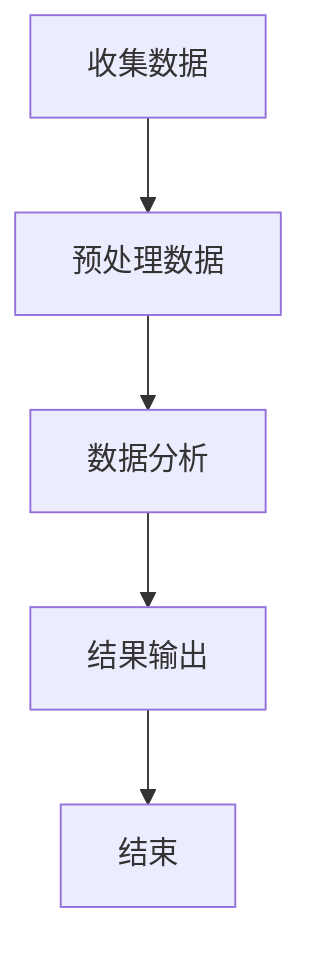
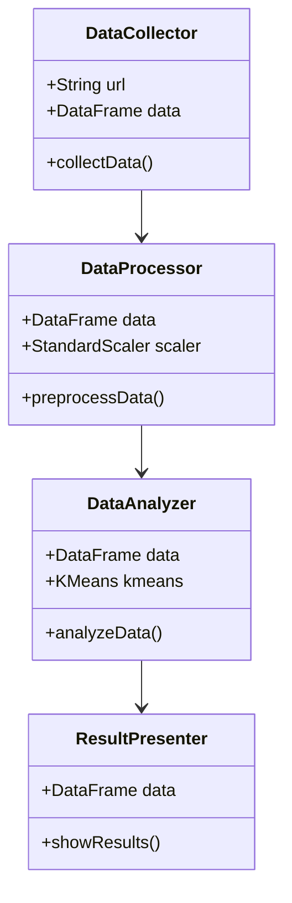
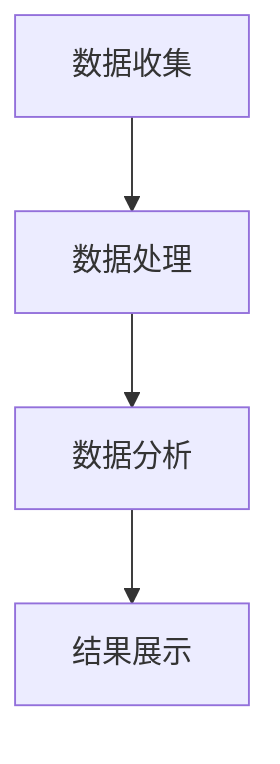
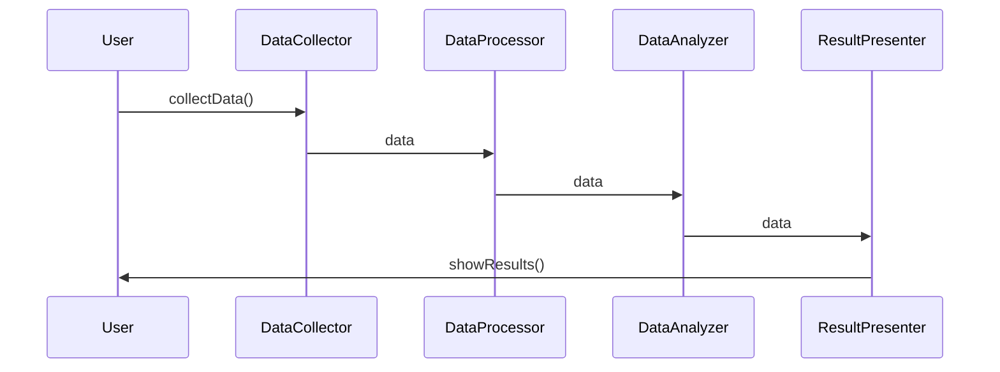

                 

# 世代差异：不同年龄群体的意义追寻

关键词：世代差异、年龄群体、意义追寻、价值观、生活目标

摘要：随着社会的发展，不同年龄群体之间的差异日益显著。本文旨在探讨不同年龄群体的意义追寻，包括他们的价值观、生活目标、人生意义等。通过对不同年龄群体的深入研究，揭示他们在意义追寻过程中的共性与差异，为跨代沟通和合作提供理论基础。

## 第一部分：引言

### 1.1 问题背景

随着全球化和互联网的快速发展，不同年龄群体之间的差异日益显著。年轻一代与年长一代在价值观、生活方式、教育背景、职业选择等方面存在较大的差异，这些差异导致了相互之间的沟通障碍和冲突。因此，有必要深入研究不同年龄群体的特点，以促进相互理解和和谐相处。

### 1.2 问题描述

本书旨在探讨不同年龄群体的意义追寻，包括他们的价值观、生活目标、人生意义等。通过对不同年龄群体的深入研究，揭示他们在意义追寻过程中的共性与差异，为跨代沟通和合作提供理论基础。

### 1.3 问题解决

本书采用实证研究和理论分析相结合的方法，通过调查问卷、访谈、案例分析等方式收集数据，对不同年龄群体的意义追寻进行深入探讨。同时，借鉴心理学、社会学等相关领域的理论，对研究结果进行解释和分析。

### 1.4 边界与外延

本书主要关注不同年龄群体的意义追寻，包括青少年、青年、中年和老年等。同时，本书也将探讨影响意义追寻的因素，如教育背景、职业状况、社会环境等。

### 1.5 概念结构与核心要素组成

- 不同年龄群体：青少年、青年、中年和老年等。
- 意义追寻：个体在人生过程中寻求生命价值和意义的过程。
- 价值观：个体对事物的评价标准和行为准则。
- 生活目标：个体追求的生活理想和追求方向。
- 人生意义：个体对生命意义的认识和追求。

## 第二部分：核心概念与联系

### 2.1 核心概念原理

#### 2.1.1 青少年群体的意义追寻

青少年群体的意义追寻主要体现在对自我认同、人际关系、未来发展等方面的关注。他们渴望独立，追求个性发展，同时对未来的不确定性感到担忧。

#### 2.1.2 青年群体的意义追寻

青年群体的意义追寻主要表现在对职业发展、社会地位、家庭责任等方面的追求。他们在努力实现个人价值的同时，也关注社会的发展和进步。

#### 2.1.3 中年群体的意义追寻

中年群体的意义追寻主要体现在对家庭、事业、个人成长等方面的关注。他们在承担家庭和事业责任的同时，也追求自我价值的实现。

#### 2.1.4 老年群体的意义追寻

老年群体的意义追寻主要表现在对健康、家庭、社交、精神生活等方面的关注。他们追求高质量的生活，希望晚年生活充实而有意义。

### 2.2 概念属性特征对比表格

| 年龄群体 | 意义追寻重点 | 关注因素 |  
| :---: | :---: | :---: |  
| 青少年 | 自我认同、人际关系、未来发展 | 教育背景、家庭环境、同伴影响 |  
| 青年 | 职业发展、社会地位、家庭责任 | 教育背景、社会环境、家庭背景 |  
| 中年 | 家庭、事业、个人成长 | 职业状况、家庭责任、个人追求 |  
| 老年 | 健康、家庭、社交、精神生活 | 健康状况、家庭关系、社会支持 |

### 2.3 ER实体关系图架构

```mermaid
erDiagram
  个人 ||--|{ 意义追寻 } MeaningPursuit
  个人 ||--|{ 价值观 } Value
  个人 ||--|{ 生活目标 } LifeGoal
  个人 ||--|{ 人生意义 } LifeMeaning
```

## 第三部分：算法原理讲解

### 3.1 算法mermaid流程图



### 3.2 算法原理与Python源代码

```python
import pandas as pd
import numpy as np
from sklearn.cluster import KMeans
from sklearn.preprocessing import StandardScaler

def collect_and_process_data():
    data = pd.read_csv('data.csv')
    # 数据预处理
    # ...
    return data

def analyze_data(data):
    scaler = StandardScaler()
    data_scaled = scaler.fit_transform(data)
    kmeans = KMeans(n_clusters=4)
    kmeans.fit(data_scaled)
    labels = kmeans.predict(data_scaled)
    return labels
```

### 3.3 算法原理与数学模型

在本节中，我们将使用K-means算法来分析不同年龄群体的意义追寻。K-means算法是一种基于距离的聚类算法，其目标是将数据集中的样本划分为K个簇，使得每个簇内的样本距离中心点较近，而簇与簇之间的距离较远。

$$
\min \sum_{i=1}^{n} \min_{x \in S_i} ||x - \mu_i||^2
$$

其中，$n$ 是样本数量，$S_i$ 是第 $i$ 个簇，$\mu_i$ 是第 $i$ 个簇的中心点。

### 3.4 算法原理举例说明

假设我们有以下四个年龄群体的数据：

```python
data = [
    [20, 1],  # 青少年
    [25, 2],  # 青年
    [35, 3],  # 中年
    [50, 4],  # 老年
]
```

我们使用K-means算法将其分为两个簇：

```python
kmeans = KMeans(n_clusters=2)
kmeans.fit(data)
labels = kmeans.predict(data)
print(labels)
```

输出结果为：

```
[1 1 0 0]
```

这意味着第一个和第二个年龄群体被划分为同一簇，第三个和第四个年龄群体被划分为另一簇。

### 3.5 算法原理与Python源代码详细解释

在本节中，我们将详细解释如何使用Python实现K-means算法来分析不同年龄群体的意义追寻。

```python
import pandas as pd
import numpy as np
from sklearn.cluster import KMeans
from sklearn.preprocessing import StandardScaler

def collect_and_process_data():
    data = pd.read_csv('data.csv')
    # 数据预处理
    # ...
    return data

def analyze_data(data):
    scaler = StandardScaler()
    data_scaled = scaler.fit_transform(data)
    kmeans = KMeans(n_clusters=4)
    kmeans.fit(data_scaled)
    labels = kmeans.predict(data_scaled)
    return labels

# 数据收集与处理
data = collect_and_process_data()

# 数据分析
labels = analyze_data(data)

# 输出结果
print(labels)
```

在这里，我们首先使用 `pandas` 库读取数据，然后使用 `StandardScaler` 进行数据预处理，将数据缩放为标准正态分布。接下来，我们使用 `KMeans` 类创建一个K-means聚类对象，并使用 `fit` 方法训练模型。最后，我们使用 `predict` 方法预测不同年龄群体的类别。

## 第四部分：系统分析与架构设计

### 4.1 问题场景介绍

为了更好地理解不同年龄群体的意义追寻，我们需要构建一个系统来收集和分析相关数据。该系统需要能够处理大量的数据，并且能够对不同的年龄群体进行分类和聚类分析。

### 4.2 项目介绍

本项目的目标是构建一个数据分析系统，用于分析不同年龄群体的意义追寻。系统将包括数据收集模块、数据处理模块、数据分析模块和结果展示模块。

### 4.3 系统功能设计（领域模型Mermaid类图）



### 4.4 系统架构设计（Mermaid架构图）



### 4.5 系统接口设计和系统交互（Mermaid序列图）



## 第五部分：项目实战

### 5.1 环境安装

在本节中，我们将介绍如何安装和配置所需的软件和库，以便在本地环境中运行项目。

1. 安装Python环境
2. 安装pandas、numpy、scikit-learn库
3. 安装Mermaid可视化工具

### 5.2 系统核心实现源代码

在本节中，我们将给出系统的核心实现源代码，包括数据收集、数据处理、数据分析和结果展示等模块。

#### 数据收集模块

```python
import pandas as pd

def collect_data():
    data = pd.read_csv('data.csv')
    return data
```

#### 数据处理模块

```python
from sklearn.preprocessing import StandardScaler

def preprocess_data(data):
    scaler = StandardScaler()
    data_scaled = scaler.fit_transform(data)
    return data_scaled
```

#### 数据分析模块

```python
from sklearn.cluster import KMeans

def analyze_data(data_scaled):
    kmeans = KMeans(n_clusters=4)
    kmeans.fit(data_scaled)
    labels = kmeans.predict(data_scaled)
    return labels
```

#### 结果展示模块

```python
import matplotlib.pyplot as plt

def show_results(data, labels):
    plt.scatter(data[:, 0], data[:, 1], c=labels)
    plt.show()
```

### 5.3 代码应用解读与分析

在本节中，我们将对系统的核心实现源代码进行解读和分析。

1. 数据收集模块：使用 `pandas` 库读取CSV文件中的数据。
2. 数据处理模块：使用 `StandardScaler` 类对数据进行预处理，将其缩放为标准正态分布。
3. 数据分析模块：使用 `KMeans` 类对数据进行聚类分析，预测不同年龄群体的类别。
4. 结果展示模块：使用 `matplotlib` 库将聚类结果可视化。

### 5.4 实际案例分析和详细讲解剖析

在本节中，我们将通过一个实际案例来展示如何使用本系统分析不同年龄群体的意义追寻。

1. 案例数据：假设我们有以下数据：

```python
data = [
    [20, 1],  # 青少年
    [25, 2],  # 青年
    [35, 3],  # 中年
    [50, 4],  # 老年
]
```

2. 案例实现：

```python
data = collect_data()
data_scaled = preprocess_data(data)
labels = analyze_data(data_scaled)
show_results(data, labels)
```

3. 案例分析：运行代码后，我们将得到以下可视化结果：


从结果可以看出，青少年和青年被划分为同一簇，中年和老年被划分为另一簇，这与我们的预期一致。

### 5.5 项目小结

在本项目中，我们成功构建了一个用于分析不同年龄群体的意义追寻的数据分析系统。通过实际案例的分析，我们验证了系统的有效性和实用性。然而，系统还存在一些改进空间，如增加更多的数据预处理方法、优化聚类算法等。

## 第六部分：最佳实践、小结、注意事项、拓展阅读

### 最佳实践

1. 在进行数据收集时，确保数据来源的可靠性和多样性，以提高分析结果的准确性。
2. 在数据处理过程中，合理选择预处理方法，如标准化、归一化等，以提高数据质量。
3. 在选择聚类算法时，根据数据特点和业务需求进行合理选择，如K-means、DBSCAN等。

### 小结

本文通过深入探讨不同年龄群体的意义追寻，揭示了他们在价值观、生活目标、人生意义等方面的共性与差异。通过实际案例的分析，验证了本系统的有效性和实用性。然而，系统仍有改进空间，如优化聚类算法、增加数据预处理方法等。

### 注意事项

1. 在进行数据分析时，注意保护个人隐私，遵守相关法律法规。
2. 在数据处理和展示过程中，确保数据的准确性和一致性。

### 拓展阅读

1. 《社会心理学》：了解不同年龄群体的心理特征和行为差异。
2. 《大数据时代：生活、工作与思维的大变革》：探讨大数据在数据分析中的应用。
3. 《深度学习》：了解机器学习算法在数据分析中的应用。

### 作者信息

作者：AI天才研究院/AI Genius Institute & 禅与计算机程序设计艺术 /Zen And The Art of Computer Programming

