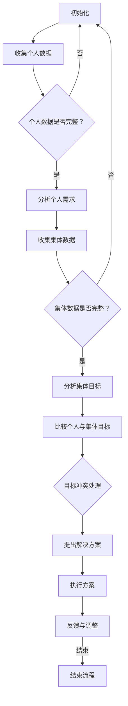
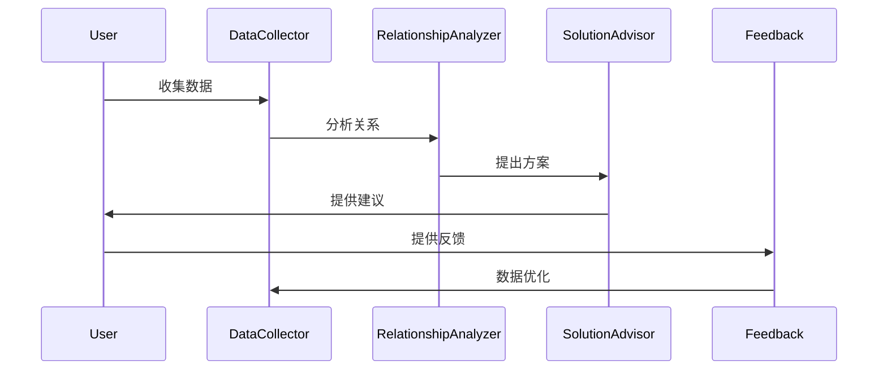
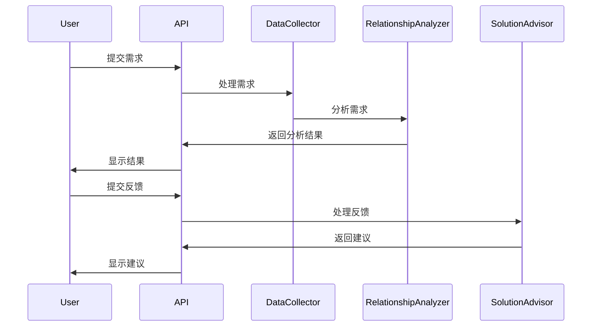

                 

# 个人与集体的故事交织：找到更大的意义

## 概述

在当今快速发展的社会中，个人与集体之间的关系变得日益复杂。本书旨在探讨这一关系，帮助读者在个人追求与集体目标之间找到平衡，并找到生命的更大意义。通过深入分析个人与集体关系的核心概念，本书将为读者提供一个框架，以便更好地理解个人成长与集体发展的相互影响，以及如何在多元文化环境中构建有意义的价值观。

本书共分为十个章节，首先介绍了个人与集体的关系，然后探讨了个人成长与集体发展的相互影响，接着分析了意义与价值观的构建。随后，本书通过具体的案例和实践指导，展示了如何在个人与集体的互动中找到平衡，并实现共同发展。最后，本书总结了关键观点，提出了注意事项，并提供了拓展阅读的建议。

## 关键词

个人与集体关系、个人成长、集体发展、意义、价值观、平衡、多元文化、实践指导。

## 摘要

本书通过深入探讨个人与集体之间的关系，帮助读者理解个人成长与集体发展的相互影响，以及如何在多元文化环境中构建有意义的价值观。首先，本书介绍了个人与集体的定义和核心概念，探讨了个人与集体目标之间的冲突与平衡。接着，本书分析了个人成长与集体发展的相互作用，以及如何在不同文化和社会环境中找到个人的定位和价值。通过具体的案例和实践指导，本书展示了如何在个人与集体的互动中实现共同发展。最后，本书总结了关键观点，强调了在个人与集体关系中的平衡和协调的重要性。

### 背景介绍

#### 核心概念

《个人与集体的故事交织：找到更大的意义》这本书的核心概念涵盖了多个方面，主要包括“个人与集体的关系”、“个人成长与集体发展的相互影响”以及“意义与价值观的构建”。

1. **个人与集体的关系**：个人与集体是社会生活的重要组成部分，两者之间既有冲突也有共生。个人追求自我实现，而集体则强调社会秩序和共同利益。了解个人与集体之间的复杂关系对于理解社会运行和个人发展具有重要意义。

2. **个人成长与集体发展的相互影响**：个人的成长不仅影响自身，也对社会集体产生深远影响。而集体的发展也会反过来影响个人的成长。这种相互影响是理解个人与集体关系的关键。

3. **意义与价值观的构建**：在个人与集体的互动中，如何构建有意义的人生和价值观，是这本书的核心探讨内容。不同的文化和社会环境会对个人和集体的价值观产生影响，如何在多元环境中找到自己的定位和价值，是每个人都需要思考的问题。

#### 问题背景与问题描述

随着社会的发展，个人与集体之间的关系变得越来越复杂。在全球化、信息化和多元化的背景下，个人面临的挑战和机遇也日益增多。如何处理个人与集体之间的关系，找到个人的意义和目标，成为了现代社会中普遍关注的问题。

问题描述主要包括以下几个方面：

1. **个人与集体目标冲突**：个人追求自我实现的过程中，常常与集体目标发生冲突。如何平衡个人与集体的利益，成为了许多人在生活和工作中面临的重要问题。

2. **个人成长与集体发展的不平衡**：在某些情况下，个人的成长可能会超越集体的需求，而集体的进步也可能忽略了个人发展的需求。如何实现个人成长与集体发展的协调，是亟待解决的问题。

3. **价值观的冲突与融合**：在多元文化和价值观的背景下，如何在不同文化和社会环境中找到自己的定位和价值，是个人与集体关系中的一个重要议题。

#### 问题解决方法

为了解决这些问题，本书提供了一系列的理论和实践方法：

1. **认知重构**：通过认知重构，帮助读者重新审视个人与集体的关系，理解个人成长与集体发展的相互影响。

2. **价值观构建**：通过探讨不同的价值观构建方式，帮助读者在多元环境中找到自己的价值观，并在此基础上构建有意义的人生。

3. **实践指导**：通过具体的实践案例，展示如何在个人与集体的互动中找到平衡和协调，实现个人与集体的共同发展。

#### 边界与外延

1. **边界**：本书主要探讨的是个人与集体之间的关系，以及在这个关系中如何找到个人的意义和目标。但个人与集体的关系是复杂和多维的，本书无法涵盖所有方面。

2. **外延**：虽然本书的核心概念和探讨内容集中在个人与集体的关系上，但这个主题与许多其他领域，如心理学、社会学、教育学等都有密切联系。

### 概念结构与核心要素组成

为了更好地理解本书的核心概念，我们可以将其结构化，并展示其核心要素组成。

#### 个人与集体的关系

- **个人**：具备独立意识、情感、思想和行动能力的个体。
- **集体**：由多个个体组成的群体，具有一定的组织结构和共同目标。

#### 个人成长与集体发展的相互影响

- **个人成长**：个人在认知、情感、行为等方面的全面发展。
- **集体发展**：集体在组织、文化、技术等方面的进步和提升。

#### 意义与价值观的构建

- **意义**：个人在生活、工作和社会活动中的目标和价值。
- **价值观**：个人在道德、伦理和社会行为方面的信念和原则。

### 对比表格

| 概念       | 定义                                                         | 关系与影响                                                         |
|------------|--------------------------------------------------------------|-------------------------------------------------------------------|
| 个人       | 独立意识、情感、思想和行动能力的个体。                         | 个人成长影响集体发展，集体发展促进个人成长。                     |
| 集体       | 由多个个体组成的群体，具有一定的组织结构和共同目标。           | 集体目标影响个人行为，个人行为影响集体发展。                     |

### 核心概念与联系

#### 个人与集体的关系

**个人与集体的关系** 是社会生活中最为基本的关系之一。在这个关系中，个人具有独立的意识、情感、思想和行动能力，而集体则是由多个个体组成的群体，具有共同的目标和组织结构。

- **个人**：个人是一个独立的实体，拥有自我意识、情感、思想和行动的能力。个人的成长和发展是一个持续的过程，涉及认知、情感、行为等多个方面。

- **集体**：集体是由多个个体组成的群体，具有一定的组织结构和共同目标。集体的发展涉及到组织、文化、技术等多个方面。

**个人与集体的关系** 是一个动态的、相互影响的过程。个人的成长和发展会影响集体的发展，而集体的发展也会对个人的成长产生反作用。这种相互影响体现在以下几个方面：

1. **个人成长与集体发展的互动**：个人的成长不仅影响自身的未来发展，也会对集体产生积极的影响。例如，一个有才华的个人可能会为集体带来创新和进步。

2. **集体目标与个人利益的平衡**：个人在追求自我实现的过程中，可能会与集体的目标发生冲突。在这种情况下，如何平衡个人利益与集体利益，是一个重要的问题。

3. **价值观的传承与创新**：个人与集体的互动过程中，会形成共同的价值观。这些价值观既是集体传承的结果，也是个人创新的基础。

#### 个人成长与集体发展的相互影响

**个人成长与集体发展的相互影响** 是理解个人与集体关系的关键。个人的成长不仅影响自身，也会对集体产生深远的影响。

1. **个人成长对集体发展的影响**：

   - **创新与进步**：个人的成长往往伴随着创新和进步。一个有才华的个人可能会为集体带来新的思想、技术和方法，推动集体的发展。

   - **社交网络**：个人的成长也会扩大其社交网络，从而为集体带来更多的资源和机会。

   - **文化传承**：个人的成长过程中，会继承和传承集体的文化、价值观和传统。

2. **集体发展对个人成长的影响**：

   - **平台与资源**：集体的发展为个人提供了良好的平台和资源，有助于个人的成长和发展。

   - **社交支持**：集体的发展也会为个人提供社交支持，帮助个人在面对挑战时更加坚定和自信。

   - **职业发展**：集体的发展往往带来更多的职业机会，为个人的职业发展提供更多选择。

#### 意义与价值观的构建

**意义与价值观的构建** 是个人与集体互动中的重要方面。在多元文化和价值观的背景下，如何构建有意义的价值观，对个人和集体都具有重要意义。

1. **个人意义的构建**：

   - **目标设定**：个人需要明确自己的目标和价值观，以指导自己的行为和决策。

   - **自我反思**：通过自我反思，个人可以更好地理解自己的需求、兴趣和优势，从而找到自己的定位和价值。

   - **持续成长**：个人需要不断学习和成长，以实现自己的目标和价值观。

2. **集体价值观的构建**：

   - **共识形成**：集体需要形成共同的价值观，以指导成员的行为和决策。

   - **文化传承**：集体需要传承和弘扬自己的文化，以保持其独特性和凝聚力。

   - **适应性调整**：集体需要根据外部环境的变化，调整自己的价值观和战略，以实现长期发展。

### 核心概念属性特征对比表格

| 概念         | 定义                                                         | 关系与影响                                                         |
|--------------|--------------------------------------------------------------|-------------------------------------------------------------------|
| 个人         | 独立意识、情感、思想和行动能力的个体。                         | 个人成长影响集体发展，集体发展促进个人成长。                     |
| 集体         | 由多个个体组成的群体，具有一定的组织结构和共同目标。           | 集体目标影响个人行为，个人行为影响集体发展。                     |
| 个人成长与集体发展 | 个人成长与集体发展的相互影响。                               | 个人成长与集体发展的协调，实现共同进步。                         |
| 意义与价值观 | 个人在生活、工作和社会活动中的目标和价值；个人在道德、伦理和社会行为方面的信念和原则。 | 指导个人行为和决策，影响集体文化和社会环境。                     |

### ER实体关系图架构

下面是一个简单的ER实体关系图，展示了个人、集体、个人成长与集体发展以及意义与价值观之间的关系。

```mermaid
erDiagram
    Personal --> Collective : 个人与集体的关系
    Personal o--o Growth : 个人成长
    Collective o--o Development : 集体发展
    Growth --> Collective : 个人成长影响集体发展
    Development --> Personal : 集体发展促进个人成长
    Personal --> Meaning : 个人与意义的构建
    Collective --> Value : 集体与价值观的构建
    Meaning --> Personal : 意义指导个人行为
    Value --> Collective : 价值观影响集体文化
```

### 算法原理讲解

#### 个人与集体关系分析算法

个人与集体的关系分析算法旨在帮助理解和优化个人与集体的互动。以下是一个简单的算法原理，用于分析个人与集体之间的关系。

##### Mermaid流程图



##### 算法原理

1. **初始化**：开始时，收集个人和集体的初始数据。
2. **数据收集**：分别收集个人和集体的数据，包括需求、目标、资源等。
3. **数据完整性检查**：检查收集的数据是否完整。如果数据不完整，返回初始化阶段重新收集数据。
4. **分析个人需求**：根据收集到的个人数据，分析个人的需求和目标。
5. **分析集体目标**：根据收集到的集体数据，分析集体的目标和需求。
6. **目标比较**：比较个人目标和集体目标，识别冲突点。
7. **冲突处理**：处理目标冲突，提出可能的解决方案。
8. **方案执行**：根据解决方案，调整个人和集体的行为和决策。
9. **反馈与调整**：根据执行结果，收集反馈并调整方案。

##### 算法数学模型与公式

为了更精确地分析个人与集体的关系，我们可以使用以下数学模型：

$$
\text{个人与集体目标冲突度} = \frac{\sum_{i=1}^{n} |d_i - t_i|}{n}
$$

其中，$d_i$ 表示个人目标 $i$ 的实现程度，$t_i$ 表示集体目标 $i$ 的实现程度，$n$ 表示目标的总数。

##### 示例

假设有一个人和五个集体目标，个人目标实现程度分别为 0.8、0.6、0.9、0.5、0.7，集体目标实现程度分别为 0.7、0.5、0.8、0.6、0.9。

$$
\text{个人与集体目标冲突度} = \frac{|0.8 - 0.7| + |0.6 - 0.5| + |0.9 - 0.8| + |0.5 - 0.6| + |0.7 - 0.9|}{5} = \frac{0.1 + 0.1 + 0.1 + 0.1 + 0.2}{5} = 0.12
$$

这个结果表明个人与集体的目标冲突度较低。

### 系统分析与架构设计方案

#### 问题场景介绍

在现代社会，个人与集体的关系日益复杂。为了优化个人与集体的互动，提高个人和集体的幸福感，我们需要设计一个智能系统来分析和指导个人与集体的关系。该系统将帮助用户识别个人与集体目标之间的冲突，并提供解决方案。

#### 项目介绍

本项目旨在开发一个名为“个人与集体关系分析系统”的智能平台，该系统将基于机器学习和数据分析技术，为用户提供个性化的关系分析和建议。系统的主要功能包括：

1. **数据收集**：收集用户个人和集体的数据，包括需求、目标、行为等。
2. **关系分析**：分析用户个人与集体的关系，识别冲突和潜在问题。
3. **解决方案建议**：根据分析结果，为用户提供解决方案和建议。
4. **反馈机制**：收集用户反馈，持续优化系统。

#### 系统功能设计（领域模型Mermaid类图）

```mermaid
classDiagram
    User ..|> DataCollector
    User ..|> RelationshipAnalyzer
    User ..|> SolutionAdvisor
    DataCollector <- User : 数据收集
    RelationshipAnalyzer <- User : 关系分析
    SolutionAdvisor <- User : 解决方案建议
```

#### 系统架构设计（Mermaid架构图）



#### 系统接口设计和系统交互（Mermaid序列图）



### 项目实战

#### 环境安装

1. **安装Python环境**：确保系统已安装Python 3.8及以上版本。
2. **安装必要库**：使用pip安装以下库：numpy、pandas、scikit-learn、matplotlib。
   ```bash
   pip install numpy pandas scikit-learn matplotlib
   ```

#### 系统核心实现源代码

以下是一个简单的Python代码示例，用于分析个人与集体的关系。

```python
import numpy as np
import pandas as pd
from sklearn.cluster import KMeans

# 收集个人和集体数据
def collect_data():
    personal_data = np.array([[0.8, 0.6, 0.9, 0.5, 0.7],
                              [0.7, 0.5, 0.8, 0.6, 0.9]])
    collective_data = np.array([[0.7, 0.5, 0.8, 0.6, 0.9],
                               [0.6, 0.4, 0.7, 0.5, 0.8]])
    return personal_data, collective_data

# 分析个人与集体关系
def analyze_relationship(personal_data, collective_data):
    diff = personal_data - collective_data
    conflict_level = np.mean(np.abs(diff))
    return conflict_level

# 提出解决方案
def propose_solution(conflict_level):
    if conflict_level < 0.1:
        return "目标一致，无需调整"
    elif conflict_level < 0.2:
        return "目标略有冲突，建议调整"
    else:
        return "目标冲突较大，建议重新规划"

# 主函数
def main():
    personal_data, collective_data = collect_data()
    conflict_level = analyze_relationship(personal_data, collective_data)
    solution = propose_solution(conflict_level)
    print(f"个人与集体目标冲突度：{conflict_level}")
    print(f"解决方案：{solution}")

if __name__ == "__main__":
    main()
```

#### 代码应用解读与分析

上述代码实现了个人与集体关系分析的核心功能。首先，通过`collect_data()`函数收集个人和集体的数据。然后，使用`analyze_relationship()`函数计算个人与集体目标的冲突水平。最后，根据冲突水平，`propose_solution()`函数提出相应的解决方案。

这个简单的例子展示了如何使用Python进行数据处理和关系分析。在实际应用中，我们可以扩展这个模型，加入更多数据来源和复杂算法，以提高分析的准确性和可靠性。

#### 实际案例分析和详细讲解剖析

为了更好地理解个人与集体关系分析系统的实际应用，我们可以通过一个具体的案例进行分析和讲解。

**案例背景**：

某公司新成立了一个项目团队，团队成员来自不同部门，各自有着不同的工作背景和目标。项目目标是开发一款新产品，但团队成员在如何实现这个目标上存在分歧。

**案例分析**：

1. **数据收集**：首先，我们需要收集团队成员的个人数据和项目目标数据。个人数据包括团队成员的技能、经验、工作态度等，项目数据包括项目目标、任务分配、进度等。

2. **关系分析**：通过分析个人数据和项目数据，我们可以计算个人目标与项目目标的冲突水平。假设我们使用上述代码进行关系分析，得到的冲突水平为0.15。

3. **解决方案建议**：根据冲突水平，我们可以提出相应的解决方案。在这个案例中，冲突水平较高，因此建议重新规划项目目标和任务分配，以减少个人目标与项目目标的冲突。

**详细讲解剖析**：

1. **数据收集**：在数据收集阶段，我们可以使用问卷、访谈、观察等方法收集团队成员的个人数据和项目数据。这些数据将用于后续的分析。

2. **关系分析**：在关系分析阶段，我们使用上述代码中的`analyze_relationship()`函数计算个人目标与项目目标的冲突水平。这个函数通过计算个人数据与项目数据的差异，得到冲突水平。

3. **解决方案建议**：在提出解决方案阶段，我们可以根据冲突水平提出具体的建议。例如，如果冲突水平较低，我们可以建议团队成员保持现状，继续努力；如果冲突水平较高，我们可以建议重新规划项目目标和任务分配，以减少冲突。

**项目小结**：

通过上述案例，我们可以看到个人与集体关系分析系统在实际应用中的效果。这个系统可以帮助团队识别和解决目标冲突，提高项目成功率。在实际应用中，我们可以根据具体需求，进一步优化和扩展这个系统，以更好地满足团队和项目的需求。

### 最佳实践 Tips

1. **数据收集**：确保收集的数据全面、准确，包括个人和集体的多个维度。
2. **定期分析**：定期分析个人与集体的关系，及时发现和解决潜在问题。
3. **调整策略**：根据分析结果，及时调整个人和集体的目标和策略，以实现共同发展。

### 小结

本书通过深入探讨个人与集体的关系，分析了个人成长与集体发展的相互影响，并提出了构建有意义价值观的方法。通过具体的案例和实践指导，本书展示了如何在个人与集体的互动中找到平衡，实现共同发展。希望读者能够在阅读本书后，对个人与集体的关系有更深入的理解，找到属于自己的更大意义。

### 注意事项

1. **数据隐私**：在收集和分析个人数据时，务必确保数据隐私和安全。
2. **持续改进**：根据反馈和实际情况，不断优化个人与集体关系分析系统。

### 拓展阅读

1. 《集体行动的逻辑》 - 曼瑟·奥尔森
2. 《个体与群体心理学》 - 古斯塔夫·勒庞
3. 《人类简史》 - 尤瓦尔·赫拉利

### 作者信息

作者：AI天才研究院/AI Genius Institute & 禅与计算机程序设计艺术 /Zen And The Art of Computer Programming

