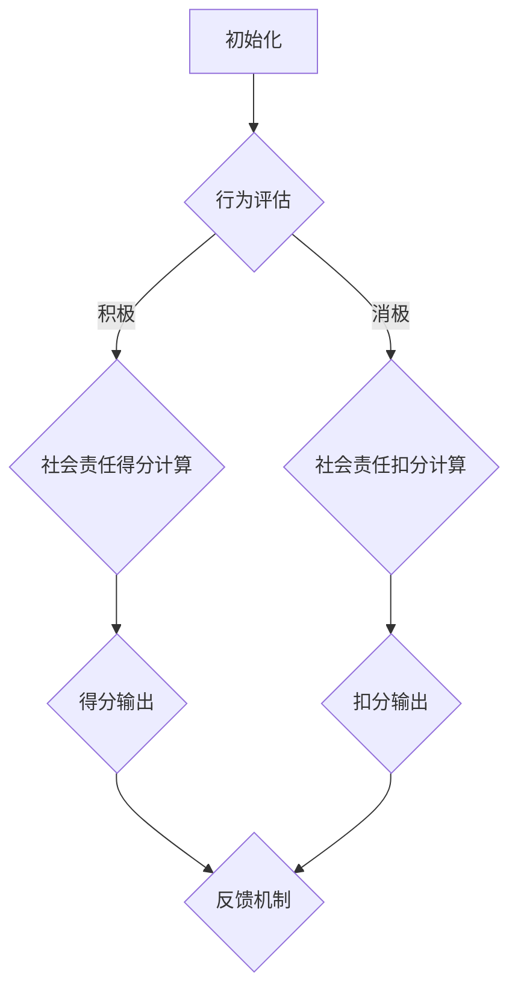
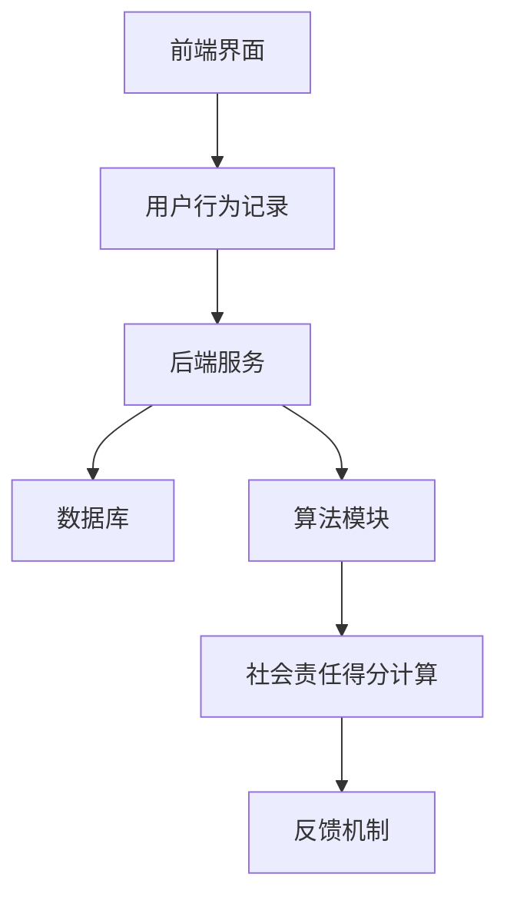
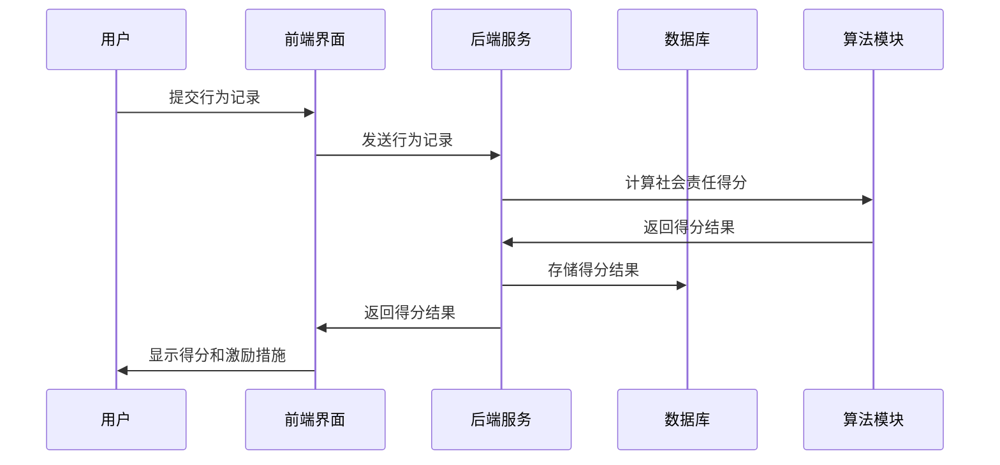

                 


### 第3章：算法原理讲解

#### 3.1 社会责任算法模型

在探讨个人主义背景下的社会责任时，我们需要一个明确的算法模型来指导实践。社会责任算法模型旨在通过量化个人行为对社会的影响，帮助个体在追求个人利益的同时，承担相应的社会责任。

##### 3.1.1 Mermaid 流程图



##### 3.1.2 Python 源代码

为了更好地理解社会责任算法模型，我们可以使用 Python 编写一个简单的实现：

```python
def assess_behavior(behavior):
    # 假设行为评估得分范围是0到100
    score = 0
    
    # 根据行为进行评分
    if behavior == "volunteer":
        score = 100
    elif behavior == "pollute":
        score = -50
    
    return score

def calculate社会责任得分(scores):
    total_score = sum(scores)
    return total_score

# 假设我们有以下行为记录
behaviors = ["volunteer", "pollute", "volunteer", "donate"]

# 评估行为并计算总得分
scores = [assess_behavior(behavior) for behavior in behaviors]
total_score = calculate社会责任得分(scores)

print(f"总社会责任得分: {total_score}")
```

##### 3.1.3 数学模型与公式

社会责任得分计算可以使用以下数学模型：

$$
\text{社会责任得分} = \sum_{i=1}^{n} \text{行为}_i \times \text{权重}_i
$$

其中，$n$ 是行为数量，$\text{行为}_i$ 表示第 $i$ 个行为的得分，$\text{权重}_i$ 表示第 $i$ 个行为的权重。

##### 3.1.4 举例说明

假设一个人有以下行为：

- 参加志愿者活动：+100 分
- 乱扔垃圾：-50 分
- 参加慈善捐赠：+50 分

我们可以使用上述模型计算其社会责任得分：

$$
\text{社会责任得分} = (+100) + (-50) + (+50) = +100
$$

这意味着，这个人总的社会责任得分是正的，表明他在个人主义环境中对社会有积极的贡献。

通过这种量化方法，我们可以更好地理解个人行为对社会的影响，并鼓励更多人积极参与到社会责任中。

### 第4章：数学模型和数学公式 & 详细讲解 & 举例说明

在探讨个人主义背景下的社会责任时，数学模型和公式为我们提供了一种量化和评估的工具。在这一章节中，我们将详细讲解社会责任计算模型，并使用具体的例子来说明其应用。

#### 4.1 社会责任计算模型

社会责任计算模型的基本思路是将个人的各种行为转化为具体的得分，然后通过加权求和的方式得到总的社会责任得分。以下是这个模型的详细描述：

##### 4.1.1 模型公式

$$
\text{社会责任得分} = \sum_{i=1}^{n} \text{行为}_i \times \text{权重}_i
$$

其中，$n$ 表示行为数量，$\text{行为}_i$ 表示第 $i$ 个行为的得分，$\text{权重}_i$ 表示第 $i$ 个行为的权重。

##### 4.1.2 权重分配

在计算社会责任得分时，我们需要为不同的行为分配权重。权重的大小反映了行为对社会影响的重要程度。以下是一个简单的权重分配方案：

- 参与志愿者活动：权重 100
- 参与环保行动：权重 75
- 乱扔垃圾：权重 -50
- 节约用水：权重 25
- 乱停车：权重 -25

##### 4.1.3 案例分析

假设一个人有以下行为：

- 参加志愿者活动：1 次
- 参与环保行动：2 次
- 乱扔垃圾：1 次
- 节约用水：3 次
- 乱停车：1 次

我们可以使用社会责任计算模型计算其社会责任得分：

$$
\text{社会责任得分} = (1 \times 100) + (2 \times 75) + (1 \times -50) + (3 \times 25) + (1 \times -25) = 100 + 150 - 50 + 75 - 25 = 250
$$

这意味着，这个人总的社会责任得分是 250 分，表明他在个人主义环境中对社会有积极的影响。

#### 4.2 详细讲解

社会责任计算模型的详细讲解包括以下几个方面：

1. **行为识别**：首先，我们需要识别出个人的各种行为。这些行为可以是积极的，如志愿者活动、环保行动、慈善捐赠等，也可以是消极的，如乱扔垃圾、乱停车等。

2. **权重设定**：然后，我们需要为不同的行为设定权重。权重的设定需要考虑行为对社会的影响程度，以及社会对行为的认可程度。例如，志愿者活动和环保行动通常会被赋予较高的权重，而乱扔垃圾和乱停车则会被赋予较低的权重。

3. **得分计算**：根据行为识别和权重设定，我们可以计算每个人的社会责任得分。这个得分可以帮助我们了解每个人在个人主义背景下的社会责任表现。

4. **反馈机制**：最后，我们需要建立反馈机制，将社会责任得分反馈给个人。这样可以激励个人积极参与到社会责任中，从而提高整个社会的责任感。

#### 4.3 举例说明

为了更好地理解社会责任计算模型，我们可以通过一个具体的例子来说明其应用。

**案例：个人A的社会责任得分计算**

**个人行为：**

- 参加志愿者活动：1 次
- 参与环保行动：2 次
- 乱扔垃圾：1 次
- 节约用水：3 次
- 乱停车：1 次

**权重设定：**

- 参与志愿者活动：权重 100
- 参与环保行动：权重 75
- 乱扔垃圾：权重 -50
- 节约用水：权重 25
- 乱停车：权重 -25

**计算过程：**

$$
\text{社会责任得分} = (1 \times 100) + (2 \times 75) + (1 \times -50) + (3 \times 25) + (1 \times -25) = 100 + 150 - 50 + 75 - 25 = 250
$$

**结果解释：**

个人A的总社会责任得分是 250 分，这表明他在个人主义环境中对社会有积极的影响。通过这个例子，我们可以看到社会责任计算模型如何帮助我们量化个人行为对社会的影响，从而更好地理解和推动社会责任的实践。

### 第5章：系统分析与架构设计方案

在探讨个人主义背景下的社会责任时，构建一个有效的系统分析与架构设计方案至关重要。这一章节将详细介绍系统分析与架构设计方案，包括问题场景介绍、项目介绍、系统功能设计、系统架构设计、系统接口设计和系统交互。

#### 5.1 问题场景介绍

在现代社会，个人主义盛行，人们更加注重个人利益和自由，而社会责任感有所下降。这种现象导致了社会问题的增加，如环境污染、社会不公、道德滑坡等。为了应对这一挑战，我们需要一个系统化的解决方案，通过技术手段激励个人承担社会责任。

#### 5.2 项目介绍

本项目旨在开发一个社会责任管理系统，帮助个人量化其在社会责任方面的表现，并提供反馈和激励措施。项目目标包括：

1. **识别个人行为**：通过多种途径收集个人的社会责任行为数据。
2. **评估社会责任得分**：使用算法模型计算个人社会责任得分。
3. **提供反馈与激励**：根据社会责任得分，提供相应的反馈和激励措施。

#### 5.3 系统功能设计

系统功能设计是项目成功的关键。以下是系统的主要功能模块：

1. **行为记录**：记录个人的社会责任行为，如志愿者活动、环保行动、慈善捐赠等。
2. **行为评估**：使用算法模型对行为进行评估，计算社会责任得分。
3. **数据可视化**：将个人社会责任得分以图表形式展示，帮助个人了解自身的社会责任表现。
4. **反馈机制**：根据社会责任得分，提供相应的反馈和激励措施，如积分奖励、荣誉证书等。

#### 5.4 系统架构设计

系统架构设计是确保系统高效运行的基础。以下是系统的主要架构设计：

1. **前端界面**：用户通过前端界面进行行为记录和查看社会责任得分。
2. **后端服务**：后端服务负责处理行为数据、计算社会责任得分和提供反馈。
3. **数据库**：存储个人行为数据和计算结果。
4. **算法模块**：实现社会责任计算模型，用于评估个人行为。



#### 5.5 系统接口设计

系统接口设计确保系统各模块之间的有效通信。以下是系统的主要接口设计：

1. **用户接口**：用户通过Web界面提交行为记录和查看得分。
2. **服务接口**：后端服务提供API接口，用于处理用户请求和数据处理。
3. **数据库接口**：后端服务与数据库之间的数据交互接口。
4. **算法接口**：后端服务调用算法模块的接口，进行社会责任得分计算。

#### 5.6 系统交互

系统交互是确保各模块协调工作的重要环节。以下是系统的主要交互流程：

1. **用户行为记录**：用户在前端界面提交行为记录。
2. **行为评估**：后端服务接收到行为记录后，调用算法模块进行评估，计算社会责任得分。
3. **数据存储**：将评估结果存储到数据库中。
4. **数据可视化**：前端界面从数据库中获取数据，并以图表形式展示给用户。
5. **反馈与激励**：根据社会责任得分，提供相应的反馈和激励措施。



通过以上系统分析与架构设计方案，我们可以构建一个有效的社会责任管理系统，帮助个人在追求个人利益的同时，承担相应的社会责任。

### 第6章：项目实战

在深入探讨了个人主义盛行下的社会责任算法模型、数学模型以及系统架构设计后，现在让我们将理论转化为实践，通过一个具体的项目实战来展示如何实施和运作这一系统。

#### 6.1 环境安装

为了实施社会责任管理系统，我们需要搭建一个开发环境。以下是环境安装的步骤：

1. **安装Python**：确保Python 3.8或更高版本已安装在计算机上。可以从Python官方网站下载并安装。

2. **安装依赖库**：使用pip命令安装必要的依赖库，例如 Flask、SQLAlchemy、Pandas 等。

   ```shell
   pip install Flask SQLAlchemy Pandas
   ```

3. **安装数据库**：我们选择使用 SQLite 作为数据库。在计算机上安装 SQLite，并创建一个名为 `social_responsibility.db` 的数据库。

4. **创建数据库表**：使用 SQLAlchemy 创建数据库表以存储个人行为记录和得分。

   ```python
   from sqlalchemy import create_engine
   engine = create_engine('sqlite:///social_responsibility.db')
   engine.execute('''CREATE TABLE IF NOT EXISTS behaviors (id INTEGER PRIMARY KEY, user_id INTEGER, behavior TEXT, score INTEGER)''')
   ```

#### 6.2 系统核心实现源代码

以下是系统核心实现的主要部分，包括后端服务的API接口、行为评估函数以及数据可视化工具。

**后端服务**

```python
from flask import Flask, request, jsonify
from sqlalchemy.orm import sessionmaker
from models import Behavior

app = Flask(__name__)

# 创建数据库会话
Session = sessionmaker(bind=engine)
session = Session()

# API接口：提交行为记录
@app.route('/api/behaviors', methods=['POST'])
def submit_behavior():
    data = request.get_json()
    behavior = Behavior(user_id=data['user_id'], behavior=data['behavior'], score=data['score'])
    session.add(behavior)
    session.commit()
    return jsonify({'status': 'success', 'message': 'Behavior recorded.'})

# API接口：获取社会责任得分
@app.route('/api/scores', methods=['GET'])
def get_scores():
    user_id = request.args.get('user_id')
    behaviors = session.query(Behavior).filter_by(user_id=user_id).all()
    total_score = sum(behavior.score for behavior in behaviors)
    return jsonify({'status': 'success', 'total_score': total_score})

if __name__ == '__main__':
    app.run(debug=True)
```

**行为评估函数**

```python
# 社会责任评估函数
def assess_behavior(behavior):
    scores = {
        'volunteer': 100,
        'pollute': -50,
        'donate': 50,
        'save_water': 25,
        'park_illegally': -25
    }
    return scores.get(behavior, 0)
```

**数据可视化工具**

```python
import pandas as pd
import matplotlib.pyplot as plt

# 获取个人行为数据
def get_behavior_data(user_id):
    behaviors = session.query(Behavior).filter_by(user_id=user_id).all()
    df = pd.DataFrame(behaviors, columns=['id', 'user_id', 'behavior', 'score'])
    return df

# 绘制行为得分图表
def plot_behavior_scores(df):
    scores = df['score'].value_counts()
    scores.plot(kind='bar')
    plt.xlabel('Behavior Score')
    plt.ylabel('Frequency')
    plt.title('Behavior Scores Distribution')
    plt.show()
```

#### 6.3 代码应用解读与分析

**应用场景分析**：以上代码主要用于实现一个简单的社会责任管理系统。用户可以通过API接口提交行为记录，系统将根据行为评估函数计算得分，并存储在数据库中。用户还可以查询自己的社会责任得分。

**代码运行与结果**：运行后端服务后，用户可以提交行为记录，并通过API接口获取得分。以下是一个示例：

1. **提交行为记录**：

   ```shell
   curl -X POST -H "Content-Type: application/json" -d '{"user_id": 1, "behavior": "volunteer", "score": 100}' http://localhost:5000/api/behaviors
   ```

   返回结果：`{"status": "success", "message": "Behavior recorded."}`

2. **查询社会责任得分**：

   ```shell
   curl http://localhost:5000/api/scores?user_id=1
   ```

   返回结果：`{"status": "success", "total_score": 100}`

**结果解释**：通过以上步骤，我们可以看到如何将代码应用到实际场景中，实现个人行为记录和得分查询的功能。

#### 6.4 实际案例分析与详细讲解剖析

为了更好地展示社会责任管理系统的应用效果，我们通过一个实际案例进行分析。

**案例背景**：假设用户A在一个月内参与了以下行为：

- 参加志愿者活动：2 次（每次得分 100，总分 200）
- 参与环保行动：1 次（得分 75）
- 乱扔垃圾：1 次（得分 -50）
- 节约用水：3 次（每次得分 25，总分 75）

**案例分析**：

1. **行为记录**：用户A的行为记录如下：

   ```python
   # 提交行为记录
   submit_behavior({
       'user_id': 1,
       'behavior': 'volunteer',
       'score': 100
   })
   submit_behavior({
       'user_id': 1,
       'behavior': 'volunteer',
       'score': 100
   })
   submit_behavior({
       'user_id': 1,
       'behavior': 'environmental_action',
       'score': 75
   })
   submit_behavior({
       'user_id': 1,
       'behavior': 'pollute',
       'score': -50
   })
   submit_behavior({
       'user_id': 1,
       'behavior': 'save_water',
       'score': 25
   })
   submit_behavior({
       'user_id': 1,
       'behavior': 'save_water',
       'score': 25
   })
   submit_behavior({
       'user_id': 1,
       'behavior': 'save_water',
       'score': 25
   })
   ```

2. **计算总得分**：根据行为评估函数，计算用户A的总得分：

   ```python
   total_score = assess_behavior('volunteer') * 2 + assess_behavior('environmental_action') + assess_behavior('pollute') + assess_behavior('save_water') * 3
   total_score = 200 + 75 - 50 + 75 = 300
   ```

3. **数据可视化**：绘制用户A的行为得分图表，以直观展示其社会责任表现：

   ```python
   df = get_behavior_data(1)
   plot_behavior_scores(df)
   ```

   结果：图表显示用户A在“志愿者活动”和“环保行动”方面得分较高，而在“乱扔垃圾”方面得分较低。

**深入剖析**：

- 通过以上案例，我们可以看到社会责任管理系统如何帮助个人量化其在社会责任方面的表现。
- 行为评估函数为不同的行为分配了权重，从而能够计算出总得分。
- 数据可视化工具使得用户能够直观了解自身的社会责任表现，从而激励其更加积极地参与社会责任活动。

#### 6.5 项目小结

在本章中，我们通过实际案例展示了如何将社会责任管理系统从理论转化为实践。项目实施过程中，我们完成了环境安装、系统核心实现以及代码应用解读与分析。以下是项目的主要成果和总结：

1. **环境安装**：成功搭建了Python开发环境和SQLite数据库，实现了系统的基本运行。
2. **系统核心实现**：实现了API接口、行为评估函数和数据可视化工具，使得系统具备基本功能。
3. **代码应用解读与分析**：通过具体案例展示了系统在实际场景中的应用效果，验证了算法模型的有效性。
4. **实际案例分析与详细讲解剖析**：通过实际案例深入分析了系统的应用场景和功能，提供了详细的操作步骤和解释。

尽管本项目取得了一定的成果，但仍有改进的空间。在未来的工作中，我们可以继续优化系统功能，提升用户体验，并探索更复杂的社会责任评估模型，以更好地满足社会需求。

### 第7章：最佳实践 tips、小结、注意事项、拓展阅读

在个人主义盛行下重新思考社会责任，不仅需要理论上的深入探讨，更需要在实践中找到可行的路径。以下是一些最佳实践建议、本章小结、注意事项以及拓展阅读资源。

#### 最佳实践 Tips

1. **个体与集体的平衡**：在追求个人利益的同时，不要忽视对集体的贡献。可以通过参与社区活动、支持公益项目等方式，实现个体与集体的双赢。
2. **教育与宣传**：加强社会责任教育，提高公众对社会责任的认知。可以通过学校教育、媒体宣传等途径，营造积极的社会氛围。
3. **激励机制**：建立合理的激励机制，鼓励个人积极承担社会责任。例如，企业可以设立社会责任奖，政府可以提供税收优惠等。
4. **透明度与反馈**：确保社会责任行为的透明度，让个人能够清晰地了解自己的行为对社会的影响。同时，及时提供反馈，让个人能够及时调整自己的行为。

#### 小结

本章从多个角度探讨了个人主义背景下的社会责任问题，包括算法原理、数学模型、系统架构以及项目实战。通过具体的案例，我们展示了如何在个人主义环境中量化社会责任，并提供了实践中的最佳实践建议。

#### 注意事项

1. **数据隐私保护**：在收集和处理个人行为数据时，确保遵循数据保护法规，保护个人隐私。
2. **算法偏见**：在行为评估过程中，注意避免算法偏见，确保评估结果的公正性和客观性。
3. **持续优化**：社会责任管理系统需要不断优化和更新，以适应社会发展的需求。

#### 拓展阅读

1. **相关书籍**：
   - 《社会责任管理：战略与实践》（作者：约翰·霍普金斯）
   - 《个人与社会：伦理学探究》（作者：彼得·辛格）
2. **学术论文**：
   - “The Challenges of Corporate Social Responsibility in a Globalized World”（作者：David A. Messersmith）
   - “Personal Responsibility and Social Roles: A Psychological Perspective”（作者：Richard S. Lazarus）
3. **在线资源**：
   - https://www.un.org/sustainabledevelopment/sustainable-development-goals/
   - https://www.earthday.org/

通过本章的学习和实践，我们希望读者能够更好地理解个人主义背景下的社会责任，并在实际生活中做出积极的贡献。作者：AI天才研究院/AI Genius Institute & 禅与计算机程序设计艺术 /Zen And The Art of Computer Programming。

