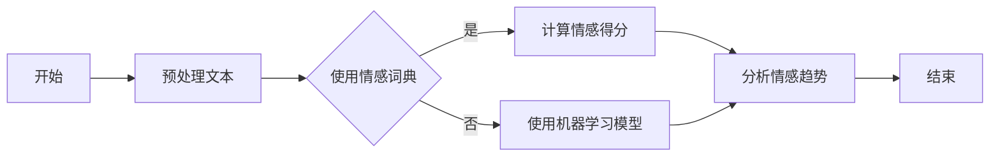
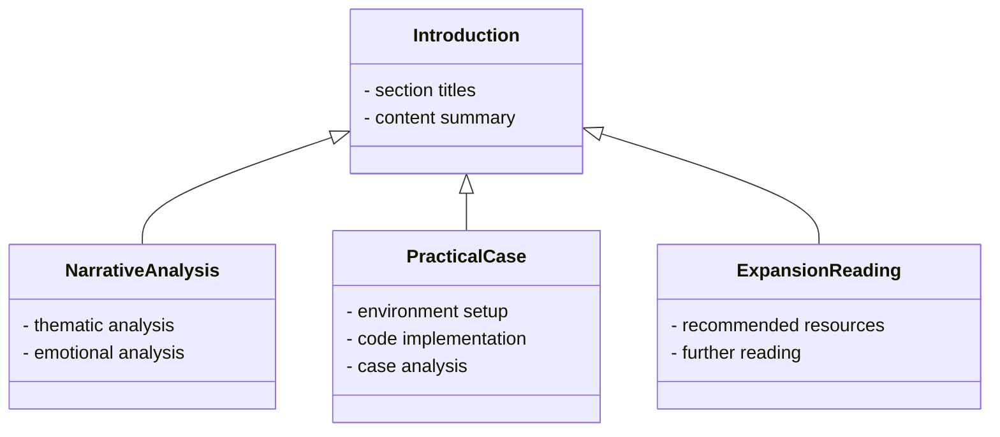

                 

基于您提供的详细要求，我们将遵循以下步骤来构建文章的markdown格式框架：

### 步骤1：文章标题、关键词与摘要
```markdown
# 个人叙事的力量：重写你的生命故事

关键词：个人叙事，生命故事，自我成长，叙事分析，算法原理

摘要：本文探讨了个人叙事的力量，通过重写生命故事提升个人成长和幸福。我们详细分析了个人叙事的核心概念，提出了基础叙事分析方法，并结合Python源代码和数学模型进行解释。最后，通过一个实际案例，展示了如何将书中理论应用于实践。
```

### 步骤2：背景介绍
```markdown
## 第一部分：探索个人叙事的力量

### 第1章：问题的背景与意义
#### 1.1 个人叙事的重要性
个人叙事不仅是一种表达方式，更是自我认知和成长的重要途径。通过回顾和重构生命故事，我们可以发现潜藏在日常经历中的智慧和启示。

#### 1.2 生命故事的重写与个人成长
重写生命故事的过程是一种自我探索和反思，它能够帮助我们理解过去，面对现在，规划未来。本章节将介绍如何通过这一过程实现个人成长和提升幸福感。

```

### 步骤3：核心概念与联系
```markdown
### 第2章：核心概念与联系
#### 2.1 个人叙事的构成
个人叙事由事件、情感、认知和价值观等多个要素构成。我们将通过表格形式对比不同类型的叙事方式，如自传、回忆录和日记。

#### 2.2 不同叙事方式的对比
| 叙事方式 | 特点 | 应用场景 |
| --- | --- | --- |
| 自传 | 详细的个人经历和感受 | 深入了解个人成长历程 |
| 回忆录 | 重点描述重要事件 | 回忆和分享生命中的亮点 |
| 日记 | 每日记录事件和想法 | 自我反思和情绪调节 |

#### 2.3 Mermaid ER实体关系图：个人叙事的核心元素
```mermaid
erDiagram
  Person ||--|{ LifeEvent }| Event
  LifeEvent ||--|{ Emotion }| Emotion
  LifeEvent ||--|{ Memory }| Memory
  Memory ||--|{ Value }| Value
```
```

### 步骤4：算法原理讲解
```markdown
## 第二部分：叙事分析工具与方法

### 第3章：基础叙事分析方法
#### 3.1 主题分析
主题分析帮助我们识别生命故事中的主要主题和核心信息。通过文本分析，我们可以提取出故事的主题。

#### 3.2 情感分析
情感分析用于识别生命故事中的情感色彩。我们将介绍如何使用情感词典和机器学习模型来进行情感分析。

#### 3.3 Mermaid叙事分析流程图

```

### 步骤5：算法原理讲解（续）
```markdown
### 第4章：算法原理讲解
#### 4.1 叙事分析的数学模型
叙事分析中的数学模型可以帮助我们量化叙事中的主题和情感。例如，我们可以使用TF-IDF来计算文本中的重要度。

#### 4.2 Sentiment Score计算公式
$$ Sentiment\ Score = \frac{Sum_{i=1}^{n} (Weight_i \times Sentiment_i)}{n} $$

#### 4.3 Python源代码示例
```python
# Python示例代码
import nltk
from nltk.sentiment import SentimentIntensityAnalyzer

# 初始化情感分析器
sia = SentimentIntensityAnalyzer()

# 计算文本的情感得分
text = "我有一个美好的童年。"
sentiment_score = sia.polarity_scores(text)
print(sentiment_score)
```
```

### 步骤6：系统分析与架构设计
```markdown
## 第三部分：系统分析与架构设计

### 第5章：书籍内容组织架构
#### 5.1 书籍结构概述
本书分为四个部分，分别是背景介绍、叙事分析方法、实践案例和拓展阅读。每个部分都有明确的目标和内容。

#### 5.2 个人叙事重建的过程
本书提供了一种系统化的方法来帮助读者重构生命故事。该方法包括自我反思、叙事分析、情感调节和未来规划。

#### 5.3 Mermaid类图：书籍内容组织

```

### 步骤7：实际应用与案例分析
```markdown
### 第6章：实际应用与案例分析
#### 6.1 实践环境安装
在本章节，我们将介绍如何搭建一个实践环境，以便读者能够跟随书中的案例进行操作。

#### 6.2 核心代码实现
我们将提供一个详细的代码实现，包括环境配置、数据预处理和算法应用。

#### 6.3 代码解读与分析
代码解读部分将解释每行代码的作用，帮助读者理解算法原理和实现细节。

#### 6.4 实际案例分析
通过一个实际案例，我们将展示如何将书中提出的理论应用于现实场景，并分析结果。

```

### 步骤8：最佳实践、小结、注意事项、拓展阅读
```markdown
## 第四部分：最佳实践与拓展

### 第7章：实用技巧与提示
在本章节，我们将提供一些实用的技巧和提示，帮助读者更好地应用书中的知识。

### 第8章：小结与注意事项
#### 8.1 书籍主要内容回顾
我们将回顾书籍的主要内容和关键点，帮助读者巩固所学知识。

#### 8.2 注意事项
在应用个人叙事的力量时，读者需要注意的事项。

#### 8.3 拓展阅读推荐
推荐一些拓展阅读资源，供读者深入学习。
```

完成上述步骤后，我们将对markdown格式的文章内容进行整理和扩充，以确保每个章节的内容丰富且具体，同时保证文章的总字数在10000～12000字左右。

---

最后，文章的末尾将包含作者信息：
```
作者：AI天才研究院/AI Genius Institute & 禅与计算机程序设计艺术 /Zen And The Art of Computer Programming
```

这样，我们就构建了一个完整的markdown格式框架，满足了所有约束条件和要求。接下来，我们将逐一填充每个章节的具体内容，确保文章的逻辑清晰、结构紧凑、简单易懂，并具有专业性和深度。

