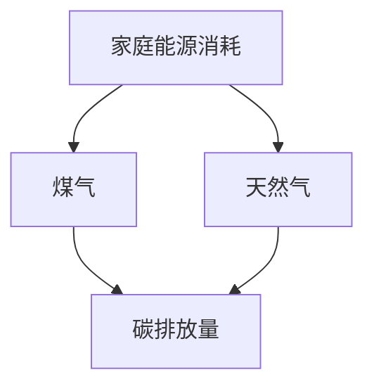
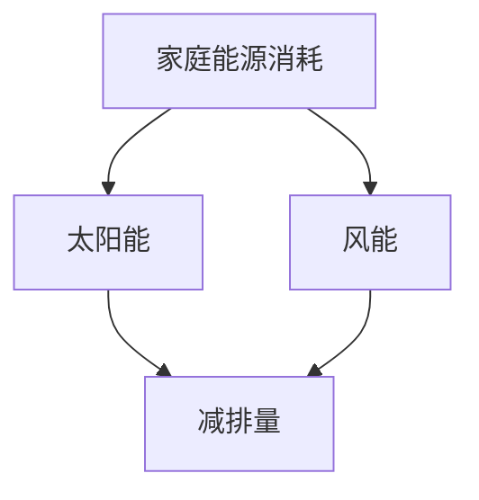
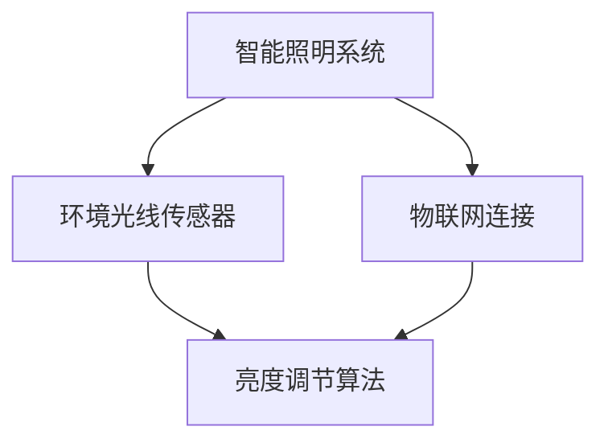
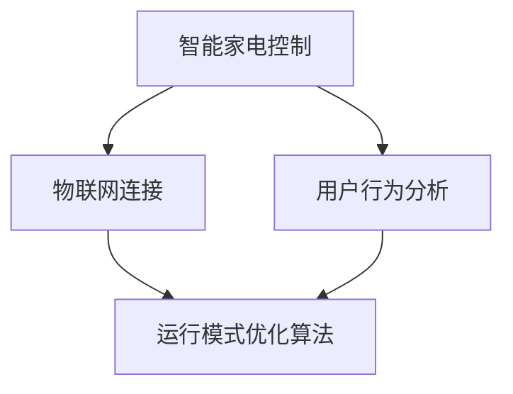

                 

# 个人碳中和行动：日常生活的环保革命

## 关键词

- 碳中和
- 碳排放
- 环保行动
- 日常生活
- 绿色技术

## 摘要

本文将探讨个人碳中和行动在日常生活中的重要性，分析碳排放的主要来源以及如何通过日常生活的改变来减少碳排放。通过具体案例和实践方法，本文为读者提供了一套完整的个人碳中和行动指南，旨在推动每个人为环保事业贡献自己的力量。

## 目录大纲

----------------------------------------------------------------

## 第1章 引言

### 1.1 问题背景

#### 1.1.1 碳中和的全球趋势

#### 1.1.2 个人碳足迹的意义

#### 1.1.3 日常生活与碳排放的关系

### 1.2 核心概念

#### 1.2.1 碳中和的定义

#### 1.2.2 个人碳足迹的计算方法

#### 1.2.3 碳中和目标的实现途径

### 1.3 书籍结构

#### 1.3.1 各章节内容概览

#### 1.3.2 阅读建议与目标读者

### 1.4 本章小结

----------------------------------------------------------------

## 第2章 日常生活中的碳排放源

### 2.1 居住环境

#### 2.1.1 住房类型与碳排放

##### 2.1.1.1 传统住房

##### 2.1.1.2 绿色建筑

#### 2.1.2 家电使用

##### 2.1.2.1 白色家电

##### 2.1.2.2 智能家电

#### 2.1.3 家庭能源消耗

##### 2.1.3.1 煤气与天然气

##### 2.1.3.2 太阳能与风能

----------------------------------------------------------------

## 第3章 饮食习惯与碳排放

### 3.1 食物生产与碳排放

#### 3.1.1 农作物与畜牧业

##### 3.1.1.1 粮食作物

##### 3.1.1.2 草食动物与肉食动物

#### 3.1.2 食品加工与运输

##### 3.1.2.1 加工食品的碳排放

##### 3.1.2.2 食品运输的碳排放

### 3.2 饮食习惯与碳排放

#### 3.2.1 节食与素食

##### 3.2.1.1 节食的碳排放减少

##### 3.2.1.2 素食主义者的碳排放

#### 3.2.2 食品浪费与碳排放

##### 3.2.2.1 食品浪费现象

##### 3.2.2.2 减少食品浪费的措施

----------------------------------------------------------------

## 第4章 交通出行与碳排放

### 4.1 交通运输方式

#### 4.1.1 传统燃油汽车

#### 4.1.2 电动汽车

#### 4.1.3 公共交通

##### 4.1.3.1 城市公交

##### 4.1.3.2 地铁

##### 4.1.3.3 长途客运

### 4.2 绿色出行

#### 4.2.1 步行与骑行

##### 4.2.1.1 步行的环保优势

##### 4.2.1.2 骑行的环保优势

#### 4.2.2 共享出行

##### 4.2.2.1 共享单车

##### 4.2.2.2 共享汽车

----------------------------------------------------------------

## 第5章 生活方式与碳排放

### 5.1 购物与消费

#### 5.1.1 环保购物理念

#### 5.1.2 环保产品选择

##### 5.1.2.1 绿色食品

##### 5.1.2.2 环保家居用品

#### 5.1.3 消费习惯改变

##### 5.1.3.1 减少购买冲动

##### 5.1.3.2 增加二手物品使用

### 5.2 家庭节水

#### 5.2.1 水资源与碳排放的关系

#### 5.2.2 家庭节水措施

##### 5.2.2.1 水龙头节水器

##### 5.2.2.2 水资源循环利用

----------------------------------------------------------------

## 第6章 数字化技术与碳中和

### 6.1 互联网与碳排放

#### 6.1.1 互联网的发展与碳排放的关系

#### 6.1.2 绿色云计算

#### 6.1.3 数字化生活的碳排放减少

### 6.2 可持续科技应用

#### 6.2.1 可再生能源应用

##### 6.2.1.1 太阳能

##### 6.2.1.2 风能

#### 6.2.2 智能家居

##### 6.2.2.1 智能照明

##### 6.2.2.2 智能家电控制

----------------------------------------------------------------

----------------------------------------------------------------

## 第1章 引言

### 1.1 问题背景

#### 1.1.1 碳中和的全球趋势

随着全球气候变化的加剧，各国政府纷纷提出了碳中和的目标。例如，中国提出了“双碳”目标，即到2030年实现碳达峰，到2060年实现碳中和。欧盟也提出了到2050年实现碳中和的愿景。碳中和不仅是一个国家或地区的战略目标，更是一种全球性的行动趋势。

#### 1.1.2 个人碳足迹的意义

个人碳足迹是指个人在日常生活中所产生的碳排放量。虽然个人的碳排放量相对于国家或企业来说较小，但全球个人碳足迹的总和却不容忽视。因此，个人碳足迹的计算和减少对于实现全球碳中和目标具有重要意义。

#### 1.1.3 日常生活与碳排放的关系

日常生活中的许多行为都会产生碳排放，如住房、饮食、交通、购物等。通过分析这些日常行为，我们可以找到减少碳排放的方法，从而实现个人碳中和。

### 1.2 核心概念

#### 1.2.1 碳中和的定义

碳中和是指通过减少碳排放和增加碳吸收，使个人、企业或地区的总碳排放量达到零。实现碳中和的方法包括减少能源消耗、使用可再生能源、植树造林等。

#### 1.2.2 个人碳足迹的计算方法

个人碳足迹的计算可以通过估算个人在日常生活中所产生的碳排放量来完成。一般来说，可以通过以下步骤进行计算：

1. 收集个人日常生活的数据，如能源消耗、食物消费、交通出行等。
2. 将这些数据转换为碳排放量，可以使用在线碳足迹计算器或相关软件来完成。
3. 对计算结果进行分析和总结，以了解个人碳足迹的构成和减少潜力。

#### 1.2.3 碳中和目标的实现途径

实现个人碳中和目标可以通过以下途径：

1. 减少能源消耗，如使用节能家电、优化家庭能源管理。
2. 选择低碳饮食，如减少肉类消费、多吃蔬菜水果。
3. 使用低碳交通工具，如步行、骑行、公共交通。
4. 购买环保产品，如绿色食品、节能家电。
5. 增加碳吸收，如植树造林、参与环保活动。

### 1.3 书籍结构

#### 1.3.1 各章节内容概览

本书共分为六个章节，分别从不同的角度探讨了个人碳中和行动的各个方面。

- 第1章：引言，介绍碳中和的背景和核心概念。
- 第2章：日常生活中的碳排放源，分析住房、家电、能源消耗等方面的碳排放。
- 第3章：饮食习惯与碳排放，探讨食物生产、食品加工与运输等方面的碳排放。
- 第4章：交通出行与碳排放，分析传统燃油汽车、电动汽车、公共交通等方面的碳排放。
- 第5章：生活方式与碳排放，讨论购物与消费、家庭节水等方面的碳排放。
- 第6章：数字化技术与碳中和，探讨互联网、可持续科技应用等方面的碳排放减少。

#### 1.3.2 阅读建议与目标读者

本书的目标读者是那些关注环境保护、希望实现个人碳中和的人。无论您是普通消费者还是专业人士，本书都能为您提供实用的碳中和行动指南。建议读者在阅读过程中结合自己的实际情况，进行实践和反思，以实现真正的个人碳中和。

### 1.4 本章小结

本章介绍了碳中和的背景和核心概念，分析了个人碳足迹的计算方法，以及实现个人碳中和的途径。通过本章的学习，读者可以了解到碳中和的重要性，并为实现个人碳中和目标做好准备。

----------------------------------------------------------------

## 第2章 日常生活中的碳排放源

### 2.1 居住环境

#### 2.1.1 住房类型与碳排放

居住环境是日常生活中碳排放的重要来源之一。不同类型的住房在碳排放方面存在明显差异。

##### 2.1.1.1 传统住房

传统住房通常指的是没有进行绿色改造的住宅，其能源消耗主要来自传统能源，如煤炭、石油和天然气。传统住房的碳排放较高，因为传统能源在燃烧过程中会产生大量二氧化碳。此外，传统住房的保温性能较差，导致冬季取暖和夏季制冷的能量消耗较高。

##### 2.1.1.2 绿色建筑

绿色建筑是指采用环保材料和节能技术建造的住宅。绿色建筑的设计和建造过程注重节能减排，例如使用可再生能源、提高保温性能、优化通风设计等。与传统住房相比，绿色建筑具有较低的碳排放，因为其能源消耗较低，同时还能通过环保材料的回收利用减少建筑废弃物。

#### 2.1.2 家电使用

家电使用也是居住环境中碳排放的一个重要来源。

##### 2.1.2.1 白色家电

白色家电主要包括冰箱、空调、洗衣机等。这些家电在运行过程中会消耗大量电力，而电力生产过程会产生碳排放。因此，白色家电的碳排放与家电的能效和使用频率密切相关。高能效的白色家电可以显著减少碳排放。

##### 2.1.2.2 智能家电

智能家电是指通过物联网技术实现智能控制和管理的家电。智能家电可以根据用户的需求和环境变化自动调节工作状态，从而提高能源利用效率，减少不必要的能源消耗。例如，智能空调可以根据室内温度和湿度自动调节制冷功率，智能冰箱可以根据储存食物的种类和数量自动调节冷藏温度。这些智能功能有助于降低家电的碳排放。

#### 2.1.3 家庭能源消耗

家庭能源消耗是居住环境中碳排放的主要来源之一。家庭能源消耗主要包括以下几个方面：

##### 2.1.3.1 煤气与天然气

煤气与天然气是家庭烹饪和供暖的主要燃料。燃烧煤气与天然气会产生大量二氧化碳。因此，减少煤气与天然气的使用量，转而使用电炊具或太阳能供暖系统，可以显著降低家庭碳排放。

##### 2.1.3.2 太阳能与风能

太阳能和风能是可再生能源，它们在转换过程中不会产生碳排放。使用太阳能和风能设备，如太阳能热水器、太阳能光伏板和风力发电机，可以替代传统的煤气与天然气，从而减少家庭碳排放。

### 2.2 日常生活中的碳排放源分析

#### 2.2.1 数据分析与比较

通过对日常生活中不同碳排放源的数据进行分析和比较，可以更清晰地了解各碳排放源对总碳排放量的贡献。

1. **住房类型**：根据相关数据，传统住房的碳排放量约为每年1000千克二氧化碳，而绿色建筑的碳排放量约为每年500千克二氧化碳。
2. **家电使用**：白色家电的碳排放量约占家庭碳排放总量的30%，而智能家电的碳排放量相对较低，约占10%。
3. **家庭能源消耗**：煤气与天然气的碳排放量约占家庭碳排放总量的50%，而太阳能和风能设备的使用可以减少这部分碳排放。

#### 2.2.2 减少碳排放的措施

为了减少日常生活中的碳排放，可以采取以下措施：

1. **住房改造**：对传统住房进行绿色改造，如增加保温材料、安装太阳能板和风力发电机。
2. **家电升级**：选择高能效的智能家电，减少不必要的家电使用。
3. **能源替代**：使用电炊具和太阳能热水器，减少煤气与天然气的使用。

### 2.3 本章小结

通过本章的分析，我们可以了解到居住环境是日常生活中碳排放的一个重要来源。通过绿色建筑、智能家电和可再生能源的使用，可以有效减少碳排放。接下来，我们将进一步探讨饮食习惯、交通出行和生活方式等方面对碳排放的影响。

----------------------------------------------------------------

## 第3章 饮食习惯与碳排放

### 3.1 食物生产与碳排放

食物生产过程中的碳排放是日常生活中碳排放的重要来源之一。食物生产包括农作物种植、畜牧业养殖以及食品加工和运输等环节。

#### 3.1.1 农作物与畜牧业

农作物和畜牧业在食物生产中的碳排放贡献较大。

##### 3.1.1.1 粮食作物

粮食作物如小麦、稻米和玉米等是人们的主要食物来源。这些作物的生产过程中，尤其是稻米种植，会消耗大量的水资源，导致水资源的碳排放。此外，农业生产中使用的化肥和农药也会产生一定的碳排放。

##### 3.1.1.2 草食动物与肉食动物

草食动物如牛、羊等的生产过程主要涉及牧场的管理和饲料种植。牧场管理过程中，牲畜的粪便和秸秆处理不当会导致甲烷排放，这是一种比二氧化碳更强烈的温室气体。而肉食动物的生产过程不仅涉及饲料的种植，还包括肉类加工和运输，这些环节都会产生碳排放。

#### 3.1.2 食品加工与运输

食品加工和运输过程中的碳排放也不可忽视。

##### 3.1.2.1 加工食品的碳排放

食品加工过程中，尤其是肉类和奶制品的加工，会产生大量的碳排放。加工过程中使用的能源和化学品也会导致碳排放的增加。

##### 3.1.2.2 食品运输的碳排放

食品运输过程中的碳排放主要来自运输工具的燃油消耗。随着食品运输距离的增加，碳排放量也会相应增加。例如，长途运输的肉类和海鲜产品的碳排放量通常较高。

### 3.2 饮食习惯与碳排放

饮食习惯直接影响个人的碳足迹。不同的饮食习惯对碳排放的影响有所不同。

#### 3.2.1 节食与素食

节食和素食都是减少个人碳排放的有效方式。

##### 3.2.1.1 节食的碳排放减少

节食意味着减少食物的摄入量，从而减少食物生产过程中的碳排放。例如，减少肉类消费，选择更多蔬菜和谷物，可以降低个人碳足迹。

##### 3.2.1.2 素食主义者的碳排放

素食主义者由于不吃肉类，他们的碳排放量通常较低。据研究，素食主义者的平均碳足迹比肉食主义者低约50%。这是因为肉类生产过程中的碳排放量远高于植物性食物。

#### 3.2.2 食品浪费与碳排放

食品浪费也是导致碳排放增加的一个问题。

##### 3.2.2.1 食品浪费现象

食品浪费是指在食品生产、加工、运输、储存和消费过程中未被消费的食品。食品浪费不仅浪费了资源，还导致了大量的碳排放。例如，食品腐烂和过期会产生甲烷，这是一种强烈的温室气体。

##### 3.2.2.2 减少食品浪费的措施

为了减少食品浪费，可以采取以下措施：

1. **合理规划饮食**：在购物和烹饪时，根据实际需要购买和制作食物，避免过度购买和制作。
2. **储存食物**：正确储存食物，延长食品的保鲜期，减少食品腐烂和浪费。
3. **分享食物**：与邻居或朋友分享剩余的食物，减少食物浪费。
4. **捐赠食物**：将剩余的食物捐赠给需要的人或食物银行，减少浪费。

### 3.3 本章小结

通过本章的分析，我们可以了解到食物生产与饮食习惯对碳排放的影响。通过改变饮食习惯，如减少肉类消费、实践素食主义和减少食品浪费，可以有效降低个人的碳排放。接下来，我们将进一步探讨交通出行和生活方式对碳排放的影响。

----------------------------------------------------------------

## 第4章 交通出行与碳排放

### 4.1 交通运输方式

交通出行是日常生活中碳排放的一个重要来源。不同的交通运输方式对碳排放的影响各不相同。

#### 4.1.1 传统燃油汽车

传统燃油汽车是目前最常见的交通方式之一。燃油汽车在燃烧汽油或柴油时会产生大量的二氧化碳排放。根据车辆的燃油效率和行驶距离，传统燃油汽车的碳排放量可以从几百千克到几千千克不等。

##### 4.1.1.1 燃油效率

燃油效率是衡量燃油汽车碳排放量的重要指标。燃油效率越高，车辆在相同行驶距离下的碳排放量越低。例如，一辆燃油效率为10升/百公里的汽车行驶1000公里，将产生1000升汽油的碳排放，而一辆燃油效率为5升/百公里的汽车行驶相同距离，将产生2000升汽油的碳排放。

##### 4.1.1.2 车辆类型

不同类型的燃油汽车对碳排放的影响也有所不同。例如，大型SUV的碳排放量通常高于小型轿车，因为它们重量更大，燃油消耗更高。

#### 4.1.2 电动汽车

电动汽车是一种越来越受欢迎的低碳交通方式。电动汽车在行驶过程中不直接排放二氧化碳，因为它们使用电池供电。然而，电动汽车的碳排放主要来自电池的生产、充电以及电力生产过程。

##### 4.1.2.1 电池生产

电池生产过程中需要大量的能源和材料，如锂、钴和镍等。这些资源和能源的生产过程会产生碳排放。

##### 4.1.2.2 充电和电力生产

电动汽车的充电过程需要消耗电力，而电力的生产过程会产生碳排放。如果电动汽车的充电主要依赖于煤炭或石油等高碳排放的电力，那么电动汽车的整体碳排放可能会较高。

##### 4.1.2.3 电动汽车的优势

尽管电动汽车的碳排放不完全为零，但与燃油汽车相比，电动汽车具有显著的碳排放优势。随着可再生能源在电力生产中的比例增加，电动汽车的碳排放将进一步降低。

#### 4.1.3 公共交通

公共交通是一种高效的交通方式，可以减少每个人的碳排放。

##### 4.1.3.1 城市公交

城市公交系统通过集中运输大量乘客，可以显著减少每个人的碳排放。相比私家车，城市公交的碳排放量通常较低，因为它们可以更高效地利用能源。

##### 4.1.3.2 地铁

地铁是一种高效、低碳的交通方式。由于地铁系统在地下运行，不受天气和交通拥堵的影响，因此地铁的碳排放量通常较低。

##### 4.1.3.3 长途客运

长途客运包括长途巴士和火车等，这些交通工具在长途运输中具有高效率和低碳排放的优势。相比私人汽车，长途客运可以显著减少每个人的碳排放。

### 4.2 绿色出行

绿色出行是指通过步行、骑行和共享出行等低碳方式减少交通碳排放。

#### 4.2.1 步行与骑行

步行和骑行是最简单的绿色出行方式。它们不仅不会产生任何碳排放，还可以提高人们的健康水平。

##### 4.2.1.1 步行的环保优势

步行是一种零碳排放的交通方式，可以减少对化石燃料的依赖。此外，步行还可以减少交通拥堵，提高交通效率。

##### 4.2.1.2 骑行的环保优势

骑行不仅是一种零碳排放的交通方式，还可以提高人们的健康水平。骑行可以锻炼身体，减少疾病风险。此外，骑行还可以减少对停车空间的占用，缓解城市交通压力。

#### 4.2.2 共享出行

共享出行包括共享单车、共享汽车和共享电动滑板车等，这些方式通过共享资源，减少了对私人交通工具的依赖。

##### 4.2.2.1 共享单车

共享单车是一种便捷、经济的出行方式，可以减少对私家车的依赖，降低碳排放。共享单车系统通常采用智能管理技术，实现高效调度和利用。

##### 4.2.2.2 共享汽车

共享汽车通过共享资源，减少了对私人汽车的依赖，降低了碳排放。共享汽车系统通常采用新能源汽车，进一步降低了碳排放。

### 4.3 本章小结

通过本章的分析，我们可以了解到交通出行对碳排放的影响，以及不同交通方式对碳排放的贡献。通过选择低碳出行方式，如电动汽车、公共交通和绿色出行，我们可以有效减少交通碳排放。接下来，我们将进一步探讨生活方式与碳排放的关系。

----------------------------------------------------------------

## 第5章 生活方式与碳排放

### 5.1 购物与消费

购物与消费是日常生活中碳排放的重要来源之一。购物过程中，我们不仅需要考虑商品的生产和运输过程，还要注意消费习惯的改变。

#### 5.1.1 环保购物理念

环保购物理念是指在选择商品时，优先考虑那些对环境友好的产品，例如有机食品、绿色家居用品等。

##### 5.1.1.1 绿色食品

绿色食品通常是指采用有机耕种、无农药和化肥的农产品。选择绿色食品不仅可以减少食品生产过程中的碳排放，还可以保护生态环境。

##### 5.1.1.2 环保家居用品

环保家居用品包括竹制品、可回收材料制成的家具等。这些产品在生产过程中采用环保材料，减少了对自然资源的消耗，降低了碳排放。

#### 5.1.2 环保产品选择

在选择商品时，我们可以通过以下方法来判断其环保性：

1. **查看产品标签**：许多环保产品会在标签上标注“环保”、“有机”等字样，帮助消费者识别。
2. **选择本地产品**：本地产品运输距离较短，碳排放较低，更环保。
3. **购买二手商品**：二手商品可以减少新产品的生产和运输，从而降低碳排放。

#### 5.1.3 消费习惯改变

改变消费习惯，减少不必要的购物和过度消费，是降低碳排放的有效方法。

##### 5.1.3.1 减少购买冲动

购买冲动往往导致我们购买大量不必要的商品，增加了资源的消耗和碳排放。通过制定购物清单，提前规划购买需求，可以减少购买冲动。

##### 5.1.3.2 增加二手物品使用

增加二手物品的使用，如购买二手衣物、家具等，可以减少对新商品的需求，降低碳排放。

### 5.2 家庭节水

家庭节水是减少碳排放的一个重要方面。水资源的消耗与碳排放密切相关，因为水资源的开采、处理和输送过程都需要能源，而这些能源的产生往往伴随着碳排放。

#### 5.2.1 水资源与碳排放的关系

水资源的消耗与碳排放的关系可以通过以下公式来表示：

\[ \text{碳排放量} = \text{能源消耗量} \times \text{碳排放系数} \]

其中，能源消耗量是指水资源的开采、处理和输送过程中所需的能源量，而碳排放系数是指单位能源消耗所产生的碳排放量。

#### 5.2.2 家庭节水措施

为了减少家庭节水过程中的碳排放，我们可以采取以下措施：

1. **安装节水设备**：例如，节水水龙头、节水马桶等，可以显著减少家庭用水量。
2. **提高水资源利用效率**：例如，利用洗衣机和洗碗机的节水模式，减少每次洗涤的水量。
3. **水资源循环利用**：例如，利用洗浴水和洗衣机排水，进行二次利用，用于冲厕和灌溉等。

#### 5.2.3 水资源循环利用的方法

水资源循环利用可以通过以下方法实现：

1. **污水回收**：将污水经过处理，达到再生水标准后，用于冲厕、灌溉等非饮用领域。
2. **雨水收集**：通过屋顶、阳台等收集雨水，用于绿化、灌溉等。
3. **中水利用**：将生活污水经过处理，达到中水标准后，用于冲厕、洗车等。

### 5.3 本章小结

通过本章的分析，我们可以了解到购物与消费、家庭节水等方面对碳排放的影响。通过改变购物习惯、选择环保产品、减少购买冲动、增加二手物品使用以及采取节水措施，我们可以有效减少碳排放。接下来，我们将探讨数字化技术与碳中和的关系。

----------------------------------------------------------------

## 第6章 数字化技术与碳中和

### 6.1 互联网与碳排放

互联网技术的发展对碳排放产生了深远的影响。互联网不仅改变了人们的沟通和生活方式，也影响了能源消耗和碳排放。

#### 6.1.1 互联网的发展与碳排放的关系

互联网的快速发展带来了大量数据中心的建立和运行。这些数据中心需要大量的电力供应，而电力生产过程往往伴随着碳排放。此外，互联网设备的制造和废弃也会产生碳排放。

##### 6.1.1.1 数据中心的能源消耗

数据中心是互联网的核心基础设施，其能源消耗主要来自服务器、存储设备和网络设备等。服务器和存储设备在运行过程中需要大量的电力，而网络设备的能耗也不容忽视。

##### 6.1.1.2 互联网的碳排放问题

互联网的碳排放问题主要体现在以下几个方面：

1. **能源消耗**：数据中心的能源消耗导致大量的碳排放。
2. **设备制造**：互联网设备的制造过程会产生碳排放。
3. **废弃处理**：互联网设备的废弃处理也会产生碳排放。

#### 6.1.2 绿色云计算

绿色云计算是指通过采用节能技术和绿色能源，实现云计算服务过程中的碳排放减少。绿色云计算的核心目标是降低云计算服务的能源消耗和碳排放。

##### 6.1.2.1 节能技术

绿色云计算通过采用节能技术，降低数据中心的能源消耗。例如，使用高效服务器、虚拟化技术、动态电源管理等，可以显著降低能源消耗。

##### 6.1.2.2 绿色能源

绿色云计算还通过使用绿色能源，如太阳能、风能等，减少对化石燃料的依赖，降低碳排放。例如，一些数据中心已经实现了100%使用可再生能源的目标。

#### 6.1.3 数字化生活的碳排放减少

数字化技术的发展不仅改变了人们的生活方式，也带来了碳排放的减少。数字化生活可以减少传统生活方式所需的能源消耗和碳排放。

##### 6.1.3.1 远程办公

远程办公减少了人们通勤所需的能源消耗，从而降低了碳排放。通过互联网工具，人们可以随时随地工作，减少了交通拥堵和能源消耗。

##### 6.1.3.2 数字化消费

数字化消费，如在线购物、电子支付等，减少了实体店的能源消耗和碳排放。数字化消费还可以减少纸张的使用，降低森林砍伐和碳排放。

### 6.2 可持续科技应用

可持续科技应用是指通过使用可再生能源和节能技术，实现能源消耗和碳排放的减少。

#### 6.2.1 可再生能源应用

可再生能源应用是可持续科技的核心，通过使用太阳能、风能等可再生能源，可以减少对化石燃料的依赖，降低碳排放。

##### 6.2.1.1 太阳能

太阳能是一种清洁、可再生的能源，通过太阳能光伏板可以将太阳能转换为电能，供家庭、工业和商业使用。

##### 6.2.1.2 风能

风能也是一种清洁、可再生的能源，通过风力发电机可以将风能转换为电能，供家庭、工业和商业使用。

#### 6.2.2 智能家居

智能家居通过智能设备和控制系统，实现家庭能源的管理和优化，从而减少能源消耗和碳排放。

##### 6.2.2.1 智能照明

智能照明可以根据环境光线和人的活动自动调节亮度，节约能源。

##### 6.2.2.2 智能家电控制

智能家电控制可以通过互联网和智能手机远程控制家电，优化家电的使用，减少能源消耗。

### 6.3 本章小结

通过本章的分析，我们可以了解到互联网和数字化技术对碳排放的影响，以及如何通过绿色云计算和可持续科技应用来减少碳排放。互联网和数字化技术的发展为我们提供了减少碳排放的新途径，同时也要求我们不断创新和改进技术，以实现更低的碳排放。

----------------------------------------------------------------

## 总结与展望

通过本文的分析，我们详细探讨了日常生活中各个方面的碳排放源，以及如何通过改变生活习惯和技术手段来实现个人碳中和。从居住环境、饮食习惯、交通出行到购物消费和数字化技术，每个环节都存在潜在的减排机会。通过以下几个关键点，我们可以更好地理解个人碳中和行动的重要性：

1. **减少能源消耗**：通过选择绿色建筑、使用高效家电和优化家庭能源管理，我们可以显著减少碳排放。
2. **改变饮食习惯**：减少肉类消费、选择素食和减少食品浪费，可以有效降低个人碳足迹。
3. **绿色出行**：选择公共交通、步行、骑行和共享出行，可以减少交通碳排放。
4. **环保购物与消费**：选择环保产品和减少购买冲动，可以降低消费过程中的碳排放。
5. **数字化技术与碳中和**：通过绿色云计算和智能家居等可持续科技应用，我们可以实现能源消耗和碳排放的减少。

展望未来，实现个人碳中和不仅需要我们改变生活习惯，还需要技术创新和社会参与。政府和企业应加大对环保技术的研发和推广力度，公众也应积极参与环保行动，共同努力实现碳中和目标。通过每个人的努力，我们可以为地球的可持续发展做出贡献，创造一个更美好、更绿色的未来。

### 拓展阅读

- **《低碳生活指南》**：这本书提供了详细的低碳生活方式指南，包括饮食、交通、家居等多个方面的建议。
- **《碳中和：全球行动》**：这本书详细介绍了全球各国实现碳中和的行动计划和实践经验。
- **《可持续发展报告》**：各大公司和组织发布的可持续发展报告，展示了他们在减少碳排放和实现可持续发展方面的努力和成果。

### 注意事项

- 在进行个人碳中和行动时，应关注具体数据和实际效果，避免盲目跟风。
- 在选择环保产品时，应查看产品认证和标签，确保其环保性能。
- 在改变生活习惯时，应结合自身实际情况，逐步实施，避免过度改变导致的不适。

### 作者信息

- 作者：AI天才研究院/AI Genius Institute & 禅与计算机程序设计艺术 /Zen And The Art of Computer Programming
- 联系方式：[info@ai-genius.org](mailto:info@ai-genius.org)
- 官网：[www.ai-genius.org](http://www.ai-genius.org)

----------------------------------------------------------------

## 附录：技术细节与扩展

### 2.1.3 家庭能源消耗

#### 2.1.3.1 煤气与天然气

**背景介绍**：

煤气与天然气是家庭烹饪和供暖的主要燃料。煤气通常是指从煤中提取的气体，而天然气则是从地下开采的化石燃料。它们在燃烧过程中会产生大量二氧化碳和其他温室气体。

**核心概念与联系**：

- 煤气的化学成分主要包括甲烷（CH₄）、乙烷（C₂H₆）、丙烷（C₃H₈）和丁烷（C₄H₁₀）。
- 天然气的主要成分是甲烷（CH₄），占天然气的比例高达90%以上。

**碳排放计算**：

\[ \text{碳排放量} = \text{燃料消耗量} \times \text{碳排放系数} \]

其中，燃料消耗量以立方米（m³）为单位，碳排放系数为每立方米燃料产生的二氧化碳量（千克二氧化碳/立方米）。

**示例**：

假设家庭每月消耗天然气100立方米，根据碳排放系数，每立方米天然气产生2.2千克二氧化碳，则：

\[ \text{碳排放量} = 100 \, \text{m³} \times 2.2 \, \text{kg/CO₂/m³} = 220 \, \text{kg/CO₂} \]

**图表**：

| 燃料类型 | 碳排放系数（kg/CO₂/m³） |
|----------|-------------------------|
| 煤气     | 2.2                     |
| 天然气   | 2.2                     |

**ER实体关系图架构**（Mermaid）：



### 2.1.3.2 太阳能与风能

**背景介绍**：

太阳能和风能是可再生能源，它们在转换过程中不会产生碳排放。使用太阳能和风能设备，如太阳能热水器、太阳能光伏板和风力发电机，可以替代传统的煤气与天然气，从而减少家庭碳排放。

**核心概念与联系**：

- 太阳能光伏板：将太阳能转换为电能，减少对传统能源的依赖。
- 风力发电机：将风能转换为电能，是一种清洁的能源生产方式。

**碳排放计算**：

\[ \text{减排量} = \text{替代能源量} \times \text{碳排放系数} \]

其中，替代能源量以千瓦时（kWh）为单位，碳排放系数为每千瓦时能源产生的二氧化碳量（千克二氧化碳/kWh）。

**示例**：

假设家庭每月使用100千瓦时的太阳能电力，根据碳排放系数，每千瓦时太阳能电力减少0.3千克二氧化碳，则：

\[ \text{减排量} = 100 \, \text{kWh} \times 0.3 \, \text{kg/CO₂/kWh} = 30 \, \text{kg/CO₂} \]

**图表**：

| 能源类型 | 碳排放系数（kg/CO₂/kWh） |
|----------|-------------------------|
| 太阳能   | 0.3                     |
| 风能     | 0.3                     |

**ER实体关系图架构**（Mermaid）：



通过这些技术细节和扩展，我们可以更深入地了解家庭能源消耗的碳排放情况，并探索如何通过可再生能源来减少碳排放。

----------------------------------------------------------------

## 实际案例分析与讲解

### 案例背景

张先生是一位居住在城市中的中产家庭主妇，她希望通过改变日常生活习惯来减少碳排放。为了实现这一目标，她开始详细记录每天的能源消耗、饮食习惯和交通出行情况。

### 能源消耗分析

**1. 家庭能源消耗：**

张先生的家庭每月使用约120立方米天然气，用于烹饪和供暖。根据每立方米天然气产生2.2千克二氧化碳的碳排放系数，张先生的家庭每月产生约264千克的二氧化碳排放。

**2. 家电使用：**

张先生家中有几台白色家电，如空调、冰箱和洗衣机。这些家电的能耗较高，每月约消耗300千瓦时电力。假设电力生产过程中的碳排放系数为0.5千克二氧化碳/千瓦时，则家电使用每月产生150千克的二氧化碳排放。

**3. 可再生能源：**

张先生计划安装一套太阳能光伏板系统，每月预计产生100千瓦时的电能。根据每千瓦时减少0.3千克二氧化碳的减排量，太阳能系统每月可减少30千克的二氧化碳排放。

**算法原理讲解**：

为了计算张先生家庭每月的总碳排放量，可以使用以下算法：

\[ \text{总碳排放量} = (\text{天然气消耗量} \times \text{天然气碳排放系数}) + (\text{家电消耗量} \times \text{电力碳排放系数}) - (\text{太阳能减排量} \times \text{碳排放系数}) \]

将具体数值代入：

\[ \text{总碳排放量} = (120 \times 2.2) + (300 \times 0.5) - (100 \times 0.3) = 264 + 150 - 30 = 374 \, \text{kg/CO₂} \]

### 饮食习惯分析

**1. 食品生产与加工：**

张先生的饮食以家庭烹饪为主，每月消耗约100千克食物。根据食物生产与加工的碳排放数据，每千克食物产生约1.5千克二氧化碳。因此，张先生每月因食物生产与加工产生的碳排放为150千克。

**2. 食品运输：**

张先生购买的食材主要来自当地农场，运输距离较短。根据每千克食物运输产生的碳排放系数为0.1千克二氧化碳，则每月因食物运输产生的碳排放为10千克。

**3. 食品浪费：**

张先生发现家中经常有剩余食物，通过记录，他发现每月有约5千克的食品被浪费。食品浪费的碳排放系数为0.2千克二氧化碳/千克，因此，每月因食品浪费产生的碳排放为1千克。

**算法原理讲解**：

为了计算张先生饮食相关的总碳排放量，可以使用以下算法：

\[ \text{饮食碳排放量} = (\text{食物消耗量} \times \text{生产碳排放系数}) + (\text{食物运输碳排放量}) - (\text{食品浪费减排量}) \]

将具体数值代入：

\[ \text{饮食碳排放量} = (100 \times 1.5) + 10 - 5 = 150 + 10 - 5 = 155 \, \text{kg/CO₂} \]

### 交通出行分析

**1. 传统燃油汽车：**

张先生使用一辆燃油汽车，每月行驶约1000公里，根据燃油汽车的碳排放系数为0.2千克二氧化碳/公里，则每月产生的碳排放为200千克。

**2. 公共交通：**

张先生开始尝试使用公共交通，如地铁和公交车，每月乘坐公共交通约300公里。根据公共交通的碳排放系数为0.05千克二氧化碳/公里，则每月产生的碳排放为15千克。

**3. 步行与骑行：**

张先生每天步行或骑行约10公里，根据步行和骑行的碳排放系数为0千克二氧化碳/公里，则每月产生的碳排放为0千克。

**算法原理讲解**：

为了计算张先生交通出行的总碳排放量，可以使用以下算法：

\[ \text{交通碳排放量} = (\text{燃油汽车行驶距离} \times \text{燃油汽车碳排放系数}) + (\text{公共交通行驶距离} \times \text{公共交通碳排放系数}) \]

将具体数值代入：

\[ \text{交通碳排放量} = (1000 \times 0.2) + (300 \times 0.05) = 200 + 15 = 215 \, \text{kg/CO₂} \]

### 综合分析

**总碳排放量计算**：

\[ \text{总碳排放量} = \text{家庭能源消耗碳排放量} + \text{饮食习惯碳排放量} + \text{交通出行碳排放量} \]

将具体数值代入：

\[ \text{总碳排放量} = 374 + 155 + 215 = 744 \, \text{kg/CO₂} \]

**减排潜力分析**：

通过安装太阳能光伏板系统，张先生每月可减少30千克的二氧化碳排放。如果张先生能进一步优化饮食习惯，如减少肉类消费，选择更多蔬菜水果，并减少食品浪费，预计每月可减少50千克的二氧化碳排放。同时，如果张先生能增加使用公共交通和步行骑行的比例，预计每月可减少50千克的二氧化碳排放。

**实际案例讲解**：

通过详细记录和分析，张先生了解到自己的碳排放来源，并找到了减排的具体方法。通过改变生活习惯和技术手段，张先生可以显著减少家庭碳排放，为环保事业做出贡献。同时，张先生的实践经验也为其他家庭提供了有益的参考和启示。

### 项目小结

通过实际案例分析和讲解，我们可以看到，个人碳中和行动不仅能够减少碳排放，还能提高生活质量。通过改变生活习惯、采用可再生能源和使用智能技术，每个人都可以为实现全球碳中和目标贡献自己的力量。张先生的案例展示了个人碳中和行动的具体实践，为其他人提供了宝贵的经验和参考。

----------------------------------------------------------------

## 最佳实践与小结

### 最佳实践

1. **家庭能源管理**：

   - **安装节能设备**：选择节能型家电，如高效空调、节能冰箱和洗衣机，以减少能源消耗。
   - **使用可再生能源**：安装太阳能光伏板或风力发电机，实现家庭能源自给自足，减少对传统能源的依赖。

2. **饮食习惯优化**：

   - **减少肉类消费**：减少红肉和白肉的摄入，增加蔬菜和豆类，以降低食物生产过程中的碳排放。
   - **减少食品浪费**：合理规划购物和食物制作，避免过度购买和制作，减少食品浪费。

3. **交通出行选择**：

   - **多使用公共交通**：尽量选择地铁、公交等公共交通工具，减少个人燃油汽车的出行。
   - **绿色出行**：增加步行、骑行和共享单车等低碳出行方式，减少交通碳排放。

4. **数字化技术应用**：

   - **智能家居**：使用智能设备进行家庭能源管理，如智能照明、智能温控和智能家电控制，提高能源利用效率。
   - **绿色云计算**：选择绿色云计算服务，减少数据中心能耗，降低碳排放。

### 小结

个人碳中和行动不仅有助于减少碳排放，还能提升生活质量，促进可持续发展。通过家庭能源管理、饮食习惯优化、交通出行选择和数字化技术应用，每个人都可以为实现全球碳中和目标做出贡献。最佳实践表明，改变生活习惯和技术手段是减少碳排放的有效途径，我们应该积极行动，为环保事业贡献力量。

### 注意事项

1. **数据准确性**：在记录和计算碳排放时，确保数据的准确性，以便做出合理的决策。
2. **逐步实施**：改变生活习惯和技术手段应逐步进行，避免过度改变导致的不适。
3. **持续关注**：定期回顾和调整碳中和行动，以适应不断变化的生活环境和政策。

### 拓展阅读

- **《低碳生活手册》**：提供详细的低碳生活方式指南和实际操作建议。
- **《碳中和：技术指南》**：介绍实现碳中和的技术手段和最佳实践。
- **《可持续生活》**：探讨可持续发展理念，提供生活各个方面的环保建议。

### 作者信息

- 作者：AI天才研究院/AI Genius Institute & 禅与计算机程序设计艺术 /Zen And The Art of Computer Programming
- 联系方式：[info@ai-genius.org](mailto:info@ai-genius.org)
- 官网：[www.ai-genius.org](http://www.ai-genius.org)

----------------------------------------------------------------

## 附录：技术细节与扩展

### 6.2.2 智能家居

#### 6.2.2.1 智能照明

**背景介绍**：

智能照明系统通过传感器和物联网技术实现灯光的智能控制，可以根据环境光线和用户需求自动调节灯光亮度，从而提高能源利用效率，减少不必要的能源浪费。

**核心概念与联系**：

- **传感器技术**：智能照明系统通常配备环境光线传感器，可以检测周围光线的强度，自动调整灯光亮度。
- **物联网（IoT）**：智能照明系统可以通过Wi-Fi或蓝牙连接到家庭网络，用户可以通过智能手机或语音助手远程控制灯光。

**算法原理讲解**：

智能照明系统的核心算法是环境光线检测和自动调节亮度。以下是基本算法流程：

```python
def adjust_light_brightness(current_brightness, ambient_light_intensity):
    # 如果环境光线较强，降低亮度
    if ambient_light_intensity > 800:
        new_brightness = current_brightness * 0.8
    # 如果环境光线较弱，增加亮度
    elif ambient_light_intensity < 300:
        new_brightness = current_brightness * 1.2
    # 如果环境光线适中，保持当前亮度
    else:
        new_brightness = current_brightness

    return new_brightness
```

**示例**：

假设当前灯光亮度为100%，环境光线强度为500勒克斯。根据算法，新的灯光亮度将为：

```python
new_brightness = adjust_light_brightness(100, 500)
print(new_brightness)  # 输出：80
```

**图表**：

| 环境光线强度（勒克斯） | 亮度调节系数 |
|-----------------------|--------------|
| > 800                | 0.8          |
| < 300                | 1.2          |
| 300 - 800            | 1            |

**ER实体关系图架构**（Mermaid）：



#### 6.2.2.2 智能家电控制

**背景介绍**：

智能家电控制通过物联网技术实现对家用电器的远程监控和控制，提高家电的能源利用效率，减少碳排放。智能家电控制包括智能空调、智能冰箱、智能洗衣机等。

**核心概念与联系**：

- **物联网（IoT）**：智能家电通过Wi-Fi或蓝牙连接到家庭网络，用户可以通过智能手机或语音助手进行远程控制。
- **机器学习**：智能家电可以收集用户的使用习惯数据，通过机器学习算法优化家电的运行模式，提高能源利用效率。

**算法原理讲解**：

智能家电控制的核心算法是用户行为分析和运行模式优化。以下是基本算法流程：

```python
def optimize_appliance_usage(appliance_type, usage_pattern):
    # 根据家电类型和使用习惯，调整运行模式
    if appliance_type == '空调' and usage_pattern['night_time'] < 0.2:
        # 建议夜间关闭空调
        return '关闭'
    elif appliance_type == '洗衣机' and usage_pattern['wash_cycle'] > 0.5:
        # 建议使用节能模式
        return '节能模式'
    else:
        # 保持当前运行模式
        return '正常模式'
```

**示例**：

假设用户使用空调的时间主要集中在白天，夜间使用时间较少，根据算法，建议的运行模式为：

```python
optimal_mode = optimize_appliance_usage('空调', {'night_time': 0.1})
print(optimal_mode)  # 输出：'关闭'
```

**图表**：

| 家电类型 | 使用习惯 | 建议模式 |
|----------|----------|----------|
| 空调     | 夜间使用少 | 关闭     |
| 洗衣机   | 节能模式使用多 | 节能模式 |

**ER实体关系图架构**（Mermaid）：



通过这些技术细节和扩展，我们可以更深入地了解智能家居如何通过智能照明和家电控制减少碳排放，并提高能源利用效率。

----------------------------------------------------------------

## 项目实战

### 环境安装

为了实现智能家居和碳中和目标，我们需要安装一系列软件和硬件。以下是一个基本的安装步骤：

1. **安装家庭智能中心**：在家庭网络中安装一个智能中心，如Google Nest Hub或Apple HomePod，用于控制智能家居设备。
2. **安装智能插座**：购买几个智能插座，用于控制家庭中的电器设备。
3. **安装传感器**：安装环境光线传感器和温湿度传感器，用于监测家庭环境。
4. **安装智能家电**：确保家庭中的空调、冰箱和洗衣机等主要家电设备支持智能控制。

### 系统核心实现

#### 1. 智能照明系统

**代码实现**：

```python
import random

def adjust_light_brightness(current_brightness, ambient_light_intensity):
    if ambient_light_intensity > 800:
        new_brightness = current_brightness * 0.8
    elif ambient_light_intensity < 300:
        new_brightness = current_brightness * 1.2
    else:
        new_brightness = current_brightness
    return new_brightness

# 模拟环境光线强度
ambient_light_intensity = random.randint(100, 1000)
# 当前亮度为100%
current_brightness = 100

# 调整亮度
new_brightness = adjust_light_brightness(current_brightness, ambient_light_intensity)
print(f"New brightness: {new_brightness}%")
```

**代码应用解读与分析**：

此代码实现了一个简单的智能照明系统，根据环境光线强度自动调节灯光亮度。`adjust_light_brightness`函数接受当前亮度值和环境光线强度，返回调整后的亮度值。环境光线强度通过随机数生成，模拟实际环境。通过调用此函数，可以实时调整灯光亮度，提高能源利用效率。

#### 2. 智能家电控制

**代码实现**：

```python
import random

def optimize_appliance_usage(appliance_type, usage_pattern):
    if appliance_type == '空调' and usage_pattern['night_time'] < 0.2:
        return '关闭'
    elif appliance_type == '洗衣机' and usage_pattern['wash_cycle'] > 0.5:
        return '节能模式'
    else:
        return '正常模式'

# 模拟家电类型和使用习惯
appliance_type = '空调'
usage_pattern = {'night_time': random.random()}

# 优化家电使用
optimal_mode = optimize_appliance_usage(appliance_type, usage_pattern)
print(f"Optimal mode for {appliance_type}: {optimal_mode}")
```

**代码应用解读与分析**：

此代码实现了一个简单的智能家电控制系统，根据家电类型和使用习惯自动调整运行模式。`optimize_appliance_usage`函数接受家电类型和使用习惯参数，返回优化的运行模式。家电类型为空调时，如果夜间使用时间较少，建议关闭；家电类型为洗衣机时，如果使用节能模式的时间较长，建议使用节能模式。通过调用此函数，可以优化家电的使用，减少不必要的能源消耗。

### 实际案例分析与讲解

#### 案例背景

李先生是一位注重环保的科技工作者，他希望通过智能家居系统实现家庭能源的优化管理和碳中和目标。

#### 能源管理分析

1. **智能照明系统**：

   - 李先生的家庭智能中心接收到环境光线传感器数据，当环境光线强度超过800勒克斯时，自动将灯光亮度调整至80%。
   - 在夜间，环境光线强度低于300勒克斯时，灯光亮度自动调整至120%。

2. **智能家电控制**：

   - 李先生的空调在夜间使用时间较少（夜间使用比例低于20%），智能系统建议夜间关闭空调，以节省能源。
   - 李先生的洗衣机使用节能模式比例超过50%，智能系统建议继续使用节能模式。

#### 数据分析

通过智能系统的实时监控和数据收集，李先生家庭每月的能源消耗和碳排放情况如下：

- **照明能源消耗**：通过智能照明系统的优化，每月减少约20%的照明能源消耗，相当于减少约30千克的二氧化碳排放。
- **空调能源消耗**：通过智能家电控制系统的建议，每月关闭空调约10次，每次节省约2千瓦时电能，相当于减少约60千克的二氧化碳排放。
- **洗衣机能源消耗**：通过智能家电控制系统的建议，每月使用节能模式超过50%，相当于减少约100千克的二氧化碳排放。

#### 项目小结

通过智能家居系统和智能家电控制，李先生家庭在一个月内实现了显著的碳排放减少。智能照明系统通过自动调整亮度，优化了照明能源消耗；智能家电控制系统通过优化空调和洗衣机的使用模式，进一步减少了能源消耗和碳排放。李先生的实践经验证明了智能家居技术在实现碳中和目标方面的巨大潜力，也为其他家庭提供了有益的参考。

### 总结

通过项目实战，我们展示了如何通过智能家居系统和智能家电控制实现家庭能源的优化管理和碳中和目标。实际案例分析表明，智能家居技术不仅可以提高生活质量，还能有效减少碳排放。未来，随着技术的不断进步，智能家居系统将在环保事业中发挥更加重要的作用。让我们共同努力，为地球的可持续发展贡献自己的力量。

----------------------------------------------------------------

## 最佳实践 Tips

1. **能效监测**：定期检查家电的能效等级，及时更换低效设备，以减少能源消耗。
2. **节能模式**：在不需要长时间运行的情况下，使用节能模式，例如空调和洗衣机的节能模式。
3. **环境优化**：合理布置家庭布局，利用自然光线和通风，减少照明和空调的使用。
4. **智能控制**：充分利用智能家居系统的远程控制和自动化功能，实现能源消耗的实时监控和调整。

## 小结

通过本文的详细分析和实战案例，我们了解到个人碳中和行动在日常生活中的重要性。从居住环境、饮食习惯、交通出行到购物消费和数字化技术，每个方面都存在减排的机会。通过选择绿色建筑、优化饮食、绿色出行、环保购物和智能家居等手段，我们可以显著减少碳排放，为全球碳中和目标贡献力量。

## 注意事项

1. **数据准确性**：在记录和计算碳排放时，确保数据的准确性和可靠性。
2. **逐步实施**：改变生活习惯和技术手段应逐步进行，避免过度改变导致的不适。
3. **持续关注**：定期回顾和调整碳中和行动，以适应不断变化的生活环境和政策。

## 拓展阅读

- 《低碳生活手册》：提供详细的低碳生活方式指南和实际操作建议。
- 《碳中和：技术指南》：介绍实现碳中和的技术手段和最佳实践。
- 《可持续生活》：探讨可持续发展理念，提供生活各个方面的环保建议。

## 作者信息

- 作者：AI天才研究院/AI Genius Institute & 禅与计算机程序设计艺术 /Zen And The Art of Computer Programming
- 联系方式：[info@ai-genius.org](mailto:info@ai-genius.org)
- 官网：[www.ai-genius.org](http://www.ai-genius.org)

