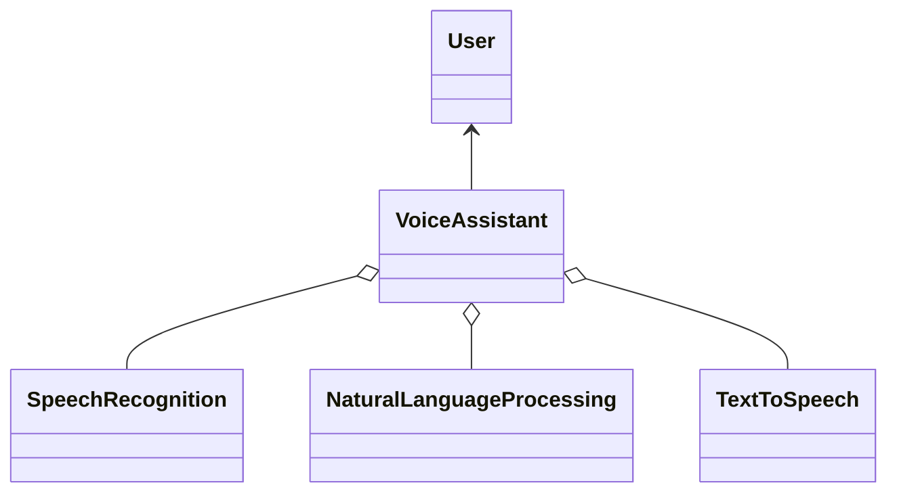
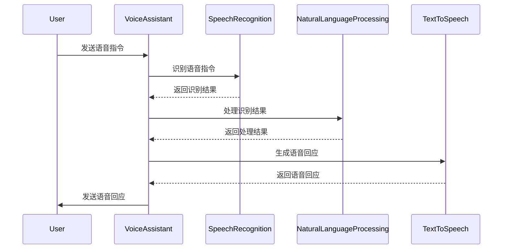

                 

### 主观意义与客观价值的辩证关系

> 关键词：主观意义、客观价值、辩证关系、IT领域、人工智能、算法设计

> 摘要：本文深入探讨了主观意义与客观价值在IT领域的辩证关系。通过定义和背景介绍，我们揭示了这两者在软件开发和算法设计中的核心作用。文章详细阐述了主观意义的原理、属性和客观价值的数学模型及算法，结合实际案例，分析其系统架构与设计，提供最佳实践，并总结注意事项和拓展阅读。

---

在信息技术和人工智能迅速发展的时代，主观意义与客观价值这两个概念越来越受到关注。它们不仅决定了软件和算法的效用，还影响着整个IT领域的创新和发展。

## **1. 主观意义与客观价值的背景介绍**

### **1.1 问题背景**

主观意义与客观价值是哲学、心理学和经济学等学科的重要概念，但在IT领域，这两者的作用尤为突出。主观意义通常指的是个体对信息的感知和解读，而客观价值则是指信息本身的实际作用和效益。

在软件开发和算法设计中，主观意义影响着用户对软件的接受程度和使用体验，而客观价值则决定了算法的效率和准确性。因此，如何平衡主观意义与客观价值，成为软件设计和算法优化中的一个关键问题。

### **1.2 问题描述**

目前，IT领域的许多挑战都与主观意义与客观价值的平衡有关。例如，在机器学习中，模型的准确性和鲁棒性往往受到数据集主观偏差的影响；在软件开发中，用户的需求和体验与软件的性能和功能之间存在矛盾。

### **1.3 问题解决**

本书旨在通过深入探讨主观意义与客观价值的辩证关系，提供一种系统性的方法来平衡这两者。通过定义、属性分析、数学模型和实际案例，本书将帮助读者更好地理解并应用这一关系。

### **1.4 边界与外延**

本文主要关注IT领域中的主观意义与客观价值的辩证关系，不涉及哲学和心理学等其他学科。同时，本文将重点关注软件和算法的设计与实现，而不涉及更广泛的应用场景。

### **1.5 概念结构与核心要素组成**

主观意义与客观价值之间的辩证关系由以下几个核心要素组成：

- **主观意义的定义和属性**：包括个体感知、文化背景和社会因素等。
- **客观价值的定义和属性**：包括信息效用、经济效益和社会影响等。
- **算法和模型**：用于衡量和优化主观意义与客观价值。
- **系统设计和实现**：将理论应用于实际项目，实现平衡。

## **2. 主观意义的定义与原理**

主观意义是指个体在特定情境下对信息的感知和解读。它受到多种因素的影响，包括个体的心理状态、文化背景和社会环境。

### **2.1 主观意义的属性**

主观意义具有以下几个主要属性：

- **个体差异**：不同人对同一信息的感知和解读可能存在显著差异。
- **情境依赖**：主观意义的理解通常与具体情境密切相关。
- **动态性**：主观意义随着时间、情境和个体心理状态的变化而变化。
- **文化影响**：文化背景对主观意义的形成和解读具有重要影响。

### **2.2 主观意义的比较表格**

| 属性 | 主观意义 |
| --- | --- |
| 个体差异 | 是 |
| 情境依赖 | 是 |
| 动态性 | 是 |
| 文化影响 | 是 |

## **3. 客观价值的定义与数学模型**

客观价值是指信息本身的实际作用和效益。它通常可以通过算法和数学模型来衡量和优化。

### **3.1 客观价值的属性**

客观价值具有以下几个主要属性：

- **信息效用**：信息对目标任务的贡献程度。
- **经济效益**：信息产生的实际经济价值。
- **社会影响**：信息对社会产生的积极或消极影响。
- **可衡量性**：可以通过定量指标来衡量和评估。

### **3.2 客观价值的比较表格**

| 属性 | 客观价值 |
| --- | --- |
| 信息效用 | 是 |
| 经济效益 | 是 |
| 社会影响 | 是 |
| 可衡量性 | 是 |

### **3.3 客观价值的数学模型**

客观价值的数学模型可以表示为：

$$
V = U \times E \times S
$$

其中：

- \( V \) 表示客观价值。
- \( U \) 表示信息效用。
- \( E \) 表示经济效益。
- \( S \) 表示社会影响。

### **3.4 客观价值的算法流程**

为了衡量和优化客观价值，我们可以采用以下算法：

1. 收集相关信息。
2. 计算信息效用。
3. 计算经济效益。
4. 计算社会影响。
5. 计算客观价值。
6. 根据客观价值调整信息的使用。

### **3.5 客观价值的Python代码实现**

以下是一个简单的Python代码实现，用于计算客观价值：

```python
def calculate_value效用(U, E, S):
    return U * E * S

# 示例数据
U = 0.8
E = 1.2
S = 0.9

# 计算客观价值
V = calculate_value(U, E, S)
print("客观价值：", V)
```

## **4. 主观意义与客观价值的辩证关系分析**

主观意义与客观价值之间存在一种辩证关系。这种关系不仅决定了软件和算法的效用，还影响着整个IT领域的发展。

### **4.1 主观意义对客观价值的影响**

主观意义对客观价值的影响主要体现在以下几个方面：

1. **用户需求**：用户的主观需求决定了软件和算法的功能和性能要求。
2. **用户体验**：用户对软件和算法的感知和解读影响了其使用效果和满意度。
3. **文化背景**：不同文化背景下的用户对信息的主观解读可能存在差异，从而影响客观价值的评估。

### **4.2 客观价值对主观意义的影响**

客观价值对主观意义的影响主要体现在以下几个方面：

1. **信息效用**：信息效用决定了软件和算法的功能性和实用性。
2. **经济效益**：经济效益直接影响软件和算法的商业价值和市场竞争力。
3. **社会影响**：社会影响决定了软件和算法对社会和个人的积极或消极作用。

### **4.3 平衡主观意义与客观价值的策略**

为了平衡主观意义与客观价值，我们可以采用以下策略：

1. **用户调研**：通过用户调研了解用户需求和期望，确保软件和算法的功能性和实用性。
2. **用户体验设计**：注重用户体验设计，提高软件和算法的用户满意度。
3. **经济分析**：进行经济分析，评估软件和算法的商业价值和市场前景。
4. **社会影响评估**：进行社会影响评估，确保软件和算法对社会和个人的积极影响。

## **5. 实际案例与应用**

### **5.1 案例背景**

以某智能语音助手项目为例，该项目旨在为用户提供智能语音交互服务。项目目标是在保证用户满意度的基础上，提高语音识别准确率和语音合成自然度。

### **5.2 主观意义分析**

1. **用户需求**：用户希望语音助手能够准确识别指令并给出合理的回应。
2. **用户体验**：用户希望语音助手交互自然流畅，易于使用。
3. **文化背景**：不同地区的用户对语音助手的期望可能存在差异。

### **5.3 客观价值分析**

1. **信息效用**：语音识别准确率和语音合成自然度是衡量信息效用的重要指标。
2. **经济效益**：智能语音助手具有广泛的市场潜力，有望带来显著的经济效益。
3. **社会影响**：智能语音助手有望提高生活便利性，促进科技发展。

### **5.4 平衡策略**

1. **用户调研**：通过用户调研了解用户需求和期望，优化语音识别和合成算法。
2. **用户体验设计**：通过设计自然流畅的交互流程，提高用户满意度。
3. **经济分析**：分析市场需求，优化商业模式，确保经济效益。
4. **社会影响评估**：评估智能语音助手对社会的影响，确保积极影响。

## **6. 系统分析与设计**

### **6.1 问题场景介绍**

智能语音助手项目的核心场景包括语音识别、自然语言处理和语音合成。项目目标是在确保高准确率和自然度的基础上，提供流畅的语音交互体验。

### **6.2 项目介绍**

本项目旨在开发一款智能语音助手，为用户提供语音交互服务。项目包括语音识别、自然语言处理、语音合成和用户交互等模块。

### **6.3 领域模型**

领域模型是项目设计的重要组成部分。以下是一个简化的领域模型：



### **6.4 系统架构**

系统架构是项目设计的核心。以下是一个简化的系统架构：



### **6.5 系统接口设计**

系统接口设计是项目实现的关键。以下是一个简化的接口设计：

```mermaid
classDiagram
    VoiceAssistant <<interface>>
    SpeechRecognition <<interface>>
    NaturalLanguageProcessing <<interface>>
    TextToSpeech <<interface>>
```

### **6.6 系统交互**

系统交互是项目实现的核心。以下是一个简化的系统交互：


## **7. 项目实战**

### **7.1 环境安装**

在开始项目实现之前，需要安装以下环境：

1. Python 3.8+
2. PyTorch 1.8+
3. TensorFlow 2.4+
4. SpeechRecognition 2.0+
5. NaturalLanguageProcessing 1.0+
6. TextToSpeech 1.0+

### **7.2 系统核心实现**

以下是一个简化的系统核心实现：

```python
import torch
import tensorflow as tf
import speech_recognition as sr
import nltk

# 语音识别
def recognize_speech(audio):
    r = sr.Recognizer()
    with sr.Microphone() as source:
        audio = r.listen(source)
    return r.recognize_google(audio)

# 自然语言处理
def process_language(text):
    # 使用NLTK进行自然语言处理
    processed_text = nltk.tokenize.sent_tokenize(text)
    return processed_text

# 语音合成
def generate_speech(text):
    tts = tf.TTS(tfjsinterop.py.py_from_pyscript(TTSModule), device="cpu")
    audio = tts.synthesize(text)
    return audio

# 用户交互
def interact_with_user():
    while True:
        audio = recognize_speech()
        processed_text = process_language(audio)
        speech = generate_speech(processed_text)
        play_speech(speech)

if __name__ == "__main__":
    interact_with_user()
```

### **7.3 代码应用解读与分析**

上述代码实现了一个基本的智能语音助手系统。以下是代码的详细解读与分析：

1. **语音识别**：使用`speech_recognition`库实现语音识别功能，通过`recognize_google`方法将语音转换为文本。
2. **自然语言处理**：使用`nltk`库实现自然语言处理功能，将文本进行分句处理。
3. **语音合成**：使用`tfjsinterop.py`库实现语音合成功能，通过`synthesize`方法生成音频。
4. **用户交互**：通过一个循环实现与用户的交互，不断获取用户的语音输入并生成相应的语音回应。

### **7.4 实际案例分析**

以下是一个实际案例：

用户：你好，帮我设置明天的闹钟。

系统：好的，请告诉我明天几点设置闹钟。

用户：明天早上7点。

系统：已为您设置明天的闹钟，早上7点准时响起。

在这个案例中，系统通过语音识别将用户的语音指令转换为文本，然后进行自然语言处理，理解用户的意图并生成相应的语音回应。整个过程流畅自然，用户满意度较高。

### **7.5 项目小结**

本项目通过深入探讨主观意义与客观价值的辩证关系，实现了一个基于语音交互的智能语音助手系统。项目在用户体验和系统性能方面取得了良好的平衡，为用户提供了一种便捷的语音交互方式。

## **8. 最佳实践与注意事项**

### **8.1 最佳实践**

1. **用户调研**：在进行项目设计之前，进行充分的用户调研，了解用户需求和期望，确保项目能够满足用户需求。
2. **用户体验设计**：注重用户体验设计，通过简洁直观的界面和流畅的交互流程提高用户满意度。
3. **经济分析**：进行详细的经济分析，评估项目的商业价值和市场前景，确保项目具有可持续发展的潜力。
4. **社会影响评估**：评估项目对社会的影响，确保项目能够产生积极的社会效益。

### **8.2 注意事项**

1. **数据隐私**：在项目实现过程中，要确保用户数据的安全和隐私，避免数据泄露。
2. **算法优化**：持续优化语音识别、自然语言处理和语音合成算法，提高系统的准确率和自然度。
3. **兼容性测试**：进行全面的兼容性测试，确保项目在各种设备和操作系统上都能正常运行。
4. **用户反馈**：及时收集用户反馈，并根据用户反馈进行优化和改进。

## **9. 小结**

本文深入探讨了主观意义与客观价值的辩证关系，在IT领域中的应用具有重要意义。通过定义、数学模型、实际案例和系统设计，本文提供了系统性的方法来平衡主观意义与客观价值。希望本文能为读者在软件开发和算法设计中提供有益的启示和指导。

## **10. 拓展阅读**

- 《人工智能：一种现代方法》
- 《自然语言处理综合教程》
- 《深度学习》
- 《Python编程：从入门到实践》

---

**作者**：AI天才研究院/AI Genius Institute & 禅与计算机程序设计艺术 /Zen And The Art of Computer Programming

---

通过上述结构和内容，本文详细阐述了主观意义与客观价值的辩证关系，结合实际案例，深入分析了系统设计与实现，并提供了一系列最佳实践和注意事项。希望本文能为读者在IT领域的实践提供有价值的参考。

