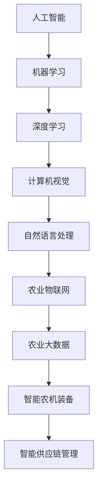

                 


### 《人工智能在农业中的应用：科技兴农与乡村振兴》

#### 关键词：人工智能、农业、科技兴农、乡村振兴

> 摘要：本文深入探讨人工智能在农业中的应用，从背景介绍、核心概念、算法原理、数学模型、系统设计与项目实战等方面，详细分析人工智能如何助力农业现代化，推动科技兴农与乡村振兴。

---

# 引言

农业，作为人类生存的基础产业，自古以来就承载着国计民生的重任。然而，随着时代的变迁，农业也面临着前所未有的挑战。人口增长、城市化加速、劳动力减少、生产成本上升、环境污染等问题，使得传统农业方式难以为继。如何实现农业现代化，提高农业生产效率，保障粮食安全，成为亟待解决的问题。此时，人工智能（AI）以其强大的计算能力和智能分析能力，为农业带来了新的希望。

人工智能在农业中的应用，不仅能够提高生产效率，降低成本，还能够精准预测天气、病虫害，优化种植计划，提高资源利用效率。本文将分章节详细探讨人工智能在农业中的应用，从背景介绍、核心概念、算法原理、数学模型、系统设计与项目实战等方面，为读者呈现一幅人工智能赋能农业的全景图。

# 第一部分：背景介绍

## 1.1 问题背景

农业现代化是当今世界农业发展的必然趋势。然而，我国农业面临着诸多挑战：

1. **劳动力减少**：随着城市化进程的加快，越来越多的农村劳动力转向城市就业，农村劳动力减少，农业劳动力老龄化问题凸显。
2. **生产成本上升**：土地、水资源、化肥、农药等农业生产要素价格逐年上涨，农业生产成本上升。
3. **环境污染**：传统农业生产方式导致土壤、水资源污染，生态环境问题日益严重。
4. **粮食安全**：随着人口增长，粮食需求不断上升，粮食安全成为国家战略问题。

## 1.2 人工智能与农业

人工智能是计算机科学的一个分支，旨在使计算机模拟人类智能行为，并执行复杂的任务。人工智能在农业中的应用，主要体现在以下几个方面：

1. **智能监测与预测**：利用传感器、无人机等技术，实时监测作物生长状况、环境变化，预测天气、病虫害等。
2. **智能决策支持**：基于大数据分析，为农民提供科学的种植、施肥、灌溉等决策支持。
3. **智能农机装备**：研发智能农机，实现耕种、收割、施肥等环节的自动化、智能化。
4. **智能供应链管理**：利用人工智能技术，优化农产品供应链，提高供应链效率。

## 1.3 农业中的AI应用现状

当前，人工智能在农业中的应用已经取得了一定的成果：

1. **智能监测与预测**：例如，利用无人机进行农田监测，实时获取作物生长数据，预测病虫害发生情况。
2. **智能决策支持**：例如，利用大数据分析，为农民提供精准的种植计划，优化作物布局。
3. **智能农机装备**：例如，研发智能收割机、智能灌溉系统等，提高农业生产效率。
4. **智能供应链管理**：例如，利用人工智能技术，实现农产品从生产到销售的全过程监控，提高供应链效率。

## 1.4 本章小结

本章对人工智能在农业中的应用背景进行了介绍，分析了人工智能在农业中的核心作用和应用现状。接下来，我们将进一步探讨人工智能在农业中的应用原理和具体实现。

---

# 第二部分：核心概念与联系

## 2.1 人工智能概述

人工智能是一门研究、开发用于模拟、延伸和扩展人类智能的理论、方法、技术及应用系统的综合性技术科学。它包括机器学习、深度学习、计算机视觉、自然语言处理等多个子领域。人工智能的目标是让计算机具有人类的感知、推理、学习、决策等能力，以实现自动化、智能化。

## 2.2 农业领域相关概念

1. **农业物联网**：农业物联网是通过传感器、RFID、无线网络等技术，实现对农业生产环境的实时监控、数据采集、分析和处理，从而实现农业生产智能化。

2. **农业大数据**：农业大数据是指利用大数据技术，对农业生产、管理、市场等信息进行收集、存储、处理、分析和应用，以提高农业生产效率和质量。

## 2.3 AI在农业中的核心概念联系图



## 2.4 本章小结

本章对人工智能和农业领域中的核心概念进行了介绍，并展示了它们之间的联系。接下来，我们将进一步探讨人工智能在农业中的应用算法原理。

---

# 第三部分：算法原理讲解

## 3.1 农业数据预处理

农业数据预处理是人工智能在农业中应用的关键步骤。预处理包括数据收集、数据清洗、数据整合、数据转换等。

### 3.1.1 数据收集

农业数据的收集是整个数据预处理过程的基础。数据收集的方法包括：

1. **传感器数据**：通过安装在农田中的传感器，实时收集土壤湿度、温度、光照强度、风速等环境数据。
2. **遥感数据**：利用卫星遥感技术，收集农田的地物光谱信息、植被指数等。
3. **气象数据**：通过气象站、天气APP等，收集气象数据，包括气温、湿度、降雨量、风速等。

### 3.1.2 数据清洗

数据清洗是数据预处理的重要环节，目的是去除数据中的噪声和错误，提高数据质量。

1. **缺失值处理**：对于缺失值，可以选择插值法、均值法等进行填补。
2. **异常值处理**：对于异常值，可以选择剔除或修正。
3. **重复值处理**：去除数据集中的重复记录。

### 3.1.3 数据整合

数据整合是将来自不同来源、不同格式的数据进行合并，形成统一的数据集。数据整合的方法包括：

1. **数据转换**：将不同数据源的格式转换为统一格式。
2. **数据映射**：将不同数据源中的相同字段进行映射。
3. **数据合并**：将多个数据源的数据合并成一个完整的数据集。

## 3.2 常见算法原理

在农业数据预处理过程中，常用的算法包括数据预处理算法和数据分析算法。

### 3.2.1 数据预处理算法

数据预处理算法主要包括：

1. **主成分分析（PCA）**：PCA是一种降维算法，通过提取主要成分，降低数据维度，减少数据冗余。
2. **特征选择**：特征选择是从原始数据中提取出对目标变量有较强预测能力的特征子集。

### 3.2.2 数据分析算法

数据分析算法主要包括：

1. **回归分析**：回归分析是一种用于预测连续变量（如产量、价格）的统计方法。
2. **分类算法**：分类算法是一种将数据分为不同类别的算法，如决策树、支持向量机等。

### 3.2.3 算法示例

以回归分析为例，假设我们想要预测农作物的产量。首先，我们需要收集相关的农业数据，包括土壤湿度、温度、光照强度等。然后，我们使用回归算法对数据进行训练，得到一个预测模型。最后，我们将模型应用到新的数据上，预测农作物的产量。

```python
# Python代码示例：回归分析
import numpy as np
from sklearn.linear_model import LinearRegression

# 准备数据
X = np.array([[湿

