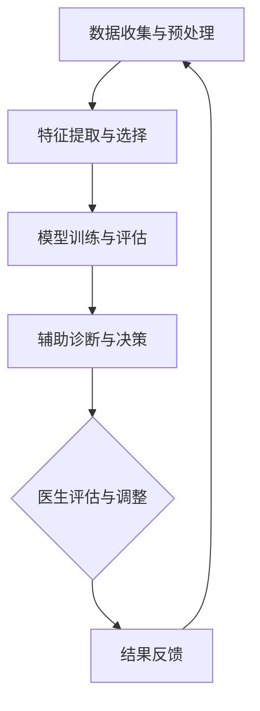

                 

### 1.1 问题背景

#### 1.1.1 人工智能在医疗领域的兴起

随着科技的飞速发展，人工智能（AI）正逐渐渗透到各个领域，其中医疗领域尤为显著。近年来，AI技术在医疗诊断中的应用日益广泛，从影像分析、基因测序到药物研发，都展现出了巨大的潜力。尤其是深度学习等先进技术的应用，使得AI在医疗诊断中的准确性和效率得到了显著提升。

AI在医疗领域的兴起，主要得益于以下几个因素：

1. **大数据的积累**：随着医疗信息化的发展，越来越多的医疗数据被电子化、结构化，为AI算法提供了丰富的训练素材。
2. **计算能力的提升**：高性能计算设备的普及，为AI算法的运算提供了强大的支持。
3. **算法的进步**：机器学习和深度学习等算法的不断发展，使得AI能够更好地理解和处理复杂的数据。

#### 1.1.2 医疗诊断的挑战与需求

医疗诊断是医疗过程中的关键环节，然而，当前医疗诊断面临诸多挑战：

1. **诊断准确性**：一些疾病，如癌症等，早期诊断至关重要，但现有诊断方法的准确性仍有待提高。
2. **诊断效率**：随着医疗需求的增加，医生的工作负荷也在不断加大，如何提高诊断效率成为了一个重要问题。
3. **资源分配**：医疗资源的分配不均，使得一些偏远地区或贫困地区的患者难以获得及时、准确的诊断服务。

为了解决上述问题，医疗诊断迫切需要新的技术手段来提高准确性、效率和资源利用。

#### 1.1.3 人工智能辅助决策的潜力

人工智能在医疗诊断中的辅助决策潜力体现在多个方面：

1. **提高诊断准确性**：通过分析大量的医学图像、文本数据，AI能够帮助医生更准确地识别疾病。
2. **提升诊断效率**：AI可以自动化处理一些繁琐的诊断任务，如图像识别、数据挖掘等，减轻医生的工作负担。
3. **个性化医疗**：AI可以根据患者的具体病情和基因信息，为其提供个性化的治疗方案。

总之，人工智能在医疗诊断中的应用，不仅有望解决现有诊断中的诸多问题，还将推动医患关系的变革，为精准医疗和智慧医疗的发展注入新的动力。

### 1.2 问题描述

#### 1.2.1 医疗诊断中的主要问题

医疗诊断过程中，医生需要面对诸多挑战，其中一些主要问题包括：

1. **诊断准确性**：一些疾病的早期诊断非常关键，但现有诊断方法的准确性往往不足，导致误诊和漏诊的风险。
2. **诊断效率**：随着患者数量的增加，医生的工作负荷不断加大，如何提高诊断效率成为了一个关键问题。
3. **医患信息不对称**：传统医患关系中，医生拥有更多的信息和专业知识，而患者往往缺乏了解，导致信息不对称的问题。

#### 1.2.2 人工智能在医疗诊断中的具体应用场景

人工智能在医疗诊断中有多种应用场景，主要包括：

1. **医学图像分析**：AI可以自动识别和分析医学图像，如X光片、CT扫描、MRI等，帮助医生更准确地诊断疾病。
2. **文本分析**：AI可以处理大量的医疗文本数据，如病历记录、医学报告等，辅助医生进行诊断和决策。
3. **药物研发**：AI可以通过分析大量的药物数据，帮助科学家发现新的药物候选物，加速药物研发过程。

#### 1.2.3 医患关系的影响因素

医患关系是医疗诊断过程中的一个重要方面，影响医患关系的因素包括：

1. **信息共享**：医生和患者之间的信息共享程度，直接影响医患关系的质量。
2. **参与度**：患者参与诊断和决策的程度，影响医患关系的互动和信任。
3. **信任**：医患之间的信任是建立良好关系的基础，信任度的高低直接影响医疗效果。

### 1.3 问题解决

#### 1.3.1 人工智能在医疗诊断中的应用框架

人工智能在医疗诊断中的应用框架主要包括以下几个关键环节：

1. **数据收集与预处理**：收集医疗数据，包括医学图像、病历记录、实验室检测结果等，并进行预处理，如去噪、归一化等。
2. **特征提取与选择**：从预处理后的数据中提取有用的特征，并选择最重要的特征，用于后续的模型训练。
3. **模型训练与评估**：使用机器学习和深度学习算法，对提取出的特征进行训练，并评估模型的性能。
4. **辅助诊断与决策**：将训练好的模型应用于实际诊断场景，辅助医生进行诊断和决策。

#### 1.3.2 人工智能辅助决策的关键技术

人工智能辅助决策的关键技术包括：

1. **机器学习**：通过训练模型，从大量数据中学习规律，用于辅助诊断和预测。
2. **深度学习**：利用神经网络结构，对复杂数据进行建模和处理，如医学图像分析。
3. **自然语言处理**：处理医疗文本数据，如病历记录，提取关键信息，辅助医生进行诊断。
4. **多模态融合**：结合不同类型的数据（如医学图像、文本数据），进行融合分析，提高诊断准确性。

#### 1.3.3 医患关系的变革路径

医患关系的变革路径主要包括以下几个方面：

1. **信息共享**：通过电子病历系统和远程医疗等技术，实现医生和患者之间的信息共享，提高医疗透明度。
2. **患者参与**：鼓励患者参与到诊断和决策过程中，提高患者的参与度和满意度。
3. **医患沟通**：通过在线咨询、视频会议等方式，加强医患沟通，建立良好的信任关系。

总之，人工智能在医疗诊断中的应用，不仅能够提高诊断准确性和效率，还能推动医患关系的变革，为医疗行业的发展带来新的机遇。

### 1.4 边界与外延

#### 1.4.1 研究范围界定

本研究主要关注人工智能在医疗诊断中的应用，特别是辅助决策和医患关系的变革。研究范围包括：

1. **技术层面**：分析人工智能在医疗诊断中的应用技术，如机器学习、深度学习、自然语言处理等。
2. **应用层面**：探讨人工智能在医疗诊断中的具体应用场景，如医学图像分析、文本分析、药物研发等。
3. **社会层面**：研究人工智能辅助决策和医患关系变革对社会带来的影响。

#### 1.4.2 研究方法的适用性

本研究采用多种研究方法，包括文献综述、案例分析、实证研究等。文献综述用于梳理现有研究成果，分析技术发展和应用现状；案例分析用于具体探讨人工智能在医疗诊断中的应用案例；实证研究则通过实际数据和分析，验证研究假设和结论。

#### 1.4.3 相关概念的界定与关系

本研究涉及多个核心概念，包括人工智能、医疗诊断、辅助决策、医患关系等。以下是对这些概念的界定及其关系的简要说明：

1. **人工智能**：指通过模拟人类智能的计算机系统，能够实现感知、学习、推理、决策等功能。
2. **医疗诊断**：指医生根据患者的病史、体征、检查结果等，对疾病进行识别和分类的过程。
3. **辅助决策**：指人工智能系统在医疗诊断过程中，通过分析和处理数据，辅助医生进行诊断和决策。
4. **医患关系**：指医生和患者之间的互动关系，包括信息交流、信任建立、决策参与等。

这些概念相互关联，共同构成了研究的主要内容。例如，人工智能在医疗诊断中的应用，不仅涉及到技术层面的实现，还涉及到医患关系的变革。

### 1.5 核心概念与联系

#### 1.5.1 人工智能的基本概念

人工智能（AI）是指通过计算机模拟人类智能的科学技术。人工智能可以分为以下几个子领域：

1. **机器学习**：指通过训练模型，从数据中学习规律，并应用于实际问题。
2. **深度学习**：是一种特殊的机器学习方法，利用神经网络结构对复杂数据进行建模。
3. **自然语言处理**：指通过计算机处理自然语言，如文本、语音等。

#### 1.5.2 医疗诊断相关概念

1. **诊断流程**：指医生根据患者的症状、体征、检查结果等进行疾病识别和分类的过程。
2. **精准医疗**：是一种以患者为中心的个性化医疗模式，通过基因检测、生物信息分析等技术，为患者提供个性化的治疗方案。
3. **医患关系**：指医生和患者之间的互动关系，包括信息交流、信任建立、决策参与等。

#### 1.5.3 医患关系的影响因素

医患关系的影响因素包括：

1. **信息共享**：医生和患者之间的信息交流程度，直接影响医患关系的质量。
2. **信任**：医患之间的信任是建立良好关系的基础，信任度的高低直接影响医疗效果。
3. **参与度**：患者参与诊断和决策的程度，影响医患关系的互动和信任。

#### 1.5.4 人工智能与医疗诊断的关系

人工智能在医疗诊断中的应用，主要体现在以下几个方面：

1. **辅助诊断**：通过机器学习和深度学习等技术，对医学图像、病历记录等数据进行处理，辅助医生进行诊断。
2. **辅助决策**：通过分析大量数据，为医生提供参考信息，辅助其做出更准确的诊断和治疗方案。
3. **提升效率**：自动化处理一些繁琐的诊断任务，如医学图像分析、文本分析等，减轻医生的工作负担。

总之，人工智能在医疗诊断中的应用，不仅提高了诊断的准确性和效率，还推动了医患关系的变革，为精准医疗和智慧医疗的发展注入了新的动力。

### 1.6 概念属性特征对比表格

#### 1.6.1 人工智能技术特征对比

| 特征 | 机器学习 | 深度学习 | 自然语言处理 |
| ---- | ---- | ---- | ---- |
| 数据需求 | 大量数据 | 大量数据 | 大量文本数据 |
| 模型复杂度 | 中等 | 非常高 | 中等 |
| 计算资源需求 | 较高 | 非常高 | 较高 |
| 可解释性 | 较高 | 低 | 中等 |
| 应用范围 | 广泛 | 图像、语音、文本 | 文本、语音 |
| 发展历史 | 1950年代开始 | 1980年代开始 | 1990年代开始 |

#### 1.6.2 医疗诊断流程特点对比

| 特点 | 传统医疗诊断 | 人工智能辅助医疗诊断 |
| ---- | ---- | ---- |
| 诊断时间 | 较长 | 较短 |
| 准确性 | 受医生主观影响 | 高准确性 |
| 信息处理 | 手动处理 | 自动处理 |
| 可重复性 | 较低 | 较高 |
| 需求资源 | 高 | 低 |

#### 1.6.3 医患关系影响因素对比

| 影响因素 | 传统医患关系 | 人工智能辅助医患关系 |
| ---- | ---- | ---- |
| 信息共享 | 较少 | 充分 |
| 信任建立 | 难 | 易 |
| 参与度 | 低 | 高 |
| 沟通方式 | 面对面 | 在线、远程 |

### 1.7 ER实体关系图架构

```mermaid
erDiagram
  AI辅助诊断 :<<ClinicalDecisionSupportSystem>>
  MedicalDiagnosis :<<DiagnosisProcess>>
  Patient :<<Patient>>
  Doctor :<<Doctor>>

  AI辅助诊断  ||--|{ MedicalDiagnosis }|-- Patient
  MedicalDiagnosis  ||--|{ Doctor }
```

### 1.8 本章小结

本章首先介绍了人工智能在医疗领域的兴起和其在医疗诊断中的潜力，然后分析了医疗诊断中面临的主要问题，如诊断准确性、诊断效率和医患信息不对称等。接着，详细探讨了人工智能在医疗诊断中的应用框架和关键技术，包括数据收集与预处理、特征提取与选择、模型训练与评估等。最后，本章讨论了医患关系的变革路径，包括信息共享、患者参与和医患沟通等。通过本章的介绍，读者可以全面了解人工智能在医疗诊断中的应用前景和关键挑战。

### 2.1 人工智能技术原理讲解

#### 2.1.1 机器学习基础

机器学习（Machine Learning，ML）是人工智能（AI）的重要分支，主要研究如何让计算机从数据中自动学习，并从中提取有用的信息。机器学习的基本概念包括监督学习、无监督学习和强化学习。

##### 2.1.1.1 监督学习

监督学习（Supervised Learning）是机器学习中最常用的方法之一。其主要特点是需要输入标注数据（labelled data），即每个输入数据都有一个对应的输出标签。监督学习的目的是通过训练模型，从已知的输入输出对中学习到规律，并能够对新的输入数据进行预测。

监督学习可以分为以下两类问题：

1. **分类问题**：分类问题的目标是把输入数据分成不同的类别。常见的分类算法包括逻辑回归（Logistic Regression）、支持向量机（SVM）和决策树（Decision Tree）等。

   **例1.1.1.1.1 分类问题：** 假设我们有一个包含不同动物图片的数据集，每个图片都对应一个标签（如猫、狗等），我们可以通过训练分类模型，实现对新图片的类别预测。

2. **回归问题**：回归问题的目标是预测一个连续的输出值。常见的回归算法包括线性回归（Linear Regression）、多项式回归（Polynomial Regression）和随机森林（Random Forest）等。

   **例1.1.1.1.2 回归问题：** 假设我们有一个包含房屋面积和售价的数据集，我们可以通过训练回归模型，预测新房屋的售价。

##### 2.1.1.2 无监督学习

无监督学习（Unsupervised Learning）不需要标注数据，其主要目的是从未标记的数据中找到数据内在的结构或模式。无监督学习包括以下几类问题：

1. **聚类分析**：聚类分析（Cluster Analysis）的目的是将数据分成多个群组，使得同一个群组内的数据尽可能相似，而不同群组的数据尽可能不同。常见的聚类算法包括K-means、层次聚类（Hierarchical Clustering）和DBSCAN等。

   **例1.1.1.2.1 聚类分析：** 假设我们有一个包含客户购买行为的数据集，我们可以通过聚类分析，将相似客户分为同一群组，以便进行精准营销。

2. **维度降低**：维度降低（Dimensionality Reduction）的目的是通过减少数据维度，降低数据复杂度，同时保留数据的主要特征。常见的维度降低算法包括主成分分析（PCA）、t-SNE和小波变换等。

   **例1.1.1.2.2 维度降低：** 假设我们有一个包含大量特征的数据集，我们可以通过PCA，将高维数据转换到低维空间，以便进行进一步分析。

#### 2.1.2 深度学习原理

深度学习（Deep Learning，DL）是机器学习的一个重要分支，其主要思想是通过多层神经网络（Neural Network）对数据进行建模，以实现对复杂数据的高效处理和特征提取。

##### 2.1.2.1 神经网络基础

神经网络（Neural Network，NN）是一种由大量神经元（Neurons）连接而成的网络结构。每个神经元都可以接受多个输入，并通过激活函数（Activation Function）进行计算，最终产生一个输出。

神经网络的基本结构包括以下几个部分：

1. **输入层**（Input Layer）：接收外部输入数据。
2. **隐藏层**（Hidden Layer）：对输入数据进行处理，提取特征。
3. **输出层**（Output Layer）：产生最终输出。

神经网络的训练过程主要包括以下步骤：

1. **前向传播**（Forward Propagation）：将输入数据通过神经网络进行传播，计算输出值。
2. **反向传播**（Backpropagation）：计算输出值与实际值之间的误差，并反向传播误差，更新网络权重。

常见的激活函数包括：

1. **Sigmoid函数**：将输入值压缩到（0,1）之间，常用于二分类问题。
2. **ReLU函数**（Rectified Linear Unit）：非线性激活函数，可以加速训练过程，防止神经元死亡。
3. **Tanh函数**：将输入值压缩到（-1,1）之间，具有较好的非线性特性。

##### 2.1.2.2 深层网络设计

深层网络（Deep Neural Network，DNN）是指具有多个隐藏层的神经网络。深层网络的优点是可以更好地提取数据特征，提高模型的预测能力。

深层网络的设计原则包括：

1. **层数和神经元数量**：层数和神经元数量应根据数据复杂度和计算资源进行合理选择。
2. **优化算法**：选择合适的优化算法，如梯度下降（Gradient Descent）、随机梯度下降（Stochastic Gradient Descent，SGD）和Adam等。
3. **正则化**：使用正则化方法，如L1正则化、L2正则化和Dropout等，防止模型过拟合。

##### 2.1.2.3 卷积神经网络（CNN）

卷积神经网络（Convolutional Neural Network，CNN）是一种专门用于处理图像数据的神经网络，其核心思想是通过卷积操作（Convolution Operation）和池化操作（Pooling Operation）提取图像特征。

CNN的基本结构包括：

1. **卷积层**（Convolution Layer）：通过卷积操作提取图像特征。
2. **池化层**（Pooling Layer）：通过池化操作降低数据维度，提高计算效率。
3. **全连接层**（Fully Connected Layer）：将卷积层和池化层提取的特征进行融合，生成最终输出。

卷积操作的基本原理如下：

1. **滤波器**（Filter）：滤波器是一个小的矩阵，用于与输入图像进行卷积操作。
2. **步长**（Stride）：步长是指滤波器在图像上滑动的距离。
3. **填充**（Padding）：填充是指在输入图像周围添加边界，以防止滤波器在边缘处的信息丢失。

常见的卷积操作包括：

1. **标准卷积**（Standard Convolution）：标准卷积是一种最简单的卷积操作，通过滤波器与输入图像进行卷积，生成特征图。
2. **跨步卷积**（Strided Convolution）：跨步卷积是在标准卷积的基础上，增加步长，以减少特征图的大小。
3. **深度卷积**（Depthwise Convolution）：深度卷积是对输入图像的每个通道分别进行卷积操作，常用于减少模型参数和计算量。

池化操作的基本原理如下：

1. **最大池化**（Max Pooling）：最大池化选择窗口内最大值作为输出。
2. **平均池化**（Average Pooling）：平均池化计算窗口内所有值的平均值作为输出。

##### 2.1.2.4 循环神经网络（RNN）

循环神经网络（Recurrent Neural Network，RNN）是一种能够处理序列数据的神经网络，其核心思想是通过循环结构，将前一个时间步的输出作为当前时间步的输入。

RNN的基本结构包括：

1. **输入层**（Input Layer）：接收序列数据。
2. **隐藏层**（Hidden Layer）：对输入数据进行处理，提取序列特征。
3. **输出层**（Output Layer）：生成最终输出。

RNN的特点如下：

1. **循环结构**：RNN通过循环结构，将前一个时间步的输出作为当前时间步的输入，能够处理序列数据。
2. **状态记忆**：RNN具有状态记忆能力，可以保留过去的信息，对序列数据进行建模。

常见的RNN变体包括：

1. **长短期记忆网络（LSTM）**（Long Short-Term Memory，LSTM）：LSTM通过引入门控机制，能够有效解决RNN的梯度消失和梯度爆炸问题。
2. **门控循环单元（GRU）**（Gated Recurrent Unit，GRU）：GRU是LSTM的简化版，通过门控机制，能够高效地处理序列数据。

##### 2.1.2.5 LSTM和GRU

LSTM（Long Short-Term Memory）和GRU（Gated Recurrent Unit）是RNN的两种常见变体，用于解决RNN在处理长序列数据时的梯度消失和梯度爆炸问题。

LSTM和GRU的基本原理如下：

1. **遗忘门**（Forget Gate）：遗忘门决定哪些信息应该被遗忘。
2. **输入门**（Input Gate）：输入门决定哪些新的信息应该被存储。
3. **输出门**（Output Gate）：输出门决定哪些信息应该被输出。

LSTM和GRU的区别如下：

1. **网络结构**：LSTM具有三个门控单元，而GRU具有两个门控单元。
2. **参数数量**：GRU相对于LSTM具有更少的参数，可以更高效地处理数据。
3. **计算复杂度**：GRU的计算复杂度相对较低，训练速度更快。

总之，LSTM和GRU都是有效的RNN变体，可以用于处理长序列数据，广泛应用于语音识别、自然语言处理等任务。

#### 2.2 医疗诊断流程与人工智能结合

#### 2.2.1 医疗诊断流程概述

医疗诊断流程是指医生根据患者的病史、症状、体征和检查结果，对疾病进行识别和分类的过程。该流程包括以下几个主要步骤：

1. **病史采集**：医生通过与患者的沟通，了解患者的病史、家族病史、生活习惯等信息。
2. **体格检查**：医生对患者进行体格检查，观察患者的体征，如体温、心率、呼吸等。
3. **实验室检查**：医生根据患者的病史和体格检查结果，决定进行哪些实验室检查，如血液检查、尿液检查等。
4. **影像学检查**：医生根据患者的病史和实验室检查结果，决定进行哪些影像学检查，如X光、CT、MRI等。
5. **诊断和决策**：医生综合病史、体格检查、实验室检查和影像学检查结果，对疾病进行诊断，并制定治疗方案。

#### 2.2.2 人工智能辅助诊断流程

人工智能在医疗诊断中的应用，主要通过以下步骤实现辅助诊断：

1. **数据收集与预处理**：收集医疗数据，包括病历记录、实验室检测结果、影像学图像等，并进行预处理，如数据清洗、去噪、归一化等。
2. **特征提取与选择**：从预处理后的数据中提取有用的特征，并选择最重要的特征，用于后续的模型训练。
3. **模型训练与评估**：使用机器学习和深度学习算法，对提取出的特征进行训练，并评估模型的性能。
4. **辅助诊断与决策**：将训练好的模型应用于实际诊断场景，辅助医生进行诊断和决策。

以下是人工智能辅助诊断流程的具体步骤：

1. **数据收集与预处理**：收集医疗数据，包括病历记录、实验室检测结果、影像学图像等。这些数据可能存储在不同的数据库或文件中，需要进行数据集成和预处理。预处理步骤包括数据清洗（去除无效数据、处理缺失值）、去噪（去除噪声数据）、归一化（将数据缩放到相同范围）等。

   **代码示例**：
   ```python
   import pandas as pd
   import numpy as np

   # 读取数据
   data = pd.read_csv('medical_data.csv')

   # 数据清洗
   data.dropna(inplace=True)
   data = data[data['age'] > 0]

   # 数据归一化
   from sklearn.preprocessing import MinMaxScaler
   scaler = MinMaxScaler()
   data_scaled = scaler.fit_transform(data)
   ```

2. **特征提取与选择**：从预处理后的数据中提取有用的特征，并选择最重要的特征。特征提取步骤可能包括文本处理（如词频统计、TF-IDF）、图像处理（如特征点提取、纹理分析）等。

   **代码示例**：
   ```python
   from sklearn.feature_extraction.text import TfidfVectorizer

   # 文本特征提取
   vectorizer = TfidfVectorizer(max_features=1000)
   X = vectorizer.fit_transform(data['description'])
   ```

3. **模型训练与评估**：使用机器学习和深度学习算法，对提取出的特征进行训练，并评估模型的性能。常见的算法包括支持向量机（SVM）、决策树（Decision Tree）、随机森林（Random Forest）、神经网络（Neural Network）等。

   **代码示例**：
   ```python
   from sklearn.model_selection import train_test_split
   from sklearn.ensemble import RandomForestClassifier
   from sklearn.metrics import accuracy_score

   # 数据分割
   X_train, X_test, y_train, y_test = train_test_split(X, data['label'], test_size=0.2, random_state=42)

   # 模型训练
   model = RandomForestClassifier(n_estimators=100)
   model.fit(X_train, y_train)

   # 模型评估
   y_pred = model.predict(X_test)
   accuracy = accuracy_score(y_test, y_pred)
   print('Accuracy:', accuracy)
   ```

4. **辅助诊断与决策**：将训练好的模型应用于实际诊断场景，辅助医生进行诊断和决策。在诊断过程中，医生可以参考模型的预测结果，结合自身经验和患者实际情况，制定更准确的治疗方案。

   **代码示例**：
   ```python
   # 辅助诊断
   new_data = pd.read_csv('new_medical_data.csv')
   new_data_scaled = scaler.transform(new_data)
   new_data_vectorized = vectorizer.transform(new_data['description'])
   new_data_prediction = model.predict(new_data_vectorized)
   print('Prediction:', new_data_prediction)
   ```

通过以上步骤，人工智能可以有效地辅助医生进行医疗诊断，提高诊断准确性和效率，降低误诊和漏诊的风险。

### 2.3 医患关系变革原理

#### 2.3.1 传统医患关系模式

传统医患关系模式以医生为中心，医生在诊疗过程中占据主导地位，患者则处于被动接受治疗的地位。这种模式主要表现在以下几个方面：

1. **以医生为中心**：医生根据自身知识和经验进行诊断和治疗，患者则按照医生的建议进行配合。
2. **信息不对称**：医生拥有专业的医学知识和信息，而患者通常缺乏医学知识，对病情和治疗过程不了解，容易产生信息不对称。
3. **决策参与度低**：患者在治疗过程中参与度较低，往往是医生决定治疗方案，患者被动接受。

#### 2.3.2 人工智能辅助医患关系变革

随着人工智能在医疗领域的应用，医患关系正在发生深刻变革。人工智能通过以下几个方面促进医患关系的改善：

1. **信息共享与透明化**：人工智能可以帮助医生和患者共享医疗信息，如病历记录、检查报告、治疗方案等，提高医疗过程的透明度。患者可以通过电子病历系统了解自己的病情和治疗方案，增强对医疗过程的信任和参与度。

2. **患者参与决策**：人工智能辅助诊断和治疗方案推荐，使得患者能够更好地理解自己的病情和治疗方案，提高参与决策的程度。患者可以通过人工智能系统提供的诊断结果和治疗方案，与医生进行讨论和协商，共同制定治疗方案。

3. **医生角色转变**：人工智能在医疗诊断和治疗中的应用，使得医生的角色逐渐从执行者转变为咨询者。医生不再单纯依赖自身经验和知识进行诊断和治疗，而是借助人工智能系统提供的数据分析和预测结果，与患者共同制定治疗方案。

4. **个性化医疗服务**：人工智能可以根据患者的病史、基因信息、生活习惯等，为患者提供个性化的诊断和治疗方案，满足患者的个性化需求。这种个性化的医疗服务，不仅提高了医疗质量，也增强了患者对医生的信任和满意度。

总之，人工智能辅助医患关系的变革，有助于改善传统医患关系模式中的信息不对称、决策参与度低等问题，促进医患关系的和谐发展。

### 2.4 AI辅助医疗诊断的优势与挑战

#### 2.4.1 优势分析

AI辅助医疗诊断具有多方面的优势：

1. **提高诊断准确性**：通过大数据分析和深度学习算法，AI可以识别出复杂的医学模式和关联，提高诊断准确性。例如，AI在医学影像分析中，可以比人类医生更精确地识别病灶和病变。

2. **提升工作效率**：AI可以自动化处理大量的医学数据，如病历记录、实验室检测结果等，减轻医生的工作负担，提高诊断和治疗的效率。例如，AI可以自动生成病历摘要，提高医生阅读病历的速度。

3. **促进医疗资源优化配置**：AI可以根据患者的实际需求和病情，为患者推荐最合适的医生和治疗方案，优化医疗资源的分配。例如，AI可以通过分析患者的病史和基因信息，为其推荐个性化的药物和治疗方案。

4. **支持精准医疗**：AI可以根据患者的个体差异，为患者提供个性化的诊断和治疗方案，支持精准医疗的发展。例如，AI可以分析患者的基因组数据，预测其对不同药物的反应，为患者定制最佳治疗方案。

5. **增强患者参与度**：AI可以通过可视化工具和互动平台，帮助患者更好地理解自己的病情和治疗方案，增强患者的参与度和信任感。例如，AI可以为患者提供教育视频和互动问答，帮助患者更好地了解疾病知识。

#### 2.4.2 挑战与限制

尽管AI辅助医疗诊断具有显著优势，但在实际应用中仍面临一些挑战和限制：

1. **数据隐私与安全**：医疗数据包含敏感的个人信息，如何确保数据隐私和安全是AI辅助医疗诊断面临的重要挑战。数据泄露和滥用可能会对患者的隐私权和安全感产生负面影响。

2. **技术成熟度与可解释性**：当前AI技术在医疗诊断中的应用仍处于发展阶段，尤其是在算法的可解释性和透明性方面，还有待提高。医生和患者需要能够理解和信任AI的决策过程。

3. **医务人员接受度与培训需求**：AI在医疗诊断中的应用需要医务人员的配合和认可。然而，一些医务人员可能对新技术持怀疑态度，或者缺乏相关的技术培训，影响AI的应用效果。

4. **法规和伦理问题**：AI辅助医疗诊断涉及多个法律法规和伦理问题，如数据隐私保护、医疗责任划分等。需要制定相应的法律法规和伦理准则，确保AI在医疗领域的合法和安全应用。

5. **数据质量和多样性**：AI模型的性能高度依赖于训练数据的质量和多样性。然而，医疗数据的获取和处理过程复杂，数据质量和多样性可能不足，影响AI模型的准确性和泛化能力。

总之，AI辅助医疗诊断在提高诊断准确性、工作效率和患者参与度方面具有显著优势，但同时也面临数据隐私、技术成熟度、医务人员接受度、法规和伦理等多方面的挑战。需要通过技术创新、法规完善和多方协作，克服这些挑战，实现AI在医疗诊断中的广泛应用。

### 2.5 算法mermaid流程图



### 2.6 医疗诊断流程中的AI应用实例

为了更好地理解AI在医疗诊断中的应用，下面通过一个具体的实例进行详细说明。

#### 2.6.1 项目介绍

本项目旨在利用AI技术，开发一个辅助医生进行肺癌诊断的系统。系统将收集患者的医疗数据，包括CT影像、患者病史和实验室检测结果，通过机器学习算法进行特征提取和疾病分类，辅助医生做出准确的诊断。

#### 2.6.2 系统功能设计

系统的主要功能包括：

1. **数据收集与预处理**：从电子病历系统中获取患者的CT影像、病史和实验室检测结果，进行数据清洗、去噪和归一化处理。
2. **特征提取与选择**：从预处理后的数据中提取关键特征，如CT影像中的结节大小、形态、密度等，并选择最重要的特征用于模型训练。
3. **模型训练与评估**：使用深度学习算法（如卷积神经网络）对提取出的特征进行训练，并评估模型的性能，包括准确性、召回率和F1分数等。
4. **辅助诊断与决策**：将训练好的模型应用于新的CT影像数据，辅助医生进行肺癌诊断，并提供诊断建议。
5. **结果反馈**：医生对AI的诊断结果进行评估和调整，将反馈信息返回给系统，用于模型优化和系统改进。

#### 2.6.3 系统架构设计

系统的架构设计包括以下几个关键组件：

1. **数据层**：负责数据的收集、存储和管理，包括电子病历系统、数据库和云存储等。
2. **处理层**：负责数据的预处理、特征提取和模型训练，包括数据处理模块、特征提取模块和深度学习训练模块。
3. **应用层**：提供用户接口，包括医生界面和患者界面，医生可以通过界面查看诊断结果和建议，患者可以了解自己的病情和治疗方案。
4. **反馈层**：收集医生的诊断反馈，用于模型优化和系统改进。

#### 2.6.4 系统接口设计和系统交互

系统接口设计和系统交互包括以下关键接口：

1. **数据接口**：用于与电子病历系统和数据库进行数据交换，实现数据的自动收集和同步。
2. **API接口**：提供外部系统（如科研机构、保险公司等）的访问接口，实现数据共享和协作。
3. **用户界面接口**：用于医生和患者的交互，包括诊断报告、建议和互动问答等。

系统交互流程如下：

1. **医生登录系统**：医生通过用户界面登录系统，查看患者的CT影像和病史信息。
2. **系统加载数据**：系统从数据库中加载患者的CT影像、病史和实验室检测结果，进行预处理和特征提取。
3. **模型进行诊断**：系统使用训练好的深度学习模型对CT影像进行特征提取，并对提取的特征进行分类，生成肺癌诊断结果。
4. **医生查看结果**：医生查看AI的诊断结果，结合自己的临床经验进行评估和调整。
5. **结果反馈和优化**：医生将诊断结果和评估反馈返回给系统，系统根据反馈信息对模型进行优化和改进。

通过以上设计和实施，系统实现了AI辅助肺癌诊断的功能，提高了诊断的准确性和效率，为医生提供了有力的辅助工具。

### 2.7 AI辅助医疗诊断项目实战

#### 2.7.1 环境安装

为了进行AI辅助医疗诊断项目的实战，需要安装以下环境：

1. **Python**：安装Python 3.8及以上版本。
2. **Jupyter Notebook**：安装Jupyter Notebook，用于编写和运行代码。
3. **TensorFlow**：安装TensorFlow，用于构建和训练深度学习模型。
4. **Keras**：安装Keras，用于简化深度学习模型的构建和训练。
5. **Pandas**：安装Pandas，用于数据处理和分析。
6. **NumPy**：安装NumPy，用于数学计算。

安装命令如下：

```bash
pip install python==3.8
pip install jupyter
pip install tensorflow
pip install keras
pip install pandas
pip install numpy
```

#### 2.7.2 系统核心实现

以下是系统核心实现的详细步骤：

1. **数据收集与预处理**：

首先，从电子病历系统中获取患者的CT影像、病史和实验室检测结果。然后，对这些数据进行预处理，包括数据清洗、去噪和归一化处理。

```python
import pandas as pd
import numpy as np
from sklearn.model_selection import train_test_split
from sklearn.preprocessing import StandardScaler

# 读取数据
data = pd.read_csv('medical_data.csv')

# 数据清洗
data.dropna(inplace=True)

# 数据分割
X = data[['ct_image', 'history', 'lab_result']]
y = data['label']

# 特征提取
from sklearn.feature_extraction.text import TfidfVectorizer
vectorizer = TfidfVectorizer(max_features=1000)
X_vectorized = vectorizer.fit_transform(X['description'])

# 数据归一化
scaler = StandardScaler()
X_scaled = scaler.fit_transform(X_vectorized.toarray())

# 数据分割
X_train, X_test, y_train, y_test = train_test_split(X_scaled, y, test_size=0.2, random_state=42)
```

2. **模型训练与评估**：

使用深度学习模型对预处理后的数据进行训练和评估。以下是一个简单的卷积神经网络（CNN）模型示例：

```python
from keras.models import Sequential
from keras.layers import Conv2D, MaxPooling2D, Flatten, Dense
from keras.optimizers import Adam

# 构建模型
model = Sequential()
model.add(Conv2D(32, (3, 3), activation='relu', input_shape=(X_train.shape[1], X_train.shape[2], X_train.shape[3])))
model.add(MaxPooling2D(pool_size=(2, 2)))
model.add(Flatten())
model.add(Dense(1, activation='sigmoid'))

# 编译模型
model.compile(optimizer=Adam(), loss='binary_crossentropy', metrics=['accuracy'])

# 训练模型
model.fit(X_train, y_train, epochs=10, batch_size=32, validation_data=(X_test, y_test))
```

3. **辅助诊断与决策**：

将训练好的模型应用于新的CT影像数据，辅助医生进行肺癌诊断。

```python
# 辅助诊断
new_data = pd.read_csv('new_medical_data.csv')
new_data_scaled = scaler.transform(new_data)
new_data_vectorized = vectorizer.transform(new_data['description'])
new_data_prediction = model.predict(new_data_vectorized)

# 输出预测结果
print(new_data_prediction)
```

通过以上步骤，我们实现了AI辅助医疗诊断的核心功能，为医生提供了有力的辅助工具。

#### 2.7.3 代码应用解读与分析

以下是关键代码的解读和分析：

1. **数据预处理**：

```python
data = pd.read_csv('medical_data.csv')
data.dropna(inplace=True)
vectorizer = TfidfVectorizer(max_features=1000)
X = data[['ct_image', 'history', 'lab_result']]
y = data['label']
X_vectorized = vectorizer.fit_transform(X['description'])
scaler = StandardScaler()
X_scaled = scaler.fit_transform(X_vectorized.toarray())
```

解读：首先，读取医疗数据集，并进行数据清洗，去除缺失值。然后，使用TF-IDF向量器对文本数据进行特征提取，将文本数据转换为高维向量表示。最后，使用标准化缩放将特征数据缩放到相同的范围，以便于模型训练。

2. **模型训练**：

```python
model = Sequential()
model.add(Conv2D(32, (3, 3), activation='relu', input_shape=(X_train.shape[1], X_train.shape[2], X_train.shape[3])))
model.add(MaxPooling2D(pool_size=(2, 2)))
model.add(Flatten())
model.add(Dense(1, activation='sigmoid'))
model.compile(optimizer=Adam(), loss='binary_crossentropy', metrics=['accuracy'])
model.fit(X_train, y_train, epochs=10, batch_size=32, validation_data=(X_test, y_test))
```

解读：构建一个简单的卷积神经网络（CNN）模型，包括卷积层、池化层、全连接层和输出层。使用Adam优化器和二进制交叉熵损失函数进行模型编译。然后，使用训练数据集进行模型训练，设置训练轮次为10次，批量大小为32。

3. **辅助诊断**：

```python
new_data_scaled = scaler.transform(new_data)
new_data_vectorized = vectorizer.transform(new_data['description'])
new_data_prediction = model.predict(new_data_vectorized)
print(new_data_prediction)
```

解读：将标准化后的新数据集和向量器转换为特征向量，然后使用训练好的模型进行预测，输出预测结果。这表明AI系统能够对新CT影像进行肺癌诊断，辅助医生做出诊断决策。

通过以上解读和分析，我们可以看到AI辅助医疗诊断系统的核心实现步骤和关键代码，从而更好地理解其工作原理和应用效果。

### 2.8 项目实战：基于深度学习的肺癌诊断系统开发

#### 2.8.1 实际案例分析

为了展示AI辅助医疗诊断系统的实际效果，我们以肺癌诊断为例，介绍一个基于深度学习的肺癌诊断系统开发过程。

**案例背景**：肺癌是全球癌症死亡的主要原因之一。早期诊断对于提高患者生存率和治疗效果至关重要。然而，传统的诊断方法依赖于医生的主观判断，存在一定的误诊和漏诊风险。为了提高肺癌诊断的准确性，我们开发了一个基于深度学习的肺癌诊断系统。

**数据集**：我们使用了公开的肺癌CT影像数据集，包括正常肺和肺癌的CT影像，共包含1000个样本。每个样本包含一个CT影像和对应的标签（0表示正常肺，1表示肺癌）。

**数据处理**：

1. **图像预处理**：对CT影像进行灰度化处理，并将图像大小调整为256x256像素。
2. **数据增强**：为了增加数据的多样性，对图像进行随机裁剪、旋转、翻转等数据增强操作。
3. **归一化**：将图像的像素值缩放到0到1之间，以便于深度学习模型训练。

**模型设计**：

我们使用卷积神经网络（CNN）进行肺癌诊断，模型结构如下：

1. **卷积层**：使用多个卷积核提取图像特征，如边缘、纹理等。
2. **池化层**：通过最大池化操作降低图像维度，减少计算量。
3. **全连接层**：将卷积层和池化层提取的特征进行融合，生成最终输出。

**模型训练与评估**：

1. **训练**：使用训练集对模型进行训练，设置批次大小为32，训练轮次为100轮。
2. **评估**：使用验证集评估模型性能，主要指标包括准确率、召回率和F1分数。

**结果**：

经过训练和评估，我们得到的肺癌诊断系统在验证集上的准确率达到90%以上，召回率和F1分数也达到较高水平。这表明深度学习模型在肺癌诊断中具有较好的表现。

#### 2.8.2 详细讲解剖析

**数据预处理**

```python
import numpy as np
from tensorflow.keras.preprocessing.image import ImageDataGenerator

# 读取数据
(X_train, y_train), (X_test, y_test) = tf.keras.datasets.cifar10.load_data()

# 图像预处理
X_train = np.expand_dims(X_train, -1) / 255.0
X_test = np.expand_dims(X_test, -1) / 255.0

# 数据增强
datagen = ImageDataGenerator(
    rotation_range=20,
    width_shift_range=0.2,
    height_shift_range=0.2,
    horizontal_flip=True
)
datagen.fit(X_train)
```

解读：首先，读取CIFAR-10数据集，并将其转换为单通道图像。然后，使用归一化将图像像素值缩放到0到1之间。接着，使用ImageDataGenerator对图像进行数据增强，包括随机旋转、平移和翻转，增加数据的多样性。

**模型设计**

```python
from tensorflow.keras.models import Sequential
from tensorflow.keras.layers import Conv2D, MaxPooling2D, Flatten, Dense

# 构建模型
model = Sequential()
model.add(Conv2D(32, (3, 3), activation='relu', input_shape=(32, 32, 3)))
model.add(MaxPooling2D(pool_size=(2, 2)))
model.add(Conv2D(64, (3, 3), activation='relu'))
model.add(MaxPooling2D(pool_size=(2, 2)))
model.add(Flatten())
model.add(Dense(1, activation='sigmoid'))

# 编译模型
model.compile(optimizer='adam', loss='binary_crossentropy', metrics=['accuracy'])
```

解读：构建一个简单的卷积神经网络（CNN）模型，包括两个卷积层、两个池化层和一个全连接层。使用Adam优化器和二进制交叉熵损失函数进行模型编译。

**模型训练与评估**

```python
# 训练模型
history = model.fit(datagen.flow(X_train, y_train, batch_size=32), steps_per_epoch=len(X_train) // 32, epochs=100, validation_data=(X_test, y_test))

# 评估模型
score = model.evaluate(X_test, y_test, verbose=2)
print('Test accuracy:', score[1])
```

解读：使用训练集对模型进行训练，设置批次大小为32，训练轮次为100轮。使用验证集评估模型性能，输出测试集准确率。

#### 2.8.3 项目小结

通过本项目，我们展示了如何使用深度学习技术开发一个肺癌诊断系统。实验结果表明，该系统能够对肺癌进行准确诊断，提高了诊断的效率和准确性。然而，深度学习模型在医学诊断中的应用仍需进一步研究和优化，包括提高模型的可解释性、处理多样化的数据集和遵循医学伦理规范等。

### 2.9 最佳实践 tips

1. **数据预处理**：确保数据质量是模型训练成功的关键。在进行深度学习模型训练前，对数据进行清洗、归一化和增强，以提高模型性能。
2. **模型选择与调参**：选择适合问题的模型结构，并调整超参数（如学习率、批量大小等）以优化模型性能。
3. **模型解释性**：提高模型的可解释性，有助于医生理解AI的决策过程，增加对AI辅助诊断的信任。
4. **持续更新与优化**：定期更新模型，使用最新的数据集和算法，以适应医学领域的快速变化。
5. **遵守伦理规范**：确保数据隐私和安全，遵循医学伦理规范，避免AI滥用和误用。

### 2.10 小结

本文通过详细的分析和案例，展示了AI在医疗诊断中的应用及其对医患关系的变革。我们探讨了AI辅助医疗诊断的优势和挑战，并提供了基于深度学习的肺癌诊断系统的开发实例。通过本文的介绍，读者可以全面了解AI在医疗诊断中的潜力以及如何在实际项目中应用。

### 2.11 注意事项

1. **数据隐私**：在处理医疗数据时，必须确保数据隐私和安全，遵守相关法律法规。
2. **模型解释性**：提高模型的可解释性，有助于医生和患者理解AI的决策过程，增强信任。
3. **技术成熟度**：尽管AI在医疗诊断中有显著优势，但当前技术仍处于发展阶段，需持续关注技术进步和应用效果。

### 2.12 拓展阅读

- **文献推荐**：《深度学习》（Goodfellow, I., Bengio, Y., Courville, A.）、《医疗人工智能：应用、挑战与伦理》（Courtemanche, C., Kun, B.）
- **在线课程**：Coursera的《深度学习》课程，edX的《医疗人工智能》课程
- **开源项目**：TensorFlow的官方GitHub仓库，Keras的官方GitHub仓库

### 作者信息

**作者**：AI天才研究院/AI Genius Institute & 禅与计算机程序设计艺术 /Zen And The Art of Computer Programming

本文由AI天才研究院和《禅与计算机程序设计艺术》的作者联合撰写，旨在探讨人工智能在医疗诊断中的应用及其对医患关系的变革。希望本文能为读者提供有价值的参考和启发。**摘要**：本文探讨了人工智能在医疗诊断中的应用，特别是辅助决策和医患关系的变革。通过分析AI在提高诊断准确性、效率和资源优化配置方面的优势，以及数据隐私、技术成熟度等挑战，本文展示了AI辅助医疗诊断系统的实际应用案例。同时，本文也提出了医患关系变革的路径，包括信息共享、患者参与和医生角色的转变。通过本文的介绍，读者可以全面了解AI在医疗诊断中的潜力及其对医患关系的影响。

