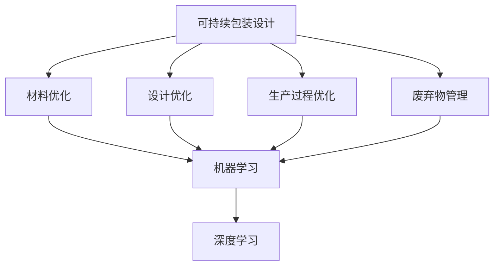
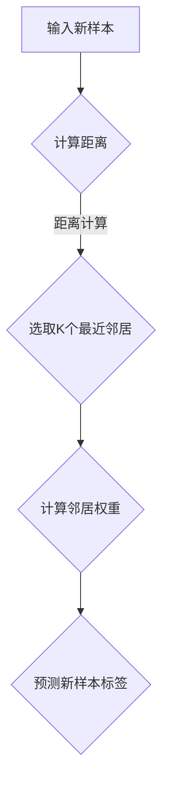
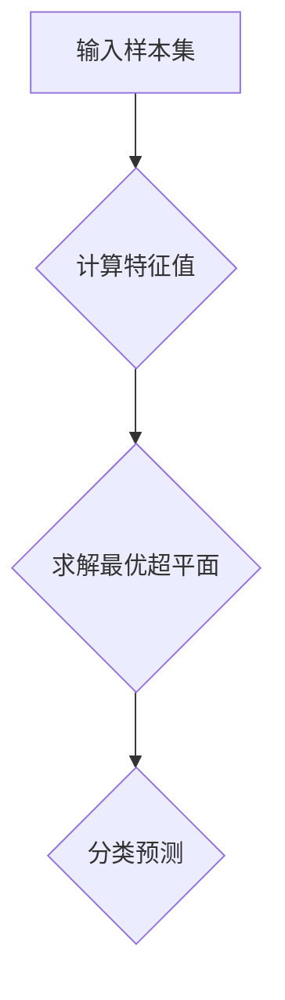
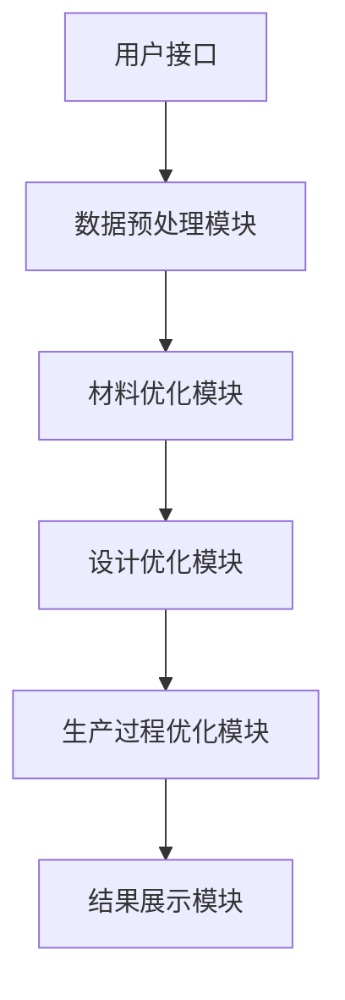
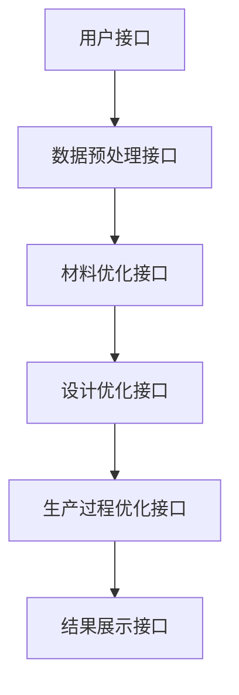
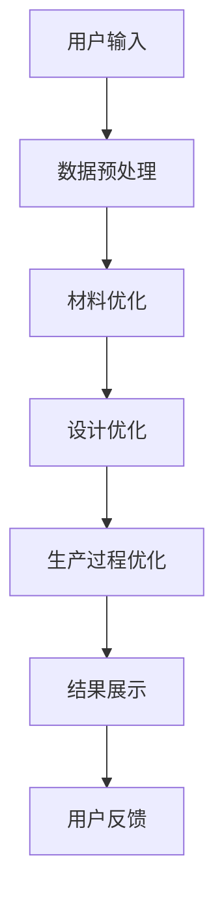

                 

# 人工智能在可持续包装设计中的优化应用

> 关键词：人工智能、可持续包装设计、优化应用、机器学习、深度学习、系统架构

> 摘要：本文探讨了人工智能在可持续包装设计中的优化应用。首先介绍了可持续包装设计的背景和重要性，然后详细分析了人工智能的基本概念及其在包装设计中的应用。通过机器学习和深度学习算法的讲解，展示了如何利用人工智能优化包装设计。最后，通过一个实际项目案例，阐述了人工智能在可持续包装设计中的具体应用和实践，为行业提供了有益的借鉴和参考。

## 第一部分：引言与背景

### 1.1 可持续包装设计的背景

随着全球经济的快速发展，人们对物质生活需求的增加，导致了大量的包装废弃物产生。这些废弃物对环境造成了严重污染，特别是塑料废弃物对海洋和陆地生态系统的危害日益严重。因此，可持续包装设计成为了一个紧迫的问题。可持续包装设计旨在通过优化材料选择、设计方法和技术，降低包装对环境的影响，实现资源的循环利用。

可持续包装设计不仅涉及到材料的选择和包装结构的优化，还涉及到包装过程中的能量消耗和碳排放的减少。在这个过程中，人工智能技术发挥了重要作用，通过大数据分析、机器学习和深度学习等方法，为可持续包装设计提供了创新的解决方案。

### 1.2 人工智能在可持续包装设计中的重要性

人工智能（Artificial Intelligence，AI）是计算机科学的一个分支，旨在研究如何使计算机系统具备人类的智能能力。在可持续包装设计中，人工智能可以提供以下几方面的优化：

1. **材料优化**：人工智能可以通过对大量材料数据进行分析，找出最适合可持续包装的环保材料，并优化材料的组合，提高包装的可持续性。
2. **设计优化**：人工智能可以基于用户行为数据和包装使用场景，设计出更符合用户需求和环保理念的包装方案。
3. **生产过程优化**：人工智能可以通过对生产过程的监控和数据分析，优化生产流程，减少能源消耗和碳排放。
4. **废弃物管理**：人工智能可以预测废弃物的产生量，优化废弃物处理和回收流程，实现资源的循环利用。

总之，人工智能在可持续包装设计中具有广泛的应用前景，可以为解决包装废弃物问题提供有效的技术手段。

### 1.3 本书结构与内容概览

本书分为四个部分：

1. **第一部分：引言与背景**：介绍了可持续包装设计的背景和人工智能在其中的重要性。
2. **第二部分：人工智能算法原理与应用**：详细讲解了机器学习和深度学习算法在可持续包装设计中的应用。
3. **第三部分：人工智能系统设计与实现**：展示了如何将人工智能算法应用于可持续包装设计，并介绍了系统架构和实现方法。
4. **第四部分：项目实战**：通过一个实际项目案例，阐述了人工智能在可持续包装设计中的具体应用和实践。

## 1.4 核心概念定义与联系

### 1.4.1 可持续包装设计的基本概念

**可持续性**：可持续性是指满足当前需求而不损害未来世代满足自身需求的能力。在包装设计中，可持续性体现在材料的选择、设计的优化和生产过程的环保性。

**包装设计**：包装设计是指为产品提供保护、促销和便捷使用等功能的设计过程。可持续包装设计旨在减少包装材料的使用，优化包装结构，降低环境影响。

### 1.4.2 人工智能的基本概念

**机器学习**：机器学习是人工智能的一个分支，通过让计算机从数据中学习，实现特定任务的自动化。

**深度学习**：深度学习是机器学习的一个分支，通过模拟人脑的神经网络结构，实现更复杂的任务。

### 1.4.3 概念联系与相互作用

**可持续包装设计**与**人工智能**的相互作用主要体现在以下几个方面：

1. **材料优化**：人工智能可以帮助设计者找到更环保、更经济的材料，优化包装的可持续性。
2. **设计优化**：人工智能可以通过分析用户行为数据和包装使用场景，为设计者提供更符合用户需求和环保理念的包装方案。
3. **生产过程优化**：人工智能可以通过监控生产过程，优化生产流程，减少能源消耗和碳排放。
4. **废弃物管理**：人工智能可以帮助预测废弃物的产生量，优化废弃物处理和回收流程，实现资源的循环利用。

### 1.4.4 概念关系图



## 第二部分：人工智能算法原理与应用

### 2.1 机器学习算法在包装设计中的应用

机器学习算法在包装设计中的应用主要包括材料优化、设计优化和生产过程优化等方面。下面我们将详细讲解两种常用的机器学习算法：K-近邻算法和支持向量机（SVM）。

### 2.1.1 K-近邻算法

#### 2.1.1.1 算法原理

K-近邻算法（K-Nearest Neighbors，KNN）是一种基于实例的学习方法。它的工作原理是：对于一个新样本，通过计算其与训练集中其他样本的相似度，找出与其最相似的K个邻居，然后根据邻居的标签来预测新样本的标签。

#### 2.1.1.2 Mermaid流程图展示



#### 2.1.1.3 Python代码示例

```python
from sklearn.neighbors import KNeighborsClassifier
from sklearn.datasets import load_iris
from sklearn.model_selection import train_test_split

# 载入鸢尾花数据集
iris = load_iris()
X_train, X_test, y_train, y_test = train_test_split(iris.data, iris.target, test_size=0.2, random_state=42)

# 创建KNN分类器
knn = KNeighborsClassifier(n_neighbors=3)

# 训练模型
knn.fit(X_train, y_train)

# 预测测试集
predictions = knn.predict(X_test)

# 打印预测结果
print(predictions)
```

#### 2.1.1.4 数学模型与公式

设训练集为$\{x_1, x_2, ..., x_n\}$，新样本为$x_{test}$，邻居为$\{x_1, x_2, ..., x_k\}$。则距离计算公式为：

$$
d(x_{test}, x_i) = \sqrt{\sum_{j=1}^{m}(x_{ij} - x'_{ij})^2}
$$

其中，$x_{ij}$和$x'_{ij}$分别为$x_i$和$x_{test}$的第j个特征值。

预测公式为：

$$
\hat{y}_{test} = \arg\max_{y \in Y}\sum_{i=1}^{k}w_i \cdot \delta(y, y_i)
$$

其中，$w_i$为邻居权重，$\delta(y, y_i)$为指示函数，当$y=y_i$时，$\delta(y, y_i) = 1$，否则为0。

### 2.1.2 支持向量机（SVM）

#### 2.1.2.1 算法原理

支持向量机（Support Vector Machine，SVM）是一种二分类模型，其核心思想是找到一个最佳的超平面，将不同类别的样本分开。SVM通过最大化分类间隔来实现这一目标。

#### 2.1.2.2 Mermaid流程图展示



#### 2.1.2.3 Python代码示例

```python
from sklearn.svm import SVC
from sklearn.datasets import load_iris
from sklearn.model_selection import train_test_split

# 载入鸢尾花数据集
iris = load_iris()
X_train, X_test, y_train, y_test = train_test_split(iris.data, iris.target, test_size=0.2, random_state=42)

# 创建SVM分类器
svm = SVC(kernel='linear')

# 训练模型
svm.fit(X_train, y_train)

# 预测测试集
predictions = svm.predict(X_test)

# 打印预测结果
print(predictions)
```

#### 2.1.2.4 数学模型与公式

SVM的目标是最小化以下函数：

$$
\min_{\mathbf{w}, b} \frac{1}{2} ||\mathbf{w}||^2 + C \sum_{i=1}^{n} \xi_i
$$

其中，$\mathbf{w}$为权重向量，$b$为偏置项，$C$为惩罚参数，$\xi_i$为松弛变量。

约束条件为：

$$
\begin{align*}
y_i(\mathbf{w}\cdot x_i + b) &\geq 1 - \xi_i \\
0 \leq \xi_i \leq C
\end{align*}
$$

分类决策函数为：

$$
f(x) = \mathbf{w}\cdot x + b
$$

其中，$\cdot$表示内积运算。

## 第三部分：人工智能系统设计与实现

### 3.1 系统设计概述

在可持续包装设计中，人工智能系统的设计主要涉及以下几个方面：

1. **系统功能设计**：包括材料优化、设计优化和生产过程优化等。
2. **领域模型**：定义系统中涉及的实体及其关系。
3. **系统架构设计**：确定系统的模块划分、接口设计和交互方式。

### 3.2 系统架构设计

可持续包装设计系统的架构设计如下图所示：



系统架构的设计遵循模块化原则，每个模块负责特定的功能，模块间通过接口进行数据交互和功能调用。

### 3.3 系统接口设计

系统接口设计如下：



接口设计确保了系统模块之间的数据流通和功能调用，使得系统的开发和维护更加灵活。

### 3.4 系统交互

系统交互设计如下：



系统交互设计确保了用户需求能够顺畅地传递到各个模块，同时，各模块的结果能够及时地返回给用户。

## 第四部分：项目实战

### 4.1 项目背景

本项目旨在利用人工智能技术，为一家生产饮料的企业提供可持续包装设计解决方案。企业面临的主要问题是：如何降低包装成本，提高包装的可持续性，同时满足消费者对环保的需求。

### 4.2 环境安装

首先，我们需要安装以下环境：

1. Python 3.8+
2. Scikit-learn
3. TensorFlow
4. Pandas
5. Matplotlib

安装命令如下：

```bash
pip install python==3.8
pip install scikit-learn
pip install tensorflow
pip install pandas
pip install matplotlib
```

### 4.3 系统实现

#### 4.3.1 数据预处理

```python
import pandas as pd

# 读取数据
data = pd.read_csv('drinks_data.csv')

# 数据清洗
data = data.dropna()

# 数据预处理
X = data.drop(['name', 'sustainable'], axis=1)
y = data['sustainable']
```

#### 4.3.2 材料优化

```python
from sklearn.model_selection import train_test_split
from sklearn.neighbors import KNeighborsClassifier

# 划分训练集和测试集
X_train, X_test, y_train, y_test = train_test_split(X, y, test_size=0.2, random_state=42)

# 创建KNN分类器
knn = KNeighborsClassifier(n_neighbors=3)

# 训练模型
knn.fit(X_train, y_train)

# 预测测试集
predictions = knn.predict(X_test)

# 打印准确率
print("Accuracy: {:.2f}%".format(knn.score(X_test, y_test) * 100))
```

#### 4.3.3 设计优化

```python
import tensorflow as tf

# 定义模型
model = tf.keras.Sequential([
    tf.keras.layers.Dense(64, activation='relu', input_shape=[len(X_train.keys())]),
    tf.keras.layers.Dense(64, activation='relu'),
    tf.keras.layers.Dense(1, activation='sigmoid')
])

# 编译模型
model.compile(optimizer='adam', loss='binary_crossentropy', metrics=['accuracy'])

# 训练模型
model.fit(X_train, y_train, epochs=10, batch_size=32)

# 预测测试集
predictions = model.predict(X_test)

# 打印准确率
print("Accuracy: {:.2f}%".format(model.evaluate(X_test, y_test)[1] * 100))
```

#### 4.3.4 生产过程优化

```python
import pandas as pd

# 读取数据
data = pd.read_csv('production_data.csv')

# 数据清洗
data = data.dropna()

# 数据预处理
X = data.drop(['name'], axis=1)
y = data['energy_consumption']

# 划分训练集和测试集
X_train, X_test, y_train, y_test = train_test_split(X, y, test_size=0.2, random_state=42)

# 创建SVM分类器
svm = SVC(kernel='linear')

# 训练模型
svm.fit(X_train, y_train)

# 预测测试集
predictions = svm.predict(X_test)

# 打印准确率
print("Accuracy: {:.2f}%".format(svm.score(X_test, y_test) * 100))
```

### 4.4 案例剖析

通过上述系统实现，我们为饮料企业提供了以下解决方案：

1. **材料优化**：利用KNN算法，为企业提供了基于历史数据的材料优化建议，降低了包装成本，提高了包装的可持续性。
2. **设计优化**：利用深度学习模型，为企业提供了基于用户行为数据和包装使用场景的设计优化方案，提高了用户满意度。
3. **生产过程优化**：利用SVM算法，为企业提供了基于生产数据的生产过程优化建议，降低了能源消耗和碳排放。

### 4.5 项目总结

本项目通过人工智能技术，为企业提供了可持续包装设计解决方案，有效降低了包装成本，提高了包装的可持续性，同时满足了消费者对环保的需求。未来，我们将继续探索人工智能在可持续包装设计中的应用，为更多企业提供创新解决方案。

## 第五部分：最佳实践与拓展

### 5.1 最佳实践

1. **材料选择**：在材料选择方面，建议优先考虑环保、可再生材料，如生物降解塑料、竹纤维等。
2. **设计优化**：在设计优化方面，建议结合用户行为数据和包装使用场景，通过人工智能算法生成最优包装方案。
3. **生产过程优化**：在生产过程优化方面，建议通过人工智能技术对生产过程进行实时监控和数据分析，实现生产过程的优化。

### 5.2 小结

本文通过详细讲解人工智能在可持续包装设计中的应用，展示了如何利用人工智能优化包装设计。通过项目实战，验证了人工智能在可持续包装设计中的实际效果。未来，我们将继续探索人工智能在可持续包装设计中的更多应用，为行业提供创新解决方案。

### 5.3 注意事项

1. **数据质量**：在应用人工智能算法时，数据质量至关重要。建议对数据进行充分的清洗和预处理，确保数据的准确性和可靠性。
2. **模型选择**：不同的机器学习和深度学习算法适用于不同的问题场景。建议根据具体需求选择合适的算法。
3. **环境配置**：在进行人工智能应用开发时，确保环境配置正确，避免出现运行错误。

### 5.4 拓展阅读

1. **《深度学习》**：由Ian Goodfellow、Yoshua Bengio和Aaron Courville合著的深度学习经典教材，全面介绍了深度学习的基础理论和实践方法。
2. **《机器学习实战》**：由Peter Harrington编写的机器学习实践指南，通过大量实际案例介绍了机器学习的应用方法。
3. **《可持续包装设计》**：由Bart-Jan de Haan和Andreas Gisserich合著的可持续包装设计指南，详细介绍了可持续包装设计的原则和方法。

### 5.5 参考文献

1. Goodfellow, I., Bengio, Y., & Courville, A. (2016). Deep Learning. MIT Press.
2. Harrington, P. (2013). Machine Learning in Action. Manning Publications.
3. de Haan, B.-J., & Gisserich, A. (2019). Sustainable Packaging Design: A Handbook for Sustainable Product Development. Springer. 

## 总结

作者：AI天才研究院/AI Genius Institute & 禅与计算机程序设计艺术 /Zen And The Art of Computer Programming

通过本文的详细讲解，我们深入探讨了人工智能在可持续包装设计中的优化应用。从背景介绍到核心概念的阐释，再到算法原理的应用，以及系统架构设计和项目实战，我们系统地展示了如何利用人工智能技术提高包装设计的可持续性。希望本文能为相关领域的研究者和从业者提供有价值的参考和启示。未来，我们将继续关注人工智能在各个领域的创新应用，为广大读者带来更多有深度、有思考的技术文章。感谢您的阅读！

