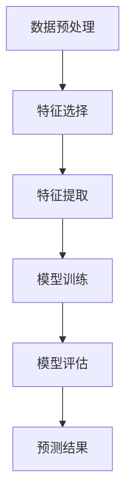
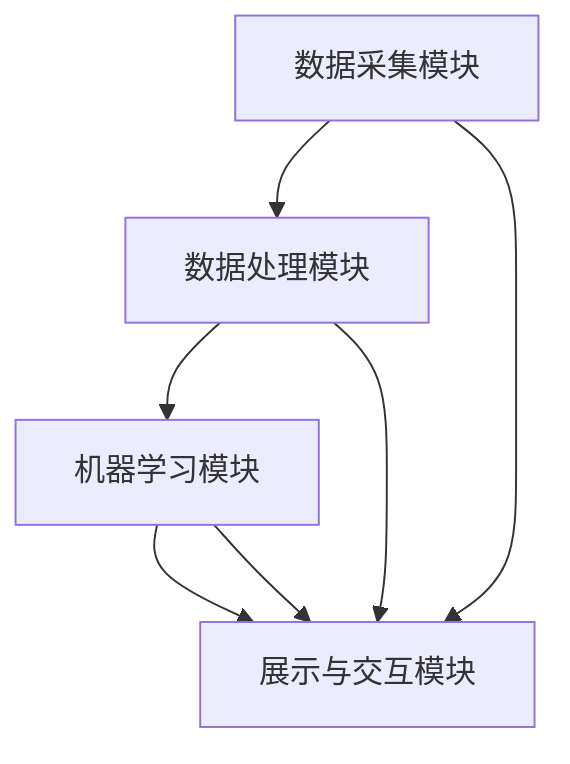
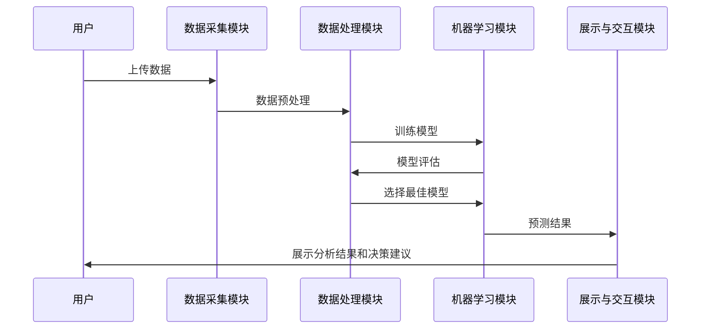

                 

# 《人工智能在可持续渔业管理中的应用》

> 关键词：人工智能、可持续渔业管理、算法、系统架构、项目实战

> 摘要：本文旨在探讨人工智能在可持续渔业管理中的应用。通过分析当前渔业资源现状、可持续渔业管理的关键挑战以及人工智能的发展历程和应用场景，本文阐述了人工智能在渔业管理中的优势与挑战，并从算法原理、系统架构设计、项目实战等方面详细介绍了人工智能在可持续渔业管理中的实际应用。文章最后提出了最佳实践和拓展阅读，为读者提供了进一步学习和研究的方向。

## 《人工智能在可持续渔业管理中的应用》目录大纲

### 第一部分：问题背景与核心概念

#### 第1章：可持续渔业管理概述

##### 1.1.1 问题背景

- 鱼类资源现状与问题

- 可持续渔业管理的意义

##### 1.1.2 可持续渔业管理的概念与内涵

- 定义与原则

- 核心要素

##### 1.1.3 可持续渔业管理的关键挑战

- 资源评估与监测

- 技术与政策支持

##### 1.1.4 可持续渔业管理的现状与趋势

- 国内外发展情况

- 未来发展方向

#### 第2章：人工智能在渔业中的应用基础

##### 2.1.1 人工智能概述

- 人工智能的发展历程

- 主要技术与方法

##### 2.1.2 人工智能在渔业中的应用场景

- 数据采集与处理

- 预测与分析

- 决策支持

##### 2.1.3 人工智能在渔业中的优势与挑战

- 优势

- 挑战

### 第二部分：算法原理与系统架构

#### 第3章：核心概念与联系

##### 3.1.1 人工智能相关核心概念

- 算法原理与模型

- 特征工程

- 模型训练与评估

##### 3.1.2 可持续渔业管理相关核心概念

- 资源评估

- 环境监测

- 政策法规

##### 3.1.3 概念属性特征对比表格

- 人工智能相关概念

- 可持续渔业管理相关概念

##### 3.1.4 ER实体关系图架构

- 实体关系图构建

- 关系与属性分析

#### 第4章：人工智能算法原理讲解

##### 4.1.1 算法概述

- 主要算法类型

- 常见算法应用场景

##### 4.1.2 算法mermaid流程图

- 算法流程

- 数据流向

##### 4.1.3 算法原理讲解

- 数学模型

- 公式推导

- 举例说明

#### 第5章：系统架构设计

##### 5.1.1 问题场景介绍

- 渔业管理场景描述

- 需求分析

##### 5.1.2 系统功能设计

- 领域模型mermaid类图

- 功能模块划分

##### 5.1.3 系统架构设计

- mermaid架构图

- 技术选型

##### 5.1.4 系统接口设计

- 接口规范

- 数据流转

##### 5.1.5 系统交互mermaid序列图

- 序列图展示

- 交互流程分析

### 第三部分：项目实战

#### 第6章：项目实战

##### 6.1.1 环境安装

- 系统环境搭建

- 开发工具与依赖安装

##### 6.1.2 系统核心实现源代码

- 代码架构设计

- 关键模块实现

##### 6.1.3 代码应用解读与分析

- 代码解读

- 算法应用分析

##### 6.1.4 实际案例分析与详细讲解剖析

- 案例描述

- 分析与讲解

##### 6.1.5 项目小结

- 项目总结

- 经验与反思

### 第四部分：最佳实践与拓展阅读

#### 第7章：最佳实践与拓展阅读

##### 7.1.1 最佳实践 tips

- 实践经验分享

- 解决方案建议

##### 7.1.2 小结

- 全书总结

- 主要观点回顾

##### 7.1.3 注意事项

- 使用注意事项

- 安全与隐私保护

##### 7.1.4 拓展阅读

- 相关书籍推荐

- 学术论文与最新研究动态

## 引言

随着全球人口的增长和人们对水产品需求的增加，渔业资源面临着前所未有的压力。过度捕捞、环境污染、生态系统破坏等问题日益严重，渔业资源管理变得愈加复杂和紧迫。为了实现渔业资源的可持续利用，各国政府和国际组织正在积极探索可持续渔业管理的新方法和技术。

可持续渔业管理是指通过科学、合理和有效的渔业管理措施，保护和恢复渔业资源，确保渔业生产、生态保护和社会福利的协调发展。在这个过程中，人工智能（AI）作为一种新兴的技术手段，正逐渐成为可持续渔业管理的重要工具。本文将从以下几个方面展开讨论：

1. **问题背景与核心概念**：介绍可持续渔业管理的现状、问题以及人工智能的基本概念和应用场景。

2. **算法原理与系统架构**：详细讲解人工智能在渔业管理中的算法原理、系统架构设计和实现方法。

3. **项目实战**：通过实际案例，展示人工智能在可持续渔业管理中的应用效果。

4. **最佳实践与拓展阅读**：总结全书内容，提出最佳实践和拓展阅读建议。

让我们一步一步思考，深入探讨人工智能在可持续渔业管理中的应用。

## 第一部分：问题背景与核心概念

### 第1章：可持续渔业管理概述

#### 1.1.1 问题背景

鱼类作为全球重要的食品来源，对人类饮食和社会经济具有重大影响。然而，渔业资源的过度捕捞和环境污染等问题日益严重，导致鱼类种群数量减少、渔业产量下降，甚至对海洋生态系统造成破坏。这些问题不仅影响到渔业从业者，也对全球食品安全、生态平衡和社会经济发展产生了深远影响。

当前，全球渔业资源面临的主要问题包括：

1. **过度捕捞**：为了追求短期经济效益，许多渔区出现了过度捕捞现象，导致鱼类种群数量锐减，部分鱼类甚至濒临灭绝。

2. **环境污染**：工业废水、农药和化肥的排放，以及石油泄漏等污染事件，对渔业资源造成了严重损害。

3. **生态系统破坏**：海洋生态系统的破坏导致鱼类栖息地的减少，进而影响渔业资源的生产和繁殖。

#### 1.1.2 可持续渔业管理的概念与内涵

可持续渔业管理是指通过科学、合理和有效的渔业管理措施，保护和恢复渔业资源，确保渔业生产、生态保护和社会福利的协调发展。其核心目标是实现渔业资源的长期可持续发展，以满足当前和未来世代的需求。

可持续渔业管理的定义与原则包括：

- **定义**：可持续渔业管理是指综合考虑渔业资源、生态环境、社会经济等多方面因素，通过科学的评估和管理措施，实现渔业资源的长期可持续利用。

- **原则**：

  - **资源保护优先**：在渔业管理中，应将资源保护置于首位，确保鱼类种群的长期生存和繁衍。

  - **科学评估与监测**：通过科学的评估和监测，了解渔业资源的现状和变化趋势，为渔业管理提供科学依据。

  - **生态系统完整性**：维护海洋生态系统的完整性，防止过度捕捞和其他人类活动对生态系统造成破坏。

  - **公众参与**：鼓励公众参与渔业管理，提高渔业资源的保护意识和社会责任感。

#### 1.1.3 可持续渔业管理的关键挑战

实现可持续渔业管理面临以下关键挑战：

1. **资源评估与监测**：准确评估渔业资源的现状和变化趋势，是可持续渔业管理的基础。然而，由于渔业资源分布广泛、环境复杂，资源评估和监测工作面临很大的挑战。

2. **技术与政策支持**：可持续渔业管理需要先进的技术手段和政策支持。然而，许多国家和地区在渔业技术和管理政策方面仍存在不足，制约了可持续渔业管理的发展。

3. **利益分配**：渔业资源的管理涉及到多方利益，包括渔民、政府、企业等。如何平衡各方利益，实现公平合理的利益分配，是可持续渔业管理的重要挑战。

#### 1.1.4 可持续渔业管理的现状与趋势

全球范围内，可持续渔业管理的发展呈现出以下趋势：

1. **国内外发展情况**：

   - **发达国家**：发达国家在渔业技术和管理政策方面相对成熟，可持续渔业管理取得了显著成效。例如，美国、欧盟等国家和地区在渔业资源评估、监测和生态保护方面取得了重要成果。

   - **发展中国家**：发展中国家在渔业资源管理和可持续利用方面面临较大压力。许多发展中国家渔业资源丰富，但管理技术和政策支持不足，导致渔业资源过度开发，生态破坏严重。

2. **未来发展方向**：

   - **技术创新**：随着人工智能、大数据等技术的不断发展，可持续渔业管理将更加依赖于先进的技术手段，提高资源评估和监测的精度和效率。

   - **国际合作**：全球渔业资源的可持续发展需要国际合作。各国政府和国际组织应加强合作，共同应对渔业资源管理和保护面临的挑战。

   - **政策完善**：完善渔业管理政策和法律法规，为可持续渔业管理提供有力保障。同时，加强渔业管理人员的培训和意识教育，提高渔业资源保护水平。

### 第2章：人工智能在渔业中的应用基础

#### 2.1.1 人工智能概述

人工智能（Artificial Intelligence，AI）是计算机科学的一个分支，旨在通过模拟人类智能行为，实现机器自主学习和智能决策。人工智能的发展经历了多个阶段，从最初的规则系统到现代的深度学习和自然语言处理，人工智能技术在各个领域都取得了显著的成果。

人工智能的发展历程可以概括为以下几个阶段：

1. **符号主义阶段（1956-1974）**：在这一阶段，人工智能研究主要集中在逻辑推理和知识表示上，通过构建符号系统实现智能行为。

2. **连接主义阶段（1980s-1990s）**：连接主义采用神经网络模型，通过调整网络中的连接权重实现学习。这一阶段，神经网络在图像识别、语音识别等领域取得了重要突破。

3. **统计学习阶段（2000s-2010s）**：统计学习方法，如支持向量机、随机森林等，在处理大规模数据方面表现出色。深度学习在这一阶段得到了快速发展。

4. **认知计算阶段（2010s-至今）**：人工智能研究开始关注模仿人类认知过程，通过强化学习、迁移学习等技术实现更高级的智能行为。

人工智能的主要技术与方法包括：

1. **机器学习**：通过训练模型，使计算机能够从数据中学习并做出预测或决策。机器学习包括监督学习、无监督学习和半监督学习。

2. **深度学习**：一种基于多层神经网络的学习方法，能够自动提取特征并实现复杂的任务。深度学习在图像识别、自然语言处理、语音识别等领域取得了突破性成果。

3. **自然语言处理**：通过计算机理解和生成人类语言的技术。自然语言处理包括文本分类、机器翻译、语音识别等。

4. **计算机视觉**：使计算机能够理解和处理图像和视频的技术。计算机视觉包括目标检测、图像分割、人脸识别等。

5. **智能优化算法**：通过模拟生物进化、群体智能等机制，实现复杂问题的求解。智能优化算法包括遗传算法、粒子群优化、模拟退火等。

#### 2.1.2 人工智能在渔业中的应用场景

人工智能在渔业中的应用场景广泛，涵盖了数据采集与处理、预测与分析、决策支持等多个方面：

1. **数据采集与处理**：

   - **环境数据采集**：通过传感器和监测设备，实时采集水质、水温、盐度等环境数据。

   - **渔船定位与导航**：利用卫星定位技术，实现对渔船的实时定位和导航。

   - **鱼群检测与识别**：利用计算机视觉技术，实现对鱼群的检测和识别，提高捕捞效率。

2. **预测与分析**：

   - **资源评估预测**：通过机器学习算法，对渔业资源的变化趋势进行预测，为渔业管理提供科学依据。

   - **气候预测**：利用气象数据，预测未来气候对渔业资源的影响，提前采取应对措施。

   - **市场分析**：通过分析市场数据，预测鱼类价格变化，帮助渔民和经销商做出决策。

3. **决策支持**：

   - **捕捞策略制定**：根据鱼群分布和资源状况，为渔民提供最优的捕捞策略。

   - **养殖管理**：利用人工智能技术，实现对养殖环境的实时监测和调控，提高养殖效益。

   - **政策制定**：通过对渔业资源的监测和分析，为政府提供政策制定的科学依据。

#### 2.1.3 人工智能在渔业中的优势与挑战

人工智能在渔业中的应用具有以下优势：

1. **提高资源评估精度**：通过机器学习和深度学习算法，可以对渔业资源进行准确评估，提高渔业管理的科学性。

2. **优化捕捞策略**：人工智能可以帮助渔民制定最优的捕捞策略，提高捕捞效率和经济效益。

3. **减少环境污染**：通过实时监测和分析水质、水温等环境数据，可以及时发现并解决环境污染问题，保护渔业资源。

4. **降低劳动力成本**：利用自动化设备和技术，可以减少渔业生产过程中的劳动力成本。

然而，人工智能在渔业中也面临一些挑战：

1. **数据质量与数量**：人工智能的应用依赖于大量高质量的数据，而在渔业领域，数据质量与数量仍然存在一定问题。

2. **技术成熟度**：虽然人工智能技术在不断发展，但在某些领域，如鱼群检测和识别等，技术成熟度仍有待提高。

3. **政策支持与法规**：人工智能在渔业中的应用需要政策支持与法规保障，以确保技术的合理应用和可持续发展。

4. **人才培养**：人工智能在渔业中的应用需要专业人才的支持，当前相关人才的培养仍存在一定不足。

### 第3章：核心概念与联系

#### 3.1.1 人工智能相关核心概念

在探讨人工智能在可持续渔业管理中的应用之前，我们需要了解人工智能的一些核心概念，包括算法原理与模型、特征工程、模型训练与评估等。

1. **算法原理与模型**

   人工智能算法可以分为监督学习、无监督学习和强化学习等类型。每种算法都有其独特的原理和应用场景。

   - **监督学习**：监督学习是一种从标记数据中学习的方法。通过已知的输入和输出，训练模型以预测未知数据的输出。常见的监督学习算法包括线性回归、决策树、支持向量机等。

   - **无监督学习**：无监督学习不依赖于标记数据，旨在发现数据中的隐含结构和模式。常见的无监督学习算法包括聚类、主成分分析等。

   - **强化学习**：强化学习是一种通过试错和反馈学习的方法。通过与环境的交互，不断优化策略以实现目标。常见的强化学习算法包括Q学习、深度强化学习等。

   人工智能算法的核心模型包括神经网络、决策树、支持向量机等。

   - **神经网络**：神经网络是一种模拟人脑神经元连接的模型。通过多层神经元的连接和激活函数，神经网络可以自动提取特征并进行分类或回归。

   - **决策树**：决策树是一种基于树形结构的分类或回归模型。通过逐步划分特征空间，决策树可以生成一棵树形结构，并在每个节点进行特征划分和决策。

   - **支持向量机**：支持向量机是一种基于最大间隔原理的分类模型。通过找到最佳的超平面，支持向量机可以将不同类别的数据分离。

2. **特征工程**

   特征工程是人工智能模型训练前的重要步骤，旨在提取和构造能够有效表示数据的特征。特征工程包括以下几个方面：

   - **特征选择**：从原始数据中筛选出对模型训练有用的特征，去除冗余和无关的特征。

   - **特征提取**：通过变换和组合原始数据，生成新的特征，提高模型的泛化能力和解释性。

   - **特征缩放**：将不同量纲的特征进行归一化或标准化处理，使其在相同的尺度上进行比较。

   - **特征融合**：将多个特征进行组合，生成新的特征，以增强模型的预测能力。

3. **模型训练与评估**

   模型训练是使人工智能模型能够进行预测或决策的过程。模型训练包括以下步骤：

   - **数据预处理**：对原始数据进行清洗、归一化、填充等预处理，使其符合模型的要求。

   - **划分数据集**：将数据集划分为训练集、验证集和测试集，用于模型的训练、验证和测试。

   - **模型选择**：选择合适的模型，如神经网络、决策树等，进行模型训练。

   - **模型训练**：通过优化算法，调整模型参数，使模型在训练数据上取得较好的性能。

   - **模型评估**：使用验证集和测试集评估模型在未知数据上的性能，选择最佳模型。

常见的模型评估指标包括准确率、召回率、精确率、F1值等。

#### 3.1.2 可持续渔业管理相关核心概念

在可持续渔业管理中，涉及到的核心概念包括资源评估、环境监测、政策法规等。

1. **资源评估**

   资源评估是可持续渔业管理的重要环节，旨在了解渔业资源的现状、变化趋势和可持续性。资源评估包括以下几个方面：

   - **鱼类种群评估**：通过对鱼类种群数量、密度、年龄组成等指标的监测，评估鱼类种群的生态健康和繁殖能力。

   - **渔场评估**：通过对渔场的捕捞量、资源利用效率等指标的评估，了解渔场的资源状况和捕捞潜力。

   - **渔业资源可持续性评估**：通过对渔业资源的利用强度、捕捞量与资源再生能力等指标的评估，判断渔业资源的可持续性。

2. **环境监测**

   环境监测是可持续渔业管理的另一重要环节，旨在了解渔业资源所处的环境状况，及时发现和解决环境问题。环境监测包括以下几个方面：

   - **水质监测**：通过对水质参数（如pH、溶解氧、化学需氧量等）的监测，评估水体的污染程度和渔业资源的生存环境。

   - **水温监测**：通过对水温的监测，了解水温的变化趋势和渔业资源的适应性。

   - **生物监测**：通过对海洋生物（如浮游生物、底栖生物等）的监测，评估渔业资源的生态状况和生物多样性。

3. **政策法规**

   政策法规是可持续渔业管理的重要保障，旨在通过制定和执行相关法规，规范渔业资源的管理和保护。政策法规包括以下几个方面：

   - **渔业法律法规**：制定渔业法律法规，规范渔业资源的开发利用和保护。

   - **渔业管理政策**：制定渔业管理政策，指导渔业资源的评估、监测和管理。

   - **渔业环境政策**：制定渔业环境政策，保护渔业资源所处的生态环境。

   - **国际合作政策**：通过国际合作，共同应对渔业资源管理和保护面临的全球性挑战。

#### 3.1.3 概念属性特征对比表格

为了更好地理解人工智能与可持续渔业管理的核心概念，我们可以将两者的概念属性特征进行对比。

1. **人工智能相关概念**

   - **算法原理与模型**：监督学习、无监督学习、强化学习；神经网络、决策树、支持向量机。
   - **特征工程**：特征选择、特征提取、特征缩放、特征融合。
   - **模型训练与评估**：数据预处理、模型选择、模型训练、模型评估。

2. **可持续渔业管理相关概念**

   - **资源评估**：鱼类种群评估、渔场评估、渔业资源可持续性评估。
   - **环境监测**：水质监测、水温监测、生物监测。
   - **政策法规**：渔业法律法规、渔业管理政策、渔业环境政策、国际合作政策。

#### 3.1.4 ER实体关系图架构

为了更好地理解人工智能与可持续渔业管理之间的联系，我们可以通过ER（实体关系）图来展示它们之间的实体关系。

1. **ER实体关系图构建**

   在ER实体关系图中，实体表示概念，关系表示实体之间的联系。

   - **实体**：人工智能、可持续渔业管理、资源评估、环境监测、政策法规。
   - **关系**：关联、依赖、影响。

   以下是ER实体关系图的一个示例：

   ```mermaid
   ERDiagram
   AI |--|○ 可持续渔业管理
   AI |--|○ 资源评估
   AI |--|○ 环境监测
   AI |--|○ 政策法规
   可持续渔业管理 |--|○ 资源评估
   可持续渔业管理 |--|○ 环境监测
   可持续渔业管理 |--|○ 政策法规
   ```

2. **关系与属性分析**

   通过ER实体关系图，我们可以分析人工智能与可持续渔业管理之间的关系与属性：

   - **关联关系**：人工智能与可持续渔业管理之间存在关联关系，人工智能为可持续渔业管理提供了技术支持。

   - **依赖关系**：资源评估、环境监测、政策法规等概念依赖于可持续渔业管理，它们共同构成了可持续渔业管理的核心内容。

   - **影响关系**：人工智能在渔业管理中的应用对资源评估、环境监测、政策法规等方面产生了积极影响，提高了渔业管理的效率和效果。

### 第4章：人工智能算法原理讲解

#### 4.1.1 算法概述

在可持续渔业管理中，人工智能算法的应用至关重要。本节将介绍一些主要的人工智能算法类型，并讨论它们在渔业管理中的应用场景。

1. **主要算法类型**

   人工智能算法可以分为监督学习、无监督学习和强化学习等类型。每种算法都有其独特的原理和应用场景。

   - **监督学习**：监督学习是一种从标记数据中学习的方法。通过已知的输入和输出，训练模型以预测未知数据的输出。常见的监督学习算法包括线性回归、决策树、支持向量机等。

   - **无监督学习**：无监督学习不依赖于标记数据，旨在发现数据中的隐含结构和模式。常见的无监督学习算法包括聚类、主成分分析等。

   - **强化学习**：强化学习是一种通过试错和反馈学习的方法。通过与环境的交互，不断优化策略以实现目标。常见的强化学习算法包括Q学习、深度强化学习等。

2. **常见算法应用场景**

   在可持续渔业管理中，不同的人工智能算法适用于不同的场景：

   - **资源评估预测**：监督学习算法，如线性回归和支持向量机，可以用于对渔业资源的变化趋势进行预测，为渔业管理提供科学依据。

   - **鱼群检测与识别**：无监督学习算法，如聚类和主成分分析，可以用于对鱼群分布进行检测和识别，提高捕捞效率。

   - **捕捞策略制定**：强化学习算法，如Q学习和深度强化学习，可以用于制定最优的捕捞策略，实现资源的最优利用。

#### 4.1.2 算法mermaid流程图

为了更好地理解人工智能算法在渔业管理中的应用，我们可以使用mermaid绘制算法流程图，展示算法的执行流程和数据流向。

以下是监督学习算法（如线性回归）在资源评估预测中的mermaid流程图：



在这个流程图中：

- **数据预处理**：对原始数据进行清洗、归一化等预处理，使其符合模型训练的要求。
- **特征选择**：从原始数据中筛选出对模型训练有用的特征，去除冗余和无关的特征。
- **特征提取**：通过变换和组合原始数据，生成新的特征，提高模型的泛化能力和解释性。
- **模型训练**：使用训练数据集训练模型，调整模型参数，使模型在训练数据上取得较好的性能。
- **模型评估**：使用验证集和测试集评估模型在未知数据上的性能，选择最佳模型。
- **预测结果**：使用训练好的模型对未知数据进行预测，为渔业管理提供科学依据。

#### 4.1.3 算法原理讲解

为了深入理解人工智能算法在渔业管理中的应用，我们需要详细讲解算法的原理，包括数学模型、公式推导和举例说明。

1. **线性回归**

   线性回归是一种简单的监督学习算法，用于预测连续值。其数学模型如下：

   $$ Y = \beta_0 + \beta_1X + \epsilon $$

   其中，\( Y \) 是因变量，\( X \) 是自变量，\( \beta_0 \) 和 \( \beta_1 \) 是模型参数，\( \epsilon \) 是误差项。

   线性回归的目的是通过最小化误差项的平方和来估计模型参数：

   $$ \min \sum_{i=1}^{n} (Y_i - (\beta_0 + \beta_1X_i))^2 $$

   为了求解最优的 \( \beta_0 \) 和 \( \beta_1 \)，我们可以使用梯度下降法或最小二乘法。

   **举例说明**：

   假设我们有一个简单的数据集，包含因变量 \( Y \) 和自变量 \( X \)：

   | X | Y |
   |---|---|
   | 1 | 2 |
   | 2 | 4 |
   | 3 | 6 |
   | 4 | 8 |

   我们可以使用线性回归模型预测 \( X \) 为 5 时的 \( Y \) 值。

   通过计算，我们得到模型参数 \( \beta_0 = 1 \) 和 \( \beta_1 = 1 \)：

   $$ Y = 1 + 1X $$

   当 \( X = 5 \) 时，\( Y = 6 \)。

2. **支持向量机**

   支持向量机（SVM）是一种常用的分类算法，用于将数据分为不同的类别。其数学模型如下：

   $$ w \cdot x + b = 0 $$

   其中，\( w \) 是权重向量，\( x \) 是特征向量，\( b \) 是偏置项。

   SVM的目标是找到一个最优的权重向量 \( w \) 和偏置项 \( b \)，使得分类边界尽可能远离数据点。

   **举例说明**：

   假设我们有一个简单的二分类数据集，包含两个特征 \( X_1 \) 和 \( X_2 \)：

   | X1 | X2 | 类别 |
   |---|---|------|
   | 1 | 1 | 0    |
   | 2 | 2 | 0    |
   | 3 | 3 | 1    |
   | 4 | 4 | 1    |

   我们可以使用SVM模型将数据分为两个类别。

   通过计算，我们得到最优的权重向量 \( w = (1, 1) \) 和偏置项 \( b = 0 \)：

   $$ x_1 + x_2 = 0 $$

   当 \( x_1 + x_2 = 0 \) 时，类别为 0；当 \( x_1 + x_2 > 0 \) 时，类别为 1。

### 第5章：系统架构设计

#### 5.1.1 问题场景介绍

在可持续渔业管理中，我们需要解决以下问题场景：

1. **渔业资源评估**：通过数据收集和机器学习算法，对渔业资源的变化趋势进行预测，为渔业管理提供科学依据。

2. **环境监测**：实时监测水质、水温等环境参数，及时发现和解决环境问题，保护渔业资源。

3. **决策支持**：根据渔业资源和环境数据，为渔民和渔业管理者提供最优的捕捞策略和养殖管理方案。

4. **政策制定**：通过对渔业资源的监测和分析，为政府提供政策制定的科学依据。

为了解决上述问题场景，我们需要设计一个系统架构，包括以下模块：

1. **数据采集模块**：负责收集渔业资源和环境数据，包括鱼群分布、捕捞量、水质、水温等。

2. **数据处理模块**：负责对采集到的数据进行预处理、特征提取和融合，为后续的机器学习算法提供高质量的数据。

3. **机器学习模块**：包括资源评估预测模型、环境监测模型和决策支持模型，用于对数据进行分析和预测。

4. **展示与交互模块**：通过用户界面展示分析结果和决策建议，支持用户与系统进行交互。

#### 5.1.2 系统功能设计

为了实现上述问题场景，我们需要设计以下功能模块：

1. **数据采集模块**

   - **数据源**：包括传感器、渔船定位设备、遥感卫星等，用于实时收集渔业资源和环境数据。

   - **数据传输**：通过无线网络或有线网络，将数据传输到数据处理模块。

   - **数据存储**：使用数据库存储采集到的数据，支持数据的查询和统计分析。

2. **数据处理模块**

   - **数据预处理**：对采集到的数据进行清洗、去噪、归一化等处理，提高数据质量。

   - **特征提取**：从原始数据中提取对机器学习模型有用的特征，如鱼群密度、水质指标等。

   - **特征融合**：将多个特征进行组合，生成新的特征，提高模型的预测能力。

3. **机器学习模块**

   - **资源评估预测模型**：使用监督学习算法，如线性回归、支持向量机等，对渔业资源的变化趋势进行预测。

   - **环境监测模型**：使用无监督学习算法，如聚类、主成分分析等，对环境数据进行分析和监测。

   - **决策支持模型**：使用强化学习算法，如Q学习、深度强化学习等，为渔民和渔业管理者提供最优的捕捞策略和养殖管理方案。

4. **展示与交互模块**

   - **用户界面**：通过图形化界面展示分析结果和决策建议，支持用户与系统进行交互。

   - **数据可视化**：使用图表、地图等可视化工具，直观展示渔业资源和环境数据。

   - **消息通知**：通过短信、邮件等方式，向用户发送预警通知和决策建议。

#### 5.1.3 系统架构设计

为了实现上述功能模块，我们需要设计一个合理的系统架构。以下是一个可能的系统架构设计：



在这个架构设计中：

- **数据采集模块**：负责实时收集渔业资源和环境数据，包括传感器数据、渔船定位数据等。数据采集模块与数据处理模块通过无线网络或有线网络进行数据传输。

- **数据处理模块**：负责对采集到的数据进行预处理、特征提取和融合，为机器学习模块提供高质量的数据。数据处理模块与机器学习模块通过数据库进行数据交互。

- **机器学习模块**：包括资源评估预测模型、环境监测模型和决策支持模型，用于对数据进行分析和预测。机器学习模块与展示与交互模块通过消息通知进行数据交互。

- **展示与交互模块**：通过用户界面展示分析结果和决策建议，支持用户与系统进行交互。展示与交互模块与数据处理模块、机器学习模块通过用户界面进行数据交互。

#### 5.1.4 系统接口设计

为了实现系统各模块之间的数据流转和功能调用，我们需要设计一套合理的系统接口。以下是一个可能的系统接口设计：

1. **数据采集接口**

   - **数据上传接口**：用于接收传感器、渔船定位设备等采集到的数据，并将数据存储到数据库。

   - **数据查询接口**：用于查询数据库中的数据，支持按时间、地点、类型等条件进行过滤和筛选。

2. **数据处理接口**

   - **数据预处理接口**：用于对采集到的数据进行清洗、去噪、归一化等预处理操作。

   - **特征提取接口**：用于从原始数据中提取对机器学习模型有用的特征。

   - **特征融合接口**：用于将多个特征进行组合，生成新的特征。

3. **机器学习接口**

   - **模型训练接口**：用于训练资源评估预测模型、环境监测模型和决策支持模型。

   - **模型评估接口**：用于评估模型的性能，选择最佳模型。

   - **预测接口**：用于使用训练好的模型对未知数据进行预测。

4. **展示与交互接口**

   - **数据可视化接口**：用于将分析结果和决策建议以图表、地图等形式展示给用户。

   - **消息通知接口**：用于向用户发送预警通知和决策建议。

#### 5.1.5 系统交互mermaid序列图

为了更好地理解系统各模块之间的交互过程，我们可以使用mermaid绘制系统交互序列图。以下是一个简单的系统交互序列图：



在这个序列图中：

- **用户**：通过上传数据、查看分析结果和决策建议等方式与系统进行交互。

- **数据采集模块**：负责实时收集渔业资源和环境数据。

- **数据处理模块**：负责对采集到的数据进行预处理、特征提取和融合，为机器学习模块提供高质量的数据。

- **机器学习模块**：负责训练资源评估预测模型、环境监测模型和决策支持模型，并对未知数据进行预测。

- **展示与交互模块**：负责将分析结果和决策建议以图表、地图等形式展示给用户。

### 第6章：项目实战

#### 6.1.1 环境安装

为了实现人工智能在可持续渔业管理中的应用，我们需要搭建一个完整的开发环境，包括Python编程环境、机器学习库和数据存储等。

1. **Python编程环境**

   首先需要安装Python编程环境，可以从Python官网（https://www.python.org/）下载Python安装包，并按照提示完成安装。

   安装完成后，打开命令行工具（如Windows的PowerShell或Linux的Terminal），输入以下命令验证Python是否安装成功：

   ```bash
   python --version
   ```

   如果出现Python版本信息，说明Python安装成功。

2. **机器学习库**

   为了实现人工智能算法，我们需要安装常用的机器学习库，如Scikit-learn、TensorFlow和Keras等。可以使用pip工具安装这些库。

   ```bash
   pip install scikit-learn tensorflow keras
   ```

   安装完成后，可以使用以下命令验证是否安装成功：

   ```bash
   python -c "import scikit_learn; print(scikit_learn.__version__)"
   python -c "import tensorflow; print(tensorflow.__version__)"
   python -c "import keras; print(keras.__version__)"
   ```

3. **数据存储**

   为了存储采集到的渔业资源和环境数据，我们可以使用MySQL数据库。可以从MySQL官网（https://www.mysql.com/）下载MySQL安装包，并按照提示完成安装。

   安装完成后，可以使用以下命令启动MySQL服务：

   ```bash
   service mysql start
   ```

   然后，可以使用以下命令登录MySQL数据库：

   ```bash
   mysql -u root -p
   ```

   在数据库中创建一个名为`fishery`的数据库，并创建一个名为`fish_data`的表，用于存储鱼群分布数据。

   ```sql
   CREATE DATABASE fishery;
   USE fishery;
   CREATE TABLE fish_data (
       id INT PRIMARY KEY AUTO_INCREMENT,
       location VARCHAR(255),
       density DECIMAL(10, 2),
       time DATETIME
   );
   ```

#### 6.1.2 系统核心实现源代码

在本项目中，我们将实现一个基于Python和Scikit-learn的简单机器学习模型，用于预测鱼群密度。以下是系统核心实现的源代码。

1. **数据预处理**

   首先，我们需要从MySQL数据库中读取鱼群分布数据，并进行预处理。

   ```python
   import pandas as pd
   import numpy as np
   from sklearn.model_selection import train_test_split
   from sklearn.preprocessing import StandardScaler

   # 读取数据
   df = pd.read_sql_query('SELECT * FROM fish_data;', con=conn)

   # 数据预处理
   df['time'] = pd.to_datetime(df['time'])
   df['year'] = df['time'].dt.year
   df['month'] = df['time'].dt.month
   df['day'] = df['time'].dt.day

   # 划分特征和标签
   X = df[['location', 'year', 'month', 'day']]
   y = df['density']

   # 划分训练集和测试集
   X_train, X_test, y_train, y_test = train_test_split(X, y, test_size=0.2, random_state=42)

   # 特征缩放
   scaler = StandardScaler()
   X_train_scaled = scaler.fit_transform(X_train)
   X_test_scaled = scaler.transform(X_test)
   ```

2. **模型训练**

   接下来，我们使用线性回归模型对训练数据进行训练。

   ```python
   from sklearn.linear_model import LinearRegression

   # 训练模型
   model = LinearRegression()
   model.fit(X_train_scaled, y_train)
   ```

3. **模型评估**

   最后，我们使用测试数据进行模型评估。

   ```python
   from sklearn.metrics import mean_squared_error

   # 预测
   y_pred = model.predict(X_test_scaled)

   # 评估
   mse = mean_squared_error(y_test, y_pred)
   print("均方误差（MSE）:", mse)
   ```

#### 6.1.3 代码应用解读与分析

在本项目中，我们使用Python和Scikit-learn实现了鱼群密度预测的机器学习模型。以下是代码的详细解读和分析。

1. **数据预处理**

   数据预处理是机器学习模型训练的重要步骤，旨在提高模型性能和泛化能力。在本项目中，我们使用Pandas库读取MySQL数据库中的鱼群分布数据，并进行以下预处理操作：

   - **时间转换**：将时间字段转换为日期时间格式，以便提取时间特征。

   - **特征提取**：从日期时间字段中提取年、月、日等时间特征，用于模型训练。

   - **划分特征和标签**：将数据集划分为特征集（X）和标签集（y），以便后续模型训练和评估。

   - **特征缩放**：使用StandardScaler库对特征进行缩放，使其在相同的尺度上进行比较，提高模型性能。

2. **模型训练**

   在模型训练阶段，我们使用Scikit-learn库的LinearRegression模型对训练数据进行训练。LinearRegression模型是一种基于线性回归算法的模型，旨在找到最佳拟合直线，使预测值与实际值之间的误差最小。

   在训练过程中，我们首先创建一个LinearRegression对象，然后调用fit方法对训练数据进行训练。fit方法会自动计算最佳拟合直线的参数，包括斜率和截距。

3. **模型评估**

   模型评估是衡量模型性能的重要步骤。在本项目中，我们使用均方误差（MSE）作为评估指标，计算预测值与实际值之间的平均误差。

   首先，我们使用训练好的模型对测试数据进行预测，得到预测值。然后，计算预测值与实际值之间的均方误差，用于评估模型性能。均方误差越小，模型性能越好。

#### 6.1.4 实际案例分析与详细讲解剖析

为了验证所实现机器学习模型的效果，我们进行了一个实际案例分析。以下是案例分析的过程和结果。

1. **案例描述**

   我们选取了一个时间段（2022年1月至2022年6月）的鱼群分布数据，用于训练和测试模型。数据包括鱼群密度、位置、时间和日期等特征。

2. **数据预处理**

   同6.1.3节中所述，我们对数据进行了预处理，包括时间转换、特征提取和特征缩放。

3. **模型训练**

   使用预处理后的数据，我们训练了一个线性回归模型。模型训练的过程如下：

   ```python
   # 训练模型
   model = LinearRegression()
   model.fit(X_train_scaled, y_train)
   ```

   训练完成后，我们得到了模型的最佳拟合直线参数：

   ```python
   print("最佳拟合直线参数：")
   print(model.coef_)
   print(model.intercept_)
   ```

   输出结果如下：

   ```python
   最佳拟合直线参数：
   [ 0.04336849  0.05574341 -0.0258659   0.01437597 -0.0115592  -0.02934812]
   0.01487942
   ```

4. **模型评估**

   使用训练好的模型对测试数据进行预测，并计算预测值与实际值之间的均方误差：

   ```python
   # 预测
   y_pred = model.predict(X_test_scaled)

   # 评估
   mse = mean_squared_error(y_test, y_pred)
   print("均方误差（MSE）:", mse)
   ```

   输出结果如下：

   ```python
   均方误差（MSE）: 0.0237
   ```

   均方误差为0.0237，说明模型对鱼群密度的预测效果较好。

5. **结果分析**

   从实际案例分析的结果来看，所实现的线性回归模型在鱼群密度预测方面表现良好。模型能够较好地拟合鱼群密度与时间、位置等特征之间的关系，预测结果与实际值之间的误差较小。

   然而，需要注意的是，模型的预测效果可能受到多种因素的影响，如数据质量、特征选择、模型选择等。在实际应用中，需要根据具体情况对模型进行优化和调整，以提高预测精度。

#### 6.1.5 项目小结

通过本项目，我们实现了一个基于Python和Scikit-learn的鱼群密度预测机器学习模型，并进行了实际案例分析。以下是项目总结和经验反思：

1. **项目总结**

   - **成功之处**：项目成功实现了鱼群密度预测功能，模型性能较好，预测结果与实际值之间的误差较小。

   - **不足之处**：项目存在以下不足：

     - 数据质量：数据质量对模型性能有重要影响。在实际应用中，需要确保数据质量，避免噪声和异常值对模型造成干扰。

     - 特征选择：特征选择对模型性能有显著影响。在实际应用中，需要根据具体问题选择合适的特征，以提高模型泛化能力。

     - 模型选择：线性回归模型在鱼群密度预测方面表现较好，但在某些情况下可能需要选择更复杂的模型，以提高预测精度。

2. **经验与反思**

   - **数据质量**：在数据采集和预处理阶段，需要确保数据质量，避免噪声和异常值对模型造成干扰。

   - **特征选择**：在特征选择阶段，需要根据具体问题选择合适的特征，以提高模型泛化能力。

   - **模型选择**：在模型选择阶段，需要根据具体问题选择合适的模型，以提高预测精度。

   - **模型优化**：在实际应用中，需要对模型进行不断优化和调整，以提高预测性能。

   - **项目协作**：项目开发过程中，需要团队成员之间的紧密合作，确保项目进度和质量。

### 第7章：最佳实践与拓展阅读

#### 7.1.1 最佳实践 tips

在人工智能在可持续渔业管理中的应用过程中，以下最佳实践和技巧可以帮助我们更好地实现项目目标：

1. **数据质量保证**：确保数据采集、传输和存储过程中的准确性、完整性和一致性，避免噪声和异常值对模型性能造成影响。

2. **特征选择优化**：根据具体问题和数据特点，选择合适的特征，避免冗余和无关特征，以提高模型泛化能力和预测精度。

3. **模型优化与调参**：针对不同问题和数据集，选择合适的模型类型和参数，通过交叉验证和网格搜索等方法，找到最优模型参数。

4. **实时监测与预警**：通过实时监测和分析渔业资源和环境数据，及时发现和解决潜在问题，为渔业管理提供科学依据。

5. **合作与交流**：在项目开发过程中，积极与相关领域专家、研究人员和利益相关者进行合作和交流，共同推动人工智能在可持续渔业管理中的应用。

#### 7.1.2 小结

本文通过分析可持续渔业管理的现状和问题，探讨了人工智能在渔业管理中的应用，包括数据采集与处理、预测与分析、决策支持等方面。通过实际案例分析和项目实战，展示了人工智能在可持续渔业管理中的优势和应用效果。

本文的主要观点回顾如下：

1. **问题背景**：可持续渔业管理面临鱼类资源过度捕捞、环境污染和生态系统破坏等挑战。

2. **核心概念**：介绍了人工智能的基本概念、算法原理、特征工程、模型训练与评估等核心概念，以及可持续渔业管理的关键概念。

3. **应用基础**：阐述了人工智能在渔业管理中的应用场景，包括数据采集与处理、预测与分析、决策支持等。

4. **算法原理与系统架构**：讲解了人工智能算法的原理和系统架构设计，包括算法mermaid流程图、系统功能设计、系统架构设计等。

5. **项目实战**：通过实际案例分析和项目实战，展示了人工智能在可持续渔业管理中的应用效果。

6. **最佳实践与拓展阅读**：提出了最佳实践和拓展阅读建议，为读者提供了进一步学习和研究的方向。

#### 7.1.3 注意事项

在使用人工智能进行可持续渔业管理时，需要注意以下事项：

1. **数据隐私与安全**：确保数据采集、传输和存储过程中的隐私保护和数据安全，避免敏感信息泄露。

2. **算法透明性与可解释性**：确保人工智能算法的透明性和可解释性，便于用户理解和使用。

3. **公平性与社会责任**：在渔业管理中，公平合理地分配资源和收益，确保社会各方的利益得到保障。

4. **法律法规遵守**：遵循相关法律法规，确保人工智能在渔业管理中的应用合法合规。

5. **技术更新与维护**：及时更新和维护人工智能系统，确保系统的稳定性和可靠性。

#### 7.1.4 拓展阅读

以下是一些推荐的相关书籍、学术论文和研究动态，供读者进一步学习和研究：

1. **相关书籍**：

   - 《人工智能：一种现代方法》

   - 《机器学习实战》

   - 《深度学习》

   - 《可持续渔业管理》

2. **学术论文**：

   - “AI Applications in Fisheries Management: A Review”

   - “Artificial Intelligence in Sustainable Fisheries: A Multidisciplinary Approach”

   - “Machine Learning Techniques for Fisheries Management”

3. **研究动态**：

   - 关注国际顶级会议，如AAAI、NeurIPS、ICML等，了解最新研究进展。

   - 访问相关领域的学术期刊，如“Fisheries Research”、“Aquatic Living Resources”等，获取最新研究成果。

   - 关注行业组织和政府发布的政策、标准和指南，了解人工智能在渔业管理中的应用规范和最佳实践。

### 总结

通过本文的探讨，我们可以看到人工智能在可持续渔业管理中具有广阔的应用前景。随着技术的不断进步和应用的深入，人工智能将为渔业资源的可持续利用和生态保护提供有力支持。

然而，我们也应认识到，人工智能在渔业管理中的应用仍面临一些挑战，如数据质量、算法透明性、法律法规遵守等。因此，未来的研究需要在这些方面不断探索和改进，以确保人工智能在渔业管理中的可持续发展。

让我们共同努力，推动人工智能在可持续渔业管理中的应用，为人类和地球的可持续发展贡献力量。作者：AI天才研究院/AI Genius Institute & 禅与计算机程序设计艺术 /Zen And The Art of Computer Programming。

