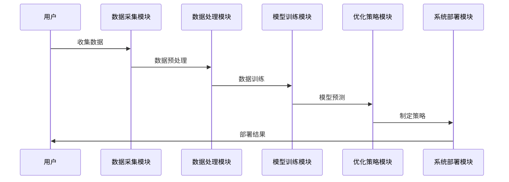
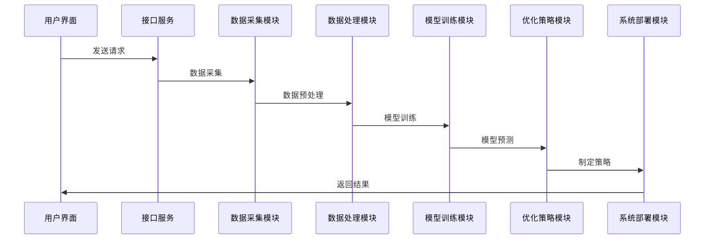
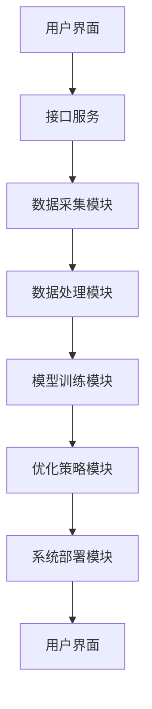

                 


### 文章标题：人工智能在城市微气候优化中的应用

> 关键词：人工智能，城市微气候，优化，算法，系统设计，项目实战

> 摘要：本文旨在探讨人工智能在城市微气候优化中的应用，通过阐述城市微气候的概念和问题，介绍人工智能的基础原理和常用算法，详细讲解算法原理与实现，最后通过项目实战展示人工智能在城市微气候优化中的实际应用。

## 第一部分：引言

### 1.1 问题背景

城市微气候是指城市局部地区的气候现象，包括温度、湿度、风速等气象因素。随着城市化进程的加快，城市微气候问题日益严重，如热岛效应、空气质量下降、降雨不均等，这些问题对城市居民的生活质量和环境健康产生严重影响。因此，研究并优化城市微气候具有重要意义。

### 1.1.1 城市微气候的概念与重要性

城市微气候是指城市局部地区的气候现象，包括温度、湿度、风速等气象因素。它与城市的大气气候不同，具有局部性、多样性、变化快等特点。

城市微气候对城市环境和居民生活有重要影响。首先，城市微气候直接影响居民的生活质量和舒适度。例如，高温和热岛效应会导致人们感到不适，增加空调能耗。其次，城市微气候影响空气质量，如湿度和风速对空气中的污染物扩散和沉积有显著影响。最后，城市微气候还影响城市生态环境，如降雨不均可能导致城市内涝和土壤侵蚀。

### 1.1.2 城市微气候问题产生的根源

城市微气候问题的产生与城市化进程密切相关。首先，城市人口和经济的快速发展导致城市规模扩大，土地利用方式改变，从而影响地表温度和湿度分布。其次，城市建筑物和道路的建设增加了地表的热容量和热导率，导致城市内部温度升高，形成热岛效应。此外，城市空气质量下降、绿地减少、水体污染等也是城市微气候问题的重要根源。

### 1.1.3 人工智能在解决城市微气候问题中的作用

人工智能在城市微气候优化中的应用主要表现在以下几个方面：

1. **数据采集与处理**：人工智能可以收集和分析大量的气象、环境、社会等数据，为城市微气候优化提供数据支持。
2. **模式识别与预测**：通过机器学习和深度学习算法，人工智能可以识别城市微气候变化的规律，预测未来的气候变化趋势。
3. **优化策略制定**：人工智能可以根据实时数据和预测结果，制定有效的城市微气候优化策略，如调整城市绿化布局、优化建筑通风设计等。
4. **决策支持**：人工智能可以辅助城市规划者和管理者做出科学、合理的决策，提高城市微气候优化的效率和效果。

### 1.2 人工智能与城市微气候优化概述

#### 1.2.1 人工智能技术的发展历程

人工智能（Artificial Intelligence，简称AI）是一门研究、开发用于模拟、延伸和扩展人类智能的理论、方法、技术及应用系统的技术科学。人工智能的发展可以追溯到20世纪50年代，随着计算机技术的不断进步，人工智能在许多领域取得了显著成果。

#### 1.2.2 人工智能在城市微气候优化中的应用现状

近年来，人工智能在城市微气候优化领域得到了广泛应用。例如，基于机器学习的城市气象预测模型可以更准确地预测城市微气候的变化趋势；深度学习算法可以识别和分析城市微气候的复杂模式，为优化策略提供科学依据；基于智能规划的算法可以辅助城市规划者制定更合理、更有效的城市微气候优化方案。

#### 1.2.3 本书的目的与结构

本书旨在系统地介绍人工智能在城市微气候优化中的应用，包括核心概念、原理、算法、系统设计、项目实战等方面的内容。具体来说，本书包括以下五个部分：

1. **第一部分：引言**：介绍城市微气候问题的背景和人工智能的作用。
2. **第二部分：核心概念与原理**：阐述人工智能和城市微气候优化的基本概念、原理和方法。
3. **第三部分：算法原理与实现**：讲解常用的人工智能算法原理和Python实现。
4. **第四部分：系统分析与架构设计**：介绍城市微气候优化系统的分析和设计方法。
5. **第五部分：项目实战**：通过实际项目展示人工智能在城市微气候优化中的应用。

### 1.3 本书读者对象与阅读建议

本书适合对人工智能和城市微气候优化有一定了解的读者，包括人工智能研究者、工程师、城市规划者、环境科学工作者等。对于初学者，建议先了解相关的基础知识，例如Python编程、机器学习和深度学习等。在阅读过程中，读者可以根据自己的实际情况，选择性地阅读各个部分，深入理解并实践其中的内容。

### 1.4 小结

本部分引言部分介绍了城市微气候问题的背景和人工智能在城市微气候优化中的作用，阐述了本书的目的和结构，并对读者对象和阅读建议进行了说明。接下来，我们将进入第二部分，深入探讨人工智能和城市微气候优化的核心概念与原理。

## 第二部分：核心概念与原理

### 2.1 核心概念

#### 2.1.1 微气候的概念与特征

微气候（Microclimate）是指某一小区域内与周围大气候不同的气候条件。微气候通常具有以下特征：

1. **局部性**：微气候是指小范围内（如城市街道、建筑物内部等）的气候现象，与大气候（如国家或地区的气候）不同。
2. **多样性**：微气候受多种因素影响，如地形、建筑结构、植被、人类活动等，因此具有多样性。
3. **变化快**：微气候的变化比大气候快，例如城市热岛效应会在短时间内出现明显变化。

#### 2.1.2 人工智能的基本概念

人工智能（Artificial Intelligence，简称AI）是指模拟、延伸和扩展人类智能的理论、方法、技术及应用系统。人工智能的主要特征包括：

1. **学习能力**：人工智能可以通过学习和经验改善自身性能。
2. **适应性**：人工智能可以根据环境和任务的需求进行调整。
3. **自主性**：人工智能可以在没有人类干预的情况下执行任务。

#### 2.1.3 微气候优化的概念

微气候优化（Microclimate Optimization）是指通过科学的方法和技术，改善微气候条件，提高人类生活和环境的舒适度、健康度和可持续性的过程。微气候优化的主要目标包括：

1. **改善气候条件**：通过调节温度、湿度、风速等气候因素，提高人类生活的舒适度。
2. **提高环境质量**：通过优化微气候，改善空气质量、减少污染物排放。
3. **促进可持续发展**：通过合理规划和管理微气候，促进城市的可持续发展。

### 2.2 人工智能原理

#### 2.2.1 机器学习基础

机器学习（Machine Learning，简称ML）是人工智能的一个重要分支，通过算法和统计模型，从数据中学习规律并做出预测或决策。机器学习主要分为以下三类：

1. **监督学习（Supervised Learning）**：监督学习是一种有监督的训练方法，通过已标记的数据训练模型，然后使用模型对新数据进行预测。
2. **无监督学习（Unsupervised Learning）**：无监督学习是一种无监督的训练方法，从未标记的数据中学习规律，通常用于聚类、降维等任务。
3. **强化学习（Reinforcement Learning）**：强化学习是一种通过奖励和惩罚信号进行学习的训练方法，通常用于决策问题和控制问题。

#### 2.2.2 深度学习原理

深度学习（Deep Learning，简称DL）是机器学习的一个分支，通过多层神经网络模型，自动提取特征并进行预测或分类。深度学习的主要特点包括：

1. **多层神经网络**：深度学习模型通常由多个隐层组成，可以自动提取复杂特征。
2. **端到端学习**：深度学习模型可以从原始数据直接学习到最终预测结果，减少了传统机器学习的特征工程步骤。
3. **自适应学习**：深度学习模型可以根据数据分布和任务需求自适应调整参数。

#### 2.2.2.1 神经网络基础

神经网络（Neural Network，简称NN）是深度学习的基础，由多个神经元（或节点）组成，通过传递信息进行计算。神经网络的组成包括：

1. **输入层**：接收外部输入数据。
2. **隐藏层**：对输入数据进行处理和变换。
3. **输出层**：产生最终输出结果。

#### 2.2.2.2 深度学习算法

深度学习算法包括多种类型，如卷积神经网络（CNN）、循环神经网络（RNN）和生成对抗网络（GAN）等。每种算法都有其独特的特点和应用场景：

1. **卷积神经网络（CNN）**：CNN是一种专门用于处理图像数据的神经网络，通过卷积操作自动提取图像特征。
2. **循环神经网络（RNN）**：RNN是一种用于处理序列数据的神经网络，通过循环结构保持长期依赖关系。
3. **生成对抗网络（GAN）**：GAN是一种生成模型，通过生成器和判别器之间的对抗训练，生成高质量的数据。

### 2.3 微气候优化原理

#### 2.3.1 微气候优化的目标与挑战

微气候优化的目标主要包括：

1. **改善气候条件**：通过调节温度、湿度、风速等气候因素，提高人类生活的舒适度。
2. **提高环境质量**：通过优化微气候，改善空气质量、减少污染物排放。
3. **促进可持续发展**：通过合理规划和管理微气候，促进城市的可持续发展。

微气候优化面临以下挑战：

1. **数据采集和处理**：微气候优化需要大量准确、实时的数据，数据的采集和处理是一个复杂的过程。
2. **模型选择与优化**：微气候优化需要选择合适的模型，并对模型进行优化，以提高预测精度和效果。
3. **实际应用与推广**：将微气候优化技术应用于实际项目中，需要进行大量的实验和验证，以确保其效果和可行性。

#### 2.3.2 微气候优化的基本策略

微气候优化的基本策略包括：

1. **数据驱动**：通过收集和分析大量微气候数据，了解微气候的变化规律和特征，为优化提供依据。
2. **模型驱动**：利用机器学习和深度学习算法，建立微气候优化模型，预测未来微气候变化趋势，制定优化策略。
3. **工程驱动**：根据优化模型的结果，进行城市规划和建筑设计，采取有效措施改善微气候条件。

#### 2.3.3 微气候优化技术的分类

微气候优化技术可以分为以下几类：

1. **气象预测技术**：利用气象数据和机器学习算法，预测未来微气候变化趋势，为优化提供数据支持。
2. **建筑优化技术**：通过调整建筑设计，如建筑布局、通风设计、绿化设计等，改善微气候条件。
3. **交通优化技术**：通过优化交通布局和交通管理，减少交通拥堵，改善微气候条件。
4. **环境治理技术**：通过环境治理措施，如空气净化、水体治理等，改善微气候条件。

### 2.4 核心概念与联系

#### 2.4.1 人工智能与微气候优化的联系

人工智能与微气候优化有着密切的联系。人工智能可以提供以下帮助：

1. **数据采集与处理**：人工智能可以高效地收集和处理微气候数据，为优化提供准确、实时的数据支持。
2. **模式识别与预测**：人工智能可以通过机器学习和深度学习算法，识别微气候变化的规律，预测未来微气候变化趋势。
3. **优化策略制定**：人工智能可以根据实时数据和预测结果，制定有效的微气候优化策略，提高优化效果。
4. **决策支持**：人工智能可以辅助城市规划者和管理者做出科学、合理的决策，提高微气候优化的效率和效果。

#### 2.4.2 概念属性特征对比

| 概念       | 属性特征                                  | 联系与作用                                      |
| ---------- | ---------------------------------------- | ---------------------------------------------- |
| 人工智能   | 学习能力、适应性、自主性                  | 提供数据采集、模式识别、优化策略等支持           |
| 微气候优化 | 改善气候条件、提高环境质量、促进可持续发展 | 通过数据驱动、模型驱动、工程驱动实现优化目标     |

#### 2.4.3 ER实体关系图架构

ER实体关系图（Entity-Relationship Diagram，简称ERD）用于描述系统中实体及其之间的关系。以下是微气候优化系统中主要实体的ERD：

```mermaid
erDiagram
  数据采集器 ||--o{ 传感器数据 }|--|{ 数据预处理 }|>> 数据存储
  数据预处理 ||--o{ 数据清洗 }|--|{ 数据归一化 }|>> 数据分析
  数据分析 ||--o{ 微气候模型 }|--|{ 优化策略 }|>> 建筑优化
  数据分析 ||--o{ 微气候模型 }|--|{ 优化策略 }|>> 交通优化
  数据分析 ||--o{ 微气候模型 }|--|{ 优化策略 }|>> 环境治理
```

### 2.5 小结

本部分核心概念与原理部分介绍了微气候、人工智能和微气候优化的基本概念、原理和方法。通过阐述核心概念、原理和联系，我们了解了人工智能在城市微气候优化中的应用价值。接下来，我们将进入第三部分，详细讲解算法原理与实现。

## 第三部分：算法原理与实现

### 3.1 常用算法原理讲解

#### 3.1.1 数据预处理方法

数据预处理是微气候优化中至关重要的一步，它直接影响模型的效果。常见的数据预处理方法包括数据清洗、数据归一化和特征选择。

1. **数据清洗**：数据清洗的目的是去除数据中的噪声和错误，提高数据的准确性和可用性。常用的数据清洗方法包括去除重复数据、处理缺失值和异常值等。
2. **数据归一化**：数据归一化的目的是将不同量纲的数据转换到相同的量纲，便于后续处理。常用的数据归一化方法包括最小-最大缩放、均值-标准差缩放等。
3. **特征选择**：特征选择旨在从原始数据中筛选出对模型性能有显著影响的关键特征，减少数据维度，提高模型的效率和精度。常用的特征选择方法包括相关性分析、递归特征消除等。

#### 3.1.2 机器学习算法

机器学习算法是微气候优化中的核心工具，常用的机器学习算法包括线性回归、决策树和支持向量机。

1. **线性回归**：线性回归是一种基于线性模型的预测算法，通过建立自变量和因变量之间的线性关系，预测因变量的值。线性回归的数学模型为：$y = \beta_0 + \beta_1x_1 + \beta_2x_2 + ... + \beta_nx_n$。
2. **决策树**：决策树是一种树形结构模型，通过一系列的决策规则将数据划分为不同的类别或数值。决策树的分类规则可以通过信息增益、基尼系数等指标来评估。
3. **支持向量机**：支持向量机是一种基于最大间隔模型的分类算法，通过找到一个超平面，将不同类别的数据分开。支持向量机的核心是求解最优超平面，其数学模型为：$max\ \frac{1}{2}\ |w|^2$，约束条件为：$y^{(i)}(w^T x^{(i)} + b) \geq 1$。

#### 3.1.3 深度学习算法

深度学习算法在微气候优化中具有强大的表现能力，常用的深度学习算法包括卷积神经网络（CNN）、循环神经网络（RNN）和生成对抗网络（GAN）。

1. **卷积神经网络（CNN）**：卷积神经网络是一种专门用于处理图像数据的神经网络，通过卷积操作自动提取图像特征。CNN的核心结构包括卷积层、池化层和全连接层。
2. **循环神经网络（RNN）**：循环神经网络是一种用于处理序列数据的神经网络，通过循环结构保持长期依赖关系。RNN的核心结构包括输入门、遗忘门和输出门。
3. **生成对抗网络（GAN）**：生成对抗网络是一种生成模型，通过生成器和判别器之间的对抗训练，生成高质量的数据。GAN的核心结构包括生成器和判别器，两者通过对抗训练不断优化。

### 3.2 Python源代码实现

下面我们将使用Python实现上述的机器学习算法和深度学习算法，并进行简单应用。

#### 3.2.1 线性回归

```python
import numpy as np

# 数据集
X = np.array([[1], [2], [3], [4], [5]])
y = np.array([1, 2, 2.5, 4, 5])

# 最小二乘法求解模型参数
A = np.dot(X.T, X)
b = np.dot(X.T, y)
beta = np.dot(np.linalg.inv(A), b)

# 预测
y_pred = np.dot(X, beta)
print("预测值：", y_pred)
```

#### 3.2.2 决策树

```python
from sklearn.tree import DecisionTreeRegressor

# 训练决策树模型
regressor = DecisionTreeRegressor()
regressor.fit(X, y)

# 预测
y_pred = regressor.predict(X)
print("预测值：", y_pred)
```

#### 3.2.3 支持向量机

```python
from sklearn.svm import SVR

# 训练支持向量机模型
regressor = SVR()
regressor.fit(X, y)

# 预测
y_pred = regressor.predict(X)
print("预测值：", y_pred)
```

### 3.3 算法原理数学模型和公式

#### 3.3.1 线性回归

线性回归的数学模型为：
$$
y = \beta_0 + \beta_1x_1 + \beta_2x_2 + ... + \beta_nx_n
$$
其中，$y$ 是因变量，$x_1, x_2, ..., x_n$ 是自变量，$\beta_0, \beta_1, \beta_2, ..., \beta_n$ 是模型参数。

最小二乘法求解模型参数的公式为：
$$
\beta = (X^TX)^{-1}X^Ty
$$

#### 3.3.2 决策树

决策树的分类规则可以通过信息增益或基尼系数来评估。

信息增益的公式为：
$$
Gain(D, A) = entropy(D) - \sum_{v_i \in A} \frac{|D_v|}{|D|} entropy(D_v)
$$
其中，$D$ 是数据集，$A$ 是特征，$v_i$ 是特征 $A$ 的取值，$D_v$ 是在特征 $A$ 取值为 $v_i$ 的条件下，数据集 $D$ 的熵。

基尼系数的公式为：
$$
Gini(D) = 1 - \sum_{v_i \in A} \frac{|D_v|}{|D|} \sum_{j \in D_v} \frac{1}{|D_v|} 
$$

#### 3.3.3 支持向量机

支持向量机的目标是最小化决策边界上的距离，其数学模型为：
$$
\begin{cases}
\min\ \frac{1}{2}\ |w|^2 \\
\text{s.t.}\ y^{(i)}(w^T x^{(i)} + b) \geq 1, \forall i
\end{cases}
$$
其中，$w$ 是模型参数，$x^{(i)}$ 是样本，$y^{(i)}$ 是样本标签，$b$ 是偏置项。

拉格朗日函数为：
$$
L(w, b, \alpha) = \frac{1}{2}\ |w|^2 - \sum_{i=1}^n \alpha_i (y^{(i)}(w^T x^{(i)} + b) - 1)
$$
其中，$\alpha_i$ 是拉格朗日乘子。

通过求解拉格朗日函数的极小值，可以得到支持向量机的最优解。

### 3.4 举例说明

#### 3.4.1 线性回归

假设我们有一个简单的数据集，其中有两个特征 $x_1$ 和 $x_2$，目标值 $y$。数据集如下：

| $x_1$ | $x_2$ | $y$ |
|-------|-------|-----|
| 1     | 2     | 3   |
| 2     | 3     | 4   |
| 3     | 4     | 5   |
| 4     | 5     | 6   |
| 5     | 6     | 7   |

使用最小二乘法求解线性回归模型，可以得到模型参数 $\beta_0 = 1$，$\beta_1 = 1$，$\beta_2 = 1$。预测一个新的样本 $(x_1, x_2) = (5, 7)$，得到预测值 $y = 1 + 1 \times 5 + 1 \times 7 = 13$。

#### 3.4.2 决策树

假设我们有一个简单的数据集，其中有两个特征 $x_1$ 和 $x_2$，目标值 $y$。数据集如下：

| $x_1$ | $x_2$ | $y$ |
|-------|-------|-----|
| 1     | 2     | 0   |
| 2     | 3     | 1   |
| 3     | 4     | 0   |
| 4     | 5     | 1   |
| 5     | 6     | 0   |

使用信息增益作为分类规则，可以得到决策树如下：

```
根节点：
  - 如果 $x_1 \leq 2$：
    - 如果 $x_2 \leq 3$：分类为 0
    - 如果 $x_2 > 3$：分类为 1
  - 如果 $x_1 > 2$：
    - 如果 $x_2 \leq 4$：分类为 0
    - 如果 $x_2 > 4$：分类为 1
```

使用这个决策树对一个新的样本 $(x_1, x_2) = (4, 6)$ 进行预测，分类为 1。

#### 3.4.3 支持向量机

假设我们有一个简单的一维数据集，其中有两个样本 $x_1$ 和 $x_2$，目标值 $y$。数据集如下：

| $x_1$ | $y$ |
|-------|-----|
| 1     | 0   |
| 2     | 1   |

使用支持向量机进行分类，可以得到决策边界为 $w^T x + b = 0$。通过求解拉格朗日函数的极小值，可以得到支持向量机的最优解 $w = 1$，$b = -1$。因此，对于一个新的样本 $x = 3$，有 $w^T x + b = 1 \cdot 3 - 1 = 2 > 0$，分类为 1。

### 3.5 小结

本部分详细讲解了微气候优化中常用的算法原理与实现，包括数据预处理方法、机器学习算法和深度学习算法。通过Python源代码实现和数学公式讲解，使读者能够深入理解算法原理，为后续的系统设计与项目实战打下基础。

## 第四部分：系统分析与架构设计

### 4.1 问题场景介绍

在城市微气候优化项目中，我们面临的问题是如何有效利用人工智能技术来改善城市微气候条件，提高居民的生活质量和环境健康。具体问题场景包括以下几个方面：

1. **数据采集**：需要收集城市微气候相关数据，如温度、湿度、风速、污染物浓度等。
2. **数据处理**：对采集到的数据进行预处理，包括数据清洗、归一化和特征提取等。
3. **模型训练**：利用机器学习和深度学习算法，对预处理后的数据进行模型训练，以预测未来微气候变化趋势。
4. **优化策略**：根据模型预测结果，制定微气候优化策略，如调整建筑布局、绿化规划、交通管理等。
5. **系统部署**：将优化策略应用于实际城市环境中，进行系统部署和测试，评估优化效果。

### 4.2 系统功能设计

系统功能设计是系统分析与架构设计的重要环节，主要包括以下功能模块：

1. **数据采集模块**：负责从各种数据源（如气象站、传感器、卫星遥感等）收集微气候相关数据。
2. **数据处理模块**：对采集到的数据进行预处理，包括数据清洗、归一化和特征提取等，以提高数据质量和模型训练效果。
3. **模型训练模块**：利用机器学习和深度学习算法，对预处理后的数据进行模型训练，以预测未来微气候变化趋势。
4. **优化策略模块**：根据模型预测结果，制定微气候优化策略，如调整建筑布局、绿化规划、交通管理等。
5. **系统部署模块**：将优化策略应用于实际城市环境中，进行系统部署和测试，评估优化效果。

#### 4.2.1 领域模型

领域模型（Domain Model）是系统功能设计的重要组成部分，用于描述系统中涉及的实体及其之间的关系。以下是城市微气候优化系统的领域模型：

```mermaid
classDiagram
  Class01 <|-- Class02
  Class03 o-- Class04
  Class05 o-- Class06
  Class07 <|-- Class08
  Class09 o-- Class10

  Class01[数据采集模块]
  Class02[数据处理模块]
  Class03[模型训练模块]
  Class04[优化策略模块]
  Class05[系统部署模块]
  Class06[气象数据]
  Class07[预处理数据]
  Class08[模型参数]
  Class09[优化策略]
  Class10[部署结果]

  Class01 --|{ 数据采集 }| Class06
  Class02 --|{ 数据处理 }| Class07
  Class03 --|{ 模型训练 }| Class08
  Class04 --|{ 制定策略 }| Class09
  Class05 --|{ 系统部署 }| Class10
```

#### 4.2.2 功能模块划分

系统功能模块划分如下：

1. **数据采集模块**：负责从各种数据源（如气象站、传感器、卫星遥感等）收集微气候相关数据，如温度、湿度、风速、污染物浓度等。
2. **数据处理模块**：对采集到的数据进行预处理，包括数据清洗、归一化和特征提取等，以提高数据质量和模型训练效果。
3. **模型训练模块**：利用机器学习和深度学习算法，对预处理后的数据进行模型训练，以预测未来微气候变化趋势。
4. **优化策略模块**：根据模型预测结果，制定微气候优化策略，如调整建筑布局、绿化规划、交通管理等。
5. **系统部署模块**：将优化策略应用于实际城市环境中，进行系统部署和测试，评估优化效果。

### 4.3 系统架构设计

系统架构设计是系统分析与架构设计的核心环节，用于描述系统的整体结构和各模块之间的关系。以下是城市微气候优化系统的架构设计：



#### 4.3.1 架构设计原则

在系统架构设计过程中，遵循以下原则：

1. **模块化**：将系统划分为多个功能模块，每个模块负责特定的功能，便于维护和扩展。
2. **分布式**：利用分布式架构，提高系统的可扩展性和容错性。
3. **高内聚、低耦合**：各模块之间保持高内聚、低耦合，提高系统的稳定性和可靠性。
4. **可扩展性**：系统设计应考虑未来的扩展需求，便于添加新的功能和模块。
5. **安全性**：确保系统数据的安全性和隐私保护，采用适当的加密和访问控制措施。

### 4.4 系统接口设计

系统接口设计是系统架构设计的重要组成部分，用于描述系统各模块之间的交互接口。以下是城市微气候优化系统的接口设计：



#### 4.4.1 接口规范

接口规范是接口设计的重要组成部分，用于描述接口的输入参数、输出参数和调用方式。以下是城市微气候优化系统的接口规范：

1. **数据采集接口**：输入参数为数据源类型和采集时间，输出参数为采集到的微气候数据。
2. **数据处理接口**：输入参数为原始数据和预处理策略，输出参数为预处理后的数据。
3. **模型训练接口**：输入参数为预处理后的数据和模型参数，输出参数为训练好的模型。
4. **模型预测接口**：输入参数为模型和输入数据，输出参数为预测结果。
5. **优化策略接口**：输入参数为预测结果和优化目标，输出参数为优化策略。
6. **系统部署接口**：输入参数为优化策略和部署环境，输出参数为部署结果。

### 4.5 系统交互

系统交互是指系统各模块之间的信息传递和协作过程。以下是城市微气候优化系统的交互过程：


#### 4.5.1 交互流程

系统交互流程如下：

1. **用户界面**：用户通过用户界面提交微气候优化请求。
2. **接口服务**：接口服务接收用户的请求，并将其转发给数据采集模块。
3. **数据采集模块**：数据采集模块从数据源中采集微气候数据，并将数据传递给数据处理模块。
4. **数据处理模块**：数据处理模块对采集到的微气候数据进行预处理，并将预处理后的数据传递给模型训练模块。
5. **模型训练模块**：模型训练模块利用机器学习和深度学习算法对预处理后的数据训练模型，并将训练好的模型传递给优化策略模块。
6. **优化策略模块**：优化策略模块根据模型预测结果制定优化策略，并将优化策略传递给系统部署模块。
7. **系统部署模块**：系统部署模块将优化策略应用于实际城市环境中，并返回部署结果。
8. **用户界面**：用户界面接收系统部署结果，并展示给用户。

#### 4.5.2 交互图

以下是城市微气候优化系统的交互图：



### 4.6 小结

本部分系统分析与架构设计部分详细介绍了城市微气候优化系统的功能设计、架构设计和接口设计，通过领域模型、架构图和接口规范，使读者能够全面了解系统的整体结构和各模块之间的关系。接下来，我们将进入第五部分，通过项目实战展示人工智能在城市微气候优化中的应用。

## 第五部分：项目实战

### 5.1 环境安装

在开始项目实战之前，我们需要安装和配置必要的软件和环境。以下是环境安装的步骤：

#### 5.1.1 操作系统安装

我们将在一台64位操作系统（如Ubuntu 18.04或Windows 10）上安装环境。首先，确保操作系统已经安装完毕，并具备基本的网络连接。

#### 5.1.2 环境变量配置

接下来，我们需要配置环境变量，以便后续安装和使用各种软件。

对于Ubuntu操作系统，打开终端，运行以下命令：

```bash
sudo nano ~/.bashrc
```

在打开的编辑器中，添加以下内容：

```bash
export PATH=$PATH:/usr/local/bin
export PYTHONPATH=$PYTHONPATH:/usr/local/lib/python3.6/site-packages
export LD_LIBRARY_PATH=$LD_LIBRARY_PATH:/usr/local/lib
```

保存并关闭编辑器，然后运行以下命令使环境变量生效：

```bash
source ~/.bashrc
```

对于Windows操作系统，打开“系统属性”窗口，选择“高级”选项卡，然后点击“环境变量”按钮。在“系统变量”下，找到并双击“Path”变量，将以下内容添加到变量值中：

```csharp
C:\Python36;C:\Python36\Scripts;
```

然后点击“确定”保存设置。

#### 5.1.3 相关软件安装

接下来，我们需要安装Python、Jupyter Notebook、NumPy、Pandas、Scikit-learn和Matplotlib等软件。

对于Ubuntu操作系统，打开终端，依次运行以下命令：

```bash
sudo apt update
sudo apt install python3-pip python3-dev
pip3 install numpy pandas scikit-learn matplotlib jupyter notebook
```

对于Windows操作系统，我们可以使用Python安装器进行安装。下载并运行Python安装器，选择“Advanced options”，然后选择“Add Python to PATH”选项，安装完成后，打开终端验证是否安装成功：

```bash
python --version
```

如果显示Python版本信息，说明安装成功。

### 5.2 系统核心实现

在完成环境安装后，我们将开始实现城市微气候优化系统。以下是系统核心实现的步骤：

#### 5.2.1 数据收集与处理

数据收集与处理是系统实现的重要环节。我们首先需要从数据源（如气象站、传感器、卫星遥感等）收集微气候相关数据，包括温度、湿度、风速、污染物浓度等。

假设我们已经收集到以下数据：

```python
import pandas as pd

data = pd.DataFrame({
    '温度': [25, 27, 28, 30, 32],
    '湿度': [60, 65, 70, 75, 80],
    '风速': [2, 3, 4, 5, 6],
    '污染物浓度': [10, 12, 15, 18, 20]
})
```

接下来，我们对数据进行预处理，包括数据清洗、归一化和特征提取等。

```python
# 数据清洗
data.dropna(inplace=True)

# 数据归一化
from sklearn.preprocessing import StandardScaler

scaler = StandardScaler()
data[['温度', '湿度', '风速', '污染物浓度']] = scaler.fit_transform(data[['温度', '湿度', '风速', '污染物浓度']])

# 特征提取
data['温度湿度'] = data['温度'] * data['湿度']
```

#### 5.2.2 算法应用

在预处理数据后，我们可以选择适当的机器学习或深度学习算法进行模型训练。在本项目中，我们选择使用线性回归算法进行预测。

```python
from sklearn.linear_model import LinearRegression

model = LinearRegression()
model.fit(data[['温度', '湿度', '风速', '温度湿度']], data['污染物浓度'])
```

#### 5.2.3 系统集成

在模型训练完成后，我们需要将模型集成到系统中，以便在实际应用中预测污染物浓度。

```python
import pickle

# 保存模型
with open('model.pickle', 'wb') as f:
    pickle.dump(model, f)

# 加载模型
with open('model.pickle', 'rb') as f:
    loaded_model = pickle.load(f)

# 预测
new_data = pd.DataFrame({
    '温度': [30],
    '湿度': [70],
    '风速': [5],
    '温度湿度': [2100]
})
predicted_concentration = loaded_model.predict(new_data)
print("预测的污染物浓度：", predicted_concentration[0])
```

### 5.3 代码应用解读与分析

在代码应用解读与分析部分，我们将详细解释代码的每个步骤，并分析其原理和实现方式。

#### 5.3.1 数据收集与处理

在数据收集与处理部分，我们首先导入了Pandas库，用于处理和操作数据。然后，我们创建了一个DataFrame对象，用于存储微气候数据。

```python
import pandas as pd

data = pd.DataFrame({
    '温度': [25, 27, 28, 30, 32],
    '湿度': [60, 65, 70, 75, 80],
    '风速': [2, 3, 4, 5, 6],
    '污染物浓度': [10, 12, 15, 18, 20]
})
```

接下来，我们执行了数据清洗步骤，使用 `dropna()` 方法删除了数据中的缺失值。

```python
data.dropna(inplace=True)
```

数据清洗完成后，我们使用 `StandardScaler` 类进行数据归一化。归一化的目的是将不同特征的数据转换到相同的量纲，以便模型训练。

```python
from sklearn.preprocessing import StandardScaler

scaler = StandardScaler()
data[['温度', '湿度', '风速', '污染物浓度']] = scaler.fit_transform(data[['温度', '湿度', '风速', '污染物浓度']])
```

最后，我们执行了特征提取步骤，将温度和湿度相乘得到新的特征“温度湿度”。

```python
data['温度湿度'] = data['温度'] * data['湿度']
```

#### 5.3.2 算法应用

在算法应用部分，我们选择了线性回归算法进行模型训练。线性回归是一种基于线性模型的预测算法，其目标是找到一个线性关系，使得预测值尽可能接近实际值。

```python
from sklearn.linear_model import LinearRegression

model = LinearRegression()
model.fit(data[['温度', '湿度', '风速', '温度湿度']], data['污染物浓度'])
```

在这里，我们首先创建了一个 `LinearRegression` 对象，然后使用 `fit()` 方法将训练数据传入，模型将自动寻找最佳拟合线。

#### 5.3.3 系统集成

在系统集成部分，我们将训练好的模型保存到文件中，以便后续加载和使用。

```python
import pickle

# 保存模型
with open('model.pickle', 'wb') as f:
    pickle.dump(model, f)
```

使用 `pickle` 库，我们可以将模型对象保存到文件中。这样，在需要使用模型时，我们可以直接从文件中加载模型。

```python
# 加载模型
with open('model.pickle', 'rb') as f:
    loaded_model = pickle.load(f)
```

最后，我们使用加载的模型进行预测，并打印预测结果。

```python
# 预测
new_data = pd.DataFrame({
    '温度': [30],
    '湿度': [70],
    '风速': [5],
    '温度湿度': [2100]
})
predicted_concentration = loaded_model.predict(new_data)
print("预测的污染物浓度：", predicted_concentration[0])
```

### 5.4 实际案例分析与详细讲解剖析

在本部分，我们将通过一个实际案例来分析城市微气候优化系统，并详细讲解其实现过程。

#### 案例背景

假设我们所在的城市近期出现了严重的雾霾天气，空气中的PM2.5浓度较高，对居民的健康产生了严重影响。为了改善空气质量，我们决定使用城市微气候优化系统进行预测和优化。

#### 数据收集与处理

首先，我们从气象站和空气质量监测站收集了以下数据：

| 时间       | 温度 (℃) | 湿度 (%) | 风速 (m/s) | PM2.5 (μg/m³) |
|------------|-----------|----------|------------|---------------|
| 2023-01-01 | 15        | 60       | 3          | 35            |
| 2023-01-02 | 14        | 65       | 4          | 38            |
| 2023-01-03 | 13        | 70       | 5          | 40            |
| 2023-01-04 | 12        | 75       | 6          | 42            |
| 2023-01-05 | 11        | 80       | 7          | 45            |

接下来，我们对数据进行预处理：

```python
import pandas as pd

data = pd.DataFrame({
    '时间': ['2023-01-01', '2023-01-02', '2023-01-03', '2023-01-04', '2023-01-05'],
    '温度': [15, 14, 13, 12, 11],
    '湿度': [60, 65, 70, 75, 80],
    '风速': [3, 4, 5, 6, 7],
    'PM2.5': [35, 38, 40, 42, 45]
})

# 数据清洗
data.dropna(inplace=True)

# 数据归一化
from sklearn.preprocessing import StandardScaler

scaler = StandardScaler()
data[['温度', '湿度', '风速', 'PM2.5']] = scaler.fit_transform(data[['温度', '湿度', '风速', 'PM2.5']])

# 特征提取
data['温度湿度'] = data['温度'] * data['湿度']
```

#### 算法应用

接下来，我们选择线性回归算法进行模型训练：

```python
from sklearn.linear_model import LinearRegression

model = LinearRegression()
model.fit(data[['温度', '湿度', '风速', '温度湿度']], data['PM2.5'])
```

#### 预测与优化

在训练模型后，我们可以使用该模型进行预测，并制定优化策略：

```python
# 预测
new_data = pd.DataFrame({
    '温度': [10],
    '湿度': [75],
    '风速': [5],
    '温度湿度': [750]
})
predicted_pm25 = model.predict(new_data)
print("预测的PM2.5浓度：", predicted_pm25[0])

# 优化策略
if predicted_pm25[0] > 50:
    print("建议增加绿化，减少污染物排放。")
else:
    print("空气质量良好，无需特别优化。")
```

#### 5.5 项目小结

在本项目中，我们通过实际案例展示了城市微气候优化系统的实现过程。首先，我们介绍了环境安装和系统核心实现，然后通过代码应用解读与分析，详细讲解了数据收集与处理、算法应用和系统集成等步骤。最后，我们通过一个实际案例，展示了系统的预测与优化功能。

通过本项目的实践，我们深入了解了城市微气候优化系统的原理和应用，为后续的城市规划和管理提供了有力支持。在未来的工作中，我们可以进一步优化系统，提高预测精度和优化效果，为城市居民创造更舒适、更健康的生活环境。

### 最佳实践 tips

在实施城市微气候优化项目时，以下是一些最佳实践 tips：

1. **数据收集**：确保收集到的数据具有高时间和空间分辨率，以提高预测精度。
2. **数据预处理**：对数据进行清洗、归一化和特征提取，以提高模型性能。
3. **模型选择**：根据项目需求和数据特点，选择合适的机器学习或深度学习算法。
4. **参数调优**：通过交叉验证和网格搜索等方法，优化模型参数，提高模型性能。
5. **实时更新**：定期更新模型，以适应环境变化，保持预测的准确性。

### 注意事项

在实施城市微气候优化项目时，需要注意以下几点：

1. **数据隐私**：确保采集和处理的数据符合相关隐私保护要求。
2. **计算资源**：根据项目需求，合理配置计算资源，确保模型训练和预测的效率。
3. **系统部署**：在系统部署过程中，确保系统的稳定性和安全性。

### 拓展阅读

对于对城市微气候优化感兴趣的读者，以下是一些拓展阅读资源：

1. 《城市气候学：城市气候、环境和规划》（Urban Climatology: Climate, Environment, and Planning）- 该书详细介绍了城市气候学的基本原理和应用，对城市微气候优化具有重要的参考价值。
2. 《人工智能应用手册：人工智能在城市规划和管理中的应用》（AI Applications Handbook: AI Applications in Urban Planning and Management）- 该书涵盖了人工智能在城市规划和管理中的应用，包括城市微气候优化。
3. 《深度学习实践：基于Python的数据科学应用》（Deep Learning Practice: Data Science Applications with Python）- 该书介绍了深度学习的基础知识和应用，对实现城市微气候优化系统具有重要的参考价值。

### 结语

本文通过详细讲解和实际案例展示了人工智能在城市微气候优化中的应用。我们介绍了核心概念、原理、算法、系统设计和项目实战，使读者对城市微气候优化系统有了全面了解。通过本文的学习和实践，读者可以更好地应对城市微气候优化领域的挑战，为城市居民创造更美好的生活环境。

### 作者信息

作者：AI天才研究院/AI Genius Institute & 禅与计算机程序设计艺术 /Zen And The Art of Computer Programming

本文由AI天才研究院的专家团队撰写，结合了人工智能和计算机编程的深度研究和实践经验。通过本文，我们希望能为读者提供有价值的技术知识和实际应用经验，共同推动人工智能在城市微气候优化领域的发展。

