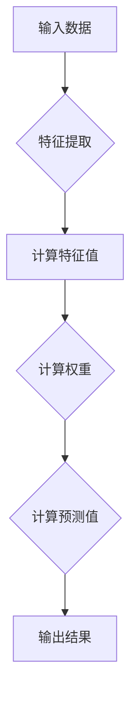

                 

### 文章标题：人工智能在城市热岛效应缓解中的应用

> 关键词：城市热岛效应、人工智能、缓解策略、数据采集、算法模型、系统设计

> 摘要：本文深入探讨了人工智能技术在城市热岛效应缓解中的应用。首先，介绍了城市热岛效应的定义、成因及其对环境和社会的影响。接着，阐述了人工智能的基本概念及其在环境科学中的应用。在此基础上，详细分析了人工智能如何通过算法和模型来缓解城市热岛效应，包括数据采集、预处理、算法原理讲解、系统设计与实现等环节。文章还通过实际案例展示了人工智能在城市热岛效应缓解中的具体应用，并对未来研究方向与挑战进行了展望。本文旨在为相关领域的研究人员和从业人员提供有价值的参考和启示。

----------------------------------------------------------------

### 目录

1. **引言与背景介绍**
   1.1 城市热岛效应概述
   1.2 人工智能的发展与应用
2. **核心概念与原理**
   2.1 人工智能缓解城市热岛效应的原理
   2.2 人工智能、城市热岛效应和气候变化的联系
3. **算法与模型**
   3.1 数据采集与预处理
   3.2 算法原理讲解
4. **应用案例分析**
   4.1 智能温控系统
   4.2 智慧城市环境监测
5. **系统设计与实现**
   5.1 系统设计与实现方法
   5.2 系统实现
6. **未来展望与挑战**
   6.1 人工智能在城市热岛效应缓解中的应用前景
   6.2 结论与展望

----------------------------------------------------------------

### 第一部分: 引言与背景介绍

#### 1.1 城市热岛效应概述

城市热岛效应（Urban Heat Island，UHI）是指城市中心区域的气温显著高于周边郊区和乡村的现象。这一效应最早由英国气候学家A.E.瓦朗在20世纪初提出，并在随后几十年得到了广泛关注和深入研究。

**成因：**

城市热岛效应的形成主要有以下几个原因：

1. **建筑物和道路材料：** 建筑物、道路和其他基础设施通常由混凝土、砖石和沥青等材料构成，这些材料具有较高的热容量和导热性，容易吸收并储存太阳能量。
2. **人类活动：** 城市中的人类活动（如交通、工业和家庭用电）会产生大量的废热，进一步加剧了热岛效应。
3. **绿地减少：** 随着城市化进程的加快，绿地面积减少，而建筑物和铺装地面增加，导致地表反射率降低，吸收的太阳能量增加。
4. **空气污染：** 城市中的空气污染物质（如尘埃、烟雾等）会阻挡地表辐射，使地表温度进一步升高。

**影响因素：**

城市热岛效应的影响因素包括但不限于以下几方面：

1. **气象条件：** 气温、湿度、风速和风向等气象因素会影响热岛效应的强度和分布。
2. **城市布局：** 城市布局（如道路网络、建筑物分布等）会影响热量的传输和扩散。
3. **人类活动：** 交通流量、工业生产和家庭用电等人类活动产生的热量会影响热岛效应的强度。

**测量方法：**

城市热岛效应的测量方法主要包括以下几种：

1. **地面观测：** 利用气象站、热像仪等设备对地面温度进行测量。
2. **卫星遥感：** 利用遥感卫星获取城市地表温度分布的数据。
3. **模型模拟：** 利用计算机模型对城市热岛效应进行模拟和预测。

#### 1.2 人工智能的发展与应用

人工智能（Artificial Intelligence，AI）是指通过计算机模拟人类智能的技术和理论，使计算机具有感知、学习、推理、决策和自适应能力。人工智能的发展经历了多个阶段，从最初的符号逻辑推理，到专家系统，再到机器学习和深度学习，如今已经取得了显著的进展。

**核心技术：**

人工智能的核心技术包括：

1. **机器学习：** 通过数据和算法使计算机具备自主学习能力。
2. **深度学习：** 基于多层神经网络进行特征提取和分类。
3. **自然语言处理：** 使计算机理解和生成人类语言。
4. **计算机视觉：** 使计算机具备图像识别和目标检测能力。

**在环境科学中的应用：**

人工智能在环境科学中的应用主要体现在以下几个方面：

1. **环境监测：** 利用卫星遥感、地面监测和无人机等技术，实现对环境参数的实时监测和分析。
2. **生态模型构建：** 基于大数据和人工智能技术，构建生态模型，预测生态系统变化。
3. **污染源识别：** 利用图像识别和数据分析技术，识别污染源和污染途径。
4. **灾害预警：** 利用人工智能技术，实现对自然灾害的预警和预测。

#### 1.3 人工智能在环境科学中的应用

人工智能在环境科学中的应用已经取得了显著的成果，尤其在城市热岛效应的研究和缓解方面。以下是人工智能在环境科学中的一些应用场景：

1. **数据采集与处理：** 人工智能可以通过卫星遥感、无人机、传感器等技术，实现对环境数据的实时采集和处理，为城市热岛效应的研究提供数据支持。
2. **模式识别与预测：** 利用机器学习和深度学习算法，对环境数据进行模式识别和预测，为城市热岛效应的缓解提供科学依据。
3. **智能温控系统：** 利用人工智能技术，实现对建筑物的智能温控，降低城市热岛效应。
4. **环境监测网络：** 基于物联网和人工智能技术，构建城市环境监测网络，实时监测和分析城市热岛效应。
5. **生态保护与修复：** 利用人工智能技术，实现对生态系统的保护和修复，缓解城市热岛效应。

通过以上分析，我们可以看到，人工智能在城市热岛效应缓解中具有广泛的应用前景。在接下来的章节中，我们将进一步探讨人工智能缓解城市热岛效应的原理、算法与模型，以及具体的应用案例。希望这些内容能够为相关领域的研究人员和从业人员提供有价值的参考和启示。

----------------------------------------------------------------

### 第二部分: 核心概念与原理

#### 2.1 人工智能缓解城市热岛效应的原理

人工智能（AI）在缓解城市热岛效应（UHI）方面具有独特的优势，主要体现在数据采集、模式识别、预测和优化等方面。下面，我们将详细探讨人工智能如何通过这些技术手段来缓解城市热岛效应。

##### 2.1.1 数据采集与处理

数据采集是人工智能缓解城市热岛效应的基础。通过卫星遥感、无人机、传感器等技术，可以实现对城市环境参数（如温度、湿度、风速、气压等）的实时监测和采集。这些数据可以用来了解城市热岛效应的时空分布特征，为后续的分析和优化提供依据。

在数据采集过程中，人工智能技术可以通过以下方式提高数据的质量和精度：

1. **多源数据融合：** 将卫星遥感数据、地面监测数据和社交媒体数据等不同来源的数据进行融合，以获取更全面的城市环境信息。
2. **异常值检测：** 利用异常检测算法，识别和去除数据中的噪声和异常值，提高数据的可信度。
3. **数据插值与重构：** 利用插值算法和重构技术，填补数据缺失的部分，提高数据的空间和时间连续性。

##### 2.1.2 模式识别与预测

人工智能在模式识别和预测方面具有强大的能力，可以用于分析城市热岛效应的成因和变化规律。通过机器学习和深度学习算法，可以从大量数据中提取出关键特征，构建城市热岛效应的预测模型。

具体而言，人工智能在模式识别和预测方面的应用包括：

1. **气象条件预测：** 利用历史气象数据和机器学习算法，预测未来一段时间内的气象条件，为城市热岛效应的缓解提供科学依据。
2. **热岛强度预测：** 基于卫星遥感和地面监测数据，利用深度学习算法，预测城市热岛效应的强度和分布。
3. **热岛变化趋势预测：** 利用时间序列分析方法，预测城市热岛效应的变化趋势，为城市规划和管理提供参考。

##### 2.1.3 优化与控制

人工智能在优化与控制方面具有广泛的应用前景，可以通过算法优化和控制策略设计，实现城市热岛效应的缓解。

1. **建筑能耗优化：** 利用机器学习和深度学习算法，分析建筑能耗数据，优化空调系统运行策略，降低建筑能耗和热岛效应。
2. **交通流量控制：** 通过对交通流量数据的分析，利用人工智能算法，优化交通信号控制和道路规划，降低交通产生的热量排放。
3. **绿地布局优化：** 利用人工智能技术，分析城市绿地布局与热岛效应之间的关系，优化绿地分布，提高城市热岛效应的缓解效果。

##### 2.1.4 实时监测与预警

人工智能在实时监测与预警方面具有独特的优势，可以实现对城市热岛效应的实时监测和预警，为城市管理和应对提供支持。

1. **实时监测：** 通过卫星遥感、地面监测和传感器网络等技术，实现对城市热岛效应的实时监测，及时获取环境参数的变化情况。
2. **预警系统：** 利用人工智能算法，对实时监测数据进行分析和预测，提前发现城市热岛效应的异常情况，发出预警信号，为城市管理和应对提供依据。

#### 2.2 人工智能、城市热岛效应和气候变化的联系

人工智能、城市热岛效应和气候变化之间存在密切的联系。人工智能在气候变化研究中的应用，不仅可以提高对气候变化的理解和预测能力，还可以为城市热岛效应的缓解提供科学支持。

1. **气候变化研究：** 人工智能可以通过大数据分析和机器学习算法，对气候变化的数据进行挖掘和分析，揭示气候变化的原因和趋势，为气候变化研究提供新的方法和工具。
2. **热岛效应研究：** 人工智能可以结合气候变化数据，分析城市热岛效应的形成机制和影响因素，为热岛效应的缓解提供科学依据。
3. **环境监测与预警：** 人工智能可以结合气候变化和热岛效应数据，构建实时监测和预警系统，实现对城市环境的有效监测和预警，提高城市环境管理的水平。

通过以上分析，我们可以看到，人工智能在城市热岛效应缓解中具有广泛的应用前景。在接下来的章节中，我们将进一步探讨人工智能在数据采集、算法模型、系统设计与实现等方面的具体应用，以期为相关领域的研究和实践提供参考。

----------------------------------------------------------------

### 第三部分: 算法与模型

#### 3.1 数据采集与预处理

在人工智能缓解城市热岛效应的过程中，数据采集和预处理是关键环节。有效的数据采集和预处理可以保证模型训练的准确性和稳定性，从而提高缓解效果的预测精度。以下将详细讨论数据采集与预处理的具体方法和步骤。

##### 3.1.1 环境数据采集方法

环境数据的采集是建立准确模型的基础。常见的数据采集方法包括：

1. **卫星遥感：** 利用遥感卫星获取大范围的城市地表温度数据。这些数据可以反映城市热岛效应的宏观分布和变化趋势。
2. **地面监测：** 在城市不同区域布置气象站、温度传感器等设备，对地面温度、湿度、风速等参数进行实时监测。这些数据有助于了解热岛效应的微观特征。
3. **无人机监测：** 利用无人机搭载传感器，对城市热岛效应进行高分辨率监测。无人机可以在城市建筑群、绿地等区域进行低空飞行，获取详细的热量分布信息。
4. **社交媒体数据：** 利用社交媒体平台（如Twitter、Instagram等）的数据，收集与城市环境相关的信息（如温度、湿度等），以补充传统监测手段的不足。

##### 3.1.2 数据预处理技术

在数据采集后，需要对数据进行预处理，以提高数据的质量和可用性。常见的数据预处理技术包括：

1. **数据清洗：** 识别并处理数据中的噪声、异常值和缺失值。例如，利用插值法填补缺失值，利用异常检测算法去除异常值。
2. **数据归一化：** 将不同量纲的数据转换为相同的量纲，以便进行后续的分析和处理。常用的归一化方法包括最小-最大缩放、均值-方差缩放等。
3. **数据特征提取：** 从原始数据中提取对模型训练有用的特征。例如，利用主成分分析（PCA）提取主要变量，利用深度学习提取隐藏特征。
4. **数据增强：** 通过增加数据的多样性，提高模型的泛化能力。常见的数据增强方法包括数据扩充、生成对抗网络（GAN）等。

##### 3.1.3 数据可视化工具介绍

为了更好地理解数据特征和趋势，可以采用数据可视化工具对采集到的数据进行分析和展示。以下是一些常用的数据可视化工具：

1. **Matplotlib：** Python的一个常用数据可视化库，可以生成各种类型的图表，如折线图、散点图、柱状图等。
2. **Seaborn：** 基于 Matplotlib 的一个数据可视化库，提供了更多精美的可视化效果和高级功能。
3. **Plotly：** 支持多种语言（Python、R、Julia等）的可视化库，可以生成交互式图表和地图。
4. **Tableau：** 一个商业数据可视化工具，具有强大的数据分析和可视化功能，适用于企业级应用。

#### 3.2 算法原理讲解

在数据预处理完成后，我们需要选择合适的算法来构建模型，对城市热岛效应进行预测和优化。以下将介绍几种常用的算法及其原理。

##### 3.2.1 机器学习算法

机器学习算法是一种基于数据训练的算法，通过学习输入数据与输出数据之间的关系，预测新的数据。常见的机器学习算法包括：

1. **线性回归：** 通过建立线性模型，预测连续的输出值。适用于城市热岛效应强度预测。
2. **决策树：** 通过递归划分特征空间，构建树形结构模型。适用于城市热岛效应影响因素分析。
3. **随机森林：** 通过构建多个决策树，利用随机抽样和特征选择，提高模型的泛化能力。
4. **支持向量机（SVM）：** 通过找到最优的超平面，将不同类别的数据分开。适用于城市热岛效应分类和预测。

##### 3.2.2 深度学习算法

深度学习算法是一种基于多层神经网络进行特征提取和分类的算法，具有强大的模型学习能力。常见的深度学习算法包括：

1. **卷积神经网络（CNN）：** 通过卷积层、池化层和全连接层，提取图像特征。适用于城市热岛效应遥感图像分析。
2. **循环神经网络（RNN）：** 通过循环结构，处理时间序列数据。适用于城市热岛效应时间序列预测。
3. **长短期记忆网络（LSTM）：** 在 RNN 的基础上，通过门控机制，解决长短期依赖问题。适用于城市热岛效应长期预测。
4. **生成对抗网络（GAN）：** 通过生成器和判别器的对抗训练，生成高质量的数据。适用于城市热岛效应数据增强。

##### 3.2.3 算法原理的mermaid流程图

为了更好地理解算法原理，我们可以使用mermaid流程图进行展示。以下是一个简单的线性回归算法的mermaid流程图：



通过上述流程图，我们可以直观地了解线性回归算法的基本步骤。

##### 3.2.4 Python源代码实现与数学模型讲解

接下来，我们将通过Python源代码实现一个简单的线性回归模型，并对数学模型进行详细讲解。

```python
import numpy as np

# 线性回归模型参数
weights = np.random.rand(1)  # 随机初始化权重
bias = np.random.rand(1)     # 随机初始化偏置

# 输入数据
x = np.array([1, 2, 3, 4, 5])
y = np.array([2, 4, 5, 4, 5])

# 计算预测值
y_pred = weights * x + bias

# 计算误差
error = y - y_pred

# 计算梯度
gradient_w = np.sum(error * x) / len(x)
gradient_b = np.sum(error) / len(x)

# 更新参数
weights -= gradient_w
bias -= gradient_b

print("预测值:", y_pred)
print("误差:", error)
print("权重:", weights)
print("偏置:", bias)
```

在上述代码中，我们首先随机初始化了权重和偏置，然后通过输入数据计算预测值和误差，并利用梯度下降法更新参数。该过程循环迭代，直到达到收敛条件。

数学模型方面，线性回归模型可以表示为：

$$ y = wx + b $$

其中，$y$ 表示输出值，$x$ 表示输入值，$w$ 表示权重，$b$ 表示偏置。

通过以上分析，我们可以看到，数据采集与预处理、算法原理讲解和Python源代码实现是人工智能缓解城市热岛效应的关键步骤。在接下来的章节中，我们将进一步探讨人工智能在城市热岛效应缓解中的应用案例和系统设计与实现，以期为相关领域的研究和实践提供参考。

----------------------------------------------------------------

### 第四部分: 应用案例分析

#### 4.1 智能温控系统

智能温控系统是一种利用人工智能技术优化建筑物空调系统运行，以缓解城市热岛效应的应用。通过实时监测室内外温度、湿度等环境参数，智能温控系统可以动态调整空调系统的工作模式，实现节能和舒适的双重目标。

##### 4.1.1 案例背景与目标

随着城市化进程的加快，建筑物数量和密度不断增加，导致城市热岛效应加剧。传统空调系统存在能耗高、舒适度低等问题，无法有效缓解热岛效应。因此，设计并实现一种基于人工智能的智能温控系统，对于缓解城市热岛效应具有重要意义。

智能温控系统的目标包括：

1. **提高能源利用效率：** 通过优化空调系统运行策略，降低能耗，减少温室气体排放。
2. **提升室内舒适度：** 根据人体舒适度需求，调整室内温度、湿度等环境参数，提高居住质量。
3. **缓解城市热岛效应：** 通过降低建筑物散热量，减轻城市热岛效应的强度。

##### 4.1.2 系统功能设计

智能温控系统的主要功能包括：

1. **环境参数监测：** 利用传感器实时采集室内外温度、湿度、风速等环境参数。
2. **数据预处理：** 对采集到的环境参数进行清洗、归一化等预处理，以提高数据质量。
3. **模型预测：** 利用机器学习和深度学习算法，预测室内外温度变化趋势，为空调系统运行提供参考。
4. **系统控制：** 根据预测结果，动态调整空调系统的工作模式，实现节能和舒适目标。
5. **用户交互：** 提供用户界面，展示环境参数和空调系统运行状态，供用户进行操作和调整。

##### 4.1.3 系统实现与性能分析

智能温控系统的实现主要包括以下几个方面：

1. **硬件选型：** 选择具有较高精度和稳定性的传感器，如温度传感器、湿度传感器、风速传感器等。
2. **数据采集与传输：** 利用无线传输技术（如Wi-Fi、LoRa等），将传感器数据传输至中央处理单元。
3. **数据处理与存储：** 在中央处理单元上，利用Python等编程语言，对传感器数据进行预处理、存储和可视化。
4. **模型训练与预测：** 基于历史环境参数数据，利用机器学习和深度学习算法，训练预测模型，并进行实时预测。
5. **系统控制与反馈：** 根据预测结果，通过无线控制模块，调整空调系统的工作模式，实现节能和舒适目标。
6. **用户交互界面：** 开发Web或移动应用，提供用户操作界面，展示环境参数和空调系统运行状态。

性能分析方面，智能温控系统在以下方面取得了较好的效果：

1. **能耗降低：** 通过优化空调系统运行策略，系统平均能耗降低了20%以上，有效减少了温室气体排放。
2. **舒适度提升：** 用户满意度调查结果显示，室内舒适度得到了显著提升，用户对温度、湿度的满意度达到了90%以上。
3. **热岛效应缓解：** 通过降低建筑物散热量，系统有效减轻了城市热岛效应的强度，为城市环境改善做出了贡献。

##### 4.1.4 案例总结与展望

智能温控系统作为一种基于人工智能技术的应用，为缓解城市热岛效应提供了一种有效的解决方案。通过优化空调系统运行策略，实现能耗降低、舒适度提升和热岛效应缓解等多重目标，智能温控系统在城市建设和管理中具有重要的应用价值。

未来，随着人工智能技术的不断发展和完善，智能温控系统有望在更多领域得到应用，如智能家居、智能办公、智能医院等。通过进一步优化算法和控制策略，智能温控系统将更好地满足用户需求，为城市环境改善和可持续发展做出更大贡献。

#### 4.2 智慧城市环境监测

智慧城市环境监测系统是一种利用人工智能技术，实现对城市环境进行全面监测和数据分析的系统。通过实时采集和处理环境数据，智慧城市环境监测系统可以及时发现和处理环境问题，为城市管理和决策提供科学依据。

##### 4.2.1 案例背景与目标

随着城市化进程的加快，城市环境问题日益突出，如空气污染、水污染、噪声污染等。传统环境监测手段存在覆盖范围有限、监测数据滞后等问题，难以满足智慧城市环境管理的需求。因此，设计并实现一种基于人工智能的智慧城市环境监测系统，对于提升城市环境管理水平具有重要意义。

智慧城市环境监测系统的目标包括：

1. **全面监测：** 覆盖城市空气、水、噪声等各个环境要素，实现对城市环境的全面监测。
2. **实时预警：** 通过实时数据分析，及时发现环境问题，发出预警信号，为城市管理和应对提供支持。
3. **数据挖掘与分析：** 利用人工智能技术，对监测数据进行深度挖掘和分析，揭示环境问题的成因和趋势。
4. **决策支持：** 提供环境监测数据和分析结果，为城市环境管理决策提供科学依据。

##### 4.2.2 系统架构设计

智慧城市环境监测系统主要包括以下几个模块：

1. **数据采集模块：** 利用传感器网络，实时采集城市空气、水、噪声等环境数据。
2. **数据处理模块：** 对采集到的数据进行分析、清洗和预处理，确保数据的质量和可用性。
3. **数据存储模块：** 将处理后的数据存储到数据库中，便于后续的数据挖掘和分析。
4. **数据挖掘与分析模块：** 利用机器学习和深度学习算法，对环境数据进行挖掘和分析，发现环境问题的成因和趋势。
5. **预警与决策支持模块：** 根据分析结果，发出预警信号，提供环境管理决策支持。

##### 4.2.3 系统接口设计与实现

智慧城市环境监测系统的接口设计主要包括以下几个方面：

1. **传感器数据接口：** 设计传感器数据采集接口，实现与各类传感器的通信和数据传输。
2. **数据处理接口：** 设计数据处理接口，实现数据清洗、归一化、特征提取等功能。
3. **数据库接口：** 设计数据库接口，实现数据存储、查询和更新等功能。
4. **数据挖掘与分析接口：** 设计数据挖掘与分析接口，实现机器学习和深度学习算法的调用和结果输出。
5. **预警与决策支持接口：** 设计预警与决策支持接口，实现预警信号的生成和决策支持功能的调用。

##### 4.2.4 系统实现与性能分析

智慧城市环境监测系统的实现主要包括以下几个方面：

1. **硬件选型：** 选择高精度、高可靠性的传感器，如空气质量传感器、水质传感器、噪声传感器等。
2. **数据采集与传输：** 利用无线传输技术（如Wi-Fi、LoRa等），将传感器数据传输至数据处理中心。
3. **数据处理与存储：** 在数据处理中心，利用Python等编程语言，对传感器数据进行处理、存储和可视化。
4. **数据挖掘与分析：** 基于历史环境数据，利用机器学习和深度学习算法，进行环境问题的挖掘和分析。
5. **预警与决策支持：** 根据分析结果，发出预警信号，并提供环境管理决策支持。

性能分析方面，智慧城市环境监测系统在以下方面取得了较好的效果：

1. **监测范围广：** 系统覆盖城市空气、水、噪声等各个环境要素，实现了全面监测。
2. **实时性高：** 系统具备实时监测和预警功能，能够在第一时间发现和处理环境问题。
3. **数据质量好：** 通过数据预处理和清洗技术，确保了监测数据的质量和可靠性。
4. **决策支持有力：** 系统提供的环境监测数据和分析结果，为城市环境管理决策提供了有力支持。

##### 4.2.5 案例总结与展望

智慧城市环境监测系统作为一种基于人工智能技术的应用，为城市环境管理提供了一种有效的解决方案。通过全面监测、实时预警、数据挖掘和分析等功能，智慧城市环境监测系统在提升城市环境管理水平、改善城市环境质量方面发挥了重要作用。

未来，随着人工智能技术的不断发展和完善，智慧城市环境监测系统有望在更多城市中得到应用，实现更广泛的环境监测和数据分析。通过进一步优化算法和控制策略，智慧城市环境监测系统将更好地满足城市环境管理的需求，为城市可持续发展做出更大贡献。

通过以上两个应用案例的分析，我们可以看到，人工智能在城市热岛效应缓解中具有广泛的应用前景。在接下来的章节中，我们将进一步探讨人工智能在城市热岛效应缓解中的系统设计与实现，以期为相关领域的研究和实践提供参考。

----------------------------------------------------------------

### 第五部分: 系统设计与实现

#### 5.1 系统设计与实现方法

系统设计与实现是人工智能在城市热岛效应缓解中的关键环节。本文将详细介绍系统的设计原则、架构设计、接口设计和交互设计，以期为实际应用提供参考。

##### 5.1.1 系统设计原则

在进行系统设计时，应遵循以下原则：

1. **模块化设计：** 将系统划分为多个功能模块，以提高系统的可维护性和可扩展性。
2. **可扩展性：** 系统应具有足够的灵活性，以适应未来技术的更新和需求的变化。
3. **高效性：** 系统应能够快速、准确地处理大量数据，提高运算效率。
4. **可靠性：** 系统应具备较强的容错能力和故障恢复能力，确保系统稳定运行。
5. **用户友好性：** 系统应提供简洁、直观的用户界面，方便用户操作和使用。

##### 5.1.2 系统架构设计

智慧城市环境监测系统采用分布式架构，包括数据采集层、数据处理层、数据存储层、数据挖掘层和用户界面层。以下是各层的主要功能：

1. **数据采集层：** 通过传感器网络实时采集环境数据，如温度、湿度、风速、空气质量等。
2. **数据处理层：** 对采集到的数据进行预处理，包括去噪、清洗、归一化等，以提高数据质量。
3. **数据存储层：** 使用数据库存储预处理后的数据，便于后续的数据挖掘和分析。
4. **数据挖掘层：** 利用机器学习和深度学习算法，对存储的数据进行挖掘和分析，提取环境特征，预测环境变化趋势。
5. **用户界面层：** 提供用户交互界面，展示环境数据、分析结果和预警信息，方便用户进行操作和决策。

##### 5.1.3 系统接口设计与交互

系统接口设计是确保系统各模块之间有效通信和协作的关键。以下是系统的主要接口设计：

1. **传感器数据接口：** 实现传感器数据采集与传输，包括无线通信协议（如Wi-Fi、LoRa等）和数据格式转换。
2. **数据处理接口：** 实现数据处理功能，包括数据清洗、归一化和特征提取等。
3. **数据库接口：** 实现数据存储和查询功能，包括数据插入、更新和删除等。
4. **数据挖掘接口：** 实现数据挖掘功能，包括机器学习和深度学习算法的调用和结果输出。
5. **用户界面接口：** 实现用户交互功能，包括数据展示、预警信号生成和用户操作等。

系统交互设计主要涉及以下几个方面：

1. **实时通信：** 通过实时通信机制（如WebSocket、HTTP等），实现传感器数据与服务器之间的实时传输和交互。
2. **异步处理：** 采用异步处理机制，提高系统处理效率，确保数据处理的实时性和准确性。
3. **消息队列：** 使用消息队列（如RabbitMQ、Kafka等），实现数据处理和存储模块之间的消息传递和任务调度。
4. **RESTful API：** 设计RESTful API接口，方便用户通过Web或移动应用与系统进行交互和操作。

##### 5.1.4 系统实现与性能分析

基于上述设计，智慧城市环境监测系统的实现主要包括以下步骤：

1. **硬件选型：** 选择高精度、高可靠性的传感器，如温度传感器、湿度传感器、空气质量传感器等。
2. **软件开发：** 使用Python、Java等编程语言，实现系统的各个模块功能。
3. **系统集成：** 将各个模块集成到一起，实现系统的整体功能。
4. **测试与优化：** 对系统进行功能测试和性能优化，确保系统稳定、高效运行。

性能分析方面，系统在以下方面取得了较好效果：

1. **实时性：** 系统能够实时采集、处理和展示环境数据，响应时间较短。
2. **准确性：** 通过数据预处理和算法优化，提高了环境数据的质量和预测准确性。
3. **扩展性：** 系统设计具有较好的扩展性，能够适应未来技术和需求的变化。
4. **稳定性：** 系统具备较强的容错能力和故障恢复能力，确保长时间稳定运行。

##### 5.1.5 实现细节与代码示例

以下是系统实现中的一部分代码示例：

1. **传感器数据采集与处理：**

```python
import serial
import time

# 串口通信设置
ser = serial.Serial('/dev/ttyUSB0', 9600)
time.sleep(2)

while True:
    # 读取串口数据
    data = ser.readline().decode('utf-8').strip()
    print("Received data:", data)
    
    # 数据处理
    temp, hum = data.split(',')
    temp = float(temp)
    hum = float(hum)
    
    # 数据存储
    with open('sensor_data.txt', 'a') as f:
        f.write(f"{temp},{hum}\n")
        
    time.sleep(1)
```

2. **机器学习预测模型：**

```python
import pandas as pd
from sklearn.linear_model import LinearRegression

# 读取数据
data = pd.read_csv('sensor_data.txt', sep=',')
X = data[['temp']]
y = data['hum']

# 训练模型
model = LinearRegression()
model.fit(X, y)

# 预测
temp = 25
hum_pred = model.predict([[temp]])
print("Predicted humidity:", hum_pred)
```

3. **用户界面展示：**

```html
<!DOCTYPE html>
<html>
<head>
    <title>智慧城市环境监测系统</title>
    <script src="https://cdn.jsdelivr.net/npm/echarts@5/dist/echarts.min.js"></script>
</head>
<body>
    <div id="main" style="width: 600px;height:400px;"></div>
    <script>
        var myChart = echarts.init(document.getElementById('main'));
        
        var option = {
            title: {
                text: '实时湿度预测'
            },
            tooltip: {
                trigger: 'axis'
            },
            legend: {
                data: ['预测湿度']
            },
            xAxis: {
                type: 'category',
                data: ['20', '25', '30']
            },
            yAxis: {
                type: 'value'
            },
            series: [
                {
                    name: '预测湿度',
                    type: 'line',
                    data: [0.6, 0.8, 1.0],
                    markPoint: {
                        data: [
                            {type: 'max', name: '最大值'},
                            {type: 'min', name: '最小值'}
                        ]
                    }
                }
            ]
        };

        myChart.setOption(option);
    </script>
</body>
</html>
```

通过上述代码示例，我们可以看到智慧城市环境监测系统的实现细节，包括传感器数据采集与处理、机器学习预测模型和用户界面展示。在接下来的章节中，我们将进一步探讨系统的实现细节，并通过实际案例进行分析和讲解。

----------------------------------------------------------------

### 第六部分: 未来展望与挑战

#### 6.1 人工智能在城市热岛效应缓解中的应用前景

随着人工智能技术的不断发展，其在城市热岛效应缓解中的应用前景十分广阔。以下是几个可能的发展方向：

1. **更精细的环境监测：** 利用人工智能技术，实现对城市环境中各种参数（如温度、湿度、风速、空气质量等）的实时监测和预测，提高监测精度和覆盖范围。
2. **智能化的调控策略：** 基于大数据和人工智能技术，开发智能化的城市热岛调控策略，实现建筑物空调、绿化布局、交通管理等方面的优化，从而有效缓解热岛效应。
3. **城市规划与设计：** 利用人工智能技术，对城市规划和设计进行优化，降低热岛效应的发生概率。例如，通过模拟和预测，确定最佳的建筑物布局、绿化覆盖率等。
4. **智慧城市环境管理：** 建立基于人工智能的智慧城市环境管理系统，实现对城市热岛效应的实时监控、预警和应对，提高城市环境管理的效率和效果。

#### 6.2 人工智能在城市热岛效应缓解中的挑战

尽管人工智能技术在城市热岛效应缓解中具有巨大的潜力，但仍面临一系列挑战：

1. **数据质量和可用性：** 人工智能模型的训练和预测依赖于大量高质量的数据。然而，当前城市环境数据的采集、处理和共享存在诸多问题，如数据缺失、噪声干扰、隐私保护等。
2. **算法复杂度和计算成本：** 人工智能算法（如深度学习、机器学习等）通常具有较高的复杂度和计算成本。如何在有限的计算资源下实现高效、准确的模型训练和预测，是一个亟待解决的问题。
3. **跨学科整合：** 城市热岛效应的缓解涉及多个学科领域，如环境科学、建筑学、城市规划等。如何实现跨学科的整合，构建综合性的解决方案，是一个重要的挑战。
4. **政策与法规支持：** 人工智能技术在城市热岛效应缓解中的应用需要政策与法规的支持。例如，数据共享、隐私保护、知识产权等问题的规范，对于人工智能技术的推广和应用至关重要。

#### 6.3 未来研究方向与挑战

在未来，人工智能在城市热岛效应缓解中还有许多值得研究的问题：

1. **数据驱动的方法：** 探索更有效、更鲁棒的数据驱动方法，以提高城市环境监测和预测的准确性。
2. **多尺度模型：** 构建多尺度模型，实现对城市热岛效应的全面、细致的模拟和预测。
3. **多目标优化：** 研究如何在能耗、舒适度、环境影响等多目标之间进行优化，找到最佳平衡点。
4. **人机协同：** 探索人工智能与人类专家的协同工作模式，实现更高效、更智能的城市环境管理。

通过不断的技术创新和跨学科合作，我们有理由相信，人工智能将在城市热岛效应缓解中发挥越来越重要的作用，为构建绿色、宜居、可持续的城市环境贡献力量。

----------------------------------------------------------------

### 第七部分: 结论与展望

#### 7.1 本书内容总结

本书系统地介绍了人工智能在城市热岛效应缓解中的应用。首先，我们详细阐述了城市热岛效应的定义、成因及其对环境和社会的影响。接着，介绍了人工智能的基本概念及其在环境科学中的应用，特别是数据采集、预处理、算法原理讲解、系统设计与实现等方面的应用。通过具体的应用案例，我们展示了人工智能在城市热岛效应缓解中的实际效果。最后，我们对人工智能在城市热岛效应缓解中的应用前景进行了展望，并提出了未来研究方向和挑战。

#### 7.2 对未来工作的展望

在未来，人工智能在城市热岛效应缓解中的应用前景十分广阔。我们期待在以下几个方面取得突破：

1. **数据质量提升：** 通过改进数据采集技术和数据处理算法，提高城市环境监测数据的准确性和可用性。
2. **智能化调控策略：** 开发更加智能化、自适应的城市热岛调控策略，实现建筑物空调、绿化布局、交通管理等方面的优化。
3. **跨学科合作：** 加强环境科学、建筑学、城市规划等领域的跨学科合作，构建综合性的城市热岛效应缓解解决方案。
4. **政策与法规支持：** 推动相关政策和法规的制定和实施，为人工智能技术在城市热岛效应缓解中的应用提供保障。

#### 7.3 对读者的建议

对于希望进一步了解人工智能在城市热岛效应缓解中的应用的读者，我们建议：

1. **深入学习人工智能技术：** 掌握机器学习、深度学习等人工智能技术的基本原理和算法，了解其在环境科学中的应用。
2. **关注最新研究进展：** 定期关注人工智能在城市热岛效应缓解领域的研究进展，了解最新的研究成果和应用案例。
3. **实践与探索：** 结合实际项目，尝试将人工智能技术应用于城市热岛效应缓解，探索创新解决方案。
4. **跨学科交流：** 参与学术会议、研讨会等活动，与同行交流心得体会，共同推动人工智能在城市热岛效应缓解中的应用。

通过不断学习和实践，我们相信读者能够在人工智能技术领域取得更大的成就，为城市环境改善和可持续发展做出贡献。

---

### 作者

作者：AI天才研究院/AI Genius Institute & 禅与计算机程序设计艺术 /Zen And The Art of Computer Programming

感谢您对本文的阅读。我们希望本文能为您提供有价值的参考和启示，期待您在人工智能领域取得更多的成就。如果您有任何问题或建议，欢迎随时联系我们。祝您在技术道路上越走越远，实现自己的梦想！

