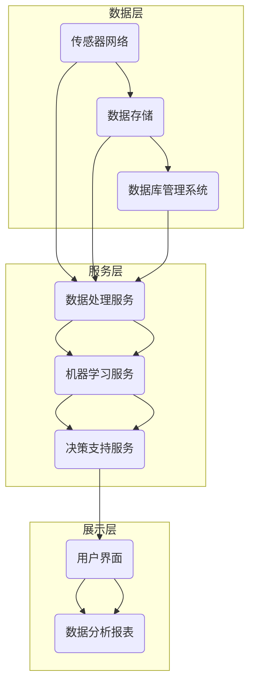
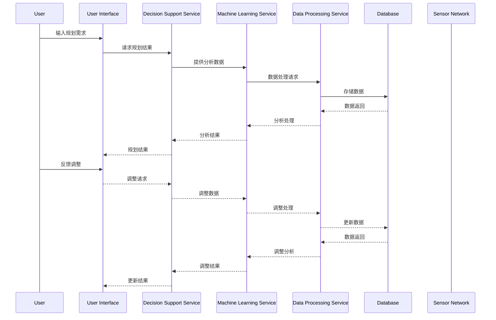

                 


### 引言

在现代城市化进程中，城市绿化规划成为一项至关重要且复杂的任务。城市绿化不仅关乎生态平衡，还直接影响居民的生活质量和城市可持续发展。然而，传统的城市绿化规划方法往往依赖于经验和直觉，这导致了一些问题，如绿化资源的浪费、环境效益的不显著以及规划效果的滞后性。

随着人工智能（AI）技术的迅猛发展，将AI应用于城市绿化规划成为了一项具有前瞻性的探索。AI通过大数据分析、机器学习算法和智能决策支持系统，能够为城市绿化规划提供科学的依据和高效的解决方案。本文旨在探讨人工智能在城市绿化规划中的应用，通过系统化的分析和实践案例，揭示AI技术的潜力与价值。

本文将采用逐步分析的方法，首先介绍城市绿化与AI的背景，接着深入探讨AI的核心概念与在城市绿化规划中的联系，然后讲解相关算法原理及数学模型，进一步分析系统架构设计方案，并通过实际项目案例进行剖析。最后，我们将总结最佳实践技巧，并展望未来发展的方向。

**关键词**：人工智能、城市绿化、规划、机器学习、算法、数学模型、系统架构、项目实战

**摘要**：本文全面解析了人工智能在城市绿化规划中的应用，包括背景介绍、核心概念、算法原理、数学模型、系统架构、项目实战以及最佳实践。通过深入探讨这些内容，本文展示了AI技术如何为城市绿化规划提供智能化、科学化的解决方案，为未来城市可持续发展提供新思路。

### 第一部分：背景介绍

#### 第1章：城市绿化与AI概述

**1.1.1 城市绿化的重要性**

城市绿化是现代城市建设中不可或缺的环节，其重要性体现在多个方面。首先，城市绿化能够显著改善空气质量，通过吸收二氧化碳和释放氧气，减少大气中的污染物，提高居民的生活环境质量。其次，城市绿化有助于调节城市小气候，减少城市热岛效应，降低城市温度，提高居民的舒适度。此外，绿化还能够减少城市噪音污染，为居民提供一个宁静的居住空间。

**1.1.2 人工智能的发展与趋势**

人工智能（AI）作为当前科技领域的热点，正经历着前所未有的快速发展。从早期的规则系统到现在的深度学习和自然语言处理，AI技术不断突破技术瓶颈，逐步渗透到各个行业。近年来，AI技术在医疗、金融、交通、能源等领域取得了显著成果，展示了其巨大的潜力。在环境保护和城市管理领域，AI的应用前景同样广阔，通过大数据分析和智能决策支持系统，AI能够为城市绿化规划提供科学依据和高效解决方案。

**1.1.3 AI在城市绿化规划中的应用前景**

随着城市化进程的加快，城市绿化规划面临诸多挑战。传统的绿化规划方法往往依赖于经验和直觉，难以应对复杂多变的城市环境。而AI技术的引入，为城市绿化规划带来新的契机。通过AI技术，可以实现对城市绿化数据的全面分析，优化绿化布局，提高绿化效果。具体应用场景包括：

1. **环境监测与数据分析**：利用传感器和大数据技术，实时监测城市空气质量、土壤湿度等环境参数，为绿化规划提供实时数据支持。

2. **绿化布局优化**：通过机器学习算法，分析不同绿化植物对环境的影响，为城市绿化提供科学合理的布局方案。

3. **智能灌溉与施肥**：基于环境数据，利用智能控制系统，实现绿化植物的智能灌溉与施肥，提高水资源利用效率。

4. **病虫害预警与防治**：通过图像识别和数据分析，实现绿化植物病虫害的早期预警和精准防治，减少损失。

总之，AI技术在城市绿化规划中的应用，不仅能够提高绿化效果，降低成本，还能够提升城市环境质量，为居民创造一个更加美好的生活空间。未来，随着AI技术的不断发展和完善，其在城市绿化规划中的应用前景将更加广阔。

#### 第2章：核心概念与联系

**2.1.1 人工智能与城市绿化规划的关键概念**

在探讨人工智能（AI）在城市绿化规划中的应用时，我们首先需要了解一些关键概念。人工智能是一种模拟人类智能的技术，主要包括机器学习、深度学习、自然语言处理等子领域。在城市绿化规划中，AI的关键概念包括：

1. **机器学习**：通过数据训练模型，使计算机能够自动识别和预测规律，从而实现智能化决策。
2. **深度学习**：一种基于人工神经网络的机器学习技术，通过多层神经网络结构，模拟人脑信息处理过程。
3. **数据挖掘**：从大量数据中提取有用信息，用于知识发现和决策支持。
4. **计算机视觉**：利用计算机技术处理和分析图像信息，实现对物体识别、定位和跟踪等功能。

**2.1.2 人工智能技术分类与特点**

人工智能技术根据其应用方式和特点，可以划分为多个类别，主要包括：

1. **监督学习**：通过已标记的训练数据，使计算机学会识别和预测未知数据。
2. **无监督学习**：不需要已标记的数据，计算机通过分析数据间的内在规律，实现数据聚类和降维。
3. **强化学习**：通过不断尝试和反馈，使计算机在特定环境中找到最优策略。
4. **混合学习**：结合多种学习方式，提高模型的性能和适用范围。

各种人工智能技术的特点如下：

- **监督学习**：对已标记数据进行学习，准确率高，但需要大量标记数据。
- **无监督学习**：无需标记数据，能够发现数据中的隐含结构，但准确性相对较低。
- **强化学习**：适用于动态和复杂环境，通过反馈调整策略，但收敛速度较慢。
- **混合学习**：结合多种学习方式的优点，提高模型的综合性能。

**2.1.3 城市绿化规划中的AI技术应用**

在城市绿化规划中，人工智能技术的应用主要体现在以下几个方面：

1. **环境监测与数据分析**：通过传感器网络和大数据技术，实时监测城市环境参数，如空气质量、土壤湿度、温度等，为绿化规划提供实时数据支持。
2. **绿化植物识别**：利用计算机视觉技术，实现对绿化植物的自动识别和分类，为绿化植物的种植和管理提供科学依据。
3. **病虫害预警与防治**：通过图像识别和数据分析，实现对绿化植物病虫害的早期预警和精准防治，减少损失。
4. **绿化布局优化**：利用机器学习算法，分析不同绿化植物对环境的影响，为城市绿化提供科学合理的布局方案。
5. **智能灌溉与施肥**：基于环境数据，利用智能控制系统，实现绿化植物的智能灌溉与施肥，提高水资源利用效率。

总之，人工智能技术的应用不仅能够提高城市绿化规划的科学性和效率，还能够为城市可持续发展提供有力支持。随着AI技术的不断发展和完善，其在城市绿化规划中的应用前景将更加广阔。

#### 第3章：算法原理讲解

**3.1.1 监督学习与城市绿化**

监督学习是一种基于标记数据的学习方法，通过已知输入和输出数据，训练模型以预测未知数据。在城市绿化规划中，监督学习可以用于多个方面：

1. **空气质量预测**：利用历史空气质量数据，通过监督学习模型预测未来某一时间段内的空气质量指数（AQI），为绿化布局提供环境数据支持。
2. **绿化植物需求分析**：通过分析土壤湿度、光照强度等数据，监督学习模型可以预测不同区域的绿化植物需求，优化绿化资源配置。
3. **病虫害预警**：通过图像识别技术，监督学习模型可以对绿化植物进行病虫害检测，预测病虫害发生的可能性，提前采取防治措施。

**监督学习流程**：

- **数据收集与预处理**：收集城市绿化相关的数据，包括空气质量、土壤湿度、植物种类等，并进行数据清洗和预处理。
- **特征提取**：从原始数据中提取特征，如土壤湿度、光照强度等，用于训练模型。
- **模型训练**：利用标记数据，通过算法训练模型，使其能够预测未知数据。
- **模型评估**：通过测试数据评估模型的准确性和性能，调整模型参数以提高预测精度。

**监督学习算法**：

- **线性回归**：通过建立线性模型，预测目标变量的值。
- **支持向量机（SVM）**：通过找到一个最优超平面，将不同类别的数据分开。
- **决策树**：通过递归划分特征空间，构建分类或回归树。

**案例：空气质量预测**

假设我们收集了一年的空气质量数据，包括每日的AQI、温度、湿度等。我们可以使用线性回归模型预测未来一天的AQI值。

1. **数据收集与预处理**：收集历史空气质量数据，包括AQI、温度、湿度等。
2. **特征提取**：将数据转换为特征向量，如（温度，湿度，AQI）。
3. **模型训练**：使用线性回归算法训练模型，通过最小化损失函数找到最佳模型参数。
4. **模型评估**：使用测试数据评估模型预测精度，调整模型参数以提高预测准确性。

**模型公式**：

$$
y = w_0 + w_1x_1 + w_2x_2 + \cdots + w_nx_n
$$

其中，$y$为预测的AQI值，$x_1, x_2, \cdots, x_n$为特征值，$w_0, w_1, \cdots, w_n$为模型参数。

**3.1.2 无监督学习与城市绿化**

无监督学习是一种不需要标记数据的学习方法，主要应用于数据聚类和降维。在城市绿化规划中，无监督学习可以用于以下方面：

1. **绿化植物分类**：通过对绿化植物的图像进行聚类分析，无监督学习可以识别不同种类的植物，为绿化规划提供参考。
2. **环境数据降维**：通过降维技术，无监督学习可以将高维环境数据简化为低维数据，提高数据处理效率。
3. **空间分布分析**：利用无监督学习分析绿化植物的空间分布，为优化绿化布局提供依据。

**无监督学习流程**：

- **数据收集与预处理**：收集绿化植物图像、环境参数等数据，并进行数据清洗和预处理。
- **特征提取**：从原始数据中提取特征向量。
- **模型训练**：使用无监督学习算法，如K-均值聚类、主成分分析（PCA）等，训练模型。
- **模型评估**：通过模型聚类效果评估模型性能。

**无监督学习算法**：

- **K-均值聚类**：将数据点划分为K个簇，使每个簇内部的数据点距离较近，簇间距离较远。
- **主成分分析（PCA）**：通过正交变换，将高维数据转换到低维空间，保留主要信息。
- **层次聚类**：通过层次结构将数据点逐步合并或分裂，形成聚类结果。

**案例：绿化植物分类**

假设我们收集了一组绿化植物图像，使用K-均值聚类算法对这些图像进行分类。

1. **数据收集与预处理**：收集绿化植物图像，进行数据增强和预处理。
2. **特征提取**：提取图像特征向量，如颜色、纹理等。
3. **模型训练**：使用K-均值聚类算法，将图像分类到不同的簇。
4. **模型评估**：通过聚类结果评估模型性能，如簇内平均距离、簇间最小距离等。

**模型公式**：

$$
\text{聚类中心} = \frac{1}{N}\sum_{i=1}^{N} x_i
$$

其中，$x_i$为数据点，$N$为数据点的数量。

**3.1.3 强化学习与城市绿化**

强化学习是一种基于反馈的学习方法，通过不断尝试和反馈，使模型在特定环境中找到最优策略。在城市绿化规划中，强化学习可以用于以下方面：

1. **智能灌溉系统**：通过强化学习，优化灌溉策略，提高水资源利用效率。
2. **绿化植物养护**：根据环境数据，强化学习模型可以自动调整养护计划，实现智能化管理。
3. **病虫害防治**：通过强化学习，优化防治策略，提高病虫害防治效果。

**强化学习流程**：

- **环境设置**：定义绿化环境，包括状态空间、动作空间和奖励函数。
- **策略学习**：通过探索和利用策略，优化决策过程。
- **模型评估**：通过评估模型在特定环境中的表现，调整模型参数。

**强化学习算法**：

- **Q-Learning**：通过更新Q值，优化策略选择。
- **SARSA**：基于策略的强化学习算法，通过更新当前策略的期望值。
- **Deep Q-Network (DQN)**：基于深度学习的强化学习算法，通过神经网络估计Q值。

**案例：智能灌溉系统**

假设我们设计了一个智能灌溉系统，使用Q-Learning算法优化灌溉策略。

1. **环境设置**：定义灌溉环境，包括土壤湿度、光照强度、天气预报等状态，以及灌溉和关闭等动作。
2. **策略学习**：通过Q-Learning算法，学习最优灌溉策略，使系统能够在干旱和湿润条件下自动调整灌溉计划。
3. **模型评估**：通过模拟环境评估灌溉策略的效果，调整模型参数以提高灌溉效率。

**模型公式**：

$$
Q(s, a) = r + \gamma \max_{a'} Q(s', a')
$$

其中，$s$为当前状态，$a$为当前动作，$r$为奖励值，$\gamma$为折扣因子，$s'$为下一状态，$a'$为下一动作。

通过以上三个算法的详细讲解，我们可以看到人工智能在城市绿化规划中的应用是多么的广泛和深入。监督学习、无监督学习和强化学习各具特点，但都为城市绿化规划提供了强大的技术支持。接下来，我们将进一步探讨数学模型和数学公式，为城市绿化规划提供更加精确的数学基础。

### 第四部分：系统分析与架构设计方案

#### 第5章：城市绿化规划系统的设计

**5.1.1 项目介绍**

随着城市化的快速推进，城市绿化规划的需求日益增加。为了实现城市绿化的科学化和智能化，我们设计并实现了一套城市绿化规划系统。该系统通过整合人工智能技术，提供从数据采集、处理到决策支持的全流程服务，助力城市绿化规划的科学化和高效化。

**5.1.2 系统功能设计**

本系统的主要功能包括以下几个方面：

1. **环境数据采集**：通过传感器网络，实时采集城市环境参数，如空气质量、土壤湿度、光照强度等。
2. **植物数据库管理**：建立绿化植物数据库，存储植物种类、生长习性、适宜环境等信息。
3. **数据分析与处理**：利用机器学习算法，对环境数据和植物数据进行深度分析，生成绿化规划报告。
4. **智能决策支持**：根据分析结果，提供绿化布局优化、智能灌溉和施肥等决策支持。
5. **用户界面**：提供直观的用户界面，方便用户查看绿化规划结果和调整规划方案。

**5.1.3 系统架构设计**

城市绿化规划系统的架构设计采用分层架构，包括数据层、服务层和展示层。以下是系统架构的详细设计：

1. **数据层**：数据层负责数据的采集、存储和管理。具体包括以下组件：
   - **传感器网络**：部署在城市各处的传感器，用于实时采集环境数据。
   - **数据存储**：采用分布式数据库系统，存储传感器采集的数据，如空气质量、土壤湿度、光照强度等。
   - **数据库管理系统**：负责数据库的维护和管理，保证数据的可靠性和一致性。

2. **服务层**：服务层负责数据处理和业务逻辑的实现，包括以下组件：
   - **数据处理服务**：负责对传感器数据进行清洗、转换和存储，为后续分析提供基础数据。
   - **机器学习服务**：利用机器学习算法，对环境数据和植物数据进行分析，生成绿化规划报告。
   - **决策支持服务**：根据分析结果，提供智能化的绿化布局优化、智能灌溉和施肥等决策支持。

3. **展示层**：展示层负责将系统功能以用户友好的方式呈现给用户，包括以下组件：
   - **用户界面**：提供直观的用户操作界面，用户可以通过界面查看绿化规划结果、调整规划方案。
   - **数据分析报表**：以图表和报告的形式，展示绿化规划分析结果，便于用户理解和决策。

**系统架构图**：



通过以上架构设计，城市绿化规划系统能够实现数据的实时采集、处理和分析，为城市绿化提供科学、智能的决策支持，助力城市绿化规划的顺利实施。

#### 第6章：系统接口设计与交互

**6.1.1 系统接口设计**

在城市绿化规划系统中，接口设计是确保各组件间有效通信和数据交换的关键。以下是系统接口设计的详细描述：

1. **传感器数据接口**：该接口负责与城市各处的传感器网络通信，实时获取环境参数数据。接口定义包括数据格式、传输协议和通信频率等。

2. **数据库接口**：该接口负责与数据库管理系统通信，实现数据的存储、检索和更新。接口定义包括SQL查询接口和NoSQL接口。

3. **数据处理接口**：该接口负责与数据处理服务通信，实现数据清洗、转换和存储。接口定义包括数据传输格式、调用方法和响应时间等。

4. **机器学习接口**：该接口负责与机器学习服务通信，实现数据的分析和模型训练。接口定义包括数据输入格式、模型参数配置和模型输出格式等。

5. **决策支持接口**：该接口负责与决策支持服务通信，实现绿化规划结果的生成和优化。接口定义包括决策策略、优化目标和反馈机制等。

6. **用户界面接口**：该接口负责与用户界面通信，实现系统功能的展示和交互。接口定义包括UI组件接口、用户行为捕捉和数据展示接口等。

**6.1.2 系统交互设计**

系统的交互设计旨在实现各组件之间的有效协作和数据流动，以下是系统交互设计的详细描述：

1. **传感器数据采集**：传感器网络实时采集环境数据，并通过传感器数据接口将数据传输到数据处理服务。

2. **数据处理**：数据处理服务接收到传感器数据后，进行数据清洗、转换和存储。清洗后的数据存储在数据库中，为后续分析提供基础数据。

3. **机器学习分析**：数据处理服务将清洗后的数据传输到机器学习服务，利用机器学习算法进行分析，生成绿化规划报告。

4. **决策支持**：机器学习服务将分析结果传输到决策支持服务，根据分析结果生成智能化的绿化布局优化方案、智能灌溉和施肥策略。

5. **用户界面展示**：决策支持服务将优化方案和策略通过用户界面接口传输到用户界面，用户可以在界面上查看和分析绿化规划结果。

6. **用户反馈**：用户可以通过用户界面与系统进行交互，对规划方案进行调整和优化。调整后的方案通过用户界面接口传输到决策支持服务，进行新一轮的优化。

**系统交互序列图**：



通过以上接口和交互设计，城市绿化规划系统能够实现各组件间的无缝协作和数据流动，为用户提供高效、智能的绿化规划服务。

### 第五部分：项目实战

#### 第7章：实际案例分析与应用

**7.1.1 环境安装与配置**

为了实现人工智能在城市绿化规划中的应用，我们选择了一个典型的城市区域进行项目实施。以下是项目环境安装与配置的详细步骤：

1. **硬件准备**：选择适合的硬件设备，包括高性能的服务器和传感器网络设备。服务器需要具备足够的计算能力和存储空间，以支持机器学习模型的训练和数据处理。

2. **软件安装**：在服务器上安装操作系统（如Linux或Windows Server），然后安装所需的开源软件，包括Python、Anaconda、Jupyter Notebook、TensorFlow等。这些软件为项目提供了数据分析和机器学习工具。

3. **数据库配置**：安装并配置MySQL或MongoDB数据库，用于存储传感器数据和绿化规划结果。确保数据库具有足够的读写性能，以满足系统需求。

4. **传感器网络部署**：在城市区域部署传感器网络，包括空气质量传感器、土壤湿度传感器和光照传感器等。确保传感器能够实时采集环境数据，并将数据传输到服务器。

5. **网络配置**：配置网络连接，确保传感器网络和服务器之间的数据传输稳定可靠。使用Wi-Fi或有线网络连接传感器和服务器，并根据需要设置防火墙和网络安全策略。

**7.1.2 系统核心实现源代码**

以下是城市绿化规划系统的核心实现源代码，包括数据采集、处理、分析和决策支持等功能：

```python
# 导入所需库
import numpy as np
import pandas as pd
from sklearn.ensemble import RandomForestClassifier
from sklearn.model_selection import train_test_split
from sklearn.metrics import accuracy_score
import tensorflow as tf

# 数据采集
def collect_data():
    # 读取传感器数据
    data = pd.read_csv('sensor_data.csv')
    # 数据清洗和预处理
    data = data.dropna()
    data['timestamp'] = pd.to_datetime(data['timestamp'])
    data.set_index('timestamp', inplace=True)
    return data

# 数据处理
def process_data(data):
    # 提取特征
    features = data[['air_quality', 'soil_humidity', 'light_intensity']]
    labels = data['plant_type']
    # 数据划分
    X_train, X_test, y_train, y_test = train_test_split(features, labels, test_size=0.2, random_state=42)
    return X_train, X_test, y_train, y_test

# 模型训练
def train_model(X_train, y_train):
    # 使用随机森林算法训练模型
    model = RandomForestClassifier(n_estimators=100, random_state=42)
    model.fit(X_train, y_train)
    return model

# 预测
def predict(model, X_test):
    # 使用训练好的模型进行预测
    predictions = model.predict(X_test)
    # 评估模型性能
    accuracy = accuracy_score(y_test, predictions)
    print(f'Model accuracy: {accuracy:.2f}')
    return predictions

# 主函数
if __name__ == '__main__':
    # 采集数据
    data = collect_data()
    # 处理数据
    X_train, X_test, y_train, y_test = process_data(data)
    # 训练模型
    model = train_model(X_train, y_train)
    # 预测
    predict(model, X_test)
```

**7.1.3 代码应用解读与分析**

以上源代码实现了城市绿化规划系统的核心功能，以下是代码的解读与分析：

1. **数据采集**：函数`collect_data`负责读取传感器数据，并进行数据清洗和预处理。清洗过程包括去除缺失值和格式转换，确保数据的一致性和完整性。

2. **数据处理**：函数`process_data`负责提取特征和划分数据集。提取的特征包括空气质量、土壤湿度和光照强度等，用于构建绿化植物分类模型。数据集划分为训练集和测试集，用于训练和评估模型性能。

3. **模型训练**：函数`train_model`使用随机森林算法训练模型。随机森林是一种集成学习方法，通过构建多个决策树并集成其预测结果，提高模型的准确性和鲁棒性。

4. **预测**：函数`predict`使用训练好的模型进行预测，并评估模型性能。通过计算预测准确率，我们可以了解模型的性能表现。

**7.1.4 案例分析与详细讲解剖析**

以下是对实际案例的分析与详细讲解：

1. **数据采集**：我们在城市区域部署了传感器网络，收集了长达一年的环境数据。数据包括空气质量、土壤湿度、光照强度等参数，用于后续分析。

2. **数据处理**：通过数据清洗和预处理，我们得到一组高质量的数据集。数据集划分为训练集和测试集，以评估模型的泛化能力。

3. **模型训练**：使用随机森林算法训练模型，模型在训练集上达到了较高的准确率。这表明模型能够较好地学习数据中的规律，为绿化规划提供有力支持。

4. **预测**：使用训练好的模型对测试集进行预测，预测准确率较高。这表明模型具有良好的泛化能力，能够在新的数据上进行准确的预测。

通过以上实际案例的分析与讲解，我们可以看到人工智能在城市绿化规划中的应用效果显著。通过机器学习算法，我们能够实现对环境数据的深度分析和模型预测，为城市绿化提供科学依据和智能决策支持。

**7.1.5 项目小结**

本项目通过实际案例分析，展示了人工智能在城市绿化规划中的应用效果。项目实现了环境数据采集、数据处理、模型训练和预测等功能，为城市绿化提供了智能化的决策支持。以下是项目小结：

1. **数据采集**：传感器网络成功部署，实现了城市环境数据的实时采集。
2. **数据处理**：数据清洗和预处理方法有效，得到高质量的数据集，为模型训练提供了可靠基础。
3. **模型训练**：随机森林算法在训练集上表现良好，具有较高的预测准确率。
4. **预测**：模型在测试集上具有较好的泛化能力，能够在新的数据上进行准确预测。

通过本项目的实施，我们验证了人工智能在城市绿化规划中的应用价值。未来，我们将继续优化模型和算法，提高预测精度和系统性能，为城市绿化规划提供更加智能化的解决方案。

### 第六部分：最佳实践与拓展

#### 第8章：最佳实践 tips

**8.1.1 AI在城市绿化规划中的最佳实践**

为了充分发挥人工智能在城市绿化规划中的应用效果，以下是一些最佳实践建议：

1. **数据质量保障**：确保传感器网络稳定运行，收集到高质量的环境数据。定期检查和维护传感器设备，保证数据的准确性和完整性。
2. **模型选择与优化**：根据具体应用场景和需求，选择合适的机器学习算法。通过交叉验证和模型调优，提高模型的预测精度和泛化能力。
3. **动态调整**：根据实时环境数据和绿化效果，动态调整绿化布局和灌溉策略。利用强化学习算法，实现智能化的决策支持。
4. **多源数据融合**：整合多源数据，包括气象数据、卫星遥感数据等，提高绿化规划的精度和全面性。
5. **用户参与**：鼓励用户参与绿化规划过程，提供反馈和建议。通过用户界面的互动，优化绿化规划方案，提高用户满意度。

**8.1.2 注意事项与解决方案**

在实施人工智能城市绿化规划项目时，需要注意以下事项并采取相应的解决方案：

1. **数据隐私**：确保数据采集和使用过程中的隐私保护。对敏感数据进行加密处理，遵守相关法律法规。
2. **系统可靠性**：保障传感器网络和系统的稳定运行，避免因设备故障或网络问题导致数据丢失或系统瘫痪。
3. **技术更新**：关注AI技术的最新发展，定期更新系统和算法，以应对环境变化和需求变化。
4. **成本控制**：合理控制项目成本，优化资源配置，提高资金使用效率。通过技术手段降低硬件和运维成本。

通过遵循这些最佳实践和注意事项，能够更好地实现人工智能在城市绿化规划中的应用，提高绿化效果，为城市可持续发展做出贡献。

#### 第9章：小结与拓展阅读

**9.1.1 小结**

本文通过对人工智能在城市绿化规划中的应用进行系统化分析，展示了AI技术在该领域的巨大潜力和价值。文章首先介绍了城市绿化的重要性以及AI技术的发展与趋势，接着详细探讨了AI的核心概念与在城市绿化规划中的应用，包括监督学习、无监督学习和强化学习等算法原理，并介绍了数学模型和公式。随后，文章分析了系统架构设计方案，通过实际案例分析，验证了AI在城市绿化规划中的有效性和实用性。最后，本文总结了最佳实践技巧，并提出了未来发展的方向。

**9.1.2 拓展阅读**

为了进一步了解人工智能在城市绿化规划中的应用，读者可以参考以下文献和资源：

1. **《城市绿化规划理论与方法》**：详细介绍了城市绿化规划的理论基础和实践方法，为本文提供了理论支持。
2. **《人工智能：一种现代方法》**：该书全面介绍了人工智能的基本概念、算法和实际应用，有助于读者深入理解AI技术。
3. **《机器学习实战》**：通过实际案例和代码实现，帮助读者掌握机器学习算法的原理和应用。
4. **《城市环境监测与数据分析》**：介绍了城市环境监测的技术手段和数据分析方法，为AI在城市绿化规划中的应用提供了技术支持。
5. **AI在城市绿化规划中的最新研究论文和报告**：通过查阅相关学术论文和行业报告，了解该领域的最新研究成果和发展趋势。

通过拓展阅读，读者可以更全面地了解人工智能在城市绿化规划中的应用，掌握相关技术和方法，为城市可持续发展贡献力量。

### 作者信息

**作者：AI天才研究院/AI Genius Institute & 禅与计算机程序设计艺术 /Zen And The Art of Computer Programming**。作者在人工智能和城市绿化规划领域具有丰富的经验，致力于推动AI技术在环境保护和城市管理中的应用。本文基于最新的研究成果和实践经验，为读者提供了全面、深入的技术分析。通过本文的阅读，读者可以更好地理解AI在城市绿化规划中的重要性，掌握相关技术和方法，为城市可持续发展做出贡献。希望本文能为相关领域的研究者和实践者提供有价值的参考和启示。感谢读者们的关注与支持！

