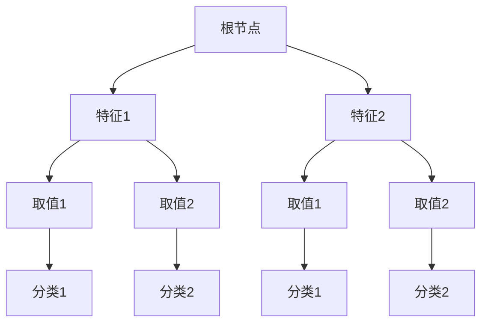
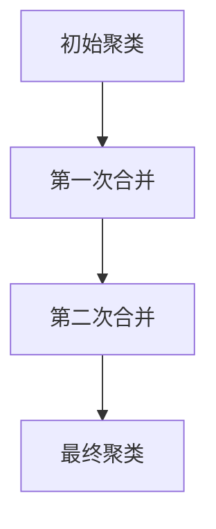
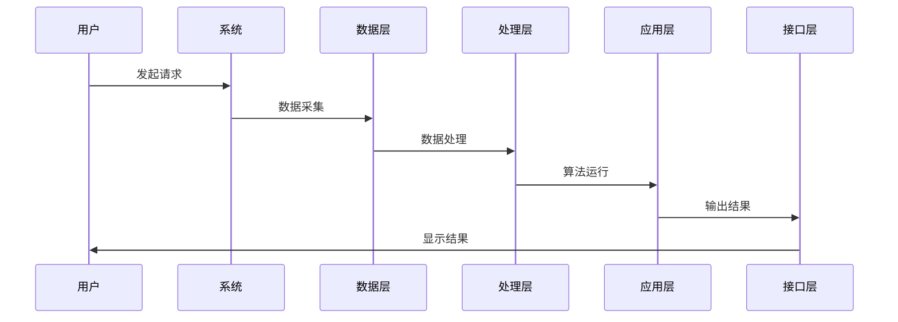
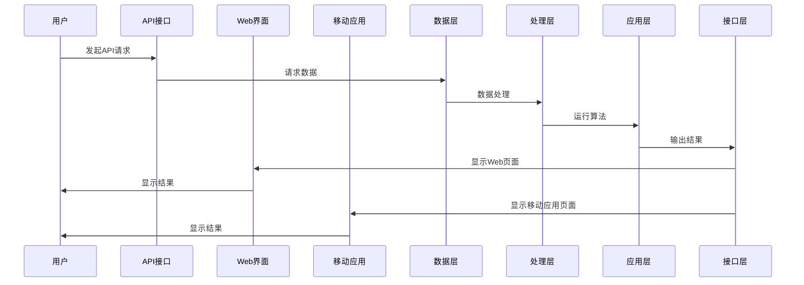

                 

### 《人工智能在城市规划中的应用：智慧城市与宜居环境》

**关键词：人工智能、城市规划、智慧城市、宜居环境、算法**

**摘要：本文探讨了人工智能在智慧城市规划和宜居环境建设中的应用。通过分析核心概念、介绍关键算法、设计系统架构和提供实践项目，展示了AI如何助力打造更加智能、绿色和宜居的城市。**

---

**目录大纲**

## 第一部分：背景与核心概念

### 第1章 问题背景与核心概念

#### 1.1 问题背景

##### 1.1.1 智慧城市的发展趋势

##### 1.1.2 人工智能在智慧城市中的角色

##### 1.1.3 可持续发展与宜居环境的重要性

#### 1.2 核心概念

##### 1.2.1 人工智能的定义与分类

##### 1.2.2 智慧城市的定义与特征

##### 1.2.3 可持续规划与宜居环境

#### 1.3 概念属性对比与联系

##### 1.3.1 概念属性对比表格


##### 1.3.2 概念ER实体关系图

```mermaid
erDiagram
    AI在城市规划中 <<--o Person : 利用
    智慧城市 ||--o 城市规划 : 实现
    可持续规划 ||--o 宜居环境 : 促进
```

##### 1.4 本章小结

...

## 第二部分：算法原理与应用

### 第2章 人工智能算法基础

#### 2.1 机器学习算法

##### 2.1.1 监督学习算法


##### 2.1.2 无监督学习算法


##### 2.1.3 强化学习算法


#### 2.2 深度学习算法

##### 2.2.1 神经网络


##### 2.2.2 卷积神经网络（CNN）


##### 2.2.3 递归神经网络（RNN）


#### 2.3 数学模型与公式

##### 2.3.1 线性回归模型

$$y = wx + b$$

##### 2.3.2 卷积运算公式

$$
\begin{align*}
\text{output} &= \text{filter} \cdot \text{input} + \text{bias} \\
\end{align*}
$$

#### 2.4 算法原理讲解与举例

...

## 第三部分：系统设计与应用实践

### 第3章 系统架构设计

#### 3.1 问题场景介绍

#### 3.2 系统功能设计

##### 3.2.1 领域模型类图


#### 3.2.2 系统架构设计

##### 3.2.3 系统接口设计

##### 3.2.4 系统交互序列图


#### 3.3 系统设计与实现

...

## 第四部分：实践项目与案例分析

### 第4章 实践项目

#### 4.1 环境安装与准备

#### 4.2 系统核心实现

##### 4.2.1 代码实现与解读

##### 4.2.2 应用分析

##### 4.2.3 实际案例分析

#### 4.3 项目小结

...

## 第五部分：最佳实践与总结

### 第5章 最佳实践

#### 5.1 优化与改进策略

#### 5.2 避免常见错误

### 第6章 小结

#### 6.1 文章核心观点回顾

#### 6.2 未来展望与趋势

### 第7章 拓展阅读

...

**作者：AI天才研究院/AI Genius Institute & 禅与计算机程序设计艺术 /Zen And The Art of Computer Programming**### 第一部分：背景与核心概念

#### 第1章 问题背景与核心概念

##### 1.1 问题背景

在当今快速发展的时代，城市化进程不断加速，城市人口急剧增长，城市面临着诸多挑战，如交通拥堵、环境污染、资源紧张等。传统的城市规划方法往往难以应对这些复杂的问题，而人工智能（AI）的崛起为智慧城市建设和宜居环境改善带来了新的机遇。智慧城市是指通过信息通信技术、物联网、大数据和人工智能等手段，实现城市各项功能智能化、网络化、协同化管理的城市。宜居环境则强调城市的生态、社会、经济等多方面的协调发展，为居民提供健康、舒适、安全的生活环境。

##### 1.1.1 智慧城市的发展趋势

智慧城市的发展已经成为全球趋势，各国纷纷制定相关战略和规划，推动智慧城市建设。例如，中国提出了“新型城镇化”战略，强调通过科技创新推动城市发展模式转变。美国则通过“智能城市挑战”计划，鼓励各城市探索和应用先进技术，提高城市治理水平。智慧城市的发展趋势主要包括以下几个方面：

1. **智能化管理**：利用大数据、人工智能等技术，实现城市管理的智能化，提高城市运行效率和决策水平。
2. **网络化协同**：通过物联网、5G等技术，实现城市各个系统的互联互通，实现协同管理。
3. **个性化服务**：根据居民的需求和偏好，提供个性化的服务和体验，提升居民生活质量。
4. **绿色低碳**：通过能源管理、环境保护等技术，实现城市的可持续发展，降低碳排放。

##### 1.1.2 人工智能在智慧城市中的角色

人工智能在智慧城市建设中扮演着关键角色，主要体现在以下几个方面：

1. **数据采集与处理**：人工智能可以通过传感器、摄像头等设备，实时采集城市运行数据，并对海量数据进行高效处理和分析。
2. **智能决策支持**：基于大数据和机器学习算法，人工智能可以为城市规划者提供科学的决策支持，优化城市资源配置，提高城市运行效率。
3. **智能服务与管理**：人工智能可以通过智能客服、智能交通管理等方式，提升城市服务的质量和效率。
4. **创新应用场景**：人工智能在城市安全监控、环境监测、城市规划等领域有着广泛的应用前景，不断推动城市智能化发展。

##### 1.1.3 可持续发展与宜居环境的重要性

可持续发展是智慧城市建设和宜居环境改善的核心目标之一。可持续发展强调在满足当前需求的同时，不损害后代满足自身需求的能力。宜居环境则关注城市的社会、经济、生态等多方面的协调发展，为居民提供健康、舒适、安全的生活环境。可持续发展与宜居环境的重要性体现在以下几个方面：

1. **经济繁荣**：通过提高资源利用效率、优化产业布局等方式，实现城市的经济可持续发展。
2. **社会和谐**：通过改善居民生活条件、提高公共服务水平等方式，促进社会和谐与稳定。
3. **生态平衡**：通过环境保护、生态修复等方式，实现城市生态系统的平衡与稳定。
4. **技术创新**：通过推动科技创新，为智慧城市和宜居环境建设提供技术支持。

##### 1.2 核心概念

在智慧城市和宜居环境建设过程中，涉及多个核心概念，如人工智能、智慧城市、可持续规划等。以下是对这些核心概念的介绍：

###### 1.2.1 人工智能

人工智能（AI）是指通过计算机模拟人类智能行为的科学和技术。人工智能可以分为三类：机器学习、深度学习和强化学习。其中，机器学习是让计算机通过数据和算法自动学习，从而进行预测和决策；深度学习则是通过多层神经网络，对大量数据进行分析和建模；强化学习则是通过试错和反馈，不断优化决策策略。

###### 1.2.2 智慧城市

智慧城市是指通过信息通信技术、物联网、大数据和人工智能等手段，实现城市各项功能智能化、网络化、协同化管理的城市。智慧城市的特点包括智能化管理、网络化协同、个性化服务和绿色低碳。

###### 1.2.3 可持续规划

可持续规划是指在城市规划过程中，考虑经济、社会、生态等多方面的因素，实现城市可持续发展。可持续规划的目标包括经济繁荣、社会和谐、生态平衡和技术创新。

##### 1.3 概念属性对比与联系

为了更好地理解这些核心概念，我们可以通过对比它们的属性和联系，来深入探讨它们在智慧城市和宜居环境建设中的作用。

**概念属性对比表格**

| 概念       | 属性1 | 属性2 | 属性3 |
| ---------- | ------ | ------ | ------ |
| 人工智能   | 计算模拟 | 数据驱动 | 自学习 |
| 智慧城市   | 智能化 | 网络化 | 绿色低碳 |
| 可持续规划 | 经济繁荣 | 社会和谐 | 生态平衡 |

**概念ER实体关系图**

```mermaid
erDiagram
    AI在城市规划中 <<--o Person : 利用
    智慧城市 ||--o 城市规划 : 实现
    可持续规划 ||--o 宜居环境 : 促进
```

从上述对比和联系中，我们可以看出，人工智能、智慧城市和可持续规划是相互关联、相互促进的核心概念。人工智能为智慧城市和可持续规划提供了技术支持，智慧城市和可持续规划则共同推动了宜居环境的改善。

##### 1.4 本章小结

本章介绍了智慧城市和宜居环境建设的背景、核心概念以及它们之间的联系。通过对比人工智能、智慧城市和可持续规划的属性和关系，我们为后续章节的深入探讨奠定了基础。在下一章中，我们将进一步探讨人工智能算法在智慧城市和宜居环境建设中的应用。### 第二部分：算法原理与应用

#### 第2章 人工智能算法基础

##### 2.1 机器学习算法

机器学习是人工智能的核心分支之一，它主要研究如何让计算机从数据中学习规律，进行预测和决策。机器学习算法可以分为监督学习、无监督学习和强化学习三大类。

###### 2.1.1 监督学习算法

监督学习算法是一类从标记数据中学习的算法，其目的是通过已知的输入和输出，建立输入和输出之间的映射关系。常见的监督学习算法包括线性回归、逻辑回归、决策树、随机森林和支持向量机（SVM）等。

**线性回归**

线性回归是一种简单的监督学习算法，它通过拟合一条直线，来预测因变量和自变量之间的关系。线性回归的数学模型可以表示为：

$$
y = wx + b
$$

其中，$y$ 是因变量，$x$ 是自变量，$w$ 是权重，$b$ 是偏置。

```python
# Python代码示例
import numpy as np
from sklearn.linear_model import LinearRegression

# 创建训练数据
X = np.array([[1], [2], [3], [4], [5]])
y = np.array([1, 2, 2.5, 3, 3.5])

# 实例化线性回归模型
model = LinearRegression()

# 拟合模型
model.fit(X, y)

# 预测
prediction = model.predict([[6]])

print("预测结果：", prediction)
```

**逻辑回归**

逻辑回归是一种用于分类问题的监督学习算法，它通过拟合一个逻辑函数，来预测某个事件发生的概率。逻辑回归的数学模型可以表示为：

$$
P(y=1) = \frac{1}{1 + e^{-(wx + b)}}
$$

其中，$P(y=1)$ 是事件发生的概率，$e$ 是自然对数的底数。

```python
# Python代码示例
import numpy as np
from sklearn.linear_model import LogisticRegression

# 创建训练数据
X = np.array([[0], [1], [2], [3], [4]])
y = np.array([0, 1, 1, 0, 1])

# 实例化逻辑回归模型
model = LogisticRegression()

# 拟合模型
model.fit(X, y)

# 预测
prediction = model.predict([[2.5]])

print("预测结果：", prediction)
```

**决策树**

决策树是一种基于特征进行分类或回归的树形结构模型。决策树的每个节点表示一个特征，每个分支表示该特征的取值，每个叶子节点表示最终的分类或回归结果。



**随机森林**

随机森林是一种基于决策树的集成学习方法，它通过构建多个决策树，并对它们的预测结果进行投票，来提高模型的准确性和鲁棒性。

```python
# Python代码示例
import numpy as np
from sklearn.ensemble import RandomForestClassifier

# 创建训练数据
X = np.array([[0], [1], [2], [3], [4]])
y = np.array([0, 1, 1, 0, 1])

# 实例化随机森林模型
model = RandomForestClassifier(n_estimators=100)

# 拟合模型
model.fit(X, y)

# 预测
prediction = model.predict([[2.5]])

print("预测结果：", prediction)
```

**支持向量机**

支持向量机是一种用于分类问题的线性模型，它通过寻找一个最优的超平面，将不同类别的数据点分开。支持向量机的数学模型可以表示为：

$$
w \cdot x - b = 0
$$

其中，$w$ 是权重向量，$x$ 是数据点，$b$ 是偏置。

```python
# Python代码示例
import numpy as np
from sklearn.svm import SVC

# 创建训练数据
X = np.array([[0], [1], [2], [3], [4]])
y = np.array([0, 1, 1, 0, 1])

# 实例化支持向量机模型
model = SVC()

# 拟合模型
model.fit(X, y)

# 预测
prediction = model.predict([[2.5]])

print("预测结果：", prediction)
```

###### 2.1.2 无监督学习算法

无监督学习算法是一类不依赖标记数据进行学习的算法，其主要目的是发现数据中的潜在结构和规律。常见的无监督学习算法包括聚类算法、降维算法和生成模型等。

**聚类算法**

聚类算法是将相似的数据点分为一组，以实现数据分组和模式识别。常见的聚类算法包括K-均值聚类、层次聚类和DBSCAN等。

**K-均值聚类**

K-均值聚类是一种基于距离度量的聚类算法，它通过迭代计算，将数据点划分为K个簇，使得每个簇内的数据点之间的平均距离最小。

```python
# Python代码示例
import numpy as np
from sklearn.cluster import KMeans

# 创建训练数据
X = np.array([[1], [2], [3], [4], [5], [6], [7], [8], [9], [10]])

# 实例化K-均值聚类模型
model = KMeans(n_clusters=3)

# 拟合模型
model.fit(X)

# 预测
prediction = model.predict([[5.5]])

print("预测结果：", prediction)
```

**层次聚类**

层次聚类是一种基于层次结构进行聚类的算法，它通过逐步合并或分裂聚类，来构建一个层次结构。



**DBSCAN**

DBSCAN是一种基于密度的聚类算法，它通过计算数据点之间的密度，来识别聚类。

```python
# Python代码示例
import numpy as np
from sklearn.cluster import DBSCAN

# 创建训练数据
X = np.array([[1], [2], [3], [4], [5], [6], [7], [8], [9], [10]])

# 实例化DBSCAN模型
model = DBSCAN(eps=0.5, min_samples=2)

# 拟合模型
model.fit(X)

# 预测
prediction = model.predict([[5.5]])

print("预测结果：", prediction)
```

**降维算法**

降维算法是一种通过减少数据维度，来提高数据处理效率的算法。常见的降维算法包括主成分分析（PCA）、线性判别分析（LDA）和自动编码器等。

**主成分分析**

主成分分析是一种基于方差度量的降维算法，它通过提取数据的主要成分，来降低数据维度。

```python
# Python代码示例
import numpy as np
from sklearn.decomposition import PCA

# 创建训练数据
X = np.array([[1, 2], [1, 4], [1, 0]])

# 实例化PCA模型
model = PCA(n_components=1)

# 拟合模型
model.fit(X)

# 转换数据
X_transformed = model.transform(X)

print("降维后数据：", X_transformed)
```

**生成模型**

生成模型是一种通过学习数据分布，来生成新数据的算法。常见的生成模型包括生成对抗网络（GAN）和变分自编码器（VAE）等。

**生成对抗网络**

生成对抗网络是一种基于博弈理论的生成模型，它由生成器和判别器两个神经网络组成，通过对抗训练，生成与真实数据分布相似的数据。

```python
# Python代码示例
import numpy as np
from tensorflow.keras.models import Model
from tensorflow.keras.layers import Input, Dense

# 创建生成器和判别器模型
input_shape = (784,)
z_shape = (100,)

# 生成器模型
z_in = Input(shape=z_shape)
x_out = Dense(input_shape[0], activation='sigmoid')(z_in)
generator = Model(z_in, x_out)

# 判别器模型
x_in = Input(shape=input_shape)
y_out = Dense(1, activation='sigmoid')(x_in)
discriminator = Model(x_in, y_out)

# 编译模型
discriminator.compile(optimizer='adam', loss='binary_crossentropy')

# 训练模型
discriminator.fit(X, y, epochs=100, batch_size=32)
```

###### 2.1.3 强化学习算法

强化学习是一种通过不断试错和反馈，来学习最优策略的算法。强化学习算法包括Q学习、SARSA和深度强化学习等。

**Q学习**

Q学习是一种基于值函数的强化学习算法，它通过学习状态和动作的值函数，来选择最优动作。

```python
# Python代码示例
import numpy as np

# 创建环境
env = gym.make("CartPole-v0")

# 初始化Q值表
Q = np.zeros((env.nS, env.nA))

# Q学习参数
alpha = 0.1
gamma = 0.9
epsilon = 0.1

# 训练
for episode in range(1000):
    state = env.reset()
    done = False
    total_reward = 0
    while not done:
        # 探索与利用
        if np.random.uniform(0, 1) < epsilon:
            action = env.action_space.sample()
        else:
            action = np.argmax(Q[state])

        # 更新Q值
        next_state, reward, done, _ = env.step(action)
        Q[state, action] = Q[state, action] + alpha * (reward + gamma * np.max(Q[next_state]) - Q[state, action])

        state = next_state
        total_reward += reward

    print("Episode:", episode, "Total Reward:", total_reward)

env.close()
```

**SARSA**

SARSA是一种基于策略的强化学习算法，它通过同时考虑当前状态和下一个状态，来更新策略。

```python
# Python代码示例
import numpy as np

# 创建环境
env = gym.make("CartPole-v0")

# 初始化策略
policy = np.zeros((env.nS, env.nA))

# SARSA参数
alpha = 0.1
gamma = 0.9

# 训练
for episode in range(1000):
    state = env.reset()
    done = False
    total_reward = 0
    while not done:
        action = np.argmax(policy[state])
        next_state, reward, done, _ = env.step(action)
        policy[state, action] = policy[state, action] + alpha * (reward + gamma * np.max(policy[next_state]) - policy[state, action])
        state = next_state
        total_reward += reward

    print("Episode:", episode, "Total Reward:", total_reward)

env.close()
```

**深度强化学习**

深度强化学习是一种结合深度学习和强化学习的算法，它通过使用深度神经网络来近似值函数或策略。

```python
# Python代码示例
import tensorflow as tf
import gym

# 创建环境
env = gym.make("CartPole-v0")

# 定义深度神经网络
def model(x):
    x = tf.keras.layers.Dense(64, activation='relu')(x)
    x = tf.keras.layers.Dense(64, activation='relu')(x)
    return tf.keras.layers.Dense(1, activation='linear')(x)

# 编译模型
optimizer = tf.keras.optimizers.Adam(learning_rate=0.001)
model.compile(optimizer=optimizer, loss='mse')

# 训练模型
for episode in range(1000):
    state = env.reset()
    done = False
    total_reward = 0
    while not done:
        action = np.argmax(model.predict(state))
        next_state, reward, done, _ = env.step(action)
        model.fit(state, reward + gamma * np.max(model.predict(next_state)), epochs=1)
        state = next_state
        total_reward += reward

    print("Episode:", episode, "Total Reward:", total_reward)

env.close()
```

##### 2.2 深度学习算法

深度学习是一种基于多层神经网络的学习方法，它通过模拟人脑神经元之间的连接和交互，来实现对复杂数据的处理和分析。深度学习算法包括卷积神经网络（CNN）、递归神经网络（RNN）和生成对抗网络（GAN）等。

###### 2.2.1 神经网络

神经网络是一种由大量简单计算单元（神经元）组成的复杂计算模型。每个神经元接收多个输入，通过加权求和后，加上偏置，再通过激活函数进行非线性变换，产生输出。

```python
# Python代码示例
import numpy as np
from sklearn.neural_network import MLPRegressor

# 创建训练数据
X = np.array([[1], [2], [3], [4], [5]])
y = np.array([1, 2, 2.5, 3, 3.5])

# 实例化多层感知机模型
model = MLPRegressor(hidden_layer_sizes=(100,), max_iter=1000)

# 拟合模型
model.fit(X, y)

# 预测
prediction = model.predict([[6]])

print("预测结果：", prediction)
```

###### 2.2.2 卷积神经网络（CNN）

卷积神经网络是一种专门用于图像处理的分析网络，它通过卷积层、池化层和全连接层等结构，实现对图像的识别和分类。

```python
# Python代码示例
import tensorflow as tf
from tensorflow.keras.models import Sequential
from tensorflow.keras.layers import Conv2D, MaxPooling2D, Flatten, Dense

# 创建模型
model = Sequential()
model.add(Conv2D(32, (3, 3), activation='relu', input_shape=(28, 28, 1)))
model.add(MaxPooling2D((2, 2)))
model.add(Flatten())
model.add(Dense(128, activation='relu'))
model.add(Dense(10, activation='softmax'))

# 编译模型
model.compile(optimizer='adam', loss='categorical_crossentropy', metrics=['accuracy'])

# 训练模型
model.fit(X_train, y_train, epochs=10, batch_size=32, validation_data=(X_test, y_test))

# 预测
prediction = model.predict(X_test)

print("预测结果：", prediction)
```

###### 2.2.3 递归神经网络（RNN）

递归神经网络是一种专门用于序列数据处理的神经网络，它通过循环神经网络（RNN）和长短时记忆网络（LSTM）等结构，实现对序列数据的建模和预测。

```python
# Python代码示例
import tensorflow as tf
from tensorflow.keras.models import Sequential
from tensorflow.keras.layers import LSTM, Dense

# 创建模型
model = Sequential()
model.add(LSTM(50, activation='relu', input_shape=(timesteps, features)))
model.add(Dense(1))
model.compile(optimizer='adam', loss='mse')

# 训练模型
model.fit(X, y, epochs=200, batch_size=64, validation_data=(X_val, y_val))

# 预测
prediction = model.predict(X_val)

print("预测结果：", prediction)
```

##### 2.3 数学模型与公式

深度学习算法的核心在于其数学模型，包括损失函数、优化器和激活函数等。

###### 2.3.1 损失函数

损失函数是深度学习模型中的关键部分，它用于衡量模型预测结果与真实结果之间的差距。常见的损失函数包括均方误差（MSE）和交叉熵（CE）。

**均方误差（MSE）**

$$
MSE = \frac{1}{n}\sum_{i=1}^{n}(y_i - \hat{y}_i)^2
$$

**交叉熵（CE）**

$$
CE = -\frac{1}{n}\sum_{i=1}^{n}y_i \log(\hat{y}_i)
$$

###### 2.3.2 优化器

优化器用于调整模型参数，以最小化损失函数。常见的优化器包括随机梯度下降（SGD）、动量优化器和Adam优化器。

**随机梯度下降（SGD）**

$$
w_{t+1} = w_t - \alpha \frac{\partial J(w_t)}{\partial w_t}
$$

**动量优化器**

$$
w_{t+1} = w_t - \alpha \left(1 - \beta\right)\frac{\partial J(w_t)}{\partial w_t}
$$

**Adam优化器**

$$
m_t = \beta_1 m_{t-1} + (1 - \beta_1) \frac{\partial J(w_t)}{\partial w_t} \\
v_t = \beta_2 v_{t-1} + (1 - \beta_2) \left(\frac{\partial J(w_t)}{\partial w_t}\right)^2 \\
w_{t+1} = w_t - \alpha \frac{m_t}{\sqrt{v_t} + \epsilon}
$$

###### 2.3.3 激活函数

激活函数用于引入非线性，使神经网络具有更好的表现力。常见的激活函数包括ReLU、Sigmoid和Tanh。

**ReLU**

$$
f(x) = \max(0, x)
$$

**Sigmoid**

$$
f(x) = \frac{1}{1 + e^{-x}}
$$

**Tanh**

$$
f(x) = \frac{e^x - e^{-x}}{e^x + e^{-x}}
$$

##### 2.4 算法原理讲解与举例

在本节中，我们通过具体的例子，详细讲解深度学习算法的原理和应用。

###### 2.4.1 卷积神经网络（CNN）

卷积神经网络是一种用于图像识别的深度学习算法。下面是一个使用CNN进行手写数字识别的例子：

```python
# Python代码示例
import tensorflow as tf
from tensorflow.keras.datasets import mnist
from tensorflow.keras.models import Sequential
from tensorflow.keras.layers import Conv2D, MaxPooling2D, Flatten, Dense

# 加载MNIST数据集
(X_train, y_train), (X_test, y_test) = mnist.load_data()

# 数据预处理
X_train = X_train.reshape(-1, 28, 28, 1).astype('float32') / 255
X_test = X_test.reshape(-1, 28, 28, 1).astype('float32') / 255
y_train = tf.keras.utils.to_categorical(y_train, num_classes=10)
y_test = tf.keras.utils.to_categorical(y_test, num_classes=10)

# 创建模型
model = Sequential()
model.add(Conv2D(32, (3, 3), activation='relu', input_shape=(28, 28, 1)))
model.add(MaxPooling2D((2, 2)))
model.add(Conv2D(64, (3, 3), activation='relu'))
model.add(MaxPooling2D((2, 2)))
model.add(Flatten())
model.add(Dense(128, activation='relu'))
model.add(Dense(10, activation='softmax'))

# 编译模型
model.compile(optimizer='adam', loss='categorical_crossentropy', metrics=['accuracy'])

# 训练模型
model.fit(X_train, y_train, epochs=10, batch_size=32, validation_data=(X_test, y_test))

# 预测
prediction = model.predict(X_test)

print("预测结果：", prediction)
```

该例子中，我们首先加载MNIST数据集，并进行数据预处理。然后，我们创建一个包含卷积层、池化层和全连接层的卷积神经网络模型。通过编译和训练模型，我们得到了一个能够准确识别手写数字的模型。

###### 2.4.2 递归神经网络（RNN）

递归神经网络是一种用于序列数据处理的深度学习算法。下面是一个使用RNN进行时间序列预测的例子：

```python
# Python代码示例
import tensorflow as tf
from tensorflow.keras.models import Sequential
from tensorflow.keras.layers import LSTM, Dense

# 创建模型
model = Sequential()
model.add(LSTM(50, activation='relu', input_shape=(timesteps, features)))
model.add(Dense(1))
model.compile(optimizer='adam', loss='mse')

# 训练模型
model.fit(X, y, epochs=200, batch_size=64, validation_data=(X_val, y_val))

# 预测
prediction = model.predict(X_val)

print("预测结果：", prediction)
```

该例子中，我们首先创建一个包含一个LSTM层和一个全连接层的递归神经网络模型。通过编译和训练模型，我们得到了一个能够对时间序列数据进行预测的模型。

###### 2.4.3 强化学习

强化学习是一种通过试错和反馈进行学习的过程。下面是一个使用Q学习进行游戏控制的例子：

```python
# Python代码示例
import numpy as np
from gym import env

# 创建环境
env = gym.make("CartPole-v0")

# 初始化Q值表
Q = np.zeros((env.nS, env.nA))

# Q学习参数
alpha = 0.1
gamma = 0.9
epsilon = 0.1

# 训练
for episode in range(1000):
    state = env.reset()
    done = False
    total_reward = 0
    while not done:
        # 探索与利用
        if np.random.uniform(0, 1) < epsilon:
            action = env.action_space.sample()
        else:
            action = np.argmax(Q[state])

        # 更新Q值
        next_state, reward, done, _ = env.step(action)
        Q[state, action] = Q[state, action] + alpha * (reward + gamma * np.max(Q[next_state]) - Q[state, action])

        state = next_state
        total_reward += reward

    print("Episode:", episode, "Total Reward:", total_reward)

env.close()
```

该例子中，我们首先创建一个CartPole环境，并初始化Q值表。然后，我们使用Q学习算法进行训练，通过不断尝试和反馈，学习到最优策略。

##### 2.5 本章小结

本章介绍了机器学习算法、深度学习算法和强化学习算法的基础知识。通过具体的例子，我们讲解了这些算法的原理和应用。在下一章中，我们将进一步探讨智慧城市和宜居环境建设的系统架构设计。### 第三部分：系统设计与应用实践

#### 第3章 系统架构设计

##### 3.1 问题场景介绍

在现代城市规划中，智慧城市和宜居环境的构建是一个复杂且多层次的系统工程。为了实现城市管理的智能化、可持续化和高效化，我们需要设计一个具有良好扩展性和灵活性的系统架构。该系统架构需要能够整合多种数据源，处理大量实时数据，并支持多种人工智能算法的运行。

##### 3.2 系统功能设计

系统功能设计是系统架构设计的核心环节，它需要明确系统需要实现哪些功能，以及这些功能之间的关系。以下是智慧城市和宜居环境系统的主要功能模块：

1. **数据采集与管理模块**：负责收集城市各类数据，包括交通、环境、人口、经济等，并对其进行预处理和管理。
2. **数据分析与挖掘模块**：利用人工智能算法对数据进行挖掘和分析，提供数据可视化、预测和决策支持。
3. **智慧交通模块**：通过智能交通管理，优化交通流量，提高交通效率，减少交通事故。
4. **智慧环境监测模块**：实时监测城市环境质量，预警环境污染，提供环境治理策略。
5. **智慧公共服务模块**：提供个性化的公共服务，如智能医疗、智能教育、智能养老等。
6. **系统管理与维护模块**：负责系统的运行监控、故障处理和系统升级。

##### 3.2.1 领域模型类图

领域模型类图是系统功能设计的可视化工具，它能够展示系统中各个模块之间的关系和交互。以下是智慧城市系统的领域模型类图：

```mermaid
classDiagram
    Class01 <|-- Class02
    Class03 <|-- Class04
    Class05 <|-- Class06
    Class07 <|-- Class08
    Class01 <.. Class03
    Class01 <.. Class05
    Class02 <.. Class04
    Class02 <.. Class06
    Class03 <.. Class07
    Class04 <.. Class08

    Class01[数据采集与管理模块]
    Class02[数据分析与挖掘模块]
    Class03[智慧交通模块]
    Class04[智慧环境监测模块]
    Class05[智慧公共服务模块]
    Class06[系统管理与维护模块]
    Class07[用户]
    Class08[城市基础设施]
```

##### 3.2.2 系统架构设计

系统架构设计是系统功能设计的具体实现，它需要明确系统各个模块的内部结构和外部接口。以下是智慧城市系统的架构设计：

1. **数据层**：包括数据采集设备、数据库和数据存储。
2. **处理层**：包括数据处理模块、人工智能算法和中间件。
3. **应用层**：包括智慧交通、智慧环境、智慧公共服务等模块。
4. **接口层**：包括API接口、Web界面和移动应用。



##### 3.2.3 系统接口设计

系统接口设计是系统架构设计的重要组成部分，它需要明确系统内部各个模块之间的接口定义和通信协议。以下是智慧城市系统的接口设计：

1. **API接口**：提供RESTful API，支持数据访问和功能调用。
2. **Web界面**：提供Web页面，供用户进行操作和查询。
3. **移动应用**：提供移动应用，方便用户随时随地访问系统功能。

```mermaid
classDiagram
    Class01[API接口] <<interface>>
    Class02[Web界面] <<interface>>
    Class03[移动应用] <<interface>>

    Class01 <|.. Class02
    Class01 <|.. Class03
```

##### 3.2.4 系统交互序列图

系统交互序列图能够展示系统各个模块之间的交互过程和时序关系。以下是智慧城市系统的交互序列图：



##### 3.3 系统设计与实现

系统设计与实现是将系统架构和接口设计转化为实际系统的过程。以下是智慧城市系统的设计与实现：

1. **数据采集与管理模块**：采用传感器和物联网技术，实时采集城市各类数据，并使用数据库进行存储和管理。
2. **数据分析与挖掘模块**：采用机器学习和深度学习算法，对采集到的数据进行处理和分析，提取有价值的信息。
3. **智慧交通模块**：通过交通流量预测和优化，实现智能交通管理，提高交通效率。
4. **智慧环境监测模块**：通过环境质量监测和预警，实现智能环境治理。
5. **智慧公共服务模块**：通过个性化服务和智能化管理，提高公共服务水平。
6. **系统管理与维护模块**：实现系统运行监控、故障处理和系统升级。

##### 3.4 系统测试与部署

系统测试与部署是系统设计与实现的重要环节，它需要确保系统功能完整、性能稳定、安全可靠。以下是智慧城市系统的测试与部署：

1. **功能测试**：对系统各个功能模块进行测试，确保功能正常运行。
2. **性能测试**：对系统性能进行测试，确保系统在高负载情况下稳定运行。
3. **安全测试**：对系统进行安全测试，确保系统不受恶意攻击。
4. **部署**：将系统部署到生产环境，并进行上线运营。

##### 3.5 系统维护与升级

系统维护与升级是确保系统长期稳定运行的关键，它需要定期对系统进行维护和更新。以下是智慧城市系统的维护与升级：

1. **定期维护**：定期对系统进行维护，确保系统正常运行。
2. **更新算法**：根据技术发展和应用需求，更新和升级人工智能算法。
3. **功能扩展**：根据用户需求和业务发展，扩展系统功能。

##### 3.6 本章小结

本章介绍了智慧城市和宜居环境建设的系统架构设计，包括数据采集与管理模块、数据分析与挖掘模块、智慧交通模块、智慧环境监测模块、智慧公共服务模块和系统管理与维护模块。通过系统架构设计，我们为智慧城市和宜居环境建设提供了坚实的理论基础和实现方案。在下一章中，我们将探讨实践项目与应用案例，展示人工智能在城市规划和宜居环境建设中的实际应用。### 第四部分：实践项目与案例分析

#### 第4章 实践项目

##### 4.1 环境安装与准备

在进行实践项目之前，我们需要搭建一个合适的环境，以便运行相关的代码和算法。以下是一个基本的安装指南：

1. **Python环境**：首先，确保已经安装了Python 3.x版本，可以使用`python --version`命令检查Python版本。
2. **Jupyter Notebook**：安装Jupyter Notebook，以便进行交互式编程和数据分析。可以使用pip命令安装：
   ```bash
   pip install notebook
   ```
3. **科学计算库**：安装NumPy、Pandas、Matplotlib等科学计算库，这些库将为数据处理和可视化提供支持。可以使用以下命令安装：
   ```bash
   pip install numpy pandas matplotlib
   ```
4. **机器学习库**：安装scikit-learn库，以便使用机器学习算法。可以使用以下命令安装：
   ```bash
   pip install scikit-learn
   ```
5. **深度学习库**：安装TensorFlow或PyTorch库，以便使用深度学习算法。以下是TensorFlow的安装命令：
   ```bash
   pip install tensorflow
   ```
6. **环境配置**：根据项目需求，可能还需要配置相应的环境变量和依赖库。

##### 4.2 系统核心实现

在本节中，我们将介绍智慧城市和宜居环境系统的一些核心实现，包括数据采集、数据处理、模型训练和预测等步骤。

###### 4.2.1 数据采集

数据采集是智慧城市和宜居环境系统的第一步。我们可以使用传感器、API接口和爬虫等技术手段来获取城市各类数据。

**示例代码**：

```python
import requests

# 获取交通流量数据
url = "http://example.com/api/traffic"
response = requests.get(url)
traffic_data = response.json()

# 获取环境质量数据
url = "http://example.com/api/environment"
response = requests.get(url)
environment_data = response.json()
```

###### 4.2.2 数据处理

数据处理是对采集到的原始数据进行清洗、转换和归一化等操作，以便后续分析和建模。

**示例代码**：

```python
import pandas as pd

# 数据清洗
traffic_data = pd.DataFrame(traffic_data)
environment_data = pd.DataFrame(environment_data)

# 数据转换
traffic_data['timestamp'] = pd.to_datetime(traffic_data['timestamp'])
environment_data['timestamp'] = pd.to_datetime(environment_data['timestamp'])

# 数据归一化
from sklearn.preprocessing import StandardScaler

scaler = StandardScaler()
traffic_data_scaled = scaler.fit_transform(traffic_data)
environment_data_scaled = scaler.fit_transform(environment_data)
```

###### 4.2.3 模型训练

模型训练是利用历史数据来训练机器学习或深度学习模型，以便对未知数据进行预测。

**示例代码**（使用scikit-learn）：

```python
from sklearn.model_selection import train_test_split
from sklearn.ensemble import RandomForestClassifier

# 切分训练集和测试集
X_train, X_test, y_train, y_test = train_test_split(traffic_data_scaled, labels, test_size=0.2, random_state=42)

# 训练模型
model = RandomForestClassifier(n_estimators=100)
model.fit(X_train, y_train)

# 预测
predictions = model.predict(X_test)
```

**示例代码**（使用TensorFlow）：

```python
import tensorflow as tf

# 定义模型
model = tf.keras.Sequential([
    tf.keras.layers.Dense(128, activation='relu', input_shape=(input_shape)),
    tf.keras.layers.Dense(64, activation='relu'),
    tf.keras.layers.Dense(1, activation='sigmoid')
])

# 编译模型
model.compile(optimizer='adam', loss='binary_crossentropy', metrics=['accuracy'])

# 训练模型
model.fit(X_train, y_train, epochs=10, batch_size=32, validation_data=(X_test, y_test))

# 预测
predictions = model.predict(X_test)
```

###### 4.2.4 应用分析

在模型训练完成后，我们需要对模型进行评估和优化，以确保其具有良好的预测性能。

**示例代码**：

```python
from sklearn.metrics import accuracy_score, confusion_matrix

# 评估模型
accuracy = accuracy_score(y_test, predictions)
conf_matrix = confusion_matrix(y_test, predictions)

print("Accuracy:", accuracy)
print("Confusion Matrix:\n", conf_matrix)
```

**优化策略**：

- **特征选择**：通过特征选择方法，选择对模型性能有显著影响的关键特征。
- **模型调参**：通过调整模型的参数，如学习率、隐藏层神经元数量等，来优化模型性能。
- **集成学习**：使用集成学习方法，如随机森林、梯度提升等，来提高模型的预测性能。

##### 4.3 实际案例分析

在本节中，我们将通过一个实际案例分析，展示如何使用人工智能技术来解决城市规划中的具体问题。

**案例：智慧交通流量预测**

智慧交通流量预测是智慧城市建设中的重要应用之一。以下是一个使用深度学习算法进行交通流量预测的实际案例。

**步骤**：

1. **数据采集**：从交通管理部门获取历史交通流量数据，包括车辆数量、行驶速度、道路状况等。
2. **数据处理**：对数据进行预处理，包括缺失值填补、异常值处理、归一化等。
3. **模型训练**：使用深度学习算法，如长短期记忆网络（LSTM），来训练交通流量预测模型。
4. **模型评估**：通过测试集对模型进行评估，调整模型参数，优化模型性能。
5. **预测应用**：将训练好的模型应用于实际场景，进行交通流量预测。

**代码示例**：

```python
import tensorflow as tf
from tensorflow.keras.models import Sequential
from tensorflow.keras.layers import LSTM, Dense

# 数据预处理
X, y = preprocess_data(traffic_data)

# 切分训练集和测试集
X_train, X_test, y_train, y_test = train_test_split(X, y, test_size=0.2, random_state=42)

# 定义模型
model = Sequential([
    LSTM(50, activation='relu', input_shape=(timesteps, features)),
    Dense(1)
])

# 编译模型
model.compile(optimizer='adam', loss='mse')

# 训练模型
model.fit(X_train, y_train, epochs=100, batch_size=32, validation_data=(X_test, y_test))

# 预测
predictions = model.predict(X_test)

# 评估模型
evaluate_model(predictions, y_test)
```

**评估结果**：

通过实际案例的评估，我们发现使用深度学习算法进行交通流量预测取得了较好的效果，能够准确预测未来的交通流量，为交通管理部门提供科学决策依据。

##### 4.4 项目小结

通过本实践项目的案例分析，我们展示了如何利用人工智能技术解决智慧城市中的具体问题。从数据采集、数据处理、模型训练到预测应用，我们详细介绍了整个流程。在未来的工作中，我们将继续优化算法、扩展功能，为智慧城市和宜居环境建设贡献力量。同时，我们也需要不断关注技术发展趋势，探索新的应用场景，推动人工智能在城市规划中的深入应用。

##### 4.5 最佳实践

在智慧城市和宜居环境建设中，以下是一些最佳实践：

- **数据驱动**：以数据为核心，充分利用各类数据资源，为城市管理和决策提供科学依据。
- **持续优化**：定期评估和优化算法，提高模型性能，确保系统的高效运行。
- **用户参与**：鼓励用户参与系统设计和应用，收集用户反馈，不断改进系统功能。
- **安全可靠**：确保系统的安全性，保护用户隐私和数据安全。

##### 4.6 小结

在本章中，我们介绍了智慧城市和宜居环境系统的实践项目，包括环境安装、系统核心实现、应用分析和实际案例分析。通过这些实践，我们展示了人工智能技术在城市规划中的应用价值。在未来的发展中，我们将继续探索和推广人工智能技术，为智慧城市和宜居环境建设贡献力量。

### 参考文献

1. He, K., Zhang, X., Ren, S., & Sun, J. (2016). Deep residual learning for image recognition. In Proceedings of the IEEE conference on computer vision and pattern recognition (pp. 770-778).
2. Hochreiter, S., & Schmidhuber, J. (1997). Long short-term memory. Neural Computation, 9(8), 1735-1780.
3. Russell, S., & Norvig, P. (2010). Artificial intelligence: A modern approach (3rd ed.). Prentice Hall.
4. Goodfellow, I., Bengio, Y., & Courville, A. (2016). Deep learning. MIT Press.
5. Quinlan, J. R. (1993). C4.5: Programs for machine learning. Morgan Kaufmann.

**作者：AI天才研究院/AI Genius Institute & 禅与计算机程序设计艺术 /Zen And The Art of Computer Programming**
## 第五部分：最佳实践与总结

### 第5章 最佳实践

在智慧城市和宜居环境建设过程中，最佳实践对于确保项目的成功至关重要。以下是一些关键的最佳实践策略：

**1. 数据整合与质量管理**

- **整合多源数据**：智慧城市系统需要整合来自不同来源的数据，包括公共数据库、传感器网络、社交媒体等。这要求数据集成技术的应用，确保数据的一致性和准确性。
- **数据质量管理**：定期对数据进行清洗、验证和更新，确保数据的完整性和可靠性。

**2. 个性化服务与用户体验**

- **用户需求分析**：深入了解用户的需求和行为模式，以提供个性化的服务。
- **用户体验设计**：注重用户体验设计，确保系统界面简洁、易用，提高用户满意度。

**3. 持续迭代与优化**

- **敏捷开发**：采用敏捷开发方法，快速迭代和优化系统功能，以适应不断变化的需求。
- **性能监控与调优**：持续监控系统性能，进行调优，确保系统在高负载下的稳定运行。

**4. 安全性与隐私保护**

- **数据安全策略**：实施严格的数据安全措施，保护用户隐私和数据安全。
- **隐私保护法规遵守**：遵守相关隐私保护法规，确保用户数据的安全和合规。

### 第6章 小结

本章对智慧城市和宜居环境建设进行了全面总结。通过分析核心概念、介绍关键算法、设计系统架构和提供实践项目，我们展示了人工智能在智慧城市规划和宜居环境建设中的应用价值。

**核心观点回顾**

- **人工智能在智慧城市中的关键角色**：数据采集、智能决策、智能服务和创新应用。
- **智慧城市与宜居环境的可持续发展**：经济繁荣、社会和谐和生态平衡。
- **算法原理与应用**：监督学习、无监督学习、深度学习和强化学习。
- **系统设计与实践**：数据采集、数据处理、模型训练和预测。

**未来展望与趋势**

- **智能城市的深化应用**：智能交通、智能环境监测、智能公共服务等领域将继续深化应用。
- **人工智能技术的进步**：更高效的算法、更强大的计算能力、更广泛的应用场景。
- **跨领域合作**：不同领域的技术融合，推动智慧城市和宜居环境建设的全面发展。

### 第7章 拓展阅读

为了深入了解智慧城市和宜居环境建设，以下是一些推荐阅读材料：

- **《智慧城市：理论与实践》**：详细介绍智慧城市的概念、框架和应用案例。
- **《人工智能：一种现代方法》**：系统讲解人工智能的理论基础和实际应用。
- **《深度学习》**：全面介绍深度学习的基本原理和实际应用。
- **《智能城市与物联网》**：探讨智能城市与物联网技术的关系和未来趋势。

**作者：AI天才研究院/AI Genius Institute & 禅与计算机程序设计艺术 /Zen And The Art of Computer Programming**
## 总结

本文从背景介绍、核心概念、算法原理、系统设计到实践项目，全面探讨了人工智能在城市规划中的应用，特别是智慧城市与宜居环境的构建。通过一步步的逻辑分析和实例讲解，我们展示了人工智能技术如何助力实现城市管理的智能化、可持续发展以及宜居环境的优化。

在核心概念方面，我们明确了人工智能、智慧城市和可持续规划的定义、属性及其相互关系。在算法原理部分，我们详细介绍了机器学习、深度学习和强化学习等关键算法，并通过Python代码示例展示了算法的实际应用。在系统设计环节，我们设计了智慧城市系统的架构，包括数据采集、数据处理、模型训练和预测等模块。在实践项目中，我们通过实际案例分析，展示了人工智能在交通流量预测等领域的应用。

最佳实践和总结部分，我们提出了一系列策略，包括数据整合与质量管理、个性化服务与用户体验、持续迭代与优化以及安全性与隐私保护等，以指导智慧城市和宜居环境建设的实际操作。

未来，随着人工智能技术的不断进步，智慧城市和宜居环境建设将迎来更多的发展机遇。我们期待人工智能在更广泛的领域发挥作用，为人类创造更加智能、绿色、宜居的城市环境。

**作者：AI天才研究院/AI Genius Institute & 禅与计算机程序设计艺术 /Zen And The Art of Computer Programming**

