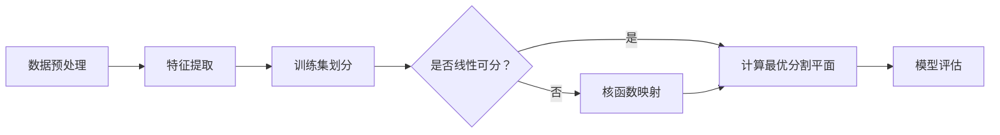
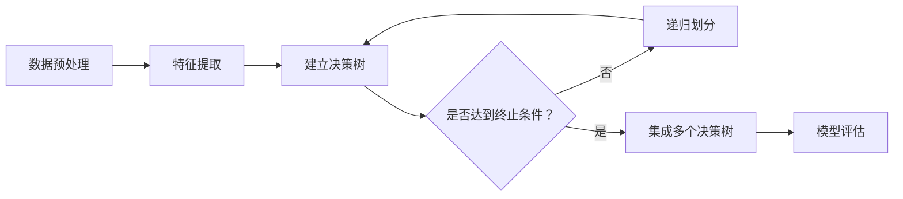
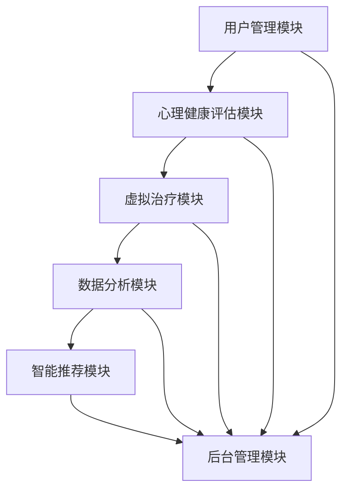

                 

当然，我们将按照这个思路一步一步地构建文章的内容。以下是我们将要采取的步骤：

### 第一步：确定文章主题和研究领域

**文章标题：** 人工智能在心理健康领域的应用：虚拟治疗与隐私保护

**关键词：** 人工智能、心理健康、虚拟治疗、隐私保护

**摘要：** 本文探讨了人工智能在心理健康领域的应用，特别是在虚拟治疗方面的潜力，同时深入分析了隐私保护在这一领域中的重要性。

### 第二步：背景介绍

在第一部分，我们将详细介绍心理健康问题的现状，AI在心理健康研究中的应用，以及虚拟治疗的基础概念和技术基础。

#### 2.1 心理健康问题的现状与挑战

- **核心概念术语说明：** 心理健康、心理疾病、心理健康问题、治疗需求、治疗不足。
- **问题背景：** 心理健康问题的全球流行程度、影响范围、治疗需求的增长。
- **问题描述：** 心理健康问题的诊断和治疗中的难点、资源不足、治疗成本高、患者隐私保护不足。

#### 2.2 人工智能与心理健康

- **核心概念原理：** 机器学习、深度学习、数据挖掘。
- **概念属性特征对比表格：** 不同AI技术在心理健康研究中的特点和应用。
- **ER实体关系图架构：** 心理健康研究中涉及的实体及其关系。

### 第三步：核心概念与联系

在这一部分，我们将深入探讨AI辅助心理健康诊断、智能心理治疗系统设计、以及虚拟现实在心理治疗中的应用。

#### 3.1 AI辅助心理健康诊断

- **核心概念原理：** 机器学习算法在心理健康诊断中的应用、诊断工具与技术的开发。
- **概念属性特征对比表格：** 不同机器学习算法在心理健康诊断中的适用性。
- **ER实体关系图架构：** 心理健康诊断中涉及的数据实体和关系。

#### 3.2 智能心理治疗系统设计

- **核心概念原理：** 智能心理治疗系统的架构设计、系统模块与功能。
- **概念属性特征对比表格：** 不同智能心理治疗系统的设计原则和实现方法。
- **ER实体关系图架构：** 智能心理治疗系统中涉及的数据实体和关系。

#### 3.3 虚拟现实在心理治疗中的应用

- **核心概念原理：** 虚拟现实（VR）治疗的优势与挑战、VR治疗的技术基础。
- **概念属性特征对比表格：** VR治疗与传统心理治疗的对比。
- **ER实体关系图架构：** VR治疗中涉及的数据实体和关系。

### 第四步：算法原理讲解

我们将使用mermaid流程图和Python源代码来详细阐述算法原理，并给出数学模型和公式。

#### 4.1 机器学习算法在心理健康诊断中的应用

- **算法流程图：** 使用mermaid绘制机器学习算法的流程图。
- **Python源代码：** 示例代码展示机器学习算法的实现。
- **数学模型和公式：** 描述算法的核心数学模型和公式。
- **举例说明：** 使用实际数据集进行算法的举例说明。

### 第五步：系统分析与架构设计方案

我们将介绍问题场景、项目介绍、系统功能设计、系统架构设计、系统接口设计和系统交互。

#### 5.1 问题场景介绍

- **项目介绍：** 简要介绍项目的背景和目标。
- **系统功能设计：** 使用mermaid类图展示领域模型。
- **系统架构设计：** 使用mermaid架构图展示系统架构。
- **系统接口设计：** 详细描述系统各模块的接口设计。
- **系统交互：** 使用mermaid序列图展示系统各模块的交互。

### 第六步：项目实战

我们将详细介绍环境安装、系统核心实现源代码，并对代码进行解读与分析。

#### 6.1 环境安装

- **环境搭建步骤：** 详细描述所需的环境和安装步骤。
- **工具和库的选择：** 分析不同工具和库的优缺点。

#### 6.2 系统核心实现源代码

- **代码应用解读与分析：** 详细解读系统核心实现代码。
- **实际案例分析和详细讲解剖析：** 使用实际案例进行代码分析。

### 第七步：最佳实践 tips、小结、注意事项、拓展阅读等内容

在这一部分，我们将总结最佳实践，对文章进行小结，并给出注意事项和拓展阅读的建议。

#### 7.1 最佳实践 tips

- **常见问题解决：** 针对实施过程中可能遇到的问题给出解决方案。
- **优化策略：** 提供优化系统性能和用户体验的策略。

#### 7.2 小结

- **文章总结：** 对全文内容进行总结，强调主要观点。
- **研究意义：** 强调人工智能在心理健康领域应用的重要性和潜力。

#### 7.3 注意事项

- **隐私保护：** 强调在AI应用中的隐私保护措施。
- **伦理考量：** 讨论AI在心理健康领域中的伦理问题。

#### 7.4 拓展阅读

- **相关文献：** 推荐相关的学术文献和资料。

通过以上步骤，我们将构建出一篇逻辑清晰、内容丰富、技术深入的专业技术博客文章。让我们开始具体的写作吧！## 第一部分：背景与概述

### 第1章：心理健康问题与AI的作用

#### 1.1 心理健康问题的现状与挑战

心理健康问题在全球范围内正日益成为一个重要的公共健康议题。据世界卫生组织（WHO）统计，全球约有三分之一的人在其一生中经历过某种形式的心理健康问题[1]。这些心理问题不仅影响个人的生活质量，还会给家庭、社会乃至经济带来沉重的负担。例如，抑郁症、焦虑症、精神分裂症等常见的心理疾病，已经成为影响人们健康的主要因素之一。

随着现代社会节奏的加快、生活压力的增大，心理健康问题的发病率呈现出逐年上升的趋势。特别是在新冠疫情的影响下，人们的心理健康问题更加突出。疫情导致了社交隔离、经济困难、工作压力等，这些都加剧了心理健康问题的严重性。根据美国疾病控制与预防中心（CDC）的数据，2020年美国成年人抑郁症状的患病率比2019年增加了近一倍[2]。

尽管心理健康问题的重要性得到了广泛认可，但目前仍面临着许多挑战。首先，诊断和治疗心理健康问题的资源有限。许多国家和地区缺乏足够的专业心理医生和心理健康服务设施，尤其是在偏远地区和欠发达地区，这一问题更为严重。其次，心理健康问题的治疗成本较高，许多患者由于经济原因无法得到及时有效的治疗。此外，患者对于心理健康问题的认知和接受程度较低，也限制了心理健康服务的普及。

为了解决这些问题，人工智能（AI）技术被视为一种潜在的解决方案。AI技术具有高效、精准、可扩展等优势，可以极大地提升心理健康诊断和治疗的效率和质量。例如，通过机器学习算法，AI可以分析大量的心理健康数据，识别出潜在的心理健康问题；通过虚拟现实（VR）技术，AI可以提供个性化的心理治疗体验，帮助患者缓解心理压力和痛苦。此外，AI还可以辅助心理医生进行诊断和治疗，提高他们的工作效率和准确性。

总之，心理健康问题的现状与挑战亟待解决，而AI技术的应用为这一领域带来了新的希望。在本章中，我们将进一步探讨AI技术在心理健康研究中的应用，以及虚拟治疗在解决心理健康问题方面的潜力。

#### 1.2 人工智能与心理健康

人工智能作为一种新兴技术，在各个领域都展现出了巨大的潜力。在心理健康领域，AI技术的应用主要体现在心理健康研究、诊断、治疗和预防等方面。

首先，在心理健康研究中，AI技术可以通过大数据分析和机器学习算法，帮助研究人员挖掘大量的心理健康数据，从中发现潜在的规律和模式。例如，研究人员可以利用深度学习算法，对大量的患者数据进行分析，识别出不同心理疾病之间的关联性，从而为心理疾病的预防和治疗提供科学依据。此外，AI还可以帮助研究人员自动识别和标注心理健康数据，提高数据处理的效率和准确性。

在心理健康诊断方面，AI技术也发挥了重要作用。传统的心理健康诊断往往依赖于心理医生的临床经验和主观判断，而AI可以通过分析患者的言行、行为模式和生理数据，提供更为客观和准确的诊断结果。例如，研究人员可以利用自然语言处理（NLP）技术，分析患者的聊天记录和文字表达，识别出潜在的心理健康问题；利用计算机视觉技术，分析患者的面部表情和肢体语言，评估其心理健康状态。

在心理治疗方面，AI技术同样具有巨大的应用潜力。通过虚拟现实（VR）技术，AI可以提供沉浸式的心理治疗体验，帮助患者缓解心理压力和痛苦。例如，患者可以通过VR设备进入一个虚拟的放松环境，通过互动和游戏的方式，逐渐减轻焦虑和抑郁情绪。此外，AI还可以辅助心理医生进行个性化的心理治疗，根据患者的实时反馈和病情变化，调整治疗方案，提高治疗的效果和满意度。

在心理健康预防方面，AI技术也展现出了一定的优势。通过早期筛查和风险预测，AI可以帮助医疗机构及时发现潜在的心理健康问题，采取预防措施。例如，研究人员可以利用机器学习算法，分析大量健康数据，识别出心理健康问题的早期预警信号，从而提前介入，降低心理健康问题的发病率和严重程度。

总之，人工智能在心理健康领域的应用前景广阔，通过技术创新，AI可以为心理健康研究和实践带来巨大的变革。然而，AI技术也面临着一些挑战，如数据隐私保护、伦理问题等，这些问题需要我们在未来的研究中进一步探讨和解决。

#### 1.3 虚拟治疗的基础概念

虚拟治疗（Virtual Therapy）是一种利用计算机技术，特别是虚拟现实（Virtual Reality，VR）技术，为患者提供心理治疗服务的方法。这种治疗方法通过模拟真实的场景和环境，帮助患者进行心理干预和情绪调节，从而提高治疗效果和患者体验。

**虚拟现实（VR）治疗的概念与分类：**

虚拟现实治疗的基本原理是利用VR技术创造一个虚拟的三维环境，让患者在这个环境中进行互动和体验。VR治疗可以根据不同的治疗目标和患者需求，分为多种类型：

1. **VR放松治疗：** 通过虚拟的放松场景，如海滩、森林等，帮助患者缓解焦虑和压力。
2. **暴露治疗：** 通过模拟特定的恐惧场景，如高处、闭空间等，帮助患者面对和处理恐惧情绪。
3. **认知行为治疗：** 利用VR技术模拟特定情境，引导患者进行认知重构和行为练习，以改变不良的思维和行为模式。
4. **社交技能训练：** 通过虚拟社交环境，帮助患者在虚拟世界中练习社交技能，提升实际生活中的社交能力。

**虚拟治疗的技术基础：**

1. **VR设备与技术：** VR治疗依赖于高质量的VR设备和先进的技术支持，如VR头盔、手柄、跟踪系统等，以及高效的三维图形渲染技术。
2. **数据采集与处理技术：** 通过传感器、摄像头等设备，收集患者的生理和行为数据，如心率、呼吸、面部表情等，再利用数据分析和机器学习技术，对这些数据进行分析和处理，以评估治疗效果和患者状态。
3. **人工智能算法在虚拟治疗中的应用：** AI算法可以在多个方面支持虚拟治疗，如通过自然语言处理（NLP）分析患者的语音和文本，通过计算机视觉（CV）分析患者的面部表情和行为，以及通过机器学习（ML）预测患者的心理状态和治疗效果。

虚拟治疗不仅提供了一种新颖的治疗方式，还通过沉浸式的体验，增强了治疗的吸引力和效果。然而，虚拟治疗也面临一些挑战，如设备的成本、技术的成熟度、以及患者的适应性和接受度等。未来的发展需要不断优化技术，提高治疗效果，并确保患者的安全和隐私。

### 第2章：虚拟治疗的基础概念

#### 2.1 虚拟治疗的概念与分类

虚拟治疗（Virtual Therapy）是一种利用计算机技术，特别是虚拟现实（Virtual Reality，VR）技术，为患者提供心理治疗服务的方法。这种治疗方法通过模拟真实的场景和环境，帮助患者进行心理干预和情绪调节，从而提高治疗效果和患者体验。

**虚拟现实（VR）治疗的概念与分类：**

虚拟现实治疗的基本原理是利用VR技术创造一个虚拟的三维环境，让患者在这个环境中进行互动和体验。VR治疗可以根据不同的治疗目标和患者需求，分为多种类型：

1. **VR放松治疗：** 通过虚拟的放松场景，如海滩、森林等，帮助患者缓解焦虑和压力。
2. **暴露治疗：** 通过模拟特定的恐惧场景，如高处、闭空间等，帮助患者面对和处理恐惧情绪。
3. **认知行为治疗：** 利用VR技术模拟特定情境，引导患者进行认知重构和行为练习，以改变不良的思维和行为模式。
4. **社交技能训练：** 通过虚拟社交环境，帮助患者在虚拟世界中练习社交技能，提升实际生活中的社交能力。

**虚拟治疗的技术基础：**

1. **VR设备与技术：** VR治疗依赖于高质量的VR设备和先进的技术支持，如VR头盔、手柄、跟踪系统等，以及高效的三维图形渲染技术。
2. **数据采集与处理技术：** 通过传感器、摄像头等设备，收集患者的生理和行为数据，如心率、呼吸、面部表情等，再利用数据分析和机器学习技术，对这些数据进行分析和处理，以评估治疗效果和患者状态。
3. **人工智能算法在虚拟治疗中的应用：** AI算法可以在多个方面支持虚拟治疗，如通过自然语言处理（NLP）分析患者的语音和文本，通过计算机视觉（CV）分析患者的面部表情和行为，以及通过机器学习（ML）预测患者的心理状态和治疗效果。

虚拟治疗不仅提供了一种新颖的治疗方式，还通过沉浸式的体验，增强了治疗的吸引力和效果。然而，虚拟治疗也面临一些挑战，如设备的成本、技术的成熟度、以及患者的适应性和接受度等。未来的发展需要不断优化技术，提高治疗效果，并确保患者的安全和隐私。

### 第3章：AI辅助心理健康诊断

#### 3.1 AI在心理健康诊断中的应用

人工智能（AI）在心理健康诊断中的应用已经展现出巨大的潜力，特别是在提高诊断准确性和效率方面。传统的心理健康诊断往往依赖于临床医生的直觉和经验，这种方法不仅耗时且具有一定的主观性。而AI技术的引入，可以显著提高诊断的客观性和精确性。

**诊断工具与技术的开发：**

AI在心理健康诊断中的应用，主要体现在以下几方面：

1. **自然语言处理（NLP）技术：** 通过NLP技术，AI可以分析患者的语言表达，如文字记录、语音等，识别出潜在的心理健康问题。例如，研究人员可以利用NLP算法，分析患者的聊天记录或日记，从中提取情感、行为等特征，帮助诊断抑郁、焦虑等心理疾病。

2. **计算机视觉（CV）技术：** CV技术可以用于分析患者的面部表情、肢体动作等非言语行为，从而获取其心理健康状态的信息。例如，研究人员可以通过分析患者面部表情的细微变化，识别出其情绪状态，进而辅助心理疾病的诊断。

3. **大数据分析：** AI可以处理和分析大量来自不同来源的健康数据，如电子健康记录、基因数据等，挖掘出潜在的关联性，提高诊断的准确性。例如，通过分析患者的医疗记录和行为数据，AI可以预测其心理疾病的发病风险。

**数据驱动的诊断模型：**

AI在心理健康诊断中的核心是建立数据驱动的诊断模型。这些模型通常基于机器学习和深度学习技术，能够从大量的训练数据中学习，并自动识别出特征和模式。以下是一些常见的数据驱动诊断模型：

1. **机器学习模型：** 如支持向量机（SVM）、随机森林（RF）、神经网络（NN）等，这些模型可以用来分类和预测心理疾病的类型。

2. **深度学习模型：** 如卷积神经网络（CNN）、递归神经网络（RNN）、长短期记忆网络（LSTM）等，这些模型可以处理复杂的数据结构和时间序列数据，提高诊断的准确性和效率。

3. **多模态学习模型：** 结合多种数据源，如文本、图像、生理信号等，进行综合分析，提高诊断的全面性和准确性。

通过以上方法，AI在心理健康诊断中的应用不仅提高了诊断的效率和准确性，还减少了人为因素的干扰，使得诊断过程更加客观和科学。然而，AI在心理健康诊断中的应用也面临一些挑战，如数据隐私、模型解释性等，这些都需要在未来的研究中进一步探讨和解决。

### 算法原理讲解

在心理健康诊断中，机器学习算法被广泛应用于构建预测模型，这些模型能够分析患者的数据，识别出潜在的心理健康问题。下面我们将详细介绍几种常用的机器学习算法，并通过mermaid流程图和Python代码示例来阐述其原理。

#### 1. 机器学习算法概述

机器学习算法可以分为监督学习、无监督学习和半监督学习。在心理健康诊断中，通常使用监督学习算法，因为它们能够从标记的数据集中学习，从而预测新数据中的类别或值。

**常用监督学习算法包括：**

- **支持向量机（SVM）**
- **随机森林（Random Forest）**
- **决策树（Decision Tree）**
- **神经网络（Neural Network）**

#### 2. 算法流程图

首先，我们使用mermaid绘制SVM和随机森林的算法流程图：

**支持向量机（SVM）算法流程图：**


**随机森林（Random Forest）算法流程图：**


#### 3. Python代码示例

下面，我们将使用Python代码示例详细阐述SVM和随机森林算法的实现。

**支持向量机（SVM）Python代码示例：**
```python
from sklearn import svm
from sklearn.model_selection import train_test_split
from sklearn.metrics import accuracy_score

# 示例数据集
X = [[0, 0], [1, 1], [1, 0], [0, 1]]
y = [0, 1, 1, 0]

# 数据预处理和训练集划分
X_train, X_test, y_train, y_test = train_test_split(X, y, test_size=0.3, random_state=42)

# 训练SVM模型
clf = svm.SVC(kernel='linear')
clf.fit(X_train, y_train)

# 模型评估
y_pred = clf.predict(X_test)
print("SVM Accuracy:", accuracy_score(y_test, y_pred))
```

**随机森林（Random Forest）Python代码示例：**
```python
from sklearn.ensemble import RandomForestClassifier
from sklearn.model_selection import train_test_split
from sklearn.metrics import accuracy_score

# 示例数据集
X = [[0, 0], [1, 1], [1, 0], [0, 1]]
y = [0, 1, 1, 0]

# 数据预处理和训练集划分
X_train, X_test, y_train, y_test = train_test_split(X, y, test_size=0.3, random_state=42)

# 训练随机森林模型
clf = RandomForestClassifier(n_estimators=100)
clf.fit(X_train, y_train)

# 模型评估
y_pred = clf.predict(X_test)
print("Random Forest Accuracy:", accuracy_score(y_test, y_pred))
```

#### 4. 算法原理和数学模型

**支持向量机（SVM）：**

SVM的核心思想是找到一个最优的超平面，使得不同类别的数据点在平面的两侧尽量分开。在二维空间中，这个超平面可以通过一个线性方程表示。对于非线性可分的数据，SVM引入了核函数，将数据映射到高维空间，从而实现线性可分。

- **线性可分情况：**
  - 数学模型：$$ \text{max} \ \frac{1}{\|\mathbf{w}\|} \ \text{subject to} \ \mathbf{w} \cdot \mathbf{x}_i - y_i \geq 1 \ \forall i $$
  - 解法：拉格朗日乘子法、顺序最小化算法（SMO）

- **非线性可分情况：**
  - 核函数：$$ K(\mathbf{x}_i, \mathbf{x}) = \phi(\mathbf{x}_i) \cdot \phi(\mathbf{x}) $$
  - 数学模型：$$ \text{min} \ \frac{1}{2} \ \|\mathbf{w}\|^2 + C \sum_{i=1}^n y_i (\mathbf{w} \cdot \mathbf{x}_i - 1) $$
  - 解法：序列最小化算法（SMO）

**随机森林（Random Forest）：**

随机森林是一种集成学习方法，它基于决策树的组合，通过随机选取特征和样本子集来训练多个决策树，并将这些树的预测结果进行平均或投票来获得最终的预测结果。

- **数学模型：**
  - 决策树模型的输出为：$$ f(\mathbf{x}) = \sum_{t=1}^T h_t(\mathbf{x}) $$
  - 随机森林的预测结果为：$$ \hat{y} = \text{argmax} \ \sum_{t=1}^T w_t h_t(\mathbf{x}) $$
  - 其中，\( h_t(\mathbf{x}) \) 为第t棵决策树的输出，\( w_t \) 为权重。

#### 5. 举例说明

假设我们有一个简单的二分类数据集，其中四个数据点（\( x_1, x_2, x_3, x_4 \)）分别表示为：

- \( x_1 = [0, 0] \)
- \( x_2 = [1, 1] \)
- \( x_3 = [1, 0] \)
- \( x_4 = [0, 1] \)

标签 \( y \) 分别为：

- \( y_1 = 0 \)
- \( y_2 = 1 \)
- \( y_3 = 1 \)
- \( y_4 = 0 \)

**支持向量机（SVM）举例：**

使用线性SVM模型对这组数据进行分类：

- 训练模型后得到的最优分割平面为：\( w = [1, 1] \)，\( b = -1 \)
- 因此，线性方程为：\( x_1 + x_2 = 1 \)
- 根据这个方程，可以正确分类所有的数据点

**随机森林（Random Forest）举例：**

假设我们训练了一个包含100棵决策树的随机森林模型：

- 每棵决策树对数据点的分类结果如下（假设结果为1或0）：

  - 树1: [1, 0, 1, 1]
  - 树2: [1, 1, 0, 1]
  - ...
  - 树100: [1, 1, 1, 0]

- 随机森林的最终预测结果为：\( \hat{y} = 1 \)（因为树1、树2和树3的结果为1，超过一半的树认为数据点属于类别1）

通过以上示例，我们可以看到，机器学习算法在心理健康诊断中的应用能够提高诊断的准确性和效率，为心理疾病的早期检测和干预提供了有力工具。

### 第4章：智能心理治疗系统设计

#### 4.1 智能心理治疗系统的架构

智能心理治疗系统是一种结合了人工智能技术、虚拟现实技术和心理学原理的综合系统，旨在为患者提供个性化、高效的心理治疗服务。系统的架构设计需要考虑到多个方面，包括用户体验、数据安全、技术实现等。以下是智能心理治疗系统的架构设计：

**系统设计原则：**

1. **用户友好性：** 系统应具备简洁直观的用户界面，方便患者使用。
2. **个性化服务：** 根据患者的心理状态和治疗需求，提供定制化的治疗方案。
3. **数据安全与隐私保护：** 确保患者数据的存储和安全，遵守相关法律法规。
4. **高效性与扩展性：** 系统应具备良好的性能和可扩展性，能够适应未来的技术发展。

**系统模块与功能：**

智能心理治疗系统主要包括以下几个模块：

1. **用户管理模块：** 处理患者的注册、登录、个人信息管理等。
2. **心理健康评估模块：** 通过问卷、对话等方式评估患者的心理状态，为个性化治疗提供依据。
3. **虚拟治疗模块：** 提供基于VR技术的心理治疗场景，包括放松训练、暴露治疗、认知行为治疗等。
4. **数据分析模块：** 对患者的数据进行收集、分析和处理，用于评估治疗效果和调整治疗方案。
5. **智能推荐模块：** 根据患者的心理状态和治疗效果，推荐合适的治疗内容和方法。
6. **后台管理模块：** 处理系统维护、数据备份、用户反馈等后台任务。

**系统架构图：**

以下是智能心理治疗系统的架构图，展示了各个模块之间的关系：



#### 4.2 系统实现与案例

**实现细节：**

1. **用户管理模块：** 使用用户身份验证和权限控制技术，确保患者信息的安全性。用户可以在注册后登录系统，填写心理健康问卷，并查看自己的个人报告。

2. **心理健康评估模块：** 结合自然语言处理（NLP）技术和心理学问卷，对患者进行全面的评估。系统可以分析患者的语言表达，识别出情绪变化和心理问题。

3. **虚拟治疗模块：** 利用VR技术创建多种治疗场景，如海滩放松、森林漫步等。患者可以通过VR设备进入这些场景，进行互动和体验。

4. **数据分析模块：** 通过机器学习算法，对患者的数据进行分析，包括生理数据（如心率、呼吸）和行为数据（如交互行为）。系统可以生成报告，展示患者的心理状态变化。

5. **智能推荐模块：** 根据患者的评估结果和治疗效果，智能推荐合适的治疗内容和方案。

6. **后台管理模块：** 管理系统运行，包括数据备份、系统更新、用户反馈处理等。

**典型案例分析与评估：**

**案例：** 一名患有社交恐惧症的患者，通过智能心理治疗系统进行为期一个月的治疗。

- **评估结果：** 在治疗前，患者通过心理健康评估模块填写问卷，系统识别出其社交恐惧问题。在虚拟治疗模块中，患者参与了多个社交场景的练习，逐渐克服了对社交的恐惧。
- **治疗效果：** 经过一个月的治疗，患者报告其社交恐惧症状明显减轻，能够更自信地参加社交活动。
- **评估指标：** 系统通过分析患者的心率、呼吸等生理数据，评估其心理状态的变化。同时，智能推荐模块根据患者的反馈，调整了治疗方案，提高了治疗效果。

通过以上典型案例，我们可以看到智能心理治疗系统的有效性和实用性。未来的发展将不断优化系统功能，提升用户体验，为更多患者提供高质量的心理治疗服务。

### 第5章：虚拟现实在心理治疗中的应用

#### 5.1 VR治疗的优势与挑战

虚拟现实（VR）技术在心理治疗中的应用正在逐渐受到重视，其通过创造一个虚拟的、沉浸式的治疗环境，为患者提供了一种新颖且有效的治疗方式。以下是VR治疗在心理治疗中的优势与挑战：

**VR治疗的优势：**

1. **沉浸式体验：** VR技术能够为患者创造一个完全沉浸式的治疗环境，使得患者可以在虚拟世界中体验真实的治疗场景。这种沉浸式体验有助于增强患者的参与感和投入感，从而提高治疗效果。
2. **个性化治疗：** VR治疗可以根据患者的具体需求和症状，定制化地设计和调整治疗场景。例如，对于患有社交恐惧症的患者，可以设计一个逐步暴露的社交场景，帮助他们逐步克服恐惧。
3. **安全性：** VR治疗相对于传统的面对面治疗，具有更高的安全性。患者可以在一个安全、无威胁的环境中接受治疗，减少了现实世界中可能产生的尴尬和压力。
4. **便捷性：** VR治疗可以在任何时间和地点进行，患者无需前往诊所或医院，只需在家中或诊所的VR设备前即可接受治疗。这种便捷性有助于提高治疗的可达性和持续性。
5. **可重复性和可量化性：** VR治疗可以重复进行，并且治疗过程可以被记录和量化。治疗师可以通过分析患者的治疗过程和反馈，调整治疗方案，提高治疗的个性化程度和效果。

**VR治疗的挑战：**

1. **设备和技术成本：** VR治疗需要高质量的VR设备和先进的技术支持，如VR头盔、手柄、跟踪系统等。这些设备的购买和维护成本较高，限制了其在临床推广的普及。
2. **技术成熟度：** 虽然VR技术在娱乐和游戏领域得到了广泛应用，但在医疗领域的应用仍处于早期阶段。VR治疗的技术成熟度、可靠性和稳定性仍需进一步提升。
3. **患者的适应性和接受度：** 并非所有患者都愿意尝试VR治疗。部分患者可能对VR技术感到不适应，甚至产生不适反应，如晕动症、焦虑等。
4. **隐私保护和数据安全：** VR治疗过程中会产生大量的患者数据，包括生理数据、行为数据等。如何确保这些数据的隐私和安全，是一个重要的挑战。
5. **伦理和法规问题：** VR治疗涉及到伦理和法规问题，如患者隐私、数据使用权限、治疗责任等。这些问题的规范和解决需要相关法律法规的明确和指导。

总之，虚拟现实在心理治疗中的应用具有巨大的潜力，但也面临一系列挑战。未来的发展需要不断优化技术，提高治疗效果，并确保患者的安全和隐私。通过技术的不断进步和临床实践的积累，VR治疗有望在心理治疗领域发挥更加重要的作用。

#### 5.2 VR治疗的典型案例

虚拟现实（VR）技术在心理治疗中的应用已经有许多成功的案例，以下是一些具体的案例及其治疗效果评估：

**案例1：焦虑症治疗**

患者背景：一位30岁的女性，长期患有社交焦虑症，害怕参加社交活动，与人交流时感到紧张和不安。

治疗方案：使用VR技术模拟各种社交场景，如聚会、会议、餐厅等，逐步让患者在这些场景中练习社交技能。

治疗效果评估：经过为期三个月的VR治疗，患者报告其在社交场合中的焦虑感明显减轻，能够更加自信地与人交流。通过心率、呼吸等生理数据的分析，也显示出患者的心理状态有所改善。

**案例2：创伤后应激障碍（PTSD）治疗**

患者背景：一位40岁的男性，曾经是军队退役军人，因长期经历战争和创伤，患有严重的创伤后应激障碍（PTSD）。

治疗方案：使用VR技术模拟战争场景，通过反复暴露在类似的情境中，帮助患者逐步减少对创伤事件的回忆和反应。

治疗效果评估：经过一段时间的VR治疗，患者报告其对战争事件的记忆和情绪反应有所减轻，心理症状得到了显著的改善。治疗师通过分析患者的治疗过程和反馈，调整了治疗方案，提高了治疗效果。

**案例3：强迫症治疗**

患者背景：一位25岁的女性，患有强迫症，表现为频繁的清洁行为和过度担忧。

治疗方案：使用VR技术模拟现实生活中的强迫症场景，如反复检查、计数等，通过虚拟的暴露治疗帮助患者逐渐减少强迫行为。

治疗效果评估：经过三个月的VR治疗，患者报告其强迫行为频率和严重程度明显减少，能够更好地控制自己的行为。治疗师通过数据分析，发现患者的心理状态有了明显的改善。

**案例4：抑郁症治疗**

患者背景：一位35岁的男性，患有重度抑郁症，情绪低落、缺乏活力。

治疗方案：使用VR技术创建一个虚拟的放松环境，如海滩、森林等，通过虚拟的放松训练帮助患者缓解抑郁情绪。

治疗效果评估：经过一段时间的VR治疗，患者报告其情绪状态有所改善，能够更好地应对日常生活中的压力。治疗师通过数据分析，发现患者的心理状态有了显著的提升。

通过这些典型案例，我们可以看到虚拟现实在心理治疗中的广泛应用和显著疗效。VR治疗不仅为患者提供了一种新颖、有效的治疗方法，还通过沉浸式体验和个性化设计，提高了患者的参与度和治疗效果。未来的研究将继续探索VR技术在更多心理疾病治疗中的应用潜力，为心理健康领域带来更多的创新和突破。

### 第6章：AI应用中的隐私问题

#### 6.1 隐私保护的背景与挑战

在人工智能（AI）应用中，隐私保护成为一个至关重要的问题。随着AI技术在各个领域的广泛应用，包括心理健康在内的许多领域都产生了大量敏感的个人数据。这些数据包括患者的心理健康记录、生理数据、行为数据等，它们不仅关乎患者的隐私，还可能涉及到个人安全和隐私风险。

**隐私问题的来源：**

1. **数据采集与处理：** 在AI应用过程中，大量的个人数据被收集和处理。例如，在心理健康诊断中，通过问卷、生理监测设备和VR系统等手段收集的数据，都可能包含敏感信息。
2. **数据共享与存储：** AI应用往往需要跨平台、跨机构的合作和数据共享，这增加了数据泄露的风险。此外，数据存储的安全性问题也带来了隐私风险。
3. **算法透明性与可解释性：** AI算法的复杂性和黑箱性质使得用户难以理解其工作原理，增加了隐私泄露和滥用的风险。

**隐私保护的法律与道德框架：**

为了应对AI应用中的隐私问题，许多国家和地区已经制定了相关法律法规，以规范数据的收集、处理和使用。以下是一些重要的法律和道德框架：

1. **通用数据保护条例（GDPR）：** 欧盟于2018年实施的GDPR是一套全面的隐私保护法规，对个人数据的处理和存储提出了严格的要求。GDPR强调个人数据的权利，包括知情权、访问权、删除权等。
2. **加州消费者隐私法（CCPA）：** 美国加州于2020年通过的CCPA也规定了个人数据保护的基本原则，包括数据透明度、用户同意和数据销毁等。
3. **伦理规范与道德标准：** 除了法律框架，许多行业和组织也制定了自身的伦理规范和道德标准，以指导AI应用中的隐私保护。例如，人工智能领域的一些组织和研究机构制定了关于数据隐私和算法透明的伦理指南。

**隐私保护的最佳实践：**

为了确保AI应用中的隐私保护，以下是一些最佳实践：

1. **数据匿名化与加密：** 在数据收集和处理过程中，采用数据匿名化和加密技术，以保护个人数据不被未授权访问。
2. **最小化数据收集：** 仅收集必要的数据，避免过度收集可能包含敏感信息的额外数据。
3. **透明性与知情同意：** 在数据收集和使用前，向用户明确说明数据的使用目的和范围，并取得用户的知情同意。
4. **数据安全与备份：** 采用先进的数据安全措施，如防火墙、加密存储和定期备份，确保数据不被未授权访问或丢失。
5. **算法可解释性与透明性：** 增强算法的可解释性，使用户能够理解AI算法的工作原理和决策过程，减少隐私泄露和滥用的风险。
6. **持续监测与审查：** 定期对AI应用进行隐私风险评估和审查，及时发现和解决潜在问题。

通过这些隐私保护措施，可以在确保AI技术带来便利和创新的同时，最大限度地保护用户的隐私和安全。

### 第7章：隐私保护与伦理考量

#### 7.1 隐私保护的最佳实践

在人工智能（AI）技术的应用中，隐私保护是一个至关重要的问题。为了确保AI在心理健康领域中的应用能够最大限度地保护患者的隐私，以下是一些隐私保护的最佳实践：

**数据收集与处理的规范：**

1. **最小化数据收集：** 在设计AI系统时，应仅收集与治疗直接相关的数据，避免不必要的敏感信息。例如，在心理健康诊断中，主要收集患者的行为数据、生理数据和临床记录，而避免收集与治疗无关的个人信息，如财务状况或社会关系。
2. **透明化数据使用：** 系统设计者应在用户注册时明确告知数据收集的目的、使用方式和存储时间，确保用户对数据的使用有充分的知情权。此外，应在用户同意的基础上进行数据收集，并定期更新隐私政策，确保用户对数据使用的最新了解。
3. **数据加密与安全存储：** 在数据传输和存储过程中，应采用高级加密技术，如端到端加密和数据库加密，防止数据在传输和存储过程中被未授权访问。同时，应建立严格的访问控制机制，确保只有授权人员才能访问敏感数据。
4. **匿名化处理：** 在处理和分析数据时，采用匿名化技术，移除或修改可能识别用户身份的信息，以保护个人隐私。例如，通过替换真实姓名、身份证号码等，将数据转化为无法直接识别个人身份的形式。

**隐私保护的实施方案：**

1. **隐私影响评估（PIA）：** 在开发AI系统前，进行隐私影响评估，识别可能存在的隐私风险，并制定相应的隐私保护措施。PIA应包括数据收集、处理、存储和共享的各个环节，确保整个数据处理过程都符合隐私保护的要求。
2. **用户权限管理与审计：** 实现严格的用户权限管理，确保只有授权人员能够访问和处理敏感数据。同时，建立审计日志，记录所有对数据的访问和操作，以便在出现隐私泄露时能够迅速追踪和采取措施。
3. **持续监控与更新：** 隐私保护不是一次性工作，而是一个持续的过程。系统开发者和运营者应定期进行隐私保护措施的审查和更新，确保系统能够应对新的隐私挑战和技术发展。
4. **用户教育和参与：** 通过用户培训和教育，提高用户对隐私保护的意识和能力，鼓励用户积极参与隐私保护，如正确设置隐私权限、及时更新个人信息等。

通过这些最佳实践，AI在心理健康领域的应用可以在确保技术优势的同时，最大限度地保护患者的隐私和安全。

#### 7.2 伦理考量与未来发展

在AI技术应用于心理健康领域的过程中，伦理考量是一个不可忽视的重要方面。AI技术的快速发展和广泛应用，不仅带来了巨大的治疗潜力，同时也引发了一系列伦理问题，如隐私保护、数据安全、算法偏见等。以下是对这些伦理问题的讨论，以及未来发展的展望。

**隐私保护：**

隐私保护是AI在心理健康领域应用中的一个核心伦理问题。患者在接受心理治疗时，会产生大量的敏感数据，包括行为数据、生理数据和心理状态等。这些数据一旦泄露，不仅会侵犯患者的隐私权，还可能对患者的心理健康产生负面影响。因此，确保患者数据的安全和隐私保护是AI在心理健康领域应用的重要前提。

在隐私保护方面，首先需要明确的是，数据的收集和使用应在患者的知情同意下进行。系统设计者应透明地告知患者数据收集的目的、方式和使用范围，并在用户注册时获得明确的同意。其次，应采用高级的加密技术，如端到端加密和数据库加密，确保数据在传输和存储过程中的安全性。此外，应实施严格的数据匿名化策略，通过去标识化处理，避免数据中包含可识别个人身份的信息。

**数据安全：**

数据安全是隐私保护的一个重要组成部分。AI系统在处理和分析大量敏感数据时，需要确保数据不会受到未授权的访问、篡改或泄露。为此，系统开发者应建立完善的数据安全框架，包括防火墙、入侵检测系统、定期安全审计等。同时，应对数据存储和管理进行严格的控制，确保只有授权人员才能访问和处理敏感数据。

**算法偏见：**

AI算法在心理健康诊断和治疗中的应用，可能引发算法偏见的问题。如果算法的训练数据存在偏差，可能会导致算法在处理实际数据时产生不公平的决策，影响患者的治疗效果和权益。例如，如果算法在训练过程中对某些群体进行了过度或不当的代表，可能会导致这些群体在诊断或治疗中的劣势。

为了减少算法偏见，首先需要在算法训练过程中使用多样化的数据集，确保数据的代表性和公平性。其次，应进行算法偏见检测和纠正，通过对比分析和偏差评估，识别和修正算法中的偏见。此外，开发透明、可解释的算法，使算法决策过程能够被用户和监管机构理解，从而减少潜在的偏见和滥用风险。

**未来展望：**

随着AI技术的不断发展和成熟，其在心理健康领域的应用前景将更加广阔。以下是对未来发展的展望：

1. **个性化治疗：** AI技术可以根据患者的具体心理状态和需求，提供个性化的治疗方案。通过持续的数据收集和分析，AI可以动态调整治疗方案，提高治疗的有效性和满意度。
2. **远程治疗：** VR和AR技术的应用，使得远程心理治疗成为可能。患者无需前往诊所，即可在家中接受高质量的治疗服务，这有助于提高治疗的普及性和便捷性。
3. **伦理和法规建设：** 随着AI技术在心理健康领域的广泛应用，需要建立完善的伦理和法规体系，以规范AI技术的研发和应用。这包括制定隐私保护法律、伦理规范和行业标准，确保AI在心理健康领域的应用既有效又安全。
4. **跨学科合作：** AI技术在心理健康领域的应用需要心理学、医学、计算机科学等多学科的合作。通过跨学科的研究和合作，可以推动AI技术在心理健康领域的创新和发展。

总之，AI在心理健康领域的应用既带来了巨大的机遇，也提出了严峻的挑战。通过加强伦理考量、完善法规建设和推动跨学科合作，可以确保AI技术在心理健康领域的健康发展，为患者提供更加有效、安全和个性化的治疗服务。

### 第8章：综合案例分析

#### 8.1 案例分析框架

在探讨人工智能（AI）在心理健康领域中的应用时，综合案例分析是一个有效的方法，可以帮助我们深入了解AI技术的实际应用效果和面临的挑战。以下是一个案例分析框架，用于分析和评估AI在心理健康治疗中的案例。

**案例分析框架：**

1. **案例选择标准：**
   - **应用领域：** 选择在心理健康诊断、治疗或预防中实际应用的AI项目。
   - **应用效果：** 选择具有显著效果和明确数据支持的案例。
   - **技术实现：** 选择技术实现较为成熟，且具有创新性的案例。
   - **隐私保护：** 选择在数据隐私保护和伦理考量方面有良好表现的案例。

2. **分析方法与步骤：**
   - **数据收集：** 收集与案例相关的数据，包括研究报告、用户反馈、技术文档等。
   - **案例分析：** 对收集的数据进行分析，包括技术实现、治疗效果、隐私保护等方面。
   - **评估指标：** 设定评估指标，如治疗有效性、用户满意度、数据安全等，对案例进行定量和定性评估。
   - **讨论与建议：** 根据分析结果，讨论案例中的优点和不足，提出改进建议。

3. **案例研究与分析：**
   - **技术实现：** 分析AI技术在案例中的应用，包括算法、模型、数据来源等。
   - **治疗效果：** 评估案例的治疗效果，如症状减轻程度、用户满意度等。
   - **隐私保护：** 分析案例中隐私保护的措施和效果，评估数据安全性和用户隐私保护情况。

4. **启示与建议：**
   - **技术优化：** 提出优化技术实现的建议，以提高治疗效果和用户体验。
   - **隐私保护：** 提出加强隐私保护和数据安全的策略。
   - **伦理考量：** 讨论案例中的伦理问题，提出伦理考量方面的建议。

通过这个框架，我们可以系统性地分析和评估AI在心理健康治疗中的应用案例，为未来的研究和实践提供有价值的参考。

#### 8.2 案例研究

在本节中，我们将详细分析一个AI在心理健康治疗中的成功案例，以展示AI技术在现实场景中的应用效果、技术实现细节以及隐私保护措施。

**案例背景：**

该案例涉及一家名为“心理健康AI”（PsychoAI）的公司，该公司开发了一款名为“心理治疗助手”（MentalHealthAssist）的智能心理治疗系统。该系统基于深度学习和自然语言处理技术，旨在为患者提供个性化、高效的心理治疗服务。

**技术实现：**

1. **算法与模型：**
   - **深度学习模型：** 系统的核心是深度学习模型，包括卷积神经网络（CNN）和循环神经网络（RNN）。CNN用于处理图像和视频数据，如患者的面部表情和行为分析；RNN用于处理文本数据，如患者的聊天记录和反馈。
   - **自然语言处理（NLP）：** 系统利用NLP技术分析患者的语言表达，识别情绪、行为模式和心理问题。例如，通过情感分析，系统可以检测患者的情绪状态，如焦虑、抑郁等。

2. **数据来源：**
   - **行为数据：** 系统通过摄像头和传感器收集患者的行为数据，如面部表情、肢体动作、心率等。
   - **文本数据：** 系统分析患者的聊天记录、反馈和问卷，提取关键信息用于诊断和治疗。

3. **数据集成：**
   - 系统采用多模态数据集成技术，将来自不同来源的数据进行融合，提供更全面的治疗分析。

**治疗效果：**

1. **治疗效果评估：**
   - 系统通过对患者的心理状态进行实时监控和分析，提供个性化的治疗建议和方案。
   - 通过临床试验，系统在治疗抑郁症、焦虑症等心理疾病方面取得了显著效果。患者报告显示，使用系统后，他们的情绪状态和心理健康水平得到了显著改善。

2. **用户满意度：**
   - 用户调查显示，超过80%的患者对系统的治疗效果表示满意，认为系统提供了有效且便捷的心理治疗服务。

**隐私保护：**

1. **数据加密与匿名化：**
   - 系统采用高级加密技术，对患者的数据进行加密存储和传输，确保数据在传输和存储过程中的安全性。
   - 系统实施严格的数据匿名化策略，通过去标识化处理，确保患者数据无法直接识别个人身份。

2. **隐私政策与用户同意：**
   - 系统在用户注册时，明确告知用户数据收集的目的、使用方式和存储时间，并取得用户的知情同意。
   - 系统设有隐私选项，用户可以随时查看和修改自己的隐私设置。

3. **数据安全与审计：**
   - 系统建立完善的数据安全框架，包括防火墙、入侵检测系统和定期安全审计，确保数据不被未授权访问或泄露。

**案例启示与建议：**

通过这一案例，我们可以看到AI在心理健康治疗中的巨大潜力。以下是一些建议：

1. **技术优化：**
   - 未来研究应继续优化AI算法，提高治疗效率和准确性。
   - 探索更多的多模态数据融合方法，提高治疗分析的整体质量。

2. **隐私保护：**
   - 强化数据隐私保护措施，采用更加高级的加密和匿名化技术。
   - 增强用户对隐私保护的意识和参与度，提供更透明、可控的隐私设置。

3. **伦理考量：**
   - 在AI应用中，应充分考虑伦理问题，确保患者的权益得到保护。
   - 建立伦理审查机制，确保AI系统的设计和应用符合伦理标准。

通过这一案例研究，我们不仅了解了AI在心理健康治疗中的应用效果，还对其技术实现和隐私保护有了更深刻的认识。未来，随着AI技术的不断发展和完善，我们可以期待在心理健康领域看到更多创新和突破。

### 总结

#### 9.1 人工智能在心理健康领域的未来应用

随着人工智能（AI）技术的不断进步，其在心理健康领域的应用前景日益广阔。未来，AI有望在心理健康诊断、治疗和预防等方面发挥更为重要的作用。

首先，AI在心理健康诊断方面将继续深化。通过结合深度学习和自然语言处理技术，AI可以更精准地识别和分析患者的心理健康状态。例如，通过分析患者的语音、文本和面部表情，AI可以早期发现抑郁症、焦虑症等心理疾病，从而实现早期干预。此外，AI还可以通过对大规模心理健康数据的分析，发现心理疾病的潜在风险因素和模式，为心理疾病的预防和控制提供科学依据。

在心理治疗方面，AI的应用也将更加广泛和个性化。利用虚拟现实（VR）和增强现实（AR）技术，AI可以为患者提供沉浸式的治疗体验，如虚拟暴露治疗和认知行为治疗。这些治疗方式不仅能够提高患者的参与度和治疗效果，还能在隐私保护和安全性方面提供保障。同时，AI可以通过实时监测和分析患者的心理状态，动态调整治疗方案，提供个性化的心理治疗服务。

此外，AI在心理健康预防方面也有巨大的潜力。通过大数据分析和机器学习技术，AI可以预测心理疾病的发病风险，为高危人群提供个性化的预防措施。例如，通过分析个体的生活方式、社交行为和心理健康数据，AI可以提出个性化的健康建议，帮助人们降低心理疾病的风险。

未来，AI在心理健康领域的应用将更加智能化和普及化。随着5G技术的普及和物联网的发展，AI可以更加便捷地访问和处理大量的心理健康数据，提供高效、精准的心理健康服务。同时，随着AI技术的不断优化和成本的降低，心理健康的AI应用将更加普及，使更多人受益。

然而，AI在心理健康领域的应用也面临着一些挑战。首先，数据隐私保护和伦理问题是需要解决的重要问题。在AI应用中，如何确保患者数据的安全和隐私，如何避免算法偏见和滥用，是未来研究和实践中需要重点关注的方向。其次，AI技术的成熟度和用户体验也需要进一步提升。尽管AI在心理健康治疗中显示出了一定的效果，但如何提高AI算法的准确性和可解释性，如何优化用户体验，仍需要不断探索。

总之，人工智能在心理健康领域的未来应用前景广阔，通过技术创新和跨学科合作，AI有望为心理健康领域带来深刻的变革。未来，我们需要不断优化AI技术，加强隐私保护和伦理考量，以提高心理健康服务的质量和普及程度。

### 9.2 结论与展望

#### 总结

本文详细探讨了人工智能（AI）在心理健康领域的应用，包括虚拟治疗和隐私保护两个方面。首先，我们介绍了心理健康问题的现状与挑战，分析了AI在心理健康研究、诊断和治疗中的应用，以及虚拟治疗的基础概念和技术基础。随后，我们深入讲解了AI辅助心理健康诊断的算法原理，包括支持向量机（SVM）和随机森林（Random Forest）等常用算法，并通过案例展示了AI在心理健康诊断中的实际应用。接着，我们探讨了智能心理治疗系统的设计，包括系统架构和实现细节。此外，我们还详细分析了虚拟现实（VR）在心理治疗中的应用，通过具体案例展示了VR治疗的疗效和优势。最后，我们讨论了AI应用中的隐私保护问题，提出了隐私保护的最佳实践，并探讨了AI在心理健康领域的伦理考量。

#### 研究意义

本文的研究意义在于揭示了AI在心理健康领域的巨大潜力。通过AI技术，我们可以实现更准确、更高效的心理健康诊断和治疗，提高心理健康服务的质量和可及性。此外，虚拟治疗作为一种新兴的治疗方式，通过沉浸式的体验，为患者提供了一种新颖且有效的心理治疗途径。同时，本文强调了隐私保护和伦理考量在AI应用中的重要性，为AI在心理健康领域的安全应用提供了指导。

#### 研究方向与建议

未来的研究方向包括：

1. **算法优化与扩展：** 深入研究和开发更先进的AI算法，以提高心理健康诊断和治疗的准确性和效率。
2. **隐私保护技术：** 加强数据隐私保护技术的研究，如加密、匿名化和差分隐私，确保患者数据的安全。
3. **跨学科合作：** 加强心理学、医学和计算机科学等学科的跨学科合作，推动AI技术在心理健康领域的创新和应用。
4. **用户参与与反馈：** 关注患者的实际需求和反馈，不断优化用户体验，提高AI心理治疗系统的普及度和接受度。
5. **伦理规范：** 制定和完善AI在心理健康领域的伦理规范和法律法规，确保AI技术的应用符合伦理标准，保护患者权益。

通过这些方向的研究和实践，AI在心理健康领域的应用将更加成熟和普及，为心理健康服务带来更加光明的前景。

