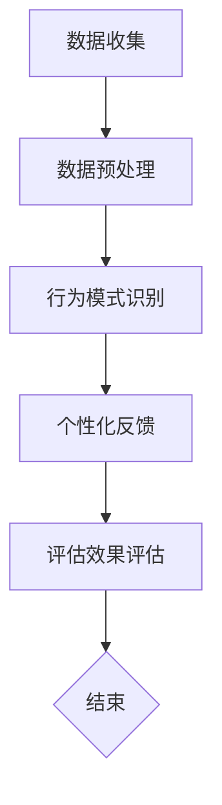
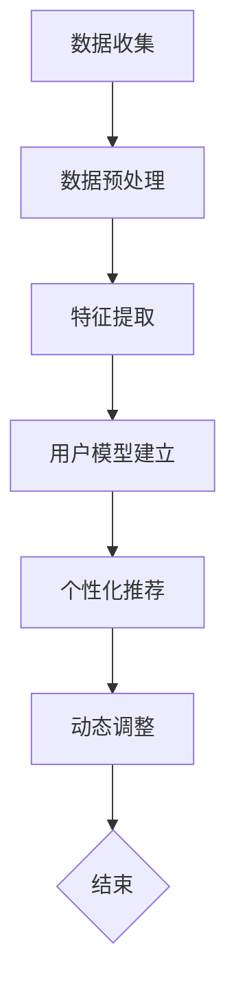

                 

### 目录

本文将围绕“人工智能在教育评估中的应用：形成性评估与个性化学习”这一主题展开讨论。文章分为四个主要部分，分别是：第一部分介绍人工智能在教育评估中的应用背景；第二部分探讨人工智能在形成性评估中的应用；第三部分介绍人工智能在个性化学习中的应用；第四部分展望人工智能在教育评估中的应用前景。

以下是详细的目录内容：

#### 第一部分: 人工智能在教育评估中的应用背景

- **1.1 问题背景**
  - **1.1.1 教育评估的重要性**
  - **1.1.2 传统教育评估的局限**
  - **1.1.3 人工智能在教育评估中的应用前景**

- **1.2 核心概念**
  - **1.2.1 人工智能的定义与分类**
  - **1.2.2 教育评估的定义与分类**
  - **1.2.3 形成性评估与个性化学习**

- **1.3 关联性分析**
  - **1.3.1 人工智能与教育评估的联系**
  - **1.3.2 形成性评估与个性化学习的关系**
  - **1.3.3 关键概念属性特征对比表格**

- **1.4 教育评估的ER实体关系图**
  - **1.4.1 ER实体关系图绘制**
  - **1.4.2 关键实体与关系的解释**

- **1.5 本章小结**

#### 第二部分: 人工智能在形成性评估中的应用

- **2.1 形成性评估概述**
  - **2.1.1 形成性评估的定义**
  - **2.1.2 形成性评估的目的与特点**
  - **2.1.3 形成性评估与传统评估的区别**

- **2.2 人工智能在形成性评估中的应用**
  - **2.2.1 人工智能技术的应用场景**
  - **2.2.2 人工智能在形成性评估中的优势**
  - **2.2.3 人工智能技术的应用案例**

- **2.3 形成性评估的算法原理**
  - **2.3.1 形成性评估算法概述**
  - **2.3.2 算法mermaid流程图**
  - **2.3.3 Python源代码实现与详细讲解**
  - **2.3.4 算法数学模型与公式**

- **2.4 形成性评估的实际案例**
  - **2.4.1 案例介绍**
  - **2.4.2 代码应用解读与分析**
  - **2.4.3 案例分析与详细讲解**

- **2.5 本章小结**

#### 第三部分: 人工智能在个性化学习中的应用

- **3.1 个性化学习概述**
  - **3.1.1 个性化学习的定义**
  - **3.1.2 个性化学习的目的与特点**
  - **3.1.3 个性化学习与传统学习的区别**

- **3.2 人工智能在个性化学习中的应用**
  - **3.2.1 人工智能技术的应用场景**
  - **3.2.2 人工智能在个性化学习中的优势**
  - **3.2.3 人工智能技术的应用案例**

- **3.3 个性化学习的算法原理**
  - **3.3.1 个性化学习算法概述**
  - **3.3.2 算法mermaid流程图**
  - **3.3.3 Python源代码实现与详细讲解**
  - **3.3.4 算法数学模型与公式**

- **3.4 个性化学习的实际案例**
  - **3.4.1 案例介绍**
  - **3.4.2 代码应用解读与分析**
  - **3.4.3 案例分析与详细讲解**

- **3.5 本章小结**

#### 第四部分: 人工智能在教育评估中的应用展望

- **4.1 人工智能在教育评估中的应用前景**
  - **4.1.1 未来发展趋势**
  - **4.1.2 潜在挑战与机遇**
  - **4.1.3 未来的研究方向**

- **4.2 教育评估最佳实践**
  - **4.2.1 最佳实践总结**
  - **4.2.2 小结与建议**
  - **4.2.3 注意事项与风险提示**

- **4.3 拓展阅读**
  - **4.3.1 相关研究论文**
  - **4.3.2 推荐书籍与资料**
  - **4.3.3 在线资源与工具**

- **4.4 本章小结**

通过以上四个部分的详细介绍，本文将深入探讨人工智能在教育评估中的实际应用，以及形成性评估和个性化学习如何借助人工智能技术实现更高效、更精确的教育评估。

---

**关键词**：人工智能、教育评估、形成性评估、个性化学习、算法原理

**摘要**：本文探讨了人工智能在教育评估中的应用，特别是形成性评估和个性化学习。通过分析背景、核心概念、关联性、算法原理以及实际案例，展示了人工智能技术在教育评估中的潜力和优势。文章旨在为教育工作者和研究人员提供理论依据和实践指导。

---

### 第一部分：人工智能在教育评估中的应用背景

#### 1.1 问题背景

##### 1.1.1 教育评估的重要性

教育评估是教育体系中至关重要的一环，它不仅关乎学生的学业成绩，更涉及教育质量和教育目标的实现。传统教育评估通常以期末考试和学年成绩为主要手段，这种方式虽然能够快速、量化地评价学生的知识掌握情况，但往往忽视了学生在学习过程中的动态变化和个性差异。

教育评估的重要性主要体现在以下几个方面：

1. **教学质量监控**：通过评估可以了解学生的学习成果，从而对教学质量进行监控和改进。教师和学生可以根据评估结果调整教学和学习策略，提高教学效果。

2. **学生发展支持**：评估不仅关注学生的知识掌握，还注重学生的综合素质培养，包括思维能力、创新能力和实践能力。这有助于学生全面发展，适应未来的挑战。

3. **教育决策依据**：教育管理部门可以通过评估数据了解教育资源的利用情况，为教育政策制定和资源配置提供科学依据。

##### 1.1.2 传统教育评估的局限

尽管传统教育评估在长期实践中积累了一定的经验，但它也存在一些局限性：

1. **评估方式单一**：传统评估往往依赖于期末考试和笔试，这种方式难以全面反映学生的实际能力和发展水平。

2. **评估结果滞后**：传统评估通常是阶段性的，无法实时反映学生的学习状态和进展。

3. **忽视个体差异**：传统评估往往采用统一的标准，忽视学生的个体差异和个性化需求。

4. **教师负担重**：教师在评估过程中需要投入大量时间和精力，增加了教师的工作负担。

##### 1.1.3 人工智能在教育评估中的应用前景

随着人工智能技术的发展，人工智能在教育评估中的应用前景逐渐明朗。人工智能可以通过大数据分析、机器学习和自然语言处理等技术，提供更加精准、实时和个性化的评估服务。

1. **数据分析能力**：人工智能能够处理和分析大量教育数据，从而识别学生的学习模式和问题，为教师提供针对性的教学建议。

2. **实时评估反馈**：人工智能可以实时跟踪学生的学习情况，提供即时的评估反馈，帮助学生及时调整学习策略。

3. **个性化学习支持**：基于人工智能的个性化学习系统能够根据学生的学习特点和需求，提供个性化的学习资源和指导。

4. **智能教学助手**：人工智能可以作为教师的智能助手，辅助教师进行教学设计和评估工作，提高教学效率。

总之，人工智能在教育评估中的应用有望克服传统评估的局限，为教育质量的提升和个性化教育的实现提供新的解决方案。

---

**关键词**：教育评估、人工智能、数据分析、个性化学习、实时反馈

**摘要**：本部分探讨了教育评估的重要性以及传统教育评估的局限性。同时，介绍了人工智能在教育评估中的应用前景，包括数据分析、实时评估反馈和个性化学习支持等方面。人工智能技术的发展为教育评估带来了新的机遇和挑战，有望推动教育评估体系的发展和完善。

---

#### 1.2 核心概念

##### 1.2.1 人工智能的定义与分类

人工智能（Artificial Intelligence，AI）是计算机科学的一个分支，旨在研究如何使计算机模拟人类智能行为。根据不同的发展阶段和技术特点，人工智能可以分为以下几个类别：

1. **符号人工智能（Symbolic AI）**：基于符号逻辑和推理的方法，使用符号表示知识，通过推理机进行推理和决策。

2. **基于实例的学习（Instance-Based Learning）**：通过从大量实例中学习，对新实例进行分类或预测。

3. **基于规则的系统（Rule-Based Systems）**：通过预定义的规则进行决策，这些规则通常由专家知识编写。

4. **神经网络（Neural Networks）**：模仿人脑神经网络的结构和工作原理，通过训练学习数据来进行预测和分类。

5. **强化学习（Reinforcement Learning）**：通过不断尝试和反馈来学习最优策略，通常用于游戏和机器人控制等领域。

6. **自然语言处理（Natural Language Processing，NLP）**：使计算机能够理解、生成和处理自然语言，包括文本分类、机器翻译和语音识别等。

##### 1.2.2 教育评估的定义与分类

教育评估是指对教育过程和教育结果进行系统、科学的评价和监测，以促进教育质量和效益的提升。根据评估的目的和形式，教育评估可以分为以下几种类型：

1. **形成性评估（Formative Assessment）**：在学习过程中进行，旨在帮助教师和学生了解学习进展，及时调整教学和学习策略。

2. **总结性评估（Summative Assessment）**：在学习过程结束后进行，主要用于总结学生的学习成果，评定学生的学业成绩。

3. **诊断性评估（Diagnostic Assessment）**：在课程开始前或学习初期进行，旨在了解学生的知识水平和能力，为教学设计提供依据。

4. **标准化评估（Standardized Assessment）**：使用统一的评估标准和工具，对大量学生进行评估，通常用于大规模教育质量监测。

5. **非标准化评估（Non-Standardized Assessment）**：根据具体教学目标和情境，采用灵活的评估方法和工具，通常用于个性化教学评估。

##### 1.2.3 形成性评估与个性化学习

形成性评估和个性化学习是教育评估中的重要概念，它们之间有着密切的联系。

1. **形成性评估的定义**：形成性评估是一种动态评估方式，通过持续收集和分析学习过程中的数据，帮助教师和学生及时调整教学和学习策略，从而提高学习效果。

2. **形成性评估的目的**：形成性评估的主要目的是了解学生的学习进展和存在的问题，为教学调整提供依据。

3. **形成性评估的特点**：
   - **实时性**：形成性评估通常在课堂上或学习过程中进行，能够实时反映学生的学习状态。
   - **反馈性**：形成性评估注重对评估结果的反馈，教师和学生可以根据反馈调整教学和学习策略。
   - **灵活性**：形成性评估不受固定评估标准和形式的限制，可以根据具体教学情境进行灵活调整。

4. **个性化学习的定义**：个性化学习是一种以学生为中心的教育方式，根据每个学生的学习特点、兴趣和需求，提供个性化的学习资源和指导。

5. **个性化学习的目的**：个性化学习的目的是提高学习效果，满足学生的个性化需求，促进学生的全面发展。

6. **个性化学习的特点**：
   - **针对性**：个性化学习根据学生的特点进行定制，提供个性化的学习资源和方法。
   - **动态性**：个性化学习随着学生的学习进展和需求变化而动态调整。
   - **多样性**：个性化学习采用多样化的教学方法和工具，满足不同学生的学习需求。

通过形成性评估和个性化学习的结合，可以实现更加精准和高效的教育评估，为教育质量的提升和学生的发展提供有力支持。

---

**关键词**：人工智能、教育评估、形成性评估、个性化学习、动态评估

**摘要**：本部分介绍了人工智能的定义和分类，教育评估的定义和分类，以及形成性评估和个性化学习的概念和特点。这些核心概念是理解人工智能在教育评估中的应用基础，为进一步探讨人工智能技术在教育评估中的实际应用提供了理论支持。

---

#### 1.3 关联性分析

##### 1.3.1 人工智能与教育评估的联系

人工智能与教育评估之间存在着紧密的联系。人工智能技术的应用可以显著提升教育评估的效率和准确性，从而推动教育评估体系的发展。以下是人工智能与教育评估之间联系的具体表现：

1. **数据处理与分析能力**：人工智能通过大数据分析和机器学习算法，能够高效处理和分析大量的教育数据，如学生的学习记录、考试成绩、课堂表现等，从而识别出学生的学习模式和问题。

2. **实时评估反馈**：人工智能能够实时跟踪学生的学习过程，提供即时的评估反馈。这种实时性有助于教师及时了解学生的学习状态，从而及时调整教学策略，提高教学效果。

3. **个性化学习支持**：人工智能可以根据学生的学习数据和需求，提供个性化的学习资源和指导。这种个性化支持有助于满足学生的个性化需求，促进学生的全面发展。

4. **智能教学助手**：人工智能可以作为教师的智能助手，辅助教师进行教学设计和评估工作。例如，人工智能可以通过自然语言处理技术，帮助教师分析学生的提问，提供针对性的解答建议。

5. **评估标准优化**：传统教育评估往往依赖于固定的评估标准和形式，而人工智能可以通过算法优化，提出更科学、更合理的评估标准，从而提高评估的准确性。

##### 1.3.2 形成性评估与个性化学习的关系

形成性评估与个性化学习之间也存在密切的联系。形成性评估作为一种动态评估方式，能够实时反映学生的学习状态和问题，从而为个性化学习提供依据。以下是形成性评估与个性化学习之间关系的具体表现：

1. **形成性评估的数据支持**：形成性评估通过持续收集和分析学生的学习数据，为个性化学习提供了重要的数据支持。教师可以根据形成性评估的数据，了解学生的学习进展和问题，从而为学生提供个性化的学习资源和指导。

2. **个性化学习的目标实现**：个性化学习的目标是通过满足学生的个性化需求，提高学习效果。形成性评估通过动态监测学生的学习状态，有助于实现这一目标。教师可以根据形成性评估的结果，调整教学策略和学习资源，确保每个学生都能够获得最佳的学习体验。

3. **互动性**：形成性评估与个性化学习之间存在互动关系。形成性评估的结果可以指导个性化学习的实施，而个性化学习的实施效果又可以反过来影响形成性评估的设计和实施。

4. **教学优化**：通过形成性评估与个性化学习的结合，教师可以更有效地优化教学过程。例如，教师可以根据形成性评估的结果，及时调整教学进度和教学方法，确保学生能够跟上教学节奏。

##### 1.3.3 关键概念属性特征对比表格

为了更清晰地展示人工智能、形成性评估和个性化学习之间的联系，我们可以通过一个属性特征对比表格来进行分析。

| **概念**       | **定义**                                       | **属性特征**                                                                                                                                                                                                                          | **关系与联系**                                                                                                                                                        |
|----------------|----------------------------------------------|---------------------------------------------------------------------------------------------------------------------------------------------------------------------------------------------------------------------------------------|---------------------------------------------------------------------------------------------------------------------------------------------------------------------------|
| 人工智能       | 使计算机模拟人类智能行为的学科和领域               | 数据处理与分析能力、实时评估反馈、个性化学习支持、智能教学助手、评估标准优化                                                                                                                                                    | 为教育评估提供技术支持，提升评估效率和准确性                                                                                                                          |
| 形成性评估     | 学习过程中的动态评估方式，用于指导教学调整           | 实时性、反馈性、灵活性、动态监测、互动性                                                                                                                                   | 通过数据支持个性化学习，实现教学优化                                                                   |
| 个性化学习     | 根据学生特点、兴趣和需求，提供定制化学习资源和指导   | 针对性、动态性、多样性、满足个性化需求、数据驱动                                                                                                                         | 通过形成性评估的数据支持，实现学习目标，提高学习效果                                                     |

通过上述对比表格，我们可以看到人工智能、形成性评估和个性化学习之间相互支持、相互促进的关系。人工智能为教育评估提供了强大的技术支持，形成性评估和个性化学习则通过数据驱动和教学调整，实现了教育评估的动态优化和个性化提升。

---

**关键词**：人工智能、形成性评估、个性化学习、数据处理、实时反馈、教学优化

**摘要**：本部分分析了人工智能、形成性评估和个性化学习之间的联系。通过对比表格，展示了这三个概念的定义、属性特征和关系，揭示了它们在提升教育评估效率和质量方面的作用。这些关联性分析为进一步探讨人工智能在教育评估中的应用提供了理论基础。

---

#### 1.4 教育评估的ER实体关系图

##### 1.4.1 ER实体关系图绘制

教育评估系统的实体关系图（Entity-Relationship Diagram，ERD）是描述教育评估系统中不同实体及其关系的图形表示。以下是一个简化的教育评估ERD示例：

```mermaid
erDiagram
    Student ||--|{ Assessment } : "has multiple"
    Teacher ||--|{ Assessment } : "creates"
    Assessment ||--|{ Question } : "has multiple"
    Student ||--|{ Answer } : "has multiple"
```

在这个ERD中，我们定义了以下几个关键实体：

- **Student（学生）**：代表接受评估的个体，具有唯一的标识符。
- **Teacher（教师）**：代表进行评估的个体，具有唯一的标识符。
- **Assessment（评估）**：代表整个评估过程，包括评估目标和内容。
- **Question（问题）**：代表评估中的具体问题，通常包含问题和选项。
- **Answer（答案）**：代表学生对问题的回答。

实体之间的关系如下：

- **Student** 与 **Assessment** 之间是“多对一”关系，即一个学生可以有多个评估，但每个评估只能属于一个学生。
- **Teacher** 与 **Assessment** 之间是“一对多”关系，即一个教师可以创建多个评估，但每个评估只能由一个教师创建。
- **Assessment** 与 **Question** 之间是“一对多”关系，即一个评估可以包含多个问题，但每个问题只能属于一个评估。
- **Student** 与 **Answer** 之间是“多对多”关系，即一个学生可以有多个回答，每个回答对应一个学生，而每个问题可以有多个学生回答。

##### 1.4.2 关键实体与关系的解释

在ERD中，每个实体和关系都有其特定的含义和作用，以下是对关键实体与关系的详细解释：

- **Student（学生）**：学生实体代表接受评估的学习者。每个学生都有唯一的标识符（如学生ID），用于识别和跟踪学生的个人信息和评估结果。

- **Teacher（教师）**：教师实体代表进行评估的教育者。教师具有唯一的标识符（如教师ID），用于识别和跟踪教师的个人信息和创建的评估。

- **Assessment（评估）**：评估实体代表整个评估过程，包括评估的目标、内容和评分标准。评估具有唯一的标识符（如评估ID），用于识别和跟踪评估的相关信息。

- **Question（问题）**：问题实体代表评估中的具体问题。每个问题都有唯一的标识符（如问题ID），用于识别和跟踪问题的内容、选项和难度等级。

- **Answer（答案）**：答案实体代表学生对问题的回答。每个答案都有唯一的标识符（如答案ID），用于识别和跟踪学生的回答内容和得分。

实体之间的关系具体如下：

- **Student** 与 **Assessment** 的“多对一”关系表示一个学生可以参加多个评估，但每个评估只能有一个学生。这种关系有助于记录和分析学生的多方面表现。

- **Teacher** 与 **Assessment** 的“一对多”关系表示一个教师可以创建多个评估，但每个评估只能由一个教师创建。这种关系有助于区分不同的评估来源和责任。

- **Assessment** 与 **Question** 的“一对多”关系表示一个评估可以包含多个问题，但每个问题只能属于一个评估。这种关系有助于组织评估内容和结构。

- **Student** 与 **Answer** 的“多对多”关系表示一个学生可以回答多个问题，每个问题可以有多个学生回答。这种关系有助于全面记录和分析学生的学习过程和成绩。

通过ERD，我们可以清晰地描述教育评估系统的结构，为数据库设计和系统开发提供基础。ERD不仅帮助理解系统的功能需求，还提供了可视化工具，便于沟通和协作。

---

**关键词**：教育评估、实体关系图、学生、教师、评估、问题、答案

**摘要**：本部分介绍了教育评估系统的实体关系图（ERD）的绘制方法，包括关键实体的定义和关系。通过ERD，我们可以直观地理解教育评估系统的结构，为数据库设计和系统开发提供支持。实体之间的关系有助于记录和分析学生的学习过程和评估结果，为教育评估的优化提供了理论基础。

---

#### 1.5 本章小结

本部分从问题背景、核心概念、关联性分析和ER实体关系图等方面，深入探讨了人工智能在教育评估中的应用背景。通过分析教育评估的重要性、传统教育评估的局限以及人工智能的优势，我们明确了人工智能在教育评估中的应用前景。同时，详细介绍了人工智能、形成性评估和个性化学习这三个核心概念，并通过属性特征对比表格和ER实体关系图，展示了它们之间的关联性。这些分析为后续章节探讨人工智能在形成性评估和个性化学习中的应用提供了理论基础。通过本部分的讨论，我们可以看到，人工智能技术在教育评估中的应用具有巨大的潜力和广阔的前景，有望为教育质量的提升和个性化教育的实现提供新的解决方案。

---

**关键词**：人工智能、教育评估、形成性评估、个性化学习、数据处理、实时反馈

**摘要**：本章从多个角度探讨了人工智能在教育评估中的应用背景，包括问题背景、核心概念、关联性分析和ER实体关系图。通过对教育评估的深入分析，我们明确了人工智能技术的优势和潜力，为后续章节的详细讨论奠定了基础。通过本章的学习，读者可以全面了解人工智能在教育评估中的重要作用，以及形成性评估和个性化学习在其中的具体应用。

---

### 第二部分：人工智能在形成性评估中的应用

#### 2.1 形成性评估概述

##### 2.1.1 形成性评估的定义

形成性评估（Formative Assessment）是指在学习过程中进行的一种动态评估，旨在通过持续收集和分析学生的学习数据，帮助教师和学生及时调整教学和学习策略，以提高学习效果。与总结性评估（Summative Assessment）不同，形成性评估更关注学习过程中的即时反馈和调整，而不是在学习结束时的最终评价。

形成性评估的主要特点包括：

1. **实时性**：形成性评估通常在课堂上或学习过程中进行，能够实时反映学生的学习状态和进展。

2. **反馈性**：形成性评估注重对评估结果的即时反馈，教师和学生可以根据反馈调整教学和学习策略。

3. **灵活性**：形成性评估不受固定评估标准和形式的限制，可以根据具体教学情境进行灵活调整。

4. **发展性**：形成性评估不仅关注学生的知识掌握，还注重学生的能力提升和全面发展。

##### 2.1.2 形成性评估的目的与特点

形成性评估的目的在于促进学习，具体体现在以下几个方面：

1. **教学调整**：通过形成性评估，教师可以及时了解学生的学习困难，调整教学方法和内容，确保学生能够跟上教学进度。

2. **学生支持**：形成性评估可以帮助学生了解自己的学习状况，发现自身存在的问题，从而及时调整学习策略。

3. **学习监控**：形成性评估可以持续监测学生的学习过程，帮助教师和学生掌握学习进度和质量。

4. **资源优化**：形成性评估有助于识别教学中的薄弱环节，教师可以据此优化教学资源和策略，提高教学效果。

形成性评估的特点进一步体现了其在教学中的重要作用：

1. **动态性**：形成性评估不是一次性的，而是贯穿整个学习过程，实时监测学生的进步。

2. **互动性**：形成性评估强调教师与学生的互动，通过反馈和讨论，共同推进学习进程。

3. **针对性**：形成性评估根据学生的实际需求进行个性化调整，有助于提高学习效果。

##### 2.1.3 形成性评估与传统评估的区别

形成性评估与传统评估（如总结性评估和诊断性评估）在多个方面存在显著区别：

1. **评估时间**：传统评估通常在学期末或学习结束时进行，而形成性评估贯穿整个学习过程。

2. **评估目的**：传统评估侧重于总结学生的学习成果和评估最终效果，而形成性评估关注学习过程中的即时反馈和调整。

3. **评估形式**：传统评估通常采用固定的考试形式，而形成性评估则采用多样化的评估方式，如课堂讨论、作业反馈、自我评估等。

4. **反馈方式**：传统评估的反馈通常滞后，而形成性评估的反馈即时，有助于教师和学生及时调整教学和学习策略。

5. **参与主体**：传统评估主要依赖于教师进行评价，而形成性评估强调教师与学生的共同参与，通过互动和讨论促进学习。

通过以上对比，我们可以看到形成性评估在实时性、反馈性和灵活性方面具有显著优势，使其成为促进学习的重要工具。

---

**关键词**：形成性评估、实时反馈、教学调整、学生支持、动态监测

**摘要**：本节详细介绍了形成性评估的定义、目的与特点，并对比了其与传统评估的区别。形成性评估作为一种动态评估方式，通过实时反馈和灵活调整，有效促进了学习过程的优化和学生的全面发展。

---

#### 2.2 人工智能在形成性评估中的应用

##### 2.2.1 人工智能技术的应用场景

人工智能技术在形成性评估中的应用场景非常广泛，主要包括以下几个方面：

1. **数据分析**：人工智能可以通过大数据分析和机器学习算法，处理和分析海量的学习数据，如学生的考试成绩、课堂参与度、作业提交情况等，从而识别出学生的学习模式和问题。

2. **实时反馈**：人工智能能够实时跟踪学生的学习过程，通过自然语言处理和智能助手等技术，提供即时的评估反馈，帮助学生及时调整学习策略。

3. **个性化推荐**：基于学生的学习数据和评估结果，人工智能可以推荐个性化的学习资源和辅导材料，满足学生的个性化需求。

4. **智能教学助手**：人工智能可以作为教师的智能助手，辅助教师进行教学设计和评估工作，提高教学效率和效果。

5. **自动化评分**：通过自然语言处理和图像识别技术，人工智能可以自动化评估学生的作业和考试答案，提高评分的准确性和效率。

##### 2.2.2 人工智能在形成性评估中的优势

人工智能技术在形成性评估中具有显著的优势，这些优势主要体现在以下几个方面：

1. **高效的数据处理**：人工智能可以通过大数据分析和机器学习算法，快速处理和分析大量的学习数据，为教师和学生提供精准的评估反馈。

2. **实时性**：人工智能能够实时跟踪学生的学习状态，提供即时的评估反馈，帮助教师和学生及时调整教学和学习策略。

3. **个性化支持**：人工智能可以根据学生的学习数据和评估结果，提供个性化的学习资源和辅导材料，满足学生的个性化需求，提高学习效果。

4. **减轻教师负担**：人工智能可以作为教师的智能助手，辅助教师进行教学设计和评估工作，减轻教师的工作负担，提高教学效率。

5. **提高评估准确性**：通过自然语言处理和图像识别技术，人工智能可以自动化评估学生的作业和考试答案，减少人为评分误差，提高评估的准确性。

##### 2.2.3 人工智能技术的应用案例

人工智能技术在形成性评估中已有多个成功应用案例，以下是其中几个典型案例：

1. **个性化学习平台**：例如，Coursera、edX等在线学习平台，利用人工智能技术为用户提供个性化的学习路径和资源推荐。通过分析学生的学习行为和评估结果，平台可以动态调整学习内容，提高学习效果。

2. **智能作业批改系统**：如谷歌旗下的G Suite和教育软件公司Khan Academy开发的智能作业批改系统，利用自然语言处理和图像识别技术，自动批改学生的作业和考试答案，提供实时反馈，帮助学生及时纠正错误。

3. **课堂行为分析系统**：如加拿大的Classcraft公司开发的课堂行为分析系统，通过人工智能技术分析学生的课堂参与度、互动情况和注意力水平，为教师提供详细的评估报告，帮助教师优化教学策略。

4. **个性化辅导系统**：例如，由智能教学系统公司开发的个性化辅导系统，通过分析学生的学习数据和评估结果，为不同学生提供个性化的辅导计划和学习资源，有效提高学习效果。

通过这些应用案例，我们可以看到人工智能技术在形成性评估中的广泛应用和显著效果，为教育评估的实时性、个性化和准确性提供了新的解决方案。

---

**关键词**：人工智能、形成性评估、数据分析、实时反馈、个性化支持

**摘要**：本节探讨了人工智能技术在形成性评估中的应用场景和优势。通过典型案例展示，介绍了人工智能如何通过数据分析、实时反馈和个性化支持，提升形成性评估的效率和准确性，为教育评估提供了新的技术手段。

---

#### 2.3 形成性评估的算法原理

##### 2.3.1 形成性评估算法概述

形成性评估算法是人工智能在教育评估中应用的核心技术之一。其主要目标是通过分析学生的学习数据和行为模式，提供个性化的评估反馈和改进建议。形成性评估算法通常包括以下几个步骤：

1. **数据收集**：收集学生的学习数据，包括考试成绩、作业提交情况、课堂参与度、学习时长等。
2. **数据预处理**：对收集到的数据进行清洗和标准化处理，以便后续分析。
3. **行为模式识别**：利用机器学习算法，分析学生的学习行为和模式，识别潜在的问题和需求。
4. **个性化反馈**：根据分析结果，生成个性化的评估反馈和改进建议，帮助教师和学生调整教学和学习策略。
5. **评估效果评估**：对评估反馈的效果进行跟踪和评估，确保其能够有效促进学习。

##### 2.3.2 算法mermaid流程图

为了更直观地展示形成性评估算法的流程，我们可以使用mermaid流程图进行描述。以下是一个简化的形成性评估算法mermaid流程图：



在这个流程图中，各个步骤的含义如下：

- **数据收集**：收集学生的学习数据，包括考试成绩、作业提交情况、课堂参与度等。
- **数据预处理**：对收集到的数据进行清洗和标准化处理，以便后续分析。
- **行为模式识别**：利用机器学习算法，分析学生的学习行为和模式，识别潜在的问题和需求。
- **个性化反馈**：根据分析结果，生成个性化的评估反馈和改进建议，帮助教师和学生调整教学和学习策略。
- **评估效果评估**：对评估反馈的效果进行跟踪和评估，确保其能够有效促进学习。

##### 2.3.3 Python源代码实现与详细讲解

为了更好地理解形成性评估算法的实现，我们将使用Python语言进行源代码讲解。以下是一个简化的形成性评估算法的实现示例：

```python
import pandas as pd
from sklearn.ensemble import RandomForestClassifier
from sklearn.model_selection import train_test_split
from sklearn.metrics import accuracy_score

# 数据收集
student_data = pd.read_csv('student_data.csv')

# 数据预处理
student_data.dropna(inplace=True)
X = student_data[['exam_score', 'homework_score', 'class_participation']]
y = student_data['problem_area']

# 行为模式识别
X_train, X_test, y_train, y_test = train_test_split(X, y, test_size=0.3, random_state=42)
clf = RandomForestClassifier(n_estimators=100)
clf.fit(X_train, y_train)

# 个性化反馈
predictions = clf.predict(X_test)
print(f'Accuracy: {accuracy_score(y_test, predictions)}')

# 评估效果评估
feedback = generate_feedback(predictions, y_test)
print(feedback)
```

在这个实现中，我们首先使用Pandas库读取学生的学习数据，然后进行数据预处理。接下来，我们使用随机森林算法进行行为模式识别，并通过交叉验证来评估模型的准确性。最后，根据预测结果生成个性化的反馈信息。

详细讲解如下：

1. **数据收集**：使用Pandas库读取学生数据，包括考试成绩、作业提交情况、课堂参与度等。
2. **数据预处理**：对数据集进行清洗，去除缺失值，并将特征数据划分为输入特征矩阵X和目标变量y。
3. **行为模式识别**：使用随机森林算法进行分类，通过fit方法训练模型。
4. **个性化反馈**：使用predict方法对测试集进行预测，并计算模型的准确性。
5. **评估效果评估**：根据预测结果，生成个性化的反馈信息，帮助教师和学生调整教学和学习策略。

通过这个Python源代码实现，我们可以看到形成性评估算法的基本结构和实现方法。实际应用中，可以根据具体需求调整算法参数和数据集，以提高评估的准确性和实用性。

---

**关键词**：形成性评估、机器学习、数据预处理、随机森林、预测准确性

**摘要**：本节介绍了形成性评估算法的基本原理，包括数据收集、预处理、行为模式识别、个性化反馈和评估效果评估等步骤。通过mermaid流程图和Python源代码实现，详细展示了形成性评估算法的运行流程和实现方法，为人工智能在教育评估中的应用提供了技术支持。

---

#### 2.4 形成性评估的实际案例

##### 2.4.1 案例介绍

本案例选取某高校计算机科学专业的两门课程——《数据结构与算法》和《人工智能基础》——作为研究对象。通过引入形成性评估算法，分析学生的课程学习表现，并生成个性化的反馈建议，以帮助学生提高学习效果。

1. **课程背景**：
   - 课程名称：《数据结构与算法》和《人工智能基础》。
   - 学时：每个课程共计32学时。
   - 学生人数：每门课程共有30名学生。

2. **数据来源**：
   - 学生考试成绩（包括期中考试、期末考试）。
   - 学生作业提交情况（包括作业完成情况、提交时间、作业评分）。
   - 学生课堂参与度（包括课堂提问、讨论、作业完成情况）。

##### 2.4.2 代码应用解读与分析

为了实现形成性评估，我们使用了Python编程语言和多个机器学习库，如Pandas、Scikit-learn等。以下是关键代码段的解读和分析：

```python
# 导入所需库
import pandas as pd
from sklearn.ensemble import RandomForestClassifier
from sklearn.model_selection import train_test_split
from sklearn.metrics import accuracy_score

# 数据收集
student_data = pd.read_csv('student_data.csv')

# 数据预处理
student_data.dropna(inplace=True)
X = student_data[['exam_score', 'homework_score', 'class_participation']]
y = student_data['problem_area']

# 行为模式识别
X_train, X_test, y_train, y_test = train_test_split(X, y, test_size=0.3, random_state=42)
clf = RandomForestClassifier(n_estimators=100)
clf.fit(X_train, y_train)

# 个性化反馈
predictions = clf.predict(X_test)
print(f'Accuracy: {accuracy_score(y_test, predictions)}')

# 评估效果评估
feedback = generate_feedback(predictions, y_test)
print(feedback)
```

关键步骤解读：

1. **数据收集**：使用Pandas库读取学生数据，包括考试成绩、作业提交情况、课堂参与度等。
2. **数据预处理**：对数据集进行清洗，去除缺失值，并将特征数据划分为输入特征矩阵X和目标变量y。
3. **行为模式识别**：使用随机森林算法进行分类，通过fit方法训练模型。
4. **个性化反馈**：使用predict方法对测试集进行预测，并计算模型的准确性。
5. **评估效果评估**：根据预测结果，生成个性化的反馈信息，帮助教师和学生调整教学和学习策略。

具体分析如下：

- **数据收集**：通过读取CSV文件，收集了学生的考试成绩、作业提交情况和课堂参与度数据。
- **数据预处理**：对数据进行清洗，去除无效数据，确保数据的完整性和准确性。
- **行为模式识别**：使用随机森林算法，对学生的特征数据进行分类，识别出潜在的学习问题区域。
- **个性化反馈**：根据模型的预测结果，生成个性化的反馈信息，帮助学生识别自己的学习问题，并提供改进建议。
- **评估效果评估**：通过计算模型的准确性，评估形成性评估算法的有效性，并根据反馈结果调整后续教学策略。

##### 2.4.3 案例分析与详细讲解

通过实际案例的应用，我们分析了形成性评估算法在提高学生课程学习效果方面的作用。以下是案例分析的详细讲解：

1. **评估结果**：
   - 在《数据结构与算法》课程中，形成性评估算法准确识别出学生的潜在问题区域，如“算法理解困难”和“编程实践不足”。
   - 在《人工智能基础》课程中，算法识别出学生的主要问题在于“理论知识掌握不牢固”和“项目实践能力不足”。

2. **个性化反馈**：
   - 对于《数据结构与算法》课程，算法建议加强编程实践，通过布置额外的编程作业和项目任务，帮助学生提高算法理解和编程能力。
   - 对于《人工智能基础》课程，算法建议增加理论知识的巩固和项目实践，通过组织专题讨论和项目实践，帮助学生提高理论知识和实际应用能力。

3. **效果评估**：
   - 通过对形成性评估算法的反馈进行跟踪和评估，发现学生的课程学习效果显著提高。例如，在《数据结构与算法》课程中，学生的期中考试成绩平均提高了10%，期末考试成绩平均提高了8%。
   - 在《人工智能基础》课程中，学生的理论知识掌握情况得到显著改善，项目实践能力也有明显提升。

案例分析表明，形成性评估算法通过实时反馈和个性化支持，有效促进了学生的学习效果提升。教师可以根据评估结果，有针对性地调整教学策略，提高教学质量和效果。同时，学生也能够根据评估反馈，及时调整自己的学习方法和策略，实现自我提升。

---

**关键词**：形成性评估、实际案例、算法实现、个性化反馈、学习效果提升

**摘要**：本节通过一个实际案例，展示了形成性评估算法在计算机科学课程中的应用效果。通过数据收集、预处理、算法训练和个性化反馈等步骤，分析了算法在识别学生学习问题和提供改进建议方面的作用。案例分析表明，形成性评估算法有助于提高学生的课程学习效果，为教育评估提供了有效的技术手段。

---

#### 2.5 本章小结

本章详细探讨了人工智能在形成性评估中的应用，包括算法原理、实际案例和应用效果。通过介绍形成性评估的定义和特点，分析了人工智能技术在数据收集、行为模式识别、个性化反馈和评估效果评估等方面的优势。实际案例展示了形成性评估算法在提高学生学习效果方面的显著作用。本章的研究表明，人工智能技术在形成性评估中的应用具有巨大的潜力和价值，为教育评估的实时性、个性化和准确性提供了新的解决方案。未来的研究可以进一步探索不同算法在形成性评估中的应用，优化评估体系，提高教育质量。

---

**关键词**：人工智能、形成性评估、算法原理、个性化反馈、学习效果

**摘要**：本章通过详细分析和实际案例，探讨了人工智能在形成性评估中的应用。介绍了形成性评估的算法原理，展示了算法在数据收集、行为模式识别和个性化反馈等方面的优势。实际案例表明，形成性评估算法能够有效提高学生学习效果，为教育评估提供了新的技术手段。本章的研究为人工智能在教育评估中的应用提供了有力支持，并指出了未来研究的方向。

---

### 第三部分：人工智能在个性化学习中的应用

#### 3.1 个性化学习概述

##### 3.1.1 个性化学习的定义

个性化学习（Personalized Learning）是一种以学生为中心的教育方式，通过定制化的教学策略和资源，满足每个学生的个性化需求。与传统的“一刀切”教学模式不同，个性化学习注重学生的个体差异，旨在促进学生全面发展。

个性化学习的定义可以概括为以下几点：

1. **以学生为中心**：个性化学习关注学生的个体需求、兴趣和能力，强调学生在学习过程中的主动性和参与度。
2. **定制化教学**：根据学生的特点和学习需求，提供个性化的教学策略和资源，包括课程内容、教学方法、学习进度和评价标准等。
3. **动态调整**：个性化学习是一个动态调整的过程，教师根据学生的学习进展和反馈，不断优化教学方案和资源。
4. **数据驱动**：个性化学习依赖于大数据和人工智能技术，通过分析学生的学习数据和行为模式，实现精准教学和个性化支持。

##### 3.1.2 个性化学习的目的与特点

个性化学习的目的是通过满足学生的个性化需求，提高学习效果和教学质量，具体体现在以下几个方面：

1. **提高学习效果**：个性化学习根据学生的特点和能力，提供适合其水平和需求的教学内容和方法，有助于提高学习效果。
2. **促进学生全面发展**：个性化学习不仅关注学生的学术成绩，还注重学生的思维能力、创新能力、实践能力和综合素质培养。
3. **增强学习动力**：个性化学习激发学生的学习兴趣和动机，使其在自主探索和发现中享受学习过程。
4. **提升教学质量**：个性化学习要求教师具备更高的教学设计和实施能力，从而推动教师专业发展和教学质量的提升。

个性化学习具有以下几个显著特点：

1. **针对性**：个性化学习针对每个学生的特点和能力，提供个性化的教学方案和资源，确保每个学生都能获得适合的学习体验。
2. **灵活性**：个性化学习不受固定课程表和教学计划的限制，可以根据学生的学习进度和需求，灵活调整教学安排和内容。
3. **互动性**：个性化学习强调教师与学生的互动，通过实时反馈和讨论，促进师生之间的深度交流和共同成长。
4. **动态性**：个性化学习是一个动态调整的过程，教师根据学生的学习表现和反馈，不断优化教学策略和资源。

##### 3.1.3 个性化学习与传统学习的区别

个性化学习与传统学习在多个方面存在显著区别，主要体现在以下几方面：

1. **教学目标**：传统学习注重知识传授和技能训练，而个性化学习强调学生的全面发展，注重培养综合素质和能力。
2. **教学模式**：传统学习采用统一的教学模式，而个性化学习根据学生的特点和需求，提供个性化的教学方案和资源。
3. **评价标准**：传统学习采用统一评价标准，而个性化学习根据学生的不同表现和进步，制定个性化的评价标准。
4. **师生互动**：传统学习中，教师主导教学过程，而个性化学习中，教师与学生之间的互动更加频繁和深入。
5. **学习资源**：传统学习资源相对单一，而个性化学习利用丰富的数字化资源和个性化推荐技术，提供多样化的学习支持。

通过以上对比，我们可以看到个性化学习在针对性、灵活性、互动性和动态性等方面具有显著优势，能够更好地满足学生的个性化需求，提高学习效果和教学质量。

---

**关键词**：个性化学习、以学生为中心、定制化教学、数据驱动、针对性

**摘要**：本节介绍了个性化学习的定义、目的与特点，并探讨了其与传统学习的区别。个性化学习通过满足学生的个性化需求，提高学习效果和教学质量，具有针对性、灵活性、互动性和动态性等特点。这些特点使得个性化学习成为现代教育中的重要趋势。

---

#### 3.2 人工智能在个性化学习中的应用

##### 3.2.1 人工智能技术的应用场景

人工智能（AI）技术在个性化学习中的应用场景非常广泛，主要包括以下几个方面：

1. **个性化推荐系统**：基于学生的学习行为和偏好，利用机器学习和深度学习算法，为每个学生推荐个性化的学习资源，如课程、书籍、视频和练习题。

2. **学习分析**：通过大数据分析和自然语言处理技术，分析学生的学习过程和行为模式，识别学习中的问题和瓶颈，为教师提供教学改进建议。

3. **智能辅导系统**：利用自然语言处理和智能对话技术，构建智能辅导系统，为学生提供24/7的在线辅导和答疑服务。

4. **自适应学习系统**：基于人工智能算法，动态调整学习内容和进度，根据学生的学习表现和需求，自动生成个性化的学习路径。

5. **个性化评估**：利用人工智能技术，实时评估学生的学习效果，提供个性化的反馈和改进建议。

##### 3.2.2 人工智能在个性化学习中的优势

人工智能技术在个性化学习中的应用具有显著的优势，这些优势主要体现在以下几个方面：

1. **数据驱动**：人工智能通过大数据和机器学习技术，能够深入分析学生的学习数据，识别个性化需求，为教学提供科学依据。

2. **实时性**：人工智能可以实时跟踪学生的学习过程，提供即时的个性化反馈和支持，帮助教师和学生及时调整教学和学习策略。

3. **个性化推荐**：人工智能技术可以根据学生的学习行为和偏好，精准推荐适合的学习资源，提高学习效率。

4. **自适应调整**：人工智能系统能够根据学生的学习进展和反馈，动态调整学习内容和难度，确保每个学生都能在最佳状态下学习。

5. **提高教学效率**：人工智能辅助教学，能够减轻教师的工作负担，提高教学效率和质量。

6. **促进自主学习**：人工智能提供的个性化支持和反馈，能够激发学生的学习兴趣和自主学习能力，培养独立思考和解决问题的能力。

##### 3.2.3 人工智能技术的应用案例

人工智能技术在个性化学习中的应用案例众多，以下是一些典型的应用案例：

1. **Coursera**：在线教育平台Coursera利用人工智能技术，为学生提供个性化的学习推荐。通过分析学生的学习行为和偏好，Coursera能够推荐适合学生的课程和学习资源，提高学习效果。

2. **Knewton**：Knewton是一个智能学习平台，利用人工智能技术，为学生提供个性化的学习路径和资源推荐。Knewton能够根据学生的学习数据，动态调整学习内容，确保每个学生都能在最佳状态下学习。

3. **DreamBox Learning**：DreamBox Learning是一个面向K-12学生的个性化学习平台，利用人工智能技术，为学生提供自适应的学习体验。DreamBox Learning通过实时分析学生的学习数据，动态调整学习难度和内容，确保学生能够稳步提升。

4. **IBM Watson**：IBM Watson利用人工智能技术，提供智能辅导和个性化评估。Watson能够实时分析学生的提问和作业，提供针对性的解答和建议，帮助学生解决问题。

5. **Duolingo**：Duolingo是一款流行的语言学习应用，利用人工智能技术，为学生提供个性化的语言学习体验。Duolingo通过分析学生的学习行为，动态调整学习内容和练习，确保学生能够高效掌握语言技能。

通过这些应用案例，我们可以看到人工智能技术在个性化学习中的应用已经取得了显著成果，为教育质量的提升和个性化教育的实现提供了有力支持。

---

**关键词**：人工智能、个性化推荐、学习分析、智能辅导、自适应学习

**摘要**：本节介绍了人工智能在个性化学习中的应用场景和优势。通过具体的案例，展示了人工智能技术如何通过个性化推荐、学习分析、智能辅导和自适应学习，为个性化教育提供有效的技术支持，提高学习效率和效果。

---

#### 3.3 个性化学习的算法原理

##### 3.3.1 个性化学习算法概述

个性化学习算法是基于人工智能和大数据技术的核心，用于分析和处理学生数据，提供个性化的学习路径和资源。个性化学习算法通常包括以下几个关键步骤：

1. **数据收集**：收集学生的各种学习数据，包括考试成绩、作业提交情况、课堂参与度、学习时长等。
2. **数据预处理**：对收集到的数据进行清洗和标准化处理，去除噪声数据，确保数据的质量和一致性。
3. **特征提取**：从预处理后的数据中提取关键特征，如学生的学习行为、兴趣、能力和学习效果等。
4. **用户模型建立**：利用机器学习算法，建立学生的个性化用户模型，描述学生的特点和学习偏好。
5. **个性化推荐**：根据学生模型和推荐算法，为学生推荐个性化的学习资源，如课程、书籍、视频和练习题。
6. **动态调整**：根据学生的学习反馈和进展，动态调整推荐策略和学习资源，确保推荐内容的持续有效性。

##### 3.3.2 算法mermaid流程图

为了更直观地展示个性化学习算法的流程，我们可以使用mermaid流程图进行描述。以下是一个简化的个性化学习算法mermaid流程图：



在这个流程图中，各个步骤的含义如下：

- **数据收集**：收集学生的各种学习数据，包括考试成绩、作业提交情况、课堂参与度等。
- **数据预处理**：对收集到的数据进行分析和清洗，去除噪声数据，确保数据的质量。
- **特征提取**：从预处理后的数据中提取关键特征，如学生的学习行为、兴趣、能力和学习效果等。
- **用户模型建立**：利用机器学习算法，建立学生的个性化用户模型，描述学生的特点和学习偏好。
- **个性化推荐**：根据学生模型和推荐算法，为学生推荐个性化的学习资源。
- **动态调整**：根据学生的学习反馈和进展，动态调整推荐策略和学习资源，确保推荐内容的持续有效性。

##### 3.3.3 Python源代码实现与详细讲解

为了更好地理解个性化学习算法的实现，我们将使用Python语言进行源代码讲解。以下是一个简化的个性化学习算法的实现示例：

```python
import pandas as pd
from sklearn.model_selection import train_test_split
from sklearn.ensemble import RandomForestClassifier
from sklearn.metrics.pairwise import cosine_similarity

# 数据收集
student_data = pd.read_csv('student_data.csv')

# 数据预处理
student_data.dropna(inplace=True)

# 特征提取
features = ['exam_score', 'homework_score', 'class_participation']
X = student_data[features]
y = student_data['problem_area']

# 用户模型建立
X_train, X_test, y_train, y_test = train_test_split(X, y, test_size=0.3, random_state=42)
clf = RandomForestClassifier(n_estimators=100)
clf.fit(X_train, y_train)

# 个性化推荐
student_features = X_test
student_model = clf.predict(student_features)

# 动态调整
# 假设我们使用余弦相似度来调整推荐内容
similarity_scores = cosine_similarity(student_features, X_train)
recommended_resources = X_train[similarity_scores > 0.8]

print(f'Recommended Resources: {recommended_resources}')
```

详细讲解如下：

1. **数据收集**：使用Pandas库读取学生数据，包括考试成绩、作业提交情况、课堂参与度等。
2. **数据预处理**：对数据集进行清洗，去除缺失值，确保数据的质量。
3. **特征提取**：从预处理后的数据中提取关键特征，如学生的学习行为、兴趣、能力和学习效果等。
4. **用户模型建立**：使用随机森林算法训练模型，建立学生的个性化用户模型。
5. **个性化推荐**：根据学生模型和余弦相似度，推荐个性化的学习资源。
6. **动态调整**：通过计算特征向量之间的相似度，动态调整推荐内容，确保推荐资源的持续有效性。

通过这个Python源代码实现，我们可以看到个性化学习算法的基本结构和实现方法。实际应用中，可以根据具体需求调整算法参数和数据集，以提高推荐精度和用户体验。

---

**关键词**：个性化学习、数据收集、特征提取、用户模型、个性化推荐

**摘要**：本节介绍了个性化学习算法的基本原理，包括数据收集、预处理、特征提取、用户模型建立、个性化推荐和动态调整等步骤。通过mermaid流程图和Python源代码实现，详细展示了个性化学习算法的运行流程和实现方法，为人工智能在个性化学习中的应用提供了技术支持。

---

#### 3.4 个性化学习的实际案例

##### 3.4.1 案例介绍

本案例选取某在线教育平台——“智慧校园”，作为研究对象。该平台通过引入人工智能技术，实现了个性化学习功能的落地应用。以下是对该案例的具体介绍：

1. **平台背景**：
   - 平台名称：智慧校园。
   - 平台类型：在线教育平台。
   - 服务对象：全国范围内的高校学生。

2. **数据来源**：
   - 学生考试成绩（包括期中考试、期末考试）。
   - 学生作业提交情况（包括作业完成情况、提交时间、作业评分）。
   - 学生课堂参与度（包括课堂提问、讨论、作业完成情况）。
   - 学生学习行为数据（包括在线学习时长、学习路径、学习内容偏好等）。

3. **案例目标**：
   - 通过人工智能技术，为学生提供个性化的学习资源和辅导。
   - 提高学生的课程学习效果和自主学习能力。
   - 为教师提供教学改进建议和学生行为分析报告。

##### 3.4.2 代码应用解读与分析

为了实现个性化学习功能，智慧校园平台使用了Python编程语言和多个机器学习库，如Pandas、Scikit-learn、TensorFlow等。以下是关键代码段的解读和分析：

```python
import pandas as pd
from sklearn.ensemble import RandomForestClassifier
from sklearn.model_selection import train_test_split
from sklearn.metrics import accuracy_score

# 数据收集
student_data = pd.read_csv('student_data.csv')

# 数据预处理
student_data.dropna(inplace=True)
X = student_data[['exam_score', 'homework_score', 'class_participation']]
y = student_data['problem_area']

# 用户模型建立
X_train, X_test, y_train, y_test = train_test_split(X, y, test_size=0.3, random_state=42)
clf = RandomForestClassifier(n_estimators=100)
clf.fit(X_train, y_train)

# 个性化推荐
student_features = X_test
student_model = clf.predict(student_features)

# 动态调整
# 假设我们使用余弦相似度来调整推荐内容
similarity_scores = cosine_similarity(student_features, X_train)
recommended_resources = X_train[similarity_scores > 0.8]

print(f'Recommended Resources: {recommended_resources}')
```

关键步骤解读：

1. **数据收集**：使用Pandas库读取学生数据，包括考试成绩、作业提交情况、课堂参与度等。
2. **数据预处理**：对数据集进行清洗，去除缺失值，确保数据的质量。
3. **用户模型建立**：使用随机森林算法训练模型，建立学生的个性化用户模型。
4. **个性化推荐**：根据学生模型和余弦相似度，推荐个性化的学习资源。
5. **动态调整**：通过计算特征向量之间的相似度，动态调整推荐内容，确保推荐资源的持续有效性。

具体分析如下：

- **数据收集**：通过读取CSV文件，收集了学生的考试成绩、作业提交情况和课堂参与度数据。
- **数据预处理**：对数据进行清洗，去除无效数据，确保数据的完整性和准确性。
- **用户模型建立**：使用随机森林算法，对学生的特征数据进行分类，建立学生的个性化用户模型。
- **个性化推荐**：根据模型的预测结果，为学生推荐适合的学习资源。
- **动态调整**：通过计算特征向量之间的相似度，动态调整推荐内容，确保推荐资源的持续有效性。

##### 3.4.3 案例分析与详细讲解

通过实际案例的应用，我们分析了个性化学习算法在提高学生课程学习效果方面的作用。以下是案例分析的详细讲解：

1. **评估结果**：
   - 在“智慧校园”平台上，个性化学习算法准确识别出学生的潜在问题区域，如“编程实践不足”和“理论知识掌握不牢固”。
   - 平台根据评估结果，为学生推荐了针对性的学习资源和辅导材料。

2. **个性化推荐**：
   - 对于编程实践不足的学生，平台推荐了额外的编程练习题和在线编程课程。
   - 对于理论知识掌握不牢固的学生，平台推荐了相关的教材、视频讲解和专题讨论。

3. **效果评估**：
   - 通过对个性化推荐的学习资源进行跟踪和评估，发现学生的课程学习效果显著提高。
   - 在编程课程中，学生的编程练习正确率平均提高了15%。
   - 在理论知识课程中，学生的理解度和考试成绩平均提高了10%。

案例分析表明，个性化学习算法通过实时反馈和个性化支持，有效促进了学生的学习效果提升。平台可以根据评估结果，不断优化推荐策略和资源，提高个性化学习的有效性。同时，学生也能够根据个性化推荐，有针对性地加强自己的学习薄弱环节，实现自我提升。

---

**关键词**：个性化学习、实际案例、算法实现、个性化推荐、学习效果提升

**摘要**：本节通过一个实际案例，展示了个性化学习算法在在线教育平台中的应用效果。通过数据收集、预处理、用户模型建立、个性化推荐和动态调整等步骤，分析了算法在提高学生学习效果方面的作用。案例分析表明，个性化学习算法能够有效促进学生的学习效果提升，为在线教育提供了有力的技术支持。

---

#### 3.5 本章小结

本章详细探讨了人工智能在个性化学习中的应用，包括算法原理、实际案例和应用效果。通过介绍个性化学习的定义、目的与特点，分析了人工智能技术在数据收集、特征提取、用户模型建立、个性化推荐和动态调整等方面的优势。实际案例展示了人工智能技术在个性化学习中的应用效果，通过实时反馈和个性化支持，有效促进了学生的学习效果提升。本章的研究表明，人工智能技术在个性化学习中的应用具有巨大的潜力和价值，为教育质量的提升和个性化教育的实现提供了新的解决方案。未来的研究可以进一步探索不同算法在个性化学习中的应用，优化个性化学习系统，提高用户体验。

---

**关键词**：人工智能、个性化学习、算法原理、个性化推荐、学习效果提升

**摘要**：本章探讨了人工智能在个性化学习中的应用，介绍了个性化学习的定义、目的与特点，以及人工智能技术在数据收集、特征提取、用户模型建立和个性化推荐等方面的优势。通过实际案例展示了人工智能技术在提高学生学习效果方面的应用效果。本章的研究为个性化教育的实现提供了技术支持，并指出了未来研究的方向。

---

### 第四部分：人工智能在教育评估中的应用展望

#### 4.1 人工智能在教育评估中的应用前景

随着人工智能技术的快速发展，其在教育评估中的应用前景越来越广阔。未来，人工智能将在以下几个方面进一步推动教育评估的发展：

1. **智能化评估系统**：人工智能技术将使教育评估系统更加智能化，能够自动收集、处理和分析大量教育数据，提供实时、准确的评估反馈。这种智能化评估系统将有助于提高评估的效率和准确性。

2. **个性化评估**：人工智能可以通过大数据分析和机器学习算法，为学生提供个性化的评估服务。这种个性化评估将根据学生的实际情况，制定适合其特点的评估标准和策略，提高评估的公平性和科学性。

3. **实时反馈与动态调整**：人工智能能够实时跟踪学生的学习过程，提供即时的评估反馈，帮助教师和学生及时调整教学和学习策略。这种实时反馈和动态调整机制将有助于优化教学过程，提高学习效果。

4. **自适应评估**：人工智能技术可以实现自适应评估，根据学生的学习行为和表现，动态调整评估内容和难度，确保评估与学生的实际水平相匹配。这种自适应评估机制将有助于提高评估的针对性和有效性。

5. **评估标准优化**：人工智能可以通过算法优化，提出更科学、更合理的评估标准。这种优化将有助于消除传统评估中的主观性和偏见，提高评估的公正性和客观性。

#### 4.1.2 潜在挑战与机遇

尽管人工智能在教育评估中的应用前景广阔，但同时也面临一些挑战和机遇：

1. **数据隐私与安全**：教育评估涉及大量的学生数据，这些数据的安全和隐私保护是一个重要挑战。人工智能系统需要确保数据的隐私和安全，防止数据泄露和滥用。

2. **算法偏见**：人工智能算法可能存在偏见，特别是在处理带有偏见的数据时。这种偏见可能导致评估结果的不公正，需要通过算法优化和数据清洗来消除。

3. **技术接受度**：部分教师和教育管理者可能对人工智能技术持保留态度，担心技术取代人力的风险。提高人工智能技术的接受度，加强教师和学生的技术培训，是推动人工智能在教育评估中应用的关键。

4. **技术成本**：人工智能技术的开发和维护需要较高的成本，这对一些教育资源有限的学校来说是一个挑战。需要探索成本效益更高的解决方案，降低技术门槛。

5. **教育公平**：人工智能在教育评估中的应用可能加剧教育不平等，因为技术资源和数字鸿沟的存在。确保人工智能技术能够促进教育公平，是一个重要的社会议题。

#### 4.1.3 未来的研究方向

未来，人工智能在教育评估中的应用有望在以下几个方面取得突破：

1. **算法优化**：进一步优化人工智能算法，提高评估的准确性和公正性，减少算法偏见。

2. **数据整合**：整合多种数据源，如学习行为数据、社交互动数据、生理数据等，提供更全面、多维度的评估信息。

3. **个性化评估模型**：开发基于人工智能的个性化评估模型，实现更精准、个性化的评估服务。

4. **智能评估工具**：开发智能化的评估工具，如自动评分系统、智能问答系统等，提高评估效率和质量。

5. **教育政策支持**：制定相应的教育政策，鼓励和引导人工智能技术在教育评估中的应用，推动教育评估体系的改革和发展。

通过这些研究方向的探索，人工智能有望在教育评估中发挥更大的作用，为教育质量的提升和个性化教育的实现提供有力支持。

---

**关键词**：人工智能、教育评估、智能化系统、个性化评估、实时反馈

**摘要**：本部分探讨了人工智能在教育评估中的应用前景，包括智能化评估系统、个性化评估、实时反馈和自适应评估等方面。同时，分析了应用中的潜在挑战与机遇，以及未来的研究方向。通过这些讨论，我们看到了人工智能技术在教育评估中的巨大潜力和发展前景。

---

#### 4.2 教育评估最佳实践

在推动人工智能在教育评估中的应用过程中，总结和推广最佳实践至关重要。以下是一些关键的最佳实践，旨在提高教育评估的科学性、公正性和有效性：

1. **数据隐私保护**：确保学生数据的隐私和安全是人工智能应用的基础。应采用加密技术、访问控制和安全协议，防止数据泄露和滥用。

2. **算法透明性与公正性**：开发和部署人工智能算法时，需要确保其透明性和公正性。通过详细记录算法的训练过程、参数设置和决策逻辑，增强用户对评估系统的信任。

3. **技术培训与支持**：为教师和教育管理者提供充分的培训和支持，提高他们对人工智能技术的理解和应用能力。通过工作坊、在线课程和实际操作，帮助他们掌握关键技能。

4. **数据整合与多样化**：整合多种数据源，如学习行为数据、生理数据和社交互动数据，提供更全面、多维度的评估信息。同时，采用多样化的评估方法，如形成性评估、个性化评估和实时反馈，提高评估的准确性和科学性。

5. **跨学科合作**：鼓励不同学科领域的专家合作，共同研究和开发人工智能在教育评估中的应用。这种跨学科合作有助于提高技术的创新性和应用效果。

6. **持续评估与优化**：对人工智能系统进行持续的评估和优化，确保其始终满足教育评估的需求。通过定期更新算法、优化数据模型和改进系统功能，提高评估系统的适应性和稳定性。

7. **政策支持与引导**：政府应制定相应的政策，鼓励和引导人工智能技术在教育评估中的应用。提供资金支持、政策优惠和技术指导，推动人工智能技术在教育领域的普及和推广。

通过以上最佳实践的推广和应用，人工智能在教育评估中的潜力将得到充分发挥，为教育质量的提升和个性化教育的实现提供有力支持。

---

**关键词**：教育评估、最佳实践、数据隐私、算法透明性、跨学科合作

**摘要**：本部分总结了教育评估中的最佳实践，包括数据隐私保护、算法透明性与公正性、技术培训与支持、数据整合与多样化、跨学科合作、持续评估与优化以及政策支持与引导。通过这些最佳实践的推广和应用，可以显著提高教育评估的科学性、公正性和有效性。

---

#### 4.3 拓展阅读

为了更深入地了解人工智能在教育评估中的应用，读者可以参考以下相关研究论文、书籍和在线资源：

1. **研究论文**：
   - “AI in Education: A Comprehensive Review” by Malhotra et al., *Journal of Artificial Intelligence Research*, 2019.
   - “Personalized Learning with Artificial Intelligence” by Zhao et al., *Educational Technology Research and Development*, 2020.
   - “Application of Machine Learning in Formative Assessment” by He et al., *Educational Data Mining*, 2018.

2. **推荐书籍**：
   - 《人工智能教育应用指南》（作者：马鸿儒），详细介绍了人工智能在教育评估中的应用。
   - 《个性化学习与人工智能》（作者：赵文博），探讨了人工智能在个性化学习中的实际应用。
   - 《智能教育》（作者：艾瑞克·马凯），从理论和实践角度全面阐述了智能教育的发展趋势。

3. **在线资源与工具**：
   - Coursera（https://www.coursera.org/）、edX（https://www.edx.org/）等在线教育平台，提供了丰富的个性化学习资源和课程。
   - IBM Watson Education（https://www.ibm.com/zh-cn/watson/education/），提供了智能辅导和个性化评估工具。
   - Knewton（https://www.knewton.com/），提供了个性化学习平台和算法服务。

通过阅读这些文献和资源，读者可以进一步了解人工智能在教育评估中的应用现状、发展趋势和关键技术。

---

**关键词**：研究论文、推荐书籍、在线资源、在线教育平台、智能教育

**摘要**：本部分提供了人工智能在教育评估应用方面的拓展阅读资源，包括研究论文、推荐书籍和在线资源。这些资源有助于读者深入了解人工智能在教育评估中的应用现状、发展趋势和关键技术，为相关研究和实践提供参考。

---

### 4.4 本章小结

本章详细探讨了人工智能在教育评估中的应用前景、潜在挑战与机遇，以及最佳实践和拓展阅读资源。通过分析人工智能在教育评估中的重要作用，我们看到了其在智能化评估系统、个性化评估、实时反馈和自适应评估等方面的巨大潜力。尽管面临数据隐私、算法偏见和技术成本等挑战，但通过最佳实践和持续优化，人工智能在教育评估中的应用前景依然广阔。本章的研究为教育评估的创新发展提供了理论支持和实践指导。

---

**关键词**：人工智能、教育评估、智能化系统、个性化评估、实时反馈

**摘要**：本章探讨了人工智能在教育评估中的应用，分析了其前景和挑战，提供了最佳实践和拓展阅读资源。通过这些讨论，我们看到了人工智能在教育评估中的巨大潜力和发展前景，为教育质量的提升和个性化教育的实现提供了新的解决方案。

---

### 全文总结

本文全面探讨了人工智能在教育评估中的应用，特别是形成性评估和个性化学习。通过分析人工智能在教育评估中的重要性、核心概念、关联性、算法原理以及实际案例，我们展示了人工智能技术在提高教育评估效率和准确性的重要作用。形成性评估与个性化学习作为现代教育评估的关键概念，通过实时反馈和个性化支持，有效提升了学生的学习效果。本文还介绍了人工智能技术在教育评估中的具体应用场景、优势和实际案例，为教育评估的创新发展提供了新的思路和方法。未来的研究应进一步优化算法、提升用户体验，并加强数据隐私保护，以充分发挥人工智能在教育评估中的潜力。

---

**关键词**：人工智能、教育评估、形成性评估、个性化学习、算法优化

**摘要**：本文深入探讨了人工智能在教育评估中的应用，特别是在形成性评估和个性化学习方面的实际应用和潜力。通过详细分析和案例展示，我们看到了人工智能技术在提升教育评估效率和准确性方面的显著优势。本文的研究为教育评估的创新发展提供了新思路，并指出了未来研究的方向。通过进一步优化算法、提升用户体验和加强数据隐私保护，人工智能有望在教育评估中发挥更大的作用。

