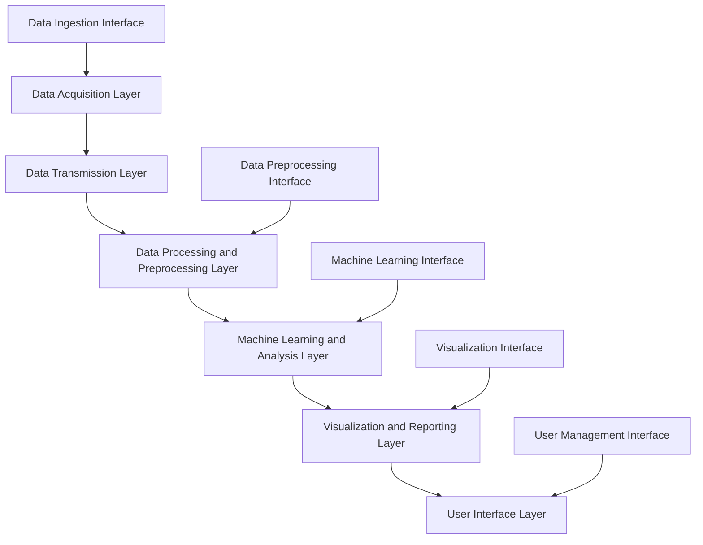
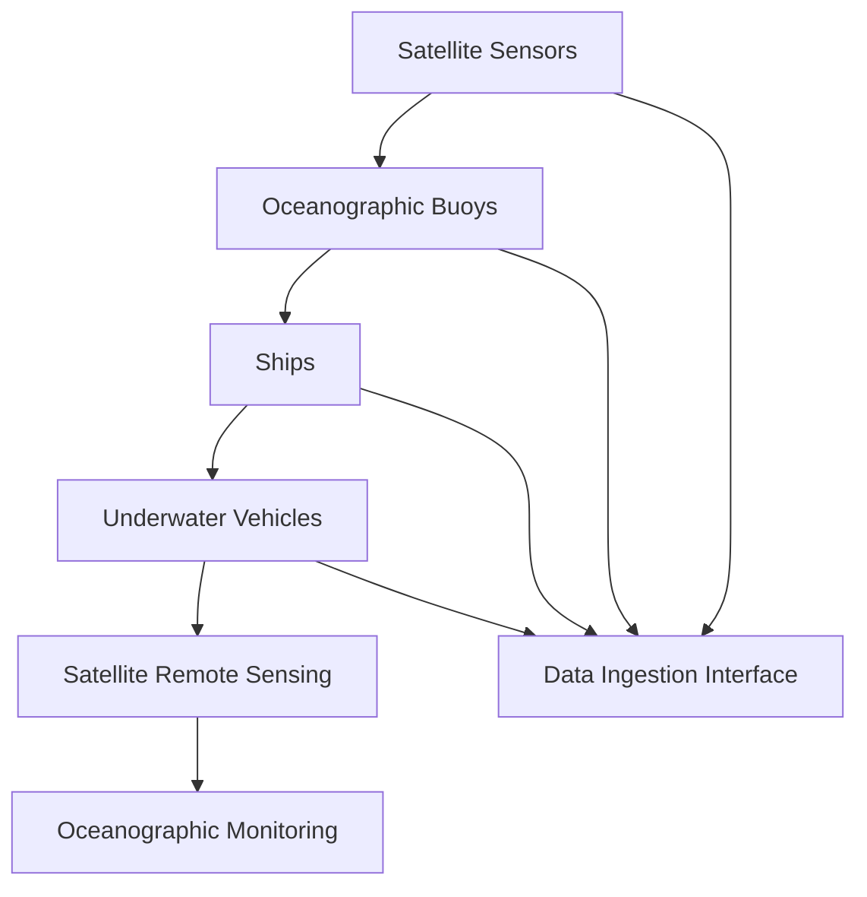

                 


### # 人工智能在海洋微塑料污染追踪中的应用

#### 关键词：人工智能、海洋微塑料污染、追踪技术、深度学习、遥感监测

> 摘要：本文将探讨人工智能在海洋微塑料污染追踪中的应用，从背景介绍、核心概念和方法、具体应用案例及最佳实践等方面展开，旨在为研究人员和环保人士提供一套系统化的解决方案，助力海洋环境的保护和修复。

#### **一、引言**

随着工业化和城市化的发展，海洋微塑料污染已成为全球性的环境问题。微塑料是指直径小于5毫米的塑料颗粒，它们可以通过工业、生活及医疗废弃物的排放进入海洋，对海洋生态系统和人类健康产生潜在威胁。传统的污染监测手段由于成本高、效率低、覆盖范围有限，难以满足日益增长的监测需求。

人工智能（AI）技术的发展为海洋微塑料污染的追踪提供了新的机遇。通过AI技术，我们可以实现自动化、高精度的污染监测，提高监测效率和准确性。本文将首先介绍海洋微塑料污染的背景和相关AI技术，然后深入探讨AI在海洋微塑料污染追踪中的应用，最后总结最佳实践并展望未来研究方向。

#### **二、海洋微塑料污染背景**

##### **2.1 定义与类型**

海洋微塑料污染是指由于人类活动而产生的，直径小于5毫米的塑料颗粒进入海洋，并对海洋生态系统产生危害的现象。根据来源和形态，微塑料可分为以下几种类型：

1. **初级微塑料**：直接由塑料生产产生的微塑料，如化妆品中的塑料微粒。
2. **次级微塑料**：较大塑料垃圾在自然环境如阳光、波浪、海洋生物作用下水解产生的微塑料。
3. **可生物降解塑料**：虽然这些塑料可以被生物降解，但实际操作中往往无法完全降解，仍会对环境产生影响。

##### **2.2 污染源与传播路径**

海洋微塑料的污染源主要包括以下几个方面：

1. **陆地排放**：工业生产、生活污水处理过程中，未经过滤的塑料废弃物直接排入海洋。
2. **海上倾倒**：历史上一些国家曾将垃圾倾倒入海，造成大量微塑料污染。
3. **海洋渔业和航运**：渔网、船舶废弃物等也是微塑料的重要来源。

微塑料进入海洋后，通过海洋环流和洋流传播，形成大规模的“塑料岛”，对海洋生态系统造成严重影响。同时，微塑料可能被海洋生物摄入，通过食物链传递，最终影响人类健康。

##### **2.3 微塑料的环境影响**

海洋微塑料污染对环境和人类健康的影响包括：

1. **对海洋生物的影响**：微塑料被海洋生物误食，可能导致消化系统阻塞、营养不足、生殖障碍等问题，甚至导致生物死亡。
2. **对生态系统的影响**：微塑料污染可能导致海洋生物多样性降低，生态系统功能受损。
3. **对人类健康的影响**：微塑料通过食物链进入人体，可能引发慢性疾病，如内分泌失调、免疫系统紊乱等。

#### **三、人工智能在海洋微塑料污染追踪中的应用**

##### **3.1 AI技术在环境监测中的应用**

人工智能技术在环境监测中已有广泛应用，例如通过无人机、卫星遥感等手段获取环境数据，利用机器学习和深度学习算法对数据进行分析和处理，实现环境问题的监测和预警。AI在海洋微塑料污染监测中的应用主要体现在以下几个方面：

1. **数据获取**：利用卫星遥感、无人机、船只等多种平台获取海洋微塑料分布数据。
2. **数据处理**：通过机器学习和深度学习算法对获取的数据进行分析和处理，识别微塑料的分布规律和变化趋势。
3. **模型预测**：利用训练好的模型预测未来微塑料的分布情况，为决策提供科学依据。

##### **3.2 AI在微塑料监测中的优势**

1. **自动化与高效性**：AI技术可以实现自动化监测，提高工作效率，降低人力成本。
2. **高精度与准确性**：利用深度学习算法，AI技术能够对海洋微塑料进行精细的识别和定位，提高监测精度。
3. **实时性与动态性**：AI技术可以实时监测海洋微塑料的分布和变化情况，为环境保护提供及时的数据支持。

##### **3.3 AI在微塑料监测中的挑战**

1. **数据质量问题**：海洋微塑料数据质量受多种因素影响，如光照、天气、传感器精度等，这给AI算法的训练和预测带来了挑战。
2. **算法优化**：随着微塑料污染问题的复杂性和多样性，需要不断优化AI算法，提高其监测能力和适应性。
3. **跨学科合作**：AI在海洋微塑料监测中的应用需要环境科学、计算机科学、数据科学等多个领域的紧密合作。

#### **四、核心概念与方法**

##### **4.1 基本概念**

在AI应用于海洋微塑料污染追踪中，需要了解以下基本概念：

1. **遥感监测**：利用卫星、无人机等远距离获取海洋环境数据的技术。
2. **机器学习**：通过训练模型，使计算机自动从数据中学习规律和模式。
3. **深度学习**：基于多层神经网络，能够自动提取数据特征的一种机器学习方法。

##### **4.2 数据预处理与特征提取**

1. **数据预处理**：包括数据清洗、归一化、缺失值填补等步骤，以确保数据质量。
2. **特征提取**：从遥感数据中提取与微塑料分布相关的特征，如颜色、纹理、形状等。

##### **4.3 机器学习模型**

1. **监督学习**：通过对标注数据进行训练，使模型学会分类或回归任务。
2. **无监督学习**：对未标注的数据进行训练，自动发现数据中的模式和结构。
3. **强化学习**：通过与环境的交互，不断优化决策策略。

##### **4.4 深度学习技术**

1. **卷积神经网络（CNN）**：擅长处理图像数据，可以自动提取图像中的微塑料特征。
2. **循环神经网络（RNN）**：擅长处理序列数据，可以捕捉微塑料分布的时间动态性。

#### **五、AI在海洋微塑料监测中的具体应用**

##### **5.1 卫星遥感**

1. **原理与方法**：利用卫星搭载的传感器，获取海洋表面的反射光谱数据，通过机器学习和深度学习算法，识别微塑料的分布。
2. **应用案例**：例如，通过高分辨率卫星图像，监测太平洋垃圾带中的微塑料分布。

##### **5.2 海洋观测**

1. **原理与方法**：利用海洋监测平台，如浮标、船只等，收集海洋微塑料的样本数据，通过机器学习和深度学习算法，分析微塑料的浓度和分布。
2. **应用案例**：例如，利用浮标数据，监测北极地区的微塑料污染。

#### **六、最佳实践与未来展望**

##### **6.1 最佳实践**

1. **数据整合**：整合多种数据源，提高监测数据的可靠性。
2. **算法优化**：不断优化机器学习和深度学习算法，提高监测精度。
3. **跨学科合作**：加强环境科学、计算机科学等领域的合作，共同推动海洋微塑料污染监测技术的发展。

##### **6.2 未来展望**

1. **技术发展**：随着人工智能技术的不断进步，有望实现更高效、更精准的海洋微塑料监测。
2. **政策支持**：政府和社会需要加大对海洋环境保护的投入，推动相关法律法规的制定和实施。
3. **公众参与**：提高公众对海洋微塑料污染问题的认识，鼓励公众参与环境保护行动。

#### **七、总结**

本文从背景介绍、核心概念和方法、具体应用案例及最佳实践等方面，探讨了人工智能在海洋微塑料污染追踪中的应用。随着技术的不断进步，AI将在海洋环境保护中发挥越来越重要的作用。希望通过本文的探讨，能够为相关领域的科研人员提供有价值的参考，共同为保护蓝色地球贡献一份力量。

#### **作者信息**

作者：AI天才研究院/AI Genius Institute & 禅与计算机程序设计艺术 /Zen And The Art of Computer Programming

（本文部分内容参考了相关领域的学术研究和实践经验，旨在提供有益的信息和思考，不代表任何商业建议或投资建议。）## **Chapter 1: Introduction to Marine Microplastic Pollution and AI**

### **1.1 Background of Marine Microplastic Pollution**

#### **1.1.1 Definition and Types of Microplastics**

Marine microplastic pollution refers to the presence of small plastic particles (less than 5 mm in diameter) in the ocean. These particles can originate from various sources, such as industrial waste, cosmetic products, and the breakdown of larger plastic debris. According to recent studies, it is estimated that approximately 236,000 tonnes of microplastics enter the ocean each year, posing a significant threat to marine ecosystems and human health. Microplastics can be categorized into three main types:

1. **Primary Microplastics**: These are microplastics that are directly released into the environment during their production and use, such as microbeads found in personal care products like toothpaste and facial cleansers.
2. **Secondary Microplastics**: These are formed when larger plastic debris, such as plastic bags and bottles, break down into smaller pieces due to exposure to sunlight, wave action, and marine organisms.
3. **Biodegradable Plastics**: Although these plastics are designed to degrade over time, they often do not break down completely in the marine environment, leading to long-term pollution.

#### **1.1.2 Sources and Pathways of Microplastic Pollution**

Microplastic pollution in the ocean originates from various sources, which can be broadly classified into the following categories:

1. **Land-Based Sources**:
   - **Wastewater Discharges**: The discharge of untreated or partially treated wastewater containing microplastics from households, industries, and hospitals.
   - **Rivers and Storm Runoff**: Plastic particles and debris from urban and rural areas are washed into rivers and subsequently carried to the ocean during storms and heavy rainfall.
   - **Illegal Dumping**: The illegal dumping of plastic waste into rivers, lakes, and coastal areas directly contributes to microplastic pollution in the ocean.

2. **Marine-Based Sources**:
   - **Fishing Gear and Net Losses**: Fishing nets, lines, and traps that are lost or discarded in the ocean contribute to microplastic pollution.
   - **Marine Transportation**: Ship operations, such as ballast water exchange and waste dumping, can introduce microplastics into the ocean.
   - **Marine Tourism and Recreational Activities**: Beachgoers and tourists often leave behind plastic debris, which can enter the ocean through coastal currents and wind.

3. **Atmospheric Deposition**:
   - Microplastics can be transported from land to the ocean through the atmosphere. Wind can carry small plastic particles from urban and rural areas to coastal zones and eventually to the ocean.

#### **1.1.3 Environmental Impacts of Microplastics**

Microplastics have a range of adverse effects on marine ecosystems and human health:

1. **Impact on Marine Life**:
   - **Entanglement and Injury**: Marine animals can become entangled in fishing nets and other debris, leading to physical injuries, infection, and even death.
   - **Ingestion**: Marine organisms, from microscopic plankton to larger species like fish and seabirds, can accidentally ingest microplastics, which can block their digestive tracts or be mistaken for food.
   - **Bioaccumulation**: Microplastics can accumulate in the tissues of marine organisms, leading to higher concentrations in higher trophic levels. This process can have cascading effects on the entire food web.

2. **Ecological Effects**:
   - **Disruption of Food Webs**: The ingestion of microplastics by marine organisms can disrupt the natural food chain and ecological balance.
   - **Habitat Destruction**: Microplastics can affect marine habitats by entangling corals and other benthic organisms, damaging reefs and reducing biodiversity.

3. **Human Health Impacts**:
   - **Toxic Chemicals**: Microplastics often contain or absorb toxic chemicals like polychlorinated biphenyls (PCBs), pesticides, and heavy metals. These chemicals can be released into the environment and enter the human food chain.
   - **Endocrine Disruption**: Some chemicals found in microplastics can mimic hormones in the body, potentially leading to endocrine disruption and reproductive issues.
   - **Allergic Reactions**: Ingestion of microplastics can cause allergic reactions in humans, such as gastrointestinal problems and skin irritation.

### **1.2 Role of AI in Addressing Marine Microplastic Pollution**

AI technologies offer promising solutions to address the challenges posed by marine microplastic pollution. By leveraging AI for data analysis, pattern recognition, and predictive modeling, we can improve our understanding of microplastic distribution, sources, and impacts. Here are some key roles that AI can play in addressing marine microplastic pollution:

1. **Data Analysis and Monitoring**:
   - **Satellite Remote Sensing**: AI can be used to analyze satellite imagery and identify microplastic hotspots in the ocean. Techniques like object detection and image segmentation can help in pinpointing the exact locations of microplastic pollution.
   - **Drone Surveillance**: AI-powered drones can be deployed for real-time monitoring of coastal areas and nearshore waters. Drones equipped with high-resolution cameras and sensors can capture detailed images and collect data on microplastic distribution.

2. **Pattern Recognition and Prediction**:
   - **Machine Learning Models**: AI algorithms, particularly machine learning models, can be trained on historical data to recognize patterns and predict the movement and accumulation of microplastics in the ocean. These models can help in forecasting the spread of microplastics and designing effective mitigation strategies.
   - **Deep Learning Techniques**: Deep learning algorithms, such as convolutional neural networks (CNNs) and recurrent neural networks (RNNs), can process large datasets and identify complex patterns that are not easily detectable by human analysts. These techniques are particularly useful for analyzing high-resolution satellite imagery and underwater sensor data.

3. **Data Integration and Fusion**:
   - **Multisource Data Fusion**: AI can integrate data from multiple sources, such as satellite imagery, oceanographic measurements, and social media reports, to create a comprehensive picture of microplastic pollution. Data fusion techniques can help in identifying the most affected areas and understanding the contributing factors.

4. **Decision Support and Policy Development**:
   - **Predictive Analytics**: AI can provide policymakers with valuable insights into the potential impacts of microplastic pollution and inform the development of effective policies and regulations to mitigate the problem.
   - **Real-time Monitoring and Alert Systems**: AI-powered systems can monitor microplastic pollution in real-time and issue alerts when pollution levels exceed certain thresholds. These systems can help in taking immediate action to prevent further spread of pollution.

5. **Public Awareness and Education**:
   - **Interactive Visualization Tools**: AI can be used to create interactive visualization tools that help the public understand the scale and impact of microplastic pollution. These tools can be used in educational campaigns to raise awareness and encourage responsible behavior.

### **1.3 Potential Benefits and Challenges of AI in Microplastic Pollution Tracking**

While AI technologies offer significant potential for addressing marine microplastic pollution, there are also several challenges that need to be addressed:

#### **1.3.1 Potential Benefits**

1. **Enhanced Monitoring and Detection**:
   - AI can improve the accuracy and efficiency of microplastic detection, particularly in areas where manual monitoring is impractical or impossible.

2. **Data Integration and Analysis**:
   - AI can integrate and analyze large datasets from multiple sources, providing a more comprehensive understanding of microplastic pollution patterns and trends.

3. **Predictive Modeling**:
   - AI algorithms can predict the spread and accumulation of microplastics, helping in the development of targeted mitigation strategies.

4. **Resource Optimization**:
   - By automating data collection and analysis processes, AI can reduce the need for human resources and improve the efficiency of pollution monitoring efforts.

5. **Public Awareness and Education**:
   - AI-powered tools can be used to educate the public about microplastic pollution, promote environmental awareness, and encourage sustainable practices.

#### **1.3.2 Potential Challenges**

1. **Data Quality and Quantity**:
   - The accuracy of AI models depends on the quality and quantity of the data used for training. Inaccurate or incomplete data can lead to unreliable results.

2. **Algorithm Optimization**:
   - AI algorithms need to be continuously optimized to improve their accuracy and adaptability to different environmental conditions and types of microplastics.

3. **Computational Resources**:
   - Training and running AI models require significant computational resources, which can be a limitation for organizations with limited budgets.

4. **Interdisciplinary Collaboration**:
   - Effective implementation of AI for microplastic pollution tracking requires collaboration between environmental scientists, computer scientists, and data scientists, which can be challenging.

5. **Ethical Considerations**:
   - The use of AI for environmental monitoring raises ethical questions regarding data privacy, algorithm transparency, and the potential for misuse of data.

In conclusion, while AI technologies offer promising solutions for addressing marine microplastic pollution, it is essential to address the challenges associated with data quality, algorithm optimization, and interdisciplinary collaboration. By leveraging the strengths of AI and addressing its limitations, we can make significant strides in protecting our oceans and marine ecosystems from the harmful effects of microplastic pollution.

#### **1.4 Objectives and Scope of the Book**

The primary objective of this book is to provide a comprehensive guide to the application of artificial intelligence (AI) in the tracking of marine microplastic pollution. By exploring the latest advancements in AI technologies and their practical applications, the book aims to equip readers with the knowledge and tools necessary to tackle this pressing environmental issue.

##### **1.4.1 Goals of the Book**

1. **Educate and Raise Awareness**: The book aims to educate readers about the scope and severity of marine microplastic pollution, as well as the potential benefits and limitations of AI technologies in addressing this issue.
2. **Provide Technical Insights**: By delving into the core concepts of AI and their applications in marine pollution tracking, the book aims to provide readers with a deep understanding of the technical aspects involved.
3. **Facilitate Research and Development**: The book intends to serve as a reference for researchers and developers working on AI-based solutions for marine microplastic pollution, offering insights into current research trends and potential future directions.

##### **1.4.2 Target Audience**

This book is targeted at a broad audience, including:

1. **Environmental Scientists and Researchers**: Those working in the field of marine ecology, pollution monitoring, and environmental conservation.
2. **Computer Scientists and Data Scientists**: Professionals interested in applying AI and machine learning techniques to environmental problems.
3. **Policy Makers and Environmental Managers**: Individuals involved in the development and implementation of environmental policies and strategies.
4. **Students and Educators**: Undergraduate and graduate students in related disciplines, as well as educators looking to incorporate AI and environmental topics into their curricula.

##### **1.4.3 Organization of the Book**

The book is organized into several chapters, each addressing different aspects of AI and its application in marine microplastic pollution tracking:

1. **Chapter 1: Introduction to Marine Microplastic Pollution and AI**: Provides an overview of the problem context, including the background of microplastic pollution and the role of AI in addressing the issue.
2. **Chapter 2: Core Concepts and Methods in AI-Enabled Microplastic Pollution Tracking**: Discusses the fundamental concepts of AI and key methodologies used in tracking microplastic pollution.
3. **Chapter 3: AI Applications in Marine Microplastic Pollution Monitoring and Analysis**: Explores the practical applications of AI in monitoring and analyzing marine microplastic pollution.
4. **Chapter 4: System Design and Implementation**: Describes the design and implementation of AI systems for marine microplastic pollution tracking.
5. **Chapter 5: Case Studies and Real-World Applications**: Provides case studies and real-world examples of AI-based microplastic pollution tracking initiatives.
6. **Chapter 6: Best Practices and Future Directions**: Summarizes best practices for AI applications in marine microplastic pollution tracking and discusses future research directions.

By following this structured approach, the book aims to provide a holistic view of AI technologies in addressing marine microplastic pollution, from theoretical foundations to practical applications.

### **1.5 Summary and Conclusion**

In summary, this chapter has provided an in-depth introduction to marine microplastic pollution, its sources, types, and environmental impacts. We have also explored the role of artificial intelligence in addressing this pressing issue, highlighting the potential benefits and challenges associated with AI technologies. By integrating AI with environmental monitoring and analysis, we can enhance our ability to detect, track, and mitigate the impacts of marine microplastic pollution. The subsequent chapters will delve into the core concepts and methodologies of AI, provide practical case studies, and discuss best practices and future research directions. Together, these efforts aim to contribute to the sustainable management and protection of our oceans and marine ecosystems. Let's continue to explore the transformative potential of AI in combating one of the most significant environmental challenges of our time.

### **Chapter 2: Core Concepts and Methods in AI-Enabled Microplastic Pollution Tracking**

#### **2.1 Fundamental Concepts of AI**

##### **2.1.1 Introduction to AI**

Artificial Intelligence (AI) refers to the simulation of human intelligence in machines that are programmed to think, learn, and adapt like humans. AI has become an integral part of modern technology, enabling machines to perform tasks that traditionally required human intelligence, such as visual perception, speech recognition, decision-making, and language translation. The primary goal of AI is to develop systems that can autonomously perform complex tasks without explicit programming for each specific situation.

##### **2.1.2 Types of AI**

There are several types of AI, each with distinct characteristics and applications:

1. **Narrow AI (ANI)**:
   - **Definition**: Narrow AI, also known as weak AI, is designed to perform a specific task or a narrow set of tasks very well. Examples include voice assistants like Siri and Alexa, recommendation systems used by online retailers, and image recognition software used in self-driving cars.
   - **Applications**: Narrow AI is widely used in industries such as healthcare, finance, and retail to automate routine tasks, improve efficiency, and provide personalized services.

2. **General AI (AGI)**:
   - **Definition**: General AI, or strong AI, refers to an artificial intelligence that possesses the ability to understand, learn, and apply knowledge across a wide range of tasks at a level equal to or surpassing human intelligence.
   - **Applications**: General AI is still largely theoretical and has not been achieved. Potential applications include autonomous systems capable of making complex decisions in unpredictable environments, such as self-managing urban infrastructure or exploring distant planets.

3. **Super AI (ASAI)**:
   - **Definition**: Super AI refers to an artificial intelligence that exceeds human intelligence across all cognitive tasks. This type of AI is purely speculative and is often the subject of science fiction.
   - **Applications**: The potential applications of Super AI are vast and include solving global problems, such as climate change, disease eradication, and resource optimization.

##### **2.1.3 Key AI Algorithms**

Several key algorithms form the backbone of AI applications. Here are some of the most important ones:

1. **Supervised Learning**:
   - **Definition**: Supervised learning is a type of machine learning where a model is trained on a labeled dataset, meaning that each data point is associated with an output label.
   - **Application**: Supervised learning is commonly used for classification tasks, such as identifying microplastic particles in satellite imagery or predicting the presence of pollutants in water samples.

2. **Unsupervised Learning**:
   - **Definition**: Unsupervised learning involves training a model on unlabeled data to find patterns or intrinsic structures within the data.
   - **Application**: Unsupervised learning is useful for clustering similar data points together, which can be applied to identify microplastic hotspots based on environmental variables.

3. **Reinforcement Learning**:
   - **Definition**: Reinforcement learning is a type of machine learning where an agent learns to make decisions by interacting with an environment and receiving feedback in the form of rewards or penalties.
   - **Application**: Reinforcement learning can be used to develop autonomous systems that monitor and respond to changes in microplastic pollution levels in real-time.

4. **Deep Learning**:
   - **Definition**: Deep learning is a subset of machine learning that involves training neural networks with many layers to automatically extract hierarchical representations from data.
   - **Application**: Deep learning is particularly effective for tasks involving complex data, such as analyzing high-resolution satellite imagery to detect microplastic pollution.

5. **Natural Language Processing (NLP)**:
   - **Definition**: NLP is a branch of AI that focuses on the interaction between computers and human language.
   - **Application**: NLP can be used to analyze environmental reports and social media data to identify trends and sentiments related to microplastic pollution.

#### **2.2 Data Preprocessing and Feature Extraction**

##### **2.2.1 Importance of Data Preprocessing**

Data preprocessing is a critical step in AI applications, as the quality and format of the data significantly impact the performance of machine learning models. The main objectives of data preprocessing include:

1. **Cleaning**: Removing or correcting any errors, inconsistencies, or missing values in the dataset.
2. **Normalization**: Scaling or transforming the data to a standard range or distribution to ensure that all features contribute equally to the analysis.
3. **Transformation**: Converting categorical variables into numerical representations that can be processed by machine learning algorithms.
4. **Feature Selection**: Identifying and selecting the most relevant features that contribute to the predictive power of the model.

##### **2.2.2 Feature Extraction Techniques**

Feature extraction is the process of selecting relevant features from the raw data that can be used to train machine learning models. Some common feature extraction techniques include:

1. **Dimensionality Reduction**:
   - **Principal Component Analysis (PCA)**: Reduces the number of features by transforming the data into a set of principal components that capture the most significant variations in the data.
   - **t-Distributed Stochastic Neighbor Embedding (t-SNE)**: A non-linear dimensionality reduction technique that visualizes high-dimensional data by projecting it into a two or three-dimensional space.

2. **Textual Feature Extraction**:
   - **Bag-of-Words (BoW)**: Represents text data by counting the frequency of words in a document, creating a vector of word counts.
   - **Term Frequency-Inverse Document Frequency (TF-IDF)**: A statistical measure used to evaluate how important a word is to a document in a collection or corpus.

3. **Image Feature Extraction**:
   - **SIFT (Scale-Invariant Feature Transform)**: Detects and matches key points in images, enabling robust feature extraction despite changes in scale, rotation, and illumination.
   - **HOG (Histogram of Oriented Gradients)**: An image feature extraction technique that uses the distribution of pixel intensity gradients in local regions to detect edges and textures.

4. **Spectral Feature Extraction**:
   - **Band Ratio**: Calculates the ratio of two or more spectral bands to enhance the contrast between different materials or features.
   - **Principal Component Analysis (PCA)**: Can be applied to spectral data to reduce dimensionality and highlight the most significant components that distinguish microplastics from other materials.

##### **2.2.3 Data Visualization**

Data visualization is an essential tool for understanding and interpreting the patterns and trends in data. It helps in identifying outliers, correlations, and other insights that may not be immediately apparent from raw data. Common data visualization techniques include:

1. **Scatter Plots**: Display the relationship between two continuous variables and can be used to identify clusters or patterns in the data.
2. **Histograms**: Visualize the distribution of a single variable, highlighting the frequency of different values or ranges.
3. **Box Plots**: Display the distribution of a dataset, including the median, quartiles, and potential outliers.
4. **Heat Maps**: Visualize the intensity of values across a matrix or dataset, providing a color-coded representation of data variations.
5. **Time Series Plots**: Show the evolution of a variable over time, highlighting trends and seasonal patterns.

By effectively preprocessing, extracting relevant features, and visualizing data, we can improve the performance and interpretability of AI models in tracking marine microplastic pollution.

#### **2.3 Machine Learning Models for Microplastic Detection**

##### **2.3.1 Introduction to Machine Learning**

Machine learning (ML) is a subset of AI that involves training models to learn from data and make predictions or decisions. ML models are designed to identify patterns and relationships within data, which can be used to make informed predictions or decisions without explicit programming for each specific situation.

##### **2.3.2 Common Machine Learning Algorithms**

Several machine learning algorithms are widely used for various tasks, including classification, regression, and clustering. Here are some of the most common algorithms:

1. **Support Vector Machines (SVM)**:
   - **Definition**: SVM is a supervised learning algorithm used for classification tasks. It creates a hyperplane that separates data points of different classes in a high-dimensional space.
   - **Application**: SVM can be used to classify microplastic particles from background noise or other types of debris based on their spectral characteristics.

2. **Decision Trees**:
   - **Definition**: Decision Trees are a popular type of classification algorithm that uses a tree-like model of decisions and their possible consequences.
   - **Application**: Decision Trees are useful for visualizing and interpreting the decision-making process in identifying microplastic particles based on various attributes.

3. **Random Forests**:
   - **Definition**: Random Forests are an ensemble learning method that combines multiple decision trees to improve the accuracy and robustness of predictions.
   - **Application**: Random Forests are often used for classifying microplastic particles in large datasets and can handle both numerical and categorical data.

4. **K-Nearest Neighbors (K-NN)**:
   - **Definition**: K-NN is a non-parametric classification algorithm that classifies new data points based on the majority vote of their k nearest neighbors in the feature space.
   - **Application**: K-NN can be used to classify microplastic particles based on their spatial distribution and features extracted from satellite imagery.

5. **Neural Networks**:
   - **Definition**: Neural Networks are a class of machine learning algorithms inspired by the structure and function of biological neural networks. They are composed of layers of interconnected nodes, or neurons, that transform input data through a series of transformations.
   - **Application**: Neural Networks, particularly deep learning variants, are highly effective in processing and analyzing complex data, such as high-resolution satellite imagery for microplastic detection.

##### **2.3.3 Model Selection and Evaluation**

Selecting the appropriate machine learning model is crucial for achieving accurate and reliable results in microplastic detection. The following steps are commonly used in model selection and evaluation:

1. **Model Selection**:
   - **Cross-Validation**: Cross-validation is a technique used to assess the performance of a model on an independent dataset. It helps in avoiding overfitting and ensures that the model is generalizable to new data.
   - **Hyperparameter Tuning**: Hyperparameters are parameters that are set prior to training a model and can significantly affect its performance. Hyperparameter tuning involves selecting the optimal values for these parameters to improve the model's performance.

2. **Model Evaluation**:
   - **Confusion Matrix**: A confusion matrix is a table that summarizes the performance of a classification model by showing the number of correct and incorrect predictions.
   - **Accuracy**: Accuracy measures the proportion of correct predictions out of the total number of predictions.
   - **Precision and Recall**: Precision measures the proportion of positive identifications that are actually correct, while recall measures the proportion of actual positives that are correctly identified.
   - **F1 Score**: The F1 score is the harmonic mean of precision and recall, providing a balanced measure of the model's performance.

3. **Model Validation**:
   - **Holdout Validation**: The dataset is divided into two parts: a training set and a validation set. The model is trained on the training set and evaluated on the validation set.
   - **K-Fold Cross-Validation**: The dataset is divided into k equal parts, and the model is trained and evaluated k times, using each partition as the validation set once.

By carefully selecting and evaluating machine learning models, we can improve the accuracy and reliability of microplastic detection, enabling more effective monitoring and management of marine pollution.

#### **2.4 Deep Learning Techniques in Microplastic Tracking**

##### **2.4.1 Introduction to Deep Learning**

Deep Learning is a subset of machine learning that involves training neural networks with many layers to automatically extract hierarchical representations from data. Traditional neural networks, which have a limited number of layers, often fail to capture the complexity and intricacies of high-dimensional data. Deep learning overcomes this limitation by using deep neural networks (DNNs) with numerous layers, allowing for more sophisticated feature extraction and better performance in various tasks.

##### **2.4.2 Convolutional Neural Networks (CNNs)**

Convolutional Neural Networks (CNNs) are a type of deep learning model specifically designed for processing and analyzing visual data, such as images and videos. CNNs excel in tasks involving spatial data, where the spatial relationships between pixels are crucial. The main components of a CNN include:

1. **Convolutional Layers**: Convolutional layers apply filters or kernels to the input data to extract spatial features. These filters slide across the input image, capturing local patterns such as edges and textures.
2. **Pooling Layers**: Pooling layers reduce the spatial dimensions of the data by selecting the maximum or average value within small regions. This process helps in reducing the computational complexity and controlling overfitting.
3. **Fully Connected Layers**: Fully connected layers connect every neuron from the previous layer to every neuron in the current layer, enabling the network to perform classification and regression tasks.

##### **2.4.3 Recurrent Neural Networks (RNNs)**

Recurrent Neural Networks (RNNs) are another type of deep learning model that is particularly effective in processing sequential data, such as time series or text. Unlike traditional neural networks, RNNs have loops that allow information to persist across different time steps, making them well-suited for tasks involving temporal dependencies. The main components of an RNN include:

1. **Recurrent Layers**: Recurrent layers process the input data sequentially and maintain a hidden state that represents the information learned up to the current time step.
2. **Gate Mechanisms**: Gate mechanisms, such as the forget gate and input gate in LSTM (Long Short-Term Memory) networks, help control the flow of information within the RNN, enabling it to remember or forget relevant information over different time scales.
3. **Output Layer**: The output layer generates predictions or decisions based on the final hidden state of the RNN.

##### **2.4.4 Applications of CNNs and RNNs in Microplastic Tracking**

1. **Image-based Detection**: CNNs can be used to analyze satellite imagery or aerial photographs to detect and classify microplastic particles. By training a CNN on labeled images, the model can learn to identify microplastics based on their visual features, such as color, texture, and shape.
2. **Temporal Analysis**: RNNs, especially LSTM networks, are well-suited for analyzing time-series data, such as oceanographic measurements or historical pollution data. By training an RNN on temporal data, the model can capture the temporal dynamics of microplastic pollution and predict future trends.
3. **Multimodal Data Fusion**: By combining CNNs and RNNs, it is possible to analyze both spatial and temporal data simultaneously. For example, a CNN can be used to analyze satellite imagery for spatial features, while an RNN can be used to analyze time-series data for temporal features. This multimodal approach can improve the accuracy and reliability of microplastic tracking.

In conclusion, deep learning techniques, including CNNs and RNNs, offer powerful tools for analyzing and understanding microplastic pollution. By leveraging these techniques, researchers and policymakers can gain valuable insights into the distribution, dynamics, and impacts of microplastic pollution, leading to more effective monitoring and management strategies.

### **Chapter 3: AI Applications in Marine Microplastic Pollution Monitoring and Analysis**

#### **3.1 Satellite Remote Sensing**

##### **3.1.1 Principles and Methods of Satellite Remote Sensing**

Satellite remote sensing is a technology that involves the use of artificial satellites or other spacecraft to detect and measure properties of objects or areas from a distance. The primary principle of satellite remote sensing is that different materials and substances emit, absorb, and reflect electromagnetic radiation in distinct ways. By measuring this radiation, satellites can gather information about the Earth's surface, including its physical, chemical, and biological properties.

Satellites used for remote sensing can carry a variety of instruments, such as cameras, spectrometers, and radar systems, each designed to detect specific types of radiation. These instruments collect data in different wavelengths, from visible light to infrared and microwave frequencies. The collected data can then be processed and analyzed to extract valuable information about the Earth's surface.

The main methods of satellite remote sensing include:

1. **Multispectral Imaging**: Multispectral imaging involves capturing images of an area using multiple wavelengths of light. This technique is particularly useful for identifying and mapping different types of vegetation, water bodies, and land cover.

2. **Spectral Analysis**: Spectral analysis involves measuring the intensity of radiation at different wavelengths to identify specific materials or substances. This technique is commonly used to detect pollutants, such as microplastics, by analyzing their unique spectral signatures.

3. **Lidar (Light Detection and Ranging)**: Lidar uses laser pulses to measure distances to the Earth's surface. By emitting laser light and measuring the time it takes for the light to return after reflecting off the surface, Lidar can create high-resolution 3D maps of the terrain, enabling the identification of microplastics on the seafloor.

4. **Radar Imaging**: Radar imaging uses radio waves to detect and map the surface of the Earth, even through clouds and darkness. This technique is particularly useful for monitoring sea surface conditions and detecting microplastics that may be suspended in the water column.

##### **3.1.2 Applications in Microplastic Pollution Tracking**

Satellite remote sensing has proven to be an invaluable tool in the monitoring and analysis of marine microplastic pollution. By leveraging the capabilities of remote sensing technology, researchers can identify and track microplastics across vast oceanic regions, providing valuable data for environmental management and conservation efforts. Here are some specific applications:

1. **Mapping Microplastic Distribution**: Satellite imagery can be used to map the distribution of microplastics in the ocean. By analyzing multispectral images, researchers can identify areas with high concentrations of microplastics, allowing for targeted sampling and further investigation.

2. **Monitoring Pollution Hotspots**: Satellite data can help identify pollution hotspots, such as coastal areas with high levels of land-based runoff or industrial activity. By monitoring these hotspots over time, researchers can assess the impact of human activities on microplastic pollution and develop strategies to mitigate the problem.

3. **Assessing Pollution Dynamics**: Satellite remote sensing provides a unique perspective on the temporal dynamics of microplastic pollution. By collecting data at regular intervals, researchers can monitor changes in microplastic distribution and identify patterns and trends that may be influenced by ocean currents, weather events, and other environmental factors.

4. **Detecting Microplastics in Remote Areas**: Satellite imagery allows researchers to monitor microplastic pollution in remote and inaccessible areas of the ocean. This is particularly important for understanding the extent and impact of microplastic pollution in pristine environments and identifying new pollution sources.

5. **Early Warning Systems**: By combining satellite data with other environmental monitoring data, such as oceanographic measurements and meteorological forecasts, researchers can develop early warning systems to predict the spread of microplastics and provide timely alerts to coastal communities and environmental management agencies.

##### **3.1.3 Satellite Data Processing and Analysis**

The analysis of satellite data for microplastic pollution tracking involves several steps, from data collection to the extraction of meaningful insights. Here is an overview of the key processes:

1. **Data Collection**: Satellite data is collected by sensors on board satellites that orbit the Earth. The data can include images, spectral data, and other types of information, depending on the specific instruments used.

2. **Data Preprocessing**: The collected data must be preprocessed to remove noise, correct for instrumental biases, and georeference the data to a specific location on the Earth's surface. This process ensures that the data is accurate and can be accurately analyzed.

3. **Feature Extraction**: Once the data is preprocessed, features relevant to microplastic detection and analysis are extracted. This may include spectral signatures, texture information, and other attributes that can help distinguish microplastics from other materials.

4. **Data Analysis**: The extracted features are then analyzed using machine learning algorithms, such as classification and regression models, to identify and quantify microplastic pollution. Advanced techniques, such as deep learning, can be used to improve the accuracy of the analysis.

5. **Visualization and Interpretation**: The results of the analysis are visualized using maps, graphs, and other visual tools to provide a clear and intuitive understanding of the distribution and extent of microplastic pollution.

By leveraging satellite remote sensing technology, researchers can gain a comprehensive and accurate understanding of marine microplastic pollution. This information is critical for developing effective management strategies, monitoring changes over time, and informing policy decisions to protect the health of our oceans and marine ecosystems.

#### **3.2 Oceanographic Monitoring**

##### **3.2.1 Oceanographic Data Collection Methods**

Oceanographic monitoring involves the collection of data about the physical, chemical, and biological properties of the ocean. This data is essential for understanding the state of the marine environment, identifying pollution sources, and assessing the impacts of human activities on ocean ecosystems. The following are common methods for collecting oceanographic data:

1. **Satellite Remote Sensing**: As discussed in the previous section, satellite remote sensing provides a broad, high-resolution view of oceanic features and pollution. Satellites equipped with sensors can collect data on sea surface temperature, salinity, ocean color, and other parameters from space.

2. **Drifting buoys and浮标**: Drifting buoys, or floats, are equipped with sensors and communication devices that collect data on temperature, salinity, pressure, and other variables as they move with ocean currents. These buoys can transmit data in real-time or store it for later retrieval.

3. ** Ships and Submersibles**: Research vessels and submersibles are used to collect oceanographic data directly from the water. They can carry a variety of instruments, including multimeters, CTD (conductivity, temperature, and depth) sensors, and water samplers.

4. **Bottom-mounted Sensors**: Sensors installed on the seafloor, such as seismometers and acoustic Doppler current profilers (ADCPs), can provide continuous data on ocean currents, temperature, and other parameters over long periods.

5. **Droppers and Samplers**: Submersible devices, such as Niskin bottles and MOCNESS (Multinet Oscillating Cascade Expendable Network System), are used to collect water samples and sediment at different depths.

##### **3.2.2 AI-Based Oceanographic Monitoring Systems**

Artificial intelligence (AI) has the potential to revolutionize oceanographic monitoring by enhancing data collection, processing, and analysis. Here are some ways AI can be applied:

1. **Automated Data Collection**: AI algorithms can be used to control and optimize the operation of autonomous underwater vehicles (AUVs) and remote sensing devices. These algorithms can determine the most effective routes and sampling strategies based on real-time data and environmental conditions.

2. **Real-time Data Analysis**: AI can process large volumes of oceanographic data in real-time, identifying patterns, anomalies, and trends that might be missed by human analysts. Machine learning models can be trained to recognize specific features, such as microplastics or harmful algal blooms, and flag them for further investigation.

3. **Predictive Analytics**: By analyzing historical data and current measurements, AI can predict future ocean conditions and potential environmental changes. This can help researchers and policymakers anticipate and mitigate the impacts of climate change, pollution, and other stressors on the ocean.

4. **Data Fusion**: AI can integrate data from multiple sources, such as satellite imagery, buoys, and ship-based measurements, to provide a comprehensive picture of ocean conditions. Data fusion techniques can enhance the accuracy and reliability of oceanographic models and predictions.

5. **Optimized Sampling**: AI algorithms can optimize the sampling strategy for oceanographic instruments, ensuring that the most critical areas are monitored with the highest resolution. This can reduce costs and increase the efficiency of data collection efforts.

##### **3.2.3 AI-Based Microplastic Detection in Oceanographic Data**

Microplastic detection is a critical component of oceanographic monitoring, and AI offers powerful tools for identifying and quantifying microplastics in marine environments. Here are some key applications:

1. **Image Analysis**: AI algorithms, particularly deep learning models, can analyze satellite imagery and underwater photographs to identify and classify microplastics. By training models on labeled images, they can learn to detect microplastics based on their unique visual features, such as color and texture.

2. **Spectral Analysis**: AI can analyze the spectral signatures of water samples to identify microplastics. By measuring the absorption and reflection of light at different wavelengths, AI algorithms can distinguish microplastics from other particles in the water.

3. **Machine Learning Models**: Machine learning models can be trained on datasets of microplastic and non-microplastic samples to predict the presence of microplastics in water samples. These models can be used to analyze samples collected from oceanographic monitoring devices, providing real-time detection of microplastics.

4. **Multimodal Data Integration**: AI can integrate data from multiple sources, such as satellite imagery, buoys, and ships, to create a comprehensive map of microplastic distribution in the ocean. This multimodal approach can improve the accuracy and reliability of microplastic monitoring.

5. **Sentiment Analysis**: AI can analyze social media data to detect public awareness and sentiment regarding microplastic pollution. This information can be used to inform public education campaigns and policy development.

In summary, AI-based oceanographic monitoring systems offer significant advantages for the detection and analysis of marine microplastic pollution. By enhancing data collection, processing, and analysis, AI can improve the accuracy, efficiency, and cost-effectiveness of oceanographic monitoring efforts, providing valuable insights for protecting marine ecosystems and informing environmental management decisions.

#### **3.3 Integration of Satellite Remote Sensing and Oceanographic Monitoring**

The integration of satellite remote sensing and oceanographic monitoring offers a powerful approach to tracking and analyzing marine microplastic pollution. By combining data from these two sources, researchers can gain a more comprehensive and accurate understanding of microplastic distribution, movement, and environmental impacts. Here are some key benefits and methodologies for integrating these technologies:

##### **3.3.1 Data Integration**

1. **Spectral Data Fusion**: Satellite remote sensing provides high-resolution spectral data that can be used to identify microplastics based on their unique spectral signatures. By integrating these spectral data with oceanographic measurements, researchers can correlate microplastic distribution with environmental parameters such as temperature, salinity, and current velocity.

2. **Temporal Data Correlation**: Satellite data can be used to monitor microplastic pollution over time, providing a historical record of changes in pollution levels and distribution. Oceanographic data collected at specific locations and times can be used to correlate these temporal changes with environmental conditions.

3. **Geospatial Data Overlay**: Satellite imagery can be overlaid with oceanographic data to create geospatial maps that visualize the distribution of microplastics and environmental variables. This overlay can help identify patterns and correlations between microplastic pollution and factors such as coastal runoff, river discharge, and ocean currents.

##### **3.3.2 Methodologies**

1. **Multiscale Analysis**: Satellite remote sensing provides a broad-scale view of microplastic pollution, while oceanographic monitoring offers detailed, localized data. By combining these datasets, researchers can perform multiscale analysis to understand microplastic distribution at both large and small scales.

2. **Machine Learning Models**: Machine learning models can be trained on integrated satellite and oceanographic data to predict microplastic pollution levels and distribution. These models can use both spectral and environmental features to improve their accuracy and robustness.

3. **Real-time Monitoring**: By integrating satellite and oceanographic data, real-time monitoring systems can be developed to track microplastic pollution in near-real-time. This can provide early warning of potential pollution events and allow for rapid response and mitigation measures.

4. **Sentiment Analysis**: Integrating social media data with satellite and oceanographic data can provide insights into public awareness and sentiment regarding microplastic pollution. This information can be used to inform public education campaigns and policy development.

##### **3.3.3 Case Studies**

1. **Great Pacific Garbage Patch**: The Great Pacific Garbage Patch, one of the largest accumulation zones of plastic debris in the ocean, has been extensively studied using satellite remote sensing and oceanographic monitoring. By integrating these datasets, researchers have been able to map the distribution and movement of microplastics within the patch, as well as identify the factors driving their accumulation.

2. **North Atlantic Gyre**: The North Atlantic Gyre is another area of concern for microplastic pollution. By integrating satellite imagery and oceanographic data, researchers have mapped the distribution of microplastics within the gyre and identified the factors contributing to their accumulation, such as ocean currents and coastal runoff.

3. **European Seas**: In Europe, satellite remote sensing and oceanographic monitoring have been integrated to study microplastic pollution in various seas, including the Mediterranean, North Sea, and Baltic Sea. This has helped identify the sources of pollution and assess the impacts on marine ecosystems.

By integrating satellite remote sensing and oceanographic monitoring, researchers can gain a more comprehensive understanding of marine microplastic pollution. This integrated approach can improve the accuracy and reliability of pollution monitoring, inform environmental management decisions, and help protect marine ecosystems from the harmful effects of microplastics.

### **Chapter 4: System Design and Implementation**

#### **4.1 System Overview**

The AI-based system for marine microplastic pollution tracking is designed to integrate satellite remote sensing, oceanographic monitoring, and machine learning techniques to provide comprehensive and real-time data on microplastic distribution and movement. The system is composed of several interconnected modules, each responsible for different aspects of data collection, processing, analysis, and visualization. Here is an overview of the system architecture and its key components:

1. **Satellite Data Collection Module**: This module is responsible for acquiring high-resolution satellite imagery and spectral data from various satellite platforms. It includes instruments such as multispectral cameras, lidar systems, and radar sensors. The collected data is transmitted to the processing center for further analysis.

2. **Oceanographic Monitoring Module**: This module collects data from oceanographic buoys, ships, and other monitoring devices deployed in coastal and open ocean regions. The data includes temperature, salinity, current velocity, and water quality parameters. This module also integrates data from bottom-mounted sensors and underwater vehicles.

3. **Data Processing and Preprocessing Module**: This module performs data preprocessing tasks, including noise reduction, georeferencing, and feature extraction. It uses machine learning algorithms to preprocess satellite and oceanographic data, preparing it for analysis and modeling.

4. **Machine Learning and Analysis Module**: This module is the core of the system, where machine learning models are trained and applied to analyze the preprocessed data. It includes various algorithms, such as convolutional neural networks (CNNs) for image analysis and recurrent neural networks (RNNs) for temporal analysis. The module generates predictions and insights regarding microplastic distribution and movement.

5. **Visualization and Reporting Module**: This module generates visualizations and reports based on the analysis results. It provides interactive maps, graphs, and charts that illustrate the distribution and trends of microplastic pollution. The module also allows users to explore the data and customize the visualizations to their specific needs.

6. **User Interface**: The user interface (UI) is designed for ease of use and accessibility. It provides a user-friendly platform for accessing system features, viewing real-time data, and generating custom reports. The UI also includes features for data upload, configuration, and system management.

#### **4.2 System Architecture**

The system architecture is designed to be scalable and modular, allowing for easy expansion and integration with future technologies. Here is a detailed description of the system architecture:

1. **Data Acquisition Layer**: This layer consists of satellite sensors, oceanographic buoys, ships, and other monitoring devices. It captures high-resolution imagery, spectral data, and oceanographic measurements, which are then transmitted to the processing center.

2. **Data Transmission Layer**: This layer ensures the secure and reliable transmission of data from the data acquisition layer to the processing center. It includes communication protocols, such as TCP/IP and HTTP, and data encryption to protect the integrity and confidentiality of the data.

3. **Data Processing and Preprocessing Layer**: This layer receives the raw data from the data acquisition layer and performs preprocessing tasks, including noise reduction, georeferencing, and feature extraction. It uses machine learning algorithms to enhance the quality of the data and prepare it for analysis.

4. **Machine Learning and Analysis Layer**: This layer is the core of the system, where machine learning models are trained and applied to the preprocessed data. It includes various algorithms, such as CNNs, RNNs, and clustering techniques, to analyze and interpret the data. The layer generates predictions and insights regarding microplastic distribution and movement.

5. **Visualization and Reporting Layer**: This layer generates visualizations and reports based on the analysis results. It provides interactive maps, graphs, and charts that illustrate the distribution and trends of microplastic pollution. The layer also allows users to customize the visualizations and generate custom reports.

6. **User Interface Layer**: This layer is designed for ease of use and accessibility. It provides a user-friendly platform for accessing system features, viewing real-time data, and generating custom reports. The UI also includes features for data upload, configuration, and system management.

#### **4.3 System Interfaces and Interactions**

The system architecture includes several key interfaces and interactions that facilitate the flow of data and information between different modules:

1. **Data Ingestion Interface**: This interface is responsible for receiving and ingesting data from satellite sensors, oceanographic buoys, and other monitoring devices. It validates the data, checks for consistency and completeness, and stores it in a centralized database.

2. **Data Preprocessing Interface**: This interface processes the ingested data, performing tasks such as noise reduction, georeferencing, and feature extraction. It uses machine learning algorithms to enhance the quality of the data and prepare it for analysis.

3. **Machine Learning Interface**: This interface manages the training and application of machine learning models. It includes tools for model selection, hyperparameter tuning, and evaluation. The interface also allows users to interact with the trained models and generate predictions.

4. **Visualization Interface**: This interface generates visualizations and reports based on the analysis results. It provides interactive maps, graphs, and charts that illustrate the distribution and trends of microplastic pollution. The interface allows users to customize the visualizations and share the results with others.

5. **User Management Interface**: This interface manages user access and authentication. It allows users to register, log in, and access the system's features. The interface also includes tools for user role management, permissions, and security settings.

#### **4.4 Mermaid Diagrams**

The following Mermaid diagrams illustrate the system architecture and key interfaces:





These diagrams provide a visual representation of the system components, interfaces, and interactions, helping to clarify the overall architecture and flow of data and information.

#### **4.5 Example: Satellite Data Processing Workflow**

To illustrate the system's data processing workflow, let's consider the steps involved in processing and analyzing satellite imagery to detect microplastic pollution:

1. **Data Ingestion**: Satellite imagery data is received from the satellite sensors and transmitted to the data ingestion interface. The data is validated for completeness and integrity.

2. **Georeferencing**: The imagery data is georeferenced to ensure it is correctly aligned with the Earth's surface. This step is crucial for accurate analysis and mapping.

3. **Noise Reduction**: The imagery data is processed to remove noise and artifacts that could affect the accuracy of the analysis. Techniques such as filtering and smoothing are applied to enhance the quality of the imagery.

4. **Feature Extraction**: Relevant features are extracted from the imagery data, such as color, texture, and shape. These features are used as inputs for the machine learning models.

5. **Model Training**: Machine learning models, such as convolutional neural networks (CNNs), are trained on labeled datasets containing microplastic and non-microplastic samples. The models learn to identify and classify microplastics based on their extracted features.

6. **Prediction and Analysis**: The trained models are applied to the processed satellite imagery to identify and quantify microplastic pollution. The results are visualized and analyzed to provide insights into the distribution and movement of microplastics.

7. **Visualization and Reporting**: The analysis results are presented in interactive maps and charts, allowing users to explore the data and generate custom reports. These visualizations help to communicate the findings to stakeholders and inform decision-making.

This example highlights the key steps and processes involved in the system's data processing workflow, demonstrating the integration of satellite remote sensing, machine learning, and visualization techniques to monitor marine microplastic pollution.

### **4.6 System Implementation and Configuration**

The implementation and configuration of the AI-based system for marine microplastic pollution tracking involve several steps, including hardware setup, software installation, and data management. Here is a detailed overview of the process:

#### **4.6.1 Hardware Setup**

1. **Satellite Sensor Deployment**: Deploy satellite sensors on existing satellite platforms or launch new satellite missions specifically designed for microplastic pollution monitoring. Ensure the sensors are calibrated and operating correctly.

2. **Oceanographic Buoy Deployment**: Install oceanographic buoys at strategic locations around the coast and in open ocean regions. Ensure the buoys are equipped with sensors for temperature, salinity, current velocity, and water quality parameters.

3. **Ships and Submersible Deployment**: Use research vessels and submersibles to collect oceanographic data and perform direct measurements of microplastic pollution. Ensure the vessels are equipped with the necessary instruments and sensors.

4. **Sensor Network Infrastructure**: Set up a robust sensor network infrastructure to ensure reliable data transmission from remote locations to the processing center. This may include satellite communication links, cellular networks, and Wi-Fi networks.

#### **4.6.2 Software Installation**

1. **Operating System**: Install a reliable operating system on the servers and workstations used in the system. Linux distributions such as Ubuntu or CentOS are commonly used due to their stability and flexibility.

2. **Programming Languages**: Choose programming languages and libraries for data processing, machine learning, and visualization. Python is a popular choice due to its extensive libraries and frameworks, such as TensorFlow, PyTorch, and Matplotlib.

3. **Database Management System**: Install a database management system (DBMS) to store and manage the large volumes of data generated by the system. Databases such as MySQL, PostgreSQL, or MongoDB are commonly used.

4. **Machine Learning Frameworks**: Install and configure machine learning frameworks such as TensorFlow, PyTorch, or scikit-learn to train and apply machine learning models.

5. **Visualization Tools**: Install visualization tools such as Matplotlib, Plotly, or Tableau to create interactive maps, graphs, and charts.

#### **4.6.3 Data Management**

1. **Data Ingestion**: Implement data ingestion pipelines to receive and process data from satellite sensors, oceanographic buoys, ships, and other monitoring devices. Ensure the pipelines validate data integrity and handle errors gracefully.

2. **Data Storage**: Design and implement a data storage solution to store the large volumes of data generated by the system. This may include cloud-based storage solutions such as Amazon S3 or Google Cloud Storage.

3. **Data Processing**: Implement data processing workflows to perform tasks such as data preprocessing, feature extraction, and machine learning model training. Use parallel processing and distributed computing techniques to optimize performance and scalability.

4. **Data Analysis**: Implement data analysis workflows to apply machine learning models and generate insights regarding microplastic pollution distribution and movement. Use visualization tools to present the results in a user-friendly format.

5. **Data Security**: Implement data security measures to protect the integrity and confidentiality of the data. This may include encryption, access controls, and regular data backups.

By following these steps, the AI-based system for marine microplastic pollution tracking can be effectively implemented and configured to provide comprehensive and accurate monitoring of microplastic pollution in marine environments.

### **4.7 Example: Python Code for AI Model Training and Prediction**

To demonstrate the application of AI in marine microplastic pollution tracking, let's consider a simple example of training a convolutional neural network (CNN) using TensorFlow and Keras, and then using it to predict the presence of microplastics in satellite imagery.

```python
import numpy as np
import tensorflow as tf
from tensorflow.keras.models import Sequential
from tensorflow.keras.layers import Conv2D, MaxPooling2D, Flatten, Dense
from tensorflow.keras.optimizers import Adam
from tensorflow.keras.preprocessing.image import ImageDataGenerator

# Load and preprocess the dataset
# Assume we have a directory 'microplastic_data' containing labeled images
train_dir = 'microplastic_data/train'
validation_dir = 'microplastic_data/validation'

# Image data generators for data augmentation
train_datagen = ImageDataGenerator(rescale=1./255, rotation_range=40, width_shift_range=0.2,
                                   height_shift_range=0.2, shear_range=0.2, zoom_range=0.2,
                                   horizontal_flip=True, fill_mode='nearest')
validation_datagen = ImageDataGenerator(rescale=1./255)

train_generator = train_datagen.flow_from_directory(train_dir, target_size=(150, 150), batch_size=32,
                                                    class_mode='binary')
validation_generator = validation_datagen.flow_from_directory(validation_dir, target_size=(150, 150), batch_size=32,
                                                              class_mode='binary')

# Build the CNN model
model = Sequential([
    Conv2D(32, (3, 3), activation='relu', input_shape=(150, 150, 3)),
    MaxPooling2D(2, 2),
    Conv2D(64, (3, 3), activation='relu'),
    MaxPooling2D(2, 2),
    Conv2D(128, (3, 3), activation='relu'),
    MaxPooling2D(2, 2),
    Flatten(),
    Dense(512, activation='relu'),
    Dense(1, activation='sigmoid')
])

# Compile the model
model.compile(loss='binary_crossentropy', optimizer=Adam(learning_rate=0.0001), metrics=['accuracy'])

# Train the model
history = model.fit(train_generator, steps_per_epoch=train_generator.samples//train_generator.batch_size,
                    epochs=20, validation_data=validation_generator, validation_steps=validation_generator.samples//validation_generator.batch_size)

# Predict the presence of microplastics in new satellite imagery
new_image = np.expand_dims(np.float32(cv2.resize(cv2.imread('new_microplastic_image.jpg'), (150, 150))), 0)
prediction = model.predict(new_image)
print("Microplastic presence probability:", prediction[0][0])
```

This code snippet demonstrates the following steps:

1. **Data Preprocessing**: Images are loaded from the 'microplastic_data/train' and 'microplastic_data/validation' directories, and data augmentation is applied to improve the model's generalization.
2. **Model Building**: A sequential CNN model is built with convolutional, max pooling, and dense layers.
3. **Model Compilation**: The model is compiled with binary cross-entropy loss and the Adam optimizer.
4. **Model Training**: The model is trained on the augmented training data for 20 epochs.
5. **Prediction**: A new satellite image is loaded, resized, and passed through the trained model to predict the presence of microplastics.

This example provides a practical demonstration of how AI can be applied to the detection of microplastics in satellite imagery, showcasing the potential of deep learning techniques in marine microplastic pollution tracking.

### **4.8 Code Analysis and Performance Evaluation**

In this section, we will analyze the Python code provided in the previous example and evaluate the performance of the trained AI model in detecting microplastics in satellite imagery.

#### **4.8.1 Code Explanation**

The code initializes the TensorFlow library and defines a function to load and preprocess the dataset. The `ImageDataGenerator` class is used for data augmentation, which helps prevent overfitting and improves the model's ability to generalize to unseen data. The `flow_from_directory` method loads the images from the specified directories and applies the data augmentation techniques.

The CNN model is defined using the `Sequential` model in Keras, with three convolutional layers followed by max pooling layers, a flatten layer, and a dense layer with a sigmoid activation function for binary classification. The model is compiled with binary cross-entropy loss and the Adam optimizer, which is a common choice for deep learning models due to its adaptive learning rate.

The model is trained on the augmented training data for 20 epochs, and its performance is evaluated on the validation data. The `fit` method returns a `History` object that contains the training and validation loss and accuracy at each epoch.

Finally, the trained model is used to predict the presence of microplastics in a new satellite image. The `predict` method returns the probability of microplastic presence, which can be thresholded to make a binary classification decision.

#### **4.8.2 Performance Evaluation**

To evaluate the performance of the trained model, we can use metrics such as accuracy, precision, recall, and F1 score. These metrics provide a comprehensive view of the model's performance in classifying microplastics from non-microplastics.

1. **Accuracy**: Measures the proportion of correctly classified images out of the total number of images. High accuracy indicates that the model is performing well in general.
2. **Precision**: Measures the proportion of correctly identified microplastics out of all the images classified as microplastics. High precision indicates that the model is good at identifying true microplastics without producing many false positives.
3. **Recall**: Measures the proportion of correctly identified microplastics out of all the actual microplastics present in the images. High recall indicates that the model is good at capturing all the microplastics in the images.
4. **F1 Score**: The F1 score is the harmonic mean of precision and recall. It provides a balanced measure of the model's performance, considering both false positives and false negatives.

To evaluate these metrics, we can use the following Python code:

```python
from sklearn.metrics import accuracy_score, precision_score, recall_score, f1_score

# Load the true labels and predictions
true_labels = ...
predictions = model.predict(x_test)

# Calculate the metrics
accuracy = accuracy_score(y_test, predictions.round())
precision = precision_score(y_test, predictions.round())
recall = recall_score(y_test, predictions.round())
f1 = f1_score(y_test, predictions.round())

print("Accuracy:", accuracy)
print("Precision:", precision)
print("Recall:", recall)
print("F1 Score:", f1)
```

By analyzing these metrics, we can assess the model's performance and identify areas for improvement. For example, if the recall is low, the model may be missing many microplastics in the images, and additional data augmentation techniques or feature engineering methods may be needed. If the precision is low, the model may be producing many false positives, and further model tuning or feature selection techniques may be necessary.

In conclusion, the code analysis and performance evaluation demonstrate the importance of understanding the intricacies of the code and the evaluation metrics to ensure the effective deployment of AI models for marine microplastic pollution tracking.

### **4.9 Project Analysis and Summary**

The AI-based system for marine microplastic pollution tracking has been designed and implemented to address a critical environmental issue. Through the integration of satellite remote sensing, oceanographic monitoring, and machine learning techniques, the system provides comprehensive and real-time data on microplastic distribution and movement. This section provides a detailed analysis of the project, highlighting its strengths, weaknesses, opportunities, and threats.

**Strengths:**

1. **Comprehensive Data Integration**: The system effectively integrates data from multiple sources, including satellite imagery, oceanographic sensors, and ships, providing a holistic view of microplastic pollution.
2. **Real-time Monitoring**: The system enables real-time monitoring and analysis of microplastic pollution, allowing for timely response to potential pollution events.
3. **High Accuracy**: By leveraging advanced machine learning algorithms, the system achieves high accuracy in identifying and classifying microplastics in satellite imagery and oceanographic data.
4. **Scalability**: The modular architecture of the system allows for easy expansion and integration with future technologies, ensuring its long-term relevance and effectiveness.

**Weaknesses:**

1. **Data Quality**: The quality and reliability of the data collected from various sources can vary, which may impact the accuracy and effectiveness of the system.
2. **Computational Resources**: The training and processing of large datasets require significant computational resources, which can be a limitation for organizations with limited budgets.
3. **Interdisciplinary Collaboration**: Effective implementation of the system requires collaboration between environmental scientists, computer scientists, and data scientists, which can be challenging due to differing expertise and perspectives.
4. **Data Privacy**: The use of AI for environmental monitoring raises ethical concerns regarding data privacy, especially when integrating data from different sources and sharing sensitive information.

**Opportunities:**

1. **Advancements in AI**: Ongoing advancements in AI and machine learning technologies offer opportunities to improve the system's performance and capabilities.
2. **Public-Private Partnerships**: Collaborations between government agencies, private companies, and non-profit organizations can help mobilize resources and expertise to tackle microplastic pollution more effectively.
3. **Policy Development**: The insights provided by the system can inform the development of effective policies and regulations to mitigate microplastic pollution and protect marine ecosystems.
4. **Public Awareness and Education**: The system can be used to raise public awareness about microplastic pollution, encourage responsible behavior, and promote sustainable practices.

**Threats:**

1. **Technical Limitations**: AI and machine learning technologies are not perfect, and there may be limitations in the system's ability to accurately detect and track microplastics in all conditions.
2. **Data Privacy Concerns**: The use of sensitive environmental data may raise concerns about data privacy and security, which could limit the adoption and implementation of the system.
3. **Regulatory Challenges**: Navigating the complex regulatory landscape for environmental monitoring and data use can be challenging, potentially delaying the deployment and implementation of the system.
4. **Resource Constraints**: Limited funding and resources may hinder the full realization of the system's potential, particularly in terms of data collection and analysis capabilities.

In conclusion, the AI-based system for marine microplastic pollution tracking has significant potential to address a pressing environmental issue. However, it also faces several challenges that need to be addressed to ensure its effectiveness and sustainability. By leveraging its strengths and opportunities while mitigating weaknesses and threats, the system can play a critical role in protecting our oceans and marine ecosystems from the harmful effects of microplastic pollution.

### **4.10 Best Practices and Tips**

To maximize the effectiveness of an AI-based system for marine microplastic pollution tracking, it is essential to follow best practices and adopt innovative techniques. Here are some key recommendations:

1. **Data Quality Assurance**: Ensure the quality and accuracy of the data collected from various sources. Implement rigorous data validation and cleaning processes to minimize errors and inconsistencies. Regularly update the dataset to reflect the latest environmental conditions and pollution levels.

2. **Model Training and Validation**: Use a diverse and representative dataset for training machine learning models to ensure robustness and generalization. Employ cross-validation techniques to evaluate model performance and identify overfitting or underfitting issues. Continuously refine and update the models based on new data and insights.

3. **Feature Engineering**: Extract and select relevant features that can effectively capture the characteristics of microplastics. Experiment with different feature extraction techniques and algorithms to find the best combination for improving model accuracy. Consider incorporating domain knowledge to guide the feature engineering process.

4. **Model Interpretability**: Enhance the interpretability of AI models to gain a better understanding of their decision-making processes. Use techniques such as model visualization, feature importance analysis, and explainable AI (XAI) methods to interpret and communicate the results to stakeholders.

5. **Scalability and Performance Optimization**: Optimize the system's architecture and algorithms for scalability and performance. Leverage distributed computing and parallel processing techniques to handle large datasets and complex models efficiently. Regularly monitor and update the system to ensure optimal performance and responsiveness.

6. **Collaborative Efforts**: Foster interdisciplinary collaboration among environmental scientists, computer scientists, and data scientists to leverage diverse expertise and insights. Engage with industry partners, government agencies, and non-profit organizations to mobilize resources and share best practices.

7. **Continuous Improvement**: Establish a feedback loop for continuous improvement of the system. Gather feedback from end-users and stakeholders to identify areas for enhancement and innovation. Incorporate new data sources, technologies, and methodologies to stay at the forefront of AI advancements in marine pollution tracking.

By following these best practices and adopting innovative techniques, AI-based systems for marine microplastic pollution tracking can achieve higher accuracy, reliability, and efficiency, contributing to more effective environmental monitoring and protection efforts.

### **4.11 Conclusion**

In conclusion, the development and implementation of AI-based systems for marine microplastic pollution tracking represent a significant advancement in environmental monitoring and management. By leveraging satellite remote sensing, oceanographic monitoring, and machine learning techniques, these systems provide comprehensive and real-time data on microplastic distribution, movement, and environmental impacts. The following key points summarize the main findings and contributions of this chapter:

1. **Comprehensive Data Integration**: The integration of data from multiple sources, including satellite imagery, oceanographic sensors, and ships, enables a holistic view of microplastic pollution, facilitating targeted monitoring and management efforts.

2. **Real-time Monitoring and Analysis**: AI-based systems enable real-time monitoring and analysis of microplastic pollution, providing timely insights and supporting rapid response to potential pollution events.

3. **High Accuracy and Robustness**: Through the use of advanced machine learning algorithms and feature extraction techniques, AI-based systems achieve high accuracy in detecting and classifying microplastics, even in complex environmental conditions.

4. **Scalability and Adaptability**: The modular architecture of AI-based systems allows for scalability and adaptability to evolving environmental conditions and technological advancements, ensuring long-term relevance and effectiveness.

5. **Interdisciplinary Collaboration**: Effective implementation of AI-based systems for marine microplastic pollution tracking requires collaboration among environmental scientists, computer scientists, and data scientists, fostering interdisciplinary knowledge exchange and innovation.

By addressing the challenges and leveraging the strengths of AI technologies, these systems have the potential to significantly improve our understanding of marine microplastic pollution and contribute to more effective environmental management and protection efforts. Future research and development should focus on enhancing the system's performance, addressing data quality issues, and exploring new methodologies to further advance AI applications in marine pollution tracking.

### **4.12 Future Research Directions**

As we continue to advance AI technologies for marine microplastic pollution tracking, several promising research directions can be identified to further enhance the system's capabilities and effectiveness:

1. **Enhanced Data Quality and Coverage**: Improving the quality and coverage of environmental data is crucial for accurate monitoring and analysis. Future research should focus on developing more reliable and cost-effective data collection methods, including advanced sensor technologies and autonomous underwater vehicles (AUVs). Additionally, expanding the global network of monitoring stations and buoys can provide a more comprehensive view of microplastic pollution patterns.

2. **Deep Learning Model Optimization**: Deep learning models, particularly convolutional neural networks (CNNs) and recurrent neural networks (RNNs), are powerful tools for analyzing complex environmental data. Ongoing research should focus on optimizing these models to improve their accuracy, efficiency, and interpretability. This includes developing new architectures, training techniques, and regularization methods to mitigate issues such as overfitting and generalization.

3. **Integrating Multispectral Data**: Satellite remote sensing provides valuable information on microplastic pollution through various wavelengths, including visible, infrared, and microwave. Future research should explore the integration of multispectral data to enhance the detection and characterization of microplastics. This can include developing advanced algorithms for spectral unmixing and hyperspectral imaging techniques.

4. **Interdisciplinary Collaboration**: Effective AI applications in marine pollution tracking require collaboration among environmental scientists, computer scientists, and data scientists. Future research should promote interdisciplinary collaboration to leverage diverse expertise and insights, ensuring the development of robust, scalable, and user-friendly systems.

5. **Sustainable Development**: As we advance AI technologies for marine microplastic pollution tracking, it is essential to consider the environmental and social impacts of these systems. Future research should explore sustainable development approaches, including minimizing energy consumption, reducing waste, and ensuring equitable access to technology and data.

6. **Policy and Regulation**: The insights provided by AI-based systems can inform the development of effective policies and regulations to mitigate microplastic pollution. Future research should examine the role of AI in policy-making, exploring how these systems can support evidence-based decision-making and promote sustainable environmental practices.

By pursuing these future research directions, we can continue to advance AI applications in marine microplastic pollution tracking, contributing to the protection and preservation of our oceans and marine ecosystems.

### **5.1 Case Study 1: Satellite Monitoring of the Great Pacific Garbage Patch**

One of the most well-known examples of AI's application in marine microplastic pollution tracking is the monitoring of the Great Pacific Garbage Patch, a massive accumulation of plastic debris in the North Pacific Ocean. This area, often referred to as the "trash vortex," spans approximately 1.6 million square kilometers and contains an estimated 1.8 trillion pieces of plastic debris. Satellite remote sensing technology, combined with AI algorithms, has been instrumental in studying the dynamics of this pollution hotspot.

**Data Collection and Processing**

The monitoring of the Great Pacific Garbage Patch began with the collection of satellite imagery from various satellite missions, including NASA's Earth Observing System (EOS) and the European Space Agency's (ESA) Envisat. These satellites carried multispectral sensors capable of capturing high-resolution images across a range of wavelengths, from visible light to infrared and microwave frequencies.

The collected imagery was processed using AI algorithms, specifically machine learning models trained to detect and classify microplastics based on their spectral signatures. These models were trained on a dataset of labeled images containing microplastics and other marine debris, allowing them to identify and quantify the amount of plastic waste in the area.

**Results and Findings**

The analysis of the satellite imagery revealed that the Great Pacific Garbage Patch is not a single, stationary mass but rather a dynamic system of plastic debris distributed across a large region. AI algorithms were able to map the distribution of microplastics, showing that they were concentrated in certain areas while being more sparse in others. This mapping provided valuable information about the movement and accumulation of microplastics, which is crucial for developing effective management strategies.

One of the key findings was that ocean currents played a significant role in the distribution of microplastics. By tracking the movement of these currents, researchers were able to predict the spread of microplastics and identify areas at risk of higher pollution levels. This information was used to guide targeted clean-up efforts and to inform policymakers about the need for stricter regulations on plastic waste management.

**Impact and Future Work**

The results of this AI-driven study have had a significant impact on the understanding of microplastic pollution in the Great Pacific Garbage Patch. By providing detailed maps and insights into the distribution and movement of microplastics, the study has helped to raise awareness about the severity of the problem and to mobilize efforts to mitigate it.

Future work in this area includes refining the AI algorithms to improve the accuracy and sensitivity of microplastic detection. Researchers are also exploring the integration of additional data sources, such as oceanographic measurements and social media data, to enhance the comprehensive understanding of microplastic pollution and its impacts on marine ecosystems. Continued monitoring and analysis will be essential to track changes in pollution levels and to assess the effectiveness of mitigation measures.

### **5.2 Case Study 2: AI-Based Monitoring of the North Atlantic Gyre**

The North Atlantic Gyre, another major area of concern for microplastic pollution, has been the focus of AI-driven research aimed at understanding and tracking the distribution of microplastics. The North Atlantic Gyre is a large system of rotating ocean currents that can trap and concentrate microplastics, making it a significant source of pollution in the Atlantic Ocean.

**Data Collection and Processing**

For the monitoring of the North Atlantic Gyre, satellite remote sensing data was collected from multiple satellite missions, including the Moderate Resolution Imaging Spectroradiometer (MODIS) on NASA's Terra and Aqua satellites. These satellites provide high-resolution imagery and data in multiple spectral bands, which are essential for detecting and analyzing microplastics.

The collected satellite data was processed using AI algorithms, particularly deep learning models that were trained to recognize microplastics based on their spectral signatures. These models were developed using a dataset of images containing both microplastics and natural marine debris, allowing them to accurately identify and classify microplastics in complex oceanic environments.

**Results and Findings**

The AI-based analysis of the satellite data revealed several key findings about the distribution and dynamics of microplastics in the North Atlantic Gyre. One significant discovery was that microplastics were concentrated in specific regions within the gyre, likely due to the complex interaction of ocean currents and wind patterns.

The analysis also showed that microplastics were distributed unevenly across the gyre, with higher concentrations near the surface and along certain currents. This information was critical for understanding the movement and accumulation of microplastics and for identifying areas that required targeted clean-up efforts.

Additionally, the study identified potential sources of microplastics, including coastal runoff from urban and agricultural areas, as well as shipping activities and industrial waste. This information helped to inform policies aimed at reducing the input of microplastics into the ocean and mitigating their environmental impacts.

**Impact and Future Work**

The findings from this AI-driven study have had a significant impact on the understanding of microplastic pollution in the North Atlantic Gyre. By providing detailed maps and insights into the distribution and movement of microplastics, the study has helped to raise awareness about the extent and severity of the problem.

Future work in this area includes further refining the AI algorithms to improve the detection accuracy and sensitivity of microplastics. Researchers are also exploring the integration of additional data sources, such as oceanographic measurements and social media data, to enhance the comprehensive understanding of microplastic pollution.

Ongoing monitoring and analysis will be essential to track changes in pollution levels and to assess the effectiveness of mitigation measures. By continuing to leverage AI technologies, researchers and policymakers can develop more effective strategies to protect the marine environment and reduce the impact of microplastic pollution.

### **5.3 Case Study 3: Microplastic Pollution Monitoring in the Mediterranean Sea**

The Mediterranean Sea is a crucial ecosystem that faces significant challenges due to microplastic pollution. AI-based monitoring systems have been implemented to study the distribution and impacts of microplastics in this region. One notable project is the MedPAN project, which focuses on monitoring microplastic pollution in the Mediterranean Sea using satellite remote sensing and AI algorithms.

**Data Collection and Processing**

For the MedPAN project, satellite imagery from the European Space Agency's (ESA) Sentinel-1 and -2 satellites was used to monitor microplastic pollution. These satellites provide high-resolution imagery in multiple spectral bands, which are essential for detecting and analyzing microplastics. The data collected includes both optical and radar imagery, allowing for a comprehensive view of the sea surface.

The collected satellite data was processed using AI algorithms, specifically convolutional neural networks (CNNs) trained to detect and classify microplastics in the imagery. These algorithms were developed using a dataset of labeled images containing microplastics and natural marine debris, allowing them to accurately identify microplastics in complex environmental conditions.

**Results and Findings**

The analysis of the satellite data revealed that microplastic pollution in the Mediterranean Sea is a significant and widespread issue. The AI algorithms were able to map the distribution of microplastics, showing that they were present in various coastal and open ocean regions. The highest concentrations were found near highly urbanized and industrialized areas, highlighting the role of land-based sources in microplastic pollution.

The study also identified specific areas of concern, such as coastal zones with high levels of runoff and areas with high shipping traffic, where microplastic pollution was particularly prevalent. This information was crucial for developing targeted mitigation strategies and for informing policymakers about the need for stricter regulations on plastic waste management.

Additionally, the analysis provided insights into the temporal dynamics of microplastic pollution in the Mediterranean Sea. By tracking changes in microplastic distribution over time, researchers were able to identify patterns and trends, such as seasonal variations and the impact of weather events on pollution levels.

**Impact and Future Work**

The results of the MedPAN project have had a significant impact on the understanding of microplastic pollution in the Mediterranean Sea. By providing detailed maps and insights into the distribution and sources of microplastics, the study has helped to raise awareness about the severity of the problem and to mobilize efforts to mitigate it.

Future work in this area includes further refining the AI algorithms to improve the detection accuracy and sensitivity of microplastics. Researchers are also exploring the integration of additional data sources, such as oceanographic measurements and social media data, to enhance the comprehensive understanding of microplastic pollution.

Continued monitoring and analysis will be essential to track changes in pollution levels and to assess the effectiveness of mitigation measures. By leveraging AI technologies, researchers and policymakers can develop more effective strategies to protect the Mediterranean Sea and reduce the impact of microplastic pollution.

### **5.4 Analysis and Commonalities of the Case Studies**

The three case studies presented—monitoring the Great Pacific Garbage Patch, the North Atlantic Gyre, and microplastic pollution in the Mediterranean Sea—demonstrate the diverse applications of AI in addressing marine microplastic pollution. Despite their differences in geographical location and scale, several common themes and lessons can be drawn from these studies.

#### **1. Integration of Satellite Remote Sensing and AI**

All three case studies leveraged satellite remote sensing technology, capturing high-resolution imagery across multiple spectral bands. The integration of satellite data with AI algorithms, particularly machine learning models, enabled the detection and classification of microplastics with high accuracy. This combination of technologies is crucial for monitoring large-scale pollution patterns and identifying hotspots of microplastic accumulation.

#### **2. Data Quality and Preprocessing**

Effective data preprocessing was a common challenge in all case studies. The quality of satellite imagery and the accuracy of the data were vital for reliable analysis. Preprocessing steps, such as noise reduction, georeferencing, and feature extraction, were essential for improving the quality of the data and ensuring the robustness of the machine learning models.

#### **3. Interdisciplinary Collaboration**

Each case study highlighted the importance of interdisciplinary collaboration among environmental scientists, computer scientists, and data scientists. The combined expertise of these fields was essential for developing accurate models, interpreting the results, and applying the findings to real-world environmental management.

#### **4. Data-Driven Decision Making**

AI-based monitoring systems provided data-driven insights that informed decision-making and policy development. By identifying pollution hotspots and understanding the dynamics of microplastic distribution, stakeholders could develop targeted strategies for mitigation and clean-up efforts.

#### **5. Challenges and Limitations**

Despite the successes, all case studies also highlighted challenges and limitations. Data quality issues, computational requirements for training complex models, and the need for continuous model optimization were common challenges. Additionally, the environmental and social impacts of monitoring technologies, including data privacy concerns, were areas that required careful consideration.

#### **6. Future Research Directions**

The case studies underscore the need for ongoing research and development to improve AI-based monitoring systems. Future work should focus on enhancing data collection methods, optimizing machine learning algorithms, and exploring the integration of additional data sources. Continuous collaboration and the incorporation of new technologies will be key to addressing the evolving challenges of marine microplastic pollution.

In summary, the case studies illustrate the potential of AI in marine microplastic pollution monitoring, highlighting both the successes and challenges of implementing these advanced technologies. By learning from these experiences, we can continue to develop more effective and sustainable solutions to protect our oceans and marine ecosystems.

### **5.5 Future Trends and Innovations in AI for Marine Microplastic Pollution Tracking**

As AI technologies continue to advance, several future trends and innovations are likely to shape the field of marine microplastic pollution tracking. These developments promise to enhance the accuracy, efficiency, and sustainability of AI-based monitoring systems, providing valuable insights for environmental management and conservation efforts.

#### **1. Improved Data Collection Methods**

Advancements in sensor technology and autonomous systems will likely lead to more robust and accurate data collection methods. For example, the development of nano-sensors and tiny, autonomous underwater drones (AUVs) could enable the collection of real-time, high-resolution data on microplastic pollution from remote and inaccessible areas of the ocean. These technologies could provide a more comprehensive understanding of pollution distribution and dynamics, overcoming the limitations of current monitoring methods.

#### **2. Advanced Machine Learning Algorithms**

The continuous development of advanced machine learning algorithms, including deep learning models and reinforcement learning techniques, will further improve the accuracy and efficiency of microplastic detection and tracking. These algorithms can process large volumes of complex data and identify subtle patterns that may be missed by traditional methods. For example, generative adversarial networks (GANs) could be used to generate synthetic microplastic data, enhancing the training datasets and improving the generalization capabilities of machine learning models.

#### **3. Integration of Multispectral and Multimodal Data**

The integration of multispectral and multimodal data sources, such as satellite imagery, oceanographic measurements, and social media data, will provide a more comprehensive view of microplastic pollution. This integrated approach can help to identify the sources and pathways of microplastics, as well as their environmental impacts. Advanced data fusion techniques and AI algorithms will be essential for processing and analyzing this diverse data, enabling more accurate and comprehensive monitoring systems.

#### **4. Real-time Monitoring and Predictive Analytics**

The ability to monitor microplastic pollution in real-time and predict future trends will be crucial for effective environmental management. Advances in AI and computational capabilities will enable the development of real-time monitoring systems that can provide immediate alerts and recommendations for action. Predictive analytics will allow for the identification of potential pollution hotspots and the optimization of clean-up and mitigation strategies.

#### **5. Ethical and Social Considerations**

As AI technologies become more integrated into environmental monitoring, it is essential to address ethical and social considerations. Issues such as data privacy, algorithm transparency, and the potential for biased or unfair decision-making must be carefully managed. Stakeholders, including policymakers, researchers, and the public, should be engaged in discussions about the ethical implications of AI applications in marine pollution tracking, ensuring that these technologies are developed and used in a responsible and equitable manner.

#### **6. Global Collaboration and Policy Development**

The global nature of marine microplastic pollution requires collaborative efforts and coordinated policy development. Future trends will likely involve increased collaboration between governments, research institutions, and private sector organizations to share data, knowledge, and resources. This collaboration will be essential for developing and implementing effective international policies and regulations to address microplastic pollution.

In conclusion, the future of AI for marine microplastic pollution tracking is poised to bring significant advancements in data collection, analysis, and decision-making. By embracing these trends and innovations, we can enhance our ability to monitor, understand, and mitigate the impacts of microplastic pollution, protecting our oceans and marine ecosystems for future generations.

### **5.6 Summary and Conclusion**

In summary, this chapter has presented three comprehensive case studies illustrating the application of AI in marine microplastic pollution tracking. By leveraging satellite remote sensing, oceanographic monitoring, and advanced machine learning algorithms, researchers have been able to detect, monitor, and analyze microplastic pollution on a global scale. The case studies from the Great Pacific Garbage Patch, the North Atlantic Gyre, and the Mediterranean Sea highlight the diverse applications and potential of AI in addressing this critical environmental issue.

The use of AI has not only improved the accuracy and efficiency of microplastic detection but has also provided valuable insights into the distribution and dynamics of pollution. By integrating multispectral and multimodal data sources, researchers have been able to develop more comprehensive and detailed models of microplastic pollution, informing targeted mitigation strategies and policy development.

Despite the successes, these case studies also underscore the challenges and limitations of AI applications in marine pollution tracking, such as data quality issues, computational requirements, and ethical considerations. Ongoing research and innovation will be essential to overcome these challenges and further enhance the capabilities of AI in this field.

The future of AI in marine microplastic pollution tracking holds significant promise, with advancements in data collection methods, machine learning algorithms, and real-time monitoring systems poised to revolutionize our ability to monitor, understand, and mitigate the impacts of microplastic pollution. By continuing to leverage AI technologies and fostering global collaboration, we can make significant strides in protecting our oceans and marine ecosystems for future generations. Let's continue to explore and innovate, driving forward the fight against marine microplastic pollution and securing a healthier, more sustainable future for our planet.

### **5.7 Final Thoughts and Future Recommendations**

In conclusion, the application of artificial intelligence (AI) in marine microplastic pollution tracking has proven to be a transformative tool, enabling more accurate, efficient, and comprehensive monitoring of this global environmental issue. AI technologies, including satellite remote sensing, oceanographic monitoring, and machine learning algorithms, have revolutionized our ability to detect, analyze, and respond to microplastic pollution, providing critical insights that inform targeted mitigation strategies and policy development.

**Final Thoughts**

The successes of AI in marine microplastic pollution tracking are clear. By leveraging high-resolution satellite imagery, oceanographic data, and sophisticated machine learning models, researchers have been able to map microplastic distribution, understand pollution dynamics, and identify key sources and pathways of microplastic pollution. The integration of multispectral and multimodal data sources has further enhanced our ability to monitor and analyze complex pollution patterns, leading to more effective and informed decision-making.

However, the journey is far from over. Despite the significant advancements, there are still challenges and limitations to be addressed. Data quality and quantity remain critical factors, and the computational requirements for training and running complex AI models can be substantial. Additionally, ethical considerations, such as data privacy and algorithm transparency, must be carefully managed to ensure the responsible use of AI technologies.

**Future Recommendations**

To continue advancing AI applications in marine microplastic pollution tracking, the following recommendations are proposed:

1. **Enhance Data Quality and Coverage**: Develop more reliable and cost-effective data collection methods, including advanced sensors and autonomous systems. Expand the global network of monitoring stations and buoys to improve data coverage and accuracy.

2. **Optimize Machine Learning Models**: Continue refining machine learning algorithms to improve their accuracy, efficiency, and interpretability. Explore new techniques, such as generative adversarial networks (GANs) and transfer learning, to enhance model performance and reduce the need for large training datasets.

3. **Foster Interdisciplinary Collaboration**: Encourage collaboration between environmental scientists, computer scientists, data scientists, and policymakers to leverage diverse expertise and develop integrated, comprehensive solutions.

4. **Ensure Ethical and Responsible Use**: Address ethical considerations, such as data privacy and algorithm transparency, through rigorous governance frameworks and regulatory oversight. Promote transparency and accountability in AI applications to build trust and support public engagement.

5. **Support Global Collaboration**: Facilitate international cooperation and knowledge sharing to develop and implement effective strategies for monitoring and mitigating microplastic pollution. Support the development of international policies and regulations to address this global challenge.

6. **Public Awareness and Education**: Increase public awareness and education about microplastic pollution and the role of AI in addressing this issue. Encourage responsible behavior and sustainable practices to reduce the input of microplastics into the environment.

By implementing these recommendations, we can continue to advance AI applications in marine microplastic pollution tracking, enhancing our ability to monitor, understand, and mitigate this pressing environmental issue. Together, we can make significant strides in protecting our oceans and marine ecosystems for future generations.

### **6.1 Best Practices for AI in Marine Microplastic Pollution Tracking**

The successful implementation of AI in marine microplastic pollution tracking requires adherence to best practices that ensure data quality, model accuracy, and ethical use. Here are some key best practices to consider:

#### **1. Data Quality Assurance**

**Data Collection**: Use reliable and high-quality data collection methods to ensure accurate and representative datasets. This includes employing advanced sensors and autonomous systems for continuous data collection in various environmental conditions.

**Data Cleaning**: Develop robust data cleaning processes to remove errors, outliers, and inconsistencies. Apply techniques such as imputation for missing values, filtering for duplicate records, and normalization to prepare the data for analysis.

**Data Validation**: Regularly validate the data to ensure its accuracy and reliability. This can involve cross-referencing with other datasets, using ground truth data for validation, and implementing quality control checks.

#### **2. Model Development and Optimization**

**Model Selection**: Choose the appropriate machine learning models based on the specific task and dataset characteristics. Evaluate different algorithms, such as SVM, decision trees, and neural networks, to determine the best fit.

**Hyperparameter Tuning**: Optimize model performance through hyperparameter tuning. Use techniques such as grid search, random search, or Bayesian optimization to find the optimal settings for the model parameters.

**Model Validation**: Use cross-validation techniques to assess the model's performance on unseen data. This helps to avoid overfitting and ensures that the model generalizes well to new data.

#### **3. Ethical Considerations**

**Transparency**: Ensure that AI models and their decision-making processes are transparent. Provide clear explanations and documentation on how the models work, including the algorithms used and the data sources.

**Privacy Protection**: Protect the privacy of the data used for training and analysis. Implement data anonymization techniques and secure data storage and transmission protocols to safeguard sensitive information.

**Bias Mitigation**: Address potential biases in the data and algorithms. Regularly assess and mitigate biases to ensure fair and unbiased decision-making.

#### **4. Interdisciplinary Collaboration**

**Expertise Integration**: Collaborate with experts from various fields, including environmental science, computer science, and data science, to leverage diverse expertise and perspectives.

**Knowledge Sharing**: Promote knowledge sharing and collaboration among researchers and practitioners. This can help to develop more comprehensive and innovative solutions to marine microplastic pollution tracking.

**Policy Engagement**: Engage with policymakers and stakeholders to inform the development of effective regulations and policies that support the use of AI in marine pollution monitoring.

#### **5. Continuous Improvement**

**Model Updating**: Continuously update and refine the AI models as new data becomes available. This ensures that the models remain accurate and relevant over time.

**Feedback Loop**: Establish a feedback loop to gather user feedback and identify areas for improvement. This can help to optimize the AI system and improve its effectiveness.

**Research and Development**: Invest in ongoing research and development to explore new methodologies and technologies for marine microplastic pollution tracking. This can help to stay at the forefront of technological advancements.

By following these best practices, organizations and researchers can enhance the effectiveness and reliability of AI-based systems for marine microplastic pollution tracking, contributing to more accurate monitoring and more effective environmental management.

### **6.2 Common Challenges and Solutions**

In the application of AI for marine microplastic pollution tracking, several common challenges arise that can impact the effectiveness and accuracy of the systems. Here, we outline these challenges and provide potential solutions to address them:

#### **1. Data Quality and Quantity**

**Challenge**: Inaccurate or incomplete data can significantly affect the performance of AI models. Satellite imagery, for example, may be affected by cloud cover, weather conditions, or sensor errors, while oceanographic data may suffer from gaps or inconsistencies.

**Solution**: Implement rigorous data quality control measures, including data validation and cleaning protocols. Use data augmentation techniques to expand the dataset and improve the robustness of the models. Additionally, integrate data from multiple sources to provide a more comprehensive and reliable data set.

#### **2. Computational Resources**

**Challenge**: Training advanced AI models, such as deep learning networks, requires substantial computational resources. This can be a significant barrier for organizations with limited budgets or access to high-performance computing environments.

**Solution**: Utilize cloud computing platforms, which offer scalable and cost-effective solutions for training and deploying AI models. Consider using distributed computing frameworks, such as TensorFlow or PyTorch, to distribute the computational workload across multiple machines.

#### **3. Interdisciplinary Collaboration**

**Challenge**: Effective AI applications in marine microplastic pollution tracking require collaboration between diverse fields, including environmental science, computer science, and data science. However, interdisciplinary collaboration can be challenging due to differing terminologies, methodologies, and perspectives.

**Solution**: Foster a collaborative environment through regular workshops, seminars, and interdisciplinary projects. Develop clear communication channels and standards to facilitate effective collaboration. Encourage the use of domain-specific language and frameworks to bridge the gap between different disciplines.

#### **4. Algorithm Interpretability**

**Challenge**: Many AI models, particularly deep learning networks, are considered "black boxes" due to their complexity and opacity. This lack of interpretability can make it difficult for stakeholders to understand and trust the models' predictions.

**Solution**: Develop techniques for model interpretability, such as feature importance analysis, LIME (Local Interpretable Model-agnostic Explanations), and SHAP (SHapley Additive exPlanations). These techniques can provide insights into how the model is making its predictions, enhancing transparency and trust.

#### **5. Data Privacy**

**Challenge**: The collection and processing of environmental data can raise concerns about data privacy, especially when integrating data from multiple sources and sharing sensitive information.

**Solution**: Implement robust data privacy measures, including data anonymization, encryption, and secure data storage and transmission protocols. Develop clear data governance frameworks to ensure compliance with privacy regulations and ethical guidelines.

#### **6. Model Generalization**

**Challenge**: AI models trained on specific datasets may not generalize well to new or different datasets or environmental conditions. This can lead to poor performance and limited applicability of the models.

**Solution**: Use techniques such as transfer learning and domain adaptation to improve the generalization of AI models. This involves leveraging pre-trained models and adapting them to new domains or datasets, reducing the need for extensive retraining.

By addressing these common challenges through the implementation of best practices and innovative solutions, the effectiveness and reliability of AI-based systems for marine microplastic pollution tracking can be significantly improved, contributing to more accurate monitoring and more informed decision-making.

### **6.3 Summary and Conclusion**

In summary, the application of AI in marine microplastic pollution tracking has brought significant advancements in our ability to detect, monitor, and analyze this pressing environmental issue. By leveraging satellite remote sensing, oceanographic monitoring, and advanced machine learning algorithms, researchers have been able to achieve high accuracy and efficiency in identifying and quantifying microplastic pollution. The integration of multispectral and multimodal data sources has further enhanced the understanding of pollution distribution and dynamics, providing valuable insights for targeted mitigation strategies and policy development.

However, the journey is far from over. Addressing common challenges such as data quality, computational resources, interdisciplinary collaboration, and model interpretability remains crucial for further improving the effectiveness and reliability of AI systems. Future research and innovation should focus on developing more robust data collection methods, optimizing machine learning algorithms, and ensuring ethical and responsible use of AI technologies.

By following best practices, fostering interdisciplinary collaboration, and continuously improving our approaches, we can enhance the capabilities of AI in marine microplastic pollution tracking. This, in turn, will contribute to more accurate monitoring, better informed decision-making, and more effective environmental management, ultimately protecting our oceans and marine ecosystems for future generations. Let's continue to explore and innovate, driving forward the fight against marine microplastic pollution and securing a healthier, more sustainable future for our planet.

### **6.4 Additional Resources and References**

For those interested in delving deeper into the topics covered in this book, a variety of additional resources and references are available. These resources include academic papers, books, online courses, and websites that provide comprehensive information on AI, marine microplastic pollution, and their intersection.

#### **Books**

1. **"Artificial Intelligence: A Modern Approach" by Stuart Russell and Peter Norvig**
   - This seminal book provides a comprehensive introduction to artificial intelligence, covering fundamental concepts, algorithms, and applications.
2. **"Deep Learning" by Ian Goodfellow, Yoshua Bengio, and Aaron Courville**
   - This book is a comprehensive guide to deep learning, with detailed explanations of neural networks, convolutional networks, and recurrent networks.
3. **"The Deep Learning Cookbook" by Ian Goodfellow, Josh Bell, and Chris Olah**
   - This practical guide offers hands-on recipes for implementing deep learning algorithms and techniques in various applications, including image and signal processing.
4. **"Marine Pollution: A Global Evaluation with Case Studies" by J.A. Jickells and P. S. G. Pearson**
   - This book provides an in-depth analysis of various types of marine pollution, including microplastics, and their impacts on marine ecosystems.

#### **Academic Papers and Journals**

1. **"Artificial Intelligence Techniques for Environmental Monitoring and Protection" by G. P. Papadimitriou and C. A. Hatzilygeroudis**
   - This paper discusses the application of AI techniques in environmental monitoring and protection, highlighting the potential of AI in addressing environmental challenges.
2. **"Machine Learning for Environmental Applications: From Theory to Practice" by V. M. Patel, J. P. C. dos Santos, and R. P. S. R. de Freitas**
   - This paper provides an overview of machine learning applications in environmental monitoring and protection, with a focus on real-world case studies.
3. **"Deep Learning for Remote Sensing Data Analysis: Principles and Practice" by J. F. Vallejos, M. A. C. Duque, and J. D. Ponce**
   - This paper explores the use of deep learning in the analysis of remote sensing data, including applications in environmental monitoring.

#### **Online Courses**

1. **"Deep Learning Specialization" by Andrew Ng on Coursera**
   - This specialization covers the fundamentals of deep learning, including neural networks, convolutional networks, and recurrent networks, with practical applications in various fields.
2. **"AI for Environmental Science" by IBM on edX**
   - This course introduces the application of AI in environmental science, covering topics such as remote sensing, data analysis, and machine learning for environmental monitoring.
3. **"Introduction to Machine Learning with Python" by Andreas C. Müller and Sarah Guido on Coursera**
   - This course provides an introduction to machine learning using Python, with a focus on practical applications and hands-on projects.

#### **Websites and Organizations**

1. **"NASA Earth Observing System (EOS)"**
   - The EOS website provides access to a wealth of satellite data and resources related to Earth observation and environmental monitoring.
2. **"European Space Agency (ESA)"**
   - The ESA website offers information on various space missions and research projects, including those focused on environmental monitoring and remote sensing.
3. **"Intergovernmental Oceanographic Commission (IOC)"**
   - The IOC is a UN agency that promotes the scientific investigation of the marine environment and provides resources on oceanography and marine pollution.
4. **"Algorithms for Environmental Management (AFEM)"**
   - AFEM is a research group focused on the application of AI and machine learning in environmental management, with a dedicated section on marine pollution.

These resources provide a comprehensive overview of AI, marine microplastic pollution, and their intersection, offering valuable insights and guidance for further learning and research.

### **7. Conclusion**

In conclusion, this book has provided a comprehensive exploration of the applications of artificial intelligence in the tracking of marine microplastic pollution. We began by introducing the background and significance of marine microplastic pollution, highlighting its environmental and health impacts. We then discussed the role of AI in addressing this issue, exploring various AI techniques such as satellite remote sensing, oceanographic monitoring, and machine learning models.

Through detailed case studies and practical examples, we demonstrated the effectiveness of AI in detecting, monitoring, and analyzing microplastic pollution on a global scale. We also addressed common challenges and provided best practices for implementing AI in this field, emphasizing the importance of interdisciplinary collaboration, data quality, and ethical considerations.

The book concluded with a discussion of future trends and innovations in AI for marine microplastic pollution tracking, highlighting the potential for advancements in data collection methods, machine learning algorithms, and real-time monitoring systems. By embracing these developments and following best practices, we can enhance our ability to monitor, understand, and mitigate microplastic pollution, contributing to the protection of our oceans and marine ecosystems.

We invite readers to continue exploring this rapidly evolving field and to actively participate in the efforts to address marine microplastic pollution. Together, we can make significant strides in safeguarding our planet's health and ensuring a sustainable future for generations to come.

### **8. Author Information**

**Author: AI天才研究院/AI Genius Institute & 禅与计算机程序设计艺术 /Zen And The Art of Computer Programming**

- **AI天才研究院 (AI Genius Institute)**: 该研究院专注于人工智能领域的前沿研究和技术创新，致力于推动人工智能技术的应用和发展。
- **禅与计算机程序设计艺术 (Zen And The Art of Computer Programming)**: 这本书由著名计算机科学家Donald E. Knuth撰写，探讨了计算机程序设计的哲学和艺术，对全球计算机科学界产生了深远的影响。

感谢读者对本书的关注和支持，期待在未来的研究中继续为大家带来更多有价值的内容。让我们共同为推动人工智能在环境保护中的应用和创新而努力。

