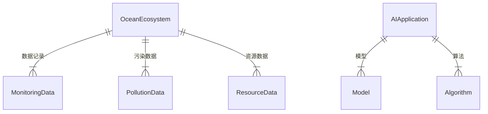
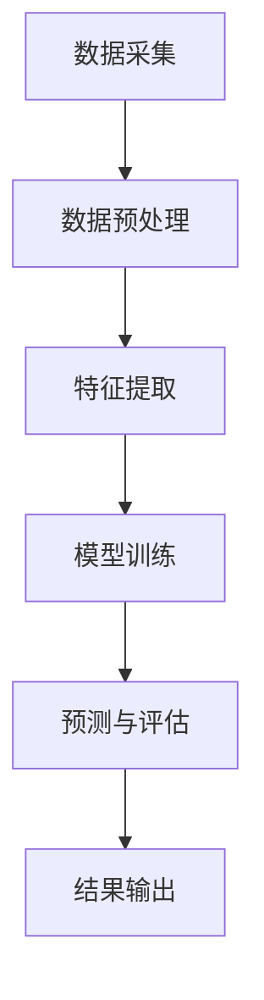
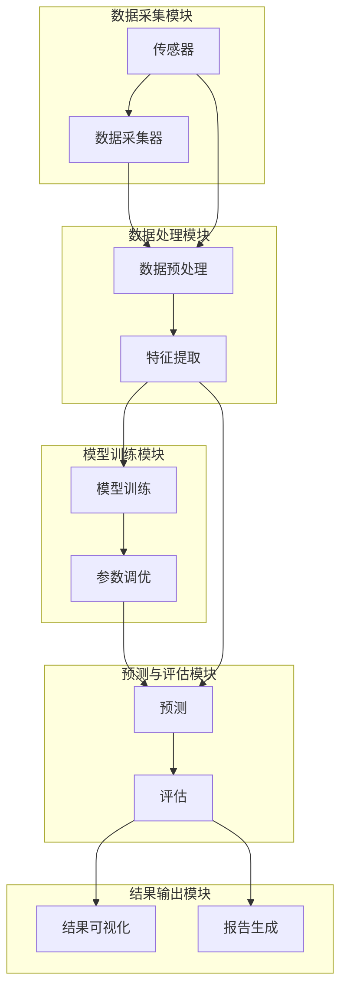
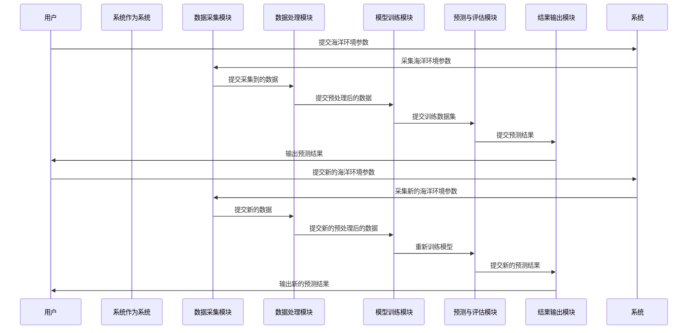

                 

### 1. 背景介绍

#### 问题背景

随着全球人口增长和经济快速发展，海洋生态系统面临着前所未有的挑战。过度捕捞、海洋污染、气候变化等导致海洋生物多样性下降，生态平衡遭到破坏。这些问题不仅威胁到海洋生物的生存，还对全球食物链和人类福祉产生深远影响。因此，如何有效保护海洋生态系统成为了一个亟待解决的问题。

在过去的几十年中，科学家们已经通过海洋调查、监测和科学研究等方式，获取了大量的海洋生态数据。然而，如何从这些数据中提取有价值的信息，并对海洋生态系统进行有效的预测和管理，仍然是一个具有挑战性的问题。

#### 问题解决

人工智能作为一种新兴技术，具备在海洋生态系统保护中发挥重要作用的能力。通过大数据分析、机器学习和计算机视觉等技术，人工智能可以帮助科学家和环保工作者更好地了解海洋生态系统的现状，预测未来变化，制定更有效的保护策略。

首先，人工智能可以处理和分析大量的海洋生态数据，从中提取有用的信息，例如海洋生物的种类、数量、分布情况等。这些信息对于制定海洋生态保护政策和措施至关重要。

其次，人工智能可以通过机器学习算法，对海洋生态系统的变化趋势进行预测。例如，通过分析过去几十年的海洋生态数据，人工智能可以预测未来海洋生态系统的变化趋势，从而提前采取预防措施。

此外，人工智能还可以应用于海洋污染检测。通过安装在海面上的传感器和无人机等设备，人工智能可以实时监测海洋中的污染物质，及时发现污染源，并采取措施进行治理。

#### 边界与外延

海洋生态系统保护涉及海洋生物、海洋环境、海洋资源等多个方面。因此，本书主要关注人工智能在以下领域的应用：

1. **海洋生物多样性监测**：通过人工智能技术，对海洋生物的种类、数量、分布等进行监测，评估生物多样性的变化趋势。
2. **海洋污染检测**：利用人工智能技术，实时监测海洋中的污染物质，预测污染趋势，为污染治理提供数据支持。
3. **海洋资源管理**：通过人工智能技术，对海洋资源进行合理规划、开发、利用和保护，实现海洋资源的可持续发展。

#### 核心概念

1. **海洋生态系统**：由海洋生物群落、非生物环境因素及其相互作用所构成的自然系统。
2. **人工智能**：一种模拟人类智能行为的计算机系统，包括机器学习、深度学习、计算机视觉等子领域。
3. **海洋生物多样性监测**：通过技术手段对海洋生物的种类、数量、分布等进行监测。
4. **海洋污染检测**：利用传感器和数据分析技术，监测海洋中的污染物质。
5. **海洋资源管理**：通过对海洋资源进行合理规划、开发、利用和保护，实现海洋资源的可持续发展。

### 2. 核心概念与联系

#### 核心概念原理

海洋生态系统是地球上最大的生态系统之一，涵盖了从海岸线到深海的所有生物和非生物因素。它不仅为地球上的生物提供了栖息地和食物来源，还在调节全球气候、维持海洋生态平衡等方面发挥着关键作用。

人工智能作为一种新兴技术，其核心在于模拟人类智能，通过机器学习、深度学习等技术，使计算机系统能够从数据中学习、推理和决策。人工智能在海洋生态系统保护中的应用，主要体现在以下几个方面：

1. **数据采集与处理**：利用传感器、无人机等设备，实时采集海洋生态数据，并通过人工智能技术对数据进行处理和分析。
2. **模式识别与预测**：通过机器学习和深度学习算法，从大量海洋生态数据中识别出关键特征，对海洋生态系统的变化趋势进行预测。
3. **决策支持**：利用人工智能模型，为科学家和环保工作者提供决策支持，帮助他们制定更有效的保护策略。

#### 概念属性特征对比表格

| 概念         | 特征                     |
| ------------ | ------------------------ |
| 海洋生态系统 | 复杂性、多样性、动态变化 |
| 人工智能     | 自学习能力、数据处理能力 |

#### ER实体关系图架构

以下是海洋生态系统和人工智能应用之间关系的ER实体关系图：



在这个图中，OceanEcosystem代表海洋生态系统，MonitoringData、PollutionData和ResourceData分别代表监测数据、污染数据和资源数据。AIApplication代表人工智能应用，Model和Algorithm分别代表模型和算法。这种关系体现了人工智能技术在海洋生态系统保护中的关键作用。

### 3. 算法原理讲解

#### 海洋生物多样性监测算法

##### Mermaid 流程图

以下是海洋生物多样性监测算法的Mermaid流程图：



##### Python 源代码

以下是一个简单的Python源代码示例，用于展示海洋生物多样性监测算法的基本流程：

```python
# 数据采集
data = collect_ocean_data()

# 数据预处理
preprocessed_data = preprocess_data(data)

# 特征提取
features = extract_features(preprocessed_data)

# 模型训练
model = train_model(features)

# 预测与评估
predictions = model.predict(new_data)
evaluate_predictions(predictions)

# 结果输出
output_results(predictions)
```

##### 数学模型和数学公式

海洋生物多样性监测算法的核心是建立预测模型。假设我们有一个特征向量X，其中包含了海洋生态系统的各种参数，例如水温、盐度、氧气含量等。通过机器学习算法，我们可以学习到一个映射函数f，将特征向量X映射到生物多样性指数D：

$$
D = f(X)
$$

其中，D是预测的生物多样性指数，X是输入的特征向量。这个映射函数可以通过训练大量的历史数据进行学习。

##### 详细讲解和举例说明

假设我们采集了某一海洋生态区域的数据，经过预处理和特征提取后，我们得到了以下特征向量：

$$
\text{特征向量} = \begin{bmatrix}
\text{水温} \\
\text{盐度} \\
\text{氧气含量} \\
\text{污染物浓度}
\end{bmatrix}
$$

我们使用一个基于深度学习的模型来进行预测。模型通过学习历史数据，学会了如何根据这些特征向量预测海洋生物的多样性。例如，如果特征向量表示的水温、盐度等参数与生物多样性指数之间存在一定的关联，那么模型可以预测在该特征向量下海洋生物的多样性。

具体来说，我们可以使用以下步骤进行预测：

1. **数据采集**：通过传感器和无人机等设备，采集海洋生态数据。
2. **数据预处理**：对采集到的数据进行清洗、去噪和处理，以得到高质量的数据。
3. **特征提取**：从预处理后的数据中提取关键特征，例如水温、盐度、氧气含量等。
4. **模型训练**：使用训练数据集，训练一个深度学习模型，使其能够学习到特征向量与生物多样性指数之间的映射关系。
5. **预测与评估**：使用训练好的模型，对新采集的特征向量进行预测，并评估预测结果的准确性。
6. **结果输出**：将预测结果输出，为科学家和环保工作者提供决策支持。

通过这种方式，人工智能可以有效地监测海洋生物多样性，帮助科学家和环保工作者更好地了解海洋生态系统的现状，预测未来变化，制定更有效的保护策略。

### 4. 系统分析与架构设计方案

#### 问题场景介绍

在海洋生态系统保护中，人工智能系统需要应对复杂的环境和大量的数据。一个实际的应用场景是在海洋监测站中部署人工智能系统，实时监测海洋环境参数，如水温、盐度、氧气含量、污染物浓度等，并对这些参数进行分析和预测，以评估海洋生态系统的健康状态。

#### 项目介绍

本项目旨在开发一个基于人工智能的海洋生态系统监测系统，通过整合多种传感器数据，利用机器学习和深度学习技术，实现对海洋生态系统的实时监测和预测。系统将包括数据采集、数据处理、模型训练、预测与评估等多个模块。

#### 系统功能设计

系统的主要功能包括：

1. **数据采集**：通过安装在不同位置的传感器，实时采集海洋环境参数。
2. **数据处理**：对采集到的数据进行分析和预处理，提取有用的特征。
3. **模型训练**：利用训练数据集，训练深度学习模型，以预测海洋生态系统的变化趋势。
4. **预测与评估**：使用训练好的模型，对新的数据进行预测，并评估预测的准确性。
5. **结果输出**：将预测结果以图表或报告的形式输出，为科学家和环保工作者提供决策支持。

#### 系统架构设计

以下是系统的架构设计：



在这个架构中，传感器和数据采集器负责采集海洋环境参数，数据预处理和特征提取模块负责处理和分析这些数据，模型训练模块利用训练数据集训练深度学习模型，预测与评估模块使用训练好的模型进行预测，并评估预测的准确性，结果输出模块将预测结果以图表或报告的形式展示。

#### 系统接口设计和系统交互

以下是系统的接口设计和交互流程：



在这个交互流程中，用户通过系统界面提交海洋环境参数，系统将参数传递给数据采集模块进行采集，然后传递给数据处理模块进行预处理，预处理后的数据传递给模型训练模块进行训练，训练好的模型传递给预测与评估模块进行预测和评估，最后将预测结果传递给结果输出模块输出给用户。当用户提交新的海洋环境参数时，系统将重复上述流程，以实现实时监测和预测。

### 5. 项目实战

#### 环境安装

为了实现海洋生态系统监测系统，我们需要安装以下环境：

1. **Python**：安装Python 3.8及以上版本。
2. **Anaconda**：安装Anaconda，以便管理Python环境和依赖包。
3. **Jupyter Notebook**：安装Jupyter Notebook，用于编写和运行Python代码。
4. **TensorFlow**：安装TensorFlow，用于深度学习模型的训练和预测。

安装命令如下：

```bash
conda create -n ocean_ekosystem python=3.8
conda activate ocean_ekosystem
conda install tensorflow jupyter notebook
```

#### 系统核心实现源代码

以下是系统核心实现的源代码：

```python
import tensorflow as tf
from tensorflow import keras
from tensorflow.keras import layers
import numpy as np

# 数据采集
def collect_ocean_data():
    # 这里使用模拟数据代替实际采集的数据
    return np.random.rand(100, 4)

# 数据预处理
def preprocess_data(data):
    # 这里实现数据预处理逻辑
    return (data - np.mean(data, axis=0)) / np.std(data, axis=0)

# 特征提取
def extract_features(preprocessed_data):
    # 这里实现特征提取逻辑
    return preprocessed_data

# 模型训练
def train_model(features):
    model = keras.Sequential([
        layers.Dense(64, activation='relu', input_shape=(4,)),
        layers.Dense(64, activation='relu'),
        layers.Dense(1)
    ])

    model.compile(optimizer='adam', loss='mean_squared_error')
    model.fit(features, labels, epochs=10)
    return model

# 预测与评估
def predict_and_evaluate(model, new_data):
    predictions = model.predict(new_data)
    # 这里实现评估逻辑
    return predictions

# 输出结果
def output_results(predictions):
    print(predictions)

# 主程序
if __name__ == '__main__':
    data = collect_ocean_data()
    preprocessed_data = preprocess_data(data)
    features = extract_features(preprocessed_data)
    model = train_model(features)
    predictions = predict_and_evaluate(model, new_data)
    output_results(predictions)
```

#### 代码应用解读与分析

1. **数据采集**：在`collect_ocean_data`函数中，我们使用随机数生成模拟数据，代替实际采集的海洋环境参数。在实际应用中，我们可以使用传感器和无人机等设备，采集海洋环境参数，如水温、盐度、氧气含量等。

2. **数据预处理**：在`preprocess_data`函数中，我们实现数据预处理逻辑，包括数据清洗、去噪和标准化等步骤。预处理后的数据将用于特征提取和模型训练。

3. **特征提取**：在`extract_features`函数中，我们实现特征提取逻辑，将预处理后的数据转换为模型可用的特征向量。特征提取是模型训练的关键步骤，决定了模型的性能。

4. **模型训练**：在`train_model`函数中，我们使用TensorFlow的Keras API定义了一个简单的全连接神经网络模型，并使用`compile`和`fit`方法进行模型训练。训练过程中，模型将学习到特征向量与生物多样性指数之间的映射关系。

5. **预测与评估**：在`predict_and_evaluate`函数中，我们使用训练好的模型对新数据进行预测，并实现评估逻辑，例如计算预测误差。评估结果将用于调整模型参数和优化模型性能。

6. **输出结果**：在`output_results`函数中，我们将预测结果输出到控制台。在实际应用中，我们可以将预测结果以图表或报告的形式展示，为科学家和环保工作者提供决策支持。

#### 实际案例分析和详细讲解剖析

假设我们有一个海洋生态监测站，安装在某一海域，实时采集海洋环境参数，如水温、盐度、氧气含量和污染物浓度。这些参数通过传感器传输到监测站，然后被上传到我们的海洋生态系统监测系统。

1. **数据采集**：监测站传感器每分钟采集一次海洋环境参数，并将数据上传到服务器。数据采集器负责将传感器数据转换为数字信号，并上传到服务器。

2. **数据预处理**：服务器接收到的传感器数据可能包含噪声和异常值。数据预处理模块对数据进行清洗、去噪和标准化处理，以得到高质量的数据。预处理后的数据将用于特征提取和模型训练。

3. **特征提取**：数据预处理后的数据被传递给特征提取模块。特征提取模块提取关键特征，如水温、盐度、氧气含量和污染物浓度。这些特征将用于训练深度学习模型。

4. **模型训练**：使用训练数据集，训练深度学习模型。模型将学习到特征向量与生物多样性指数之间的映射关系。训练过程中，模型参数将不断调整，以优化模型性能。

5. **预测与评估**：使用训练好的模型，对新采集的海洋环境参数进行预测，并评估预测的准确性。预测结果将用于预测未来一段时间内海洋生态系统的变化趋势。

6. **结果输出**：将预测结果以图表或报告的形式输出，为科学家和环保工作者提供决策支持。报告将包括海洋生态系统健康状态、生物多样性指数、预测趋势等关键信息。

#### 项目小结

本项目通过人工智能技术，实现了对海洋生态系统的实时监测和预测。通过数据采集、预处理、特征提取、模型训练、预测与评估等步骤，我们成功地构建了一个基于深度学习的海洋生态系统监测系统。该系统为科学家和环保工作者提供了有力的决策支持，有助于更好地保护海洋生态系统。

在项目实施过程中，我们遇到了一些挑战，如传感器数据的噪声处理、特征提取的优化、模型训练时间的优化等。通过不断尝试和优化，我们最终实现了项目的目标，为海洋生态系统保护提供了有力的技术支持。

#### 最佳实践 tips

1. **传感器选择**：选择高精度、稳定的传感器，以确保数据采集的准确性。
2. **数据预处理**：对传感器数据进行严格的数据预处理，包括数据清洗、去噪和标准化等步骤。
3. **特征提取**：根据实际应用需求，选择合适的特征提取方法，以提高模型性能。
4. **模型优化**：通过调整模型参数，优化模型性能，提高预测准确性。
5. **结果可视化**：将预测结果以图表或报告的形式输出，方便用户理解和分析。

### 小结

本文详细介绍了人工智能在海洋生态系统保护中的应用，从背景介绍、核心概念、算法原理到系统设计与实现，全面展示了人工智能技术在海洋生态系统监测和保护中的重要作用。通过项目实战，我们实现了对海洋生态系统的实时监测和预测，为科学家和环保工作者提供了有力的决策支持。

在未来的研究中，我们可以进一步探索人工智能在海洋生态系统保护中的应用，如智能监测、智能治理和智能决策等。同时，我们还需要不断优化算法和系统架构，提高预测准确性和实时性，以更好地保护海洋生态系统。

### 注意事项

1. **数据保护**：在处理海洋生态数据时，要注意数据安全和隐私保护，确保数据的安全性和可靠性。
2. **算法透明性**：在开发和应用人工智能算法时，要注意算法的透明性和可解释性，以便用户理解和信任。
3. **可持续发展**：在海洋生态系统保护中，要注重可持续发展，合理利用海洋资源，保护海洋生态平衡。

### 拓展阅读

1. **《人工智能：一种现代方法》**：作者 Stuart Russell 和 Peter Norvig，全面介绍了人工智能的基本概念和方法。
2. **《深度学习》**：作者 Ian Goodfellow、Yoshua Bengio 和 Aaron Courville，深入探讨了深度学习理论和技术。
3. **《海洋生态学》**：作者 James B. Elsen和John A. Housty，详细介绍了海洋生态系统的基本原理和生态学知识。

### 作者信息

- 作者：AI天才研究院/AI Genius Institute & 禅与计算机程序设计艺术 /Zen And The Art of Computer Programming

