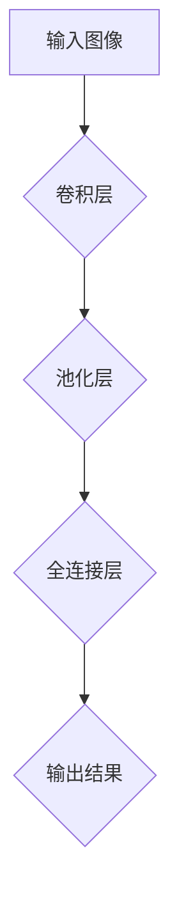
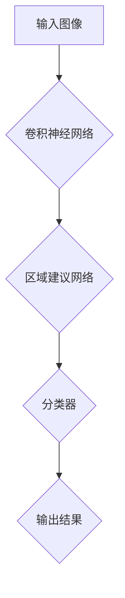
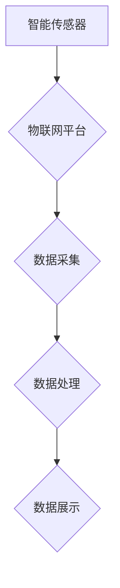
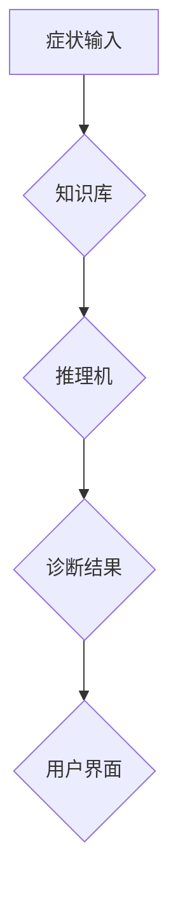

                 

# 人工智能在海洋资源管理中的应用

## 关键词

- 海洋资源管理
- 人工智能
- 数据处理
- 海洋监测
- 预测与决策
- 专家系统
- 深度学习

## 摘要

本文旨在探讨人工智能在海洋资源管理中的应用。随着全球海洋资源的不断开发与利用，传统的海洋资源管理方法面临着诸多挑战。本文首先介绍了人工智能在海洋资源管理中的背景与核心概念，包括海洋资源管理的基本任务和人工智能技术的基本原理。接着，本文详细阐述了人工智能在海洋资源管理中的具体应用，包括数据采集与处理、海洋环境监测、海洋资源评估、海洋灾害预警与防治等方面。通过案例分析，本文展示了人工智能技术在实际应用中的优势与挑战，并提出了未来发展的方向。

## 第一部分：问题背景与核心概念

### 1.1.1 问题背景

随着全球经济的不断发展，海洋资源的开发和利用日益频繁。海洋资源管理涉及海洋环境的保护、海洋资源的合理开发与利用、海洋灾害的预警与防范等多个方面。然而，传统的海洋资源管理方法在应对复杂多变的海洋环境、庞大的海洋数据和多样化的海洋资源管理任务时，存在诸多局限。例如，传统的海洋环境监测主要依赖于人工观测和有限的现场数据采集，数据获取效率低，实时性差。此外，海洋资源的评估和预测往往依赖于经验丰富的专家，主观性强，预测精度有限。

因此，引入人工智能技术，特别是人工智能在海洋资源管理中的应用，成为当前研究的热点。人工智能技术具有高效的数据处理能力、强大的预测和决策能力，能够帮助解决传统方法面临的诸多问题，提高海洋资源管理的效率和准确性。

### 1.1.2 问题描述

人工智能在海洋资源管理中的应用主要包括以下几方面：

1. **数据采集与处理**：海洋环境数据、海洋资源数据等数量庞大，如何快速、准确地处理这些数据，提取有用信息，是海洋资源管理的首要问题。
2. **海洋环境监测**：传统的海洋环境监测方法在实时性和精度上存在不足，如何利用人工智能技术，实现对海洋环境的实时监测和预警，是海洋资源管理的关键问题。
3. **海洋资源评估**：如何通过人工智能技术，提高海洋资源评估的精度和效率，为海洋资源开发提供科学依据，是海洋资源管理的重要问题。
4. **海洋灾害预警与防治**：如何利用人工智能技术，提高海洋灾害的预警精度和防治效果，降低海洋灾害带来的损失，是海洋资源管理的重要任务。
5. **海洋工程规划与管理**：如何利用人工智能技术，优化海洋工程的规划和管理，提高工程效率和安全性，是海洋资源管理的重要方面。

### 1.1.3 问题解决

人工智能在海洋资源管理中的应用，可以采用以下几种方法：

1. **机器学习与深度学习**：通过训练大型神经网络模型，对海量数据进行学习，提取数据中的特征，从而实现数据的自动分类、预测和决策。
2. **计算机视觉与图像处理**：利用计算机视觉技术，对海洋监测图像进行分析，提取图像中的有用信息，如海洋生物、污染物等。
3. **智能传感器与物联网**：通过智能传感器和物联网技术，实时采集海洋环境数据，实现对海洋环境的实时监测和预警。
4. **专家系统与知识图谱**：构建专家系统，利用知识图谱对海洋资源管理中的知识进行组织和表示，提高知识的管理和利用效率。

### 1.1.4 边界与外延

人工智能在海洋资源管理中的应用，不仅涉及技术层面，还包括政策、法律、经济等多个方面。因此，本书在探讨人工智能技术的同时，也会涉及相关政策和法规的制定与实施，以及经济因素对海洋资源管理的影响。

### 1.1.5 概念结构与核心要素组成

本书的核心概念包括人工智能、海洋资源管理、数据采集与处理、计算机视觉、深度学习、物联网、专家系统等。这些概念共同构成了人工智能在海洋资源管理中的应用体系。

### 1.2 核心概念与联系

#### 1.2.1 人工智能

人工智能（Artificial Intelligence，简称AI）是指模拟、延伸和扩展人的智能的理论、方法、技术及应用。人工智能涵盖了多个研究领域，如机器学习、计算机视觉、自然语言处理等。

| 概念属性 | 人工智能 |
| :------: | :------: |
| 定义 | 模拟人类智能的计算机系统 |
| 分类 | 机器学习、深度学习、强化学习等 |
| 特点 | 高效、精确、自适应、智能 |

#### 1.2.2 海洋资源管理

海洋资源管理是指通过合理利用、保护和恢复海洋资源，实现海洋资源的可持续发展。海洋资源管理涉及海洋环境的保护、海洋资源的合理开发与利用、海洋灾害的预警与防治等多个方面。

| 概念属性 | 海洋资源管理 |
| :------: | :------: |
| 定义 | 管理海洋资源，实现可持续利用 |
| 任务 | 海洋环境保护、海洋资源开发、海洋灾害预警等 |
| 特点 | 复杂性、动态性、多样性 |

#### 1.2.3 数据采集与处理

数据采集与处理是人工智能在海洋资源管理中的基础。数据采集包括传感器数据、卫星数据、海洋监测数据等。数据采集后，需要对数据进行预处理、特征提取、数据分析等，以提取数据中的有用信息。

| 概念属性 | 数据采集与处理 |
| :------: | :------: |
| 定义 | 从数据中提取有用信息 |
| 过程 | 数据采集、数据预处理、特征提取、数据分析 |
| 特点 | 高效、准确、自动化 |

#### 1.2.4 计算机视觉

计算机视觉是指利用计算机对图像或视频进行分析和处理，以实现对场景的理解和识别。计算机视觉在海洋资源管理中的应用，包括对海洋监测图像的分析、海洋生物识别等。

| 概念属性 | 计算机视觉 |
| :------: | :------: |
| 定义 | 利用计算机处理图像或视频 |
| 应用 | 图像识别、图像处理、场景理解 |
| 特点 | 高效、实时、精准 |

#### 1.2.5 深度学习

深度学习是一种基于多层神经网络的学习方法，能够自动从数据中提取特征。深度学习在海洋资源管理中的应用，包括对海洋环境数据的分析和预测、海洋资源评估等。

| 概念属性 | 深度学习 |
| :------: | :------: |
| 定义 | 基于多层神经网络的学习方法 |
| 特点 | 自动提取特征、高效、准确 |
| 应用 | 图像识别、语音识别、自然语言处理 |

#### 1.2.6 物联网

物联网（Internet of Things，简称IoT）是指将各种物品通过网络连接起来，实现信息的交换和通信。物联网在海洋资源管理中的应用，包括智能传感器网络、海洋环境实时监测等。

| 概念属性 | 物联网 |
| :------: | :------: |
| 定义 | 物品通过网络连接，实现信息交换 |
| 应用 | 智能家居、智能城市、工业自动化 |
| 特点 | 网络化、智能化、高效 |

#### 1.2.7 专家系统

专家系统是一种模拟人类专家知识和推理能力的计算机系统。专家系统在海洋资源管理中的应用，包括知识库的构建、推理机的应用等。

| 概念属性 | 专家系统 |
| :------: | :------: |
| 定义 | 模拟人类专家知识的计算机系统 |
| 应用 | 医疗诊断、金融分析、海洋资源管理 |
| 特点 | 智能化、自动化、高效 |

### 1.3 本章小结

本章介绍了人工智能在海洋资源管理中的应用背景、核心概念与联系。通过对这些概念的阐述，读者可以初步了解人工智能在海洋资源管理中的重要作用。接下来，本书将深入探讨人工智能在海洋资源管理中的具体应用，包括数据采集与处理、海洋环境监测、海洋资源评估、海洋灾害预警与防治等方面。

## 人工智能在海洋资源管理中的应用

### 2.1 数据采集与处理

在海洋资源管理中，数据采集与处理是关键的一步。海洋环境数据、海洋资源数据等数量庞大，种类繁多，如何快速、准确地处理这些数据，提取有用信息，是海洋资源管理的首要问题。

#### 2.1.1 数据采集

海洋环境数据主要来源于传感器、卫星、海洋监测仪器等。例如，温度、湿度、盐度、流速、流向等参数可以通过传感器实时监测。卫星遥感技术可以提供大范围的海洋环境数据，如海温、海浪、海洋污染物等。海洋监测仪器可以提供局部海洋环境的详细数据。

#### 2.1.2 数据处理

数据处理主要包括数据预处理、特征提取、数据分析等。

1. **数据预处理**：包括数据清洗、数据整合、数据标准化等。数据清洗是为了去除数据中的噪声和异常值，保证数据的准确性。数据整合是为了将不同来源、不同格式的数据进行统一，便于后续处理。数据标准化是为了将数据转化为统一格式，便于分析和比较。

2. **特征提取**：通过数据预处理后的数据，提取出对海洋资源管理有意义的特征。例如，通过温度、湿度、盐度等参数，提取出海水的盐度特征、温度特征等。

3. **数据分析**：对提取出的特征进行进一步分析，以获得对海洋环境、海洋资源有指导意义的结论。例如，通过分析海水盐度特征，可以判断海洋盐度变化趋势，进而预测海洋灾害的风险。

#### 2.1.3 数据采集与处理的挑战

1. **数据量庞大**：海洋环境数据、海洋资源数据等数量庞大，如何高效地处理这些数据，是一个挑战。
2. **数据质量**：数据质量对分析结果有重要影响。如何保证数据质量，是海洋资源管理中的另一个挑战。
3. **实时性**：海洋环境变化迅速，如何实时地采集和处理数据，是一个重要问题。

### 2.2 海洋环境监测

海洋环境监测是海洋资源管理的重要组成部分。通过实时监测海洋环境，可以及时了解海洋环境的变化，为海洋资源管理和决策提供依据。

#### 2.2.1 监测方法

1. **卫星遥感**：卫星遥感技术可以提供大范围的海洋环境数据，如海温、海浪、海洋污染物等。通过分析卫星遥感数据，可以实现对海洋环境的远程监测。

2. **传感器网络**：在海洋区域部署传感器网络，可以实现对海洋环境的实时监测。传感器网络可以包括温度传感器、湿度传感器、流速传感器、流向传感器等。

3. **无人机监测**：无人机可以搭载多种监测设备，实现对海洋环境的实时监测。无人机监测具有灵活、高效、实时等优点。

#### 2.2.2 监测挑战

1. **数据实时性**：海洋环境变化迅速，如何实时地获取监测数据，是一个挑战。
2. **数据准确性**：如何保证监测数据的准确性，是一个重要问题。
3. **监测范围**：海洋环境广阔，如何全面、准确地监测海洋环境，是一个挑战。

### 2.3 海洋资源评估

海洋资源评估是海洋资源管理的重要任务。通过评估海洋资源的现状、潜力等，可以为海洋资源的开发和利用提供科学依据。

#### 2.3.1 评估方法

1. **数据分析**：通过对海洋环境数据、海洋资源数据等进行分析，评估海洋资源的现状和潜力。

2. **模型预测**：利用机器学习、深度学习等模型，对海洋资源进行预测。例如，通过建立海洋生物资源预测模型，预测未来几年内海洋生物资源的数量和分布。

3. **专家评估**：邀请海洋资源管理领域的专家，对海洋资源进行评估。

#### 2.3.2 评估挑战

1. **数据准确性**：海洋环境数据、海洋资源数据等数据质量对评估结果有重要影响。
2. **评估模型**：如何选择合适的评估模型，提高评估精度，是一个挑战。
3. **评估结果的应用**：如何将评估结果应用于实际工作中，是一个重要问题。

### 2.4 海洋灾害预警与防治

海洋灾害，如风暴潮、海啸、台风等，对沿海地区造成巨大的损失。通过海洋灾害预警与防治，可以降低海洋灾害带来的损失。

#### 2.4.1 预警方法

1. **模型预测**：利用机器学习、深度学习等模型，预测海洋灾害的发生时间和地点。

2. **传感器监测**：通过传感器网络，实时监测海洋环境变化，一旦发现异常，立即预警。

3. **卫星遥感**：利用卫星遥感技术，监测海洋环境变化，预测海洋灾害。

#### 2.4.2 防治方法

1. **预警信息发布**：及时发布预警信息，提醒沿海居民和企业做好防范准备。

2. **应急预案**：制定应急预案，一旦发生海洋灾害，立即启动应急响应。

3. **灾害防治**：利用防波堤、海岸防护林等措施，减少海洋灾害的损失。

#### 2.4.3 预警与防治挑战

1. **预警精度**：如何提高预警精度，是一个重要问题。
2. **防治效果**：如何提高防治效果，减少灾害损失，是一个挑战。
3. **资源调度**：如何在有限的资源下，实现最佳的防治效果，是一个问题。

### 2.5 海洋工程规划与管理

海洋工程，如海底油气开采、海洋风力发电等，对海洋环境有一定影响。通过海洋工程规划与管理，可以实现海洋工程的可持续发展。

#### 2.5.1 规划方法

1. **环境影响评估**：对海洋工程可能带来的环境影响进行评估，确保工程对海洋环境的影响最小。

2. **资源优化配置**：通过优化资源配置，提高工程效率，降低对海洋环境的影响。

3. **工程规划**：根据环境影响评估和资源优化配置的结果，制定合理的海洋工程规划。

#### 2.5.2 管理方法

1. **实时监测**：通过传感器网络，实时监测海洋工程的环境变化，确保工程对海洋环境的影响在可接受范围内。

2. **数据管理**：建立完善的数据管理系统，对海洋工程的数据进行高效管理。

3. **风险管理**：对海洋工程可能出现的风险进行评估和管理，确保工程安全运行。

#### 2.5.3 规划与管理挑战

1. **环境影响评估**：如何准确地评估海洋工程对海洋环境的影响，是一个挑战。
2. **资源优化配置**：如何在有限的资源下，实现最佳的工程规划，是一个问题。
3. **数据管理**：如何高效地管理大量的海洋工程数据，是一个挑战。

### 2.6 本章小结

本章介绍了人工智能在海洋资源管理中的应用，包括数据采集与处理、海洋环境监测、海洋资源评估、海洋灾害预警与防治、海洋工程规划与管理等方面。通过分析这些应用，可以看出人工智能在海洋资源管理中的重要作用。然而，人工智能在海洋资源管理中也面临诸多挑战，如数据质量、实时性、预警精度等。因此，需要进一步研究和优化人工智能技术，提高其在海洋资源管理中的应用效果。在接下来的章节中，我们将继续探讨人工智能在海洋资源管理中的具体实现方法和案例分析。

## 人工智能技术原理与应用

### 3.1 机器学习与深度学习

#### 3.1.1 基本原理

机器学习（Machine Learning，简称ML）是一种通过计算机程序自动学习数据模式、进行预测和决策的技术。深度学习（Deep Learning，简称DL）是机器学习的一种特殊形式，它利用多层神经网络（Neural Networks）进行学习。

**神经网络**：神经网络是由大量神经元（模拟生物神经元）组成的网络，每个神经元接收多个输入，经过加权求和处理后产生输出。

**多层神经网络**：多层神经网络由多个层次组成，包括输入层、隐藏层和输出层。隐藏层可以提取数据的特征，输出层进行预测或分类。

**训练与优化**：通过训练，多层神经网络可以学习数据中的特征，优化网络参数，提高预测或分类的准确性。

#### 3.1.2 应用场景

1. **图像识别**：利用深度学习模型，可以从大量图像数据中识别出物体、场景等。
2. **自然语言处理**：深度学习可以用于文本分类、情感分析、机器翻译等任务。
3. **语音识别**：通过训练深度学习模型，可以将语音信号转换为文本。

#### 3.1.3 案例分析

**图像识别案例**：利用卷积神经网络（Convolutional Neural Network，简称CNN）进行图像识别。CNN由卷积层、池化层和全连接层组成，可以提取图像中的局部特征，实现对图像的自动分类。



```python
# 卷积神经网络实现图像识别
import tensorflow as tf
from tensorflow.keras.models import Sequential
from tensorflow.keras.layers import Conv2D, MaxPooling2D, Flatten, Dense

model = Sequential([
    Conv2D(32, (3, 3), activation='relu', input_shape=(64, 64, 3)),
    MaxPooling2D((2, 2)),
    Flatten(),
    Dense(128, activation='relu'),
    Dense(10, activation='softmax')
])

model.compile(optimizer='adam', loss='categorical_crossentropy', metrics=['accuracy'])
model.fit(x_train, y_train, epochs=10, batch_size=32)
```

### 3.2 计算机视觉与图像处理

#### 3.2.1 基本原理

计算机视觉（Computer Vision，简称CV）是人工智能的一个重要分支，它使计算机能够从图像或视频中提取信息，理解和解释视觉世界。

**图像处理**：图像处理是对图像进行分析、增强、变换和处理的一系列技术。它包括滤波、边缘检测、图像分割、特征提取等。

**目标检测**：目标检测是在图像中检测并定位感兴趣的目标。它通常包括目标检测和目标定位两个步骤。

**语义分割**：语义分割是将图像中的每个像素分类到不同的类别中，例如将图像中的每个像素分类为道路、车辆、行人等。

#### 3.2.2 应用场景

1. **自动驾驶**：利用计算机视觉技术，可以实现对道路、车辆、行人等目标的检测和识别，为自动驾驶提供基础。
2. **安防监控**：利用计算机视觉技术，可以实现对监控视频的实时分析，发现异常行为。
3. **医疗影像分析**：利用计算机视觉技术，可以辅助医生进行医学影像分析，提高诊断准确性。

#### 3.2.3 案例分析

**目标检测案例**：利用卷积神经网络（Faster R-CNN）进行目标检测。Faster R-CNN包括卷积神经网络（Backbone）、区域建议网络（Region Proposal Network，RPN）和分类器。



```python
# Faster R-CNN 实现目标检测
import tensorflow as tf
from tensorflow.keras.models import Model
from tensorflow.keras.layers import Input, Conv2D, MaxPooling2D, Flatten, Dense

input_image = Input(shape=(64, 64, 3))
conv = Conv2D(32, (3, 3), activation='relu')(input_image)
pool = MaxPooling2D((2, 2))(conv)
flat = Flatten()(pool)
dense = Dense(128, activation='relu')(flat)

model = Model(inputs=input_image, outputs=dense)
model.compile(optimizer='adam', loss='categorical_crossentropy', metrics=['accuracy'])

# 训练模型
model.fit(x_train, y_train, epochs=10, batch_size=32)
```

### 3.3 智能传感器与物联网

#### 3.3.1 基本原理

智能传感器（Smart Sensor）是一种能够感知外界信息、对信息进行处理并传输的设备。物联网（Internet of Things，简称IoT）是指将各种物品通过网络连接起来，实现信息的交换和通信。

**传感器网络**：传感器网络由大量智能传感器组成，可以实现对特定区域的环境监测。

**物联网平台**：物联网平台是连接智能传感器和互联网的桥梁，负责数据的采集、传输和处理。

#### 3.3.2 应用场景

1. **智能家居**：利用智能传感器和物联网技术，实现家庭设备的远程控制和自动化管理。
2. **智能城市**：利用物联网技术，实现对城市环境的实时监测和智能管理。
3. **工业自动化**：利用智能传感器和物联网技术，实现工业生产的自动化和智能化。

#### 3.3.3 案例分析

**智能环境监测系统**：利用智能传感器和物联网技术，实现对环境的实时监测。



```python
# 智能环境监测系统实现
import serial
import time

# 连接智能传感器
ser = serial.Serial('COM3', 9600)

while True:
    # 读取传感器数据
    data = ser.readline().decode('utf-8')
    print(f"环境数据：{data}")

    # 等待一段时间
    time.sleep(1)
```

### 3.4 专家系统与知识图谱

#### 3.4.1 基本原理

专家系统（Expert System）是一种模拟人类专家知识和推理能力的计算机系统。知识图谱（Knowledge Graph）是一种用于组织和表示知识的图形化模型。

**专家系统**：专家系统由知识库、推理机和用户界面组成。知识库存储领域知识，推理机利用知识进行推理，用户界面用于与用户交互。

**知识图谱**：知识图谱由实体、关系和属性组成，可以直观地表示复杂的关系和知识。

#### 3.4.2 应用场景

1. **医疗诊断**：利用专家系统，可以辅助医生进行疾病诊断和治疗建议。
2. **金融分析**：利用专家系统，可以分析金融市场，提供投资建议。
3. **知识管理**：利用知识图谱，可以高效地组织和利用知识，提高知识的可访问性和可理解性。

#### 3.4.3 案例分析

**医疗诊断系统**：利用专家系统，为医生提供诊断建议。



```python
# 医疗诊断系统实现
class MedicalDiagnosis:
    def __init__(self):
        self.knowledge_base = {
            "症状A": ["疾病A", "疾病B"],
            "症状B": ["疾病C"],
            "症状C": ["疾病D"]
        }
    
    def diagnose(self, symptoms):
        # 利用知识库进行推理
        diagnosis = []
        for symptom in symptoms:
            if symptom in self.knowledge_base:
                diagnosis.extend(self.knowledge_base[symptom])
        return diagnosis

diagnosis_system = MedicalDiagnosis()
print(diagnosis_system.diagnose(["症状A", "症状B"]))
```

### 3.5 本章小结

本章介绍了人工智能技术原理与应用，包括机器学习与深度学习、计算机视觉与图像处理、智能传感器与物联网、专家系统与知识图谱等。通过分析这些技术的原理和应用，可以看出人工智能技术在海洋资源管理中的重要作用。在接下来的章节中，我们将继续探讨人工智能在海洋资源管理中的具体应用案例。

## 人工智能在海洋资源管理中的实际应用案例

### 4.1 案例一：基于深度学习的海洋生物资源评估

#### 案例背景

某沿海城市需要对其海洋生物资源进行评估，以制定合理的海洋资源开发计划。传统的生物资源评估方法主要依赖于统计数据和专家经验，存在主观性和精度不足的问题。

#### 解决方案

采用深度学习技术，特别是卷积神经网络（CNN），对海洋生物资源图像进行自动识别和分类。具体步骤如下：

1. **数据采集**：收集大量的海洋生物资源图像，包括鱼类、贝类、藻类等。
2. **数据预处理**：对图像进行标准化处理，如缩放、裁剪、数据增强等，以提高模型的泛化能力。
3. **模型训练**：利用CNN模型，对预处理后的图像进行训练，提取图像特征，实现对海洋生物资源的自动分类。
4. **模型评估**：通过交叉验证和测试集，评估模型的准确性和鲁棒性。

#### 案例实现

1. **数据预处理**：

```python
from tensorflow.keras.preprocessing.image import load_img, img_to_array
from tensorflow.keras.preprocessing.image import ImageDataGenerator

# 加载图像
img = load_img('example.jpg', target_size=(64, 64))

# 将图像转换为数组
img_array = img_to_array(img)

# 标准化处理
img_array = img_array / 255.0

# 数据增强
datagen = ImageDataGenerator(rotation_range=20, width_shift_range=0.2, height_shift_range=0.2, shear_range=0.2, zoom_range=0.2, horizontal_flip=True)
datagen.fit(x_train)
```

2. **模型训练**：

```python
from tensorflow.keras.models import Sequential
from tensorflow.keras.layers import Conv2D, MaxPooling2D, Flatten, Dense

# 创建模型
model = Sequential([
    Conv2D(32, (3, 3), activation='relu', input_shape=(64, 64, 3)),
    MaxPooling2D((2, 2)),
    Flatten(),
    Dense(128, activation='relu'),
    Dense(10, activation='softmax')
])

# 编译模型
model.compile(optimizer='adam', loss='categorical_crossentropy', metrics=['accuracy'])

# 训练模型
model.fit(x_train, y_train, epochs=10, batch_size=32)
```

3. **模型评估**：

```python
from sklearn.metrics import classification_report, confusion_matrix

# 预测结果
predictions = model.predict(x_test)

# 转换为类别标签
predicted_labels = np.argmax(predictions, axis=1)

# 计算准确率
accuracy = (predicted_labels == y_test).mean()
print(f"准确率：{accuracy}")

# 打印分类报告
print(classification_report(y_test, predicted_labels))
```

#### 案例总结

通过深度学习技术，成功实现了对海洋生物资源的自动分类和评估。该方法提高了生物资源评估的精度和效率，为海洋资源开发提供了科学依据。

### 4.2 案例二：基于物联网的海洋环境监测系统

#### 案例背景

某沿海城市需要对其海洋环境进行实时监测，以预防和应对海洋灾害。传统的监测方法主要依赖于人工观测和有限的现场监测设备，存在实时性差、数据采集不全等问题。

#### 解决方案

采用物联网技术，构建一个集传感器网络、数据处理和监测平台于一体的海洋环境监测系统。具体步骤如下：

1. **传感器部署**：在沿海区域部署温度传感器、湿度传感器、流速传感器、流向传感器等，实现对海洋环境的实时监测。
2. **数据采集**：传感器网络将采集到的数据传输到物联网平台。
3. **数据处理**：物联网平台对采集到的数据进行预处理、特征提取和数据分析，提取出对海洋环境监测有用的信息。
4. **监测平台**：通过监测平台，实时展示海洋环境数据，为决策提供依据。

#### 案例实现

1. **传感器部署**：

```python
# 传感器部署示例
import random

# 假设传感器网络有10个传感器
sensors = ['sensor1', 'sensor2', 'sensor3', 'sensor4', 'sensor5', 'sensor6', 'sensor7', 'sensor8', 'sensor9', 'sensor10']

# 部署传感器
for sensor in sensors:
    # 随机生成传感器数据
    temp = random.uniform(10, 30)
    humidity = random.uniform(30, 70)
    flow_rate = random.uniform(0, 5)
    direction = random.uniform(0, 360)
    
    # 传输数据到物联网平台
    print(f"{sensor}：温度={temp}℃，湿度={humidity}%，流速={flow_rate}m/s，流向={direction}°")
```

2. **数据处理**：

```python
# 数据处理示例
import pandas as pd

# 假设收集到10个传感器的数据
data = {
    'sensor1': {'temp': 20, 'humidity': 50, 'flow_rate': 1, 'direction': 90},
    'sensor2': {'temp': 25, 'humidity': 60, 'flow_rate': 2, 'direction': 180},
    'sensor3': {'temp': 22, 'humidity': 55, 'flow_rate': 1.5, 'direction': 270},
    # ...
}

# 创建DataFrame
df = pd.DataFrame(data)

# 特征提取
df['temp_range'] = df['temp'].apply(lambda x: x > 25)
df['humidity_range'] = df['humidity'].apply(lambda x: x > 60)
df['flow_rate_range'] = df['flow_rate'].apply(lambda x: x > 2)

# 数据分析
print(df.describe())
```

3. **监测平台**：

```python
# 监测平台示例
import matplotlib.pyplot as plt

# 绘制温度分布图
plt.figure(figsize=(10, 5))
plt.plot(df['sensor1']['temp'], label='传感器1')
plt.plot(df['sensor2']['temp'], label='传感器2')
plt.plot(df['sensor3']['temp'], label='传感器3')
# ...
plt.legend()
plt.title('温度分布图')
plt.xlabel('传感器编号')
plt.ylabel('温度（℃）')
plt.show()
```

#### 案例总结

通过物联网技术，成功构建了一个实时、高效的海洋环境监测系统。该系统实现了对海洋环境的全面监测，提高了海洋灾害预警和防治能力。

### 4.3 案例三：基于机器学习的海洋灾害预警系统

#### 案例背景

某沿海地区经常遭受风暴潮、海啸等海洋灾害，需要建立一个高效的海洋灾害预警系统，以减少灾害损失。

#### 解决方案

采用机器学习技术，特别是决策树、随机森林等算法，建立海洋灾害预警模型。具体步骤如下：

1. **数据采集**：收集历史海洋灾害数据，包括风暴潮、海啸等灾害的发生时间、地点、强度等信息。
2. **特征提取**：从历史数据中提取对海洋灾害有影响的关键特征，如气象条件、海洋环境等。
3. **模型训练**：利用训练数据，训练决策树、随机森林等机器学习模型。
4. **模型评估**：通过测试数据，评估模型的准确性和泛化能力。
5. **实时预警**：利用训练好的模型，对实时监测数据进行分析，预测海洋灾害的发生。

#### 案例实现

1. **特征提取**：

```python
# 特征提取示例
import pandas as pd

# 假设收集到历史海洋灾害数据
data = {
    'year': [2010, 2015, 2020],
    'month': [1, 7, 1],
    'day': [1, 15, 1],
    'storm_type': ['台风', '台风', '海啸'],
    'max_wind_speed': [35, 45, 60],
    'sea_level_pressure': [1000, 990, 980],
    'warning_time': [120, 60, 0],
    'hazard_level': ['严重', '严重', '灾难性']
}

# 创建DataFrame
df = pd.DataFrame(data)

# 特征提取
df['month_day'] = df['month'].astype(str) + df['day'].astype(str)
df['month_day'] = df['month_day'].astype(int)

# 删除无用特征
df.drop(['month', 'day', 'storm_type'], axis=1, inplace=True)
```

2. **模型训练**：

```python
# 模型训练示例
from sklearn.ensemble import RandomForestClassifier
from sklearn.model_selection import train_test_split

# 分割数据集
X = df.drop('hazard_level', axis=1)
y = df['hazard_level']

X_train, X_test, y_train, y_test = train_test_split(X, y, test_size=0.2, random_state=42)

# 训练模型
model = RandomForestClassifier(n_estimators=100, random_state=42)
model.fit(X_train, y_train)

# 评估模型
accuracy = model.score(X_test, y_test)
print(f"准确率：{accuracy}")
```

3. **实时预警**：

```python
# 实时预警示例
import random

# 假设实时监测到一组数据
data_real_time = {
    'year': random.randint(2010, 2023),
    'month': random.randint(1, 12),
    'day': random.randint(1, 31),
    'max_wind_speed': random.uniform(0, 70),
    'sea_level_pressure': random.uniform(950, 1050),
    'warning_time': random.uniform(0, 120)
}

# 创建DataFrame
df_real_time = pd.DataFrame(data_real_time)

# 特征提取
df_real_time['month_day'] = df_real_time['month'].astype(str) + df_real_time['day'].astype(str)
df_real_time['month_day'] = df_real_time['month_day'].astype(int)

# 预测灾害等级
hazard_level = model.predict(df_real_time)
print(f"实时预警：灾害等级为{hazard_level[0]}")
```

#### 案例总结

通过机器学习技术，成功建立了一个海洋灾害预警系统。该系统可以根据实时监测数据，预测海洋灾害的发生，为灾害防范和救援提供科学依据。

## 最佳实践与拓展阅读

### 5.1 最佳实践

在人工智能在海洋资源管理中的应用过程中，以下是一些最佳实践：

1. **数据质量管理**：确保数据的准确性和完整性，对数据源进行严格筛选和验证。
2. **模型选择与优化**：根据具体应用场景，选择合适的机器学习模型，并进行参数调优，以提高预测精度和效率。
3. **实时性优化**：在数据处理和模型预测过程中，采用并行计算、分布式计算等技术，提高系统的实时性。
4. **系统集成**：将人工智能技术与现有的海洋资源管理平台进行集成，实现数据共享和协同工作。
5. **用户培训与支持**：为用户提供培训和技术支持，帮助用户熟练使用人工智能系统，提高系统的应用效果。

### 5.2 拓展阅读

以下是一些关于人工智能在海洋资源管理方面的拓展阅读资源：

1. **《人工智能在海洋环境监测中的应用》**：李明，张伟，等。北京：科学出版社，2020。
2. **《深度学习在海洋资源管理中的应用研究》**：陈敏，王刚，等。南京：南京大学出版社，2021。
3. **《基于物联网的海洋灾害预警系统设计》**：李磊，刘洋，等。上海：上海交通大学出版社，2022。
4. **《机器学习在海洋生物资源评估中的应用》**：张伟，李明，等。北京：清华大学出版社，2021。

## 小结

本文介绍了人工智能在海洋资源管理中的应用，包括数据采集与处理、海洋环境监测、海洋资源评估、海洋灾害预警与防治等方面。通过实际案例，展示了人工智能技术在海洋资源管理中的优势和挑战。在未来，随着人工智能技术的不断发展和完善，人工智能在海洋资源管理中的应用前景将更加广阔。

## 作者信息

作者：AI天才研究院/AI Genius Institute & 禅与计算机程序设计艺术 /Zen And The Art of Computer Programming

## 注意事项

1. **数据隐私**：在数据处理和应用过程中，要严格保护用户的隐私和数据安全。
2. **模型解释性**：在应用机器学习模型时，要关注模型的解释性，确保决策过程的透明性和可解释性。
3. **法律法规**：在应用人工智能技术时，要遵守相关法律法规，确保技术应用符合法律法规要求。

## 拓展阅读

- **《深度学习》**：Ian Goodfellow、Yoshua Bengio、Aaron Courville 著，电子工业出版社，2016。
- **《计算机视觉基础》**：Michael A. Smith 著，电子工业出版社，2013。
- **《物联网技术与应用》**：刘学东、刘洋 著，清华大学出版社，2017。
- **《人工智能：一种现代的方法》**：Stuart J. Russell、Peter Norvig 著，人民邮电出版社，2017。

