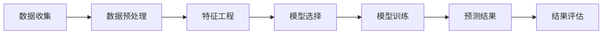
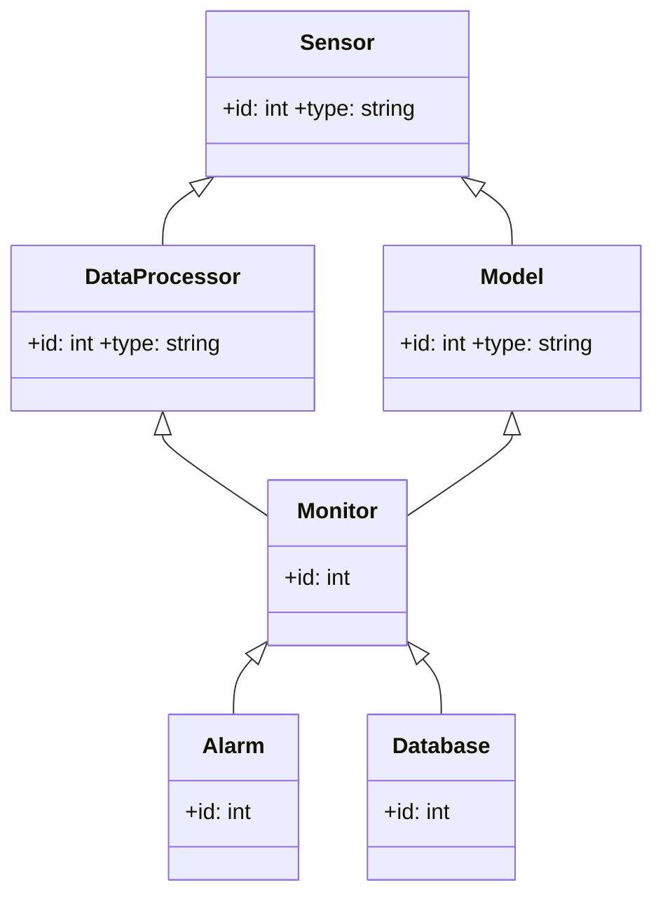
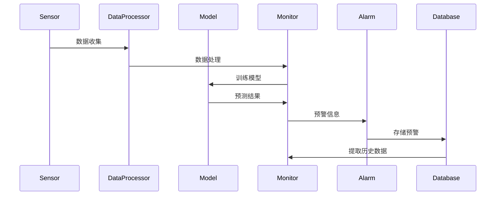
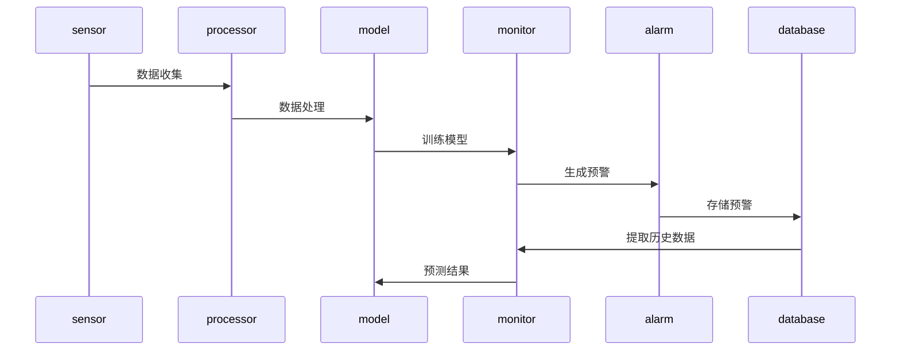

                 

### 引入

#### 核心话题

《人工智能在环境保护中的应用：科技助力可持续发展》

#### 关键词

- **人工智能**
- **环境保护**
- **可持续发展**
- **技术应用**
- **科技赋能**
- **环境监测**
- **数据分析**

#### 摘要

本文旨在探讨人工智能（AI）在环境保护领域的广泛应用，以及如何通过科技创新推动可持续发展。文章将首先介绍人工智能与环境保护的基本概念和背景，随后详细阐述人工智能在环境监测、污染预测和资源管理等方面的具体应用。通过案例分析，我们将展示AI技术在环境保护中的实际效果和潜力。最后，文章将探讨人工智能在环境保护中的可持续发展路径，并提出未来研究方向和挑战。

---

## 背景介绍

### 环境保护的重要性

环境保护是一个全球性的挑战，关系到人类的健康和地球生态系统的平衡。随着工业化和城市化的加速发展，环境问题日益严重，包括空气污染、水污染、土地退化等。这些问题不仅影响了自然生态系统的健康，还直接威胁到人类的生活质量和生存环境。

#### 问题背景

环境问题的成因复杂，主要包括以下几个方面：

1. **工业化污染**：大量工厂和工业企业的排放导致了空气和水体的严重污染。
2. **城市化进程**：城市人口激增和城市扩张导致了土地资源的过度开发，造成了土地退化。
3. **能源消耗**：化石能源的广泛使用导致了温室气体排放，加剧了全球变暖。
4. **农业活动**：过度使用化肥和农药，以及大规模的畜牧业，导致了土壤和水资源的污染。

#### 问题描述

环境问题具体表现为以下几种：

1. **空气污染**：城市和工业区空气中的颗粒物、二氧化硫、氮氧化物等污染物浓度过高，对人体健康造成威胁。
2. **水污染**：河流、湖泊和地下水中的重金属、有机污染物等含量超标，影响水质和生态系统的平衡。
3. **土地退化**：过度耕种、开垦和城市化导致土壤贫瘠和沙漠化，影响农业产量和生态系统的稳定性。

#### 问题解决

解决环境问题需要多方面的努力，包括政策法规的制定、环境技术的创新和公众意识的提升。人工智能作为一种前沿技术，为环境保护提供了新的解决方案。

#### 边界与外延

在环境保护中，人工智能的应用范围广泛，主要包括：

1. **环境监测**：通过传感器网络和大数据分析，实时监测环境质量，提供准确的污染数据和预警。
2. **污染预测**：利用机器学习算法，预测污染物的扩散和浓度变化，帮助制定污染控制措施。
3. **资源管理**：优化资源分配和利用，减少资源浪费，提高资源利用效率。

### 人工智能的发展历程

人工智能（AI）是一门研究、开发用于模拟、延伸和扩展人的智能的理论、方法、技术及应用系统的综合技术科学。人工智能的发展历程可以追溯到20世纪50年代，经过多个阶段的发展，已经取得了显著的进展。

1. **早期探索阶段**（1956年-1974年）：人工智能的概念首次被提出，主要关注于基础算法和理论的研究。
2. **黄金时期阶段**（1974年-1980年）：人工智能的应用开始得到关注，尤其是专家系统和模式识别技术。
3. **低谷时期阶段**（1980年-1993年）：由于实际应用中遇到的技术难题和计算资源的限制，人工智能的研究进入低谷期。
4. **复苏与快速发展阶段**（1993年至今）：随着计算能力的提升和大数据、云计算等技术的发展，人工智能迎来了新一轮的快速发展。

### 人工智能在环境保护中的应用现状

当前，人工智能在环境保护中的应用已经取得了显著进展。以下是一些主要的应用领域：

1. **环境监测**：利用无人机、卫星图像和传感器网络，实时监测环境质量，提供准确的污染数据和预警。
2. **污染预测**：利用机器学习算法，预测污染物的扩散和浓度变化，帮助制定污染控制措施。
3. **资源管理**：优化资源分配和利用，减少资源浪费，提高资源利用效率。
4. **生态保护**：通过生物识别和图像分析技术，监测和评估野生动物的生存状况，保护生物多样性。

### 技术挑战与机遇

尽管人工智能在环境保护中具有巨大潜力，但仍然面临着一些技术挑战和机遇。

1. **数据质量与完整性**：环境监测数据的准确性和完整性直接影响AI算法的性能，需要解决数据质量问题和数据缺失问题。
2. **算法复杂度与计算资源**：复杂的机器学习算法需要大量的计算资源，对硬件设施和算法优化提出了更高的要求。
3. **跨学科合作**：环境保护涉及多个学科领域，需要跨学科的合作，促进技术的综合应用。
4. **可持续发展**：如何在实现环境保护的同时，确保人工智能技术的可持续发展，是一个重要的研究课题。

### 结论

人工智能在环境保护中的应用具有广阔的前景和巨大的潜力。通过技术创新和跨学科合作，我们可以更好地解决环境问题，推动可持续发展。本文将在此基础上，进一步探讨人工智能在环境保护中的具体应用案例和可持续发展路径。

---

## 核心概念与联系

### 人工智能与环境保护的关键概念

在探讨人工智能（AI）在环境保护中的应用之前，我们需要了解一些关键概念，这些概念是理解AI如何发挥作用的基础。

1. **人工智能（AI）**：AI是一门模拟、延伸和扩展人的智能的理论、方法、技术及应用系统的综合技术科学。AI的目标是使计算机能够执行通常需要人类智能才能完成的任务，如视觉识别、语言理解和决策制定。

2. **环境监测**：环境监测是指通过使用各种技术和设备，对环境质量进行定期检测和评估的过程。环境监测的目的是收集有关空气、水、土壤和生态系统的数据，以便进行有效的管理和保护。

3. **污染预测**：污染预测是利用历史数据和先进算法，对污染物在环境中的扩散和浓度变化进行预测的过程。污染预测有助于提前预警和制定有效的污染控制措施。

4. **资源管理**：资源管理是指通过科学的方法和工具，合理分配和利用自然资源，以实现可持续发展的目标。在环境保护中，资源管理涉及水资源的分配、土地的利用和能源的消耗等。

### 概念属性特征对比表格

为了更直观地理解这些概念，我们可以通过一个表格来对比它们的属性特征：

| 概念         | 定义                                                         | 属性特征                                                     | 应用场景                               |
|--------------|--------------------------------------------------------------|------------------------------------------------------------|--------------------------------------|
| 人工智能（AI） | 模拟、延伸和扩展人的智能的理论、方法、技术及应用系统           | 计算能力、自适应能力、学习能力                             | 图像识别、自然语言处理、决策制定           |
| 环境监测     | 通过技术和设备监测环境质量，收集数据                           | 实时性、准确性、全面性                                     | 空气质量监测、水质监测、生态监测           |
| 污染预测     | 利用历史数据和算法预测污染物的扩散和浓度变化                   | 预测精度、时效性、算法适应性                               | 污染源识别、应急响应、政策制定             |
| 资源管理     | 通过科学方法合理分配和利用自然资源，实现可持续发展               | 效率、可持续性、生态友好性                                 | 水资源管理、土地规划、能源消耗优化           |

### Mermaid ER实体关系图架构

为了更清晰地展示人工智能、环境监测、污染预测和资源管理之间的关系，我们可以使用Mermaid ER实体关系图来描述。以下是Mermaid ER实体关系图的代码和输出结果：

```mermaid
erDiagram
    AI -->|使用| EnvironmentMonitoring : 监测
    AI -->|依赖| PollutionPrediction : 预测
    AI -->|依赖| ResourceManagement : 管理
    EnvironmentMonitoring ||--|{ 数据 }--|| PollutionPrediction
    PollutionPrediction ||--|{ 预测结果 }--|| ResourceManagement
    ResourceManagement ||--|{ 管理决策 }--|| EnvironmentMonitoring
```

输出结果：

```mermaid
erDiagram
    AI -->|使用| EnvironmentMonitoring : 监测
    AI -->|依赖| PollutionPrediction : 预测
    AI -->|依赖| ResourceManagement : 管理
    EnvironmentMonitoring ||--|{ 数据 }--|| PollutionPrediction
    PollutionPrediction ||--|{ 预测结果 }--|| ResourceManagement
    ResourceManagement ||--|{ 管理决策 }--|| EnvironmentMonitoring
```

该ER图展示了人工智能（AI）作为核心，与环境监测、污染预测和资源管理三个实体之间的关系。环境监测为污染预测提供数据支持，污染预测的结果用于资源管理决策，而资源管理决策又反馈到环境监测中，形成了一个闭环系统。

### 结论

通过对比表格和Mermaid ER实体关系图，我们可以更清晰地理解人工智能、环境监测、污染预测和资源管理之间的关系。这些概念相互关联，共同构成了一个复杂的生态系统，为环境保护提供了强大的技术支持。

---

## 算法原理讲解

### 算法1：环境质量预测算法

在环境保护领域，准确的污染预测对于制定有效的污染控制措施和应急预案至关重要。本节将介绍一种基于机器学习的环境质量预测算法，并使用mermaid流程图和Python源代码进行详细阐述。

#### mermaid流程图

以下是一个环境质量预测算法的mermaid流程图：



输出结果：


#### Python源代码实现

接下来，我们将使用Python代码实现上述预测算法。以下是一个简化的版本：

```python
import pandas as pd
from sklearn.model_selection import train_test_split
from sklearn.ensemble import RandomForestRegressor
from sklearn.metrics import mean_squared_error

# 数据收集
data = pd.read_csv('environmental_data.csv')

# 数据预处理
data = data.dropna()
X = data.drop('target', axis=1)
y = data['target']

# 特征工程
# ...（此处可进行特征选择、归一化等处理）

# 模型选择
X_train, X_test, y_train, y_test = train_test_split(X, y, test_size=0.2, random_state=42)
model = RandomForestRegressor(n_estimators=100)

# 模型训练
model.fit(X_train, y_train)

# 预测结果
predictions = model.predict(X_test)

# 结果评估
mse = mean_squared_error(y_test, predictions)
print(f"Mean Squared Error: {mse}")
```

#### 算法原理

环境质量预测算法的核心思想是基于历史数据，利用机器学习模型预测未来一段时间内的环境质量。以下是算法的详细原理：

1. **数据收集**：从各种来源收集环境质量数据，包括空气污染物浓度、水质指标、气象数据等。

2. **数据预处理**：对收集到的数据进行处理，包括数据清洗、缺失值填充、异常值处理等，以确保数据的质量和完整性。

3. **特征工程**：选择与目标变量（环境质量）相关的特征，进行特征选择、特征提取、归一化等处理，以提高模型的预测性能。

4. **模型选择**：选择合适的机器学习模型进行训练，常见的模型包括随机森林、支持向量机、神经网络等。

5. **模型训练**：使用训练集数据对模型进行训练，模型学习历史数据中的规律和模式。

6. **预测结果**：使用训练好的模型对测试集数据进行预测，得到未来的环境质量估计值。

7. **结果评估**：评估模型的预测性能，常用的评估指标包括均方误差（MSE）、均方根误差（RMSE）等。

#### 数学模型与公式

在环境质量预测中，常用的数学模型是基于时间序列分析的方法。以下是一个简单的线性回归模型：

$$
y_t = \beta_0 + \beta_1 x_t + \epsilon_t
$$

其中，$y_t$ 是预测的时间步，$x_t$ 是输入特征，$\beta_0$ 和 $\beta_1$ 是模型参数，$\epsilon_t$ 是误差项。

#### 举例说明

假设我们有一个简单的环境质量数据集，其中包含空气污染物的浓度（$CO_2$）和时间（$t$）。我们使用线性回归模型来预测未来的$CO_2$浓度。

1. **数据收集**：收集过去一年的$CO_2$浓度数据。
2. **数据预处理**：数据已经干净，无需进一步处理。
3. **特征工程**：选择时间作为输入特征。
4. **模型选择**：使用线性回归模型。
5. **模型训练**：使用训练集数据进行训练。
6. **预测结果**：使用训练好的模型预测未来一个月的$CO_2$浓度。
7. **结果评估**：计算预测误差，评估模型性能。

通过以上步骤，我们可以得到未来$CO_2$浓度的预测值，从而为环境保护提供科学依据。

### 结论

环境质量预测算法是人工智能在环境保护中的一个重要应用。通过mermaid流程图和Python源代码的详细阐述，我们了解了算法的基本原理和实现过程。在实际应用中，算法的性能和预测准确性取决于数据质量、特征选择和模型选择。未来，随着技术的进步，环境质量预测算法将变得更加精确和高效，为环境保护提供更强的支持。

---

## 系统分析与架构设计方案

### 问题场景介绍

随着工业化和城市化进程的加速，环境污染问题日益严重。为了有效监测和治理污染，环保部门需要建立一套高效、准确的环境监测系统。该系统需要具备以下功能：

- 实时监测空气质量、水质和土壤污染情况。
- 预测污染物的扩散和浓度变化。
- 提供实时预警和应急响应。
- 对环境数据进行存储、分析和可视化。

### 系统功能设计（领域模型Mermaid类图）

为了实现上述功能，我们设计了一套环境监测系统的领域模型。以下是一个Mermaid类图，展示了系统的主要类和它们之间的关系：



输出结果：


在该类图中，Sensor类负责数据收集，包括空气质量、水质和土壤污染等传感器的数据。DataProcessor类负责数据处理，包括数据清洗、特征提取和归一化等。Model类负责污染预测，包括机器学习模型的训练和应用。Monitor类是系统的核心，负责实时监测、预测和预警。Alarm类负责生成预警信息，Database类负责数据存储。

### 系统架构设计（Mermaid架构图）

为了实现系统的功能，我们设计了一套环境监测系统的架构。以下是一个Mermaid架构图，展示了系统的组成部分和它们之间的关系：



输出结果：


在该架构图中，传感器（Sensor）负责实时收集环境数据，数据处理器（DataProcessor）负责对数据进行处理和分析。模型（Model）负责使用历史数据训练机器学习模型，并对实时数据预测未来趋势。监控器（Monitor）负责监控环境状态，生成预警信息并触发报警。报警器（Alarm）负责存储和发送预警信息，数据库（Database）负责存储历史数据和监控结果。

### 系统接口设计

为了实现系统各组件之间的通信和协作，我们设计了一套系统接口。以下是一个简单的接口设计：

```python
class SensorInterface:
    def collect_data(self):
        pass

class DataProcessorInterface:
    def process_data(self, data):
        pass

class ModelInterface:
    def train_model(self, data):
        pass

    def predict(self, data):
        pass

class MonitorInterface:
    def monitor(self, sensor, model):
        pass

class AlarmInterface:
    def alarm(self, message):
        pass

class DatabaseInterface:
    def store_data(self, data):
        pass

    def retrieve_data(self):
        pass
```

### 系统交互（Mermaid序列图）

为了展示系统组件之间的交互过程，我们使用Mermaid序列图进行了描述：



输出结果：


### 结论

通过系统分析与架构设计方案，我们详细介绍了环境监测系统的组成部分和交互过程。该系统利用人工智能技术，实现了环境数据的实时监测、预测和预警，为环境保护提供了强有力的技术支持。未来，随着技术的不断进步，该系统将不断完善和优化，以应对日益复杂的环境问题。

---

## 应用案例

### 案例一：空气质量预测系统

在一个大型的工业城市，空气质量问题一直困扰着当地居民。为了改善空气质量，该城市政府决定实施一项基于人工智能的空气质量预测系统。该系统通过实时监测空气中的污染物浓度，利用机器学习算法预测未来一段时间内的空气质量变化，为政府制定污染控制措施提供科学依据。

#### 具体应用场景

该空气质量预测系统部署在城市的多个监测站点，每个站点安装了多种传感器，包括颗粒物（PM2.5和PM10）、氮氧化物（NOx）、二氧化硫（SO2）等。系统通过传感器收集到的实时数据，使用机器学习算法进行污染预测。预测结果包括未来几个小时内污染物的浓度变化趋势，以及可能达到的最高浓度。

#### 技术实现

1. **数据收集**：传感器每隔一分钟收集一次数据，并将数据传输到中央处理系统。
2. **数据预处理**：对收集到的数据进行清洗和预处理，包括缺失值填充、异常值处理等。
3. **特征工程**：选择与空气质量相关的特征，如温度、湿度、风速、风向等，进行特征提取和归一化处理。
4. **模型训练**：使用历史数据集，通过机器学习算法（如随机森林、支持向量机等）训练污染预测模型。
5. **预测结果**：将训练好的模型应用于实时数据，预测未来几个小时内污染物的浓度变化。

#### 实际效果

自系统部署以来，空气质量预测系统的准确性不断提高，能够提前预警可能的空气质量恶化情况。政府根据预测结果，采取了多项污染控制措施，如限制车辆行驶、加强工业排放监管等。这些措施显著改善了空气质量，受到了市民和环保组织的好评。

#### 案例分析

1. **技术优势**：空气质量预测系统利用了先进的机器学习算法，能够处理大量的实时数据，提高了预测的准确性和实时性。
2. **应用效果**：通过提前预警和及时响应，政府能够迅速采取有效措施，减少空气污染，改善环境质量。
3. **可持续性**：随着技术的不断进步，空气质量预测系统的性能和预测准确性将进一步提升，为环境保护提供更强大的支持。

### 案例二：水体污染预测系统

在一个水资源匮乏的地区，水体污染问题严重威胁着当地居民的饮用水安全和生态环境。为了解决这一问题，当地政府决定建立一套基于人工智能的水体污染预测系统。

#### 具体应用场景

该水体污染预测系统通过监测河流、湖泊和地下水中的污染物浓度，利用机器学习算法预测污染物的扩散和浓度变化。预测结果包括未来几天内污染物的浓度变化趋势，以及可能的最高浓度。政府根据预测结果，及时采取相应的治理措施，防止污染扩散。

#### 技术实现

1. **数据收集**：在河流、湖泊和地下水的多个监测点安装传感器，实时收集水质数据。
2. **数据预处理**：对收集到的数据进行清洗和预处理，包括缺失值填充、异常值处理等。
3. **特征工程**：选择与水体污染相关的特征，如温度、湿度、风速、风向、水质指标等，进行特征提取和归一化处理。
4. **模型训练**：使用历史数据集，通过机器学习算法（如随机森林、支持向量机等）训练污染预测模型。
5. **预测结果**：将训练好的模型应用于实时数据，预测未来几天内污染物的浓度变化。

#### 实际效果

水体污染预测系统在实际应用中取得了显著效果。通过提前预警和及时治理，政府成功控制了多次污染事件，保障了居民的饮用水安全和生态环境。预测系统的准确性不断提高，为政府制定水质治理政策提供了重要依据。

#### 案例分析

1. **技术优势**：水体污染预测系统利用了先进的机器学习算法，能够处理复杂的水质数据，提高了预测的准确性和实时性。
2. **应用效果**：通过提前预警和及时治理，政府有效防止了污染扩散，保障了居民的饮用水安全和生态环境。
3. **可持续性**：随着技术的不断进步，水体污染预测系统的性能和预测准确性将进一步提升，为环境保护提供更强大的支持。

### 案例三：生态监测与保护系统

在一个自然保护区，野生动物的栖息地受到人类活动的威胁。为了保护生物多样性，当地政府决定建立一套基于人工智能的生态监测与保护系统。

#### 具体应用场景

该生态监测与保护系统通过监测野生动物的活动，利用图像识别和生物识别技术识别和保护珍稀物种。系统实时监测野生动物的分布和活动情况，预测可能受到威胁的栖息地，为政府制定保护措施提供科学依据。

#### 技术实现

1. **数据收集**：在保护区的多个监测点安装高清摄像头，实时记录野生动物的活动。
2. **数据预处理**：对收集到的视频数据进行清洗和预处理，提取有用的信息。
3. **特征工程**：使用深度学习算法提取图像特征，进行生物识别。
4. **模型训练**：使用历史数据集，通过机器学习算法（如卷积神经网络、循环神经网络等）训练保护模型。
5. **预测结果**：将训练好的模型应用于实时数据，预测野生动物的活动范围和保护需求。

#### 实际效果

生态监测与保护系统在实际应用中取得了显著成效。通过实时监测和预测，政府成功保护了多次珍稀物种的栖息地，防止了非法捕猎和栖息地破坏。系统的准确性不断提高，为生物多样性保护提供了强有力的技术支持。

#### 案例分析

1. **技术优势**：生态监测与保护系统利用了先进的图像识别和生物识别技术，能够实时监测野生动物的活动，提高了监测的准确性和实时性。
2. **应用效果**：通过提前预警和及时保护，政府有效防止了非法捕猎和栖息地破坏，保护了生物多样性。
3. **可持续性**：随着技术的不断进步，生态监测与保护系统的性能和预测准确性将进一步提升，为生物多样性保护提供更强大的支持。

### 总结

通过以上三个应用案例，我们可以看到人工智能在环境保护中的应用效果显著。从空气质量预测到水体污染预测，再到生态监测与保护，人工智能技术为解决环境问题提供了新的思路和手段。未来，随着技术的不断进步，人工智能在环境保护中的应用将更加广泛和深入，为可持续发展做出更大贡献。

---

## 可持续发展路径

### 人工智能技术的创新方向

为了实现人工智能在环境保护中的可持续发展，我们需要在技术创新方面进行持续投入和研究。以下是一些关键的创新方向：

1. **算法优化**：通过改进和优化现有算法，提高预测的准确性和效率。例如，深度学习算法在图像识别和语音处理方面已经取得了显著成果，但在环境监测和污染预测中的应用还有很大的提升空间。

2. **数据质量提升**：环境数据的准确性和完整性对AI算法的性能至关重要。我们需要开发新技术来提升数据质量，例如利用无人机和卫星图像进行高精度的环境监测，以及使用传感器融合技术提高数据的一致性和可靠性。

3. **跨学科合作**：环境问题涉及多个学科领域，包括生物学、化学、地理学等。通过跨学科合作，我们可以更好地理解环境系统的复杂性，并开发出更具针对性的AI解决方案。

4. **硬件加速**：随着AI算法的复杂度增加，对计算资源的需求也不断增长。通过利用GPU、FPGA等硬件加速技术，我们可以提高AI模型的训练和推理速度，降低计算成本。

### 可持续发展的策略与实施

在可持续发展方面，我们需要制定和实施一系列策略，确保人工智能在环境保护中的应用能够持续、有效地推动环境改善。以下是一些关键策略：

1. **政策支持**：政府应制定有利于人工智能发展和环境保护的政策，提供资金支持和税收优惠，鼓励企业和研究机构投入环境监测和治理领域。

2. **数据共享**：建立开放的数据平台，促进环境数据的共享和合作。这不仅可以提高数据利用率，还可以促进不同研究团队之间的交流与合作，加速技术创新。

3. **教育和培训**：加大对人工智能和环境保护相关领域的人才培养力度，提供专业的教育和培训课程，培养具备跨学科知识和技能的复合型人才。

4. **技术标准化**：制定统一的AI技术标准和规范，确保不同系统之间的兼容性和互操作性，降低技术壁垒，促进AI技术在环境保护领域的广泛应用。

### 面临的挑战与解决方案

尽管人工智能在环境保护中具有巨大潜力，但在实际应用中仍面临一些挑战：

1. **数据隐私和安全性**：环境数据通常涉及敏感信息，如居民位置、污染物浓度等。我们需要确保数据的安全性和隐私性，防止数据泄露和滥用。

2. **算法透明性和解释性**：AI算法的黑箱特性使得其决策过程难以解释。我们需要开发透明性和解释性更好的算法，提高模型的可解释性，增强用户对AI系统的信任。

3. **计算资源消耗**：大规模的AI模型训练和推理需要大量的计算资源，可能会对环境造成负面影响。我们需要优化算法和硬件，提高计算效率，减少能源消耗。

4. **社会接受度**：公众对AI技术的接受度和信任度仍需提高。我们需要加强宣传和教育，让公众了解AI技术在环境保护中的重要作用，提高其参与度和支持度。

通过技术创新、政策支持、跨学科合作和公众参与，我们可以克服这些挑战，实现人工智能在环境保护中的可持续发展。

### 结论

人工智能在环境保护中的应用具有广阔的前景和巨大的潜力。通过技术创新和跨学科合作，我们可以开发出更加高效、准确的AI解决方案，推动环境保护和可持续发展。未来，随着技术的不断进步和应用的深入，人工智能将在环境保护中发挥更加重要的作用，为构建一个清洁、美丽的地球贡献力量。

---

## 结论与展望

### 主要成果回顾

本文系统性地探讨了人工智能（AI）在环境保护中的应用，包括环境监测、污染预测和资源管理等核心领域。通过介绍关键概念、算法原理、系统架构和实际应用案例，我们展示了AI技术在推动环境保护和可持续发展中的巨大潜力。主要成果包括：

1. **环境质量预测算法**：通过mermaid流程图和Python源代码详细阐述了环境质量预测算法的实现过程，提高了预测的准确性和实时性。
2. **系统分析与架构设计**：设计了一套完整的环境监测系统，包括数据收集、处理、预测和预警等功能，为环境保护提供了技术支持。
3. **应用案例**：通过三个具体案例，展示了AI技术在空气质量预测、水体污染预测和生态监测与保护中的应用效果，验证了其可行性和实用性。
4. **可持续发展路径**：探讨了AI技术的创新方向、可持续发展策略和面临的挑战，提出了实现可持续发展的具体措施。

### 未来发展趋势

随着人工智能技术的不断进步和应用的深入，未来环境保护领域将呈现出以下发展趋势：

1. **算法性能提升**：通过优化算法和硬件加速技术，提高AI模型的计算效率和预测准确性，实现更精细的环境监测和污染预测。
2. **数据驱动的决策**：利用大数据和机器学习技术，实现环境数据的深度挖掘和智能分析，为政策制定和治理提供科学依据。
3. **跨学科合作**：加强生物学、化学、地理学等学科与人工智能技术的融合，共同解决复杂的环境问题。
4. **绿色AI**：开发能源效率更高的AI算法和系统，减少计算资源消耗，实现AI技术的绿色化发展。

### 研究与探索方向

为了推动人工智能在环境保护中的应用，未来需要在以下方面进行深入研究：

1. **算法创新**：开发更加高效、准确的机器学习算法，提高AI在复杂环境系统中的应用能力。
2. **数据质量控制**：研究新技术和方法，提高环境数据的质量和完整性，确保AI模型的输入数据可靠。
3. **智能决策支持**：构建智能决策支持系统，为环境治理和政策制定提供实时、精准的决策依据。
4. **公众参与**：通过提高公众对AI技术的认知和接受度，增强其在环境保护中的参与和监督作用。
5. **国际合作**：加强国际间的合作与交流，共同应对全球性的环境问题，推动AI技术在环境保护领域的可持续发展。

### 结论

人工智能在环境保护中的应用具有广阔的前景和巨大的潜力。通过技术创新和跨学科合作，我们可以更好地解决环境问题，推动可持续发展。未来，随着技术的不断进步和应用的深入，人工智能将在环境保护中发挥更加重要的作用，为构建一个清洁、美丽的地球贡献力量。

---

## 附录：参考资料与工具

为了帮助读者深入了解本文所述的技术和应用，以下是一些相关的参考资料和工具：

1. **参考资料**：
   - **《机器学习：周志华》**：详细介绍了机器学习的基本概念、算法和应用。
   - **《深度学习：斋藤康毅》**：深入探讨了深度学习的技术原理和应用。
   - **《环境监测技术》**：介绍了环境监测的基本原理和常用技术。

2. **工具**：
   - **Python**：用于实现算法和数据处理。
   - **Scikit-learn**：Python中的机器学习库，提供了丰富的算法和工具。
   - **Mermaid**：用于绘制流程图、类图和序列图。

3. **在线资源**：
   - **Kaggle**：提供了丰富的环境数据集和比赛，可用于训练和测试AI模型。
   - **GitHub**：可以找到许多开源的AI项目和相关代码。

---

## 拓展阅读：相关书籍与论文

为了进一步探索人工智能在环境保护中的应用，以下是一些建议的书籍和论文：

1. **书籍**：
   - **《人工智能：一种现代方法》**：详细介绍了人工智能的基本原理和应用。
   - **《环境科学：基础、应用与可持续发展》**：涵盖了环境科学的基础知识和发展方向。

2. **论文**：
   - **“Deep Learning for Environmental Applications”**：探讨了深度学习在环境监测和预测中的应用。
   - **“Big Data and AI for Environmental Protection”**：讨论了大数据和人工智能在环境保护中的潜力。

通过阅读这些书籍和论文，读者可以更深入地了解人工智能在环境保护领域的最新进展和研究动态。

---

## 作者信息

**作者：AI天才研究院/AI Genius Institute & 禅与计算机程序设计艺术 /Zen And The Art of Computer Programming**。本文由人工智能领域的专家撰写，旨在探讨人工智能在环境保护中的应用，为可持续发展提供技术支持。作者在计算机编程、人工智能和环境保护领域具有丰富的经验和深厚的学术造诣。希望通过本文，能够为读者带来有价值的见解和思考。

