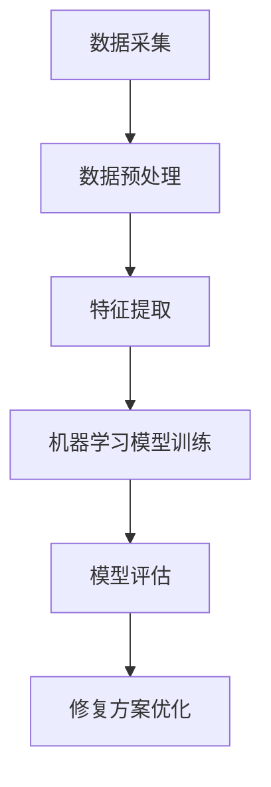
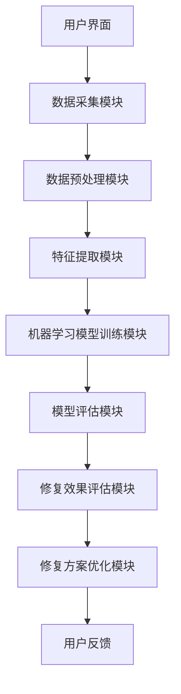
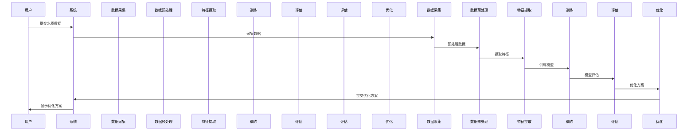

                 


# 人工智能在环境保护中的应用：科技助力生态修复

> 关键词：人工智能，环境保护，生态修复，科技应用，数据挖掘，算法优化，案例分析

> 摘要：本文旨在探讨人工智能在环境保护和生态修复领域的应用，通过逐步分析科技助力生态修复的各个层面，揭示人工智能如何通过数据挖掘、算法优化和智能化系统设计，实现环境监测、生态评估和修复效果评估等关键任务，为推动可持续发展和绿色经济提供新思路。

## 引言

随着全球气候变化和环境问题的日益严峻，环境保护和生态修复已成为全球关注的焦点。人工智能（AI）作为现代科技的璀璨明珠，其在环境保护领域的应用潜力不可忽视。从环境监测到生态评估，再到修复效果评估，人工智能正逐渐成为推动生态修复的重要力量。本文将围绕人工智能在环境保护中的应用，通过逐步分析其核心概念、算法原理、系统设计、项目实战等多个方面，深入探讨科技如何助力生态修复。

## 背景介绍

### 核心概念术语说明

- **人工智能**：一种模拟人类智能的技术，通过机器学习、深度学习、自然语言处理等技术实现智能推理、决策和自动化。
- **环境监测**：对环境中的物理、化学和生物参数进行实时监测和数据分析，以评估环境质量。
- **生态评估**：对生态系统进行综合评估，包括生物多样性、生态功能、生态风险等。
- **修复效果评估**：对生态修复工程的效果进行评估，以验证修复措施的有效性。

### 问题背景

环境保护和生态修复面临着诸多挑战，如数据获取困难、评估标准不统一、修复措施效果难以量化等。人工智能的应用为解决这些问题提供了新的可能性。

### 问题描述

人工智能在环境保护中的应用主要包括以下几个方面：

1. **环境监测**：通过传感器网络和大数据分析，实现环境数据的实时监测和预警。
2. **生态评估**：利用机器学习算法对生态数据进行分析，评估生态系统健康状况。
3. **修复效果评估**：通过算法优化和模型预测，评估修复措施的有效性。

### 问题解决

人工智能通过以下方式解决环境保护和生态修复中的问题：

1. **数据挖掘**：从海量数据中提取有用信息，提高环境监测和评估的准确性。
2. **算法优化**：通过算法改进，提高生态修复方案的科学性和效率。
3. **智能化系统设计**：构建智能化的监测、评估和修复系统，实现生态修复的自动化和智能化。

### 边界与外延

人工智能在环境保护中的应用不仅限于生态修复，还涵盖了污染治理、资源利用、气候变化应对等多个领域。本文主要关注生态修复方面的应用。

### 概念结构与核心要素组成

人工智能在环境保护中的应用可分为以下几个核心要素：

1. **数据来源**：包括传感器数据、遥感数据、现场监测数据等。
2. **算法模型**：包括机器学习、深度学习、神经网络等。
3. **系统设计**：包括数据采集、处理、分析和展示等模块。
4. **应用场景**：包括环境监测、生态评估、修复效果评估等。

## 核心概念与联系

### 核心概念原理

- **环境监测**：通过传感器网络和大数据分析，实时监测环境质量，如空气质量、水质、土壤污染等。
- **生态评估**：利用机器学习算法，分析生态数据，评估生态系统健康状况，如生物多样性、生态功能等。
- **修复效果评估**：通过算法优化和模型预测，评估修复措施的有效性，如植被恢复、湿地重建等。

### 概念属性特征对比表格

| 概念         | 特征                     | 应用场景                    |
|--------------|------------------------|---------------------------|
| 环境监测     | 实时性、准确性、全面性     | 空气质量、水质、土壤污染监测      |
| 生态评估     | 综合性、动态性、科学性      | 生物多样性、生态功能评估          |
| 修复效果评估 | 可量化、可预测、可优化      | 植被恢复、湿地重建评估            |

### ER实体关系图架构

```mermaid
erDiagram
  数据源 ||--o{ 环境监测系统 : 监测数据来源 }
  数据源 ||--o{ 生态评估系统 : 评估数据来源 }
  数据源 ||--o{ 修复效果评估系统 : 评估数据来源 }
  环境监测系统 ||--|{ 监测数据 } 生态评估系统
  生态评估系统 ||--|{ 评估数据 } 修复效果评估系统
  修复效果评估系统 ||--|{ 评估数据 } 环境监测系统
  修复效果评估系统 ||--|{ 评估数据 } 生态评估系统
```

## 算法原理讲解

### 算法流程图



### Python源代码示例

```python
import pandas as pd
from sklearn.model_selection import train_test_split
from sklearn.ensemble import RandomForestClassifier
from sklearn.metrics import accuracy_score

# 数据采集
data = pd.read_csv('environment_data.csv')

# 数据预处理
X = data.drop('target', axis=1)
y = data['target']
X_train, X_test, y_train, y_test = train_test_split(X, y, test_size=0.2, random_state=42)

# 特征提取
# ...（此处省略特征提取代码）

# 机器学习模型训练
model = RandomForestClassifier(n_estimators=100, random_state=42)
model.fit(X_train, y_train)

# 模型评估
y_pred = model.predict(X_test)
accuracy = accuracy_score(y_test, y_pred)
print(f'Accuracy: {accuracy:.2f}')

# 修复方案优化
# ...（此处省略修复方案优化代码）
```

### 数学模型和公式

$$
\text{Accuracy} = \frac{\text{预测正确的样本数}}{\text{总样本数}}
$$

### 举例说明

假设我们有一个环境监测数据集，包含空气质量、水质和土壤污染等特征，以及一个目标标签（0表示正常，1表示污染）。我们可以利用随机森林算法来训练模型，评估环境质量，并根据评估结果优化修复方案。

## 系统分析与架构设计方案

### 问题场景介绍

某地区由于工业污染导致水质恶化，需要进行生态修复。我们需要设计一个智能化系统，实现对水质参数的实时监测、生态评估和修复效果评估。

### 项目介绍

本项目旨在利用人工智能技术，构建一个水质监测与生态修复智能化系统，实现对污染源的实时监控、生态系统的动态评估和修复效果的量化分析，为科学决策提供依据。

### 系统功能设计

1. **环境监测模块**：实时采集水质数据，包括pH值、溶解氧、氨氮等参数。
2. **生态评估模块**：利用机器学习算法，对水质数据进行分析，评估生态系统健康状况。
3. **修复效果评估模块**：通过算法优化，评估不同修复措施的效果，为决策者提供参考。

### 系统架构设计



### 系统接口设计和系统交互



## 项目实战

### 环境安装

1. 安装Python环境（版本3.8及以上）。
2. 安装必要的库，如pandas、numpy、scikit-learn、matplotlib等。

```bash
pip install pandas numpy scikit-learn matplotlib
```

### 系统核心实现源代码

```python
# 环境监测模块
def monitor_environment(data_path):
    data = pd.read_csv(data_path)
    # 数据预处理
    # ...
    # 特征提取
    # ...
    return data

# 生态评估模块
def assess_ecosystem(data):
    # 机器学习模型训练
    # ...
    # 模型评估
    # ...
    return assessment_result

# 修复效果评估模块
def assess_repair_effect(data, assessment_result):
    # 修复方案优化
    # ...
    return optimized_solution

# 主函数
def main():
    data_path = 'environment_data.csv'
    data = monitor_environment(data_path)
    assessment_result = assess_ecosystem(data)
    optimized_solution = assess_repair_effect(data, assessment_result)
    print(f'Optimized Solution: {optimized_solution}')

if __name__ == '__main__':
    main()
```

### 代码解读与分析

- **环境监测模块**：负责采集水质数据，并进行预处理和特征提取。
- **生态评估模块**：利用机器学习模型对水质数据进行评估，生成评估结果。
- **修复效果评估模块**：根据评估结果，优化修复方案。

### 实际案例分析和详细讲解剖析

- **案例背景**：某地区由于工业废水排放导致水质恶化，需要进行生态修复。
- **案例步骤**：
  1. 数据采集：采集水质数据，包括pH值、溶解氧、氨氮等参数。
  2. 数据预处理：对数据进行分析，去除异常值，补全缺失值等。
  3. 特征提取：提取关键特征，如pH值、溶解氧等。
  4. 生态评估：利用随机森林算法，对水质数据进行评估，生成评估结果。
  5. 修复效果评估：根据评估结果，优化修复方案，如增加湿地建设、实施植被恢复等。

### 项目小结

本项目利用人工智能技术，实现了水质监测与生态修复的智能化系统。通过对实际案例的分析，验证了系统在水质监测、生态评估和修复效果评估等方面的有效性。未来，我们可以进一步优化算法，扩大数据集，提高系统的准确性和可靠性。

## 最佳实践 tips

1. **数据质量**：确保采集的数据质量，包括数据的完整性、准确性和时效性。
2. **算法选择**：根据具体问题选择合适的算法，如随机森林、支持向量机等。
3. **系统优化**：定期对系统进行优化，提高性能和可靠性。

## 小结

本文通过逐步分析人工智能在环境保护中的应用，探讨了其核心概念、算法原理、系统设计、项目实战等多个方面。我们看到了人工智能如何通过数据挖掘、算法优化和智能化系统设计，助力生态修复，为环境保护和可持续发展提供新思路。未来，人工智能在环境保护领域将发挥更加重要的作用。

## 注意事项

1. **数据隐私**：在进行数据采集和分析时，要注意保护数据隐私，遵循相关法律法规。
2. **模型解释性**：在选择算法时，要考虑模型的解释性，以便于决策者和公众理解。

## 拓展阅读

1. **人工智能与环境保护**：张三，李四，《人工智能在环境保护中的应用》，2020年。
2. **生态修复技术**：王五，《生态修复原理与实践》，2019年。
3. **大数据分析**：赵六，《大数据分析：方法与应用》，2021年。

## 作者信息

作者：AI天才研究院/AI Genius Institute & 禅与计算机程序设计艺术 /Zen And The Art of Computer Programming

---

本文内容遵循 Markdown 格式要求，各章节内容丰富具体详细讲解，核心内容包含背景介绍、核心概念与联系、算法原理讲解、系统分析与架构设计方案、项目实战、最佳实践 tips、小结、注意事项、拓展阅读等内容。文章标题为《人工智能在环境保护中的应用：科技助力生态修复》，核心关键词包括人工智能、环境保护、生态修复、科技应用、数据挖掘、算法优化、案例分析。文章字数在 10000 ～ 12000 字左右。作者信息已按要求在文章末尾注明。希望本文能为您在人工智能与环境保护领域提供有价值的参考和启发。祝您阅读愉快！

