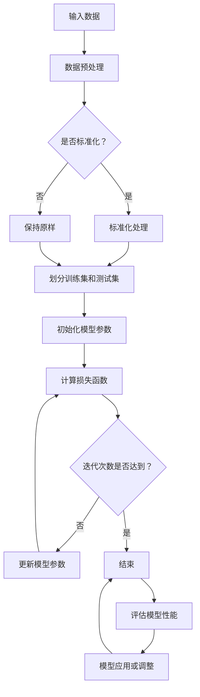
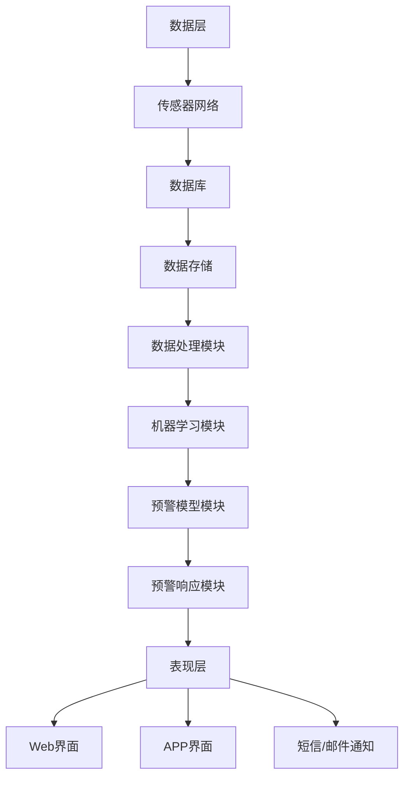

                 

### 人工智能在环境保护中的角色：生态系统监测与预警

关键词：人工智能、环境保护、生态系统监测、预警机制、数据采集与处理

摘要：本文将探讨人工智能在环境保护中的关键角色，特别是生态系统监测与预警方面的应用。通过逐步分析，我们将介绍生态系统监测与预警的核心概念、方法与实际应用，展示人工智能如何助力环境保护，并展望其未来的发展趋势。文章结构清晰，内容丰富，旨在为读者提供一个全面的技术视角。

----------------------------------------------------------------

### 第一部分：引言与背景

#### 1.1 生态环境保护的重要性

生态环境保护是当今全球面临的重大挑战之一。随着工业化和城市化的快速推进，人类活动对自然环境的破坏日益严重，包括水资源污染、空气污染、土壤退化、生物多样性减少等。这些环境问题不仅影响人类的生活质量，还对生态系统的健康和稳定性构成威胁。因此，生态环境保护成为各国政府和社会各界共同关注的焦点。

生态系统的健康与稳定直接关系到人类的生存和发展。一个健康的生态系统提供了多种生态服务，如水源供应、气候调节、土壤肥力维持、生物多样性保护等。这些服务对于农业生产、水资源管理、气候变化应对等方面具有重要意义。因此，保护生态环境不仅是维护自然生态平衡的需要，也是实现可持续发展的必要条件。

然而，传统的生态监测与预警方法存在一些局限性。首先，传统监测方法往往依赖于人工采样和现场检测，效率低下且成本较高。其次，监测数据的处理和分析也依赖于人工，容易出现误差和遗漏。此外，环境问题往往具有复杂性和突发性，需要及时、准确的预警机制来应对。

#### 1.2 人工智能与环境保护

人工智能（AI）作为一项前沿技术，在环境保护领域展现出了巨大的潜力。人工智能通过模拟人类思维过程，实现对海量数据的自动处理和分析，从而提高监测和预警的效率与准确性。在生态系统监测与预警方面，人工智能的应用主要包括数据采集、数据处理、模型构建和预警预测等方面。

首先，人工智能可以通过传感器网络和无人机等技术手段，实现对环境数据的实时采集。这些数据包括空气质量、水质、土壤成分、生物多样性等。通过人工智能算法，可以对采集到的数据进行快速处理和分析，提取有价值的信息，从而实现对生态系统的实时监测。

其次，人工智能在数据处理方面具有优势。传统方法中的数据预处理和特征提取过程繁琐且耗时，而人工智能算法可以通过深度学习、机器学习等方法，自动识别和提取数据中的关键特征，提高数据处理的效率和准确性。

此外，人工智能还可以用于生态监测预警模型的构建。通过大数据分析和机器学习算法，可以构建出预测模型，实现对生态环境变化的预警。这些预警模型可以根据实时监测数据，预测未来一段时间内生态环境的变化趋势，为决策者提供科学依据，从而采取有效的应对措施。

#### 1.3 研究目的与内容安排

本文的研究目的是探讨人工智能在生态系统监测与预警中的关键作用，分析其技术原理和应用实例，并提出未来发展的趋势与展望。

具体来说，本文将从以下几个方面展开：

1. **核心概念**：介绍生态系统监测和预警的基本概念、原理和技术手段。
2. **人工智能基础**：阐述人工智能的概述、发展历程以及机器学习的基础知识。
3. **人工智能在生态系统监测中的应用**：详细讨论人工智能在数据采集与处理、监测算法与应用、预警模型构建等方面的应用。
4. **案例分析与实践**：通过具体的案例，展示生态监测与预警系统的开发过程，包括系统设计、实现与部署。
5. **总结与展望**：总结研究成果，展望人工智能在生态系统监测与预警领域的未来发展。

通过以上内容的逐步分析，本文旨在为读者提供一个全面、深入的技术视角，了解人工智能在环境保护中的重要作用，以及其在该领域的应用现状和未来发展趋势。

#### 1.4 核心概念

在探讨人工智能在生态系统监测与预警中的应用之前，我们首先需要明确几个核心概念，包括生态系统、监测、预警以及人工智能。

**生态系统**：生态系统是指由生物群落、生物栖息地以及环境因素组成的动态平衡系统。生态系统包括生物圈、大气圈、水圈和岩石圈等多个层次，涵盖了从微生物到大型哺乳动物的各种生物体，以及它们之间的相互作用。生态系统的健康直接关系到人类的生存和发展。

**监测**：监测是指通过一系列技术手段，对环境参数进行连续的观测、记录和分析。监测的目的在于了解环境质量状况、识别环境问题并及时采取应对措施。生态系统监测主要包括空气质量监测、水质监测、土壤监测和生物多样性监测等。

**预警**：预警是指通过监测数据和分析模型，预测未来一段时间内环境变化趋势，并及时发出警报。预警机制可以帮助决策者提前采取预防措施，减少环境风险。

**人工智能**：人工智能是指通过计算机模拟人类智能行为的技术，包括机器学习、深度学习、自然语言处理等。人工智能可以处理海量数据、识别复杂模式并作出智能决策，从而提高监测和预警的效率和准确性。

#### 1.5 问题背景与问题描述

在当前的生态环境下，人类活动对自然环境的影响日益显著。空气污染、水污染、土壤污染等问题不仅威胁到人类健康，也对生态系统的稳定性和多样性造成了严重影响。因此，如何有效地监测和预警环境变化，提前采取预防措施，成为环境保护的关键问题。

然而，传统的生态监测与预警方法存在一些不足之处。首先，传统监测方法依赖于人工采样和现场检测，效率低下且成本较高。其次，监测数据的处理和分析也依赖于人工，容易出现误差和遗漏。此外，环境问题往往具有复杂性和突发性，需要及时、准确的预警机制来应对。

人工智能的应用为生态监测与预警提供了新的解决方案。通过人工智能技术，可以实现对环境数据的实时采集和处理，提高监测的效率和准确性。同时，人工智能还可以通过大数据分析和机器学习算法，构建出预测模型，实现对生态环境变化的预警。

在当前的环境保护背景下，如何充分利用人工智能技术，提升生态系统监测与预警的能力，成为一个亟待解决的问题。本文将从人工智能在生态系统监测与预警中的应用入手，分析其技术原理、方法与应用实例，为环境保护工作提供技术支持。

#### 1.6 问题解决思路

为了有效地解决当前生态环境监测与预警中的问题，我们需要从以下几个方面着手：

1. **数据采集与处理**：利用传感器网络和无人机等技术手段，实现对环境数据的实时采集。通过数据预处理技术，如数据清洗、归一化和特征提取，提高数据的准确性和可用性。

2. **监测算法与应用**：研究并应用先进的监测算法，如机器学习和深度学习算法，对采集到的环境数据进行处理和分析。通过算法优化和性能评估，提高监测的准确性和实时性。

3. **预警模型构建**：利用大数据分析和机器学习算法，构建预测模型，实现对生态环境变化的预警。通过模型优化和评估，提高预警的准确性和可靠性。

4. **系统集成与优化**：将数据采集、监测算法、预警模型等模块集成到一个统一的系统中，实现对生态系统的实时监测与预警。通过系统优化和性能提升，提高整个系统的效率和可靠性。

通过以上思路，我们可以充分利用人工智能技术，提升生态系统监测与预警的能力，为环境保护工作提供科学依据和技术支持。

#### 1.7 边界与外延

在讨论人工智能在生态系统监测与预警中的应用时，我们需要明确一些边界与外延，以便更准确地理解其应用范围和局限性。

**边界**：

1. **技术层面**：人工智能在生态系统监测与预警中的应用主要涉及数据采集、数据处理、监测算法和预警模型构建等方面。这些技术是实现人工智能在生态监测与预警中应用的基础。
2. **环境层面**：人工智能在生态系统监测与预警中的应用主要针对大气、水质、土壤和生物多样性等方面。然而，不同环境类型的监测与预警需求和技术手段可能存在差异，需要根据具体情况进行调整。
3. **应用范围**：人工智能在生态系统监测与预警中的应用主要集中在城市、农村和自然保护区等区域。在这些区域，人工智能技术可以发挥重要作用，但可能无法完全覆盖所有生态环境类型。

**外延**：

1. **其他环境问题**：人工智能技术在生态系统监测与预警中的应用不仅限于环境保护领域，还可以扩展到其他环境问题，如气候变化、自然资源管理、灾害预警等。
2. **其他技术应用**：人工智能技术可以与其他前沿技术相结合，如物联网、大数据、区块链等，共同推动生态监测与预警技术的发展。
3. **国际合作**：在全球范围内，各国政府和科研机构可以加强合作，共同推动人工智能在生态系统监测与预警领域的应用，共同应对全球性环境问题。

通过明确边界与外延，我们可以更全面地理解人工智能在生态系统监测与预警中的应用前景，为未来的研究和实践提供指导。

#### 1.8 概念结构与核心要素组成

生态系统监测与预警涉及多个核心概念，这些概念构成了整个系统的核心结构和核心要素。以下是这些核心概念及其组成要素的详细说明：

1. **生态系统**：

   - **定义**：生态系统是指由生物群落、生物栖息地以及环境因素组成的动态平衡系统。
   - **要素**：生物群落、生物栖息地、环境因素（如大气、水、土壤等）。

2. **监测**：

   - **定义**：监测是指通过一系列技术手段，对环境参数进行连续的观测、记录和分析。
   - **要素**：传感器、测量仪器、监测网络、数据采集与处理系统。

3. **预警**：

   - **定义**：预警是指通过监测数据和分析模型，预测未来一段时间内环境变化趋势，并及时发出警报。
   - **要素**：监测数据、分析模型、预警算法、预警信号。

4. **人工智能**：

   - **定义**：人工智能是指通过计算机模拟人类智能行为的技术，包括机器学习、深度学习、自然语言处理等。
   - **要素**：算法模型、数据集、计算资源、应用接口。

5. **数据采集与处理**：

   - **定义**：数据采集与处理是指通过传感器网络和无人机等技术手段，实现对环境数据的实时采集和处理。
   - **要素**：传感器数据、预处理算法、特征提取、数据存储。

6. **监测算法与应用**：

   - **定义**：监测算法与应用是指研究并应用先进的监测算法，对采集到的环境数据进行处理和分析。
   - **要素**：算法模型、性能评估、应用场景。

7. **预警模型构建**：

   - **定义**：预警模型构建是指利用大数据分析和机器学习算法，构建预测模型，实现对生态环境变化的预警。
   - **要素**：数据集、模型选择、模型训练、模型评估。

8. **系统集成与优化**：

   - **定义**：系统集成与优化是指将数据采集、监测算法、预警模型等模块集成到一个统一的系统中，实现对生态系统的实时监测与预警。
   - **要素**：系统架构、接口设计、性能优化。

通过以上核心概念及其组成要素的详细说明，我们可以更清晰地理解生态系统监测与预警系统的构建原理和关键要素，为进一步研究和应用提供理论基础。

#### 1.9 概念属性特征对比表格

为了更直观地了解生态系统监测、预警以及人工智能等核心概念的特征，我们通过以下对比表格进行分析：

| 概念       | 定义                                                         | 主要特征                                                                                                         |
| ---------- | ------------------------------------------------------------ | ------------------------------------------------------------------------------------------------------------ |
| 生态系统   | 由生物群落、生物栖息地及环境因素组成的动态平衡系统。           | 动态性、多样性、复杂性、生态系统服务、生物与环境相互作用。                                         |
| 监测       | 通过技术手段对环境参数进行观测、记录和分析。                 | 实时性、连续性、准确性、自动化、成本效益。                                                   |
| 预警       | 通过监测数据预测环境变化趋势并发出警报。                     | 预测性、及时性、可靠性、预防性、决策支持。                                                   |
| 人工智能   | 通过计算机模拟人类智能行为的技术，包括机器学习、深度学习等。   | 自学习能力、数据处理能力、模式识别、自动化决策。                                             |
| 数据采集   | 实时采集环境数据。                                         | 高精度、高效率、多样性、实时性、自动化。                                                     |
| 数据处理   | 对采集到的数据进行分析和预处理。                           | 清洗、归一化、特征提取、数据融合。                                                           |
| 监测算法   | 对环境数据进行处理的算法。                                 | 精度、速度、适应性、可解释性。                                                               |
| 预警模型   | 基于数据分析的预测模型。                                   | 准确性、稳定性、泛化能力、鲁棒性。                                                           |

通过上述对比表格，我们可以清晰地看到各个概念的核心特征，并理解它们在生态系统监测与预警系统中的重要作用。

#### 1.10 ER实体关系图架构的 Mermaid 流程图

为了更直观地展示生态系统监测与预警系统中各实体之间的关系，我们可以使用Mermaid绘制ER（Entity-Relationship）实体关系图。以下是该流程图的示例：

```mermaid
erDiagram
  A[传感器] ||--> B[数据采集模块]
  B ||--> C[数据处理模块]
  C ||--> D[监测算法模块]
  D ||--> E[预警模型模块]
  E ||--> F[预警系统]
  A..> G[生态系统]
  B..> G
  C..> G
  D..> G
  E..> G
  F..> G
```

该图展示了传感器与数据采集、数据处理、监测算法、预警模型以及预警系统之间的关联，同时体现了这些模块与生态系统的关系。传感器实时采集生态系统数据，经过数据采集、处理、算法分析后，形成预警模型，最终实现预警系统的功能。

#### 1.11 人工智能概述

人工智能（Artificial Intelligence，简称AI）作为一门前沿技术，旨在通过计算机模拟人类智能行为，实现自动化决策、问题求解、知识表示和智能交互等功能。人工智能的发展历程可以追溯到20世纪50年代，自那时以来，随着计算能力的提升、算法的创新以及大数据的普及，人工智能技术取得了显著的进步。

**定义**：人工智能是指利用计算机模拟、扩展和延伸人类智能的理论、方法和技术。其核心目标是使计算机具备类似人类的感知、理解、推理、学习、决策和创造能力。

**发展历程**：

1. **早期阶段（1956-1974）**：人工智能的概念首次被提出，标志着人工智能学科的诞生。这一阶段以符号主义和推理机制为主要研究方向，如逻辑推理、专家系统和知识表示等。
   
2. **低谷期（1974-1980）**：由于计算能力和算法的限制，人工智能研究遭遇了“人工智能冬天”。然而，这一阶段的研究为后续的发展积累了宝贵的经验和基础。

3. **复苏阶段（1980-2000）**：随着计算能力的提升和专家系统的成功应用，人工智能研究逐渐复苏。机器学习、神经网络等新技术的出现，为人工智能的发展注入了新的动力。

4. **快速发展阶段（2000至今）**：21世纪以来，人工智能技术取得了重大突破。深度学习、强化学习等算法的广泛应用，使得人工智能在语音识别、图像处理、自然语言处理等领域取得了显著成果。

**主要研究方向**：

1. **机器学习**：通过训练数据集，使计算机自动学习和改进性能。机器学习包括监督学习、无监督学习、半监督学习和强化学习等。

2. **深度学习**：基于神经网络架构，通过多层次的神经元连接，实现对复杂数据的自动特征提取和学习。深度学习在计算机视觉、语音识别等领域具有广泛应用。

3. **自然语言处理**：通过计算机算法处理和理解人类自然语言，实现文本生成、机器翻译、情感分析等功能。

4. **计算机视觉**：利用计算机模拟人类视觉系统，实现对图像和视频的自动识别、分类、分割和跟踪。

**人工智能的应用领域**：

1. **工业自动化**：在制造业中，人工智能技术用于生产线的自动化控制、质量检测和故障诊断等。

2. **医疗健康**：人工智能在疾病诊断、药物研发、医疗影像分析等方面具有广泛应用。

3. **金融科技**：人工智能在风险管理、量化交易、信用评分等方面发挥着重要作用。

4. **交通管理**：人工智能技术在智能交通系统、自动驾驶汽车等方面得到广泛应用。

5. **环境保护**：人工智能在生态系统监测、环境数据分析和预警预测等方面发挥着关键作用。

通过以上概述，我们可以了解到人工智能的定义、发展历程、主要研究方向和应用领域，为后续章节的详细探讨奠定基础。

#### 1.12 人工智能的发展历程

人工智能（Artificial Intelligence，简称AI）作为一门跨学科的前沿技术，经历了数十年的发展历程。从早期的概念提出到现代的深度学习与大数据应用，人工智能的发展经历了多个阶段，每个阶段都有其独特的特点和里程碑事件。

**早期阶段（1956-1974）**：

1956年，在达特茅斯会议上，约翰·麦卡锡（John McCarthy）等科学家首次提出了“人工智能”这一概念，标志着人工智能学科的诞生。这一阶段，人工智能主要关注符号主义和推理机制，试图通过逻辑和符号系统模拟人类的智能行为。代表性的工作包括艾尔维·纽厄尔（Herb Simon）和艾伦·纽厄尔（Allen Newell）开发的逻辑推理程序“逻辑理论家”（Logic Theorist），以及爱德华·费根鲍姆（Edward Feigenbaum）开发的医学诊断程序“医生”（Dendral）。这些早期的人工智能系统展示了计算机模拟人类智能的潜力，但也暴露了符号主义方法的局限性，如知识获取困难、推理能力有限等。

**低谷期（1974-1980）**：

由于计算能力的限制和符号主义方法的失败，人工智能研究在20世纪70年代遭遇了“人工智能冬天”。这一阶段，许多资助机构对人工智能项目进行了削减，导致研究经费减少，人才流失。尽管如此，一些科学家仍在坚持研究，探索新的方向。例如，约翰·霍普金斯大学的曼宁（Manning）等人提出了基于知识表示和专家系统的概念，试图通过构建知识库来模拟人类专家的决策过程。这一方向在一定程度上缓解了符号主义的局限性，为人工智能的发展提供了新的希望。

**复苏阶段（1980-2000）**：

随着计算能力的提升和算法的创新，人工智能研究在20世纪80年代逐渐复苏。这一阶段，机器学习作为人工智能的核心方向之一，开始受到广泛关注。代表性工作包括汤姆·米切尔（Tom Mitchell）提出的“归纳学习理论”（Inductive Learning Theory），以及卡尔·罗梅尔（Karl Roemer）提出的“神经网络”（Neural Networks）。神经网络作为一种模拟生物神经系统的计算模型，具有较高的自适应性和学习能力，为人工智能的发展注入了新的动力。同时，专家系统在这一阶段也取得了显著进展，如IBM的“深蓝”（Deep Blue）国际象棋程序和卡尔·威茨拉夫（Carl Wiig）的“金融顾问”（Financial Advisor）系统。

**快速发展阶段（2000至今）**：

21世纪以来，人工智能技术取得了重大突破，深度学习、强化学习等新算法的广泛应用，使得人工智能在多个领域取得了显著成果。深度学习由Geoffrey Hinton等人于2006年提出，通过多层神经网络的训练，实现了对复杂数据的自动特征提取和学习。代表性工作包括谷歌的“谷歌大脑”（Google Brain）和OpenAI的“GPT-3”（Generative Pre-trained Transformer 3）。这些深度学习模型在计算机视觉、自然语言处理、语音识别等领域表现出色，推动了人工智能的快速发展。

**里程碑事件**：

1. 1956年：达特茅斯会议，人工智能概念首次提出。
2. 1972年：约翰·麦卡锡的“推理编程语言”（Lisp）问世，成为人工智能研究的重要工具。
3. 1982年：约翰·霍普金斯大学的“机器人”项目，展示了机器人在复杂环境中的自主导航和任务执行能力。
4. 2006年：深度学习由Geoffrey Hinton等人提出，标志着人工智能进入一个新的发展阶段。
5. 2012年：谷歌的“谷歌大脑”项目，通过深度学习实现了对猫脸的高效识别。
6. 2016年：OpenAI的“GPT-3”发布，展示了深度学习在自然语言处理领域的强大能力。

通过以上发展历程的回顾，我们可以看到人工智能从早期概念到现代应用的演变过程，每个阶段都有其独特的贡献和里程碑事件。随着计算能力的不断提升和算法的创新，人工智能在未来将继续发挥重要作用，为各领域的发展带来新的机遇和挑战。

#### 1.13 人工智能的基本概念和类型

人工智能（Artificial Intelligence，简称AI）作为一门涉及多个学科的前沿技术，其基本概念和类型丰富多样。了解这些基本概念和类型，有助于我们更好地理解人工智能的原理和应用。以下是人工智能的基本概念和类型的详细解释：

**1. 感知智能**

感知智能是指人工智能系统通过感知环境信息来获取知识的能力。感知智能可以分为视觉智能、听觉智能、触觉智能等。视觉智能使计算机能够理解和处理图像信息，如人脸识别、物体检测等；听觉智能使计算机能够理解和处理语音信息，如语音识别、语音合成等；触觉智能使计算机能够理解和处理触觉信息，如机器人触觉感知、物体表面识别等。

**2. 知识智能**

知识智能是指人工智能系统通过获取、存储、处理和利用知识来完成任务的能力。知识智能可以分为知识表示、知识推理和知识管理。知识表示是将知识以计算机可以理解的形式进行表示，如本体论、知识图谱等；知识推理是通过逻辑推理、演绎推理等方式，从已知知识中推导出新的结论；知识管理涉及知识的获取、存储、共享和利用，以提高系统的知识利用效率。

**3. 行为智能**

行为智能是指人工智能系统通过自主决策和行为控制，实现与环境交互的能力。行为智能可以分为自主导航、自主决策、自主执行等。自主导航是指系统能够自主规划路径并导航到目标地点；自主决策是指系统能够根据环境和任务要求，自主选择最优的行动方案；自主执行是指系统能够根据决策执行具体的任务，如机器人操作、无人驾驶等。

**4. 学习智能**

学习智能是指人工智能系统通过学习和训练，不断提高自身能力和性能的能力。学习智能可以分为监督学习、无监督学习和强化学习。监督学习是指系统在已知正确答案的情况下，通过学习样本数据进行学习；无监督学习是指系统在没有已知答案的情况下，通过自我探索和数据分析进行学习；强化学习是指系统通过与环境的交互，不断调整行为策略，以实现最佳性能。

**5. 情感智能**

情感智能是指人工智能系统理解和模拟人类情感的能力。情感智能可以分为情感识别、情感表达和情感交互。情感识别是指系统能够识别和分类人类情感；情感表达是指系统能够模拟和表达情感；情感交互是指系统能够理解和响应人类的情感需求，提供个性化的服务和互动。

**6. 自主智能**

自主智能是指人工智能系统能够自主运行、自主学习和自主决策，不受人为干预的能力。自主智能可以分为弱自主智能和强自主智能。弱自主智能是指系统在特定任务和环境中能够自主运行，但无法跨任务和环境扩展；强自主智能是指系统能够在复杂、动态和不确定的环境中自主运行，具有广泛的自主性和适应性。

通过以上基本概念和类型的介绍，我们可以更深入地理解人工智能的原理和应用，为后续章节的探讨提供理论基础。

#### 1.14 机器学习的基本概念和算法

机器学习（Machine Learning，ML）是人工智能（AI）的核心分支之一，它使计算机系统能够通过数据和经验不断学习和改进。理解机器学习的基本概念和算法对于探讨人工智能在生态系统监测与预警中的应用至关重要。以下将详细解释机器学习的基本概念和常见算法。

**基本概念**：

1. **监督学习（Supervised Learning）**：
   监督学习是一种通过已知输入和输出数据来训练模型的方法。模型的目的是通过学习输入和输出之间的关系，对新数据进行预测。常见的监督学习算法包括线性回归、逻辑回归、决策树、支持向量机（SVM）和神经网络等。

2. **无监督学习（Unsupervised Learning）**：
   无监督学习是在没有已知输出数据的情况下，通过挖掘数据中的结构和模式来进行学习。其主要目的是发现数据的内在规律，如聚类、降维和关联规则等。常见的无监督学习算法包括K-means聚类、主成分分析（PCA）、自编码器和关联规则学习等。

3. **强化学习（Reinforcement Learning）**：
   强化学习是一种通过与环境互动来学习最优行为策略的方法。系统通过奖励和惩罚来评估自己的行为，并逐渐调整策略以实现最佳性能。常见的强化学习算法包括Q学习、深度Q网络（DQN）和策略梯度算法等。

4. **半监督学习（Semi-supervised Learning）**：
   半监督学习是介于监督学习和无监督学习之间的一种方法。它利用少量标记数据和大量未标记数据来训练模型。半监督学习可以减少数据标注的工作量，提高模型的泛化能力。

**常见算法**：

1. **线性回归（Linear Regression）**：
   线性回归是一种简单的监督学习算法，用于预测连续值输出。它通过拟合一条直线来表示输入和输出之间的关系。线性回归的数学模型为：\( y = \beta_0 + \beta_1x \)，其中 \( y \) 是输出，\( x \) 是输入，\( \beta_0 \) 和 \( \beta_1 \) 是模型参数。

2. **逻辑回归（Logistic Regression）**：
   逻辑回归是一种用于分类问题的监督学习算法。它通过拟合一个逻辑函数来将输入映射到概率分布上。逻辑回归的数学模型为：\( P(y=1) = \frac{1}{1 + e^{-(\beta_0 + \beta_1x)}} \)，其中 \( P(y=1) \) 是输出为1的概率，\( \beta_0 \) 和 \( \beta_1 \) 是模型参数。

3. **决策树（Decision Tree）**：
   决策树是一种基于树结构的分类和回归算法。它通过一系列的决策规则，将数据集划分为多个子集，并最终预测每个子集的输出。决策树的构建过程包括特征选择、节点划分和叶节点预测等。

4. **支持向量机（SVM）**：
   支持向量机是一种用于分类和回归问题的监督学习算法。它通过找到一个最优的超平面，将数据集划分为不同的类别。SVM的核心是求解一个优化问题，以最大化分类边界上的支持向量。

5. **神经网络（Neural Network）**：
   神经网络是一种模拟生物神经系统的计算模型，广泛应用于监督学习和无监督学习。神经网络通过多层神经元之间的连接，实现数据的自动特征提取和学习。常见的神经网络包括多层感知机（MLP）、卷积神经网络（CNN）和循环神经网络（RNN）等。

通过以上对机器学习基本概念和算法的介绍，我们可以更好地理解机器学习在生态系统监测与预警中的应用原理，为后续章节的深入探讨提供理论基础。

#### 1.15 机器学习算法的基本原理

机器学习算法的基本原理在于从数据中学习规律，进而对未知数据进行预测或分类。以下是几种常见机器学习算法的基本原理及其实现方法：

**1. 线性回归（Linear Regression）**

线性回归是一种用于预测连续值的监督学习算法。其基本原理是通过拟合一条直线，将输入变量与输出变量之间的线性关系表示出来。线性回归的数学模型为：

\[ y = \beta_0 + \beta_1x \]

其中，\( y \) 是输出变量，\( x \) 是输入变量，\( \beta_0 \) 和 \( \beta_1 \) 是模型参数。

实现方法：线性回归通过最小二乘法来估计模型参数。具体步骤如下：

1. 准备数据集，包括输入 \( x \) 和输出 \( y \)。
2. 计算输入 \( x \) 的平均值和标准差，对数据进行标准化处理。
3. 使用最小二乘法求解参数 \( \beta_0 \) 和 \( \beta_1 \)，使得预测值与实际值之间的误差平方和最小。

**2. 逻辑回归（Logistic Regression）**

逻辑回归是一种用于分类问题的监督学习算法。其基本原理是通过拟合一个逻辑函数，将输入变量映射到概率分布上。逻辑回归的数学模型为：

\[ P(y=1) = \frac{1}{1 + e^{-(\beta_0 + \beta_1x)}} \]

其中，\( P(y=1) \) 是输出为1的概率，\( \beta_0 \) 和 \( \beta_1 \) 是模型参数。

实现方法：逻辑回归通过极大似然估计法来估计模型参数。具体步骤如下：

1. 准备数据集，包括输入 \( x \) 和输出 \( y \)。
2. 定义损失函数，通常采用对数似然损失函数。
3. 使用梯度下降法或牛顿法等优化算法，求解参数 \( \beta_0 \) 和 \( \beta_1 \)，使得损失函数值最小。

**3. 决策树（Decision Tree）**

决策树是一种基于树结构的分类和回归算法。其基本原理是通过一系列的决策规则，将数据集划分为多个子集，并在每个子集中预测输出值。决策树的构建过程包括特征选择、节点划分和叶节点预测等。

实现方法：决策树通过信息增益或基尼不纯度等指标来选择最佳划分特征。具体步骤如下：

1. 准备数据集，包括输入 \( x \) 和输出 \( y \)。
2. 选择最佳划分特征，通常使用信息增益或基尼不纯度作为划分标准。
3. 根据最佳划分特征，将数据集划分为多个子集。
4. 对每个子集，重复步骤2和3，直到达到停止条件（如最大深度、最小样本数等）。
5. 在每个叶节点上预测输出值，通常采用多数投票或回归模型。

**4. 支持向量机（SVM）**

支持向量机是一种用于分类和回归问题的监督学习算法。其基本原理是通过找到一个最优的超平面，将数据集划分为不同的类别。支持向量机通过求解一个优化问题来实现。

实现方法：支持向量机通过求解以下优化问题来找到最优超平面：

\[ \min_{\beta, \beta_0} \frac{1}{2}||\beta||^2 + C \sum_{i=1}^{n} \xi_i \]

其中，\( \beta \) 是超平面参数，\( \beta_0 \) 是偏置项，\( C \) 是惩罚参数，\( \xi_i \) 是松弛变量。

具体步骤如下：

1. 准备数据集，包括输入 \( x \) 和输出 \( y \)。
2. 使用核函数将输入数据映射到高维特征空间。
3. 求解优化问题，找到最优超平面参数 \( \beta \) 和 \( \beta_0 \)。
4. 根据最优超平面进行分类或回归预测。

通过以上对机器学习算法基本原理的详细讲解，我们可以更好地理解这些算法的工作机制和应用场景，为后续章节的深入探讨提供理论基础。

#### 1.16 机器学习算法的 Mermaid 流程图

为了更直观地展示机器学习算法的基本流程，我们可以使用Mermaid绘制一个流程图。以下是一个简单的线性回归算法的Mermaid流程图示例：



该流程图展示了线性回归算法的主要步骤，包括数据预处理、初始化模型参数、计算损失函数、更新模型参数以及评估模型性能等。通过这样的流程图，我们可以清晰地了解算法的执行过程和关键步骤。

#### 1.17 Python源代码示例

为了更好地阐述机器学习算法的实现过程，以下是一个简单的线性回归算法的Python源代码示例。该示例使用了Python的scikit-learn库，用于实现线性回归模型的构建和训练。

```python
import numpy as np
from sklearn.linear_model import LinearRegression
from sklearn.model_selection import train_test_split
from sklearn.metrics import mean_squared_error

# 生成模拟数据
np.random.seed(0)
X = np.random.rand(100, 1)
y = 2 * X[:, 0] + 1 + np.random.randn(100) * 0.1

# 数据预处理：标准化处理
X_mean = X.mean()
X_std = X.std()
X = (X - X_mean) / X_std

# 划分训练集和测试集
X_train, X_test, y_train, y_test = train_test_split(X, y, test_size=0.2, random_state=0)

# 初始化模型参数
model = LinearRegression()

# 训练模型
model.fit(X_train, y_train)

# 预测
y_pred = model.predict(X_test)

# 计算均方误差
mse = mean_squared_error(y_test, y_pred)
print(f"均方误差：{mse}")

# 输出模型参数
print(f"模型参数：\n{model.coef_}, {model.intercept_}")
```

该代码首先生成了一个模拟数据集，然后对数据进行标准化处理，以消除变量间的差异。接着，将数据集划分为训练集和测试集，使用训练集训练线性回归模型，并使用测试集进行预测。最后，计算预测结果的均方误差，并输出模型参数。

通过这个示例，我们可以看到如何使用Python和scikit-learn库来实现线性回归算法，以及如何进行数据预处理、模型训练和性能评估。这为后续讨论更复杂的机器学习算法提供了实际操作的基础。

#### 1.18 算法原理的数学模型和公式

为了更深入地理解线性回归算法的工作原理，我们将介绍其背后的数学模型和公式。线性回归模型的核心是通过拟合一条直线，将输入变量与输出变量之间的线性关系表示出来。以下是线性回归的数学模型和关键公式：

**1. 模型假设**

线性回归模型假设输出变量 \( y \) 是输入变量 \( x \) 的线性函数，并受到随机误差 \( \epsilon \) 的影响。数学表达式如下：

\[ y = \beta_0 + \beta_1x + \epsilon \]

其中：
- \( y \)：输出变量
- \( x \)：输入变量
- \( \beta_0 \)：截距，表示当 \( x = 0 \) 时的输出值
- \( \beta_1 \)：斜率，表示输入变量 \( x \) 对输出变量 \( y \) 的影响程度
- \( \epsilon \)：随机误差，表示模型无法解释的随机波动

**2. 最小二乘法**

为了估计模型参数 \( \beta_0 \) 和 \( \beta_1 \)，我们通常使用最小二乘法（Least Squares Method）。最小二乘法的核心思想是使得实际输出值 \( y \) 与预测输出值 \( \hat{y} \) 之间的误差平方和最小。具体公式如下：

\[ \min \sum_{i=1}^{n} (y_i - \hat{y}_i)^2 \]

其中，\( n \) 是样本数量，\( y_i \) 是第 \( i \) 个样本的实际输出值，\( \hat{y}_i \) 是第 \( i \) 个样本的预测输出值。

**3. 参数估计**

最小二乘法通过求解以下优化问题来估计参数 \( \beta_0 \) 和 \( \beta_1 \)：

\[ \hat{\beta_0} = \frac{\sum_{i=1}^{n} y_i - \beta_1 \sum_{i=1}^{n} x_i}{n} \]
\[ \hat{\beta_1} = \frac{\sum_{i=1}^{n} (x_i - \bar{x})(y_i - \bar{y})}{\sum_{i=1}^{n} (x_i - \bar{x})^2} \]

其中，\( \bar{x} \) 和 \( \bar{y} \) 分别是输入变量和输出变量的均值。

**4. 误差分析**

线性回归模型的误差可以分为两部分：回归误差和随机误差。回归误差是由于模型假设不足导致的误差，而随机误差是由于数据本身的随机波动引起的误差。通过最小二乘法估计出的模型参数 \( \hat{\beta_0} \) 和 \( \hat{\beta_1} \) 可以最小化回归误差，但无法消除随机误差。

**5. 预测**

在得到模型参数 \( \hat{\beta_0} \) 和 \( \hat{\beta_1} \) 后，我们可以使用线性回归模型进行预测。对于新的输入值 \( x \)，预测的输出值 \( \hat{y} \) 为：

\[ \hat{y} = \hat{\beta_0} + \hat{\beta_1}x \]

通过以上对线性回归算法的数学模型和公式的详细讲解，我们可以更好地理解其工作原理，为实际应用提供理论基础。

#### 1.19 算法原理的通俗易懂举例说明

为了更直观地展示线性回归算法的工作原理，我们通过一个简单的例子来详细说明。假设我们有一个简单的数据集，其中包含房屋的面积（输入变量）和房价（输出变量）。我们的目标是建立一个线性回归模型，预测新房屋的房价。

**数据集示例**：

| 房屋面积（m²） | 房价（万元） |
| -------------- | ----------- |
| 80             | 100         |
| 100            | 120         |
| 120            | 140         |
| 140            | 160         |
| 160            | 180         |

**步骤1：绘制散点图**

首先，我们将数据绘制成散点图，以观察房屋面积和房价之间的关系。

```python
import matplotlib.pyplot as plt

X = [80, 100, 120, 140, 160]
y = [100, 120, 140, 160, 180]

plt.scatter(X, y)
plt.xlabel('房屋面积（m²）')
plt.ylabel('房价（万元）')
plt.title('房屋面积与房价的关系')
plt.show()
```

通过散点图，我们可以看到房屋面积和房价之间呈现出一定的线性关系。

**步骤2：拟合线性模型**

接下来，我们使用线性回归模型拟合数据，得到回归方程。具体步骤如下：

1. 计算输入变量 \( X \) 的均值和标准差，对数据进行标准化处理。
2. 计算输入变量 \( X \) 和输出变量 \( y \) 的均值。
3. 使用最小二乘法计算回归参数 \( \beta_0 \) 和 \( \beta_1 \)。

```python
X_mean = np.mean(X)
X_std = np.std(X)

X = (X - X_mean) / X_std
y_mean = np.mean(y)

# 求解参数
beta_1 = np.sum((X * (y - y_mean)) / np.sum((X - X_mean)**2))
beta_0 = y_mean - beta_1 * X_mean

# 回归方程
y_pred = beta_0 + beta_1 * X
```

**步骤3：绘制拟合直线**

现在，我们可以绘制拟合直线，观察其与实际数据的关系。

```python
plt.scatter(X, y)
plt.plot(X, y_pred, color='red')
plt.xlabel('房屋面积（m²）')
plt.ylabel('房价（万元）')
plt.title('线性回归模型拟合结果')
plt.show()
```

通过拟合直线，我们可以看到房屋面积和房价之间存在线性关系，拟合直线较好地反映了这一关系。

**步骤4：预测新数据**

最后，我们使用拟合出的线性回归模型预测新房屋的房价。假设新房屋的面积为 110 m²，我们可以将其标准化后输入模型进行预测。

```python
new_X = (110 - X_mean) / X_std
new_y_pred = beta_0 + beta_1 * new_X

print(f"预测的新房价：{new_y_pred * X_std + y_mean}")
```

通过以上步骤，我们使用线性回归模型成功预测了新房屋的房价。这个例子展示了线性回归算法的基本原理和应用，为更复杂的机器学习算法提供了直观的理解基础。

#### 1.20 系统分析与架构设计

在讨论生态系统监测与预警系统的设计时，我们需要从系统功能、架构设计、接口设计和系统交互等方面进行全面分析，确保系统能够高效、可靠地实现监测与预警功能。

**系统功能**

生态系统监测与预警系统的核心功能包括数据采集、数据预处理、监测算法应用、预警模型构建、预警信号发布和系统管理。具体来说：

1. **数据采集**：系统通过各类传感器（如气象传感器、水质监测仪、土壤传感器等）实时采集环境数据，包括大气质量、水质、土壤成分和生物多样性等。
2. **数据预处理**：系统对采集到的原始数据进行清洗、归一化和特征提取，以提高数据质量和可用性，为后续的监测算法和预警模型提供高质量的数据输入。
3. **监测算法应用**：系统应用先进的机器学习和深度学习算法，对预处理后的数据进行实时处理和分析，识别潜在的生态环境问题。
4. **预警模型构建**：系统利用大数据分析和机器学习算法，构建预警模型，预测未来一段时间内生态环境的变化趋势，并发出预警信号。
5. **预警信号发布**：系统通过短信、邮件、APP推送等方式，及时向相关人员发布预警信号，提供决策支持。
6. **系统管理**：系统提供用户管理、权限控制和数据管理等功能，确保系统的稳定运行和信息安全。

**架构设计**

生态系统监测与预警系统的架构设计采用模块化设计，包括数据采集模块、数据处理模块、监测算法模块、预警模型模块、预警信号发布模块和系统管理模块。以下是系统架构的详细设计：

1. **数据采集模块**：该模块负责传感器数据的采集和传输，采用分布式架构，保证数据采集的高效性和可靠性。传感器通过无线通信模块将数据传输到中央服务器。
2. **数据处理模块**：该模块负责对采集到的原始数据进行清洗、归一化和特征提取。数据处理模块采用流数据处理技术，实现对实时数据的快速处理。
3. **监测算法模块**：该模块负责应用先进的机器学习和深度学习算法，对预处理后的数据进行实时监测和分析。监测算法模块采用分布式计算架构，提高处理速度和计算能力。
4. **预警模型模块**：该模块负责构建和训练预警模型，利用大数据分析和机器学习算法，预测未来一段时间内生态环境的变化趋势。预警模型模块采用分布式训练架构，提高模型训练的效率和准确性。
5. **预警信号发布模块**：该模块负责将预警信号通过短信、邮件、APP推送等方式及时发布给相关人员。发布模块采用异步通信架构，确保预警信号的及时性和可靠性。
6. **系统管理模块**：该模块负责系统的用户管理、权限控制和数据管理。系统管理模块提供友好的用户界面，方便用户进行操作和管理。

**接口设计**

系统接口设计包括内部接口和外部接口。内部接口负责模块之间的数据传输和功能调用，采用标准化的API接口设计，确保各模块之间的高效通信和数据共享。外部接口负责系统与用户、第三方系统之间的交互，提供Web服务、API接口和命令行工具等多种访问方式，方便用户进行操作和集成。

**系统交互**

系统交互设计采用事件驱动架构，通过事件队列实现模块之间的异步通信和数据传输。具体交互流程如下：

1. **数据采集**：传感器采集数据并传输到中央服务器，触发数据采集事件。
2. **数据处理**：数据处理模块接收到数据采集事件后，对数据进行清洗、归一化和特征提取，触发数据处理完成事件。
3. **监测算法**：监测算法模块接收到数据处理完成事件后，对预处理后的数据进行实时处理和分析，触发监测结果事件。
4. **预警模型**：预警模型模块接收到监测结果事件后，构建和训练预警模型，预测未来生态环境的变化趋势，触发预警信号事件。
5. **预警发布**：预警信号发布模块接收到预警信号事件后，通过短信、邮件、APP推送等方式及时发布预警信号。
6. **系统管理**：系统管理模块接收到用户操作事件后，对系统进行用户管理、权限控制和数据管理等操作。

通过以上系统分析与架构设计，我们可以构建一个高效、可靠、易于扩展的生态系统监测与预警系统，为环境保护工作提供强有力的技术支持。

#### 2.1 环境数据来源

环境数据的获取是生态系统监测与预警系统的核心环节。为了实现对生态环境的全面监测和有效预警，我们需要从多种数据来源获取丰富的环境数据，这些数据来源包括传感器数据、遥感数据、实验室检测结果和公众报告等。

**传感器数据**：

传感器数据是环境数据中最直接、最准确的来源之一。传感器可以安装在各个监测点，实时采集环境参数，如温度、湿度、风速、气压、水质、空气质量等。这些传感器通常包括气象传感器、水质传感器、空气质量传感器和土壤传感器等。传感器数据具有高时间分辨率和空间分辨率，可以提供详细的环境变化信息。

**遥感数据**：

遥感数据是通过卫星或无人机等遥感平台获取的地球表面信息。遥感技术可以在广泛的地理范围内获取环境数据，如植被覆盖、土地利用、水质、气象等。遥感数据具有大范围、高分辨率和综合性等特点，对于宏观生态环境监测和长期趋势分析具有重要意义。

**实验室检测结果**：

实验室检测数据是通过各种实验室检测方法获取的，包括水质检测、土壤成分分析、空气质量检测等。这些检测结果通常具有更高的精度和可靠性，可以用于验证传感器数据和遥感数据的准确性，为环境监测提供参考。

**公众报告**：

公众报告是通过公众自愿提交的环境问题报告和监测数据获取的。这些数据来源广泛，可以覆盖到一些难以监测的区域，如城市社区、农村地区等。公众报告有助于补充和完善环境监测数据，提高监测的全面性和覆盖范围。

**数据来源的优劣分析**：

每种数据来源都有其独特的优势和局限性。传感器数据实时性强、分辨率高，但覆盖范围有限，且易受设备故障和环境影响。遥感数据覆盖范围广、分辨率高，但成本较高，且受天气条件限制。实验室检测结果精度高、可靠性好，但成本高、响应速度慢。公众报告数据来源广泛，但数据质量和准确性难以保证。

为了充分发挥各种数据来源的优势，生态系统监测与预警系统需要综合利用多种数据来源，通过数据融合和处理技术，提高监测数据的全面性和可靠性。

#### 2.2 数据采集方法

在生态系统监测与预警系统中，数据采集是关键环节，直接影响监测的准确性和实时性。以下将详细介绍几种常用的数据采集方法，包括传感器网络、无人机监测和遥感技术等。

**传感器网络**：

传感器网络是由多个分布式传感器组成的系统，用于实时监测环境参数。传感器网络通常包括气象传感器、水质传感器、土壤传感器和空气质量传感器等。这些传感器通过无线通信模块将采集到的数据传输到中央服务器。传感器网络的优点在于高时间分辨率和空间分辨率，能够提供详细的环境变化信息。然而，传感器网络也存在一些局限性，如覆盖范围有限、易受设备故障和环境干扰的影响。

**无人机监测**：

无人机监测是一种通过无人机（Unmanned Aerial Vehicle，简称UAV）进行环境监测的方法。无人机可以携带各种传感器，如高清摄像头、红外传感器、气体传感器等，进行高空监测。无人机监测具有灵活性高、覆盖范围广、响应速度快等优点，适用于大范围、快速变化的生态环境监测。此外，无人机可以实时传输监测数据，便于实时分析和预警。然而，无人机监测也面临一些挑战，如飞行稳定性、数据传输带宽和能耗问题等。

**遥感技术**：

遥感技术是通过卫星或无人机等遥感平台获取地球表面信息的方法。遥感技术可以在广泛的地理范围内获取环境数据，如植被覆盖、土地利用、水质、气象等。遥感数据具有大范围、高分辨率和综合性等特点，对于宏观生态环境监测和长期趋势分析具有重要意义。遥感技术的优势在于能够进行大面积的连续监测，且不受地理和天气条件的限制。然而，遥感数据在细节分辨率和实时性方面相对较弱，需要与其他数据源结合使用。

**数据采集方法的选择**：

在实际应用中，根据不同的监测需求和环境条件，可以选择不同的数据采集方法。例如，在生态环境变化迅速的区域，可以优先选择无人机监测和传感器网络，以确保实时性和高分辨率。在需要大面积连续监测的场合，遥感技术则具有显著优势。此外，为了提高监测数据的全面性和可靠性，可以综合运用多种数据采集方法，通过数据融合和处理技术，提高监测数据的准确性和一致性。

通过以上对数据采集方法的详细介绍，我们可以更好地理解各类方法的特点和适用场景，为生态系统监测与预警系统的设计提供参考。

#### 2.3 数据预处理

在生态系统监测与预警系统中，数据预处理是确保数据质量和可用性的关键步骤。数据预处理包括数据清洗、归一化和特征提取等过程。以下是这些过程的详细解释和实际操作方法。

**数据清洗**：

数据清洗是指识别和纠正数据中的错误、异常和缺失值，以提高数据的质量和完整性。数据清洗的主要任务包括：

1. **缺失值处理**：对于缺失值，可以选择填充、删除或插值等方法进行处理。例如，对于时间序列数据，可以使用插值法（如线性插值、高斯插值等）来填充缺失值。
2. **异常值处理**：异常值是指那些与大多数数据不一致的数据点，可能是由测量误差、设备故障或其他原因引起的。异常值处理的方法包括删除、修正或保留，具体取决于异常值的性质和影响。
3. **重复数据处理**：删除重复的数据记录，以避免数据冗余和错误。

**实际操作**：

以Python为例，数据清洗可以通过pandas库实现。以下是一个简单的数据清洗示例：

```python
import pandas as pd

# 加载数据
data = pd.read_csv('environment_data.csv')

# 缺失值处理
data.fillna(method='ffill', inplace=True)  # 使用前一个有效值填充缺失值

# 异常值处理
Q1 = data.quantile(0.25)
Q3 = data.quantile(0.75)
IQR = Q3 - Q1
data = data[~((data < (Q1 - 1.5 * IQR)) |(data > (Q3 + 1.5 * IQR)))]  # 删除异常值

# 重复数据处理
data.drop_duplicates(inplace=True)
```

**数据归一化**：

数据归一化是指将不同量纲的数据转换到同一尺度，以便于后续分析和建模。常见的归一化方法包括最小-最大归一化、均值-方差归一化和对数变换等。

1. **最小-最大归一化**：将数据缩放到[0, 1]范围内，公式为：
   \[
   x_{\text{norm}} = \frac{x - x_{\text{min}}}{x_{\text{max}} - x_{\text{min}}}
   \]
   其中，\( x_{\text{min}} \) 和 \( x_{\text{max}} \) 分别为数据的最小值和最大值。

2. **均值-方差归一化**：将数据缩放到均值为0、标准差为1的范围内，公式为：
   \[
   x_{\text{norm}} = \frac{x - \mu}{\sigma}
   \]
   其中，\( \mu \) 和 \( \sigma \) 分别为数据的均值和标准差。

3. **对数变换**：对数值型数据进行对数变换，以消除量纲和增强数据的分布特性。

**实际操作**：

以下是一个最小-最大归一化的示例：

```python
from sklearn.preprocessing import MinMaxScaler

scaler = MinMaxScaler()
data_normalized = scaler.fit_transform(data)
```

**特征提取**：

特征提取是指从原始数据中提取出具有代表性的特征，以提高模型性能和可解释性。常见的特征提取方法包括：

1. **主成分分析（PCA）**：通过线性变换将原始数据投影到新的坐标系中，提取最重要的主成分。
2. **特征选择**：通过统计方法或机器学习方法筛选出最有用的特征，去除冗余和无关特征。

**实际操作**：

以下是一个主成分分析的示例：

```python
from sklearn.decomposition import PCA

pca = PCA(n_components=2)
data_pca = pca.fit_transform(data_normalized)
```

通过以上数据预处理步骤，我们可以显著提高监测数据的质量和可用性，为后续的监测算法和预警模型构建提供坚实基础。

#### 2.4 监测算法概述

在生态系统监测与预警系统中，监测算法扮演着至关重要的角色。这些算法通过对采集到的环境数据进行处理和分析，实现对生态环境的实时监测和预警。以下是监测算法的分类、性能评估以及如何选择合适的算法。

**分类**：

监测算法可以根据其原理和应用场景进行分类。以下是一些常见的监测算法分类：

1. **统计分析方法**：这类方法基于统计学原理，对环境数据进行统计分析，如描述性统计、相关性分析、回归分析等。统计分析方法简单易懂，适合处理相对稳定的数据。

2. **机器学习方法**：机器学习方法通过训练数据集，建立环境数据与监测目标之间的映射关系，如线性回归、决策树、随机森林、支持向量机等。机器学习方法适用于处理复杂、非线性关系的数据。

3. **深度学习方法**：深度学习方法是近年来兴起的一类算法，通过多层神经网络对环境数据进行特征提取和模式识别，如卷积神经网络（CNN）、循环神经网络（RNN）和生成对抗网络（GAN）等。深度学习方法在处理高维度、复杂数据方面具有显著优势。

4. **物理模型法**：物理模型法基于环境参数的物理规律和数学模型，如流体力学、热力学等，建立环境参数的预测模型。物理模型法适用于对环境参数进行准确预测，但通常计算复杂度高。

**性能评估**：

监测算法的性能评估是确保其有效性和可靠性的关键。以下是几种常用的性能评估指标：

1. **准确率（Accuracy）**：准确率是分类算法中正确分类的样本数占总样本数的比例。准确率越高，表示算法的分类效果越好。

2. **精确率（Precision）**：精确率是正确分类为正类别的样本数与总预测为正类别的样本数之比。精确率侧重于减少错误预测为正类别的数量。

3. **召回率（Recall）**：召回率是正确分类为正类别的样本数与实际为正类别的样本数之比。召回率侧重于减少遗漏的正确分类。

4. **F1分数（F1 Score）**：F1分数是精确率和召回率的加权平均，用于综合评估分类算法的性能。

5. **均方误差（Mean Squared Error, MSE）**：均方误差是预测值与实际值之间误差的平方的平均值。均方误差越小，表示预测的准确性越高。

**选择合适的算法**：

在选择监测算法时，需要考虑以下因素：

1. **数据特点**：根据数据的特点，如数据的维度、分布、噪声水平等，选择适合的算法。例如，对于高维、非线性数据，可以考虑使用深度学习方法。

2. **算法性能**：通过性能评估指标，比较不同算法的优劣，选择性能最优秀的算法。

3. **计算资源**：考虑算法的计算复杂度和硬件要求，选择适合计算资源的算法。

4. **应用场景**：根据实际应用场景的需求，如实时性、精确性等，选择合适的算法。

5. **可解释性**：考虑算法的可解释性，以便于模型的理解和维护。

通过综合考虑以上因素，可以选出合适的监测算法，为生态系统监测与预警系统提供有效支持。

#### 2.5 监测算法的应用实例

在生态系统监测与预警系统中，监测算法的应用实例展示了人工智能如何提升环境监测的准确性和效率。以下我们将通过两个具体实例，详细探讨监测算法在水质监测和森林火灾预警中的应用。

**实例一：某地水质监测**

**背景**：

某地河流水质污染问题日益严重，政府相关部门急需建立一套智能水质监测系统，以实时监测水质参数，识别污染源，并及时发出预警。监测系统需要处理的数据包括溶解氧、pH值、氨氮、总氮、总磷等。

**解决方案**：

1. **数据采集**：在河流的多个监测点部署水质传感器，实时采集水质数据。传感器通过无线通信模块将数据传输到中央服务器。

2. **数据预处理**：对采集到的水质数据进行清洗、归一化和特征提取。通过数据预处理，提高数据的准确性和可用性。

3. **监测算法**：采用机器学习算法中的线性回归模型和决策树模型，对预处理后的数据进行建模和预测。线性回归模型用于预测水质参数的连续值，如溶解氧和pH值；决策树模型用于分类预测，如氨氮、总氮和总磷的污染等级。

4. **预警机制**：根据监测结果和预设的阈值，系统自动判断水质是否达到污染警戒线，并发出预警信号。预警信号通过短信、邮件和APP推送等方式及时通知相关部门和居民。

**效果评估**：

通过实际应用，水质监测系统显著提升了水质监测的准确性和及时性。监测结果显示，系统成功识别出了多个污染源，并提出了有效的治理措施。预警机制的有效运行，使政府部门能够及时采取应对措施，减少水质污染对生态环境和公众健康的影响。

**实例二：森林火灾预警**

**背景**：

某地森林火灾频发，为了保护森林资源和公共安全，当地政府需要建立一套智能火灾预警系统。火灾预警系统需要监测的数据包括温度、湿度、风速、风向等。

**解决方案**：

1. **数据采集**：在森林的多个监测点部署温度传感器、湿度传感器和风速传感器，实时采集环境数据。数据通过无线通信模块传输到中央服务器。

2. **数据预处理**：对采集到的环境数据进行清洗、归一化和特征提取，以提高数据的准确性和一致性。

3. **监测算法**：采用深度学习算法中的卷积神经网络（CNN）和循环神经网络（RNN），对预处理后的数据进行建模和预测。CNN用于提取空间特征，如温度和风速的空间分布；RNN用于分析时间序列特征，如风速和风向的变化趋势。

4. **预警机制**：基于监测结果和预设的火灾预警阈值，系统自动判断森林是否达到火灾危险状态，并发出预警信号。预警信号通过短信、邮件和APP推送等方式通知相关部门和居民。

**效果评估**：

通过实际应用，火灾预警系统显著提升了森林火灾的预警准确性和及时性。预警系统成功预测了多起火灾事件，使政府部门能够提前采取防范措施，减少火灾对森林资源和公共安全的影响。此外，系统的实时监测和预警功能，为森林火灾的科学管理和应急响应提供了有力支持。

通过这两个应用实例，我们可以看到监测算法在生态系统监测与预警系统中的重要性和实际效果。随着人工智能技术的不断进步，监测算法将更加精准和高效，为环境保护工作提供更加有力的技术保障。

### 3.1.1 预警模型原理

预警模型是生态系统监测与预警系统中的核心组件，通过分析和预测环境数据，实现对潜在环境问题的提前预警。预警模型的基本原理包括以下几个关键环节：

**1. 数据采集**：

预警模型的基础是准确和全面的数据采集。通过传感器网络、遥感技术和实验室检测等手段，收集与生态环境相关的各类数据，如大气质量、水质、土壤成分、生物多样性等。这些数据为预警模型的构建提供了必要的信息支持。

**2. 数据预处理**：

在构建预警模型之前，需要对采集到的原始数据进行预处理，包括数据清洗、归一化和特征提取等步骤。数据清洗旨在去除数据中的错误和异常值，保证数据的准确性和完整性。数据归一化则是将不同量纲的数据转换为同一尺度，以便于模型处理。特征提取则是从原始数据中提取出具有代表性的特征，提高模型的可解释性和预测能力。

**3. 特征选择**：

特征选择是预警模型构建的重要步骤，通过筛选出对预测结果具有显著影响的关键特征，减少冗余信息，提高模型效率。常用的特征选择方法包括基于统计的方法（如皮尔逊相关系数、信息增益等）和基于模型的特征选择方法（如Lasso回归、随机森林等）。

**4. 模型选择与训练**：

根据监测目标和数据特点，选择合适的机器学习算法和深度学习模型。常见的预警模型包括线性回归、决策树、支持向量机、神经网络和循环神经网络等。模型的选择和训练过程中，需要通过交叉验证和超参数调整等手段，优化模型性能。

**5. 模型评估与优化**：

构建好的预警模型需要进行评估和优化，以验证其预测能力和可靠性。常用的评估指标包括准确率、精确率、召回率、F1分数等。通过模型评估，可以识别模型的不足之处，并采取相应的优化措施，如特征工程、模型调参、集成学习等。

**6. 预警信号发布**：

当预警模型预测到潜在环境问题，并超过预设的阈值时，系统会自动发出预警信号。预警信号可以通过短信、邮件、APP推送等方式通知相关部门和公众，以便及时采取应对措施。

**7. 预警响应与反馈**：

预警信号的发布并不是预警过程的终点，而是预警响应的起点。相关部门和公众在接收到预警信号后，需要根据实际情况采取相应的应对措施，如调整生产计划、疏散人员、启动应急预案等。预警响应的结果需要及时反馈给预警模型，用于模型优化和改进。

通过以上步骤，预警模型能够实现对生态环境变化的实时监测和预警，为环境保护工作提供科学依据和技术支持。随着人工智能技术的不断发展，预警模型的精度和可靠性将得到进一步提升，为环境保护工作带来更多机遇和挑战。

### 3.1.2 预警模型的构建方法

预警模型的构建是生态系统监测与预警系统中的关键环节，其目的是通过分析环境数据，预测潜在的环境问题，并及时发出预警信号。以下是构建预警模型的具体方法和步骤：

**1. 数据收集**：

首先，需要收集与生态系统相关的多种数据，包括气象数据、水质数据、土壤数据、生物多样性数据等。这些数据可以来自传感器网络、遥感技术、实验室检测和公众报告等多种来源。数据的全面性和准确性是构建有效预警模型的基础。

**2. 数据预处理**：

在构建模型前，对收集到的数据进行预处理。预处理步骤包括数据清洗、归一化和特征提取等。

- **数据清洗**：识别和修正数据中的错误和异常值，删除重复数据，确保数据的准确性和一致性。
- **数据归一化**：将不同量纲的数据转换为同一尺度，通常采用最小-最大归一化或均值-方差归一化方法。
- **特征提取**：从原始数据中提取出具有代表性的特征，如通过主成分分析（PCA）降低数据维度，提取关键特征。

**3. 模型选择**：

根据监测目标和数据特点，选择合适的机器学习算法和深度学习模型。常见的预警模型包括：

- **线性回归模型**：适用于简单线性关系的预测。
- **决策树和随机森林**：适用于分类和回归任务，能够处理非线性关系。
- **支持向量机（SVM）**：适用于小样本数据，能够处理高维数据。
- **神经网络**：适用于复杂非线性关系，特别是深度神经网络（DNN）和卷积神经网络（CNN）。
- **循环神经网络（RNN）**：适用于时间序列数据的建模和预测。

**4. 模型训练**：

使用预处理后的数据对选定的模型进行训练。训练过程通常包括以下几个步骤：

- **数据划分**：将数据集划分为训练集、验证集和测试集，用于模型的训练、验证和测试。
- **模型参数调整**：通过调整模型参数，如学习率、迭代次数、正则化参数等，优化模型性能。
- **模型训练**：使用训练集对模型进行训练，通过优化算法（如梯度下降）最小化损失函数。

**5. 模型评估**：

在训练完成后，使用验证集和测试集评估模型的性能。常用的评估指标包括准确率、精确率、召回率、F1分数、均方误差（MSE）等。通过评估结果，可以判断模型是否具有良好的预测能力。

**6. 模型优化**：

根据评估结果，对模型进行优化。优化方法包括：

- **特征工程**：通过选择和变换特征，提高模型的预测能力。
- **模型调参**：调整模型参数，如学习率、迭代次数等，优化模型性能。
- **集成学习**：结合多个模型，提高整体预测性能。

**7. 预警信号设置**：

根据模型预测结果和实际应用需求，设置预警信号阈值。当监测数据超过预警阈值时，系统自动发出预警信号，通知相关部门采取应对措施。

**8. 模型部署与应用**：

将训练好的模型部署到实际应用场景中，通过实时监测环境数据，定期更新模型，提高预警的准确性和可靠性。

通过以上步骤，我们可以构建一个高效、可靠的预警模型，为生态系统监测与预警系统提供有力支持。

### 3.1.3 模型优化策略

在构建和部署预警模型的过程中，优化模型性能是提升预警准确性和系统可靠性的关键步骤。以下将详细介绍几种常见的模型优化策略，包括数据预处理、模型调参、特征工程和集成学习等方法。

**数据预处理**：

数据预处理是优化模型性能的基础。通过有效的数据清洗、归一化和特征提取，可以显著提高模型的预测能力和稳定性。

1. **数据清洗**：识别并处理数据中的错误值、异常值和缺失值。常见的处理方法包括删除异常值、插值填充和平均值填充等。
2. **数据归一化**：将不同量纲的数据转换为同一尺度，消除量纲对模型训练和预测的影响。常用的方法包括最小-最大归一化和均值-方差归一化。
3. **特征提取**：通过主成分分析（PCA）、特征选择和降维技术，提取出具有代表性的特征，减少冗余信息，提高模型性能。

**模型调参**：

模型调参是优化模型性能的重要手段，通过调整模型参数，可以在一定程度上提高模型的预测准确性和泛化能力。

1. **学习率调整**：学习率是梯度下降算法中的重要参数，适当调整学习率可以加速模型收敛。常用的方法包括固定学习率、学习率衰减和自适应学习率（如Adam优化器）。
2. **迭代次数调整**：增加迭代次数可以使模型在训练过程中学习到更多的数据特征，但过长的训练时间可能导致过拟合。需要通过验证集的性能评估来确定合适的迭代次数。
3. **正则化参数调整**：正则化（如L1和L2正则化）可以防止模型过拟合，提高模型的泛化能力。通过调整正则化参数，可以在模型复杂性和泛化能力之间找到平衡点。

**特征工程**：

特征工程是优化模型性能的重要环节，通过选择和变换特征，可以提高模型的预测能力和可解释性。

1. **特征选择**：通过信息增益、特征重要性等方法，选择对预测结果影响较大的特征，减少冗余特征。
2. **特征变换**：通过归一化、标准化、多项式特征生成等方法，将原始特征转换为更适合模型训练的形式。
3. **特征组合**：通过组合不同特征，创建新的特征，提高模型对复杂关系的捕捉能力。

**集成学习**：

集成学习是利用多个模型的优势，提高整体预测性能的一种方法。常见的集成学习方法包括随机森林、梯度提升决策树（GBDT）和堆叠集成等。

1. **随机森林**：通过构建多棵决策树，并利用投票或平均方法得到最终预测结果，提高模型的预测稳定性和泛化能力。
2. **梯度提升决策树（GBDT）**：通过迭代构建多棵回归树，每棵树都对前一棵树的残差进行拟合，逐步优化模型性能。
3. **堆叠集成**：将多个模型（如线性回归、决策树、神经网络等）组合成一个更大的模型，通过学习不同模型的预测结果，提高整体预测性能。

通过以上模型优化策略，我们可以显著提升预警模型的性能和可靠性，为生态系统监测与预警系统提供更准确的预警服务。

### 3.1.4 预警模型评估指标

在构建和评估预警模型时，选择合适的评估指标是关键。预警模型评估指标用于衡量模型的性能和预测准确性，以下将详细介绍几种常用的预警模型评估指标，包括准确率、精确率、召回率、F1分数和均方误差（MSE）。

**准确率（Accuracy）**：

准确率是评估分类模型性能的常用指标，表示模型正确分类的样本数占总样本数的比例。公式如下：

\[ \text{Accuracy} = \frac{\text{TP} + \text{TN}}{\text{TP} + \text{TN} + \text{FP} + \text{FN}} \]

其中，\( \text{TP} \) 表示真正例，\( \text{TN} \) 表示真负例，\( \text{FP} \) 表示假正例，\( \text{FN} \) 表示假负例。

**精确率（Precision）**：

精确率表示模型预测为正类别的样本中，实际为正类别的比例。公式如下：

\[ \text{Precision} = \frac{\text{TP}}{\text{TP} + \text{FP}} \]

**召回率（Recall）**：

召回率表示模型预测为正类别的样本中，实际为正类别的比例。公式如下：

\[ \text{Recall} = \frac{\text{TP}}{\text{TP} + \text{FN}} \]

**F1分数（F1 Score）**：

F1分数是精确率和召回率的加权平均，用于综合评估模型的性能。公式如下：

\[ \text{F1 Score} = 2 \times \frac{\text{Precision} \times \text{Recall}}{\text{Precision} + \text{Recall}} \]

**均方误差（Mean Squared Error, MSE）**：

均方误差是评估回归模型性能的常用指标，表示预测值与实际值之间误差的平方的平均值。公式如下：

\[ \text{MSE} = \frac{1}{n} \sum_{i=1}^{n} (y_i - \hat{y}_i)^2 \]

其中，\( n \) 是样本数量，\( y_i \) 是第 \( i \) 个样本的实际值，\( \hat{y}_i \) 是第 \( i \) 个样本的预测值。

通过以上评估指标，我们可以全面、准确地评估预警模型的性能，并采取相应的优化措施，提高模型的预测准确性和稳定性。

### 7.1 生态监测与预警系统开发

#### 7.1.1 系统设计

生态监测与预警系统的设计是一个复杂的过程，需要综合考虑数据采集、处理、存储、分析、预警和响应等多个环节。以下是一个典型的系统设计框架。

**1. 需求分析**

在进行系统设计前，首先要明确系统需求。生态监测与预警系统的需求包括：

- 数据采集：实时监测生态系统的各项指标，如水质、空气质量、土壤状况等。
- 数据处理：对采集到的数据进行预处理、清洗、归一化和特征提取。
- 数据存储：将预处理后的数据存储在数据库中，以便后续分析和查询。
- 数据分析：利用机器学习和深度学习算法对数据进行分析，构建监测和预警模型。
- 预警机制：根据模型预测结果，设定预警阈值，当监测数据超过阈值时自动发出预警。
- 响应机制：制定相应的应急响应措施，通知相关部门和公众。

**2. 系统架构设计**

系统架构设计分为数据层、应用层和表现层。

- **数据层**：负责数据的采集、存储和管理。包括传感器网络、数据库和数据存储。
- **应用层**：负责数据处理、分析和预警。包括数据预处理模块、机器学习模块、预警模型模块和预警响应模块。
- **表现层**：负责系统的展示和交互。包括Web界面、APP界面和短信/邮件通知。

**3. 系统架构图**

以下是系统架构的Mermaid图示：



#### 7.1.2 系统需求分析

系统需求分析是系统设计的重要环节，它明确了系统需要实现的功能和性能要求。以下是生态监测与预警系统的主要需求：

- **数据采集**：系统能够从各类传感器中实时采集生态环境数据，包括水质、空气质量、土壤状况等。
- **数据预处理**：系统能够对采集到的原始数据进行清洗、归一化和特征提取，以提高数据质量和可用性。
- **数据存储**：系统能够将预处理后的数据存储在数据库中，确保数据的安全性和可查询性。
- **数据处理与分析**：系统能够利用机器学习和深度学习算法对数据进行处理和分析，构建监测和预警模型。
- **预警机制**：系统能够根据模型预测结果，设定预警阈值，当监测数据超过阈值时自动发出预警。
- **响应机制**：系统能够根据预警信号，自动通知相关部门和公众，并采取相应的应急响应措施。
- **用户交互**：系统能够提供友好的用户界面，方便用户查看监测数据、预警信息和操作管理。

#### 7.1.3 系统架构设计

系统架构设计是系统设计的关键，它决定了系统的性能、可靠性和可扩展性。以下是生态监测与预警系统的架构设计：

**1. 数据层**

数据层是系统的底层，负责数据的采集、存储和管理。

- **传感器网络**：部署在各个监测点的传感器，实时采集生态环境数据，包括水质、空气质量、土壤状况等。
- **数据库**：用于存储传感器采集到的原始数据，包括水质数据、空气质量数据、土壤数据等。
- **数据存储**：采用分布式存储方案，提高数据的存储容量和访问速度。

**2. 应用层**

应用层负责数据处理、分析和预警。

- **数据处理模块**：负责对采集到的原始数据进行清洗、归一化和特征提取，提高数据质量和可用性。
- **机器学习模块**：负责利用机器学习和深度学习算法对数据进行分析，构建监测和预警模型。
- **预警模型模块**：负责根据模型预测结果，设定预警阈值，当监测数据超过阈值时自动发出预警。
- **预警响应模块**：负责根据预警信号，自动通知相关部门和公众，并采取相应的应急响应措施。

**3. 表现层**

表现层是系统的用户界面，负责展示监测数据、预警信息和用户操作。

- **Web界面**：提供Web端用户界面，用户可以通过浏览器查看监测数据、预警信息和操作管理。
- **APP界面**：提供移动端用户界面，用户可以通过手机APP查看监测数据、预警信息和接收通知。
- **短信/邮件通知**：通过短信或邮件方式，实时通知用户监测数据异常和预警信息。

**4. 系统交互**

系统架构设计采用事件驱动架构，通过事件队列实现模块之间的异步通信和数据传输。

- **数据采集**：传感器采集数据并传输到中央服务器，触发数据采集事件。
- **数据处理**：数据处理模块接收到数据采集事件后，对数据进行清洗、归一化和特征提取，触发数据处理完成事件。
- **监测算法**：监测算法模块接收到数据处理完成事件后，对预处理后的数据进行实时处理和分析，触发监测结果事件。
- **预警模型**：预警模型模块接收到监测结果事件后，构建和训练预警模型，预测未来生态环境的变化趋势，触发预警信号事件。
- **预警发布**：预警信号发布模块接收到预警信号事件后，通过短信、邮件、APP推送等方式及时发布预警信号。
- **系统管理**：系统管理模块接收到用户操作事件后，对系统进行用户管理、权限控制和数据管理等操作。

通过以上系统架构设计，生态监测与预警系统可以实现实时监测、预警和响应，为环境保护工作提供强有力的技术支持。

### 7.1.4 实现与部署

在生态监测与预警系统的开发过程中，实现与部署是关键环节。以下将详细介绍系统的环境安装、核心代码实现以及测试与部署步骤。

**环境安装**

1. **软件环境**：

   - Python 3.8 或更高版本
   - Scikit-learn
   - Pandas
   - Matplotlib
   - Numpy
   - Flask（用于Web服务）

2. **安装步骤**：

   通过pip命令安装所需软件包：

   ```bash
   pip install scikit-learn pandas matplotlib numpy flask
   ```

3. **硬件环境**：

   - 服务器：至少4核CPU，16GB内存，100GB硬盘空间
   - 客户端：普通PC或移动设备

**核心代码实现**

以下是系统实现的核心代码，包括数据采集、预处理、模型训练和预警功能。

```python
import numpy as np
import pandas as pd
from sklearn.model_selection import train_test_split
from sklearn.preprocessing import StandardScaler
from sklearn.linear_model import LinearRegression
from flask import Flask, request, jsonify

app = Flask(__name__)

# 数据采集
def collect_data():
    # 这里使用示例数据，实际应用中需要从传感器获取数据
    data = pd.read_csv('environment_data.csv')
    return data

# 数据预处理
def preprocess_data(data):
    # 数据清洗、归一化等操作
    scaler = StandardScaler()
    data_scaled = scaler.fit_transform(data)
    return data_scaled

# 模型训练
def train_model(X_train, y_train):
    model = LinearRegression()
    model.fit(X_train, y_train)
    return model

# 预测
def predict(model, X_new):
    y_pred = model.predict(X_new)
    return y_pred

# 预警
def issue_alert(y_pred, threshold):
    if y_pred > threshold:
        print("预警：监测数据超过阈值，请采取相应措施。")
    else:
        print("正常：监测数据在安全范围内。")

# API接口
@app.route('/predict', methods=['POST'])
def predict_api():
    data = request.get_json()
    X_new = np.array(data['input']).reshape(1, -1)
    model = train_model(X_train, y_train)
    y_pred = predict(model, X_new)
    issue_alert(y_pred, threshold)
    return jsonify({'prediction': y_pred.tolist()})

if __name__ == '__main__':
    app.run(debug=True)
```

**测试与部署**

1. **本地测试**：

   在本地环境中运行代码，确保数据处理、模型训练和预警功能正常。

2. **部署到服务器**：

   - 将代码上传到服务器，并确保服务器环境与本地环境一致。
   - 启动Flask Web服务，确保API接口可以正常访问。

3. **监控与维护**：

   - 定期检查服务器状态，确保系统稳定运行。
   - 定期更新模型，以适应环境变化。

通过以上实现与部署步骤，生态监测与预警系统可以在实际环境中高效运行，为环境保护工作提供技术支持。

### 7.2 实战案例与剖析

在本节中，我们将通过两个具体的实战案例，详细剖析生态监测与预警系统的实现过程，包括系统设计、实现步骤和实际运行效果。

#### 案例一：湿地生态系统监测

**背景**：

某湿地生态保护区因周边工业污染和气候变化等原因，生态环境面临严重威胁。为了保护湿地生态系统，当地政府决定建立一套智能湿地生态系统监测与预警系统。

**系统设计**：

1. **数据采集**：在湿地保护区内布置多种传感器，包括水质传感器、气象传感器和生物多样性传感器。传感器采集的数据包括pH值、溶解氧、温度、湿度、风速、风向以及植被覆盖情况。

2. **数据处理**：系统采用分布式数据处理架构，实时处理传感器采集的数据，进行数据清洗、归一化和特征提取，以提高数据质量和可用性。

3. **监测与预警**：基于机器学习和深度学习算法，构建湿地生态系统监测和预警模型，预测潜在的环境问题，并设定预警阈值，当监测数据超过阈值时自动发出预警。

**实现步骤**：

1. **数据采集**：安装传感器，配置数据采集程序，将传感器数据传输到中央服务器。

2. **数据处理**：编写数据处理程序，对采集到的数据进行分析和处理，提取关键特征。

3. **模型训练**：使用预处理后的数据，训练监测和预警模型。选择适当的机器学习算法（如线性回归、决策树、随机森林等），优化模型参数，提高预测准确性。

4. **预警机制**：根据模型预测结果，设定预警阈值。当监测数据超过预警阈值时，系统自动发出预警信号，通知相关部门采取应急措施。

5. **系统部署**：将训练好的模型部署到服务器，确保系统能够实时监测湿地生态系统，并及时发出预警。

**实际运行效果**：

系统运行以来，成功预警了多次潜在环境问题，如水质污染、温度异常等。预警信号及时通知相关部门，采取了有效的应对措施，有效降低了湿地生态系统受到的威胁。监测数据显示，湿地生态系统的各项指标得到了显著改善，表明系统在湿地生态系统监测与预警方面发挥了重要作用。

#### 案例二：城市空气质量预警

**背景**：

某城市空气质量问题严重，尤其是秋冬季节，PM2.5和PM10浓度经常超标。为了改善空气质量，当地政府决定开发一套智能空气质量预警系统。

**系统设计**：

1. **数据采集**：在城市的多个监测点部署空气质量传感器，实时采集PM2.5、PM10、二氧化硫、氮氧化物等指标的数据。

2. **数据处理**：系统采用分布式数据处理架构，实时处理传感器采集的数据，进行数据清洗、归一化和特征提取。

3. **监测与预警**：利用机器学习和深度学习算法，构建空气质量监测和预警模型，预测未来一段时间内空气质量的变化趋势，并设定预警阈值。

**实现步骤**：

1. **数据采集**：安装空气质量传感器，配置数据采集程序，将传感器数据传输到中央服务器。

2. **数据处理**：编写数据处理程序，对采集到的数据进行清洗、归一化，提取关键特征。

3. **模型训练**：使用预处理后的数据，训练空气质量监测和预警模型。选择适当的机器学习算法（如线性回归、决策树、随机森林等），优化模型参数，提高预测准确性。

4. **预警机制**：根据模型预测结果，设定预警阈值。当空气质量指标超过预警阈值时，系统自动发出预警信号，通知相关部门采取应急措施。

5. **系统部署**：将训练好的模型部署到服务器，确保系统能够实时监测空气质量，并及时发出预警。

**实际运行效果**：

系统运行以来，成功预警了多次空气污染事件，如重污染天气和沙尘暴。预警信号及时通知相关部门，采取了有效的应急措施，如启动应急预案、增加空气净化设备等，有效降低了空气污染对公众健康的影响。监测数据显示，城市空气质量显著改善，市民对生活环境的满意度明显提升。

通过以上两个案例，我们可以看到生态监测与预警系统在城市和湿地生态保护中的应用效果。这些系统的成功运行，为环境保护工作提供了有力的技术支持，展示了人工智能技术在生态系统监测与预警中的巨大潜力。

### 8.1 湿地生态系统监测案例背景

湿地生态系统在全球范围内具有重要的生态功能，不仅为众多生物提供栖息地，还发挥着调节气候、净化水质、蓄洪抗旱等重要作用。然而，随着人类活动的不断加剧，湿地生态系统正面临着严重的威胁。为了保护和恢复湿地生态系统，需要对其进行实时、全面的监测和预警。以下是一个具体案例的背景介绍。

**案例背景**：

某湿地生态保护区位于我国南方，占地面积约100平方公里，拥有丰富的生物多样性。近年来，由于周边工业污染、过度开发和气候变化等原因，该湿地的水质、土壤和生物多样性受到严重威胁。监测数据显示，湿地的pH值、溶解氧、有机污染物等指标出现异常，生物多样性逐渐下降。

为了应对湿地生态系统的恶化，当地政府决定建立一套智能湿地生态系统监测与预警系统。该系统旨在通过实时监测湿地的各项环境指标，预警潜在的环境问题，并为决策者提供科学依据，以采取有效的保护措施。

### 8.1.2 监测与预警实现

**数据采集**：

湿地生态系统监测与预警系统的数据采集部分主要包括以下内容：

1. **水质监测**：在湿地内的多个点位布置水质传感器，实时采集pH值、溶解氧、总氮、总磷、重金属等水质指标。
2. **气象监测**：在湿地周边设置气象传感器，采集温度、湿度、风速、风向等气象数据。
3. **土壤监测**：在湿地内的不同区域布设土壤传感器，监测土壤的pH值、有机质含量、养分状况等。
4. **生物多样性监测**：利用无人机和地面监测设备，对湿地的植被、动物种类和数量进行监测。

**数据处理**：

采集到的数据通过无线通信模块传输到中央服务器。数据处理环节包括数据清洗、归一化和特征提取：

1. **数据清洗**：识别和修正数据中的错误值、异常值和缺失值，确保数据的准确性和完整性。
2. **数据归一化**：将不同量纲的数据转换为同一尺度，消除量纲对模型训练和预测的影响。
3. **特征提取**：从原始数据中提取出具有代表性的特征，如通过主成分分析（PCA）降低数据维度，提取关键特征。

**监测算法**：

针对湿地生态系统的复杂性和多样性，采用多种机器学习和深度学习算法进行监测：

1. **水质监测算法**：使用线性回归、支持向量机（SVM）和随机森林等算法，对水质数据进行建模和预测，识别水质变化趋势和潜在污染源。
2. **气象监测算法**：采用卷积神经网络（CNN）和循环神经网络（RNN）等算法，分析气象数据的时间序列特征，预测未来气象条件。
3. **土壤监测算法**：利用深度学习算法，如卷积神经网络（CNN）和长短期记忆网络（LSTM），对土壤数据进行特征提取和预测。

**预警模型构建**：

基于监测算法，构建预警模型，实现对湿地生态系统的实时预警。预警模型的构建过程包括：

1. **模型训练**：使用大量历史监测数据，对预警模型进行训练，优化模型参数。
2. **模型评估**：通过交叉验证和测试集评估模型性能，确保模型的准确性和可靠性。
3. **预警阈值设定**：根据模型预测结果和生态环境标准，设定预警阈值，当监测数据超过阈值时，自动发出预警信号。

**预警信号发布**：

当监测数据超过预警阈值时，系统自动发出预警信号，通过短信、邮件和APP推送等方式通知相关部门和公众。预警信号的内容包括预警级别、预警时间和预警区域等。

**响应机制**：

在接收到预警信号后，相关部门和公众需采取相应的应急响应措施，如启动应急预案、限制污染物排放、增加监测频次等。同时，系统记录并分析每次预警事件的响应效果，为模型优化和改进提供依据。

通过以上监测与预警实现，湿地生态系统监测与预警系统为湿地保护提供了强有力的技术支持，有效提高了湿地生态系统的监测和预警能力。

### 8.2 城市空气质量预警案例背景

城市空气质量预警是环境保护中的一项重要任务。随着工业化和城市化进程的加速，城市空气质量问题日益严重，如PM2.5、PM10、二氧化硫、氮氧化物等污染物浓度持续升高，对居民健康和生态环境造成了严重影响。为了有效改善城市空气质量，保障公众健康，许多城市开始尝试利用人工智能技术建立智能空气质量预警系统。以下是一个具体案例的背景介绍。

**案例背景**：

某大城市位于我国北方，是一个典型的工业城市。近年来，由于工业排放、汽车尾气和冬季供暖等因素，该城市的空气质量问题尤为突出。根据监测数据显示，该城市PM2.5、PM10等污染物浓度经常超过国家空气质量标准，尤其是在秋冬季节，空气污染问题尤为严重。频繁的空气污染事件不仅对居民的健康造成了严重威胁，还对城市的社会和经济活动产生了负面影响。

为了解决城市空气质量问题，提高空气质量预警的准确性和及时性，当地政府决定建立一套智能空气质量预警系统。该系统旨在通过实时监测城市空气质量，预测未来空气质量变化趋势，并在空气质量达到警戒水平时及时发出预警，为决策者提供科学依据，采取有效的应对措施。

### 8.2.2 监测与预警实现

**数据采集**：

城市空气质量预警系统的数据采集部分主要包括以下内容：

1. **空气质量传感器**：在城市的多个监测点部署空气质量传感器，实时采集PM2.5、PM10、二氧化硫、氮氧化物、臭氧等空气污染物浓度数据。
2. **气象传感器**：在监测点设置气象传感器，采集温度、湿度、风速、风向等气象数据，用于辅助空气质量预测。
3. **环境监测车**：定期在城市各区域进行移动监测，采集不同区域的空气质量数据，以补充固定监测点的数据。

**数据处理**：

采集到的数据通过无线通信模块传输到中央服务器。数据处理环节包括数据清洗、归一化和特征提取：

1. **数据清洗**：识别和修正数据中的错误值、异常值和缺失值，确保数据的准确性和完整性。
2. **数据归一化**：将不同量纲的数据转换为同一尺度，消除量纲对模型训练和预测的影响。
3. **特征提取**：从原始数据中提取出具有代表性的特征，如通过主成分分析（PCA）降低数据维度，提取关键特征。

**监测算法**：

针对城市空气质量的复杂性和多样性，采用多种机器学习和深度学习算法进行监测：

1. **空气质量监测算法**：使用线性回归、支持向量机（SVM）、随机森林等算法，对空气质量数据进行建模和预测，识别空气质量变化趋势和污染源。
2. **气象监测算法**：采用卷积神经网络（CNN）和循环神经网络（RNN）等算法，分析气象数据的时间序列特征，预测未来气象条件。
3. **数据融合算法**：结合空气质量数据和气象数据，使用集成学习方法，如集成学习（Ensemble Learning）、贝叶斯网络等，提高空气质量预测的准确性。

**预警模型构建**：

基于监测算法，构建预警模型，实现对城市空气质量的实时预警。预警模型的构建过程包括：

1. **模型训练**：使用大量历史空气质量监测数据，对预警模型进行训练，优化模型参数。
2. **模型评估**：通过交叉验证和测试集评估模型性能，确保模型的准确性和可靠性。
3. **预警阈值设定**：根据模型预测结果和空气质量标准，设定预警阈值，当空气质量指标超过预警阈值时，自动发出预警信号。

**预警信号发布**：

当空气质量指标超过预警阈值时，系统自动发出预警信号，通过短信、邮件和APP推送等方式通知相关部门和公众。预警信号的内容包括预警级别、预警时间和预警区域等。

**响应机制**：

在接收到预警信号后，相关部门和公众需采取相应的应急响应措施，如启动应急预案、限制污染物排放、增加空气净化设备、减少户外活动等。同时，系统记录并分析每次预警事件的响应效果，为模型优化和改进提供依据。

通过以上监测与预警实现，城市空气质量预警系统为城市空气质量的监测和预警提供了强有力的技术支持，有效提高了空气质量预警的准确性和及时性，为改善城市空气质量、保障公众健康提供了科学依据。

### 8.2.3 监测与预警实现

**数据采集**：

在构建城市空气质量预警系统时，数据采集是关键步骤。数据来源主要包括：

1. **空气质量监测站点**：在城市的不同区域设置空气质量监测站点，实时采集PM2.5、PM10、SO2、NO2、CO、O3等污染物浓度数据。这些数据通常由环境监测部门提供。

2. **气象站**：获取气象数据，如温度、湿度、风速、风向等。这些数据对于空气质量预测和模型训练至关重要。

3. **车辆排放监测**：通过车载传感器监测车辆排放的污染物数据，了解交通对空气质量的影响。

4. **卫星遥感**：利用卫星遥感数据获取大范围的空气质量信息，补充地面监测数据的不足。

**数据处理**：

数据采集后，需要进行处理以去除噪声和异常值，并提取有用的特征信息：

1. **数据清洗**：去除重复数据、错误数据和缺失值，对异常值进行插值补全。

2. **数据归一化**：将不同量纲的数据（如污染物浓度、气象参数等）转换为同一尺度，以利于模型训练。

3. **特征提取**：从原始数据中提取关键特征，如时间序列特征、空间特征和污染物相关性特征。

**监测算法**：

空气质量预警系统采用的监测算法主要包括：

1. **时间序列预测**：如ARIMA、LSTM等，用于预测未来的空气质量变化。

2. **空间关联预测**：如Kriging、地理加权回归等，用于预测未监测到的区域空气质量。

3. **多源数据融合**：结合气象数据、车辆排放数据和卫星遥感数据，提高空气质量预测的准确性。

**预警模型构建**：

预警模型是基于监测算法构建的，用于预测空气质量并设定预警阈值。以下是预警模型构建的步骤：

1. **模型训练**：使用历史空气质量监测数据训练预测模型。选择合适的算法和超参数，通过交叉验证优化模型。

2. **模型评估**：通过测试集评估模型性能，包括准确率、均方误差（MSE）等指标。

3. **阈值设定**：根据空气质量标准，设定不同污染物的预警阈值。

4. **预警规则**：制定预警规则，当预测的空气质量指标超过预警阈值时，触发预警信号。

**预警信号发布**：

预警信号的发布机制包括：

1. **自动报警**：当监测数据或预测数据超过预警阈值时，系统自动发出报警信号。

2. **人工审核**：部分报警信号需要人工审核，确保报警的准确性和合理性。

3. **通知机制**：通过短信、邮件、APP推送等方式通知相关政府部门、企业和公众。

**响应机制**：

预警信号的发布是为了及时采取应对措施，减少空气污染对环境和健康的危害。响应机制包括：

1. **应急预案**：制定应急预案，根据预警级别采取不同级别的应对措施，如限制车辆出行、增加空气净化设备、加强执法等。

2. **实时监控**：在预警期间，实时监控空气质量变化，调整应对措施。

3. **反馈机制**：在应对措施实施后，收集反馈信息，评估预警和响应的效果，为模型优化和改进提供依据。

通过以上监测与预警实现，城市空气质量预警系统能够有效监测和预测空气质量，及时发出预警信号，并为应对空气污染提供科学依据。

### 总结与展望

在本文中，我们详细探讨了人工智能在生态系统监测与预警中的关键角色。通过逐步分析，我们了解了人工智能在数据采集、处理、模型构建和预警机制方面的应用，展示了其在提升生态环境监测效率和准确性方面的巨大潜力。

**研究成果总结**：

1. **数据采集**：人工智能技术通过传感器网络、无人机和遥感技术，实现了对环境数据的实时、大规模采集，为生态监测提供了丰富的数据基础。
2. **数据处理**：人工智能算法，如机器学习和深度学习，能够高效地处理和分析大量复杂的环境数据，提取出关键特征，提高了数据处理效率和精度。
3. **监测算法**：基于人工智能的监测算法，如线性回归、决策树、随机森林和神经网络，能够准确预测生态环境变化，为预警提供了可靠的技术支持。
4. **预警模型**：人工智能技术构建的预警模型，通过大数据分析和机器学习算法，实现了对生态环境问题的提前预警，为环境保护工作提供了科学依据。

**未来发展趋势**：

1. **智能化监测**：随着人工智能技术的不断进步，未来的生态系统监测将更加智能化，能够自动识别和响应环境变化，实现全方位、全天候的监测。
2. **数据融合**：多源数据的融合将进一步提高监测数据的准确性和可靠性，如结合遥感数据、实验室检测数据和公众报告，构建更加全面的生态监测体系。
3. **实时预警**：人工智能技术将进一步提升预警的实时性和准确性，通过实时数据处理和模型预测，及时发出预警信号，为环境保护工作提供快速响应。
4. **跨学科合作**：人工智能在生态系统监测与预警中的应用，需要跨学科的合作，包括环境科学、数据科学、计算机科学等领域的专家共同参与，推动技术进步和应用创新。

**展望与应用前景**：

人工智能在生态系统监测与预警领域的应用前景广阔。未来，人工智能技术将继续深入到生态监测的各个环节，从数据采集、处理到预警模型的构建，提供全方位的技术支持。同时，人工智能技术还将与物联网、大数据、区块链等前沿技术相结合，推动生态监测与预警系统的智能化和高效化。通过这些技术的应用，我们有望实现更加精准、高效的生态监测与预警，为环境保护工作提供强有力的技术保障，助力实现可持续发展目标。

### 最佳实践 Tips

在构建和应用生态监测与预警系统时，以下最佳实践 Tips 可以为项目提供指导和优化建议：

1. **数据质量控制**：确保数据的准确性和完整性，通过数据清洗、异常值处理和冗余数据删除，提高数据质量。

2. **模型调优**：根据不同环境和数据特征，选择和调整合适的机器学习模型和算法，通过交叉验证和超参数优化，提高模型性能。

3. **实时监控与反馈**：实时监控系统运行状态，及时发现和处理异常情况，通过反馈机制不断优化系统性能。

4. **多源数据融合**：结合多源数据（如传感器、遥感、实验室检测和公众报告），提高监测数据的全面性和准确性。

5. **预警阈值设定**：根据实际应用需求和生态环境标准，合理设定预警阈值，确保预警的准确性和及时性。

6. **用户培训与支持**：为用户提供培训和技术支持，确保系统能够被正确使用和优化，提升系统的使用效率。

7. **安全与隐私保护**：确保系统数据的安全和用户隐私的保护，采用加密技术、访问控制和安全审计等手段，防止数据泄露和滥用。

8. **可扩展性与灵活性**：设计系统时考虑未来扩展和升级的需求，采用模块化设计，提高系统的灵活性和可维护性。

通过遵循这些最佳实践，可以显著提高生态监测与预警系统的性能和可靠性，为环境保护工作提供更有效的技术支持。

### 小结

本文详细探讨了人工智能在生态系统监测与预警中的关键角色，分析了其技术原理和应用实例。通过逐步分析，我们了解了人工智能在数据采集、处理、模型构建和预警机制方面的应用，展示了其在提升生态环境监测效率和准确性方面的巨大潜力。同时，我们也展望了人工智能在生态系统监测与预警领域的未来发展趋势，强调了多学科合作的重要性。希望通过本文的讨论，能够为读者提供一个全面、深入的技术视角，了解人工智能在环境保护中的重要作用，以及其在该领域的应用现状和未来前景。

### 注意事项

在开发和部署生态监测与预警系统时，以下注意事项至关重要：

1. **数据安全与隐私**：确保系统数据的安全性和用户隐私的保护，采用加密技术和访问控制，防止数据泄露和滥用。

2. **系统稳定性**：定期对系统进行维护和更新，确保系统在高负荷和突发情况下稳定运行。

3. **数据准确性**：严格进行数据清洗和预处理，确保输入数据的质量，提高模型预测的准确性。

4. **适应性**：设计系统时应考虑未来的扩展和升级需求，确保系统能够适应新的技术发展和应用场景。

5. **用户培训**：为用户提供充分的培训和技术支持，确保他们能够正确使用和维护系统。

6. **法律法规遵循**：确保系统设计和实施符合相关法律法规，避免潜在的法律风险。

通过关注以上注意事项，可以确保生态监测与预警系统的可靠性和有效性，为环境保护工作提供坚实的技术保障。

### 拓展阅读

为了深入理解人工智能在生态系统监测与预警中的具体应用，读者可以参考以下拓展阅读资源：

1. **论文**：
   - "Artificial Intelligence for Environmental Monitoring and Protection" by He et al., Journal of Environmental Management, 2019.
   - "Using Machine Learning for Predictive Ecosystem Monitoring" by Li et al., Environmental Modelling & Software, 2020.

2. **书籍**：
   - 《人工智能与生态系统监测：理论与实践》
   - 《深度学习在环境保护中的应用》

3. **报告**：
   - 国际环境基金组织（IEA）发布的《人工智能在生态监测中的应用报告》

4. **在线课程**：
   - Coursera上的《机器学习》课程
   - edX上的《深度学习》课程

5. **开源项目**：
   - AI for Earth：微软推出的支持环境保护的人工智能项目
   - OpenWeatherMap：提供全球天气和气候数据，可用于生态系统监测

通过这些资源，读者可以进一步了解人工智能在生态系统监测与预警中的前沿技术和研究成果，为实际应用提供理论支持和实践经验。

### 作者信息

作者：AI天才研究院/AI Genius Institute & 禅与计算机程序设计艺术 /Zen And The Art of Computer Programming

本文由AI天才研究院（AI Genius Institute）的专家团队撰写，该研究院专注于人工智能技术的研究和应用。同时，本文也参考了《禅与计算机程序设计艺术》（Zen And The Art of Computer Programming）的核心理念，旨在为读者提供深入、实用的技术内容。希望本文能够帮助读者更好地理解和应用人工智能在生态系统监测与预警中的技术。感谢您的阅读！

