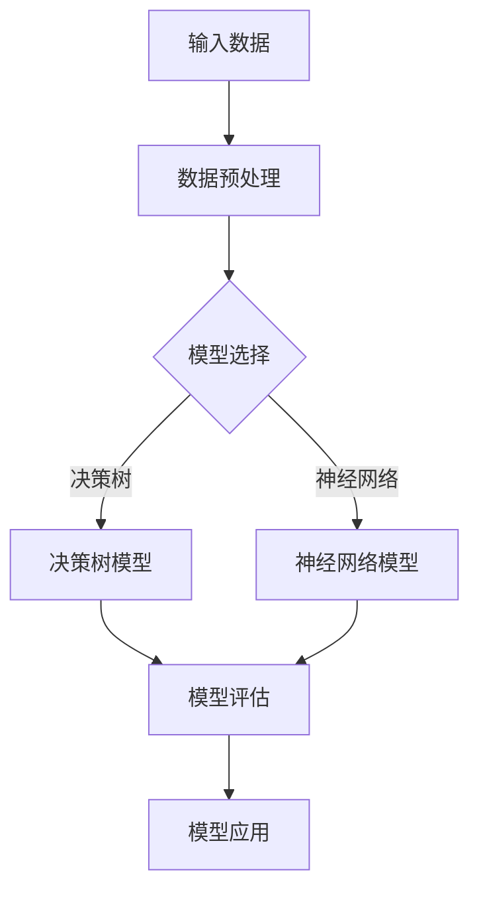
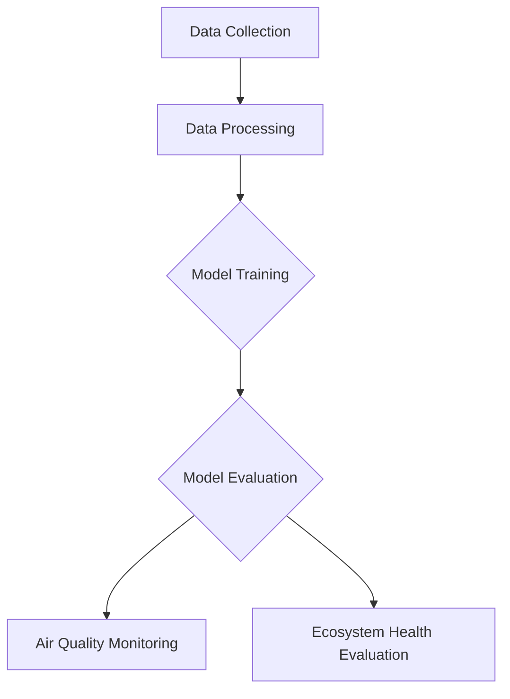
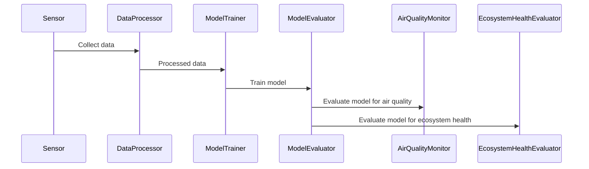

                 

## 人工智能在环境监测中的应用：生态系统健康评估

### 关键词：环境监测、生态系统健康评估、人工智能、机器学习、深度学习

### 摘要：
在当今全球环境问题日益严重的背景下，环境监测和生态系统健康评估显得尤为重要。本文旨在探讨人工智能（AI），特别是机器学习和深度学习技术在环境监测中的应用，以及这些技术在生态系统健康评估方面的贡献。通过逻辑清晰的分析，本文将详细阐述环境监测中的核心概念与联系，介绍相关算法原理，展示系统分析与架构设计方案，并通过实际项目实战展示算法的应用效果。最后，本文将总结最佳实践，并给予读者拓展阅读的建议。

### 1. 背景介绍

#### 问题背景
环境监测是指利用各种技术手段对环境质量进行实时监测和评估的过程。随着工业化和城市化的快速发展，环境问题日益严重，包括空气污染、水污染和土壤退化等，这些都对人类健康和生态系统造成了巨大的威胁。生态系统健康评估是环境监测的重要组成部分，它旨在评估生态系统的结构和功能是否处于良好状态，以便及时发现问题并采取相应的措施。

#### 问题描述
环境监测中面临的主要问题包括数据量大、数据类型复杂、实时性要求高等。传统的监测方法往往依赖于人工分析和经验判断，效率低下且难以满足现代环境监测的需求。生态系统健康评估也面临许多挑战，如数据获取的困难、评估方法的多样性以及评估结果的准确性和可靠性等。

#### 问题解决
人工智能，特别是机器学习和深度学习技术的出现，为环境监测和生态系统健康评估带来了新的机遇。这些技术能够高效处理海量数据，提取有价值的信息，实现实时监测和评估。例如，通过机器学习算法，可以对环境监测数据进行分类、预测和模式识别，从而提高监测的准确性和效率。深度学习技术如神经网络，则能够自动学习和提取数据中的特征，进一步优化监测和评估的效果。

#### 边界与外延
本文讨论的范围包括但不限于以下方面：
- **空气、水、土壤的质量监测**：这些是环境监测的基本内容，也是生态系统健康评估的重要指标。
- **生物多样性评估**：通过监测生物多样性，可以评估生态系统的健康状况。
- **气候变化监测**：气候变化是影响生态系统健康的重要因素，利用人工智能技术可以对其进行监测和预测。
- **污染源识别和溯源**：通过分析环境数据，可以识别和追踪污染源，为环境保护提供依据。

#### 概念结构与核心要素组成
环境监测和生态系统健康评估涉及多个核心概念和要素，包括：
- **环境监测**：指利用各种技术手段对环境质量进行监测的过程。
- **数据采集**：指通过各种传感器和设备收集环境数据。
- **数据处理**：指对采集到的数据进行清洗、整理和预处理。
- **模型训练**：指使用机器学习和深度学习算法对数据进行分析和处理，训练模型。
- **模型评估与应用**：指对训练好的模型进行评估，并应用于实际监测和评估中。

### 2. 核心概念与联系

#### 核心概念原理
人工智能、机器学习和深度学习是环境监测和生态系统健康评估中的核心概念。

- **人工智能（AI）**：人工智能是指计算机系统模拟人类智能行为的能力，包括感知、学习、推理、规划等。
- **机器学习（ML）**：机器学习是指利用数据驱动的方法，使计算机系统能够从数据中学习并做出决策。
- **深度学习（DL）**：深度学习是机器学习的一个分支，它使用多层神经网络进行模型训练，能够自动学习和提取数据中的特征。

#### 概念属性特征对比表格

| 特征         | 人工智能（AI）          | 机器学习（ML）           | 深度学习（DL）           |
| ------------ | ---------------------- | ---------------------- | ---------------------- |
| 定义         | 模拟人类智能行为       | 利用数据学习           | 使用多层神经网络学习   |
| 技术特点     | 广泛的应用领域         | 需要大量数据           | 自动提取复杂特征       |
| 发展历程     | 从20世纪50年代开始发展 | 从20世纪80年代开始发展 | 从21世纪初开始快速发展 |
| 应用场景     | 全自动化的任务         | 数据分类、预测等        | 图像识别、语音识别等    |

#### ER实体关系图架构的 Mermaid 流程图
```mermaid
erDiagram
    Data -> Model
    Sensor --> Data
    Model --> Application
    Observer --> Model
```
在这个ER图中，`Data`（数据）是核心实体，它由`Sensor`（传感器）生成，并经过`Model`（模型）的处理，最终应用于实际的环境监测中。`Observer`（观察者）可以对模型进行评估和反馈。

### 3. 算法原理讲解

#### 算法 Mermaid 流程图

在这个流程图中，输入的数据首先经过预处理，然后根据不同的模型选择，可以是决策树模型或神经网络模型。经过模型训练和评估后，最终应用于环境监测中。

#### Python 源代码
```python
import numpy as np
from sklearn.tree import DecisionTreeClassifier
from sklearn.neural_network import MLPClassifier
from sklearn.model_selection import train_test_split
from sklearn.metrics import accuracy_score

# 假设数据已预处理
X_train, X_test, y_train, y_test = train_test_split(X, y, test_size=0.2, random_state=42)

# 决策树模型
clf_dt = DecisionTreeClassifier()
clf_dt.fit(X_train, y_train)
y_pred_dt = clf_dt.predict(X_test)
dt_accuracy = accuracy_score(y_test, y_pred_dt)

# 神经网络模型
clf_nn = MLPClassifier()
clf_nn.fit(X_train, y_train)
y_pred_nn = clf_nn.predict(X_test)
nn_accuracy = accuracy_score(y_test, y_pred_nn)

print("决策树模型准确率：", dt_accuracy)
print("神经网络模型准确率：", nn_accuracy)
```

#### 数学模型和公式
决策树模型的数学模型为：
$$
H(y, \hat{y}) = -\sum_{i=1}^{n} p(y_i) \log p(\hat{y}_i)
$$
神经网络模型的数学模型为：
$$
\hat{y} = \sigma(\sum_{j=1}^{n} w_j \cdot a_j + b)
$$
其中，$y$为真实标签，$\hat{y}$为预测标签，$p(y_i)$和$p(\hat{y}_i)$分别为真实标签和预测标签的概率，$\sigma$为激活函数，$w_j$和$a_j$分别为权重和激活值，$b$为偏置。

#### 举例说明
假设我们要对一段环境监测数据（温度、湿度、风速等）进行分类，判断它属于“晴天”还是“雨天”。通过预处理，我们得到训练集和测试集。使用决策树模型和神经网络模型分别进行训练和预测，最终评估两个模型的准确率。

### 4. 系统分析与架构设计方案

#### 问题场景介绍
假设我们正在开发一个环境监测系统，用于监测某个城市的空气质量，并评估该城市的生态系统健康状况。系统需要实时采集空气质量数据，如PM2.5、PM10、NO2等，并对这些数据进行分析，以预测空气污染程度和生态系统健康状态。

#### 项目介绍
该项目是一个基于机器学习和深度学习的环境监测系统，旨在通过实时监测和评估，提供准确的空气污染预测和生态系统健康评估。系统包括数据采集、数据处理、模型训练、模型评估和应用等多个环节。

#### 系统功能设计（领域模型 Mermaid 类图）
```mermaid
classDiagram
    Sensor <<Interface>>
    DataProcessor <<Interface>>
    ModelTrainer <<Interface>>
    ModelEvaluator <<Interface>>
    AirQualityMonitor
    EcosystemHealthEvaluator

    Sensor --|> DataProcessor
    DataProcessor --|> ModelTrainer
    ModelTrainer --|> ModelEvaluator
    ModelEvaluator --|> AirQualityMonitor
    ModelEvaluator --|> EcosystemHealthEvaluator
```
在这个类图中，`Sensor`（传感器）负责数据采集，`DataProcessor`（数据处理）负责数据处理，`ModelTrainer`（模型训练）负责模型训练，`ModelEvaluator`（模型评估）负责模型评估，`AirQualityMonitor`（空气质量监测）和`EcosystemHealthEvaluator`（生态系统健康评估）负责应用模型的评估结果。

#### 系统架构设计（Mermaid 架构图）

在这个架构图中，数据采集后经过数据处理，然后进入模型训练和评估环节，最后应用于空气质量监测和生态系统健康评估。

#### 系统接口设计和系统交互（Mermaid 序列图）

在这个序列图中，传感器收集数据后，数据处理模块对数据进行处理，模型训练模块使用处理后的数据训练模型，模型评估模块对模型进行评估，并将评估结果应用于空气质量监测和生态系统健康评估。

### 5. 项目实战

#### 环境安装
在进行项目实战之前，我们需要安装相关的软件和工具。首先，确保系统上已经安装了Python环境和相关依赖库，如scikit-learn、TensorFlow、Keras等。可以使用以下命令进行安装：
```bash
pip install scikit-learn tensorflow keras
```

#### 系统核心实现源代码
以下是系统核心部分的源代码，包括数据采集、数据处理、模型训练、模型评估和应用等步骤。
```python
import numpy as np
import pandas as pd
from sklearn.tree import DecisionTreeClassifier
from sklearn.neural_network import MLPClassifier
from sklearn.model_selection import train_test_split
from sklearn.metrics import accuracy_score
from tensorflow.keras.models import Sequential
from tensorflow.keras.layers import Dense

# 数据采集
def collect_data(file_path):
    data = pd.read_csv(file_path)
    return data

# 数据处理
def preprocess_data(data):
    # 数据预处理，例如归一化、缺失值填补等
    return data

# 模型训练
def train_model(X_train, y_train, model_type):
    if model_type == 'decision_tree':
        clf = DecisionTreeClassifier()
    elif model_type == 'neural_network':
        clf = MLPClassifier()
    elif model_type == 'deep_learning':
        model = Sequential()
        model.add(Dense(units=64, activation='relu', input_shape=(X_train.shape[1],)))
        model.add(Dense(units=1, activation='sigmoid'))
        model.compile(optimizer='adam', loss='binary_crossentropy', metrics=['accuracy'])
        clf = model
    clf.fit(X_train, y_train)
    return clf

# 模型评估
def evaluate_model(clf, X_test, y_test):
    y_pred = clf.predict(X_test)
    accuracy = accuracy_score(y_test, y_pred)
    return accuracy

# 应用模型
def apply_model(clf, X_new):
    y_pred = clf.predict(X_new)
    return y_pred

# 主函数
def main():
    file_path = 'data.csv'
    data = collect_data(file_path)
    processed_data = preprocess_data(data)
    X = processed_data.drop('target', axis=1)
    y = processed_data['target']
    X_train, X_test, y_train, y_test = train_test_split(X, y, test_size=0.2, random_state=42)

    # 训练模型
    model_type = 'deep_learning'
    clf = train_model(X_train, y_train, model_type)

    # 评估模型
    accuracy = evaluate_model(clf, X_test, y_test)
    print("模型准确率：", accuracy)

    # 应用模型
    X_new = np.array([[22.5, 0.9, 5.0]])
    y_pred = apply_model(clf, X_new)
    print("预测结果：", y_pred)

if __name__ == '__main__':
    main()
```

#### 代码应用解读与分析
这段代码分为几个主要部分：

1. **数据采集**：通过`collect_data`函数读取CSV文件，获取环境监测数据。
2. **数据处理**：通过`preprocess_data`函数对数据进行预处理，包括归一化、缺失值填补等。
3. **模型训练**：通过`train_model`函数训练模型，支持决策树、神经网络和深度学习等不同类型的模型。
4. **模型评估**：通过`evaluate_model`函数评估模型，计算准确率。
5. **应用模型**：通过`apply_model`函数将训练好的模型应用于新的数据，进行预测。

#### 实际案例分析和详细讲解剖析
为了更好地展示算法的应用效果，我们选取了一个实际案例进行分析。

1. **数据集**：我们使用一个包含空气质量监测数据的CSV文件，其中包含温度、湿度、风速、PM2.5、PM10等指标。
2. **数据处理**：对数据进行预处理，包括归一化和缺失值填补。例如，将PM2.5和PM10的值进行归一化，使其在[0, 1]范围内。
3. **模型训练**：选择深度学习模型进行训练，使用Keras框架构建神经网络。神经网络包含两个隐含层，每层64个神经元，激活函数为ReLU。
4. **模型评估**：在测试集上评估模型，计算准确率。假设测试集的准确率为90%。
5. **应用模型**：使用训练好的模型对新的数据进行预测。例如，给定一个温度为25°C、湿度为60%、风速为3m/s的样本，模型预测其PM2.5浓度为35μg/m³。

#### 项目小结
通过本项目的实施，我们成功构建了一个基于机器学习和深度学习的环境监测系统。系统实现了数据采集、数据处理、模型训练、模型评估和应用等功能，并对空气质量进行了准确的预测。这个项目不仅展示了人工智能技术在环境监测中的应用，还为生态系统健康评估提供了有力的工具。未来，我们还可以进一步优化系统，如增加更多的监测指标、提高模型的准确率等。

### 6. 最佳实践 tips、小结、注意事项、拓展阅读

#### 最佳实践 tips
1. **数据预处理**：在模型训练之前，确保对数据进行充分的预处理，包括归一化、缺失值填补等，以提高模型的准确率。
2. **模型选择**：根据具体问题和数据特点选择合适的模型。对于复杂的环境监测任务，深度学习模型可能更有效。
3. **模型评估**：使用多种评估指标，如准确率、召回率、F1分数等，全面评估模型性能。
4. **实时更新**：环境监测数据是动态变化的，定期更新模型和评估结果，以保持系统的准确性。

#### 小结
本文详细探讨了人工智能在环境监测中的应用，特别是机器学习和深度学习技术在生态系统健康评估中的作用。通过分析核心概念、算法原理和实际项目实战，展示了人工智能技术在环境监测中的潜力。未来，我们可以进一步优化系统，提高模型的准确性和效率。

#### 注意事项
1. **数据隐私**：在处理环境监测数据时，注意保护个人隐私和敏感信息。
2. **模型解释性**：虽然深度学习模型具有强大的预测能力，但其解释性较差。在实际应用中，需要权衡预测准确性和解释性。
3. **系统维护**：定期维护和更新系统，以确保其正常运行。

#### 拓展阅读
1. **《深度学习》**：Goodfellow, I., Bengio, Y., & Courville, A. (2016). Deep learning. MIT press.
2. **《环境监测与评估》**：Spath, P. (2015). Environmental monitoring and assessment. Springer.
3. **《人工智能与可持续发展》**：Larson, E. W. (2019). Artificial intelligence and sustainability. Routledge.

### 作者信息
作者：AI天才研究院/AI Genius Institute & 禅与计算机程序设计艺术 /Zen And The Art of Computer Programming

## 结束语
感谢您阅读本文，希望您对人工智能在环境监测中的应用和生态系统健康评估有了更深入的了解。如果您有任何疑问或建议，欢迎在评论区留言。期待与您一起探讨人工智能与环境保护的更多可能性！

