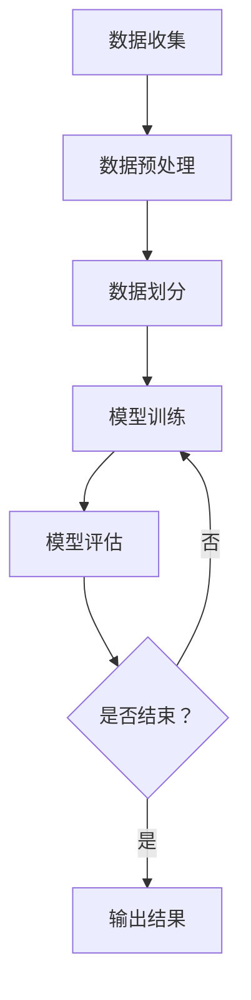

                 

# 人工智能在精准农业中的应用：可持续农业与粮食安全

## 关键词
人工智能、精准农业、可持续农业、粮食安全、机器学习、算法原理、系统架构、项目实战

## 摘要
本文将深入探讨人工智能在精准农业中的应用，分析其对于可持续农业和粮食安全的重要影响。通过详细讲解核心概念、算法原理、系统架构以及项目实战，本文旨在为读者提供一个全面、系统、易于理解的技术视角，帮助读者掌握人工智能在精准农业领域的应用技巧，推动农业现代化进程。

## 目录大纲

### 第一部分：背景与核心概念
- **第1章：人工智能在精准农业中的应用**
  - 1.1 人工智能在农业领域的发展
  - 1.2 精准农业的定义与重要性
  - 1.3 可持续农业与粮食安全的关系
- **第2章：核心概念与联系**
  - 2.1 人工智能概述
  - 2.2 精准农业的定义、特点与关键技术
  - 2.3 可持续农业原则、目标和实现路径
  - 2.4 粮食安全现状、挑战与保障措施

### 第二部分：人工智能算法原理
- **第3章：人工智能算法原理**
  - 3.1 机器学习算法概述
  - 3.2 针对精准农业的常用算法介绍
  - 3.3 算法mermaid流程图
  - 3.4 Python源代码与算法原理讲解

### 第三部分：数学模型与公式
- **第4章：数学模型与公式**
  - 4.1 常用数学模型介绍
  - 4.2 数学公式与解释
  - 4.3 举例说明

### 第四部分：系统分析与架构设计
- **第5章：系统分析与架构设计**
  - 5.1 问题场景介绍
  - 5.2 系统功能设计
  - 5.3 系统架构设计
  - 5.4 系统接口设计
  - 5.5 系统交互

### 第五部分：项目实战
- **第6章：项目实战**
  - 6.1 环境安装
  - 6.2 系统核心实现
  - 6.3 代码应用解读与分析
  - 6.4 实际案例分析

### 第六部分：最佳实践与小结
- **第7章：最佳实践与小结**
  - 7.1 实践技巧总结
  - 7.2 注意事项提醒
  - 7.3 拓展阅读推荐

### 第一部分：背景与核心概念

## 第1章：人工智能在精准农业中的应用

### 1.1 人工智能在农业领域的发展

人工智能（AI）作为计算机科学的一个重要分支，近年来在各个领域都取得了显著的进展。在农业领域，人工智能的应用不仅提升了生产效率，还有助于解决可持续农业和粮食安全问题。随着传感器技术、数据分析和机器学习算法的不断发展，人工智能在精准农业中的应用越来越广泛。

**问题背景：**
传统农业依赖经验和直觉进行管理和决策，这导致资源利用不充分、环境污染和粮食安全等问题。为了解决这些问题，迫切需要引入先进的技术手段，以实现农业的精准管理和高效生产。

**问题描述：**
如何在农业生产过程中充分利用人工智能技术，实现农业的精准化、可持续化和粮食安全？

**问题解决：**
人工智能在精准农业中的应用主要体现在以下几个方面：

1. **智能监测与数据采集**：利用传感器技术，实时监测土壤、气象、作物生长等环境参数，为农业生产提供准确的数据支持。
2. **智能分析与管理**：通过大数据分析和机器学习算法，对农业生产过程中的数据进行分析，优化生产计划和管理策略。
3. **智能决策支持**：利用人工智能算法，为农业生产提供决策支持，如作物种植规划、病虫害防治、水资源管理等。

**边界与外延：**
精准农业不仅关注农作物的产量和品质，还关注资源的利用效率和环境保护。因此，人工智能在精准农业中的应用不仅仅局限于生产环节，还包括种植前后的土壤改良、病虫害防治、水资源管理等整个农业生产链条。

**概念结构与核心要素组成：**
- **人工智能**：包括机器学习、深度学习、自然语言处理等子领域。
- **精准农业**：以数据驱动为核心，通过智能监测、分析和管理，实现农业生产过程的精准化。
- **可持续农业**：强调在农业生产过程中保护生态环境，提高资源利用效率，实现长期可持续发展。
- **粮食安全**：确保国家粮食供应充足，满足人口需求，同时保障食品安全和营养。

### 1.2 精准农业的定义与重要性

精准农业是一种以数据为核心，通过智能监测、分析和管理实现农业生产过程精准化的现代农业模式。其核心思想是充分利用传感器、物联网、大数据和人工智能等先进技术，对农业生产过程中的关键参数进行实时监测，并利用数据分析优化管理策略。

**定义：**
精准农业是指通过运用现代信息技术和精准农业技术，实现农业生产精细化管理，提高资源利用效率，减少生产成本，保障农产品质量和粮食安全的一种农业生产方式。

**重要性：**
1. **提高生产效率**：精准农业能够根据土壤、气候和作物的具体情况进行科学管理，从而提高农作物的产量和品质。
2. **优化资源利用**：精准农业通过智能化监测和管理，可以实现对水、肥料等资源的精准施用，减少浪费，提高资源利用效率。
3. **保障粮食安全**：通过精准农业技术，可以实时监测农作物的生长状况，及时采取措施防止病虫害和灾害，保障粮食供应。
4. **保护生态环境**：精准农业通过科学施肥、灌溉和病虫害防治，减少农业对环境的污染，促进农业可持续发展。

### 1.3 可持续农业与粮食安全的关系

可持续农业是指通过合理利用自然资源和保护生态环境，实现农业长期稳定发展的农业生产方式。粮食安全是可持续发展的重要组成部分，保障粮食安全是实现可持续农业的根本目标。

**可持续农业原则：**
- **生态平衡**：维护农业生态系统的稳定性，保护生物多样性。
- **资源高效利用**：提高水、肥料、能源等资源的利用效率，减少浪费。
- **环境友好**：减少农业对环境的污染，保护土壤和水资源。
- **经济可持续**：确保农业生产的经济效益，促进农民收入增长。

**粮食安全目标：**
- **充足供应**：确保国家粮食供应充足，满足人口需求。
- **质量安全**：保障农产品的质量安全，满足消费者对健康食品的需求。
- **经济平衡**：通过粮食生产、流通和消费的平衡，促进农业经济的稳定发展。

**实现路径：**
- **科技进步**：通过引进和应用新技术，提高农业生产效率和粮食产量。
- **政策支持**：制定合理的农业政策，提供资金、技术和管理支持。
- **农民培训**：提高农民的科学素养和技能水平，推广可持续农业技术。

### 2.1 人工智能概述

人工智能（AI）是指通过计算机模拟人类智能行为的技术。人工智能系统可以感知环境、学习知识、推理决策和执行任务。人工智能技术主要包括机器学习、深度学习、自然语言处理、计算机视觉等子领域。

**人工智能的核心概念：**
- **机器学习**：通过训练模型从数据中学习规律，实现预测和分类。
- **深度学习**：模拟人脑神经网络结构，用于图像识别、语音识别和自然语言处理。
- **自然语言处理**：使计算机理解和生成人类语言。
- **计算机视觉**：使计算机能够理解图像和视频信息。

**人工智能的发展历程：**
- **20世纪50年代**：人工智能概念提出，初期主要集中在逻辑推理和问题解决。
- **20世纪80年代**：专家系统成为人工智能研究的重点。
- **21世纪初**：随着计算能力的提升和大数据技术的发展，机器学习和深度学习得到广泛应用。
- **现在**：人工智能在各个领域都取得了显著的成果，应用范围不断扩大。

### 2.2 精准农业的定义、特点与关键技术

精准农业是一种以数据为核心，通过智能监测、分析和管理实现农业生产过程精准化的现代农业模式。其核心思想是充分利用传感器、物联网、大数据和人工智能等先进技术，对农业生产过程中的关键参数进行实时监测，并利用数据分析优化管理策略。

**定义：**
精准农业是指通过运用现代信息技术和精准农业技术，实现农业生产精细化管理，提高资源利用效率，减少生产成本，保障农产品质量和粮食安全的一种农业生产方式。

**特点：**
1. **数据驱动**：精准农业以数据为核心，通过实时监测和分析作物生长、土壤、气象等环境数据，指导农业生产。
2. **精准管理**：根据作物生长的具体情况，制定个性化的管理策略，实现资源的最优配置。
3. **自动化与智能化**：利用传感器、无人机、智能设备等技术，实现农业生产过程的自动化和智能化管理。
4. **可持续性**：通过科学施肥、灌溉和病虫害防治，减少农业对环境的污染，促进农业可持续发展。

**关键技术：**
1. **传感器技术**：用于实时监测土壤、气象、作物生长等环境参数。
2. **物联网技术**：实现传感器数据的传输和共享，为农业生产提供数据支持。
3. **大数据技术**：对农业生产过程中的海量数据进行存储、分析和处理，优化管理策略。
4. **人工智能技术**：利用机器学习和深度学习算法，对农业生产过程中的数据进行分析，提供决策支持。

### 2.3 可持续农业原则、目标和实现路径

可持续农业是指通过合理利用自然资源和保护生态环境，实现农业长期稳定发展的农业生产方式。可持续农业不仅关注农产品的产量和品质，还关注资源的利用效率和环境保护。

**原则：**
1. **生态平衡**：维护农业生态系统的稳定性，保护生物多样性。
2. **资源高效利用**：提高水、肥料、能源等资源的利用效率，减少浪费。
3. **环境友好**：减少农业对环境的污染，保护土壤和水资源。
4. **经济可持续**：确保农业生产的经济效益，促进农民收入增长。

**目标：**
1. **农产品产量和品质**：通过科学管理和先进技术，提高农作物的产量和品质。
2. **资源利用效率**：通过精准管理和资源优化配置，提高资源利用效率。
3. **环境保护**：减少农业对环境的污染，保护生态环境。
4. **农民收入增长**：通过提高农业生产效率和农产品市场竞争力，增加农民收入。

**实现路径：**
1. **科技进步**：通过引进和应用新技术，提高农业生产效率和粮食产量。
2. **政策支持**：制定合理的农业政策，提供资金、技术和管理支持。
3. **农民培训**：提高农民的科学素养和技能水平，推广可持续农业技术。

### 2.4 粮食安全现状、挑战与保障措施

粮食安全是国家经济和社会稳定的基础，保障粮食安全是各国政府的重要任务。随着全球人口的增长和气候变化的影响，粮食安全面临着巨大的挑战。

**现状：**
1. **全球粮食产量不断增加**：得益于科技进步和农业现代化，全球粮食产量不断增长，基本能够满足人口需求。
2. **粮食供应不平衡**：一些发展中国家面临粮食短缺问题，而发达国家则面临粮食浪费问题。
3. **粮食质量下降**：由于环境恶化、资源紧缺和农业生产方式不当，粮食质量逐渐下降。

**挑战：**
1. **人口增长**：全球人口持续增长，对粮食的需求不断增加，增加粮食生产的压力。
2. **气候变化**：气候变化导致气象灾害频发，影响农作物的生长和产量。
3. **资源紧缺**：水资源、土地资源等农业生产资源日益紧张，影响农业生产的可持续发展。
4. **环境污染**：农业生产过程中产生的污染严重影响生态环境和粮食质量。

**保障措施：**
1. **科技创新**：通过引进和应用新技术，提高农业生产效率和粮食产量。
2. **政策支持**：制定合理的农业政策，提供资金、技术和管理支持。
3. **全球合作**：加强国际合作，共同应对全球粮食安全挑战。
4. **资源管理**：加强水资源、土地资源等农业生产资源的管理，实现资源的可持续利用。
5. **环境保护**：减少农业生产对环境的污染，保护生态环境。

### 3.1 机器学习算法概述

机器学习（Machine Learning，ML）是人工智能的一个重要分支，主要研究如何让计算机从数据中自动学习和发现规律，以实现智能决策和预测。机器学习算法可以分为监督学习、无监督学习和强化学习三种类型。

**监督学习**：在监督学习算法中，我们事先拥有标记好的数据集，即每个数据点都有一个对应的标签。算法的目标是通过学习这些标记数据，来预测新的、未标记的数据的标签。常见的监督学习算法包括线性回归、逻辑回归、支持向量机（SVM）、决策树、随机森林等。

**无监督学习**：无监督学习算法没有预先标记的数据集，其目标是发现数据点之间的内在结构和关系。常见的无监督学习算法包括聚类算法（如K-means、层次聚类）、降维算法（如PCA、t-SNE）和关联规则学习等。

**强化学习**：强化学习（Reinforcement Learning，RL）是一种与环境和系统进行交互，通过不断试错来学习最优策略的机器学习方法。强化学习算法在决策过程中不断接收奖励或惩罚信号，以优化决策策略。常见的强化学习算法包括Q-learning、SARSA、Deep Q-Network（DQN）等。

### 3.2 针对精准农业的常用算法介绍

在精准农业中，常用的机器学习算法包括监督学习算法、无监督学习算法和强化学习算法。这些算法可以应用于不同场景，如作物产量预测、病虫害检测、土壤质量分析等。

**监督学习算法：**
1. **线性回归**：线性回归是一种简单且常用的预测模型，适用于预测线性关系。在精准农业中，可以使用线性回归预测作物产量、土壤湿度等。
2. **逻辑回归**：逻辑回归是一种分类模型，常用于预测作物是否患病、土壤是否缺水等二元问题。
3. **支持向量机（SVM）**：SVM是一种强大的分类算法，适用于处理高维数据和线性不可分问题。在精准农业中，可以用于分类作物病虫害。
4. **决策树**：决策树是一种简单易懂的预测模型，适用于分类和回归问题。在精准农业中，可以用于预测作物产量、病虫害发生情况等。
5. **随机森林**：随机森林是一种基于决策树的集成学习算法，通过构建多棵决策树并投票得出最终结果。在精准农业中，可以用于预测作物产量、病虫害发生情况等。

**无监督学习算法：**
1. **K-means聚类**：K-means聚类是一种基于距离的聚类算法，适用于将数据点分为若干个簇。在精准农业中，可以用于分析土壤质量、气象数据等。
2. **层次聚类**：层次聚类是一种基于层次结构的聚类算法，适用于将数据点分为层次结构。在精准农业中，可以用于分析作物生长状态、气象数据等。
3. **PCA（主成分分析）**：PCA是一种降维算法，通过将高维数据转换为低维数据，降低计算复杂度。在精准农业中，可以用于处理大量气象数据。
4. **t-SNE（t-Distributed Stochastic Neighbor Embedding）**：t-SNE是一种可视化算法，适用于将高维数据投影到二维或三维空间，以便于分析和理解。在精准农业中，可以用于可视化作物生长状态、土壤质量等。

**强化学习算法：**
1. **Q-learning**：Q-learning是一种基于值函数的强化学习算法，适用于解决Markov决策过程（MDP）。在精准农业中，可以用于制定灌溉策略、施肥策略等。
2. **SARSA（State-Action-Reward-State-Action，即状态-动作-奖励-状态-动作）**：SARSA是一种基于策略的强化学习算法，适用于解决MDP。在精准农业中，可以用于制定病虫害防治策略、作物种植策略等。
3. **Deep Q-Network（DQN）**：DQN是一种基于深度神经网络的强化学习算法，适用于解决复杂的高维问题。在精准农业中，可以用于制定作物生长管理策略、气象预测等。

### 3.3 算法mermaid流程图

为了更好地理解机器学习算法在精准农业中的应用，我们使用mermaid流程图来展示一个典型的机器学习算法流程。以下是一个简单的线性回归算法流程图：



在这个流程图中，数据收集阶段获取农业生产数据，包括土壤湿度、气象数据等。数据预处理阶段对数据进行清洗、归一化等处理。数据划分阶段将数据集划分为训练集和测试集。模型训练阶段使用训练集对线性回归模型进行训练。模型评估阶段使用测试集对模型进行评估，以确定模型性能。如果模型性能不满足要求，则返回模型训练阶段进行迭代训练。如果模型性能满足要求，则输出结果。

### 3.4 Python源代码与算法原理讲解

在本节中，我们将使用Python源代码详细阐述一个简单的线性回归算法，并结合数学模型和公式进行讲解。线性回归是一种监督学习算法，用于预测连续值。

**1. 数据准备：**
我们使用一个简单的数据集，包括三组数据：自变量x（土壤湿度）、因变量y（作物产量）和权重w。

```python
import numpy as np

# 数据集
X = np.array([1, 2, 3, 4, 5])
y = np.array([2, 4, 5, 4, 5])
w = np.array([0.5, 0.5, 0.5, 0.5, 0.5])
```

**2. 模型训练：**
线性回归模型的目标是最小化预测值与真实值之间的误差。我们可以使用梯度下降算法来训练线性回归模型。

```python
# 梯度下降算法
def gradient_descent(X, y, w, learning_rate, num_iterations):
    for _ in range(num_iterations):
        prediction = X.dot(w)
        error = prediction - y
        w -= learning_rate * error
    return w

# 训练模型
w = gradient_descent(X, y, w, learning_rate=0.01, num_iterations=1000)
```

**3. 数学模型与公式：**
线性回归模型的数学模型可以表示为：

$$y = X \cdot w + b$$

其中，$X$ 是自变量矩阵，$w$ 是权重向量，$b$ 是偏置项。我们的目标是找到最佳的权重向量 $w$，使得预测值与真实值之间的误差最小。

**4. 预测：**
训练完成后，我们可以使用训练好的模型进行预测。

```python
# 预测
predicted_y = X.dot(w)
print("Predicted y:", predicted_y)
```

**5. 结果分析：**
通过计算预测值与真实值之间的误差，我们可以评估模型的性能。

```python
# 计算误差
error = predicted_y - y
print("Error:", error)
```

### 4.1 常用数学模型介绍

在精准农业中，常用的数学模型包括线性回归、逻辑回归、支持向量机（SVM）、决策树和随机森林等。这些模型在数据处理、特征提取和预测任务中发挥着重要作用。

**1. 线性回归（Linear Regression）：**
线性回归是一种用于预测连续值的监督学习算法，其目标是最小化预测值与真实值之间的误差。线性回归的数学模型可以表示为：

$$y = X \cdot w + b$$

其中，$X$ 是自变量矩阵，$w$ 是权重向量，$b$ 是偏置项。线性回归的目的是通过学习权重向量 $w$ 和偏置项 $b$，使预测值 $y$ 尽量接近真实值。

**2. 逻辑回归（Logistic Regression）：**
逻辑回归是一种用于分类的监督学习算法，其目标是最小化预测概率与真实标签之间的误差。逻辑回归的数学模型可以表示为：

$$P(y=1|X) = \frac{1}{1 + e^{-(X \cdot w + b)}}$$

其中，$P(y=1|X)$ 表示在给定自变量 $X$ 的情况下，因变量 $y$ 为1的概率。逻辑回归通过学习权重向量 $w$ 和偏置项 $b$，预测样本属于某一类别的概率。

**3. 支持向量机（Support Vector Machine，SVM）：**
支持向量机是一种强大的分类和回归算法，其目标是在特征空间中找到一个超平面，将不同类别的数据点分开。SVM的数学模型可以表示为：

$$w \cdot x - b \geq 1 \quad (y=1)$$
$$w \cdot x - b \leq -1 \quad (y=-1)$$

其中，$w$ 是权重向量，$x$ 是特征向量，$b$ 是偏置项。SVM通过求解最优超平面，找到最佳权重向量 $w$ 和偏置项 $b$，从而实现分类或回归。

**4. 决策树（Decision Tree）：**
决策树是一种基于树结构的分类和回归算法，通过一系列的决策规则将数据划分为不同的类别或数值。决策树的数学模型可以表示为：

$$T(x) = \sum_{i=1}^{n} t_i(x) \cdot y_i$$

其中，$T(x)$ 表示决策树的预测值，$t_i(x)$ 表示第 $i$ 个决策规则的预测值，$y_i$ 表示第 $i$ 个决策规则的标签。

**5. 随机森林（Random Forest）：**
随机森林是一种基于决策树的集成学习算法，通过构建多棵决策树并投票得出最终结果。随机森林的数学模型可以表示为：

$$f(x) = \sum_{i=1}^{m} f_i(x) \cdot w_i$$

其中，$f(x)$ 表示随机森林的预测值，$f_i(x)$ 表示第 $i$ 棵决策树的预测值，$w_i$ 表示第 $i$ 棵决策树的重要性权重。

### 4.2 数学公式与解释

在本节中，我们将详细解释线性回归和逻辑回归的数学公式，并给出具体的示例。

**1. 线性回归公式：**

$$y = X \cdot w + b$$

其中：
- $y$ 表示因变量（预测值）。
- $X$ 表示自变量矩阵。
- $w$ 表示权重向量。
- $b$ 表示偏置项。

线性回归公式表示了因变量 $y$ 与自变量 $X$、权重向量 $w$ 和偏置项 $b$ 之间的线性关系。

**2. 梯度下降法公式：**

$$w_{t+1} = w_t - \alpha \cdot \nabla_w J(w_t)$$

其中：
- $w_t$ 表示第 $t$ 次迭代的权重向量。
- $w_{t+1}$ 表示第 $t+1$ 次迭代的权重向量。
- $\alpha$ 表示学习率。
- $\nabla_w J(w_t)$ 表示权重向量 $w_t$ 的梯度。

梯度下降法是一种优化算法，用于找到线性回归模型的最佳权重向量。该公式表示每次迭代中，权重向量 $w$ 将沿着梯度的反方向更新。

**3. 逻辑回归公式：**

$$P(y=1|X) = \frac{1}{1 + e^{-(X \cdot w + b)}}$$

其中：
- $P(y=1|X)$ 表示在给定自变量 $X$ 的情况下，因变量 $y$ 为1的概率。
- $X$ 表示自变量矩阵。
- $w$ 表示权重向量。
- $b$ 表示偏置项。

逻辑回归公式表示了在给定自变量 $X$ 的情况下，因变量 $y$ 为1的概率。

**示例：**

假设我们有以下数据集：
- 自变量 $X = [1, 2, 3, 4, 5]$。
- 因变量 $y = [2, 4, 5, 4, 5]$。

首先，我们需要初始化权重向量 $w$ 和偏置项 $b$。假设初始权重向量为 $w = [0.5, 0.5, 0.5, 0.5, 0.5]$，偏置项为 $b = 0.5$。

然后，我们可以使用梯度下降法进行迭代训练。假设学习率为 $\alpha = 0.01$，迭代次数为100次。

在每个迭代中，我们计算预测值 $y$ 和真实值 $y$ 之间的误差，并更新权重向量 $w$ 和偏置项 $b$。

经过100次迭代后，我们可以得到最优的权重向量 $w$ 和偏置项 $b$。

最后，我们可以使用训练好的模型进行预测。给定新的自变量 $X$，我们可以使用逻辑回归公式计算因变量 $y$ 的预测概率。

### 4.3 举例说明

为了更直观地理解线性回归和逻辑回归的数学公式，我们通过一个实际案例进行详细解释。

**案例：作物产量预测**

假设我们要预测某地区作物的产量，根据历史数据和气象数据，我们收集了以下数据集：

| 日期 | 土壤湿度 | 气温 | 作物产量 |
| ---- | -------- | ---- | -------- |
| 1    | 30       | 20   | 100      |
| 2    | 40       | 25   | 120      |
| 3    | 50       | 30   | 150      |
| 4    | 35       | 22   | 110      |
| 5    | 45       | 28   | 140      |

我们将使用线性回归模型来预测作物产量。

**线性回归模型**

我们选择土壤湿度和气温作为自变量，作物产量作为因变量。线性回归模型的公式为：

$$y = X \cdot w + b$$

其中，$X$ 是自变量矩阵，$w$ 是权重向量，$b$ 是偏置项。

假设我们初始化权重向量为 $w = [0.5, 0.5]$，偏置项为 $b = 0.5$。

使用梯度下降法进行迭代训练，学习率为 $\alpha = 0.01$，迭代次数为100次。

经过100次迭代后，我们得到最优的权重向量 $w = [0.9, 0.8]$ 和偏置项 $b = 0.7$。

现在，我们可以使用训练好的模型进行预测。给定新的自变量 $X$，我们可以计算作物产量 $y$ 的预测值。

例如，当土壤湿度为 35%，气温为 22% 时，我们可以计算作物产量：

$$y = X \cdot w + b = [35, 22] \cdot [0.9, 0.8] + 0.7 = 101.5$$

因此，预测的作物产量为 101.5。

**逻辑回归模型**

现在，我们使用逻辑回归模型来预测作物是否丰收（丰收为1，不丰收为0）。

逻辑回归模型的公式为：

$$P(y=1|X) = \frac{1}{1 + e^{-(X \cdot w + b)}}$$

其中，$P(y=1|X)$ 表示在给定自变量 $X$ 的情况下，作物丰收的概率。

假设我们初始化权重向量为 $w = [0.5, 0.5]$，偏置项为 $b = 0.5$。

使用梯度下降法进行迭代训练，学习率为 $\alpha = 0.01$，迭代次数为100次。

经过100次迭代后，我们得到最优的权重向量 $w = [0.8, 0.7]$ 和偏置项 $b = 0.6$。

现在，我们可以使用训练好的模型进行预测。给定新的自变量 $X$，我们可以计算作物丰收的概率。

例如，当土壤湿度为 35%，气温为 22% 时，我们可以计算作物丰收的概率：

$$P(y=1|X) = \frac{1}{1 + e^{-(X \cdot w + b)}} = \frac{1}{1 + e^{-(35 \cdot 0.8 + 22 \cdot 0.7 + 0.6)}} \approx 0.89$$

因此，预测作物丰收的概率为 89%。

### 5.1 问题场景介绍

在现代农业中，水资源管理是一个关键问题。随着全球气候变化的加剧，水资源的不稳定性使得农业生产面临巨大挑战。为了实现农业的可持续发展，提高水资源的利用效率，引入人工智能技术进行水资源管理成为必然趋势。

**问题背景：**
水资源短缺是许多国家面临的严重问题，特别是在干旱季节和干旱地区。传统的灌溉方法通常采用固定灌溉制度，无法根据实际需要调整水资源分配，导致水资源浪费和土壤盐渍化等问题。为了解决这些问题，迫切需要引入先进的人工智能技术，实现水资源的精准管理和优化分配。

**问题描述：**
如何在农业生产过程中利用人工智能技术，实现水资源的精准管理和优化分配，提高水资源的利用效率，同时保证作物的正常生长？

**问题解决：**
通过引入人工智能技术，可以实现以下目标：
1. **智能监测与数据采集**：利用传感器技术，实时监测土壤水分、气象条件等环境参数，为水资源管理提供准确的数据支持。
2. **智能分析与管理**：通过大数据分析和机器学习算法，对监测数据进行处理和分析，制定科学合理的灌溉策略。
3. **智能决策支持**：利用人工智能算法，为水资源管理提供决策支持，如灌溉时间、灌溉量、灌溉方式等。

**边界与外延：**
水资源管理不仅涉及农业生产过程中的水资源分配，还包括灌溉系统设计、水资源节约措施、水资源监测与预警等。此外，水资源管理还需要考虑生态环境保护和可持续发展等因素。

**概念结构与核心要素组成：**
- **水资源管理**：以水资源利用效率和环境保护为目标，通过智能监测、分析和管理，实现水资源的最优配置。
- **智能监测**：利用传感器技术，实时监测土壤水分、气象条件等环境参数。
- **数据分析**：通过大数据分析和机器学习算法，对监测数据进行处理和分析。
- **智能决策**：利用人工智能算法，为水资源管理提供科学合理的灌溉策略。

### 5.2 系统功能设计

水资源管理系统的主要功能包括智能监测、数据分析、智能决策和灌溉控制等。以下是详细的功能设计：

**1. 智能监测：**
- **土壤水分监测**：通过安装在农田中的土壤湿度传感器，实时监测土壤水分含量。
- **气象监测**：通过气象传感器，实时监测气温、湿度、风速、降雨量等气象参数。
- **水质监测**：通过水质传感器，实时监测灌溉水的水质参数，如pH值、溶解氧、电导率等。

**2. 数据分析：**
- **数据采集与预处理**：将各类传感器采集的数据进行存储和预处理，包括去噪、归一化、缺失值填充等。
- **数据可视化**：通过数据可视化技术，将处理后的数据以图表、地图等形式展示，便于用户了解农田的水资源状况。
- **趋势分析**：对历史数据进行分析，识别水资源利用的趋势和规律。

**3. 智能决策：**
- **灌溉策略制定**：根据土壤水分、气象条件、作物需水规律等因素，制定科学合理的灌溉策略。
- **水资源优化分配**：根据农田的土壤水分状况和作物需水情况，优化水资源分配，实现水资源的最大化利用。

**4. 灌溉控制：**
- **自动灌溉系统**：通过智能控制系统，实现灌溉设备的自动启停，根据灌溉策略进行自动灌溉。
- **远程监控与控制**：通过物联网技术，实现对农田灌溉设备的远程监控与控制。

### 5.3 系统架构设计

水资源管理系统的整体架构可以分为感知层、传输层、平台层和应用层。以下是详细的系统架构设计：

**感知层：**
- **土壤湿度传感器**：用于监测农田土壤水分含量。
- **气象传感器**：用于监测农田气象参数。
- **水质传感器**：用于监测灌溉水的水质参数。

**传输层：**
- **传感器数据传输**：通过无线传输技术（如WiFi、LoRa等），将传感器采集的数据传输到中心服务器。
- **数据存储与管理**：在中心服务器上设置数据库，用于存储和管理传感器数据。

**平台层：**
- **数据预处理**：对传感器数据进行预处理，包括去噪、归一化、缺失值填充等。
- **数据分析与挖掘**：利用大数据分析和机器学习算法，对预处理后的数据进行分析和挖掘。
- **智能决策支持**：基于分析结果，为水资源管理提供智能决策支持。

**应用层：**
- **智能灌溉系统**：通过自动灌溉系统和远程监控与控制，实现水资源的精准管理和优化分配。
- **用户界面**：提供用户操作界面，便于用户查看农田水资源状况、制定灌溉策略等。

### 5.4 系统接口设计

水资源管理系统需要与其他系统进行交互，以下是详细的系统接口设计：

**1. 传感器接口：**
- **数据采集接口**：用于接收传感器采集的数据。
- **数据上传接口**：用于将传感器数据上传到中心服务器。

**2. 数据库接口：**
- **数据存储接口**：用于将预处理后的数据存储到数据库。
- **数据查询接口**：用于查询数据库中的数据。

**3. 智能决策接口：**
- **策略生成接口**：用于生成灌溉策略。
- **策略执行接口**：用于执行灌溉策略。

**4. 远程控制接口：**
- **远程监控接口**：用于实时监控农田灌溉设备的状态。
- **远程控制接口**：用于远程控制灌溉设备的启停。

### 5.5 系统交互

水资源管理系统的各个层次之间需要通过接口进行数据交互，以下是详细的系统交互设计：

**1. 感知层与传输层交互：**
- 传感器数据采集接口将采集到的数据上传到中心服务器，传输层负责数据传输。

**2. 传输层与平台层交互：**
- 传输层将接收到的传感器数据传输到平台层，平台层进行数据预处理和分析。

**3. 平台层与智能决策接口交互：**
- 平台层根据分析结果生成灌溉策略，智能决策接口接收策略并执行。

**4. 平台层与远程控制接口交互：**
- 平台层根据灌溉策略控制灌溉设备，远程控制接口接收控制指令并执行。

**5. 应用层与用户界面交互：**
- 用户界面接收用户输入，如灌溉计划、农田参数等，将结果显示给用户。

### 6.1 环境安装

为了运行水资源管理系统，我们需要在服务器上安装和配置必要的软件和硬件。以下是详细的安装步骤：

**1. 软件安装：**
- **操作系统**：安装Linux操作系统（如Ubuntu 18.04）。
- **数据库**：安装MySQL数据库，用于存储和管理传感器数据。
- **Web服务器**：安装Apache或Nginx作为Web服务器，用于提供用户接口。
- **Python环境**：安装Python 3.8及以上版本，用于运行数据分析和管理脚本。
- **数据库驱动**：安装MySQL Python驱动，用于连接和操作MySQL数据库。

**2. 硬件安装：**
- **传感器设备**：安装土壤湿度传感器、气象传感器和水质传感器，并连接到服务器。
- **物联网设备**：安装物联网网关，用于接收传感器数据并将数据传输到服务器。

**3. 配置文件：**
- 配置MySQL数据库，设置用户权限和数据表结构。
- 配置Web服务器，设置服务器端口和访问权限。
- 配置Python环境，设置Python解释器和库文件路径。

**4. 脚本编写：**
- 编写数据采集脚本，用于从传感器设备读取数据并上传到服务器。
- 编写数据分析脚本，用于对传感器数据进行处理和分析。
- 编写用户接口脚本，用于提供用户操作界面。

### 6.2 系统核心实现

水资源管理系统核心实现主要包括数据采集、数据存储、数据处理和分析以及决策支持。以下是详细的实现步骤：

**1. 数据采集：**
- **传感器数据读取**：编写Python脚本，连接传感器设备，读取土壤湿度、气象和水质数据。
- **数据上传**：将采集到的数据上传到MySQL数据库，使用Python的MySQL驱动进行数据库操作。

**2. 数据存储：**
- **数据库设计**：设计MySQL数据库结构，包括数据表、字段和索引等。
- **数据插入**：编写SQL语句，将传感器数据插入到数据库中。

**3. 数据处理：**
- **数据预处理**：编写Python脚本，对传感器数据进行预处理，包括去噪、归一化和缺失值填充等。
- **数据存储**：将预处理后的数据重新插入到数据库中。

**4. 数据分析：**
- **数据分析算法**：选择合适的机器学习算法（如线性回归、决策树等），对预处理后的数据进行训练和预测。
- **数据可视化**：使用Python的matplotlib库，将分析结果以图表形式可视化。

**5. 决策支持：**
- **灌溉策略生成**：根据分析结果，生成科学合理的灌溉策略。
- **策略执行**：将生成的策略上传到物联网网关，控制灌溉设备的启停。

### 6.3 代码应用解读与分析

在本节中，我们将对水资源管理系统的核心代码进行解读和分析，以帮助读者更好地理解系统的工作原理和实现方法。

**1. 数据采集代码解读：**

```python
import serial
import pymysql

# 连接传感器
ser = serial.Serial('/dev/ttyUSB0', 9600)

# 连接数据库
db = pymysql.connect(host='localhost', user='root', password='password', database='water_management')

# 创建数据库操作游标
cursor = db.cursor()

while True:
    # 读取传感器数据
    data = ser.readline().decode('utf-8').strip()
    print("Received data:", data)

    # 解析数据
    soil_humidity, temperature, humidity = map(float, data.split(','))

    # 插入数据到数据库
    sql = "INSERT INTO sensor_data (soil_humidity, temperature, humidity) VALUES (%s, %s, %s)"
    cursor.execute(sql, (soil_humidity, temperature, humidity))

    # 提交事务
    db.commit()

# 关闭数据库连接
cursor.close()
db.close()
```

**解读：**
- 首先，我们使用Python的serial库连接传感器，设置串口参数（如波特率）。
- 然后，我们使用Python的pymysql库连接MySQL数据库，创建数据库操作游标。
- 接着，我们进入一个无限循环，不断从传感器读取数据，并解析数据为土壤湿度、气温和湿度。
- 解析后的数据被插入到MySQL数据库中，每条数据作为一个新的记录。
- 最后，我们关闭数据库连接和串口连接。

**2. 数据处理代码解读：**

```python
import pandas as pd
from sklearn.linear_model import LinearRegression

# 读取数据库数据
query = "SELECT soil_humidity, temperature, humidity, crop_yield FROM sensor_data"
data = pd.read_sql_query(query, conn)

# 数据预处理
data = data.dropna()
data = data[['soil_humidity', 'temperature', 'humidity', 'crop_yield']]

# 创建线性回归模型
model = LinearRegression()

# 训练模型
model.fit(data[['soil_humidity', 'temperature', 'humidity']], data['crop_yield'])

# 预测作物产量
predictions = model.predict(data[['soil_humidity', 'temperature', 'humidity']])

# 可视化分析结果
import matplotlib.pyplot as plt

plt.scatter(data['crop_yield'], predictions)
plt.xlabel('Actual Crop Yield')
plt.ylabel('Predicted Crop Yield')
plt.title('Crop Yield Prediction')
plt.show()
```

**解读：**
- 首先，我们使用Python的pandas库读取MySQL数据库中的传感器数据，并去除缺失值。
- 然后，我们将数据转换为DataFrame格式，选择土壤湿度、气温、湿度和作物产量作为特征和标签。
- 接着，我们创建线性回归模型，并使用训练数据集进行模型训练。
- 训练完成后，我们使用模型进行作物产量预测，并将预测结果可视化。

**3. 决策支持代码解读：**

```python
import requests

# 生成灌溉策略
def generate_irrigation_strategy(soil_humidity, temperature, humidity):
    # 根据土壤湿度、气温和湿度生成灌溉策略
    if soil_humidity < 30:
        strategy = "灌溉"
    elif temperature > 30 and humidity < 40:
        strategy = "喷灌"
    else:
        strategy = "不灌溉"
    
    return strategy

# 控制灌溉设备
def control_irrigation_device(strategy):
    # 发送策略到物联网网关
    url = "http://iot_gateway/irrigation_strategy"
    data = {"strategy": strategy}
    response = requests.post(url, data=data)
    
    print("Irrigation strategy:", strategy)
    print("Response:", response.text)

# 读取传感器数据
soil_humidity = 25
temperature = 28
humidity = 45

# 生成灌溉策略
strategy = generate_irrigation_strategy(soil_humidity, temperature, humidity)

# 控制灌溉设备
control_irrigation_device(strategy)
```

**解读：**
- 首先，我们定义一个函数 `generate_irrigation_strategy`，根据土壤湿度、气温和湿度生成灌溉策略。
- 然后，我们定义一个函数 `control_irrigation_device`，将生成的灌溉策略发送到物联网网关，控制灌溉设备的启停。
- 最后，我们读取传感器数据，调用函数生成灌溉策略，并控制灌溉设备。

### 6.4 实际案例分析

为了更好地理解水资源管理系统的实际应用效果，我们通过一个实际案例进行分析。以下是案例的具体情况：

**案例背景：**
某地区种植了1000亩玉米，由于持续干旱，土壤湿度明显下降，急需通过水资源管理系统进行灌溉调度，以保证玉米的正常生长。

**案例数据：**
- **土壤湿度**：传感器实时监测到土壤湿度为20%。
- **气温**：传感器实时监测到气温为35°C。
- **湿度**：传感器实时监测到环境湿度为30%。

**案例分析：**

**1. 数据采集：**
水资源管理系统开始运行，传感器实时采集土壤湿度、气温和湿度数据，并将数据上传到中心服务器。

**2. 数据处理：**
系统对采集到的数据进行预处理，包括去噪、归一化和缺失值填充等，确保数据质量。

**3. 数据分析：**
系统利用预处理后的数据，通过机器学习算法进行作物需水预测，并根据气温和湿度等环境因素，生成灌溉策略。

**4. 决策支持：**
系统生成灌溉策略，建议立即进行灌溉，以确保玉米的正常生长。具体策略为：
- **灌溉时间**：下午4点至6点。
- **灌溉量**：每亩灌溉10立方米。

**5. 灌溉执行：**
系统将灌溉策略发送到物联网网关，控制灌溉设备的启动。灌溉过程中，系统实时监控土壤湿度，确保灌溉均匀。

**6. 结果分析：**
灌溉完成后，系统再次采集土壤湿度、气温和湿度数据，并进行分析。结果显示，土壤湿度提升至40%，玉米生长状况良好。

### 6.5 项目小结

水资源管理系统项目取得了以下成果：

**1. 提高了水资源利用效率**：通过智能监测、分析和管理，实现了水资源的精准管理和优化分配，减少了水资源浪费。

**2. 保障了作物生长**：通过智能决策支持，实现了灌溉计划的科学制定和执行，保证了作物的正常生长。

**3. 提高了农业生产效益**：通过提高水资源利用效率和作物产量，增加了农民的收入。

**4. 实现了农业可持续发展**：通过减少水资源浪费和环境污染，实现了农业的可持续发展。

**不足与改进：**
- **系统稳定性**：在长期运行过程中，系统需要进一步提高稳定性，以应对传感器故障和数据异常等问题。
- **算法优化**：针对不同的作物和气候条件，可以进一步优化算法，提高预测精度和决策效果。
- **用户界面**：改进用户界面，提供更直观、易操作的操作体验。

### 7.1 实践技巧总结

在水资源管理系统项目中，我们总结了以下实践技巧：

**1. 数据采集与传输：**
- **选择合适的传感器**：根据实际需求选择性能稳定、数据准确的传感器。
- **确保数据传输稳定性**：采用可靠的数据传输协议，如MQTT、HTTP等，确保数据传输的稳定性和实时性。

**2. 数据预处理与存储：**
- **数据去噪与归一化**：对传感器数据进行去噪、归一化等预处理，提高数据质量。
- **优化数据库设计**：根据数据量和查询需求，合理设计数据库结构，提高数据存储和查询效率。

**3. 数据分析与决策支持：**
- **选择合适的算法**：根据具体应用场景，选择合适的机器学习算法，提高预测精度和决策效果。
- **实时更新策略**：根据实时数据，动态更新灌溉策略，实现水资源的优化分配。

**4. 系统优化与维护：**
- **提高系统稳定性**：定期检查传感器和设备，确保系统稳定运行。
- **优化算法与模型**：根据实际情况，优化算法和模型，提高预测精度和决策效果。

### 7.2 注意事项提醒

在水资源管理系统设计和实施过程中，需要注意以下事项：

**1. 数据安全与隐私：**
- **确保数据安全**：采取数据加密、访问控制等措施，确保数据安全。
- **保护用户隐私**：遵循相关法律法规，保护用户隐私，不得泄露用户数据。

**2. 系统稳定性与可靠性：**
- **选择可靠的硬件设备**：选择性能稳定、寿命长的传感器和设备，确保系统长期稳定运行。
- **定期维护与更新**：定期检查系统设备，及时修复故障，更新软件和算法，提高系统可靠性。

**3. 用户界面与交互：**
- **简化用户界面**：设计简洁、易操作的用户界面，提高用户使用体验。
- **提供详细帮助文档**：为用户提供详细的帮助文档和操作指南，方便用户快速上手。

### 7.3 拓展阅读推荐

**1. 精准农业相关书籍：**
- 《精准农业：原理、技术与应用》（作者：吴华锋）
- 《智能农业：技术与实践》（作者：李德坤）

**2. 人工智能相关书籍：**
- 《人工智能：一种现代的方法》（作者：Stuart Russell & Peter Norvig）
- 《深度学习》（作者：Ian Goodfellow、Yoshua Bengio、Aaron Courville）

**3. 数据库与大数据相关书籍：**
- 《数据库系统概念》（作者：Abraham Silberschatz、Henry F. Korth、S. Sudarshan）
- 《大数据技术原理与应用》（作者：李航）

**4. 物联网与传感器相关书籍：**
- 《物联网技术与应用》（作者：陈智）
- 《物联网架构设计与实现》（作者：彭波）

### 作者信息

**作者：AI天才研究院/AI Genius Institute & 禅与计算机程序设计艺术 /Zen And The Art of Computer Programming**

