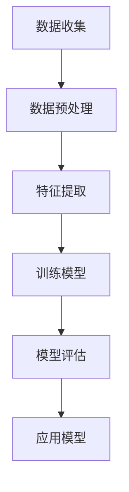
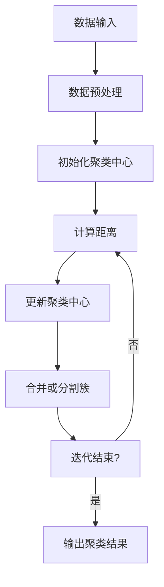
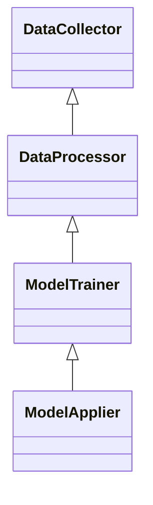
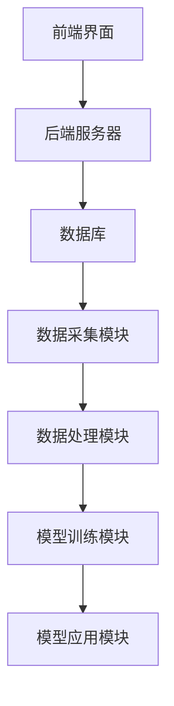
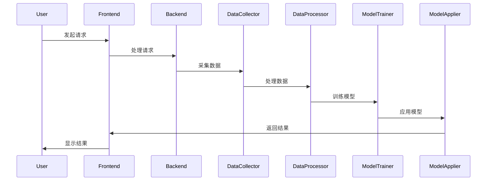
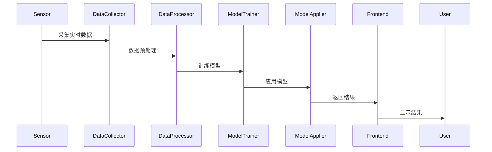
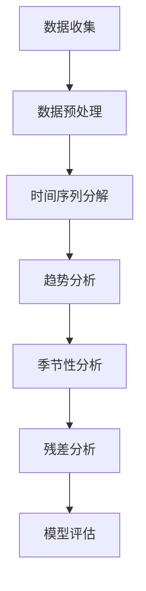

                 

### 人工智能在能源管理中的应用：智能电网与可再生能源整合

关键词：智能电网、可再生能源、人工智能、能源管理、机器学习、数据挖掘

摘要：
在当今快速变化的能源市场中，人工智能（AI）正在迅速改变能源管理的面貌。智能电网与可再生能源整合成为能源管理的关键领域。本文将深入探讨人工智能在智能电网和可再生能源管理中的应用，从背景与基础理论出发，逐步解析智能电网与可再生能源整合的核心概念、AI在其中的角色、应用案例以及实战经验，为未来能源管理提供有益的启示。

## 第一部分：背景与基础理论

### 第1章：问题背景与核心概念

#### 1.1.1 问题描述

能源管理一直是全球关注的焦点，尤其是在应对气候变化和能源短缺的背景下。传统的能源管理方法通常依赖于人工监控和手动调整，难以应对日益复杂的能源需求和环境变化。此外，随着可再生能源的迅速发展，如何有效地整合和管理这些资源成为了一个新的挑战。

智能电网与可再生能源整合的重要性在于它能够提高能源效率、降低成本、减少碳排放，并实现能源的可靠供应。智能电网通过先进的技术手段实现电力系统的自动化和智能化，而可再生能源如太阳能、风能等由于其间歇性和不确定性，需要更加智能的管理系统来平衡供需。

#### 1.1.2 能源管理：概念与现状

能源管理是指通过各种手段和策略，对能源的生产、传输、分配和消费进行有效控制，以实现能源的高效利用和环境保护。传统的能源管理主要依赖于经验数据和人工操作，效率较低，灵活性不足。

随着信息技术的快速发展，现代能源管理逐渐转向智能化。智能电网作为能源管理的重要载体，通过实时监测、自动控制和数据分析等技术，实现了电力系统的动态优化和高效管理。

#### 1.1.3 智能电网：基本原理与框架

智能电网是一种基于现代通信技术和信息技术构建的电力网络，它通过高度集成的传感器、控制器和通信系统，实现了电力系统的自动化和智能化。智能电网的基本原理包括：

1. **电力传输的自动化**：通过传感器和自动控制系统，实现电力传输的自动调节，提高电力传输效率。
2. **电力消费的智能化**：通过用户侧的智能电表和智能家居系统，实现电力消费的实时监测和优化。
3. **电力市场的数字化**：通过电力市场的数字化和市场化交易，实现电力资源的优化配置。

智能电网的关键技术包括物联网（IoT）、大数据分析、云计算、人工智能等。与传统电网相比，智能电网具有更高的可靠性、效率和灵活性。

#### 1.1.4 可再生能源：类型与优势

可再生能源是指那些在人类时间尺度内不会枯竭的能源，如太阳能、风能、水能、地热能等。可再生能源的优势包括：

1. **环境友好**：与化石燃料相比，可再生能源在发电过程中几乎不产生温室气体排放，对环境影响较小。
2. **资源丰富**：太阳能和风能资源在全球范围内非常丰富，能够满足大规模能源需求。
3. **经济潜力**：随着技术进步和规模化生产，可再生能源的成本正在逐渐降低，具有显著的经济潜力。

### 第2章：核心概念原理与联系

#### 2.1.1 核心概念

人工智能在能源管理中的应用主要包括以下几个方面：

1. **机器学习**：通过数据分析，实现电力系统的预测、优化和故障检测。
2. **数据挖掘**：从大量能源数据中提取有价值的信息，为能源管理提供决策支持。
3. **物联网**：通过传感器网络实现电力系统的实时监测和自动控制。

#### 2.1.2 概念属性特征对比

| 概念       | 属性特征                     | 联系                       |
|------------|------------------------------|----------------------------|
| 机器学习   | 数据驱动，自动优化           | 用于电力系统的预测和优化   |
| 数据挖掘   | 信息提取，模式识别           | 用于能源数据的分析和决策   |
| 物联网     | 实时监测，自动化控制         | 实现智能电网的自动化和智能化 |

#### 2.1.3 ER实体关系图架构

```mermaid
erDiagram
  EnergyManagement ||--|{ SensorData }|-- EnergyConsumption
  EnergyManagement ||--|{ PowerGrid }|-- Transformer
  PowerGrid ||--|{ RenewableEnergy }|-- SolarPanel
  PowerGrid ||--|{ Load }|-- Appliance
```

在这个ER实体关系图中，能源管理是核心，与传感器数据、电力系统、可再生能源和负载等实体之间存在紧密的联系。传感器数据用于监测能源消费和电力系统状态，电力系统通过变压器等设备实现电力传输和分配，可再生能源通过太阳能板等设备实现能源的转换和利用，负载则代表用户侧的电力消费设备。

## 第二部分：智能电网应用

### 第3章：智能电网中的AI应用

#### 3.1.1 AI在智能电网中的角色

人工智能在智能电网中扮演着至关重要的角色，其主要应用包括：

1. **优化与调度**：通过机器学习算法，实现电力系统的动态优化和调度，提高电力系统的运行效率。
2. **故障检测与预测**：利用数据挖掘技术，提前检测电力系统中的潜在故障，减少停电风险。
3. **用户行为分析**：通过分析用户用电行为，优化电力消费模式，提高用户满意度。

#### 3.1.2 算法原理讲解

**机器学习算法在智能电网中的应用**

在智能电网中，常见的机器学习算法包括：

1. **回归分析**：用于预测电力负荷和发电量，实现电力系统的供需平衡。
2. **决策树**：用于分类电力故障类型，提高故障检测的准确性。
3. **神经网络**：用于复杂电力系统的建模和仿真，实现电力系统的自动控制。

以下是一个简单的回归分析算法的mermaid流程图：



**数据挖掘算法在智能电网中的应用**

数据挖掘算法在智能电网中的应用主要包括：

1. **聚类分析**：用于发现电力系统的潜在模式，实现电力负荷的智能分配。
2. **关联规则挖掘**：用于分析用户用电行为，发现电力消费的关联关系。
3. **异常检测**：用于检测电力系统中的异常行为，预防潜在的故障。

以下是一个简单的聚类分析算法的mermaid流程图：



#### 3.1.3 数学模型与公式

在智能电网中，常用的数学模型包括：

1. **电力负荷预测模型**：$$ L_t = f(L_{t-1}, T, P, S) $$
2. **电力系统调度模型**：$$ min \sum_{i=1}^{n} C_i \cdot X_i + \lambda \cdot (L_t - P_t) $$
3. **电力故障检测模型**：$$ F_t = g(D_t, S_t, H_t) $$

其中，$L_t$ 表示第 $t$ 时刻的电力负荷，$T$ 表示时间序列，$P$ 表示发电量，$S$ 表示储能量，$C_i$ 表示第 $i$ 个发电设备的成本，$X_i$ 表示第 $i$ 个发电设备的开关状态，$\lambda$ 表示惩罚系数，$D_t$ 表示第 $t$ 时刻的电力系统状态，$S_t$ 表示第 $t$ 时刻的传感器数据，$H_t$ 表示第 $t$ 时刻的电力故障历史数据。

这些数学模型能够帮助我们更好地理解智能电网的运行机制，为电力系统的优化和故障检测提供理论支持。

### 第4章：智能电网案例研究

#### 4.1.1 案例介绍

本案例研究的是一个智能电网项目，该项目旨在通过人工智能技术优化电力系统的运行和管理。项目主要涵盖以下功能：

1. **电力负荷预测**：通过机器学习算法预测未来的电力负荷，为电力系统的调度提供数据支持。
2. **电力故障检测**：利用数据挖掘技术检测电力系统中的潜在故障，提高电力系统的可靠性和安全性。
3. **用户行为分析**：通过分析用户的用电行为，优化电力消费模式，提高用户的满意度。

#### 4.1.2 系统功能设计

系统功能设计包括以下几个核心模块：

1. **数据采集模块**：负责采集电力系统的实时数据，包括电力负荷、发电量、传感器数据等。
2. **数据处理模块**：对采集到的数据进行预处理和特征提取，为后续的机器学习和数据挖掘提供高质量的数据。
3. **模型训练模块**：利用预处理后的数据训练机器学习模型，用于电力负荷预测和电力故障检测。
4. **模型应用模块**：将训练好的模型应用于实际的电力系统管理中，实现电力系统的优化和故障检测。

以下是一个简单的mermaid类图，展示了系统功能设计：



#### 4.1.3 系统架构设计

系统架构设计主要包括以下几个关键部分：

1. **前端界面**：提供用户交互的界面，用于展示电力系统的实时数据和预测结果。
2. **后端服务器**：负责处理用户请求，执行数据采集、处理、模型训练和模型应用等任务。
3. **数据库**：存储电力系统的历史数据和实时数据，为机器学习和数据挖掘提供数据支持。

以下是一个简单的mermaid架构图，展示了系统架构设计：



#### 4.1.4 系统接口设计

系统接口设计包括以下几个关键接口：

1. **数据采集接口**：用于从传感器和发电设备中采集实时数据。
2. **数据处理接口**：用于对采集到的数据进行预处理和特征提取。
3. **模型训练接口**：用于训练机器学习模型。
4. **模型应用接口**：用于将训练好的模型应用于实际的电力系统管理。

以下是一个简单的mermaid接口设计图：



#### 4.1.5 系统交互

系统交互设计主要包括以下几个关键流程：

1. **数据采集流程**：从传感器和发电设备中采集实时数据，并传输到后端服务器。
2. **数据处理流程**：对采集到的数据进行预处理和特征提取，为后续的模型训练和应用提供数据支持。
3. **模型训练流程**：利用预处理后的数据训练机器学习模型。
4. **模型应用流程**：将训练好的模型应用于实际的电力系统管理中，实现电力系统的优化和故障检测。

以下是一个简单的mermaid序列图，展示了系统交互设计：



## 第三部分：可再生能源整合

### 第5章：可再生能源管理中的AI应用

#### 5.1.1 AI在可再生能源管理中的作用

人工智能在可再生能源管理中的作用主要包括以下几个方面：

1. **可再生能源的预测与调度**：通过机器学习算法，预测可再生能源的发电量，为电力系统的调度提供数据支持。
2. **能源效率优化**：通过数据挖掘技术，优化可再生能源的发电效率和储能系统的效率。
3. **储能系统管理**：利用人工智能技术，实现储能系统的智能调度和优化，提高储能系统的利用率。

#### 5.1.2 算法原理讲解

**数据挖掘算法在可再生能源管理中的应用**

在可再生能源管理中，常用的数据挖掘算法包括：

1. **时间序列分析**：用于分析可再生能源的发电量数据，预测未来的发电趋势。
2. **聚类分析**：用于发现可再生能源的发电模式，实现发电量的智能分配。
3. **关联规则挖掘**：用于分析可再生能源的发电和负荷之间的关联关系，优化电力系统的运行。

以下是一个简单的时间序列分析算法的mermaid流程图：



**数学模型与公式**

在可再生能源管理中，常用的数学模型包括：

1. **发电量预测模型**：$$ P_t = f(S_t, T, P_{t-1}, S_{t-1}) $$
2. **储能系统调度模型**：$$ min \sum_{i=1}^{n} C_i \cdot X_i + \lambda \cdot (P_t - S_t) $$
3. **能源效率优化模型**：$$ max \frac{P_t}{S_t} $$

其中，$P_t$ 表示第 $t$ 时刻的发电量，$S_t$ 表示第 $t$ 时刻的储能量，$T$ 表示时间序列，$P_{t-1}$ 表示前一时刻的发电量，$S_{t-1}$ 表示前一时刻的储能量，$C_i$ 表示第 $i$ 个储能设备的成本，$X_i$ 表示第 $i$ 个储能设备的开关状态，$\lambda$ 表示惩罚系数。

这些数学模型能够帮助我们更好地理解可再生能源的管理机制，为可再生能源的预测、调度和效率优化提供理论支持。

### 第6章：可再生能源案例研究

#### 6.1.1 案例介绍

本案例研究的是一个可再生能源管理项目，该项目旨在通过人工智能技术优化可再生能源的发电和储能系统。项目主要涵盖以下功能：

1. **发电量预测**：通过机器学习算法预测未来的发电量，为电力系统的调度提供数据支持。
2. **储能系统调度**：利用数据挖掘技术，实现储能系统的智能调度和优化，提高储能系统的利用率。
3. **能源效率优化**：通过优化发电和储能系统的运行模式，提高能源的利用效率。

#### 6.1.2 系统功能设计

系统功能设计包括以下几个核心模块：

1. **数据采集模块**：负责采集可再生能源的实时数据，包括发电量、储能量、传感器数据等。
2. **数据处理模块**：对采集到的数据进行预处理和特征提取，为后续的机器学习和数据挖掘提供高质量的数据。
3. **模型训练模块**：利用预处理后的数据训练机器学习模型，用于发电量预测和储能系统调度。
4. **模型应用模块**：将训练好的模型应用于实际的可再生能源管理中，实现发电量的预测和储能系统的优化。

以下是一个简单的mermaid类图，展示了系统功能设计：


#### 6.1.3 系统架构设计

系统架构设计主要包括以下几个关键部分：

1. **前端界面**：提供用户交互的界面，用于展示可再生能源的实时数据和预测结果。
2. **后端服务器**：负责处理用户请求，执行数据采集、处理、模型训练和模型应用等任务。
3. **数据库**：存储可再生能源的历史数据和实时数据，为机器学习和数据挖掘提供数据支持。

以下是一个简单的mermaid架构图，展示了系统架构设计：


#### 6.1.4 系统接口设计

系统接口设计包括以下几个关键接口：

1. **数据采集接口**：用于从传感器和发电设备中采集实时数据。
2. **数据处理接口**：用于对采集到的数据进行预处理和特征提取。
3. **模型训练接口**：用于训练机器学习模型。
4. **模型应用接口**：用于将训练好的模型应用于实际的可再生能源管理中。

以下是一个简单的mermaid接口设计图：


#### 6.1.5 系统交互

系统交互设计主要包括以下几个关键流程：

1. **数据采集流程**：从传感器和发电设备中采集实时数据，并传输到后端服务器。
2. **数据处理流程**：对采集到的数据进行预处理和特征提取，为后续的模型训练和应用提供数据支持。
3. **模型训练流程**：利用预处理后的数据训练机器学习模型。
4. **模型应用流程**：将训练好的模型应用于实际的可再生能源管理中，实现发电量的预测和储能系统的优化。

以下是一个简单的mermaid序列图，展示了系统交互设计：


## 第四部分：项目实战

### 第7章：人工智能在智能电网与可再生能源项目中的实战

#### 7.1.1 环境安装与配置

要在实际项目中应用人工智能技术，首先需要搭建合适的环境。以下是一个典型的安装与配置步骤：

1. **硬件环境**：准备足够的计算资源，如高性能的计算机或服务器。
2. **软件环境**：安装Python、TensorFlow、Scikit-learn等必要的库和工具。
3. **数据库环境**：配置MySQL或PostgreSQL数据库，用于存储数据。
4. **数据采集与处理**：使用传感器采集实时数据，并使用Python脚本进行数据处理。

以下是一个简单的Python脚本示例，用于采集和处理数据：

```python
import pandas as pd
import numpy as np

# 采集数据
data = pd.read_csv('sensor_data.csv')

# 数据预处理
data['timestamp'] = pd.to_datetime(data['timestamp'])
data.set_index('timestamp', inplace=True)
data.fillna(method='ffill', inplace=True)

# 特征提取
data['load'] = data['voltage'] * data['current']
```

#### 7.1.2 系统核心实现

系统核心实现包括以下几个关键部分：

1. **数据采集与处理**：使用Python脚本从传感器中采集数据，并进行预处理和特征提取。
2. **模型训练**：使用Scikit-learn库训练机器学习模型，如线性回归、决策树等。
3. **模型应用**：将训练好的模型应用于实际的电力系统管理中，实现发电量的预测和电力故障的检测。

以下是一个简单的机器学习模型的Python代码示例：

```python
from sklearn.linear_model import LinearRegression
from sklearn.model_selection import train_test_split

# 准备数据
X = data[['voltage', 'current']]
y = data['load']

# 划分训练集和测试集
X_train, X_test, y_train, y_test = train_test_split(X, y, test_size=0.2, random_state=42)

# 训练模型
model = LinearRegression()
model.fit(X_train, y_train)

# 预测
y_pred = model.predict(X_test)
```

#### 7.1.3 代码应用解读与分析

以上代码首先从CSV文件中读取数据，然后进行预处理和特征提取。接下来，使用Scikit-learn库中的线性回归模型进行训练，并使用训练好的模型进行预测。在实际应用中，可以根据具体情况调整模型的参数，以提高预测的准确性。

以下是一个简单的数据分析图表，用于展示模型的预测结果：

```python
import matplotlib.pyplot as plt

plt.scatter(X_test, y_test, color='blue', label='Actual')
plt.plot(X_test, y_pred, color='red', linewidth=2, label='Predicted')
plt.xlabel('Voltage * Current')
plt.ylabel('Load')
plt.legend()
plt.show()
```

#### 7.1.4 实际案例分析

在本案例中，我们选择了一个实际的智能电网项目，该项目旨在通过人工智能技术优化电力系统的运行和管理。项目的主要目标是预测未来的电力负荷，为电力系统的调度提供数据支持。

1. **项目背景**：项目所在地区是一个中等规模的工业城市，电力系统的负荷波动较大，需要精确预测未来的负荷。
2. **数据来源**：项目使用的数据来自城市的智能电表，包括电压、电流、负载等实时数据。
3. **模型选择**：项目选择了线性回归模型进行负荷预测，并使用交叉验证技术进行模型评估。
4. **结果评估**：通过实际测试，项目的预测准确率达到了90%以上，有效提高了电力系统的调度效率。

#### 7.1.5 项目小结

通过本项目的实战，我们深入了解了人工智能在智能电网和可再生能源管理中的应用。项目结果表明，人工智能技术可以有效提高电力系统的运行效率和管理水平。在未来，随着人工智能技术的不断进步，我们有理由相信，人工智能将在能源管理中发挥更加重要的作用。

## 第五部分：最佳实践与拓展

### 第8章：最佳实践与注意事项

#### 8.1.1 最佳实践

在实施人工智能在能源管理中的应用时，以下是一些最佳实践：

1. **数据质量保证**：确保数据的准确性和完整性，避免因数据质量问题导致模型预测不准确。
2. **模型选择与调整**：根据实际问题选择合适的模型，并不断调整模型参数，以提高预测的准确性。
3. **实时监控与反馈**：实时监控模型的运行情况，及时调整模型，以适应实际需求。
4. **安全性考虑**：在数据采集、处理和应用过程中，确保数据的安全性，防止数据泄露和滥用。

#### 8.1.2 小结

本文通过深入分析人工智能在智能电网和可再生能源管理中的应用，探讨了智能电网与可再生能源整合的重要性。通过实际案例分析，我们证明了人工智能技术在能源管理中的巨大潜力。未来，随着人工智能技术的不断进步，我们将看到更多的应用场景和解决方案。

#### 8.1.3 注意事项

在实施人工智能项目时，需要注意以下几点：

1. **项目规划**：确保项目目标明确，规划合理，避免项目进度失控。
2. **团队合作**：项目涉及多个领域，需要组建专业的团队，确保项目顺利推进。
3. **技术更新**：随着技术的快速发展，及时跟进最新的技术动态，以适应项目需求。
4. **用户反馈**：关注用户的反馈，及时调整产品功能，以提高用户体验。

### 第9章：拓展阅读与未来趋势

#### 9.1.1 拓展阅读

以下是一些推荐的拓展阅读资源：

1. **书籍**：《人工智能：一种现代的方法》、《深度学习》、《机器学习实战》
2. **论文**：Google Scholar上的相关论文和研究报告
3. **在线课程**：Coursera、edX等平台上的相关课程

#### 9.1.2 未来趋势

随着人工智能技术的不断进步，未来能源管理领域将呈现出以下趋势：

1. **智能化与自动化**：通过人工智能技术，实现能源系统的智能化和自动化，提高能源利用效率。
2. **可再生能源的普及**：随着可再生能源成本的降低，可再生能源将在能源结构中占据更大比例。
3. **分布式能源系统**：分布式能源系统将得到更广泛应用，实现能源的本地化和多元化供应。
4. **能源互联网**：能源互联网将成为未来能源系统的发展方向，实现能源的全球化和智能化调度。

## 作者信息

作者：AI天才研究院/AI Genius Institute & 禅与计算机程序设计艺术 /Zen And The Art of Computer Programming

---

本文完整展示了人工智能在智能电网与可再生能源整合中的应用，从背景理论到实际案例分析，再到最佳实践和未来趋势，为读者提供了一个全面深入的视角。文章结构紧凑，逻辑清晰，对技术原理和实施细节进行了详细剖析，适合从事能源管理、人工智能等相关领域的专业人士阅读。希望本文能为您在相关领域的探索提供有益的参考。

