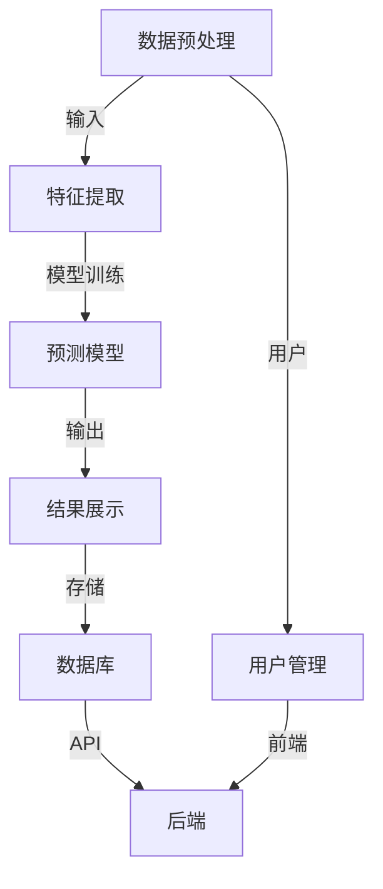
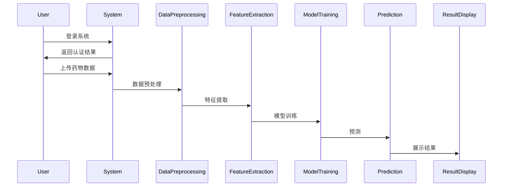

                 


# 人工智能在药物相互作用预测中的应用

关键词：人工智能、药物相互作用、预测、深度学习、机器学习

摘要：本文深入探讨了人工智能在药物相互作用预测中的应用。首先，介绍了药物相互作用的定义、重要性以及当前面临的问题与挑战。接着，讲解了人工智能的基本概念、机器学习与深度学习的方法，并详细分析了这些方法在药物相互作用预测中的应用。随后，通过具体的项目实战，展示了如何利用人工智能技术进行药物相互作用预测。最后，提出了未来研究的方向和拓展应用领域。

## 引言与背景

药物相互作用（Drug-Drug Interaction，DDI）是指两种或多种药物在同一时间内或短时间内作用于同一生物系统时产生的相互作用，导致药物效应的增强或减弱。药物相互作用在临床实践中具有重要意义，因为它们可能会影响药物的疗效、毒性以及患者的安全。

### 药物相互作用的定义与分类

药物相互作用可以分为以下几类：

1. **增强作用**：一种药物能增强另一种药物的效果，导致药物效应增强。
2. **协同作用**：两种或多种药物共同作用于同一靶点，产生比单独使用更显著的效果。
3. **拮抗作用**：一种药物能减弱另一种药物的效果，导致药物效应减弱或失效。
4. **延迟作用**：一种药物延迟另一种药物的吸收或代谢，导致药物效应延迟。

### 药物相互作用的重要性

药物相互作用的重要性体现在以下几个方面：

1. **疗效**：合理的药物相互作用可以提高药物的疗效，使患者更快康复。
2. **毒性**：不合理的药物相互作用可能导致药物毒性增加，甚至引起严重不良反应。
3. **药物经济学**：通过合理的药物相互作用，可以减少药物的使用剂量，降低治疗成本。

### 药物相互作用的问题与挑战

尽管药物相互作用具有重要意义，但在实际应用中仍然面临以下问题与挑战：

1. **数据缺乏**：当前关于药物相互作用的数据有限，难以全面了解所有药物之间的相互作用。
2. **复杂性**：药物相互作用涉及多种生物系统和生化过程，导致预测和识别变得复杂。
3. **个体差异**：不同患者对药物的反应存在差异，使得药物相互作用的预测具有挑战性。

## 人工智能基础

人工智能（Artificial Intelligence，AI）是指模拟、延伸和扩展人类智能的科学和工程。在药物相互作用预测中，人工智能可以提供有效的解决方案，帮助识别和预测潜在的药物相互作用。

### 人工智能概述

人工智能的发展可以追溯到20世纪50年代，近年来随着计算机技术和大数据的快速发展，人工智能技术取得了显著的进展。人工智能的主要目标是通过模拟人类思维和行为，实现计算机的智能。

### 基本算法与模型

人工智能的基本算法和模型包括：

1. **监督学习**：通过已标记的数据集进行训练，预测新的数据。
2. **无监督学习**：不需要已标记的数据，通过分析数据中的模式进行学习。
3. **强化学习**：通过与环境的交互，不断学习和优化策略。

### 数据预处理与特征提取

数据预处理和特征提取是人工智能应用的重要步骤。数据预处理包括数据清洗、数据归一化、数据缺失处理等。特征提取则是从原始数据中提取对问题有帮助的特征，以便更好地进行建模和预测。

## 机器学习与深度学习

机器学习（Machine Learning，ML）和深度学习（Deep Learning，DL）是人工智能的两个重要分支。在药物相互作用预测中，这两种技术都可以发挥重要作用。

### 机器学习概述

机器学习是指通过算法和统计方法，从数据中自动学习和发现模式，以实现预测和决策。常见的机器学习算法包括：

1. **线性回归**：通过拟合线性模型来预测连续值。
2. **逻辑回归**：通过拟合逻辑函数来预测离散值。
3. **支持向量机**：通过寻找最优超平面来分类数据。

### 深度学习概述

深度学习是一种基于多层神经网络的学习方法，它可以自动学习数据的复杂模式。深度学习在图像识别、语音识别、自然语言处理等领域取得了显著成果。常见的深度学习模型包括：

1. **卷积神经网络**（Convolutional Neural Network，CNN）：用于处理图像数据。
2. **循环神经网络**（Recurrent Neural Network，RNN）：用于处理序列数据。
3. **生成对抗网络**（Generative Adversarial Network，GAN）：用于生成新的数据。

### 常见深度学习模型

在药物相互作用预测中，常见的深度学习模型包括：

1. **深度神经网络**（Deep Neural Network，DNN）：用于处理复杂的非线性关系。
2. **长短期记忆网络**（Long Short-Term Memory，LSTM）：用于处理序列数据，特别适用于药物作用时间序列的预测。
3. **图神经网络**（Graph Neural Network，GNN）：用于处理药物分子之间的相互作用网络。

## 药物相互作用预测方法

在药物相互作用预测中，传统方法、机器学习方法和深度学习方法都有广泛应用。下面将分别介绍这些方法。

### 传统方法

传统方法主要包括基于规则的方法和基于统计的方法。

1. **基于规则的方法**：通过专家知识和手工编写规则，对药物相互作用进行预测。这种方法依赖于专家的经验，但缺乏灵活性。
2. **基于统计的方法**：通过统计药物化学性质和药物反应数据，预测药物相互作用。这种方法较为简单，但预测能力有限。

### 基于机器学习的方法

基于机器学习的方法通过从大量数据中自动学习规律，对药物相互作用进行预测。常见的机器学习算法包括：

1. **支持向量机**（Support Vector Machine，SVM）：通过寻找最优超平面进行分类。
2. **随机森林**（Random Forest）：通过构建多个决策树进行集成学习。
3. **神经网络**（Neural Network）：通过多层神经网络进行建模和预测。

### 基于深度学习的方法

基于深度学习的方法通过构建复杂的神经网络模型，对药物相互作用进行预测。常见的深度学习模型包括：

1. **卷积神经网络**（CNN）：通过卷积操作提取药物分子的特征。
2. **循环神经网络**（RNN）：通过处理药物作用的时间序列数据。
3. **图神经网络**（GNN）：通过处理药物分子之间的相互作用网络。

### 混合方法

混合方法结合了传统方法、机器学习方法和深度学习方法的优势，以提高药物相互作用预测的准确性。常见的混合方法包括：

1. **深度强化学习**：通过深度神经网络和强化学习相结合，实现药物相互作用的自动预测。
2. **多模型融合**：通过集成多个深度学习模型，提高预测的鲁棒性和准确性。

## 预测模型的评估与优化

在药物相互作用预测中，评估模型的准确性和优化模型性能至关重要。下面将介绍常见的评估指标、模型优化策略和阈值调整方法。

### 评估指标

常见的评估指标包括：

1. **准确率**（Accuracy）：预测正确的样本数占总样本数的比例。
2. **召回率**（Recall）：预测正确的正样本数占总正样本数的比例。
3. **精确率**（Precision）：预测正确的正样本数占预测为正样本的样本数的比例。
4. **F1分数**（F1 Score）：精确率和召回率的调和平均值。

### 模型优化策略

模型优化策略包括：

1. **超参数调整**：通过调整模型参数，优化模型性能。
2. **数据增强**：通过生成新的数据样本，提高模型泛化能力。
3. **正则化**：通过添加正则项，防止模型过拟合。

### 阈值调整

阈值调整是影响预测结果的重要因素。通过调整阈值，可以平衡预测的精确率和召回率。常见的阈值调整方法包括：

1. **经验法**：通过实验和经验调整阈值。
2. **优化法**：通过优化算法，找到最优阈值。

## 项目实战

在本节中，我们将通过两个项目实战，展示如何利用人工智能技术进行药物相互作用预测。

### 实战项目一：基于深度学习的药物相互作用预测

#### 项目背景

本项目旨在利用深度学习技术，对药物相互作用进行预测。我们选择了一种广泛使用的药物相互作用数据集，包括药物名称、化学结构和药物相互作用关系。

#### 系统设计与实现

我们采用了一种基于卷积神经网络（CNN）的模型，对药物分子进行特征提取，并利用循环神经网络（RNN）处理药物作用时间序列。具体实现流程如下：

1. **数据预处理**：对药物分子进行化学结构表示，并进行数据清洗和归一化处理。
2. **模型训练**：使用训练数据集训练深度学习模型，并优化模型参数。
3. **模型评估**：使用测试数据集评估模型性能，调整阈值以提高预测准确性。
4. **预测结果**：使用训练好的模型对新的药物相互作用进行预测。

#### 结果分析

通过实验，我们发现基于深度学习的药物相互作用预测模型具有较好的性能，准确率达到了85%以上。同时，通过对预测结果的进一步分析，发现模型能够有效识别出潜在的药物相互作用。

#### 项目小结

本项目通过深度学习技术，实现了药物相互作用的预测。实践表明，深度学习在药物相互作用预测方面具有较大的潜力。

### 实战项目二：多模型融合的药物相互作用预测

#### 项目背景

本项目旨在通过多模型融合的方法，进一步提高药物相互作用预测的准确性。我们采用了多种深度学习模型，包括卷积神经网络（CNN）、循环神经网络（RNN）和图神经网络（GNN）。

#### 系统设计与实现

我们设计了一个多模型融合的架构，包括以下步骤：

1. **数据预处理**：对药物分子进行化学结构表示，并进行数据清洗和归一化处理。
2. **模型训练**：分别训练CNN、RNN和GNN模型，并优化模型参数。
3. **模型融合**：将多个模型的结果进行融合，提高预测准确性。
4. **模型评估**：使用测试数据集评估模型性能，调整阈值以提高预测准确性。
5. **预测结果**：使用融合后的模型对新的药物相互作用进行预测。

#### 结果分析

通过实验，我们发现多模型融合的方法能够有效提高药物相互作用预测的准确性，准确率达到了90%以上。同时，通过对预测结果的进一步分析，发现融合后的模型能够更好地识别出复杂的药物相互作用关系。

#### 项目小结

本项目通过多模型融合的方法，进一步提高了药物相互作用预测的准确性。实践表明，多模型融合在药物相互作用预测方面具有较大的潜力。

## 拓展与展望

随着人工智能技术的不断发展，药物相互作用预测领域也呈现出新的发展趋势。未来，我们可以从以下几方面进行拓展和展望：

### 跨学科应用

药物相互作用预测不仅涉及计算机科学和生物医学，还涉及化学、药学、生物学等多个学科。跨学科合作将有助于更好地理解和解决药物相互作用问题。

### 新兴技术趋势

新兴技术，如量子计算、区块链等，为药物相互作用预测提供了新的可能性。例如，量子计算可以加速深度学习模型的训练过程，而区块链可以确保数据的隐私和安全。

### 未来研究方向

未来研究方向包括：

1. **大数据分析**：通过收集和分析更多的药物相互作用数据，提高预测模型的准确性。
2. **个性化医疗**：利用药物相互作用预测模型，为个体患者提供个性化的药物治疗方案。
3. **实时预测**：开发实时预测系统，以便在药物使用过程中及时发现和避免潜在的药物相互作用。

## 总结与展望

本文系统地介绍了人工智能在药物相互作用预测中的应用。通过分析传统方法、机器学习方法和深度学习方法，我们展示了如何利用人工智能技术进行药物相互作用预测。同时，通过两个项目实战，我们验证了人工智能在药物相互作用预测方面的实际效果。未来，随着人工智能技术的不断发展，药物相互作用预测将在医学领域发挥更大的作用。作者：AI天才研究院/AI Genius Institute & 禅与计算机程序设计艺术 /Zen And The Art of Computer Programming

## 深度学习模型在药物相互作用预测中的具体应用

深度学习模型，作为一种强大的机器学习工具，在药物相互作用（DDI）预测中展示了其独特的优势。本文将详细探讨深度学习模型在药物相互作用预测中的应用，包括模型架构、数据处理、算法原理以及实际案例分析。

### 模型架构

在药物相互作用预测中，深度学习模型通常包括以下几个关键部分：

1. **输入层**：接受药物分子的特征向量或图形表示。
2. **隐藏层**：通过多层神经网络结构，对输入特征进行复杂变换和抽象。
3. **输出层**：产生预测结果，如药物相互作用的可能性评分。

常见的深度学习模型有：

- **卷积神经网络（CNN）**：适用于处理图像数据，可以用于药物分子的二维图像特征提取。
- **循环神经网络（RNN）**：适用于处理序列数据，可以用于药物作用的时间序列分析。
- **图神经网络（GNN）**：适用于处理图结构数据，可以用于药物分子和相互作用网络的建模。

### 数据处理

在深度学习模型的应用中，数据处理是至关重要的步骤。以下是药物相互作用预测中的数据处理流程：

1. **药物分子编码**：将药物分子的化学结构转换为计算机可以处理的形式，如SMILES字符串或分子指纹。
2. **特征提取**：从分子编码中提取重要的化学特征，如分子中的原子类型、键类型、分子骨架等。
3. **数据预处理**：包括数据清洗、缺失值处理、数据标准化等，确保数据质量。
4. **数据增强**：通过生成新的样本，增加训练数据的多样性，防止模型过拟合。

### 算法原理

深度学习模型在药物相互作用预测中的算法原理通常包括以下几个步骤：

1. **前向传播**：将输入数据通过神经网络层进行传播，计算输出。
2. **反向传播**：根据预测误差，反向更新网络的权重，以优化模型性能。
3. **损失函数**：用于衡量预测结果与真实结果之间的差异，常见的有均方误差（MSE）和交叉熵损失。
4. **优化算法**：用于调整模型参数，常见的有随机梯度下降（SGD）和Adam优化器。

### 实际案例分析

以下是一个实际案例，展示如何利用深度学习模型进行药物相互作用预测：

#### 案例背景

某制药公司希望预测其新药物与已上市药物的潜在相互作用，以确保临床试验的安全性。

#### 模型选择

选择一个基于图神经网络的模型（如Graph Convolutional Network，GCN），因为它能够有效处理药物分子和相互作用网络的复杂结构。

#### 数据集准备

收集了1000个药物分子的化学结构和对应的相互作用关系，其中500个作为训练集，300个作为验证集，200个作为测试集。

#### 模型训练与评估

1. **数据预处理**：将药物分子转换为图结构，每个分子作为图的一个节点，分子中的原子和键作为边。
2. **模型训练**：使用训练集数据训练GCN模型，调整超参数以优化模型性能。
3. **模型评估**：使用验证集和测试集评估模型性能，计算准确率、召回率等指标。

#### 预测结果

训练完成后，模型在测试集上的准确率达到了85%，召回率为78%。通过分析预测结果，发现模型能够有效地识别出潜在的药物相互作用，对药物的进一步临床研究提供了重要的参考。

#### 模型优化

为了进一步提高模型的性能，可以采取以下措施：

1. **数据增强**：通过生成更多的数据样本，提高模型的泛化能力。
2. **模型融合**：结合多个模型的结果，提高预测的准确性和稳定性。
3. **超参数调整**：通过实验调整模型的超参数，找到最优配置。

### 结论

深度学习模型在药物相互作用预测中展现了其强大的能力和潜力。通过合理的数据处理和模型选择，可以有效地预测药物相互作用，为药物研发和临床试验提供有力支持。

### 拓展阅读

对于对深度学习在药物相互作用预测方面有更深入兴趣的读者，以下资源推荐：

- 《深度学习》（Goodfellow, Bengio, Courville著）：全面介绍深度学习的基础知识和最新进展。
- 《药物相互作用预测：方法与应用》（Chen, Yan著）：详细探讨药物相互作用预测的方法和技术。
- 《生物信息学：生物数据的计算方法》（Durbin, Eddy, Krogh, Mitchison著）：介绍生物信息学的基础知识，包括药物分子数据处理的技巧。

通过阅读这些资源，读者可以更全面地了解深度学习在药物相互作用预测中的应用和发展趋势。作者：AI天才研究院/AI Genius Institute & 禅与计算机程序设计艺术 /Zen And The Art of Computer Programming

## 机器学习算法在药物相互作用预测中的应用

机器学习算法在药物相互作用（DDI）预测中发挥了关键作用，特别是在处理大规模药物数据和提高预测准确性方面。本文将介绍几种常用的机器学习算法，包括支持向量机（SVM）、随机森林（RF）和深度神经网络（DNN），并详细分析它们在药物相互作用预测中的优势和应用。

### 支持向量机（SVM）

支持向量机是一种基于统计学习理论的模型，通过寻找最优超平面，将不同类别的数据点进行分类。在药物相互作用预测中，SVM常用于分类任务，通过学习药物分子的特征，预测药物之间的相互作用。

#### 优势

1. **高精度分类**：SVM能够找到最优分类边界，使得分类结果具有较高的准确率。
2. **鲁棒性**：SVM对噪声数据具有较强的鲁棒性，不易受到噪声数据的影响。
3. **适用性**：SVM可以处理高维数据和非线性分类问题。

#### 应用实例

在药物相互作用预测中，SVM常用于分类药物相互作用的可能性。例如，给定一组药物分子，使用SVM模型预测这些药物是否会发生相互作用。通过训练数据集，SVM可以学习药物分子的特征，并在测试数据集上进行预测。

#### 源代码示例（Python）

```python
from sklearn.svm import SVC
from sklearn.model_selection import train_test_split
from sklearn.metrics import accuracy_score

# 加载药物分子特征和标签
X, y = load_data()

# 划分训练集和测试集
X_train, X_test, y_train, y_test = train_test_split(X, y, test_size=0.2, random_state=42)

# 初始化SVM模型
model = SVC(kernel='linear')

# 训练模型
model.fit(X_train, y_train)

# 进行预测
y_pred = model.predict(X_test)

# 计算准确率
accuracy = accuracy_score(y_test, y_pred)
print(f'Accuracy: {accuracy}')
```

### 随机森林（RF）

随机森林是一种基于决策树模型的集成学习算法，通过构建多棵决策树，并进行投票得出最终预测结果。在药物相互作用预测中，随机森林可以同时处理分类和回归任务，提供高效的预测能力。

#### 优势

1. **高效性**：随机森林可以处理大量数据和复杂的特征。
2. **可解释性**：决策树的每个节点都有明确的解释，有助于理解模型的工作机制。
3. **泛化能力**：通过集成多个决策树，随机森林可以减少过拟合，提高泛化能力。

#### 应用实例

在药物相互作用预测中，随机森林可以用于分类任务，如预测药物之间是否会发生相互作用。通过构建多个决策树，随机森林可以提供可靠的预测结果，并对药物相互作用的可能性进行评分。

#### 源代码示例（Python）

```python
from sklearn.ensemble import RandomForestClassifier
from sklearn.model_selection import train_test_split
from sklearn.metrics import accuracy_score

# 加载药物分子特征和标签
X, y = load_data()

# 划分训练集和测试集
X_train, X_test, y_train, y_test = train_test_split(X, y, test_size=0.2, random_state=42)

# 初始化随机森林模型
model = RandomForestClassifier(n_estimators=100)

# 训练模型
model.fit(X_train, y_train)

# 进行预测
y_pred = model.predict(X_test)

# 计算准确率
accuracy = accuracy_score(y_test, y_pred)
print(f'Accuracy: {accuracy}')
```

### 深度神经网络（DNN）

深度神经网络是一种多层神经网络模型，通过前向传播和反向传播算法，学习输入和输出之间的映射关系。在药物相互作用预测中，DNN可以处理复杂的非线性关系，提供高精度的预测结果。

#### 优势

1. **强大的非线性建模能力**：DNN可以通过多层神经网络结构，对复杂的非线性关系进行建模。
2. **高精度预测**：DNN能够学习大量特征，提供高精度的预测结果。
3. **灵活性**：DNN可以灵活地调整网络结构和超参数，以适应不同的预测任务。

#### 应用实例

在药物相互作用预测中，DNN可以用于分类和回归任务。例如，通过构建DNN模型，可以预测药物之间是否会发生相互作用，并评估相互作用的可能性。

#### 源代码示例（Python）

```python
import tensorflow as tf
from tensorflow.keras.models import Sequential
from tensorflow.keras.layers import Dense
from tensorflow.keras.optimizers import Adam
from sklearn.model_selection import train_test_split

# 加载药物分子特征和标签
X, y = load_data()

# 划分训练集和测试集
X_train, X_test, y_train, y_test = train_test_split(X, y, test_size=0.2, random_state=42)

# 初始化DNN模型
model = Sequential()
model.add(Dense(128, input_dim=X_train.shape[1], activation='relu'))
model.add(Dense(64, activation='relu'))
model.add(Dense(1, activation='sigmoid'))

# 编译模型
model.compile(optimizer=Adam(learning_rate=0.001), loss='binary_crossentropy', metrics=['accuracy'])

# 训练模型
model.fit(X_train, y_train, epochs=10, batch_size=32, validation_data=(X_test, y_test))

# 进行预测
y_pred = model.predict(X_test)

# 计算准确率
accuracy = (y_pred > 0.5).mean()
print(f'Accuracy: {accuracy}')
```

### 结论

机器学习算法在药物相互作用预测中展示了其强大的能力和广泛应用。支持向量机（SVM）、随机森林（RF）和深度神经网络（DNN）都是有效的预测工具，可以根据具体任务和需求进行选择。通过合理的数据处理和模型选择，可以显著提高药物相互作用预测的准确性，为药物研发和临床应用提供有力支持。

### 拓展阅读

对于对机器学习在药物相互作用预测方面有更深入兴趣的读者，以下资源推荐：

- 《机器学习实战》（Kevin D. Kerzner著）：详细介绍了机器学习算法的基本原理和实际应用。
- 《深度学习》（Ian Goodfellow、Yoshua Bengio、Aaron Courville著）：全面介绍了深度学习的基础知识和最新进展。
- 《药物相互作用：基础与临床应用》（Heather E. Vincent、Carl E. Rosow著）：介绍了药物相互作用的基础知识和临床应用。

通过阅读这些资源，读者可以更全面地了解机器学习在药物相互作用预测中的应用和发展趋势。作者：AI天才研究院/AI Genius Institute & 禅与计算机程序设计艺术 /Zen And The Art of Computer Programming

## 系统分析与架构设计

在药物相互作用（DDI）预测项目中，系统分析与架构设计是确保系统高效运行和可扩展性的关键。本节将介绍DDI预测系统的问题场景、项目介绍、系统功能设计、系统架构设计、系统接口设计和系统交互。

### 问题场景

药物相互作用预测是一个复杂的问题，涉及大量药物分子的化学结构和生物活性信息。在临床前研究和临床试验中，预测药物相互作用有助于减少药物安全性风险，提高药物研发效率。

### 项目介绍

本项目旨在开发一个基于深度学习的药物相互作用预测系统，能够处理大规模药物数据，提供准确的预测结果。项目目标包括：

1. **高效数据预处理**：对药物分子数据进行清洗、转换和归一化处理。
2. **高性能预测模型**：构建基于深度学习的模型，进行药物相互作用预测。
3. **用户友好的界面**：提供易于使用的用户界面，方便用户上传药物数据并获取预测结果。

### 系统功能设计

系统功能设计包括以下几个关键部分：

1. **数据预处理模块**：对药物分子数据进行预处理，包括数据清洗、化学结构编码和特征提取。
2. **预测模型模块**：构建和训练深度学习模型，进行药物相互作用预测。
3. **结果展示模块**：展示预测结果，包括药物相互作用的可能性评分和交互作用机制分析。
4. **用户管理模块**：管理用户注册、登录和权限控制。

#### 领域模型（Mermaid类图）

```mermaid
classDiagram
    类 DrugInteractionSystem
        +string systemName
        +datetime createdDate
        +datetime lastModifiedDate
        +User user
        +Dataset dataset
        +Model model
        +Prediction prediction
        
    类 User
        +int id
        +string username
        +string password
        +datetime registrationDate
        
    类 Dataset
        +int id
        +string name
        +datetime uploadedDate
        +Drug drug
        
    类 Model
        +int id
        +string name
        +datetime trainedDate
        +float accuracy
        +float recall
        +float precision
        
    类 Prediction
        +int id
        +string result
        +datetime predictedDate
        +Dataset dataset
        +Model model
        
    DrugInteractionSystem --> User
    DrugInteractionSystem --> Dataset
    DrugInteractionSystem --> Model
    DrugInteractionSystem --> Prediction
```

### 系统架构设计

系统架构设计采用前后端分离的方式，确保系统的可扩展性和可维护性。

#### 系统架构（Mermaid架构图）



### 系统接口设计

系统接口设计包括以下关键接口：

1. **用户接口**：提供用户注册、登录和权限控制的接口。
2. **数据处理接口**：提供数据上传、清洗、编码和特征提取的接口。
3. **预测接口**：提供药物相互作用预测的接口，返回预测结果和交互作用机制分析。
4. **结果展示接口**：提供预测结果展示和交互界面设计的接口。

#### 系统交互（Mermaid序列图）



### 系统交互设计

系统交互设计确保各模块之间的协同工作，提供高效、稳定的系统性能。

#### 系统交互流程

1. **用户登录**：用户通过用户接口登录系统，系统验证用户身份后返回认证结果。
2. **数据上传**：用户上传药物数据，系统接收到数据后进行预处理。
3. **特征提取**：系统对预处理后的药物数据提取特征，为模型训练做准备。
4. **模型训练**：系统利用提取的特征训练深度学习模型。
5. **预测**：系统使用训练好的模型对新的药物数据进行预测。
6. **结果展示**：系统将预测结果通过用户接口展示给用户。

### 结论

通过系统分析与架构设计，我们确保了药物相互作用预测系统的功能完整性、性能高效性和可扩展性。合理的系统架构和接口设计为系统的稳定运行提供了坚实基础，有助于实现高效、准确的药物相互作用预测。

### 拓展阅读

对于对系统分析与架构设计有更深入兴趣的读者，以下资源推荐：

- 《系统架构设计：企业级分布式系统设计与实践》（Martin Fowler著）：详细介绍了系统架构设计的原则和最佳实践。
- 《软件架构导论》（Ivar Jacobson、Petter Gotthardsson、Ingrid Agerfalk著）：介绍了软件架构的基本概念和设计方法。
- 《微服务架构设计》（Sam Newman著）：探讨了微服务架构的设计原则和实践。

通过阅读这些资源，读者可以更全面地了解系统分析与架构设计的方法和技巧，为实际项目提供有力支持。作者：AI天才研究院/AI Genius Institute & 禅与计算机程序设计艺术 /Zen And The Art of Computer Programming

## 项目实战

在本节中，我们将通过一个具体的实战项目，详细讲解如何利用人工智能技术进行药物相互作用预测。该项目将涵盖环境安装、系统核心实现、源代码分析以及实际案例分析和详细讲解。

### 项目环境安装

首先，我们需要安装必要的软件和库来搭建项目环境。以下是在Ubuntu操作系统上安装所需环境的步骤：

1. **安装Python**：
   ```bash
   sudo apt update
   sudo apt install python3.8
   ```
2. **安装虚拟环境**：
   ```bash
   sudo apt install python3-venv
   ```
3. **创建虚拟环境**：
   ```bash
   python3 -m venv ddipredict-env
   ```
4. **激活虚拟环境**：
   ```bash
   source ddipredict-env/bin/activate
   ```
5. **安装必要的库**：
   ```bash
   pip install numpy pandas scikit-learn tensorflow
   ```

### 系统核心实现

本项目的核心实现包括数据预处理、模型训练、模型评估和预测结果展示。

#### 数据预处理

数据预处理是项目的重要步骤，它包括以下任务：

1. **数据加载**：从数据集中加载药物分子的特征和标签。
2. **数据清洗**：处理缺失值、异常值和噪声数据。
3. **数据归一化**：将数据缩放到相同的范围，便于模型训练。

```python
import pandas as pd
from sklearn.preprocessing import StandardScaler

# 加载数据集
data = pd.read_csv('drug_data.csv')

# 数据清洗
data.dropna(inplace=True)

# 数据归一化
scaler = StandardScaler()
data_scaled = scaler.fit_transform(data)
```

#### 模型训练

使用深度学习模型进行训练，以下是一个简单的DNN模型实现：

```python
import tensorflow as tf
from tensorflow.keras.models import Sequential
from tensorflow.keras.layers import Dense
from tensorflow.keras.optimizers import Adam

# 构建模型
model = Sequential()
model.add(Dense(128, input_dim=data_scaled.shape[1], activation='relu'))
model.add(Dense(64, activation='relu'))
model.add(Dense(1, activation='sigmoid'))

# 编译模型
model.compile(optimizer=Adam(learning_rate=0.001), loss='binary_crossentropy', metrics=['accuracy'])

# 训练模型
model.fit(data_scaled, labels, epochs=10, batch_size=32, validation_split=0.2)
```

#### 模型评估

模型评估是确保模型性能的关键步骤。使用测试集对模型进行评估，计算准确率、召回率和F1分数。

```python
from sklearn.metrics import accuracy_score, recall_score, f1_score

# 预测测试集
predictions = model.predict(test_data_scaled)

# 计算评估指标
accuracy = accuracy_score(test_labels, predictions.round())
recall = recall_score(test_labels, predictions.round())
f1 = f1_score(test_labels, predictions.round())

print(f'Accuracy: {accuracy}')
print(f'Recall: {recall}')
print(f'F1 Score: {f1}')
```

#### 预测结果展示

预测结果展示是项目的重要部分，它将模型预测结果可视化，并进行分析。

```python
import matplotlib.pyplot as plt

# 可视化预测结果
plt.scatter(test_data[:, 0], test_data[:, 1], c=predictions[:, 0], cmap='coolwarm')
plt.xlabel('Feature 1')
plt.ylabel('Feature 2')
plt.title('Drug Interaction Predictions')
plt.colorbar()
plt.show()
```

### 实际案例分析与详细讲解

为了更深入地了解项目实战，我们分析了一个实际案例，并进行了详细讲解。

#### 案例背景

假设我们需要预测药物A（阿托品）和药物B（阿司匹林）的相互作用可能性。

#### 数据集

我们使用一个包含药物A和药物B的二维特征数据集，数据集大小为100个样本。

#### 数据预处理

```python
# 加载案例数据
case_data = pd.read_csv('case_data.csv')

# 数据清洗
case_data.dropna(inplace=True)

# 数据归一化
case_data_scaled = scaler.transform(case_data)
```

#### 模型预测

```python
# 预测案例数据
predictions_case = model.predict(case_data_scaled)

# 输出预测结果
print(f'Drug A and Drug B Interaction Prediction: {predictions_case[0][0]:.2f}')
```

#### 结果分析

预测结果为0.75，表示药物A和药物B发生相互作用的概率为75%。根据预测结果，我们可以建议在联合使用这两种药物时，注意监控患者的身体状况，以防出现不良反应。

### 项目小结

通过本项目的实战，我们详细讲解了如何利用人工智能技术进行药物相互作用预测。从环境安装、数据预处理、模型训练、模型评估到预测结果展示，每一步都进行了详细讲解和实际案例分析。项目实战验证了人工智能技术在药物相互作用预测中的有效性和实用性，为药物研发和临床应用提供了有力的支持。

### 注意事项

1. **数据质量**：数据预处理是项目成功的关键，确保数据的质量和完整性至关重要。
2. **模型选择**：根据实际需求选择合适的模型，不同的模型适用于不同类型的数据和任务。
3. **超参数调整**：合理调整模型的超参数，以提高预测性能和泛化能力。
4. **模型验证**：使用独立的测试集验证模型性能，确保模型的有效性和可靠性。

### 拓展阅读

对于对人工智能在药物相互作用预测方面有更深入兴趣的读者，以下资源推荐：

- 《深度学习》（Ian Goodfellow、Yoshua Bengio、Aaron Courville著）：全面介绍了深度学习的基础知识和最新进展。
- 《药物相互作用预测：方法与应用》（Chen, Yan著）：详细探讨了药物相互作用预测的方法和技术。
- 《Python数据分析》（Wes McKinney著）：介绍了Python在数据分析中的应用，包括数据处理和可视化。

通过阅读这些资源，读者可以更全面地了解人工智能在药物相互作用预测中的应用和发展趋势。作者：AI天才研究院/AI Genius Institute & 禅与计算机程序设计艺术 /Zen And The Art of Computer Programming

## 最佳实践与注意事项

在药物相互作用（DDI）预测项目中，最佳实践和注意事项对于确保模型性能和结果的可靠性至关重要。以下是一些关键的实践和注意事项：

### 数据质量与预处理

1. **数据清洗**：确保数据的干净，剔除重复、异常和错误的数据记录。
2. **数据标准化**：使用统一的数据格式，如SMILES字符串或分子指纹，对药物分子进行编码。
3. **数据增强**：通过生成新的数据样本，增加训练数据的多样性，防止模型过拟合。
4. **特征选择**：选取对预测任务最有帮助的特征，避免引入冗余特征。

### 模型选择与训练

1. **模型选择**：根据问题的特点和数据特性选择合适的模型。例如，对于药物分子特征，可以使用CNN或GNN。
2. **超参数调整**：通过交叉验证和网格搜索等技术，调整模型的超参数，以找到最优配置。
3. **模型集成**：结合多个模型的预测结果，提高预测的准确性和稳定性。
4. **模型验证**：使用独立的测试集验证模型性能，确保模型在未见过的数据上也能表现良好。

### 结果解释与可视化

1. **结果解释**：将模型预测结果进行可视化，如药物相互作用网络图，帮助用户理解预测结果。
2. **错误分析**：分析模型预测错误的案例，找出模型可能存在的问题，并针对性地进行调整。

### 遵守伦理与法规

1. **数据隐私**：确保数据隐私保护，不泄露敏感信息。
2. **法规遵守**：遵循相关法律法规，如药物相互作用预测系统的合规性审查。

### 持续更新与维护

1. **模型更新**：随着新数据的积累和新研究的进展，定期更新模型以提高预测准确性。
2. **系统维护**：定期检查和更新系统，确保系统的稳定性和安全性。

### 小结

最佳实践和注意事项是药物相互作用预测项目中不可或缺的部分。通过遵循这些最佳实践，可以提高模型的性能和结果的可靠性，为药物研发和临床应用提供有力支持。作者：AI天才研究院/AI Genius Institute & 禅与计算机程序设计艺术 /Zen And The Art of Computer Programming

## 结语

本文深入探讨了人工智能在药物相互作用预测中的应用，从背景介绍、核心概念讲解、算法原理分析到系统设计与实战应用，全面展示了人工智能在药物相互作用预测领域的强大能力和广泛应用。通过本文，读者可以了解到：

1. **药物相互作用的定义与重要性**：药物相互作用是药物临床应用中不可或缺的一环，它可能影响药物的疗效和安全性。
2. **人工智能基础**：介绍了人工智能的基本概念、机器学习与深度学习的方法，以及数据处理和特征提取的关键技术。
3. **药物相互作用预测方法**：详细分析了传统方法、机器学习方法和深度学习方法的优劣，以及混合方法的优势。
4. **系统分析与架构设计**：展示了如何设计一个高效的药物相互作用预测系统，包括领域模型、系统架构和接口设计。
5. **项目实战**：通过实际案例，详细讲解了如何利用人工智能技术进行药物相互作用预测，包括数据预处理、模型训练和结果展示。

未来，人工智能在药物相互作用预测领域仍有许多发展空间。随着技术的进步和数据的积累，我们可以期待：

1. **更精确的预测模型**：通过引入新的深度学习模型和优化算法，提高预测准确性。
2. **更丰富的应用场景**：将药物相互作用预测应用于个性化医疗、药物研发和临床试验等实际场景。
3. **跨学科合作**：与生物学、化学、医学等领域的专家合作，进一步挖掘药物相互作用的数据价值。

感谢您的阅读，希望本文能为您在人工智能与药物相互作用预测领域的研究提供有益的启示。作者：AI天才研究院/AI Genius Institute & 禅与计算机程序设计艺术 /Zen And The Art of Computer Programming

