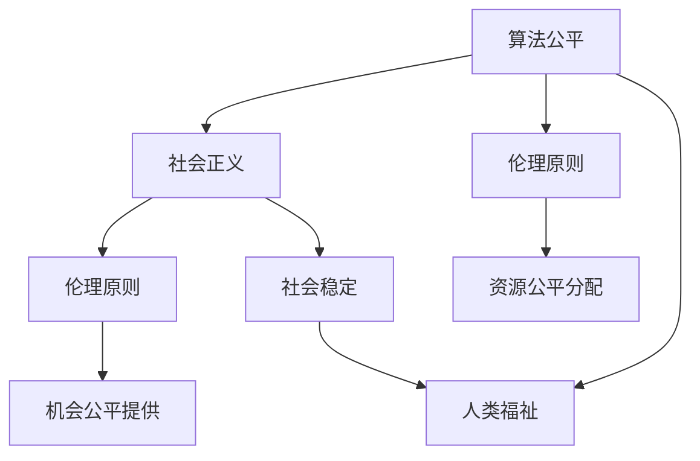
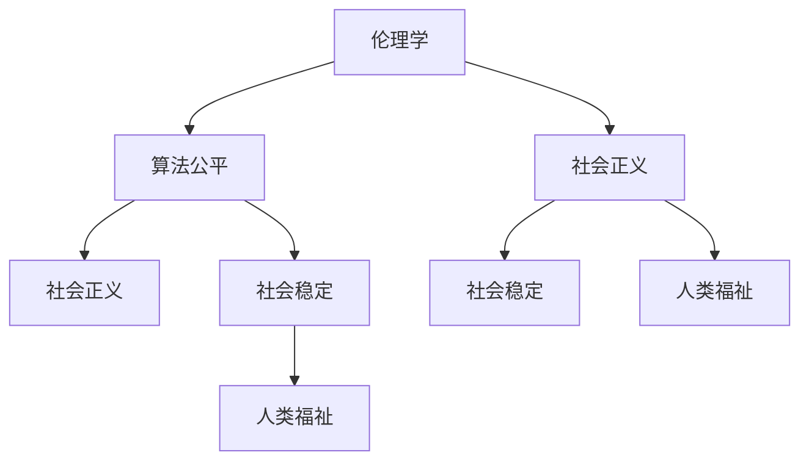

                 

### 引言与背景

随着人工智能（AI）技术的飞速发展，其应用已经渗透到我们生活的方方面面。从自动驾驶汽车到智能医疗诊断，从推荐系统到金融风控，人工智能正在改变我们的生活方式和工作方式。然而，随着这些技术的广泛应用，也带来了一系列伦理问题和挑战。如何确保人工智能系统的公平性和正义性，如何在算法决策中体现伦理原则，成为了一个备受关注的话题。

**算法公平与社会正义**是人工智能时代必须面对的两大伦理问题。算法公平指的是人工智能系统在决策过程中，能够公平地对待所有个体，不因性别、种族、年龄等因素而产生歧视。社会正义则强调在资源分配、机会提供等方面，能够体现公平和公正，符合社会的整体利益。这两者在人工智能时代具有极其重要的意义。

首先，算法公平和社会正义是保障人类福祉的基础。如果人工智能系统在决策中存在偏见和不公，将导致社会不公、不公平待遇等问题。其次，算法公平和社会正义也是技术进步的必然要求。随着技术的不断发展，只有确保其符合伦理原则，才能赢得社会的认可和信任。

本文将围绕人工智能时代的伦理决策，深入探讨算法公平与社会正义的内涵、挑战和解决方案。我们将分为四个部分进行论述：第一部分介绍人工智能时代的伦理困境，分析算法公平与社会正义的重要性；第二部分详细分析算法公平性，包括偏见与歧视的来源、检测与纠正方法；第三部分探讨社会正义与伦理决策的关系，以及如何在技术决策中体现伦理原则；最后一部分总结与展望，分析当前存在的问题与未来发展方向。

### 第1章：人工智能时代的伦理困境

#### 1.1 问题背景

人工智能（AI）作为一种高度智能化的技术，其发展迅速且应用广泛。然而，随着AI技术的普及，一系列伦理困境也随之而来。这些困境不仅涉及技术本身，还涉及到人类社会的方方面面。

首先，算法偏见和歧视问题日益突出。人工智能系统依赖于大量数据进行分析和决策，而这些数据往往带有历史和社会偏见。例如，在招聘系统中，如果训练数据中存在性别或种族偏见，那么系统在招聘过程中很可能会对特定性别或种族产生不公平对待。同样，在信用评分、医疗诊断等领域，算法偏见可能导致不公正的决策，进一步加剧社会不公。

其次，隐私保护成为一大挑战。人工智能技术需要收集和处理大量的个人数据，包括生物识别信息、位置信息、消费行为等。如果这些数据被滥用或泄露，将严重侵犯个人隐私权。例如，人脸识别技术的普及，使得个人隐私面临更大的风险。

再次，人工智能系统的可解释性和透明性不足。大多数AI系统，尤其是深度学习模型，具有“黑箱”特性，即无法解释其内部决策过程。这种不可解释性使得人们难以理解系统的决策依据，增加了对系统决策的不信任。特别是在金融、医疗等关键领域，这种不透明性可能导致严重的后果。

此外，人工智能还可能引发就业替代和失业问题。随着自动化技术的进步，许多传统行业的工作岗位被机器人和智能系统取代。虽然新技术带来了生产力的提升，但同时也导致了一些劳动者的失业和职业转型困难。

综上所述，人工智能时代的伦理困境涉及多个方面，包括算法偏见和歧视、隐私保护、系统透明性、就业替代等。这些困境不仅关系到技术本身的发展，更关乎社会公平、正义和人类福祉。因此，深入探讨和解决这些问题，是人工智能时代不可忽视的重要课题。

#### 1.2 伦理决策的重要性

伦理决策在人工智能时代的重要性不可忽视。首先，伦理决策是确保人工智能系统公正和透明的基础。一个缺乏伦理考虑的系统，可能会在决策过程中产生不公平和偏见，进而导致社会不公和人类福祉的受损。例如，如果招聘系统的算法设计存在性别偏见，那么该系统在招聘过程中很可能会对特定性别产生歧视，这显然是不公平的。

其次，伦理决策有助于提升人工智能技术的可信度和公众接受度。在一个高度依赖技术的时代，人们对于人工智能系统的信任至关重要。如果系统在决策过程中不遵循伦理原则，可能会导致公众对其产生怀疑和不信任，从而阻碍技术的广泛应用。

此外，伦理决策还能够引导人工智能技术的发展方向。随着技术的不断进步，人工智能的应用场景越来越广泛，涉及医疗、金融、交通等多个领域。在这些领域中，伦理原则的遵循不仅能够确保系统的公正性和透明性，还能够推动技术的可持续发展，避免因伦理问题而导致的负面影响。

具体而言，伦理决策在人工智能系统的开发和应用中具有以下几个关键作用：

1. **保障公平性**：通过伦理决策，可以确保系统在处理数据和应用算法时，不产生偏见和不公平对待。例如，在招聘系统中，可以通过数据清洗和算法设计，避免因历史偏见而导致的性别或种族歧视。

2. **保护隐私**：在人工智能应用中，隐私保护是一个关键问题。伦理决策可以帮助制定隐私保护措施，确保个人数据不被滥用和泄露。例如，通过数据加密、匿名化等技术手段，可以有效减少个人隐私泄露的风险。

3. **提升透明性**：通过伦理决策，可以提高人工智能系统的透明性，使其决策过程更加可解释和可信。例如，通过开发可解释性模型，可以让用户了解系统的决策依据和推理过程，从而增加对其信任。

4. **促进责任归属**：伦理决策可以帮助明确人工智能系统在决策过程中应承担的责任。例如，在医疗诊断系统中，如果算法错误导致诊断错误，伦理决策可以指导如何合理划分责任，从而促进系统的改进和完善。

综上所述，伦理决策在人工智能时代具有重要的现实意义和长远影响。只有通过深入和全面的伦理决策，才能确保人工智能技术健康发展，为社会带来真正的福祉。

#### 1.3 算法公平与社会正义的挑战

在人工智能时代，算法公平与社会正义面临诸多挑战，这些问题不仅复杂，而且相互交织，需要我们从多个角度进行深入探讨。

首先，数据偏见是算法公平性的主要挑战之一。数据偏见是指训练数据中存在的不公平或偏见，这些偏见可能会在算法中固化，导致算法决策的不公平。例如，在招聘系统中，如果训练数据中男性占比远高于女性，且以往招聘的历史记录中也以男性为主，那么算法很可能会在招聘过程中倾向于男性候选人，从而对女性产生不公平对待。同样，在医疗诊断中，如果训练数据中特定种族或群体的数据较少，算法可能会在这些群体中产生偏差，影响诊断的准确性。

其次，算法设计中的偏差也是一个重要问题。算法设计者在设计和优化算法时，往往基于某些特定目标或假设，但这些目标或假设可能并不公平或全面。例如，某些推荐系统可能优先考虑商业利益，而忽视用户体验，导致某些用户被推荐不适合的内容或商品。此外，算法优化过程中可能会引入一些隐含的偏见，例如通过频繁展示某些广告来增加点击率，从而对用户产生不良影响。

社会偏见也是算法公平性的一个重要挑战。社会偏见指的是在社会文化、法律、政策等方面存在的不公平现象，这些偏见可能会在算法设计和应用中得到反映。例如，在金融领域，如果贷款审批算法受到种族歧视的影响，那么特定种族的借款人可能会在贷款审批过程中遭遇不公平待遇。同样，在社会治理中，如果监控系统的算法设计存在偏见，可能会导致特定群体的监控频率和力度超过其他群体，从而引发社会不满和抗议。

透明性和可解释性不足也是算法公平性的一个显著挑战。深度学习等复杂算法往往缺乏透明性和可解释性，这使得算法的决策过程难以理解和追踪。例如，一个基于深度学习的自动驾驶系统在发生交通事故时，可能无法解释事故的具体原因，这使得责任归属变得复杂。此外，缺乏透明性和可解释性也增加了公众对算法的不信任，从而阻碍技术的普及和应用。

最后，利益冲突和责任归属问题也是算法公平性面临的挑战。在人工智能的应用过程中，不同利益相关者（如企业、政府、个人）之间的利益冲突可能导致算法决策的不公平。例如，在医疗诊断中，如果医院和药企之间存在利益关联，那么算法可能会偏向于推荐特定的药物或治疗方案，从而损害患者的利益。此外，在责任归属方面，如果算法错误导致事故或损失，确定责任归属可能变得困难，这需要法律和伦理框架的明确指导。

综上所述，算法公平与社会正义在人工智能时代面临多重挑战，这些挑战不仅需要技术手段的解决，更需要法律、政策和社会共识的综合应对。通过多方面共同努力，才能确保人工智能技术在符合伦理和社会正义的前提下，为社会带来真正的福祉。

### 第2章：核心概念与联系

#### 2.1 伦理学的核心概念

伦理学是一门研究道德原则和道德行为的学科，其核心概念包括道德原则、道德义务和道德责任等。

**道德原则**是伦理学的基础，它指明了行为应遵循的基本准则。常见的道德原则有功利主义原则、康德主义原则和正义原则。**功利主义原则**主张选择能够带来最大幸福或利益的行为；**康德主义原则**则强调行为的道德性应基于义务感和对法则的尊重；**正义原则**涉及公平和公正，主张资源分配和机会应平等对待每个人。

**道德义务**是指个人或组织在特定情境下应承担的责任。道德义务不仅仅是基于法律的规定，更是基于道德原则的内在要求。例如，医生有道德义务为患者提供最佳治疗，教师有道德义务教育学生成为有道德的人。

**道德责任**是指个人或组织对其行为后果应承担的责任。道德责任不仅仅包括对行为的直接后果负责，还包括对行为的潜在影响负责。例如，企业在经营过程中，不仅要对盈利负责，还要对环境保护和社会责任负责。

在人工智能时代的伦理决策中，这些核心概念尤为重要。算法设计者必须考虑到道德原则，确保系统在决策过程中符合道德要求；开发者有道德义务确保系统的公正性和透明性；最终用户也应对其使用行为承担道德责任，避免滥用技术。

#### 2.1.1 伦理决策的基本原则

伦理决策的基本原则是指导我们在复杂情境中做出符合道德要求的决策的基本规则。以下是几个关键原则：

**公正性**：公正性强调在资源分配和机会提供方面，应平等对待所有人。公正决策要求避免任何形式的偏见和歧视，确保每个人都能获得公平的待遇。

**尊重个人权利**：尊重个人权利是伦理决策的重要原则，特别是在涉及个人数据和信息处理时。这要求确保个人隐私不被侵犯，个人数据得到妥善保护。

**利益最大化**：利益最大化原则主张选择能够带来最大整体利益的行为。然而，这并不意味着追求短期利益，而是要在长期利益和短期利益之间取得平衡。

**责任承担**：责任承担原则强调决策者和实施者应对其行为后果负责。无论结果如何，都应勇于承担相应的责任，确保行为符合道德和法律责任。

这些原则在人工智能时代的伦理决策中具有重要作用。例如，在开发招聘算法时，公正性原则要求算法不能因性别、种族等因素产生歧视；尊重个人权利原则要求保护求职者的隐私；利益最大化原则要求算法在招聘过程中既要考虑企业利益，也要关注求职者权益；责任承担原则则要求算法开发者对算法的公平性和透明性负责。

#### 2.1.2 伦理决策的挑战与困境

尽管伦理决策的基本原则清晰明了，但在实际操作中，仍然面临诸多挑战和困境。

**复杂性**：伦理决策往往涉及多个利益相关者和复杂的情境，使得决策过程变得异常复杂。例如，在自动驾驶汽车面临伦理困境时，需要同时考虑到人的生命、车辆的安全和道路的交通规则等多方面因素。

**不确定性**：伦理决策往往面临不确定性的挑战，因为某些道德问题可能没有明确的答案。例如，在医疗领域，如何决定使用有限的医疗资源来救治更多患者，这是一个具有高度不确定性的伦理问题。

**偏见与主观性**：伦理决策过程中，决策者的个人偏见和主观判断可能影响决策的公正性和客观性。例如，算法设计者可能无意中引入偏见，导致算法在决策中产生不公平对待。

**责任归属**：在人工智能领域，责任归属问题尤为突出。当算法产生错误决策时，如何明确责任归属是一个复杂的问题。是算法开发者、数据提供者，还是最终用户，需要有一个明确的法律和伦理框架来指导。

**利益冲突**：伦理决策过程中，不同利益相关者之间可能存在利益冲突。例如，企业可能更关注短期盈利，而忽视长期的社会责任和道德义务。

为了解决这些挑战和困境，需要多方面的努力。首先，应加强对伦理决策的培训和指导，提高决策者的伦理意识和能力。其次，建立完善的法律法规和伦理标准，为伦理决策提供明确的法律和道德框架。此外，还应通过多方协作，确保伦理决策能够综合考虑不同利益相关者的需求和利益，从而实现公正和合理的决策。

#### 2.2 算法公平与社会正义的原理

算法公平和社会正义在人工智能领域具有核心重要性，它们不仅是技术问题的解决之道，更是伦理和社会价值的体现。以下是算法公平和社会正义的基本原理及其重要性。

**算法公平的定义与属性**

算法公平是指在人工智能系统的设计和应用过程中，确保系统能够公正、客观地处理数据和信息，不因性别、种族、年龄、地理位置等因素而产生歧视或不公平对待。算法公平的核心属性包括：

- **无歧视**：算法在处理数据时，不应因任何非相关因素（如性别、种族、年龄等）对个体产生不公平待遇。
- **透明性**：算法的决策过程应透明且可解释，使人们能够理解算法的决策依据和推理过程。
- **一致性**：算法在处理相同或相似输入数据时，应产生一致的决策结果，避免随机性和不可预测性。
- **可调整性**：算法应具备可调整性，以便在发现不公平或偏见时，能够及时进行修正和改进。

算法公平不仅是技术问题，更是伦理问题。不公平的算法可能导致社会不公，加剧社会分歧，甚至影响社会稳定。因此，确保算法公平是人工智能技术健康发展的必要条件。

**社会正义的概念与内涵**

社会正义是指在一个社会中，资源分配、机会提供和社会规范能够公平对待每个个体，实现社会的整体利益和长远发展。社会正义的核心概念包括：

- **平等**：社会正义强调每个人都应享有平等的机会和资源，无论其出身、性别、种族或社会地位。
- **公正**：社会公正要求资源分配和机会提供应基于公正和合理的标准，避免任何形式的歧视和不公。
- **责任**：社会正义要求每个个体和社会机构都应承担相应的责任，确保社会的整体利益得到实现。

社会正义不仅关乎道德和伦理，还涉及到法律、政策和社会制度。一个正义的社会能够促进个体的发展和幸福，增强社会的凝聚力和稳定性。

**算法公平与社会正义的相互关系**

算法公平和社会正义之间存在紧密的联系，它们相辅相成，共同推动社会的进步。

首先，算法公平是维护社会正义的重要手段。通过确保算法在决策过程中不产生歧视和不公，可以防止技术加剧社会不公。例如，在招聘系统中，如果算法能够公平对待所有候选人，无论其性别、种族或背景，那么这将有助于实现社会平等和公正。

其次，社会正义是算法公平的伦理基础。社会正义原则为算法公平提供了指导，确保算法在设计和应用过程中遵循伦理要求。例如，在医疗诊断领域，如果算法能够根据公正和合理的原则进行诊断，那么这将有助于实现医疗资源的公平分配和社会正义。

此外，算法公平和社会正义的共同目标是促进人类福祉。通过确保算法在决策过程中符合伦理和社会正义原则，可以减少社会不公，提高社会整体幸福感，实现可持续的社会发展。

**关系图解**

为了更直观地理解算法公平与社会正义的关系，我们可以通过以下图解来展示：

在该图解中，算法公平和社会正义都是基于伦理原则的，前者关注技术决策的公正性，后者关注社会整体利益的实现。两者共同作用于社会稳定和人类福祉，形成了一个相互促进、相互依赖的关系网络。

**实例分析**

为了更好地理解算法公平与社会正义在实际中的应用，我们可以通过以下实例来分析：

- **招聘系统**：在一个缺乏算法公平的招聘系统中，如果算法因性别或种族偏见而歧视某些群体，这将导致社会不公，损害受歧视群体的权益。反之，一个公平的招聘系统能够确保所有候选人都获得公平的机会，有助于实现社会正义。
- **信用评分**：如果信用评分算法存在种族或收入偏见，可能会导致特定群体在借贷和金融服务中受到不公平对待，加剧社会不平等。一个公平的信用评分算法能够根据公正和合理的原则进行评分，确保每个人都能获得公平的金融服务。
- **医疗诊断**：在医疗诊断中，如果算法因种族或社会经济地位偏见而影响诊断结果，这将对患者产生严重影响，甚至危及生命。一个公正的医疗诊断算法应能够准确评估所有患者的情况，确保每个患者都能得到公正的医疗服务。

通过这些实例可以看出，算法公平和社会正义在人工智能时代具有极其重要的意义。只有通过确保算法公平，才能实现社会正义，促进社会的和谐与进步。

#### 2.3 伦理学、算法公平与社会正义的相互关系

伦理学、算法公平与社会正义之间存在着紧密的联系和互动，共同构成了人工智能时代的技术和社会基石。

首先，伦理学是算法公平和社会正义的理论基础。伦理学提供了一套关于道德原则和道德行为的系统理论，为算法公平和社会正义的实践提供了指导。例如，伦理学中的公正原则要求资源分配和机会提供应平等对待所有人，这一原则直接影响了算法公平的设计和实施。同样，伦理学中的尊重个人权利原则也指导我们在数据处理和隐私保护方面应遵循的道德规范，从而确保算法公平的实现。

其次，算法公平是伦理学在人工智能领域的重要应用。算法公平旨在通过技术手段消除数据偏见和算法歧视，确保系统在决策过程中不产生不公平对待。这一目标与伦理学的核心原则高度一致，即追求公正、公平和合理。例如，在招聘系统中，如果算法因性别或种族偏见而歧视某些群体，这与伦理学中的公正原则相悖。通过设计和优化算法，使其在决策过程中能够公平对待所有人，是伦理学在人工智能领域的具体实践。

社会正义则是算法公平在更广泛社会背景下的体现。社会正义关注的是资源分配和机会提供是否公平，以及社会规范是否公正。算法公平是实现社会正义的重要工具，通过确保算法在决策过程中的公正性，可以减少社会不公，促进社会的整体利益。例如，在医疗诊断领域，一个公正的算法可以确保医疗资源公平分配，使所有患者都能得到公正的医疗服务，从而促进社会正义的实现。

**关系图解**

为了更直观地展示伦理学、算法公平与社会正义之间的相互关系，我们可以使用以下图解：

在该图解中，伦理学位于核心位置，为算法公平和社会正义提供理论基础。算法公平通过实现社会正义，促进社会稳定和人类福祉。社会正义不仅依赖于算法公平，还需要法律、政策和社会制度的支持，以实现更广泛的社会公平和公正。

**实例分析**

以下通过实例进一步说明这三者之间的关系：

- **招聘系统**：伦理学要求招聘系统在招聘过程中应公平对待所有候选人。通过算法公平，招聘系统能够避免因性别、种族或年龄等因素导致的歧视，实现伦理学的目标。而实现算法公平，有助于促进社会正义，减少社会不公，提高社会的整体稳定性和人类福祉。
- **信用评分**：伦理学要求信用评分系统在评估个体信用时应基于公正和合理的原则。通过算法公平，信用评分系统能够避免因种族、收入等因素导致的歧视，确保每个人都能获得公平的信用评估。这有助于实现社会正义，减少金融排斥，提高社会的稳定性和人类福祉。
- **自动驾驶**：伦理学要求自动驾驶系统能够在紧急情况下做出符合伦理的决策。通过算法公平，自动驾驶系统能够在不同情境下做出公正和合理的决策，避免因偏见或歧视导致的错误决策。这有助于实现社会正义，减少交通事故，提高社会的整体安全性和人类福祉。

通过这些实例可以看出，伦理学、算法公平与社会正义之间相互依赖、相互促进，共同构建了一个公正、公平和合理的人工智能时代。

### 第3章：算法偏见与歧视

#### 3.1 偏见与歧视的定义

在探讨算法偏见与歧视之前，首先需要明确偏见和歧视的定义及其特征。

**偏见**是指个人或集体在没有充分依据的情况下，对某个群体或个体持有不公正的、预先设定的态度或观念。偏见往往源于个体或集体的认知偏差、文化背景和以往的经验。例如，一个人可能因过去的负面经历而对某个种族或性别产生偏见，这种偏见可能会导致他在未来对这一群体持不公正的态度。

**歧视**则是指在实际行为中，对某个群体或个体进行不公平对待，这种对待可能基于性别、种族、年龄、宗教信仰等因素。歧视的行为可以是显性的，例如直接拒绝雇佣某个种族的人，或者隐性的，如通过算法或系统机制对某些群体进行不公平的决策。例如，如果一个招聘系统的算法因性别偏见而对女性求职者产生歧视，那么这种歧视行为就是隐性的。

**偏见与歧视的特征**包括以下几点：

1. **主观性**：偏见和歧视往往具有主观性，即它们是基于个体或集体的主观判断和态度，而非客观事实。
2. **系统性**：偏见和歧视不仅仅是个人行为，还可能渗透到社会系统、法律和政策中，形成系统性偏见和歧视。例如，一些国家的法律和政策可能对某些种族或性别产生不公平待遇。
3. **持续性**：偏见和歧视往往具有持久性，即便在一段时间后，仍然可能影响个体和群体的权益。例如，历史上的种族歧视政策可能对当今社会的种族关系产生深远影响。
4. **隐匿性**：一些偏见和歧视行为可能难以被发现，例如算法歧视，因为它们隐藏在复杂的系统背后，不易察觉。

#### 3.2 偏见与歧视的来源

算法偏见与歧视的来源是多方面的，主要包括数据偏见、算法设计偏见和社会偏见。

**数据偏见**是算法偏见的主要来源之一。数据偏见指的是数据集中存在的不公正或不准确的信息，这些信息可能反映或加剧社会中的偏见和歧视。例如，如果一个数据集包含过去种族歧视的历史记录，那么算法在处理这些数据时很可能会固化这些偏见，导致对某些群体的不公平对待。数据偏见的来源包括：

1. **历史遗留问题**：许多数据集包含了历史上积累的不公正信息，例如过去的就业歧视、种族隔离等。这些历史问题在数据集中留下了深刻的印记，影响算法的决策。
2. **样本选择偏差**：在收集数据时，可能因样本选择的不公平而引入偏见。例如，如果数据集主要来自特定地区或社会阶层，那么这些数据可能无法代表整个社会，导致算法的偏见。
3. **数据标注问题**：在机器学习中，数据标注的质量直接影响算法的性能。如果标注过程存在偏见，例如标注者因个人偏见而对某些群体进行不公正的标注，这会导致算法在训练过程中吸收这些偏见。

**算法设计偏见**是算法偏见与歧视的另一个重要来源。算法设计者可能无意中引入偏见，导致算法在决策过程中产生不公平对待。算法设计偏见包括：

1. **目标函数偏差**：在算法设计过程中，目标函数的选择可能无意中引入偏见。例如，一个推荐系统可能为了最大化点击率，而推荐某些用户不感兴趣的内容，这可能会导致对某些群体的不公平对待。
2. **训练数据偏差**：算法在训练过程中，如果使用的数据集存在偏见，那么训练出的模型很可能会固化这些偏见。例如，如果训练数据集中包含性别偏见，那么模型在决策时很可能会对女性产生不公平对待。
3. **模型假设偏差**：一些算法设计假设某些特征或变量对决策至关重要，但这些假设可能基于偏见或错误的信息。例如，某些医疗诊断算法可能基于不准确的医学假设，导致对某些群体产生不公平的诊断。

**社会偏见**是指在社会文化、法律和政策中存在的不公正对待。社会偏见不仅会影响数据的收集和标注，还会影响算法的设计和应用。社会偏见的来源包括：

1. **法律和政策**：一些法律和政策可能直接或间接地加剧社会偏见。例如，过去的种族隔离法律导致某些数据集中反映种族偏见，这些偏见可能被算法所固化。
2. **文化和社会观念**：文化和社会观念可能对算法的设计和应用产生影响。例如，某些文化观念可能对性别、种族或年龄产生偏见，这些偏见可能被算法所吸收并体现在其决策中。
3. **公众态度和行为**：公众的态度和行为也会影响数据的收集和标注。例如，如果公众对某些群体持有偏见，那么在收集数据时可能对这些群体产生不公平的对待，从而导致算法偏见。

总之，算法偏见与歧视的来源复杂多样，包括数据偏见、算法设计偏见和社会偏见等多个方面。要解决这些问题，需要从多个角度进行深入探讨和综合应对，以确保人工智能系统能够公平、公正地运作。

#### 3.3 偏见与歧视的检测与纠正

算法偏见与歧视的检测与纠正是一个复杂且多层次的过程，需要从多个角度进行综合分析和处理。以下将详细介绍偏见与歧视的检测方法以及纠正策略。

**偏见检测的方法**

1. **统计分析方法**：通过统计分析方法，可以识别数据集中的偏见和歧视。常用的统计分析方法包括：

   - **差异分析**：计算特定群体在决策结果中的表现与其他群体之间的差异，如果差异显著，则可能存在偏见。例如，可以通过比较不同性别、种族的求职者在招聘系统中的录用率，识别是否存在性别或种族歧视。
   - **关联性分析**：分析特征变量与决策结果之间的关联性。如果某些特征变量与决策结果之间的关联性显著，且这些特征变量与偏见相关，则可能存在偏见。例如，可以分析收入水平与信用评分之间的关联性，识别是否存在收入歧视。
   - **回归分析**：通过回归模型分析特征变量对决策结果的影响。如果某些特征变量的影响显著，且这些特征变量与偏见相关，则可能存在偏见。例如，可以通过回归模型分析年龄对招聘决策的影响，识别是否存在年龄歧视。

2. **机器学习方法**：利用机器学习方法，可以自动识别数据集中的偏见和歧视。常用的机器学习方法包括：

   - **决策树分析**：通过决策树模型分析特征变量与决策结果之间的关系，识别潜在的偏见。例如，通过分析决策树中的分支，可以识别哪些特征变量可能导致偏见。
   - **随机森林分析**：随机森林模型可以提供模型的透明性和可解释性，从而帮助识别偏见。通过分析随机森林中的投票结果，可以识别哪些特征变量对决策结果影响最大，从而发现潜在的偏见。
   - **神经网络分析**：通过神经网络模型，可以识别数据集中的复杂模式。通过对神经网络模型的结构和参数分析，可以识别可能导致偏见的特定特征。

3. **可视化方法**：通过可视化方法，可以直观地展示数据集中的偏见和歧视。常用的可视化方法包括：

   - **散点图**：通过绘制散点图，可以直观地观察不同群体在决策结果中的表现。例如，通过绘制不同性别的求职者在招聘系统中的录用率散点图，可以识别是否存在性别歧视。
   - **热力图**：通过绘制热力图，可以直观地观察特征变量与决策结果之间的关联性。例如，通过绘制收入水平与信用评分之间的热力图，可以识别是否存在收入歧视。

**偏见纠正的策略**

1. **数据清洗**：数据清洗是纠正偏见的重要步骤，通过去除或修正数据集中的偏见，可以减少算法的偏见。常用的数据清洗方法包括：

   - **去噪处理**：通过去除数据集中的噪声和异常值，可以减少对算法偏见的影响。
   - **缺失值处理**：通过填充缺失值或删除缺失数据，可以减少因数据不完整导致的偏见。
   - **异常值处理**：通过识别和修正异常值，可以减少异常值对算法偏见的影响。

2. **数据增强**：数据增强是纠正偏见的有效方法，通过增加更多样化的数据，可以减少数据集中可能存在的偏见。常用的数据增强方法包括：

   - **数据合成**：通过合成更多样化的数据，可以弥补数据集的不足。例如，可以使用数据增强技术生成更多的女性求职者数据，以减少性别偏见。
   - **数据扩充**：通过扩充数据集中的样本，可以增加数据的多样性。例如，可以通过图像生成技术，生成更多的种族多样性图像，以减少种族偏见。

3. **算法调整**：通过调整算法的参数和结构，可以减少算法的偏见。常用的算法调整方法包括：

   - **正则化**：通过增加正则化项，可以降低模型对特定特征的敏感性，减少偏见。例如，在回归模型中，可以通过增加L2正则化项来减少特征变量的影响。
   - **权重调整**：通过调整模型中特征变量的权重，可以减少对偏见特征变量的依赖。例如，可以通过调整神经网络中不同层的权重，来减少对偏见特征变量的依赖。
   - **算法替换**：通过替换更公平的算法，可以减少算法的偏见。例如，可以使用基于规则的算法替换基于统计机器学习的算法，从而减少对偏见数据的依赖。

4. **透明性与可解释性**：提高算法的透明性和可解释性，可以帮助识别和纠正偏见。通过展示算法的决策过程和推理机制，可以让用户和监管机构更好地理解算法的工作原理，从而发现和纠正潜在的偏见。

总之，偏见与歧视的检测与纠正是一个复杂且多层次的过程，需要从数据清洗、数据增强、算法调整和透明性等多个方面进行综合分析和处理。通过这些方法，可以显著减少算法偏见和歧视，确保人工智能系统的公平性和正义性。

#### 4.1 透明性的重要性

在人工智能领域，透明性具有至关重要的意义。透明性指的是系统在处理信息和作出决策时的过程和结果能够被清晰地理解和解释。对于人工智能系统而言，透明性不仅有助于提高系统的可接受度和信任度，还能够在多个层面上促进其公平性和正义性。

首先，透明性对于提高人工智能系统的可接受度和信任度至关重要。当人们能够理解系统的决策过程和依据时，他们更可能接受并信任这些系统。例如，在医疗诊断系统中，如果医生和患者能够理解算法如何做出诊断决策，他们就会更加信任系统，从而提高治疗的效率和效果。

其次，透明性能够帮助发现和纠正潜在的偏见和错误。在人工智能系统中，透明性使得算法的决策过程可以被审查和评估，从而发现并修正可能存在的偏见和错误。例如，通过分析算法的决策路径，可以发现和纠正因数据偏见导致的歧视问题，确保系统在决策过程中能够公平对待所有人。

此外，透明性有助于监管和合规。在许多领域，特别是金融、医疗和法律等领域，透明性是合规性和合法性的基本要求。通过确保系统的透明性，可以便于监管机构对系统进行审查和监督，确保其符合相关法规和伦理标准。

**透明性的定义与作用**

透明性的定义涉及到多个方面，包括信息的可访问性、决策过程的可追踪性以及结果的解释性。具体而言：

- **信息的可访问性**：透明性要求关键信息和数据能够被相关人员获取。这包括训练数据、模型参数、算法流程等。
- **决策过程的可追踪性**：透明性要求决策过程可以被追踪和记录。这有助于理解算法是如何处理输入数据并做出决策的。
- **结果的解释性**：透明性还要求系统能够解释其决策结果。这包括提供决策依据、推理过程和结论等。

透明性的作用主要体现在以下几个方面：

1. **提高信任度**：当系统的决策过程和结果可以被理解和解释时，用户和监管机构对系统的信任度会提高。
2. **促进公正性**：通过透明性，可以识别和纠正潜在的偏见和歧视，确保系统在决策过程中能够公平对待所有人。
3. **提升监管合规性**：透明性有助于确保系统符合相关法规和伦理标准，便于监管机构进行审查和监督。
4. **增强可解释性**：透明性使得系统的决策过程更加可解释和可理解，有助于用户和开发者更好地理解和改进系统。

**透明性的挑战与解决方案**

尽管透明性在人工智能系统中具有重要意义，但实现透明性也面临诸多挑战。

1. **复杂性**：人工智能系统的算法和模型通常非常复杂，其决策过程难以理解和解释。特别是深度学习模型，由于其“黑箱”特性，其决策路径和依据往往难以解释。
   - **解决方案**：可以通过开发可解释性模型（如LIME、SHAP）来提高模型的解释性。这些模型通过局部解释的方法，可以解释特定输入数据在决策过程中的作用。

2. **数据隐私**：透明性可能涉及对敏感数据的披露，从而威胁个人隐私。
   - **解决方案**：可以通过数据匿名化和差分隐私等技术，保护敏感数据的同时实现一定程度的透明性。

3. **计算成本**：实现透明性可能需要额外的计算资源，特别是在大规模数据处理和实时决策场景中。
   - **解决方案**：可以通过优化算法和硬件资源，提高透明性实现的效率。

4. **法律和伦理问题**：在某些情况下，透明性可能引发法律和伦理问题，如隐私泄露和责任归属。
   - **解决方案**：需要制定相应的法律和政策框架，明确透明性的标准和责任。

总之，透明性在人工智能系统中具有重要意义，尽管实现透明性面临诸多挑战，但通过不断的技术创新和法律规范，可以逐步克服这些挑战，实现系统的透明性和公正性。

#### 4.2 可解释性的概念与实现

在人工智能系统中，可解释性是一个关键概念，它指的是系统能够提供关于其决策过程和结果的理由和解释，使得用户和监管机构能够理解其工作原理。可解释性不仅有助于提高系统的信任度和接受度，还能在发现和纠正潜在错误、偏见和不公方面发挥重要作用。

**可解释性的定义与分类**

可解释性可以分为多种类型，根据其解释的深度和粒度，可以分为以下几类：

1. **局部可解释性**：局部可解释性关注特定输入数据在决策过程中的作用。这种方法通过分析局部特征对决策的影响，提供对特定实例的解释。常见的局部可解释性方法包括LIME（Local Interpretable Model-agnostic Explanations）和SHAP（SHapley Additive exPlanations）。LIME通过拟合一个简单模型来解释特定实例的决策，而SHAP基于博弈论中的Shapley值，计算每个特征对决策结果的贡献。

2. **全局可解释性**：全局可解释性关注整个模型或算法的工作原理，提供对模型整体决策逻辑的解释。这种方法通常通过可视化或简洁的数学模型来解释模型的决策过程。例如，决策树和规则模型由于其结构简单，通常具有较高的全局可解释性。

3. **透明性**：透明性是一种广义的可解释性，指的是系统能够展示其决策路径和过程，使得用户能够理解其工作方式。透明性通常涉及对系统内部参数、数据处理流程和决策规则的详细解释。

**可解释性的实现方法**

实现可解释性的方法多种多样，以下介绍几种常用的方法：

1. **可视化方法**：通过可视化技术，可以直观地展示模型的决策过程和结果。例如，使用热力图可以展示特征变量对决策结果的影响，使用决策树可视化可以展示决策路径。

2. **规则提取方法**：一些机器学习模型（如规则模型、决策树模型）可以直接提取解释规则。这些规则通常以简洁的if-then语句形式呈现，使得用户能够清晰地理解模型的决策逻辑。

3. **特征重要性分析**：通过计算特征的重要性，可以识别对决策影响较大的特征。例如，使用Permutation Importance或partial dependence plot等方法，可以分析特征变量对决策结果的贡献。

4. **基于模型的解释方法**：一些模型（如神经网络）本身具有内在的数学解释，可以基于其结构提供解释。例如，在深度学习中，通过分析神经元和层之间的关系，可以解释特定特征对决策的影响。

5. **组合解释方法**：结合多种解释方法，可以提供更全面和深入的解释。例如，结合局部解释（如LIME或SHAP）和全局解释（如决策树规则），可以同时提供对特定实例和模型整体的解释。

**案例研究**

以下通过一个案例研究来说明可解释性的实现方法：

**案例：信用评分系统的可解释性**

一个信用评分系统通过分析多个特征（如收入、信用历史、债务比例等）来评估用户的信用等级。为了提高系统的可解释性，可以采取以下方法：

1. **可视化方法**：通过绘制特征与信用评分之间的散点图，可以直观地观察不同特征对信用评分的影响。
2. **规则提取方法**：可以提取系统的决策规则，例如“如果用户的债务比例超过50%，则信用评分降低”。
3. **特征重要性分析**：通过计算特征的重要性，可以识别对信用评分影响最大的特征，如信用历史和债务比例。
4. **基于模型的解释方法**：使用神经网络模型，可以分析神经元和层之间的关系，解释特定特征对信用评分的影响。
5. **组合解释方法**：结合规则提取、特征重要性和神经网络解释，可以提供对系统决策的全面解释。

通过这些方法，用户和监管机构可以更好地理解信用评分系统的决策过程和结果，从而提高系统的可接受度和信任度。同时，可解释性也有助于发现和纠正潜在的偏见和错误，确保系统在决策过程中能够公平对待所有人。

总之，可解释性是人工智能系统不可或缺的一部分，通过多种实现方法，可以确保系统在透明性和公正性的基础上运作，为社会带来更大的福祉。

#### 4.3 透明性与可解释性的平衡

在人工智能系统中，透明性和可解释性是确保公平性和信任度的关键因素。然而，在实现这些目标的过程中，透明性与可解释性之间的平衡成为一个重要的挑战。

**透明性与可解释性的关系**

透明性和可解释性之间存在密切的关系。透明性指的是系统在处理信息和作出决策时的过程和结果能够被清晰地理解和解释。而可解释性则更侧重于系统决策的具体细节和依据。可以说，透明性是可解释性的前提，而可解释性是透明性的深化。

例如，在一个医疗诊断系统中，透明性要求系统能够展示其诊断过程和结果，而可解释性则要求系统能够详细解释诊断依据，包括每个特征变量对决策的影响。如果没有透明性，用户和监管机构将无法了解系统的决策过程，更无从谈起可解释性。

**平衡的挑战**

尽管透明性和可解释性在人工智能系统中具有重要作用，但实现两者之间的平衡并非易事，主要面临以下挑战：

1. **复杂性**：人工智能系统的算法和模型通常非常复杂，其决策过程难以理解和解释。特别是在深度学习等复杂模型中，透明性和可解释性的实现变得更加困难。如何在保持系统性能的同时，提高其可解释性，是一个重要的挑战。

2. **计算成本**：提高透明性和可解释性可能需要额外的计算资源。特别是在实时决策场景中，系统需要在处理速度和透明性之间做出权衡。例如，可视化方法和局部解释方法通常需要额外的计算资源，这可能导致系统性能的下降。

3. **隐私保护**：透明性和可解释性可能涉及对敏感数据的披露，从而威胁个人隐私。在处理个人数据时，如何在保护隐私的同时实现透明性和可解释性，是一个重要的伦理和法律问题。

**平衡的策略**

为了在透明性和可解释性之间实现平衡，可以采取以下策略：

1. **简化模型**：简化模型结构可以提高系统的可解释性，同时保持一定的性能。通过减少模型的复杂性，可以更容易地理解其决策过程。

2. **逐步解释**：对于复杂的模型，可以采用逐步解释的方法，从全局到局部，从总体到具体，逐步揭示决策过程和依据。这种方法有助于在保持系统性能的同时，提高可解释性。

3. **分层解释**：通过分层解释，可以将系统的决策过程分解为多个层次，每个层次都有不同的解释深度。这种方法有助于在保持系统性能的同时，提供不同层次的解释。

4. **权衡隐私与透明性**：在保护隐私的前提下，尽量提高系统的透明性和可解释性。例如，可以使用差分隐私技术，在保护隐私的同时，提供一定程度的透明性。

5. **用户参与**：鼓励用户参与决策过程，提高系统的透明性和可解释性。例如，在医疗诊断系统中，可以通过用户界面展示诊断依据和推理过程，使用户能够更好地理解诊断结果。

总之，在人工智能系统中，实现透明性与可解释性的平衡是一项复杂且具有挑战性的任务。通过采用多种策略，可以在保持系统性能的同时，提高其透明性和可解释性，从而确保系统在公平性和信任度方面得到全面提升。

### 4.4 算法公平性评估与改进策略

在人工智能系统中，算法公平性评估是确保系统决策公正和透明的重要环节。公平性评估不仅有助于识别和纠正算法中的偏见和歧视，还能提升系统在社会中的信任度和接受度。以下将详细探讨算法公平性评估的指标、计算方法以及改进策略。

#### 4.4.1 公平性评估指标

评估算法公平性需要一套科学的指标体系，这些指标能够量化算法在不同群体中的表现，识别潜在的偏见和歧视。以下是几种常用的公平性评估指标：

1. **公平性指标（Fairness Index）**：公平性指标通过比较不同群体在算法决策中的表现，评估算法的公平性。常见的公平性指标包括：

   - **统计公平性指标**：统计公平性指标包括差异率（Disparity）、归一化差异率（Normalized Disparity）和公平性分数（Fairness Score）等。这些指标通过比较不同群体在决策结果中的分布差异，评估算法的公平性。
   - **基于基尼系数的公平性指标**：基尼系数是衡量收入分配公平性的常用指标，也可以用于评估算法的公平性。基尼系数值越低，表示算法越公平。

2. **公平性差异（Fairness Gap）**：公平性差异是指不同群体在算法决策结果中的差异。通过计算不同群体之间的差异，可以评估算法的公平性。公平性差异可以通过以下公式计算：

   \[
   \text{Fairness Gap} = \frac{\sum_{i} (p_i - \bar{p})^2}{\sum_{i} p_i}
   \]

   其中，\(p_i\) 是第 \(i\) 个群体的比例，\(\bar{p}\) 是所有群体的平均比例。

3. **偏差指标（Bias Measure）**：偏差指标用于量化算法对不同群体的偏差程度。常见的偏差指标包括偏差率（Bias Rate）和偏差指数（Bias Index）。偏差率表示算法对特定群体产生的偏差与总偏差之比，而偏差指数则通过比较实际值与期望值之间的差异，评估算法的偏差。

4. **错误率差异（Error Rate Difference）**：错误率差异是指算法在不同群体中的错误率差异。通过比较不同群体的错误率，可以识别算法是否存在偏见。错误率差异可以通过以下公式计算：

   \[
   \text{Error Rate Difference} = \sum_{i} \frac{r_i - \bar{r}}{n_i}
   \]

   其中，\(r_i\) 是第 \(i\) 个群体的错误率，\(\bar{r}\) 是所有群体的平均错误率，\(n_i\) 是第 \(i\) 个群体的样本量。

#### 4.4.2 公平性评估的计算方法

公平性评估的计算方法主要包括数据预处理、模型训练和评估指标计算等步骤。以下简要介绍这些步骤：

1. **数据预处理**：在进行公平性评估之前，需要对数据集进行预处理，包括数据清洗、归一化和数据增强等。数据预处理有助于消除数据中的噪声和异常值，提高评估结果的准确性。

2. **模型训练**：选择合适的机器学习模型对数据集进行训练，以生成评估模型。训练过程中，需要确保模型具有良好的性能和可解释性，以便后续评估。

3. **评估指标计算**：通过计算上述提到的公平性评估指标，量化算法在不同群体中的表现。计算过程中，需要考虑数据集的多样性，确保评估结果能够全面反映算法的公平性。

4. **交叉验证**：为了提高评估结果的可靠性和准确性，可以使用交叉验证方法对模型进行评估。交叉验证通过将数据集划分为训练集和验证集，多次训练和验证模型，计算评估指标的均值和方差，从而更全面地评估算法的公平性。

#### 4.4.3 公平性改进策略

在识别和评估算法的公平性后，需要采取一系列改进策略，以消除潜在的偏见和歧视，提升算法的公平性。以下介绍几种常用的改进策略：

1. **数据清洗与预处理**：通过数据清洗和预处理，消除数据中的偏见和异常值。例如，去除历史歧视数据，对缺失值和异常值进行合理处理，可以提高算法的公平性。

2. **算法优化与调整**：通过优化算法模型和调整参数，减少算法偏见。例如，可以使用正则化技术，降低模型对特定特征的依赖，减少偏见；通过调整分类阈值，调整算法的决策边界，使其更加公平。

3. **社会干预与政策制定**：通过社会干预和政策制定，推动算法公平性的实现。例如，制定公平性评估标准和法规，要求企业在开发和应用算法时，必须进行公平性评估和透明性披露；通过公众参与和监督，确保算法公平性的实现。

4. **透明性与可解释性提升**：通过提高算法的透明性和可解释性，增强用户对算法的信任和理解。例如，开发可解释性模型，提供详细的决策解释和推理过程；通过用户界面，展示算法的决策依据和结果，使用户能够参与和监督决策过程。

5. **多元化数据集与模型训练**：通过使用多元化数据集，增加不同群体的代表性，减少数据偏见。例如，在数据集中增加不同性别、种族和地域的数据样本，提高模型的泛化能力；通过多任务学习，训练能够同时处理多个相关任务的模型，减少单一任务偏见。

总之，算法公平性评估与改进是一个系统工程，需要从数据、算法、政策和社会等多个方面进行综合应对。通过科学评估和有效改进策略，可以确保人工智能系统在决策过程中公平、公正，为社会带来真正的福祉。

### 5.1 社会正义的基本原则

社会正义是伦理学中的一个核心概念，它关注社会资源和机会的公平分配，旨在消除不平等和偏见，实现全体社会成员的共同福祉。社会正义的基本原则包括平等、公正、参与与代表性，以及社会责任与义务。

**平等**：平等原则强调每个人都应享有平等的权利和机会，无论其性别、种族、宗教信仰、社会经济地位等因素。平等不仅仅是形式上的公平，更重要的是实质上的公平，即在资源分配和机会提供上，能够真正体现每个人的价值和需求。

**公正**：公正原则要求社会资源和机会的分配应基于公正和合理的标准。公正不仅涉及资源分配的公平，还包括程序的公正。公正的程序能够确保每个人的权益得到保护，避免因人为因素导致的不公。

**参与与代表性**：参与原则强调每个人在社会决策过程中都应有机会表达自己的意见和需求。代表性原则则要求社会结构和决策机制能够充分反映不同群体和个体的声音和利益。通过确保广泛的参与和代表性，可以增强社会的凝聚力和稳定性。

**社会责任与义务**：社会责任与义务原则要求社会成员和企业承担相应的社会责任，确保社会正义的实现。这不仅包括遵守法律和道德规范，还涉及积极参与社会公益事业，推动社会进步和公平。

这些基本原则为社会正义提供了理论指导，确保社会在资源分配、机会提供和社会规范等方面能够公平对待每个个体，实现社会的整体利益和长远发展。

### 5.2 社会正义的伦理决策框架

社会正义的伦理决策框架为我们在复杂社会环境中做出符合伦理要求的决策提供了系统化的指导。这一框架包括决策过程、决策原则以及决策影响评估三个关键组成部分。

**决策过程**

社会正义的伦理决策过程可以分为以下几个步骤：

1. **问题识别与定义**：首先，需要识别和定义社会中的伦理问题，明确问题的核心和影响范围。这一步骤包括收集相关信息，分析问题的背景和现状，以及理解不同利益相关者的需求和期望。

2. **伦理原则确立**：在问题识别之后，需要根据社会正义的基本原则（如平等、公正、参与与代表性等）确立决策的伦理原则。伦理原则为决策提供了基本指导，确保决策过程符合道德和伦理要求。

3. **方案设计与评估**：根据伦理原则，设计可能的解决方案，并对每个方案进行详细评估。评估过程应考虑方案的有效性、可行性、成本和潜在风险。这一步骤可能需要多次迭代，以优化和改进方案。

4. **决策制定与执行**：在评估方案后，选择最优方案并制定详细的执行计划。决策制定应确保所有利益相关者能够参与和监督决策过程，增强决策的透明性和公正性。

5. **反馈与调整**：在决策执行过程中，应持续收集反馈信息，评估决策的实际效果。如果发现决策存在问题或偏差，应迅速进行调整和改进，确保决策能够长期有效。

**决策原则**

社会正义的伦理决策原则包括以下几项：

1. **公正性原则**：确保决策过程和结果公平对待所有利益相关者，避免任何形式的歧视和偏见。公正性原则要求在资源分配、机会提供和社会规范等方面，都能够平等对待每个个体。

2. **参与性原则**：鼓励广泛的参与，确保不同群体和个体的声音和需求能够在决策过程中得到充分体现。参与性原则不仅包括在决策过程中提供反馈和意见，还应确保决策结果能够真正反映社会多数人的意愿。

3. **代表性原则**：确保决策机构和过程具有代表性，能够反映不同群体和利益相关者的利益。代表性原则要求决策者应具备多元化的背景和视角，从而更全面地考虑社会各方面的需求。

4. **责任原则**：决策者和执行者应对其决策和行为承担相应的责任。责任原则要求在决策过程中，应明确责任归属，确保决策的执行和监督。

5. **可持续性原则**：决策应考虑长远的利益和影响，确保社会正义的长期实现。可持续性原则要求在决策过程中，不仅考虑当前的需求，还应关注未来可能面临的风险和挑战。

**决策影响评估**

决策影响评估是伦理决策过程中不可或缺的一环，其目的是确保决策能够实现预期目标，并在实施过程中不断优化和调整。评估过程包括以下几个步骤：

1. **效果评估**：评估决策实施后的实际效果，包括是否达到预期目标、是否改善了社会问题等。

2. **影响评估**：分析决策对社会各方面（如经济、社会、环境等）的长期影响，确保决策不仅符合当前的伦理要求，还能为未来带来积极的影响。

3. **透明性评估**：确保决策过程和结果透明公开，使公众能够监督和评估决策的影响。透明性评估有助于增强决策的公信力和接受度。

4. **责任评估**：评估决策过程中各方的责任履行情况，包括决策者、执行者和监督者的责任。责任评估有助于确保决策过程和结果的公正性和有效性。

通过社会正义的伦理决策框架，我们可以更系统、更科学地应对复杂的社会问题，确保决策过程和结果符合道德和伦理要求，促进社会的公平、公正和可持续发展。

### 5.3 伦理决策与算法公平性的关系

伦理决策与算法公平性之间存在着紧密而复杂的联系。伦理决策不仅是确保算法公平性的重要手段，还是推动社会正义实现的基石。在这一部分中，我们将深入探讨伦理决策如何影响算法公平性，并分析其在实际应用中的关键作用。

首先，伦理决策为算法公平性提供了明确的价值导向。伦理决策基于道德原则，如平等、公正和透明，这些原则为算法设计者和开发者提供了指导，确保算法在决策过程中能够遵循公平和公正的标准。例如，在招聘系统中，如果伦理决策要求算法必须平等对待所有候选人，那么在算法设计和训练过程中，开发人员就需要采取措施，如数据清洗、算法优化等，以消除可能存在的性别、种族等偏见。

其次，伦理决策有助于识别和纠正算法中的潜在偏见。通过伦理决策，可以系统地分析和评估算法在决策过程中是否存在不公平对待。例如，通过使用差异分析、回归分析等方法，可以识别算法在不同群体中的表现差异，发现潜在的偏见。一旦识别出这些偏见，伦理决策可以指导开发人员进行相应的调整和优化，确保算法在决策过程中能够公平对待所有个体。

此外，伦理决策在算法公平性的实现中还具有引导和规范作用。在人工智能应用日益广泛的时代，伦理决策不仅影响单个算法的公平性，还影响到整个技术生态系统的公平性。例如，在金融领域，如果伦理决策要求银行和金融机构在信用评估过程中必须遵循公平原则，那么这可以推动整个行业在信用评分算法的设计和应用中，更加注重公平性和透明性，从而减少因算法偏见导致的社会不公。

在实际应用中，伦理决策与算法公平性之间的关系体现在多个层面：

1. **政策制定**：政府可以通过制定政策和法规，强制要求人工智能系统在决策过程中遵循伦理原则。例如，一些国家和地区已经出台了关于算法公平性和透明性的法律法规，要求企业在开发和应用算法时，必须进行公平性评估和透明性披露。

2. **企业自律**：企业在开发人工智能系统时，可以通过内部伦理决策，确保系统的公平性和正义性。例如，一些科技公司设立了专门的伦理委员会，负责审查和监督人工智能产品的伦理问题，确保产品在上市前符合伦理要求。

3. **公众监督**：公众和媒体可以通过监督和舆论引导，推动企业和社会在人工智能应用中更加注重公平性和正义性。例如，公众可以对存在偏见和歧视的算法提出质疑，促使企业进行改进。

4. **技术创新**：通过技术创新，可以提高算法的公平性和可解释性。例如，开发可解释性模型和算法，使算法的决策过程更加透明和可理解，有助于增强公众对算法的信任。

综上所述，伦理决策与算法公平性之间存在着密切而复杂的关系。伦理决策不仅为算法公平性提供了明确的价值导向和指导，还通过识别和纠正偏见、制定政策和法规、推动技术创新等多种方式，推动人工智能系统在符合伦理和社会正义的前提下，实现公平和公正。通过多方面的努力，我们可以确保人工智能技术在为人类社会带来便利的同时，不损害社会公平和正义。

### 第6章：伦理决策的最佳实践

在探讨伦理决策的最佳实践之前，有必要先了解一些具体的案例分析。以下是几个具有代表性的案例，分别涉及招聘算法、信用评分算法和医疗诊断算法的伦理决策。

#### 6.1 案例分析

**案例一：招聘算法的公平性**

招聘算法在招聘过程中，如果存在性别或种族偏见，可能会导致特定性别或种族的候选人被不公平对待。例如，研究发现，某些招聘算法可能会倾向于录用男性候选人，从而对女性产生歧视。为解决这一问题，一些公司采取了以下措施：

1. **数据清洗**：在训练招聘算法之前，对训练数据进行清洗，去除历史偏见数据，如过去的性别、种族等信息。
2. **算法调整**：通过调整算法参数，降低对性别、种族等非关键特征的依赖，确保算法在招聘过程中公平对待所有候选人。
3. **透明性与可解释性**：开发可解释性模型，使招聘决策过程透明，用户可以了解算法如何做出决策。

**案例二：信用评分算法的正义性**

信用评分算法在评估个人信用时，如果存在收入或种族偏见，可能会导致特定收入或种族的个体在信用评估中受到不公平对待。例如，某些信用评分算法可能会低估低收入人群的信用评分，从而影响其获得贷款的机会。为解决这一问题，一些金融机构采取了以下措施：

1. **多元化数据集**：使用多元化数据集，增加不同收入和种族的样本，提高模型的泛化能力，减少偏见。
2. **算法优化**：通过优化算法模型，如引入更多的特征变量，调整模型参数，确保信用评分更加公正。
3. **公平性评估**：定期对信用评分算法进行公平性评估，确保算法在不同群体中的表现一致，减少偏见。

**案例三：医疗诊断算法的伦理问题**

医疗诊断算法在疾病预测和诊断中，如果存在种族或社会经济地位的偏见，可能会导致特定群体在医疗服务中受到不公平对待。例如，某些医疗诊断算法可能会对特定种族的疾病预测准确性较低，从而影响诊断结果。为解决这一问题，一些医疗机构采取了以下措施：

1. **数据平衡**：在训练医疗诊断算法时，使用平衡的数据集，确保不同种族和社会经济地位的样本数量相当。
2. **算法优化**：通过优化算法模型，如引入更多的特征变量和调整模型参数，提高算法的准确性和公平性。
3. **伦理审查**：设立伦理审查委员会，对医疗诊断算法进行伦理评估，确保算法在决策过程中符合伦理要求。

#### 6.2 最佳实践总结

通过以上案例分析，可以总结出以下最佳实践：

1. **数据清洗与预处理**：在算法训练过程中，对训练数据进行清洗和预处理，去除历史偏见和异常值，确保数据的公正性和准确性。

2. **算法优化与调整**：通过调整算法参数和模型结构，减少对偏见特征的依赖，提高算法的公平性和可解释性。

3. **多元化数据集**：使用多元化数据集，增加不同群体和特征的代表性，提高算法的泛化能力和公平性。

4. **公平性评估**：定期对算法进行公平性评估，识别和纠正潜在的偏见，确保算法在不同群体中的表现一致。

5. **透明性与可解释性**：开发可解释性模型和工具，使算法的决策过程透明和可理解，增强用户对算法的信任。

6. **伦理审查与监督**：设立伦理审查委员会，对算法进行伦理评估和监督，确保算法在符合伦理和社会正义的前提下应用。

通过这些最佳实践，我们可以确保人工智能系统在决策过程中公平、公正，为社会带来真正的福祉。

#### 6.3 挑战与展望

尽管伦理决策在社会正义和算法公平性方面取得了显著成果，但在实际应用中仍然面临诸多挑战。以下将讨论当前存在的问题以及未来的发展方向。

**当前存在的问题**

1. **数据偏见**：数据偏见是算法偏见的主要来源，尽管数据清洗和预处理可以减少部分偏见，但完全消除数据偏见仍然是一个长期且复杂的过程。

2. **计算成本与性能**：提高算法的透明性和可解释性可能需要额外的计算资源，这可能导致系统性能的下降。如何在保证透明性的同时，保持系统的计算效率和性能，是一个重要的挑战。

3. **隐私保护**：透明性可能涉及对敏感数据的披露，这可能会威胁个人隐私。如何在保护隐私的同时，实现算法的透明性和可解释性，是一个亟待解决的问题。

4. **责任归属**：当算法产生错误决策时，如何明确责任归属是一个复杂的问题。责任归属不仅涉及技术层面，还涉及法律和伦理层面。

**未来的发展方向**

1. **技术创新**：未来的发展方向之一是技术创新，特别是开发新的算法和模型，以提高算法的公平性和可解释性。例如，深度学习模型的可解释性研究、因果推断技术的应用等。

2. **法律法规完善**：完善相关法律法规，制定明确的伦理标准和规范，为伦理决策提供法律依据。例如，制定关于算法公平性和透明性的法律条款，明确算法开发者和使用者的责任。

3. **公众参与**：增强公众参与和监督，通过公众参与和舆论引导，推动企业和社会在人工智能应用中更加注重公平性和正义性。

4. **多元数据集**：推动多元化数据集的使用，增加不同群体和特征的代表性，提高算法的公平性和泛化能力。

5. **跨学科合作**：加强跨学科合作，结合伦理学、计算机科学、社会学等领域的知识和方法，共同推动人工智能伦理决策的发展。

通过技术创新、法律法规完善、公众参与和跨学科合作，我们可以逐步克服当前面临的挑战，推动人工智能伦理决策在符合社会正义和公平性的前提下，实现可持续发展。

### 第7章：伦理决策的最佳实践

在探讨伦理决策的最佳实践时，有必要通过具体的案例分析，来展示伦理决策在不同领域中的实际应用。以下将分别分析招聘算法、信用评分算法和医疗诊断算法中的伦理决策实践，并总结其中的经验与教训。

#### 7.1.1 案例一：招聘算法的公平性

**招聘算法的公平性问题**：招聘算法在招聘过程中，如果存在性别、种族或年龄等偏见，可能会对某些群体产生不公平待遇，影响招聘的公平性。

**解决方案与经验**：

1. **数据清洗**：在训练招聘算法时，对历史招聘数据进行清洗，去除包含性别、种族、年龄等偏见的信息，以确保算法不会基于这些因素做出歧视性的决策。

2. **算法调整**：通过调整算法参数，减少对性别、种族等非关键特征的依赖。例如，可以增加对工作经验、技能和业绩等关键因素的权重，确保算法更关注候选人的实际能力和潜力。

3. **透明性与可解释性**：开发可解释性算法，使得招聘决策过程透明。例如，可以采用LIME或SHAP等可解释性工具，分析算法决策过程中每个特征变量的重要性，用户可以查看具体的决策依据。

**教训**：尽管数据清洗和算法调整有助于减少偏见，但完全消除偏见仍然是一个长期的过程。需要持续监控和评估算法的表现，及时发现和纠正潜在的偏见。

#### 7.1.2 案例二：信用评分算法的正义性

**信用评分算法的公平性问题**：信用评分算法在评估个人信用时，如果存在收入、种族或地域等偏见，可能会导致某些群体在信用评估中受到不公平对待。

**解决方案与经验**：

1. **多元化数据集**：使用包含不同收入、种族和地域的多元化数据集，增加算法的训练数据多样性，从而提高算法的泛化能力，减少偏见。

2. **算法优化**：通过优化算法模型，增加对更多特征的考虑，如消费行为、信用记录、生活状态等，确保信用评分更加全面和公正。

3. **公平性评估**：定期对信用评分算法进行公平性评估，确保算法在不同群体中的表现一致。例如，可以通过差异分析等方法，比较不同群体在信用评分中的差异，及时调整算法以减少偏见。

**教训**：多元化数据集和算法优化是提高信用评分算法公平性的关键，但同时也需要定期监控和评估算法的表现，确保其长期公平性。

#### 7.1.3 案例三：医疗诊断算法的伦理问题

**医疗诊断算法的伦理问题**：医疗诊断算法在疾病预测和诊断中，如果存在种族、社会经济地位或医生个人偏见，可能会影响诊断的准确性和公正性。

**解决方案与经验**：

1. **数据平衡**：在训练医疗诊断算法时，使用平衡的数据集，确保不同种族和社会经济地位的样本数量相当，减少因数据不平衡导致的偏见。

2. **算法透明性与可解释性**：开发可解释性模型，使得医疗诊断过程透明。例如，可以采用局部解释方法，解释算法在诊断过程中每个特征变量的作用，帮助医生理解诊断依据。

3. **伦理审查**：设立伦理审查委员会，对医疗诊断算法进行伦理评估，确保算法在决策过程中符合伦理要求。例如，审查算法是否可能导致某些群体的诊断偏差，及时进行调整。

**教训**：在医疗领域，伦理审查是确保诊断算法公正性的重要手段。需要建立完善的伦理审查机制，确保算法在符合伦理和社会正义的前提下应用。

#### 7.2 经验与教训总结

通过以上案例分析，可以总结出以下经验和教训：

1. **数据清洗与多元化**：数据清洗和多元化是减少算法偏见的重要手段。在算法训练过程中，需确保数据集的多样性和代表性，以减少历史偏见和数据不平衡的影响。

2. **算法调整与优化**：通过调整和优化算法模型，可以减少对偏见特征的依赖，提高算法的公平性和准确性。同时，定期监控和评估算法的表现，及时纠正潜在的偏见。

3. **透明性与可解释性**：提高算法的透明性和可解释性，有助于增强用户对算法的信任和理解。通过开发可解释性工具，用户可以了解算法的决策过程和依据，从而更好地监督和评估算法。

4. **伦理审查与监督**：建立伦理审查机制，对算法进行伦理评估和监督，确保算法在符合伦理和社会正义的前提下应用。伦理审查不仅包括算法本身的评估，还应包括算法应用的环境和背景。

通过总结这些经验和教训，我们可以更好地应对人工智能时代的伦理挑战，确保算法公平性和社会正义的实现。

### 7.3 社会正义与伦理决策的未来

社会正义与伦理决策的未来充满挑战与机遇。随着人工智能技术的不断进步，社会正义的实现将面临更多的技术、法律和社会挑战。以下将探讨社会正义与伦理决策的未来发展趋势、潜在障碍以及政策建议。

**发展趋势**

1. **人工智能伦理标准的制定**：随着人工智能技术的广泛应用，各国和地区将逐步制定人工智能伦理标准，确保技术发展符合伦理和社会正义。这些标准将涵盖算法公平性、隐私保护、透明性等多个方面，为人工智能技术的伦理决策提供明确指导。

2. **多元数据集与模型公平性**：未来人工智能模型的开发将更加注重数据集的多元化和代表性，减少历史偏见和数据不平衡的影响。通过引入更多的特征变量和改进算法模型，可以提高模型的公平性和泛化能力。

3. **可解释性与透明性的提升**：可解释性技术和工具将继续发展，帮助用户更好地理解和监督人工智能系统的决策过程。这将有助于增强用户对系统的信任，减少因透明性不足导致的不信任和争议。

4. **跨学科合作与政策制定**：社会正义与伦理决策的制定将需要跨学科的合作，结合伦理学、计算机科学、社会学等领域的知识和方法。政府和企业将共同参与，制定符合伦理和社会正义的政策和法规，推动人工智能技术的健康发展。

**潜在障碍**

1. **技术挑战**：人工智能技术的复杂性和“黑箱”特性仍然是实现公平性和透明性的主要障碍。尽管可解释性技术不断发展，但在深度学习等复杂模型中，完全解释决策过程仍然具有挑战性。

2. **数据隐私与保护**：在实现算法透明性和可解释性的过程中，如何保护个人隐私是一个重要的挑战。如何在数据隐私保护与透明性之间找到平衡，是未来需要解决的关键问题。

3. **法律与监管**：尽管各国和地区正在制定人工智能伦理标准，但法律和监管体系尚不完善。如何确保这些标准得到有效执行，需要建立更加完善的法律法规和监管机制。

4. **社会接受度与信任**：社会公众对人工智能技术的接受度和信任度将影响其广泛应用。如何通过教育和宣传，增强公众对人工智能技术及其伦理决策的理解和信任，是未来需要关注的重要问题。

**政策建议**

1. **加强伦理教育**：在人工智能教育中，应加强伦理教育，培养具有伦理意识和责任感的人工智能专业人才。这有助于确保人工智能技术的伦理决策在符合社会正义的前提下实施。

2. **完善法律法规**：政府应制定和完善人工智能伦理标准和法律法规，确保人工智能技术的发展符合伦理和社会正义。同时，建立监管机制，确保这些标准和法规得到有效执行。

3. **推动技术创新**：鼓励和资助可解释性技术、多元数据集和公平性算法的研究和开发，提高人工智能系统的透明性和公平性。

4. **增强公众参与**：通过公众参与和舆论引导，增强公众对人工智能伦理决策的理解和信任。政府和企业应积极开展公众沟通和教育，提高公众对人工智能技术的认知和接受度。

通过以上建议和努力，我们可以逐步实现社会正义与伦理决策的目标，确保人工智能技术在为人类社会带来便利的同时，不损害社会公平和正义。

### 第8章：总结与反思

在人工智能时代，算法公平与社会正义的重要性不容忽视。通过本文的深入探讨，我们不仅理解了算法偏见与歧视的来源、检测与纠正方法，还分析了算法透明性与可解释性的重要性以及伦理决策的基本原则和实现策略。

本文的主要观点和结论如下：

1. **算法公平与社会正义是人工智能时代的核心伦理问题**。算法公平强调在决策过程中不产生歧视和不公平对待，社会正义则关注资源分配和机会提供的公正性。

2. **数据偏见和算法设计偏见是算法偏见的主要来源**。要确保算法公平，必须进行数据清洗和算法优化，消除历史和社会偏见。

3. **透明性与可解释性是确保算法公平的关键**。通过提高算法的透明性和可解释性，用户和监管机构可以更好地理解算法的决策过程，从而增强系统的信任度和公正性。

4. **伦理决策在算法公平和社会正义的实现中具有重要作用**。伦理决策提供了价值导向和指导，帮助识别和纠正潜在的偏见，确保算法符合道德和伦理要求。

然而，本文也存在一些局限性。首先，算法偏见与歧视的检测与纠正方法在复杂情境中可能存在局限，特别是在深度学习等复杂模型中，透明性和可解释性的实现仍然具有挑战。其次，伦理决策的复杂性使得实际操作中难以完全遵循理论原则，需要在具体场景中进行灵活调整。

未来研究方向应重点关注以下几个方面：

1. **深化算法偏见与歧视的检测与纠正研究**。开发更有效的检测方法，提高算法在复杂情境中的公平性和透明性。

2. **探索多元化的数据集和应用场景**。通过引入更多样化的数据集和应用场景，提高算法的泛化能力和公平性。

3. **建立完善的伦理决策框架**。结合跨学科的方法，制定更加系统化和可操作的伦理决策框架，为算法公平和社会正义提供更强的理论支持。

4. **加强伦理教育与公众参与**。通过加强伦理教育和公众参与，提高公众对人工智能伦理决策的理解和信任，促进社会公平与正义的实现。

通过持续的研究和实践，我们可以逐步克服人工智能时代的伦理挑战，确保技术发展符合社会正义和伦理要求，为人类社会带来更大的福祉。

### 第9章：展望未来

展望未来，人工智能技术的发展趋势和社会正义的实现路径将决定我们能否在技术进步的同时，维护社会公平和正义。以下将探讨人工智能技术的发展趋势、伦理决策的创新发展以及实现社会正义的路径和政策建议。

**9.1 人工智能技术的发展趋势**

1. **更加智能化和自主化**：随着深度学习和强化学习等技术的不断发展，人工智能系统将变得更加智能化和自主化。这意味着人工智能系统将能够更好地理解和应对复杂情境，提高决策的准确性和效率。

2. **跨领域融合**：人工智能技术将在多个领域实现融合，如医疗、金融、交通等。通过跨领域的合作，人工智能系统将能够提供更加全面和个性化的服务，提高社会的整体效率和生活质量。

3. **边缘计算与云计算的结合**：边缘计算和云计算的结合将使人工智能系统更加高效和灵活。通过在边缘设备上进行实时计算，人工智能系统能够更快地响应需求，减少延迟和带宽消耗。

4. **量子计算的应用**：量子计算技术的发展将为人工智能带来新的突破。量子计算在处理复杂问题和大规模数据方面具有显著优势，有望大幅提升人工智能系统的计算能力和效率。

**9.2 伦理决策的创新发展**

1. **多层次的伦理决策框架**：未来伦理决策框架将更加复杂和多层次，结合不同领域的伦理原则和技术特点，制定具体的应用指南。例如，在医疗领域，可以结合医学伦理和计算机科学，制定适用于医疗人工智能的伦理决策框架。

2. **智能伦理顾问系统**：随着人工智能技术的发展，可以开发智能伦理顾问系统，帮助决策者在复杂情境中做出符合伦理的决策。这些系统可以通过分析大量数据和案例，提供实时和个性化的伦理建议。

3. **动态伦理评估与反馈机制**：建立动态伦理评估与反馈机制，实时监控人工智能系统的应用表现，及时发现和纠正潜在的伦理问题。通过不断优化和更新伦理决策框架，确保系统在技术进步的同时，始终遵循伦理要求。

**9.3 实现社会正义的路径**

1. **政策引导与法规制定**：政府应制定明确的政策和法规，规范人工智能技术的应用，确保其在实现社会正义方面发挥积极作用。例如，可以制定关于算法公平性和透明性的法律条款，强制要求企业在开发和应用算法时进行伦理评估和披露。

2. **跨学科合作与知识共享**：推动跨学科合作，结合伦理学、计算机科学、社会学等领域的知识，共同研究和解决人工智能时代的伦理和社会问题。通过知识共享和经验交流，提高整体社会的伦理决策水平。

3. **公众参与与监督**：增强公众参与和监督，通过舆论引导和公众反馈，推动企业和社会在人工智能应用中更加注重公平性和正义性。公众的监督和参与有助于提高人工智能技术的透明度和可信度。

4. **教育与培训**：加强伦理教育和培训，提高公众和决策者对人工智能伦理问题的认知和敏感度。通过教育和培训，培养具有伦理意识和责任感的人工智能专业人才，为技术发展提供道德保障。

**9.4 政策建议**

1. **建立伦理审查机制**：设立独立的伦理审查机构，对人工智能技术的开发和应用进行伦理审查，确保其符合社会正义和伦理要求。审查机构应具备跨学科背景，能够提供全面和专业的伦理评估。

2. **制定透明性标准和规范**：制定透明性标准和规范，要求人工智能系统在设计和应用过程中，确保决策过程和结果透明可解释。例如，可以要求企业在发布人工智能产品时，提供详细的决策依据和推理过程。

3. **推广公平性评估工具**：开发和推广公平性评估工具，帮助企业和决策者识别和纠正算法偏见。这些工具可以结合机器学习和数据分析技术，提供实时和定量的评估结果。

4. **加强国际合作**：推动国际合作，制定全球范围内的人工智能伦理标准和规范，促进各国在人工智能伦理决策方面的协调和合作。通过国际合作，可以共同应对人工智能时代的社会挑战，实现全球范围内的社会正义。

通过以上政策建议和措施，我们可以确保人工智能技术在社会正义和伦理决策的指导下，为人类社会带来更大的福祉。在未来，人工智能技术将在实现社会正义和伦理决策中发挥关键作用，推动人类社会向更加公正、公平和可持续的方向发展。

