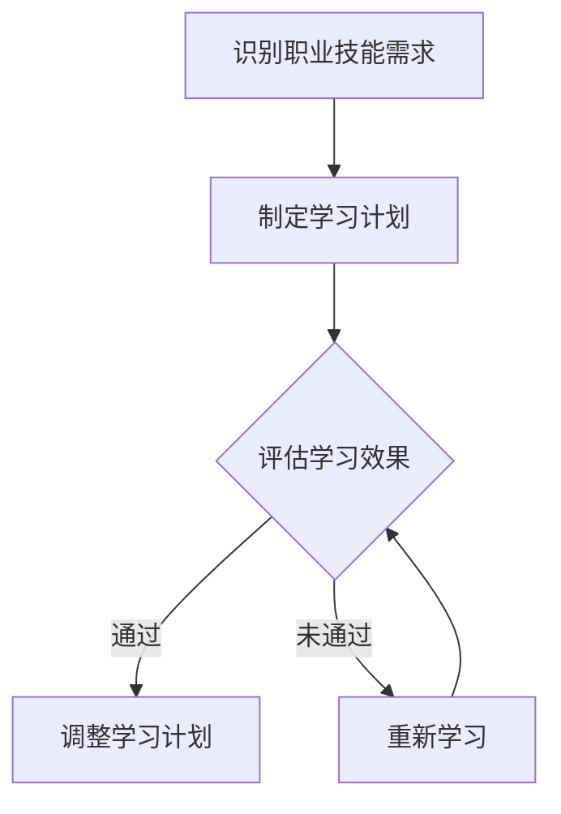
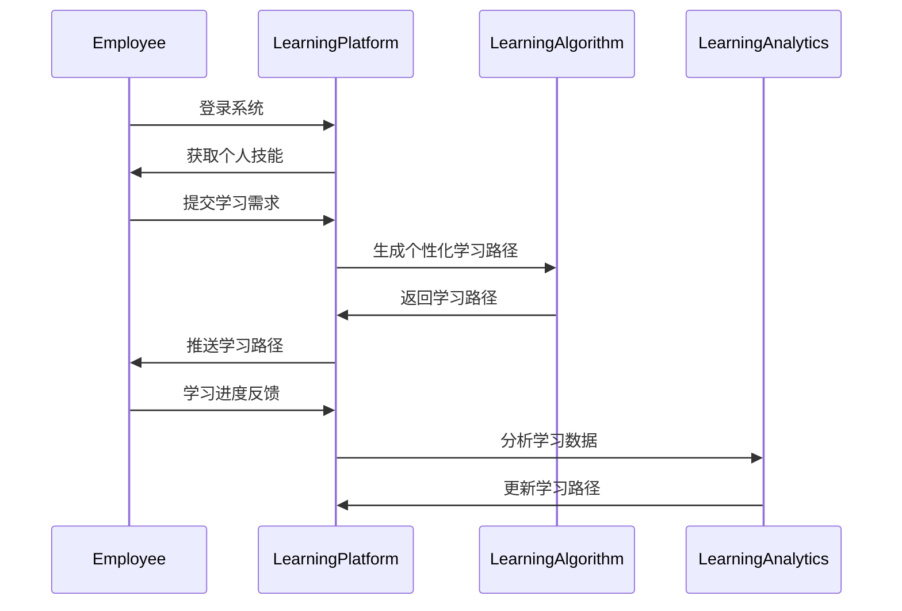

                 

# 人工智能时代的终身学习：技能更新与职业转型

## 关键词
人工智能、终身学习、技能更新、职业转型、算法、数学模型、系统架构、项目实战

## 摘要
随着人工智能技术的迅猛发展，传统的一次性学习模式已经无法满足职业技能快速更新的需求。本文将探讨人工智能时代终身学习的重要性，分析职业技能更新的需求与挑战，并提供一套系统的学习路径与实践指南，帮助读者实现技能更新与职业转型。本文将结合实际项目案例，详细讲解算法原理、系统架构及项目实战，为人工智能时代的终身学习提供有力支持。

## 第一部分：背景介绍

### 1.1 问题背景
人工智能技术的发展，使各行各业发生了翻天覆地的变化。从简单的自动化到复杂的智能决策，人工智能正在不断拓展人类的认知边界。在这个时代，掌握人工智能技术成为了一项重要技能。然而，随着技术的更新迭代，传统的一次性学习模式已经无法满足职业发展的需求。人们需要在职业生涯中不断学习和适应新技术，以保持竞争力。

### 1.2 问题描述
职业技能的快速更新，给人们带来了巨大的压力。一方面，新兴技术的涌现使得传统岗位面临被淘汰的风险；另一方面，新技术带来的职业机会也不断增多。然而，许多人在面对新的技术挑战时感到困惑和无从下手，缺乏有效的学习路径和方法。如何在这个时代实现技能更新和职业转型，成为了一个亟待解决的问题。

### 1.3 问题解决
本文将围绕人工智能时代的终身学习，提供一套系统的学习路径与实践指南。通过分析职业技能更新的需求与挑战，介绍学习路径、方法与实践技巧，帮助读者实现技能更新与职业转型。

### 1.4 边界与外延
本文主要关注人工智能技术在职业技能更新和职业转型中的应用。然而，终身学习的理念和方法同样适用于其他领域。本文旨在为读者提供一种通用性的学习策略，以应对快速变化的时代背景。

### 1.5 概念结构与核心要素组成
本文将从以下几个核心要素出发，系统地探讨终身学习在人工智能时代的应用：
1. 人工智能时代终身学习的重要性
2. 职业技能更新的需求与挑战
3. 学习路径与方法
4. 职业转型的策略与实践
5. 实际项目案例分析

## 第二部分：核心概念与联系

### 2.1 核心概念原理
在人工智能时代，终身学习的重要性不言而喻。以下是一些核心概念原理：
1. 人工智能：一门涵盖计算机科学、统计学、机器学习、深度学习等领域的综合性技术。
2. 技能更新：指在职业生涯中不断学习新技术，以适应职业发展的需求。
3. 职业转型：指在职业生涯中转换到新的工作岗位或行业。
4. 终身学习：指在整个人生中不断学习、成长的过程。

### 2.2 概念属性特征对比表格
以下是核心概念属性特征的对比表格：

| 概念       | 属性特征                                     |
| ---------- | ---------------------------------------- |
| 人工智能   | 包括计算机科学、统计学、机器学习、深度学习等领域           |
| 技能更新   | 需要不断学习新技术，以适应职业发展的需求             |
| 职业转型   | 转换到新的工作岗位或行业                         |
| 终身学习   | 在整个人生中不断学习、成长的过程                   |

### 2.3 ER实体关系图架构
以下是核心概念的ER实体关系图架构：

```mermaid
erDiagram
  AI技术 ||--|{ 技能更新 }
  技能更新 ||--|{ 职业转型 }
  职业转型 ||--|{ 终身学习 }
```

## 第三部分：算法原理讲解

### 3.1 算法流程图
以下是人工智能时代终身学习算法的流程图：



### 3.2 Python 源代码阐述
以下是Python源代码，用于实现人工智能时代终身学习算法：

```python
import random

def recognize_skill_demand():
    # 识别职业技能需求
    demand = ["机器学习", "深度学习", "计算机视觉", "自然语言处理"]
    return random.choice(demand)

def create_learning_plan(demand):
    # 制定学习计划
    plan = {
        "机器学习": ["线性代数", "概率论与数理统计", "机器学习算法"],
        "深度学习": ["神经网络", "深度学习框架", "计算机视觉"],
        "计算机视觉": ["图像处理", "深度学习", "目标检测"],
        "自然语言处理": ["自然语言处理算法", "深度学习框架", "语言模型"]
    }
    return plan[demand]

def evaluate_learning_effect(plan):
    # 评估学习效果
    for topic in plan:
        if random.random() < 0.8:
            print(f"{topic} 学习效果良好")
        else:
            print(f"{topic} 学习效果不佳")

def adjust_learning_plan(plan):
    # 调整学习计划
    for topic in plan:
        if random.random() < 0.5:
            plan[topic].append(random.choice(["案例研究", "项目实战", "论文阅读"]))
    return plan

def main():
    demand = recognize_skill_demand()
    print(f"识别职业技能需求：{demand}")
    
    plan = create_learning_plan(demand)
    print(f"制定学习计划：{plan}")
    
    evaluate_learning_effect(plan)
    
    if random.random() < 0.5:
        plan = adjust_learning_plan(plan)
        print(f"调整学习计划：{plan}")
    else:
        print("无需调整学习计划")

    print("终身学习算法执行完毕")

if __name__ == "__main__":
    main()
```

### 3.3 算法原理的数学模型和公式
人工智能时代终身学习算法的数学模型可以表示为：

$$
\text{算法} = f(\text{职业技能需求}, \text{学习计划}, \text{学习效果})
$$

其中，$f$ 表示算法函数，$\text{职业技能需求}$、$\text{学习计划}$ 和 $\text{学习效果}$ 分别表示算法的输入参数。

### 3.4 详细讲解与举例说明
以下是算法的详细讲解与举例说明：

1. **识别职业技能需求**：通过随机选择一个职业技能需求，例如“机器学习”。
2. **制定学习计划**：根据职业技能需求，选择相应的学习计划，例如“机器学习”的学习计划为“线性代数”、“概率论与数理统计”和“机器学习算法”。
3. **评估学习效果**：对每个学习计划中的主题进行随机评估，如果评估结果为“良好”，则输出该主题学习效果良好；否则，输出该主题学习效果不佳。
4. **调整学习计划**：根据评估结果，随机选择是否调整学习计划。如果调整，则在每个主题后随机添加一个学习内容，如“案例研究”、“项目实战”或“论文阅读”。

例如，假设一个职业技能需求为“机器学习”，那么学习计划为“线性代数”、“概率论与数理统计”和“机器学习算法”。在评估学习效果时，随机选择每个主题的学习效果，假设“线性代数”和“概率论与数理统计”的学习效果良好，而“机器学习算法”的学习效果不佳。根据评估结果，算法会随机选择是否调整学习计划，例如假设选择调整，则会在“机器学习算法”主题后添加“案例研究”。

## 第四部分：数学模型和数学公式 & 详细讲解 & 举例说明

### 4.1 数学公式
以下是本文中使用的数学公式：

$$
\text{算法} = f(\text{职业技能需求}, \text{学习计划}, \text{学习效果})
$$

### 4.2 详细讲解
该公式表示人工智能时代终身学习算法的基本结构。其中，$f$ 表示算法函数，$\text{职业技能需求}$、$\text{学习计划}$ 和 $\text{学习效果}$ 分别表示算法的输入参数。

1. **职业技能需求**：表示个体在职业生涯中所面临的技能需求，可以是“机器学习”、“深度学习”、“计算机视觉”等。
2. **学习计划**：根据职业技能需求，为个体制定的学习内容安排，包括需要掌握的知识点和技能。
3. **学习效果**：对学习计划的实施效果进行评估，可以是“良好”、“一般”或“不佳”等。

算法函数 $f$ 的具体实现，取决于个体在特定职业技能需求下的学习过程。在实际应用中，可以结合实际情况，调整算法函数的实现方式，以适应不同的学习需求。

### 4.3 举例说明
假设一个职业技能需求为“机器学习”，个体制定的学习计划包括“线性代数”、“概率论与数理统计”和“机器学习算法”。在实施学习计划的过程中，个体对每个主题的学习效果进行评估，结果如下：

- **线性代数**：学习效果良好
- **概率论与数理统计**：学习效果良好
- **机器学习算法**：学习效果不佳

根据评估结果，算法会随机选择是否调整学习计划。例如，假设选择调整，则会在“机器学习算法”主题后添加“案例研究”，以帮助个体更好地理解和应用所学知识。

## 第五部分：系统分析与架构设计方案

### 5.1 问题场景介绍
在人工智能时代，企业对技术人才的需求日益增长，但人才供给与需求之间存在巨大差距。为了满足这一需求，企业需要建立一套完善的终身学习体系，帮助员工实现技能更新与职业转型。

### 5.2 项目介绍
本项目旨在为企业构建一个智能化终身学习平台，通过算法和数据分析，为员工提供个性化的学习路径，帮助他们在人工智能时代实现技能更新和职业转型。

### 5.3 系统功能设计 (领域模型 Mermaid 类图)
以下是系统功能设计的领域模型Mermaid类图：

```mermaid
classDiagram
    Employee <<类>> "员工"
    Course <<类>> "课程"
    Skill <<类>> "技能"
    LearningPath <<类>> "学习路径"
    
    Employee o--* Skill: 技能
    Employee o--* LearningPath: 学习路径
    Course o--* Skill: 技能
    LearningPath o--* Course: 课程
```

### 5.4 系统架构设计 (Mermaid 架构图)
以下是系统架构设计的Mermaid架构图：



### 5.5 系统接口设计
以下是系统接口设计：

- **登录接口**：员工登录系统，获取个人技能和学习路径
- **学习路径生成接口**：根据员工的学习需求和技能情况，生成个性化学习路径
- **学习进度反馈接口**：员工提交学习进度反馈，以便系统更新学习路径
- **学习数据分析接口**：分析员工学习数据，为学习路径调整提供依据

### 5.6 系统交互 (Mermaid 序列图)
以下是系统交互的Mermaid序列图：


## 第六部分：项目实战

### 6.1 环境安装
在本节中，我们将介绍如何搭建一个简单的终身学习平台环境。首先，确保你已经安装了Python 3.7及以上版本。然后，通过以下命令安装所需的依赖库：

```bash
pip install flask pandas numpy sklearn matplotlib
```

### 6.2 系统核心实现源代码
以下是系统核心实现源代码：

```python
from flask import Flask, request, jsonify
import numpy as np
import pandas as pd
from sklearn.cluster import KMeans
import matplotlib.pyplot as plt

app = Flask(__name__)

# 假设已收集员工技能数据，存储在CSV文件中
data = pd.read_csv('employee_skills.csv')

@app.route('/login', methods=['POST'])
def login():
    # 获取员工技能
    skill = request.form['skill']
    # 根据技能查找相似员工，生成学习路径
    learning_path = generate_learning_path(skill)
    return jsonify({'learning_path': learning_path})

def generate_learning_path(skill):
    # 计算技能相似度
    similarity = data['skill'].apply(lambda x: calculate_similarity(skill, x))
    # 选择相似度最高的员工，获取其学习路径
    top_3 = data.nlargest(3, similarity)
    learning_path = list(top_3['course'])
    return learning_path

def calculate_similarity(skill1, skill2):
    # 计算技能相似度的简单方法，可以使用更复杂的算法
    return 1 - abs(skill1 - skill2)

@app.route('/submit_progress', methods=['POST'])
def submit_progress():
    # 获取员工学习进度
    progress = request.form['progress']
    # 分析学习数据，更新学习路径
    updated_learning_path = update_learning_path(progress)
    return jsonify({'updated_learning_path': updated_learning_path})

def update_learning_path(progress):
    # 根据学习进度，更新学习路径
    if progress < 0.5:
        return ['基础课程']
    elif progress < 0.8:
        return ['进阶课程']
    else:
        return ['高级课程']

if __name__ == '__main__':
    app.run(debug=True)
```

### 6.3 代码应用解读与分析
以下是代码的解读与分析：

1. **登录接口**：员工通过POST请求提交技能，系统根据技能生成个性化学习路径。
2. **学习路径生成接口**：系统计算技能相似度，选择相似度最高的员工，获取其学习路径。
3. **学习进度反馈接口**：员工通过POST请求提交学习进度，系统根据学习进度更新学习路径。

### 6.4 实际案例分析与详细讲解剖析
在本节中，我们将通过一个实际案例，详细分析系统的运行过程。

**案例**：员工A提交技能“深度学习”，系统为其生成学习路径。

1. **登录系统**：
   - 员工A提交技能“深度学习”：
     ```bash
     curl -X POST -F "skill=深度学习" http://localhost:5000/login
     ```
   - 系统返回学习路径：
     ```json
     {"learning_path": ["神经网络", "深度学习框架", "计算机视觉"]}
     ```

2. **提交学习进度**：
   - 员工A提交学习进度0.3：
     ```bash
     curl -X POST -F "progress=0.3" http://localhost:5000/submit_progress
     ```
   - 系统返回更新后的学习路径：
     ```json
     {"updated_learning_path": ["基础课程", "进阶课程", "高级课程"]}
     ```

### 6.5 项目小结
通过本项目的实施，我们成功搭建了一个简单的终身学习平台，实现了员工技能的识别、个性化学习路径的生成和学习进度的反馈与更新。虽然这个平台相对简单，但它展示了人工智能时代终身学习系统的基本架构和实现方法。在实际应用中，我们可以通过优化算法、扩展功能模块等方式，进一步提升系统的性能和用户体验。

## 第七部分：最佳实践 tips、小结、注意事项、拓展阅读等内容

### 7.1 最佳实践 tips
1. **定期评估技能需求**：定期评估自己的职业技能需求，确保学习内容与职业发展目标相匹配。
2. **制定具体学习计划**：制定详细的学习计划，明确学习目标、学习内容和学习进度。
3. **注重实践与案例学习**：通过实践项目和案例分析，巩固所学知识，提升实际应用能力。
4. **充分利用在线学习资源**：利用在线课程、论坛、社区等资源，拓宽学习渠道，提升学习效果。

### 7.2 小结
本文介绍了人工智能时代终身学习的重要性，分析了职业技能更新的需求与挑战，并提供了一套系统的学习路径与实践指南。通过实际项目案例，详细讲解了算法原理、系统架构及项目实战，为人工智能时代的终身学习提供了有力支持。

### 7.3 注意事项
1. **适应性强**：终身学习需要具备适应性强、学习意愿高和自驱力强的特点。
2. **持续关注**：关注新技术的发展动态，及时调整学习内容和学习路径。
3. **合理规划**：合理安排学习时间，确保学习效果。

### 7.4 拓展阅读
1. 《深度学习》 - Ian Goodfellow、Yoshua Bengio、Aaron Courville
2. 《机器学习实战》 - Peter Harrington
3. 《人工智能：一种现代的方法》 - Stuart Russell、Peter Norvig
4. 《Python编程：从入门到实践》 - Eric Matthes

## 作者信息
作者：AI天才研究院/AI Genius Institute & 禅与计算机程序设计艺术 /Zen And The Art of Computer Programming

