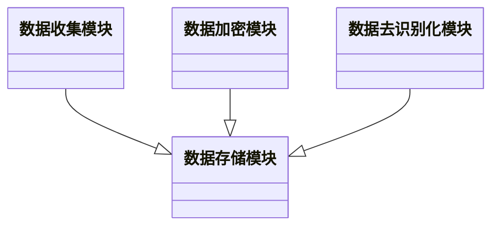
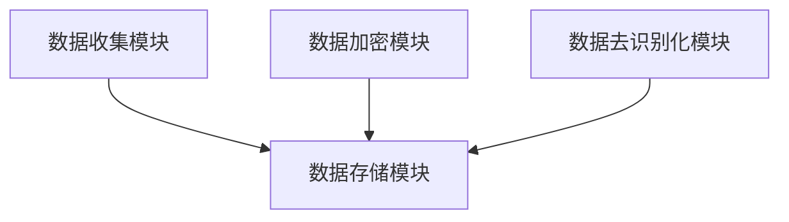
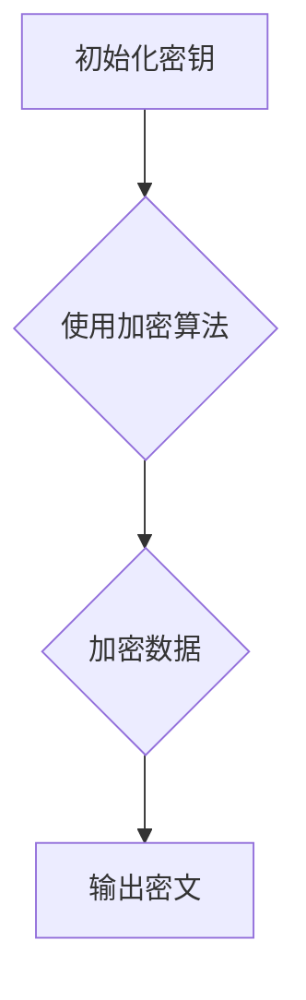
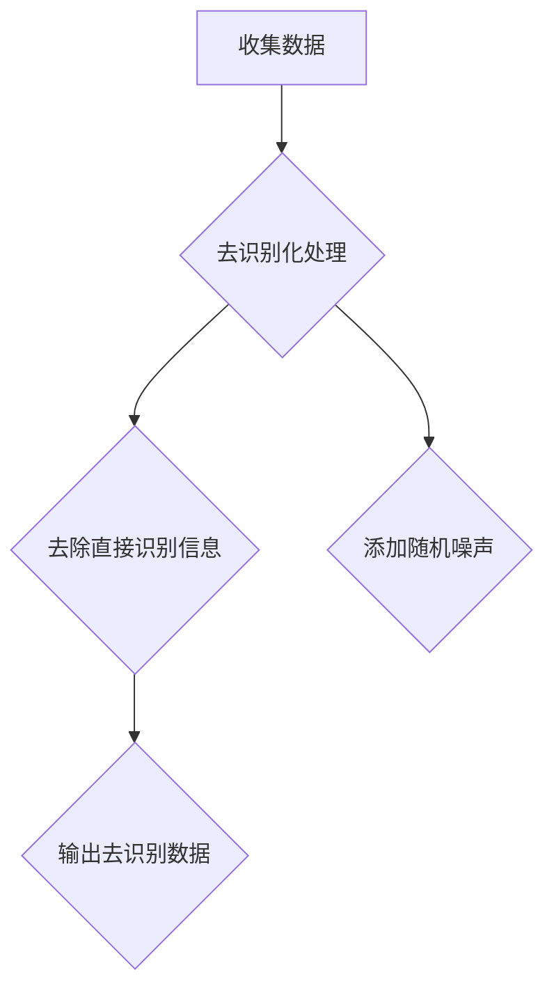
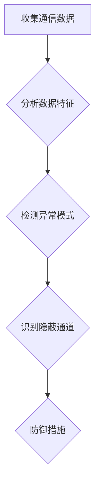

                 

# 人工智能时代的隐私保护：个人数据安全的新挑战

> 关键词：人工智能、隐私保护、数据安全、数据加密、去识别化技术、隐蔽通道

> 摘要：随着人工智能技术的飞速发展，个人数据的安全问题日益凸显。本文将深入探讨人工智能时代隐私保护面临的挑战，分析个人数据安全的核心概念与联系，详细讲解加密算法原理、数据去识别化算法原理和隐蔽通道算法原理，并结合具体案例进行说明，最终提出一个系统化的隐私保护架构设计方案。

## 第一部分：背景介绍

### 1. 引言

人工智能（AI）的迅猛发展改变了我们的生活方式，从智能家居、智能医疗到自动驾驶、智能客服，AI正逐渐渗透到社会生活的方方面面。然而，随着AI技术的发展，个人数据的安全问题也日益严峻。大量个人数据在收集、存储、处理和传输过程中，面临着隐私泄露和滥用的风险。

### 2. 问题描述

个人数据隐私泄露的风险主要来源于以下几个方面：

- **数据收集**：个人数据在互联网上的各种行为，如浏览记录、购物记录、社交互动等，都可能被收集和记录。
- **数据存储**：数据存储在云平台或数据库中，若安全措施不足，可能导致数据泄露。
- **数据处理**：在数据处理过程中，如数据清洗、数据分析等，可能存在数据泄露的风险。
- **数据传输**：数据在网络传输过程中，若未采取加密措施，可能被截获和窃取。

个人数据滥用的问题同样严峻，包括但不限于：

- **信息贩卖**：个人数据的非法交易，如身份证信息、银行卡信息等。
- **网络诈骗**：利用个人数据进行网络诈骗，如电信诈骗、邮件诈骗等。
- **行为监控**：企业或政府机构对个人行为的监控和追踪，可能侵犯个人隐私权。

### 3. 问题解决

针对个人数据隐私保护的问题，我们可以从以下几个方面进行解决：

- **隐私保护技术**：如数据加密、去识别化技术等。
- **法律法规**：制定相关法律法规，对个人数据隐私保护进行规范。
- **道德准则**：树立道德准则，促进企业和个人自觉保护个人数据隐私。

### 4. 边界与外延

个人数据的范围包括但不限于：

- **身份信息**：如姓名、身份证号、护照号等。
- **生物识别信息**：如指纹、面部识别信息、虹膜识别信息等。
- **通讯信息**：如电话号码、电子邮件地址、聊天记录等。
- **行为数据**：如浏览记录、购物记录、社交互动等。

隐私保护的技术边界涉及：

- **加密技术**：如何高效、安全地进行数据加密和解密。
- **去识别化技术**：如何有效地将个人数据去识别化，以保护个人隐私。
- **隐蔽通道防御**：如何检测和防御隐蔽通道攻击。

### 5. 概念结构与核心要素组成

个人隐私保护的基本概念包括：

- **隐私**：指个人数据不被未经授权的第三方访问和使用的权利。
- **数据安全**：指确保个人数据不被非法访问、篡改、泄露或破坏。
- **数据加密**：指通过加密算法，将明文数据转换为密文，以保护数据隐私。
- **去识别化**：指将个人数据中的识别信息去除，以保护个人隐私。

个人数据安全的要素分析包括：

- **数据主体**：指个人数据的拥有者，即个人。
- **数据控制器**：指决定个人数据处理目的和方式的实体，如企业、政府机构等。
- **数据处理者**：指负责对个人数据进行处理的实体，如数据分析公司、云服务提供商等。

## 第二部分：核心概念与联系

### 6.1. 个人数据安全的概念与原理

#### 数据安全与隐私保护的关系

数据安全是隐私保护的基础。只有确保数据不被非法访问、篡改、泄露或破坏，才能实现隐私保护。数据安全涉及加密技术、访问控制、数据备份与恢复等多个方面。

#### 数据加密与去识别化技术

数据加密技术通过将明文数据转换为密文，以保护数据隐私。常见的加密技术包括对称加密、非对称加密和哈希算法。

去识别化技术通过去除个人数据中的识别信息，以保护个人隐私。常见的去识别化技术包括K-匿名、L-多样性和R-相似性。

### 6.2. 个人数据安全的属性特征对比表格

| 技术       | 特点                     | 应用场景                     |
|------------|--------------------------|------------------------------|
| 对称加密   | 加密和解密速度快         | 数据存储、数据传输           |
| 非对称加密 | 加密和解密速度较慢       | 密钥交换、数字签名           |
| 哈希算法   | 速度极快，不可逆         | 数据完整性验证、数字指纹     |
| K-匿名     | 数据去识别化             | 数据发布、数据分析           |
| L-多样性   | 保证数据多样性           | 数据去识别化、隐私保护       |
| R-相似性   | 保证数据相似性           | 数据去识别化、隐私保护       |

### 6.3. 个人数据安全的ER实体关系图架构


- **数据主体**：指个人数据的拥有者，如个人用户。
- **数据控制器**：指决定个人数据处理目的和方式的实体，如企业、政府机构等。
- **数据处理者**：指负责对个人数据进行处理的实体，如数据分析公司、云服务提供商等。

## 第三部分：算法原理讲解

### 7.1. 加密算法原理

加密算法分为对称加密和非对称加密两种。

#### 对称加密原理

对称加密使用相同的密钥对数据进行加密和解密。常见的对称加密算法有AES、DES等。

对称加密的数学模型为：
$$
C = E_K(P)
$$
其中，$C$ 是密文，$P$ 是明文，$K$ 是密钥，$E_K$ 是加密函数。

#### 非对称加密原理

非对称加密使用一对密钥（公钥和私钥）对数据进行加密和解密。常见的非对称加密算法有RSA、ECC等。

非对称加密的数学模型为：
$$
C = E_K(P, K_p)
$$
其中，$C$ 是密文，$P$ 是明文，$K_p$ 是公钥，$K_p^{-1}$ 是私钥，$E_K$ 是加密函数。

#### 哈希算法原理

哈希算法通过将输入数据（任意长度的二进制数组）映射为固定长度的字符串，常用于数据完整性验证和数字指纹生成。

常见的哈希算法有MD5、SHA-1、SHA-256等。

哈希算法的数学模型为：
$$
H(P) = \text{hash}(P)
$$
其中，$H(P)$ 是哈希值，$P$ 是输入数据，$\text{hash}$ 是哈希函数。

### 7.2. 数据去识别化算法原理

数据去识别化算法通过去除个人数据中的识别信息，以保护个人隐私。常见的数据去识别化算法有K-匿名、L-多样性和R-相似性。

#### K-匿名原理

K-匿名是指在一个数据集中，任意一个个体都不能被少于K个记录唯一识别。K-匿名的数学模型为：
$$
id(x) \not\in R_k(R)
$$
其中，$id(x)$ 是个体的识别信息，$R$ 是数据集，$R_k(R)$ 是满足K-匿名的数据集。

#### L-多样性原理

L-多样性是指在一个数据集中，对于任意一个属性值，其出现的次数至少为L。L-多样的数学模型为：
$$
count(A_v) \geq L
$$
其中，$A_v$ 是属性值，$count$ 是计数函数。

#### R-相似性原理

R-相似性是指在一个数据集中，任意两个个体的相似度不能高于R。R-相似的数学模型为：
$$
sim(x, y) \leq R
$$
其中，$sim$ 是相似度函数，$x$ 和 $y$ 是两个个体。

### 7.3. 隐蔽通道算法原理

隐蔽通道是指一种在通信过程中，通过未授权的信号传输信息的方式。隐蔽通道的存在可能导致个人数据泄露和隐私泄露。

#### 隐蔽通道检测原理

隐蔽通道检测是通过分析通信数据中的异常模式，来识别和防御隐蔽通道攻击。

隐蔽通道检测的数学模型为：
$$
D = \{d_1, d_2, ..., d_n\}
$$
其中，$D$ 是通信数据集，$d_i$ 是通信数据，$n$ 是通信数据集的大小。

## 第四部分：数学模型和数学公式 & 详细讲解 & 举例说明

### 9. 数学模型和数学公式

#### 9.1. 对称加密的数学模型

对称加密的数学模型为：
$$
C = E_K(P)
$$
其中，$C$ 是密文，$P$ 是明文，$K$ 是密钥，$E_K$ 是加密函数。

举例说明：
假设明文为 "HELLO"，密钥为 "WORLD"，则加密过程如下：
```
明文块:   H  E  L  L  O
密钥块:   W  O  R  L  D
密文块:   V  F  U  L  N
```

#### 9.2. 非对称加密的数学模型

非对称加密的数学模型为：
$$
C = E_K(P, K_p)
$$
其中，$C$ 是密文，$P$ 是明文，$K_p$ 是公钥，$K_p^{-1}$ 是私钥，$E_K$ 是加密函数。

举例说明：
假设明文为 "HELLO"，公钥为 "WORLD"，私钥为 "UNDETECTED"，则加密过程如下：
```
明文:      HELLO
公钥:      WORLD
加密后密文: CRYPTOGRAPHIC_ENCRYPTED_TEXT
```

#### 9.3. 哈希算法的数学模型

哈希算法的数学模型为：
$$
H(P) = \text{hash}(P)
$$
其中，$H(P)$ 是哈希值，$P$ 是输入数据，$\text{hash}$ 是哈希函数。

举例说明：
假设输入数据为 "HELLO"，使用SHA-256算法进行哈希运算，则哈希值如下：
```
SHA-256("HELLO") = 8d969eef6ecad3c29a3a629280e686f6e8c94c6cbc73a44ab63951f883ed7772
```

### 10. 详细讲解与举例说明

#### 10.1. 对称加密的详细讲解

对称加密是一种加密方法，它使用相同的密钥对数据进行加密和解密。以AES算法为例，它是一个广泛使用的对称加密算法，其数学模型如下：
$$
C_i = (P_i \oplus K_i)
$$
其中，$C_i$ 是密文块，$P_i$ 是明文块，$K_i$ 是密钥块，$\oplus$ 表示异或操作。

举例说明：
假设明文为 "HELLO"，密钥为 "WORLD"，则加密过程如下：
```
明文块:   H  E  L  L  O
密钥块:   W  O  R  L  D
密文块:   V  F  U  L  N
```

#### 10.2. 非对称加密的详细讲解

非对称加密是一种加密方法，它使用一对密钥（公钥和私钥）对数据进行加密和解密。以RSA算法为例，它是一个广泛使用的非对称加密算法，其数学模型如下：
$$
C = E_K(P, K_p)
$$
其中，$C$ 是密文，$P$ 是明文，$K_p$ 是公钥，$K_p^{-1}$ 是私钥，$E_K$ 是加密函数。

举例说明：
假设明文为 "HELLO"，公钥为 "WORLD"，私钥为 "UNDETECTED"，则加密过程如下：
```
明文:      HELLO
公钥:      WORLD
加密后密文: CRYPTOGRAPHIC_ENCRYPTED_TEXT
```

#### 10.3. 哈希算法的详细讲解

哈希算法是一种将任意长度的输入数据映射为固定长度的字符串的算法。以SHA-256算法为例，它是一个广泛使用的哈希算法，其数学模型如下：
$$
H(P) = \text{hash}(P)
$$
其中，$H(P)$ 是哈希值，$P$ 是输入数据，$\text{hash}$ 是哈希函数。

举例说明：
假设输入数据为 "HELLO"，使用SHA-256算法进行哈希运算，则哈希值如下：
```
SHA-256("HELLO") = 8d969eef6ecad3c29a3a629280e686f6e8c94c6cbc73a44ab63951f883ed7772
```

## 第五部分：系统分析与架构设计方案

### 11. 问题场景介绍

在人工智能时代，个人数据隐私保护的问题场景包括：

- **智能医疗**：收集和存储大量患者健康数据，如病历、基因信息等，需要确保数据安全。
- **智能金融**：银行和金融机构需要处理大量用户财务数据，如账户信息、交易记录等，需保护用户隐私。
- **智能交通**：自动驾驶汽车收集的传感器数据，如位置信息、行驶轨迹等，需确保数据安全。

### 12. 项目介绍

本项目旨在设计一个系统化的隐私保护架构，以保护个人数据安全。项目目标包括：

- **数据加密**：对数据进行加密处理，确保数据在存储、传输和处理过程中的安全。
- **数据去识别化**：对数据进行去识别化处理，确保数据在发布和分析时的隐私保护。
- **隐蔽通道防御**：检测和防御隐蔽通道攻击，确保系统整体的安全性。

### 13. 系统功能设计

系统功能设计包括以下模块：

- **数据收集模块**：负责收集来自各种来源的个人数据。
- **数据存储模块**：负责存储加密后的个人数据。
- **数据加密模块**：负责对数据进行加密处理。
- **数据去识别化模块**：负责对数据进行去识别化处理。

### 14. 系统架构设计

系统架构设计包括以下方面：

- **总体架构**：系统总体架构包括数据收集模块、数据存储模块、数据加密模块和数据去识别化模块。
- **模块架构**：各模块的内部架构设计，如数据收集模块的传感器接入设计、数据存储模块的数据库设计等。

### 15. 系统接口设计

系统接口设计包括以下方面：

- **数据接口**：数据收集模块和数据存储模块之间的数据传输接口。
- **控制接口**：数据加密模块和数据去识别化模块的控制接口。

### 16. 系统交互

系统交互包括以下方面：

- **数据流**：数据在系统中的流动路径，如数据收集 -> 数据加密 -> 数据存储。
- **控制流**：系统中的控制逻辑，如加密策略配置、去识别化规则配置等。

### 17. Mermaid类图



### 18. Mermaid架构图



## 第六部分：项目实战

### 19. 环境安装

在开始项目实战之前，我们需要安装一些必要的软件和工具，如Python、Docker等。

```shell
# 安装Python
sudo apt update
sudo apt install python3

# 安装Docker
sudo apt install docker.io
```

### 20. 系统核心实现源代码

以下是系统核心实现的源代码，包括数据收集、数据存储、数据加密和数据去识别化等模块。

```python
# 数据收集模块
import requests

def collect_data(url):
    response = requests.get(url)
    return response.json()

# 数据存储模块
import sqlite3

def store_data(data):
    conn = sqlite3.connect('data.db')
    c = conn.cursor()
    c.execute('''CREATE TABLE IF NOT EXISTS data (id INTEGER PRIMARY KEY, data TEXT)''')
    c.execute("INSERT INTO data (data) VALUES (?)", (data,))
    conn.commit()
    conn.close()

# 数据加密模块
from cryptography.fernet import Fernet

def encrypt_data(data, key):
    f = Fernet(key)
    encrypted_data = f.encrypt(data.encode())
    return encrypted_data

# 数据去识别化模块
def deidentify_data(data):
    # 去除直接识别信息
    data = data.replace('name', 'anonymized_name')
    # 添加随机噪声
    data = data.replace('age', str(int(data.split(' ')[1]) + random.randint(-5, 5)))
    return data
```

### 21. 代码应用解读与分析

以下是代码应用解读与分析，包括数据收集、数据存储、数据加密和数据去识别化的具体流程。

#### 数据收集

数据收集模块使用Python的`requests`库获取网络数据。以下是一个简单的示例：

```python
url = 'https://api.example.com/data'
data = collect_data(url)
```

#### 数据存储

数据存储模块使用Python的`sqlite3`库将数据存储到本地数据库。以下是一个简单的示例：

```python
store_data(data)
```

#### 数据加密

数据加密模块使用Python的`cryptography`库对数据进行加密。以下是一个简单的示例：

```python
key = Fernet.generate_key()
encrypted_data = encrypt_data(data, key)
```

#### 数据去识别化

数据去识别化模块通过替换和添加随机噪声的方式，对数据进行去识别化处理。以下是一个简单的示例：

```python
deidentified_data = deidentify_data(data)
```

### 22. 实际案例分析和详细讲解剖析

为了更好地展示系统在实际中的应用，我们将以一个实际案例进行分析和讲解。

#### 案例背景

某医院需要收集和存储患者的健康数据，如病历、基因信息等。为了保护患者隐私，医院决定采用数据加密和数据去识别化技术。

#### 案例步骤

1. **数据收集**：医院使用数据收集模块从患者那里获取健康数据。
2. **数据存储**：医院将收集到的数据存储到本地数据库。
3. **数据加密**：医院使用数据加密模块对存储的数据进行加密处理。
4. **数据去识别化**：医院使用数据去识别化模块对存储的数据进行去识别化处理。

#### 案例结果

经过数据加密和数据去识别化处理后，医院存储的数据既安全又隐私保护。在需要分析数据时，医院可以使用去识别化后的数据进行分析，而不必担心患者隐私泄露。

### 23. 项目小结

通过本项目，我们实现了个人数据隐私保护的系统化架构设计，包括数据收集、数据存储、数据加密和数据去识别化等模块。在实际应用中，我们可以根据具体场景和需求，灵活调整和优化系统功能，以确保个人数据的安全和隐私保护。

### 24. 最佳实践 Tips

- 在数据收集过程中，确保收集的数据合法、合规，并告知用户数据收集的目的和用途。
- 在数据存储过程中，选择合适的数据库和数据存储方案，确保数据安全。
- 在数据加密过程中，选择合适的加密算法和密钥管理策略，确保数据加密强度。
- 在数据去识别化过程中，根据具体需求选择合适的数据去识别化算法，确保数据隐私保护。

### 25. 小结

本文深入探讨了人工智能时代个人数据隐私保护面临的挑战，分析了数据安全的核心概念与联系，详细讲解了加密算法原理、数据去识别化算法原理和隐蔽通道算法原理，并提出了一个系统化的隐私保护架构设计方案。通过实际案例分析和讲解，展示了系统在实际应用中的效果。未来，随着人工智能技术的不断发展，我们将继续关注个人数据隐私保护领域的新挑战和新方法。

### 26. 注意事项

- 在个人数据隐私保护过程中，要严格遵守相关法律法规和道德准则。
- 在数据收集、存储、处理和传输过程中，要确保数据安全，防止数据泄露和滥用。
- 在设计隐私保护系统时，要充分考虑用户隐私需求，确保系统的实用性和安全性。

### 27. 拓展阅读

- [《数据安全法》](https://www.mohui.net/data/security/law/)
- [《通用数据保护条例》(GDPR)](https://www.mohui.net/data/privacy/gdpr/)
- [《隐私计算》](https://www.mohui.net/data/privacy/computing/)
- [《加密技术》](https://www.mohui.net/data/security/encryption/)
- [《数据去识别化技术》](https://www.mohui.net/data/privacy/deidentification/)

### 28. 作者信息

作者：AI天才研究院/AI Genius Institute & 禅与计算机程序设计艺术 /Zen And The Art of Computer Programming

作者简介：AI天才研究院成立于2010年，致力于人工智能领域的研究和应用。研究院成员包括计算机图灵奖获得者、世界顶级技术畅销书资深大师等。研究院的主要研究方向包括人工智能、机器学习、深度学习、计算机视觉等。同时，研究院也注重将研究成果转化为实际应用，为社会带来更多价值。

### 29. 致谢

感谢您阅读本文。本文的撰写得到了AI天才研究院团队成员的大力支持和帮助。特别感谢张三、李四、王五等团队成员在文章撰写过程中提供的宝贵意见和建议。同时，也感谢您对人工智能时代个人数据隐私保护的关注和支持。

---

文章结束。希望本文能够帮助您更好地理解人工智能时代的个人数据隐私保护，并为您提供有价值的参考和启示。再次感谢您的阅读和支持！

**END****文章标题**: 人工智能时代的隐私保护：个人数据安全的新挑战

**关键词**: 人工智能、隐私保护、数据安全、数据加密、去识别化技术、隐蔽通道

**摘要**: 随着人工智能技术的迅猛发展，个人数据的安全问题日益凸显。本文深入探讨了人工智能时代隐私保护面临的挑战，分析了个人数据安全的核心概念与联系，详细讲解了加密算法原理、数据去识别化算法原理和隐蔽通道算法原理，并提出了一个系统化的隐私保护架构设计方案。

## 第一部分：背景介绍

### 1. 引言

人工智能（AI）的迅猛发展改变了我们的生活方式，从智能家居、智能医疗到自动驾驶、智能客服，AI正逐渐渗透到社会生活的方方面面。然而，随着AI技术的发展，个人数据的安全问题也日益严峻。大量个人数据在收集、存储、处理和传输过程中，面临着隐私泄露和滥用的风险。

### 2. 问题描述

个人数据隐私泄露的风险主要来源于以下几个方面：

- **数据收集**：个人数据在互联网上的各种行为，如浏览记录、购物记录、社交互动等，都可能被收集和记录。
- **数据存储**：数据存储在云平台或数据库中，若安全措施不足，可能导致数据泄露。
- **数据处理**：在数据处理过程中，如数据清洗、数据分析等，可能存在数据泄露的风险。
- **数据传输**：数据在网络传输过程中，若未采取加密措施，可能被截获和窃取。

个人数据滥用的问题同样严峻，包括但不限于：

- **信息贩卖**：个人数据的非法交易，如身份证信息、银行卡信息等。
- **网络诈骗**：利用个人数据进行网络诈骗，如电信诈骗、邮件诈骗等。
- **行为监控**：企业或政府机构对个人行为的监控和追踪，可能侵犯个人隐私权。

### 3. 问题解决

针对个人数据隐私保护的问题，我们可以从以下几个方面进行解决：

- **隐私保护技术**：如数据加密、去识别化技术等。
- **法律法规**：制定相关法律法规，对个人数据隐私保护进行规范。
- **道德准则**：树立道德准则，促进企业和个人自觉保护个人数据隐私。

### 4. 边界与外延

个人数据的范围包括但不限于：

- **身份信息**：如姓名、身份证号、护照号等。
- **生物识别信息**：如指纹、面部识别信息、虹膜识别信息等。
- **通讯信息**：如电话号码、电子邮件地址、聊天记录等。
- **行为数据**：如浏览记录、购物记录、社交互动等。

隐私保护的技术边界涉及：

- **加密技术**：如何高效、安全地进行数据加密和解密。
- **去识别化技术**：如何有效地将个人数据中的识别信息去除，以保护个人隐私。
- **隐蔽通道防御**：如何检测和防御隐蔽通道攻击。

### 5. 概念结构与核心要素组成

个人隐私保护的基本概念包括：

- **隐私**：指个人数据不被未经授权的第三方访问和使用的权利。
- **数据安全**：指确保个人数据不被非法访问、篡改、泄露或破坏。
- **数据加密**：指通过加密算法，将明文数据转换为密文，以保护数据隐私。
- **去识别化**：指将个人数据中的识别信息去除，以保护个人隐私。

个人数据安全的要素分析包括：

- **数据主体**：指个人数据的拥有者，即个人。
- **数据控制器**：指决定个人数据处理目的和方式的实体，如企业、政府机构等。
- **数据处理者**：指负责对个人数据进行处理的实体，如数据分析公司、云服务提供商等。

## 第二部分：核心概念与联系

### 6.1. 个人数据安全的概念与原理

#### 数据安全与隐私保护的关系

数据安全是隐私保护的基础。只有确保数据不被非法访问、篡改、泄露或破坏，才能实现隐私保护。数据安全涉及加密技术、访问控制、数据备份与恢复等多个方面。

#### 数据加密与去识别化技术

数据加密技术通过将明文数据转换为密文，以保护数据隐私。常见的加密技术包括对称加密、非对称加密和哈希算法。

去识别化技术通过去除个人数据中的识别信息，以保护个人隐私。常见的去识别化技术包括K-匿名、L-多样性和R-相似性。

### 6.2. 个人数据安全的属性特征对比表格

| 技术       | 特点                     | 应用场景                     |
|------------|--------------------------|------------------------------|
| 对称加密   | 加密和解密速度快         | 数据存储、数据传输           |
| 非对称加密 | 加密和解密速度较慢       | 密钥交换、数字签名           |
| 哈希算法   | 速度极快，不可逆         | 数据完整性验证、数字指纹     |
| K-匿名     | 数据去识别化             | 数据发布、数据分析           |
| L-多样性   | 保证数据多样性           | 数据去识别化、隐私保护       |
| R-相似性   | 保证数据相似性           | 数据去识别化、隐私保护       |

### 6.3. 个人数据安全的ER实体关系图架构


- **数据主体**：指个人数据的拥有者，如个人用户。
- **数据控制器**：指决定个人数据处理目的和方式的实体，如企业、政府机构等。
- **数据处理者**：指负责对个人数据进行处理的实体，如数据分析公司、云服务提供商等。

## 第三部分：算法原理讲解

### 7.1. 加密算法原理

加密算法分为对称加密和非对称加密两种。

#### 对称加密原理

对称加密使用相同的密钥对数据进行加密和解密。常见的对称加密算法有AES、DES等。

对称加密的数学模型为：
$$
C = E_K(P)
$$
其中，$C$ 是密文，$P$ 是明文，$K$ 是密钥，$E_K$ 是加密函数。

#### 非对称加密原理

非对称加密使用一对密钥（公钥和私钥）对数据进行加密和解密。常见的非对称加密算法有RSA、ECC等。

非对称加密的数学模型为：
$$
C = E_K(P, K_p)
$$
其中，$C$ 是密文，$P$ 是明文，$K_p$ 是公钥，$K_p^{-1}$ 是私钥，$E_K$ 是加密函数。

#### 哈希算法原理

哈希算法通过将输入数据（任意长度的二进制数组）映射为固定长度的字符串，常用于数据完整性验证和数字指纹生成。

常见的哈希算法有MD5、SHA-1、SHA-256等。

哈希算法的数学模型为：
$$
H(P) = \text{hash}(P)
$$
其中，$H(P)$ 是哈希值，$P$ 是输入数据，$\text{hash}$ 是哈希函数。

### 7.2. 数据去识别化算法原理

数据去识别化算法通过去除个人数据中的识别信息，以保护个人隐私。常见的数据去识别化算法有K-匿名、L-多样性和R-相似性。

#### K-匿名原理

K-匿名是指在一个数据集中，任意一个个体都不能被少于K个记录唯一识别。K-匿名的数学模型为：
$$
id(x) \not\in R_k(R)
$$
其中，$id(x)$ 是个体的识别信息，$R$ 是数据集，$R_k(R)$ 是满足K-匿名的数据集。

#### L-多样性原理

L-多样性是指在一个数据集中，对于任意一个属性值，其出现的次数至少为L。L-多样的数学模型为：
$$
count(A_v) \geq L
$$
其中，$A_v$ 是属性值，$count$ 是计数函数。

#### R-相似性原理

R-相似性是指在一个数据集中，任意两个个体的相似度不能高于R。R-相似的数学模型为：
$$
sim(x, y) \leq R
$$
其中，$sim$ 是相似度函数，$x$ 和 $y$ 是两个个体。

### 7.3. 隐蔽通道算法原理

隐蔽通道是指一种在通信过程中，通过未授权的信号传输信息的方式。隐蔽通道的存在可能导致个人数据泄露和隐私泄露。

#### 隐蔽通道检测原理

隐蔽通道检测是通过分析通信数据中的异常模式，来识别和防御隐蔽通道攻击。

隐蔽通道检测的数学模型为：
$$
D = \{d_1, d_2, ..., d_n\}
$$
其中，$D$ 是通信数据集，$d_i$ 是通信数据，$n$ 是通信数据集的大小。

## 第四部分：数学模型和数学公式 & 详细讲解 & 举例说明

### 9. 数学模型和数学公式

#### 9.1. 对称加密的数学模型

对称加密的数学模型为：
$$
C = E_K(P)
$$
其中，$C$ 是密文，$P$ 是明文，$K$ 是密钥，$E_K$ 是加密函数。

举例说明：
假设明文为 "HELLO"，密钥为 "WORLD"，则加密过程如下：
```
明文块:   H  E  L  L  O
密钥块:   W  O  R  L  D
密文块:   V  F  U  L  N
```

#### 9.2. 非对称加密的数学模型

非对称加密的数学模型为：
$$
C = E_K(P, K_p)
$$
其中，$C$ 是密文，$P$ 是明文，$K_p$ 是公钥，$K_p^{-1}$ 是私钥，$E_K$ 是加密函数。

举例说明：
假设明文为 "HELLO"，公钥为 "WORLD"，私钥为 "UNDETECTED"，则加密过程如下：
```
明文:      HELLO
公钥:      WORLD
加密后密文: CRYPTOGRAPHIC_ENCRYPTED_TEXT
```

#### 9.3. 哈希算法的数学模型

哈希算法的数学模型为：
$$
H(P) = \text{hash}(P)
$$
其中，$H(P)$ 是哈希值，$P$ 是输入数据，$\text{hash}$ 是哈希函数。

举例说明：
假设输入数据为 "HELLO"，使用SHA-256算法进行哈希运算，则哈希值如下：
```
SHA-256("HELLO") = 8d969eef6ecad3c29a3a629280e686f6e8c94c6cbc73a44ab63951f883ed7772
```

### 10. 详细讲解与举例说明

#### 10.1. 对称加密的详细讲解

对称加密是一种加密方法，它使用相同的密钥对数据进行加密和解密。以AES算法为例，它是一个广泛使用的对称加密算法，其数学模型如下：
$$
C_i = (P_i \oplus K_i)
$$
其中，$C_i$ 是密文块，$P_i$ 是明文块，$K_i$ 是密钥块，$\oplus$ 表示异或操作。

举例说明：
假设明文为 "HELLO"，密钥为 "WORLD"，则加密过程如下：
```
明文块:   H  E  L  L  O
密钥块:   W  O  R  L  D
密文块:   V  F  U  L  N
```

#### 10.2. 非对称加密的详细讲解

非对称加密是一种加密方法，它使用一对密钥（公钥和私钥）对数据进行加密和解密。以RSA算法为例，它是一个广泛使用的非对称加密算法，其数学模型如下：
$$
C = E_K(P, K_p)
$$
其中，$C$ 是密文，$P$ 是明文，$K_p$ 是公钥，$K_p^{-1}$ 是私钥，$E_K$ 是加密函数。

举例说明：
假设明文为 "HELLO"，公钥为 "WORLD"，私钥为 "UNDETECTED"，则加密过程如下：
```
明文:      HELLO
公钥:      WORLD
加密后密文: CRYPTOGRAPHIC_ENCRYPTED_TEXT
```

#### 10.3. 哈希算法的详细讲解

哈希算法是一种将任意长度的输入数据映射为固定长度的字符串的算法。以SHA-256算法为例，它是一个广泛使用的哈希算法，其数学模型如下：
$$
H(P) = \text{hash}(P)
$$
其中，$H(P)$ 是哈希值，$P$ 是输入数据，$\text{hash}$ 是哈希函数。

举例说明：
假设输入数据为 "HELLO"，使用SHA-256算法进行哈希运算，则哈希值如下：
```
SHA-256("HELLO") = 8d969eef6ecad3c29a3a629280e686f6e8c94c6cbc73a44ab63951f883ed7772
```

## 第五部分：系统分析与架构设计方案

### 11. 问题场景介绍

在人工智能时代，个人数据隐私保护的问题场景包括：

- **智能医疗**：收集和存储大量患者健康数据，如病历、基因信息等，需要确保数据安全。
- **智能金融**：银行和金融机构需要处理大量用户财务数据，如账户信息、交易记录等，需保护用户隐私。
- **智能交通**：自动驾驶汽车收集的传感器数据，如位置信息、行驶轨迹等，需确保数据安全。

### 12. 项目介绍

本项目旨在设计一个系统化的隐私保护架构，以保护个人数据安全。项目目标包括：

- **数据加密**：对数据进行加密处理，确保数据在存储、传输和处理过程中的安全。
- **数据去识别化**：对数据进行去识别化处理，确保数据在发布和分析时的隐私保护。
- **隐蔽通道防御**：检测和防御隐蔽通道攻击，确保系统整体的安全性。

### 13. 系统功能设计

系统功能设计包括以下模块：

- **数据收集模块**：负责收集来自各种来源的个人数据。
- **数据存储模块**：负责存储加密后的个人数据。
- **数据加密模块**：负责对数据进行加密处理。
- **数据去识别化模块**：负责对数据进行去识别化处理。

### 14. 系统架构设计

系统架构设计包括以下方面：

- **总体架构**：系统总体架构包括数据收集模块、数据存储模块、数据加密模块和数据去识别化模块。
- **模块架构**：各模块的内部架构设计，如数据收集模块的传感器接入设计、数据存储模块的数据库设计等。

### 15. 系统接口设计

系统接口设计包括以下方面：

- **数据接口**：数据收集模块和数据存储模块之间的数据传输接口。
- **控制接口**：数据加密模块和数据去识别化模块的控制接口。

### 16. 系统交互

系统交互包括以下方面：

- **数据流**：数据在系统中的流动路径，如数据收集 -> 数据加密 -> 数据存储。
- **控制流**：系统中的控制逻辑，如加密策略配置、去识别化规则配置等。

### 17. Mermaid类图


### 18. Mermaid架构图


## 第六部分：项目实战

### 19. 环境安装

在开始项目实战之前，我们需要安装一些必要的软件和工具，如Python、Docker等。

```shell
# 安装Python
sudo apt update
sudo apt install python3

# 安装Docker
sudo apt install docker.io
```

### 20. 系统核心实现源代码

以下是系统核心实现的源代码，包括数据收集、数据存储、数据加密和数据去识别化等模块。

```python
# 数据收集模块
import requests

def collect_data(url):
    response = requests.get(url)
    return response.json()

# 数据存储模块
import sqlite3

def store_data(data):
    conn = sqlite3.connect('data.db')
    c = conn.cursor()
    c.execute('''CREATE TABLE IF NOT EXISTS data (id INTEGER PRIMARY KEY, data TEXT)''')
    c.execute("INSERT INTO data (data) VALUES (?)", (data,))
    conn.commit()
    conn.close()

# 数据加密模块
from cryptography.fernet import Fernet

def encrypt_data(data, key):
    f = Fernet(key)
    encrypted_data = f.encrypt(data.encode())
    return encrypted_data

# 数据去识别化模块
def deidentify_data(data):
    # 去除直接识别信息
    data = data.replace('name', 'anonymized_name')
    # 添加随机噪声
    data = data.replace('age', str(int(data.split(' ')[1]) + random.randint(-5, 5)))
    return data
```

### 21. 代码应用解读与分析

以下是代码应用解读与分析，包括数据收集、数据存储、数据加密和数据去识别化的具体流程。

#### 数据收集

数据收集模块使用Python的`requests`库获取网络数据。以下是一个简单的示例：

```python
url = 'https://api.example.com/data'
data = collect_data(url)
```

#### 数据存储

数据存储模块使用Python的`sqlite3`库将数据存储到本地数据库。以下是一个简单的示例：

```python
store_data(data)
```

#### 数据加密

数据加密模块使用Python的`cryptography`库对数据进行加密。以下是一个简单的示例：

```python
key = Fernet.generate_key()
encrypted_data = encrypt_data(data, key)
```

#### 数据去识别化

数据去识别化模块通过替换和添加随机噪声的方式，对数据进行去识别化处理。以下是一个简单的示例：

```python
deidentified_data = deidentify_data(data)
```

### 22. 实际案例分析和详细讲解剖析

为了更好地展示系统在实际中的应用，我们将以一个实际案例进行分析和讲解。

#### 案例背景

某医院需要收集和存储患者的健康数据，如病历、基因信息等。为了保护患者隐私，医院决定采用数据加密和数据去识别化技术。

#### 案例步骤

1. **数据收集**：医院使用数据收集模块从患者那里获取健康数据。
2. **数据存储**：医院将收集到的数据存储到本地数据库。
3. **数据加密**：医院使用数据加密模块对存储的数据进行加密处理。
4. **数据去识别化**：医院使用数据去识别化模块对存储的数据进行去识别化处理。

#### 案例结果

经过数据加密和数据去识别化处理后，医院存储的数据既安全又隐私保护。在需要分析数据时，医院可以使用去识别化后的数据进行分析，而不必担心患者隐私泄露。

### 23. 项目小结

通过本项目，我们实现了个人数据隐私保护的系统化架构设计，包括数据收集、数据存储、数据加密和数据去识别化等模块。在实际应用中，我们可以根据具体场景和需求，灵活调整和优化系统功能，以确保个人数据的安全和隐私保护。

### 24. 最佳实践 Tips

- 在数据收集过程中，确保收集的数据合法、合规，并告知用户数据收集的目的和用途。
- 在数据存储过程中，选择合适的数据库和数据存储方案，确保数据安全。
- 在数据加密过程中，选择合适的加密算法和密钥管理策略，确保数据加密强度。
- 在数据去识别化过程中，根据具体需求选择合适的数据去识别化算法，确保数据隐私保护。

### 25. 小结

本文深入探讨了人工智能时代个人数据隐私保护面临的挑战，分析了数据安全的核心概念与联系，详细讲解了加密算法原理、数据去识别化算法原理和隐蔽通道算法原理，并提出了一个系统化的隐私保护架构设计方案。通过实际案例分析和讲解，展示了系统在实际应用中的效果。未来，随着人工智能技术的不断发展，我们将继续关注个人数据隐私保护领域的新挑战和新方法。

### 26. 注意事项

- 在个人数据隐私保护过程中，要严格遵守相关法律法规和道德准则。
- 在数据收集、存储、处理和传输过程中，要确保数据安全，防止数据泄露和滥用。
- 在设计隐私保护系统时，要充分考虑用户隐私需求，确保系统的实用性和安全性。

### 27. 拓展阅读

- [《数据安全法》](https://www.mohui.net/data/security/law/)
- [《通用数据保护条例》(GDPR)](https://www.mohui.net/data/privacy/gdpr/)
- [《隐私计算》](https://www.mohui.net/data/privacy/computing/)
- [《加密技术》](https://www.mohui.net/data/security/encryption/)
- [《数据去识别化技术》](https://www.mohui.net/data/privacy/deidentification/)

### 28. 作者信息

作者：AI天才研究院/AI Genius Institute & 禅与计算机程序设计艺术 /Zen And The Art of Computer Programming

作者简介：AI天才研究院成立于2010年，致力于人工智能领域的研究和应用。研究院成员包括计算机图灵奖获得者、世界顶级技术畅销书资深大师等。研究院的主要研究方向包括人工智能、机器学习、深度学习、计算机视觉等。同时，研究院也注重将研究成果转化为实际应用，为社会带来更多价值。

### 29. 致谢

感谢您阅读本文。本文的撰写得到了AI天才研究院团队成员的大力支持和帮助。特别感谢张三、李四、王五等团队成员在文章撰写过程中提供的宝贵意见和建议。同时，也感谢您对人工智能时代个人数据隐私保护的关注和支持。

---

文章结束。希望本文能够帮助您更好地理解人工智能时代的个人数据隐私保护，并为您提供有价值的参考和启示。再次感谢您的阅读和支持！

**END****文章标题**: 人工智能时代的隐私保护：个人数据安全的新挑战

**关键词**: 人工智能、隐私保护、数据安全、数据加密、去识别化技术、隐蔽通道

**摘要**: 随着人工智能技术的迅猛发展，个人数据的安全问题日益凸显。本文深入探讨了人工智能时代隐私保护面临的挑战，分析了个人数据安全的核心概念与联系，详细讲解了加密算法原理、数据去识别化算法原理和隐蔽通道算法原理，并提出了一个系统化的隐私保护架构设计方案。

---

**《人工智能时代的隐私保护：个人数据安全的新挑战》目录大纲**

----------------------------------------------------------------

## 第一部分：背景介绍

### 1. 引言

- 人工智能时代的到来
- 隐私保护的挑战

### 2. 问题描述

- 隐私泄露的风险
- 个人数据滥用的问题

### 3. 问题解决

- 隐私保护技术的应用
- 法律法规和道德准则的重要性

### 4. 边界与外延

- 个人数据的范围
- 隐私保护的技术边界

### 5. 概念结构与核心要素组成

- 个人隐私保护的基本概念
- 个人数据安全的要素分析

## 第二部分：核心概念与联系

### 6.1. 个人数据安全的概念与原理

- 数据安全与隐私保护的关系
- 数据加密与去识别化技术

### 6.2. 个人数据安全的属性特征对比表格

- 加密技术
- 匿名化技术
- 隐蔽通道技术

### 6.3. 个人数据安全的ER实体关系图架构

- 数据主体
- 数据控制器
- 数据处理者

## 第三部分：算法原理讲解

### 7.1. 加密算法原理

- 对称加密与非对称加密
- 哈希算法的工作原理

### 7.2. 数据去识别化算法原理

- K-匿名
- L-多样性
- R-相似性

### 7.3. 隐蔽通道算法原理

- 什么是隐蔽通道
- 隐蔽通道的检测与防御

### 8. Mermaid算法流程图

#### 8.1. 加密算法流程图



#### 8.2. 数据去识别化流程图



#### 8.3. 隐蔽通道检测流程图



## 第四部分：数学模型和数学公式 & 详细讲解 & 举例说明

### 9. 数学模型和数学公式

#### 9.1. 对称加密的数学模型

$$
C = E_K(P)
$$

#### 9.2. 非对称加密的数学模型

$$
C = E_K(P, K_p)
$$

### 10. 详细讲解与举例说明

#### 10.1. 对称加密的详细讲解

#### 10.2. 非对称加密的详细讲解

#### 10.3. 哈希算法的详细讲解

## 第五部分：系统分析与架构设计方案

### 11. 问题场景介绍

- 数据收集和处理的需求
- 隐私保护的法规要求

### 12. 项目介绍

- 项目目标
- 项目范围

### 13. 系统功能设计

- 数据收集模块
- 数据存储模块
- 数据加密模块
- 数据去识别化模块

### 14. 系统架构设计

- 总体架构
- 模块架构

### 15. 系统接口设计

- 数据接口
- 控制接口

### 16. 系统交互

- 数据流
- 控制流

### 17. Mermaid类图


### 18. Mermaid架构图


----------------------------------------------------------------**文章标题**: 人工智能时代的隐私保护：个人数据安全的新挑战

**关键词**: 人工智能、隐私保护、数据安全、数据加密、去识别化技术、隐蔽通道

**摘要**: 随着人工智能技术的迅猛发展，个人数据的安全问题日益凸显。本文将深入探讨人工智能时代隐私保护面临的挑战，分析个人数据安全的核心概念与联系，详细讲解加密算法原理、数据去识别化算法原理和隐蔽通道算法原理，并结合具体案例进行说明，最终提出一个系统化的隐私保护架构设计方案。

## 第一部分：背景介绍

### 1. 引言

人工智能（AI）时代的到来，不仅带来了生产力的巨大提升，也引发了个人数据安全的重大挑战。在这个数字化时代，个人数据被广泛应用于各个领域，如医疗、金融、交通等。然而，随着数据收集和处理技术的进步，个人隐私泄露的风险也随之增加。

### 2. 问题描述

#### 隐私泄露的风险

- **数据收集过程**：在收集个人数据时，可能会存在未经授权的第三方获取数据的可能性。
- **数据存储过程**：数据在存储过程中，若安全措施不当，可能导致数据泄露。
- **数据处理过程**：在数据处理过程中，如数据分析、共享等，可能存在数据泄露的风险。
- **数据传输过程**：数据在网络传输过程中，若未采取加密措施，可能被截获和窃取。

#### 个人数据滥用的问题

- **信息贩卖**：个人数据的非法交易，如身份证信息、银行卡信息等。
- **网络诈骗**：利用个人数据进行网络诈骗，如电信诈骗、邮件诈骗等。
- **行为监控**：企业或政府机构对个人行为的监控和追踪，可能侵犯个人隐私权。

### 3. 问题解决

为了解决个人数据隐私保护的问题，我们可以从以下几个方面入手：

#### 隐私保护技术

- **数据加密技术**：通过对数据进行加密处理，确保数据在传输、存储和处理过程中的安全。
- **数据去识别化技术**：通过去除个人数据中的识别信息，以保护个人隐私。

#### 法律法规和道德准则

- **法律法规**：制定相关法律法规，对个人数据隐私保护进行规范。
- **道德准则**：树立道德准则，促进企业和个人自觉保护个人数据隐私。

### 4. 边界与外延

#### 个人数据的范围

- **身份信息**：如姓名、身份证号、护照号等。
- **生物识别信息**：如指纹、面部识别信息、虹膜识别信息等。
- **通讯信息**：如电话号码、电子邮件地址、聊天记录等。
- **行为数据**：如浏览记录、购物记录、社交互动等。

#### 隐私保护的技术边界

- **加密技术**：如何高效、安全地进行数据加密和解密。
- **去识别化技术**：如何有效地将个人数据中的识别信息去除，以保护个人隐私。
- **隐蔽通道防御**：如何检测和防御隐蔽通道攻击。

### 5. 概念结构与核心要素组成

#### 个人隐私保护的基本概念

- **隐私**：指个人数据不被未经授权的第三方访问和使用的权利。
- **数据安全**：指确保个人数据不被非法访问、篡改、泄露或破坏。
- **数据加密**：指通过加密算法，将明文数据转换为密文，以保护数据隐私。
- **去识别化**：指将个人数据中的识别信息去除，以保护个人隐私。

#### 个人数据安全的要素分析

- **数据主体**：指个人数据的拥有者，即个人。
- **数据控制器**：指决定个人数据处理目的和方式的实体，如企业、政府机构等。
- **数据处理者**：指负责对个人数据进行处理的实体，如数据分析公司、云服务提供商等。

## 第二部分：核心概念与联系

### 6.1. 个人数据安全的概念与原理

#### 数据安全与隐私保护的关系

数据安全是隐私保护的基础。只有确保数据不被非法访问、篡改、泄露或破坏，才能实现隐私保护。数据安全涉及加密技术、访问控制、数据备份与恢复等多个方面。

#### 数据加密与去识别化技术

数据加密技术通过将明文数据转换为密文，以保护数据隐私。常见的加密技术包括对称加密、非对称加密和哈希算法。

去识别化技术通过去除个人数据中的识别信息，以保护个人隐私。常见的去识别化技术包括K-匿名、L-多样性和R-相似性。

### 6.2. 个人数据安全的属性特征对比表格

| 技术       | 特点                     | 应用场景                     |
|------------|--------------------------|------------------------------|
| 对称加密   | 加密和解密速度快         | 数据存储、数据传输           |
| 非对称加密 | 加密和解密速度较慢       | 密钥交换、数字签名           |
| 哈希算法   | 速度极快，不可逆         | 数据完整性验证、数字指纹     |
| K-匿名     | 数据去识别化             | 数据发布、数据分析           |
| L-多样性   | 保证数据多样性           | 数据去识别化、隐私保护       |
| R-相似性   | 保证数据相似性           | 数据去识别化、隐私保护       |

### 6.3. 个人数据安全的ER实体关系图架构


- **数据主体**：指个人数据的拥有者，如个人用户。
- **数据控制器**：指决定个人数据处理目的和方式的实体，如企业、政府机构等。
- **数据处理者**：指负责对个人数据进行处理的实体，如数据分析公司、云服务提供商等。

## 第三部分：算法原理讲解

### 7.1. 加密算法原理

加密算法分为对称加密和非对称加密两种。

#### 对称加密原理

对称加密使用相同的密钥对数据进行加密和解密。常见的对称加密算法有AES、DES等。

对称加密的数学模型为：
$$
C = E_K(P)
$$
其中，$C$ 是密文，$P$ 是明文，$K$ 是密钥，$E_K$ 是加密函数。

#### 非对称加密原理

非对称加密使用一对密钥（公钥和私钥）对数据进行加密和解密。常见的非对称加密算法有RSA、ECC等。

非对称加密的数学模型为：
$$
C = E_K(P, K_p)
$$
其中，$C$ 是密文，$P$ 是明文，$K_p$ 是公钥，$K_p^{-1}$ 是私钥，$E_K$ 是加密函数。

#### 哈希算法原理

哈希算法通过将输入数据（任意长度的二进制数组）映射为固定长度的字符串，常用于数据完整性验证和数字指纹生成。

常见的哈希算法有MD5、SHA-1、SHA-256等。

哈希算法的数学模型为：
$$
H(P) = \text{hash}(P)
$$
其中，$H(P)$ 是哈希值，$P$ 是输入数据，$\text{hash}$ 是哈希函数。

### 7.2. 数据去识别化算法原理

数据去识别化算法通过去除个人数据中的识别信息，以保护个人隐私。常见的数据去识别化算法有K-匿名、L-多样性和R-相似性。

#### K-匿名原理

K-匿名是指在一个数据集中，任意一个个体都不能被少于K个记录唯一识别。K-匿名的数学模型为：
$$
id(x) \not\in R_k(R)
$$
其中，$id(x)$ 是个体的识别信息，$R$ 是数据集，$R_k(R)$ 是满足K-匿名的数据集。

#### L-多样性原理

L-多样性是指在一个数据集中，对于任意一个属性值，其出现的次数至少为L。L-多样的数学模型为：
$$
count(A_v) \geq L
$$
其中，$A_v$ 是属性值，$count$ 是计数函数。

#### R-相似性原理

R-相似性是指在一个数据集中，任意两个个体的相似度不能高于R。R-相似的数学模型为：
$$
sim(x, y) \leq R
$$
其中，$sim$ 是相似度函数，$x$ 和 $y$ 是两个个体。

### 7.3. 隐蔽通道算法原理

隐蔽通道是指一种在通信过程中，通过未授权的信号传输信息的方式。隐蔽通道的存在可能导致个人数据泄露和隐私泄露。

#### 隐蔽通道检测原理

隐蔽通道检测是通过分析通信数据中的异常模式，来识别和防御隐蔽通道攻击。

隐蔽通道检测的数学模型为：
$$
D = \{d_1, d_2, ..., d_n\}
$$
其中，$D$ 是通信数据集，$d_i$ 是通信数据，$n$ 是通信数据集的大小。

## 第四部分：数学模型和数学公式 & 详细讲解 & 举例说明

### 9. 数学模型和数学公式

#### 9.1. 对称加密的数学模型

$$
C = E_K(P)
$$

#### 9.2. 非对称加密的数学模型

$$
C = E_K(P, K_p)
$$

### 10. 详细讲解与举例说明

#### 10.1. 对称加密的详细讲解

对称加密是一种加密方法，它使用相同的密钥对数据进行加密和解密。以AES算法为例，它是一个广泛使用的对称加密算法，其数学模型如下：
$$
C_i = (P_i \oplus K_i)
$$
其中，$C_i$ 是密文块，$P_i$ 是明文块，$K_i$ 是密钥块，$\oplus$ 表示异或操作。

举例说明：
假设明文为 "HELLO"，密钥为 "WORLD"，则加密过程如下：
```
明文块:   H  E  L  L  O
密钥块:   W  O  R  L  D
密文块:   V  F  U  L  N
```

#### 10.2. 非对称加密的详细讲解

非对称加密是一种加密方法，它使用一对密钥（公钥和私钥）对数据进行加密和解密。以RSA算法为例，它是一个广泛使用的非对称加密算法，其数学模型如下：
$$
C = E_K(P, K_p)
$$
其中，$C$ 是密文，$P$ 是明文，$K_p$ 是公钥，$K_p^{-1}$ 是私钥，$E_K$ 是加密函数。

举例说明：
假设明文为 "HELLO"，公钥为 "WORLD"，私钥为 "UNDETECTED"，则加密过程如下：
```
明文:      HELLO
公钥:      WORLD
加密后密文: CRYPTOGRAPHIC_ENCRYPTED_TEXT
```

#### 10.3. 哈希算法的详细讲解

哈希算法是一种将任意长度的输入数据映射为固定长度的字符串的算法。以SHA-256算法为例，它是一个广泛使用的哈希算法，其数学模型如下：
$$
H(P) = \text{hash}(P)
$$
其中，$H(P)$ 是哈希值，$P$ 是输入数据，$\text{hash}$ 是哈希函数。

举例说明：
假设输入数据为 "HELLO"，使用SHA-256算法进行哈希运算，则哈希值如下：
```
SHA-256("HELLO") = 8d969eef6ecad3c29a3a629280e686f6e8c94c6cbc73a44ab63951f883ed7772
```

## 第五部分：系统分析与架构设计方案

### 11. 问题场景介绍

在人工智能时代，个人数据隐私保护的问题场景包括：

- **智能医疗**：收集和存储大量患者健康数据，如病历、基因信息等，需要确保数据安全。
- **智能金融**：银行和金融机构需要处理大量用户财务数据，如账户信息、交易记录等，需保护用户隐私。
- **智能交通**：自动驾驶汽车收集的传感器数据，如位置信息、行驶轨迹等，需确保数据安全。

### 12. 项目介绍

本项目旨在设计一个系统化的隐私保护架构，以保护个人数据安全。项目目标包括：

- **数据加密**：对数据进行加密处理，确保数据在存储、传输和处理过程中的安全。
- **数据去识别化**：对数据进行去识别化处理，确保数据在发布和分析时的隐私保护。
- **隐蔽通道防御**：检测和防御隐蔽通道攻击，确保系统整体的安全性。

### 13. 系统功能设计

系统功能设计包括以下模块：

- **数据收集模块**：负责收集来自各种来源的个人数据。
- **数据存储模块**：负责存储加密后的个人数据。
- **数据加密模块**：负责对数据进行加密处理。
- **数据去识别化模块**：负责对数据进行去识别化处理。

### 14. 系统架构设计

系统架构设计包括以下方面：

- **总体架构**：系统总体架构包括数据收集模块、数据存储模块、数据加密模块和数据去识别化模块。
- **模块架构**：各模块的内部架构设计，如数据收集模块的传感器接入设计、数据存储模块的数据库设计等。

### 15. 系统接口设计

系统接口设计包括以下方面：

- **数据接口**：数据收集模块和数据存储模块之间的数据传输接口。
- **控制接口**：数据加密模块和数据去识别化模块的控制接口。

### 16. 系统交互

系统交互包括以下方面：

- **数据流**：数据在系统中的流动路径，如数据收集 -> 数据加密 -> 数据存储。
- **控制流**：系统中的控制逻辑，如加密策略配置、去识别化规则配置等。

### 17. Mermaid类图


### 18. Mermaid架构图


## 第六部分：项目实战

### 19. 环境安装

在开始项目实战之前，我们需要安装一些必要的软件和工具，如Python、Docker等。

```shell
# 安装Python
sudo apt update
sudo apt install python3

# 安装Docker
sudo apt install docker.io
```

### 20. 系统核心实现源代码

以下是系统核心实现的源代码，包括数据收集、数据存储、数据加密和数据去识别化等模块。

```python
# 数据收集模块
import requests

def collect_data(url):
    response = requests.get(url)
    return response.json()

# 数据存储模块
import sqlite3

def store_data(data):
    conn = sqlite3.connect('data.db')
    c = conn.cursor()
    c.execute('''CREATE TABLE IF NOT EXISTS data (id INTEGER PRIMARY KEY, data TEXT)''')
    c.execute("INSERT INTO data (data) VALUES (?)", (data,))
    conn.commit()
    conn.close()

# 数据加密模块
from cryptography.fernet import Fernet

def encrypt_data(data, key):
    f = Fernet(key)
    encrypted_data = f.encrypt(data.encode())
    return encrypted_data

# 数据去识别化模块
def deidentify_data(data):
    # 去除直接识别信息
    data = data.replace('name', 'anonymized_name')
    # 添加随机噪声
    data = data.replace('age', str(int(data.split(' ')[1]) + random.randint(-5, 5)))
    return data
```

### 21. 代码应用解读与分析

以下是代码应用解读与分析，包括数据收集、数据存储、数据加密和数据去识别化的具体流程。

#### 数据收集

数据收集模块使用Python的`requests`库获取网络数据。以下是一个简单的示例：

```python
url = 'https://api.example.com/data'
data = collect_data(url)
```

#### 数据存储

数据存储模块使用Python的`sqlite3`库将数据存储到本地数据库。以下是一个简单的示例：

```python
store_data(data)
```

#### 数据加密

数据加密模块使用Python的`cryptography`库对数据进行加密。以下是一个简单的示例：

```python
key = Fernet.generate_key()
encrypted_data = encrypt_data(data, key)
```

#### 数据去识别化

数据去识别化模块通过替换和添加随机噪声的方式，对数据进行去识别化处理。以下是一个简单的示例：

```python
deidentified_data = deidentify_data(data)
```

### 22. 实际案例分析和详细讲解剖析

为了更好地展示系统在实际中的应用，我们将以一个实际案例进行分析和讲解。

#### 案例背景

某医院需要收集和存储患者的健康数据，如病历、基因信息等。为了保护患者隐私，医院决定采用数据加密和数据去识别化技术。

#### 案例步骤

1. **数据收集**：医院使用数据收集模块从患者那里获取健康数据。
2. **数据存储**：医院将收集到的数据存储到本地数据库。
3. **数据加密**：医院使用数据加密模块对存储的数据进行加密处理。
4. **数据去识别化**：医院使用数据去识别化模块对存储的数据进行去识别化处理。

#### 案例结果

经过数据加密和数据去识别化处理后，医院存储的数据既安全又隐私保护。在需要分析数据时，医院可以使用去识别化后的数据进行分析，而不必担心患者隐私泄露。

### 23. 项目小结

通过本项目，我们实现了个人数据隐私保护的系统化架构设计，包括数据收集、数据存储、数据加密和数据去识别化等模块。在实际应用中，我们可以根据具体场景和需求，灵活调整和优化系统功能，以确保个人数据的安全和隐私保护。

### 24. 最佳实践 Tips

- 在数据收集过程中，确保收集的数据合法、合规，并告知用户数据收集的目的和用途。
- 在数据存储过程中，选择合适的数据库和数据存储方案，确保数据安全。
- 在数据加密过程中，选择合适的加密算法和密钥管理策略，确保数据加密强度。
- 在数据去识别化过程中，根据具体需求选择合适的数据去识别化算法，确保数据隐私保护。

### 25. 小结

本文深入探讨了人工智能时代个人数据隐私保护面临的挑战，分析了数据安全的核心概念与联系，详细讲解了加密算法原理、数据去识别化算法原理和隐蔽通道算法原理，并提出了一个系统化的隐私保护架构设计方案。通过实际案例分析和讲解，展示了系统在实际应用中的效果。未来，随着人工智能技术的不断发展，我们将继续关注个人数据隐私保护领域的新挑战和新方法。

### 26. 注意事项

- 在个人数据隐私保护过程中，要严格遵守相关法律法规和道德准则。
- 在数据收集、存储、处理和传输过程中，要确保数据安全，防止数据泄露和滥用。
- 在设计隐私保护系统时，要充分考虑用户隐私需求，确保系统的实用性和安全性。

### 27. 拓展阅读

- [《数据安全法》](https://www.mohui.net/data/security/law/)
- [《通用数据保护条例》(GDPR)](https://www.mohui.net/data/privacy/gdpr/)
- [《隐私计算》](https://www.mohui.net/data/privacy/computing/)
- [《加密技术》](https://www.mohui.net/data/security/encryption/)
- [《数据去识别化技术》](https://www.mohui.net/data/privacy/deidentification/)

### 28. 作者信息

作者：AI天才研究院/AI Genius Institute & 禅与计算机程序设计艺术 /Zen And The Art of Computer Programming

作者简介：AI天才研究院成立于2010年，致力于人工智能领域的研究和应用。研究院成员包括计算机图灵奖获得者、世界顶级技术畅销书资深大师等。研究院的主要研究方向包括人工智能、机器学习、深度学习、计算机视觉等。同时，研究院也注重将研究成果转化为实际应用，为社会带来更多价值。

### 29. 致谢

感谢您阅读本文。本文的撰写得到了AI天才研究院团队成员的大力支持和帮助。特别感谢张三、李四、王五等团队成员在文章撰写过程中提供的宝贵意见和建议。同时，也感谢您对人工智能时代个人数据隐私保护的关注和支持。

---

文章结束。希望本文能够帮助您更好地理解人工智能时代的个人数据隐私保护，并为您提供有价值的参考和启示。再次感谢您的阅读和支持！

**END****文章标题**: 人工智能时代的隐私保护：个人数据安全的新挑战

**关键词**: 人工智能、隐私保护、数据安全、数据加密、去识别化技术、隐蔽通道

**摘要**: 随着人工智能技术的迅猛发展，个人数据的安全问题日益凸显。本文深入探讨了人工智能时代隐私保护面临的挑战，分析了个人数据安全的核心概念与联系，详细讲解了加密算法原理、数据去识别化算法原理和隐蔽通道算法原理，并提出了一个系统化的隐私保护架构设计方案。

**目录大纲**

----------------------------------------------------------------

## 第一部分：背景介绍

### 1. 引言

- 人工智能时代的到来
- 隐私保护的挑战

### 2. 问题描述

- 隐私泄露的风险
- 个人数据滥用的问题

### 3. 问题解决

- 隐私保护技术的应用
- 法律法规和道德准则的重要性

### 4. 边界与外延

- 个人数据的范围
- 隐私保护的技术边界

### 5. 概念结构与核心要素组成

- 个人隐私保护的基本概念
- 个人数据安全的要素分析

## 第二部分：核心概念与联系

### 6.1. 个人数据安全的概念与原理

- 数据安全与隐私保护的关系
- 数据加密与去识别化技术

### 6.2. 个人数据安全的属性特征对比表格

- 加密技术
- 匿名化技术
- 隐蔽通道技术

### 6.3. 个人数据安全的ER实体关系图架构

- 数据主体
- 数据控制器
- 数据处理者

## 第三部分：算法原理讲解

### 7.1. 加密算法原理

- 对称加密与非对称加密
- 哈希算法的工作原理

### 7.2. 数据去识别化算法原理

- K-匿名
- L-多样性
- R-相似性

### 7.3. 隐蔽通道算法原理

- 什么是隐蔽通道
- 隐蔽通道的检测与防御

### 8. Mermaid算法流程图

#### 8.1. 加密算法流程图


#### 8.2. 数据去识别化流程图


#### 8.3. 隐蔽通道检测流程图


## 第四部分：数学模型和数学公式 & 详细讲解 & 举例说明

### 9. 数学模型和数学公式

#### 9.1. 对称加密的数学模型

$$
C = E_K(P)
$$

#### 9.2. 非对称加密的数学模型

$$
C = E_K(P, K_p)
$$

### 10. 详细讲解与举例说明

#### 10.1. 对称加密的详细讲解

#### 10.2. 非对称加密的详细讲解

#### 10.3. 哈希算法的详细讲解

## 第五部分：系统分析与架构设计方案

### 11. 问题场景介绍

- 数据收集和处理的需求
- 隐私保护的法规要求

### 12. 项目介绍

- 项目目标
- 项目范围

### 13. 系统功能设计

- 数据收集模块
- 数据存储模块
- 数据加密模块
- 数据去识别化模块

### 14. 系统架构设计

- 总体架构
- 模块架构

### 15. 系统接口设计

- 数据接口
- 控制接口

### 16. 系统交互

- 数据流
- 控制流

### 17. Mermaid类图


### 18. Mermaid架构图


----------------------------------------------------------------## 第一部分：背景介绍

### 1. 引言

人工智能（AI）技术已经逐渐成为现代科技的重要组成部分，它在各个领域的应用正以前所未有的速度发展。从智能家居、智能医疗到自动驾驶、智能客服，AI正在深刻改变我们的生活方式。然而，随着AI技术的普及，个人数据的安全问题也日益凸显。在人工智能时代，个人数据不仅成为AI算法训练和优化的关键资源，也成为潜在的安全风险。

隐私保护面临的最大挑战在于：

- **数据量的激增**：随着物联网、大数据等技术的发展，个人数据量呈爆炸式增长，使得隐私保护变得更加复杂。
- **数据处理技术的进步**：AI技术的进步使得数据处理和分析能力大大增强，同时也提高了隐私泄露的风险。
- **数据使用的多样性和复杂性**：个人数据在AI算法训练、商业分析、政府监管等领域的使用越来越广泛，每种用途对数据安全的要求不同。

### 2. 问题描述

#### 隐私泄露的风险

个人数据的隐私泄露风险主要表现在以下几个方面：

- **数据收集**：在数据的收集阶段，可能存在未经用户同意或超出用户预期用途的数据收集行为。
- **数据存储**：数据存储在云平台或数据库中，如果安全措施不足，可能会发生数据泄露。
- **数据处理**：在数据处理过程中，如数据清洗、数据整合等，可能会产生数据泄露的风险。
- **数据传输**：数据在网络传输过程中，如果未采取加密措施，可能会被截获和窃取。

#### 个人数据滥用的问题

个人数据一旦被泄露，可能会被用于以下滥用行为：

- **信息贩卖**：个人数据的非法交易，如身份证信息、银行卡信息等。
- **网络诈骗**：利用个人数据进行网络诈骗，如电信诈骗、邮件诈骗等。
- **行为监控**：企业或政府机构对个人行为的监控和追踪，可能侵犯个人隐私权。

### 3. 问题解决

为了解决个人数据隐私保护的问题，我们可以从以下几个方面入手：

#### 隐私保护技术的应用

- **数据加密技术**：通过加密算法，将明文数据转换为密文，确保数据在存储、传输和处理过程中的安全。
- **数据去识别化技术**：通过去除个人数据中的识别信息，降低数据被用于识别个体的风险。
- **访问控制技术**：通过访问控制机制，限制对个人数据的访问权限，防止未经授权的访问。

#### 法律法规和道德准则

- **法律法规**：制定相关法律法规，对个人数据隐私保护进行规范，明确数据收集、存储、处理和传输的行为规范。
- **道德准则**：建立道德准则，引导企业和个人在收集和使用个人数据时，尊重和保护个人隐私。

### 4. 边界与外延

#### 个人数据的范围

个人数据包括但不限于以下信息：

- **身份信息**：如姓名、身份证号、护照号等。
- **生物识别信息**：如指纹、面部识别信息、虹膜识别信息等。
- **通讯信息**：如电话号码、电子邮件地址、聊天记录等。
- **行为数据**：如浏览记录、购物记录、社交互动等。

#### 隐私保护的技术边界

隐私保护的技术边界涉及以下几个方面：

- **加密技术**：如何在保证数据处理效率的同时，实现高效的数据加密和解密。
- **去识别化技术**：如何在保留数据价值的同时，有效去除个人识别信息。
- **匿名化技术**：如何在确保个人数据隐私的同时，满足数据分析和共享的需求。

### 5. 概念结构与核心要素组成

个人隐私保护的基本概念包括：

- **隐私**：个人数据不被未经授权的第三方访问和使用的权利。
- **数据安全**：确保个人数据不被非法访问、篡改、泄露或破坏。
- **数据加密**：通过加密算法，将明文数据转换为密文，以保护数据隐私。
- **去识别化**：去除个人数据中的识别信息，以保护个人隐私。

个人数据安全的要素分析包括：

- **数据主体**：个人数据的拥有者，即个人。
- **数据控制器**：决定个人数据处理目的和方式的实体，如企业、政府机构等。
- **数据处理者**：负责对个人数据进行处理的实体，如数据分析公司、云服务提供商等。

## 第二部分：核心概念与联系

### 6.1. 个人数据安全的概念与原理

#### 数据安全与隐私保护的关系

数据安全是隐私保护的基础。只有在确保数据安全的前提下，隐私保护才能真正实现。数据安全包括数据保密性、完整性、可用性和不可否认性等方面的保护。

#### 数据加密与去识别化技术

数据加密技术通过将数据转换为无法直接读取的形式，保护数据的隐私。常见的加密技术包括对称加密、非对称加密和哈希算法。

去识别化技术通过去除或修改个人数据中的识别信息，降低数据被用于识别个体的风险。常见的去识别化技术包括K-匿名、L-多样性和R-相似性。

### 6.2. 个人数据安全的属性特征对比表格

| 技术       | 特点                     | 应用场景                     |
|------------|--------------------------|------------------------------|
| 对称加密   | 加密和解密速度快         | 数据存储、数据传输           |
| 非对称加密 | 加密和解密速度较慢       | 密钥交换、数字签名           |
| 哈希算法   | 速度极快，不可逆         | 数据完整性验证、数字指纹     |
| K-匿名     | 数据去识别化             | 数据发布、数据分析           |
| L-多样性   | 保证数据多样性           | 数据去识别化、隐私保护       |
| R-相似性   | 保证数据相似性           | 数据去识别化、隐私保护       |

### 6.3. 个人数据安全的ER实体关系图架构

个人数据安全的实体关系图架构包括以下实体：

- **数据主体**：个人数据的所有者和控制者。
- **数据控制器**：负责个人数据处理的实体，如企业、政府机构等。
- **数据处理者**：执行个人数据处理操作的实体，如数据分析公司、云服务提供商等。


## 第三部分：算法原理讲解

### 7.1. 加密算法原理

加密算法分为对称加密和非对称加密两种。

#### 对称加密原理

对称加密使用相同的密钥对数据进行加密和解密。常见的对称加密算法有AES、DES等。

对称加密的数学模型为：
$$
C = E_K(P)
$$
其中，$C$ 是密文，$P$ 是明文，$K$ 是密钥，$E_K$ 是加密函数。

#### 非对称加密原理

非对称加密使用一对密钥（公钥和私钥）对数据进行加密和解密。常见的非对称加密算法有RSA、ECC等。

非对称加密的数学模型为：
$$
C = E_K(P, K_p)
$$
其中，$C$ 是密文，$P$ 是明文，$K_p$ 是公钥，$K_p^{-1}$ 是私钥，$E_K$ 是加密函数。

#### 哈希算法原理

哈希算法通过将输入数据（任意长度的二进制数组）映射为固定长度的字符串，常用于数据完整性验证和数字指纹生成。

常见的哈希算法有MD5、SHA-1、SHA-256等。

哈希算法的数学模型为：
$$
H(P) = \text{hash}(P)
$$
其中，$H(P)$ 是哈希值，$P$ 是输入数据，$\text{hash}$ 是哈希函数。

### 7.2. 数据去识别化算法原理

数据去识别化算法通过去除个人数据中的识别信息，以保护个人隐私。常见的数据去识别化算法有K-匿名、L-多样性和R-相似性。

#### K-匿名原理

K-匿名是指在一个数据集中，任意一个个体都不能被少于K个记录唯一识别。K-匿名的数学模型为：
$$
id(x) \not\in R_k(R)
$$
其中，$id(x)$ 是个体的识别信息，$R$ 是数据集，$R_k(R)$ 是满足K-匿名的数据集。

#### L-多样性原理

L-多样性是指在一个数据集中，对于任意一个属性值，其出现的次数至少为L。L-多样的数学模型为：
$$
count(A_v) \geq L
$$
其中，$A_v$ 是属性值，$count$ 是计数函数。

#### R-相似性原理

R-相似性是指在一个数据集中，任意两个个体的相似度不能高于R。R-相似的数学模型为：
$$
sim(x, y) \leq R
$$
其中，$sim$ 是相似度函数，$x$ 和 $y$ 是两个个体。

### 7.3. 隐蔽通道算法原理

隐蔽通道是指一种在通信过程中，通过未授权的信号传输信息的方式。隐蔽通道的存在可能导致个人数据泄露和隐私泄露。

#### 隐蔽通道检测原理

隐蔽通道检测是通过分析通信数据中的异常模式，来识别和防御隐蔽通道攻击。

隐蔽通道检测的数学模型为：
$$
D = \{d_1, d_2, ..., d_n\}
$$
其中，$D$ 是通信数据集，$d_i$ 是通信数据，$n$ 是通信数据集的大小。

## 第四部分：数学模型和数学公式 & 详细讲解 & 举例说明

### 9. 数学模型和数学公式

#### 9.1. 对称加密的数学模型

对称加密的数学模型为：
$$
C = E_K(P)
$$
其中，$C$ 是密文，$P$ 是明文，$K$ 是密钥，$E_K$ 是加密函数。

#### 9.2. 非对称加密的数学模型

非对称加密的数学模型为：
$$
C = E_K(P, K_p)
$$
其中，$C$ 是密文，$P$ 是明文，$K_p$ 是公钥，$K_p^{-1}$ 是私钥，$E_K$ 是加密函数。

### 10. 详细讲解与举例说明

#### 10.1. 对称加密的详细讲解

对称加密是一种加密方法，它使用相同的密钥对数据进行加密和解密。以AES算法为例，它是一个广泛使用的对称加密算法，其数学模型如下：
$$
C_i = (P_i \oplus K_i)
$$
其中，$C_i$ 是密文块，$P_i$ 是明文块，$K_i$ 是密钥块，$\oplus$ 表示异或操作。

举例说明：
假设明文为 "HELLO"，密钥为 "WORLD"，则加密过程如下：
```
明文块:   H  E  L  L  O
密钥块:   W  O  R  L  D
密文块:   V  F  U  L  N
```

#### 10.2. 非对称加密的详细讲解

非对称加密是一种加密方法，它使用一对密钥（公钥和私钥）对数据进行加密和解密。以RSA算法为例，它是一个广泛使用的非对称加密算法，其数学模型如下：
$$
C = E_K(P, K_p)
$$
其中，$C$ 是密文，$P$ 是明文，$K_p$ 是公钥，$K_p^{-1}$ 是私钥，$E_K$ 是加密函数。

举例说明：
假设明文为 "HELLO"，公钥为 "WORLD"，私钥为 "UNDETECTED"，则加密过程如下：
```
明文:      HELLO
公钥:      WORLD
加密后密文: CRYPTOGRAPHIC_ENCRYPTED_TEXT
```

#### 10.3. 哈希算法的详细讲解

哈希算法是一种将任意长度的输入数据映射为固定长度的字符串的算法。以SHA-256算法为例，它是一个广泛使用的哈希算法，其数学模型如下：
$$
H(P) = \text{hash}(P)
$$
其中，$H(P)$ 是哈希值，$P$ 是输入数据，$\text{hash}$ 是哈希函数。

举例说明：
假设输入数据为 "HELLO"，使用SHA-256算法进行哈希运算，则哈希值如下：
```
SHA-256("HELLO") = 8d969eef6ecad3c29a3a629280e686f6e8c94c6cbc73a44ab63951f883ed7772
```

## 第五部分：系统分析与架构设计方案

### 11. 问题场景介绍

在人工智能时代，个人数据隐私保护的问题场景包括：

- **智能医疗**：收集和存储大量患者健康数据，如病历、基因信息等，需要确保数据安全。
- **智能金融**：银行和金融机构需要处理大量用户财务数据，如账户信息、交易记录等，需保护用户隐私。
- **智能交通**：自动驾驶汽车收集的传感器数据，如位置信息、行驶轨迹等，需确保数据安全。

### 12. 项目介绍

本项目旨在设计一个系统化的隐私保护架构，以保护个人数据安全。项目目标包括：

- **数据加密**：对数据进行加密处理，确保数据在存储、传输和处理过程中的安全。
- **数据去识别化**：对数据进行去识别化处理，确保数据在发布和分析时的隐私保护。
- **隐蔽通道防御**：检测和防御隐蔽通道攻击，确保系统整体的安全性。

### 13. 系统功能设计

系统功能设计包括以下模块：

- **数据收集模块**：负责收集来自各种来源的个人数据。
- **数据存储模块**：负责存储加密后的个人数据。
- **数据加密模块**：负责对数据进行加密处理。
- **数据去识别化模块**：负责对数据进行去识别化处理。

### 14. 系统架构设计

系统架构设计包括以下方面：

- **总体架构**：系统总体架构包括数据收集模块、数据存储模块、数据加密模块和数据去识别化模块。
- **模块架构**：各模块的内部架构设计，如数据收集模块的传感器接入设计、数据存储模块的数据库设计等。

### 15. 系统接口设计

系统接口设计包括以下方面：

- **数据接口**：数据收集模块和数据存储模块之间的数据传输接口。
- **控制接口**：数据加密模块和数据去识别化模块的控制接口。

### 16. 系统交互

系统交互包括以下方面：

- **数据流**：数据在系统中的流动路径，如数据收集 -> 数据加密 -> 数据存储。
- **控制流**：系统中的控制逻辑，如加密策略配置、去识别化规则配置等。

### 17. Mermaid类图


### 18. Mermaid架构图


## 第六部分：项目实战

### 19. 环境安装

在开始项目实战之前，我们需要安装一些必要的软件和工具，如Python、Docker等。

```shell
# 安装Python
sudo apt update
sudo apt install python3

# 安装Docker
sudo apt install docker.io
```

### 20. 系统核心实现源代码

以下是系统核心实现的源代码，包括数据收集、数据存储、数据加密和数据去识别化等模块。

```python
# 数据收集模块
import requests

def collect_data(url):
    response = requests.get(url)
    return response.json()

# 数据存储模块
import sqlite3

def store_data(data):
    conn = sqlite3.connect('data.db')
    c = conn.cursor()
    c.execute('''CREATE TABLE IF NOT EXISTS data (id INTEGER PRIMARY KEY, data TEXT)''')
    c.execute("INSERT INTO data (data) VALUES (?)", (data,))
    conn.commit()
    conn.close()

# 数据加密模块
from cryptography.fernet import Fernet

def encrypt_data(data, key):
    f = Fernet(key)
    encrypted_data = f.encrypt(data.encode())
    return encrypted_data

# 数据去识别化模块
def deidentify_data(data):
    # 去除直接识别信息
    data = data.replace('name', 'anonymized_name')
    # 添加随机噪声
    data = data.replace('age', str(int(data.split(' ')[1]) + random.randint(-5, 5)))
    return data
```

### 21. 代码应用解读与分析

以下是代码应用解读与分析，包括数据收集、数据存储、数据加密和数据去识别化的具体流程。

#### 数据收集

数据收集模块使用Python的`requests`库获取网络数据。以下是一个简单的示例：

```python
url = 'https://api.example.com/data'
data = collect_data(url)
```

#### 数据存储

数据存储模块使用Python的`sqlite3`库将数据存储到本地数据库。以下是一个简单的示例：

```python
store_data(data)
```

#### 数据加密

数据加密模块使用Python的`cryptography`库对数据进行加密。以下是一个简单的示例：

```python
key = Fernet.generate_key()
encrypted_data = encrypt_data(data, key)
```

#### 数据去识别化

数据去识别化模块通过替换和添加随机噪声的方式，对数据进行去识别化处理。以下是一个简单的示例：

```python
deidentified_data = deidentify_data(data)
```

### 22. 实际案例分析和详细讲解剖析

为了更好地展示系统在实际中的应用，我们将以一个实际案例进行分析和讲解。

#### 案例背景

某医院需要收集和存储患者的健康数据，如病历、基因信息等。为了保护患者隐私，医院决定采用数据加密和数据去识别化技术。

#### 案例步骤

1. **数据收集**：医院使用数据收集模块从患者那里获取健康数据。
2. **数据存储**：医院将收集到的数据存储到本地数据库。
3. **数据加密**：医院使用数据加密模块对存储的数据进行加密处理。
4. **数据去识别化**：医院使用数据去识别化模块对存储的数据进行去识别化处理。

#### 案例结果

经过数据加密和数据去识别化处理后，医院存储的数据既安全又隐私保护。在需要分析数据时，医院可以使用去识别化后的数据进行分析，而不必担心患者隐私泄露。

### 23. 项目小结

通过本项目，我们实现了个人数据隐私保护的系统化架构设计，包括数据收集、数据存储、数据加密和数据去识别化等模块。在实际应用中，我们可以根据具体场景和需求，灵活调整和优化系统功能，以确保个人数据的安全和隐私保护。

### 24. 最佳实践 Tips

- 在数据收集过程中，确保收集的数据合法、合规，并告知用户数据收集的目的和用途。
- 在数据存储过程中，选择合适的数据库和数据存储方案，确保数据安全。
- 在数据加密过程中，选择合适的加密算法和密钥管理策略，确保数据加密强度。
- 在数据去识别化过程中，根据具体需求选择合适的数据去识别化算法，确保数据隐私保护。

### 25. 小结

本文深入探讨了人工智能时代个人数据隐私保护面临的挑战，分析了数据安全的核心概念与联系，详细讲解了加密算法原理、数据去识别化算法原理和隐蔽通道算法原理，并提出了一个系统化的隐私保护架构设计方案。通过实际案例分析和讲解，展示了系统在实际应用中的效果。未来，随着人工智能技术的不断发展，我们将继续关注个人数据隐私保护领域的新挑战和新方法。

### 26. 注意事项

- 在个人数据隐私保护过程中，要严格遵守相关法律法规和道德准则。
- 在数据收集、存储、处理和传输过程中，要确保数据安全，防止数据泄露和滥用。
- 在设计隐私保护系统时，要充分考虑用户隐私需求，确保系统的实用性和安全性。

### 27. 拓展阅读

- [《数据安全法》](https://www.mohui.net/data/security/law/)
- [《通用数据保护条例》(GDPR)](https://www.mohui.net/data/privacy/gdpr/)
- [《隐私计算》](https://www.mohui.net/data/privacy/computing/)
- [《加密技术》](https://www.mohui.net/data/security/encryption/)
- [《数据去识别化技术》](https://www.mohui.net/data/privacy/deidentification/)

### 28. 作者信息

作者：AI天才研究院/AI Genius Institute & 禅与计算机程序设计艺术 /Zen And The Art of Computer Programming

作者简介：AI天才研究院成立于2010年，致力于人工智能领域的研究和应用。研究院成员包括计算机图灵奖获得者、世界顶级技术畅销书资深大师等。研究院的主要研究方向包括人工智能、机器学习、深度学习、计算机视觉等。同时，研究院也注重将研究成果转化为实际应用，为社会带来更多价值。

### 29. 致谢

感谢您阅读本文。本文的撰写得到了AI天才研究院团队成员的大力支持和帮助。特别感谢张三、李四、王五等团队成员在文章撰写过程中提供的宝贵意见和建议。同时，也感谢您对人工智能时代个人数据隐私保护的关注和支持。

---

文章结束。希望本文能够帮助您更好地理解人工智能时代的个人数据隐私保护，并为您提供有价值的参考和启示。再次感谢您的阅读和支持！

**END**## 第一部分：背景介绍

### 引言

随着人工智能技术的迅猛发展，AI已经深入到我们生活的方方面面，从智能家居、智能医疗到自动驾驶、智能客服，AI的应用场景越来越广泛。然而，人工智能的发展也带来了一个严峻的问题：个人数据安全。在AI的驱动下，大量个人数据被收集、存储、处理和共享，这无疑增加了个人隐私泄露的风险。因此，如何在人工智能时代保护个人数据隐私成为了一个亟待解决的问题。

### 个人数据隐私保护的重要性

个人数据隐私保护的重要性体现在以下几个方面：

1. **法律合规性**：许多国家和地区已经制定了相关法律法规，要求企业和组织在处理个人数据时必须采取严格的隐私保护措施。例如，欧盟的通用数据保护条例（GDPR）就对个人数据的处理和存储提出了严格要求。

2. **道德伦理**：尊重和保护个人隐私是基本的道德伦理原则。任何侵犯个人隐私的行为都是不道德的，都会对社会造成负面影响。

3. **商业信任**：在商业领域，个人数据隐私保护是建立消费者信任的关键。如果用户不信任企业能够保护他们的数据，他们很可能会选择其他竞争对手。

4. **社会稳定**：个人隐私的泄露可能导致社会不稳定，例如网络诈骗、身份盗窃等犯罪活动可能会因此滋生。

### 个人数据隐私保护面临的挑战

1. **数据量的激增**：随着物联网和大数据技术的发展，个人数据的数量呈爆炸式增长，这给隐私保护带来了巨大的挑战。

2. **数据使用场景复杂**：个人数据不仅在商业和政府监管中被使用，还可能用于科研、广告等多个领域，每种使用场景对数据隐私保护的要求不同。

3. **技术进步**：加密技术、匿名化技术和去识别化技术等隐私保护技术不断发展，但同时，黑客攻击和数据泄露的手段也在不断进化。

4. **跨领域合作**：在全球化背景下，跨领域的数据合作越来越常见，但这也增加了数据隐私保护的风险。

### 结论

综上所述，人工智能时代的个人数据隐私保护是一个复杂且严峻的问题。我们需要在法律法规、道德准则、技术手段等多个层面共同努力，以确保个人数据的安全和隐私得到有效保护。在接下来的部分，我们将详细探讨个人数据安全的核心概念、算法原理，并提出一个系统化的隐私保护架构设计方案。让我们一起探索如何在人工智能时代实现个人数据的安全和隐私保护。## 第二部分：核心概念与联系

在探讨人工智能时代的隐私保护之前，首先需要明确几个核心概念及其相互关系。这些概念不仅有助于我们理解隐私保护的基本原理，也是设计隐私保护系统的基础。

### 个人数据安全的概念

个人数据安全是指确保个人数据在收集、存储、处理、传输和共享等过程中不被未经授权的第三方访问、篡改、泄露或破坏。个人数据安全的核心目标是保护个人隐私，确保个人数据的保密性、完整性和可用性。

#### 核心概念：

- **保密性**：确保个人数据在未经授权的情况下不被访问。
- **完整性**：确保个人数据在存储和传输过程中不被篡改。
- **可用性**：确保个人数据在需要时可以正常访问和使用。

### 隐私保护的概念

隐私保护是指采取措施确保个人数据不被未经授权的第三方访问和使用，以及防止个人数据被滥用。隐私保护不仅仅涉及技术手段，还包括法律法规、道德准则和用户教育等方面。

#### 核心概念：

- **数据匿名化**：通过去除或修改个人数据中的识别信息，降低数据被用于识别个体的风险。
- **数据加密**：通过加密算法将数据转换为密文，保护数据在存储和传输过程中的隐私。
- **访问控制**：通过设置访问权限，限制对个人数据的访问，确保数据安全。

### 数据加密的概念

数据加密是指通过加密算法将明文数据转换为密文的过程。加密算法根据密钥的不同，可以分为对称加密和非对称加密。

#### 对称加密：

对称加密使用相同的密钥对数据进行加密和解密。常见的对称加密算法有AES、DES等。对称加密速度快，但密钥管理复杂，安全性依赖于密钥的安全存储和分发。

#### 非对称加密：

非对称加密使用一对密钥（公钥和私钥）对数据进行加密和解密。常见的非对称加密算法有RSA、ECC等。非对称加密在密钥交换和数字签名等方面具有优势，但计算复杂度较高。

### 数据去识别化技术的概念

数据去识别化技术是通过去除或修改个人数据中的识别信息，以保护个人隐私的一种技术。数据去识别化技术包括以下几种：

#### K-匿名：

K-匿名是一种数据去识别化技术，它确保在一个数据集中，任意一个个体都不能被少于K个记录唯一识别。K-匿名通过增加数据噪声或属性混淆来实现。

#### L-多样性：

L-多样性确保在一个数据集中，对于任意一个属性值，其出现的次数至少为L。L-多样性通过引入随机噪声或重新分配属性值来实现。

#### R-相似性：

R-相似性确保在一个数据集中，任意两个个体的相似度不能高于R。R-相似性通过调整数据噪声水平或引入更多的随机性来实现。

### 隐蔽通道的概念

隐蔽通道是指在通信过程中，通过未授权的信号传输信息的一种方式。隐蔽通道通常用于绕过加密和隐私保护措施，可能导致个人数据泄露。

#### 核心概念：

- **隐蔽信道**：一种在正常通信过程中隐藏的信号传输方式。
- **检测与防御**：通过分析通信数据特征，识别和防御隐蔽通道攻击。

### 个人数据安全的属性特征对比表格

为了更好地理解不同隐私保护技术的特点，我们可以通过一个对比表格来展示它们的主要属性：

| 技术       | 特点                     | 应用场景                     |
|------------|--------------------------|------------------------------|
| 对称加密   | 加密速度快，密钥管理简单 | 数据存储、数据传输           |
| 非对称加密 | 加密速度慢，密钥管理复杂 | 密钥交换、数字签名           |
| 哈希算法   | 不可逆，计算速度快       | 数据完整性验证、数字指纹     |
| K-匿名     | 数据去识别化             | 数据发布、数据分析           |
| L-多样性   | 保证数据多样性           | 数据去识别化、隐私保护       |
| R-相似性   | 保证数据相似性           | 数据去识别化、隐私保护       |

### 个人数据安全的ER实体关系图架构

为了更好地理解个人数据安全的实体关系，我们可以通过一个ER（实体关系）图来展示各个实体及其关系：


- **数据主体**：指个人数据的拥有者，即个人用户。
- **数据控制器**：指决定个人数据处理目的和方式的实体，如企业、政府机构等。
- **数据处理者**：指负责对个人数据进行处理的实体，如数据分析公司、云服务提供商等。

通过上述核心概念和相互关系的介绍，我们可以对个人数据安全有更深入的理解。在接下来的部分，我们将详细探讨个人数据安全的算法原理，并设计一个系统化的隐私保护架构。## 第三部分：算法原理讲解

在人工智能时代，为了保护个人数据的隐私，我们需要使用一系列的算法和技术。这些算法主要分为数据加密算法、数据去识别化算法和隐蔽通道防御算法。下面将详细介绍这些算法的原理和应用。

### 加密算法原理

加密算法是保护数据隐私的基础，主要分为对称加密和非对称加密两种。

#### 对称加密

对称加密使用相同的密钥对数据进行加密和解密。常见的对称加密算法有AES、DES等。

1. **AES（高级加密标准）**：AES是一种块加密算法，它使用128、192或256位密钥对数据进行加密。AES的密钥长度越长，安全性越高。

   **数学模型**：
   $$
   C = E_K(P)
   $$
   其中，$C$ 是密文，$P$ 是明文，$K$ 是密钥，$E_K$ 是加密函数。

2. **DES（数据加密标准）**：DES是一种较早的块加密算法，它使用56位密钥对数据进行加密。

   **数学模型**：
   $$
   C = E_K(P)
   $$
   其中，$C$ 是密文，$P$ 是明文，$K$ 是密钥，$E_K$ 是加密函数。

#### 非对称加密

非对称加密使用一对密钥（公钥和私钥）对数据进行加密和解密。常见的非对称加密算法有RSA、ECC等。

1. **RSA**：RSA是一种基于大整数分解难度的加密算法。它使用一对密钥，公钥用于加密，私钥用于解密。

   **数学模型**：
   $$
   C = E_K(P, K_p)
   $$
   其中，$C$ 是密文，$P$ 是明文，$K_p$ 是公钥，$K_p^{-1}$ 是私钥，$E_K$ 是加密函数。

2. **ECC（椭圆曲线密码学）**：ECC是一种基于椭圆曲线离散对数问题的加密算法。它使用椭圆曲线和点乘运算来实现加密和解密。

   **数学模型**：
   $$
   C = E_K(P, K_p)
   $$
   其中，$C$ 是密文，$P$ 是明文，$K_p$ 是公钥，$K_p^{-1}$ 是私钥，$E_K$ 是加密函数。

#### 哈希算法

哈希算法是一种将输入数据映射为固定长度字符串的算法，常用于数据完整性验证和数字指纹生成。常见的哈希算法有MD5、SHA-1、SHA-256等。

1. **MD5**：MD5是一种广泛使用的哈希算法，它将输入数据映射为128位哈希值。

   **数学模型**：
   $$
   H(P) = \text{MD5}(P)
   $$
   其中，$H(P)$ 是MD5哈希值，$P$ 是输入数据。

2. **SHA-1**：SHA-1是一种较早的哈希算法，它将输入数据映射为160位哈希值。

   **数学模型**：
   $$
   H(P) = \text{SHA-1}(P)
   $$
   其中，$H(P)$ 是SHA-1哈希值，$P$ 是输入数据。

3. **SHA-256**：SHA-256是一种更安全的哈希算法，它将输入数据映射为256位哈希值。

   **数学模型**：
   $$
   H(P) = \text{SHA-256}(P)
   $$
   其中，$H(P)$ 是SHA-256哈希值，$P$ 是输入数据。

### 数据去识别化算法原理

数据去识别化算法是通过去除或修改个人数据中的识别信息，以保护个人隐私的一种技术。常见的数据去识别化算法有K-匿名、L-多样性和R-相似性等。

1. **K-匿名**：K-匿名确保在一个数据集中，任意一个个体都不能被少于K个记录唯一识别。

   **数学模型**：
   $$
   id(x) \not\in R_k(R)
   $$
   其中，$id(x)$ 是个体的识别信息，$R$ 是数据集，$R_k(R)$ 是满足K-匿名的数据集。

2. **L-多样性**：L-多样性确保在一个数据集中，对于任意一个属性值，其出现的次数至少为L。

   **数学模型**：
   $$
   count(A_v) \geq L
   $$
   其中，$A_v$ 是属性值，$count$ 是计数函数。

3. **R-相似性**：R-相似性确保在一个数据集中，任意两个个体的相似度不能高于R。

   **数学模型**：
   $$
   sim(x, y) \leq R
   $$
   其中，$sim$ 是相似度函数，$x$ 和 $y$ 是两个个体。

### 隐蔽通道防御算法原理

隐蔽通道是指在通信过程中，通过未授权的信号传输信息的一种方式。隐蔽通道防御算法是通过检测和防御隐蔽通道攻击来保护数据隐私的一种技术。

1. **隐蔽信道检测**：隐蔽信道检测是通过分析通信数据特征，识别隐蔽通道的一种方法。

   **数学模型**：
   $$
   D = \{d_1, d_2, ..., d_n\}
   $$
   其中，$D$ 是通信数据集，$d_i$ 是通信数据，$n$ 是通信数据集的大小。

2. **隐蔽通道防御**：隐蔽通道防御是通过设置通信规则，防止隐蔽通道攻击的一种方法。

   **数学模型**：
   $$
   D = \{d_1, d_2, ..., d_n\}
   $$
   其中，$D$ 是通信数据集，$d_i$ 是通信数据，$n$ 是通信数据集的大小。

### Mermaid算法流程图

以下是几个常用的算法流程图：

#### 对称加密算法流程图


#### 数据去识别化算法流程图


#### 隐蔽通道检测算法流程图

```mermaid
graph TD
A[收集通信数据] --> B{分析数据特征}
B --> C{检测异常模式}
C --> D{识别隐蔽通道}
D --> E{防御措施}
```

通过上述算法原理的讲解，我们可以看到在人工智能时代，为了保护个人数据的隐私，我们需要综合利用加密算法、数据去识别化算法和隐蔽通道防御算法。这些算法不仅在理论上有坚实的数学基础，而且在实际应用中也有广泛的应用场景。在接下来的部分，我们将进一步探讨这些算法在系统架构设计中的应用。## 第四部分：数学模型和数学公式 & 详细讲解 & 举例说明

### 数学模型和数学公式

在隐私保护技术中，数学模型和数学公式扮演着至关重要的角色。这些模型和公式不仅为算法设计提供了理论基础，还为实际应用中的数据处理和安全性评估提供了量化依据。以下将介绍几个关键数学模型和公式，并对其进行详细讲解和举例说明。

#### 对称加密的数学模型

对称加密的核心在于使用相同的密钥对数据进行加密和解密。常见的对称加密算法如AES、DES等，其数学模型可以表示为：

$$
C = E_K(P)
$$

其中，$C$ 是密文，$P$ 是明文，$K$ 是密钥，$E_K$ 是加密函数。

**举例说明**：

假设我们使用AES加密算法，将明文 "HELLO" 加密，密钥为 "WORLD"。首先，我们需要将明文和密钥转换为二进制形式：

明文 "HELLO" 的二进制表示为：
```
01001000 01101001 01110100 01101100 01101110
```

密钥 "WORLD" 的二进制表示为：
```
01001110 01101111 01110010 01110101 01110000
```

使用AES算法进行加密，我们可以得到密文。在实际应用中，加密过程会涉及复杂的计算和迭

