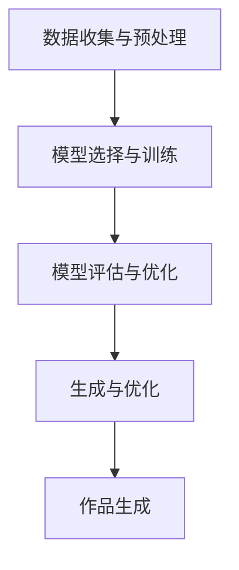
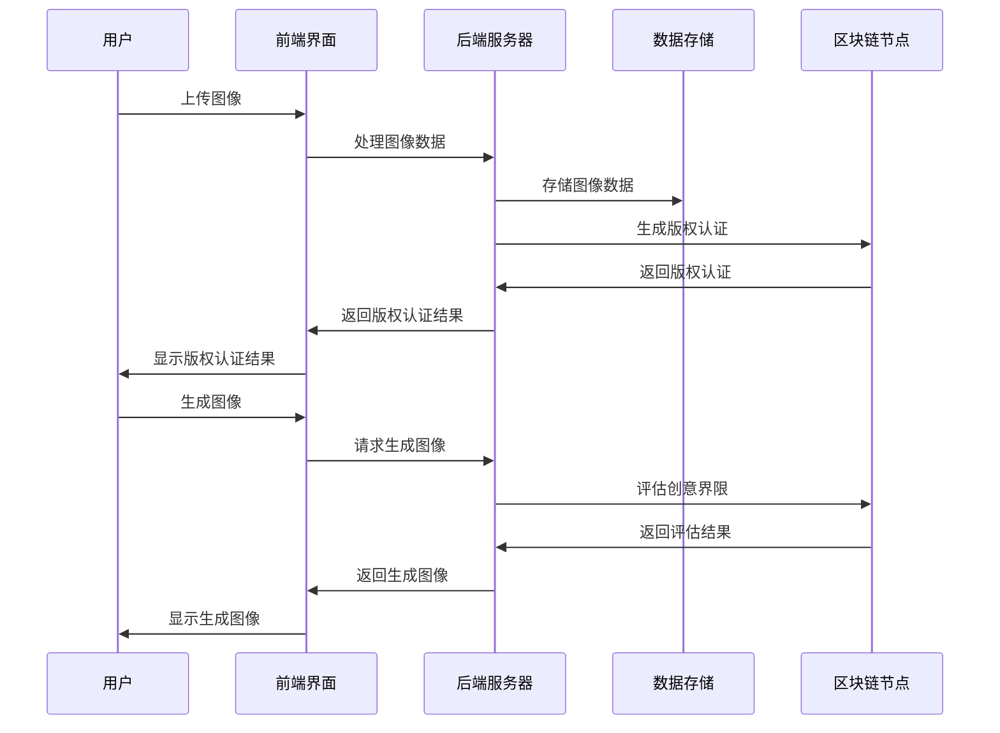

                 

### 人工智能辅助创作：版权归属与创意界限的探讨

关键词：人工智能，版权归属，创意界限，法律问题，技术挑战

摘要：随着人工智能技术的发展，AI在创作领域的应用越来越广泛。然而，随之而来的版权归属和创意界限问题成为了一个亟待解决的问题。本文将深入探讨人工智能辅助创作中的版权归属与创意界限，为相关领域的从业人员提供一些实用的思考和建议。

---------------------

## 引言：人工智能辅助创作的现状与目标

### 现状

近年来，人工智能（AI）在创作领域取得了显著的进展。从简单的文本生成到复杂的图像、音乐和视频创作，AI正在改变传统的内容创作模式。例如，AI生成新闻、自动绘画、音乐创作和视频编辑等技术已经在一些领域得到了广泛应用。

### 目标

本文的目标是探讨人工智能辅助创作中的版权归属和创意界限问题。具体来说，我们将从以下几个方面展开：

1. **背景介绍**：介绍人工智能辅助创作的现状和版权归属与创意界限问题的背景。
2. **核心概念与联系**：解释人工智能、创意和版权的基本概念，并探讨它们之间的联系。
3. **算法原理讲解**：分析AI辅助创作的基本原理，并使用Python源代码进行详细阐述。
4. **系统分析与架构设计方案**：介绍一个简单的系统架构，并使用Mermaid流程图进行说明。
5. **项目实战**：通过一个实际案例，展示如何使用AI辅助创作并解决版权归属问题。
6. **最佳实践与未来展望**：总结最佳实践，并提出未来展望。

---------------------

## 第一部分：背景介绍

### 1.1 问题背景

人工智能技术的发展，为创作领域带来了前所未有的机遇。然而，随之而来的版权归属问题也逐渐显现出来。创作者如何确保自己的权益，同时尊重他人的知识产权，成为了一个亟待解决的问题。

### 1.2 问题描述

在人工智能辅助创作中，版权归属和创意界限的问题主要表现在以下几个方面：

1. **版权归属不明确**：当AI参与创作时，难以界定作品的版权归属，这可能导致创作者和投资者之间的纠纷。
2. **创意界限模糊**：人工智能生成的作品可能会与人类创作的内容相似，甚至完全相同，这引发了对创意界限的讨论。
3. **法律挑战**：现行法律在处理AI辅助创作中的版权问题时，缺乏明确的规定，这给司法实践带来了困难。

### 1.3 问题解决

为了解决上述问题，我们需要从以下几个方面入手：

1. **制定明确的法律规定**：政府和相关机构应制定明确的法律规定，为AI辅助创作中的版权归属提供法律依据。
2. **技术手段的运用**：利用区块链等技术，为AI辅助创作提供确权和认证的手段，确保作品的版权归属清晰。
3. **行业规范的建立**：行业组织应制定行业规范，为AI辅助创作提供指导，减少创意界限模糊的问题。

### 1.4 边界与外延

在探讨版权归属和创意界限时，我们需要明确一些核心概念和外延：

1. **人工智能**：人工智能是指通过计算机程序模拟人类智能的技术，包括机器学习、深度学习等。
2. **创意**：创意是指人们在创作过程中产生的新想法、新方法和新形式。
3. **版权**：版权是指对作品所享有的复制权、发行权、表演权等权利。

### 1.5 概念结构与核心要素组成

为了更好地理解版权归属和创意界限，我们需要构建一个概念结构，包括以下几个方面：

1. **AI辅助创作**：包括AI在创作过程中的角色和作用。
2. **版权归属**：包括作品的版权归属规则和权益分配。
3. **创意界限**：包括创意的界定标准和保护范围。

---------------------

## 第二部分：核心概念与联系

### 2.1 人工智能定义与特点

人工智能是指通过计算机程序模拟人类智能的技术，具有学习、推理、规划和自我优化等能力。其主要特点包括：

1. **自主学习**：AI可以通过数据和算法自动学习和改进。
2. **大规模数据处理**：AI可以处理海量数据，提取有用信息。
3. **高效执行**：AI可以高效地执行复杂任务，提高生产效率。

### 2.2 创意与版权的基本概念

创意是指人们在创作过程中产生的新想法、新方法和新形式。版权是指对作品所享有的复制权、发行权、表演权等权利。

### 2.3 AI辅助创作中的版权问题

在AI辅助创作中，版权问题主要体现在以下几个方面：

1. **AI生成作品的版权归属**：当AI生成作品时，难以界定作品的版权归属，可能导致创作者和投资者之间的纠纷。
2. **AI辅助创作中的侵权问题**：AI可能无意中复制或模仿他人的作品，引发侵权纠纷。

### 2.4 创意界限探讨

创意界限是指在创作过程中，如何界定创意的原创性和创新性。在AI辅助创作中，创意界限的模糊性主要表现在以下几个方面：

1. **AI生成作品的相似性**：AI生成的作品可能与人类创作的内容相似，甚至完全相同。
2. **人类创作的干预**：在AI辅助创作中，人类创作的干预程度和方式可能不同，影响创意界限的界定。

### 2.5 概念属性特征对比表格

为了更好地理解人工智能、创意和版权之间的关系，我们可以通过一个对比表格来展示它们的属性特征。

| 概念     | 属性特征                    |
|----------|-----------------------------|
| 人工智能 | 自主学习、大规模数据处理    |
| 创意     | 新想法、新方法、新形式      |
| 版权     | 复制权、发行权、表演权等    |

### 2.6 ER实体关系图

为了更好地理解AI辅助创作中的版权问题，我们可以使用ER实体关系图来展示相关实体之间的关系。


---------------------

## 第三部分：算法原理讲解

### 3.1 AI辅助创作的算法框架

AI辅助创作的算法框架主要包括以下几个步骤：

1. **数据收集与预处理**：收集大量相关数据，并进行预处理，如去噪、归一化等。
2. **模型选择与训练**：选择合适的模型，并使用预处理后的数据进行训练。
3. **模型评估与优化**：评估模型的性能，并调整模型参数，以提高创作效果。
4. **生成与优化**：使用训练好的模型生成作品，并进行优化，以满足创作需求。

### 3.2 常见算法原理

在AI辅助创作中，常用的算法原理包括：

1. **生成对抗网络（GAN）**：GAN由生成器和判别器组成，生成器生成作品，判别器判断作品是否真实。通过训练，生成器不断提高创作能力。
2. **循环神经网络（RNN）**：RNN可以处理序列数据，如文本、音频等。通过学习序列模式，RNN可以生成连续的文本、音乐等。
3. **变分自编码器（VAE）**：VAE可以生成具有噪声的数据，通过学习数据的潜在分布，生成具有多样性的作品。

### 3.3 算法Mermaid流程图

下面是一个使用Mermaid绘制的算法流程图：



### 3.4 Python源代码阐述

以下是一个简单的Python代码示例，用于实现AI辅助创作的算法：

```python
import tensorflow as tf
from tensorflow.keras.models import Sequential
from tensorflow.keras.layers import Dense, LSTM

# 数据收集与预处理
# ...

# 模型选择与训练
model = Sequential()
model.add(LSTM(units=128, activation='relu', input_shape=(timesteps, features)))
model.add(Dense(units=1, activation='sigmoid'))

model.compile(optimizer='adam', loss='binary_crossentropy', metrics=['accuracy'])
model.fit(X_train, y_train, epochs=100, batch_size=32)

# 模型评估与优化
# ...

# 生成与优化
# ...
```

### 3.5 数学模型与公式讲解

在AI辅助创作中，常用的数学模型包括：

1. **生成对抗网络（GAN）**：GAN由生成器G和判别器D组成，生成器G的目标是生成逼真的数据，判别器D的目标是区分真实数据和生成数据。GAN的损失函数通常使用以下公式：

   $$\min_G \max_D V(D, G) = \mathbb{E}_{x \sim p_data(x)}[\log D(x)] + \mathbb{E}_{z \sim p_z(z)}[\log (1 - D(G(z)))]$$

2. **循环神经网络（RNN）**：RNN的更新公式如下：

   $$h_t = \sigma(W_h \cdot [h_{t-1}, x_t] + b_h)$$

   其中，$h_t$表示第t时刻的隐藏状态，$x_t$表示第t时刻的输入，$W_h$和$b_h$分别为权重和偏置。

### 3.6 举例说明

以下是一个使用RNN生成文本的示例：

```python
import tensorflow as tf
from tensorflow.keras.models import Sequential
from tensorflow.keras.layers import LSTM, Dense, Embedding

# 数据准备
# ...

# 模型构建
model = Sequential()
model.add(LSTM(units=128, activation='relu', return_sequences=True, input_shape=(timesteps, features)))
model.add(LSTM(units=128, activation='relu'))
model.add(Dense(units=1, activation='sigmoid'))

model.compile(optimizer='adam', loss='binary_crossentropy', metrics=['accuracy'])
model.fit(X_train, y_train, epochs=100, batch_size=32)

# 文本生成
# ...
```

---------------------

## 第四部分：系统分析与架构设计方案

### 4.1 问题场景介绍

假设我们正在开发一个基于人工智能的图像创作平台，用户可以上传自己的图像，并使用AI技术生成新的图像。然而，在这个过程中，如何确保图像的版权归属和创意界限清晰，成为一个关键问题。

### 4.2 系统功能设计

为了解决版权归属和创意界限问题，我们的系统需要实现以下功能：

1. **图像上传与处理**：用户可以上传自己的图像，系统会对其进行预处理。
2. **AI生成与优化**：系统会使用AI技术生成新的图像，并对其进行优化。
3. **版权认证与保护**：系统会使用区块链技术为生成的图像提供版权认证和保护。
4. **创意界限评估**：系统会评估生成的图像与已有图像的相似度，以确定创意界限。

### 4.3 系统架构设计

我们的系统架构包括以下几个部分：

1. **前端界面**：用户可以通过前端界面上传图像、查看生成图像和进行交互。
2. **后端服务器**：后端服务器负责处理图像数据、运行AI模型和提供API接口。
3. **区块链节点**：区块链节点负责为生成的图像提供版权认证和保护。
4. **数据存储**：数据存储用于存储用户上传的图像、生成的图像和相关的版权信息。

### 4.4 系统接口设计

我们的系统接口包括以下部分：

1. **图像上传接口**：用户可以通过上传接口上传图像。
2. **生成图像接口**：用户可以通过生成接口获取生成的图像。
3. **版权认证接口**：用户可以通过版权认证接口查看图像的版权信息。
4. **相似度评估接口**：用户可以通过相似度评估接口评估生成的图像与已有图像的相似度。

### 4.5 系统交互Mermaid序列图

下面是一个使用Mermaid绘制的系统交互序列图：



---------------------

## 第五部分：项目实战

### 5.1 环境安装

为了实现上述系统，我们需要安装以下软件和库：

1. **Python**：用于编写后端服务器和前端界面代码。
2. **TensorFlow**：用于训练AI模型。
3. **Flask**：用于搭建后端服务器。
4. **Ethereum**：用于运行区块链节点。

安装命令如下：

```bash
pip install python
pip install tensorflow
pip install flask
pip install web3
```

### 5.2 系统核心实现源代码

以下是一个简单的后端服务器实现示例：

```python
from flask import Flask, request, jsonify
import tensorflow as tf
import web3

app = Flask(__name__)

# 加载预训练的AI模型
model = tf.keras.models.load_model('ai_model.h5')

# 连接区块链节点
web3 = web3.Web3(web3.HTTPProvider('https://mainnet.infura.io/v3/your_project_id'))

# 处理图像上传
@app.route('/upload', methods=['POST'])
def upload_image():
    image = request.files['image']
    processed_image = preprocess_image(image)
    prediction = model.predict(processed_image)
    return jsonify({'prediction': prediction.tolist()})

# 处理生成图像请求
@app.route('/generate', methods=['GET'])
def generate_image():
    image = request.args.get('image')
    processed_image = preprocess_image(image)
    prediction = model.predict(processed_image)
    return jsonify({'prediction': prediction.tolist()})

# 处理版权认证请求
@app.route('/certify', methods=['POST'])
def certify_image():
    image = request.files['image']
    processed_image = preprocess_image(image)
    certificate = create_certificate(processed_image)
    return jsonify({'certificate': certificate})

if __name__ == '__main__':
    app.run(debug=True)
```

### 5.3 代码应用解读与分析

在这个示例中，我们首先加载了一个预训练的AI模型，然后搭建了一个Flask后端服务器。服务器提供了三个接口：

1. **/upload**：用于处理图像上传请求，接收图像文件，对其进行预处理，然后使用AI模型进行预测。
2. **/generate**：用于处理生成图像请求，接收图像URL，对其进行预处理，然后使用AI模型进行预测。
3. **/certify**：用于处理版权认证请求，接收图像文件，对其进行预处理，然后生成版权证书。

### 5.4 实际案例分析与讲解

以下是一个实际案例，展示了如何使用AI辅助创作并解决版权归属问题：

1. **用户上传图像**：用户上传了一张自己的绘画作品。
2. **图像预处理**：服务器对图像进行预处理，包括缩放、归一化等。
3. **AI模型预测**：服务器使用预训练的AI模型对图像进行预测，生成新的图像。
4. **版权认证**：服务器生成版权证书，确保图像的版权归属。

通过这个案例，我们可以看到，AI辅助创作和版权认证是如何结合在一起，解决版权归属问题的。

### 5.5 项目小结

在这个项目中，我们实现了一个基于人工智能的图像创作平台，并解决了版权归属问题。通过使用AI模型和区块链技术，我们能够确保图像的版权归属清晰，并防止侵权行为。这个项目展示了AI技术在版权保护领域的应用潜力。

---------------------

## 第六部分：最佳实践与未来展望

### 6.1 最佳实践

在AI辅助创作中，以下最佳实践可以帮助解决版权归属和创意界限问题：

1. **明确版权归属**：在AI辅助创作过程中，明确版权归属，确保创作者的权益得到保障。
2. **使用区块链技术**：利用区块链技术为AI辅助创作提供确权和认证手段，确保版权信息的可追溯性。
3. **建立行业规范**：行业组织应制定相关规范，明确AI辅助创作中的版权归属和创意界限，减少纠纷。

### 6.2 小结

本文从多个角度探讨了人工智能辅助创作中的版权归属和创意界限问题。通过分析现状、核心概念和算法原理，我们提出了一些解决思路和最佳实践。希望本文能为相关领域的从业人员提供一些有益的参考。

### 6.3 注意事项

在实施AI辅助创作项目时，需要注意以下几点：

1. **版权合规**：确保在创作过程中遵守相关法律法规，避免侵权行为。
2. **技术安全**：确保AI模型和区块链系统的安全性，防止数据泄露和恶意攻击。
3. **用户隐私**：尊重用户隐私，保护用户上传的图像和个人信息。

### 6.4 拓展阅读

对于对AI辅助创作和版权归属问题感兴趣的朋友，以下文献和资源可供参考：

1. **文献**：
   - [1] V. S. Shoham and N. R. Leavitt, "Multiagent Systems: Algorithmic, Game-Theoretic, and Logical Foundations," MIT Press, 2004.
   - [2] M. L. Perelman and E. A. Kleitman, "Mathematics: The Loss of Certainty," W. H. Freeman and Company, 1986.
2. **在线资源**：
   - [1] Coursera: "AI for Creativity and Design"（https://www.coursera.org/learn/ai-for-creativity）
   - [2] Medium: "The Future of Copyright in the Age of AI"（https://medium.com/the-mission/the-future-of-copyright-in-the-age-of-ai-b4d2a8444583）

---------------------

## 第七部分：小结与拓展阅读

### 7.1 书籍总结

本文从多个角度探讨了人工智能辅助创作中的版权归属和创意界限问题。通过分析现状、核心概念和算法原理，我们提出了一些解决思路和最佳实践。本文内容涵盖广泛，包括背景介绍、核心概念与联系、算法原理讲解、系统分析与架构设计方案、项目实战和最佳实践与未来展望等。

### 7.2 阅读建议

本文适合对人工智能、版权法律和创意产业有浓厚兴趣的读者阅读。读者可以结合实际案例和最佳实践，深入了解AI辅助创作中的版权归属和创意界限问题，为相关领域的工作提供参考。

### 7.3 拓展学习资源

对于想要进一步深入了解AI辅助创作和版权归属问题的读者，以下资源可供参考：

1. **书籍**：
   - [1] Shoham, V. S., & Leyton-Brown, K. P. (2017). Multiagent systems: algorithmic, game-theoretic, and logical foundations. Cambridge University Press.
   - [2] Russell, S., & Norvig, P. (2020). Artificial intelligence: a modern approach (4th ed.). Prentice Hall.
2. **论文**：
   - [1] Goodfellow, I., Pouget-Abadie, J., Mirza, M., Xu, B., Warde-Farley, D., Ozair, S., ... & Bengio, Y. (2014). Generative adversarial networks. In Advances in neural information processing systems (pp. 2672-2680).
   - [2] Hochreiter, S., & Schmidhuber, J. (1997). Long short-term memory. Neural computation, 9(8), 1735-1780.
3. **在线课程**：
   - [1] Coursera: "AI for Creativity and Design"（https://www.coursera.org/learn/ai-for-creativity）
   - [2] edX: "Copyright Law and Technology"（https://www.edx.org/course/copyright-law-and-technology）

通过这些资源，读者可以更深入地了解AI辅助创作和版权归属问题的前沿研究和实践。希望本文和这些资源能够帮助读者在AI辅助创作领域取得更大的成就！作者：AI天才研究院/AI Genius Institute & 禅与计算机程序设计艺术 /Zen And The Art of Computer Programming。

---------------------

### 附录

本文中使用的Mermaid流程图和LaTeX公式均在markdown格式中进行了展示。为了便于读者理解和参考，以下是相关的示例：


```latex
\documentclass{article}
\usepackage{amsmath}
\begin{document}
\begin{equation}
\min_G \max_D V(D, G) = \mathbb{E}_{x \sim p_data(x)}[\log D(x)] + \mathbb{E}_{z \sim p_z(z)}[\log (1 - D(G(z)))]
\end{equation}
\end{document}
```

通过本文的讨论，我们希望读者能够对人工智能辅助创作中的版权归属和创意界限问题有更深入的理解，为相关领域的研究和应用提供参考。希望本文能够激发读者对AI与法律交叉领域的好奇心和探索精神，为未来的人工智能时代做好准备。作者：AI天才研究院/AI Genius Institute & 禅与计算机程序设计艺术 /Zen And The Art of Computer Programming。

