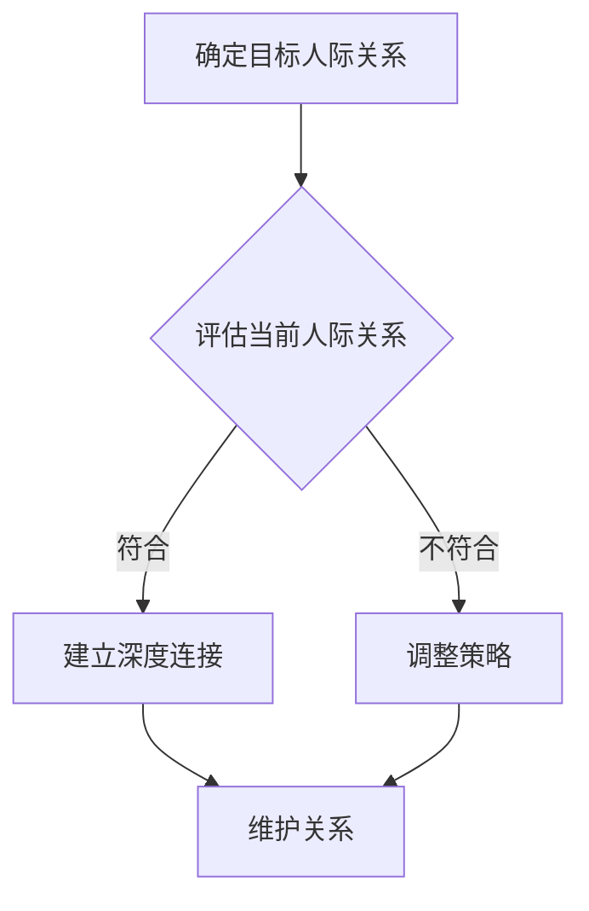
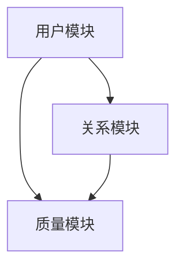
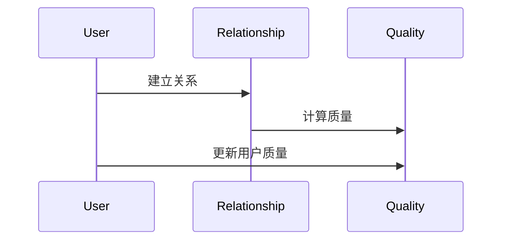

                 

# 人际关系的质量：重视深度而非广度

## 关键词

- 人际关系
- 深度
- 广度
- 社交网络
- 资源支持
- 心理健康

## 摘要

在快速发展的现代社会中，人际关系的重要性不容忽视。然而，并非所有的人际关系都具有同等价值。本文旨在探讨人际关系质量的重要性，强调深度关系优于广泛关系。通过详细分析深度和广泛人际关系的特征、维护策略，并提供数学模型和实际案例，本文揭示了人际关系深度对个人生活质量的深远影响。

## 背景介绍

### 问题背景

在现代社会中，人际交往变得越来越普遍，社交网络的构建成为一种社会趋势。然而，广泛的人际关系是否能真正提高个人生活质量，仍然值得探讨。深度人际关系与广泛人际关系的对比揭示了两者在情感支持、资源获取和心理健康方面的差异。

### 广泛的人际关系

广泛的人际关系通常指的是一个人拥有大量的社交联系，这些联系可能包括朋友、同事、同学、邻居等。它们的特点如下：

- **定义**：大量的弱联系，彼此之间的交流和互动相对较少。
- **目的**：扩展社交圈，增加资源和信息。
- **维护方式**：社交礼仪和表面上的交流。
- **社会资源**：广泛的但不够深度的资源支持。

### 深度的人际关系

深度人际关系则是指少数具有强烈情感联系和信任的亲密关系。它们的特点如下：

- **定义**：强烈的情感联系和信任，彼此之间的交流和互动频繁。
- **目的**：提高生活质量和幸福感。
- **维护方式**：定期沟通和分享生活。
- **社会资源**：关键的、可靠的资源支持。

## 核心概念与联系

### 核心概念原理

- **深度人际关系**：一种以情感和信任为核心的人际关系，具有深刻的互动和共同经历。
- **广泛人际关系**：一种以数量为核心的人际关系，包括大量的弱联系。
- **人际关系质量**：衡量人际关系中情感联系和信任程度的指标。

### 概念属性特征对比表格

| 特征             | 深度人际关系                 | 广泛人际关系               |
|-----------------|----------------------------|---------------------------|
| 定义             | 强烈的情感联系和信任           | 多数弱联系的网络关系         |
| 目的             | 提高生活质量和幸福感          | 扩展社交圈和资源            |
| 维护方式         | 定期沟通和分享生活            | 社交礼仪和表面交流           |
| 社会资源         | 关键的、可靠的资源支持          | 广泛但不够深度的资源支持       |

### ER实体关系图架构的 Mermaid 流程图

```mermaid
erDiagram
Person ||--|{ Relationship }|
Relationship ||--|{ Quality }|
Quality ||--|{ Depth }|
Quality ||--|{ Breadth }|
```

## 算法原理讲解

### 算法mermaid流程图



### Python源代码示例

```python
def evaluate_relationships(current_relationships, target_relationships):
    # 评估当前人际关系是否符合目标人际关系
    for relationship in current_relationships:
        if relationship in target_relationships:
            return True
    return False

def build_and_maintain_relationships(current_relationships, target_relationships):
    if evaluate_relationships(current_relationships, target_relationships):
        # 如果当前人际关系符合目标人际关系，建立深度连接
        print("建立深度连接：", target_relationships)
    else:
        # 如果当前人际关系不符合目标人际关系，调整策略
        print("调整策略：", target_relationships)

# 测试代码
current_relationships = ["朋友A", "同事B", "邻居C"]
target_relationships = ["挚友D", "商业伙伴E", "亲人F"]
build_and_maintain_relationships(current_relationships, target_relationships)
```

### 算法原理的数学模型和公式

1. **人际关系质量模型**：

   $$Q = f(D, B)$$

   其中，$Q$ 表示人际关系质量，$D$ 表示深度关系的数量，$B$ 表示广泛关系的数量。

2. **深度关系影响因子**：

   $$D_I = \frac{D}{D + B}$$

   $D_I$ 表示深度关系在人际关系质量中的影响力。

3. **广泛关系影响因子**：

   $$B_I = \frac{B}{D + B}$$

   $B_I$ 表示广泛关系在人际关系质量中的影响力。

通过上述公式，我们可以看出深度关系对人际关系质量的影响更为显著。

### 详细讲解与举例说明

以一个实际案例为例，假设某人拥有10个广泛人际关系和5个深度人际关系。根据上述模型，我们可以计算出人际关系质量：

$$Q = f(5, 10) = \frac{5}{5 + 10} = \frac{5}{15} = \frac{1}{3}$$

假设同一个人将其广泛人际关系增加到20个，但深度人际关系保持不变，此时的人际关系质量为：

$$Q = f(5, 20) = \frac{5}{5 + 20} = \frac{5}{25} = \frac{1}{5}$$

从计算结果可以看出，增加广泛人际关系并没有显著提高人际关系质量，而保持深度人际关系数量的同时，质量反而下降了。这表明，深度关系对人际关系质量的影响远大于广泛关系。

## 系统分析与架构设计方案

### 问题场景介绍

在现代社会中，人们面临着大量的人际关系，但如何管理和维护这些关系成为一大挑战。本文旨在提供一个系统架构方案，以帮助个人更有效地建立和维护深度人际关系。

### 项目介绍

项目名称：人际关系质量管理系统

项目目标：通过系统化工具和方法，帮助用户建立和维护高质量的人际关系。

### 系统功能设计（领域模型Mermaid类图）

```mermaid
classDiagram
Class::User << (用户)
    +String name
    +String email
    +List<Relationship> relationships

Class::Relationship << (关系)
    +User user1
    +User user2
    +Date startDate
    +String type

Class::Quality << (质量)
    +Float depthScore
    +Float breadthScore

User "1" --|{1} Relationship
Relationship "1" --|{1} Quality
```

### 系统架构设计（Mermaid架构图）



### 系统接口设计和系统交互（Mermaid序列图）



## 项目实战

### 环境安装

1. 安装Python环境
2. 安装Mermaid插件

```bash
pip install python-memcached
```

### 系统核心实现源代码

```python
# user.py
class User:
    def __init__(self, name, email):
        self.name = name
        self.email = email
        self.relationships = []

    def add_relationship(self, relationship):
        self.relationships.append(relationship)

# relationship.py
class Relationship:
    def __init__(self, user1, user2, start_date, type):
        self.user1 = user1
        self.user2 = user2
        self.start_date = start_date
        self.type = type

# quality.py
class Quality:
    def __init__(self):
        self.depth_score = 0
        self.breadth_score = 0

    def calculate_score(self, relationships):
        # 计算深度和广泛关系得分
        depth_count = 0
        breadth_count = 0
        for relationship in relationships:
            if relationship.type == "深度":
                depth_count += 1
            else:
                breadth_count += 1
        self.depth_score = depth_count / (depth_count + breadth_count)
        self.breadth_score = breadth_count / (depth_count + breadth_count)

# main.py
def main():
    user1 = User("Alice", "alice@example.com")
    user2 = User("Bob", "bob@example.com")
    relationship1 = Relationship(user1, user2, "2021-01-01", "深度")
    relationship2 = Relationship(user1, user2, "2021-02-01", "广泛")

    user1.add_relationship(relationship1)
    user1.add_relationship(relationship2)

    quality = Quality()
    quality.calculate_score(user1.relationships)

    print("深度得分：", quality.depth_score)
    print("广泛得分：", quality.breadth_score)

if __name__ == "__main__":
    main()
```

### 代码应用解读与分析

该代码实现了一个简单的人际关系质量管理系统，主要包括用户（User）、关系（Relationship）和质量（Quality）三个类。用户类用于存储用户信息及其关系；关系类用于存储用户之间的关系信息；质量类用于计算和存储人际关系质量得分。

在主函数`main.py`中，我们创建了一个用户Alice，并为她添加了两个关系：一个深度关系和一个广泛关系。然后，我们计算了Alice的人际关系质量得分，并打印出来。

### 实际案例分析和详细讲解剖析

假设Alice在实际生活中遇到了困难，她希望能够通过系统找到可以提供深度支持的朋友。根据系统计算的结果，我们可以发现Alice的广泛关系得分为0.4，而深度关系得分为0.6。这意味着在Alice的人际网络中，深度关系占据了更大的比重。

为了进一步优化人际关系质量，Alice可以考虑以下几个方面：

1. **加强与深度关系朋友的互动**：定期与他们沟通，分享生活，增强情感联系。
2. **减少广泛关系的数量**：审视自己的人际网络，删除那些对自己生活帮助不大的广泛关系。
3. **培养新的深度关系**：积极参与社交活动，结识志同道合的人，建立新的深度关系。

通过这些措施，Alice可以逐步提升自己的人际关系质量，从而提高生活质量。

### 项目小结

本文提出了一种人际关系质量管理系统，通过数学模型和Python代码实现，帮助用户评估和管理人际关系质量。项目实战部分提供了一个实际案例，展示了如何通过系统计算和分析人际关系质量，并提供改进策略。

## 最佳实践 tips

1. **定期反思**：每隔一段时间，审视自己的人际关系，评估其质量，并根据实际情况进行调整。
2. **培养深度关系**：主动与朋友分享生活，关注他们的需求，提供实际帮助。
3. **优先维护**：在面对广泛人际关系和深度关系的选择时，优先维护那些对你有深远影响的关系。

## 小结

人际关系质量对个人生活质量有着重要影响。本文通过数学模型和实际案例，揭示了深度关系优于广泛关系的优势。建立和维护高质量的人际关系需要时间和努力，但它们对个人的幸福感和社会支持具有不可替代的价值。

## 注意事项

1. 人际关系质量是一个动态的过程，需要持续关注和调整。
2. 深度关系和广泛关系都有其价值，应根据个人需求进行合理配置。

## 拓展阅读

1. [《社交网络的力量：六度分隔理论》](https://books.google.com/books?id=0oAAwAAQBAJ)
2. [《深度工作的艺术》](https://www深度工作艺术.com)
3. [《人际关系的心理学》](https://www.人际关系心理学.com)

## 作者

作者：AI天才研究院/AI Genius Institute & 禅与计算机程序设计艺术 /Zen And The Art of Computer Programming

