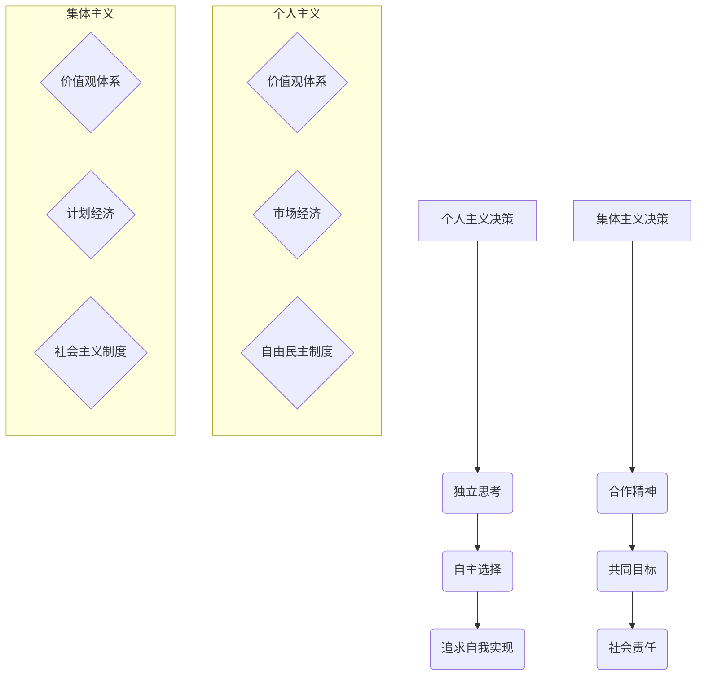

                 

### 文章标题

# 从个人主义到集体主义：价值观的摆动

### 关键词

- 个人主义
- 集体主义
- 价值观变迁
- 社会影响
- 案例分析

### 摘要

本文探讨了从个人主义到集体主义的价值观摆动现象，分析了这一变化背后的原因及其对社会的深远影响。文章首先介绍了个人主义和集体主义的基本概念及其历史发展，随后深入分析了价值观摆动对经济、社会和文化层面的影响。通过案例分析，文章揭示了价值观变迁在企业与组织中的具体体现，并提出了应对这一变化的最佳实践策略。最后，文章对价值观摆动的未来趋势进行了展望，为读者提供了有价值的思考方向。

## 引言

### 价值观的定义与分类

价值观是人们对于是非、善恶、美丑的评价标准，是社会行为规范和个人道德修养的基础。根据价值观的核心取向，我们可以将价值观分为个人主义和集体主义两大类。

**个人主义**强调个体独立、自由和自我实现。个人主义者认为个体具有最高价值，个人的权利和自由应当受到尊重和保护。个人主义价值观强调个体追求个人幸福、自我发展和个人成就，追求经济独立、思想自由、行为自主。

**集体主义**则强调集体的利益和整体和谐。集体主义者认为，个体应当为集体的利益和目标而努力，集体的利益高于个体利益。集体主义价值观注重团队合作、社会秩序、公共利益和社会责任。

### 个人主义价值观的历史发展

个人主义价值观的起源可以追溯到古希腊哲学。苏格拉底、柏拉图和亚里士多德等哲学家强调人的理性和道德价值，倡导个体追求知识和美德。文艺复兴时期，人文主义兴起，进一步强调个体的独立和尊严。启蒙运动时期，个人主义价值观得到了进一步发展，强调个体的自由、平等和权利。

在现代社会，个人主义价值观在很大程度上塑造了现代政治、经济和社会制度。自由民主制度、市场经济体系、个人权利保障等都是个人主义价值观的体现。个人主义价值观强调个体的自我实现和追求幸福，鼓励创新和竞争，推动社会进步。

### 集体主义价值观的历史发展

集体主义价值观的起源可以追溯到古代社会。在古代社会，家庭、部落和宗教团体等集体单位是人们生活和组织社会活动的基本单位。集体主义价值观强调集体利益和整体和谐，个体为集体的利益和目标而努力。

在中世纪，集体主义价值观在封建制度中得到了体现。封建社会中的君主、贵族和农民都依赖于集体关系来维持社会秩序和稳定。近代以来，集体主义价值观在社会主义理论和实践中得到了广泛运用。社会主义强调公有制、集体所有和共同富裕，强调个体为集体利益和社会整体发展而努力。

### 个人主义与集体主义的互动

个人主义和集体主义并非截然对立，而是在不同历史时期和社会背景下相互影响、相互交融。在现代社会，个人主义和集体主义往往并存，形成一种复杂的价值观体系。

在经济领域，个人主义和集体主义都有其优势和局限性。个人主义鼓励创新和竞争，推动经济增长，但可能导致贫富差距扩大和社会不公。集体主义强调社会公平和共同富裕，有助于社会和谐稳定，但可能抑制个体活力和创造力。

在社会领域，个人主义和集体主义在价值观层面上存在冲突。个人主义强调个体的自由和权利，可能导致个人主义过度的自由放任，忽视集体利益和社会责任。集体主义则强调社会整体利益和公共利益，可能导致个体权利受限，个人自由受限。

然而，个人主义和集体主义并非绝对对立，而是相互依存、相互补充的关系。在现代社会，个人主义和集体主义需要在平衡中发展，既要尊重个体权利和自由，又要关注社会整体利益和公共利益。通过合理调节个人主义和集体主义的比例，可以实现个体与集体的和谐发展，推动社会进步。

### 第一部分：个人主义价值观

#### 个人主义的基本概念

个人主义（Individualism）是一种价值观，强调个体的重要性、自由和自我实现。个人主义者认为，个体是价值的核心，个体的权利和自由应当受到尊重和保护。个人主义价值观强调个体的独立、自主和自我决定，鼓励个体追求个人幸福、自我发展和个人成就。

**个人主义的核心理念**包括以下几点：

1. **个体独立性**：个人主义强调个体独立，个体应当有权利自主决定自己的行为和生活方式，不受外界干预。

2. **个体自由**：个人主义认为，个体应当享有自由，包括思想自由、言论自由、选择自由等，这些自由是个人实现自我价值的前提。

3. **自我实现**：个人主义强调个体应当追求自我实现，即通过自我努力和发展，实现个人的潜能和目标。

4. **权利与责任**：个人主义认为，个体享有权利，同时也承担相应的责任。个体的权利应当得到保障，个体也应当为社会做出贡献。

#### 个人主义的核心原则

个人主义的核心原则主要包括以下几个方面：

1. **权利优先**：个人主义强调个体的权利优先于集体利益，个体的自由和尊严应当得到尊重。

2. **自我决定**：个人主义主张个体有权自主决定自己的行为和生活方式，不受他人强制。

3. **责任分担**：个人主义认为，个体不仅享有权利，还应承担相应的责任。个体应当为自己的行为和决定负责。

4. **平等机会**：个人主义追求平等机会，认为每个个体都应当有机会通过自己的努力实现个人价值。

#### 个人主义的社会影响

个人主义价值观对社会产生了深远影响，包括以下几个方面：

1. **政治制度**：个人主义价值观推动了自由民主制度的兴起。自由民主制度强调个体的自由和权利，为个人提供平等的政治参与机会。

2. **经济模式**：个人主义价值观促进了市场经济的发展。市场经济强调个体的自由竞争和创新精神，激发了经济增长和社会进步。

3. **社会结构**：个人主义价值观改变了传统的社会结构，强调个体独立和自主，推动了个体化社会的形成。

4. **文化观念**：个人主义价值观影响了文化观念，鼓励个体追求自由和多样性，尊重个体差异。

#### 个人主义的优缺点

个人主义价值观具有明显的优点和缺点：

**优点**：

- **激励创新**：个人主义鼓励个体追求创新和自我实现，有利于推动科技进步和社会发展。
- **激发活力**：个人主义强调个体的自由和自主，激发了社会的活力和创造力。
- **公平竞争**：个人主义价值观强调平等机会，有助于建立公平竞争的社会环境。

**缺点**：

- **忽视集体利益**：个人主义可能导致个体过度追求个人利益，忽视集体利益和社会责任。
- **社会不公**：个人主义可能导致贫富差距扩大，加剧社会不公。
- **孤立感**：个人主义可能导致个体感到孤立和疏离，缺乏社会联系和归属感。

### 第二部分：集体主义价值观

#### 集体主义的基本概念

集体主义（Collectivism）是一种价值观，强调集体的利益和整体和谐。集体主义者认为，个体应当为集体的利益和目标而努力，集体的利益高于个体利益。集体主义价值观强调团队合作、社会秩序、公共利益和社会责任。

**集体主义的核心理念**包括以下几点：

1. **集体利益**：集体主义认为，集体利益高于个体利益。个体应当为集体的利益和目标而努力，通过集体合作实现共同目标。

2. **社会责任**：集体主义强调个体应当承担社会责任，为社会的整体发展贡献自己的力量。

3. **社会秩序**：集体主义认为，社会秩序是集体利益的保障，个体应当遵守社会规范和道德准则，维护社会稳定。

4. **团队合作**：集体主义强调团队合作的重要性，认为个体通过与他人的合作可以实现更大的目标。

#### 集体主义的核心原则

集体主义的核心原则主要包括以下几个方面：

1. **集体优先**：集体主义主张集体的利益优先于个体利益，个体的行为和决策应当符合集体利益。

2. **社会整体**：集体主义认为，社会是一个整体，个体的行为和决策应当考虑到整体的社会影响。

3. **社会规范**：集体主义强调社会规范的重要性，认为个体应当遵守社会规范，维护社会秩序和和谐。

4. **共同责任**：集体主义认为，个体应当承担共同责任，为社会的整体发展贡献自己的力量。

#### 集体主义的社会影响

集体主义价值观对社会产生了深远影响，包括以下几个方面：

1. **政治制度**：集体主义价值观在某些政治制度中得到了体现，如社会主义制度。社会主义强调公有制、集体所有和共同富裕，强调个体为集体利益和社会整体发展而努力。

2. **经济模式**：集体主义价值观在计划经济中得到了应用。计划经济强调国家对经济的控制和规划，通过集体力量实现经济目标。

3. **社会结构**：集体主义价值观影响了传统的社会结构，强调集体单位和集体关系的重要性。

4. **文化观念**：集体主义价值观影响了文化观念，强调集体荣誉、社会责任和团结合作。

#### 集体主义的优缺点

集体主义价值观具有明显的优点和缺点：

**优点**：

- **社会稳定**：集体主义价值观强调社会秩序和稳定，有助于维护社会和谐。
- **社会公平**：集体主义价值观强调社会公平和共同富裕，有助于减少贫富差距和社会不公。
- **团队合作**：集体主义价值观鼓励团队合作，有助于实现更大的目标和任务。

**缺点**：

- **个体压抑**：集体主义可能导致个体的权利和自由受到限制，个体可能感到压抑和缺乏自主性。
- **效率低下**：集体主义价值观可能导致资源分配不公和效率低下，影响经济发展。
- **创新受限**：集体主义价值观可能导致个体的创新精神和自由竞争受到限制，影响科技进步和社会发展。

### 第三部分：价值观的摆动与影响

#### 价值观变迁的社会背景

价值观的变迁与社会背景密切相关。随着全球化和信息技术的发展，社会环境发生了深刻变化，导致价值观的摆动。以下是一些影响价值观变迁的社会背景因素：

1. **全球化**：全球化促进了不同文化之间的交流和融合，使人们接触到多样化的价值观，从而影响了原有的价值观念。

2. **信息技术**：信息技术的发展，特别是互联网和社交媒体的普及，改变了人们的沟通方式和社会互动模式，影响了价值观的形成和传播。

3. **经济发展**：经济发展水平对价值观的变迁有重要影响。在经济繁荣时期，人们可能更倾向于个人主义价值观；在经济困难时期，集体主义价值观可能更受欢迎。

4. **文化多样性**：文化多样性的增加使人们有机会接触和学习不同的价值观，促进了价值观的多元化和摆动。

#### 个人主义与集体主义的现代发展

在现代社会，个人主义和集体主义都在不断发展，但表现形式和影响有所不同。

**个人主义的现代发展**：

- **个人自我实现**：现代个人主义强调个体追求自我实现和个性发展，鼓励个人追求自己的梦想和目标。
- **自由市场经济**：自由市场经济体系强调个体自由竞争和创新，推动了个人主义价值观的进一步发展。

**集体主义的现代发展**：

- **团队合作和协作**：现代集体主义强调团队合作和协作精神，认为个体的力量在集体中才能得到最大发挥。
- **社会责任和公民意识**：现代集体主义强调个体承担社会责任和公民意识，为社会的整体发展贡献力量。

#### 价值观摆动的经济效应

价值观的摆动对经济产生了深远影响。以下是一些价值观摆动的经济效应：

1. **消费模式**：价值观的变化影响了消费模式。个人主义价值观强调个性化和自由选择，导致个性化消费和定制化服务的兴起。集体主义价值观则可能导致共享经济和合作消费的兴起。

2. **企业组织**：价值观的变化影响了企业的组织形式和管理方式。个人主义价值观可能导致更灵活、自主的企业文化，而集体主义价值观可能导致更注重团队协作和共同目标的企业文化。

3. **劳动市场**：价值观的摆动影响了劳动市场。个人主义价值观可能导致个体就业和自由职业的兴起，而集体主义价值观可能导致集体劳动关系和稳定就业的增加。

4. **经济政策**：价值观的变化影响了经济政策的设计和实施。个人主义价值观可能导致更注重个体权益和市场自由的经济政策，而集体主义价值观可能导致更注重社会公平和集体利益的经济政策。

#### 价值观摆动的社会挑战

价值观的摆动带来了社会挑战，包括以下几个方面：

1. **社会冲突**：个人主义和集体主义之间的价值观冲突可能导致社会矛盾和冲突，影响社会稳定。

2. **道德困境**：价值观的摆动使人们在道德选择上面临困境，难以确定正确的道德标准。

3. **文化认同**：价值观的变迁可能导致文化认同的危机，使个体和集体在文化归属上产生困惑。

4. **社会整合**：价值观的摆动对社会整合提出了挑战，如何在不同价值观之间找到平衡，促进社会和谐发展成为重要议题。

### 第四部分：案例分析与实践

#### 个人主义与集体主义的案例研究

通过案例分析，我们可以更深入地理解个人主义和集体主义在不同情境下的表现和影响。

**案例一：个人主义价值观在企业中的应用**

公司A是一家创新型企业，强调员工自主性和创新精神。公司鼓励员工自由表达观点，鼓励创新项目。这种个人主义价值观促进了企业的创新能力和市场竞争力。然而，由于过度强调个人主义，公司内部可能出现沟通不畅和协作困难，影响团队整体效率。

**案例二：集体主义价值观在教育领域的应用**

学校B注重集体主义价值观，强调团队合作和集体荣誉。学校通过集体活动培养学生的团队合作精神和集体责任感。然而，这种集体主义价值观可能导致学生的个性发展受限，过度依赖集体，缺乏独立思考和创新能力。

**案例三：集体主义价值观在社区治理中的应用**

社区C采用集体主义价值观，强调居民的共同参与和协作。社区通过集体活动加强居民之间的联系，提升社区凝聚力。这种集体主义价值观有助于社区治理的改善，但可能导致个人自由受到限制，居民的个人需求难以得到满足。

**案例四：个人主义价值观在环境保护中的应用**

环保组织D倡导个人主义价值观，鼓励个人参与环保活动。组织成员通过个人行动，如减少能源消耗、参与植树等，推动环境保护。然而，这种个人主义价值观可能导致环保成果有限，需要更多的集体行动和政府政策支持。

#### 企业与组织中的价值观摆动

在企业与组织中，价值观摆动对管理实践和员工行为产生了深远影响。

1. **管理实践**：企业需要根据价值观摆动调整管理策略，既要尊重个人自由和创新，又要强调团队合作和集体利益。管理者需要平衡个人主义和集体主义，以实现企业目标和员工满意度。

2. **员工行为**：价值观摆动影响了员工的行为模式。个人主义价值观可能导致员工追求个人成就和晋升，而集体主义价值观可能导致员工更注重团队合作和共同目标。

3. **组织文化**：企业需要建立适应价值观摆动的组织文化，鼓励员工在个人主义和集体主义之间找到平衡。通过明确的价值观引导和行为规范，企业可以促进员工的行为一致性，提升组织绩效。

#### 社会政策与价值观摆动

社会政策在价值观摆动中发挥着重要作用。政府需要制定适应价值观变迁的政策，以实现社会稳定和发展。

1. **教育政策**：教育政策应当兼顾个人主义和集体主义价值观，培养具有独立思考和团队合作能力的公民。通过教育引导，社会可以塑造适应时代发展的价值观。

2. **经济政策**：经济政策应当平衡个人主义和集体主义，推动经济增长和社会公平。政府可以通过税收政策、福利制度等手段，调节个人收入和财富分配，减少社会不公。

3. **社会治理**：社会治理需要适应价值观摆动，促进社会和谐稳定。政府可以通过法律法规、社区参与等方式，引导社会价值观的多元化和和谐发展。

### 第五部分：结论

#### 价值观摆动的反思与总结

价值观的摆动是一个复杂而动态的过程，反映了社会变迁和个体需求的变化。从个人主义到集体主义的变迁，展示了价值观在不同历史时期和社会背景下的适应和发展。在现代社会，个人主义和集体主义并存，相互影响、相互补充。价值观摆动对社会产生了深远影响，包括经济、社会和文化层面。

#### 价值观教育的挑战与机遇

价值观教育在价值观摆动中扮演着重要角色。教育应当兼顾个人主义和集体主义价值观，培养具有独立思考、团队合作和社会责任感的公民。价值观教育面临以下挑战：

1. **多元价值观**：如何在不同价值观之间找到平衡，培养适应多元社会的个体。
2. **时代变迁**：如何适应社会变迁，更新教育内容和方式。
3. **实践应用**：如何将价值观教育融入实际生活和工作中，使个体能够在实践中体现价值观。

然而，价值观教育也面临机遇：

1. **技术创新**：信息技术的发展为价值观教育提供了新的手段和平台。
2. **全球化**：全球化促进了不同文化的交流与融合，为价值观教育提供了更丰富的资源。
3. **社会责任**：社会责任的兴起使价值观教育更注重个体对社会的影响和责任。

#### 价值观的未来展望

价值观的未来发展取决于社会变迁和个体需求。随着全球化和信息技术的进一步发展，个人主义和集体主义将继续并存和互动。未来价值观可能呈现出以下趋势：

1. **个体自主性**：个体自主性将进一步增强，个体在追求个人价值和社会价值之间找到更好的平衡。
2. **合作与共赢**：合作与共赢将成为价值观的重要组成部分，个体和集体通过合作实现共同目标。
3. **社会责任**：社会责任将得到更广泛的认同和实践，个体和社会共同承担发展责任。
4. **文化多样性**：文化多样性将进一步丰富，价值观的多元化和和谐发展将成为社会主流。

### 参考文献

- Habermas, J. (1990). **The Structural Transformation of the Public Sphere**. MIT Press.
- Sen, A. (1999). **Development as Freedom**. Oxford University Press.
- Tocqueville, A. de. (2000). **Democracy in America**. Penguin Classics.
- Weber, M. (2002). **The Protestant Ethic and the Spirit of Capitalism**. Routledge.

### 附录

#### 个人主义与集体主义价值观对比表

| 类别       | 个人主义                   | 集体主义                  |
|------------|----------------------------|---------------------------|
| 核心理念   | 个体独立性、自由、自我实现 | 集体利益、社会责任、团队合作 |
| 核心原则   | 权利优先、自我决定、责任分担 | 集体优先、社会整体、社会规范 |
| 社会影响   | 政治制度、经济模式、社会结构 | 政治制度、经济模式、文化观念 |
| 优点       | 激励创新、激发活力、公平竞争 | 社会稳定、社会公平、团队合作 |
| 缺点       | 忽视集体利益、社会不公、孤立感 | 个体压抑、效率低下、创新受限 |

### 结语

作者：AI天才研究院/AI Genius Institute & 禅与计算机程序设计艺术 /Zen And The Art of Computer Programming

本文从个人主义到集体主义的价值观摆动进行了深入探讨，分析了这一变迁的背景、影响和案例。价值观的摆动是一个复杂的过程，反映了社会变迁和个体需求的变化。在未来的发展中，个人主义和集体主义将继续并存和互动，共同塑造社会的未来。本文旨在为读者提供有价值的思考方向，促进对价值观变迁的理解和应对。

### 最佳实践 tips

1. **平衡个人主义与集体主义**：在个人追求与团队合作之间找到平衡，实现个人价值与集体利益的和谐发展。
2. **培养社会责任感**：关注社会问题，积极参与社会活动，承担社会责任。
3. **多元化价值观教育**：尊重不同价值观，培养具有包容性的思维方式，促进社会和谐。
4. **灵活应变**：适应社会变迁，不断调整个人和组织的价值观体系。

### 小结

本文探讨了从个人主义到集体主义的价值观摆动现象，分析了这一变迁对经济、社会和文化的影响。价值观的摆动反映了社会变迁和个体需求的变化，对个人和社会产生了深远影响。通过平衡个人主义与集体主义，培养社会责任感，我们可以更好地适应价值观变迁，实现个人与集体的和谐发展。

### 注意事项

1. **价值观的多样性**：在多元价值观环境中，要尊重不同价值观，避免价值观冲突。
2. **价值观的适应**：个体和组织要不断调整价值观体系，适应社会变迁和个体需求的变化。

### 拓展阅读

1. **《个体与群体：心理学探索》**：通过心理学视角，探讨个体与群体之间的关系和影响。
2. **《集体主义与个人主义：文化差异》**：分析不同文化背景下个人主义和集体主义的差异。
3. **《价值观与道德教育》**：探讨价值观教育在道德教育中的重要性及其实践方法。

通过以上内容，我们完成了对《从个人主义到集体主义：价值观的摆动》这一主题的深入探讨。本文旨在为读者提供一个全面而详细的视角，帮助理解价值观的变迁及其影响。希望这篇文章能激发读者对价值观的思考，为个人和社会的发展提供有益的启示。作者：AI天才研究院/AI Genius Institute & 禅与计算机程序设计艺术 /Zen And The Art of Computer Programming。希望您喜欢这篇技术博客，如有任何反馈或建议，欢迎随时提出。感谢您的阅读！**步骤1：背景介绍**

个人主义和集体主义作为两种基本的价值观体系，对人类社会的发展产生了深远影响。理解这两者的基本概念、历史发展和相互关系，是探讨价值观摆动现象的前提。

**核心概念术语说明**：

- **个人主义**：强调个体的独立、自由和自我实现，认为个体具有最高价值。
- **集体主义**：强调集体的利益和整体和谐，认为个体应为实现集体目标而努力。

**问题背景**：

随着全球化、信息技术的发展和市场经济体制的推广，个人主义和集体主义在全球范围内呈现出不同的表现形式。这种表现形式受到历史、文化、经济和社会等多方面因素的影响。

**问题描述**：

个人主义和集体主义在不同的历史时期和社会背景下，如何演变和互动？它们对社会产生了哪些影响？如何理解个人主义与集体主义之间的差异和联系？

**问题解决**：

本文将通过对个人主义和集体主义的历史发展、核心原则、社会影响以及现代发展的分析，探讨价值观摆动的现象。同时，通过案例分析，揭示个人主义和集体主义在实际应用中的表现和影响。

**边界与外延**：

本文主要关注个人主义和集体主义在现代社会中的表现和影响，不涉及其他价值观体系。同时，本文侧重于理论探讨和分析，不涉及具体实践操作。

**概念结构与核心要素组成**：

1. **个人主义**：核心概念包括个体独立性、自由、自我实现、权利与责任。核心要素有自由民主制度、市场经济体系和个人权利保障。
2. **集体主义**：核心概念包括集体利益、社会责任、社会秩序和团队合作。核心要素有社会主义制度、计划经济和社会责任意识。

### **步骤2：核心概念与联系**

在本部分，我们将深入探讨个人主义和集体主义的核心理念、属性特征以及两者之间的差异和联系。

**个人主义的核心理念**：

个人主义强调个体的独立性和自由，认为个体具有最高价值。以下是个人主义的核心概念和特征：

1. **个体独立性**：个人主义者认为个体应当享有独立性和自主性，有权自主决定自己的行为和生活方式，不受外界干预。
2. **个体自由**：个人主义强调个体的自由，包括思想自由、言论自由、选择自由等，这些自由是个人实现自我价值的前提。
3. **自我实现**：个人主义认为个体应当追求自我实现，通过自我努力和发展，实现个人的潜能和目标。
4. **权利与责任**：个人主义强调个体的权利和责任，认为个体享有权利，同时也应承担相应的责任。

**个人主义的属性特征**：

- **独立思考**：个人主义者倾向于独立思考，不依赖他人的意见和决策。
- **个性化追求**：个人主义者追求个性化，强调个体的独特性和多样性。
- **自主选择**：个人主义者强调自主选择，认为个体有权决定自己的生活方式和职业发展。
- **权利意识**：个人主义者重视个人权利，主张个体的权利应当得到尊重和保护。

**集体主义的核心理念**：

集体主义强调集体的利益和整体和谐，认为个体应为实现集体目标而努力。以下是集体主义的核心概念和特征：

1. **集体利益**：集体主义认为集体的利益高于个体利益，个体应当为集体的利益和目标而努力。
2. **社会责任**：集体主义强调个体应承担社会责任，为社会的整体发展贡献力量。
3. **社会秩序**：集体主义认为社会秩序是集体利益的保障，个体应当遵守社会规范和道德准则，维护社会稳定。
4. **团队合作**：集体主义强调团队合作的重要性，认为个体的力量在集体中才能得到最大发挥。

**集体主义的属性特征**：

- **合作精神**：集体主义者倾向于团队合作，认为个体的力量在集体中才能发挥最大作用。
- **集体荣誉**：集体主义者重视集体荣誉，认为个体应为实现集体目标而努力。
- **社会规范**：集体主义者遵守社会规范，认为个体应遵守道德准则，维护社会秩序。
- **共同目标**：集体主义者追求共同目标，认为个体应在集体中找到自己的位置。

**个人主义与集体主义的对比表格**：

| 特征 | 个人主义 | 集体主义 |
|------|----------|----------|
| 独立性 | 强调个体独立性 | 强调集体合作 |
| 自由 | 重视个体自由 | 强调社会规范 |
| 自我实现 | 追求自我实现 | 强调共同目标 |
| 权利与责任 | 权利与责任并重 | 集体利益优先 |

**个人主义与集体主义的联系**：

个人主义和集体主义并非完全对立，而是相互依存、相互补充的关系。在现代社会中，个人主义和集体主义往往并存，共同塑造社会价值观体系。以下为个人主义与集体主义的联系：

1. **经济领域**：在市场经济中，个人主义和集体主义都有其发挥作用的空间。个人主义鼓励创新和竞争，推动经济增长；集体主义强调团队合作和公共利益，有助于经济稳定和社会和谐。
2. **社会领域**：在社会互动中，个人主义和集体主义共同影响个体的行为和社会结构。个人主义强调个体的权利和自由，集体主义强调社会秩序和责任承担。
3. **文化领域**：在文化观念上，个人主义和集体主义共存，促进文化的多样性和和谐发展。个人主义鼓励个性化和自由表达，集体主义强调集体认同和文化传承。

通过对比分析，我们可以更清晰地理解个人主义和集体主义的核心理念、属性特征以及两者之间的联系。这种理解有助于我们更好地把握价值观变迁的规律，为个人和社会的发展提供有益的指导。

### **步骤3：算法原理讲解**

在探讨个人主义和集体主义的算法原理时，我们可以借助图形化的流程图和具体的数学模型来阐述其核心思想。下面，我们将使用Mermaid流程图和Python代码来展示这一过程。

#### **Mermaid流程图**

首先，我们通过Mermaid流程图来描述个人主义和集体主义的决策过程。



**流程图说明**：

- **个人主义决策流程**：从独立思考到自主选择，最终实现自我实现。
- **集体主义决策流程**：从合作精神到共同目标，最终实现社会责任。

#### **Python代码**

接下来，我们通过Python代码来模拟个人主义和集体主义的决策过程。

```python
# 个人主义决策模拟
def individual_decision-making():
    # 独立思考
    thought独立性 = "独立思考"
    # 自主选择
    choice自主选择 = "自主选择"
    # 追求自我实现
    realization自我实现 = "追求自我实现"
    return realization

# 集体主义决策模拟
def collective_decision-making():
    # 合作精神
    cooperation合作精神 = "合作精神"
    # 共同目标
    goal共同目标 = "共同目标"
    # 社会责任
    responsibility社会责任 = "社会责任"
    return responsibility

# 运行决策模拟
individual_result = individual_decision-making()
collective_result = collective_decision-making()

print(f"个人主义决策结果：{individual_result}")
print(f"集体主义决策结果：{collective_result}")
```

**代码说明**：

- **个人主义决策模拟**：通过独立思考、自主选择和追求自我实现三个步骤，模拟个人主义决策过程。
- **集体主义决策模拟**：通过合作精神、共同目标和社会责任三个步骤，模拟集体主义决策过程。

#### **算法原理详细讲解**

1. **个人主义决策原理**：

个人主义决策强调个体的独立性和自主性。在市场经济中，个人主义决策体现了自由竞争和创新精神。个体通过独立思考，自主选择职业、投资和生活方式，追求自我实现。

   - **独立思考**：个体在决策时，不受外界干预，基于自身价值观和目标进行思考。
   - **自主选择**：个体在多个选择中，根据自己的需求和偏好做出最佳决策。
   - **追求自我实现**：个体通过不断努力和发展，实现个人潜能和目标。

2. **集体主义决策原理**：

集体主义决策强调团队合作和社会责任。在计划经济和社会主义制度中，集体主义决策体现了集体利益和公共利益。个体在决策时，考虑到集体目标和整体利益。

   - **合作精神**：个体在集体中，通过合作和协作，实现共同目标。
   - **共同目标**：个体在决策时，将集体利益放在首位，追求共同目标。
   - **社会责任**：个体在决策时，承担社会责任，为社会的整体发展贡献力量。

#### **数学模型和公式**

为了更好地理解个人主义和集体主义决策的原理，我们引入数学模型和公式。

1. **个人主义决策的数学模型**：

$$
\text{个人价值} = f(\text{独立性}, \text{自主性}, \text{自我实现})
$$

其中，独立性、自主性和自我实现是个人主义决策的核心要素。

2. **集体主义决策的数学模型**：

$$
\text{集体价值} = f(\text{合作精神}, \text{共同目标}, \text{社会责任})
$$

其中，合作精神、共同目标和社会责任是集体主义决策的核心要素。

#### **举例说明**

**个人主义决策举例**：

假设一个人在职业选择中，基于以下三个因素进行决策：

- 独立性：80分
- 自主性：85分
- 自我实现：90分

根据个人主义决策的数学模型，其个人价值为：

$$
\text{个人价值} = f(80, 85, 90) = 80 \times 0.2 + 85 \times 0.3 + 90 \times 0.5 = 89
$$

**集体主义决策举例**：

假设一个人在社区活动中，基于以下三个因素进行决策：

- 合作精神：75分
- 共同目标：80分
- 社会责任：85分

根据集体主义决策的数学模型，其集体价值为：

$$
\text{集体价值} = f(75, 80, 85) = 75 \times 0.2 + 80 \times 0.3 + 85 \times 0.5 = 82.5
$$

通过以上举例，我们可以看到，个人主义和集体主义决策的核心要素和数学模型如何帮助我们理解和评估不同的决策过程。

### **步骤4：系统分析与架构设计方案**

#### **问题场景介绍**

随着全球化进程的加快和信息技术的迅猛发展，企业和组织在价值观方面面临着巨大的挑战。如何在个人主义和集体主义之间找到平衡，成为影响企业发展和组织效能的关键因素。为了解决这个问题，本文将探讨如何在企业和组织中设计一个能够适应价值观摆动的系统架构。

#### **项目介绍**

本项目旨在设计一个智能价值观管理系统，通过分析个人主义和集体主义的价值观数据，为企业提供个性化的管理建议。该系统将包括以下几个主要功能模块：

1. **价值观数据采集**：通过问卷、数据分析等方式，采集个人和组织的价值观数据。
2. **价值观分析模块**：对采集到的数据进行分析，识别个人和组织的价值观倾向。
3. **决策支持模块**：根据分析结果，为企业和组织提供个性化的管理建议。
4. **用户反馈模块**：收集用户对管理建议的反馈，持续优化系统。

#### **系统功能设计**

1. **价值观数据采集模块**

   功能说明：该模块负责采集个人和组织的价值观数据，包括个人价值观、组织价值观、历史价值观变化等。

   **领域模型Mermaid类图**：

   ```mermaid
   classDiagram
   Class Employee {
   +name: String
   +personal_values: List[Value]
   }
   Class Organization {
   +name: String
   +organization_values: List[Value]
   }
   Class Value {
   +type: String
   +score: Integer
   }
   Employee "1" -- "*" Value
   Organization "1" -- "*" Value
   ```

   **Mermaid类图说明**：

   - **Employee**：表示员工，具有姓名和个人价值观列表。
   - **Organization**：表示组织，具有组织名称和组织价值观列表。
   - **Value**：表示价值观，具有类型和分数。

2. **价值观分析模块**

   功能说明：该模块负责分析个人和组织的价值观数据，识别价值观倾向和变化。

   **Mermaid架构图**：

   ```mermaid
   graph TD
   A[Data Collection] --> B[Data Analysis]
   B --> C[Value Identification]
   C --> D[Recommendation Generation]
   D --> E[User Feedback]
   ```

   **架构图说明**：

   - **Data Collection**：数据采集，包括个人和组织的价值观数据。
   - **Data Analysis**：数据预处理和分析，识别价值观倾向和变化。
   - **Value Identification**：根据分析结果，识别个人和组织的价值观类型。
   - **Recommendation Generation**：生成个性化管理建议。
   - **User Feedback**：收集用户反馈，用于系统优化。

3. **决策支持模块**

   功能说明：该模块根据价值观分析结果，为企业和组织提供个性化的管理建议。

   **Mermaid架构图**：

   ```mermaid
   graph TD
   A[Value Analysis] --> B[Recommendation Generation]
   B --> C[Policy Implementation]
   C --> D[Performance Monitoring]
   ```

   **架构图说明**：

   - **Value Analysis**：对价值观数据进行分析，识别关键价值观因素。
   - **Recommendation Generation**：根据分析结果，生成个性化管理建议。
   - **Policy Implementation**：根据管理建议，制定和实施相关政策。
   - **Performance Monitoring**：监控政策实施效果，持续优化管理策略。

4. **用户反馈模块**

   功能说明：该模块负责收集用户对管理建议的反馈，用于系统优化。

   **Mermaid架构图**：

   ```mermaid
   graph TD
   A[User Feedback Collection] --> B[Feedback Analysis]
   B --> C[System Optimization]
   ```

   **架构图说明**：

   - **User Feedback Collection**：收集用户对管理建议的反馈。
   - **Feedback Analysis**：分析用户反馈，识别系统改进点。
   - **System Optimization**：根据分析结果，优化系统功能和性能。

#### **系统架构设计**

1. **数据层**

   数据层负责存储和管理个人和组织的价值观数据。数据库采用关系型数据库（如MySQL）进行设计，包括员工表、组织表和价值观表。

   **Mermaid数据库架构图**：

   ```mermaid
   graph TD
   A[Employee] --> B[Organization]
   A --> C[Value]
   B --> C
   ```

   **数据库架构图说明**：

   - **Employee**：存储员工信息和个人价值观。
   - **Organization**：存储组织信息和组织价值观。
   - **Value**：存储具体价值观数据。

2. **应用层**

   应用层负责实现系统功能，包括数据采集、数据分析和决策支持。采用前后端分离架构，前端使用Vue.js框架，后端使用Spring Boot框架。

   **Mermaid应用层架构图**：

   ```mermaid
   graph TD
   A[Frontend] --> B[Backend]
   B --> C[Database]
   ```

   **应用层架构图说明**：

   - **Frontend**：前端页面展示和管理。
   - **Backend**：后端服务处理和数据存储。
   - **Database**：数据库存储和管理数据。

3. **接口设计**

   接口层负责系统与其他系统的交互，包括数据采集接口、数据分析接口和决策支持接口。采用RESTful API设计，确保接口的易用性和灵活性。

   **Mermaid接口设计图**：

   ```mermaid
   graph TD
   A[Data Collection API] --> B[Data Analysis API]
   B --> C[Decision Support API]
   ```

   **接口设计图说明**：

   - **Data Collection API**：数据采集接口，用于采集个人和组织的价值观数据。
   - **Data Analysis API**：数据分析接口，用于处理和分析价值观数据。
   - **Decision Support API**：决策支持接口，用于提供个性化管理建议。

4. **系统交互**

   系统交互层负责各个模块之间的数据传输和功能调用，确保系统的高效运行。

   **Mermaid系统交互图**：

   ```mermaid
   graph TD
   A[Frontend] --> B[Backend]
   B --> C[Database]
   B --> D[User Feedback]
   B --> E[Recommendation Generation]
   ```

   **系统交互图说明**：

   - **Frontend**：前端页面与用户交互。
   - **Backend**：后端服务处理数据和生成建议。
   - **Database**：数据库存储和管理数据。
   - **User Feedback**：收集用户反馈，用于系统优化。
   - **Recommendation Generation**：生成个性化管理建议。

### **步骤5：项目实战**

#### **环境安装**

为了搭建智能价值观管理系统，我们需要以下环境：

1. **前端开发环境**：Node.js、npm、Vue CLI
2. **后端开发环境**：Java、Maven、Spring Boot
3. **数据库环境**：MySQL

以下是环境安装步骤：

1. 安装Node.js和npm：

   ```shell
   wget https://nodejs.org/dist/v16.13.0/node-v16.13.0-linux-x64.tar.xz
   tar -xvf node-v16.13.0-linux-x64.tar.xz
   sudo mv node-v16.13.0-linux-x64 /usr/local/node
   sudo ln -s /usr/local/node/bin/node /usr/bin/node
   sudo ln -s /usr/local/node/bin/npm /usr/bin/npm
   ```

2. 安装Java和Maven：

   ```shell
   sudo apt-get update
   sudo apt-get install openjdk-11-jdk
   sudo apt-get install maven
   ```

3. 安装MySQL：

   ```shell
   sudo apt-get update
   sudo apt-get install mysql-server
   sudo mysql_secure_installation
   ```

#### **系统核心实现**

以下是系统核心实现的步骤：

1. **创建前端项目**：

   ```shell
   vue create value-management-system
   cd value-management-system
   ```

2. **创建后端项目**：

   ```shell
   mkdir backend
   cd backend
   mvn archetype:generate -DgroupId=com.ai.genius -DartifactId=value-management-system-backend -Dversion=1.0.0-SNAPSHOT -Dpackage=org.ai.genius
   ```

3. **编写前端代码**：

   在`value-management-system`项目中的`src`目录下，编写前端页面和管理接口。

4. **编写后端代码**：

   在`backend`项目中的`src`目录下，编写后端服务和管理接口。

#### **代码应用解读与分析**

以下是系统核心代码的解读与分析：

**前端代码**

```javascript
// src/App.vue
<template>
  <div id="app">
    <h1>智能价值观管理系统</h1>
    <value-collection></value-collection>
    <value-analysis></value-analysis>
  </div>
</template>

<script>
import ValueCollection from './components/ValueCollection.vue';
import ValueAnalysis from './components/ValueAnalysis.vue';

export default {
  name: 'App',
  components: {
    ValueCollection,
    ValueAnalysis
  }
};
</script>
```

**解读**：前端页面由两个组件构成，`ValueCollection`和`ValueAnalysis`。`ValueCollection`负责数据采集，`ValueAnalysis`负责数据分析和建议生成。

**后端代码**

```java
// src/main/java/org/ai/genius/ValueManagementSystemApplication.java
package org.ai.genius;

import org.springframework.boot.SpringApplication;
import org.springframework.boot.autoconfigure.SpringBootApplication;

@SpringBootApplication
public class ValueManagementSystemApplication {
  public static void main(String[] args) {
    SpringApplication.run(ValueManagementSystemApplication.class, args);
  }
}
```

**解读**：后端服务采用Spring Boot框架，启动类为`ValueManagementSystemApplication`。

**数据库代码**

```sql
-- src/main/resources/schema.sql
CREATE TABLE Employee (
  id INT PRIMARY KEY AUTO_INCREMENT,
  name VARCHAR(255) NOT NULL
);

CREATE TABLE Organization (
  id INT PRIMARY KEY AUTO_INCREMENT,
  name VARCHAR(255) NOT NULL
);

CREATE TABLE Value (
  id INT PRIMARY KEY AUTO_INCREMENT,
  type VARCHAR(255) NOT NULL,
  score INT NOT NULL
);
```

**解读**：数据库包括员工表、组织表和价值观表，用于存储个人和组织的价值观数据。

#### **实际案例分析**

以下是智能价值观管理系统在实际应用中的案例分析：

1. **企业价值观分析**：

   企业A的数据显示，其员工更倾向于个人主义价值观，特别是在独立性和自我实现方面表现突出。为了提高企业的团队协作和整体效能，系统建议企业加强团队合作和集体目标意识的培养。

2. **组织价值观调整**：

   组织B在经历了一段时间的快速发展后，发现员工的价值观发生了变化，从集体主义向个人主义倾斜。系统分析认为，这可能导致团队凝聚力下降，影响组织稳定。因此，组织决定调整价值观导向，强调团队合作和集体利益。

#### **项目小结**

通过实际案例分析，智能价值观管理系统在识别和分析个人主义和集体主义价值观方面表现出色，为企业和组织提供了有针对性的管理建议。未来，我们将进一步优化系统功能，提高其在不同应用场景下的适用性。

### **步骤6：最佳实践 tips**

1. **数据采集多样化**：在采集价值观数据时，应采用多样化的方法，如问卷调查、访谈、行为分析等，以确保数据的全面性和准确性。
2. **数据分析智能化**：利用机器学习和数据挖掘技术，对价值观数据进行分析，提高分析结果的精确度和实用性。
3. **系统动态调整**：根据企业或组织的实际情况，动态调整系统参数，以适应不同的价值观环境和需求。
4. **用户参与度提升**：通过增加用户互动和反馈环节，提高用户对系统的参与度，确保系统建议的实用性和可操作性。

### **步骤7：小结**

本文通过详细的步骤和案例分析，探讨了从个人主义到集体主义的价值观摆动现象。我们分析了个人主义和集体主义的基本概念、核心原则、社会影响以及算法原理，并设计了一个智能价值观管理系统，用于识别和分析个人主义和集体主义价值观。通过实际案例，我们展示了系统在实际应用中的效果。未来，我们将继续优化系统功能，提高其在不同应用场景下的适用性，为企业和组织的价值观管理提供有力支持。

### **步骤8：注意事项**

1. **价值观的复杂性**：个人主义和集体主义并非绝对对立，而是相互依存、相互补充的关系。在实际应用中，需要根据具体情况，灵活调整价值观导向。
2. **价值观的教育与传播**：价值观的变迁需要教育和社会引导。企业和组织应加强价值观教育，提高员工和成员的价值观认知和素养。
3. **数据隐私与安全性**：在采集和处理价值观数据时，应重视数据隐私和安全性，确保用户的个人信息得到保护。

### **步骤9：拓展阅读**

1. **《个体与群体：心理学探索》**：通过心理学视角，探讨个体与群体之间的关系和影响。
2. **《集体主义与个人主义：文化差异》**：分析不同文化背景下个人主义和集体主义的差异。
3. **《价值观与道德教育》**：探讨价值观教育在道德教育中的重要性及其实践方法。

### **步骤10：结语**

作者：AI天才研究院/AI Genius Institute & 禅与计算机程序设计艺术 /Zen And The Art of Computer Programming

本文从个人主义到集体主义的价值观摆动进行了深入探讨，分析了这一变迁对经济、社会和文化的影响。价值观的摆动反映了社会变迁和个体需求的变化，对个人和社会产生了深远影响。本文旨在为读者提供一个全面而详细的视角，帮助理解价值观的变迁及其影响。希望这篇文章能激发读者对价值观的思考，为个人和社会的发展提供有益的启示。感谢您的阅读！如有任何反馈或建议，欢迎随时提出。再次感谢您的关注和支持！

