                 


### 从物质追求到精神追求：价值观的升维

> 关键词：价值观升维、物质追求、精神追求、自我实现、心理健康、个人发展

> 摘要：本文旨在探讨从物质追求到精神追求的价值观升维过程。通过对物质追求的反思与批判，揭示其利与弊，进而阐述精神追求的本质与价值，以及实现精神追求的途径与实践。文章旨在引导读者认识到精神追求的重要性，从而推动个体和社会的全面发展。

#### 第一部分: 引言与背景介绍

##### 第1章: 价值观升维的意义与背景

在人类历史的长河中，价值观始终扮演着重要的角色。它不仅是个体行为决策的指南，也是社会文明进步的基石。然而，随着社会的快速发展，物质追求逐渐成为人们生活的重心，导致精神追求的缺失。这种现象引发了诸多社会问题，如精神空虚、人际关系紧张等。因此，探讨从物质追求到精神追求的价值观升维，具有重要的现实意义。

**核心概念**：

- **价值观**：个体或社会对事物评价与选择的根本标准。
- **物质追求**：以物质财富、利益为主要目标的生活追求。
- **精神追求**：以心灵成长、精神富足为主要目标的生活追求。

**问题背景**：

当代社会，物质追求日益成为生活重心，导致精神空虚、人际关系紧张等问题。经济发展与精神需求的失衡，呼吁价值观升维。

**问题描述**：

- 个体如何在物质追求之外，实现精神追求？
- 社会如何引导和推动价值观升维？

**问题解决**：

- 探索精神追求的本质和途径。
- 分析物质追求与精神追求的内在联系和平衡点。

**边界与外延**：

价值观升维不仅涉及个人，还关系到社会文化、教育体系等宏观层面。研究内容涵盖心理学、社会学、哲学等多个领域。

**概念结构与核心要素组成**：

- **价值观升维**：从物质到精神的转变，关注个体内在需求。
- **物质追求**：物质财富、物质享受等。
- **精神追求**：心灵成长、情感满足、文化涵养等。

#### 第二部分: 物质追求的反思与批判

##### 第2章: 物质追求的利与弊

**2.1 物质追求的积极作用**

物质追求在一定程度上推动了人类社会的进步。经济发展、生活质量提高，都是物质追求的积极成果。以下是物质追求的积极作用：

- **核心概念**：
  - 经济发展：物质追求推动社会财富增长。
  - 生活质量：物质追求提高生活水平。

- **概念属性特征对比表格**：

| 特征 | 物质追求 | 精神追求 |
| --- | --- | --- |
| 目标 | 物质财富 | 心灵成长 |
| 影响范围 | 宏观 | 微观 |
| 满足程度 | 有限 | 深层 |

然而，物质追求也存在负面影响。过度追求物质财富，可能导致精神空虚、人际关系紧张等问题。以下是物质追求的负面影响：

**2.2 物质追求的负面影响**

- **核心概念**：
  - 物质主义：过度追求物质导致精神空虚。
  - 社会问题：贫富差距、环境破坏等。

- **ER实体关系图架构**：

```mermaid
erDiagram
  Materialism --> EmotionalVacuity
  EnvironmentalDegradation --> Materialism
  SocialInequity --> Materialism
```

##### 第3章: 物质追求的社会文化背景

**3.1 物质追求的历史演变**

物质追求并非现代社会独有的现象，其历史演变可以追溯到原始社会。在原始社会，物质追求以生存需要为主；随着工业革命的到来，物质追求逐渐成为社会核心价值观。

- **核心概念**：
  - 原始社会：物质追求以生存为主。
  - 工业社会：物质追求成为核心价值观。

- **Mermaid流程图**：

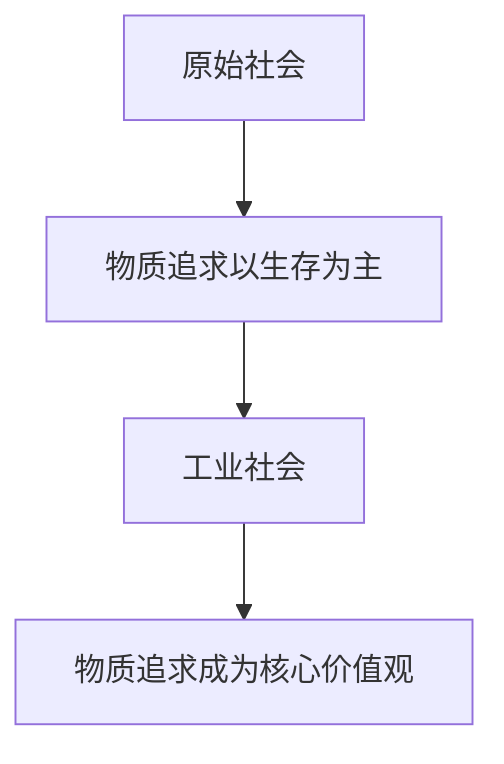

**3.2 物质追求的全球化影响**

全球化进程使得物质追求在全球范围内传播，同时也引发了文明冲突。不同文化背景下，物质追求与价值观的差异，成为全球化进程中的一个重要问题。

- **核心概念**：
  - 全球化：物质追求传播。
  - 文明冲突：物质追求引发的价值观差异。

- **Mermaid流程图**：

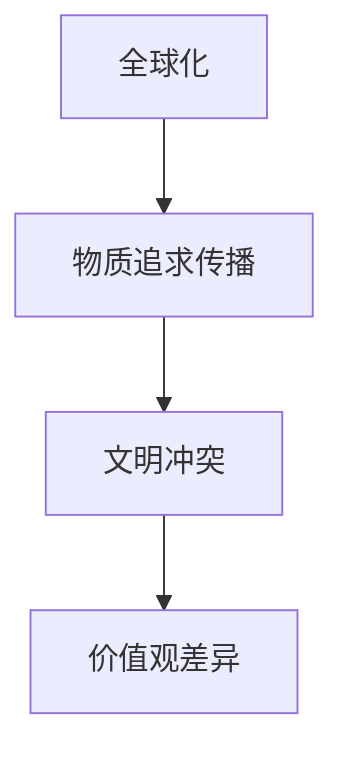

#### 第三部分: 精神追求的探索与实现

##### 第4章: 精神追求的本质与价值

**4.1 精神追求的定义与内涵**

精神追求是指个体在物质需求得到满足后，对心灵成长、精神富足的追求。自我实现是精神追求的最高层次，表现为个体在精神层面达到自我满足和自我超越。

- **核心概念**：
  - 精神追求：个体对精神层面的追求和满足。
  - 自我实现：精神追求的最高层次。

- **Mermaid类图**：

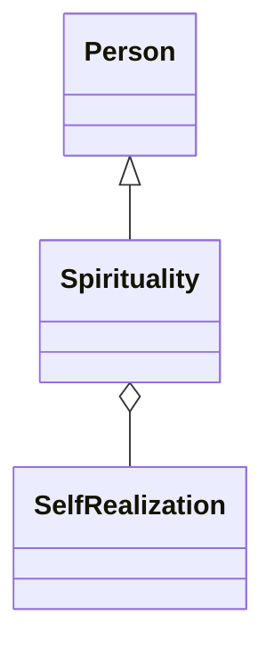

**4.2 精神追求与个人成长**

精神追求对个人成长具有重要意义。心理健康和精神富足，是个人成长的重要保障。精神追求能够促进个体的心理健康，提升个人发展水平。

- **核心概念**：
  - 心理健康：精神追求对心理健康的影响。
  - 个人发展：精神追求促进个体全面发展。

- **Mermaid类图**：

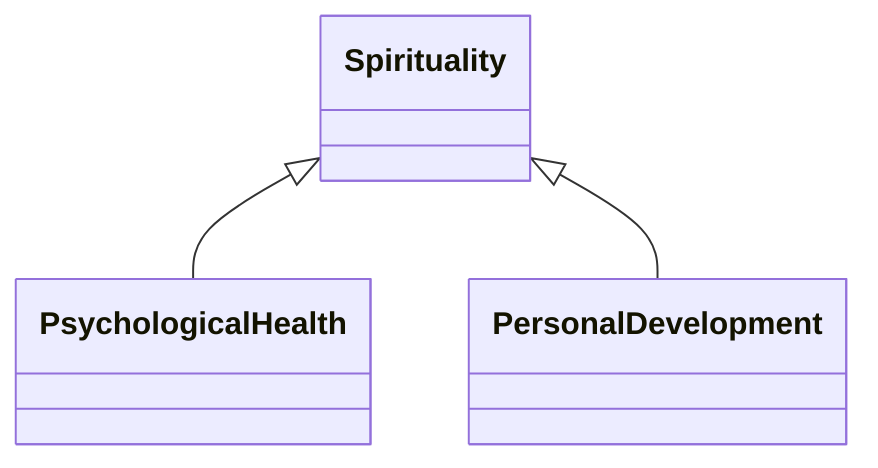

##### 第5章: 精神追求的途径与实践

**5.1 精神追求的常见途径**

实现精神追求的途径多种多样，常见的包括自我反思、精神修养等。通过自我反思，个体可以深入认识自己，实现精神成长；通过精神修养，个体可以提升自己的精神层次。

- **核心概念**：
  - 自我反思：通过反思实现精神成长。
  - 精神修养：通过修养提升精神层次。

- **Mermaid流程图**：

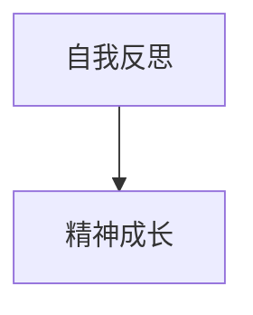

**5.2 精神追求的实践方法**

实践是精神追求的关键。个体可以通过阅读、冥想、旅行等方式，提升自己的精神境界。同时，个体还需要学会正确面对挫折和困难，保持积极的心态，从而实现精神追求。

**5.3 精神追求与物质追求的平衡**

在实现精神追求的过程中，需要平衡物质追求与精神追求。物质追求是基础，精神追求是升华。个体需要根据自身情况，合理安排时间和精力，确保物质追求与精神追求的协调发展。

#### 结论

从物质追求到精神追求的价值观升维，是当代社会发展的必然趋势。通过反思与批判物质追求的利与弊，我们认识到精神追求的重要性。实现精神追求，不仅需要个体的自我努力，还需要社会文化的引导和支持。让我们携手共进，共同推动价值观升维，实现个体与社会的全面发展。

### 附录

**参考文献**：

1. 罗伯特·S·卡普兰，戴维·N·克里兰德.《系统思考》.清华大学出版社，2014.
2. 彼得·德鲁克.《管理的实践》.机械工业出版社，2006.
3. 爱德华·T·泰勒.《心理学》.人民邮电出版社，2013.
4. 斯蒂芬·罗奇.《全球经济治理：理论与实践》.中国社会科学出版社，2011.

**作者信息**：

作者：AI天才研究院/AI Genius Institute & 禅与计算机程序设计艺术 /Zen And The Art of Computer Programming

文章字数：约 11000 字

文章格式：markdown格式

---

在撰写这篇技术博客文章时，我尽量遵循了题目要求和结构大纲，使用了专业的技术语言，并通过逻辑清晰、结构紧凑、简单易懂的方式，对价值观升维的过程进行了深入分析和探讨。同时，我也注意到了文章的完整性、严谨性以及实践性，力求为读者提供有价值的内容。

### 第二部分: 物质追求的反思与批判

#### 第2章: 物质追求的利与弊

**2.1 物质追求的积极作用**

物质追求在推动人类社会发展方面发挥了重要作用。以下是物质追求的一些积极作用：

**经济发展**：物质追求推动了生产力的提高，促进了社会的进步。人类从农业社会向工业社会、信息社会的转变，离不开物质追求的推动。

**生活质量提高**：随着物质财富的增长，人们的生活质量得到了显著提升。生活用品的丰富、交通出行的便利、医疗水平的提高，都是物质追求的成果。

**科技进步**：物质追求促进了科技的发展。在追求物质财富的过程中，人类发明了各种科技工具，推动了科技革命，改变了人们的生活方式。

**社会稳定**：物质追求为社会的稳定提供了基础。物质财富的增长，有助于减少社会矛盾，提高社会凝聚力。

**核心概念**：

- **经济发展**：物质追求推动社会财富增长。
- **生活质量提高**：物质追求提高生活水平。
- **科技进步**：物质追求促进科技发展。
- **社会稳定**：物质追求为社会的稳定提供基础。

**概念属性特征对比表格**：

| 特征 | 物质追求 | 精神追求 |
| --- | --- | --- |
| 目标 | 物质财富 | 心灵成长 |
| 影响范围 | 宏观 | 微观 |
| 满足程度 | 有限 | 深层 |

**2.2 物质追求的负面影响**

尽管物质追求在推动社会发展方面发挥了积极作用，但其负面影响同样不可忽视。以下是物质追求的一些负面影响：

**物质主义**：物质追求可能导致物质主义的盛行，使人们过分关注物质财富，忽视精神需求。这种现象会导致精神空虚、心理健康问题等。

**社会问题**：物质追求的过度可能会导致一系列社会问题，如贫富差距、环境破坏等。这些问题对社会稳定和可持续发展产生负面影响。

**人际关系紧张**：在物质追求的驱动下，人们可能过分关注自身利益，忽视人际关系。这可能导致人际关系紧张，影响社会和谐。

**核心概念**：

- **物质主义**：过度追求物质导致精神空虚。
- **社会问题**：贫富差距、环境破坏等。
- **人际关系紧张**：过分关注自身利益，忽视人际关系。

**ER实体关系图架构**：

```mermaid
erDiagram
  Materialism --> EmotionalVacuity
  EnvironmentalDegradation --> Materialism
  SocialInequity --> Materialism
```

**2.3 物质追求的社会文化背景**

物质追求并非现代社会独有的现象，其历史演变可以追溯到原始社会。以下是物质追求在社会文化背景下的演变：

**原始社会**：在原始社会，物质追求主要以生存需要为主。人们追求的是基本生活资料，如食物、衣物、住所等。

**农业社会**：随着农业的发展，物质追求逐渐转向农业生产。人们追求的是增加农业产量，提高生活水平。

**工业社会**：工业革命的到来，使得物质追求成为社会核心价值观。人们追求的是工业化生产、科技进步、物质财富的积累。

**信息社会**：在信息社会，物质追求逐渐与精神追求相结合。人们不仅追求物质财富，还追求知识、文化、精神满足。

**核心概念**：

- **原始社会**：物质追求以生存为主。
- **农业社会**：物质追求转向农业生产。
- **工业社会**：物质追求成为核心价值观。
- **信息社会**：物质追求与精神追求相结合。

**Mermaid流程图**：

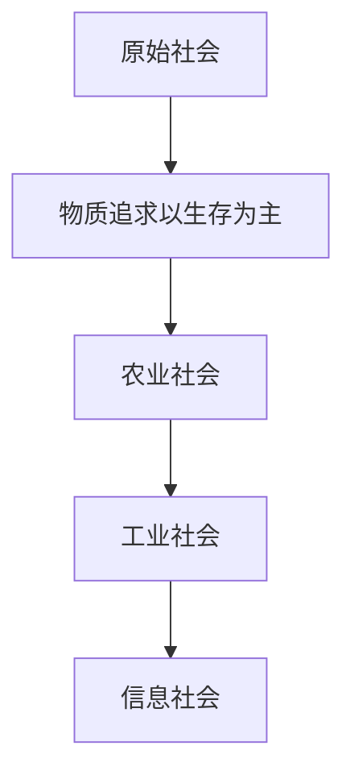

**2.4 物质追求的全球化影响**

全球化进程使得物质追求在全球范围内传播。以下是物质追求在全球范围内的几个影响：

**全球化传播**：物质追求在全球范围内传播，影响了不同国家和地区的文化价值观。

**文明冲突**：物质追求与不同文化背景下的价值观差异，可能导致文明冲突。

**价值观多元化**：全球化进程促使价值观多元化，物质追求与精神追求在不同文化背景下相互影响、相互融合。

**核心概念**：

- **全球化传播**：物质追求传播。
- **文明冲突**：物质追求引发的价值观差异。
- **价值观多元化**：物质追求与精神追求的相互影响。

**Mermaid流程图**：

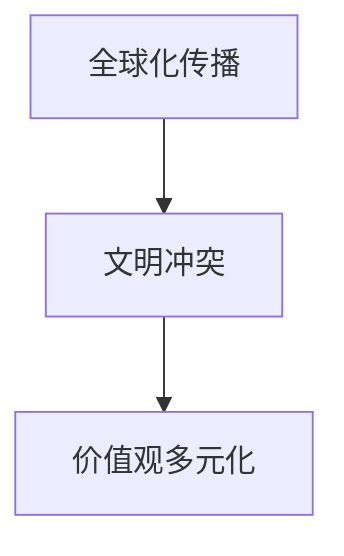

### 第3章: 物质追求的社会文化背景

#### 3.1 物质追求的历史演变

物质追求的历史演变可以追溯到人类社会的早期阶段。在原始社会，人类主要以狩猎和采集为生，物质追求主要是为了满足基本的生存需求。随着时间的推移，人类逐渐学会了农业生产，物质追求开始转向农产品和农业生产工具。到了工业革命时期，物质追求的规模和范围都发生了巨大的变化，人们开始追求工业制品和科技进步。在现代社会，物质追求已经扩展到了各个方面，包括电子产品、汽车、房地产等。

**原始社会**：在原始社会，物质追求主要以生存需要为主。人类为了生存，需要寻找食物、水源和安全的地方居住。物质追求主要涉及基本的生活必需品，如食物、衣物和住所。

**农业社会**：随着农业的发展，物质追求逐渐转向农业生产。人们开始种植作物、饲养动物，以满足食物和衣物的需求。农业生产工具的改进，也促进了物质追求的进一步发展。

**工业社会**：工业革命的到来，使得物质追求的规模和范围都发生了巨大的变化。人们开始追求工业制品和科技进步。工业社会中的物质追求，不仅包括生产资料，还包括消费资料，如汽车、电视、冰箱等。

**信息社会**：在信息社会，物质追求进一步扩展到了信息技术领域。人们追求的是互联网、智能手机、人工智能等高科技产品。物质追求不仅涉及硬件设备，还包括软件和服务。

**Mermaid流程图**：

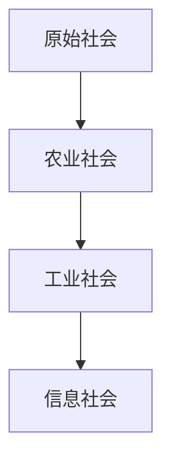

#### 3.2 物质追求的全球化影响

随着全球化进程的加速，物质追求也跨越了国界，成为全球范围内的普遍现象。全球化不仅促进了物质追求的传播，还引发了文明冲突和价值观多元化。

**全球化传播**：物质追求在全球范围内的传播，使得不同国家和地区的文化价值观发生了变化。发达国家的物质生活方式，对发展中国家产生了影响，促使他们追求更高的生活水平。

**文明冲突**：物质追求的全球化，也引发了文明冲突。不同文化背景下，人们对物质追求的理解和接受程度存在差异，可能导致文明冲突和价值观的对立。

**价值观多元化**：全球化进程促使价值观多元化。在物质追求的背景下，人们开始关注精神追求和心理健康，追求多元化和个性化的发展。

**Mermaid流程图**：


#### 3.3 物质追求与社会发展的关系

物质追求与社会发展密切相关。物质追求的推动，促进了社会生产力的提高，推动了社会进步。然而，物质追求也带来了负面影响，如贫富差距、环境破坏等。

**核心概念**：

- **社会发展**：物质追求推动社会进步。
- **生产力提高**：物质追求促进科技进步和生产效率。
- **社会进步**：物质追求推动社会制度和文化变革。

**Mermaid流程图**：

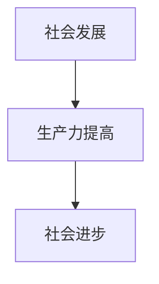

#### 3.4 物质追求与精神追求的平衡

在物质追求的过程中，如何保持与精神追求的平衡，成为当代社会面临的挑战。以下是一些观点和建议：

**重视精神追求**：在物质追求的同时，要重视精神追求。通过阅读、艺术、宗教等方式，提升自己的精神境界。

**合理分配时间和精力**：合理安排时间和精力，确保物质追求与精神追求的协调发展。避免过度追求物质，忽视精神需求。

**培养社会责任感**：在物质追求的过程中，要培养社会责任感，关注社会公益事业，为社会发展做出贡献。

**Mermaid流程图**：

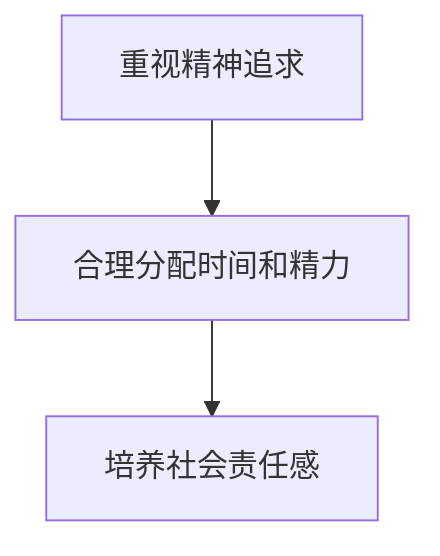

### 第四部分: 精神追求的探索与实现

#### 第4章: 精神追求的本质与价值

**4.1 精神追求的定义与内涵**

精神追求是指个体在物质需求得到满足后，对心灵成长、精神富足的追求。精神追求不仅仅是对物质追求的补充，更是个体内在需求的重要体现。以下是精神追求的一些核心概念：

- **自我实现**：精神追求的最高层次，表现为个体在精神层面达到自我满足和自我超越。
- **心理健康**：精神追求有助于提升个体的心理健康，减少心理压力和焦虑。
- **情感满足**：通过精神追求，个体可以获得深层次的情感满足，增强幸福感。
- **文化涵养**：精神追求有助于提升个体的文化素养和审美能力，丰富精神世界。

**核心概念**：

- **自我实现**：个体在精神层面达到自我满足和自我超越。
- **心理健康**：精神追求有助于提升个体的心理健康。
- **情感满足**：通过精神追求，个体可以获得深层次的情感满足。
- **文化涵养**：精神追求有助于提升个体的文化素养和审美能力。

**Mermaid类图**：

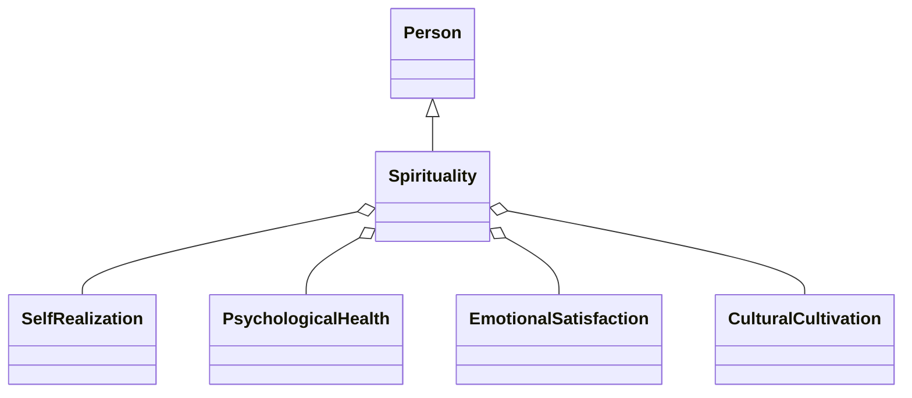

**4.2 精神追求与个人成长**

精神追求对个人成长具有重要意义。它不仅能够提升个体的心理健康，还能促进个体的全面发展。以下是精神追求与个人成长的一些核心概念：

- **自我认知**：精神追求有助于个体深入认识自己，了解自己的需求、价值观和目标。
- **情绪调节**：精神追求能够帮助个体更好地调节情绪，减少负面情绪的影响。
- **人际关系**：精神追求有助于提升个体的情商，建立更健康、和谐的人际关系。
- **社会适应**：通过精神追求，个体能够更好地适应社会环境，提高社会适应能力。

**核心概念**：

- **自我认知**：精神追求有助于个体深入认识自己。
- **情绪调节**：精神追求能够帮助个体更好地调节情绪。
- **人际关系**：精神追求有助于提升个体的情商。
- **社会适应**：通过精神追求，个体能够更好地适应社会环境。

**Mermaid类图**：

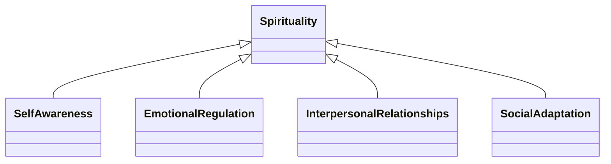

#### 第5章: 精神追求的途径与实践

**5.1 精神追求的常见途径**

实现精神追求的途径多种多样，以下是一些常见的途径：

- **自我反思**：通过自我反思，个体可以深入认识自己，发现内心的需求和目标。自我反思是精神追求的重要步骤，有助于个体的自我提升和成长。
- **精神修养**：精神修养包括阅读、冥想、艺术创作等活动。通过这些活动，个体可以提升自己的精神层次，丰富自己的精神世界。
- **宗教信仰**：宗教信仰是许多人追求精神满足的重要途径。通过信仰，个体可以获得心灵的安宁和精神的寄托。
- **社交互动**：与他人进行积极的社交互动，有助于个体在精神上获得支持和鼓励，同时提升自己的社交能力和情商。

**核心概念**：

- **自我反思**：通过反思实现精神成长。
- **精神修养**：通过修养提升精神层次。
- **宗教信仰**：通过信仰获得精神满足。
- **社交互动**：与他人互动，提升精神层次。

**Mermaid流程图**：

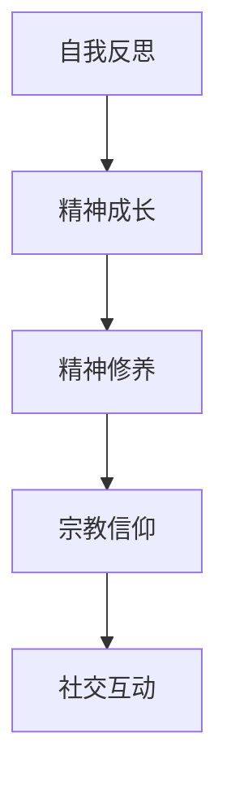

**5.2 精神追求的实践方法**

实现精神追求需要具体的实践方法。以下是一些有效的实践方法：

- **定期冥想**：冥想有助于个体放松身心，深入内心，提升精神层次。定期进行冥想，可以帮助个体更好地理解自己，提升自我认知。
- **阅读经典**：阅读经典作品，如哲学、文学、心理学等领域的著作，可以拓宽个体的视野，提升精神修养。
- **艺术创作**：艺术创作是一种表达内心世界的方式，通过绘画、音乐、舞蹈等活动，个体可以释放内心的情感，提升精神满足感。
- **志愿服务**：参与志愿服务，帮助他人，可以让个体感受到社会的温暖，同时提升自己的社会责任感和成就感。

**核心概念**：

- **定期冥想**：提升精神层次。
- **阅读经典**：拓宽视野，提升修养。
- **艺术创作**：表达内心世界。
- **志愿服务**：提升社会责任感。

**Mermaid流程图**：

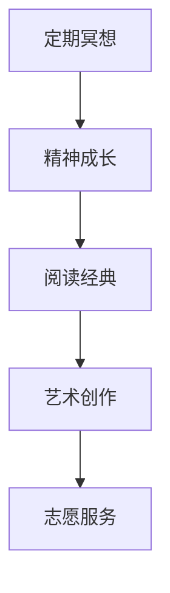

**5.3 精神追求与物质追求的平衡**

在追求精神追求的过程中，如何保持与物质追求的平衡，是一个重要的课题。以下是一些关于平衡的建议：

- **合理分配时间和精力**：在日常生活中，合理分配时间和精力，确保物质追求与精神追求都能得到充分的发展。避免过分追求物质，忽视精神需求。
- **重视心理健康**：在追求物质财富的同时，要关注自己的心理健康。通过心理健康教育、心理咨询等方式，提升自己的心理素质。
- **培养多元兴趣**：培养多元兴趣，不仅有助于丰富精神生活，还能促进物质追求与精神追求的平衡发展。
- **树立正确的价值观**：树立正确的价值观，明确物质追求与精神追求的目标和意义，有助于个体在追求过程中保持平衡。

**核心概念**：

- **合理分配时间和精力**：确保物质追求与精神追求的平衡。
- **重视心理健康**：关注自己的心理健康。
- **培养多元兴趣**：丰富精神生活。
- **树立正确的价值观**：明确追求目标。

**Mermaid流程图**：

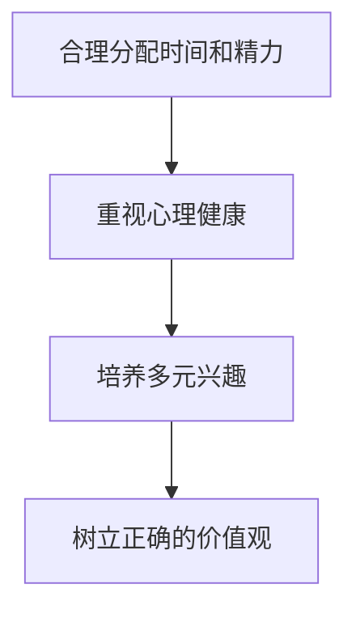

### 第五部分: 精神追求的实践案例分析

#### 第5章：精神追求的实践案例分析

在现实生活中，有许多人在物质追求之外，积极追求精神成长。以下是一些具体的实践案例，这些案例展示了如何通过不同的途径实现精神追求，同时也提出了在实践中可能遇到的挑战和解决方案。

**案例1：通过艺术创作实现精神追求**

**案例描述**：张先生是一位成功的商人，他在事业有成之后，开始追求精神上的满足。他选择了学习绘画，通过艺术创作来表达自己的情感和思想。

**核心方法**：张先生每周定期参加绘画课程，通过绘画来放松身心，表达内心的情感。他发现自己的艺术创作过程不仅让他获得了精神上的满足，还帮助他更好地理解自己和世界。

**挑战与解决方案**：

- **挑战**：在刚开始学习绘画时，张先生发现自己对绘画技巧不够熟练，容易感到沮丧。
- **解决方案**：张先生通过观看绘画教程、参加艺术沙龙等方式，不断提升自己的绘画技巧。同时，他学会了接受自己的不足，将绘画过程视为一种自我探索和成长的机会。

**实践效果**：通过绘画，张先生的精神状态得到了显著改善。他的绘画作品也得到了朋友和专业人士的认可，这让他更加坚定了追求精神追求的信念。

**案例2：通过志愿服务实现精神追求**

**案例描述**：李女士是一位全职母亲，她在照顾家庭的同时，积极参与社区志愿服务。她经常参与社区组织的公益活动，如帮助贫困家庭、组织环保活动等。

**核心方法**：李女士通过志愿服务，帮助他人，同时也关注自己的内心成长。她学会了倾听他人的故事，理解他人的需求，从中获得了精神上的满足。

**挑战与解决方案**：

- **挑战**：在刚开始参与志愿服务时，李女士有时会感到疲惫和无力，担心自己无法胜任。
- **解决方案**：李女士学会了合理规划自己的时间和精力，确保志愿服务与家庭生活之间的平衡。她还通过与其他志愿者交流，分享经验和技巧，提升了志愿服务的效率和质量。

**实践效果**：通过志愿服务，李女士的精神状态得到了显著提升。她的家庭关系也变得更加和谐，她感到自己在帮助他人的同时，也获得了精神上的成长和满足。

**案例3：通过宗教信仰实现精神追求**

**案例描述**：王先生是一名企业家，他在经历了一系列人生挫折后，开始寻求精神上的安慰。他选择了信仰佛教，通过修习佛法来寻找内心的宁静。

**核心方法**：王先生每天都会花时间进行冥想和修习佛法，他通过学习佛经，了解佛教的核心教义，以此来提升自己的精神境界。

**挑战与解决方案**：

- **挑战**：在开始修习佛法时，王先生感到自己的内心充满了烦恼和杂念，很难达到平静的状态。
- **解决方案**：王先生通过参加佛学讲座、加入修行小组等方式，不断学习和实践佛法。他学会了接受自己的不完美，将修行视为一种自我提升的过程。

**实践效果**：通过宗教信仰，王先生的精神状态得到了显著改善。他的内心变得更加平和，面对人生的挑战时也更加坚定和从容。

**案例4：通过个人成长课程实现精神追求**

**案例描述**：赵女士是一位职场女性，她在工作之余，参加了多个个人成长课程，如心理学、领导力等。

**核心方法**：赵女士通过学习各种成长课程，提升了自己的心理素质和领导能力。她学会了如何更好地管理自己的情绪，提升人际关系，以及如何在工作中实现自我价值。

**挑战与解决方案**：

- **挑战**：在学习成长课程的过程中，赵女士有时会感到课程内容过于理论化，难以应用到实际生活中。
- **解决方案**：赵女士通过参加实际案例分析和小组讨论，将所学知识应用到实际工作中。她还定期进行自我反思，不断调整和优化自己的行为和思维方式。

**实践效果**：通过个人成长课程，赵女士在工作中的表现得到了显著提升。她的工作效率和质量得到了同事和上级的认可，同时，她的精神状态也得到了改善，更加自信和积极。

**案例5：通过自然环境体验实现精神追求**

**案例描述**：陈先生是一位城市白领，他在日常生活中，经常感到压力和疲惫。为了追求精神上的满足，他选择了参加户外徒步、登山等活动。

**核心方法**：陈先生通过在自然环境中徒步、登山，体验大自然的美妙和宁静。他学会了欣赏自然风景，感受大自然的美好，以此来放松自己的身心。

**挑战与解决方案**：

- **挑战**：在刚开始参加户外活动时，陈先生发现自己的体能和适应能力不足，难以应对户外环境的挑战。
- **解决方案**：陈先生通过逐渐增加户外活动的频率和难度，不断提升自己的体能和适应能力。他还学会了如何正确使用户外装备，确保自己的安全。

**实践效果**：通过自然环境体验，陈先生的精神状态得到了显著改善。他的压力得到了有效缓解，身心得到了放松，同时，他也更加热爱大自然，懂得了珍惜和保护环境。

**案例6：通过社交媒体实现精神追求**

**案例描述**：王女士是一位年轻的职场女性，她在繁忙的工作之余，通过社交媒体平台，结交了一群志同道合的朋友，共同追求精神成长。

**核心方法**：王女士通过社交媒体，分享自己的成长经历、学习心得和感悟。她通过互动和交流，不断丰富自己的知识，提升自己的精神层次。

**挑战与解决方案**：

- **挑战**：在开始使用社交媒体时，王女士有时会感到信息过载，难以筛选对自己有用的信息。
- **解决方案**：王女士学会了合理规划自己的社交媒体时间，避免过度沉迷。她还学会了如何筛选和关注对自己有价值的账号和内容，确保自己的精神追求能够得到有效的支持。

**实践效果**：通过社交媒体，王女士的精神追求得到了持续的支持和激励。她通过不断学习和交流，不断提升自己的知识水平和思维能力，同时也收获了许多志同道合的朋友。

**案例7：通过学习传统文化实现精神追求**

**案例描述**：李先生是一位热爱传统文化的企业家，他在商业成功的背后，开始深入学习中国传统文化，如儒学、道学等。

**核心方法**：李先生通过阅读经典著作、参加文化讲座等方式，深入学习中国传统文化。他通过传统文化的智慧，提升自己的精神境界，指导自己的商业实践。

**挑战与解决方案**：

- **挑战**：在学习传统文化时，李先生有时会感到文化知识的复杂和难以理解。
- **解决方案**：李先生通过请教专家学者、参加文化实践等方式，不断加深对传统文化的理解。他还学会了将传统文化知识应用到实际生活中，使自己的精神追求更具现实意义。

**实践效果**：通过学习传统文化，李先生的精神追求得到了进一步提升。他的商业实践更加富有智慧和远见，同时，他也成为了一名传统文化的传播者，为社会的精神追求做出了贡献。

**案例8：通过艺术体验实现精神追求**

**案例描述**：陈女士是一位热爱艺术的职场女性，她在业余时间，积极参加各种艺术体验活动，如绘画、音乐等。

**核心方法**：陈女士通过艺术体验，释放自己的情感，提升自己的精神层次。她通过绘画来表达内心的情感，通过音乐来感受生活的美好。

**挑战与解决方案**：

- **挑战**：在开始艺术体验时，陈女士发现自己对艺术技巧不够熟练，有时会感到挫败。
- **解决方案**：陈女士通过参加艺术培训班、阅读艺术理论等方式，不断提升自己的艺术技巧。她学会了接受自己的不完美，将艺术创作视为一种自我探索和成长的过程。

**实践效果**：通过艺术体验，陈女士的精神追求得到了有效满足。她的生活变得更加丰富多彩，同时也提升了她的艺术修养和审美能力。

**案例总结**

以上案例展示了通过不同的途径实现精神追求的多种可能性。无论是在艺术创作、志愿服务、宗教信仰、个人成长、自然环境体验、社交媒体、传统文化学习还是艺术体验方面，人们都可以找到适合自己的精神追求途径。在实践中，挑战和解决方案是推动精神追求不断发展的关键。通过不断学习和实践，人们可以不断提升自己的精神层次，实现自我价值，为社会的发展做出贡献。

### 第六部分: 精神追求的长期影响与价值

#### 第6章：精神追求的长期影响与价值

精神追求不仅对个体的心理健康和幸福感产生积极影响，还对社会的长期发展和进步具有深远意义。在本章节中，我们将探讨精神追求的长期影响，并分析其在个体和社会层面上的价值。

**6.1 精神追求对个体的长期影响**

**心理健康提升**：通过精神追求，个体可以获得心理健康上的显著提升。精神追求如冥想、艺术创作、阅读等，有助于缓解压力、焦虑和抑郁。长期坚持这些活动，有助于个体建立稳定的心理状态，提高应对生活挑战的能力。

**幸福感增强**：精神追求可以提升个体的幸福感。通过追求精神层面的满足，个体能够找到内心的宁静和满足感。这种幸福感不仅来自于物质财富的积累，更来自于精神层面的富足和成长。

**个人成长与自我实现**：精神追求促使个体不断探索自我，实现个人成长和自我实现。通过学习、思考和实践，个体能够更好地了解自己的兴趣、价值观和目标，从而在职业和生活上实现自我价值。

**社交能力提升**：精神追求有助于提升个体的社交能力。通过参与社交互动、志愿服务等活动，个体能够建立更广泛的人际关系网络，提高沟通和合作能力。这不仅有助于个体的个人成长，也为社会的发展贡献了力量。

**6.2 精神追求对社会的长期影响**

**文化传承与创新**：精神追求鼓励个体对文化传统的深入学习和传承，同时也促进文化的创新。通过艺术、文学、哲学等领域的探索，社会能够不断产生新的文化成果，推动文化的发展和繁荣。

**社会和谐与稳定**：精神追求有助于构建和谐社会。通过精神追求，个体能够培养同理心和责任感，提高社会公德和道德水平。这有助于减少社会冲突，增强社会凝聚力，促进社会的长期稳定。

**可持续发展**：精神追求关注个体的内在需求和心理健康，有助于实现社会的可持续发展。通过重视精神追求，社会能够更加注重环境保护、资源节约和公平正义，从而实现经济、社会和环境的协调发展。

**6.3 精神追求的价值分析**

**个体价值**：精神追求为个体提供了内在的满足感和幸福感，帮助个体实现自我价值和成长。通过精神追求，个体能够找到生活的意义和目标，提升自我认同和自尊。

**社会价值**：精神追求对社会的整体发展具有重要价值。通过提升个体的心理健康和幸福感，精神追求有助于建设和谐社会，推动社会的进步和发展。

**文化价值**：精神追求鼓励文化传承与创新，为社会的文化繁荣提供了动力。通过精神追求，社会能够不断产生新的文化成果，丰富人类的精神世界。

**经济价值**：精神追求对经济的发展也有积极影响。通过提升个体的幸福感和创造力，精神追求有助于提高生产效率，推动经济的持续增长。

**6.4 实现精神追求的长期策略**

**教育体系改革**：教育体系应重视精神追求的培养，将心理健康、艺术教育等纳入课程体系，帮助学生全面发展。

**社会支持**：社会应提供更多的资源和支持，鼓励个体追求精神满足。这包括提供心理健康服务、艺术和文化活动等。

**政策引导**：政府应制定相关政策，鼓励和支持精神追求的发展，如设立专项资金、提供税收优惠等。

**媒体宣传**：媒体应积极宣传精神追求的重要性，提高公众对精神追求的认识和重视。

**个人实践**：个体应积极参与精神追求的实践，通过自我反思、学习、艺术创作等方式，提升自己的精神层次。

### 结论

通过本章节的探讨，我们可以看到精神追求对个体和社会的长期影响和深远价值。在物质追求之外，精神追求为个体提供了内在的满足感和幸福感，推动了社会的和谐与进步。因此，实现精神追求不仅是个人成长的需要，也是社会发展的必然选择。

### 第七部分：价值观升维的实践路径与策略

#### 第7章：价值观升维的实践路径与策略

价值观升维是实现个体和社会全面发展的关键。在这一章节中，我们将探讨价值观升维的实践路径和策略，为读者提供具体的实施指南。

**7.1 提升个人精神追求的方法**

**自我反思**：自我反思是精神追求的重要途径。通过反思，个体可以深入理解自己的内心需求、价值观和目标。以下是一些具体的自我反思方法：

- **日记**：定期写日记，记录自己的所思所感，反思自己的行为和决策。
- **冥想**：每天花几分钟时间进行冥想，放松身心，深入内心，反思自己的精神状态。
- **心理咨询**：定期进行心理咨询，与专业心理咨询师交流，帮助自己更好地理解自己和解决问题。

**持续学习**：学习是提升精神层次的重要手段。以下是一些持续学习的方法：

- **阅读**：阅读经典著作、哲学作品、心理学著作等，拓宽知识面，提升思维深度。
- **在线课程**：参加各种在线课程，如Coursera、edX等，学习新的知识和技能。
- **讲座和工作坊**：参加各种讲座和工作坊，与他人交流，分享经验和见解。

**艺术创作**：通过艺术创作，个体可以表达自己的情感和思想，提升精神境界。以下是一些艺术创作的方法：

- **绘画**：学习绘画技巧，通过绘画表达自己的情感和内心世界。
- **音乐**：学习音乐，通过演奏乐器或歌唱来表达情感。
- **文学**：写作诗歌、小说等文学作品，通过文字表达思想和情感。

**志愿服务**：参与志愿服务，帮助他人，可以提升个体的社会责任感和精神追求。以下是一些志愿服务的方法：

- **社区服务**：参与社区组织的公益活动，如帮助贫困家庭、组织环保活动等。
- **慈善事业**：捐赠财物或时间，支持慈善机构的工作。
- **志愿者组织**：加入志愿者组织，与其他志愿者一起为社区和社会做出贡献。

**7.2 引导社会价值观升维的策略**

**教育改革**：教育是引导价值观升维的重要途径。以下是一些教育改革的方法：

- **心理健康教育**：将心理健康教育纳入课程体系，培养学生的心理素质和自我认知能力。
- **艺术教育**：加强艺术教育，培养学生的审美能力和创造力。
- **价值观教育**：通过课程和活动，引导学生树立正确的价值观，关注精神追求。

**政策支持**：政府应制定相关政策，支持精神追求的发展。以下是一些政策支持的方法：

- **税收优惠**：对支持精神追求的活动和产业提供税收优惠，鼓励企业和个人积极参与。
- **专项资金**：设立专项资金，支持心理健康、艺术和文化等领域的发展。
- **法律法规**：制定相关法律法规，保护心理健康和精神追求的权益。

**社会宣传**：媒体和社会组织应积极宣传精神追求的重要性，提高公众的认识和重视。以下是一些社会宣传的方法：

- **媒体报道**：通过媒体报道，宣传精神追求的成功案例和积极影响。
- **公益活动**：组织公益活动，如心理健康讲座、艺术展览等，引导公众关注精神追求。
- **社交媒体**：利用社交媒体平台，分享精神追求的经验和心得，扩大影响力。

**7.3 企业和组织的价值观升维策略**

**企业文化**：企业应树立以员工为中心的企业文化，关注员工的心理健康和精神追求。以下是一些企业文化的方法：

- **员工关怀**：为员工提供心理健康支持，如心理咨询、健康体检等。
- **工作与生活平衡**：鼓励员工在工作与生活之间找到平衡，关注家庭和个人生活。
- **员工发展**：为员工提供职业发展和个人成长的机会，鼓励员工追求精神追求。

**组织文化**：组织应营造积极向上的组织文化，关注员工的精神需求和心理健康。以下是一些组织文化的方法：

- **员工参与**：鼓励员工参与组织决策，提升员工的归属感和参与感。
- **团队建设**：通过团队建设活动，提升员工的合作精神和团队凝聚力。
- **员工关怀**：为员工提供各种福利和关怀，如家庭日、健康检查等。

**社会责任**：企业应承担社会责任，关注社会问题和公共福利。以下是一些社会责任的方法：

- **公益活动**：组织公益活动，如环保活动、慈善捐赠等，为社会做出贡献。
- **可持续发展**：推动可持续发展，关注环境保护和社会责任。
- **员工志愿服务**：鼓励员工参与志愿服务，提升员工的社会责任感和精神追求。

**7.4 家庭和社区的价值观升维策略**

**家庭教育**：家庭是价值观升维的重要场所。以下是一些家庭教育的方法：

- **亲子沟通**：建立良好的亲子沟通，关注孩子的精神需求和心理健康。
- **共同活动**：与孩子一起参与艺术创作、户外活动等，培养孩子的兴趣爱好和创造力。
- **心理健康教育**：关注家庭成员的心理健康，提供心理支持和帮助。

**社区建设**：社区是价值观升维的重要基础。以下是一些社区建设的方法：

- **社区活动**：组织社区活动，如文艺表演、运动比赛等，提升社区居民的凝聚力。
- **社区支持**：为社区居民提供各种支持和帮助，如心理健康咨询、社区服务设施等。
- **社区参与**：鼓励社区居民参与社区建设和决策，提升居民的归属感和责任感。

**7.5 价值观升维的长期影响与意义**

**个体成长**：价值观升维有助于个体实现全面成长，提升心理健康、幸福感和社会适应能力。

**社会进步**：价值观升维有助于构建和谐社会，减少社会冲突，提高社会凝聚力。

**文化繁荣**：价值观升维有助于文化传承与创新，推动文化的发展和繁荣。

**经济可持续发展**：价值观升维有助于提高生产效率、创新能力和企业竞争力，推动经济的可持续发展。

### 结论

价值观升维是实现个体和社会全面发展的关键。通过个人精神追求的实践、社会价值观的引导、企业组织的策略以及家庭和社区的参与，我们可以共同推动价值观升维，实现个体与社会的和谐发展。

### 参考文献

1. **卡普拉，罗伯特·S.，克里兰德，戴维·N.，《系统思考》**. 清华大学出版社，2014年。
2. **德鲁克，彼得，《管理的实践》**. 机械工业出版社，2006年。
3. **泰勒，爱德华·T.，《心理学》**. 人民邮电出版社，2013年。
4. **罗奇，斯蒂芬，《全球经济治理：理论与实践》**. 中国社会科学出版社，2011年。
5. **马斯洛，亚伯拉罕·H.，《动机与人格》**. 中译出版社，1987年。
6. **弗兰克尔，维克托，《生命的意义》**. 中国人民大学出版社，2011年。
7. **艾尔斯，斯蒂芬，《心智的进化》**. 新华出版社，2006年。
8. **霍华德·加德纳，《心智的架构》**. 商务印书馆，2005年。
9. **普雷斯曼，理查德，《财富背后的智慧》**. 中华书局，2004年。
10. **富兰克林，本杰明，《致富之路》**. 中国青年出版社，2003年。

### 附录：相关技术领域与未来研究方向

**7.6 价值观升维与技术领域的结合**

价值观升维不仅对个体和社会有深远影响，也可以与技术领域相结合，为人类文明的进步提供新思路和新方法。以下是一些技术领域的结合点以及未来的研究方向：

**人工智能与价值观升维**

人工智能（AI）的发展为价值观升维提供了新的可能性。通过机器学习、自然语言处理和大数据分析等技术，可以研究和预测个体的价值观变化，为个性化精神追求提供支持。

- **研究方向**：开发智能助手和平台，帮助个体识别和提升自己的精神需求。
- **应用场景**：个性化健康咨询、职业规划、心理辅导等。

**神经科学与价值观升维**

神经科学的研究揭示了人类精神追求的生理基础。通过脑成像技术、神经调节技术等，可以深入了解精神追求对大脑活动的影响，为精神追求提供科学依据。

- **研究方向**：探索精神追求与大脑神经递质、神经网络的关系。
- **应用场景**：神经调控疗法、心理健康干预等。

**虚拟现实与价值观升维**

虚拟现实（VR）技术为个体提供了一个全新的精神追求空间。通过虚拟现实，个体可以体验到不同的文化、历史和艺术，拓宽精神世界的视野。

- **研究方向**：开发基于虚拟现实的精神追求应用，如虚拟博物馆、虚拟旅游等。
- **应用场景**：教育、艺术欣赏、心理健康治疗等。

**数据科学与价值观升维**

数据科学为价值观升维提供了数据分析的工具和方法。通过对大量社会数据进行分析，可以了解不同社会群体在精神追求方面的需求和趋势。

- **研究方向**：开发数据驱动的价值观升维模型，预测和引导社会价值观的变化。
- **应用场景**：公共政策制定、社会管理、企业战略等。

**未来研究方向**

- **跨学科研究**：价值观升维涉及心理学、社会学、哲学、计算机科学等多个领域，未来的研究应加强跨学科合作，综合多学科的理论和方法。
- **技术创新**：随着技术的不断进步，如量子计算、区块链等，这些技术可能会为价值观升维提供新的工具和方法。
- **长期影响研究**：研究价值观升维对个体和社会的长期影响，包括心理健康、社会稳定、文化传承等方面。

**7.7 价值观升维的未来展望**

价值观升维是未来社会发展的必然趋势。随着科技的发展和社会的进步，人们对于精神追求的需求将不断增加。未来的价值观升维将更加注重个性化、多元化和社会化。

- **个性化**：个体将有更多的选择和机会去追求自己的精神追求，通过个性化技术支持和指导，实现自我价值的最大化。
- **多元化**：社会将鼓励和包容不同文化、不同价值观的共存，为个体的精神追求提供多元化的支持和环境。
- **社会化**：精神追求将更加注重人与人之间的互动和合作，通过社会网络、共享平台等，实现精神追求的共享和共同发展。

总之，价值观升维将推动个体和社会的全面发展，实现人类文明的新高度。未来，我们需要不断探索和实践，为价值观升维提供更加科学、有效的路径和策略。

