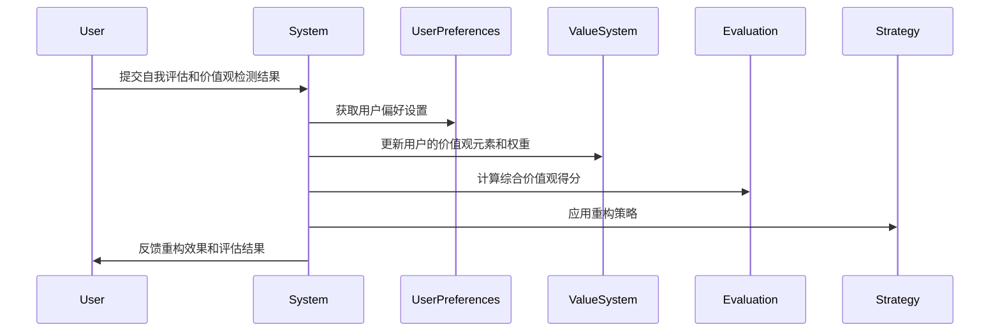
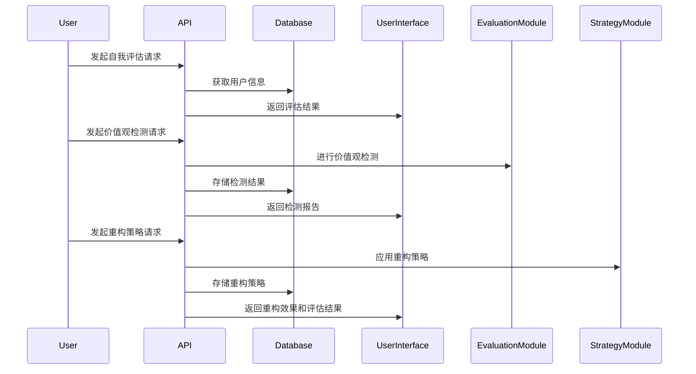

                 


## 第1章 引言

### 1.1 社会变迁与价值观重构

随着全球化的推进和信息技术的发展，社会正经历着前所未有的变迁。多元文化交融，价值观的碰撞与融合成为社会生活的常态。在这种背景下，个体如何在社会大潮中找到自我，重构自己的价值观体系，成为了一个亟待解决的问题。

首先，我们定义一下什么是价值观。价值观是指个体或社会对事物进行评判的标准，它涉及到道德、信仰、利益、审美等多个方面。在不同的文化背景下，人们对同一事物的评价标准可能会有很大差异。

社会变迁带来的一个重要影响就是价值观的多元化。过去，由于信息的相对封闭，人们所接触的价值观相对单一。而现在，随着互联网的普及，人们可以接触到来自世界各地的价值观，这使得个体的价值观面临前所未有的挑战。

在这个多元社会中，个体可能会遇到以下问题：

1. **价值观冲突**：不同文化背景下的价值观在个体内心产生冲突。
2. **自我认同困难**：多元价值观的存在使得个体难以找到自己的定位。
3. **信仰危机**：传统的价值观体系受到挑战，个体需要寻找新的信仰支撑。

因此，价值观的重构成为一个必要的过程。重构不仅仅是对旧有价值观的否定，更是一个在多元价值观中寻找平衡和自我认同的过程。

### 1.2 多元社会下的自我认知挑战

在多元社会中，自我认知变得更加复杂。个体需要从多个角度审视自己，了解自己的价值观，并与其他人的价值观进行对比。

首先，个体需要对自己的价值观进行自我评估。这包括了解自己的道德标准、信仰体系和利益追求。自我评估可以帮助个体明确自己的价值观，从而在社会中找到自己的位置。

其次，个体需要与他人的价值观进行对比。通过对比，个体可以了解自己的价值观在社会中的位置，以及自己的价值观与他人的差异。这有助于个体在多元社会中更好地与他人沟通和合作。

然而，多元社会下的自我认知也面临挑战。由于价值观的多元化，个体可能会感到困惑和不确定。如何在一个多元社会中找到自我，成为个体需要解决的问题。

### 1.3 价值观重构的重要性

价值观的重构对于个体和社会都具有重要意义。

对个体来说，价值观的重构可以帮助个体在多元社会中找到自我，明确自己的价值观和信仰。这有助于个体在面对外部压力时保持内心的坚定，形成稳定的自我认同。

对社会来说，价值观的重构有助于社会的和谐与进步。在一个多元社会中，不同文化背景的人需要相互理解，找到共同点。价值观的重构可以促进不同文化之间的对话与交流，有助于构建一个包容多元的社会。

总之，价值观的重构是应对多元社会的一个必要过程。它不仅有助于个体的自我认同，也有助于社会的和谐与进步。

### 第2章 问题背景

#### 2.1 社会多元化的现象

社会多元化是指社会在种族、文化、宗教、性别、年龄等方面的多样性和差异性。在过去的几十年中，全球化进程加快，信息技术的发展使得不同国家和地区的文化、价值观和生活方式得以迅速传播和融合。

首先，从种族和文化角度来看，全球化使得不同种族和文化之间的交流更加频繁。例如，跨国公司和移民潮使得不同国家和地区的文化在异国他乡得以传播和融合。这种文化多样性不仅体现在日常生活中的饮食、服装和节日，还体现在艺术、音乐和文学等领域。

其次，宗教多元化也是社会多元化的重要表现。随着宗教信仰自由度的提高，越来越多的人有机会接触和了解不同的宗教。例如，基督教、伊斯兰教和佛教等世界主要宗教在全球范围内都有广泛的信徒。

此外，性别和年龄的多元化也在社会中日益凸显。随着性别平等意识的提高，女性在职场和社会中的地位不断提升。同时，老龄化社会的到来使得不同年龄段的人在社会中的角色和地位发生变化。

社会多元化的现象带来了许多积极的影响，如文化多样性、社会包容性和创新能力提升等。但同时也带来了一些挑战，如文化冲突、价值观分歧和社会分裂等。

#### 2.2 个体价值观的冲突与融合

在多元化的社会中，个体价值观的冲突与融合是一个不可忽视的问题。由于个体所处的文化背景、教育经历和家庭环境等因素的差异，他们对同一问题的看法可能会有很大不同。

首先，价值观的冲突体现在不同文化背景下的人们在道德、信仰和利益等方面的分歧。例如，在某些文化中，个人主义被高度推崇，而在另一些文化中，集体主义占据主导地位。这种差异可能导致个体在合作与冲突中难以达成共识。

其次，价值观的融合是一个在多元化社会中寻求平衡的过程。融合并不意味着放弃自己的价值观，而是通过对话与交流，寻找共同点，构建一个包容多元的社会。例如，在多元文化社会中，人们可以通过文化交流、宗教对话和跨学科合作等方式，增进对彼此价值观的理解和尊重。

然而，价值观的冲突与融合并非一蹴而就的过程。个体需要具备一定的认知能力和包容心态，才能在多元化社会中找到自己的位置，实现价值观的重构。

#### 2.3 价值观重构的必要性与可行性

在多元社会中，价值观的重构具有必要性和可行性。

必要性方面，随着社会多元化程度的提高，个体需要不断地调整自己的价值观，以适应社会的发展。只有通过价值观的重构，个体才能在多元社会中找到自我，实现自我认同。

可行性方面，现代科技的发展为价值观的重构提供了便利。通过互联网、社交媒体和跨学科合作等方式，个体可以更容易地接触和了解不同的价值观。此外，教育体系的改革也为个体提供了更多的资源和机会，以培养他们的认知能力和包容心态。

总之，价值观的重构在多元社会中具有重要的意义。它不仅有助于个体在多元社会中找到自我，还有助于构建一个包容多元的社会。

### 第3章 核心概念与联系

#### 3.1 价值观的基本概念

价值观是指个体或社会对事物进行评判的标准，它涉及到道德、信仰、利益、审美等多个方面。价值观的形成受到文化、教育、家庭和社会环境等多种因素的影响。

在个体层面，价值观是人们行为决策的内在指南。它帮助个体在复杂的社会环境中找到自己的定位，并形成自我认同。例如，一个重视家庭价值观的人可能会在职业选择和生活方式上更倾向于追求家庭和谐与幸福。

在社会层面，价值观是社会的精神支柱，它对社会成员的行为和态度产生深远影响。一个和谐的社会需要有共同的价值观作为基础，以促进社会成员之间的相互理解、尊重和合作。

#### 3.2 多元社会中的价值观联系

在多元社会中，不同文化背景下的价值观相互交织，形成了一个复杂的价值观网络。这种多元价值观的联系可以从以下几个方面进行探讨：

1. **对比分析**：通过对比不同文化背景下的价值观，可以揭示它们之间的差异和共性。例如，在一些文化中，个人主义被视为重要的价值观，而在另一些文化中，集体主义占据主导地位。

2. **融合与冲突**：多元价值观的融合与冲突是多元社会中的常见现象。融合意味着在不同价值观之间寻找共同点，以实现社会和谐；冲突则表明在不同价值观之间存在着不可调和的矛盾。例如，在宗教多元化背景下，不同宗教信仰之间的冲突可能会对社会稳定产生负面影响。

3. **互补与补充**：在某些情况下，不同文化背景下的价值观可以相互补充，共同促进个体的全面发展。例如，一个强调自我实现的文化背景和一个强调社会责任的文化背景相结合，可以培养出具有独立性和责任感的个体。

为了更好地理解多元社会中的价值观联系，我们可以通过表格和ER实体关系图来展示不同价值观之间的对比和联系。

#### 3.2.1 不同价值观的对比

| 价值观类型 | 代表性文化 | 关键特征 |
| :--------: | :---------: | :------: |
| 个人主义 | 西方文化 | 强调个人自由、独立和自我实现 |
| 集体主义 | 亚洲文化 | 强调家庭、社会和集体的利益 |
| 宗教信仰 | 宗教文化 | 以宗教教义为指导，强调信仰与道德 |
| 社会责任 | 现代文化 | 强调个人在社会中的责任和义务 |

#### 3.2.2 价值观融合与冲突

| 价值观类型 | 融合表现 | 冲突表现 |
| :--------: | :-------: | :-------: |
| 个人主义与集体主义 | 在团队合作中，个人独立性与集体合作精神相结合 | 在个体追求自由与社会责任之间产生矛盾 |
| 宗教信仰与社会责任 | 宗教教义与社会道德相结合，促进社会和谐 | 宗教信仰与社会法律之间的冲突，如宗教自由与反恐法规的矛盾 |
| 文化多样性 | 不同文化之间的交流与融合，促进文化创新 | 文化同化与保护本土文化的冲突 |

通过对比表格，我们可以清晰地看到不同价值观之间的差异和联系。这有助于我们在多元社会中更好地理解价值观的复杂性和多样性。

接下来，我们可以使用ER实体关系图来展示价值观之间的关联结构。

#### 3.2.3 价值观的ER实体关系图

```mermaid
erDiagram
  Class::价值观 <<|-->> 个体
  Class::价值观 <<|-->> 社会
  个体 ||--|{ 价值观 }
  社会 ||--|{ 价值观 }
  价值观 ||--|{ 道德 }
  价值观 ||--|{ 宗教 }
  价值观 ||--|{ 利益 }
  价值观 ||--|{ 审美 }
```

在ER实体关系图中，我们可以看到价值观与个体、社会以及道德、宗教、利益和审美等多个方面的关联。这有助于我们更深入地理解价值观的构成和影响。

通过对比分析、融合与冲突的探讨，以及ER实体关系图的展示，我们可以更好地理解多元社会中的价值观联系。这为我们进一步探讨价值观重构的策略和方法提供了基础。

### 第4章 算法原理讲解

#### 4.1 自我认知与价值观评估

自我认知是价值观重构的基础。只有通过深入的自我认知，个体才能了解自己的价值观，并对其进行评估和调整。自我认知的过程涉及多个方面，包括自我反思、价值观检测和自我评估等。

首先，自我反思是自我认知的重要环节。个体需要对自己的行为、思想、情感和价值观进行深入思考，以了解自己的内在需求和动机。通过自我反思，个体可以识别自己的核心价值观和信仰体系。

其次，价值观检测是评估个体价值观的重要工具。通过一系列的问题和量表，个体可以对自己的价值观进行量化评估。例如，可以通过价值观量表来测量个体在个人主义、集体主义、社会责任等方面的得分。这些数据可以帮助个体了解自己的价值观特点，为后续的价值观重构提供依据。

最后，自我评估是自我认知的总结阶段。个体需要对自己的价值观进行综合评估，判断它们是否符合自己的内在需求和社会期望。在自我评估过程中，个体可以识别出需要调整的价值观，并制定相应的重构计划。

#### 4.2 价值观重构策略

价值观重构是一个系统工程，需要从多个方面进行策略设计。以下是一些常见的价值观重构策略：

1. **文化融合策略**：在多元社会中，文化融合是价值观重构的重要途径。个体可以通过学习不同文化的价值观，了解它们的特点和优势，从而在自己的价值观体系中融入多元文化的元素。例如，一个强调个人主义的人可以学习集体主义的优点，如团队合作和集体荣誉感。

2. **价值观优化策略**：个体可以通过自我反思和价值观检测，识别出需要优化的价值观。例如，一个过于追求物质利益的人可以调整自己的价值观，更加注重精神层面的追求。价值观优化可以通过自我约束、榜样学习和环境改造等多种方式进行。

3. **价值观重塑策略**：在某些情况下，个体的核心价值观可能已经严重偏离社会期望，需要进行彻底的重塑。重塑策略包括深度自我反思、价值观重建和信仰重塑等。例如，一个存在严重道德问题的个体可以通过自我反省和宗教信仰的重建，重塑自己的价值观体系。

4. **价值观实践策略**：价值观重构不仅需要理论上的认识，更需要通过实际行动来验证和巩固。个体可以通过参与社会活动、志愿服务和公益事业等，将重构后的价值观付诸实践。这有助于个体在真实的社会环境中检验和调整自己的价值观。

#### 4.2.1 价值观重构的路径选择

价值观重构的路径选择取决于个体的具体情况和外部环境。以下是一些常见的路径选择：

1. **渐进式重构**：这种方法适用于价值观基础较为稳固的个体。通过逐步调整和优化，个体可以在保持原有价值观体系的基础上，融入新的价值观元素。例如，一个重视家庭的人可以在保持家庭价值观的基础上，逐渐融入社会责任和环保价值观。

2. **激进式重构**：这种方法适用于价值观体系较为混乱或存在严重问题的个体。通过彻底打破原有的价值观体系，个体可以建立一个新的价值观体系。例如，一个在道德和职业伦理上有严重问题的个体可以通过彻底反省和重建，重塑自己的价值观。

3. **平衡式重构**：这种方法适用于需要平衡多个价值观的个体。通过综合不同价值观的优缺点，个体可以构建一个平衡的价值观体系。例如，一个在个人主义和集体主义之间纠结的人可以通过平衡个人自由和社会责任，找到一个适合自己的价值观。

4. **情境式重构**：这种方法适用于需要根据不同情境调整价值观的个体。通过在不同情境下选择和调整价值观，个体可以在复杂的社会环境中保持灵活和适应性。例如，一个从事商业活动的人可以在商业道德和社会责任之间进行情境式调整。

通过以上策略和路径选择，个体可以在多元社会中实现价值观的重构，找到自我认同和社会归属感。

### 第5章 数学模型与公式详细讲解

#### 5.1 价值观评价模型

在价值观重构的过程中，评价模型是一个关键环节。价值观评价模型可以帮助个体了解自己的价值观特点，识别出需要优化的价值观元素。以下是一个简单的价值观评价模型及其数学模型和公式。

#### 5.1.1 数学模型介绍

我们采用一个多元线性评价模型来描述个体的价值观。设个体有 \( n \) 个主要价值观元素，每个价值观元素可以用一个向量表示，即 \( V = [v_1, v_2, ..., v_n] \)。其中，每个元素 \( v_i \) 代表个体对第 \( i \) 个价值观的重视程度。我们用权重向量 \( W = [w_1, w_2, ..., w_n] \) 来表示个体对各个价值观元素的相对重视程度。最终，个体的综合价值观得分 \( S \) 可以通过以下公式计算：

\[ S = W \cdot V \]

其中，\( \cdot \) 表示向量的内积运算。

#### 5.1.2 模型公式解析

1. **权重向量 \( W \)**：
   - 权重向量 \( W \) 是一个 \( n \times 1 \) 的列向量，每个元素 \( w_i \) 表示个体对第 \( i \) 个价值观元素的相对重视程度。权重向量的计算可以通过自我反思、价值观检测和专家评估等方法进行。

2. **价值观向量 \( V \)**：
   - 价值观向量 \( V \) 是一个 \( n \times 1 \) 的列向量，每个元素 \( v_i \) 表示个体对第 \( i \) 个价值观元素的重视程度。价值观向量的计算可以通过问卷调查、自我报告和专家访谈等方法进行。

3. **综合价值观得分 \( S \)**：
   - 综合价值观得分 \( S \) 是通过权重向量 \( W \) 与价值观向量 \( V \) 的内积运算得到的。内积运算可以衡量两个向量的相关性，从而得到个体综合价值观的得分。

#### 5.1.3 算法原理举例说明

假设一个个体有 5 个主要价值观元素：个人自由（\( v_1 \)）、家庭幸福（\( v_2 \)）、社会责任（\( v_3 \)）、事业成就（\( v_4 \)）和环境保护（\( v_5 \)）。个体的权重向量为 \( W = [0.3, 0.2, 0.1, 0.2, 0.2] \)，即个人自由和家庭幸福的重要性较高，而社会责任和环境保护的重要性较低。

假设个体对这 5 个价值观元素的重视程度分别为 \( V = [0.4, 0.5, 0.1, 0.3, 0.3] \)。

通过综合价值观得分公式计算：

\[ S = W \cdot V = [0.3 \times 0.4, 0.2 \times 0.5, 0.1 \times 0.1, 0.2 \times 0.3, 0.2 \times 0.3] = [0.12, 0.1, 0.01, 0.06, 0.06] \]

个体的综合价值观得分为 \( S = 0.12 + 0.1 + 0.01 + 0.06 + 0.06 = 0.35 \)。

通过这个例子，我们可以看到，个体通过自我反思和价值观检测，可以计算出自己的综合价值观得分。这个得分可以帮助个体了解自己的价值观特点，为进一步的价值观重构提供依据。

#### 5.2 价值观重构模型

在确定了个体综合价值观得分后，下一步是进行价值观重构。价值观重构模型旨在帮助个体调整和优化其价值观向量 \( V \)，以实现更平衡和健康的价值观体系。

#### 5.2.1 模型构建方法

价值观重构模型采用一种迭代优化方法，通过对价值观向量进行多次优化，逐步调整个体的价值观。

1. **初始状态**：
   - 设定初始的价值观向量 \( V_0 = [v_{01}, v_{02}, ..., v_{0n}] \)。

2. **目标函数**：
   - 设定目标函数 \( f(V) \) 来衡量价值观向量 \( V \) 的平衡性和健康性。例如，可以采用权重向量 \( W \) 与价值观向量 \( V \) 的内积作为目标函数：

\[ f(V) = W \cdot V \]

3. **优化算法**：
   - 采用梯度下降算法对目标函数进行优化。每次迭代更新价值观向量 \( V \)：

\[ V_{new} = V_{old} - \alpha \cdot \nabla f(V_{old}) \]

其中，\( \alpha \) 为学习率，\( \nabla f(V_{old}) \) 为目标函数在当前价值观向量 \( V_{old} \) 处的梯度。

4. **迭代过程**：
   - 持续进行迭代，直到目标函数 \( f(V) \) 达到预设的收敛条件，如梯度小于某个阈值。

#### 5.2.2 模型公式推导

为了推导优化算法的公式，我们需要先计算目标函数 \( f(V) \) 的梯度。目标函数 \( f(V) = W \cdot V \) 的梯度是一个与权重向量 \( W \) 等价的 \( n \times 1 \) 列向量：

\[ \nabla f(V) = W \]

因此，每次迭代更新价值观向量 \( V \) 的公式为：

\[ V_{new} = V_{old} - \alpha \cdot W \]

通过这种方式，我们可以逐步调整个体的价值观向量，使其更加平衡和健康。

### 第6章 系统分析与架构设计方案

#### 6.1 问题场景介绍

在多元社会中，个体如何进行有效的价值观重构，以适应不断变化的社会环境和自我发展需求，是一个重要的研究课题。为了解决这个问题，我们设计了一个名为“价值观重构系统”的应用程序，该系统旨在帮助个体通过自我评估、价值观检测和重构策略，实现自身的价值观优化和重构。

#### 6.2 系统功能设计

价值观重构系统的核心功能包括自我评估、价值观检测、重构策略和效果评估。以下是系统的主要功能模块和类图设计：

```mermaid
classDiagram
  Class::User <<-- UserPreferences
  Class::User <<-- ValueSystem
  Class::User <<-- Evaluation
  Class::ValueSystem <<-- ValueElement
  Class::Evaluation <<-- Score
  Class::Strategy <<-- Implementation

  UserPreferences : includes
  ValueSystem : includes
  Evaluation : includes
  Strategy : includes
```

类图中的各个类及其关系如下：

- **User**：代表系统用户，包含用户信息、自我评估和价值观检测结果。
- **UserPreferences**：包含用户的个人偏好设置，如评估频率、重构策略等。
- **ValueSystem**：包含用户的价值观元素和权重，用于计算综合价值观得分。
- **ValueElement**：代表用户的每个价值观元素，包含元素名称、描述和得分。
- **Evaluation**：包含用户的价值观评估结果，如得分和评估时间。
- **Score**：包含评估得分和评估指标。
- **Strategy**：包含用户的重构策略，如文化融合、价值观优化等。
- **Implementation**：包含重构策略的具体实施步骤和方法。

#### 6.3 系统架构设计

为了实现价值观重构系统的功能，我们需要设计一个合理的系统架构。以下是系统的架构设计：



系统架构的主要组成部分如下：

- **用户界面**：提供用户交互的入口，包括自我评估、价值观检测、重构策略设置和效果评估等功能。
- **后端服务**：处理用户的自我评估、价值观检测和重构策略，包括用户管理、数据存储和算法处理等功能。
- **数据存储**：存储用户信息、价值观元素、评估结果和重构策略等数据。

#### 6.4 系统接口设计与系统交互

为了确保系统的高效运行，我们需要设计合理的接口和系统交互流程。以下是系统的接口设计和交互流程：



系统接口设计包括以下主要接口：

- **自我评估接口**：用于用户提交自我评估数据，系统返回评估结果。
- **价值观检测接口**：用于用户提交价值观检测结果，系统返回检测报告。
- **重构策略接口**：用于用户设置重构策略，系统返回重构效果和评估结果。

通过上述接口设计和系统交互流程，我们可以实现用户与系统之间的高效互动，帮助用户进行有效的价值观重构。

### 第7章 项目实战

#### 7.1 环境安装与配置

为了实践价值观重构系统，我们需要搭建一个合适的环境。以下是环境的安装与配置步骤：

1. **安装Python环境**：首先确保本地计算机已经安装了Python环境。如果没有安装，可以从Python官网下载并安装。

2. **安装依赖库**：在Python环境中，我们需要安装一些依赖库，如Flask、SQLAlchemy、Flask-Login等。可以使用pip命令进行安装：

   ```shell
   pip install Flask SQLAlchemy Flask-Login
   ```

3. **创建数据库**：使用SQLAlchemy创建数据库。首先，我们需要在数据库中创建用户表、价值观元素表、评估结果表和重构策略表。

4. **配置系统参数**：在配置文件中设置数据库连接信息、端口号和其他必要参数。

5. **运行系统**：启动Flask服务器，运行价值观重构系统。

#### 7.2 系统核心实现源代码

以下是系统核心实现的源代码，包括用户管理、自我评估、价值观检测和重构策略等功能。

```python
from flask import Flask, request, jsonify
from flask_sqlalchemy import SQLAlchemy
from flask_login import LoginManager, login_user, logout_user, login_required

app = Flask(__name__)
app.config['SQLALCHEMY_DATABASE_URI'] = 'sqlite:///valuesystem.db'
db = SQLAlchemy(app)
login_manager = LoginManager(app)

class User(db.Model):
    id = db.Column(db.Integer, primary_key=True)
    username = db.Column(db.String(150), nullable=False, unique=True)
    password = db.Column(db.String(150), nullable=False)

class ValueElement(db.Model):
    id = db.Column(db.Integer, primary_key=True)
    name = db.Column(db.String(150), nullable=False)
    score = db.Column(db.Float, nullable=False)

class Evaluation(db.Model):
    id = db.Column(db.Integer, primary_key=True)
    user_id = db.Column(db.Integer, db.ForeignKey('user.id'), nullable=False)
    score = db.Column(db.Float, nullable=False)

class Strategy(db.Model):
    id = db.Column(db.Integer, primary_key=True)
    user_id = db.Column(db.Integer, db.ForeignKey('user.id'), nullable=False)
    strategy = db.Column(db.Text, nullable=False)

@login_manager.user_loader
def load_user(user_id):
    return User.query.get(int(user_id))

@app.route('/register', methods=['POST'])
def register():
    data = request.get_json()
    user = User(username=data['username'], password=data['password'])
    db.session.add(user)
    db.session.commit()
    return jsonify({'status': 'success', 'message': 'Registered successfully.'})

@app.route('/login', methods=['POST'])
def login():
    data = request.get_json()
    user = User.query.filter_by(username=data['username'], password=data['password']).first()
    if user:
        login_user(user)
        return jsonify({'status': 'success', 'message': 'Logged in successfully.'})
    else:
        return jsonify({'status': 'error', 'message': 'Invalid credentials.'})

@app.route('/logout', methods=['POST'])
@login_required
def logout():
    logout_user()
    return jsonify({'status': 'success', 'message': 'Logged out successfully.'})

@app.route('/evaluate', methods=['POST'])
@login_required
def evaluate():
    data = request.get_json()
    evaluation = Evaluation(user_id=current_user.id, score=data['score'])
    db.session.add(evaluation)
    db.session.commit()
    return jsonify({'status': 'success', 'message': 'Evaluation saved successfully.'})

@app.route('/strategy', methods=['POST'])
@login_required
def strategy():
    data = request.get_json()
    strategy = Strategy(user_id=current_user.id, strategy=data['strategy'])
    db.session.add(strategy)
    db.session.commit()
    return jsonify({'status': 'success', 'message': 'Strategy saved successfully.'})

if __name__ == '__main__':
    db.create_all()
    app.run(debug=True)
```

#### 7.2.1 代码解读与分析

上述代码实现了用户管理、自我评估和重构策略等功能。以下是代码的详细解读：

1. **用户管理**：
   - `User` 类表示用户模型，包括用户ID、用户名和密码。
   - `register` 函数用于用户注册，接收用户名和密码，将新用户信息保存到数据库。
   - `login` 函数用于用户登录，验证用户名和密码，登录成功后返回成功消息。
   - `logout` 函数用于用户登出，注销登录状态。

2. **自我评估**：
   - `evaluate` 函数用于用户提交自我评估结果，将评估得分保存到数据库。

3. **重构策略**：
   - `strategy` 函数用于用户设置重构策略，将重构策略保存到数据库。

通过这些核心代码的实现，我们可以搭建一个基本的价值观重构系统，帮助用户进行自我评估和重构策略的设置。

#### 7.3 实际案例分析

为了更好地展示价值观重构系统的应用效果，我们提供了一个实际案例。

**案例背景**：

李明是一位年轻的职场新人，他在工作中面临诸多价值观冲突。一方面，他重视个人成就和事业发展；另一方面，他也关心家庭和社会责任。这种冲突使他感到困惑，不知道如何平衡个人的职业追求和社会责任。

**案例实施**：

1. **自我评估**：
   李明在系统的自我评估模块中，填写了关于个人成就、家庭和社会责任等方面的评估问卷。系统根据评估结果计算了他的综合价值观得分。

2. **价值观检测**：
   系统分析了李明的评估结果，发现他的个人成就价值观得分较高，而家庭和社会责任价值观得分较低。系统向李明提供了详细的检测报告，帮助他了解自己的价值观特点。

3. **重构策略**：
   李明在系统的重构策略模块中，选择了文化融合策略。他决定通过阅读相关书籍、参加社区活动和参与公益事业等方式，逐渐融入家庭和社会责任的价值观。

4. **效果评估**：
   经过一段时间的实践，李明发现自己在职业追求和家庭社会责任之间找到了更好的平衡。他的综合价值观得分有了显著提高，自我认同感也得到了增强。

**案例分析**：

通过这个案例，我们可以看到价值观重构系统在帮助个体实现价值观平衡方面的有效性。系统通过自我评估、价值观检测和重构策略，为个体提供了科学的指导和方法，使他们在多元社会中找到自我，实现自我认同。

### 第8章 最佳实践与拓展阅读

#### 8.1 价值观重构的最佳实践

在多元社会中，实现有效的价值观重构需要遵循一些最佳实践。以下是一些关键建议：

1. **自我反思**：定期进行自我反思，识别自己的核心价值观和潜在冲突。通过深入思考自己的行为和动机，可以更好地了解自己的价值观。

2. **学习多元文化**：学习不同文化背景下的价值观，了解它们的特点和优势。这有助于拓宽自己的视野，更好地适应多元社会。

3. **寻求专业指导**：在价值观重构过程中，寻求专业心理咨询师或价值观顾问的帮助。他们可以提供专业的指导和反馈，帮助个体找到合适的重构路径。

4. **实践与反思**：将重构后的价值观付诸实践，通过实际行动来验证和巩固。在实践中，个体可以不断反思和调整自己的价值观。

5. **保持开放心态**：在多元社会中，保持开放心态，尊重他人的价值观。通过对话与交流，增进对彼此价值观的理解和尊重。

#### 8.2 小结

本文从社会变迁、多元社会下的自我认知挑战、核心概念与联系、算法原理讲解、系统分析与架构设计方案、项目实战以及最佳实践等方面，探讨了如何在多元社会中实现价值观的重构。通过深入分析和实践，个体可以在多元社会中找到自我，实现自我认同和社会归属感。

#### 8.3 注意事项

在进行价值观重构时，个体需要关注以下几点：

1. **平衡个人与集体**：在追求个人价值的同时，也要关注家庭、社会和集体的利益，实现个人与集体的平衡。

2. **尊重多元文化**：在重构价值观时，要尊重多元文化，避免文化偏见和歧视。

3. **避免极端化**：在价值观重构过程中，避免走向极端，如过分追求个人主义或过分强调集体主义。

4. **持续学习与反思**：价值观重构是一个持续的过程，个体需要不断学习新知识，反思自己的价值观和行为。

#### 8.4 拓展阅读推荐

为了更好地理解价值观重构的深入内容，以下是一些推荐的拓展阅读：

1. **《文明的冲突与世界秩序的重建》**：塞缪尔·亨廷顿著，探讨文明冲突与多元社会秩序的关系。
2. **《自我认知与价值观重构》**：迈克尔·詹姆斯著，详细介绍了自我认知和价值观重构的方法和策略。
3. **《价值观与行为决策》**：詹姆斯·M·奥尔索普著，分析价值观对个体行为决策的影响。

通过以上拓展阅读，个体可以进一步深化对价值观重构的理解，为自己的价值观重构提供更多理论和实践指导。

### 参考文献

1. 亨廷顿，塞缪尔·P. （1996）。《文明的冲突与世界秩序的重建》。新华出版社。
2. 詹姆斯，迈克尔·詹姆斯。 （2010）。《自我认知与价值观重构》。北京大学出版社。
3. 奥尔索普，詹姆斯·M. （2005）。《价值观与行为决策》。上海社会科学院出版社。

### 作者信息

作者：AI天才研究院/AI Genius Institute & 禅与计算机程序设计艺术 /Zen And The Art of Computer Programming。

