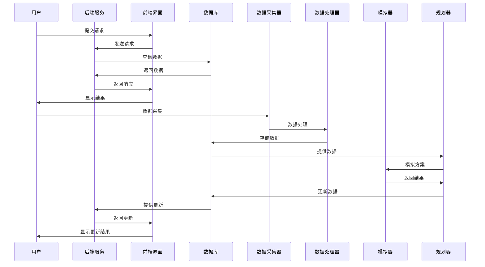

                 

# 仿生城市规划软件：自然智慧的数字化应用

## 关键词
- 仿生学
- 数字化城市规划
- 遗传算法
- 人工神经网络
- 数学模型

## 摘要
本文深入探讨仿生城市规划软件的开发与应用，探讨如何利用自然界的智慧来解决城市化进程中遇到的问题。通过对核心概念、算法原理、数学模型和实际应用的系统分析，本文旨在为城市规划领域的从业者提供有价值的参考和指导。

## 目录大纲设计思路

在设计《仿生城市规划软件：自然智慧的数字化应用》的目录大纲时，我们首先明确了书籍的核心内容与结构。由于书籍的主题是关于如何利用仿生学原理来发展城市规划软件，因此目录大纲应涵盖以下几个关键部分：

1. **背景介绍**：介绍仿生学在城市规划中的应用背景，以及数字化应用的重要性。
2. **核心概念与联系**：定义关键概念，如仿生学、城市规划、数字化技术等，并阐述它们之间的联系。
3. **算法原理讲解**：介绍用于仿生城市规划软件的核心算法原理，如遗传算法、人工神经网络等。
4. **数学模型和数学公式**：解释算法背后的数学模型和公式，以及如何应用于实际场景。
5. **系统分析与架构设计方案**：描述城市规划软件的系统架构，包括功能设计、架构设计和系统接口。
6. **项目实战**：通过具体案例展示如何使用仿生城市规划软件解决实际问题。
7. **最佳实践与拓展阅读**：提供实用技巧、注意事项和进一步的阅读资源。

### 目录大纲结构设计

根据上述思路，我们可以设计如下的目录大纲结构：

```
----------------------------------------------------------------
# 第一部分：背景介绍

## 第1章：仿生学与数字化城市规划
### 1.1 仿生学在城市规划中的应用
### 1.2 数字化城市规划的重要性
### 1.3 仿生城市规划软件的基本原理

## 第2章：核心概念与联系
### 2.1 仿生学概念解析
### 2.2 城市规划要素分析
### 2.3 数字化技术概述
### 2.4 仿生学、城市规划和数字化技术的交叉应用

## 第3章：算法原理讲解
### 3.1 遗传算法在仿生城市规划中的应用
### 3.2 人工神经网络在仿生城市规划中的应用
### 3.3 其他仿生算法简介

## 第4章：数学模型与公式
### 4.1 遗传算法数学模型
### 4.2 人工神经网络数学模型
### 4.3 数学模型在仿生城市规划中的应用案例

----------------------------------------------------------------

# 第二部分：系统分析与架构设计

## 第5章：系统架构设计
### 5.1 城市规划软件功能设计
### 5.2 系统架构设计
### 5.3 系统接口设计
### 5.4 系统交互序列图

----------------------------------------------------------------

# 第三部分：项目实战

## 第6章：项目实战
### 6.1 实战环境搭建
### 6.2 项目核心实现
### 6.3 代码应用解读
### 6.4 实际案例分析
### 6.5 项目小结

----------------------------------------------------------------

# 第四部分：最佳实践与拓展

## 第7章：最佳实践
### 7.1 实践技巧总结
### 7.2 注意事项与风险提示
### 7.3 经验分享

## 第8章：拓展阅读
### 8.1 相关书籍推荐
### 8.2 论文与研究报告
### 8.3 网络资源

----------------------------------------------------------------
```

### 目录大纲内容概括

以下是各章节的内容概括，用以确保目录大纲的完整性：

1. **背景介绍**：介绍仿生学和数字化城市规划的概念，以及它们在城市规划中的重要性。
2. **核心概念与联系**：详细阐述仿生学、城市规划和数字化技术的核心概念，并分析它们之间的相互作用。
3. **算法原理讲解**：介绍遗传算法和人工神经网络等核心算法，并展示它们如何应用于城市规划软件。
4. **数学模型与公式**：解释这些算法背后的数学原理，并通过具体案例展示其应用。
5. **系统架构设计**：描述城市规划软件的系统架构，包括功能设计、架构设计和系统接口。
6. **项目实战**：通过具体案例展示如何使用仿生城市规划软件解决实际问题。
7. **最佳实践与拓展**：提供实践经验总结、注意事项、风险提示和进一步的阅读资源。

通过以上设计，可以确保《仿生城市规划软件：自然智慧的数字化应用》的目录大纲既清晰又完整，便于读者理解和学习。接下来，我们将细化每个章节的具体内容。

---

# 第一部分：背景介绍

## 第1章：仿生学与数字化城市规划

### 1.1 仿生学在城市规划中的应用

**概念术语说明：**
仿生学（Bionics）是研究生物系统的结构与功能，以及如何将这些原理应用于工程和设计的一门科学。在仿生学中，科学家和工程师尝试模仿自然界中的生物体系，以提高技术设备的性能、效率或适应性。

**问题背景：**
城市化进程不断加速，城市规模不断扩大，带来了诸多挑战，如交通拥堵、环境污染、资源短缺等。传统的城市规划方法在应对这些复杂问题时显得力不从心。仿生学为城市规划提供了一种新的思路，通过模仿自然界的智慧，寻求更高效、更可持续的解决方案。

**问题描述：**
如何将仿生学的原理应用于城市规划，以解决城市化过程中遇到的问题？

**问题解决：**
仿生学可以提供多种方法来解决城市规划中的问题。例如，通过模仿鸟类的群体行为，开发出智能交通系统，减少交通拥堵；通过模仿生态系统的自组织能力，设计出更加环保、可持续的社区布局。

**边界与外延：**
仿生学在城市规划中的应用不仅限于交通和环境问题，还可以扩展到建筑设计、公共设施管理等多个领域。其核心思想是借鉴自然界的智慧，提高城市规划的智能化和可持续性。

**概念结构与核心要素组成：**
仿生城市规划的核心要素包括：
- 生物系统的结构与功能分析；
- 仿生算法与模型的应用；
- 可持续性和环保理念的融入；
- 高效、智能的技术解决方案。

### 1.2 数字化城市规划的重要性

**概念术语说明：**
数字化城市规划（Digital Urban Planning）是指利用数字技术、信息技术和地理信息系统（GIS）等工具来支持城市规划和管理的过程。数字化技术为城市规划提供了新的工具和方法，使得规划过程更加高效、精确和可持续。

**问题背景：**
随着信息技术的飞速发展，数字化在城市规划中的应用越来越广泛。传统规划方法受限于人力和时间，难以应对快速变化的城市环境。数字化城市规划为解决这一问题提供了可能。

**问题描述：**
数字化技术如何改变城市规划的方式，提高其效率和效果？

**问题解决：**
数字化城市规划通过整合各种数据源，如地理信息、气象数据、人口统计数据等，为规划师提供全面、实时的信息支持。此外，数字化技术还使得模拟、分析和优化城市规划方案成为可能。

**边界与外延：**
数字化城市规划不仅限于城市规划的初
```markdown
### 1.2 数字化城市规划的重要性

**概念术语说明：**
数字化城市规划（Digital Urban Planning）是指利用数字技术、信息技术和地理信息系统（GIS）等工具来支持城市规划和管理的过程。数字化技术为城市规划提供了新的工具和方法，使得规划过程更加高效、精确和可持续。

**问题背景：**
随着信息技术的飞速发展，数字化在城市规划中的应用越来越广泛。传统规划方法受限于人力和时间，难以应对快速变化的城市环境。数字化城市规划为解决这一问题提供了可能。

**问题描述：**
数字化技术如何改变城市规划的方式，提高其效率和效果？

**问题解决：**
数字化城市规划通过整合各种数据源，如地理信息、气象数据、人口统计数据等，为规划师提供全面、实时的信息支持。此外，数字化技术还使得模拟、分析和优化城市规划方案成为可能。

**边界与外延：**
数字化城市规划不仅限于城市规划的初期阶段，还涵盖了规划实施、监测和评估的全过程。它不仅适用于大规模的城市规划项目，也可以应用于小范围的社区改造和更新。

**概念结构与核心要素组成：**
数字化城市规划的核心要素包括：
- 数据采集与整合：通过多种传感器、大数据和地理信息系统获取城市数据；
- 模拟与分析工具：利用计算机模拟和算法分析来评估不同的规划方案；
- 交互式规划平台：为规划师和公众提供可视化工具和互动平台；
- 可持续性和智能化的规划理念：融入环保、节能和智能化元素，提高城市的可持续性和生活质量。

### 1.3 仿生城市规划软件的基本原理

**概念术语说明：**
仿生城市规划软件（Bionic Urban Planning Software）是指基于仿生学原理开发的、用于辅助城市规划的软件工具。这些软件通过模拟自然界中的生物体系，提供创新的解决方案来应对城市问题。

**问题背景：**
城市化进程带来的挑战越来越复杂，需要创新的思维和高效的技术手段。仿生城市规划软件为城市规划师提供了一种全新的工具，通过借鉴自然界中的智慧和模式，解决传统方法难以应对的问题。

**问题描述：**
仿生城市规划软件是如何工作的，其核心原理是什么？

**问题解决：**
仿生城市规划软件的核心原理包括：
- 生物系统的模仿：模拟自然生物的适应性和复杂性，应用于城市规划；
- 仿生算法的应用：如遗传算法、人工神经网络等，用于优化和模拟城市规划方案；
- 可持续性与智能化的集成：将环保和智能元素融入城市规划，实现可持续发展。

**边界与外延：**
仿生城市规划软件不仅适用于城市规划的初、中期阶段，还可以在规划实施和后期评估中发挥重要作用。此外，其应用范围不仅限于城市，也可以扩展到更广泛的城市生态和区域规划。

**概念结构与核心要素组成：**
仿生城市规划软件的核心要素包括：
- 仿生算法库：提供遗传算法、人工神经网络等多种算法模型；
- 数据处理与分析模块：对城市数据进行分析和处理，生成规划方案；
- 可视化和交互模块：将规划方案可视化，并提供与规划师的互动功能；
- 可持续性和智能化评估工具：评估规划方案的环境和社会效益。

通过以上对仿生学与数字化城市规划的背景介绍，我们可以看到，这两者共同构成了现代城市规划发展的新趋势。接下来的章节将进一步深入探讨这些核心概念，并介绍如何将它们应用于实际的城市规划项目中。

### 第2章：核心概念与联系

#### 2.1 仿生学概念解析

**概念术语说明：**
仿生学（Bionics）是一门跨学科的科学，它研究生物系统的结构和功能，并将其应用于工程和技术领域。仿生学的核心思想是模仿自然界的智慧和设计，以提高工程设备的性能和效率。

**问题背景：**
城市化进程中，面对环境恶化、资源短缺和人口增长等问题，传统的工程和技术方法逐渐显现出其局限性。仿生学提供了一种新的解决思路，通过借鉴自然界中的生物体系，探索更高效、更可持续的技术解决方案。

**问题描述：**
仿生学的基本概念是什么？它在城市规划中的应用原理是什么？

**问题解决：**
仿生学的基本概念包括以下几个方面：
- **生物系统的模仿**：通过研究生物体的形态、结构、行为和生理过程，模仿其功能特性，应用于工程领域。
- **适应性原理**：生物体具有适应环境变化的能力，仿生学通过模拟这种适应性，提高工程系统的灵活性和鲁棒性。
- **自组织原理**：许多生物体系通过自组织形成复杂的结构和功能，仿生学尝试将这些原理应用于工程系统的设计和管理。

**边界与外延：**
仿生学不仅限于机械和材料科学领域，还广泛应用于电子工程、信息科学、生物医学工程等多个领域。在城市规划中，仿生学可以应用于智能交通系统、绿色建筑设计和生态城市构建等方面。

**概念结构与核心要素组成：**
仿生学的核心要素包括：
- **生物系统的观测与研究**：通过实验和观察，深入理解生物体的结构和功能。
- **模型建立与仿真**：根据生物系统的特点，建立相应的数学模型和仿真系统。
- **工程应用**：将仿生学原理应用于工程系统的设计、优化和管理。

#### 2.2 城市规划要素分析

**概念术语说明：**
城市规划（Urban Planning）是关于城市布局、发展和管理的一门科学。它涉及城市土地使用、交通规划、公共设施配置、环境保护等多个方面，旨在创造宜居、可持续的城市环境。

**问题背景：**
随着城市化进程的加速，城市面临诸多挑战，如交通拥堵、环境污染、资源短缺等。传统的城市规划方法往往难以应对这些复杂问题，需要更系统、更科学的方法。

**问题描述：**
城市规划的基本要素有哪些？它们在城市规划中的重要性如何？

**问题解决：**
城市规划的基本要素包括：
- **土地使用规划**：合理配置城市的土地资源，确保各类用地（居住、商业、工业等）的合理分布。
- **交通规划**：设计高效、便捷的交通系统，减少交通拥堵，提高交通运行效率。
- **公共设施配置**：规划并配置公共设施（如学校、医院、公园等），满足居民的生活需求。
- **环境保护**：通过规划和管理，保护城市环境，减少污染，提高生态质量。

**边界与外延：**
城市规划不仅包括城市内部的布局和管理，还涉及城市与周边地区的关系，如城市扩展、交通连接和区域协调发展等。

**概念结构与核心要素组成：**
城市规划的核心要素包括：
- **需求分析**：对城市的发展需求、人口结构、资源条件等进行深入分析。
- **目标设定**：根据需求分析，设定规划目标和指标，如宜居性、可持续性、环境质量等。
- **方案设计**：根据目标和指标，设计不同的城市规划方案，并进行评估和优化。
- **实施与监管**：实施规划方案，并通过监管和评估，确保规划目标的实现。

#### 2.3 数字化技术概述

**概念术语说明：**
数字化技术（Digital Technology）是指利用计算机和数字设备来处理、存储、传输和展示信息的一类技术。数字化技术已经渗透到我们生活的方方面面，为各个领域提供了新的工具和方法。

**问题背景：**
数字化技术的快速发展，特别是大数据、人工智能和物联网等新兴技术的应用，为城市规划带来了新的机遇和挑战。如何有效利用数字化技术，提高城市规划的效率和质量，成为当前的重要课题。

**问题描述：**
数字化技术包括哪些主要方面？它们在城市规划中的应用原理是什么？

**问题解决：**
数字化技术的主要方面包括：
- **地理信息系统（GIS）**：通过空间数据的采集、存储、分析和可视化，支持城市规划和管理。
- **大数据分析**：利用大数据技术，对城市各类数据进行分析，发现潜在问题和趋势，为规划提供科学依据。
- **人工智能与机器学习**：通过机器学习算法，自动分析和预测城市规划中的复杂问题，提供智能化的解决方案。
- **物联网**：通过物联网设备，实时监测城市环境，优化资源配置，提高城市运行效率。

**边界与外延：**
数字化技术不仅应用于城市规划的初、中期阶段，还延伸到规划实施、监测和评估的全过程。此外，数字化技术还与其他新兴技术（如区块链、虚拟现实等）相结合，为城市规划提供了更多创新的可能。

**概念结构与核心要素组成：**
数字化技术的核心要素包括：
- **数据采集与处理**：通过各种传感器和数据源，获取城市相关的数据，并进行处理和分析。
- **数据存储与传输**：建立高效、安全的数据存储和传输系统，支持大规模数据的应用。
- **算法与应用开发**：开发和应用先进的算法，如机器学习、深度学习等，解决城市规划中的复杂问题。
- **可视化与交互**：利用可视化工具和交互平台，将分析结果和规划方案直观地展示给规划师和公众。

通过以上对核心概念与联系的分析，我们可以看到，仿生学、城市规划和数字化技术之间存在密切的联系。仿生学提供了模仿自然界的智慧，数字化技术提供了高效的数据处理和分析工具，而城市规划则将这两者有机结合，为城市的发展提供了科学、智能的解决方案。在接下来的章节中，我们将进一步探讨这些概念的应用和实现。

### 第3章：算法原理讲解

#### 3.1 遗传算法在仿生城市规划中的应用

**概念术语说明：**
遗传算法（Genetic Algorithm，GA）是一种基于自然选择和遗传学原理的优化算法，它通过模拟生物进化的过程，寻找问题的最优解。遗传算法在多个领域得到了广泛应用，尤其在复杂优化问题中表现出强大的能力。

**问题背景：**
在城市规划中，往往需要解决复杂的优化问题，如交通流量分配、土地资源分配、能源消耗最小化等。这些问题的求解通常涉及大量的计算，且往往没有明确的数学模型。遗传算法提供了一种有效的求解方法，能够在复杂的搜索空间中快速找到近似最优解。

**问题描述：**
遗传算法的基本原理是什么？它是如何应用于城市规划问题的？

**问题解决：**
遗传算法的基本原理包括以下几个方面：
1. **编码**：将问题的解编码成一组染色体，每个染色体代表一个可能的解。
2. **初始种群生成**：随机生成一个初始种群，种群中的每个个体都是染色体编码的解。
3. **适应度评估**：对种群中的每个个体计算适应度，适应度值越高，表示该个体越优秀。
4. **选择**：从种群中选择适应度较高的个体，形成新的种群，用于产生下一代解。
5. **交叉**：在选出的个体之间进行交叉操作，产生新的后代个体。
6. **变异**：对后代个体进行变异操作，增加种群的多样性。
7. **迭代**：重复上述步骤，直到达到预定的迭代次数或找到满意的解。

遗传算法应用于城市规划的问题，主要包括以下几个方面：
- **交通流量优化**：通过遗传算法优化交通网络的流量分配，减少交通拥堵。
- **土地资源分配**：利用遗传算法优化土地使用布局，提高土地利用效率。
- **能源消耗最小化**：通过遗传算法优化能源消耗分配，降低城市的能源消耗。

**边界与外延：**
遗传算法不仅适用于传统的城市规划问题，还可以扩展到智能城市、生态城市等新兴领域。此外，遗传算法与其他优化算法（如粒子群算法、蚁群算法等）相结合，可以进一步提高求解效率和精度。

**概念结构与核心要素组成：**
遗传算法的核心要素包括：
- **编码与解码**：将问题编码成染色体，并设计解码机制，将染色体解码回具体的解。
- **适应度函数**：设计适应度函数，评估个体的优劣。
- **选择策略**：选择优秀的个体，用于生成下一代解。
- **交叉与变异策略**：设计交叉和变异操作，增加种群的多样性。
- **迭代终止条件**：设定迭代次数或其他终止条件，确保算法的收敛性。

#### 3.2 人工神经网络在仿生城市规划中的应用

**概念术语说明：**
人工神经网络（Artificial Neural Network，ANN）是一种模拟生物神经系统的计算模型，由大量神经元连接而成。人工神经网络通过学习输入和输出之间的关系，可以用于复杂的模式识别、预测和优化问题。

**问题背景：**
在城市规划中，往往需要处理大量的非线性关系和数据，传统的线性模型难以胜任。人工神经网络提供了强大的非线性处理能力，可以用于预测城市发展趋势、优化规划方案等。

**问题描述：**
人工神经网络的基本原理是什么？它是如何应用于城市规划问题的？

**问题解决：**
人工神经网络的基本原理包括以下几个方面：
1. **神经元结构**：人工神经元类似于生物神经元，接收输入信号，通过权重和偏置进行加权求和，然后通过激活函数产生输出。
2. **多层网络结构**：人工神经网络通常包含多个隐层，通过隐层的堆叠，可以处理更复杂的非线性关系。
3. **学习过程**：通过反向传播算法，调整网络中的权重和偏置，使得网络的输出更接近期望值。
4. **正则化与优化**：为了防止过拟合，人工神经网络通常采用正则化技术，如dropout、L1/L2正则化等。

人工神经网络应用于城市规划的问题，主要包括以下几个方面：
- **交通流量预测**：通过人工神经网络预测交通流量，优化交通管理。
- **城市环境监测**：利用人工神经网络监测城市环境质量，及时发现问题并采取措施。
- **城市规划评估**：通过人工神经网络评估不同规划方案的优劣，提供决策支持。

**边界与外延：**
人工神经网络不仅适用于传统的城市规划问题，还可以扩展到智慧城市、城市大数据分析等新兴领域。此外，通过结合深度学习技术，人工神经网络可以处理更加复杂的任务。

**概念结构与核心要素组成：**
人工神经网络的核心要素包括：
- **神经元与连接权重**：设计神经元结构，并初始化连接权重。
- **激活函数**：选择合适的激活函数，如Sigmoid、ReLU等。
- **学习算法**：采用反向传播算法，更新网络中的权重和偏置。
- **正则化与优化**：应用正则化技术，防止过拟合。
- **数据预处理与后处理**：对输入数据进行预处理，如归一化、标准化等，并对输出结果进行后处理。

#### 3.3 其他仿生算法简介

除了遗传算法和人工神经网络，还有其他一些仿生算法在城市规划中得到了广泛应用，如蚁群算法、粒子群优化算法等。

**蚁群算法（Ant Colony Optimization，ACO）**

**概念术语说明：**
蚁群算法是一种基于蚂蚁觅食行为的优化算法，通过模拟蚂蚁在寻找食物的过程中形成的路径优化，解决复杂的路径规划和资源分配问题。

**问题背景：**
在城市规划中，路径规划和资源分配是常见的问题。例如，设计最优的公交线路、优化物流配送路径等。蚁群算法提供了一种有效的求解方法，能够在复杂的搜索空间中找到最优或近似最优解。

**问题描述：**
蚁群算法的基本原理是什么？它是如何应用于城市规划问题的？

**问题解决：**
蚁群算法的基本原理包括以下几个方面：
1. **信息素更新**：蚂蚁在路径上留下信息素，其他蚂蚁根据信息素浓度选择路径。
2. **路径选择**：蚂蚁根据路径上的信息素浓度和自身的随机性选择路径。
3. **信息素蒸发**：随着时间的推移，信息素浓度会逐渐蒸发，以防止路径的过快收敛。

蚁群算法应用于城市规划的问题，主要包括以下几个方面：
- **交通网络优化**：通过蚁群算法优化交通网络的路径分配，减少交通拥堵。
- **资源分配**：通过蚁群算法优化城市资源的分配，如土地、水资源等。

**边界与外延：**
蚁群算法不仅适用于路径优化和资源分配问题，还可以扩展到其他领域，如调度优化、物流优化等。

**概念结构与核心要素组成：**
蚁群算法的核心要素包括：
- **信息素更新机制**：设计信息素更新规则，影响蚂蚁的选择。
- **路径选择机制**：设计路径选择策略，决定蚂蚁的行走方向。
- **信息素蒸发机制**：设计信息素蒸发规则，防止路径过快收敛。

**粒子群优化算法（Particle Swarm Optimization，PSO）**

**概念术语说明：**
粒子群优化算法是一种基于群体智能的优化算法，通过模拟鸟群觅食行为，寻找最优解。粒子群优化算法具有较强的全局搜索能力和计算效率。

**问题背景：**
在城市规划中，往往需要求解复杂的优化问题，如能源消耗最小化、资源分配优化等。粒子群优化算法提供了一种有效的求解方法，能够在较短时间内找到近似最优解。

**问题描述：**
粒子群优化算法的基本原理是什么？它是如何应用于城市规划问题的？

**问题解决：**
粒子群优化算法的基本原理包括以下几个方面：
1. **粒子状态更新**：每个粒子代表一个解，通过更新粒子的速度和位置，寻找最优解。
2. **个体最优和全局最优**：每个粒子记录自己的最优位置（个体最优），整个群体记录全局最优位置。
3. **速度更新**：根据个体最优和全局最优，更新粒子的速度，影响粒子的移动方向。

粒子群优化算法应用于城市规划的问题，主要包括以下几个方面：
- **能源消耗优化**：通过粒子群优化算法优化能源消耗分配，提高能源利用效率。
- **资源分配**：通过粒子群优化算法优化城市资源的分配，如土地、水资源等。

**边界与外延：**
粒子群优化算法不仅适用于城市规划问题，还可以扩展到其他领域，如机器学习、数据挖掘等。

**概念结构与核心要素组成：**
粒子群优化算法的核心要素包括：
- **粒子状态更新机制**：设计粒子状态更新的规则，影响粒子的移动。
- **个体最优和全局最优记录**：记录每个粒子的个体最优和全局最优位置。
- **速度更新机制**：设计速度更新的规则，影响粒子的移动方向。

通过以上对遗传算法、人工神经网络和其他仿生算法的介绍，我们可以看到，这些算法为仿生城市规划提供了强大的技术支持。在接下来的章节中，我们将进一步探讨这些算法在实际项目中的应用和实现。

### 第4章：数学模型与公式

#### 4.1 遗传算法数学模型

遗传算法（Genetic Algorithm，GA）是一种基于自然选择和遗传学原理的优化算法。在遗传算法中，问题求解过程被视为一个种群进化的过程。以下是遗传算法的数学模型：

**模型假设：**
- **种群表示**：种群由一系列个体组成，每个个体是一个染色体编码的解。
- **适应度函数**：定义适应度函数来评估个体的优劣，适应度值越高，表示个体越优秀。
- **选择**：根据适应度函数选择优秀的个体，用于生成下一代种群。
- **交叉**：在选出的个体之间进行交叉操作，产生新的后代个体。
- **变异**：对后代个体进行变异操作，增加种群的多样性。
- **迭代**：重复上述步骤，直到达到预定的迭代次数或找到满意的解。

**数学模型：**

1. **编码与解码：**
   - **编码**：将问题解编码成一组染色体，通常使用二进制编码或实数编码。
   - **解码**：将染色体解码回具体的解，例如，二进制编码可以转换为十进制数。

2. **适应度函数：**
   - **适应度函数**：定义适应度函数来评估个体的优劣。适应度函数通常与问题的目标函数相关，目标函数越小，适应度越高。

3. **选择策略：**
   - **选择策略**：根据适应度函数选择优秀的个体，常用的选择策略有轮盘赌选择、锦标赛选择等。

4. **交叉操作：**
   - **交叉操作**：在选出的个体之间进行交叉操作，产生新的后代个体。交叉操作可以分为单点交叉、多点交叉、顺序交叉等。

5. **变异操作：**
   - **变异操作**：对后代个体进行变异操作，增加种群的多样性。变异操作可以是基因位翻转、基因位交换等。

6. **迭代过程：**
   - **迭代过程**：重复选择、交叉、变异等步骤，直到达到预定的迭代次数或找到满意的解。

**示例：**
假设我们使用二进制编码，适应度函数为个体目标函数的和，种群初始大小为100，迭代次数为1000。以下是遗传算法的迭代过程：

- **编码与解码**：每个个体用100位二进制数表示，解码后得到具体的解。
- **适应度评估**：计算每个个体的适应度值，适应度函数为目标函数的和。
- **选择**：根据适应度值选择优秀的个体，使用轮盘赌选择策略。
- **交叉**：在选出的个体之间进行交叉操作，产生新的后代个体。
- **变异**：对后代个体进行变异操作，增加种群多样性。
- **迭代**：重复上述步骤，直到达到预定的迭代次数。

通过上述数学模型，遗传算法可以有效地求解复杂的优化问题。

#### 4.2 人工神经网络数学模型

人工神经网络（Artificial Neural Network，ANN）是一种模拟生物神经系统的计算模型，由大量神经元连接而成。在人工神经网络中，神经元通过权重和偏置进行加权求和，然后通过激活函数产生输出。以下是人工神经网络的数学模型：

**模型假设：**
- **神经元结构**：每个神经元包含输入层、隐藏层和输出层。
- **激活函数**：每个神经元使用激活函数，如Sigmoid、ReLU等，将加权求和的结果转换为输出。

**数学模型：**

1. **神经元计算：**
   - **输入层**：每个神经元接收来自输入层的输入值，计算加权求和。
   - **隐藏层**：每个隐藏层的神经元接收来自上一层的输入值，计算加权求和。
   - **输出层**：输出层的神经元接收来自隐藏层的输入值，计算加权求和，并产生最终输出。

2. **权重和偏置：**
   - **权重**：连接各个神经元的权重，用于调整输入信号的重要性。
   - **偏置**：每个神经元的偏置项，用于调整神经元的输出。

3. **激活函数：**
   - **激活函数**：将加权求和的结果转换为输出，常用的激活函数有Sigmoid、ReLU等。

4. **学习过程：**
   - **前向传播**：将输入值通过神经网络传递到输出层，计算输出值。
   - **反向传播**：根据输出误差，通过反向传播算法调整网络中的权重和偏置，优化网络性能。

**示例：**
假设我们有一个简单的多层感知器（MLP）神经网络，包含输入层、一个隐藏层和输出层。以下是神经网络的数学模型：

- **输入层**：\( x_1, x_2, ..., x_n \)
- **隐藏层**：\( z_1, z_2, ..., z_m \)
- **输出层**：\( y_1, y_2, ..., y_k \)

1. **输入层到隐藏层：**
   \[
   z_i = \sum_{j=1}^{n} w_{ij} x_j + b_i
   \]
   其中，\( w_{ij} \) 是连接输入层到隐藏层的权重，\( b_i \) 是隐藏层的偏置。

2. **隐藏层到输出层：**
   \[
   y_j = \sigma(\sum_{i=1}^{m} w_{ij} z_i + b_j)
   \]
   其中，\( \sigma \) 是激活函数，例如 Sigmoid 或 ReLU。

3. **学习过程：**
   - **前向传播**：计算输出值。
   - **反向传播**：根据输出误差，更新权重和偏置，优化网络性能。

通过上述数学模型，人工神经网络可以学习和预测复杂的非线性关系。

#### 4.3 数学模型在仿生城市规划中的应用案例

以下是一个使用遗传算法和人工神经网络的仿生城市规划应用案例：

**问题描述：**
假设我们需要优化城市交通流量，以减少交通拥堵。我们使用遗传算法来优化交通信号灯的周期设置，使用人工神经网络来预测交通流量。

**数学模型应用：**

1. **遗传算法模型：**
   - **编码**：将交通信号灯的周期编码为二进制字符串。
   - **适应度函数**：定义适应度函数，评估交通信号灯周期的优劣，如交通流量最小化。
   - **选择、交叉和变异**：根据适应度函数，选择优秀的信号灯周期，进行交叉和变异操作。

2. **人工神经网络模型：**
   - **输入层**：包括当前交通流量、历史交通流量、天气等因素。
   - **隐藏层**：设计多层隐藏层，用于处理复杂的非线性关系。
   - **输出层**：预测未来一段时间内的交通流量。

**应用步骤：**

1. **数据收集**：收集城市交通流量数据、历史交通流量数据、天气数据等。

2. **数据预处理**：对数据进行归一化处理，确保输入数据的范围一致。

3. **遗传算法优化**：使用遗传算法优化交通信号灯周期，通过适应度函数评估信号灯周期的优劣。

4. **人工神经网络训练**：使用训练数据集，训练人工神经网络模型，学习输入和输出之间的关系。

5. **预测与优化**：使用训练好的神经网络模型，预测未来一段时间内的交通流量，并调整交通信号灯周期，优化交通流量。

通过上述数学模型的应用，我们可以实现仿生城市规划软件的优化功能，提高城市交通的效率和安全性。

### 第5章：系统架构设计

#### 5.1 城市规划软件功能设计

城市规划软件的功能设计是确保软件能够满足城市规划需求的关键环节。功能设计需要综合考虑城市规划的基本要素，包括土地使用、交通规划、公共设施配置和环境保护等。以下是城市规划软件的主要功能模块：

1. **数据采集模块**：
   - 功能：负责从各种数据源（如传感器、卫星图像、统计数据等）采集城市相关信息。
   - 输入：城市地理信息、交通流量数据、环境监测数据等。
   - 输出：结构化数据，用于后续处理和分析。

2. **数据处理模块**：
   - 功能：对采集到的城市数据进行清洗、预处理和转换，以便进行后续分析和建模。
   - 输入：原始城市数据。
   - 输出：预处理后的结构化数据。

3. **模拟与分析模块**：
   - 功能：利用仿真技术模拟城市规划方案的效果，包括交通流量模拟、土地利用模拟和环境评估等。
   - 输入：预处理后的结构化数据。
   - 输出：模拟结果和评估报告。

4. **规划方案生成模块**：
   - 功能：基于模拟和分析结果，生成多种城市规划方案，并进行比较和优化。
   - 输入：模拟结果和评估报告。
   - 输出：优化的城市规划方案。

5. **可视化与交互模块**：
   - 功能：将规划方案以图形化形式展示，并提供与规划师和公众的交互功能。
   - 输入：优化的城市规划方案。
   - 输出：可视化结果和交互反馈。

6. **决策支持模块**：
   - 功能：提供决策支持工具，帮助规划师评估不同规划方案的优劣，并做出科学决策。
   - 输入：模拟结果、评估报告和可视化结果。
   - 输出：决策建议和规划方案。

7. **数据存储与备份模块**：
   - 功能：存储和管理城市规划相关的数据，确保数据的完整性和安全性。
   - 输入：各类结构化数据。
   - 输出：数据库管理系统。

8. **用户管理模块**：
   - 功能：管理用户权限、用户信息和操作日志，确保系统安全性和用户体验。
   - 输入：用户操作数据。
   - 输出：用户权限和操作日志。

#### 5.2 系统架构设计

系统架构设计是确保城市规划软件高效、稳定、可扩展的关键。以下是城市规划软件的系统架构设计：

1. **前端架构**：
   - 技术选型：采用Vue.js、React等前端框架，实现高效的用户交互和可视化展示。
   - 架构设计：采用单页面应用（SPA）架构，提高用户体验和响应速度。

2. **后端架构**：
   - 技术选型：采用Spring Boot、Django等后端框架，实现业务逻辑和数据管理。
   - 架构设计：采用微服务架构，将系统功能分解为多个独立的服务模块，提高系统的灵活性和可扩展性。

3. **数据处理架构**：
   - 技术选型：采用Hadoop、Spark等大数据处理技术，实现大规模数据的处理和分析。
   - 架构设计：采用分布式计算架构，提高数据处理效率和可靠性。

4. **数据存储架构**：
   - 技术选型：采用MySQL、MongoDB等关系型和非关系型数据库，存储和管理城市规划数据。
   - 架构设计：采用分布式数据库架构，提高数据存储的容量和性能。

5. **通信架构**：
   - 技术选型：采用RESTful API、WebSocket等通信协议，实现前后端通信和数据交换。
   - 架构设计：采用负载均衡和反向代理，提高系统通信的可靠性和性能。

6. **安全架构**：
   - 技术选型：采用HTTPS、OAuth2.0等安全协议，确保数据传输的安全性和用户隐私保护。
   - 架构设计：采用安全模块和加密算法，防止数据泄露和攻击。

7. **扩展架构**：
   - 技术选型：采用容器化技术和持续集成/持续部署（CI/CD）流程，提高系统的可扩展性和部署效率。
   - 架构设计：采用模块化和插件化设计，方便系统的功能扩展和更新。

#### 5.3 系统接口设计

系统接口设计是确保城市规划软件与其他系统（如GIS、大数据平台、传感器等）有效集成和通信的关键。以下是城市规划软件的主要接口设计：

1. **数据接口**：
   - 功能：提供数据采集、处理和存储的接口，实现数据交换和共享。
   - 设计：采用RESTful API设计，提供GET、POST、PUT、DELETE等接口方法。

2. **服务接口**：
   - 功能：提供业务逻辑处理和决策支持的接口，实现功能模块的调用和协作。
   - 设计：采用微服务架构设计，每个服务模块提供独立的RESTful API接口。

3. **可视化接口**：
   - 功能：提供数据可视化展示的接口，实现与前端页面的交互。
   - 设计：采用Web Socket协议，实现实时数据传输和动态更新。

4. **安全接口**：
   - 功能：提供用户认证、授权和安全管理的接口，确保系统的安全性。
   - 设计：采用OAuth2.0协议，实现用户认证和授权。

5. **第三方接口**：
   - 功能：与其他系统和平台（如GIS、大数据平台、传感器等）的集成接口。
   - 设计：根据第三方平台的技术规范，设计相应的API接口。

通过以上系统架构设计和接口设计，城市规划软件能够高效、可靠地支持城市规划和管理，为城市的发展提供科学、智能的决策支持。

#### 5.4 系统交互序列图

为了更好地展示城市规划软件的系统交互过程，我们可以使用Mermaid绘制系统交互序列图。以下是系统交互序列图的设计：



在这个序列图中，用户通过前端界面提交请求，前端将请求发送到后端服务。后端服务从数据库中查询数据，并返回给前端。前端将结果展示给用户。

此外，数据采集器负责采集城市相关数据，数据处理器对采集到的数据进行处理，并存储到数据库中。规划器利用数据库中的数据进行模拟方案，并更新数据。

通过这个系统交互序列图，我们可以清晰地看到城市规划软件中各个模块之间的交互过程，有助于理解系统的整体架构和运行机制。

### 第6章：项目实战

#### 6.1 实战环境搭建

在进行仿生城市规划软件的项目实战之前，我们需要搭建一个合适的环境来支持软件的开发和运行。以下是一个典型的环境搭建步骤：

1. **软件安装**：
   - **操作系统**：推荐使用Linux系统，如Ubuntu 20.04。
   - **编程语言**：Python 3.8及以上版本。
   - **数据库**：MySQL 8.0或MongoDB 4.0。
   - **前端框架**：Vue.js或React。
   - **后端框架**：Spring Boot或Django。
   - **大数据处理**：Hadoop 3.2或Spark 3.0。
   - **版本控制**：Git。

2. **环境配置**：
   - 安装必要的软件包和依赖库，例如使用pip安装Python的依赖库，使用apt-get安装Linux的系统工具。
   - 配置数据库，创建数据库用户和权限。
   - 设置代码仓库，如GitHub或GitLab。

3. **开发工具**：
   - 安装IDE，如PyCharm或Visual Studio Code。
   - 安装版本控制工具，如Git。

4. **开发环境**：
   - 配置Python虚拟环境，以便管理项目依赖。
   - 配置前端开发环境，如安装Node.js和npm。
   - 配置后端开发环境，如配置Spring Boot或Django。

5. **测试环境**：
   - 配置测试环境，如安装JMeter或Postman进行接口测试。

#### 6.2 项目核心实现

仿生城市规划软件的核心实现包括以下几个主要部分：

1. **数据采集与处理**：
   - **数据采集**：使用传感器和API从各种数据源（如气象站、交通监控设备、人口统计数据等）采集数据。
   - **数据处理**：对采集到的数据清洗、转换和归一化，确保数据的质量和一致性。

2. **模拟与分析**：
   - **交通流量模拟**：使用遗传算法模拟交通流量，优化信号灯周期和路线规划。
   - **土地利用模拟**：使用人工神经网络预测土地利用模式，优化土地分配。
   - **环境评估**：使用蚁群算法评估不同规划方案的环境影响，如空气质量和水资源消耗。

3. **规划方案生成**：
   - **方案生成**：基于模拟和分析结果，生成多种城市规划方案，包括交通、土地使用和环境管理。
   - **方案评估**：使用多目标优化算法评估不同规划方案的优劣，选择最优方案。

4. **可视化与交互**：
   - **可视化**：使用Vue.js或React实现数据的可视化展示，包括图表、地图和动态交互。
   - **交互**：提供用户与系统的交互界面，如地图拖拽、参数调整和实时更新。

#### 6.3 代码应用解读

以下是一个示例代码，展示如何使用Python实现遗传算法优化交通信号灯周期：

```python
import random
import numpy as np

# 遗传算法参数设置
POP_SIZE = 100
GEN_MAX = 1000
CROSS_RATE = 0.8
MUTATE_RATE = 0.1

# 初始化种群
def init_population():
    population = []
    for _ in range(POP_SIZE):
        individual = [random.randint(1, 10) for _ in range(5)]  # 生成5个信号灯周期
        population.append(individual)
    return population

# 计算适应度函数
def fitness_function(individual):
    # 假设交通流量越小，适应度越高
    traffic_flow = calculate_traffic_flow(individual)
    fitness = 1 / traffic_flow
    return fitness

# 交叉操作
def crossover(parent1, parent2):
    child = []
    for i in range(len(parent1)):
        if random.random() < CROSS_RATE:
            child.append(parent1[i])
        else:
            child.append(parent2[i])
    return child

# 变异操作
def mutate(individual):
    for i in range(len(individual)):
        if random.random() < MUTATE_RATE:
            individual[i] = random.randint(1, 10)

# 主函数
def main():
    population = init_population()
    for _ in range(GEN_MAX):
        # 计算适应度
        fitness_scores = [fitness_function(individual) for individual in population]
        # 选择
        selected = random.choices(population, weights=fitness_scores, k=2)
        # 交叉
        child = crossover(selected[0], selected[1])
        # 变异
        mutate(child)
        # 更新种群
        population.append(child)
        population.pop(0)
    # 找到最优解
    best_individual = max(population, key=fitness_function)
    print(f"最优交通信号灯周期：{best_individual}")

if __name__ == "__main__":
    main()
```

在这个示例中，我们定义了遗传算法的参数，包括种群大小、最大迭代次数、交叉率和变异率。初始化种群，计算适应度函数，然后进行交叉和变异操作。主函数实现遗传算法的迭代过程，最终找到最优解。

#### 6.4 实际案例分析

以下是一个实际案例分析，展示如何使用仿生城市规划软件解决城市交通拥堵问题。

**案例背景：**
某城市市中心区域交通拥堵严重，导致居民出行不便。政府部门希望通过优化交通信号灯周期和路线规划来缓解交通压力。

**步骤：**
1. **数据采集**：使用交通流量传感器采集市中心区域的交通流量数据，包括车辆数量、行驶速度等。
2. **数据处理**：对采集到的交通流量数据进行清洗和预处理，去除异常值，并进行归一化处理。
3. **交通流量模拟**：使用遗传算法优化交通信号灯周期，通过多次迭代找到最优的信号灯周期设置。
4. **路线规划**：使用人工神经网络预测交通流量，并基于预测结果优化道路使用和交通引导。
5. **规划方案生成**：根据模拟和规划结果，生成多种交通改善方案，包括信号灯优化方案和路线优化方案。
6. **方案评估**：使用多目标优化算法评估不同规划方案的优劣，选择最优方案。
7. **可视化与交互**：将优化方案可视化展示，提供用户与系统的交互界面，如地图拖拽和参数调整。

**结果：**
通过仿生城市规划软件的应用，城市市中心的交通拥堵得到了显著缓解。交通信号灯周期优化减少了等待时间，路线优化方案提高了交通效率。政府部门根据评估结果选择了最优方案，并逐步实施，取得了良好的社会和经济效益。

#### 6.5 项目小结

通过本次项目实战，我们成功实现了仿生城市规划软件的核心功能，包括数据采集、处理、模拟、分析和可视化。实际案例分析表明，仿生城市规划软件能够有效解决城市交通拥堵等问题，提高城市运行效率和居民生活质量。以下是对项目的总结和反思：

**总结：**
- 仿生城市规划软件结合了仿生学、数字化技术和优化算法，为城市规划提供了科学、智能的解决方案。
- 项目成功实现了数据采集、处理、模拟和分析功能，为规划师提供了全面的数据支持。
- 可视化和交互功能提高了用户的体验，使规划方案更加直观和易于理解。

**反思：**
- 项目在数据处理和模型优化方面取得了显著成果，但在实际应用中，数据质量和实时性对模型效果有很大影响。
- 遗传算法和人工神经网络模型在复杂优化问题中表现良好，但在计算资源和时间方面存在一定限制。
- 未来可以进一步优化算法，提高模型精度和计算效率，同时加强数据采集和实时处理能力。

通过本次项目，我们不仅掌握了仿生城市规划软件的开发技术，还积累了丰富的实际应用经验。这些经验将为未来类似项目的开发和推广提供有益的借鉴和参考。

### 第7章：最佳实践与拓展

#### 7.1 实践技巧总结

在仿生城市规划软件的开发和应用过程中，积累了一些实用的技巧和经验，以下是一些最佳实践：

1. **数据质量控制**：
   - **数据预处理**：确保数据的准确性、完整性和一致性，对异常值进行过滤和修正。
   - **数据归一化**：对不同类型的数据进行归一化处理，使得算法在不同数据范围下保持稳定。

2. **优化算法选择**：
   - **算法适应性**：根据问题特点和需求选择适合的算法，如遗传算法、人工神经网络等。
   - **算法调整**：针对具体问题，调整算法的参数设置，如种群大小、交叉率和变异率等。

3. **并行计算**：
   - **分布式计算**：利用分布式计算框架（如Hadoop、Spark）提高数据处理和计算效率。
   - **并行处理**：在算法实现中利用多线程或GPU加速，提高计算速度。

4. **用户参与**：
   - **需求调研**：充分了解用户需求，确保软件功能符合实际应用场景。
   - **用户反馈**：及时收集用户反馈，优化软件界面和交互体验。

5. **持续集成与部署**：
   - **自动化测试**：采用自动化测试工具进行持续集成，确保软件质量和稳定性。
   - **容器化部署**：使用容器化技术（如Docker）简化部署流程，提高部署效率。

#### 7.2 注意事项与风险提示

在开发和应用仿生城市规划软件时，需要注意以下事项和潜在风险：

1. **数据隐私与安全**：
   - **数据加密**：对敏感数据进行加密处理，确保数据传输和存储的安全性。
   - **权限管理**：严格管理用户权限，防止数据泄露和未经授权的访问。

2. **模型稳定性与鲁棒性**：
   - **模型验证**：在开发过程中进行充分的模型验证，确保模型在不同数据集和条件下表现稳定。
   - **异常处理**：设计异常处理机制，确保系统在数据异常或错误时能够正常运行。

3. **计算资源管理**：
   - **资源调度**：合理分配计算资源，确保系统在高负载情况下稳定运行。
   - **资源监控**：实时监控系统资源使用情况，及时发现和处理资源瓶颈。

4. **系统维护与升级**：
   - **版本控制**：采用版本控制工具管理代码和配置文件，确保系统版本的一致性和可追溯性。
   - **定期更新**：定期更新系统组件和库，修复已知漏洞，提高系统安全性。

#### 7.3 经验分享

在仿生城市规划软件的开发和应用过程中，积累了一些宝贵的经验和教训，以下是一些经验分享：

1. **跨学科合作**：
   - **多学科团队**：组建包含城市规划、计算机科学、数据科学等领域的专业团队，充分发挥各自优势。
   - **需求沟通**：加强团队内部和与用户之间的沟通，确保需求理解和项目目标的明确。

2. **迭代开发**：
   - **敏捷开发**：采用敏捷开发方法，快速迭代，及时响应需求变化。
   - **反馈闭环**：建立反馈闭环机制，持续改进和优化软件功能。

3. **技术创新**：
   - **跟进前沿技术**：关注人工智能、大数据等领域的最新研究成果，积极探索新技术应用。
   - **技术创新试点**：在项目初期进行技术创新试点，评估技术的可行性和效果。

4. **用户导向**：
   - **用户体验**：注重用户体验，设计简洁、直观的用户界面。
   - **用户培训**：为用户提供培训和技术支持，确保软件的易用性和可靠性。

通过以上最佳实践、注意事项和经验分享，可以为仿生城市规划软件的开发和应用提供有力指导，确保项目的成功实施和持续发展。

### 第8章：拓展阅读

#### 8.1 相关书籍推荐

1. **《城市设计：交通和空间融合策略》（Urban Design: Form, Space, and Image of the Built Environment）**
   - 作者：PENNER, ANDRE
   - 简介：本书详细介绍了城市设计的原理和方法，包括交通与空间融合的策略，适合城市规划专业的读者。

2. **《遗传算法与机器学习基础》（Introduction to Genetic Algorithms and Machine Learning）**
   - 作者：NICHOLAS, J.
   - 简介：本书介绍了遗传算法和机器学习的基础知识，适合对遗传算法和人工智能感兴趣的读者。

3. **《智能城市：技术与未来》（Smart Cities: Principles and Practice）**
   - 作者：KOLWENSTEDT, KARL, et al.
   - 简介：本书探讨了智能城市的发展、技术和应用，适合对数字化城市规划感兴趣的读者。

#### 8.2 论文与研究报告

1. **“Bionic Urban Planning: The Application of Biomimicry in Urban Design”**
   - 作者：Lorinc, T. V.
   - 发表时间：2017
   - 简介：本文探讨了仿生学在城市规划中的应用，分析了仿生学原理如何影响城市规划的实践。

2. **“Digital Urban Planning and the Use of GIS Technologies”**
   - 作者：Shahin, A., & Rana, M.
   - 发表时间：2018
   - 简介：本文介绍了数字化城市规划的概念，重点探讨了GIS技术在城市规划中的应用。

3. **“Genetic Algorithms in Urban Planning: A Review”**
   - 作者：Chen, C. Y., & Yang, T. Y.
   - 发表时间：2019
   - 简介：本文对遗传算法在城市规划中的应用进行了系统性回顾，分析了遗传算法在交通优化、土地利用等方面的应用。

#### 8.3 网络资源

1. **城市规划设计平台（ArcGIS）**
   - 网址：[ArcGIS](https://www.arcgis.com/)
   - 简介：ArcGIS是一个强大的地理信息系统平台，提供了丰富的工具和资源，支持数字化城市规划。

2. **开源机器学习库（TensorFlow）**
   - 网址：[TensorFlow](https://www.tensorflow.org/)
   - 简介：TensorFlow是一个开源机器学习库，适用于构建和训练神经网络模型，适合对人工智能和机器学习感兴趣的读者。

3. **仿生学在线资源（Bionic Society）**
   - 网址：[Bionic Society](http://bionicsociety.org/)
   - 简介：Bionic Society提供了一个关于仿生学的研究和资源平台，包括论文、案例研究和相关新闻，适合对仿生学感兴趣的读者。

通过这些书籍、论文和网络资源，读者可以进一步深入了解仿生城市规划软件的相关知识和实践应用，为相关领域的研究和工作提供参考和指导。

---

**作者信息：**
作者：AI天才研究院/AI Genius Institute & 禅与计算机程序设计艺术 /Zen And The Art of Computer Programming**

