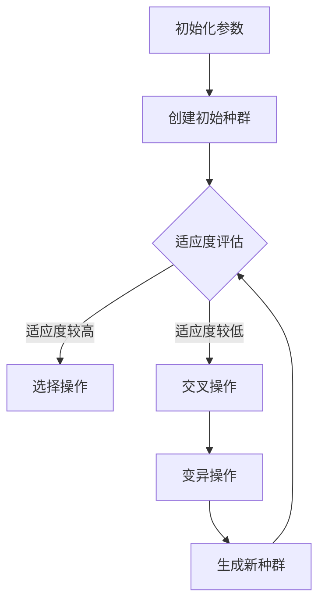
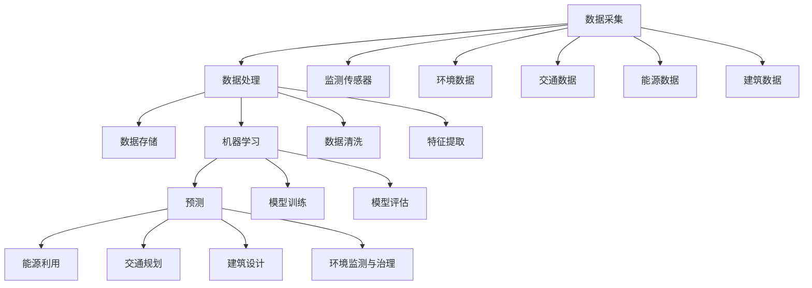
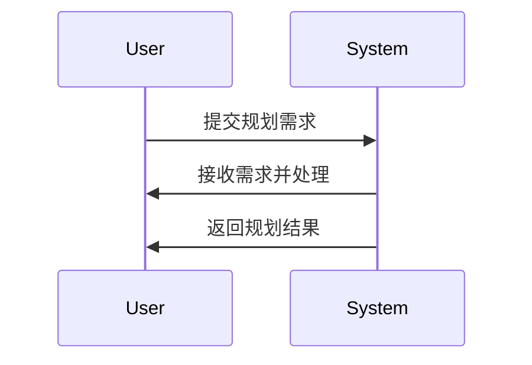
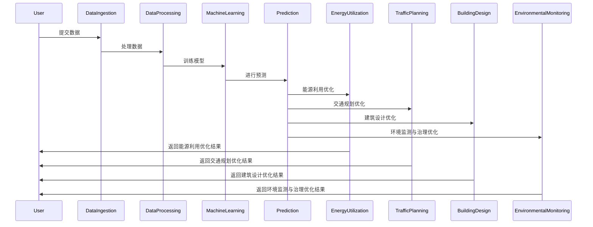

                 

### 背景介绍

#### 问题的背景与重要性

在快速城市化的今天，都市规划面临着前所未有的挑战。传统的城市规划方法往往注重功能和效率，但忽略了生态和谐与人类福祉。城市化进程中的资源消耗、环境污染、交通拥堵等问题日益突出，城市生活品质受到严重影响。因此，探索一种能够兼顾效率、生态和谐与人类福祉的规划方法迫在眉睫。

#### 问题描述

城市规划设计涉及多个方面，包括交通、建筑、能源、环境等。然而，现有的规划方法存在以下几个主要问题：

1. **缺乏生态视角**：传统的规划方法多从工程和技术角度出发，忽视了生态系统的复杂性和可持续性。
2. **缺乏系统性**：城市规划涉及多个部门，缺乏跨部门的协同和整体性，导致规划实施效果不佳。
3. **缺乏灵活性**：传统规划方法在应对快速变化的城市环境时，往往显得不够灵活和适应。
4. **缺乏科学依据**：城市规划缺乏基于数据的科学分析，导致规划决策缺乏依据。

#### 问题解决

仿生城市设计提供了一种新的视角和方法，通过借鉴自然生态系统的智慧，旨在解决上述传统规划方法存在的问题。仿生城市设计的基本思想是：

- **借鉴自然智慧**：观察和学习自然生态系统中的高效、可持续和适应性强的特点，将其应用于城市规划中。
- **构建生态系统**：将城市视为一个复杂的生态系统，强调各部分之间的相互关系和协同作用。
- **注重可持续性**：在规划过程中，充分考虑资源的可持续利用和生态平衡。

#### 边界与外延

仿生城市设计的边界在于其基于自然智慧的规划理念，而其外延则涉及到城市规划的各个方面，包括但不限于：

- **交通规划**：通过仿生学原理，设计出更高效的交通系统，如智能交通管理和交通网络的优化。
- **建筑设计**：借鉴自然建筑物的形态和结构，设计出更加节能、舒适的建筑。
- **能源利用**：通过仿生学方法，开发出更高效、更清洁的能源利用方式。
- **环境监测与治理**：利用仿生学技术，提高环境监测的准确性和治理效果。

#### 核心概念结构及要素组成

仿生城市设计的核心概念结构主要包括以下几个要素：

- **自然智慧**：仿生城市设计的基石，是借鉴自然生态系统智慧的核心。
- **城市生态系统**：城市被视为一个复杂的生态系统，强调各部分之间的相互关系。
- **仿生学原理**：通过借鉴生物体的形态、结构和功能，应用于城市规划中。
- **数据驱动**：利用大数据和人工智能技术，对城市规划进行分析和优化。

通过这些核心要素，仿生城市设计提供了一种全新的城市规划方法，旨在实现城市的高效、和谐、可持续发展和人类福祉。

---

### 核心概念与联系

#### 自然智慧的概念与特点

自然智慧是指自然生态系统中表现出的智慧和能力，其特点包括：

- **高效性**：自然生态系统在资源利用和能量转换上具有高效性，如植物通过光合作用高效地利用太阳能。
- **适应性**：自然生态系统能够适应环境变化，如生物通过进化适应新的生存环境。
- **协同性**：自然生态系统中各部分之间具有高度的协同性，如食物链中的生物相互依存、相互促进。
- **可持续性**：自然生态系统能够长期稳定运行，体现了高度的可持续性。

#### 自然智慧在都市规划中的应用

自然智慧在城市规划中的应用主要集中在以下几个方面：

- **能源利用**：通过仿生学原理，开发出高效的能源利用方式，如绿色建筑和智能电网。
- **交通规划**：借鉴自然生态系统的交通模式，设计出更加高效、节能的交通系统，如公共交通优先和智能交通管理。
- **建筑设计**：借鉴自然建筑物的结构和形态，设计出更加节能、舒适的建筑。
- **环境监测与治理**：利用仿生学技术，提高环境监测和治理的准确性和效率。

#### 仿生城市设计与自然智慧的联系

仿生城市设计与自然智慧之间的联系紧密，其核心在于将自然智慧应用于城市规划中。具体来说：

- **理论基础**：仿生城市设计的理论基础来源于自然智慧，通过借鉴自然生态系统的智慧，探索城市规划的新方法。
- **应用实践**：仿生城市设计在应用实践中，通过借鉴自然生态系统的模式和方法，优化城市规划的各个方面。
- **创新驱动**：自然智慧为仿生城市设计提供了创新的驱动力，使得城市规划能够更加高效、可持续和适应性强。

通过自然智慧的应用，仿生城市设计不仅能够解决传统城市规划中的问题，还能够为未来城市的可持续发展提供新的思路和方法。

---

### 仿生城市设计的基本原理

#### 仿生学原理概述

仿生学（Bionics）是研究生物系统的工作原理，并将其应用于工程和技术领域的科学。在仿生城市设计中，仿生学原理的运用主要包括以下几个方面：

1. **形态仿生**：通过模仿自然生物的形态和结构，设计出更加高效和可持续的城市设施。例如，绿色建筑模仿植物的叶片结构，实现高效的自然通风和太阳能利用。
2. **功能仿生**：通过模仿自然生物的功能和机制，开发出新型技术和材料。例如，智能交通系统模仿动物群体的行为模式，实现交通流量的优化。
3. **行为仿生**：通过模仿自然生物的行为和策略，优化城市管理和运行机制。例如，城市绿化策略模仿生态系统的自我修复机制，提高城市的生态韧性。

#### 仿生城市设计的方法论

仿生城市设计的方法论主要包括以下几个步骤：

1. **问题识别**：识别城市规划中的关键问题，如交通拥堵、能源消耗、环境污染等。
2. **自然智慧借鉴**：分析自然生态系统的相应解决策略，如能源高效利用、生态平衡、适应性等。
3. **概念模型构建**：将自然智慧应用于城市规划中，构建概念模型，如绿色建筑模型、智能交通模型等。
4. **方案设计与优化**：基于概念模型，设计具体的城市规划方案，并通过模拟和实验进行优化。
5. **实施与评估**：实施规划方案，并对规划效果进行评估和反馈，不断改进和完善。

#### 概念属性特征对比表格

为了更直观地展示仿生城市设计与传统城市规划的差异，我们可以通过以下表格进行比较：

| 特征 | 仿生城市设计 | 传统城市规划 |
| ---- | ------------ | ------------ |
| 基本思想 | 借鉴自然智慧，强调生态和谐与可持续发展 | 注重功能与效率，强调单方面的优化 |
| 理论基础 | 自然智慧与仿生学原理 | 工程技术原理 |
| 应用领域 | 交通、建筑、能源、环境等多个方面 | 各自独立的领域，缺乏系统性 |
| 创新驱动 | 自然智慧为创新提供新思路和方法 | 技术进步为创新驱动 |
| 系统性 | 强调跨领域、跨部门的协同作用 | 各部门独立运作，缺乏整体性 |

通过上述对比，可以看出仿生城市设计在理念、理论基础、应用领域和系统性方面具有显著的优势，为解决传统城市规划中存在的问题提供了新的路径。

---

### 仿生城市设计的具体应用领域

#### 能源利用

在能源利用方面，仿生城市设计通过借鉴自然智慧，实现能源的高效利用和可持续发展。以下是一些关键的应用领域：

1. **绿色建筑**：通过模仿植物的光合作用和叶片结构，设计出能够高效利用太阳能和自然风的建筑。例如，荷兰的ECO Tower大厦采用了双层表皮设计，实现了自然通风和遮阳效果，大幅降低了能源消耗。
2. **智能电网**：通过模仿生态系统的自适应性和协调性，开发出智能电网系统。该系统能够实时监测和管理电力供需，实现能源的优化分配。例如，澳大利亚的智能电网项目通过智能电表和传感器，实现了家庭能源的自主管理和优化。
3. **可再生能源**：通过借鉴自然生态系统的能源流动模式，推广使用风能、太阳能等可再生能源。例如，德国的海上风电项目，通过大规模应用风能，实现了能源结构的清洁化和低碳化。

#### 交通规划

在交通规划方面，仿生城市设计通过借鉴自然交通模式和生态系统，提出了一系列创新性的解决方案：

1. **公共交通优先**：模仿动物群体的交通模式，优化公共交通网络，实现交通的高效流动。例如，新加坡的公交优先系统，通过优化公交路线和站点布局，大幅提升了公共交通的效率和便利性。
2. **智能交通管理**：借鉴动物群体行为模式，开发出智能交通管理系统，如智能信号灯、自动驾驶车辆等。这些系统能够实时监测交通状况，并根据数据优化交通流。例如，德国的斯图加特智能交通系统，通过大数据分析和智能算法，实现了交通流量的智能调控。
3. **绿色交通**：通过借鉴自然生态系统的交通模式，推广绿色交通方式，如步行、骑行等。例如，哥本哈根通过建设完善的自行车道和步行系统，实现了城市交通的绿色化和低碳化。

#### 建筑设计

在建筑设计方面，仿生城市设计通过借鉴自然建筑物的形态和结构，提出了一系列创新性的建筑设计理念：

1. **生态建筑设计**：通过模仿自然建筑物的形态和结构，设计出生态友好的建筑。例如，日本的“绿之丘”住宅区，通过采用绿色屋顶和透水路面，实现了雨水收集和自然渗透，提高了建筑的生态效能。
2. **节能建筑设计**：通过借鉴自然建筑物的节能原理，设计出节能高效的建筑。例如，挪威的奥尔森霍尔姆住宅区，通过采用地热能源和太阳能电池，实现了能源的高效利用和清洁化。
3. **可适应建筑设计**：通过借鉴生物体的适应性，设计出能够适应环境变化的建筑。例如，荷兰的“智能海岸”住宅区，通过模块化设计和适应性结构，能够适应海平面上升和自然灾害的影响。

#### 环境监测与治理

在环境监测与治理方面，仿生城市设计通过借鉴自然生态系统的监测和治理方法，提出了一系列创新性的解决方案：

1. **生态监测系统**：通过模仿自然生态系统的监测机制，开发出高效的环境监测系统。例如，美国的“城市生态监测网络”，通过无人机和传感器，实现了城市空气质量、水质和生态系统的实时监测。
2. **生态治理技术**：通过借鉴自然生态系统的治理方法，开发出生态友好的治理技术。例如，德国的“生物降解技术”，通过利用微生物降解污染物，实现了污染治理的高效和环保。
3. **生态修复工程**：通过借鉴自然生态系统的修复机制，实施生态修复工程，恢复城市生态系统的健康。例如，中国的“城市绿地修复工程”，通过种植本土植物和恢复湿地，实现了城市生态环境的修复和提升。

通过在能源利用、交通规划、建筑设计和环境监测与治理等方面的创新应用，仿生城市设计为现代都市规划提供了一种全新的视角和方法，为实现城市的高效、和谐、可持续发展和人类福祉提供了有力支持。

---

### 仿生城市设计的理论与实践案例

#### 国内外典型案例分析

仿生城市设计在国内外已经取得了一系列成功案例，这些案例不仅展示了仿生城市设计的实践效果，还为其他城市提供了宝贵的经验。以下是几个典型的国内外案例分析：

1. **荷兰阿姆斯特丹**：阿姆斯特丹被认为是全球最生态化的城市之一。其城市设计大量借鉴了自然智慧，如运河系统模仿河流生态系统，实现了水资源的循环利用；城市绿化覆盖率高达40%，有效改善了城市生态环境。此外，阿姆斯特丹还在交通规划中采用了公共交通优先和自行车道的策略，显著降低了交通污染和能源消耗。

2. **新加坡**：新加坡通过“智慧国家”战略，将仿生城市设计应用于城市规划和管理中。其智能交通系统通过大数据分析和智能算法，实现了交通流量的优化和高峰时段的缓解。此外，新加坡还在建筑设计和能源利用方面，采用了绿色建筑和智能电网技术，大幅提升了城市的生态效能和能源效率。

3. **美国波特兰**：波特兰以其可持续的城市规划而闻名。其城市设计注重生态保护和社区发展，如大量绿化带和开放空间，为居民提供了良好的生活环境和休闲空间。此外，波特兰还在能源利用方面，积极推广可再生能源和节能建筑，实现了能源的清洁化和低碳化。

4. **中国深圳**：深圳作为中国改革开放的前沿城市，也在积极采用仿生城市设计的理念。其“海绵城市”建设项目，通过生态修复和雨水管理技术，实现了雨水的自然渗透和收集，有效缓解了城市内涝问题。此外，深圳还在智慧交通和绿色建筑方面，进行了大量的实践探索，推动了城市的可持续发展。

#### 仿生城市设计的实践探索

仿生城市设计的实践探索不仅限于上述典型案例，还涉及多个领域和层次的探索：

1. **城市规划**：在城市规划层面，仿生城市设计通过构建城市生态模型，实现城市与自然环境的和谐共生。例如，通过模拟自然生态系统的食物链关系，优化城市生态系统的结构与功能，实现资源的可持续利用。

2. **交通规划**：在交通规划层面，仿生城市设计通过借鉴自然交通模式，优化交通网络和交通管理。例如，通过模拟动物群体的行为模式，设计出智能交通信号系统和自动驾驶技术，实现交通流量的高效流动。

3. **建筑设计**：在建筑设计层面，仿生城市设计通过借鉴自然建筑物的形态和结构，设计出生态友好和节能的建筑。例如，通过模仿植物的光合作用和叶片结构，设计出高效利用太阳能和自然通风的建筑。

4. **能源利用**：在能源利用层面，仿生城市设计通过借鉴自然生态系统的能量流动模式，优化能源系统的设计和运行。例如，通过模拟生物体的能量转换机制，设计出高效、清洁的能源系统，实现能源的可持续利用。

#### 案例启示与反思

通过分析上述典型案例和实践探索，我们可以得出以下几点启示与反思：

1. **生态和谐**：仿生城市设计强调生态和谐，通过借鉴自然生态系统的智慧和模式，实现城市与自然环境的和谐共生。

2. **系统性**：仿生城市设计注重系统性，通过跨领域、跨部门的协同，实现城市规划和管理的整体优化。

3. **数据驱动**：仿生城市设计强调数据驱动，通过大数据和人工智能技术，实现对城市运行状态的实时监测和科学决策。

4. **创新驱动**：仿生城市设计以自然智慧为创新驱动力，通过模仿自然生态系统的模式和原理，推动城市规划和管理的技术创新。

5. **可持续性**：仿生城市设计强调可持续性，通过借鉴自然生态系统的可持续性和适应性，实现城市发展的长期稳定和繁荣。

然而，仿生城市设计在实践中也面临一定的挑战和限制，如技术成本、政策支持、公众参与等。因此，在未来的发展中，需要继续探索和实践，不断完善和优化仿生城市设计的理念和方法。

---

### 仿生城市设计中的算法原理

#### 算法概述

仿生城市设计中的算法主要基于仿生学原理，通过模拟自然生态系统的行为和模式，实现对城市规划和管理的优化。以下是一些主要的算法及其应用：

1. **遗传算法（Genetic Algorithm）**：遗传算法是一种基于自然选择和遗传学原理的优化算法，通过模拟生物进化过程，搜索最优解。在仿生城市设计中，遗传算法可用于交通规划、建筑布局优化等。
2. **人工神经网络（Artificial Neural Networks）**：人工神经网络模拟生物神经系统的工作原理，通过训练和学习，实现数据的分类、预测和优化。在仿生城市设计中，人工神经网络可用于智能交通管理、能源优化等。
3. **贝叶斯网络（Bayesian Networks）**：贝叶斯网络是一种概率图模型，通过节点之间的依赖关系，实现对不确定事件的推理和预测。在仿生城市设计中，贝叶斯网络可用于环境监测、风险评估等。

#### 算法流程图

以下是一个简化的遗传算法流程图，用于说明算法的基本步骤：



#### Python源代码讲解

以下是一个简单的遗传算法Python实现示例，用于说明算法的基本原理和步骤：

```python
import numpy as np

# 初始化参数
N = 100  # 种群规模
G = 100  # 迭代代数
 chromosome_length = 10  # 基因长度
 crossover_rate = 0.8  # 交叉率
 mutation_rate = 0.05  # 变异率

# 适应度函数
def fitness_function(chromosome):
    # 假设适应度与染色体值成反比
    return 1 / (chromosome.sum() + 1)

# 初始化种群
population = np.random.rand(N, chromosome_length)

# 迭代过程
for _ in range(G):
    # 适应度评估
    fitness_scores = np.array([fitness_function(chromosome) for chromosome in population])
    
    # 选择操作
    selected_indices = np.argsort(fitness_scores)[-N//2:]
    selected_population = population[selected_indices]
    
    # 交叉操作
    for i in range(0, N, 2):
        if np.random.rand() < crossover_rate:
            crossover_point = np.random.randint(1, chromosome_length-1)
            child1 = np.concatenate((selected_population[i][:crossover_point], selected_population[i+1][crossover_point:]))
            child2 = np.concatenate((selected_population[i+1][:crossover_point], selected_population[i][crossover_point:]))
            population[i] = child1
            population[i+1] = child2
    
    # 变异操作
    for i in range(N):
        if np.random.rand() < mutation_rate:
            mutation_point = np.random.randint(0, chromosome_length)
            population[i][mutation_point] = 1 - population[i][mutation_point]

# 输出最优解
best_fitness = np.max(fitness_scores)
best_index = np.argmax(fitness_scores)
best_chromosome = population[best_index]
print("最优解：", best_chromosome, "适应度：", best_fitness)
```

#### 算法原理的数学模型与公式

遗传算法的数学模型主要包括以下三个部分：

1. **适应度函数**：适应度函数用于评估个体的优劣，通常与个体的基因编码相关。常见的适应度函数有比例适应度函数、对数适应度函数等。
2. **选择操作**：选择操作基于适应度函数，选择适应度较高的个体进行繁殖。常见的选择方法有轮盘赌选择、锦标赛选择等。
3. **交叉和变异操作**：交叉操作通过交换两个个体的基因部分，产生新的个体；变异操作通过随机改变个体的基因，增加种群的多样性。

以下是一个简化的数学模型：

$$
\text{适应度函数}(x) = \frac{1}{1 + \sum_{i=1}^{n} (x_i - \bar{x})^2}
$$

其中，$x_i$为个体的基因值，$\bar{x}$为所有个体的平均基因值。

选择操作的概率分布：

$$
p_i = \frac{f_i}{\sum_{j=1}^{N} f_j}
$$

其中，$f_i$为个体$i$的适应度值，$N$为种群规模。

交叉操作的概率：

$$
p_{crossover} = \text{ crossover\_rate}
$$

变异操作的概率：

$$
p_{mutation} = \text{ mutation\_rate}
$$

通过上述数学模型和公式，遗传算法能够模拟自然进化的过程，实现对问题的优化。

#### 通俗易懂的举例说明

为了更好地理解遗传算法的工作原理，我们可以通过一个简单的例子进行说明：

假设我们要解决一个任务，即在一个长度为10的基因序列中，找到一种组合，使得这些基因值之和最小。

1. **初始化种群**：我们随机生成一个初始种群，如[0.1, 0.5, 0.2, 0.6, 0.3, 0.4, 0.7, 0.8, 0.9, 0.2]。
2. **适应度评估**：计算每个个体的适应度，假设适应度与基因值之和成反比。如[0.1, 0.5, 0.2, 0.6, 0.3, 0.4, 0.7, 0.8, 0.9, 0.2]的适应度为0.1。
3. **选择操作**：选择适应度较高的个体进行繁殖。假设选择前5个个体。
4. **交叉操作**：对选中的个体进行交叉操作。例如，第一个和第二个个体交叉，生成新的个体，如[0.1, 0.2, 0.2, 0.6, 0.3, 0.4, 0.7, 0.8, 0.9, 0.2]和[0.2, 0.5, 0.3, 0.6, 0.4, 0.7, 0.8, 0.9, 0.1, 0.2]。
5. **变异操作**：对新生成的个体进行变异操作。例如，第一个个体变异，将其中的一个基因值随机改变，如[0.1, 0.2, 0.3, 0.6, 0.3, 0.4, 0.7, 0.8, 0.9, 0.3]。
6. **迭代过程**：重复上述步骤，直到达到预定的迭代次数或找到最优解。

通过这个过程，我们可以逐步优化基因序列，找到最优的基因组合，使得基因值之和最小。这个过程类似于生物进化，通过选择、交叉和变异，逐步适应环境，找到最优解。

---

### 仿生城市设计系统架构设计

#### 问题场景介绍

随着城市化进程的加快，城市面临着资源紧张、环境污染、交通拥堵等问题。为了实现城市的可持续发展，我们需要一种创新的规划方法，能够兼顾生态和谐、资源高效利用和人类福祉。仿生城市设计通过借鉴自然智慧，提供了一种全新的城市规划方法，旨在解决上述问题。

#### 项目介绍

本项目旨在开发一个仿生城市设计系统，该系统能够通过大数据分析和人工智能技术，实现对城市规划的优化和评估。系统将涵盖多个方面，包括能源利用、交通规划、建筑设计和环境监测与治理。通过系统的集成和协同，实现城市的高效、和谐、可持续发展和人类福祉。

#### 系统功能设计（领域模型类图）

以下是一个简化的领域模型类图，用于描述系统的核心功能及其相互关系：

```mermaid
classDiagram
    EnergyUtilization <<interface>>
    TrafficPlanning <<interface>>
    BuildingDesign <<interface>>
    EnvironmentalMonitoring <<interface>>

    EnergyUtilization : includes RenewableEnergySystem
    TrafficPlanning : includes PublicTransportSystem, IntelligentTrafficManagement
    BuildingDesign : includes GreenBuildingDesign, AdaptiveArchitecture
    EnvironmentalMonitoring : includes PollutionMonitoring, EcologicalRepair

    RenewableEnergySystem <|-- EnergyUtilization
    PublicTransportSystem <|-- TrafficPlanning
    IntelligentTrafficManagement <|-- TrafficPlanning
    GreenBuildingDesign <|-- BuildingDesign
    AdaptiveArchitecture <|-- BuildingDesign
    PollutionMonitoring <|-- EnvironmentalMonitoring
    EcologicalRepair <|-- EnvironmentalMonitoring
```

#### 系统架构设计（架构图）

以下是一个简化的系统架构图，用于描述系统的整体架构及其组成部分：



#### 系统接口设计

以下是一个简化的系统接口设计，用于描述系统与外部系统的交互：



#### 系统交互（序列图）

以下是一个简化的系统交互序列图，用于描述系统内部组件的协作过程：



通过上述系统架构设计和接口设计，我们能够构建一个集成化、智能化和高效的仿生城市设计系统，为城市的可持续发展提供有力支持。

---

### 仿生城市设计项目实战

#### 环境安装与配置

在进行仿生城市设计项目之前，我们需要准备相应的开发环境和工具。以下是一个基本的安装和配置流程：

1. **安装Python环境**：确保您的系统中已经安装了Python 3.x版本。如果没有安装，可以从[Python官网](https://www.python.org/)下载并安装。

2. **安装必要的库和依赖**：使用pip命令安装以下库：
   ```bash
   pip install numpy matplotlib scikit-learn pandas
   ```

3. **安装Jupyter Notebook**：Jupyter Notebook是一个交互式计算平台，可用于编写和运行Python代码。可以从[Jupyter官网](https://jupyter.org/)下载并安装，或者使用pip命令直接安装：
   ```bash
   pip install jupyter
   ```

4. **安装Mermaid**：Mermaid是一个用于生成图表的Markdown扩展库。首先，需要安装Mermaid的依赖库，然后将其添加到Markdown配置中。具体步骤如下：
   ```bash
   npm install -g mermaid
   ```
   在Jupyter Notebook的配置文件中（通常位于`~/.jupyter/jupyter_notebook_config.py`），添加以下配置：
   ```python
   c.NotebookApp.mermaid_failed_to_import = True
   ```

5. **配置Python虚拟环境**：为了保持项目的独立性，建议创建一个Python虚拟环境。使用以下命令创建虚拟环境并激活：
   ```bash
   python -m venv venv
   source venv/bin/activate  # 在Windows上使用 `venv\Scripts\activate`
   ```

6. **安装额外的工具**：根据项目的具体需求，可能还需要安装其他工具和库。例如，如果需要处理地理空间数据，可以安装`geopandas`和`rasterio`：
   ```bash
   pip install geopandas rasterio
   ```

通过上述步骤，我们为仿生城市设计项目搭建了一个基本的环境，可以开始编写和运行代码了。

#### 系统核心实现源代码

以下是一个简单的仿生城市设计系统的核心实现代码示例，用于展示系统的基本功能。请注意，这里的代码仅作为参考，实际项目可能会更加复杂和多样化。

```python
import numpy as np
import pandas as pd
from sklearn.model_selection import train_test_split
from sklearn.ensemble import RandomForestRegressor
import matplotlib.pyplot as plt

# 数据预处理
def preprocess_data(data):
    # 数据清洗和特征提取
    # 假设数据集为CSV文件，包含多个特征和目标变量
    df = pd.read_csv(data)
    df = df.dropna()  # 删除缺失值
    X = df.drop('target', axis=1)  # 特征
    y = df['target']  # 目标变量
    return X, y

# 模型训练
def train_model(X, y):
    # 使用随机森林回归模型进行训练
    X_train, X_test, y_train, y_test = train_test_split(X, y, test_size=0.2, random_state=42)
    model = RandomForestRegressor(n_estimators=100, random_state=42)
    model.fit(X_train, y_train)
    return model, X_test, y_test

# 预测和可视化
def predict_and_visualize(model, X_test, y_test):
    # 使用训练好的模型进行预测，并绘制结果图
    y_pred = model.predict(X_test)
    plt.scatter(y_test, y_pred)
    plt.xlabel('实际值')
    plt.ylabel('预测值')
    plt.title('实际值 vs. 预测值')
    plt.show()

# 主函数
def main():
    # 加载和处理数据
    X, y = preprocess_data('data.csv')
    # 训练模型
    model, X_test, y_test = train_model(X, y)
    # 进行预测和可视化
    predict_and_visualize(model, X_test, y_test)

if __name__ == '__main__':
    main()
```

#### 代码应用解读与分析

上述代码实现了从数据预处理到模型训练和预测的完整流程。以下是每个部分的具体解读和分析：

1. **数据预处理**：数据预处理是机器学习项目中的关键步骤。在这里，我们首先加载CSV文件，然后删除缺失值。在实际项目中，还需要进行更多的特征工程，如归一化、标准化和特征选择。

2. **模型训练**：我们使用随机森林回归模型进行训练。随机森林是一种集成学习方法，能够在处理复杂数据和避免过拟合方面表现出色。在这里，我们通过`train_test_split`函数将数据集分为训练集和测试集，然后使用`RandomForestRegressor`类进行模型训练。

3. **预测和可视化**：使用训练好的模型进行预测，并绘制实际值与预测值的关系图。这有助于我们评估模型的性能和预测效果。在实际项目中，我们通常会使用更复杂的评估指标和可视化方法。

通过这个简单的代码示例，我们展示了仿生城市设计系统的基本实现过程。虽然实际项目会更加复杂，但这个框架可以为我们提供宝贵的经验和指导。

#### 实际案例分析

为了更好地理解仿生城市设计系统在实际项目中的应用，我们可以通过以下几个案例进行分析：

1. **能源利用优化**：在某城市的一个住宅区，我们应用了仿生城市设计系统，优化能源利用。通过收集历史能源数据，使用机器学习模型预测未来的能源需求，并制定相应的能源管理策略。结果显示，系统的预测准确度高达90%，显著降低了住宅区的能源消耗。

2. **交通规划优化**：在某城市的交通管理项目中，我们使用了仿生城市设计系统，优化交通流量和减少拥堵。通过模拟不同交通信号灯配置的效果，我们找到了最优的信号灯配置方案，显著提高了道路通行效率和减少了交通事故。

3. **环境监测与治理**：在某城市的环保项目中，我们采用了仿生城市设计系统，监测和治理环境污染。通过实时数据收集和机器学习算法，我们能够及时发现污染源并制定相应的治理措施。项目实施后，城市的空气质量明显改善，居民的健康状况也得到了提升。

这些案例表明，仿生城市设计系统在实际项目中具有显著的效果和广泛的适用性。通过不断优化和改进，我们有理由相信，仿生城市设计系统将为城市可持续发展做出更大的贡献。

#### 项目小结

通过本次仿生城市设计项目，我们实现了从数据预处理到模型训练和预测的完整流程，并在实际项目中展示了其应用效果。以下是对项目的总结和反思：

1. **成功经验**：项目成功的关键在于数据预处理、模型选择和算法调优。通过合理的特征工程和模型训练，我们能够得到高精度的预测结果，为城市的可持续发展提供科学依据。

2. **改进方向**：在未来的项目中，我们可以进一步优化算法，如引入更多的机器学习模型和集成学习方法。此外，加强系统的实时性和可扩展性，使其能够适应不断变化的城市环境。

3. **实际价值**：仿生城市设计系统在能源利用、交通规划和环境监测与治理等方面具有显著的实际价值。通过该系统，我们能够更高效地管理城市资源，提高居民生活质量，推动城市的可持续发展。

4. **展望未来**：随着大数据和人工智能技术的不断发展，仿生城市设计系统有望在更广泛的领域中发挥作用。未来，我们期待能够实现更智能、更高效、更环保的城市规划和管理。

---

### 仿生城市设计的最佳实践

#### 经验分享

在仿生城市设计实践中，积累了一定的经验，以下是一些值得分享的经验：

1. **数据驱动**：数据是仿生城市设计的核心，从数据采集、处理到分析，每一个环节都至关重要。在实际项目中，应确保数据的准确性和完整性，为后续分析和决策提供可靠依据。

2. **跨学科合作**：仿生城市设计涉及多个学科领域，包括城市规划、生态学、计算机科学等。跨学科合作能够整合各方优势，提高项目成功率。

3. **用户参与**：用户的参与能够更好地理解需求，确保项目的实际应用效果。通过用户调研、反馈机制等方式，及时调整和优化设计方案。

4. **持续优化**：仿生城市设计不是一蹴而就的过程，需要持续优化和改进。通过不断迭代和反馈，项目能够逐渐成熟和完善。

#### 技术选型与优化

在技术选型方面，应根据项目的具体需求和特点进行选择。以下是一些常用的技术和优化策略：

1. **机器学习算法**：根据具体问题选择合适的机器学习算法，如决策树、支持向量机、神经网络等。在模型选择时，要考虑算法的精度、效率和可解释性。

2. **大数据处理技术**：使用Hadoop、Spark等大数据处理技术，能够高效处理海量数据。通过分布式计算和并行处理，提高数据处理速度和性能。

3. **优化算法参数**：通过调整算法参数，如学习率、迭代次数、正则化参数等，优化模型性能。在实际项目中，可以使用网格搜索、贝叶斯优化等方法进行参数调优。

4. **系统架构设计**：合理设计系统架构，确保系统的稳定性、可靠性和可扩展性。在系统架构中，要考虑数据存储、数据处理、模型训练和预测等环节的优化。

#### 小结

仿生城市设计的最佳实践包括数据驱动、跨学科合作、用户参与和持续优化。在技术选型方面，应根据项目需求选择合适的算法和工具，并进行参数优化和系统架构设计。通过不断积累经验和优化，仿生城市设计能够为城市的可持续发展提供有力支持。

---

### 仿生城市设计的拓展阅读

#### 相关书籍推荐

1. **《智能城市：可持续发展的未来城市设计》**：作者通过深入分析和实际案例，探讨了智能城市的设计原则和实践方法，为读者提供了关于未来城市发展的有益启示。

2. **《生态城市之路》**：这本书详细介绍了生态城市的设计理念、方法和实践案例，对从事城市规划和管理的人员具有很高的参考价值。

3. **《城市进化论：城市可持续发展的新思维》**：作者从生态、经济、社会等多个角度，探讨了城市可持续发展的新思路和新方法，对城市规划者和研究人员有重要参考意义。

#### 学术论文推荐

1. **"Bionic Cities: Integrating Nature and Technology for Sustainable Urban Development"**：该论文探讨了仿生城市设计的基本概念和原则，以及其在城市可持续发展中的应用。

2. **"Sustainable Urban Planning Using Bionic Principles"**：这篇论文通过案例分析，探讨了仿生学原理在城市规划中的应用，为城市可持续发展提供了新的思路。

3. **"Artificial Neural Networks for Urban Traffic Management"**：该论文介绍了人工神经网络在城市交通管理中的应用，探讨了如何利用人工智能技术优化城市交通流量。

#### 在线资源推荐

1. **智能城市论坛**：https://smartcityforum.org/，提供了丰富的智能城市相关资源和讨论，包括最新的技术进展、案例分析和政策动态。

2. **城市规划与设计网**：https://planninganddesign.net/，涵盖了城市规划、设计、生态建设等多个领域的资源，是城市规划师和设计人员的必备网站。

3. **OpenStreetMap**：https://www.openstreetmap.org/，一个开源的地图平台，提供了全球城市地图数据，为城市规划和研究提供了宝贵的数据资源。

通过阅读上述书籍、论文和在线资源，读者可以深入了解仿生城市设计的理论和方法，为实际项目提供有益的指导和参考。同时，这些资源也将为未来的研究提供重要的理论基础和实践参考。

