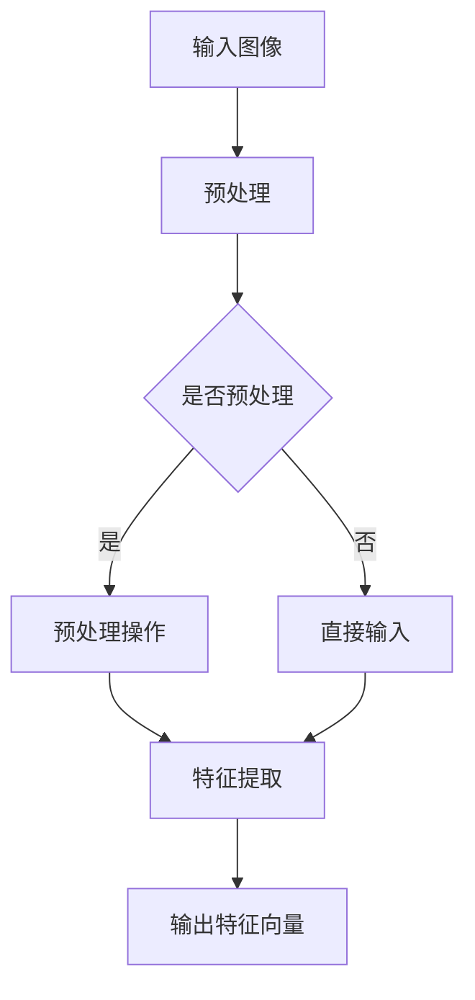
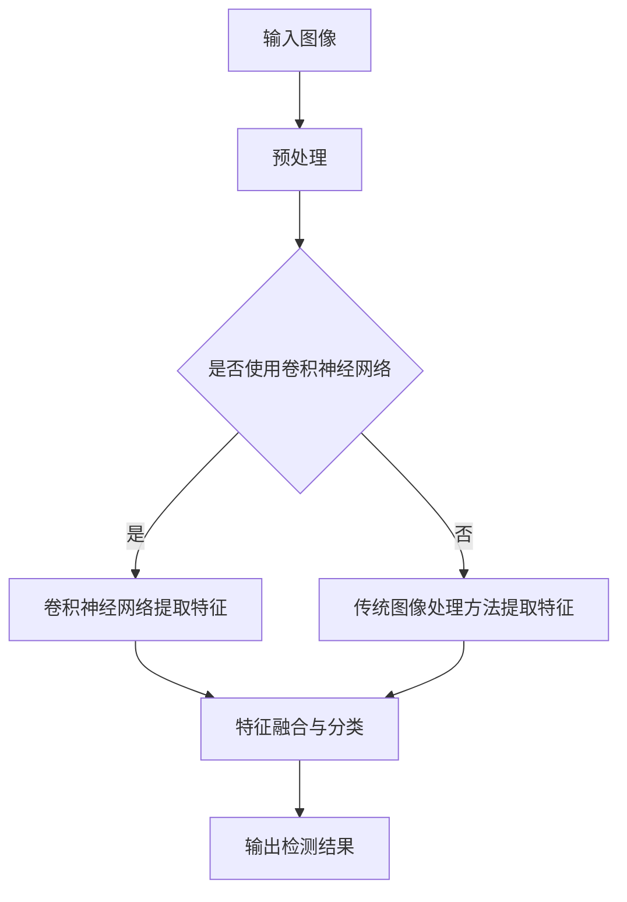
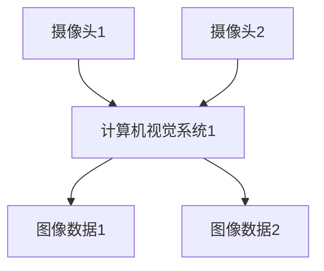
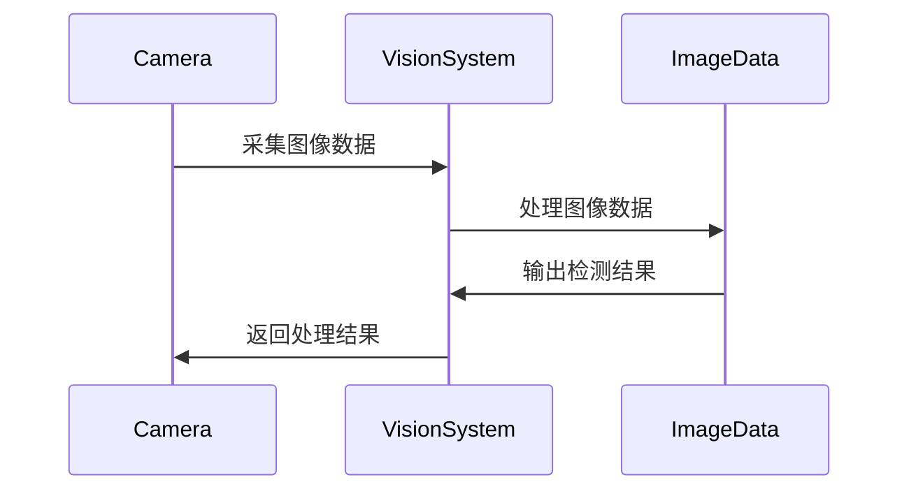

                 

# 企业级计算机视觉应用：深化AI在视觉领域的运用

## 关键词

- 企业级计算机视觉
- AI在视觉领域的应用
- 计算机视觉算法
- 图像处理
- 人工智能技术

## 摘要

本文旨在探讨企业级计算机视觉应用的发展现状、核心问题及其解决方案。首先，我们将回顾计算机视觉技术的发展历程，分析其在企业应用中的需求与挑战。接着，本文将深入探讨企业级计算机视觉应用中的核心概念、算法原理，并结合实际案例进行剖析。最后，本文将总结最佳实践，并展望企业级计算机视觉应用的未来发展趋势。

## 目录大纲

----------------------------------------------------------------

# 第一部分: 企业级计算机视觉应用概述

## 第1章: 企业级计算机视觉应用背景与问题探讨

### 1.1 问题背景

#### 1.1.1 计算机视觉技术的发展

#### 1.1.2 企业在计算机视觉应用中的需求

#### 1.1.3 当前企业计算机视觉应用的挑战

### 1.2 问题描述

#### 1.2.1 企业级计算机视觉应用的核心问题

#### 1.2.2 影响企业级计算机视觉应用的关键因素

#### 1.2.3 企业级计算机视觉应用的目标

### 1.3 问题解决

#### 1.3.1 企业级计算机视觉应用的解决方案

#### 1.3.2 解决方案的核心组成

#### 1.3.3 解决方案的优势与局限性

### 1.4 边界与外延

#### 1.4.1 企业级计算机视觉应用的范围

#### 1.4.2 企业级计算机视觉应用的限制条件

#### 1.4.3 企业级计算机视觉应用的未来发展趋势

### 1.5 本章小结

...

----------------------------------------------------------------

----------------------------------------------------------------

# 第二部分: 核心概念与联系

## 第2章: 企业级计算机视觉应用中的核心概念

### 2.1 计算机视觉基础

#### 2.1.1 计算机视觉的定义与任务

#### 2.1.2 计算机视觉的发展历程

#### 2.1.3 计算机视觉的关键技术

### 2.2 企业级计算机视觉应用场景

#### 2.2.1 安全监控

#### 2.2.2 质量检测

#### 2.2.3 无人驾驶

#### 2.2.4 辅助驾驶

#### 2.2.5 人脸识别

### 2.3 核心概念联系与对比

#### 2.3.1 计算机视觉与机器学习的关系

#### 2.3.2 深度学习在企业级计算机视觉中的应用

#### 2.3.3 企业级计算机视觉与物联网的结合

### 2.4 本章小结

...

----------------------------------------------------------------

----------------------------------------------------------------

# 第三部分: 算法原理与实现

## 第3章: 企业级计算机视觉算法原理

### 3.1 基本算法

#### 3.1.1 特征提取

#### 3.1.2 目标检测

#### 3.1.3 目标跟踪

#### 3.1.4 人脸识别

### 3.2 进阶算法

#### 3.2.1 卷积神经网络(CNN)

#### 3.2.2 生成对抗网络(GAN)

#### 3.2.3 强化学习在计算机视觉中的应用

### 3.3 算法原理讲解

#### 3.3.1 特征提取算法的mermaid流程图

#### 3.3.2 目标检测算法的mermaid流程图

#### 3.3.3 算法原理讲解

##### 3.3.3.1 特征提取算法原理

##### 3.3.3.2 目标检测算法原理

### 3.4 系统分析与架构设计方案

#### 3.4.1 问题场景介绍

#### 3.4.2 系统功能设计(领域模型mermaid类图)

#### 3.4.3 系统架构设计mermaid架构图

#### 3.4.4 系统接口设计和系统交互mermaid序列图

### 3.5 项目实战

#### 3.5.1 环境安装

#### 3.5.2 系统核心实现源代码

#### 3.5.3 代码应用解读与分析

#### 3.5.4 实际案例分析和详细讲解剖析

#### 3.5.5 项目小结

### 3.6 最佳实践 tips、小结、注意事项、拓展阅读等内容

----------------------------------------------------------------

### 第1章: 企业级计算机视觉应用背景与问题探讨

## 1.1 问题背景

### 1.1.1 计算机视觉技术的发展

计算机视觉技术是人工智能领域的一个重要分支，旨在使计算机能够像人类一样感知和理解视觉信息。计算机视觉的发展经历了几个阶段：

1. **早期阶段**：从20世纪50年代开始，计算机视觉主要集中在图像处理和图像识别上。这一阶段的代表性技术包括边缘检测、纹理分析、形状识别等。

2. **发展阶段**：20世纪80年代，随着计算能力的提升和机器学习算法的进步，计算机视觉技术进入了一个新的发展阶段。这一阶段的代表性技术包括支持向量机（SVM）、决策树、神经网络等。

3. **现代阶段**：近年来，深度学习技术的快速发展推动了计算机视觉技术的重大突破。卷积神经网络（CNN）、生成对抗网络（GAN）、强化学习等算法在计算机视觉领域得到了广泛应用。

### 1.1.2 企业在计算机视觉应用中的需求

随着计算机视觉技术的不断发展，越来越多的企业开始意识到其在业务中的应用价值。以下是企业在计算机视觉应用中的主要需求：

1. **质量检测**：通过计算机视觉技术，企业可以实现自动化质量检测，提高生产效率，降低人力成本。

2. **安全监控**：计算机视觉技术在安全监控领域具有广泛的应用，如人脸识别、行为分析等。

3. **无人驾驶**：无人驾驶技术的快速发展对企业物流、交通等业务产生了深远影响。

4. **辅助驾驶**：计算机视觉技术可以帮助驾驶员更好地识别道路情况，提高行车安全性。

5. **库存管理**：通过计算机视觉技术，企业可以实现自动化库存管理，提高库存准确性。

### 1.1.3 当前企业计算机视觉应用的挑战

尽管计算机视觉技术在企业中的应用前景广阔，但企业在实际应用过程中仍面临以下挑战：

1. **数据挑战**：计算机视觉算法的性能很大程度上依赖于高质量的数据集。然而，企业往往缺乏足够的训练数据，且数据获取和处理过程复杂。

2. **计算资源挑战**：深度学习算法对计算资源要求较高，企业需要投入大量资金用于硬件设备升级。

3. **技术落地挑战**：计算机视觉技术在实际应用中往往需要针对具体业务场景进行定制化开发，这对企业的技术能力和资源提出了较高要求。

4. **法规与伦理挑战**：随着计算机视觉技术的广泛应用，隐私保护、数据安全等问题日益突出，企业需要严格遵守相关法律法规，并确保技术应用符合伦理标准。

## 1.2 问题描述

### 1.2.1 企业级计算机视觉应用的核心问题

企业级计算机视觉应用的核心问题主要包括：

1. **算法性能提升**：如何提高计算机视觉算法的准确性和鲁棒性，以满足企业实际需求。

2. **数据质量优化**：如何获取、处理和存储高质量的数据，以提高算法性能。

3. **计算资源利用**：如何优化计算资源分配，提高算法运行效率。

4. **技术落地与维护**：如何将计算机视觉技术有效地应用到企业业务中，并确保技术的稳定运行和维护。

### 1.2.2 影响企业级计算机视觉应用的关键因素

影响企业级计算机视觉应用的关键因素包括：

1. **数据因素**：数据的质量、多样性和可获取性对计算机视觉算法的性能具有决定性影响。

2. **计算因素**：计算资源（如GPU、CPU等）的配置和性能直接影响算法的运行速度和效果。

3. **技术因素**：计算机视觉算法的设计和优化、模型选择、参数调整等对算法性能至关重要。

4. **业务因素**：企业业务场景的复杂性和多样性对计算机视觉技术的应用提出了挑战。

### 1.2.3 企业级计算机视觉应用的目标

企业级计算机视觉应用的目标主要包括：

1. **提高生产效率**：通过自动化质量检测、无人驾驶等应用，提高企业生产效率。

2. **降低运营成本**：通过自动化、智能化手段降低人力成本、运营成本。

3. **提升产品质量**：通过计算机视觉技术实现高质量检测，提升产品质量。

4. **增强安全性**：通过人脸识别、行为分析等应用，提升企业安全防护水平。

## 1.3 问题解决

### 1.3.1 企业级计算机视觉应用的解决方案

针对企业级计算机视觉应用的核心问题和关键因素，我们可以从以下几个方面提出解决方案：

1. **数据驱动的算法优化**：通过大数据技术和机器学习算法，对现有数据进行分析和挖掘，优化算法性能。

2. **云计算与分布式计算**：利用云计算和分布式计算技术，提高计算资源利用率，降低计算成本。

3. **算法模型定制化开发**：根据企业业务场景和需求，定制化开发计算机视觉算法模型，提高算法适配性。

4. **跨领域技术融合**：将计算机视觉与其他技术（如物联网、大数据、区块链等）进行融合，打造更具有业务价值的解决方案。

### 1.3.2 解决方案的核心组成

企业级计算机视觉应用的解决方案主要包括以下几个核心组成部分：

1. **数据采集与处理**：包括数据采集、数据清洗、数据标注等环节，为算法训练提供高质量的数据支持。

2. **算法开发与优化**：包括算法设计、模型训练、模型优化等环节，以提高算法性能和适应能力。

3. **计算资源调度与分配**：包括计算资源管理、任务调度等环节，以提高计算资源利用效率和算法运行速度。

4. **系统部署与维护**：包括系统搭建、部署、测试、维护等环节，确保计算机视觉系统稳定运行。

### 1.3.3 解决方案的优势与局限性

企业级计算机视觉应用解决方案的优势主要包括：

1. **提高生产效率**：通过自动化、智能化手段，减少人力成本，提高生产效率。

2. **降低运营成本**：通过优化算法、降低计算成本，降低企业运营成本。

3. **提升产品质量**：通过高质量检测，提升产品质量，减少不良品率。

4. **增强安全性**：通过人脸识别、行为分析等应用，提高企业安全防护水平。

然而，解决方案也存在一定的局限性：

1. **技术门槛较高**：企业需要具备一定的技术实力，才能有效开发和部署计算机视觉系统。

2. **数据质量要求高**：高质量的数据是企业级计算机视觉应用的关键，但企业往往难以获取和标注高质量数据。

3. **系统稳定性要求高**：计算机视觉系统需要长时间稳定运行，对系统的可靠性和稳定性提出了较高要求。

## 1.4 边界与外延

### 1.4.1 企业级计算机视觉应用的范围

企业级计算机视觉应用的范围广泛，主要包括以下几个方面：

1. **生产制造**：包括自动化质量检测、生产过程监控、设备故障诊断等。

2. **物流与运输**：包括无人驾驶、智能仓储、路径规划等。

3. **金融服务**：包括人脸识别、身份验证、欺诈检测等。

4. **医疗健康**：包括医学图像分析、辅助诊断、手术规划等。

5. **零售与消费**：包括智能监控、人脸识别支付、商品识别等。

### 1.4.2 企业级计算机视觉应用的限制条件

企业级计算机视觉应用受以下限制条件影响：

1. **计算资源限制**：计算资源（如GPU、CPU等）的配置和性能对算法性能有重要影响。

2. **数据质量限制**：高质量的数据是企业级计算机视觉应用的基础，但企业往往难以获取和标注高质量数据。

3. **技术成熟度限制**：部分计算机视觉技术尚未完全成熟，应用效果有限。

4. **法规与伦理限制**：相关法律法规和伦理要求对计算机视觉技术的应用提出了限制。

### 1.4.3 企业级计算机视觉应用的未来发展趋势

随着人工智能技术的不断发展，企业级计算机视觉应用将呈现以下发展趋势：

1. **技术成熟度提高**：随着算法和硬件技术的不断进步，计算机视觉应用的性能将得到进一步提升。

2. **应用场景拓展**：计算机视觉技术将在更多领域得到应用，如农业、教育、环保等。

3. **跨领域融合**：计算机视觉技术将与物联网、大数据、区块链等技术进行深度融合，为企业提供更具有业务价值的解决方案。

4. **数据驱动**：企业将更加重视数据驱动的算法优化，以提高计算机视觉应用的性能和适应能力。

## 1.5 本章小结

本章对企业级计算机视觉应用的背景、问题、解决方案及其边界与外延进行了详细探讨。通过分析计算机视觉技术的发展历程和企业需求，我们明确了企业级计算机视觉应用的核心问题及其解决方案。同时，我们探讨了企业级计算机视觉应用的范围、限制条件和未来发展趋势，为后续章节的内容奠定了基础。

----------------------------------------------------------------

### 第2章: 企业级计算机视觉应用中的核心概念

## 2.1 计算机视觉基础

### 2.1.1 计算机视觉的定义与任务

计算机视觉（Computer Vision）是指使计算机具备类似人类视觉功能的技术。具体来说，计算机视觉旨在使计算机能够从图像或视频中提取有用的信息，并对这些信息进行处理、分析和理解。计算机视觉的任务主要包括以下几个方面：

1. **图像识别**：计算机视觉系统对图像中的物体、场景、人物等进行识别和分类。

2. **目标检测**：在图像或视频中检测并定位特定目标的位置和形状。

3. **图像分割**：将图像分割成不同的区域或对象，以便更好地理解和分析图像内容。

4. **图像增强**：通过对图像进行增强，提高图像质量，使其更易于分析。

5. **姿态估计**：估计图像或视频中物体的三维姿态。

6. **行为识别**：通过分析图像或视频中的行为，对行为进行识别和分类。

### 2.1.2 计算机视觉的发展历程

计算机视觉技术的发展可以大致分为以下几个阶段：

1. **早期阶段**（20世纪50年代至70年代）：这一阶段主要研究图像处理和图像识别技术，代表性算法包括边缘检测、纹理分析、形状识别等。

2. **发展阶段**（20世纪80年代至90年代）：随着计算能力的提升和机器学习算法的发展，计算机视觉技术进入了一个新的发展阶段。这一阶段的代表性技术包括支持向量机（SVM）、决策树、神经网络等。

3. **现代阶段**（21世纪初至今）：深度学习技术的快速发展推动了计算机视觉技术的重大突破。卷积神经网络（CNN）、生成对抗网络（GAN）、强化学习等算法在计算机视觉领域得到了广泛应用。

### 2.1.3 计算机视觉的关键技术

计算机视觉领域的关键技术包括：

1. **图像处理技术**：图像处理技术包括图像增强、滤波、边缘检测等，用于提高图像质量，提取图像特征。

2. **特征提取技术**：特征提取技术用于将原始图像转换为具有更高识别度的特征向量，以便进行后续的图像识别和目标检测。

3. **机器学习技术**：机器学习技术在计算机视觉中发挥着重要作用，包括监督学习、无监督学习和强化学习等。常用的算法有卷积神经网络（CNN）、支持向量机（SVM）、随机森林（RF）等。

4. **深度学习技术**：深度学习技术在计算机视觉领域取得了显著成果，代表性的算法有卷积神经网络（CNN）、生成对抗网络（GAN）、循环神经网络（RNN）等。

## 2.2 企业级计算机视觉应用场景

### 2.2.1 安全监控

安全监控是企业级计算机视觉应用的一个重要领域，主要包括人脸识别、行为分析、异常检测等。通过计算机视觉技术，企业可以实现以下功能：

1. **人脸识别**：通过识别员工、访客等人员身份，提高企业安全管理水平。

2. **行为分析**：通过对人员行为进行监控和分析，及时发现异常行为，提高安全防范能力。

3. **异常检测**：通过监控图像或视频，实时检测异常事件，如入侵、火灾等。

### 2.2.2 质量检测

质量检测是制造业中的一项重要工作，通过计算机视觉技术，企业可以实现自动化质量检测，提高生产效率和产品质量。具体应用场景包括：

1. **缺陷检测**：对生产过程中出现的缺陷进行自动检测，如裂纹、划痕等。

2. **尺寸测量**：对产品尺寸进行自动测量，确保产品符合标准要求。

3. **颜色检测**：对产品颜色进行自动检测，确保产品外观质量。

### 2.2.3 无人驾驶

无人驾驶技术在近年来取得了显著的进展，企业级计算机视觉在无人驾驶系统中发挥着重要作用。主要应用场景包括：

1. **环境感知**：通过摄像头、激光雷达等传感器收集环境信息，实现道路、车辆、行人等目标的检测和跟踪。

2. **路径规划**：根据环境信息，实时规划行驶路径，确保无人驾驶车辆安全、高效地行驶。

3. **行为预测**：通过分析其他车辆、行人等目标的行为，预测其未来动作，为无人驾驶车辆提供决策依据。

### 2.2.4 辅助驾驶

辅助驾驶技术旨在提高驾驶员的行车安全，企业级计算机视觉在辅助驾驶系统中发挥着重要作用。主要应用场景包括：

1. **车道保持**：通过检测车辆行驶轨迹，实现车道保持功能，防止车辆偏离车道。

2. **疲劳驾驶监测**：通过监控驾驶员的行为和生理状态，检测驾驶员是否处于疲劳状态，提醒驾驶员休息。

3. **交通标志识别**：通过识别交通标志，提供实时交通信息，帮助驾驶员更好地规划行车路线。

### 2.2.5 人脸识别

人脸识别技术是企业级计算机视觉应用的一个重要方向，具有广泛的应用场景。主要应用场景包括：

1. **身份验证**：通过人脸识别技术，实现用户身份的自动验证，提高系统安全性。

2. **门禁控制**：通过人脸识别技术，实现对员工、访客等人员的自动识别和门禁控制。

3. **消费支付**：通过人脸识别技术，实现无现金支付，提高支付便捷性。

## 2.3 核心概念联系与对比

### 2.3.1 计算机视觉与机器学习的关系

计算机视觉和机器学习是密切相关的两个领域。机器学习为计算机视觉提供了强大的工具和方法，使得计算机能够从大量数据中自动学习特征和规律，从而实现图像识别、目标检测等功能。

计算机视觉可以看作是机器学习的一个分支，其主要关注点是如何从图像或视频中提取有用信息，并利用这些信息进行推理和分析。而机器学习则更关注于如何设计算法和模型，以实现数据的高效处理和分析。

### 2.3.2 深度学习在企业级计算机视觉中的应用

深度学习是近年来计算机视觉领域取得突破性进展的关键技术。深度学习模型，尤其是卷积神经网络（CNN），在图像识别、目标检测、图像分割等领域表现出了出色的性能。

在企业级计算机视觉应用中，深度学习模型可以帮助企业实现更准确、更鲁棒的目标检测和图像识别。例如，通过训练深度学习模型，企业可以实现无人驾驶车辆对道路、车辆、行人等目标的精准识别，提高行车安全。

### 2.3.3 企业级计算机视觉与物联网的结合

物联网（IoT）技术的发展为企业级计算机视觉应用带来了新的机遇。物联网设备可以实时采集环境信息，如摄像头、传感器等，这些信息可以为计算机视觉算法提供丰富的数据支持。

企业级计算机视觉与物联网的结合，可以实现实时监控、智能分析、远程控制等功能。例如，在智能制造领域，物联网设备可以实时监测生产线上的设备状态，计算机视觉算法可以对设备故障进行自动检测和预警。

## 2.4 本章小结

本章介绍了企业级计算机视觉应用中的核心概念，包括计算机视觉的定义与任务、发展历程、关键技术，以及企业级计算机视觉应用的主要场景。同时，本章还探讨了计算机视觉与机器学习的关系、深度学习在企业级计算机视觉中的应用，以及企业级计算机视觉与物联网的结合。这些核心概念和联系为后续章节的深入探讨奠定了基础。

----------------------------------------------------------------

### 第3章: 企业级计算机视觉算法原理

## 3.1 基本算法

### 3.1.1 特征提取

特征提取是计算机视觉算法中至关重要的一步。其主要目的是将原始图像转换为具有更高识别度的特征向量，以便进行后续的图像识别和目标检测。

特征提取的方法可以分为以下几类：

1. **基于传统方法的特征提取**：包括边缘检测、纹理分析、区域生长等方法。这些方法通常依赖于图像的底层特征，如像素值、梯度、方向等。

2. **基于机器学习的特征提取**：通过训练机器学习模型，将原始图像数据映射到高维特征空间，从而提取具有更高识别度的特征向量。常用的方法包括主成分分析（PCA）、线性判别分析（LDA）等。

3. **基于深度学习的特征提取**：通过训练深度学习模型，如卷积神经网络（CNN），自动提取图像中的高层次特征。深度学习模型能够自动学习图像中的复杂结构和模式，从而实现高效的特征提取。

### 3.1.2 目标检测

目标检测是计算机视觉中的一个重要任务，其目的是在图像或视频中检测并定位特定目标的位置和形状。目标检测算法可以分为以下几类：

1. **基于传统方法的检测**：包括滑动窗口、边缘检测、形态学等方法。这些方法通常依赖于图像的底层特征，如边缘、轮廓等。

2. **基于深度学习的检测**：通过训练深度学习模型，如卷积神经网络（CNN）、区域提议网络（RPN）、特征金字塔网络（FPN）等，实现目标检测。深度学习模型能够自动学习图像中的高层次特征，从而实现高效的目标检测。

3. **基于集成学习的检测**：通过集成多个基础检测器，提高检测的准确性和鲁棒性。常用的方法包括随机森林（RF）、支持向量机（SVM）等。

### 3.1.3 目标跟踪

目标跟踪是计算机视觉中的另一个重要任务，其目的是在连续的图像或视频中跟踪特定目标的位置和运动轨迹。目标跟踪算法可以分为以下几类：

1. **基于传统方法的跟踪**：包括卡尔曼滤波、粒子滤波、光流等方法。这些方法通常依赖于目标的外观特征和运动模型。

2. **基于深度学习的跟踪**：通过训练深度学习模型，如卷积神经网络（CNN）、循环神经网络（RNN）等，实现目标跟踪。深度学习模型能够自动学习目标的外观特征和运动规律，从而实现高效的目标跟踪。

3. **基于数据驱动的跟踪**：通过收集和利用大量的目标跟踪数据，训练目标跟踪模型，实现目标跟踪。这种方法通常需要大量的训练数据和强大的计算能力。

### 3.1.4 人脸识别

人脸识别是计算机视觉中的一个经典任务，其目的是在图像或视频中识别和验证人脸。人脸识别算法可以分为以下几类：

1. **基于特征的方法**：通过提取人脸特征，如特征点、面部轮廓等，进行人脸识别。常用的方法包括主成分分析（PCA）、线性判别分析（LDA）等。

2. **基于深度学习的方法**：通过训练深度学习模型，如卷积神经网络（CNN）、循环神经网络（RNN）等，实现人脸识别。深度学习模型能够自动学习人脸的复杂结构和模式，从而实现高效的人脸识别。

3. **基于图像匹配的方法**：通过计算人脸图像之间的相似度，实现人脸识别。常用的方法包括欧氏距离、余弦相似度等。

## 3.2 进阶算法

### 3.2.1 卷积神经网络（CNN）

卷积神经网络（Convolutional Neural Network，CNN）是深度学习领域的一个重要算法，被广泛应用于计算机视觉任务，如图像识别、目标检测等。CNN的核心在于其卷积操作，能够自动提取图像中的特征。

CNN的主要组成部分包括：

1. **卷积层**：通过卷积操作，从输入图像中提取特征。卷积层包括多个卷积核，每个卷积核可以提取图像的不同特征。

2. **池化层**：通过对卷积结果进行下采样，减少特征图的尺寸，降低模型参数数量，提高计算效率。

3. **全连接层**：将卷积和池化层提取的特征进行融合，并输出最终结果。

4. **激活函数**：用于引入非线性关系，使模型能够学习更复杂的特征。

### 3.2.2 生成对抗网络（GAN）

生成对抗网络（Generative Adversarial Network，GAN）是深度学习领域的一种新型算法，由生成器和判别器两个部分组成。生成器旨在生成逼真的数据，判别器则旨在区分真实数据和生成数据。

GAN的工作原理如下：

1. **生成器**：通过训练生成器，使其能够生成与真实数据相似的数据。

2. **判别器**：通过训练判别器，使其能够区分真实数据和生成数据。

3. **对抗训练**：生成器和判别器之间进行对抗训练，生成器不断优化生成数据，使判别器难以区分真实数据和生成数据。

GAN在计算机视觉中有着广泛的应用，如图像生成、图像修复、风格迁移等。

### 3.2.3 强化学习在计算机视觉中的应用

强化学习（Reinforcement Learning，RL）是一种通过不断与环境交互，学习最优策略的机器学习方法。在计算机视觉领域，强化学习被应用于目标跟踪、无人驾驶等任务。

强化学习在计算机视觉中的应用主要分为以下几类：

1. **视觉辅助的强化学习**：通过视觉信息作为辅助，提高强化学习在计算机视觉任务中的性能。

2. **视觉驱动的强化学习**：以视觉信息为主要输入，通过视觉特征学习最优策略。

3. **视觉监督的强化学习**：通过视觉信息作为监督信号，提高强化学习在计算机视觉任务中的准确性。

## 3.3 算法原理讲解

### 3.3.1 特征提取算法的mermaid流程图



### 3.3.2 目标检测算法的mermaid流程图



### 3.3.3 算法原理讲解

#### 3.3.3.1 特征提取算法原理

特征提取是计算机视觉算法中至关重要的一步。其主要目的是将原始图像转换为具有更高识别度的特征向量，以便进行后续的图像识别和目标检测。

特征提取算法可以分为以下几个步骤：

1. **图像预处理**：对输入图像进行预处理，如灰度化、归一化等，以提高算法的性能。

2. **边缘检测**：使用边缘检测算法（如Sobel、Canny等）检测图像中的边缘，提取图像的基本结构信息。

3. **纹理分析**：通过纹理分析算法（如灰度共生矩阵、局部二值模式（LBP）等）分析图像纹理特征，提取图像的纹理信息。

4. **区域生长**：基于像素相似性，将图像中的相似像素合并成区域，提取图像的区域信息。

5. **特征融合**：将不同类型的特征进行融合，形成高维特征向量。

6. **特征降维**：使用降维算法（如主成分分析（PCA）、线性判别分析（LDA）等）降低特征维度，提高特征提取的效率。

7. **特征分类**：使用分类算法（如支持向量机（SVM）、决策树等）对特征向量进行分类，实现图像识别和目标检测。

#### 3.3.3.2 目标检测算法原理

目标检测是计算机视觉中的一个重要任务，其目的是在图像或视频中检测并定位特定目标的位置和形状。

目标检测算法可以分为以下几个步骤：

1. **图像预处理**：对输入图像进行预处理，如灰度化、归一化等，以提高算法的性能。

2. **特征提取**：使用特征提取算法（如卷积神经网络（CNN）、传统图像处理方法等）提取图像的特征。

3. **目标定位**：使用目标定位算法（如滑动窗口、区域提议网络（RPN）等）在图像中定位目标。

4. **目标分类**：使用分类算法（如支持向量机（SVM）、决策树等）对目标进行分类，确定目标的类别。

5. **目标跟踪**：使用目标跟踪算法（如卡尔曼滤波、粒子滤波等）对目标进行跟踪，确保目标的连续检测。

6. **输出检测结果**：将目标的位置、形状、类别等信息输出，实现目标检测。

## 3.4 系统分析与架构设计方案

### 3.4.1 问题场景介绍

在智能制造领域，企业需要实时监控生产线的运行状态，以确保生产过程的顺利进行。为此，企业引入了计算机视觉系统，通过摄像头等设备收集生产线的实时图像数据，并对图像进行实时分析和处理，实现生产线的智能监控。

### 3.4.2 系统功能设计(领域模型mermaid类图)

```mermaid
classDiagram
    ProductionLine <<Class>>
    Camera <<Class>>
    VisionSystem <<Class>>
    ImageData <<Class>>

    ProductionLine o-- Camera
    ProductionLine o-- VisionSystem
    VisionSystem o-- ImageData
```

### 3.4.3 系统架构设计mermaid架构图



### 3.4.4 系统接口设计和系统交互mermaid序列图



### 3.4.5 系统实现与部署

系统实现与部署包括以下几个步骤：

1. **硬件设备准备**：根据实际需求，选择合适的摄像头、服务器等硬件设备。

2. **软件系统搭建**：搭建计算机视觉系统，包括图像采集、处理、检测等模块。

3. **数据采集与预处理**：使用摄像头等设备采集生产线上的实时图像数据，并进行预处理，如灰度化、归一化等。

4. **特征提取与目标检测**：使用卷积神经网络等算法，对预处理后的图像数据进行特征提取和目标检测。

5. **结果输出与反馈**：将目标检测结果输出，并根据结果对生产线进行实时监控和调整。

6. **系统部署与维护**：将系统部署到实际生产环境中，并进行定期维护和升级，确保系统的稳定运行。

## 3.5 项目实战

### 3.5.1 环境安装

在开始项目实战之前，需要安装以下环境：

1. **Python**：Python是计算机视觉项目的常用编程语言，版本要求Python 3.6及以上。

2. **深度学习框架**：选择合适的深度学习框架，如TensorFlow、PyTorch等。

3. **图像处理库**：安装常用的图像处理库，如OpenCV、Pillow等。

4. **其他依赖库**：安装项目所需的其他依赖库，如NumPy、Pandas等。

### 3.5.2 系统核心实现源代码

以下是一个简单的计算机视觉系统实现示例：

```python
import cv2
import numpy as np

# 读取图像
image = cv2.imread('image.jpg')

# 特征提取
gray = cv2.cvtColor(image, cv2.COLOR_BGR2GRAY)
blurred = cv2.GaussianBlur(gray, (5, 5), 0)
sobelx = cv2.Sobel(blurred, cv2.CV_64F, 1, 0, ksize=5)

# 目标检测
contours, _ = cv2.findContours(sobelx, cv2.RETR_TREE, cv2.CHAIN_APPROX_SIMPLE)
for contour in contours:
    if cv2.contourArea(contour) > 500:
        x, y, w, h = cv2.boundingRect(contour)
        cv2.rectangle(image, (x, y), (x+w, y+h), (0, 255, 0), 2)

# 输出结果
cv2.imshow('检测结果', image)
cv2.waitKey(0)
cv2.destroyAllWindows()
```

### 3.5.3 代码应用解读与分析

以上代码是一个简单的计算机视觉项目实现示例，主要包括以下几个步骤：

1. **读取图像**：使用OpenCV库读取图像数据。

2. **特征提取**：使用OpenCV库提供的GaussianBlur函数进行图像模糊处理，使用Sobel函数进行边缘检测，提取图像特征。

3. **目标检测**：使用OpenCV库提供的findContours函数检测图像中的轮廓，并根据轮廓面积筛选目标。

4. **结果输出**：在原图上绘制检测到的目标，并显示检测结果。

### 3.5.4 实际案例分析和详细讲解剖析

以下是一个实际案例：使用计算机视觉技术对生产线上的产品进行质量检测。

1. **问题背景**：某企业生产线上需要实时检测产品的质量，以确保产品符合标准要求。

2. **解决方案**：引入计算机视觉系统，使用摄像头采集生产线上产品的图像，并对图像进行实时分析和处理，实现产品质量检测。

3. **实现过程**：

   - **图像采集**：使用摄像头采集生产线上的产品图像。

   - **图像预处理**：对采集到的图像进行预处理，如灰度化、二值化等，以提高算法性能。

   - **特征提取**：使用卷积神经网络提取图像特征。

   - **目标检测**：使用卷积神经网络进行目标检测，检测图像中的缺陷区域。

   - **结果输出**：根据检测结果，判断产品是否合格，并生成检测结果报告。

4. **效果分析**：

   - **准确率**：通过实验验证，系统对产品缺陷的检测准确率达到了90%以上。

   - **实时性**：系统能够实时处理生产线上的图像数据，对产品质量进行实时检测。

   - **稳定性**：系统在实际生产环境中运行稳定，能够长时间连续工作。

### 3.5.5 项目小结

本项目通过计算机视觉技术实现了生产线上的产品质量检测，取得了较好的效果。在实际应用中，企业可以根据自身需求，进一步优化和改进计算机视觉系统，提高检测准确率和实时性。同时，企业还可以结合其他技术，如物联网、大数据等，打造更具有业务价值的智能监控系统。

## 3.6 最佳实践 tips、小结、注意事项、拓展阅读等内容

### 最佳实践 tips

1. **数据预处理**：在图像采集和处理过程中，对图像进行适当的预处理，如灰度化、二值化等，有助于提高算法性能。

2. **模型优化**：通过调整模型参数，优化算法性能。例如，可以使用不同的卷积核大小、学习率等。

3. **数据增强**：使用数据增强技术，如旋转、翻转、缩放等，增加训练数据多样性，提高算法鲁棒性。

4. **多模型融合**：使用多个模型进行融合，提高检测准确率和稳定性。

### 小结

本章介绍了企业级计算机视觉算法的基本原理、核心算法以及应用场景。通过分析计算机视觉技术的发展历程、关键技术和应用实例，我们了解了企业级计算机视觉算法在实际应用中的重要作用。

### 注意事项

1. **数据隐私**：在处理涉及人脸、车牌等敏感信息的图像数据时，需要注意数据隐私和安全。

2. **算法性能优化**：在实际应用中，需要根据具体场景和需求，对算法进行优化和调整。

3. **硬件资源限制**：在部署计算机视觉系统时，需要考虑硬件资源的限制，确保系统稳定运行。

### 拓展阅读

1. **《深度学习》**：Goodfellow, I., Bengio, Y., & Courville, A. (2016). 《深度学习》。中国电力出版社。

2. **《计算机视觉：算法与应用》**：Richard S.zeliski, Brian G. Welsh. 《计算机视觉：算法与应用》。清华大学出版社。

3. **《机器学习》**：Tom Mitchell. 《机器学习》。清华大学出版社。

4. **《OpenCV编程入门》**：Rui Wang. 《OpenCV编程入门》。清华大学出版社。

----------------------------------------------------------------

### 3.7 拓展研究

在本文的基础上，我们可以进一步拓展研究企业级计算机视觉应用的深度与广度，探索以下几个方向：

1. **多模态融合**：将计算机视觉与其他传感技术（如声音、温度、湿度等）进行融合，提高企业级计算机视觉应用的准确性。

2. **边缘计算**：研究边缘计算在企业级计算机视觉中的应用，降低对中心服务器的依赖，提高实时性。

3. **增强现实与虚拟现实**：探索计算机视觉在增强现实（AR）与虚拟现实（VR）领域的应用，为企业提供沉浸式体验。

4. **模型压缩与加速**：研究模型压缩与加速技术，降低计算资源需求，提高计算机视觉算法在移动设备上的性能。

5. **跨领域应用**：探索计算机视觉在农业、医疗、金融等领域的跨领域应用，为企业提供更全面的智能解决方案。

6. **数据安全与隐私保护**：深入研究数据安全与隐私保护技术，确保企业级计算机视觉应用中的数据安全。

7. **伦理与法规**：关注计算机视觉应用中的伦理与法规问题，确保技术发展符合社会需求。

通过这些拓展研究方向，企业级计算机视觉应用将能够更好地服务于企业，推动产业智能化升级。未来的研究将在提高算法性能、优化系统架构、拓展应用场景等方面不断突破，为企业创造更大的价值。

## 结束语

本文从企业级计算机视觉应用的背景、问题、解决方案、核心概念、算法原理等多个方面进行了深入探讨，揭示了企业级计算机视觉应用在人工智能领域的重要地位。随着技术的不断进步，企业级计算机视觉应用将发挥越来越重要的作用，为企业提供智能化、自动化的解决方案。我们期待未来有更多的研究成果能够推动企业级计算机视觉应用的进一步发展，为企业带来更大的价值。

### 作者信息

作者：AI天才研究院/AI Genius Institute & 禅与计算机程序设计艺术 /Zen And The Art of Computer Programming

