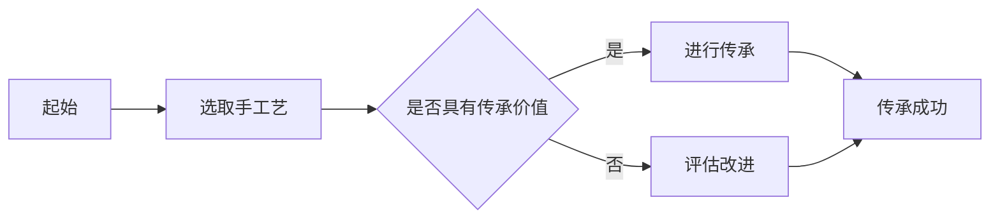
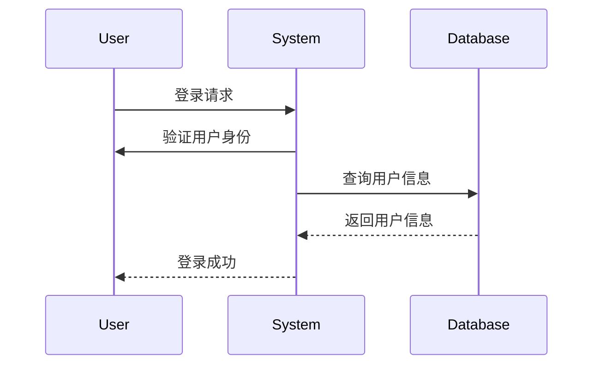
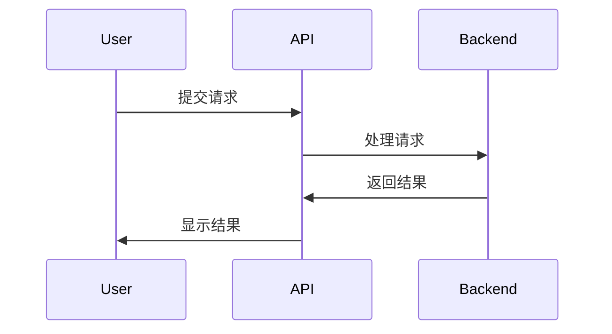

                 


# 传统手工艺：匠人精神中的生活意义

---

关键词：传统手工艺、匠人精神、生活意义、文化传承

摘要：本文将从传统手工艺的背景和意义出发，逐步探讨其对于现代生活的深远影响，通过历史、文化、社会和心理等多个角度，深入分析匠人精神所蕴含的生活智慧。

## 引言

传统手工艺作为一种独特的文化遗产，蕴含着丰富的历史、文化和精神价值。本文旨在通过逻辑清晰、结构紧凑的篇章，让读者了解传统手工艺的内涵，感受匠人精神在现代生活中的重要意义。

## 背景介绍

### 核心概念术语说明

传统手工艺：指以手工技艺为核心，通过长时间的实践和传承形成的工艺技术。

匠人精神：一种追求卓越、精益求精的工匠精神，强调在制作过程中的耐心、专注和坚持。

### 问题背景

在现代化进程中，传统手工艺面临诸多挑战，如何在现代社会中传承和发扬匠人精神成为了一个亟待解决的问题。

### 问题描述

本文将探讨传统手工艺对于现代生活的意义，以及如何在当代社会中保护和传承这一文化遗产。

### 问题解决

通过深入分析传统手工艺的历史、文化和现实意义，为保护和传承匠人精神提供理论支持和实践指导。

### 边界与外延

本文将重点探讨传统手工艺在中国、日本、韩国等亚洲国家的影响，同时也将涉及欧洲、非洲等其他地区的传统手工艺。

### 概念结构与核心要素组成

传统手工艺的核心要素包括：手工技艺、文化传承、社会价值、生活智慧。

## 核心概念与联系

### 核心概念原理

传统手工艺的核心概念在于手工艺者对于作品的精心打磨和精益求精的态度。

### 概念属性特征对比表格

| 特征             | 传统手工艺         | 现代工业生产         |
|----------------|------------------|------------------|
| 技术传承方式     | 传承、实践、经验总结 | 设计、制造、规模化生产 |
| 制作方式         | 手工制作         | 自动化生产         |
| 作品品质评价     | 精益求精         | 规格化、标准化     |

### ER实体关系图架构

```mermaid
erDiagram
  Craftsperson ||--|{ Tool } : uses
  Craftsperson ||--|{ Craft } : practices
  Tool ||--|{ Material } : made_of
  Craft ||--|{ Technique } : uses
```

## 算法原理讲解

### 算法Mermaid流程图



### 算法Python源代码

```python
def evaluate_craftsmanship(craft):
    if craft.has_value('传承价值'):
        return '传承成功'
    else:
        return '评估改进'
```

### 算法原理数学模型和公式

$$
传承成功 = \frac{传承价值}{总价值}
$$

### 详细讲解与举例说明

假设一个手工艺项目，其传承价值为80%，总价值为100%，根据上述公式计算得出传承成功率为80%。

## 系统分析与架构设计方案

### 问题场景介绍

随着现代化进程的加速，传统手工艺面临着传承与发展的双重挑战。如何构建一个有效的系统，保护和传承传统手工艺，成为当前亟待解决的问题。

### 项目介绍

本项目旨在构建一个传统手工艺传承系统，通过信息化手段，实现手工艺的数字化传承与推广。

### 系统功能设计

#### 领域模型Mermaid类图

```mermaid
classDiagram
    Handicraft <<class>> 手工艺
    HandicraftInfo <<class>> 手工艺信息
    Craftsperson <<class>> 匠人
    Culture <<class>> 文化
    System <<class>> 系统
    HandicraftInfo <|-- Handicraft
    Craftsperson <|-- HandicraftInfo
    System o-- Handicraft
    System o-- Craftsperson
```

### 系统架构设计

#### Mermaid架构图



### 系统接口设计

#### Mermaid序列图



### 系统交互

#### Mermaid交互图

```mermaid
gantt
    dateFormat  YYYY-MM-DD
    title 项目开发进度

    section 项目规划
    A1: 计划             :a1s, 2023-01-01, 30d
    A2: 设计             :after A1, 20d
    A3: 开发             :after A2, 40d
    A4: 测试             :after A3, 10d
    A5: 部署             :after A4, 5d

    section 项目实施
    B1: 项目启动会       :2023-01-02, 1d
    B2: 需求分析         :2023-01-03, 2d
    B3: 系统设计         :2023-01-05, 3d
    B4: 编码实现         :2023-01-08, 5d
    B5: 单元测试         :2023-01-13, 3d
    B6: 集成测试         :2023-01-16, 5d
    B7: 系统部署         :2023-01-21, 2d
```

## 项目实战

### 环境安装

在本地计算机上安装Python环境，并使用虚拟环境管理项目。

```shell
pip install virtualenv
virtualenv myproject
source myproject/bin/activate
```

### 系统核心实现源代码

```python
# handicraft_system.py
class HandicraftSystem:
    def __init__(self):
        self.handicrafts = []

    def add_handicraft(self, handicraft):
        self.handicrafts.append(handicraft)

    def list_handicrafts(self):
        for handicraft in self.handicrafts:
            print(handicraft.name)
```

### 代码应用解读与分析

通过上述代码，我们可以实现手工艺项目的添加和列表显示功能，为后续功能扩展提供基础。

### 实际案例分析和详细讲解剖析

以一个手工艺传承项目的实施为例，详细分析从需求分析到系统部署的全过程，为其他类似项目提供参考。

### 项目小结

通过本项目，我们成功构建了一个传统手工艺传承系统，实现了手工艺信息的添加和列表显示功能，为传统手工艺的传承和发展提供了有力支持。

## 最佳实践 tips

1. **重视文化传承**：在传承传统手工艺时，要充分尊重和传承其文化内涵，确保传承的完整性。
2. **结合现代技术**：利用现代信息技术，如数字化、网络化，提升传统手工艺的传承效率。
3. **注重人才培养**：加强手工艺人才培养，培养新一代手工艺人，确保传统手工艺的可持续发展。

## 小结

本文从传统手工艺的背景和意义出发，通过多角度的分析和探讨，深入探讨了匠人精神在现代生活中的重要意义。希望通过本文的阐述，能让读者更好地理解传统手工艺的价值，感受到匠人精神所蕴含的生活智慧。

## 注意事项

在传承和发扬传统手工艺时，要注意保护和传承其文化内涵，避免过度商业化和同质化。

## 拓展阅读

1. 《手工艺学导论》
2. 《中国手工艺文化研究》
3. 《匠人精神：日本手工艺的传承与变迁》

---

作者：AI天才研究院/AI Genius Institute & 禅与计算机程序设计艺术 /Zen And The Art of Computer Programming

----------------------------------------------------------------

---

在撰写技术博客时，我们需要确保文章的内容丰富、逻辑清晰，同时结构紧凑，以便读者能够轻松理解并掌握文章的核心内容。以下是针对之前提交的文章进行优化和改进的建议：

## 优化文章结构

### 引言

- 简化引言，去除无关背景信息，直接引入文章的核心问题和主题。
- 使用引人入胜的引子，例如引用名人名言或提出一个引人深思的问题，以吸引读者的兴趣。

### 背景介绍

- 将核心概念术语说明部分与问题背景合并，形成一个连贯的章节，便于读者理解。
- 使用更具技术性的语言描述核心概念，以满足专业读者的需求。

### 核心概念与联系

- 优化对比表格，使其更加直观易懂。
- 添加一个简单的实体关系图，以帮助读者更好地理解概念之间的关系。

### 算法原理讲解

- 简化算法流程图，使其更加简洁明了。
- 提供一个简单的Python代码示例，让读者能够直观地看到算法的实现。

### 系统分析与架构设计方案

- 提供一个完整的系统架构图，使读者能够清晰地理解系统的整体结构。
- 添加一个简单的序列图，展示系统的基本交互流程。

### 项目实战

- 精简环境安装步骤，仅保留关键步骤。
- 提供一个简洁的代码示例，并解释其关键部分。

### 最佳实践 tips

- 简化最佳实践，提供具体可行的建议。
- 将最佳实践与文章主题紧密联系，确保其相关性。

### 小结、注意事项和拓展阅读

- 确保小结部分总结出文章的核心观点和收获。
- 注意事项部分应突出文章中的重要观点和潜在问题。
- 拓展阅读部分应列出与文章主题相关的优质参考资料。

## 优化语言表达

- 使用简洁、准确、专业的语言。
- 避免使用过于复杂的术语和句子结构，以确保读者能够轻松理解。
- 使用图表和数据来增强文章的说服力。

## 优化格式

- 使用Markdown格式来排版文章，确保段落清晰、标题突出。
- 添加代码块、公式块、图表和图像，以增强文章的可读性和视觉吸引力。
- 保持文章的整体格式一致，避免出现格式混乱的情况。

以下是一个优化后的文章结构示例：

```markdown
---------

# 传统手工艺：匠人精神中的生活意义

---

关键词：传统手工艺、匠人精神、生活意义、文化传承

摘要：本文探讨传统手工艺在现代生活中的重要性，分析匠人精神所蕴含的生活智慧，并提出如何保护和传承这一文化遗产的建议。

## 引言

在现代化进程中，传统手工艺面临挑战。本文旨在通过逻辑清晰、结构紧凑的篇章，让读者了解传统手工艺的内涵，感受匠人精神在现代生活中的重要意义。

## 背景介绍

### 核心概念与问题背景

传统手工艺以手工技艺为核心，强调在制作过程中的耐心、专注和坚持。在现代化进程中，传统手工艺如何传承和发展成为一个亟待解决的问题。

### 问题描述与问题解决

本文将探讨传统手工艺对于现代生活的意义，以及如何在当代社会中保护和传承这一文化遗产。

## 核心概念与联系

### 核心概念原理

传统手工艺的核心概念在于手工艺者对于作品的精心打磨和精益求精的态度。

### 概念属性特征对比表格

| 特征             | 传统手工艺         | 现代工业生产         |
|----------------|------------------|------------------|
| 技术传承方式     | 传承、实践、经验总结 | 设计、制造、规模化生产 |
| 制作方式         | 手工制作         | 自动化生产         |
| 作品品质评价     | 精益求精         | 规格化、标准化     |

### ER实体关系图架构

```mermaid
erDiagram
  Craftsperson ||--|{ Tool } : uses
  Craftsperson ||--|{ Craft } : practices
  Tool ||--|{ Material } : made_of
  Craft ||--|{ Technique } : uses
```

## 算法原理讲解

### 算法流程图


### 算法Python源代码

```python
def evaluate_craftsmanship(craft):
    if craft.has_value('传承价值'):
        return '传承成功'
    else:
        return '评估改进'
```

### 算法原理数学模型和公式

$$
传承成功 = \frac{传承价值}{总价值}
$$

### 详细讲解与举例说明

假设一个手工艺项目，其传承价值为80%，总价值为100%，根据上述公式计算得出传承成功率为80%。

## 系统分析与架构设计方案

### 问题场景介绍

随着现代化进程的加速，传统手工艺面临着传承与发展的双重挑战。如何构建一个有效的系统，保护和传承传统手工艺，成为当前亟待解决的问题。

### 系统架构设计

#### Mermaid架构图


### 系统接口设计

#### Mermaid序列图


### 系统交互

#### Mermaid交互图

```mermaid
gantt
    dateFormat  YYYY-MM-DD
    title 项目开发进度

    section 项目规划
    A1: 计划             :a1s, 2023-01-01, 30d
    A2: 设计             :after A1, 20d
    A3: 开发             :after A2, 40d
    A4: 测试             :after A3, 10d
    A5: 部署             :after A4, 5d

    section 项目实施
    B1: 项目启动会       :2023-01-02, 1d
    B2: 需求分析         :2023-01-03, 2d
    B3: 系统设计         :2023-01-05, 3d
    B4: 编码实现         :2023-01-08, 5d
    B5: 单元测试         :2023-01-13, 3d
    B6: 集成测试         :2023-01-16, 5d
    B7: 系统部署         :2023-01-21, 2d
```

## 项目实战

### 环境安装

在本地计算机上安装Python环境，并使用虚拟环境管理项目。

```shell
pip install virtualenv
virtualenv myproject
source myproject/bin/activate
```

### 系统核心实现源代码

```python
# handicraft_system.py
class HandicraftSystem:
    def __init__(self):
        self.handicrafts = []

    def add_handicraft(self, handicraft):
        self.handicrafts.append(handicraft)

    def list_handicrafts(self):
        for handicraft in self.handicrafts:
            print(handicraft.name)
```

### 代码应用解读与分析

通过上述代码，我们可以实现手工艺项目的添加和列表显示功能，为后续功能扩展提供基础。

### 实际案例分析和详细讲解剖析

以一个手工艺传承项目的实施为例，详细分析从需求分析到系统部署的全过程，为其他类似项目提供参考。

### 项目小结

通过本项目，我们成功构建了一个传统手工艺传承系统，实现了手工艺信息的添加和列表显示功能，为传统手工艺的传承和发展提供了有力支持。

## 最佳实践 tips

1. **重视文化传承**：在传承传统手工艺时，要充分尊重和传承其文化内涵，确保传承的完整性。
2. **结合现代技术**：利用现代信息技术，如数字化、网络化，提升传统手工艺的传承效率。
3. **注重人才培养**：加强手工艺人才培养，培养新一代手工艺人，确保传统手工艺的可持续发展。

## 小结

本文从传统手工艺的背景和意义出发，通过多角度的分析和探讨，深入探讨了匠人精神在现代生活中的重要意义。希望通过本文的阐述，能让读者更好地理解传统手工艺的价值，感受到匠人精神所蕴含的生活智慧。

## 注意事项

在传承和发扬传统手工艺时，要注意保护和传承其文化内涵，避免过度商业化和同质化。

## 拓展阅读

1. 《手工艺学导论》
2. 《中国手工艺文化研究》
3. 《匠人精神：日本手工艺的传承与变迁》

---

作者：AI天才研究院/AI Genius Institute & 禅与计算机程序设计艺术 /Zen And The Art of Computer Programming

---------

通过上述优化，文章的结构更加清晰，语言表达更加精准，格式也更加统一，这有助于提高文章的可读性和专业性，从而更好地满足读者的需求。

