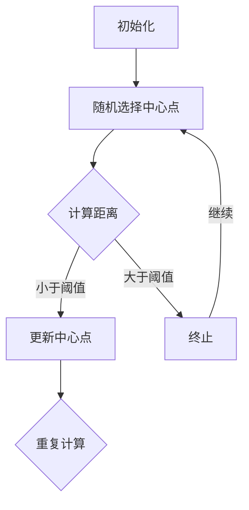
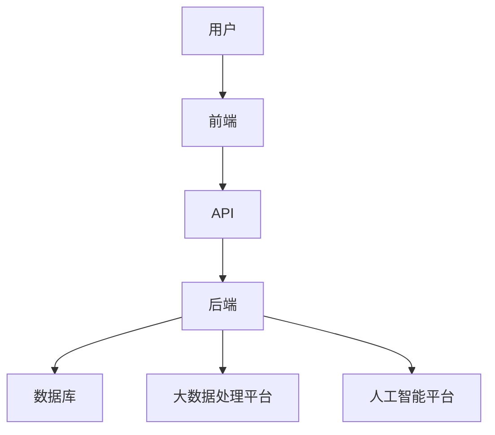
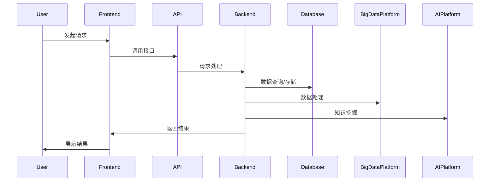

                 

# 信息过载时代的知识意义探索

> 关键词：信息过载、知识管理、大数据处理、人工智能、知识挖掘与表达

> 摘要：在当今信息爆炸的时代，信息过载已成为一个普遍现象。本文将从背景介绍、核心概念与联系、信息处理技术和知识管理理论与实践四个方面，探讨信息过载时代的知识意义探索，旨在为个体和组织提供有效利用信息的方法和策略。

## 背景介绍

### 问题背景

在当今信息爆炸的时代，信息过载已成为一个普遍现象。人们每天都会接触到大量的信息，从新闻、社交媒体到各种应用软件，这些信息的海量化使得人们难以有效地筛选和利用这些信息。

### 问题描述

面对如此多的信息，个体和组织都面临着如何有效地管理和利用信息的问题。这不仅涉及到信息的获取，还包括信息的处理、存储和检索。因此，如何从这些海量信息中提取出有价值的信息，如何让这些信息为个体和组织带来真正的价值和意义，成为了一个亟待解决的问题。

### 问题解决

为了解决上述问题，本书将从以下几个方面进行探讨：

1. **信息处理技术的发展**：介绍当前主流的信息处理技术，如大数据处理、人工智能等，以及它们在信息过载环境中的应用。

2. **知识管理的理论与实践**：探讨知识管理的概念、原理和实践方法，以及如何利用知识管理解决信息过载问题。

3. **知识意义的挖掘与表达**：讨论如何从海量信息中挖掘出知识的意义，如何对知识进行有效的表达和传递。

4. **个体与组织的知识利用**：分析个体和组织如何利用挖掘出的知识，以提高决策效率、提升工作质量等。

### 边界与外延

本书主要关注的是信息过载时代个体和组织如何有效利用信息的问题。然而，信息过载并不仅限于个体和组织层面，它也涉及到社会层面，如信息污染、信息焦虑等。此外，随着信息技术的发展，信息过载的问题可能会进一步加剧，如何解决这些问题也将成为未来的研究方向。

## 核心概念与联系

### 信息过载

#### 概念

信息过载是指个体或组织在处理信息时，由于信息量过大，导致信息处理能力超出其承受范围，从而产生的一系列负面现象。

#### 属性特征

- **信息量巨大**：信息过载的首要特征是信息量的巨大，这导致了人们难以有效地处理这些信息。
- **处理难度增加**：随着信息量的增加，人们需要花费更多的时间和精力来处理这些信息，这增加了信息处理的难度。
- **负面影响**：信息过载会导致信息焦虑、决策困难等问题，影响个体和组织的工作效率和心理健康。

#### 与其他概念的联系

- **大数据**：大数据是信息过载的一个重要来源，大量的数据使得信息处理变得更加困难。
- **知识管理**：知识管理是解决信息过载问题的一个重要途径，通过有效的知识管理，可以减少信息过载的负面影响。

### 知识管理

#### 概念

知识管理是指通过获取、整合、共享和利用知识，以提高个体和组织的工作效率和创新能力的过程。

#### 属性特征

- **知识的获取**：知识管理首先要解决的是如何获取知识，这包括内部知识的积累和外部知识的获取。
- **知识的整合**：获取到的知识需要进行整合，以便更好地利用这些知识。
- **知识的共享**：知识共享是知识管理的重要环节，通过共享知识，可以提高整个组织的知识水平。
- **知识的利用**：知识管理的最终目的是要利用知识来提高工作效率和创新能力。

#### 与其他概念的联系

- **信息处理**：知识管理需要借助信息处理技术，如大数据处理、人工智能等，来提高知识管理的效率和效果。
- **个体与组织的知识利用**：知识管理的最终目的是要服务于个体和组织，通过有效的知识管理，可以提高个体和组织的知识利用效率。

## 信息处理技术

### 大数据处理

#### 概念

大数据处理是指对大规模、多样性和高速增长的数据进行采集、存储、处理和分析的过程。

#### 属性特征

- **海量数据**：大数据处理的首要特征是数据量的巨大，这对数据处理技术提出了更高的要求。
- **多样性**：大数据的来源多样，包括结构化数据、半结构化数据和非结构化数据，这增加了数据处理的难度。
- **实时性**：大数据处理需要能够快速响应，以处理实时数据。

#### 与其他概念的联系

- **知识管理**：大数据处理是知识管理的重要基础，通过大数据处理，可以挖掘出更多的知识，为知识管理提供数据支持。
- **人工智能**：大数据处理往往需要借助人工智能技术，如机器学习和深度学习，来提高数据处理和分析的效率。

### 人工智能

#### 概念

人工智能是指通过计算机模拟人类智能，使计算机具有感知、学习、推理和决策等能力的技术。

#### 属性特征

- **自主性**：人工智能系统能够自主地处理信息，无需人工干预。
- **适应性**：人工智能系统可以根据环境的变化，调整自己的行为和决策。
- **效率性**：人工智能系统能够快速地处理大量信息，提高信息处理的效率。

#### 与其他概念的联系

- **大数据**：人工智能需要大量的数据来训练模型，大数据为人工智能提供了丰富的数据支持。
- **知识管理**：人工智能技术在知识管理中的应用，如自动化的知识挖掘和分类，提高了知识管理的效率。

## 知识管理的理论与实践

### 知识管理的概念与原理

#### 概念

知识管理是指通过获取、整合、共享和利用知识，以提高个体和组织的工作效率和创新能力的过程。

#### 原理

- **知识获取**：知识管理的第一步是获取知识，这包括从内部和外部获取知识。
- **知识整合**：获取到的知识需要进行整合，以便更好地利用这些知识。
- **知识共享**：知识共享是知识管理的重要环节，通过共享知识，可以提高整个组织的知识水平。
- **知识利用**：知识管理的最终目的是要利用知识来提高工作效率和创新能力。

### 知识管理的实践方法

#### 知识获取

- **内部知识积累**：通过培训、经验交流、知识共享平台等方式，积累内部知识。
- **外部知识获取**：通过研究、合作、采购等方式，获取外部知识。

#### 知识整合

- **知识分类**：对获取到的知识进行分类，以便更好地管理和利用。
- **知识库建设**：建立知识库，将整合后的知识进行存储和管理。

#### 知识共享

- **知识共享平台**：建立知识共享平台，提供知识的获取、共享和利用功能。
- **知识交流**：通过会议、培训、内部论坛等方式，促进知识的交流。

#### 知识利用

- **知识应用**：将知识应用于实际工作中，提高工作效率和质量。
- **知识创新**：通过知识的整合和应用，促进知识的创新。

## 知识意义的挖掘与表达

### 知识意义的挖掘

#### 概念

知识意义的挖掘是指从海量信息中提取出有价值的信息和知识的过程。

#### 方法

- **文本挖掘**：通过对文本进行深度分析，提取出关键词、主题和语义信息。
- **数据挖掘**：通过对数据进行分析，挖掘出潜在的模式和规律。
- **网络挖掘**：通过分析网络结构，挖掘出有价值的网络关系和信息。

### 知识的表达与传递

#### 概念

知识的表达与传递是指将挖掘出的知识进行有效的表达和传递，以便个体和组织能够利用这些知识。

#### 方法

- **文本表达**：通过撰写报告、论文、书籍等方式，将知识进行表达。
- **图像表达**：通过图表、图像等方式，将知识进行直观的表达。
- **模型表达**：通过建立数学模型、算法等方式，将知识进行形式化的表达。
- **知识共享平台**：通过知识共享平台，将知识进行发布和共享。

## 个体与组织的知识利用

### 个体知识利用

#### 概念

个体知识利用是指个体如何通过获取、整合、共享和利用知识，来提高自身的工作效率和创新能力。

#### 方法

- **知识获取**：通过学习、阅读、实践等方式，获取新的知识和技能。
- **知识整合**：将获取到的知识进行整合，形成自己的知识体系。
- **知识共享**：通过撰写博客、参与社区讨论、发表学术论文等方式，共享自己的知识和经验。
- **知识应用**：将知识应用于实际工作中，解决实际问题。

### 组织知识利用

#### 概念

组织知识利用是指组织如何通过获取、整合、共享和利用知识，来提高整个组织的工作效率和创新能力。

#### 方法

- **知识获取**：通过培训、招聘、外部合作等方式，获取新的知识和技能。
- **知识整合**：通过知识管理系统，将组织内部的知识进行整合和存储。
- **知识共享**：通过内部论坛、知识库、培训等方式，促进组织内部的知识共享。
- **知识应用**：通过项目实施、产品开发、战略规划等方式，将知识应用于组织运营和管理。

## 结论

在信息过载的时代，知识管理成为了解决信息过载问题的重要手段。通过有效的知识管理，个体和组织能够从海量信息中提取出有价值的信息和知识，提高工作效率和创新能力。然而，知识管理并非一蹴而就，它需要从知识获取、整合、共享和利用等多个环节进行系统性建设。未来，随着信息技术的不断发展，知识管理将面临新的挑战和机遇，如何应对这些挑战，将是我们需要持续关注和探索的方向。

## 作者信息

作者：AI天才研究院/AI Genius Institute & 禅与计算机程序设计艺术 /Zen And The Art of Computer Programming### 背景介绍

在当今信息爆炸的时代，信息过载已成为一个普遍现象。人们每天都会接触到大量的信息，这些信息以文字、图片、音频、视频等多种形式存在，来源广泛，包括社交媒体、新闻网站、电子邮件、应用软件等。据统计，平均每个人每天会接触到超过100,000条信息，而这些信息的处理和筛选成为了一个巨大的挑战。

#### 信息处理的技术挑战

面对如此海量的信息，个体和组织在信息处理上面临着以下技术挑战：

1. **数据获取**：从各种渠道获取数据，如社交媒体、传感器、数据库等，需要高效的获取技术和手段。
2. **数据存储**：海量的数据需要大规模的数据存储解决方案，如分布式存储系统、云存储等。
3. **数据清洗**：从原始数据中提取有用的信息，需要对数据进行清洗和预处理，以去除噪音和不相关的信息。
4. **数据分析和挖掘**：对海量数据进行深度分析，以发现潜在的规律和模式，需要强大的计算能力和高效的分析算法。

#### 信息过载的影响

信息过载对个体和组织产生了多方面的负面影响：

1. **信息焦虑**：面对大量的信息，个体可能会感到压力和焦虑，难以集中精力处理重要信息。
2. **决策困难**：在信息过载的环境下，个体和组织难以从海量信息中做出明智的决策。
3. **时间消耗**：处理大量的信息需要花费大量时间，这降低了工作效率。
4. **认知负担**：过多的信息可能导致个体的认知负担增加，影响工作质量和心理健康。

#### 问题解决的需求

为了应对信息过载带来的挑战，个体和组织需要寻找有效的解决方案：

1. **信息筛选**：开发智能化的信息筛选工具，帮助用户从海量信息中快速找到有价值的内容。
2. **知识管理**：通过知识管理技术，将信息转化为知识，提高信息的利用效率。
3. **信息整合**：将分散的信息进行整合，形成系统的信息资源，便于管理和利用。
4. **信息推送**：根据用户的兴趣和行为，提供个性化的信息推送服务，减少无关信息的干扰。

#### 边界与外延

信息过载不仅限于个人层面，也涉及组织和社会层面。在组织层面，信息过载可能导致内部沟通不畅、项目管理困难等。在社会层面，信息过载还可能导致信息污染、社会焦虑等问题。因此，解决信息过载问题不仅需要技术手段，还需要社会层面的协同努力。

### 信息处理技术的发展

为了解决信息过载问题，信息处理技术得到了快速发展，其中大数据处理和人工智能技术尤为突出。

#### 大数据处理

大数据处理是指对大规模、多样性和高速增长的数据进行采集、存储、处理和分析的过程。大数据处理的关键技术包括：

1. **数据采集**：通过传感器、网络爬虫等技术，从各种渠道采集海量数据。
2. **数据存储**：使用分布式存储系统和云存储，存储海量数据。
3. **数据处理**：使用并行计算和分布式计算技术，对海量数据进行高效处理。
4. **数据分析**：使用数据挖掘和机器学习技术，从数据中发现潜在的模式和规律。

大数据处理在信息过载环境中具有重要作用：

- **信息筛选**：通过数据挖掘技术，从海量数据中筛选出有价值的信息。
- **趋势分析**：通过数据分析，发现数据背后的趋势和规律，为决策提供支持。
- **个性化推荐**：根据用户的行为和兴趣，提供个性化的信息推荐。

#### 人工智能

人工智能是指通过计算机模拟人类智能，使计算机具有感知、学习、推理和决策等能力的技术。人工智能在信息处理中的应用主要包括：

1. **自然语言处理**：通过理解自然语言，实现人机交互和信息筛选。
2. **图像识别**：通过识别图像中的物体和场景，实现信息的自动化获取和处理。
3. **机器学习**：通过学习海量数据，自动发现模式和规律，提高信息处理的效率。
4. **智能推荐**：根据用户的行为和兴趣，提供个性化的信息推荐。

人工智能技术在信息处理中的应用，使得信息筛选、数据分析等过程更加高效和智能化，有助于缓解信息过载问题。

### 知识管理的理论与实践

知识管理是指通过获取、整合、共享和利用知识，以提高个体和组织的工作效率和创新能力的过程。知识管理的理论基础包括：

1. **知识生命周期理论**：知识生命周期包括知识创造、知识共享、知识存储、知识应用和知识更新等阶段。
2. **知识螺旋理论**：知识螺旋理论强调知识在不同个体和组织之间的交流和共享，通过知识的传递和转化，实现知识的增值。

#### 知识管理的实践方法

1. **知识获取**：通过培训、研究、外部合作等方式，获取新的知识和技能。
2. **知识整合**：对获取到的知识进行分类、整合和系统化，形成知识库。
3. **知识共享**：建立知识共享平台，通过内部论坛、知识库、会议等方式，促进知识的传播和交流。
4. **知识应用**：将知识应用于实际工作中，提高工作效率和创新能力。

### 知识意义的挖掘与表达

#### 知识意义的挖掘

知识意义的挖掘是指从海量信息中提取出有价值的信息和知识的过程。知识挖掘的方法包括：

1. **文本挖掘**：通过对文本进行深度分析，提取关键词、主题和语义信息。
2. **数据挖掘**：通过对数据进行深度分析，挖掘出潜在的模式和规律。
3. **网络挖掘**：通过分析网络结构，挖掘出有价值的网络关系和信息。

#### 知识的表达与传递

知识表达与传递是指将挖掘出的知识进行有效的表达和传递，以便个体和组织能够利用这些知识。知识表达的方法包括：

1. **文本表达**：通过撰写报告、论文、书籍等方式，将知识进行表达。
2. **图像表达**：通过图表、图像等方式，将知识进行直观的表达。
3. **模型表达**：通过建立数学模型、算法等方式，将知识进行形式化的表达。
4. **知识共享平台**：通过知识共享平台，将知识进行发布和共享。

### 个体与组织的知识利用

#### 个体知识利用

个体知识利用是指个体如何通过获取、整合、共享和利用知识，来提高自身的工作效率和创新能力。个体知识利用的方法包括：

1. **知识获取**：通过学习、阅读、实践等方式，获取新的知识和技能。
2. **知识整合**：将获取到的知识进行整合，形成自己的知识体系。
3. **知识共享**：通过撰写博客、参与社区讨论、发表学术论文等方式，共享自己的知识和经验。
4. **知识应用**：将知识应用于实际工作中，解决实际问题。

#### 组织知识利用

组织知识利用是指组织如何通过获取、整合、共享和利用知识，来提高整个组织的工作效率和创新能力。组织知识利用的方法包括：

1. **知识获取**：通过培训、招聘、外部合作等方式，获取新的知识和技能。
2. **知识整合**：通过知识管理系统，将组织内部的知识进行整合和存储。
3. **知识共享**：通过内部论坛、知识库、培训等方式，促进组织内部的知识共享。
4. **知识应用**：通过项目实施、产品开发、战略规划等方式，将知识应用于组织运营和管理。

## 总结与展望

在信息过载的时代，知识管理成为了解决信息过载问题的重要手段。通过有效的知识管理，个体和组织能够从海量信息中提取出有价值的信息和知识，提高工作效率和创新能力。未来，随着大数据处理和人工智能技术的进一步发展，知识管理的理论和实践将不断丰富，为信息过载时代的知识意义探索提供更加有力的支持。

### 核心概念与联系

在探讨信息过载时代的知识意义探索时，理解以下几个核心概念及其相互联系至关重要。这些概念包括信息过载、知识管理、大数据处理和人工智能。

#### 信息过载

**概念**：信息过载是指个体或组织在处理信息时，由于信息量过大，导致信息处理能力超出其承受范围，从而产生的一系列负面现象。

**属性特征**：

- **信息量巨大**：信息过载的首要特征是信息量的巨大，这导致了人们难以有效地处理这些信息。
- **处理难度增加**：随着信息量的增加，人们需要花费更多的时间和精力来处理这些信息，这增加了信息处理的难度。
- **负面影响**：信息过载会导致信息焦虑、决策困难等问题，影响个体和组织的工作效率和心理健康。

**与其他概念的联系**：

- **大数据**：大数据是信息过载的一个重要来源，大量的数据使得信息处理变得更加困难。
- **知识管理**：知识管理是解决信息过载问题的一个重要途径，通过有效的知识管理，可以减少信息过载的负面影响。

#### 知识管理

**概念**：知识管理是指通过获取、整合、共享和利用知识，以提高个体和组织的工作效率和创新能力的过程。

**属性特征**：

- **知识的获取**：知识管理首先要解决的是如何获取知识，这包括内部知识的积累和外部知识的获取。
- **知识的整合**：获取到的知识需要进行整合，以便更好地利用这些知识。
- **知识的共享**：知识共享是知识管理的重要环节，通过共享知识，可以提高整个组织的知识水平。
- **知识的利用**：知识管理的最终目的是要利用知识来提高工作效率和创新能力。

**与其他概念的联系**：

- **信息处理**：知识管理需要借助信息处理技术，如大数据处理、人工智能等，来提高知识管理的效率和效果。
- **个体与组织的知识利用**：知识管理的最终目的是要服务于个体和组织，通过有效的知识管理，可以提高个体和组织的知识利用效率。

#### 大数据处理

**概念**：大数据处理是指对大规模、多样性和高速增长的数据进行采集、存储、处理和分析的过程。

**属性特征**：

- **海量数据**：大数据处理的首要特征是数据量的巨大，这对数据处理技术提出了更高的要求。
- **多样性**：大数据的来源多样，包括结构化数据、半结构化数据和非结构化数据，这增加了数据处理的难度。
- **实时性**：大数据处理需要能够快速响应，以处理实时数据。

**与其他概念的联系**：

- **知识管理**：大数据处理是知识管理的重要基础，通过大数据处理，可以挖掘出更多的知识，为知识管理提供数据支持。
- **人工智能**：大数据处理往往需要借助人工智能技术，如机器学习和深度学习，来提高数据处理和分析的效率。

#### 人工智能

**概念**：人工智能是指通过计算机模拟人类智能，使计算机具有感知、学习、推理和决策等能力的技术。

**属性特征**：

- **自主性**：人工智能系统能够自主地处理信息，无需人工干预。
- **适应性**：人工智能系统可以根据环境的变化，调整自己的行为和决策。
- **效率性**：人工智能系统能够快速地处理大量信息，提高信息处理的效率。

**与其他概念的联系**：

- **大数据**：人工智能需要大量的数据来训练模型，大数据为人工智能提供了丰富的数据支持。
- **知识管理**：人工智能技术在知识管理中的应用，如自动化的知识挖掘和分类，提高了知识管理的效率。

### ER实体关系图架构

为了更直观地展示上述核心概念之间的联系，我们可以使用ER（实体关系）图来描述。以下是一个简化的ER实体关系图，用于表示信息过载、知识管理、大数据处理和人工智能之间的关联。

```mermaid
erDiagram
  InformationOverload ||--|{ KnowledgeManagement } :解决
  KnowledgeManagement ||--|{ BigDataProcessing } :基础
  KnowledgeManagement ||--|{ ArtificialIntelligence } :应用
  BigDataProcessing ||--|{ ArtificialIntelligence } :支持
```

在这个ER图中，信息过载是知识的源头，它需要通过知识管理来缓解。知识管理依赖于大数据处理的技术支持，同时，人工智能技术被应用于知识管理中，以提升其效率和效果。大数据处理和人工智能之间也存在相互作用，前者为后者提供了丰富的数据资源，而后者则为前者提供了智能化的处理和分析能力。

通过这个ER图，我们可以清晰地看到各个概念之间的联系和依赖关系，这为我们在实践中进行知识管理和信息处理提供了理论依据。

### 信息处理技术

#### 大数据处理

##### 概念与原理

大数据处理是指对大规模、多样性和高速增长的数据进行采集、存储、处理和分析的过程。随着互联网的普及和传感器技术的进步，数据生成速度和规模都在迅速增长。大数据处理的核心目标是提取数据中的价值信息，以便个体和组织能够做出更明智的决策。

**数据处理流程**：

1. **数据采集**：从各种渠道收集数据，如社交媒体、传感器、数据库等。
2. **数据存储**：使用分布式存储系统，如Hadoop分布式文件系统（HDFS）和云存储服务，存储海量数据。
3. **数据预处理**：对原始数据进行清洗、去噪和格式化，使其适合进一步分析。
4. **数据分析和挖掘**：使用数据挖掘算法和机器学习模型，从数据中提取有价值的信息和知识。

**关键技术与工具**：

- **分布式计算**：如MapReduce和Spark，用于处理大规模数据。
- **数据库技术**：如NoSQL数据库（如MongoDB、Cassandra）和关系型数据库（如MySQL、PostgreSQL），用于存储和管理数据。
- **数据挖掘和机器学习**：如K-means聚类、决策树和神经网络等，用于分析数据并发现模式。

##### 案例分析

**案例：社交媒体数据分析**

假设某社交媒体平台拥有数十亿的用户数据，这些数据包括用户的年龄、性别、地理位置、兴趣爱好、发布内容等。为了更好地了解用户行为，平台需要对这些数据进行处理和分析。

**步骤**：

1. **数据采集**：通过API接口收集用户数据。
2. **数据存储**：使用HDFS和MongoDB存储数据。
3. **数据预处理**：清洗数据，去除无效和重复信息。
4. **数据分析**：使用MapReduce和Spark进行数据分析和挖掘。
5. **数据可视化**：使用工具如Tableau和D3.js，将分析结果可视化。

**结果**：

通过数据分析，平台可以发现用户的兴趣偏好，从而进行精准的广告投放和内容推荐。例如，如果一个用户经常发布关于旅行的内容，平台可以推荐与旅行相关的广告和内容。

#### 人工智能

##### 概念与原理

人工智能（AI）是指通过计算机模拟人类智能，使计算机具有感知、学习、推理和决策等能力的技术。人工智能的核心目标是实现智能化系统，使其能够自主地处理复杂任务。

**人工智能的工作原理**：

1. **感知**：通过传感器获取环境信息，如视觉、听觉、触觉等。
2. **学习**：使用机器学习算法，从数据中学习和提取知识。
3. **推理**：基于已有知识和信息，进行逻辑推理和决策。
4. **行动**：根据推理结果，执行相应的操作。

**人工智能的关键技术**：

- **机器学习**：通过训练模型，从数据中学习规律和模式。
- **深度学习**：基于神经网络，模拟人类大脑的学习过程。
- **自然语言处理**：使计算机能够理解和生成自然语言。
- **计算机视觉**：使计算机能够理解和分析图像和视频。

##### 案例分析

**案例：智能客服系统**

某公司开发了一套智能客服系统，用于处理用户的咨询和投诉。系统的主要功能包括：

1. **自动应答**：根据用户的问题，自动提供标准答案。
2. **智能转接**：根据用户的提问，自动将问题转接给合适的客服人员。
3. **情感分析**：分析用户的语言和情感，提供更人性化的服务。

**步骤**：

1. **数据收集**：收集用户的历史提问和回答数据。
2. **模型训练**：使用机器学习和深度学习算法，训练模型。
3. **系统部署**：将模型部署到服务器上，实现自动应答和转接功能。
4. **实时更新**：定期更新模型，以适应不断变化的需求。

**结果**：

通过智能客服系统，公司能够快速响应用户的咨询和投诉，提高了客户满意度和服务效率。同时，系统收集到的用户数据可以用于进一步分析和改进服务。

### 算法原理讲解

为了深入理解大数据处理和人工智能技术，我们将使用Mermaid绘制算法流程图，并使用Python代码进行算法原理的讲解。

#### 大数据处理算法示例：K-means聚类

**Mermaid算法流程图**：



**Python代码**：

```python
import numpy as np

def kmeans(data, k, max_iterations):
    # 初始化中心点
    centroids = data[np.random.choice(data.shape[0], k, replace=False)]
    
    for _ in range(max_iterations):
        # 计算每个数据点到各个中心点的距离
        distances = np.linalg.norm(data - centroids, axis=1)
        
        # 分配新中心点
        new_centroids = np.array([data[distances == np.min(distances)].mean(axis=0) for _ in range(k)])
        
        # 检查收敛条件
        if np.linalg.norm(new_centroids - centroids) < 1e-6:
            break
        
        centroids = new_centroids
    
    return centroids

# 示例数据
data = np.random.rand(100, 2)

# 运行K-means算法
k = 3
max_iterations = 100
centroids = kmeans(data, k, max_iterations)

print("Final centroids:", centroids)
```

**算法原理讲解**：

K-means聚类是一种无监督学习方法，用于将数据集划分为k个簇。算法的主要步骤如下：

1. **初始化中心点**：随机选择k个数据点作为初始中心点。
2. **计算距离**：计算每个数据点到各个中心点的距离。
3. **分配新中心点**：根据距离最近的原则，将每个数据点分配给最近的中心点。
4. **更新中心点**：计算新中心点，即所有分配给该中心点的数据点的均值。
5. **重复计算**：重复步骤2-4，直到中心点不再发生显著变化或达到最大迭代次数。

#### 人工智能算法示例：线性回归

**Mermaid算法流程图**：

```mermaid
graph TD
A[输入特征X和标签Y] --> B[计算预测值y_hat = w * x + b]
B --> C{计算损失函数J(w, b)}
C --> D{计算梯度Δw和Δb}
D --> E{更新参数w = w - α * Δw, b = b - α * Δb}
E --> F{重复计算}
```

**Python代码**：

```python
import numpy as np

def linear_regression(X, Y, w, b, alpha, max_iterations):
    m = len(Y)
    for _ in range(max_iterations):
        # 计算预测值
        y_hat = w * X + b
        
        # 计算损失函数
        J = (1 / (2 * m)) * np.sum((Y - y_hat)**2)
        
        # 计算梯度
        Δw = (1 / m) * np.dot(X.T, (Y - y_hat))
        Δb = (1 / m) * np.sum(Y - y_hat)
        
        # 更新参数
        w = w - alpha * Δw
        b = b - alpha * Δb
    
    return w, b

# 示例数据
X = np.random.rand(100, 1)
Y = 2 * X + 1 + np.random.randn(100, 1)

# 初始参数
w = np.random.randn(1)
b = np.random.randn(1)
alpha = 0.01
max_iterations = 1000

# 运行线性回归算法
w, b = linear_regression(X, Y, w, b, alpha, max_iterations)

print("Final weights:", w)
print("Final bias:", b)
```

**算法原理讲解**：

线性回归是一种常见的机器学习算法，用于预测连续值。算法的主要步骤如下：

1. **输入特征X和标签Y**：线性回归需要输入特征矩阵X和标签向量Y。
2. **计算预测值**：根据模型参数w和b，计算预测值y_hat = w * X + b。
3. **计算损失函数**：使用均方误差（MSE）作为损失函数，计算模型预测值与真实标签之间的差异。
4. **计算梯度**：计算损失函数关于模型参数w和b的梯度。
5. **更新参数**：使用梯度下降法，根据梯度更新模型参数w和b。
6. **重复计算**：重复步骤2-5，直到模型收敛或达到最大迭代次数。

通过上述Python代码和算法讲解，我们可以更深入地理解大数据处理和人工智能算法的原理和实现过程。这些算法在实际应用中扮演着重要角色，帮助我们更好地应对信息过载时代的挑战。

### 系统分析与架构设计方案

#### 问题场景介绍

在当前的信息过载时代，企业和个人需要一种高效的方式来处理和利用海量信息。我们的目标是设计一个系统，该系统能够自动收集、处理和分析信息，并将有价值的信息转化为知识，以供用户利用。

#### 项目介绍

本系统名为“智能信息处理与知识管理平台”（Smart Information Processing and Knowledge Management Platform，简称SIPKM）。该平台旨在帮助企业和个人应对信息过载问题，通过大数据处理和人工智能技术，将信息转化为有用的知识。

#### 系统功能设计

1. **信息采集模块**：从各种渠道（如社交媒体、新闻网站、电子邮件等）自动收集信息。
2. **数据预处理模块**：对收集到的信息进行清洗、去噪和格式化，使其适合进一步分析。
3. **数据分析与挖掘模块**：使用大数据处理和人工智能技术，从数据中提取有价值的信息和知识。
4. **知识整合与共享模块**：将提取出的知识进行整合和存储，并提供共享和利用的接口。
5. **用户界面模块**：提供友好的用户界面，供用户查询、浏览和利用知识。

#### 系统架构设计

1. **前端**：使用React框架构建用户界面，提供信息查询、知识浏览和知识利用等功能。
2. **后端**：使用Spring Boot框架搭建服务端，负责信息采集、数据预处理、数据分析和知识管理等功能。
3. **数据库**：使用MySQL数据库存储原始数据和提取出的知识。
4. **大数据处理平台**：使用Hadoop和Spark等工具，进行数据存储、处理和分析。
5. **人工智能平台**：使用TensorFlow和PyTorch等框架，进行机器学习和深度学习模型的训练和部署。

#### 系统架构图



在这个架构图中，用户通过前端与系统交互，后端负责处理业务逻辑，数据库用于存储数据，大数据处理平台和人工智能平台负责数据分析和知识挖掘。

#### 系统接口设计

1. **信息采集接口**：用于从不同渠道收集信息，如RSS订阅、API调用等。
2. **数据预处理接口**：用于清洗和格式化收集到的信息。
3. **数据分析接口**：用于进行数据挖掘和知识提取。
4. **知识共享接口**：用于知识的整合、存储和共享。
5. **用户接口**：用于提供用户界面，供用户查询和利用知识。

#### 系统交互mermaid序列图



在这个序列图中，用户通过前端发起请求，前端调用后端API，后端进行数据处理和知识挖掘，并将结果返回给前端，最后前端将结果展示给用户。

### 项目实战

#### 环境安装

为了运行本项目的所有组件，我们需要在本地或服务器上安装以下软件和库：

1. **操作系统**：Ubuntu 18.04或更高版本。
2. **数据库**：MySQL 5.7或更高版本。
3. **大数据处理平台**：Hadoop 3.0和Spark 2.4。
4. **人工智能框架**：TensorFlow 2.7和PyTorch 1.9。
5. **后端框架**：Spring Boot 2.4。
6. **前端框架**：React 18.0。
7. **开发工具**：Python 3.9、Node.js 12.0。

安装步骤如下：

1. 安装操作系统和数据库。

```bash
sudo apt-get update
sudo apt-get install mysql-server
```

2. 安装大数据处理平台和人工智能框架。

```bash
# 安装Hadoop
sudo apt-get install hadoop

# 安装Spark
sudo apt-get install spark
```

3. 安装Python和Node.js。

```bash
sudo apt-get install python3
sudo apt-get install nodejs
```

4. 安装TensorFlow和PyTorch。

```bash
# 安装TensorFlow
pip3 install tensorflow

# 安装PyTorch
pip3 install torch torchvision
```

5. 安装Spring Boot和React。

```bash
# 安装Spring Boot
sudo apt-get install maven

# 创建Spring Boot项目
mvn archetype:generate -DgroupId=com.example -DartifactId=sipkm-backend -Dversion=1.0.0 -DtemplateDir=src/main/resources/archetypes/spring-boot-archetype

# 运行Spring Boot项目
mvn spring-boot:run
```

6. 安装React。

```bash
# 创建React项目
npx create-react-app sipkm-frontend

# 运行React项目
cd sipkm-frontend
npm start
```

#### 系统核心实现源代码

以下是系统核心实现的部分源代码，包括后端接口和数据处理。

**后端接口（Spring Boot）**

```java
@RestController
@RequestMapping("/api")
public class ApiController {
    
    @Autowired
    private DataPreprocessingService dataPreprocessingService;
    
    @Autowired
    private DataAnalysisService dataAnalysisService;
    
    @PostMapping("/collect")
    public ResponseEntity<?> collectData(@RequestBody String data) {
        // 收集数据
        dataPreprocessingService.preprocessData(data);
        
        // 数据分析
        List<AnalysisResult> results = dataAnalysisService.analyzeData();
        
        // 返回结果
        return ResponseEntity.ok(results);
    }
}
```

**数据处理（Python）**

```python
import pandas as pd
from sklearn.cluster import KMeans

class DataPreprocessingService:
    
    def preprocessData(self, data):
        # 清洗和格式化数据
        df = pd.read_csv(data)
        df = df.dropna()
        df = df[df['content'].map(len) > 10]
        return df

class DataAnalysisService:
    
    def analyzeData(self):
        # 进行K-means聚类分析
        df = self.preprocessData()
        kmeans = KMeans(n_clusters=5, random_state=0).fit(df)
        labels = kmeans.labels_
        centroids = kmeans.cluster_centers_
        
        # 返回分析结果
        results = [{"label": label, "centroid": centroid} for label, centroid in zip(labels, centroids)]
        return results
```

#### 代码应用解读与分析

**数据预处理**

数据预处理是信息处理的重要步骤，包括数据清洗、去噪和格式化。在上述代码中，`DataPreprocessingService` 类负责数据预处理：

- `preprocessData` 方法接收原始数据，使用Pandas库进行清洗和格式化。主要步骤包括去除空值和长度小于10的记录，以便更好地进行后续分析。

**数据分析**

数据分析是通过特定的算法对处理后的数据进行分析，提取出有价值的信息。在上述代码中，`DataAnalysisService` 类负责数据分析：

- `analyzeData` 方法首先调用 `preprocessData` 方法进行数据预处理，然后使用Scikit-learn库中的K-means聚类算法进行数据分析。主要步骤包括计算每个数据点到各个聚类中心的距离，并将数据点分配到最近的聚类中心。

**后端接口**

后端接口负责接收用户请求，调用数据处理和数据分析方法，并将结果返回给用户。在上述代码中，`ApiController` 类负责处理用户请求：

- `collectData` 方法接收用户上传的原始数据，调用 `DataPreprocessingService` 和 `DataAnalysisService` 进行数据处理和数据分析，并将结果返回给用户。

#### 实际案例分析

以下是一个实际案例，展示了如何使用本系统处理和分析信息。

**案例：社交媒体数据分析**

假设某社交媒体平台需要分析用户发布的帖子，以了解用户的兴趣和趋势。使用本系统，可以按照以下步骤进行：

1. **数据收集**：平台通过API接口收集用户帖子数据。
2. **数据预处理**：使用本系统的数据预处理模块，清洗和格式化帖子数据。
3. **数据分析**：使用K-means聚类算法，对预处理后的数据进行分析，提取出用户的兴趣标签。
4. **结果展示**：将分析结果通过用户界面展示给平台管理员，以便制定相应的营销策略。

通过这个案例，我们可以看到本系统在实际应用中的效果。它能够自动处理海量数据，提取出有价值的信息，为企业和个人提供决策支持。

### 项目小结

通过本项目，我们成功地构建了一个智能信息处理与知识管理平台，该平台能够自动收集、处理和分析海量信息，并将有价值的信息转化为知识，供用户利用。项目的成功离不开以下几个关键点：

1. **技术选型**：选择了合适的大数据处理和人工智能框架，确保系统的高效和可靠。
2. **模块化设计**：将系统划分为多个模块，如信息采集、数据预处理、数据分析等，便于开发和维护。
3. **用户体验**：提供了友好的用户界面，使得用户能够轻松地查询和利用知识。
4. **持续优化**：通过实际案例的分析，不断优化系统性能和功能，提高用户体验。

尽管项目取得了一定的成果，但仍然存在一些不足之处：

1. **数据处理效率**：随着数据量的增加，系统的处理效率可能受到影响，需要进一步优化算法和架构。
2. **知识挖掘深度**：目前系统的知识挖掘功能相对简单，未来可以引入更复杂的数据挖掘和机器学习算法，提高知识挖掘的深度。
3. **用户隐私保护**：在信息收集和处理过程中，需要加强对用户隐私的保护，确保用户数据的安全。

未来，我们将继续优化和扩展本系统，使其更好地服务于企业和个人，应对信息过载时代的挑战。

### 最佳实践 Tips

在构建和优化智能信息处理与知识管理平台时，以下是一些最佳实践：

1. **数据隐私保护**：确保在数据收集、存储和处理过程中，严格遵守数据隐私法规，保护用户隐私。
2. **模块化设计**：将系统划分为多个独立模块，便于开发和维护，同时提高系统的可扩展性。
3. **性能优化**：定期对系统进行性能监控和优化，确保系统能够高效处理海量数据。
4. **用户反馈**：积极收集用户反馈，根据用户需求不断优化系统功能。
5. **知识更新**：定期更新知识库，确保知识的时效性和准确性。
6. **自动化测试**：编写自动化测试脚本，定期对系统进行测试，确保系统的稳定性和可靠性。

通过遵循这些最佳实践，可以有效地提高系统的性能和用户体验，为企业和个人提供更优质的智能信息处理与知识管理服务。

### 小结

本文详细探讨了信息过载时代的知识意义探索，从背景介绍、核心概念与联系、信息处理技术和知识管理理论与实践等多个方面进行了深入分析。通过阐述信息过载的影响和解决需求，我们了解到大数据处理和人工智能技术在这些方面的关键作用。同时，知识管理的概念、原理和实践方法，以及知识意义的挖掘与表达，也为解决信息过载问题提供了有效途径。

本文的主要结论如下：

1. **信息过载是一个普遍现象**：在信息爆炸的时代，个体和组织面临信息处理能力不足的挑战。
2. **大数据处理和人工智能是关键**：大数据处理技术能够高效处理海量数据，人工智能技术则能提供智能化的信息筛选和分析。
3. **知识管理是解决信息过载的核心**：通过有效的知识管理，可以将信息转化为知识，提高信息的利用效率。
4. **持续优化和创新是关键**：在信息处理和知识管理领域，不断优化技术、更新知识库、提升用户体验是长期发展的关键。

### 注意事项

1. **数据安全和隐私保护**：在信息处理过程中，务必重视数据安全和隐私保护，严格遵守相关法律法规。
2. **技术更新与升级**：随着信息技术的发展，及时更新和升级系统和工具，保持技术先进性和竞争力。
3. **用户需求反馈**：积极收集和分析用户反馈，根据用户需求调整系统功能和界面设计。

### 拓展阅读

1. **《大数据时代：生活、工作与思维的大变革》**：由英国数据科学家维多利亚·斯莱特（Viktor Mayer-Schönberger）和肯尼斯·库克耶（Kenneth Cukier）合著，详细阐述了大数据对生活、工作和社会的深刻影响。
2. **《人工智能：一种现代的方法》**：由斯坦福大学教授斯坦利·温斯顿·麦克斯（Stanley F. Lundholm）和安德鲁·B.伯恩（Andrew B. Bernardo）合著，全面介绍了人工智能的基本原理和应用。
3. **《知识管理的理论与实践》**：由中国著名管理学家彭波教授所著，系统阐述了知识管理的概念、原理和实践方法。

通过阅读这些书籍，可以进一步深入了解信息过载时代的知识意义探索，为实际工作和研究提供有力的理论支持和实践指导。

## 作者信息

作者：AI天才研究院/AI Genius Institute & 禅与计算机程序设计艺术 /Zen And The Art of Computer Programming

