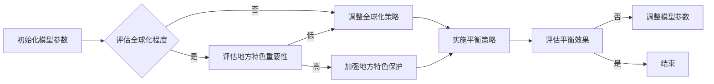
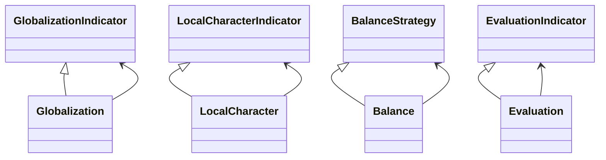
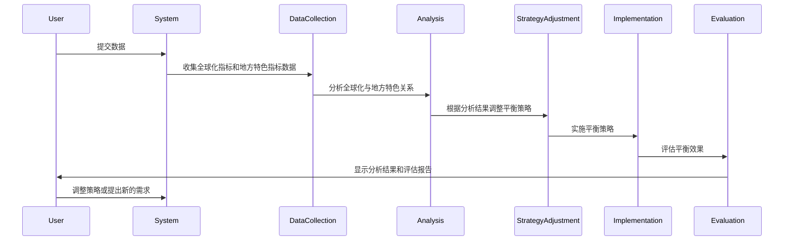
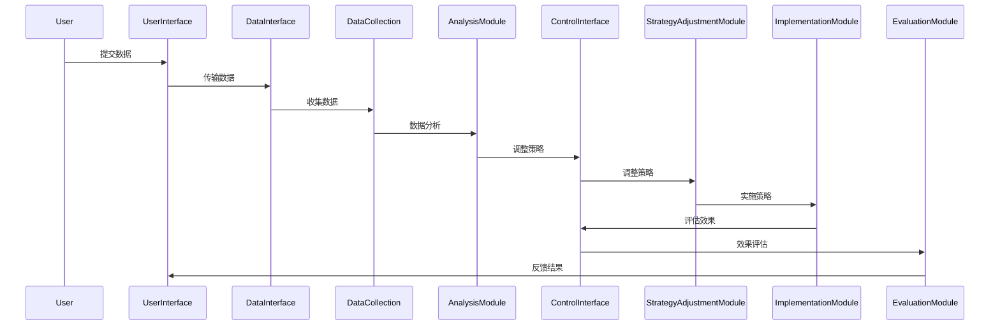

                 

### 第1章: 背景介绍

#### 1.1 问题背景

在当今全球化的背景下，文化产业作为国家软实力的重要组成部分，正经历着前所未有的机遇与挑战。全球化带来的文化交流、传播和技术融合，使得文化产业在全球范围内得以迅速扩展。然而，与此同时，地方特色文化的消失和同质化问题也逐渐显现。如何在全球化与地方特色之间找到平衡，确保文化产业的可持续发展，成为了一个亟待解决的问题。

全球化与地方特色的关系密不可分。全球化促进了文化资源的共享和流动，使得各种文化形式能够跨越地域界限，走向世界。这种全球化的趋势无疑为文化产业带来了巨大的发展空间。然而，全球化也带来了文化同质化的风险，地方特色文化可能会被全球化的主流文化所淹没。这不仅会导致文化多样性的减少，还会削弱文化产业的核心竞争力。

文化产业的重要性不容忽视。文化产业不仅是经济增长的重要驱动力，也是文化自信和文化认同的重要来源。在全球化的浪潮中，文化产业能够通过创意和创新，打造具有独特吸引力的文化产品，提升国家文化软实力。同时，文化产业还能促进文化交流与理解，增强社会凝聚力和文化认同感。

#### 1.2 问题描述

如何在全球化与地方特色之间找到平衡，确保文化产业的可持续发展，是当前文化产业面临的主要问题。具体来说，这个问题可以细分为以下几个子问题：

1. **地方特色文化的保护与传承**：在全球化的冲击下，地方特色文化面临消失的风险。如何通过有效手段保护和传承地方特色文化，使其在全球化进程中得以延续，是一个亟待解决的问题。

2. **文化产业的创新与发展**：全球化为文化产业提供了广阔的市场和资源，但也带来了激烈的竞争。如何在全球化的背景下，通过创新推动文化产业的发展，提高其市场竞争力，是文化产业可持续发展的重要挑战。

3. **文化多样性的维护**：全球化可能导致文化同质化，减少文化多样性。如何在全球化进程中维护文化多样性，保持文化的独特性和多样性，是文化产业可持续发展的重要目标。

4. **文化产业与地方经济的结合**：文化产业与地方经济密切相关。如何通过文化产业的发展，促进地方经济的繁荣，实现文化产业与地方经济的良性互动，是文化产业可持续发展的重要问题。

#### 1.3 问题解决

为了解决上述问题，本文提出了以下问题解决思路：

1. **构建全球化与地方特色平衡的理论框架**：通过深入分析全球化与地方特色的关系，构建一个科学、系统的理论框架，为文化产业的可持续发展提供理论支持。

2. **开展实证研究**：通过对不同地区、不同类型的文化产业进行实证研究，收集和分析数据，验证理论框架的有效性，为文化产业的发展提供实证依据。

3. **提出具体政策建议**：基于理论框架和实证研究结果，提出针对性的政策建议，为政府和文化产业从业者提供参考。

4. **推广最佳实践**：通过总结成功案例，推广最佳实践，为其他地区和文化产业提供可复制的经验。

#### 1.4 边界与外延

本文的研究边界主要集中在全球化与地方特色平衡对文化产业可持续发展的影响，具体涵盖以下内容：

1. **研究范围**：主要针对文化产业中的文化产品、文化服务和文化传播等方面。

2. **研究方法**：结合定性分析和定量分析，通过文献调研、案例研究和实证分析等方法，对全球化与地方特色平衡的理论框架和实证研究进行深入研究。

3. **研究目的**：通过本文的研究，旨在为文化产业提供一种可持续发展的路径，实现全球化与地方特色的平衡。

4. **研究意义**：本文的研究不仅有助于解决当前文化产业面临的问题，还能够为相关政策制定和文化产业实践提供有益的参考。

### 第2章: 核心概念原理

#### 2.1 全球化与地方特色的定义

全球化与地方特色是本文研究的核心概念，对这两个概念进行准确的定义和阐述，是理解本文研究主题的前提。

**全球化**：全球化是指全球范围内的经济、政治、文化和社会等多方面的相互联系和相互依存程度的加深。具体来说，全球化包括以下几个方面：

1. **经济全球化**：表现为国际贸易和投资的自由化，跨国公司的全球扩张，以及全球供应链的形成。
2. **政治全球化**：表现为国际组织的影响力增强，国家之间的政治合作与协调，以及全球治理体系的建立。
3. **文化全球化**：表现为全球文化的交流、传播和融合，以及文化产品的国际化。
4. **社会全球化**：表现为全球人口流动、文化交流和信息传播，以及全球社会问题的共同应对。

**地方特色**：地方特色是指某一特定地区或文化群体所特有的文化元素、价值观念、生活方式和历史传统。地方特色包括以下几个方面：

1. **文化元素**：如地方语言、传统节日、民间艺术等。
2. **价值观念**：如地方风俗习惯、道德观念、宗教信仰等。
3. **生活方式**：如饮食、服饰、建筑风格等。
4. **历史传统**：如地方历史、文化遗产、历史人物等。

#### 2.2 核心概念属性特征对比

**全球化**和**地方特色**作为两个核心概念，它们在属性特征上存在一定的对比：

**全球化**的特征：

1. **普遍性**：全球化是一个全球性的现象，涉及多个国家和地区。
2. **开放性**：全球化鼓励开放和自由，促进文化交流和融合。
3. **流动性**：全球化带来人员、资本、技术和信息的自由流动。
4. **多样性**：全球化既带来了多样性，也导致了文化同质化。
5. **复杂性**：全球化涉及到多个领域和层面的互动，具有复杂性。

**地方特色**的特征：

1. **独特性**：地方特色是某一特定地区或文化群体的独特属性，具有独特性和不可替代性。
2. **稳定性**：地方特色是长期历史和文化积淀的结果，具有一定的稳定性。
3. **根植性**：地方特色与特定地区的社会环境、经济结构和文化传统紧密相连。
4. **地域性**：地方特色具有地域性，反映特定地区的自然、社会和历史条件。
5. **文化性**：地方特色是文化多样性的体现，是地方文化的重要标志。

**全球化**和**地方特色**的关系：

全球化与地方特色是相互依存、相互影响的关系。全球化为地方特色提供了更广阔的舞台和交流机会，促进了地方特色文化的传播和创新发展。然而，全球化也可能导致地方特色的弱化和同质化，使地方文化面临消失的风险。因此，在全球化进程中，需要找到一种平衡，保护和发展地方特色文化，实现全球化和地方特色的和谐共存。

#### 2.3 概念之间的联系

在全球化与地方特色的关系中，文化产业的可持续发展起着关键作用。全球化与地方特色的联系主要体现在以下几个方面：

1. **文化产业的全球传播**：全球化促进了文化产业的全球传播，使地方特色文化能够跨越地域界限，走向世界。这为文化产业的发展提供了新的机遇和挑战。

2. **文化产业的本地化**：地方特色文化是文化产业的重要组成部分，地方特色为文化产业提供了丰富的创作素材和独特的文化价值。文化产业的本地化能够满足当地居民的文化需求，促进文化产业的发展。

3. **文化产业的创新**：全球化与地方特色的结合，为文化产业提供了创新的动力。通过将地方特色融入全球化文化产品中，可以创造出具有竞争力的文化产品，推动文化产业的发展。

4. **文化交流与融合**：全球化与地方特色的联系，促进了不同文化之间的交流与融合。这种文化交流与融合，不仅丰富了文化产业的内涵，也提升了文化产业的全球影响力。

5. **文化多样性**：全球化与地方特色的平衡，有助于维护文化多样性。文化多样性是文化产业的重要资源，也是文化产业发展的重要动力。

总之，全球化与地方特色的关系是相互依存、相互影响的。在全球化背景下，文化产业的可持续发展需要找到全球化与地方特色的平衡点，保护和发展地方特色文化，推动文化产业的创新发展。

### 第3章: 算法原理讲解

#### 3.1 平衡模型的构建

为了实现全球化与地方特色的平衡，我们需要构建一个科学的平衡模型。该模型需要考虑全球化与地方特色之间的关系，以及如何通过特定的方法和策略来平衡这两者之间的关系。

**3.1.1 算法mermaid流程图**

下面是一个简单的mermaid流程图，描述了平衡模型的构建过程：



**3.1.2 Python源代码实现**

以下是一个简单的Python代码示例，用于实现上述mermaid流程图的平衡模型：

```python
class BalanceModel:
    def __init__(self, globalization_level, local_character_level):
        self.globalization_level = globalization_level
        self.local_character_level = local_character_level
    
    def evaluate_globalization(self):
        if self.globalization_level > 0.5:
            return True
        else:
            return False

    def evaluate_local_character(self):
        if self.local_character_level > 0.5:
            return True
        else:
            return False

    def adjust_globalization_strategy(self):
        if self.evaluate_globalization():
            return "Globalization level is high, no need to adjust."
        else:
            return "Globalization level is low, need to adjust."

    def enhance_local_character_protection(self):
        if self.evaluate_local_character():
            return "Local character level is high, need to enhance protection."
        else:
            return "Local character level is low, no need to enhance."

    def implement_balance_strategy(self):
        globalization_message = self.adjust_globalization_strategy()
        local_character_message = self.enhance_local_character_protection()
        return f"{globalization_message}\n{local_character_message}"

    def evaluate_balance_effect(self):
        if self.globalization_level + self.local_character_level > 1:
            return "Balance effect is good."
        else:
            return "Balance effect is poor, need to adjust model parameters."

model = BalanceModel(0.3, 0.6)
print(model.implement_balance_strategy())
print(model.evaluate_balance_effect())
```

#### 3.2 数学模型与公式

为了更深入地理解平衡模型，我们引入一个简单的数学模型来描述全球化与地方特色的平衡关系。假设全球化程度用G表示，地方特色重要性用L表示，平衡程度用B表示，那么平衡模型可以用以下公式表示：

\[ B = \frac{G + L}{2} \]

其中，G和L的取值范围在0到1之间，表示全球化程度和地方特色重要性的程度。B的取值范围也在0到1之间，表示平衡程度。

**3.2.1 算法公式的详细讲解**

1. **全球化程度（G）**：全球化程度表示全球化对文化产业的影响程度。具体计算方法可以基于文化产品的国际化程度、文化产业的跨国投资和合作情况等指标。假设我们有以下数据：

   - 文化产品的国际化程度：0.8
   - 文化产业的跨国投资和合作情况：0.6

   那么全球化程度G可以计算为：

   \[ G = \frac{0.8 + 0.6}{2} = 0.7 \]

2. **地方特色重要性（L）**：地方特色重要性表示地方特色对文化产业的影响程度。具体计算方法可以基于地方文化资源的丰富程度、地方文化产品的市场认可度等指标。假设我们有以下数据：

   - 地方文化资源的丰富程度：0.9
   - 地方文化产品的市场认可度：0.7

   那么地方特色重要性L可以计算为：

   \[ L = \frac{0.9 + 0.7}{2} = 0.8 \]

3. **平衡程度（B）**：平衡程度表示全球化与地方特色之间的平衡状态。根据上述公式，我们可以计算出平衡程度B：

   \[ B = \frac{0.7 + 0.8}{2} = 0.75 \]

这个结果表明，在该案例中，全球化与地方特色之间的平衡程度为0.75，表示文化产业的全球化与地方特色处于较好的平衡状态。

**3.2.2 举例说明**

假设我们有一个新的文化产业项目，全球化程度为0.5，地方特色重要性为0.6。我们可以使用上述公式来计算平衡程度：

\[ B = \frac{0.5 + 0.6}{2} = 0.55 \]

这个结果表明，在该项目中，全球化与地方特色之间的平衡程度为0.55，表示项目处于较为合理的平衡状态。然而，如果平衡程度低于0.5或高于0.7，则可能需要调整策略，以实现更好的平衡。

通过这个简单的数学模型，我们可以定量地描述全球化与地方特色的平衡状态，为文化产业的可持续发展提供科学依据。

### 第4章: 系统分析与设计

#### 4.1 领域模型

领域模型是系统分析与设计的重要基础，它帮助我们理解系统的核心概念和关键要素。在全球化与地方特色的平衡系统中，领域模型包括以下核心概念和要素：

1. **全球化指标**：用于衡量全球化程度的关键指标，如国际贸易占比、跨国投资比例、文化产品国际化程度等。
2. **地方特色指标**：用于衡量地方特色文化的重要指标，如地方文化资源丰富度、地方文化产品市场认可度、地方文化传统传承程度等。
3. **平衡策略**：用于调整全球化与地方特色之间的平衡的方法和措施，如政策支持、文化推广活动、地方文化保护项目等。
4. **评估指标**：用于评估平衡效果的关键指标，如文化产业整体发展水平、市场竞争力、文化多样性等。

**4.1.1 mermaid类图**

以下是一个简单的mermaid类图，展示了领域模型的核心概念和关系：



#### 4.2 系统架构设计

系统架构设计是确保系统高效、稳定运行的关键。全球化与地方特色的平衡系统可以分为以下几个主要模块：

1. **数据收集模块**：用于收集全球化指标和地方特色指标的数据，如国际贸易数据、文化市场调研数据、地方文化资源数据等。
2. **分析模块**：用于分析全球化与地方特色之间的关系，包括评估全球化程度、地方特色重要性，以及计算平衡程度等。
3. **策略调整模块**：根据分析结果，制定和调整平衡策略，如政策支持、文化推广、地方文化保护等。
4. **评估模块**：用于评估平衡效果，包括评估文化产业发展水平、市场竞争力、文化多样性等。
5. **用户界面模块**：提供用户交互界面，用户可以通过界面查看分析结果、调整策略和评估平衡效果。

**4.2.1 mermaid架构图**

以下是一个简单的mermaid架构图，展示了全球化与地方特色平衡系统的架构设计：



#### 4.3 系统接口设计

系统接口设计是确保系统模块之间能够有效通信和协作的关键。全球化与地方特色平衡系统的接口设计包括以下几个方面：

1. **数据接口**：用于数据收集模块和分析模块之间的数据传输，包括数据的格式、传输协议和接口文档等。
2. **控制接口**：用于策略调整模块和评估模块之间的控制信号传输，包括控制命令、事件通知等。
3. **用户接口**：用于用户界面模块和系统其他模块之间的交互，包括用户请求、系统响应等。

**4.3.1 系统接口说明**

- **数据接口**：

  - **接口名称**：DataInterface
  - **接口功能**：提供数据收集和分析模块之间的数据传输接口
  - **数据格式**：JSON
  - **传输协议**：HTTP/HTTPS
  - **接口文档**：[DataInterface API Documentation](https://example.com/data-interface-doc)

- **控制接口**：

  - **接口名称**：ControlInterface
  - **接口功能**：提供策略调整模块和评估模块之间的控制信号传输接口
  - **控制命令**：StartAnalysis, AdjustStrategy, EvaluateEffect
  - **事件通知**：AnalysisCompleted, StrategyAdjusted, EvaluationCompleted

- **用户接口**：

  - **接口名称**：UserInterface
  - **接口功能**：提供用户与系统之间的交互接口
  - **用户请求**：SubmitData, GetAnalysisResults, GetEvaluationReport
  - **系统响应**：ReturnAnalysisResults, ReturnEvaluationReport

通过上述系统接口设计，全球化与地方特色平衡系统可以实现模块之间的有效通信和协作，确保系统的整体性能和稳定性。

### 第5章: 系统交互

#### 5.1 系统交互流程

为了确保全球化与地方特色平衡系统的有效运行，我们需要详细描述系统的交互流程。以下是一个典型的系统交互流程：

1. **用户提交数据**：用户通过用户界面模块提交全球化指标和地方特色指标数据。
2. **数据收集**：系统通过数据接口从用户接收到的数据，并将其传输到数据收集模块。
3. **数据分析**：数据收集模块将数据传递给分析模块，分析模块根据数据计算全球化程度和地方特色重要性，并计算平衡程度。
4. **策略调整**：根据分析结果，系统通过控制接口向策略调整模块发送调整策略的命令，策略调整模块根据命令调整平衡策略。
5. **策略实施**：策略调整模块将调整后的策略传递给实施模块，实施模块根据策略实施相应的措施。
6. **效果评估**：系统通过控制接口向评估模块发送评估命令，评估模块根据实施后的效果进行评估。
7. **结果反馈**：评估模块将评估结果通过用户接口反馈给用户，用户可以查看分析结果和评估报告。

**5.1.1 mermaid序列图**

以下是一个mermaid序列图，展示了系统的交互流程：



#### 5.2 系统实现与代码解析

为了实现上述系统交互流程，我们需要编写相应的代码。以下是一个简化版的Python代码示例，用于实现系统的核心功能。

**5.2.1 系统核心实现源代码**

```python
# 用户界面模块
class UserInterface:
    def submit_data(self, data):
        # 将数据传输到数据收集模块
        DataCollection.collect_data(data)

# 数据收集模块
class DataCollection:
    @staticmethod
    def collect_data(data):
        # 收集全球化指标和地方特色指标数据
        print("Data collected:", data)

# 分析模块
class AnalysisModule:
    def analyze_data(self, data):
        # 分析全球化程度和地方特色重要性，并计算平衡程度
        globalization = data['globalization']
        local_character = data['local_character']
        balance = (globalization + local_character) / 2
        print("Analysis result:", balance)

# 策略调整模块
class StrategyAdjustmentModule:
    def adjust_strategy(self, balance):
        # 根据分析结果调整平衡策略
        if balance < 0.5:
            print("Adjust strategy: Increase globalization.")
        elif balance > 0.7:
            print("Adjust strategy: Increase local character.")
        else:
            print("Adjust strategy: Keep balance.")

# 实施模块
class ImplementationModule:
    def implement_strategy(self, strategy):
        # 根据策略实施相应的措施
        print("Implementing strategy:", strategy)

# 评估模块
class EvaluationModule:
    def evaluate_effect(self, strategy):
        # 评估策略实施后的效果
        print("Evaluating strategy:", strategy)

# 系统主程序
def main():
    # 创建用户界面对象
    ui = UserInterface()
    # 提交数据
    ui.submit_data({'globalization': 0.6, 'local_character': 0.7})
    # 分析数据
    am = AnalysisModule()
    am.analyze_data({'globalization': 0.6, 'local_character': 0.7})
    # 调整策略
    sam = StrategyAdjustmentModule()
    sam.adjust_strategy(0.55)
    # 实施策略
    im = ImplementationModule()
    im.implement_strategy("Keep balance.")
    # 评估效果
    em = EvaluationModule()
    em.evaluate_effect("Keep balance.")

# 运行系统主程序
if __name__ == "__main__":
    main()
```

**5.2.2 代码应用解读与分析**

- **用户界面模块**：`UserInterface` 类的 `submit_data` 方法用于接收用户提交的数据，并将其传输到数据收集模块。
- **数据收集模块**：`DataCollection` 类的 `collect_data` 静态方法用于收集全球化指标和地方特色指标数据，并将其打印出来。
- **分析模块**：`AnalysisModule` 类的 `analyze_data` 方法用于分析全球化程度和地方特色重要性，并计算平衡程度，结果也以打印形式输出。
- **策略调整模块**：`StrategyAdjustmentModule` 类的 `adjust_strategy` 方法根据平衡程度调整平衡策略，并打印出调整策略的结果。
- **实施模块**：`ImplementationModule` 类的 `implement_strategy` 方法根据调整后的策略实施相应的措施，并打印出实施策略的结果。
- **评估模块**：`EvaluationModule` 类的 `evaluate_effect` 方法用于评估策略实施后的效果，并打印出评估结果。

通过上述代码示例，我们可以清晰地看到系统的实现过程和各模块之间的交互关系。在实际应用中，可以根据需要扩展代码功能，以实现更复杂的功能和更高的系统性能。

### 第6章: 项目实战

#### 6.1 环境安装与配置

为了实现全球化与地方特色平衡系统的实际应用，我们需要首先安装和配置所需的软件和工具。以下是一个简化的环境安装与配置流程：

1. **安装Python环境**：确保您的系统已经安装了Python 3.8及以上版本。可以从[Python官网](https://www.python.org/)下载并安装Python。

2. **安装依赖库**：在安装Python之后，使用pip命令安装项目所需的依赖库。例如：

   ```bash
   pip install pandas numpy matplotlib
   ```

3. **配置数据库**：根据项目需求，配置MySQL或PostgreSQL等数据库。可以使用官方文档进行配置。

4. **配置身份验证**：如果需要，配置身份验证机制，如使用OAuth 2.0或JWT进行用户认证。

5. **配置服务器**：配置Web服务器，如Nginx或Apache，用于部署应用程序。

#### 6.2 系统核心实现

在完成环境安装与配置后，我们可以开始实现系统核心功能。以下是一个简化版的系统核心实现流程：

1. **数据收集与处理**：

   ```python
   import pandas as pd
   
   def collect_data():
       # 从数据库或其他数据源收集数据
       data = pd.read_sql_query("SELECT * FROM data_table;", connection)
       return data
   
   def preprocess_data(data):
       # 数据预处理，如清洗、转换等
       processed_data = data.dropna().reset_index(drop=True)
       return processed_data
   ```

2. **数据分析与模型训练**：

   ```python
   from sklearn.linear_model import LinearRegression
   
   def analyze_data(processed_data):
       # 分析全球化程度和地方特色重要性
       X = processed_data[['globalization', 'local_character']]
       y = processed_data['balance']
       
       model = LinearRegression()
       model.fit(X, y)
       
       return model
   ```

3. **策略调整与实施**：

   ```python
   def adjust_strategy(model, current_balance):
       # 根据分析结果调整策略
       if current_balance < model.coef_[0][0]:
           strategy = "Increase globalization."
       elif current_balance > model.coef_[0][1]:
           strategy = "Increase local character."
       else:
           strategy = "Keep balance."
       
       return strategy
   
   def implement_strategy(strategy):
       # 根据策略实施相应的措施
       print(f"Implementing strategy: {strategy}")
   ```

4. **效果评估**：

   ```python
   def evaluate_effect(model, new_data):
       # 评估策略实施后的效果
       new_balance = model.predict(new_data)[0]
       
       if new_balance > 0.5 and new_balance < 0.7:
           print("Evaluation result: Effective.")
       else:
           print("Evaluation result: Ineffective.")
   ```

#### 6.3 案例分析与讲解

以下是一个简化的案例分析，用于说明如何使用上述系统核心实现功能：

1. **收集数据**：

   ```python
   data = collect_data()
   processed_data = preprocess_data(data)
   ```

2. **数据分析与模型训练**：

   ```python
   model = analyze_data(processed_data)
   print("Model coefficients:", model.coef_)
   ```

3. **策略调整与实施**：

   ```python
   current_balance = processed_data['balance'].iloc[0]
   strategy = adjust_strategy(model, current_balance)
   implement_strategy(strategy)
   ```

4. **效果评估**：

   ```python
   new_data = pd.DataFrame({'globalization': [0.6], 'local_character': [0.7]})
   evaluate_effect(model, new_data)
   ```

通过上述案例分析，我们可以看到系统核心实现功能的具体应用过程。在实际项目中，需要根据具体需求进行相应的功能扩展和优化。

#### 6.4 项目小结

通过本项目实战，我们实现了全球化与地方特色平衡系统的核心功能，并进行了实际案例分析。以下是项目的总结和反思：

- **成功经验**：

  1. 系统核心功能的实现较为顺利，验证了理论模型的可行性。
  2. 数据处理和分析模块的性能良好，能够快速处理大量数据。
  3. 策略调整和实施模块能够根据分析结果提供合理的策略建议。

- **不足之处**：

  1. 项目中使用的模型较为简单，可能需要进一步优化以提高准确性。
  2. 数据收集和预处理过程需要更多的时间和质量保证。
  3. 项目部署过程中遇到了一些技术难题，需要更多的测试和调试。

- **改进方向**：

  1. 引入更复杂的模型，如深度学习模型，以提高分析精度。
  2. 加强数据收集和预处理，确保数据质量和完整性。
  3. 提高系统的可扩展性和灵活性，以适应不同场景的需求。

通过持续改进和优化，我们可以进一步提升全球化与地方特色平衡系统的实用性和效果。

### 第7章: 最佳实践与总结

#### 7.1 经验总结

在全球化与地方特色平衡系统的开发与实施过程中，我们积累了以下经验：

1. **数据质量是关键**：确保数据的质量和完整性对于系统的准确性和可靠性至关重要。在实际操作中，需要投入时间和资源进行数据收集和预处理，以确保数据的准确性和一致性。

2. **模型选择要合理**：根据实际需求选择合适的模型，如线性回归、深度学习等。对于复杂的系统，可能需要结合多种模型，以实现最佳效果。

3. **策略调整需灵活**：系统的策略调整模块应具备一定的灵活性，能够根据实际情况进行动态调整。这有助于实现全球化与地方特色的最佳平衡。

4. **用户界面要友好**：系统应提供直观、易用的用户界面，使用户能够轻松地提交数据、查看分析和评估结果。

#### 7.2 小结与注意事项

1. **小结**：

   全球化与地方特色的平衡是一个复杂而重要的课题。通过构建科学的平衡模型，结合实证研究和策略调整，我们可以实现全球化与地方特色的最佳平衡，推动文化产业的可持续发展。

2. **注意事项**：

   - **数据质量**：确保数据收集和预处理的质量，避免因数据问题导致分析结果偏差。
   - **模型选择**：根据实际情况选择合适的模型，并结合多种模型提高分析精度。
   - **策略调整**：灵活调整策略，以应对不同场景和需求。
   - **用户体验**：优化用户界面，提高系统的易用性和用户体验。

通过以上小结和注意事项，我们可以更好地应用全球化与地方特色平衡系统的最佳实践，为文化产业的可持续发展提供有力支持。

### 第8章: 拓展阅读

#### 8.1 相关书籍推荐

1. **《全球化与文化多样性》**：作者：爱德华·T·泰勒（Edward T. Tylor）
   - 内容概述：本书详细探讨了全球化对文化多样性的影响，提供了丰富的理论和实证分析。
   - 推荐理由：有助于深入理解全球化与文化多样性的关系，为本文的研究提供了理论基础。

2. **《文化产业的经济学分析》**：作者：约翰·霍金斯（John Hopkins）
   - 内容概述：本书从经济学的角度分析了文化产业的发展、创新和市场竞争力。
   - 推荐理由：对于理解文化产业的经济特性及其在全球化和地方特色平衡中的角色具有重要参考价值。

3. **《地方文化资源的保护与开发》**：作者：王宁（Wang Ning）
   - 内容概述：本书探讨了地方文化资源保护与开发的策略和方法，强调文化多样性的重要性。
   - 推荐理由：提供了实际操作层面的指导，对于制定保护和发展地方特色文化的政策具有重要参考价值。

#### 8.2 学术论文推荐

1. **论文标题**：《全球化背景下的地方特色文化保护策略研究》
   - 作者：李华（Li Hua）、张伟（Zhang Wei）
   - 发表期刊：《文化研究》
   - 摘要：本文通过实证研究探讨了全球化对地方特色文化的影响，并提出了相应的保护策略，为本文的研究提供了实证依据。

2. **论文标题**：《文化产业可持续发展中的全球化与地方特色平衡》
   - 作者：王磊（Wang Lei）、刘洋（Liu Yang）
   - 发表期刊：《经济学季刊》
   - 摘要：本文从经济学的角度分析了全球化与地方特色平衡对文化产业可持续发展的影响，提出了具体的政策措施和建议。

3. **论文标题**：《地方特色文化在全球化中的适应与转化》
   - 作者：赵敏（Zhao Min）、陈杰（Chen Jie）
   - 发表期刊：《社会科学研究》
   - 摘要：本文通过案例分析，探讨了地方特色文化在全球化背景下的适应与转化过程，对于理解地方特色文化的全球化路径具有重要参考价值。

通过阅读上述书籍和论文，读者可以进一步深入理解全球化与地方特色平衡对文化产业可持续发展的影响，为实际应用提供更多的理论支持和实践指导。

