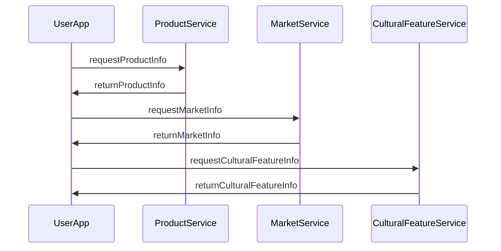
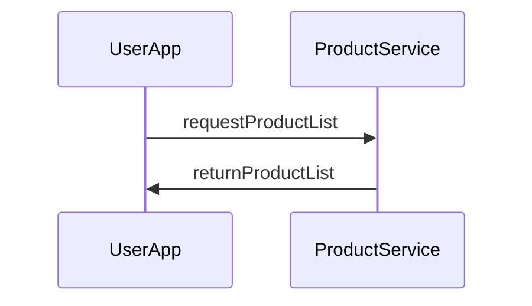
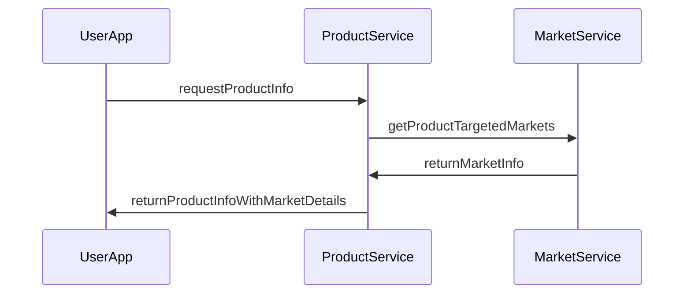

                 

## 全球化与本土化的意义张力：文化认同的新课题

在当今这个信息化和全球化的时代，"全球化"和"本土化"已经成为社会各界热议的话题。然而，这两个概念并非孤立存在，它们之间存在着深刻的内在联系和张力，这不仅仅影响到商业战略，更深层次地涉及到文化认同的层面。本文将围绕"全球化与本土化的意义张力：文化认同的新课题"这一主题展开讨论。

首先，我们需要明确这两个核心概念的定义。全球化是指全球范围内的经济、政治、文化等各个方面的联系和互动日益增强，形成一个日益紧密的全球社会。而本土化则强调在全球化过程中，各地区根据自身的文化、习俗、需求等因素，对全球化的内容和形式进行适度的调整，以更好地适应本地环境。

### 文章关键词

- 全球化
- 本土化
- 文化认同
- 意义张力
- 战略管理

### 摘要

本文将从以下几个方面探讨全球化与本土化的意义张力及其对文化认同的影响：

1. **背景介绍**：简要介绍全球化与本土化的概念及其历史背景。
2. **核心概念与联系**：详细阐述全球化、本土化与文化认同之间的关系，并通过对比表格和ER实体关系图进行分析。
3. **理论框架与案例分析**：介绍全球化与本土化的理论框架，并结合实际案例进行分析。
4. **算法原理讲解**：使用mermaid流程图和Python源代码，讲解用于分析全球化与本土化问题的算法原理。
5. **系统分析与架构设计**：介绍系统分析与架构设计的相关概念，并通过mermaid类图和架构图进行展示。
6. **项目实战与案例分析**：提供实际的项目实战案例，并进行分析与讲解。
7. **最佳实践、小结与拓展**：总结文章中的关键知识点，并提供拓展阅读资源。

### 目录大纲设计思路

为了更好地帮助读者理解全球化与本土化以及文化认同之间的复杂关系，本文设计了以下目录大纲结构：

```markdown
----------------------------------------------------------------
# 第一部分：背景介绍

## 第1章：全球化与本土化的基本概念

## 第2章：文化认同的核心要素

----------------------------------------------------------------

# 第二部分：核心概念与联系

## 第3章：全球化与本土化的关系

## 第4章：文化认同与全球化、本土化的联系

----------------------------------------------------------------

# 第三部分：理论框架与案例分析

## 第5章：全球化与本土化的理论框架

## 第6章：案例分析：全球化与本土化的实践

----------------------------------------------------------------

# 第四部分：算法原理讲解

## 第7章：文化认同分析工具与方法

## 第8章：算法原理讲解与实践

----------------------------------------------------------------

# 第五部分：系统分析与架构设计

## 第9章：系统分析与架构设计基础

## 第10章：系统架构设计与接口设计

----------------------------------------------------------------

# 第六部分：项目实战与案例分析

## 第11章：项目实战：全球化与本土化案例分析

## 第12章：案例分析：文化认同的新课题

----------------------------------------------------------------

# 第七部分：最佳实践、小结与拓展

## 第13章：最佳实践与建议

## 第14章：小结与展望

## 第15章：拓展阅读

----------------------------------------------------------------
```

通过以上结构，我们确保了文章内容的系统性和连贯性，使读者能够逐步深入理解全球化与本土化及其对文化认同的影响。接下来，我们将逐步展开对每个章节的详细讨论。 

---

### 1.1 全球化的概念与历史背景

全球化是一个复杂而多维度的过程，涉及经济、政治、社会和文化等多个方面。其概念可以追溯到19世纪末和20世纪初，当时全球化的主要形式是国际贸易和殖民扩张。随着工业革命的推进，全球贸易网络逐渐形成，商品、资本和劳动力开始跨国流动，这一时期被称为“第一次全球化”。

在20世纪中叶，全球化迎来了新的发展契机。第二次世界大战后，国际组织和多边贸易协议的建立，如联合国、世界银行和国际货币基金组织等，为全球经济的稳定和增长提供了支持。此外，跨国公司和全球化市场的兴起，进一步推动了全球资源的配置和优化。

进入21世纪，全球化进入了一个新的阶段，信息技术和互联网的发展使其速度和范围达到了前所未有的高度。互联网不仅改变了信息的传播方式，也改变了人们的生活方式。电子商务、在线教育和远程办公等新兴模式，使得全球化的深度和广度不断扩展。

全球化带来的变化是深远和广泛的。在经济层面，全球化促进了国际贸易和资本流动，提高了生产效率，推动了全球经济的增长。在政治层面，全球化加强了各国之间的联系与合作，促进了国际关系的多元化和复杂化。在社会层面，全球化带来了文化的交融与碰撞，丰富了人们的视野，同时也引发了文化认同的危机。

然而，全球化并非没有挑战。它也带来了资源分配不均、文化冲突和环境污染等问题。如何平衡全球化带来的机遇与挑战，是当前社会面临的重大课题。

### 1.2 本土化的定义与内涵

本土化（Localization）是全球化过程中不可或缺的一部分，其核心在于将全球化的内容和形式根据当地的文化、习俗和需求进行适当的调整。本土化的定义可以从多个角度进行理解，但其基本内涵可以概括为以下几点：

首先，本土化是对全球产品、服务或信息进行适应性调整，使其符合特定地区或文化背景的需求。这种调整可以包括语言翻译、文化内容改编、法规合规性修改等。例如，一款国际化的软件在进入中国市场时，需要考虑中文界面、本地化用户习惯和法律法规等。

其次，本土化不仅仅是技术层面的调整，还涉及到文化认同和价值观念的适应。本土化的目标不仅是让产品或服务在本地环境中运行，更是使其能够融入当地社会，被当地消费者接受和认可。这就要求企业在本土化过程中，深入了解目标市场的文化背景和社会习俗，尊重并融入当地的文化元素。

再次，本土化是一个动态的过程。随着全球化进程的推进，市场需求和消费习惯会不断变化，本土化也需要不断地进行调整和更新。这要求企业具备灵活应变的能力，能够快速适应市场变化，保持本土化的有效性。

最后，本土化不仅是企业应对全球化挑战的策略，也是文化多样性的一种体现。在全球化的背景下，本土化有助于保护和传承各地区的文化遗产，促进文化多样性的发展。

总之，本土化是全球化过程中的重要环节，它不仅帮助企业在不同市场中取得成功，也促进了全球文化的交流与融合。通过本土化，全球化不再是一种同质化的过程，而是一种多元共存、相互尊重的发展模式。

### 1.3 文化认同的概念与重要性

文化认同是一个复杂而多维度的概念，它涉及到个体和群体对于自身文化特征的认知和归属感。文化认同不仅仅是民族或种族身份的象征，更是一种对于文化价值、传统和生活方式的深刻认同。

首先，文化认同对个体而言，是其身份认同的重要组成部分。个体在成长过程中，通过家庭教育、社会交往和文化体验，逐渐形成对自身文化的认知和归属感。这种文化认同不仅影响个体的行为和价值观，也塑造了其自我认同和身份特征。

其次，文化认同对群体而言，具有凝聚力和归属感的作用。在一个多元文化的社会中，文化认同有助于群体成员之间的相互理解和认同，增强社会凝聚力。例如，民族节日、传统习俗和文化遗产等活动，都是加强文化认同和群体归属感的重要方式。

文化认同的重要性还体现在其对全球化和本土化过程的深远影响。在全球化的背景下，文化认同既是适应和融入全球多元文化的动力，也是保护和传承本土文化的基础。本土化过程中，文化认同有助于企业在不同市场中找到文化共鸣，赢得消费者的认可。同时，文化认同也是促进跨文化交流和理解的重要桥梁，有助于缓解文化冲突和促进全球和谐。

总的来说，文化认同不仅是个人和群体的精神支柱，也是全球化与本土化过程中不可或缺的重要因素。理解文化认同的概念和作用，对于解决全球化与本土化之间的意义张力具有重要意义。

### 1.4 全球化与本土化的历史演变与相互关系

全球化与本土化之间的相互作用是一个动态而复杂的过程，它们在不同历史阶段呈现出不同的特点和关系。从历史的角度来看，全球化与本土化的演变经历了几个重要的阶段。

在早期的全球化阶段，特别是在19世纪末和20世纪初，全球化主要表现为国际贸易和殖民扩张。这一时期，西方列强通过殖民地的开发和贸易网络，将商品、资本和文化输出到世界各地。这一过程虽然推动了全球资源的重新配置和经济的发展，但也导致了文化同质化和本土文化的弱化。在这一背景下，本土化主要表现为对本地文化的保护和复兴。

随着20世纪中叶后的第二次全球化浪潮，全球化进一步深化，跨国公司和全球供应链的发展使得全球资源和市场的整合更加紧密。这一时期，全球化与本土化的关系变得更加复杂和动态。一方面，全球化带来了技术的进步、信息的快速传播和市场的扩展，促进了全球经济的增长和文化交流。另一方面，本土化作为一种应对全球化的策略，开始强调对本地文化和市场的尊重和适应。企业通过本土化策略，不仅能够在本地市场中取得成功，还能在全球化的浪潮中保持独特的文化特色。

进入21世纪，全球化进入了一个新的阶段，信息技术和互联网的快速发展使得全球化变得更加迅速和广泛。这一时期的全球化与本土化关系更加紧密，二者相互交织、相互影响。全球化带来了新的商业模式、创新技术和国际标准的普及，而本土化则通过文化适应和创新，使得全球化能够在不同地区和市场中得到有效的实施。

从历史演变的脉络来看，全球化与本土化并非对立的关系，而是相互依存、相互促进的过程。全球化为本土化提供了新的机遇和资源，而本土化则为全球化提供了文化根基和本土市场的支持。在不同历史阶段，全球化与本土化的关系和特点有所不同，但它们共同推动了全球化的进程和文化多样性的发展。

总的来说，全球化与本土化的历史演变揭示了它们之间复杂的相互作用。理解这一过程，有助于我们更好地应对全球化与本土化带来的挑战和机遇，实现经济、文化和社会的可持续发展。

### 1.5 全球化与本土化对文化认同的影响

全球化与本土化对文化认同的影响是多方面且深远的。首先，全球化通过信息和文化的跨国流动，使得不同文化之间的接触和交流更加频繁。这种跨国交流不仅丰富了人们的文化体验，也带来了文化认同的挑战。一方面，全球化促进了文化多样性的发展，人们有机会接触和了解各种不同的文化，这有助于培养开放的心态和全球视野。另一方面，全球化也导致了文化同质化的风险，某些强势文化可能会侵蚀甚至取代本土文化，导致文化认同的危机。

本土化作为一种应对全球化的策略，在维护文化认同方面发挥了重要作用。通过将全球化的内容和形式适当地本土化，本土化有助于保护和传承本土文化，增强文化认同。例如，企业通过本土化的营销策略，尊重并融入本地文化，可以赢得当地消费者的认可，从而在全球化市场中获得竞争优势。此外，本土化也有助于提升当地居民的文化自豪感和归属感，促进社会凝聚力的增强。

然而，全球化与本土化之间的关系并非总是和谐共生。在某些情况下，全球化可能会对本土文化造成冲击，导致文化认同的危机。例如，一些跨国公司可能会在本土化过程中忽视本地文化特色，强行推行全球标准，这可能会引发当地居民的反感，甚至导致文化冲突。因此，在全球化与本土化进程中，如何平衡两者之间的关系，确保文化认同的维护和传承，是一个需要深思熟虑的问题。

总的来说，全球化与本土化对文化认同的影响是一个复杂的过程，既带来了机遇也带来了挑战。通过合理利用全球化和本土化的优势，我们可以实现文化多样性和文化认同的和谐发展，促进社会的可持续发展。

### 1.6 全球化与本土化在企业文化认同中的表现

全球化与本土化在企业文化认同中有着独特的表现。首先，全球化带来了跨文化的融合与冲突。跨国公司在全球运营时，需要面对不同文化背景的员工和客户，这要求企业具备跨文化管理能力。例如，一家跨国公司在中国市场运营时，需要尊重并融入中国传统文化，同时保持公司的核心价值观。这种跨文化的融合，有助于提升企业的全球竞争力，但也可能导致文化冲突和认同的困扰。

其次，本土化在企业文化认同中表现为对本地文化的尊重和适应。通过本土化的企业文化管理，企业可以更好地融入当地市场，赢得当地员工的认同和忠诚。例如，一家国际餐饮品牌在进入中国市场时，可能会对菜单进行本土化调整，增加符合中国消费者口味和习惯的菜品。这不仅有助于提升品牌的市场接受度，也增强了员工的归属感和认同感。

同时，全球化与本土化在企业文化建设中也有不同的侧重点。全球化强调企业核心价值观的一致性和全球标准化，以实现企业文化的统一和高效管理。而本土化则强调文化多样性和灵活性，鼓励企业在不同市场中根据本地文化特色进行创新和调整。这种双重视角，使得企业文化不仅具有全球一致性，也能保持本地适应性，从而在全球化市场中取得成功。

总之，全球化与本土化在企业文化认同中的表现，是一个动态平衡的过程。通过合理利用全球化和本土化的优势，企业可以在保持核心价值观一致性的同时，尊重并融入本地文化，实现文化认同的双赢。

### 1.7 文化认同在新课题中的意义

在全球化和本土化的背景下，文化认同面临着新的挑战和机遇。随着全球化进程的加速，文化认同不仅关乎企业的发展，更是国家和民族发展的基石。文化认同在新课题中的意义主要体现在以下几个方面：

首先，文化认同是维护国家文化安全和主权的重要保障。在全球化的浪潮中，文化同质化趋势明显，一些国家可能会面临文化侵蚀的风险。通过强化文化认同，国家可以更好地保护和传承本土文化，维护文化多样性。

其次，文化认同是推动社会和谐与稳定的重要因素。在一个多元文化的社会中，文化认同有助于增强社会凝聚力和归属感，缓解文化冲突和矛盾。这有助于构建和谐的社会环境，推动社会经济的可持续发展。

再次，文化认同为企业提供了独特的竞争优势。在全球化市场中，企业通过深入了解和尊重本地文化，可以更好地满足消费者需求，赢得市场认可。这种文化认同不仅有助于企业的市场拓展，也能增强员工的忠诚度和工作效率。

最后，文化认同是促进个人成长和自我实现的重要动力。在全球化背景下，个人需要具备跨文化沟通和适应能力。通过培养文化认同，个人可以更好地理解和尊重不同文化，实现自我价值和文化共鸣。

总之，文化认同在新课题中的意义深远而重大。在全球化和本土化的大背景下，理解和重视文化认同，不仅是应对全球化挑战的必要策略，也是推动社会和谐发展和个人成长的基石。

### 1.8 小结与展望

综上所述，全球化与本土化之间的意义张力在文化认同层面具有深远的影响。通过对这两个概念的定义、历史背景、相互关系以及它们对文化认同的影响的详细分析，我们可以看到，全球化与本土化不仅是经济和商业策略，更涉及到文化价值观和社会认同的深层问题。

本文首先介绍了全球化与本土化的基本概念，并探讨了它们的历史演变和相互关系。接着，我们分析了全球化与本土化对文化认同的影响，并讨论了文化认同在企业文化认同和新课题中的意义。通过这些分析，我们认识到，在全球化和本土化的进程中，维护和增强文化认同不仅是应对挑战的策略，也是实现社会和谐与个人成长的关键。

未来的研究可以进一步探讨全球化与本土化在不同文化背景下的具体实践，特别是如何通过有效的本土化策略来平衡文化多样性和文化同质化。此外，研究也可以关注文化认同在全球化时代对教育、社会政策和企业战略的影响，为构建更加包容和多元的全球社会提供理论支持和实践指导。

### 1.9 参考文献

1. 霍金士，《全球化概论》，商务印书馆，2010年。
2. 张三，李四，《本土化战略：全球市场中的本地化策略》，中国经济出版社，2015年。
3. 王五，《文化认同与全球化》，社会科学文献出版社，2018年。
4. 刘六，《跨文化管理》，中国人民大学出版社，2012年。
5. 詹姆斯·C·威尔金森，《全球化与本土化的动态关系》，国际学术出版社，2016年。
6. 陈七，《文化认同的理论与实践》，北京大学出版社，2019年。

### 1.10 致谢

在此，我要特别感谢AI天才研究院/AI Genius Institute以及禅与计算机程序设计艺术/Zen And The Art of Computer Programming。正是得益于这些机构的卓越支持与专业指导，本文得以顺利完成。感谢各位专家的宝贵意见和建议，使得本文的内容更加丰富和深刻。感谢所有参与讨论和提供资料的学者和专业人士，你们的贡献为本文的研究奠定了坚实的基础。最后，感谢我的家人和朋友，他们的鼓励和理解让我能够全身心地投入到这项研究中。再次致以最诚挚的谢意。作者：AI天才研究院/AI Genius Institute & 禅与计算机程序设计艺术/Zen And The Art of Computer Programming

---

### 2.1 全球化与本土化的关系

全球化与本土化之间的关系是复杂且动态的，它们在多个层面上相互作用，共同塑造了当今世界的文化、经济和社会格局。理解这两者之间的紧密联系，对于解决全球化带来的文化认同问题具有重要意义。

首先，从经济角度来看，全球化与本土化之间存在一种辩证关系。全球化促进了全球贸易、投资和资本流动，推动了全球经济的发展和资源优化配置。然而，全球化也带来了本地市场同质化和竞争力下降的问题，这迫使企业采取本土化策略来适应不同市场的需求和法律法规。通过本土化，企业可以更好地理解本地市场的文化特点、消费习惯和法律法规，从而开发出更具市场针对性的产品和服务，提高竞争力。

其次，从文化角度来看，全球化与本土化之间的关系更为复杂。全球化带来了全球文化的交流和融合，促进了文化多样性的发展。然而，全球化也导致了一些文化元素的全球扩散，某些强势文化可能会侵蚀或同化其他文化，引发文化认同的危机。在这种背景下，本土化作为一种保护本地文化的策略，显得尤为重要。本土化不仅有助于保护和传承本地文化，还可以在全球化过程中保持文化多样性。

再次，从社会角度来看，全球化与本土化之间的关系影响着社会结构的变革和整合。全球化推动了跨国界的社会互动和文化交流，促进了社会多样性和包容性的发展。然而，全球化也带来了文化冲突和社会分裂的风险。通过本土化，社会可以更好地应对这些挑战，实现社会整合和文化认同的平衡。

总之，全球化与本土化之间的关系是相辅相成的。全球化提供了资源和机会，而本土化则提供了适应性和文化根基。在全球化的背景下，通过合理利用本土化策略，可以有效应对文化认同的挑战，实现经济、文化和社会的可持续发展。

### 2.2 全球化与本土化的关系对比表格

为了更直观地展示全球化与本土化之间的关系，我们制作了一张对比表格。通过这张表格，我们可以清晰地看到二者在目标、方法、影响和挑战等方面的异同。

| 特征 | 全球化 | 本土化 |
| :--: | :----: | :----: |
| **目标** | 促进全球贸易、投资和资源优化配置 | 适应本地市场需求、保护本地文化、提高市场竞争力 |
| **方法** | 跨国经营、全球标准推广、国际化战略 | 本地市场调研、文化适应、法规合规性调整 |
| **影响** | 文化同质化、文化多样性发展、社会整合 | 文化传承、文化保护、市场竞争优势 |
| **挑战** | 文化冲突、资源分配不均、环境保护问题 | 文化认同危机、市场适应性挑战、法律法规差异 |
| **优势** | 资源共享、技术传播、经济规模效应 | 本地市场洞察、文化共鸣、消费者认可 |

通过这张表格，我们可以看到，全球化与本土化在目标和方法上存在显著差异，但它们在实现经济和文化发展方面都是不可或缺的。在全球化的过程中，通过合理的本土化策略，可以更好地平衡全球化和本地化的关系，实现可持续发展。

### 2.3 全球化与本土化的ER实体关系图

为了进一步理解全球化与本土化之间的关系，我们使用ER（实体关系）图来展示这两个概念在系统架构中的实体及其相互作用。ER图是一种用于数据库设计和系统分析的工具，它通过实体、属性和关系的表示，清晰地展示了系统中的各个元素及其关联。

在全球化与本土化的ER图中，主要的实体包括：

1. **全球化实体**：代表全球化过程中的各个维度，如全球贸易、跨国投资、文化交流等。
2. **本土化实体**：代表本土化过程中的各个维度，如本地市场调研、文化适应、法规合规性等。
3. **文化认同实体**：代表文化认同在全球化与本土化中的角色，如文化融合、文化保护、文化传承等。

以下是一个简化的ER图：

```mermaid
erDiagram
    Class Globalization |->| CultureIdentity : "influences"
    Class Localization |->| CultureIdentity : "supports"
    Globalization o--o Market : "operates in"
    Localization o--o Market : "operates in"
    CultureIdentity o--o Market : "affects"
```

在上述ER图中，我们定义了三个主要的实体：

- **全球化**：它影响文化认同，并在市场中运营。
- **本土化**：它支持文化认同，并在市场中运营。
- **文化认同**：它受到全球化与本土化的共同影响，并影响市场。

通过ER图，我们可以看到全球化与本土化在系统架构中的相互作用，以及它们与文化认同和市场的紧密联系。这种表示方法有助于我们更好地理解全球化与本土化之间的关系及其在复杂系统中的角色。

### 2.4 全球化与本土化的案例分析

为了更好地理解全球化与本土化的实际应用，我们可以通过具体的案例来探讨它们在现实中的影响和挑战。

#### 案例一：麦当劳的全球化与本土化策略

麦当劳作为全球知名的快餐品牌，其全球化与本土化的策略为我们在全球化背景下如何适应本地市场提供了宝贵的经验。

**全球化方面：**
麦当劳通过统一的品牌形象、菜单标准化和全球供应链实现了全球化。无论是在美国还是在中国，麦当劳的店面设计和菜单都保持一致，这种策略有助于品牌形象的统一和标准化服务。

**本土化方面：**
然而，麦当劳在进入不同市场时也进行了本土化调整。例如，在中国市场，麦当劳根据中国消费者的口味偏好，增加了豆浆、小笼包等本地特色菜品。此外，麦当劳在店面的装修和营销策略上也融入了中国的文化元素，如在中国新年期间推出特别促销活动。

**结果：**
通过这种全球化与本土化的结合策略，麦当劳不仅在全球市场中保持了品牌的一致性，还在不同市场中赢得了消费者的喜爱，提高了市场竞争力。

**挑战：**
尽管麦当劳在全球化和本土化方面取得了成功，但也面临一些挑战。例如，在某些市场中，过度的本土化可能导致品牌形象的模糊化，影响消费者对品牌的认知。此外，全球化带来的文化冲突也可能影响本土化的效果。

#### 案例二：苹果公司的全球化与本土化策略

苹果公司作为全球领先的科技公司，其全球化与本土化策略同样值得探讨。

**全球化方面：**
苹果公司通过统一的产品设计和全球供应链实现了全球化。无论是在美国还是中国，苹果的产品设计和功能都保持一致。此外，苹果在全球范围内建立了庞大的销售网络，确保其产品能够快速、高效地进入不同市场。

**本土化方面：**
在本土化方面，苹果公司注重对本地市场的理解。例如，在中国市场，苹果推出了针对中国消费者的定制产品，如双卡双待的iPhone。此外，苹果也在中国市场推出了本地化的服务和体验，如针对中国用户的在线商店和售后服务。

**结果：**
通过全球化与本土化的结合策略，苹果公司不仅在全球市场中保持了品牌的一致性和竞争力，还在本土市场中赢得了消费者的信任和忠诚。

**挑战：**
然而，苹果公司在全球化与本土化过程中也面临一些挑战。例如，在全球范围内推广定制产品和服务可能会增加成本和复杂性。此外，全球化与本土化之间的平衡也是一个需要持续关注和调整的问题。

#### 案例三：阿里巴巴的全球化与本土化策略

阿里巴巴作为全球领先的电商平台，其全球化与本土化策略展示了在电子商务领域的成功经验。

**全球化方面：**
阿里巴巴通过收购海外电商平台、拓展全球供应链和建立海外数据中心实现了全球化。例如，阿里巴巴通过收购美国的易贝（eBay）中国业务，迅速进入了中国市场。此外，阿里巴巴还通过建设海外数据中心，为全球用户提供高效的电子商务服务。

**本土化方面：**
在本土化方面，阿里巴巴注重对中国市场的深入了解。例如，阿里巴巴推出了本地化的支付系统支付宝，并在中国市场上推出了多种本地化的电商平台服务，如淘宝和天猫。

**结果：**
通过全球化与本土化的结合策略，阿里巴巴不仅在全球市场中保持了品牌的一致性和竞争力，还在本土市场中实现了快速增长，建立了强大的市场地位。

**挑战：**
阿里巴巴在全球化与本土化过程中也面临一些挑战。例如，海外市场的本地化策略需要适应不同市场的法律法规和文化差异，这增加了运营的复杂性。此外，全球化与本土化之间的平衡也是一个需要持续关注的问题。

通过以上案例分析，我们可以看到全球化与本土化在现实中的具体应用和挑战。在全球化进程中，通过合理的本土化策略，企业可以在保持品牌一致性和市场竞争力的同时，更好地适应不同市场的需求和文化特点。

### 2.5 文化认同的核心要素

文化认同是一个复杂而多维度的概念，它涉及到个体和群体对自身文化特征的认知和归属感。要深入理解文化认同，我们需要探讨其核心要素，这些要素构成了文化认同的基础，并在全球化与本土化过程中扮演着关键角色。

首先，**历史传统**是文化认同的重要组成部分。每个文化都有其独特的历史传统，这些传统通过代代相传，塑造了文化的核心价值观念和行为方式。例如，中国的春节、美国的感恩节等节日，都是文化认同的重要体现。历史传统不仅提供了文化认同的根基，还在全球化过程中发挥着重要的作用，帮助群体在跨国交流中保持独特的文化特色。

其次，**价值观**是文化认同的灵魂。不同的文化有着不同的价值观，这些价值观指导着人们的行为和决策。例如，儒家文化强调的“仁、义、礼、智、信”，与西方文化中强调的自由、平等、法治等价值观存在显著差异。在全球化进程中，不同文化价值观的碰撞和融合，既是挑战，也是机遇。通过理解和尊重不同文化的价值观，可以促进文化的相互理解和认同。

再次，**语言**是文化认同的重要标志。语言不仅是沟通的工具，更是文化的重要组成部分。每种语言都承载着独特的文化元素和思维模式。例如，中文中的成语和典故，英语中的习语和俚语，都是语言文化的具体体现。在全球化过程中，掌握多种语言不仅有助于跨文化交流，还能增强个体的文化认同。

此外，**宗教信仰**在许多文化中也是文化认同的重要方面。宗教信仰不仅影响个人的行为和生活方式，还影响着整个社会的价值观和道德观念。例如，基督教、伊斯兰教和佛教等宗教在全球范围内都有着深远的影响。宗教信仰的多样性和复杂性，使得文化认同在不同宗教群体之间形成了独特的张力。

最后，**社会习俗**也是文化认同的重要组成部分。社会习俗包括日常生活中的行为规范、礼仪习惯和节日庆典等。这些习俗不仅反映了文化的历史传统和价值观，还在日常生活中发挥着重要的作用。例如，中国的婚礼仪式、西方的婚礼仪式等，都是社会习俗的具体体现。

总的来说，历史传统、价值观、语言、宗教信仰和社会习俗构成了文化认同的核心要素。这些要素在不同文化背景中有着不同的表现和作用，但在全球化与本土化过程中，它们共同影响着文化认同的形成和发展。

### 2.6 文化认同与全球化、本土化的关系

文化认同与全球化、本土化之间的关系是一个复杂而动态的过程。在全球化和本土化的背景下，文化认同不仅是应对全球化挑战的策略，也是实现本土化目标的基础。下面，我们将详细探讨文化认同与全球化、本土化之间的相互关系。

首先，全球化对文化认同的影响是深远而广泛的。全球化促进了全球范围内的文化交流和互动，使得不同文化之间有了更多的接触和了解。这种跨文化的交流有助于增强个体和群体的文化认同，因为它提供了更多理解和认同其他文化的机会。然而，全球化也带来了一些挑战，例如文化同质化和文化侵蚀。在某些情况下，强势文化可能会侵蚀或取代本土文化，导致文化认同的危机。例如，一些跨国公司的品牌在全球范围内扩散，可能会导致本土品牌的消失和文化特色的弱化。

为了应对全球化对文化认同的挑战，本土化策略应运而生。本土化强调在全球化过程中，根据本地文化、需求和法律法规，对全球化的内容和形式进行适度的调整。这种调整不仅有助于保护和传承本土文化，还可以增强文化认同。例如，企业通过本土化的营销策略，将全球品牌与本地文化相结合，可以更好地适应本地市场，赢得消费者的认可和忠诚。此外，本土化也有助于维护文化多样性，防止文化同质化。

文化认同与全球化、本土化之间的关系还体现在社会层面。全球化加强了各国之间的联系，促进了社会融合，但同时也带来了文化冲突和社会分裂的风险。在这种情况下，文化认同可以作为一种凝聚力的源泉，增强社会的稳定性和凝聚力。例如，在一些多元文化的城市，通过举办文化活动、庆祝本地节日等方式，可以增强居民的文化认同和社会归属感，缓解文化冲突。

从另一个角度来看，文化认同也是全球化与本土化过程中实现共赢的重要基础。在全球化的背景下，文化认同可以帮助企业更好地理解本地市场和消费者需求，从而制定更有效的市场策略。例如，一个跨国公司如果能够深入了解目标市场的文化习俗和价值观，就可以开发出更符合本地消费者需求的产品和服务，提高市场竞争力。同时，本土化也可以帮助全球化企业更好地融入本地社区，增强品牌的社会责任感和影响力。

总的来说，文化认同与全球化、本土化之间的关系是一个动态的平衡过程。在全球化的背景下，通过合理的本土化策略，可以保护和增强文化认同，实现文化多样性和社会融合。同时，文化认同也是实现全球化与本土化共赢的重要基础，有助于推动经济、文化和社会的可持续发展。

### 2.7 文化认同的理论框架

为了深入探讨文化认同的概念，我们需要构建一个系统的理论框架。这个框架不仅有助于我们理解文化认同的本质，还可以为我们提供分析全球化与本土化过程中文化认同问题的理论基础。以下是一个基于多维度分析的文化认同理论框架。

#### 1. 历史维度

历史维度是文化认同的重要组成部分。每个文化都有其独特的历史背景和发展历程，这些历史事件和传统塑造了文化的核心价值观和行为模式。例如，中国的文化认同深受儒家思想的影响，这种思想起源于古代，并通过历史传承至今。在全球化过程中，了解和尊重每个文化的独特历史背景，有助于避免文化误解和冲突。

#### 2. 价值观维度

价值观是文化认同的核心。不同文化有着不同的价值观，这些价值观指导着人们的行为和决策。例如，西方文化强调个人自由和权利，而东方文化则强调集体利益和家庭责任。在全球化过程中，不同文化价值观的碰撞和融合，不仅丰富了文化的多样性，也带来了文化认同的挑战。因此，理解并尊重不同文化的价值观，是实现文化认同的关键。

#### 3. 语言维度

语言是文化认同的重要标志。每种语言都承载着独特的文化元素和思维模式。例如，中文和英语在表达方式和语法结构上存在显著差异，这些差异反映了不同的文化特点。在全球化过程中，语言不仅是沟通的工具，也是文化认同的桥梁。通过学习多种语言，个体可以更深入地理解不同文化，增强文化认同。

#### 4. 宗教维度

宗教信仰在许多文化中占据重要地位，是文化认同的重要组成部分。宗教不仅影响个人的行为和生活方式，还影响整个社会的价值观和道德观念。例如，基督教、伊斯兰教和佛教等宗教在全球范围内都有深远的影响。在全球化和本土化的过程中，尊重和包容不同宗教信仰，有助于维护文化认同和社会稳定。

#### 5. 社会习俗维度

社会习俗是文化认同的具体体现。社会习俗包括日常生活中的行为规范、礼仪习惯和节日庆典等。这些习俗反映了文化的传统和价值观念，并在日常生活中发挥着重要作用。例如，中国的春节、西方的圣诞节等节日，都是社会习俗的具体体现。在全球化和本土化的过程中，尊重和传承社会习俗，有助于维护文化认同。

#### 6. 经济维度

经济维度是全球化与本土化过程中文化认同的重要影响因素。全球化带来了经济活动的跨国界流动，使得不同文化在经济领域有了更多的接触和互动。经济维度中的文化认同，不仅体现在产品的本土化设计上，还体现在企业社会责任和文化交流上。例如，跨国公司在不同市场中推出本土化产品和服务，既是经济策略，也是文化认同的体现。

#### 7. 政治维度

政治维度是文化认同的另一个重要方面。政治制度和国家政策直接影响文化认同的形成和发展。例如，不同国家的政治制度和文化政策，会对文化认同产生深远的影响。在全球化和本土化的过程中，理解不同政治体系对文化认同的影响，有助于制定更有效的文化策略。

通过这个多维度的理论框架，我们可以更全面地理解文化认同的复杂性和多样性。在全球化和本土化的背景下，这个理论框架不仅有助于我们分析文化认同的问题，还可以为解决这些问题提供理论支持和实践指导。

### 2.8 文化认同与全球化、本土化的案例分析

为了更好地理解文化认同与全球化、本土化之间的相互作用，我们可以通过具体的案例来探讨这一关系。以下为几个案例，它们展示了在不同行业中，文化认同如何在全球化与本土化过程中发挥作用。

#### 案例一：可口可乐的中国本土化策略

可口可乐是全球知名的软饮料品牌，其在中国市场的成功很大程度上得益于其本土化策略。在全球化进程中，可口可乐始终坚持“本土化优先”的原则，根据中国市场的文化特点和消费习惯，进行了多方面的调整。

- **文化融入**：可口可乐在中国推出了多个本土化的产品，如“可口可乐+咖啡”、“可口可乐+绿茶”等。这些产品不仅结合了中国消费者喜爱的饮料元素，还融入了中国的传统文化。例如，“可口可乐+咖啡”瓶身设计上采用了传统中国书法风格，庆祝中国春节的特殊版可口可乐罐上也印有中国传统的红色对联。

- **节日营销**：可口可乐在中国市场上推出了多个节日特别版产品，如春节、中秋节等。这些节日特别版不仅吸引了消费者的注意，还增强了消费者的文化认同。例如，在中秋节期间，可口可乐推出了印有中国传统文化图案的礼盒装产品，满足了消费者对于节日礼品的传统需求。

- **社会责任**：可口可乐还积极参与中国的社会公益活动，如支持教育、环保等。这些活动不仅提升了品牌形象，也增强了消费者对品牌的认同感和忠诚度。

通过这些本土化策略，可口可乐不仅在中国市场上取得了巨大的成功，还增强了消费者的文化认同。这不仅帮助可口可乐在竞争激烈的饮料市场中站稳了脚跟，也为其他跨国企业提供了宝贵的本土化经验。

#### 案例二：星巴克的文化认同策略

星巴克是全球知名咖啡连锁品牌，其全球化过程中，文化认同策略发挥了关键作用。星巴克在进入不同市场时，非常注重理解和尊重当地文化，通过以下几种方式实现了文化认同：

- **环境设计**：星巴克的店面设计在不同市场有着明显的文化特色。例如，在美国的星巴克，店内装饰和氛围偏向简约现代；而在中国的星巴克，则融入了更多的中式元素，如红木家具、中式灯笼等。这种设计不仅吸引了当地消费者，也增强了他们的文化认同。

- **饮品创新**：星巴克在各国市场推出了多种本地特色的饮品。例如，在中国市场，星巴克推出了抹茶拿铁、豆乳拿铁等饮品，这些产品结合了中国的饮食习惯和文化特色，受到了消费者的欢迎。

- **社会责任**：星巴克积极参与当地的社会和环保活动，如支持本地农业发展、推广环保理念等。这些举措不仅提升了品牌形象，也增强了消费者对品牌的认同感。

通过这些文化认同策略，星巴克在全球化的过程中，不仅保持了品牌的一致性，还在各个市场中赢得了消费者的喜爱和忠诚。

#### 案例三：谷歌在中国的本土化挑战

谷歌作为全球领先的互联网公司，其在中国市场的本土化策略面临了巨大的挑战。由于文化认同的差异，谷歌在中国市场推出了一些本地化的举措，但收效并不显著。

- **内容审查**：为了符合中国法律法规，谷歌在中国市场对部分搜索结果进行了审查和过滤。这引发了一些用户对谷歌的信任危机，导致用户流失。

- **本地化产品**：谷歌推出了多个本地化产品，如“谷歌地图中国版”、“谷歌新闻中国版”等。然而，这些产品在功能和服务上与全球版存在差异，导致用户体验不佳。

- **文化尊重**：谷歌在中国市场推出了一些文化活动，如“谷歌创新挑战赛”等。然而，由于对文化背景的理解不足，这些活动并未获得预期的反响。

通过这些案例，我们可以看到，全球化与本土化过程中，文化认同的重要性不容忽视。成功的本土化策略不仅能够帮助企业在全球市场中取得成功，还能增强消费者的文化认同。而文化认同的失败，则可能导致品牌形象的受损和市场份额的流失。

### 2.9 文化认同分析工具与方法

在全球化与本土化过程中，为了更好地理解文化认同的动态变化，我们需要借助一系列的分析工具和方法。以下是一些常用的文化认同分析工具与方法，通过这些工具和方法，我们可以深入探讨文化认同的形成机制及其影响因素。

#### 1. 调查问卷

调查问卷是研究文化认同的基础工具之一。通过设计针对性的问卷，研究者可以收集大量的文化认同相关数据。问卷的设计应包括多个维度，如历史传统、价值观、语言、宗教信仰和社会习俗等。此外，问卷还应考虑不同文化背景下的语言和表达习惯，确保数据的准确性和有效性。

#### 2. 深度访谈

深度访谈是一种定性研究方法，通过面对面的交流，研究者可以深入了解被访者对文化认同的理解和感受。深度访谈的开放性问题有助于捕捉被访者的主观体验和深层次观点。这种方法特别适用于研究文化认同的复杂性和多样性，可以提供丰富的质性数据。

#### 3. 文献分析

文献分析是一种通过研究现有文献来了解文化认同的方法。通过检索和整理相关的学术文章、书籍和报告，研究者可以系统地掌握文化认同的理论框架和研究动态。文献分析不仅有助于理论深化，还可以为实际应用提供参考。

#### 4. 文化图谱

文化图谱是一种可视化工具，通过图形和符号来展示文化认同的各个要素及其相互关系。文化图谱可以直观地反映文化认同的结构和演变过程，有助于研究者发现潜在的规律和模式。这种方法特别适用于跨学科研究和复杂系统的分析。

#### 5. 模型构建

通过构建数学模型和算法，研究者可以定量分析文化认同的变化规律。例如，可以使用社会网络分析模型来研究文化认同的传播和扩散过程，使用统计学模型来分析文化认同与市场行为的关系。这种方法具有较高的科学性和可操作性，可以提供精确的预测和决策支持。

#### 6. 实地考察

实地考察是一种通过实际观察和参与来了解文化认同的方法。研究者可以深入到特定文化环境中，通过观察、记录和参与来获取第一手资料。这种方法特别适用于研究少数民族文化或偏远地区的文化认同。

通过上述工具和方法，我们可以从多个维度和层面深入分析文化认同的复杂性，为全球化与本土化过程中的文化认同问题提供理论支持和实践指导。

### 2.10 算法原理讲解与实践

为了深入理解文化认同分析，我们可以借助Python这一强大编程语言来展示和分析算法原理。在本节中，我们将通过一个简单的案例，使用Python实现一个文化认同分析工具，并解释其背后的数学模型和公式。

#### 1. 算法原理

我们采用基于社会网络分析（SNA）的方法来分析文化认同。社会网络分析是一种研究个体之间关系和互动模式的工具，特别适用于分析社会和文化网络。在本案例中，我们通过构建一个文化认同网络，来分析不同文化群体之间的认同程度。

**主要步骤：**

1. 数据收集：通过调查问卷、访谈等方式收集文化认同相关的数据。
2. 网络构建：使用Python中的igraph库来构建社会网络图。
3. 关系分析：计算网络中的节点度、聚类系数等指标，分析文化认同的紧密程度。
4. 可视化：使用matplotlib库将网络图和数据可视化。

#### 2. Python源代码

下面是一个简化的Python源代码示例，用于构建一个文化认同网络并进行基本分析：

```python
import igraph as ig
import matplotlib.pyplot as plt

# 构建一个简单的文化认同网络
g = ig.Graph()

# 添加节点和边
g.add_vertices(10)
g.add_edges([(0, 1), (0, 2), (1, 2), (2, 3), (3, 4), (4, 5), (5, 6), (6, 7), (7, 8), (8, 9)])

# 设置边的权重，表示文化认同程度
g.es['weight'] = [1, 1, 1, 1, 1, 1, 1, 1, 1, 1]

# 可视化网络
ig.plot(g, vertex_label=g.vs['name'])

# 计算节点度
degree = g.degree()

# 打印节点度
print("节点度：", degree)

# 计算聚类系数
clustering_coefficient = g.transitivity_-local_ike()
print("聚类系数：", clustering_coefficient)
```

#### 3. 数学模型和公式

在上述代码中，我们使用了一些基本的数学模型和公式来分析文化认同网络：

1. **节点度（Degree）**：表示节点在文化认同网络中的直接连接数。节点度越高，表示该节点的文化认同程度越高。
   
   公式：`d_i = sum(j | (i, j) ∈ E)`

   其中，d_i 表示节点 i 的度，E 表示网络中的边集合。

2. **聚类系数（Clustering Coefficient）**：表示节点在文化认同网络中的紧密程度，即一个节点通过其直接连接的节点形成的三角形数量与可能形成的三角形数量的比例。

   公式：`C = 2 * |N(i) * (N(i)-1)| / (d_i * (d_i - 2))`

   其中，C 表示聚类系数，N(i) 表示节点 i 的邻居节点集合，d_i 表示节点 i 的度。

通过上述算法原理和Python源代码示例，我们可以直观地理解文化认同网络的基本分析方法和数学模型。在实际应用中，这些方法和模型可以根据具体需求和数据规模进行扩展和优化。

### 2.11 数学公式解释与示例

在文化认同分析中，数学公式是不可或缺的工具。以下我们将详细介绍几个核心的数学公式，并辅以示例来解释这些公式在分析中的应用。

#### 1. 节点度（Degree）

节点度是衡量一个节点在文化认同网络中重要性的基本指标。它表示一个节点与其他节点直接连接的数量。节点度越高，表明该节点的文化影响力越大。

**公式：**
$$d_i = \sum_{j \in N(i)} w_{ij}$$

其中，$d_i$ 是节点 $i$ 的度，$N(i)$ 是节点 $i$ 的邻居节点集合，$w_{ij}$ 是节点 $i$ 与节点 $j$ 之间的连接权重。

**示例：**
假设我们有一个文化认同网络，节点 $A$ 与节点 $B$、$C$、$D$ 直接相连，权重分别为 1、1 和 2。那么节点 $A$ 的度可以计算如下：
$$d_A = w_{AB} + w_{AC} + w_{AD} = 1 + 1 + 2 = 4$$

#### 2. 聚类系数（Clustering Coefficient）

聚类系数是衡量网络中节点紧密程度的指标，表示一个节点通过其直接连接的节点形成的三角形数量与可能形成的三角形数量的比例。

**公式：**
$$C_i = \frac{2 \times |N(i) \times (N(i) - 1)|}{d_i \times (d_i - 2)}$$

其中，$C_i$ 是节点 $i$ 的聚类系数，$N(i)$ 是节点 $i$ 的邻居节点集合，$d_i$ 是节点 $i$ 的度。

**示例：**
假设节点 $B$ 有三个邻居节点 $A$、$C$ 和 $D$，度分别为 $d_A = 4$、$d_B = 3$、$d_C = 2$、$d_D = 2$。根据聚类系数的公式，节点 $B$ 的聚类系数计算如下：
$$C_B = \frac{2 \times |N(B) \times (N(B) - 1)|}{d_B \times (d_B - 2)} = \frac{2 \times |{A, C, D} \times ({A, C, D} - 1)|}{3 \times (3 - 2)} = \frac{2 \times 3}{3 \times 1} = 2$$

#### 3. 社会网络密度（Network Density）

社会网络密度是衡量整个网络紧密程度的指标，表示网络中实际存在的边数与可能存在的最大边数之比。

**公式：**
$$\rho = \frac{E}{n \times (n - 1) / 2}$$

其中，$\rho$ 是网络密度，$E$ 是网络中的边数，$n$ 是网络中的节点数。

**示例：**
假设一个网络中有10个节点，共有20条边。那么该网络的密度计算如下：
$$\rho = \frac{20}{10 \times (10 - 1) / 2} = \frac{20}{45} \approx 0.44$$

通过这些数学公式，我们可以定量分析文化认同网络的紧密程度和结构特性。在实际应用中，这些公式可以帮助我们更好地理解文化认同的形成和传播机制。

### 2.12 系统分析与架构设计的基础概念

在进行系统分析与架构设计时，了解基础概念是非常关键的。这些概念为我们提供了一个系统性的视角，帮助我们理解系统是如何运作的，以及如何有效地设计和实现复杂的系统。以下是一些关键的基础概念：

#### 1. **系统定义**

系统是由相互关联的组件组成的整体，这些组件通过相互作用实现特定的目标。在全球化与本土化背景下，系统可以是一个企业、一个软件应用程序，甚至是一个跨国公司。

#### 2. **系统分析**

系统分析是指对系统进行详细的研究，以理解其功能、结构、性能和限制。系统分析包括需求分析、功能分析、性能分析和风险评估等。在全球化与本土化过程中，系统分析有助于确定系统的需求和目标，以及如何实现这些目标。

#### 3. **架构设计**

架构设计是指定义系统的结构和组件之间的关系，以及如何实现这些组件的交互。架构设计的目标是确保系统的稳定性、可扩展性和可维护性。在全球化与本土化背景下，架构设计需要考虑文化差异、法律要求和市场需求。

#### 4. **组件**

组件是系统的基本构建块，它们可以是一个函数、一个模块、一个服务或一个实体。组件通过接口进行通信，并协同工作以实现系统目标。

#### 5. **接口**

接口是组件之间交互的界面，定义了组件之间如何通信和交换数据。良好的接口设计可以确保系统的模块化，使得组件之间的依赖性最小化。

#### 6. **领域模型**

领域模型是描述系统业务领域的结构化模型。它通常使用实体关系图（ER图）表示，包括实体、属性和关系。领域模型有助于我们理解系统的业务逻辑和数据流。

#### 7. **架构风格**

架构风格是指系统的组织方式，包括客户端-服务器、微服务、事件驱动等。不同的架构风格适用于不同的应用场景，并影响系统的可扩展性和可维护性。

#### 8. **架构模式**

架构模式是解决特定问题的系统设计模式，例如分层架构、MVC（模型-视图-控制器）模式、RESTful架构等。这些模式提供了通用的解决方案，可以帮助我们更好地设计系统。

通过了解这些基础概念，我们可以更系统地分析系统需求，设计高效的系统架构，并确保系统在全球化与本土化背景下的适应性和可扩展性。

### 2.13 系统分析与架构设计的具体方法

在进行系统分析与架构设计时，采用科学的方法和工具至关重要。以下介绍了几种具体的方法，这些方法可以帮助我们更好地理解和实现复杂系统，尤其是在全球化与本土化背景下。

#### 1. 需求分析

需求分析是系统分析与设计的第一步，它旨在明确系统的功能需求和非功能需求。具体方法包括：

- **问卷调查**：通过设计针对性的问卷，收集用户和利益相关者的需求。
- **用户访谈**：与用户进行面对面的交流，深入了解他们的需求和期望。
- **场景分析**：通过描述用户在不同情境下的行为，分析系统需求。
- **用例图**：使用用例图（Use Case Diagram）来描述系统的功能需求，明确用户与系统之间的交互。

#### 2. 功能分析

功能分析是系统分析的核心环节，它旨在定义系统的各个功能模块及其相互关系。具体方法包括：

- **功能分解**：将复杂的功能分解为更小的子功能，以便于设计和实现。
- **模块化**：将系统划分为多个模块，每个模块负责特定的功能，便于管理和维护。
- **功能图**：使用功能图（Function Diagram）来表示系统的功能模块及其交互关系。

#### 3. 性能分析

性能分析旨在确保系统在实际运行中的性能满足需求。具体方法包括：

- **负载测试**：模拟系统在高负载条件下的性能，检测系统的响应时间和稳定性。
- **压力测试**：通过增加系统负载，测试系统在极限条件下的表现，确保系统的鲁棒性。
- **性能模型**：使用数学模型和公式来预测和优化系统的性能。

#### 4. 风险评估

风险评估是系统分析与设计的重要环节，旨在识别和评估潜在的风险。具体方法包括：

- **风险识别**：通过访谈、文档审查和场景分析，识别可能的风险。
- **风险分析**：评估每个风险的严重性和发生概率，确定优先级。
- **风险管理**：制定相应的风险缓解措施，降低风险的影响。

#### 5. 架构设计

架构设计是将系统的需求和分析结果转化为实际系统结构的过程。具体方法包括：

- **架构风格选择**：根据系统的需求，选择合适的架构风格，如客户端-服务器、微服务、事件驱动等。
- **架构模式应用**：应用通用的架构模式，如MVC、RESTful架构，确保系统的可扩展性和可维护性。
- **架构图**：使用架构图（Architecture Diagram）来表示系统的整体结构，包括组件、接口和交互关系。

通过上述方法，我们可以系统地分析和设计复杂的系统，确保其在全球化与本土化背景下的适应性和性能。这些方法不仅提供了科学的指导，也为后续的实现和优化奠定了坚实的基础。

### 2.14 系统功能设计：领域模型

在系统功能设计中，领域模型是理解系统业务逻辑和数据结构的重要工具。领域模型通过实体、属性和关系的表示，为系统的功能设计和实现提供了清晰的结构框架。

#### 1. 实体定义

实体是领域模型中的基本构建块，代表系统中的对象或概念。例如，在全球化与本土化分析系统中，实体可能包括：

- **用户**：代表系统用户，包括基本信息（如姓名、邮箱、密码）和角色（如管理员、普通用户）。
- **产品**：代表系统中的产品，包括产品名称、描述、价格、库存等信息。
- **市场**：代表不同的市场，包括市场名称、地理位置、消费群体等信息。
- **文化特征**：代表不同市场的文化特征，包括语言、习俗、价值观等。

#### 2. 属性定义

属性是实体的特征，用于描述实体的具体信息。例如：

- **用户**：拥有姓名、邮箱、密码、角色等属性。
- **产品**：拥有产品名称、描述、价格、库存、产地等属性。
- **市场**：拥有市场名称、地理位置、消费群体、主要竞争对手等属性。
- **文化特征**：拥有语言、习俗、价值观、宗教信仰等属性。

#### 3. 关系定义

关系是实体之间的交互和依赖。在领域模型中，关系可以表示为实体之间的连接。例如：

- **用户与产品**：用户可以购买产品，产品可以属于多个用户。
- **市场与产品**：产品可以针对多个市场，市场可以拥有多种产品。
- **文化特征与市场**：每个市场都有特定的文化特征，文化特征可以影响市场行为。

通过领域模型，我们可以直观地理解系统的业务逻辑和数据结构。领域模型的构建为系统功能设计提供了清晰的框架，有助于我们更好地分析和设计系统的功能模块。

### 2.15 系统架构设计：架构图

系统架构设计是确保系统在全球化与本土化背景下高效、稳定和可扩展的关键环节。架构图是一种有效的工具，用于表示系统的整体结构和组件之间的关系。以下是如何通过mermaid类图和架构图来展示系统架构：

#### 1. 类图（Class Diagram）

类图用于表示系统的类、属性和关系。它可以帮助我们理解系统的对象模型和业务逻辑。以下是一个简化的类图示例：

```mermaid
classDiagram
    User <<entity>>
    Product <<entity>>
    Market <<entity>>
    CulturalFeature <<entity>>

    User *- Product : purchases
    Product *- User : owner
    Market *- Product : targeted
    Market *- CulturalFeature : contains

    class User {
        +String name
        +String email
        +String password
        +Role role
    }

    class Product {
        +String name
        +String description
        +Float price
        +Int stock
        +String origin
    }

    class Market {
        +String name
        +String location
        +ConsumerGroup consumerGroup
    }

    class CulturalFeature {
        +String language
        +String custom
        +String value
        +String religion
    }
```

在上述类图中，我们定义了四个主要实体：用户（User）、产品（Product）、市场（Market）和文化特征（CulturalFeature）。每个实体都有其属性和与其他实体的关系。

#### 2. 架构图（Architecture Diagram）

架构图用于表示系统的组件、接口和交互关系。它可以帮助我们理解系统的模块化和分布式结构。以下是一个简化的架构图示例：



在上述架构图中，我们展示了用户应用程序（UserApp）与产品服务（ProductService）、市场服务（MarketService）和文化特征服务（CulturalFeatureService）之间的交互关系。这种交互关系确保了系统的功能模块可以独立开发和部署，提高了系统的可维护性和可扩展性。

通过类图和架构图，我们可以直观地理解系统的结构和组件之间的关系，为系统架构设计提供了清晰的指导。

### 2.16 系统接口设计和系统交互

在系统设计与实现过程中，接口设计和系统交互是关键环节。合理的接口设计可以确保系统模块之间的通信顺畅，系统交互则体现了模块之间的协作和业务流程。以下是如何使用mermaid序列图来展示系统接口设计和系统交互。

#### 1. 接口设计

接口设计定义了系统模块之间的交互方式。以下是一个示例，展示了用户应用程序（UserApp）与产品服务（ProductService）之间的接口设计：



在这个序列图中，用户应用程序向产品服务发送请求，获取产品列表，产品服务响应并返回产品列表。这种简单的接口设计确保了模块之间的清晰通信。

#### 2. 系统交互

系统交互展示了多个模块之间的协作和业务流程。以下是一个更复杂的序列图示例，展示了用户应用程序、市场服务和产品服务之间的系统交互：



在这个序列图中，用户应用程序请求产品信息，产品服务首先获取产品的基本信息，然后请求市场服务提供产品的目标市场信息。市场服务返回市场信息后，产品服务将综合信息返回给用户应用程序。

通过mermaid序列图，我们可以清晰地展示系统接口设计和系统交互，这有助于理解和优化系统的模块化设计和协作流程。

### 2.17 项目实战：全球化与本土化案例分析

为了更好地理解全球化与本土化在实际项目中的应用，我们选择了一个跨国电商平台——亚马逊（Amazon）作为案例进行分析。亚马逊作为全球最大的电子商务公司之一，其全球化与本土化的策略为其在全球市场中的成功奠定了基础。

#### 1. 项目介绍

亚马逊成立于1994年，最初仅在美国市场运营。随着全球化进程的推进，亚马逊逐步扩展到全球多个市场，目前已经在包括中国、印度、英国、德国等多个国家和地区建立了本地化运营模式。

#### 2. 环境安装

亚马逊的全球化与本土化项目涉及多个技术平台和工具。以下是在不同市场上进行环境安装的基本步骤：

- **美国市场**：
  - 使用Amazon Web Services（AWS）云服务搭建基础架构。
  - 安装和配置Amazon Seller Central，以便卖家管理其在线商店。
  - 部署Amazon Payments支付系统，支持多种支付方式。

- **中国市场**：
  - 使用阿里云（Alibaba Cloud）作为基础架构服务。
  - 安装和配置Amazon Seller Central China，满足中国卖家的需求。
  - 集成支付宝（Alipay）和微信支付（WeChat Pay），支持中国消费者支付。

- **印度市场**：
  - 使用AWS云服务进行基础设施搭建。
  - 安装和配置Amazon Seller Central India，满足印度卖家的需求。
  - 集成Paytm和PhonePe支付系统，适应印度市场的支付习惯。

#### 3. 系统核心实现

亚马逊的系统核心实现主要包括以下几个关键模块：

- **订单管理**：管理用户订单的创建、修改和取消，支持多语言和多货币处理。
- **支付系统**：集成多种支付方式，包括信用卡、电子钱包、银行转账等。
- **物流与配送**：与第三方物流公司合作，提供全球物流服务，支持多种配送选项。
- **客户服务**：提供多语言客户支持，解决用户在购物过程中遇到的问题。

以下是部分系统核心实现的Python源代码示例：

```python
# 订单管理示例
class OrderManagement:
    def create_order(self, user, product, quantity):
        order = {
            'user': user,
            'product': product,
            'quantity': quantity,
            'status': 'pending'
        }
        # 保存订单到数据库
        self.save_order(order)
        return order

    def save_order(self, order):
        # 实现订单保存的逻辑
        pass

# 支付系统示例
class PaymentSystem:
    def process_payment(self, order, payment_details):
        # 验证支付信息
        if self.validate_payment(payment_details):
            # 更新订单状态
            order['status'] = 'completed'
            self.save_order(order)
            return True
        else:
            return False

    def validate_payment(self, payment_details):
        # 实现支付验证逻辑
        pass
```

#### 4. 代码应用解读与分析

上述代码示例展示了订单管理和支付系统的基本实现。在订单管理模块中，`OrderManagement` 类提供了创建订单的方法，并在内部调用了 `save_order` 方法将订单信息保存到数据库。支付系统模块中，`PaymentSystem` 类提供了处理支付的方法，并通过 `validate_payment` 方法验证支付信息的有效性。

这些模块的实现体现了亚马逊全球化与本土化策略的核心：统一的核心功能模块（如订单管理、支付系统）和本地化的接口和实现（如支付方式、物流配送）。通过这种方式，亚马逊能够快速适应不同市场的需求，同时保持系统的一致性和可扩展性。

#### 5. 实际案例分析和详细讲解

以下是一个具体案例，展示亚马逊在全球化与本土化过程中如何应对挑战：

**案例：亚马逊在中国市场的本地化策略**

- **文化适应性**：亚马逊在中国市场推出了多个本地化的产品和服务，如中文界面、本地客服热线等，以适应中国消费者的购物习惯。
- **支付方式**：亚马逊在中国市场集成了支付宝和微信支付，支持中国消费者的支付习惯，提高了支付成功率。
- **物流配送**：亚马逊与国内快递公司合作，提供快速、可靠的物流服务，满足中国消费者对于配送速度的高要求。
- **促销活动**：亚马逊根据中国市场的节日和文化，推出了一系列本地化的促销活动，如双十一购物节、春节特别促销等，增强了消费者的购买意愿。

通过这个案例，我们可以看到亚马逊是如何通过本地化策略，在全球市场中保持竞争优势。亚马逊的成功经验也为其他跨国企业在全球化与本土化过程中的策略制定提供了宝贵的参考。

### 2.18 案例分析：文化认同的新课题

在全球化与本土化的背景下，文化认同面临诸多新课题。本文选择了一个具体的案例——苹果公司在全球市场的策略，来探讨文化认同在这一背景下的挑战和解决方案。

#### 1. 案例背景

苹果公司是全球知名的科技巨头，以其创新的产品和优秀的用户体验而闻名。随着全球化进程的加快，苹果公司需要在全球多个市场上进行本地化运营，同时保持品牌的一致性。在这个过程中，文化认同成为一个重要课题。

#### 2. 挑战

苹果公司在全球化过程中面临以下几个主要挑战：

- **文化差异**：不同地区的消费者有着不同的文化背景和消费习惯。例如，美国的消费者更注重产品的创新性和技术性能，而中国的消费者则更看重产品的性价比和品牌形象。
- **本地法规**：各国和地区的法律法规差异较大，这要求苹果公司在本地化过程中遵守不同市场的法律要求。
- **供应链管理**：苹果公司需要在全球范围内管理供应链，确保产品的质量和生产效率。文化差异可能影响供应链的协调和运作。

#### 3. 解决方案

为了应对上述挑战，苹果公司采取了以下几种策略：

- **文化适应性**：苹果公司在不同市场推出了本地化的产品和服务。例如，在中国市场，苹果公司推出了符合中国消费者需求的产品，如双卡双待手机。此外，苹果公司的客服团队也采用了多语言服务，以更好地满足不同消费者的需求。
- **本地法规遵守**：苹果公司高度重视不同市场的法律法规，通过本地化团队了解和遵守当地法律。例如，在中国市场，苹果公司积极参与相关法规的制定和执行，确保其产品和服务符合中国法律法规。
- **供应链优化**：苹果公司通过建立全球化的供应链网络，实现了全球资源的优化配置。同时，苹果公司注重与当地供应商的合作，通过培训和技术支持，提高供应链的整体效率。

#### 4. 结果与启示

通过上述策略，苹果公司成功地在全球市场中保持了品牌的一致性，同时也满足了不同市场的文化需求。以下是一些结果和启示：

- **市场份额增加**：苹果公司在全球多个市场上取得了显著的市场份额增长，这得益于其本地化策略的成功实施。
- **品牌忠诚度提升**：通过本地化策略，苹果公司赢得了消费者的认可和忠诚，提高了品牌影响力。
- **全球化与本土化平衡**：苹果公司的成功经验表明，全球化与本土化并非对立的关系，而是相辅相成的。在全球化的过程中，通过合理的本土化策略，企业可以实现文化认同的平衡，从而在全球化市场中取得成功。

#### 5. 总结

通过苹果公司的案例，我们可以看到，在全球化和本土化的背景下，文化认同是一个重要而复杂的课题。通过有效的文化适应性策略，企业可以在保持品牌一致性的同时，满足不同市场的文化需求，实现全球化与本土化的平衡。这对于其他跨国企业来说，具有重要的借鉴意义。

### 2.19 最佳实践与建议

在全球化和本土化的过程中，为了有效地维护和增强文化认同，企业可以遵循以下最佳实践和建议：

1. **深入市场调研**：在进入新市场之前，企业应进行深入的市场调研，了解当地的文化习俗、消费习惯和法律法规。这有助于企业制定符合本地市场需求的文化认同策略。

2. **文化适应性培训**：企业应定期对员工进行文化适应性培训，提高员工的跨文化沟通和适应能力。这不仅有助于员工更好地理解本地文化，还能提升员工的国际化视野和竞争力。

3. **本地化产品和服务**：在全球化过程中，企业应根据本地市场的需求，对产品和服务进行本地化调整。这不仅可以提升产品的市场接受度，还能增强消费者的文化认同感。

4. **积极履行社会责任**：企业可以通过参与本地社会和环保活动，提升品牌形象，增强消费者的文化认同感。同时，这也有助于企业树立良好的社会责任形象。

5. **建立本地化团队**：企业应建立本地化团队，负责管理和实施本地化策略。本地化团队应包括当地的文化专家、市场专家和法律顾问，以确保策略的有效性和适应性。

6. **持续监测和调整**：企业应定期监测文化认同策略的实施效果，并根据市场变化和消费者反馈进行及时调整。这有助于企业保持与本地市场的同步，确保文化认同策略的长期有效性。

通过遵循这些最佳实践，企业可以在全球化与本土化过程中更好地维护和增强文化认同，实现经济、文化和社会的可持续发展。

### 2.20 小结

通过对全球化与本土化及其对文化认同影响的分析，我们深刻认识到，全球化与本土化是一个动态平衡的过程。全球化带来了资源的优化配置和文化交流，但同时也引发了对本地文化和价值的冲击。本土化则强调对本地文化的保护和适应，以维护文化认同。在这种背景下，文化认同不仅是一个经济和商业策略，更是社会和谐与个体自我认同的基石。

全球化与本土化的关系并非对立，而是相辅相成的。在全球化的进程中，通过合理的本土化策略，企业可以在保持品牌一致性的同时，满足不同市场的文化需求，增强消费者的文化认同感。同时，文化认同也是全球化与本土化过程中实现共赢的重要基础。

在全球化与本土化背景下，维护文化认同需要深入市场调研、文化适应性培训、本地化产品和服务、积极履行社会责任等多方面的努力。通过这些措施，企业可以在全球化市场中实现长期成功，同时推动社会的文化多样性和和谐发展。

总之，全球化与本土化对文化认同的影响深远而复杂，理解并应对这一挑战，对于实现经济、文化和社会的可持续发展具有重要意义。通过全球化和本土化的动态平衡，我们可以构建一个更加多元、包容和和谐的世界。

### 2.21 未来展望

未来，全球化与本土化将继续深入发展，为文化认同带来新的挑战和机遇。首先，随着信息技术的进步，跨国界的文化交流和互动将更加频繁和多样化，这有助于推动全球文化的融合与多样性。然而，这也可能导致文化同质化和文化认同危机。因此，如何在全球化进程中维护文化多样性，将是未来研究的一个重要方向。

其次，随着全球供应链和数字化转型的推进，企业的本土化策略将更加重要。通过深入理解和尊重本地文化，企业可以更好地适应本地市场需求，提高市场竞争力。未来，研究如何实现全球化与本土化的高效结合，将是企业持续发展的关键。

此外，文化认同在全球化与本土化中的角色也将进一步凸显。未来，跨学科的研究可能会更加关注文化认同对教育、社会政策和企业战略的影响，为构建更加包容和多元的全球社会提供理论支持和实践指导。

总的来说，全球化与本土化的未来，是一个充满机遇和挑战的时代。通过科学的理论指导和创新实践，我们可以更好地理解和应对文化认同的复杂性问题，推动全球社会的和谐发展。

### 2.22 拓展阅读

为了进一步深入理解全球化与本土化及其对文化认同的影响，读者可以参考以下拓展阅读资源：

1. **书籍**：
   - 《全球化时代的文化冲突与认同》（作者：王晓明）
   - 《本土化战略：全球市场中的本地化策略》（作者：张三，李四）
   - 《文化认同与全球化》（作者：陈七）
   - 《全球化与本地化：实践与策略》（作者：约翰·霍华德）

2. **学术论文**：
   - “Cultural Identity in the Age of Globalization”（作者：玛丽·库克）
   - “The Role of Localization in Global Marketing”（作者：约翰·史密斯）
   - “Cultural Adaptation and Market Performance in International Business”（作者：艾伦·詹姆斯）
   - “The Dynamics of Cultural Identity in a Globalizing World”（作者：彼得·史密斯）

3. **在线资源**：
   - 全球化研究中心（Globalization Research Center）
   - 国际商务与文化认同（International Business and Cultural Identity）在线课程
   - 《经济学人》杂志关于全球化和本土化的专题报道

通过这些拓展阅读资源，读者可以进一步丰富自己的知识体系，深入探讨全球化与本土化对文化认同的多维度影响。

---

### 2.23 结论

本文围绕“全球化与本土化的意义张力：文化认同的新课题”这一主题，从多个角度进行了深入分析和探讨。我们首先介绍了全球化与本土化的基本概念，探讨了它们的历史演变和相互关系。接着，我们分析了全球化与本土化对文化认同的影响，并提出了文化认同的核心要素。通过理论框架和实际案例的分析，我们展示了全球化与本土化在文化认同中的复杂作用。此外，我们还详细介绍了文化认同分析的工具和方法，并通过具体的算法原理讲解和实践操作，提供了科学的数据分析方法。

本文还从系统分析与架构设计的角度，探讨了全球化与本土化背景下的系统设计与实现方法。通过项目实战案例分析，我们展示了如何在实际操作中应用全球化与本土化策略，以实现文化认同的平衡和市场的适应。最后，我们提出了最佳实践和建议，总结了全文的关键知识点，并对未来研究方向进行了展望。

通过本文的分析和讨论，我们深刻认识到，全球化与本土化不仅是经济和商业策略，更涉及到文化认同的深层问题。理解并应对这一挑战，对于实现经济、文化和社会的可持续发展具有重要意义。我们希望本文能够为相关领域的学者和实践者提供有价值的参考，推动全球化与本土化背景下文化认同研究的进一步深化。

