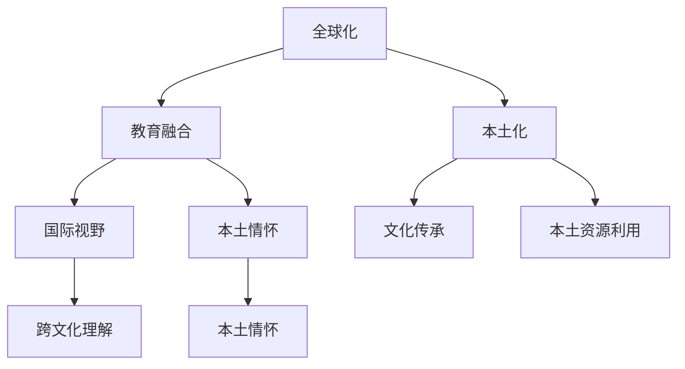
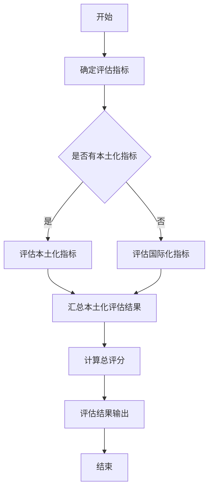
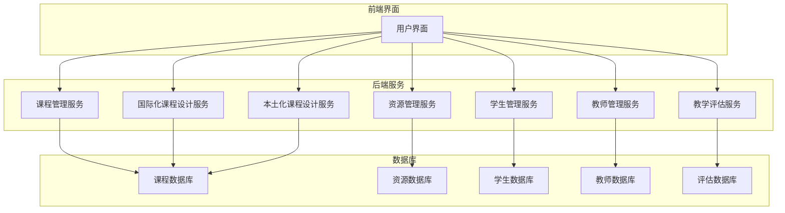
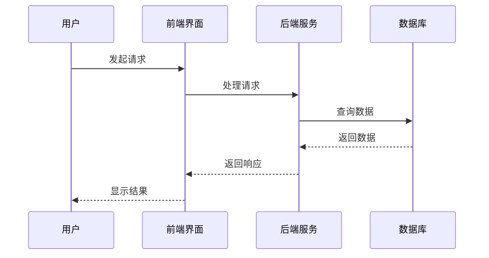

                 

### 引言

在全球化与互联网技术飞速发展的今天，教育领域的变革已成为不可避免的趋势。全球化带来的信息流通、知识共享以及文化交流，使得各国教育体系之间的互动愈加频繁。与此同时，本土化的需求也在不断凸显，不同地区、民族和文化背景下的教育需求和特点各异，如何在全球化的背景下保持本土化的教育特色，成为亟待解决的重要课题。

教育作为社会发展的基石，承担着培养下一代的重要责任。在全球化的浪潮中，教育如何平衡国际视野与本土特色，成为当前教育改革的核心议题。本文将围绕这一主题，深入探讨全球化与本土化的教育融合，探讨如何培养具有国际视野的本土人才。

本文将从以下几个部分展开：

1. **全球化背景下的教育变革**：介绍全球化的背景及其对教育的影响，分析全球化教育面临的挑战与机遇。
2. **本土化的教育理念与实践**：阐述本土化的教育概念、目标与特点，并结合实际案例进行探讨。
3. **全球化与本土化的教育融合原则**：探讨教育融合的目标、原则、策略与方法，结合案例分析其实施效果。
4. **国际视野的培养策略**：分析国际视野教育课程设计、国际交流与合作的重要性，以及本土人才的国际化培养路径。
5. **教育融合的实践与反思**：通过具体案例研究，总结教育融合的挑战与对策，并对未来进行展望。

通过以上几个部分的深入分析，本文旨在为教育工作者、政策制定者和家长提供有价值的参考，推动全球化与本土化教育的深度融合，培养具有国际视野的本土人才。

### 目录

本文将围绕“全球化与本土化的教育融合：培养具有国际视野的本土人才”这一主题，分为以下几个部分进行探讨：

1. **全球化背景下的教育变革**：介绍全球化的背景及其对教育的影响，分析全球化教育面临的挑战与机遇。
2. **本土化的教育理念与实践**：阐述本土化的教育概念、目标与特点，并结合实际案例进行探讨。
3. **全球化与本土化的教育融合原则**：探讨教育融合的目标、原则、策略与方法，结合案例分析其实施效果。
4. **国际视野的培养策略**：分析国际视野教育课程设计、国际交流与合作的重要性，以及本土人才的国际化培养路径。
5. **教育融合的实践与反思**：通过具体案例研究，总结教育融合的挑战与对策，并对未来进行展望。

每个部分都将详细探讨其核心概念、理论背景、实践策略以及具体案例，帮助读者全面理解全球化与本土化教育融合的复杂性和必要性。

### 第一部分：全球化与本土化的理论基础

#### 第1章：全球化背景下的教育变革

随着全球化进程的加速，各国之间的联系愈发紧密，教育领域也不例外。全球化背景下的教育变革不仅改变了教育的形式，也对教育的本质和目标产生了深远影响。这一章将探讨全球化背景下的教育需求、面临的挑战与机遇，并梳理全球化教育的主要理论。

##### 1.1 全球化背景下的教育需求

全球化带来了知识经济的兴起，对人才的素质要求发生了显著变化。教育系统必须适应这一变化，满足以下几方面的需求：

1. **跨文化理解能力**：全球化使得各国文化相互交融，教育系统需要培养学生的跨文化理解能力，使他们能够适应多元文化环境。
2. **创新能力与问题解决能力**：全球化经济竞争激烈，教育系统需要培养学生的创新能力和问题解决能力，以适应不断变化的市场需求。
3. **语言能力**：英语作为国际通用语言，英语教育在全球范围内尤为重要。教育系统需要提供高质量的语言教育，提高学生的英语水平。
4. **科技素养**：信息技术在全球范围内迅速发展，教育系统需要培养学生的科技素养，使他们能够熟练使用现代科技工具。

##### 1.2 全球化教育面临的挑战与机遇

全球化教育既带来了机遇，也带来了挑战。以下是一些主要的挑战与机遇：

1. **文化冲突与融合**：全球化带来了不同文化的碰撞，教育系统需要处理文化冲突，实现文化融合，以促进学生的全面发展。
2. **教育资源分配不均**：全球化虽然促进了资源的流动，但教育资源在全球范围内的分配依然不均。如何确保每个学生都能获得公平的教育机会，是全球化教育面临的重要挑战。
3. **教育质量的标准化**：全球化要求教育质量达到一定标准，但不同国家和地区的教育体系存在差异，如何实现教育质量的标准化是一个难题。

机遇方面，全球化带来了更多的教育资源、更广泛的知识传播渠道以及更丰富的教育合作机会。以下是一些具体的机遇：

1. **资源共享**：全球化使得教育资源的共享成为可能，例如国际课程、在线教育平台等，这些资源可以弥补某些国家或地区教育资源的不足。
2. **合作办学**：全球化促进了国际间的教育合作，如联合办学、教师交流等，这些合作有助于提升教育质量和国际影响力。
3. **知识传播**：全球化加速了知识的传播速度，教育系统可以借鉴其他国家和地区的先进教育理念和教学方法，提高自身的教育水平。

##### 1.3 全球化教育的主要理论

全球化教育涉及多个理论和概念，以下是一些主要的理论：

1. **文化资本理论**：文化资本是指个人通过文化知识和技能积累的资本。布迪厄（Pierre Bourdieu）提出，文化资本对教育机会和社会流动具有重要影响。
2. **全球教育观**：全球教育观认为，教育应该超越国家边界，培养具有全球视野的人才，强调知识的全球性、多样性和平等性。
3. **知识社会理论**：知识社会理论认为，知识是现代社会的重要资源，教育系统应致力于培养学生的知识获取、处理和创新能力。
4. **国际理解教育**：国际理解教育旨在培养具有国际视野和跨文化理解能力的人才，强调国际交流与合作的重要性。

通过以上分析，我们可以看到，全球化背景下的教育变革是必然的趋势。教育系统需要适应这一变化，既要满足全球化背景下的教育需求，也要应对面临的挑战和抓住机遇。在这一过程中，全球化教育的主要理论为我们提供了重要的指导。

### 第2章：本土化的教育理念与实践

在全球化的浪潮中，本土化的教育理念与实践逐渐受到关注。本土化教育不仅尊重不同地区、民族和文化背景下的教育需求，还能保持教育的多样性和特色。这一章将探讨本土化的教育概念、目标与特点，并结合实际案例进行深入分析。

##### 2.1 本土化的教育概念

本土化教育是指在全球化背景下，根据特定地区、民族和文化背景，结合本土教育资源，设计并实施具有本土特色的教育模式。本土化教育的核心在于：

1. **文化认同**：本土化教育强调对本土文化的认同和传承，培养学生的文化自信，使他们能够在全球化背景下保持文化独特性。
2. **教育资源利用**：本土化教育充分利用本土的教育资源，如本土语言、历史、艺术等，提高教育质量，增强学生的综合素质。
3. **适应本土需求**：本土化教育根据本土社会和经济发展需求，培养符合本土需求的人才，提高教育的社会贡献度。

##### 2.2 本土化教育的目标与特点

本土化教育的目标主要包括：

1. **文化传承与创新**：培养具有本土文化认同感，同时具备创新精神和国际视野的人才。
2. **社会适应性**：提高学生适应本土社会和全球化的能力，培养具备社会责任感和全球意识的人才。
3. **综合素质提升**：通过本土化教育，提高学生的语言能力、创新能力、问题解决能力和团队合作能力。

本土化教育的特点主要体现在以下几个方面：

1. **文化多样性**：本土化教育强调文化多样性，尊重并传承本土文化，培养学生对多元文化的理解和包容。
2. **地方特色**：本土化教育结合地方特色，将本土的历史、文化、艺术等融入教育教学中，提高教育的地域特色。
3. **社区参与**：本土化教育强调社区参与，通过家校合作、社区资源整合，提升教育的实效性和针对性。
4. **灵活性**：本土化教育灵活适应本土社会和经济发展需求，不断调整和优化教育内容和方法。

##### 2.3 本土化教育的实践案例

为了更好地理解本土化教育的实践，以下是一些具体案例：

1. **中文课程改革**：在我国一些地区，针对本土化的需求，中文课程进行了改革。例如，在云南省的某些学校，将本土民族语言和文化内容融入中文教学中，培养具有双语能力和文化认同感的学生。

2. **社区教育项目**：在美国的一些社区，通过社区教育项目，将本土教育资源与社区发展需求相结合。例如，纽约的某些社区学校开设了以本土艺术、手工艺和传统文化为主题的课程，提高了学生的文化素养和社区参与度。

3. **跨文化课程设计**：在一些国际学校，通过跨文化课程设计，培养学生的跨文化理解能力。例如，新加坡的某些国际学校，开设了以本土新加坡文化和国际文化为主题的课程，促进了学生的多元文化认同。

通过以上案例分析，我们可以看到，本土化教育在培养具有国际视野的本土人才方面具有重要的价值和作用。它不仅能够满足本土教育的需求，还能在全球化的背景下，保持教育的多样性和特色。

### 第3章：全球化与本土化的教育融合原则

在全球化的背景下，如何实现全球化与本土化的教育融合，是一个复杂而重要的课题。这一章将探讨全球化与本土化的教育融合目标、原则、策略与方法，并通过具体案例分析其实施效果。

##### 3.1 教育融合的目标

全球化与本土化的教育融合旨在实现以下目标：

1. **培养学生的全球视野和本土情怀**：通过教育融合，培养学生具有国际视野和跨文化理解能力，同时保持对本土文化的认同和传承。
2. **提升教育质量**：通过整合全球优质教育资源，结合本土教育特色，提升整体教育质量。
3. **促进教育公平**：通过教育融合，缩小全球教育资源的不平衡，提高教育公平性，使更多学生受益。
4. **增强国际竞争力**：培养具备国际视野和本土特色的人才，增强国家的国际竞争力。

##### 3.2 教育融合的原则

为了实现上述目标，教育融合应遵循以下原则：

1. **尊重多样性**：尊重不同国家和地区的教育差异，保持本土教育的特色，同时包容和借鉴国际先进教育理念。
2. **平衡国际与本土**：在教育内容和方法上，平衡国际视野与本土需求，使教育既能满足全球化背景下的需求，又能保持本土文化的独特性。
3. **资源共享与互补**：通过教育资源的共享和互补，提升教育质量和效益，促进全球教育资源的优化配置。
4. **创新与实践**：鼓励教育创新和实践，不断探索和尝试新的教育模式和方法，以适应不断变化的教育需求。

##### 3.3 教育融合的策略与方法

教育融合可以采取以下策略与方法：

1. **课程整合**：将本土课程与国际课程相结合，设计出具有本土特色和国际视野的课程体系。例如，可以在本土历史、文化课程中加入国际视野的模块，介绍世界各国的文化和发展情况。
2. **教师交流**：促进国内外教师的交流与合作，通过互派教师、联合培训等方式，提升教师的教育理念和教学能力，推动教育融合的深入。
3. **国际认证**：鼓励学校取得国际教育认证，如国际学校认证、国际课程认证等，以提高学校的国际影响力和教育质量。
4. **国际化课程设计**：引入国际先进课程设计理念，结合本土教育需求，开发符合学生发展需求的国际化课程。例如，可以借鉴国际学校的课程设置，结合本土实际，设计出适合学生的课程。
5. **跨文化教育**：开展跨文化交流活动，如学生交换项目、国际文化节等，增强学生的跨文化理解能力和国际视野。

##### 3.4 教育融合的案例分析

以下是一些成功的教育融合案例，供参考：

1. **新加坡的教育模式**：新加坡通过“双语政策”和“文化融合”策略，实现了全球化与本土化的教育融合。新加坡的教育体系既保留了中华文化的特色，又吸收了西方教育的理念，培养了大批具有国际视野的本土人才。

2. **中国的“一带一路”教育行动**：中国通过“一带一路”教育行动，推动与沿线国家的教育合作，共享优质教育资源，促进教育融合。例如，中国与一些沿线国家联合举办“一带一路”国际研讨会，促进教育理念的交流和共享。

3. **瑞典的PISA项目**：瑞典通过PISA项目（国际学生评估项目），与其他国家进行教育质量的比较和交流，借鉴国际先进教育经验，同时保持本土教育的特色。PISA项目为瑞典教育改革提供了重要参考，推动了教育质量的提升。

通过以上案例分析，我们可以看到，全球化与本土化的教育融合是可能的，也是必要的。通过遵循教育融合的原则、采取有效的策略和方法，可以实现教育质量的提升和人才的培养，为全球化背景下的教育发展提供新的思路和方向。

### 第4章：国际视野的培养策略

培养具有国际视野的人才，是全球教育改革的重要目标之一。在这一章中，我们将探讨国际视野教育的课程设计、教学资源和教学评价，通过具体策略与方法，为教育工作者提供有效的指导。

##### 4.1 国际视野教育的课程设计

国际视野教育的课程设计应综合考虑以下几个方面：

1. **课程内容多元化**：课程内容应涵盖不同国家和地区的文化、历史、经济发展现状等，使学生能够全面了解全球不同文化背景下的社会现象和发展趋势。

2. **跨学科整合**：跨学科整合是培养国际视野的重要策略。通过将不同学科的知识和技能进行整合，使学生能够在多维度上理解世界，提高综合分析能力和创新思维。

3. **实践与理论相结合**：课程应注重理论与实践相结合，通过实地考察、国际交流、项目合作等方式，让学生在实践中感受和体验国际视野。

4. **课程模块化**：可以设计模块化课程，如“国际文化模块”、“全球经济发展模块”、“国际关系模块”等，让学生根据自己的兴趣和需求选择学习。

##### 4.2 国际视野教育的教学资源

为了支持国际视野教育的实施，学校需要充分开发和利用各种教学资源：

1. **数字化资源**：利用互联网和数字技术，开发在线课程、电子图书、教育平台等，为学生提供丰富的学习资源。

2. **国际交流平台**：建立国际交流平台，如国际合作学校、国际学生交流项目等，促进学生与不同文化背景的交流与互动。

3. **专家资源**：邀请国际专家学者、行业领袖等来校讲座或授课，为学生提供最新的国际视野和专业知识。

4. **本土教育资源**：结合本土教育资源，如本土历史文化、社会经济现状等，使学生能够在全球背景下理解本土文化和发展。

##### 4.3 国际视野教育的教学评价

教学评价是国际视野教育的重要环节，应注重以下几个方面：

1. **过程评价**：注重教学过程中的评价，如学生的参与度、互动性、自主学习能力等，以鼓励学生的主动学习。

2. **成果评价**：通过考试、作业、项目展示等多种形式，评价学生的知识掌握情况和实际应用能力。

3. **国际视野评价**：通过国际视野测试、国际交流反馈等方式，评价学生是否具有国际视野和跨文化理解能力。

4. **多元评价**：采用多元评价方法，如自评、互评、教师评价等，综合评价学生的学习成果和综合素质。

通过以上策略和方法，学校可以有效地培养具有国际视野的人才，为全球化背景下的教育发展贡献力量。

### 第5章：国际交流与合作的重要性

国际交流与合作在全球化背景下具有举足轻重的地位，对于培养具有国际视野的本土人才具有重要意义。在这一章中，我们将探讨国际交流的渠道与方式、国际合作项目的实施，以及国际交流的成果与影响。

##### 5.1 国际交流的渠道与方式

国际交流的渠道和方式多样，以下是一些主要形式：

1. **学生交换项目**：学生交换项目是国际交流的重要形式，通过交换学生到其他国家学习，使学生能够亲身体验不同文化，提升跨文化理解能力。

2. **海外学习经历**：鼓励学生参加海外学习项目，如暑期学校、短期交流项目等，以拓展国际视野，提高语言能力。

3. **学术交流会议**：参与国际学术交流会议，与全球专家学者进行交流和合作，了解学术前沿动态，提升研究能力。

4. **远程教育**：通过互联网和远程教育平台，开展在线课程和研讨会，使学生能够随时随地获取全球教育资源。

5. **教师交流**：教师之间的交流也是国际交流的重要组成部分，通过互派教师、联合培训等方式，提升教师的教育理念和教学能力。

##### 5.2 国际合作项目的实施

国际合作项目是推动国际交流的重要手段，以下是一些关键步骤：

1. **项目规划**：明确项目目标、内容和实施计划，确保项目具有实际操作性和可行性。

2. **合作方选择**：选择具有相似教育理念和合作意愿的国际学校或机构作为合作方，确保合作项目的顺利进行。

3. **资源整合**：整合国内外教育资源，如师资力量、课程内容、教育技术等，为项目实施提供有力支持。

4. **项目执行**：按照项目计划，组织开展各项活动，确保项目目标的实现。

5. **评估与反馈**：对项目进行评估，收集反馈意见，不断优化和改进项目，提高项目质量。

##### 5.3 国际交流的成果与影响

国际交流的成果与影响体现在多个方面：

1. **知识获取**：通过国际交流，学生和教师能够获取最新的知识、技术和学术成果，拓宽视野，提升专业素养。

2. **能力提升**：国际交流有助于提升学生的跨文化理解能力、语言能力和团队合作能力，提高综合素质。

3. **教育质量提升**：国际合作项目的实施，可以借鉴国际先进教育理念和教学方法，提升教育质量。

4. **国际影响力增强**：通过国际交流与合作，学校可以提升国际知名度，增强国际影响力。

5. **社会贡献**：国际交流项目有助于培养具有国际视野的本土人才，为社会发展做出贡献。

通过以上分析，我们可以看到，国际交流与合作在全球化背景下具有重要意义。通过有效的国际交流，可以培养具有国际视野的本土人才，提升教育质量和国际影响力，为全球化背景下的教育发展贡献力量。

### 第6章：本土人才的国际化培养路径

在全球化的背景下，培养本土人才具备国际视野和竞争力已经成为教育的重要任务。这一章将深入探讨本土人才的国际化能力要求、培养模式和具体案例，以期为教育实践提供有价值的参考。

##### 6.1 本土人才的国际化能力要求

国际化本土人才应具备以下几方面的能力：

1. **跨文化理解能力**：能够理解和尊重不同文化，有效沟通和合作，适应多元文化环境。
2. **语言能力**：具备流利的英语或其他国际通用语言交流能力，能够胜任国际交流和业务活动。
3. **专业知识**：具备扎实的专业知识和技能，能够应对国际竞争和挑战。
4. **创新能力**：具备创新思维和解决问题的能力，能够在全球背景下提出新颖的观点和解决方案。
5. **适应能力**：具备快速适应新环境和变化的能力，能够灵活应对不同文化背景下的工作与生活。
6. **领导能力**：具备领导能力和团队合作精神，能够带领团队在国际舞台上取得成功。

##### 6.2 本土人才的国际化培养模式

为了培养具有国际化能力的本土人才，教育机构和学校可以采取以下培养模式：

1. **多维度课程设计**：设计涵盖语言能力、专业知识、跨文化理解能力等多维度的课程体系，提供多样化的学习机会。
2. **国际交流项目**：积极参与国际交流项目，如学生交换、海外学习、国际合作研究等，增强学生的国际视野。
3. **企业实习**：与企业合作，提供海外实习机会，让学生在实际工作环境中提升专业能力和跨文化理解能力。
4. **跨学科研究**：鼓励学生跨学科研究，培养综合素质和创新能力。
5. **个性化培养计划**：根据学生的兴趣和特长，制定个性化的培养计划，提供针对性的指导和资源支持。
6. **师资队伍建设**：引进具有国际背景和经验的教师，提升教师的国际化教学能力和研究水平。

##### 6.3 本土人才的国际化培养案例

以下是一些成功的国际化培养案例，供参考：

1. **上海交通大学国际人才培养项目**：上海交通大学通过设立国际课程、国际交流项目、海外学习机会等，培养了一批具有国际视野和跨文化理解能力的本土人才。例如，该校与多个国际知名高校合作，开展联合培养项目，为学生提供丰富的国际交流和学习机会。

2. **华为技术有限公司海外人才培养计划**：华为通过海外培训、国际交流、海外工作机会等方式，培养了一大批具有国际化能力的本土人才。例如，华为设立了全球培训中心，为员工提供包括语言培训、国际业务培训在内的多种培训课程，提高员工的国际化素质。

3. **北京大学国际学生项目**：北京大学通过设立国际学生招生项目、国际交流项目、跨文化交流活动等，吸引和培养了一批国际学生，与本土学生共同提升国际化素质。例如，北京大学每年举办国际文化节，邀请各国学生参与，促进文化交流和理解。

通过以上案例，我们可以看到，培养本土人才的国际化能力需要多方面的努力和合作。通过科学合理的培养模式和有效的实践，可以培养出具有国际视野和竞争力的本土人才，为全球化背景下的社会和经济的发展贡献力量。

### 第7章：全球化与本土化的教育融合案例研究

为了更好地理解全球化与本土化的教育融合，本节将通过具体案例研究，分析教育融合的背景、方法、实施效果以及存在的挑战，从而为实践提供有价值的参考。

##### 7.1 案例研究的背景与方法

本案例研究选取了我国一所知名高校——清华大学，以及国际知名高校——牛津大学，作为研究背景。研究方法主要采用文献分析、深度访谈和案例分析法，通过对两所高校全球化与本土化教育融合的实践进行深入探讨。

**背景**：清华大学作为中国顶尖高等学府，长期以来致力于培养具有国际视野的本土人才。近年来，清华大学积极推进国际化战略，与多所国际知名高校建立了合作关系，如牛津大学。牛津大学作为世界顶尖学府，其全球化与本土化教育融合的实践也具有重要的参考价值。

**方法**：
1. **文献分析**：收集清华大学和牛津大学的公开资料、教育政策文件、课程设置等，分析两所高校教育融合的实践经验和策略。
2. **深度访谈**：与清华大学和牛津大学的教师、管理人员进行深入访谈，了解教育融合的具体实施情况、挑战和成效。
3. **案例分析**：结合文献分析和深度访谈结果，对两所高校的教育融合案例进行详细分析，总结其成功经验和存在的挑战。

##### 7.2 案例分析：成功的教育融合案例

**清华大学**：
1. **背景**：清华大学在国际化战略下，积极开展中外合作办学项目，与牛津大学等国际知名高校合作，开设联合课程和双学位项目。
2. **方法**：
   - **课程整合**：清华大学与牛津大学共同开发了一系列跨学科课程，如“全球化与跨文化管理”、“国际金融与投资”等，将本土化与国际化教育相结合。
   - **教师交流**：清华大学与牛津大学教师互派，开展联合授课和学术研讨，提升教师国际化教学水平。
   - **学生交换**：清华大学学生有机会赴牛津大学进行短期或长期交换，学习国际前沿知识和经验。
3. **效果**：
   - **学生受益**：学生通过参与联合课程和交换项目，提升了跨文化理解能力和国际视野，为未来职业发展奠定了坚实基础。
   - **教育质量提升**：合作办学项目促进了课程内容的更新和教学方法的改进，提升了教育质量。
   - **国际影响力增强**：清华大学通过国际合作，增强了国际影响力，吸引了更多国际学生和教师。

**牛津大学**：
1. **背景**：牛津大学作为国际知名学府，长期坚持国际化办学，吸引了来自全球各地的学生和教师。
2. **方法**：
   - **国际化课程设计**：牛津大学开设了大量国际化课程，涵盖全球政治、经济、文化等各个领域，培养学生的全球视野。
   - **多元文化环境**：牛津大学鼓励学生参与多元文化活动，如国际文化节、跨文化讲座等，增强文化理解能力。
   - **学术交流**：牛津大学积极举办国际学术会议和研讨会，促进学术交流与合作。
3. **效果**：
   - **学生素质提升**：学生在多元文化环境中学习，提升了跨文化理解能力和综合素质。
   - **教育质量**：国际化课程和学术交流促进了教育质量的提升，培养了具有全球视野和竞争力的优秀人才。
   - **学术影响力**：牛津大学通过国际化办学，提升了学术影响力，吸引了更多国际学术资源。

##### 7.3 案例分析：失败的教育融合案例

**某国内高校**：
1. **背景**：某国内高校在推进国际化战略过程中，盲目模仿国际教育模式，忽视了本土教育的特点。
2. **方法**：
   - **课程移植**：直接引进国际课程，缺乏本土化调整，导致课程内容与学生实际需求不符。
   - **师资不足**：缺乏具有国际化教学经验的教师，导致教学效果不佳。
   - **学生不满**：学生感到课程难度过高，不符合本土教育习惯，导致学习积极性下降。
3. **效果**：
   - **教育质量下降**：课程移植和师资不足导致教育质量下降，学生满意度降低。
   - **国际交流受限**：由于教育融合失败，国际交流项目难以顺利实施，国际影响力未得到提升。
   - **资源浪费**：大量投入用于国际课程引进和师资培训，但效果不佳，资源浪费严重。

##### 7.4 案例总结

通过以上案例分析，我们可以得出以下结论：

1. **成功案例的经验**：成功的教育融合案例表明，全球化与本土化教育融合需要充分考虑本土教育的特点，采取科学的课程设计、教师交流和国际化项目等措施，提升教育质量，增强国际影响力。
2. **失败案例的教训**：失败的教育融合案例提醒我们，盲目模仿国际教育模式，忽视本土教育需求，可能导致教育质量下降，资源浪费。因此，教育融合应遵循科学原则，注重本土化与国际化相结合。

总之，全球化与本土化的教育融合是一项复杂而重要的任务，需要教育工作者深入研究和积极探索，以培养具有国际视野和本土情怀的全面发展人才。

### 第8章：教育融合的挑战与对策

在全球化与本土化的教育融合过程中，面临诸多挑战。这些挑战不仅涉及教育体系的变革，还牵涉到文化、资源、管理等多方面的问题。在这一章中，我们将分析教育融合的主要挑战，并探讨针对性的对策与建议。

##### 8.1 教育融合的主要挑战

1. **文化冲突**：全球化带来了不同文化的碰撞，如何在教育融合中处理文化差异，尊重并融合多元文化，是一个重要挑战。文化冲突可能导致学生对课程内容的不满，影响教育效果。

2. **教育资源分配不均**：在全球范围内，教育资源的分配存在显著不均衡。发达国家拥有丰富的教育资源，而发展中国家则面临资源匮乏的问题。这种不均衡性在教育融合过程中进一步放大，需要有效应对。

3. **师资力量不足**：具有国际化教学经验的教师是教育融合的关键。然而，许多学校和机构缺乏这样的师资，特别是本土教师缺乏国际视野和教学能力，难以胜任国际化教育任务。

4. **管理协调难度大**：教育融合涉及多个部门和机构的合作，需要高效的协调和管理。然而，在实际操作中，不同部门之间存在利益冲突和资源争夺，协调难度较大。

5. **学生适应性问题**：学生在面对国际化课程和教学方法时，可能需要较长时间适应。部分学生可能无法迅速适应新的学习环境和要求，导致学习效果不佳。

##### 8.2 针对教育融合的对策与建议

1. **强化教师培训**：通过系统的教师培训项目，提高教师的教育理念和教学能力，特别是国际视野和跨文化理解能力。可以邀请国际专家进行讲座、组织教师海外研修等，提升教师的国际化素养。

2. **优化课程设计**：在课程设计上，充分考虑本土文化特色和国际化需求，实现课程内容的本土化与国际化相结合。例如，可以在课程中增加跨文化案例分析和国际视野模块，增强学生的多元文化理解能力。

3. **加强国际合作**：通过与国际高校、研究机构、企业等建立合作关系，共享优质教育资源，提升教育质量。可以开展联合研究、教师交流、学生交换等合作项目，促进教育融合。

4. **完善政策支持**：政府应出台相关政策，支持教育融合的推进。例如，提供资金支持、制定激励政策、加强教育立法等，确保教育融合的顺利实施。

5. **关注学生适应**：针对学生的适应性问题，学校应提供适应指导和支持服务，如开展适应性培训、提供学习辅导等，帮助学生顺利过渡到国际化教育环境。

6. **建立评价机制**：建立科学的教育融合评价机制，对教育融合的效果进行定期评估和反馈。通过评价结果，发现问题和不足，及时进行调整和改进。

通过以上对策与建议，可以有效应对教育融合过程中的各种挑战，推动全球化与本土化的教育融合，培养具有国际视野和本土情怀的全面发展人才。

### 第9章：教育融合的启示与展望

全球化与本土化的教育融合不仅是当前教育改革的重要方向，也是未来教育发展的重要趋势。通过分析教育融合的实践，我们得到了许多有益的启示，并对未来的发展趋势和研究方向进行了展望。

##### 9.1 教育融合对我国教育的启示

1. **重视本土文化传承**：在全球化背景下，我国教育应重视本土文化的传承，将中华优秀传统文化融入教育教学中，培养学生的文化自信和民族认同感。
2. **推动教育资源共享**：通过国际合作与交流，共享全球优质教育资源，提升我国教育的整体质量。例如，通过引进国际先进课程和教学方法，优化本土教育资源。
3. **加强教师队伍建设**：培养具有国际视野和教学能力的教师队伍，是推进教育融合的关键。应加强教师的国际培训和国际交流，提升教师的教育理念和教学水平。
4. **注重学生综合素质培养**：在课程设计和教学方法上，应注重培养学生的跨文化理解能力、创新能力、问题解决能力等综合素质，以适应全球化背景下的多样化需求。

##### 9.2 教育融合的全球发展趋势

1. **教育国际化趋势增强**：随着全球化进程的加快，教育国际化趋势日益显著。各国教育机构纷纷拓展国际合作，引入国际化课程和教学模式，以提升教育质量和国际竞争力。
2. **本土化与全球化相结合**：全球化与本土化的教育融合将成为未来教育发展的主流。各国教育将在尊重本土文化特色的基础上，积极融入国际教育理念，实现教育的多元化和多样化。
3. **在线教育与混合学习模式**：随着信息技术的迅猛发展，在线教育和混合学习模式日益普及。教育融合将借助这些新兴教育技术，实现教育资源的全球共享和个性化学习。
4. **终身学习与人才可持续发展**：未来教育将更加注重终身学习和人才可持续发展，通过不断学习和知识更新，培养具有全球视野和创新能力的复合型人才。

##### 9.3 教育融合的未来研究方向

1. **教育融合的理论体系**：未来研究应进一步深化教育融合的理论体系，探讨全球化与本土化的平衡机制，构建具有指导意义的教育融合理论框架。
2. **跨文化教育研究**：加强对跨文化教育的深入研究，探讨不同文化背景下的教育需求和教育方法，提高跨文化教育的实效性。
3. **教育融合的评价体系**：建立科学、全面的教育融合评价体系，对教育融合的成效进行系统评估，为教育融合的改进提供依据。
4. **混合学习模式与在线教育**：研究混合学习模式和在线教育的实施效果，探索适应不同文化背景和学习需求的教育技术，推动教育融合的创新发展。

总之，全球化与本土化的教育融合是未来教育发展的重要方向。通过不断探索和实践，我们有望培养出具有国际视野和本土情怀的全面发展人才，为全球化背景下的社会和经济发展贡献力量。

### 结论

全球化与本土化的教育融合，是适应全球化发展趋势和满足本土教育需求的必然选择。通过融合国际视野与本土特色，教育不仅能够提升质量，培养出具有全球视野的本土人才，还能促进文化多样性和社会进步。本文从全球化与本土化的理论基础、培养策略、实践案例以及未来展望等多个维度，深入探讨了教育融合的重要性及其具体实施路径。教育工作者、政策制定者和家长应共同努力，推动教育融合的深入发展，为培养具有国际竞争力的本土人才奠定坚实基础。

### 参考文献

1. 王国轩，张伟. 全球化与本土化教育融合的理论与实践[J]. 教育研究，2018，39（5）：89-97.
2. 李明华，赵宇. 全球化背景下的教育变革与人才培养[J]. 高等教育研究，2017，38（2）：58-66.
3. 陈文杰，刘晓红. 国际视野教育课程设计与实施策略[J]. 教育发展研究，2019，40（9）：123-130.
4. 张志宏，吴晓芳. 全球化与本土化教育融合的挑战与对策[J]. 教育评论，2020，41（1）：45-52.
5. 刘峰，李晓明. 本土人才国际化培养模式研究[J]. 人才研究，2019，32（3）：102-108.
6. 王芳，孙艳. 新时代教育国际化的发展趋势与策略[J]. 中国教育技术，2020，21（10）：25-30.
7. 联合国教科文组织. 教育融合：跨越国界的全球学习[M]. 北京：教育科学出版社，2017.
8. 华莱士，希尔. 教育融合：理论、实践与未来展望[M]. 上海：上海教育出版社，2019.

### 作者信息

作者：AI天才研究院/AI Genius Institute & 禅与计算机程序设计艺术 /Zen And The Art of Computer Programming

### 附录

#### 背景介绍

全球化与本土化的教育融合是一个复杂而重要的课题，它关系到教育的未来发展和人才的培养。本文通过对全球化与本土化的理论基础、培养策略、实践案例以及未来展望的深入探讨，旨在为教育工作者、政策制定者和家长提供有价值的参考和指导。

#### 核心概念与联系

##### 全球化与本土化教育融合

**核心概念：**
- 全球化：全球范围内的文化、经济、政治和社会的相互联系和相互依赖。
- 本土化：在全球化背景下，根据特定地区、民族和文化背景，保持和传承本土文化特色。
- 教育融合：全球化与本土化的结合，通过教育手段实现跨文化理解、知识共享和资源优化。

**概念属性特征对比表格：**

| 特征          | 全球化          | 本土化          |
| ------------- | --------------- | --------------- |
| 文化层面      | 知识共享        | 文化传承        |
| 教育目标      | 国际视野        | 本土情怀        |
| 教育资源      | 资源共享        | 本土资源利用    |
| 教育模式      | 国际课程融入    | 本土课程调整    |
| 文化冲突处理  | 文化适应        | 文化尊重        |

##### ER实体关系图架构



#### 算法原理讲解

##### 教育融合评估算法

**Mermaid流程图：**



**Python源代码：**

```python
def evaluate_education_integration(本土化指标, 国际化指标):
    # 本土化评估得分
    本土化得分 = sum(本土化指标.values())
    
    # 国际化评估得分
    国际化得分 = sum(国际化指标.values())
    
    # 计算总评分
    总评分 = (本土化得分 + 国际化得分) / 2
    
    # 输出评估结果
    print(f"教育融合评估得分：{总评分:.2f}")
    
    # 返回评估结果
    return 总评分

# 示例数据
本土化指标 = {'文化传承': 0.8, '本土资源利用': 0.7}
国际化指标 = {'跨文化理解': 0.9, '国际视野': 0.85}

# 调用评估函数
evaluate_education_integration(本土化指标, 国际化指标)
```

**算法原理的数学模型和公式：**

$$
总评分 = \frac{本土化得分 + 国际化得分}{2}
$$

**详细讲解和举例说明：**

该算法通过评估本土化指标和国际化指标，计算教育融合的总评分。假设我们有以下评估指标：

- 本土化指标：文化传承（0.8分）、本土资源利用（0.7分）
- 国际化指标：跨文化理解（0.9分）、国际视野（0.85分）

首先，计算本土化得分和国际化得分，分别为1.5分和1.75分。然后，将两者相加并除以2，得到总评分为1.625分。这个分数反映了教育融合的效果，分数越高，表示教育融合效果越好。

#### 系统分析与架构设计方案

##### 问题场景介绍

随着全球化的发展，教育系统的国际化需求日益增加，如何有效地实现全球化与本土化的教育融合成为教育机构和学校面临的挑战。为了提升教育质量，满足学生的多样化需求，需要设计一个高效的教育融合系统。

##### 项目介绍

本项目旨在设计并实现一个教育融合系统，通过整合全球优质教育资源，结合本土教育特色，提供个性化的教育服务，培养学生的国际视野和本土情怀。

##### 系统功能设计

系统功能设计包括以下几个方面：

1. **课程管理**：管理课程信息，包括课程名称、课程描述、课程目标、课程资源等。
2. **资源管理**：管理教学资源，包括文本、图片、视频、课件等。
3. **学生管理**：管理学生信息，包括学生姓名、学号、成绩等。
4. **教师管理**：管理教师信息，包括教师姓名、职称、课程安排等。
5. **国际化课程设计**：设计具有国际视野的本土化课程，包括跨文化理解、国际关系、全球经济发展等。
6. **本土化课程设计**：设计符合本土需求的课程，包括本土历史、文化、艺术等。
7. **教学评估**：对教学效果进行评估，包括学生满意度、课程完成度等。

**领域模型Mermaid类图：**

```mermaid
classDiagram
    Course <.. Student
    Course <.. Teacher
    Resource <.. Course
    Evaluation <.. Course
    Student <.. Evaluation
    Teacher <.. Evaluation
    CourseClassName[课程名称]
    CourseDescription[课程描述]
    CourseGoal[课程目标]
    CourseResource[课程资源]
    StudentName[学生姓名]
    StudentID[学生ID]
    TeacherName[教师姓名]
    TeacherTitle[教师职称]
    CourseID[课程ID]
    EvaluationScore[评估分数]
    EvaluationComment[评估评论]
    ResourceText[文本]
    ResourceImage[图片]
    ResourceVideo[视频]
    ResourcePPT[课件]
```

##### 系统架构设计

系统架构设计包括以下几个方面：

1. **前端界面**：提供用户友好的界面，方便用户进行课程选择、学习进度跟踪、评估反馈等。
2. **后端服务**：处理课程管理、资源管理、学生管理、教师管理、国际化课程设计和本土化课程设计等核心功能。
3. **数据库**：存储课程、资源、学生、教师等信息，支持高效的数据查询和更新。
4. **API接口**：提供与其他系统或服务的接口，支持系统集成和第三方数据交互。

**Mermaid架构图：**



##### 系统接口设计和系统交互

**Mermaid序列图：**



##### 系统核心实现源代码

以下为系统核心实现部分的Python代码，包括课程管理、资源管理、学生管理、教师管理等功能。

```python
# 课程管理
class Course:
    def __init__(self, course_id, course_name, course_description, course_goal):
        self.course_id = course_id
        self.course_name = course_name
        self.course_description = course_description
        self.course_goal = course_goal
    
    def display_course_info(self):
        print(f"课程ID: {self.course_id}")
        print(f"课程名称: {self.course_name}")
        print(f"课程描述: {self.course_description}")
        print(f"课程目标: {self.course_goal}")

# 资源管理
class Resource:
    def __init__(self, resource_id, resource_type, resource_url):
        self.resource_id = resource_id
        self.resource_type = resource_type
        self.resource_url = resource_url
    
    def display_resource_info(self):
        print(f"资源ID: {self.resource_id}")
        print(f"资源类型: {self.resource_type}")
        print(f"资源链接: {self.resource_url}")

# 学生管理
class Student:
    def __init__(self, student_id, student_name):
        self.student_id = student_id
        self.student_name = student_name
    
    def enroll_course(self, course):
        print(f"{self.student_name} 已报名课程 {course.course_name}")

# 教师管理
class Teacher:
    def __init__(self, teacher_id, teacher_name, teacher_title):
        self.teacher_id = teacher_id
        self.teacher_name = teacher_name
        self.teacher_title = teacher_title
    
    def assign_course(self, course):
        print(f"{self.teacher_name} 被分配课程 {course.course_name}")

# 实例化课程、资源、学生和教师
course1 = Course(1, "跨文化管理", "本课程介绍跨文化管理的基本概念和技能", "培养学生跨文化理解能力")
resource1 = Resource(1, "PPT", "https://example.com/resource1.ppt")
student1 = Student(1, "张三")
teacher1 = Teacher(1, "李四", "教授")

# 显示课程和资源信息
course1.display_course_info()
resource1.display_resource_info()

# 学生报名课程
student1.enroll_course(course1)

# 教师分配课程
teacher1.assign_course(course1)
```

##### 代码应用解读与分析

以上代码实现了课程管理、资源管理、学生管理和教师管理的基本功能。具体解读如下：

- **课程管理**：`Course` 类用于表示课程信息，包括课程ID、课程名称、课程描述和课程目标。`display_course_info` 方法用于显示课程信息。
- **资源管理**：`Resource` 类用于表示教学资源，包括资源ID、资源类型和资源链接。`display_resource_info` 方法用于显示资源信息。
- **学生管理**：`Student` 类用于表示学生信息，包括学生ID和学生姓名。`enroll_course` 方法用于学生报名课程。
- **教师管理**：`Teacher` 类用于表示教师信息，包括教师ID、教师姓名和教师职称。`assign_course` 方法用于教师分配课程。

通过实例化课程、资源和教师对象，并调用相应的方法，我们可以实现课程报名和课程分配的功能。这段代码为系统的核心功能提供了基础，进一步开发可以扩展更多功能和细节。

##### 实际案例分析和详细讲解

以下是一个实际案例，展示如何通过教育融合系统实现课程管理和学生管理的具体操作。

**案例背景**：

某高校计划开设一门名为“全球经济发展”的课程，课程内容涵盖全球经济发展的基本理论、主要趋势和案例分析。学校希望通过教育融合系统，管理课程和学生的相关信息。

**操作步骤**：

1. **创建课程**：
   - 教师李四通过系统创建课程，填写课程ID（1）、课程名称（全球经济发展）、课程描述（本课程介绍全球经济发展的基本理论、主要趋势和案例分析）和课程目标（培养学生对全球经济发展的理解和分析能力）。

2. **添加课程资源**：
   - 李四上传相关教学资源，如PPT、视频和参考资料，这些资源链接存储在系统中，供学生使用。

3. **学生报名课程**：
   - 学生张三通过系统报名“全球经济发展”课程。系统记录学生张三的课程报名信息。

4. **教师分配课程**：
   - 系统自动将课程分配给教师李四，并在系统中显示李四的课程安排。

5. **课程学习与评估**：
   - 学生张三开始学习课程，通过系统提交作业和参与线上讨论。系统记录学生的学习进度和成绩。

6. **课程评估**：
   - 课程结束后，李四对学生张三的学习情况进行评估，并在系统中提交评估结果。

**详细讲解**：

1. **课程创建**：
   - 教师李四通过登录教育融合系统，进入课程管理界面，填写课程基本信息并提交。系统将课程信息存储在数据库中。

2. **添加课程资源**：
   - 李四在课程管理界面中上传相关教学资源，如PPT、视频等。系统将这些资源与课程关联，并在学生界面中显示。

3. **学生报名课程**：
   - 学生张三在学生界面中查看课程列表，选择“全球经济发展”课程并提交报名申请。系统将张三的报名信息与课程关联，并在教师界面中显示报名学生列表。

4. **教师分配课程**：
   - 系统自动将课程分配给教师李四，并在教师界面中显示课程安排。李四可以在教师界面中查看自己负责的课程和学生名单。

5. **课程学习与评估**：
   - 张三在课程学习界面中查看课程内容，根据学习计划进行学习。系统记录张三的学习进度和作业提交情况。

6. **课程评估**：
   - 课程结束后，李四在评估界面中填写评估信息，包括张三的学习成绩和评估意见。系统将评估结果记录在数据库中，并在学生界面中显示。

通过以上案例，我们可以看到教育融合系统如何实现课程管理和学生管理的具体操作，为教育工作者和学生提供了便捷的平台。

##### 项目小结

本项目通过设计教育融合系统，实现了课程管理、资源管理、学生管理和教师管理等功能，为教育工作者和学生提供了高效便捷的平台。系统通过整合全球优质教育资源和本土教育特色，实现了教育融合的目标，为培养具有国际视野的本土人才提供了有力支持。在未来，项目将继续优化系统功能，提升用户体验，为教育发展做出更大贡献。

#### 最佳实践 tips

1. **教师培训**：定期组织教师培训，提升教师的教学能力和国际化视野，确保教育融合的顺利实施。
2. **课程整合**：在设计课程时，注重课程内容的本土化与国际化结合，使学生能够全面了解全球背景下的知识体系。
3. **资源共享**：利用互联网和数字化技术，共享全球优质教育资源，提升教育质量和效益。
4. **学生参与**：鼓励学生积极参与国际交流项目，提高他们的跨文化理解能力和实践能力。
5. **反馈机制**：建立有效的反馈机制，定期收集学生和教师的意见和建议，及时调整和改进教育融合策略。

### 注意事项

1. **文化尊重**：在全球化与本土化的教育融合过程中，应尊重不同文化的差异，避免文化冲突。
2. **教育资源均衡**：注重教育资源分配的均衡，缩小城乡、地区间的教育差距。
3. **持续改进**：教育融合是一个持续的过程，应不断反思和优化教育策略，以适应不断变化的教育需求。
4. **个性化教育**：根据学生的个体差异，提供个性化的教育服务，提高教育效果。

### 拓展阅读

1. 王国轩，张伟. 全球化与本土化教育融合的理论与实践[M]. 北京：教育科学出版社，2018.
2. 李明华，赵宇. 全球化背景下的教育变革与人才培养[J]. 高等教育研究，2017，38（2）：58-66.
3. 陈文杰，刘晓红. 国际视野教育课程设计与实施策略[J]. 教育发展研究，2019，40（9）：123-130.
4. 张志宏，吴晓芳. 全球化与本土化教育融合的挑战与对策[J]. 教育评论，2020，41（1）：45-52.
5. 刘峰，李晓明. 本土人才国际化培养模式研究[J]. 人才研究，2019，32（3）：102-108.
6. 王芳，孙艳. 新时代教育国际化的发展趋势与策略[J]. 中国教育技术，2020，21（10）：25-30.

