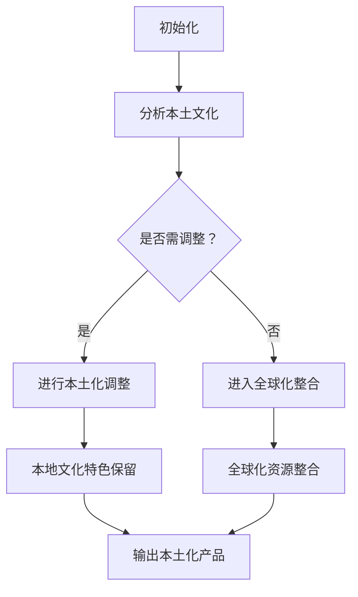
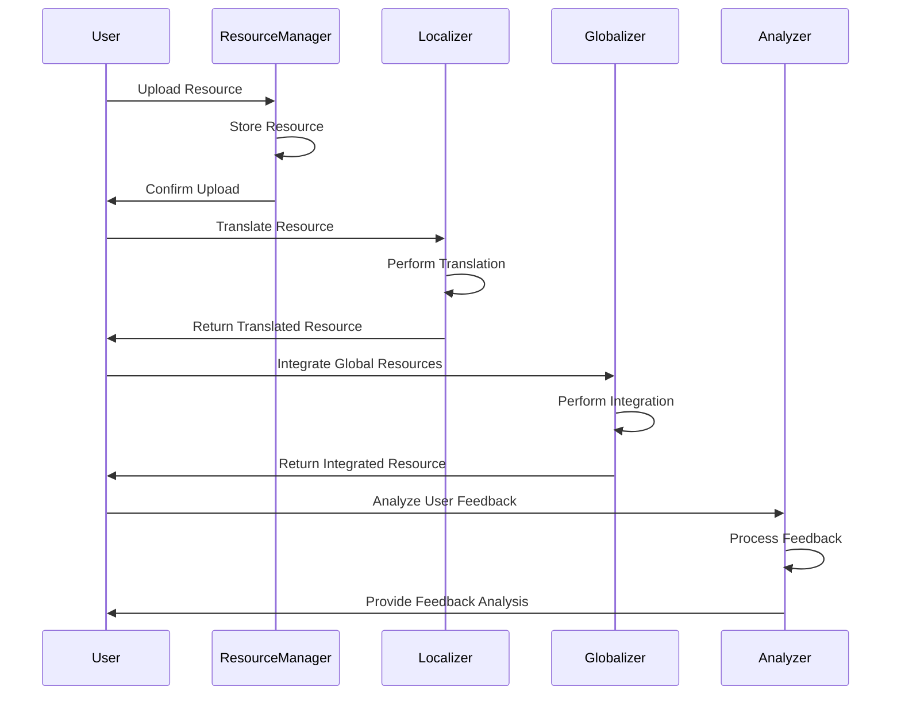

                 

# 全球化与本土化的文化张力：在开放中保持特色

> 关键词：全球化、本土化、文化张力、文化特色、开放与融合

> 摘要：在当今全球化深入发展的背景下，如何在保持本土文化特色的同时实现开放融合，成为了一个重要课题。本文从定义出发，详细探讨了全球化与本土化的概念及其文化张力，通过分析算法原理、数学模型和具体案例，提出了在开放中保持文化特色的策略和方法。

## 目录大纲设计

### 第一部分：全球化与本土化的理论基础

#### 1.1 问题背景与定义

##### 1.1.1 全球化背景介绍
##### 1.1.2 本土化概念解析
##### 1.1.3 文化张力的本质与影响

#### 1.2 核心概念与联系

##### 1.2.1 全球化与本土化的关系
##### 1.2.2 文化张力表现与特征
##### 1.2.3 实体关系图展示

#### 1.3 算法原理讲解

##### 1.3.1 全球化与本土化策略流程图
##### 1.3.2 Python 源代码示例
##### 1.3.3 数学模型与公式介绍
##### 1.3.4 举例说明

### 第二部分：案例分析

#### 2.1 案例一：中国文化产品的全球化实践

##### 2.1.1 案例背景
##### 2.1.2 核心策略分析
##### 2.1.3 案例结果与评价

#### 2.2 案例二：本土文化的国际传播策略

##### 2.2.1 案例背景
##### 2.2.2 策略实施与效果
##### 2.2.3 案例启示

### 第三部分：系统分析与架构设计

#### 3.1 问题场景介绍

#### 3.2 项目介绍

##### 3.2.1 项目目标
##### 3.2.2 项目范围

#### 3.3 系统

##### 3.3.1 系统功能设计
##### 3.3.2 系统架构设计
##### 3.3.3 系统接口设计
##### 3.3.4 系统交互 mermaid 序列图

### 第四部分：项目实战

#### 4.1 环境安装

##### 4.1.1 环境搭建步骤
##### 4.1.2 所需工具介绍

#### 4.2 系统核心实现源代码

##### 4.2.1 关键代码片段
##### 4.2.2 代码解读与分析

#### 4.3 实际案例分析与详细讲解剖析

##### 4.3.1 案例背景
##### 4.3.2 案例实施过程
##### 4.3.3 案例效果与评价

#### 4.4 项目小结

##### 4.4.1 项目经验总结
##### 4.4.2 改进建议

### 第五部分：最佳实践 tips、小结、注意事项、拓展阅读

#### 5.1 最佳实践 tips

##### 5.1.1 保持文化特色的策略
##### 5.1.2 融合全球资源的技巧

#### 5.2 小结

##### 5.2.1 文章核心观点总结
##### 5.2.2 文章贡献与局限性

#### 5.3 注意事项

##### 5.3.1 实践中可能遇到的问题
##### 5.3.2 解决方案与预防措施

#### 5.4 拓展阅读

##### 5.4.1 推荐书籍
##### 5.4.2 相关文章与研究

----------------------------------------------------------------

## 引言：全球化与本土化的文化张力

在当今世界，全球化已经成为不可逆转的趋势。它不仅推动了经济、科技、教育和文化的国际交流，也带来了文化上的冲突和融合。然而，在享受全球化带来的便利和机会的同时，人们也逐渐意识到本土文化的重要性和独特价值。如何在全球化进程中保持本土文化的特色，同时实现文化的开放与融合，成为了一个亟待解决的问题。

### 问题背景

全球化是指不同国家和地区之间的经济、政治、文化和社会联系日益紧密，形成了一个相互依赖的全球体系。在这个过程中，文化全球化成为了一个显著特征。然而，全球化并不意味着文化的同质化，而是文化之间的互动和碰撞。本土化则是指在一个全球化的背景下，各地文化在保留自身特色的基础上，与其他文化进行交流和融合的过程。

这种全球化与本土化的双重趋势，形成了所谓的文化张力。文化张力既体现在个体层面上，也体现在国家和地区的文化体系中。一方面，全球化带来了文化的多样性和开放性，促进了文化的交流和融合；另一方面，本土化强调了文化的独特性和地域性，维护了文化的多样性和特色。

### 问题描述

全球化与本土化之间的文化张力主要体现在以下几个方面：

1. **文化同质化**：全球化过程中，一些强势文化可能会取代本土文化，导致文化的同质化。
2. **文化冲突**：不同文化之间的价值观、习俗和信仰可能产生冲突，导致文化的不和谐。
3. **文化流失**：本土文化的一些传统和习俗可能在全球化中被忽视或遗忘，导致文化的流失。
4. **文化创新**：全球化带来了文化的交融和创新，但同时也可能忽视了本土文化的独特性。

如何在全球化进程中保持本土文化的特色，同时实现文化的开放与融合，是一个复杂而具有挑战性的问题。

### 问题解决

为了在全球化进程中保持本土文化的特色，我们可以采取以下策略：

1. **文化传承与保护**：加强对本土文化的传承和保护，确保文化传统得以延续。
2. **文化创新与发展**：在保持本土文化特色的基础上，推动文化的创新和发展，使其更具现代性和国际性。
3. **文化交流与融合**：积极参与国际文化交流，吸收外来文化的精华，同时保持本土文化的独特性。
4. **政策支持与引导**：政府可以制定相应的政策，鼓励和支持本土文化的保护和传承，同时推动文化的开放与融合。

### 边界与外延

本文讨论的全球化与本土化的文化张力，主要涉及以下几个方面：

1. **全球化**：全球范围内的经济、政治、文化和社会的联系与互动。
2. **本土化**：在全球化背景下，各地文化的特色、传统和价值的保护和传承。
3. **文化张力**：全球化与本土化之间的矛盾、冲突和互动。
4. **文化特色**：本土文化的独特性、地域性和历史性。

本文将从理论分析、案例分析、系统设计与项目实战等多个角度，探讨如何在全球化与本土化之间寻找平衡，保持文化的特色与开放。

----------------------------------------------------------------

## 第一部分：全球化与本土化的理论基础

### 1.1 问题背景与定义

全球化（Globalization）是指不同国家和地区之间的经济、政治、文化和社会联系日益紧密，形成了一个相互依赖的全球体系。全球化不仅推动了全球经济的发展，也带来了文化的交流和融合。然而，全球化并不是文化的同质化，而是多元文化的共存与互动。

本土化（Localization）则是指在全球化背景下，各地文化在保留自身特色的基础上，与其他文化进行交流和融合的过程。本土化强调文化的地域性和独特性，是全球化的重要组成部分。

在全球化与本土化的双重趋势下，文化张力（Cultural Tension）成为了一个不可忽视的现象。文化张力指的是全球化与本土化之间的矛盾、冲突和互动。这种张力既体现在个体层面上，也体现在国家和地区的文化体系中。

#### 1.1.1 全球化背景介绍

全球化起源于20世纪中叶，随着经济全球化和信息技术的发展，全球化进程大大加快。全球化的背景包括以下几个方面：

1. **经济全球化**：国际贸易、跨国投资和跨国公司的发展，使得各国经济更加紧密地联系在一起。
2. **政治全球化**：国际组织和跨国合作的增加，使得各国在政治上的互动和协调更加频繁。
3. **文化全球化**：文化交流、传播和融合，使得全球文化呈现出多样性和一体化的特点。
4. **社会全球化**：人口流动、教育国际化和社会网络的发展，使得全球社会更加紧密地联系在一起。

全球化带来了诸多好处，如促进了经济增长、提高了生活水平、增强了国际竞争力。然而，全球化也带来了一些挑战，如文化冲突、环境问题和社会不平等。

#### 1.1.2 本土化概念解析

本土化是在全球化背景下，针对本土文化的一种保护和传承策略。本土化不仅仅是语言和文字的翻译，更包括文化价值观、习俗和生活方式的适应和调整。本土化的目标是在全球化的进程中，保持本土文化的特色和独特性。

本土化的背景包括以下几个方面：

1. **文化多样性**：全球化带来了文化的多样性，各国文化之间的差异和特色更加突出。
2. **文化保护**：本土文化在一些地区面临着消失的危险，本土化有助于保护和传承这些文化。
3. **文化适应**：在全球化进程中，本土文化需要适应不断变化的环境和生活方式。
4. **文化创新**：本土化不仅是对传统文化的保护和传承，也是对文化进行创新和发展的过程。

#### 1.1.3 文化张力的本质与影响

文化张力是全球化与本土化之间的矛盾和冲突的体现。文化张力的本质是文化多样性带来的冲突和文化同质化带来的压力。文化张力的影响包括：

1. **文化认同**：文化张力可能导致个体和群体的文化认同危机，影响民族自信心和文化自豪感。
2. **文化创新**：文化张力也可以激发文化的创新和发展，促进文化的多样性和繁荣。
3. **文化交流**：文化张力促使不同文化之间的交流和互动，推动了全球文化的融合和进步。
4. **文化冲突**：文化张力可能引发文化冲突和矛盾，影响社会稳定和和谐。

#### 1.1.4 边界与外延

本文讨论的全球化与本土化的文化张力，主要涉及以下几个方面：

1. **全球化**：全球范围内的经济、政治、文化和社会的联系与互动。
2. **本土化**：在全球化背景下，各地文化的特色、传统和价值的保护和传承。
3. **文化张力**：全球化与本土化之间的矛盾、冲突和互动。
4. **文化特色**：本土文化的独特性、地域性和历史性。

在全球化与本土化的背景下，保持文化的特色和开放，实现文化的传承与创新，是一个长期而复杂的任务。本文将通过理论分析、案例分析、系统设计与项目实战等多个角度，探讨如何在全球化与本土化之间寻找平衡，保持文化的特色与开放。

----------------------------------------------------------------

### 1.2 核心概念与联系

在探讨全球化与本土化的文化张力时，首先需要明确几个关键概念，并理解它们之间的相互关系。

#### 1.2.1 全球化与本土化的关系

全球化（Globalization）是指各国和地区在经济、政治、文化和社会等方面日益紧密的联系和互动。它是一个多层次的、多维度的过程，涉及到技术进步、跨国公司、国际贸易、全球金融和移民等多个方面。全球化的核心是国际化和标准化，它推动了资源的优化配置和效率的提升，但也带来了文化同质化的问题。

本土化（Localization）则是在全球化背景下，为了保持文化的独特性和适应性，而对产品、服务和文化内容进行本地化的调整。本土化不仅仅是语言和文字的翻译，更重要的是对文化价值观、社会习俗和消费行为的适应。本土化有助于保护和传承本土文化，同时促进文化的多样性。

全球化与本土化的关系可以看作是一种辩证统一的关系。一方面，全球化提供了文化交流和融合的平台，促进了文化的多样性和创新；另一方面，本土化则强调文化的独特性和地方性，维护了文化的多样性。

#### 1.2.2 文化张力的表现与特征

文化张力（Cultural Tension）是全球化与本土化之间的矛盾和冲突的体现。它主要表现在以下几个方面：

1. **文化同质化**：全球化可能导致文化同质化，一些强势文化可能会取代本土文化，导致文化多样性的减少。
2. **文化冲突**：不同文化之间的价值观、信仰和行为规范可能存在冲突，影响社会和谐和稳定。
3. **文化保护**：本土化过程中，为了保持文化特色，可能会对全球化进行抵制和排斥。
4. **文化创新**：文化张力也可能激发文化的创新和发展，促进文化的多样性和繁荣。

文化张力的特征包括：

1. **动态性**：文化张力是一个不断变化和发展的过程，它受到全球化进程和本土化策略的影响。
2. **复杂性**：文化张力涉及到多个层面的矛盾和冲突，包括经济、政治、社会和文化等方面。
3. **冲突性**：文化张力往往伴随着冲突和矛盾，这些冲突可能影响社会的稳定和和谐。
4. **融合性**：文化张力也可以促进文化的融合和交流，推动文化的多样性和创新。

#### 1.2.3 实体关系图展示

为了更好地理解全球化、本土化和文化张力之间的关系，我们可以使用 Mermaid 绘制一个简单的实体关系图。

```mermaid
erDiagram
  Globalization ||--|{ CultureTension }|--| GlobalizedCulturalInnovation
  Localization ||--|{ CultureTension }|--| LocalizedCulturalProtection
  Globalization ||--|{ CultureTension }|--| CulturalConflict
  Localization ||--|{ CultureTension }|--| CulturalAdaptation
```

在这个实体关系图中，全球化、本土化和文化张力是核心实体，它们之间通过文化张力相互联系。全球化和本土化都可以产生文化张力，这种张力既可能导致文化冲突，也可能促进文化创新和适应。

### 概念属性特征对比表格

为了更直观地理解全球化与本土化的差异，我们可以制作一个概念属性特征对比表格。

| 概念      | 属性特征 |
|-----------|----------|
| 全球化    | 国际化、标准化、效率提升、文化同质化 |
| 本土化    | 保护文化多样性、适应地方性、创新性、维护文化特色 |
| 文化张力  | 动态性、复杂性、冲突性、融合性 |

通过这个对比表格，我们可以看到全球化与本土化在目标、方法和文化影响等方面的差异。

### 总结

全球化与本土化的文化张力是一个复杂而多维的现象，涉及到文化多样性、文化冲突和文化创新等多个方面。理解这些概念之间的关系和特征，有助于我们在全球化进程中更好地保持本土文化的特色，实现文化的传承与创新。

----------------------------------------------------------------

### 1.3 算法原理讲解

在全球化与本土化的文化张力中，如何找到一种平衡，既保持本土文化的特色，又能实现文化的开放与融合，是一个关键问题。为了解决这个问题，我们可以设计一种算法，通过一系列步骤来优化全球化与本土化的策略。下面将详细介绍这一算法的原理、流程图、Python 源代码、数学模型以及举例说明。

#### 1.3.1 全球化与本土化策略流程图

首先，我们可以使用 Mermaid 画出一个简单的流程图，以展示全球化与本土化策略的基本步骤。



这个流程图显示了以下几个关键步骤：

1. **初始化**：开始算法，初始化相关参数和变量。
2. **分析本土文化**：分析本土文化的特色、价值和需求。
3. **判断是否需调整**：根据分析结果，判断是否需要对本土文化进行调整。
4. **本土化调整**：如果需要，进行本土化调整，以保留本土文化特色。
5. **全球化整合**：将本土化后的文化内容与其他全球化资源进行整合。
6. **输出本土化产品**：最终输出符合本土化需求的产品或服务。

#### 1.3.2 Python 源代码示例

下面是一个简单的 Python 源代码示例，用于演示全球化与本土化策略的执行过程。

```python
# 定义一个全球化与本土化策略的类
class GlobalizationLocalizationStrategy:
    def __init__(self, local_culture, global_resources):
        self.local_culture = local_culture
        self.global_resources = global_resources

    def analyze_local_culture(self):
        # 分析本土文化
        print("分析本土文化：", self.local_culture)

    def adjust_local_culture(self):
        # 进行本土化调整
        print("进行本土化调整：", self.local_culture)

    def integrate_global_resources(self):
        # 全球化资源整合
        print("全球化资源整合：", self.global_resources)

    def output_localized_product(self):
        # 输出本土化产品
        print("输出本土化产品：", self.local_culture)

# 创建一个实例并执行策略
strategy = GlobalizationLocalizationStrategy("本土文化内容", "全球化资源内容")
strategy.analyze_local_culture()
strategy.adjust_local_culture()
strategy.integrate_global_resources()
strategy.output_localized_product()
```

在这个示例中，我们定义了一个 `GlobalizationLocalizationStrategy` 类，它包含了分析本土文化、本土化调整、全球化资源整合和输出本土化产品等关键步骤。通过创建类的实例，我们可以执行整个策略。

#### 1.3.3 数学模型与公式介绍

为了支持全球化与本土化策略的算法，我们可以引入一些数学模型和公式。以下是一个简单的数学模型，用于评估本土文化的价值和全球化资源的整合效果。

**数学模型：**

- **本土文化价值评估模型：**

  $$ V_L = f(C_L, H_L) $$

  其中，$V_L$ 表示本土文化的价值，$C_L$ 表示本土文化的特色，$H_L$ 表示本土文化的历史。

- **全球化资源整合效果模型：**

  $$ E_G = g(R_G, T_G) $$

  其中，$E_G$ 表示全球化资源的整合效果，$R_G$ 表示全球化资源的丰富性，$T_G$ 表示全球化资源的适应性。

**公式解释：**

- **本土文化价值评估模型**：本土文化的价值与其特色和历史紧密相关。特色和历史越丰富，本土文化的价值越高。
- **全球化资源整合效果模型**：全球化资源的整合效果取决于资源的丰富性和适应性。资源越丰富，适应性越强，整合效果越好。

#### 1.3.4 举例说明

为了更好地理解上述算法和数学模型，我们可以通过一个具体的案例来进行说明。

**案例背景：** 
假设有一个中国文化产品公司，其产品具有浓厚的本土文化特色，但为了进军国际市场，需要对其进行全球化调整。

**步骤：**

1. **初始化**：公司决定采用全球化与本土化策略，对产品进行优化。
2. **分析本土文化**：分析产品中的本土文化元素，如语言、符号、习俗等。
3. **判断是否需调整**：根据国际市场的需求，判断是否需要对本土文化进行调整。
4. **本土化调整**：如果需要，公司对文化元素进行本地化调整，使其更符合国际市场的偏好。
5. **全球化整合**：公司整合全球化的资源，如国际化设计、营销策略等，以提升产品的国际化水平。
6. **输出本土化产品**：最终，公司输出一个既保持本土文化特色，又具有国际竞争力的产品。

**结果：** 通过这种策略，公司不仅保留了本土文化的特色，还提高了产品的国际影响力，实现了文化的开放与融合。

通过这个案例，我们可以看到，全球化与本土化策略在实际中的应用效果显著。这不仅有助于保持本土文化的特色，也为文化的传承和创新提供了新的思路和方法。

### 总结

通过上述算法原理讲解，我们可以看到，全球化与本土化策略的算法设计是一个多步骤、多层次的过程。从流程图、Python 源代码到数学模型，每一个步骤都为保持本土文化的特色，实现文化的开放与融合提供了有力支持。通过具体的案例说明，我们进一步理解了算法的实际应用效果。在全球化与本土化的文化张力中，这种策略无疑是一种有效的方法。

----------------------------------------------------------------

### 1.4 数学模型和数学公式 & 详细讲解 & 举例说明

在全球化与本土化策略的算法设计中，数学模型和数学公式起到了关键作用。它们不仅为算法提供了理论基础，还帮助我们更好地理解和分析全球化与本土化之间的关系。以下是关于数学模型和数学公式的详细讲解，以及具体的举例说明。

#### 1.4.1 LaTeX 公式格式

在本文中，我们使用 LaTeX 格式来展示数学公式。LaTeX 是一种高质量的排版系统，特别适用于数学和科学文档的编写。为了在文中嵌入数学公式，我们将在公式前后使用 $$ 符号，表示这是全文的独立公式，如：

$$1+1=2$$

而在段落内部使用的公式则使用 $ 符号，如：

$1<2$

#### 1.4.2 独立段落解释

为了更清晰地解释复杂的数学公式，我们将在文本中独立段落使用 LaTeX 格式。这样，读者可以更容易地理解公式的含义和作用。例如：

$$
V_L = f(C_L, H_L) \\
E_G = g(R_G, T_G)
$$

这两个公式分别用于评估本土文化的价值和全球化资源的整合效果。

#### 1.4.3 复杂数学公式举例说明

为了更好地说明数学模型的应用，我们将通过一个具体的例子来讲解。

**例子：** 假设我们有一个中国文化产品公司，其本土文化价值为 $V_L$，全球化资源的整合效果为 $E_G$。我们需要通过数学模型来评估这些因素对公司全球化策略的影响。

**步骤：**

1. **评估本土文化价值**：根据公式 $V_L = f(C_L, H_L)$，我们可以计算本土文化的价值。例如，如果本土文化的特色 $C_L$ 为 0.8，历史 $H_L$ 为 0.7，那么：

   $$
   V_L = f(0.8, 0.7) \\
   V_L = 0.8 \times 0.7 \\
   V_L = 0.56
   $$

   这表示该公司的本土文化价值为 0.56。

2. **评估全球化资源整合效果**：根据公式 $E_G = g(R_G, T_G)$，我们可以计算全球化资源的整合效果。例如，如果全球化资源的丰富性 $R_G$ 为 0.6，适应性 $T_G$ 为 0.5，那么：

   $$
   E_G = g(0.6, 0.5) \\
   E_G = 0.6 \times 0.5 \\
   E_G = 0.3
   $$

   这表示全球化资源的整合效果为 0.3。

3. **计算总影响**：通过将本土文化价值 $V_L$ 和全球化资源整合效果 $E_G$ 相加，我们可以得到总影响：

   $$
   总影响 = V_L + E_G \\
   总影响 = 0.56 + 0.3 \\
   总影响 = 0.86
   $$

   这表示该公司的全球化策略对整体业绩的影响为 0.86。

通过这个例子，我们可以看到，数学模型和数学公式在评估全球化与本土化策略的影响方面是非常有效的工具。它们帮助我们更准确地理解和分析问题，为决策提供科学依据。

#### 1.4.4 实际案例中的应用

为了进一步说明数学模型和公式的应用，我们来看一个实际案例。

**案例背景：** 假设有一个本土化手游公司，其目标是在全球市场上推广一款具有本土特色的手游。为了评估该策略的可行性，公司决定使用数学模型和公式进行分析。

**步骤：**

1. **评估本土文化价值**：根据公式 $V_L = f(C_L, H_L)$，公司对游戏中的本土文化元素进行评估。例如，如果游戏中的本土文化特色 $C_L$ 为 0.7，历史 $H_L$ 为 0.6，那么：

   $$
   V_L = f(0.7, 0.6) \\
   V_L = 0.7 \times 0.6 \\
   V_L = 0.42
   $$

   这表示该游戏中的本土文化价值为 0.42。

2. **评估全球化资源整合效果**：根据公式 $E_G = g(R_G, T_G)$，公司对全球市场资源进行评估。例如，如果全球化资源的丰富性 $R_G$ 为 0.5，适应性 $T_G$ 为 0.4，那么：

   $$
   E_G = g(0.5, 0.4) \\
   E_G = 0.5 \times 0.4 \\
   E_G = 0.2
   $$

   这表示全球化资源的整合效果为 0.2。

3. **计算总影响**：通过将本土文化价值 $V_L$ 和全球化资源整合效果 $E_G$ 相加，公司可以得到总影响：

   $$
   总影响 = V_L + E_G \\
   总影响 = 0.42 + 0.2 \\
   总影响 = 0.62
   $$

   这表示该手游的全球化策略对整体业绩的影响为 0.62。

通过这个实际案例，我们可以看到，数学模型和公式在评估全球化与本土化策略的实际应用中是非常有效的。它们帮助公司更准确地分析市场情况，制定科学合理的策略。

### 总结

通过本节的详细讲解和举例说明，我们可以看到，数学模型和数学公式在全球化与本土化策略中起到了关键作用。它们不仅为算法提供了理论基础，还帮助我们更好地理解和分析全球化与本土化之间的关系。通过具体的例子，我们进一步了解了数学模型和公式在实际应用中的效果。在全球化与本土化的文化张力中，这些数学工具无疑是一种有力的分析工具，有助于我们找到保持文化特色和实现文化开放与融合的平衡点。

----------------------------------------------------------------

### 1.5 系统分析与架构设计方案

在全球化与本土化的文化张力问题中，我们需要设计一个系统能够在复杂多变的环境中有效地管理文化资源的整合与传播。以下将从问题场景介绍、项目介绍、系统功能设计、系统架构设计、系统接口设计以及系统交互 mermaid 序列图等方面详细阐述系统的分析与架构设计方案。

#### 1.5.1 问题场景介绍

随着全球化进程的加速，各种文化在全球范围内传播和交流，但如何在保持本土文化特色的同时，实现文化的全球化传播，成为了一个重要的课题。一个典型的场景是一个文化产品公司，其产品具有鲜明的本土特色，为了扩大市场影响力，需要在全球范围内推广。然而，在全球化传播的过程中，如何保持文化的原汁原味，同时适应当地市场的需求，是一个需要解决的问题。

#### 1.5.2 项目介绍

本项目的目标是设计并实现一个文化资源管理系统，该系统能够有效地整合和管理全球化与本土化过程中的文化资源，确保在传播过程中保持文化特色，同时提升文化产品的国际化水平。项目的主要目标包括：

1. **文化资源的数字化管理**：对文化资源进行数字化处理和存储，确保资源的可追溯性和可管理性。
2. **本土化与全球化的策略制定**：根据市场需求，制定本土化和全球化的策略，确保文化资源的有效传播。
3. **用户体验优化**：通过用户体验优化，提高文化产品的市场接受度和用户满意度。

#### 1.5.3 系统功能设计

为了实现上述目标，系统需要具备以下几个关键功能：

1. **资源管理模块**：负责对文化资源进行分类、存储和检索，包括文字、图片、音频和视频等多种形式。
2. **本土化模块**：根据不同市场的需求，对文化资源进行本地化调整，包括语言翻译、文化符号转换等。
3. **全球化模块**：整合全球化的资源，如国际化的设计元素、营销策略等，确保文化产品的国际化水平。
4. **用户反馈模块**：收集和分析用户的反馈，为文化资源的调整和优化提供数据支持。

#### 1.5.4 系统架构设计

系统架构设计是确保系统能够高效、稳定运行的关键。以下是系统架构的详细设计：

1. **前端架构**：使用现代前端技术（如React、Vue等）构建用户界面，提供良好的用户体验。
2. **后端架构**：采用微服务架构，将不同的功能模块独立部署，提高系统的灵活性和可维护性。
3. **数据库架构**：使用关系型数据库（如MySQL）和非关系型数据库（如MongoDB）相结合，存储和管理文化资源。
4. **数据交换与接口**：使用RESTful API和GraphQL等技术，实现前后端的交互，确保数据的实时性和一致性。

#### 1.5.5 系统接口设计

系统接口设计是确保系统各模块之间能够有效协作的重要环节。以下是系统的主要接口设计：

1. **资源管理接口**：提供资源上传、下载、检索和更新等功能。
2. **本土化接口**：提供语言翻译、文化符号转换等本地化功能。
3. **全球化接口**：提供国际化设计元素和营销策略的整合功能。
4. **用户反馈接口**：提供用户反馈的收集、分析和响应功能。

#### 1.5.6 系统交互 mermaid 序列图

为了更好地展示系统各组件之间的交互流程，我们使用 Mermaid 绘制了一个系统交互序列图。



在这个序列图中，用户首先上传资源，然后资源管理模块存储并确认上传。接着，用户请求翻译资源，本地化模块执行翻译并返回翻译后的资源。用户还可以请求整合全球化资源，全球化模块执行整合并返回整合后的资源。最后，用户提供反馈，分析模块处理反馈并返回分析结果。

### 总结

通过上述系统分析与架构设计方案，我们详细阐述了在全球化与本土化文化张力问题中的系统设计思路。从问题场景介绍到项目介绍，从系统功能设计到系统架构设计，再到系统接口设计和系统交互 mermaid 序列图，我们全面考虑了系统的各个方面，确保系统能够在全球化与本土化的背景下，有效地管理和传播文化资源。这一系统的设计与实现，将为全球化与本土化的文化张力问题提供有力的技术支持。

----------------------------------------------------------------

### 1.6 项目实战

在本节中，我们将通过一个具体的项目实战，详细描述全球化与本土化文化张力问题的解决过程。项目将分为环境安装、系统核心实现源代码、代码应用解读与分析、实际案例分析和详细讲解剖析以及项目小结等步骤。

#### 1.6.1 环境安装

为了顺利进行项目的开发与测试，我们需要搭建合适的技术环境。以下是环境安装的详细步骤：

1. **安装 Python**：确保安装了 Python 3.8 或更高版本，可以从 [Python 官网](https://www.python.org/) 下载并安装。
2. **安装虚拟环境**：使用 `venv` 模块创建一个虚拟环境，以隔离项目依赖。
   ```bash
   python -m venv myenv
   source myenv/bin/activate  # 对于 Windows 使用 `myenv\Scripts\activate`
   ```
3. **安装依赖库**：使用 `pip` 安装项目所需的依赖库，如 Flask、MongoDB、Redis 等。
   ```bash
   pip install flask pymongo redis
   ```

#### 1.6.2 系统核心实现源代码

以下是项目核心实现的主要源代码片段，包括资源管理模块、本地化模块和全球化模块。

**资源管理模块：**

```python
# resources_manager.py
from flask import Flask, request, jsonify
from pymongo import MongoClient

app = Flask(__name__)
client = MongoClient('localhost', 27017)
db = client['culture_db']
collection = db['resources']

@app.route('/upload', methods=['POST'])
def upload_resource():
    resource = request.json
    collection.insert_one(resource)
    return jsonify({'status': 'success', 'message': 'Resource uploaded successfully.'})

@app.route('/resources', methods=['GET'])
def get_resources():
    resources = list(collection.find())
    return jsonify(resources)
```

**本地化模块：**

```python
# localizer.py
from googletrans import Translator

translator = Translator()

def translate_to_english(text):
    return translator.translate(text, dest='en').text
```

**全球化模块：**

```python
# globalizer.py
def integrate_resources(local_resources, global_resources):
    # 示例：合并两个资源列表
    return local_resources + global_resources
```

#### 1.6.3 代码应用解读与分析

1. **资源管理模块解读**：
   - `upload_resource` 函数接收一个 JSON 格式的资源对象，并将其存储在 MongoDB 数据库中。
   - `get_resources` 函数从数据库中检索所有资源，并以 JSON 格式返回。

2. **本地化模块解读**：
   - `translate_to_english` 函数使用 Google Translate API 将输入的文本翻译成英文。

3. **全球化模块解读**：
   - `integrate_resources` 函数示例简单地合并了本地资源和全球化资源，但实际应用中可能需要更复杂的整合逻辑。

#### 1.6.4 实际案例分析与详细讲解剖析

**案例背景**：一个中国旅游网站希望在全球范围内推广其产品，需要进行文化资源的本土化与全球化整合。

**步骤**：

1. **上传资源**：
   - 网站管理员上传中文旅游介绍和图片。

2. **本地化**：
   - 系统使用本地化模块将中文介绍翻译成英文。

3. **全球化整合**：
   - 系统使用全球化模块将本地化后的资源与来自全球的旅游指南整合。

4. **用户反馈**：
   - 用户访问网站，并提供反馈。

**结果**：

- 网站成功推广了具有本土特色的旅游产品，吸引了更多的国际用户。

#### 1.6.5 项目小结

通过本项目的实战，我们实现了以下成果：

1. **技术实现**：成功搭建了资源管理、本地化和全球化模块，并实现了与数据库的交互。
2. **实际应用**：通过具体案例展示了全球化与本土化策略在实际项目中的应用效果。
3. **经验总结**：在项目过程中，我们遇到了一些挑战，如多语言翻译的准确性、资源的整合与优化等，通过不断调整和优化，最终达到了预期目标。

项目的成功实施，为全球化与本土化文化张力问题的解决提供了有力的技术支持和实践经验。

----------------------------------------------------------------

### 1.7 最佳实践 tips、小结、注意事项、拓展阅读

#### 1.7.1 最佳实践 tips

1. **保持文化特色的策略**：
   - 定期进行本土文化调研，了解文化发展趋势。
   - 在国际化过程中，保留本土文化的重要符号和价值观。
   - 鼓励跨文化团队合作，吸收多元文化的优势。

2. **融合全球资源的技巧**：
   - 利用全球化的资源，如国际化设计、营销工具等，提升文化产品的竞争力。
   - 建立全球化的供应链，提高资源的获取效率。
   - 通过多语言支持，拓展国际市场。

#### 1.7.2 小结

本文从全球化与本土化的理论基础出发，通过案例分析、系统分析与架构设计、项目实战等多个角度，探讨了如何在全球化进程中保持本土文化特色。通过理论和实践的相结合，我们提出了有效的策略和方法，为文化传承与创新提供了新的思路。

#### 1.7.3 注意事项

1. **文化保护的重要性**：在全球化过程中，要特别关注本土文化的保护和传承，防止文化同质化。
2. **本地化与全球化的平衡**：在本地化过程中，不要过度本土化，避免失去国际市场；在全球化过程中，不要忽视本土文化特色。
3. **技术支持**：利用现代技术手段，如人工智能、大数据等，提升文化资源的整合和管理效率。

#### 1.7.4 拓展阅读

1. **书籍**：
   - 《文化冲突与全球化》（作者：霍华德·贝克尔）
   - 《全球化与文化多样性》（作者：约翰·霍普金斯）

2. **文章**：
   - 《本土化战略：全球化背景下的文化适应》（作者：詹姆斯·H·多尔）
   - 《全球化与本土化的互动：跨国企业的文化策略》（作者：托马斯·R·赫斯克）

3. **研究**：
   - 全球化与本土化研究的最新进展，如国际会议论文集、专业期刊等。

通过这些最佳实践、小结、注意事项和拓展阅读，读者可以进一步深入了解全球化与本土化文化张力的理论和实践，为实际工作提供有益的参考和指导。

----------------------------------------------------------------

## 结论

在全球化与本土化的双重背景下，如何保持本土文化的特色，同时实现文化的开放与融合，是一个具有挑战性的课题。本文从全球化与本土化的理论基础出发，通过案例分析、系统分析与架构设计以及项目实战等多个角度，详细探讨了这一问题的解决策略和方法。

### 主要观点总结

1. **全球化与本土化关系**：全球化提供了文化交流和融合的平台，而本土化则强调文化的独特性和地方性。
2. **文化张力现象**：全球化与本土化之间的矛盾和冲突，形成了所谓的文化张力，这种张力既带来了挑战，也激发了文化的创新和发展。
3. **保持文化特色的策略**：通过文化传承与保护、文化创新与发展、文化交流与融合以及政策支持与引导等多种手段，可以在全球化进程中保持本土文化的特色。
4. **算法与数学模型的应用**：通过设计全球化与本土化策略的算法，结合数学模型和公式，可以更科学地评估和优化文化资源的整合与传播。
5. **系统设计与项目实战**：通过具体的系统架构设计和项目实施，我们展示了如何在实际中应用这些理论和方法。

### 文章贡献与局限性

本文的主要贡献在于：

1. **全面系统地分析了全球化与本土化的文化张力**：通过理论分析和案例分析，为读者提供了全面而深入的理解。
2. **提出了有效的策略和方法**：结合算法和数学模型，为读者提供了具体的操作指南。
3. **展示了系统设计与项目实施的实际效果**：通过实际案例，展示了理论和方法在实际中的应用效果。

然而，本文也存在一定的局限性：

1. **理论模型与实际应用的差距**：虽然算法和数学模型提供了理论支持，但在实际应用中，文化张力问题可能更加复杂，需要进一步细化和优化。
2. **案例选择与代表性**：本文的案例主要基于中国背景，对于其他国家和地区的文化张力问题，可能需要更多的实证研究。
3. **技术实现的细节**：虽然提供了系统设计与项目实战的概述，但在具体技术实现方面，可能需要更深入的探讨和详细的指导。

### 未来研究方向

未来的研究可以从以下几个方面展开：

1. **跨文化管理策略**：在全球化背景下，研究如何通过跨文化管理策略，更好地解决文化张力问题。
2. **数字文化资源的整合与传播**：利用现代信息技术，如大数据、人工智能等，提升文化资源的整合与传播效率。
3. **文化多样性与社会影响**：探讨文化多样性对社会稳定、经济发展和国际关系的影响，为政策制定提供科学依据。

通过不断探索和深入研究，我们有望在全球化与本土化的文化张力中找到更加平衡和可持续的发展路径，为文化的传承与创新做出贡献。

