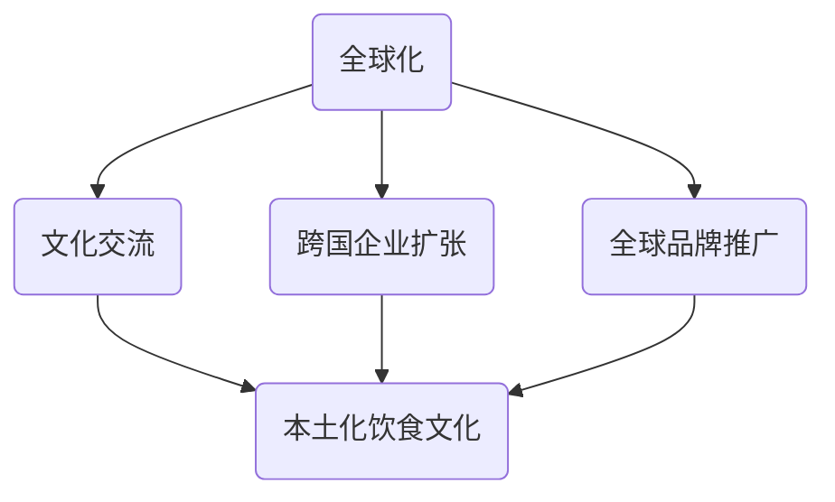
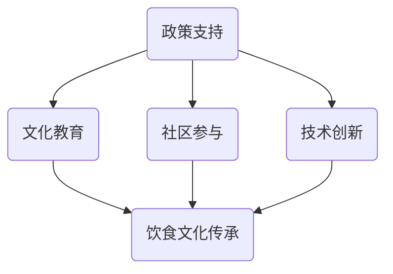

                 

### 第一部分：全球化与本土化概述

#### 1.1 全球化与本土化的饮食文化背景

**核心概念术语说明：**
- **全球化（Globalization）**：指不同国家、地区之间的文化、经济、政治等方面的相互交流、融合与扩展。
- **本土化（Localization）**：指将某种产品或服务根据特定地区或国家的文化、语言、习惯等进行适应和调整。

**问题背景：**
在全球化的背景下，饮食文化的交流与传播变得更加频繁，但与此同时，地方特色饮食文化也面临着被同质化和消失的风险。

**问题描述：**
如何在全球化进程中保护地方特色饮食文化，同时促进美食文化的全球化传播？

**问题解决：**
需要通过政策和教育等多方面手段，平衡全球化与本土化的关系，促进饮食文化的可持续发展。

**边界与外延：**
- **边界**：饮食文化的本土化与全球化之间的界限，以及如何在不同文化之间进行有效的交流与适应。
- **外延**：全球化对饮食文化的影响范围，以及地方特色饮食文化在全球化进程中的保护与传承。

**概念结构与核心要素组成：**
- **全球化**：经济一体化、文化交流、跨国企业扩张、全球品牌推广。
- **本土化**：地方特色饮食文化、本土市场需求、文化传承、地域保护。

### 1.2 饮食文化在全球化的背景下

**核心概念与联系：**

**全球化对饮食文化的影响：**

| 影响因素         | 说明                                                         |
|------------------|--------------------------------------------------------------|
| **经济一体化**   | 贸易自由化使得食品和餐饮业跨国发展，全球化产业链形成。           |
| **文化交流**     | 全球旅游、移民和互联网促进了饮食文化的传播与融合。             |
| **跨国企业扩张** | 跨国餐饮企业如麦当劳、肯德基等在全球推广标准化饮食。           |
| **全球品牌推广** | 饮食品牌通过全球化营销策略，扩大市场影响力和认知度。         |

**本土化饮食文化的意义：**

| 意义               | 说明                                                         |
|--------------------|--------------------------------------------------------------|
| **文化传承**       | 本土饮食文化是地方文化的重要组成部分，有助于文化传承。       |
| **地域保护**       | 保护和弘扬地方特色饮食，维护生物多样性和文化多样性。         |
| **经济价值**       | 本土饮食文化可以成为地方经济的重要支柱，促进旅游业发展。     |

**概念属性特征对比表格：**

| **特征**             | **全球化**                                                    | **本土化**                                                    |
|----------------------|--------------------------------------------------------------|--------------------------------------------------------------|
| **标准化**           | 统一标准、流程和品牌形象                                     | 保持独特的地方特色和传统制作方法                             |
| **文化融合**         | 多元文化交融，形成新的饮食文化                               | 维护原生态饮食文化，保持地方特色                             |
| **传播速度**         | 快速、广泛                                                   | 较慢、局限                                                     |
| **市场需求**         | 多样性需求，偏向于流行和标准化                               | 针对特定地区和文化背景，满足地方性需求                       |

**ER实体关系图架构：**

### 1.3 本土化饮食文化的保护与传承

**核心概念与联系：**

**保护本土饮食文化的措施：**

| **措施**         | **说明**                                                     |
|------------------|--------------------------------------------------------------|
| **政策支持**     | 制定相关法律法规，提供资金和政策支持。                     |
| **文化教育**     | 加强饮食文化教育，提高公众对本土饮食文化的认识和重视。     |
| **社区参与**     | 鼓励地方社区参与饮食文化的保护与传承，形成社区文化氛围。   |
| **技术创新**     | 利用现代科技手段，如互联网、数字化，推动本土饮食文化的传播。|

**饮食文化传承的挑战与机遇：**

**挑战：**

- **文化同质化**：全球化带来的文化交融可能导致本土饮食文化的同质化。
- **保护意识不足**：部分地区对本土饮食文化的保护意识不足，导致文化传承困难。
- **经济压力**：地方特色饮食可能面临成本高、市场需求小的问题，导致经济压力。

**机遇：**

- **旅游产业**：本土饮食文化可以作为旅游资源，吸引游客，促进经济发展。
- **科技支持**：现代科技如互联网、社交媒体为饮食文化的传播提供了新的平台。
- **品牌推广**：通过品牌化和市场化，提升本土饮食文化的知名度和市场价值。

**核心概念与联系：**

| **概念**             | **保护与传承**                                                     |
|----------------------|--------------------------------------------------------------|
| **政策支持**         | 提供法律保障、资金支持、技术推广等。                         |
| **文化教育**         | 增强公众保护意识、推动饮食文化研究、培训相关人才。         |
| **社区参与**         | 组织社区活动、鼓励社区文化传承、形成饮食文化社区氛围。     |
| **技术创新**         | 利用现代科技手段，如数字化、网络营销等，促进饮食文化传播。 |

**ER实体关系图架构：**

通过上述分析，我们可以看到全球化与本土化在饮食文化领域中的复杂关系。全球化带来了饮食文化的传播与交流，同时也带来了文化同质化的风险；而本土化则有助于保护地方特色饮食文化，但面临文化传承的挑战。接下来，我们将通过具体实例来深入探讨这一主题。## 第二部分：美食全球化的实例分析

### 2.1 意大利美食的全球化

**2.1.1 意大利美食在全球的受欢迎程度**

意大利美食在全球范围内享有极高的声誉，被广泛认为是世界顶级美食之一。意大利的披萨、意面、提拉米苏等经典菜肴已经成为了全球美食文化的代表。根据统计，意大利餐馆在全球范围内的数量超过了50万家，其中美国、日本和德国等国家拥有最多的意大利餐馆。

**核心概念与联系：**

- **国际化品牌**：意大利餐饮品牌通过全球连锁店的形式，将本土美食推向全球。
- **文化认同**：意大利美食以其独特的风味和丰富的文化内涵，获得了全球消费者的认可和喜爱。

**意大利美食在全球的受欢迎程度：**

| **国家/地区** | **意大利餐馆数量** | **受欢迎程度** |
|----------------|---------------------|----------------|
| 美国           | 2万多家             | 非常高         |
| 日本           | 1万多家             | 较高           |
| 德国           | 5000多家            | 较高           |

**意大利如何保护本土饮食文化**

**1. 政策支持：**
意大利政府通过法律和政策支持，保护本土饮食文化。例如，意大利的“餐饮文化遗产保护法”确保了传统菜肴的制作方法得以传承，禁止未经授权的模仿和侵权行为。

**2. 教育与培训：**
意大利在国内外开展饮食文化教育，培养新一代厨师和美食爱好者。意大利的国际烹饪学校吸引了来自全球的学生，传播意大利的饮食文化。

**3. 社区参与：**
地方社区积极参与饮食文化的保护和传承，组织各类美食节、厨艺大赛等活动，弘扬本土饮食文化。

**4. 创新技术：**
利用互联网和社交媒体，意大利餐饮业者积极推广本土美食，扩大其全球影响力。

**核心概念与联系：**

| **措施**         | **说明**                                                     |
|------------------|--------------------------------------------------------------|
| **政策支持**     | 制定法律保护传统饮食文化，禁止侵权行为。                   |
| **教育与培训**   | 开展饮食文化教育，培养专业人才。                         |
| **社区参与**     | 通过活动弘扬本土饮食文化，增强社区凝聚力。               |
| **技术创新**     | 利用互联网和社交媒体，推广本土美食。                     |

**意大利美食全球化的影响：**

- **文化多样性**：意大利美食的全球化促进了全球饮食文化的多样性，丰富了人们的饮食体验。
- **经济贡献**：意大利餐饮业为意大利经济做出了巨大贡献，带动了旅游业和相关产业的发展。
- **文化认同**：意大利美食在全球的传播增强了意大利文化的全球认同感，提升了国家形象。

### 2.2 中国美食的全球化

**2.2.1 中国美食在全球的传播与影响**

中国美食在全球的传播速度非常快，中餐已经成为全球饮食文化中不可或缺的一部分。无论是中国餐馆在全球的数量，还是中餐在全球范围内的受欢迎程度，都展现出了中国美食的强大影响力。

**核心概念与联系：**

- **国际化策略**：中国餐饮企业通过开设分店、加盟连锁等形式，将中餐推向全球。
- **文化推广**：通过举办国际美食节、烹饪比赛等活动，推广中国饮食文化。

**中国美食在全球的传播与影响：**

| **国家/地区** | **中餐餐馆数量** | **受欢迎程度** |
|----------------|---------------------|----------------|
| 美国           | 数万家              | 非常高         |
| 英国           | 数千家              | 较高           |
| 澳大利亚       | 数千家              | 较高           |

**中国如何维护地方特色饮食**

**1. 政策支持：**
中国政府通过制定相关政策和标准，保护地方特色饮食。例如，《中国传统食品产业促进法》和《非物质文化遗产保护法》等，为地方特色饮食提供了法律保障。

**2. 教育与培训：**
中国在全球范围内开展饮食文化教育，培养专业厨师和文化传承人。例如，中国烹饪学院在全球多个国家和地区设立分校，推广中国饮食文化。

**3. 文化宣传：**
通过各种媒体和平台，如电视节目、网络直播、社交媒体等，宣传中国饮食文化，提升其全球影响力。

**4. 创新技术：**
利用现代科技，如移动互联网、在线订餐平台等，推动地方特色饮食的全球化传播。

**核心概念与联系：**

| **措施**         | **说明**                                                     |
|------------------|--------------------------------------------------------------|
| **政策支持**     | 制定法律法规，保护地方特色饮食。                           |
| **教育与培训**   | 培养专业厨师和文化传承人，推广饮食文化。                   |
| **文化宣传**     | 利用媒体和平台，提升饮食文化影响力。                       |
| **技术创新**     | 利用移动互联网和在线订餐平台，促进饮食文化传播。         |

**中国美食全球化的影响：**

- **文化多样性**：中国美食的全球化丰富了全球饮食文化，促进了文化的交流与融合。
- **经济贡献**：中餐业为全球经济做出了巨大贡献，带动了旅游业和相关产业的发展。
- **文化认同**：中国美食的全球化提升了中国的国际形象，增强了全球对中国文化的认同感。

### 2.3 泰国美食的全球化

**2.3.1 泰国美食在全球的流行趋势**

泰国美食以其独特的风味和丰富的食材组合，在全球范围内受到了广泛的欢迎。泰国菜以其酸、辣、甜、咸、香五味俱全的特点，吸引了无数美食爱好者。泰国菜在全球范围内的流行趋势主要表现在以下方面：

- **国际美食节**：泰国美食在各类国际美食节上大放异彩，成为美食节的亮点之一。
- **跨国餐厅**：泰国餐厅在全球多个国家和地区开设，如纽约、伦敦、东京等地。
- **在线配送**：随着外卖平台的普及，泰国美食的配送服务也越来越便捷。

**核心概念与联系：**

- **国际化品牌**：泰国餐饮品牌通过连锁经营和品牌化战略，在全球推广泰国美食。
- **文化认同**：泰国美食以其独特的风味和文化背景，获得了全球消费者的喜爱。

**泰国美食在全球的流行趋势：**

| **国家/地区** | **泰国餐厅数量** | **受欢迎程度** |
|----------------|---------------------|----------------|
| 美国           | 数百家              | 较高           |
| 英国           | 数百家              | 较高           |
| 澳大利亚       | 数百家              | 较高           |

**泰国本土饮食文化的保护策略**

**1. 政策支持：**
泰国政府通过制定相关法律法规，保护本土饮食文化。例如，《泰国传统饮食保护法》确保了传统菜肴和制作方法的传承。

**2. 文化教育：**
泰国在国内外开展饮食文化教育，推广泰国美食文化。例如，泰国烹饪学校在全球多个国家和地区开设分校，培养专业的厨师和美食爱好者。

**3. 社区参与：**
泰国地方社区积极参与饮食文化的保护和传承，通过组织美食节、烹饪比赛等活动，弘扬泰国饮食文化。

**4. 创新技术：**
利用现代科技手段，如互联网和社交媒体，泰国餐饮业者积极推广泰国美食，提升其全球影响力。

**核心概念与联系：**

| **措施**         | **说明**                                                     |
|------------------|--------------------------------------------------------------|
| **政策支持**     | 制定法律法规，保护传统饮食文化。                           |
| **文化教育**     | 推广饮食文化，培养专业人才。                              |
| **社区参与**     | 通过活动弘扬饮食文化，增强社区凝聚力。                    |
| **技术创新**     | 利用互联网和社交媒体，推广泰国美食。                       |

**泰国美食全球化的影响：**

- **文化多样性**：泰国美食的全球化丰富了全球饮食文化，推动了文化的交流与融合。
- **经济贡献**：泰国餐饮业为泰国经济做出了巨大贡献，带动了旅游业和相关产业的发展。
- **文化认同**：泰国美食的全球化提升了泰国的国际形象，增强了全球对泰国文化的认同感。

通过以上实例分析，我们可以看到不同国家和地区在美食全球化过程中的具体做法和影响。接下来，我们将深入探讨地方特色饮食文化的保护现状和策略。## 第三部分：地方特色饮食文化的保护

### 3.1 地方特色饮食文化的价值

**核心概念与联系：**

地方特色饮食文化具有多重价值，不仅在经济和文化上具有重要意义，还对社会和环境产生深远影响。

**1. 经济价值：**

地方特色饮食文化可以成为地方经济的重要支柱。通过饮食文化的保护和推广，可以带动旅游业、餐饮业和相关产业的发展。例如，中国的小吃街、法国的美食节等地，都吸引了大量游客，为当地经济注入了活力。

| **价值**           | **说明**                                                     |
|--------------------|--------------------------------------------------------------|
| **增加就业**       | 地方特色饮食的发展需要大量的劳动力，包括厨师、服务员、销售员等。 |
| **促进经济发展**   | 饮食文化的传播和推广可以带动相关产业链的发展，如农业、食品加工等。 |

**2. 文化价值：**

地方特色饮食文化是地方文化的重要组成部分，承载着丰富的历史和传统。通过保护和传承地方特色饮食，可以维护和弘扬地方文化，增强文化认同感和归属感。

| **价值**           | **说明**                                                     |
|--------------------|--------------------------------------------------------------|
| **文化传承**       | 地方特色饮食是地方文化传承的重要载体，有助于文化延续。         |
| **文化认同**       | 通过饮食文化的保护与传承，可以增强地方民众的文化认同感和凝聚力。 |

**3. 社会价值：**

地方特色饮食文化在社会生活中具有重要作用，它反映了地方的生活方式和价值观念。通过饮食文化的保护，可以促进社会和谐，增强社会凝聚力。

| **价值**           | **说明**                                                     |
|--------------------|--------------------------------------------------------------|
| **社会和谐**       | 饮食文化的多样性有助于社会和谐，减少文化冲突。               |
| **社会凝聚力**     | 通过共同的食物文化，可以增强社会成员之间的联系和凝聚力。     |

**4. 环境价值：**

地方特色饮食文化反映了当地的生态环境和生物多样性。通过保护地方特色饮食，可以促进生态环境的可持续发展，保护生物多样性。

| **价值**           | **说明**                                                     |
|--------------------|--------------------------------------------------------------|
| **生态环境保护** | 地方特色饮食通常依赖于当地的生态环境，保护饮食文化有助于生态环境的保护。 |
| **生物多样性**     | 地方特色饮食中的食材多样，有助于维护生物多样性。               |

### 3.2 地方特色饮食文化的保护现状

**全球各国保护地方特色饮食的措施：**

**1. 政策支持：**

许多国家和地区通过制定法律法规，保护地方特色饮食文化。例如，中国有《非物质文化遗产保护法》，法国有《传统美食保护法》，这些法律为地方特色饮食提供了法律保障。

| **国家** | **政策名称**                | **说明**                                                     |
|----------|------------------------------|--------------------------------------------------------------|
| 中国     | 《非物质文化遗产保护法》   | 保护传统饮食文化，确保制作方法传承。                         |
| 法国     | 《传统美食保护法》          | 保护传统美食和烹饪技艺，防止侵权行为。                       |

**2. 教育与培训：**

通过教育和培训，提高公众对地方特色饮食文化的认识和重视。许多国家设立了专门的饮食文化学校，如中国的烹饪学校、法国的 culinary school，这些学校培养了大量专业的厨师和文化传承人。

| **国家** | **教育措施**                | **说明**                                                     |
|----------|------------------------------|--------------------------------------------------------------|
| 中国     | 烹饪学院                   | 培养专业厨师和饮食文化传承人。                               |
| 法国     | Culinary school             | 提供烹饪技艺培训，推广法国饮食文化。                         |

**3. 社区参与：**

鼓励地方社区积极参与饮食文化的保护和传承。许多地方通过组织美食节、烹饪比赛等活动，增强社区成员对饮食文化的认同感和参与感。

| **国家** | **社区活动**                | **说明**                                                     |
|----------|------------------------------|--------------------------------------------------------------|
| 日本     | 美食节                      | 弘扬日本饮食文化，增强社区凝聚力。                           |
| 印度     | 烹饪比赛                    | 传承印度传统饮食文化，促进文化交流。                         |

**4. 创新技术：**

利用现代科技手段，如互联网、社交媒体等，推动地方特色饮食文化的传播。通过数字化平台，可以方便地分享饮食文化，吸引更多的关注和参与。

| **国家** | **创新技术**                | **说明**                                                     |
|----------|------------------------------|--------------------------------------------------------------|
| 韩国     | 互联网平台                  | 推广韩国传统美食，吸引全球粉丝。                             |
| 意大利   | 社交媒体                    | 利用社交媒体平台，推广意大利美食文化。                       |

**地方特色饮食保护面临的挑战：**

- **文化同质化**：全球化带来的文化交融可能导致地方特色饮食文化同质化，失去了独特的地域特色。
- **保护意识不足**：部分地区对地方特色饮食文化的保护意识不足，缺乏有效的保护措施。
- **经济压力**：地方特色饮食可能面临成本高、市场需求小的问题，导致经济压力。

| **挑战**         | **说明**                                                     |
|------------------|--------------------------------------------------------------|
| **文化同质化**   | 全球化带来的文化交融可能导致地方特色饮食文化同质化。           |
| **保护意识不足** | 部分地区对地方特色饮食文化的保护意识不足，缺乏有效的保护措施。 |
| **经济压力**     | 地方特色饮食可能面临成本高、市场需求小的问题，导致经济压力。   |

### 3.3 地方特色饮食文化的保护策略

**核心概念与联系：**

为了有效保护地方特色饮食文化，需要从多个方面入手，综合运用政策、教育、社区参与和创新技术等手段。

**1. 政策支持：**

- **制定法律法规**：通过法律手段保护地方特色饮食，防止侵权行为。
- **提供资金支持**：政府可以提供资金支持，鼓励地方特色饮食文化的研究和保护。

| **措施**         | **说明**                                                     |
|------------------|--------------------------------------------------------------|
| **法律法规**     | 通过法律手段保护地方特色饮食，防止侵权行为。                 |
| **资金支持**     | 提供资金支持，鼓励地方特色饮食文化的研究和保护。             |

**2. 教育与培训：**

- **开展饮食文化教育**：通过学校教育、社会培训等方式，提高公众对地方特色饮食文化的认识和重视。
- **培养专业人才**：设立专门的烹饪学校或培训课程，培养专业的厨师和文化传承人。

| **措施**         | **说明**                                                     |
|------------------|--------------------------------------------------------------|
| **教育**         | 通过学校教育、社会培训等方式，提高公众对地方特色饮食文化的认识和重视。 |
| **培训**         | 设立专门的烹饪学校或培训课程，培养专业的厨师和文化传承人。         |

**3. 社区参与：**

- **组织社区活动**：通过美食节、烹饪比赛等活动，增强社区成员对地方特色饮食文化的认同感和参与感。
- **社区合作**：鼓励地方社区之间合作，共同保护和传承地方特色饮食文化。

| **措施**         | **说明**                                                     |
|------------------|--------------------------------------------------------------|
| **活动**         | 通过美食节、烹饪比赛等活动，增强社区成员对地方特色饮食文化的认同感和参与感。 |
| **合作**         | 鼓励地方社区之间合作，共同保护和传承地方特色饮食文化。               |

**4. 创新技术：**

- **利用互联网和社交媒体**：通过数字化平台，方便地分享和推广地方特色饮食文化，吸引更多的关注和参与。
- **开发应用程序**：开发专门的应用程序，提供地方特色饮食文化的介绍、食谱和制作方法。

| **措施**         | **说明**                                                     |
|------------------|--------------------------------------------------------------|
| **互联网和社交媒体** | 通过数字化平台，方便地分享和推广地方特色饮食文化。           |
| **应用程序**     | 开发专门的应用程序，提供地方特色饮食文化的介绍、食谱和制作方法。 |

通过上述策略，可以有效保护地方特色饮食文化，促进其在全球化进程中的可持续发展。接下来，我们将探讨如何在全球化与本土化之间找到平衡。## 第四部分：美食全球化与地方特色保护的平衡

### 4.1 全球化与本土化的冲突与融合

**4.1.1 美食全球化的优势与不足**

**优势：**

- **文化传播**：美食全球化促进了不同文化之间的交流，丰富了全球饮食文化多样性。
- **经济发展**：全球化使得餐饮业迅速发展，为全球经济贡献了巨大的经济价值。
- **市场扩大**：全球化为餐饮业提供了更广阔的市场，使得美食企业能够跨越地域限制，实现全球化扩张。

**不足：**

- **文化同质化**：全球化可能导致饮食文化的同质化，失去地方特色和多样性。
- **传统文化受损**：地方特色饮食文化可能因为全球化而受到冲击，面临消失的风险。
- **经济不平衡**：全球化可能导致资源分配不均，一些地方特色饮食文化难以在全球市场上获得应有的重视。

**4.1.2 本土化饮食文化的困境与希望**

**困境：**

- **保护成本高**：保护地方特色饮食文化需要投入大量的人力、物力和财力。
- **市场需求小**：地方特色饮食文化通常市场需求较小，难以实现大规模的经济效益。
- **传播难度大**：与全球化美食相比，地方特色饮食文化的传播难度较大，难以迅速获得全球市场的认可。

**希望：**

- **文化认同感**：通过保护地方特色饮食文化，可以增强文化认同感和归属感，促进社会和谐。
- **经济发展潜力**：随着全球对文化多样性的重视，地方特色饮食文化具有巨大的市场潜力。
- **技术创新支持**：现代科技手段如互联网、社交媒体等，为地方特色饮食文化的传播提供了新的平台。

### 4.2 寻求美食全球化的可持续发展

**4.2.1 美食全球化中的文化适应**

**文化适应的重要性：**

在美食全球化过程中，文化适应是关键因素之一。只有通过文化适应，才能在保持本土饮食文化特色的同时，满足不同市场的需求。

**核心概念与联系：**

- **市场调研**：通过市场调研，了解目标市场的文化习俗和饮食偏好，进行针对性的调整。
- **本土化创新**：在全球化过程中，结合本土食材和烹饪技艺，创造出符合本地口味的美食。

**文化适应的策略：**

1. **本地化菜单**：根据目标市场的饮食习惯，调整菜品口味和菜单结构。
2. **食材本土化**：使用当地的食材，以减少运输成本和环境影响，同时保持菜肴的原汁原味。
3. **文化融合**：在保持本土饮食文化特色的基础上，融入目标市场的饮食元素，创造新的美食体验。

**4.2.2 地方特色饮食文化的国际化**

**国际化策略的重要性：**

地方特色饮食文化的国际化有助于扩大其全球影响力，提升市场价值。通过国际化策略，可以更好地适应全球市场，同时保护本土饮食文化。

**核心概念与联系：**

- **品牌化**：通过品牌化策略，提升地方特色饮食文化的知名度和市场价值。
- **国际化推广**：利用国际展览、美食节等活动，推广地方特色饮食文化。

**国际化策略：**

1. **品牌建设**：通过建立品牌形象，提升地方特色饮食文化的认知度和美誉度。
2. **市场营销**：利用国际媒体和数字平台，进行广泛的国际化推广。
3. **文化传承**：在推广过程中，注重地方特色饮食文化的传承和保护，确保其独特性和多样性。

### 4.3 平衡美食全球化和本土化

**4.3.1 创新与传承的平衡**

**创新的重要性：**

在全球化进程中，创新是推动饮食文化发展的重要动力。通过创新，可以不断适应市场需求，提升饮食文化的竞争力。

**核心概念与联系：**

- **技术创新**：利用现代科技，如自动化烹饪设备、数字化管理等，提高烹饪效率和质量。
- **创意融合**：将本土饮食文化与国际流行趋势相结合，创造出新的美食体验。

**传承的重要性：**

传承是保护本土饮食文化的基础。通过传承，可以确保地方特色饮食文化的延续和发扬。

**核心概念与联系：**

- **传统技艺**：保护和传承传统的烹饪技艺和制作方法。
- **文化教育**：通过教育和培训，培养新一代的饮食文化传承人。

**平衡策略：**

1. **技术创新与传承结合**：在保持传统技艺的基础上，引入新技术，提高生产效率和产品质量。
2. **文化创新与传承结合**：在传承本土饮食文化的同时，不断创新，使其适应现代市场需求。

**4.3.2 消费者需求与地方特色的平衡**

**消费者需求的重要性：**

消费者需求是饮食文化发展的关键驱动力。只有满足消费者的需求，饮食文化才能得到广泛认可和接受。

**核心概念与联系：**

- **市场调研**：通过市场调研，了解消费者的口味偏好和需求变化。
- **个性化定制**：根据消费者的需求，提供个性化的饮食体验。

**地方特色的重要性：**

地方特色是本土饮食文化的核心价值。只有保持地方特色，饮食文化才能保持其独特性和吸引力。

**核心概念与联系：**

- **文化保护**：通过政策支持和社区参与，保护地方特色饮食文化。
- **文化传承**：通过教育和培训，培养新一代对地方特色饮食文化的认同感和传承意识。

**平衡策略：**

1. **消费者需求导向**：在保持地方特色的基础上，根据消费者需求进行调整和优化。
2. **地方特色保护与推广**：通过政策和教育，保护地方特色饮食文化，同时积极推广其独特价值。

通过上述策略，可以在美食全球化和本土化之间找到平衡，实现饮食文化的可持续发展。接下来，我们将对未来全球化与本土化饮食文化的发展趋势进行展望。## 第五部分：未来展望

### 5.1 全球化与本土化的饮食文化发展趋势

**5.1.1 新技术对饮食文化的影响**

随着新技术的不断发展，饮食文化将迎来一系列变革。以下是一些可能影响未来饮食文化的重要技术趋势：

**1. 人工智能与机器学习：** 人工智能和机器学习技术可以优化烹饪过程，提高效率和质量。例如，智能烹饪机器人可以根据食材和消费者口味偏好，自动调整烹饪参数，提供个性化的美食体验。

**核心概念与联系：**

- **智能烹饪**：利用人工智能和机器学习技术，实现自动化烹饪和个性化定制。
- **数据驱动**：通过数据分析，了解消费者需求，优化饮食产品和服务。

**2. 区块链技术：** 区块链技术在食品安全和溯源方面具有巨大潜力。通过区块链，可以确保食品供应链的透明性和可追溯性，提高消费者对饮食文化的信任度。

**核心概念与联系：**

- **食品安全**：通过区块链技术，实现食品供应链的全程监控和追溯。
- **数据透明**：提高食品安全信息的透明度，增强消费者信任。

**3. 虚拟现实与增强现实：** 虚拟现实（VR）和增强现实（AR）技术可以提供沉浸式的美食体验，让消费者在家中也能感受到异国美食的氛围。

**核心概念与联系：**

- **沉浸体验**：通过VR/AR技术，模拟真实的美食环境和体验。
- **交互体验**：增强用户的参与感和互动性，提升美食体验。

**4. 3D打印技术：** 3D打印技术可以用于食品制造，提供个性化的饮食解决方案。例如，可以根据个人口味和营养需求，定制个性化的食物。

**核心概念与联系：**

- **个性化定制**：通过3D打印技术，实现个性化饮食，满足消费者的多样化需求。
- **高效生产**：提高生产效率，降低生产成本。

### 5.2 饮食文化保护与创新

**5.2.1 新时代下的饮食文化保护**

在新时代，饮食文化保护面临新的挑战和机遇。以下是一些新时代下的饮食文化保护策略：

**1. 数字化保护：** 利用数字化技术，如虚拟博物馆、数字档案等，保存和传播传统饮食文化。例如，通过建立数字化博物馆，展示传统美食的制作工艺和文化背景。

**核心概念与联系：**

- **数字化保存**：通过数字化技术，永久保存传统饮食文化。
- **文化传播**：利用数字平台，扩大传统饮食文化的传播范围。

**2. 社区参与：** 鼓励地方社区参与饮食文化的保护与传承，通过社区活动和文化项目，增强文化认同感和参与感。

**核心概念与联系：**

- **社区文化**：通过社区活动，增强地方居民的饮食文化认同感。
- **文化传承**：通过社区参与，促进传统饮食文化的传承。

**3. 教育培训：** 在学校和社区中开展饮食文化教育，培养新一代对饮食文化的认识和热爱。

**核心概念与联系：**

- **教育推广**：通过教育，提高公众对饮食文化的认识和重视。
- **文化传承**：培养新一代的饮食文化传承人，确保文化延续。

### 5.3 饮食文化教育的意义

**5.3.1 饮食文化教育的重要性**

饮食文化教育在促进全球化与本土化饮食文化的平衡中具有重要意义。以下是一些饮食文化教育的意义：

**1. 提高文化素养：** 饮食文化教育有助于提高公众的文化素养，增强对本土和全球饮食文化的理解和尊重。

**核心概念与联系：**

- **文化理解**：通过教育，增强公众对饮食文化的理解和认同。
- **文化尊重**：培养尊重多元文化和本土饮食文化的态度。

**2. 促进文化交流：** 饮食文化教育可以促进不同文化之间的交流与融合，推动全球化进程。

**核心概念与联系：**

- **文化交流**：通过教育，促进不同饮食文化之间的交流和互动。
- **文化融合**：培养开放包容的文化心态，促进全球饮食文化的多样性。

**3. 增强社会凝聚力：** 饮食文化教育有助于增强社会成员的归属感和凝聚力，促进社会和谐。

**核心概念与联系：**

- **社会认同**：通过饮食文化教育，增强社会成员对共同饮食文化的认同。
- **社会和谐**：培养和谐共处的文化氛围，促进社会稳定和发展。

### 5.3.2 饮食文化教育的实践与挑战

**实践：**

**1. 教材开发：** 开发适合不同年龄和层次的饮食文化教材，内容应包括地方特色饮食的历史、制作方法和文化内涵。

**2. 教学方法：** 采用多样化的教学方法，如实地考察、烹饪实践、多媒体教学等，提高学生的学习兴趣和参与度。

**3. 国际合作：** 与国际机构合作，开展跨国饮食文化教育项目，促进全球饮食文化的交流和融合。

**挑战：**

**1. 教育资源不足：** 部分地区缺乏足够的饮食文化教育资源，教师和教材短缺。

**2. 文化偏见：** 部分学生和家长可能对饮食文化教育缺乏兴趣或存在文化偏见，需要通过宣传和教育来改变观念。

**3. 教育评估：** 如何有效评估饮食文化教育效果，确保教育目标的实现，是面临的一个重要挑战。

通过以上展望，我们可以看到全球化与本土化饮食文化在未来将继续发展和变革。饮食文化的保护与创新、教育推广和国际交流将是实现平衡和可持续发展的关键。## 第六部分：案例分析

### 6.1 意大利餐厅在全球的成功案例

#### 6.1.1 案例背景

意大利餐厅在全球范围内的成功是全球化与本土化饮食文化平衡的典范。以意大利知名连锁餐厅“Domino's Pizza”为例，该品牌通过一系列策略成功在全球扩展，同时保持了意大利美食的独特性。

#### 6.1.2 案例分析

**1. 本土化策略：**
- **菜单调整**：在进入不同市场时，Domino's 会根据当地口味和饮食文化进行调整。例如，在日本市场，Domino's 推出了寿司口味披萨，以满足当地消费者的需求。
- **餐饮环境**：餐厅的设计和氛围也会根据当地文化进行调整，以符合目标市场的审美习惯。

**2. 文化传承：**
- **培训厨师**：Domino's 注重培训本地厨师，确保他们了解并能够制作正宗的意大利美食。
- **品牌故事**：通过宣传意大利的饮食文化和历史，Domino's 增强了品牌的文化内涵。

**3. 技术创新：**
- **外卖服务**：Domino's 是全球第一家提供外卖服务的披萨品牌，通过创新的配送服务，满足了现代消费者的需求。
- **数字化平台**：Domino's 推出了手机应用程序，使消费者可以轻松下单和追踪订单，提升了用户体验。

#### 6.1.3 案例启示

- **本土化策略**：在全球化过程中，根据当地文化进行菜单和环境的调整，以吸引更多消费者。
- **文化传承**：通过培训和品牌宣传，传承本土饮食文化，增强品牌的文化价值。
- **技术创新**：利用现代科技，提供便捷的服务，提升用户体验。

### 6.2 中国餐馆在海外的本土化策略

#### 6.2.1 案例背景

随着中国经济的崛起和国际化进程的加快，越来越多的中国餐馆进入海外市场。以“海底捞”为例，该品牌在全球范围内的成功展现了如何在海外市场保持中国美食的特色，同时满足当地消费者的需求。

#### 6.2.2 案例分析

**1. 本土化菜单：**
- **口味调整**：海底捞在海外市场推出了适合当地口味的菜品，如美国市场推出了墨西哥风味和牛排套餐。
- **食材本土化**：使用当地的食材，减少物流成本，同时确保菜肴的原汁原味。

**2. 服务创新：**
- **个性化服务**：海底捞在海外市场推出了一系列个性化服务，如一对一的火锅服务员、免费水果和小吃等，提升了消费者的满意度。
- **文化体验**：通过举办中国文化活动，如传统舞蹈表演、茶艺展示等，增强消费者的文化体验。

**3. 营销策略：**
- **社交媒体推广**：利用社交媒体平台，如Instagram和Facebook，推广海底捞的品牌和文化，吸引更多的关注和客户。

#### 6.2.3 案例启示

- **本土化菜单**：根据当地口味和饮食习惯，调整菜品，以吸引更多消费者。
- **服务创新**：提供个性化的服务和体验，提升消费者的满意度。
- **文化体验**：通过文化活动，增强品牌的文化内涵和消费者的文化认同感。

### 6.3 泰国美食在全球的传播策略

#### 6.3.1 案例背景

泰国美食以其独特的风味和丰富的文化内涵，在全球范围内受到了广泛的欢迎。泰国连锁餐厅“Thai Town”在全球多个国家和地区成功开设，成为泰国美食的代表。

#### 6.3.2 案例分析

**1. 品牌建设：**
- **统一品牌形象**：Thai Town 在全球范围内的餐厅都采用统一的品牌形象和装修风格，确保品牌识别度。
- **品牌故事**：通过宣传泰国的饮食文化和历史，Thai Town 增强了品牌的文化价值。

**2. 菜单设计：**
- **文化融合**：Thai Town 的菜单不仅包括传统泰国菜，还结合了当地文化和口味，如在北美市场推出“泰式汉堡”等创新菜品。
- **食材选择**：使用本地食材，确保菜肴的新鲜和美味。

**3. 营销推广：**
- **社交媒体营销**：通过Instagram、Facebook等社交媒体平台，Thai Town 与消费者互动，推广品牌和美食。
- **美食节活动**：定期举办泰国美食节，吸引更多的顾客和媒体关注。

#### 6.3.3 案例启示

- **品牌建设**：通过统一的品牌形象和故事，增强品牌的全球影响力。
- **菜单设计**：结合当地文化和口味，创造新的美食体验。
- **营销推广**：利用社交媒体和美食节等手段，提高品牌知名度和市场占有率。

通过以上案例分析，我们可以看到不同国家在全球化过程中，如何通过本土化策略、文化传承和创新营销，成功推广地方特色饮食文化。这些案例为其他国家和地区提供了宝贵的经验和启示。## 第七部分：结论与展望

### 7.1 全球化与本土化饮食文化的重要性

**全球化与本土化饮食文化的融合不仅是经济现象，更是文化现象。** 在全球化进程中，饮食文化的传播与融合为世界带来了多样性和丰富性，但同时也对地方特色饮食文化构成了挑战。通过本篇文章的分析，我们可以得出以下几点结论：

1. **全球饮食文化多样性**：全球化推动了饮食文化的传播，使得世界各地的人们能够品尝到不同的美食，丰富了全球的饮食体验。
2. **本土饮食文化保护**：地方特色饮食文化是地方文化的重要组成部分，通过政策、教育、技术创新等多方面手段，可以有效保护和传承。
3. **经济贡献**：饮食文化全球化对全球经济的贡献巨大，促进了旅游业、餐饮业等相关产业的发展。
4. **文化认同**：饮食文化在全球化过程中，增强了文化认同感和社会凝聚力。

### 7.2 未来发展的建议与展望

**在全球化与本土化的平衡中，我们需要采取以下措施：**

1. **政策支持与法规制定**：政府应制定相关政策，提供资金支持，保护地方特色饮食文化，防止文化同质化。
2. **文化教育与传承**：加强饮食文化教育，培养专业人才，提升公众对本土饮食文化的认识和重视。
3. **技术创新与应用**：利用现代科技，如互联网、人工智能等，推动饮食文化的传播和创新。
4. **社区参与与互动**：鼓励社区参与饮食文化的保护和传承，通过美食节、烹饪比赛等活动，增强社区凝聚力。
5. **国际交流与合作**：加强国际间的饮食文化交流与合作，促进全球饮食文化的多样性和可持续发展。

**未来发展趋势：**

1. **数字化与智能化**：随着数字化和智能技术的不断发展，饮食文化的传播和消费方式将变得更加便捷和个性化。
2. **文化融合与创新**：全球饮食文化将进一步融合，创新出更多融合不同文化元素的美食。
3. **可持续发展**：在全球化和本土化的过程中，饮食文化将更加注重可持续发展和环境保护。

**结语：**

饮食文化全球化与本土化的平衡是一个长期且复杂的课题，需要政府、企业、社区和公众的共同努力。通过合理的政策、有效的教育和创新的技术手段，我们可以实现饮食文化的可持续发展，为全球社会带来更多文化价值和经济效益。

**作者：** AI天才研究院/AI Genius Institute & 禅与计算机程序设计艺术 /Zen And The Art of Computer Programming

