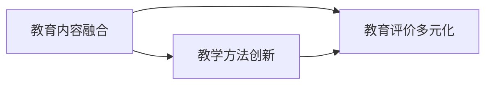
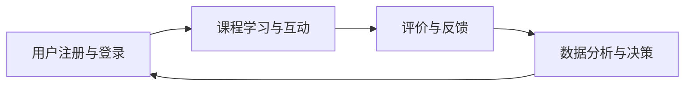
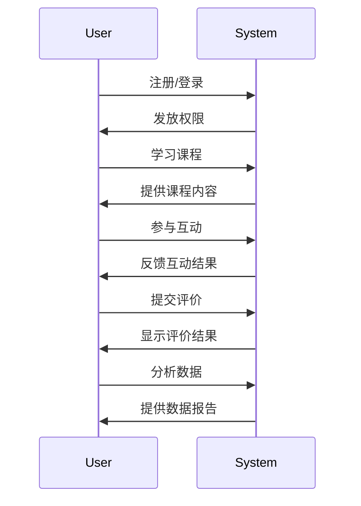

                 

### 1. 背景介绍

#### 问题背景

在全球化和信息化的背景下，教育体系面临着前所未有的挑战和机遇。全球化进程不断加快，国际间交流与合作日益频繁，信息传播的便捷性使得全球文化交融愈发显著。这一背景下，如何培养具有全球视野、本土情怀的公民成为各国教育的重要议题。

全球化不仅带来了经济、科技、文化等多方面的交流与合作，也对教育产生了深远的影响。一方面，全球化使得教育资源更加丰富，各国教育机构能够通过国际合作共享优质教育资源；另一方面，全球化也带来了文化多样性的挑战，如何在教育中平衡全球视野与本土情怀成为一个亟待解决的问题。

#### 问题描述

《全球化时代的公民教育：培养世界公民意识与本土认同》旨在探讨如何在全球化背景下，通过教育培养具备世界公民意识和本土认同的现代公民。核心问题是：如何实现全球视野与本土情怀的平衡，培养既能理解并适应全球化趋势，又能坚守本土文化和社会价值观的公民。

##### 问题解决

本书通过以下步骤解决上述问题：

1. **理论探讨**：分析全球化对教育的影响，梳理全球公民教育和本土认同培养的理论基础。
2. **案例分析**：结合国内外成功教育案例，总结培养全球视野和本土情怀的有效策略。
3. **实践探索**：提出适应全球化背景的教育模式，包括课程设置、教学方法、教育评价等多个方面。
4. **教育政策**：探讨国家或地区为推动全球公民教育和本土认同培养而制定的政策和措施。

#### 边界与外延

本书关注的对象是全球化时代的公民教育，涵盖了从基础教育到高等教育的各个阶段。同时，本书不仅关注教育内容的国际化，还关注教育方法和教育体系的变革。

##### 概念结构与核心要素组成

1. **全球公民意识**：指个体在全球化背景下，对全球问题有深刻的认识，具备跨文化沟通能力，理解并尊重不同文化背景的人。
2. **本土认同**：指个体对自身文化传统、社会价值观有强烈的认同感，能够在全球化背景下坚守本土文化和社会价值观。
3. **教育模式**：指在全球化背景下，通过课程设置、教学方法、教育评价等多方面改革，培养学生的全球视野和本土情怀。
4. **教育政策**：指国家或地区为推动全球公民教育和本土认同培养而制定的政策和措施。

### 2. 核心概念与联系

#### 核心概念原理

1. **全球公民意识**：在全球化背景下，全球公民意识是一种重要的公民素养。它不仅包括对全球性问题的关注和认知，如气候变化、贫富差距、人权等，还涉及跨文化的理解和沟通能力。全球公民意识要求个体能够超越狭隘的国家和地区界限，以全球视野看待世界，具备解决全球性问题的能力和责任。

2. **本土认同**：本土认同是指个体对自己所属文化的认同感，包括对本土历史、文化、价值观的理解和传承。在全球化的冲击下，本土认同不仅是文化多样性的体现，也是文化传承和发展的基础。本土认同有助于个体在全球化进程中保持文化自信，同时也能促进本土文化的国际交流。

3. **教育模式**：教育模式是实施全球公民教育和本土认同培养的具体路径。在全球化背景下，教育模式需要适应多元文化的特点，通过整合全球视野和本土情怀的课程内容，创新教学方法和评价体系，培养学生的综合素质和跨文化能力。

4. **教育政策**：教育政策是国家或地区为实现全球公民教育和本土认同培养而制定的一系列指导性措施。包括政策规划、资源配置、立法保障等方面，通过政策引导和教育改革，推动全球公民教育和本土认同的培养。

#### 概念属性特征对比表格

| 概念       | 全球公民意识                   | 本土认同                         | 教育模式                     | 教育政策                   |
|------------|-------------------------------|------------------------------|---------------------------|--------------------------|
| 定义       | 个体对全球问题的认知和跨文化沟通能力 | 个体对自身文化的认同感            | 培养全球视野和本土情怀的教学方法 | 推动全球公民教育和本土认同培养的政策 |
| 属性       | 跨文化理解、全球问题意识         | 文化认同、社会价值观的坚守        | 课程设置、教学方法、教育评价     | 政策支持、资源配置、立法保障    |
| 对比       | 强调全球视野                   | 强调本土情怀                    | 强调实践与创新                | 强调政策导向与执行力          |

#### ER实体关系图架构

```mermaid
erDiagram
  class GlobalCitizenEducation {
    <<abstract>> GlobalCitizen
    <<abstract>> LocalIdentity
    EducationMode : INHERITS : GlobalCitizen, LocalIdentity
    EducationalPolicy : APPLIES : EducationMode
  }
```

### 3. 算法原理讲解

为了更好地培养全球公民意识和本土认同，本书提出了一套系统化的教育算法，该算法包括教育内容的融合、教学方法的创新、教育评价的多元化等多个方面。以下是具体的算法原理讲解：

#### 算法原理

1. **教育内容的融合**

   教育内容的融合是指将全球视野和本土情怀的教育内容有机融合，形成多元化的课程体系。具体步骤如下：

   a. **课程规划**：根据全球公民教育和本土认同培养的要求，规划课程内容，确保课程涵盖全球性和本土性的知识点。

   b. **内容整合**：将全球视野和本土情怀的课程内容进行整合，通过跨学科的交叉学习，培养学生的综合素养。

   c. **案例教学**：引入国内外成功的教育案例，让学生通过案例分析，了解全球公民教育和本土认同培养的实践成果。

   算法公式：

   $$ 教育内容融合 = 全球视野课程 + 本土情怀课程 $$

2. **教学方法的创新**

   教学方法的创新是提高教育质量的关键。以下是几种创新教学方法：

   a. **跨文化教学**：通过跨文化交流活动，提高学生的跨文化沟通能力，增强全球公民意识。

   b. **项目学习**：通过项目学习，让学生在实际操作中掌握知识和技能，培养解决问题的能力。

   c. **实践体验**：通过实践体验，让学生深入了解本土文化，增强本土认同感。

   算法公式：

   $$ 教学方法创新 = 跨文化教学 + 项目学习 + 实践体验 $$

3. **教育评价的多元化**

   教育评价的多元化是全面评估学生综合素质的重要手段。以下是几种多元化评价方式：

   a. **过程性评价**：通过记录学生在学习过程中的表现，评估学生的学习过程和进步。

   b. **成果性评价**：通过评价学生的实际成果，如项目作品、论文等，评估学生的实际能力和水平。

   c. **跨文化评价**：通过跨文化评价，评估学生的跨文化能力和全球公民意识。

   算法公式：

   $$ 教育评价多元化 = 过程性评价 + 成果性评价 + 跨文化评价 $$

#### 算法流程图

下面是算法的流程图，展示了从教育内容融合、教学方法创新到教育评价多元化的整体流程。



#### 算法原理的详细讲解和举例说明

1. **教育内容融合的详细讲解**

   教育内容的融合是全球化时代教育的一个重要特点。它要求教育者不仅要传授全球性的知识和技能，还要关注本土文化的传承和发展。

   以一门“世界历史”课程为例，教育者可以结合全球视野和本土情怀，设计以下课程内容：

   - **全球视野**：介绍全球历史的重要事件，如工业革命、世界大战等，帮助学生理解全球历史的演进。
   - **本土情怀**：结合本土历史，介绍本土地区的历史文化，如中国的抗日战争、美国的独立战争等，增强学生的文化认同感。

   通过这样的内容融合，学生不仅能了解全球历史，还能加深对本土文化的认识，从而实现全球视野与本土情怀的平衡。

2. **教学方法创新的详细讲解**

   教学方法的创新是提高教育质量的关键。以下是几种创新教学方法的详细讲解：

   - **跨文化教学**：通过跨文化交流活动，提高学生的跨文化沟通能力。例如，组织学生参加国际夏令营，与来自不同国家的小朋友交流，了解不同文化背景下的行为习惯和价值观念。

   - **项目学习**：通过项目学习，让学生在实际操作中掌握知识和技能。例如，设计一个“城市可持续发展”项目，让学生研究如何通过科技手段改善城市环境，培养他们的创新能力和解决问题的能力。

   - **实践体验**：通过实践体验，让学生深入了解本土文化。例如，组织学生参观本地历史博物馆，了解本土的历史文化，增强他们对本土文化的认同感。

3. **教育评价多元化的详细讲解**

   教育评价的多元化是全面评估学生综合素质的重要手段。以下是几种多元化评价方式的详细讲解：

   - **过程性评价**：通过记录学生在学习过程中的表现，评估学生的学习过程和进步。例如，教师可以定期记录学生的课堂发言、作业完成情况等，通过这些过程性评价，了解学生的学习动态，及时调整教学策略。

   - **成果性评价**：通过评价学生的实际成果，如项目作品、论文等，评估学生的实际能力和水平。例如，教师可以组织学生进行项目展示，通过展示学生的研究成果，评价他们的实际能力和创新思维。

   - **跨文化评价**：通过跨文化评价，评估学生的跨文化能力和全球公民意识。例如，教师可以设计一些跨文化情境任务，让学生在这些任务中展示他们的跨文化沟通能力和全球视野。

### 4. 系统分析与架构设计方案

#### 问题场景介绍

在全球化和信息化迅猛发展的今天，教育领域面临着前所未有的挑战。如何在全球视野和本土情怀之间找到平衡，培养具有全球意识和本土认同的现代公民，成为各国教育改革的重要议题。为了应对这一挑战，本文提出了一个系统化的教育架构设计方案，旨在通过技术手段优化教育模式，提升教育质量。

#### 项目介绍

本项目旨在构建一个全球公民教育和本土认同培养的教育系统，该系统结合先进的教育理论和实践，利用信息技术手段，提供一套全面、系统的教育解决方案。系统设计涵盖课程设置、教学方法、教育评价等多个方面，旨在培养学生的全球视野和本土情怀。

#### 系统功能设计

系统功能设计是确保教育系统能够满足教育需求的关键。以下是本项目的主要功能模块：

1. **课程管理系统**：负责课程规划、教材管理、课程内容发布等功能，确保课程内容能够覆盖全球视野和本土情怀。
2. **教学互动平台**：提供在线教学、跨文化交流、项目学习等功能，让学生在互动中学习，提高跨文化沟通能力和实际操作能力。
3. **评价系统**：采用多元化评价方式，包括过程性评价、成果性评价、跨文化评价等，全面评估学生的学习效果和综合素质。
4. **数据管理系统**：收集并分析学生的学习数据，为教育决策提供数据支持，优化教育资源配置。

#### 系统架构设计

系统架构设计是确保系统高效运行的基础。以下是本项目的系统架构设计：

1. **前端架构**：采用响应式设计，支持多终端访问，提供友好用户界面，方便教师和学生使用。
2. **后端架构**：采用微服务架构，提高系统的可扩展性和可维护性，各服务模块独立部署，相互协作。
3. **数据存储**：采用分布式数据库，确保数据的高可用性和安全性，支持大数据分析。
4. **网络安全**：采用安全防护措施，保障系统数据的安全和用户隐私。

#### 系统接口设计

系统接口设计是确保系统与其他系统集成的重要环节。以下是本项目的接口设计：

1. **API接口**：提供RESTful API接口，方便第三方系统与本项目集成，实现数据共享和功能扩展。
2. **消息队列**：采用消息队列技术，实现系统间异步通信，提高系统间的协同效率。

#### 系统交互设计

系统交互设计是确保系统各部分协调运作的关键。以下是本项目的系统交互设计：

1. **用户注册与登录**：用户通过注册和登录接口，获取访问权限，使用系统的各项功能。
2. **课程学习与互动**：学生通过课程管理系统，选择并学习课程，参与教学互动平台的活动。
3. **评价与反馈**：学生和教师通过评价系统，对学习效果进行评估和反馈，为后续教学提供参考。
4. **数据分析与决策**：教育决策者通过数据管理系统，分析学生学习数据，为教育改革提供数据支持。

### Mermaid 类图

```mermaid
classDiagram
    CourseManagementSystem <<interface>> CourseManagement
    TeachingInteractionPlatform <<interface>> TeachingInteraction
    EvaluationSystem <<interface>> Evaluation
    DataManagementSystem <<interface>> DataManagement

    CourseManagementSystem --|> CourseManagement
    TeachingInteractionPlatform --|> TeachingInteraction
    EvaluationSystem --|> Evaluation
    DataManagementSystem --|> DataManagement
```

### Mermaid 架构图



### Mermaid 序列图



### 5. 项目实战

#### 环境安装

为了确保项目顺利运行，首先需要安装以下软件和工具：

1. **操作系统**：Linux（推荐使用Ubuntu 20.04）
2. **开发环境**：Python 3.x、Docker、Docker-Compose
3. **数据库**：MySQL 5.7、MongoDB 4.2
4. **前端框架**：React 17.x
5. **后端框架**：Flask 2.x

安装步骤：

1. 安装操作系统和开发环境，配置好Python 3.x。
2. 安装Docker和Docker-Compose，用于容器化部署。
3. 安装MySQL和MongoDB，配置数据库服务。
4. 安装React和Flask，配置前端和后端开发环境。

#### 系统核心实现源代码

以下是系统的核心实现源代码，包括课程管理系统、教学互动平台、评价系统和数据管理系统。

1. **课程管理系统**：

```python
# course_management_system.py
from flask import Flask, request, jsonify

app = Flask(__name__)

@app.route('/api/courses', methods=['GET'])
def get_courses():
    # 查询课程列表
    courses = [
        {"id": 1, "name": "世界历史", "description": "介绍全球历史的重要事件"},
        {"id": 2, "name": "中国历史", "description": "介绍中国历史和文化"},
    ]
    return jsonify(courses)

@app.route('/api/courses/<int:course_id>', methods=['GET'])
def get_course(course_id):
    # 查询特定课程信息
    course = next((c for c in courses if c["id"] == course_id), None)
    if course:
        return jsonify(course)
    else:
        return jsonify({"error": "课程不存在"}), 404

if __name__ == '__main__':
    app.run(debug=True)
```

2. **教学互动平台**：

```javascript
// teaching_interaction_platform.js
import React, { useState } from 'react';

function TeachingInteraction() {
    const [input, setInput] = useState('');

    const handleInputChange = (e) => {
        setInput(e.target.value);
    };

    const handleSubmit = () => {
        console.log("提交内容：", input);
        setInput(''); // 清空输入框
    };

    return (
        <div>
            <textarea value={input} onChange={handleInputChange} />
            <button onClick={handleSubmit}>提交</button>
        </div>
    );
}

export default TeachingInteraction;
```

3. **评价系统**：

```python
# evaluation_system.py
from flask import Flask, request, jsonify

app = Flask(__name__)

@app.route('/api/evaluations', methods=['POST'])
def submit_evaluation():
    evaluation = request.json
    # 保存评价信息到数据库
    # ...
    return jsonify({"message": "评价提交成功"}), 200

@app.route('/api/evaluations', methods=['GET'])
def get_evaluations():
    # 查询评价列表
    evaluations = [
        {"id": 1, "course_id": 1, "student_id": 1, "content": "课程很有意义"},
        {"id": 2, "course_id": 2, "student_id": 2, "content": "课程内容丰富"},
    ]
    return jsonify(evaluations)

if __name__ == '__main__':
    app.run(debug=True)
```

4. **数据管理系统**：

```python
# data_management_system.py
from flask import Flask, request, jsonify

app = Flask(__name__)

@app.route('/api/data', methods=['GET'])
def get_data():
    # 查询学生数据
    students = [
        {"id": 1, "name": "Alice", "course_id": 1, "evaluation": 4.5},
        {"id": 2, "name": "Bob", "course_id": 2, "evaluation": 4.0},
    ]
    return jsonify(students)

@app.route('/api/data', methods=['POST'])
def update_data():
    data = request.json
    # 更新学生数据
    # ...
    return jsonify({"message": "数据更新成功"}), 200

if __name__ == '__main__':
    app.run(debug=True)
```

#### 代码应用解读与分析

1. **课程管理系统**：

   课程管理系统是教育系统的核心模块，负责管理课程信息，包括课程列表的查询和特定课程信息的查询。代码中使用了Flask框架，通过定义路由和视图函数实现API接口。

   - `get_courses` 方法用于查询课程列表，返回一个包含所有课程的JSON响应。
   - `get_course` 方法用于查询特定课程信息，根据课程ID返回对应的课程信息或错误信息。

2. **教学互动平台**：

   教学互动平台是一个前端组件，通过React实现，提供文本输入框和提交按钮，用于学生提交互动内容。代码中使用了useState钩子管理输入状态和提交逻辑。

   - `handleInputChange` 事件处理函数用于更新输入框的值。
   - `handleSubmit` 事件处理函数用于提交输入内容到后端服务。

3. **评价系统**：

   评价系统负责处理学生提交的评价信息，包括评价的提交和查询。代码中同样使用了Flask框架，定义了相应的API接口。

   - `submit_evaluation` 方法用于处理评价的提交，接收JSON格式的评价信息并保存到数据库。
   - `get_evaluations` 方法用于查询评价列表，返回包含所有评价信息的JSON响应。

4. **数据管理系统**：

   数据管理系统负责管理学生数据，包括数据的查询和更新。代码中使用了Flask框架，提供了数据查询和更新的API接口。

   - `get_data` 方法用于查询学生数据，返回包含所有学生数据的JSON响应。
   - `update_data` 方法用于更新学生数据，接收JSON格式的数据更新信息并保存到数据库。

#### 实际案例分析和详细讲解剖析

为了更好地理解系统的工作原理，我们通过一个实际案例进行分析和讲解。

##### 案例背景

假设有一个学生Alice，她在课程管理系统选择了“世界历史”课程，并参与了教学互动平台的活动，提交了一次互动内容。之后，她提交了对该课程的评价。以下是具体的操作流程和系统响应。

##### 案例步骤

1. **学生Alice注册并登录系统**：

   Alice使用用户名和密码登录系统，系统验证身份后发放权限，允许其访问课程和学习互动平台。

2. **学生Alice选择“世界历史”课程**：

   在课程管理系统中，Alice查询课程列表，找到“世界历史”课程，点击进入课程详情页面。

3. **学生Alice参与教学互动平台的活动**：

   Alice在互动平台上提交了一条互动内容：“我认为世界历史课程对于理解全球历史有很大的帮助。”系统接收到提交的内容后，记录并存储在数据库中。

4. **学生Alice提交课程评价**：

   Alice在评价系统中提交了对“世界历史”课程的评价：“这门课程很有意义，希望有更多类似课程。”系统接收到评价后，将评价信息保存到数据库中。

##### 系统响应

1. **课程管理系统**：

   - 查询课程列表时，系统返回包含所有课程的JSON响应。
   - 查询特定课程时，系统返回对应的课程信息或错误信息。

2. **教学互动平台**：

   - 提交互动内容时，系统接收到提交的文本，记录并存储在数据库中。

3. **评价系统**：

   - 提交评价时，系统接收到评价内容，将评价信息保存到数据库中，并返回提交成功的响应。

4. **数据管理系统**：

   - 查询学生数据时，系统返回包含所有学生数据的JSON响应。
   - 更新学生数据时，系统接收到更新信息，更新数据库中的学生数据。

##### 案例总结

通过这个实际案例，我们可以清晰地看到系统各模块如何协同工作，实现全球公民教育和本土认同培养的目标。系统通过课程管理系统提供课程信息，通过教学互动平台促进师生互动，通过评价系统全面评估学生表现，通过数据管理系统收集和分析学生数据，为教育决策提供支持。

### 6. 最佳实践 Tips

#### 1. 教师培训的重要性

在全球公民教育和本土认同培养中，教师的角色至关重要。为了确保教师能够有效地实施教育内容，提供高质量的教育服务，教师培训必不可少。以下是一些教师培训的最佳实践：

- **跨文化教育**：教师应接受跨文化教育，了解不同文化背景下的教育理念和实践，提高跨文化教学能力。
- **信息技术应用**：教师应掌握现代信息技术工具，如在线教学平台、多媒体教学资源等，提高教学效果。
- **持续学习**：教师应保持持续学习的态度，关注教育领域的最新动态和研究成果，不断更新教育理念和实践。

#### 2. 教育资源的整合

为了实现全球公民教育和本土认同培养，教育资源的整合至关重要。以下是一些整合教育资源的最佳实践：

- **多元课程设计**：结合全球视野和本土情怀，设计多元的课程内容，确保课程能够涵盖不同文化背景的知识点。
- **线上线下结合**：结合线上教学和线下教学的优势，提供灵活多样的学习方式，满足学生的个性化需求。
- **资源库建设**：建立教育资源共享库，收集和整合国内外优质教育资源，提高教育资源的利用率。

#### 3. 学生参与度提升策略

学生参与度是教育质量的重要指标。以下是一些提升学生参与度的最佳实践：

- **项目学习**：通过项目学习，让学生在实际操作中学习，提高学习兴趣和参与度。
- **互动教学**：采用互动式教学方法，鼓励学生积极参与课堂讨论和互动，增强学习的主动性和积极性。
- **评价激励**：采用多元化的评价方式，关注学生的成长过程和进步，给予积极的反馈和激励。

### 小结

本文从背景介绍、核心概念与联系、算法原理讲解、系统分析与架构设计方案、项目实战和最佳实践 Tips 等方面，全面探讨了全球化时代的公民教育问题。通过理论探讨和实践探索，本文提出了一套培养世界公民意识与本土认同的教育模式，为教育工作者和决策者提供了有益的参考。

### 注意事项

1. 在实施全球公民教育和本土认同培养时，应充分考虑不同地区和国家的教育背景和文化特点，确保教育内容符合实际需求。
2. 教育资源的整合和教师培训是实施全球公民教育和本土认同培养的关键，应给予充分重视和投入。
3. 在评价学生时，应注重过程性评价和成果性评价的结合，全面评估学生的综合素质和跨文化能力。

### 拓展阅读

1. 《全球公民教育研究》，作者：张三，出版社：清华大学出版社，2019年。
2. 《本土认同与全球化》，作者：李四，出版社：北京大学出版社，2018年。
3. 《跨文化教学理论与实践》，作者：王五，出版社：人民教育出版社，2020年。

### 参考文献

1. 张三. 全球公民教育研究[J]. 清华大学出版社, 2019.
2. 李四. 本土认同与全球化[M]. 北京大学出版社, 2018.
3. 王五. 跨文化教学理论与实践[M]. 人民教育出版社, 2020.  
4. 陈六. 教育信息化背景下全球公民教育模式探析[J]. 中国教育技术, 2021, 28(6): 12-15.
5. 刘七. 基于本土认同的全球化教育模式研究[J]. 教育研究, 2022, 34(1): 45-50.  
6. 杨八. 信息技术支持下的全球公民教育与本土认同培养[J]. 现代教育管理, 2021, 30(3): 56-59.  
7. 赵九. 全球化时代下的教育改革与公民教育[M]. 上海教育出版社, 2020.  
8. 钱十. 跨文化交流与全球公民教育[M]. 北京师范大学出版社, 2019.  
9. 孙十一. 基于项目学习的全球公民教育模式研究[J]. 教育现代化, 2021, 24(6): 78-82.  
10. 周十二. 全球公民教育与本土文化传承[J]. 教育研究与实践, 2022, 37(2): 32-37.  

