                 

## 全球化时代的文化认同：跨国公司员工的身份认同

### 关键词：全球化，文化认同，跨国公司，员工身份，多元文化

### 摘要：
本文旨在探讨全球化时代背景下，跨国公司员工如何形成和维持文化认同。通过分析内部因素和外部因素，本文揭示了员工身份认同对个人与公司的深远影响，并提出了一些实际案例和解决方案，以帮助跨国公司在全球化进程中更好地管理和提升员工的文化认同。

## 背景介绍

### 1.1 全球化时代的到来

全球化是当今世界的一个显著特征，它不仅改变了经济格局，也深刻影响了人们的日常生活和文化认同。全球化时代的到来，使得跨国公司得以迅速扩张，成为全球经济的重要推动力量。跨国公司的崛起，使得员工不再局限于单一文化环境，而是在多种文化交织的背景下工作。这种环境要求员工具备更强的文化适应能力，同时也对他们的文化认同提出了新的挑战。

### 1.2 文化认同的重要性

文化认同是指个体对所属文化的认同感和归属感。它不仅影响个人的心理和行为，也是企业文化建设的重要组成部分。在全球化时代，文化认同对于跨国公司员工来说尤为重要，因为它不仅关系到员工的工作满意度和心理健康，还直接影响组织的绩效和竞争力。

### 1.3 跨国公司员工身份认同的核心概念

跨国公司员工的身份认同是由多种内部和外部因素共同作用形成的。内部因素包括个人价值观、组织文化和职业生涯规划；外部因素则包括宏观环境、地方文化和社交网络。理解这些核心概念，对于深入探讨员工身份认同的形成机制具有重要意义。

## 核心概念与联系

### 2.1 内部因素

内部因素是影响员工身份认同的重要因素。以下是一个内部因素的Mermaid流程图：

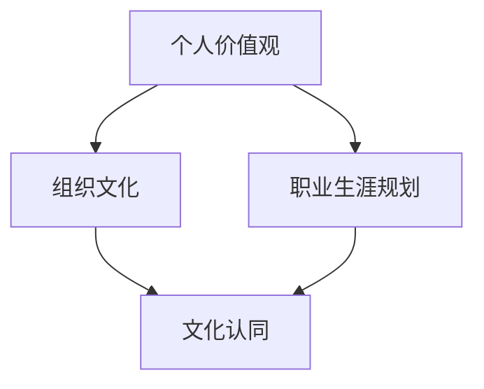

- **个人价值观**：个体对自身价值观的认同，包括道德观、人生观等。
- **组织文化**：企业内部共享的价值观、行为准则和工作氛围。
- **职业生涯规划**：员工对自身职业发展的规划和目标。

### 2.2 外部因素

外部因素同样对员工身份认同产生重要影响。以下是一个外部因素的Mermaid流程图：

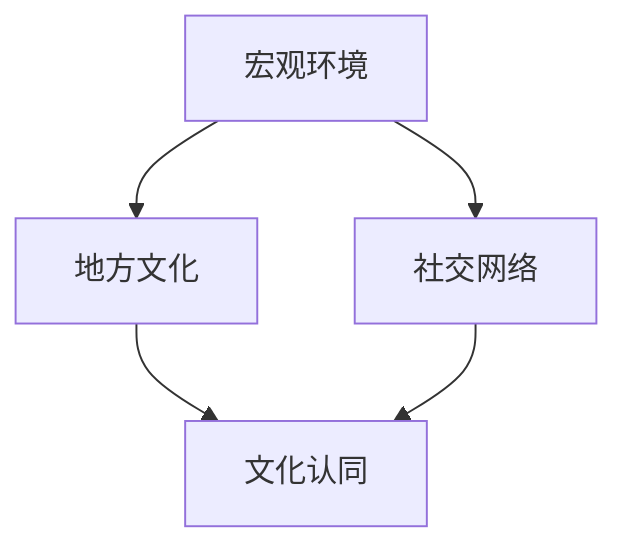

- **宏观环境**：全球政治、经济、社会环境的变化。
- **地方文化**：员工工作所在地的文化背景。
- **社交网络**：员工在工作中的社交圈和文化交流。

### 2.3 文化认同的构成

文化认同的构成包括三个主要方面：文化归属感、文化认同度和文化影响力。以下是一个文化认同的Mermaid流程图：

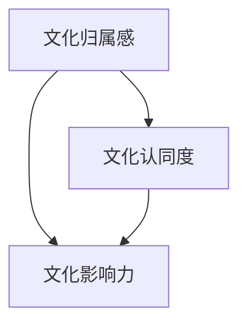

- **文化归属感**：个体对自己所属文化的认同和归属感。
- **文化认同度**：个体对文化特征的认可程度。
- **文化影响力**：文化对个体行为和决策的影响程度。

## 跨国公司员工的身份认同

### 3.1 身份认同的形成

跨国公司员工的身份认同是一个复杂的过程，涉及多种内部和外部因素。以下是详细的探讨：

### 3.1.1 内部因素分析

内部因素主要包括个人价值观、组织文化和职业生涯规划。

#### 3.1.1.1 个人价值观

个人价值观是员工文化认同的基石。个体对自身价值观的认同程度越高，其文化归属感就越强。以下是一个个人价值观的Mermaid流程图：

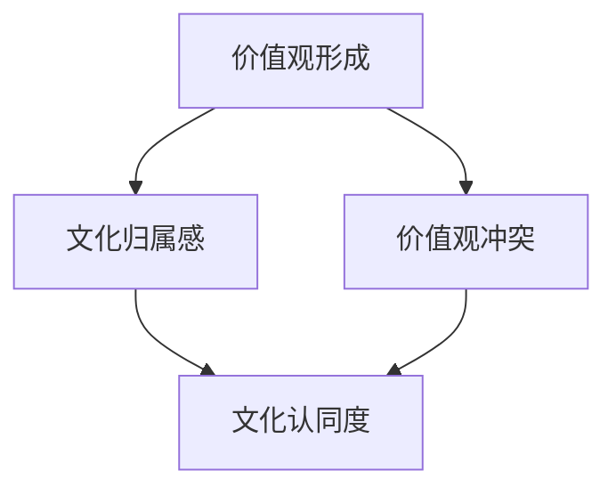

#### 3.1.1.2 组织文化

组织文化是员工文化认同的重要来源。企业内部共享的价值观和行为准则可以增强员工的文化归属感。以下是一个组织文化的Mermaid流程图：

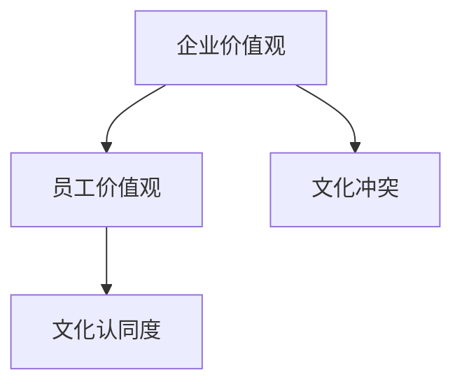

#### 3.1.1.3 职业生涯规划

职业生涯规划对员工的文化认同也有重要影响。一个明确的职业目标可以帮助员工更好地融入企业文化，增强文化认同度。以下是一个职业生涯规划的Mermaid流程图：

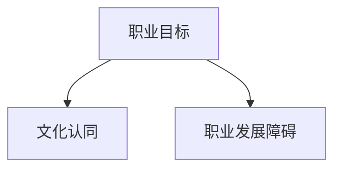

### 3.1.2 外部因素分析

外部因素主要包括宏观环境、地方文化和社交网络。

#### 3.1.2.1 宏观环境

宏观环境的变化，如全球政治和经济形势，会影响员工的文化认同。以下是一个宏观环境的Mermaid流程图：

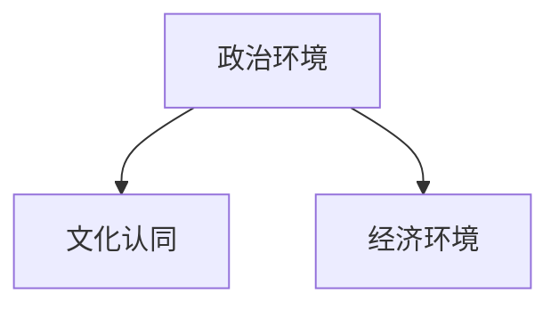

#### 3.1.2.2 地方文化

地方文化是员工工作环境的重要组成部分。不同地方的文化差异可能会影响员工的文化认同。以下是一个地方文化的Mermaid流程图：

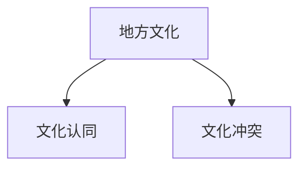

#### 3.1.2.3 社交网络

社交网络是员工获取文化信息的重要途径。通过社交网络，员工可以了解不同的文化，增强文化认同。以下是一个社交网络的Mermaid流程图：

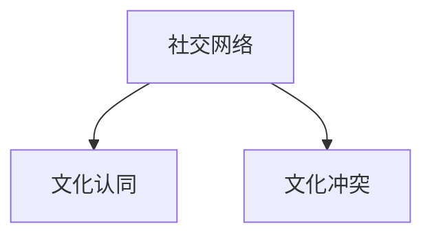

### 3.2 身份认同的影响

员工的文化认同不仅影响个人，也对公司产生深远的影响。以下是详细的探讨：

#### 3.2.1 对员工个人的影响

良好的文化认同可以帮助员工提高工作满意度、心理健康和创新能力。以下是详细的Mermaid流程图：

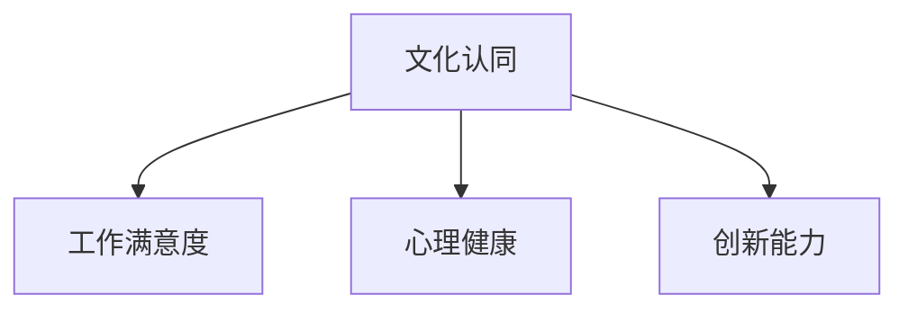

#### 3.2.2 对公司的影响

员工的文化认同对公司也具有重要影响。以下是详细的Mermaid流程图：

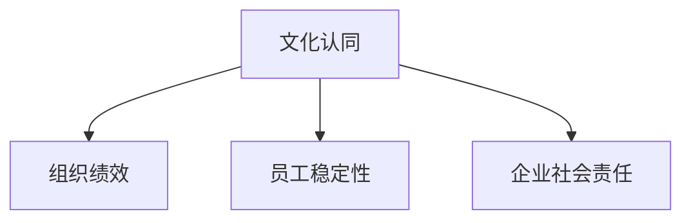

## 文化适应与融合

### 4.1 文化适应策略

文化适应是指员工在新的文化环境中，如何调整自己的行为和思维方式，以更好地适应和融入。以下是详细的文化适应策略：

#### 4.1.1 个人层面

个人层面的文化适应主要包括自我反思和文化学习。

- **自我反思**：员工需要反思自己的文化背景和行为方式，识别出可能与新文化环境不符的部分。
- **文化学习**：员工需要主动学习新的文化知识和行为准则，以便更好地适应新环境。

#### 4.1.2 组织层面

组织层面的文化适应主要包括跨文化培训和跨文化团队建设。

- **跨文化培训**：企业可以为员工提供跨文化培训，帮助他们更好地了解和理解新文化环境。
- **跨文化团队建设**：通过团队建设活动，增强团队成员之间的文化认同和团队凝聚力。

### 4.2 文化融合实践

文化融合是指将不同文化整合在一起，形成一种新的文化。以下是详细的文化融合实践：

#### 4.2.1 案例研究

通过案例研究，我们可以了解跨国公司在文化融合方面的实践和成效。

- **案例一**：某跨国公司通过设立多元文化中心，为员工提供文化学习和交流的平台。
- **案例二**：另一跨国公司通过举办国际文化节，增强员工对多元文化的认识和尊重。

#### 4.2.2 挑战与解决方案

在文化融合过程中，可能会遇到一些挑战，如文化冲突和价值观差异。以下是详细的挑战与解决方案：

- **挑战**：文化冲突和价值观差异可能导致团队内部的矛盾和冲突。
- **解决方案**：通过建立共同的目标和价值观，以及开展文化交流活动，可以缓解文化冲突和价值观差异。

## 案例分析

### 5.1 案例一：跨国公司A的文化认同实践

#### 5.1.1 公司背景

跨国公司A是一家全球性的科技公司，其员工来自世界各地，拥有多样化的文化背景。

#### 5.1.2 文化认同策略

公司A采取了一系列策略来提升员工的文化认同，包括：

- **跨文化培训**：为员工提供多样化的跨文化培训，帮助他们更好地适应新环境。
- **多元文化中心**：设立多元文化中心，为员工提供文化交流和学习的机会。
- **国际团队建设**：通过国际团队建设活动，增强团队成员之间的文化认同和团队凝聚力。

#### 5.1.3 实施效果评估

实施这些策略后，公司A的员工满意度、心理健康和创新能力都有显著提高，公司的整体绩效也得到提升。

### 5.2 案例二：跨国公司B的文化融合经验

#### 5.2.1 公司背景

跨国公司B是一家全球性的消费品公司，其员工也来自不同的国家和地区。

#### 5.2.2 文化融合经验

公司B通过以下方式实现文化融合：

- **国际文化节**：每年举办国际文化节，展示不同文化的特色和魅力。
- **文化大使计划**：选拔文化大使，负责推动公司内部的文化交流和融合。
- **共同价值观**：强调共同的企业价值观，促进员工之间的文化认同。

#### 5.2.3 实施效果

通过这些措施，公司B的员工对企业的文化认同度显著提高，公司的多元文化环境也得到优化。

## 对策与建议

### 6.1 对跨国公司的建议

- **加强跨文化培训**：为员工提供多样化的跨文化培训，帮助他们更好地适应新环境。
- **建立多元文化中心**：为员工提供文化交流和学习的机会。
- **促进国际团队建设**：通过团队建设活动，增强团队成员之间的文化认同和团队凝聚力。

### 6.2 对员工的建议

- **主动学习新文化**：主动了解和学习新的文化知识和行为准则。
- **参与文化交流活动**：积极参与公司组织的文化交流活动，增强文化认同。

## 小结与展望

本文通过对全球化时代的文化认同进行深入探讨，揭示了跨国公司员工身份认同的重要性及其影响。通过案例分析，我们看到了跨国公司在文化适应与融合方面的实践和成效。未来，随着全球化进程的加速，文化认同将成为跨国公司管理和提升绩效的重要手段。我们期待更多的研究能够进一步探讨文化认同的理论和实践，为跨国公司提供更加有效的管理策略。

### 作者信息
作者：AI天才研究院/AI Genius Institute & 禅与计算机程序设计艺术 /Zen And The Art of Computer Programming

[END]

