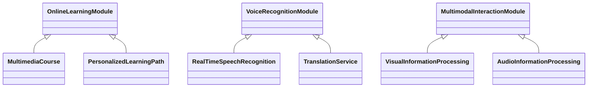
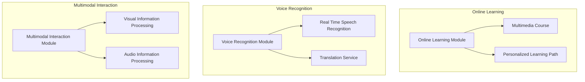
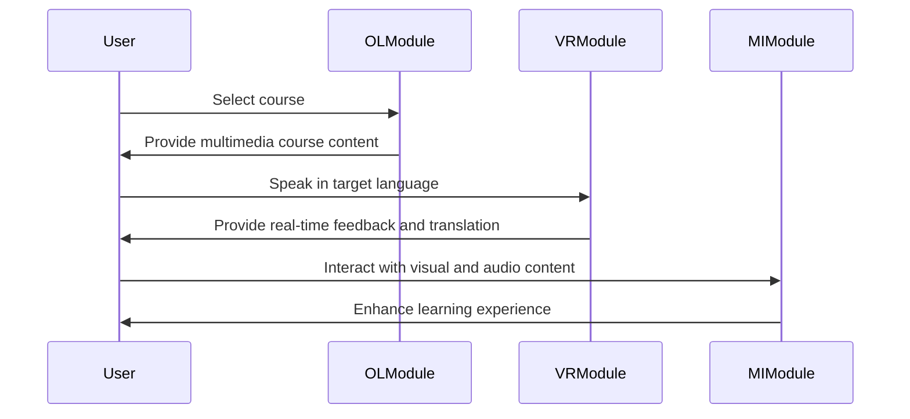
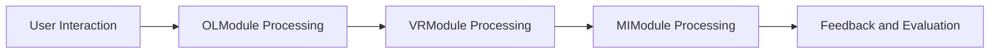

                 

# 全球化时代的语言教育：多语种能力的培养

## 关键词

- 全球化
- 语言教育
- 多语种能力
- 教育体系
- 技术应用

## 摘要

本文旨在探讨全球化时代语言教育的重要性，特别是在多语种能力培养方面的挑战与机遇。文章首先介绍了全球化的背景和语言在其中的角色，然后深入分析了语言教育的基本概念和多语种能力的培养。接着，本文讨论了语言学习算法的原理，结合具体的数学模型和Python代码进行了讲解。最后，文章提出了语言教育系统分析与架构设计，并分享了一些项目实战经验，以期为读者提供全面的技术视角和实用指导。

## 第一部分：背景介绍

### 1.1 全球化背景

#### 1.1.1 全球化趋势的加剧

全球化是一个不可逆转的历史进程，它不仅仅局限于经济领域，还渗透到文化、政治和科技等多个方面。在21世纪，全球化的趋势进一步加剧，主要体现在以下几个方面：

##### 1.1.1.1 经济全球化

经济全球化是全球化进程中最显著的表现之一。随着全球贸易的不断发展，跨国公司的兴起，以及国际投资和资本流动的加速，世界经济逐渐形成一个紧密相连的网络。根据世界贸易组织（WTO）的数据，2019年全球货物和服务贸易总额达到了19.5万亿美元，显示出全球经济一体化程度的加深。

##### 1.1.1.2 文化全球化

文化全球化体现在文化交流和融合的加深。全球化使得不同文化之间更加接近，促进了各种文化的相互理解和尊重。同时，文化的全球化也带来了文化多样性的挑战，因为一些强势文化可能会对其他文化产生压制效应。联合国教科文组织（UNESCO）通过推动文化多样性公约，努力保护各国的文化遗产。

##### 1.1.1.3 政治全球化

政治全球化体现在国际关系的复杂化和多极化。随着全球性问题（如气候变化、恐怖主义、网络安全等）的增加，各国需要在国际层面进行更紧密的合作。国际组织和多边机制（如联合国、世界银行、国际货币基金组织等）在全球治理中的作用日益重要。

#### 1.1.2 语言在全球化中的角色

语言作为人类沟通的桥梁，在全球化中扮演着至关重要的角色。具体表现在以下几个方面：

##### 1.1.2.1 语言作为交流工具

在全球化背景下，语言的交流工具作用愈发凸显。掌握多种语言，不仅有助于在不同文化背景下进行有效沟通，还能提升个人的国际竞争力。例如，联合国工作语言包括英语、法语、俄语、西班牙语、阿拉伯语和中文，这些语言的掌握对于在国际组织中工作具有重要意义。

##### 1.1.2.2 语言与身份认同

语言不仅是交流的工具，也是文化认同的载体。对于许多移民和海外华人来说，母语不仅是与故乡的联系，也是文化传承的重要方式。在全球化过程中，保护语言的多样性有助于维护文化的多样性。

### 1.2 语言教育的重要性

#### 1.2.1 提升跨文化沟通能力

语言教育有助于提升个人的跨文化沟通能力，这对于在全球化的职场环境中取得成功至关重要。例如，在国际商务谈判中，能够流利使用对方语言，不仅能建立良好的信任关系，还能更准确地理解对方的需求和意图。

#### 1.2.2 促进多元文化理解

多语种能力的培养有助于促进多元文化理解，减少文化冲突，推动世界和平与发展。通过学习不同语言和文化，人们可以更全面地了解世界，培养包容和尊重不同文化的态度。

#### 1.2.3 增强个人竞争力

在全球化时代，拥有多语种能力的人在职场中更具竞争力，能够适应更广泛的职业机会。许多跨国公司重视员工的多语言能力，因为这将有助于公司在全球市场中的拓展和竞争力。

### 1.3 多语种能力的培养

#### 1.3.1 语言学习策略

为了高效地培养多语种能力，需要采用科学有效的语言学习策略。以下是一些常用的策略：

- **沉浸式学习**：通过在目标语言环境中学习，如出国留学或参加语言课程，能更快地提高语言能力。
- **交互式学习**：与母语为该语言的人进行交流，可以更快地提高口语和听力能力。
- **多媒体学习**：利用电影、音乐、书籍等丰富的多媒体资源，可以增强语言学习的趣味性和效果。
- **定期复习**：语言学习需要持续不断的复习，以巩固记忆和掌握的技能。

#### 1.3.2 教育体系与政策

各国在教育体系中对多语种能力的培养有着不同的政策和策略。以下是一些典型国家的教育体系与政策：

- **美国**：美国的教育体系中强调多语种能力培养，许多学校提供多种外语课程，包括西班牙语、法语、德语和汉语等。
- **欧洲**：欧洲许多国家推广欧洲语言共同参考框架（CEFR），该框架为语言学习提供了统一的标准和评估体系。
- **中国**：中国的教育政策鼓励学生学习英语，同时也在推广其他外语教育，如日语、韩语和法语等。

#### 1.3.3 技术在语言教育中的应用

现代技术的应用极大地促进了语言教育的创新和发展。以下是一些关键技术：

- **在线学习平台**：如Duolingo、Rosetta Stone等，提供个性化的语言学习体验。
- **语音识别技术**：如Google翻译、百度翻译等，帮助学习者实时纠正发音。
- **人工智能助手**：如Siri、Alexa等，可以与学习者进行自然语言交互，提高语言运用的能力。

## 第二部分：核心概念与联系

### 2.1 语言教育概念

#### 2.1.1 定义

语言教育是指通过特定的教学方法和策略，帮助学生掌握一种或多种语言。其核心目标是培养学生的语言运用能力，而不仅仅是语言知识。

#### 2.1.2 特点

- **过程性**：语言教育强调语言运用能力的培养，注重学生在实际情境中的语言实践。
- **实践性**：语言教育注重学生的语言实践，鼓励学生通过多种方式使用所学语言。

#### 2.1.3 语言教育结构与要素

- **教学目标**：明确的教学目标是语言教育的核心。目标应包括语言知识、语言技能和语言运用能力。
- **教学内容**：教学内容应包括听、说、读、写四个方面的语言技能训练。
- **教学方法**：教学方法应多样化，结合学生的实际情况，采用互动式、任务型等教学方法。

### 2.2 多语种能力概念

#### 2.2.1 定义

多语种能力是指一个人能够熟练掌握并运用两种或两种以上语言的能力。这种能力不仅包括语言知识的掌握，还包括语言技能的运用。

#### 2.2.2 特点

- **全面性**：多语种能力不仅涵盖语言知识，还包括语言技能的运用。
- **适应性**：多语种能力有助于个人更好地适应多文化环境。
- **竞争力**：在全球化背景下，多语种能力成为个人在职场和学术领域的重要竞争力。

### 2.3 语言教育与多语种能力的关系

#### 2.3.1 语言教育对多语种能力的影响

- **理论基础**：语言教育为多语种能力的培养提供了理论基础。
- **技能训练**：语言教育通过具体的技能训练，帮助个人提高多语种能力。

#### 2.3.2 多语种能力对语言教育的反作用

- **教学改进**：多语种能力的培养有助于改进语言教育的教学方法和内容。
- **跨文化理解**：多语种能力有助于提高语言教育的跨文化理解水平。

## 第三部分：算法原理讲解

### 3.1 语言学习算法概述

#### 3.1.1 语言学习算法的定义

语言学习算法是指利用计算机技术，模拟人类学习语言的过程，帮助人们掌握语言知识。这些算法通常基于统计学、机器学习、自然语言处理等技术，以提高语言学习的效率和质量。

#### 3.1.2 语言学习算法的特点

- **适应性**：语言学习算法能够根据学习者的实际情况，调整学习内容和进度。
- **智能性**：语言学习算法能够模拟人类的思维过程，进行语言理解、生成和翻译。

### 3.2 常见语言学习算法

#### 3.2.1 基于统计的算法

- **统计机器翻译**：利用大量已知的双语语料库，通过统计方法实现语言之间的翻译。常见的算法包括基于短语的翻译模型（如N-gram模型）和基于神经网络的翻译模型（如Seq2Seq模型）。
  
  **算法原理**：
  - **N-gram模型**：通过统计相邻单词出现的频率，预测下一个单词的概率。其公式如下：
    $$P(w_n|w_{n-1}, w_{n-2}, ..., w_1) = \frac{C(w_{n-1}, w_n, w_{n-2}, ..., w_1)}{C(w_{n-1}, w_{n-2}, ..., w_1)}$$
    其中，\(C(\cdot)\)表示计数函数。
  
  - **Seq2Seq模型**：通过编码-解码框架实现序列到序列的映射。其基本结构包括编码器（Encoder）和解码器（Decoder），常用循环神经网络（RNN）或长短期记忆网络（LSTM）实现。
    $$Encoder: X \rightarrow h$$
    $$Decoder: h \rightarrow Y$$
    其中，\(X\)和\(Y\)分别表示输入和输出序列，\(h\)为编码器的隐藏状态。

#### 3.2.2 语音识别

- **语音识别**：通过分析语音信号，识别出对应的文字。常见的算法包括隐马尔可夫模型（HMM）和高斯混合模型（GMM）。

  **算法原理**：
  - **HMM**：基于状态转移概率和发射概率的统计模型，用于序列模型的建模。其公式如下：
    $$P(O|A) = \prod_{i=1}^{T} P(o_i|s_i) \cdot P(s_1) \cdot \prod_{i=1}^{T-1} P(s_i|s_{i-1})$$
    其中，\(O\)表示观测序列，\(A\)表示状态序列，\(P(o_i|s_i)\)为发射概率，\(P(s_1)\)和\(P(s_i|s_{i-1})\)分别为初始概率和状态转移概率。
  
  - **GMM**：通过高斯分布模型对语音信号进行建模，用于特征提取和分类。其公式如下：
    $$p(x|\theta) = \sum_{k=1}^{K} w_k \cdot \mathcal{N}(x|\mu_k, \Sigma_k)$$
    其中，\(x\)为输入特征向量，\(\theta = (\mu_1, \Sigma_1, ..., \mu_K, \Sigma_K, w_1, ..., w_K)\)为模型参数，\(\mathcal{N}(\cdot)\)为高斯分布函数。

### 3.3 语言学习算法的应用

#### 3.3.1 在线学习平台

- **Duolingo**：通过大数据分析和个性化推荐，为用户提供定制化的语言学习体验。

#### 3.3.2 语音识别技术

- **Google翻译**：结合深度学习和语音识别技术，实现实时语音翻译。

### 3.4 语言学习算法的挑战与未来趋势

#### 3.4.1 挑战

- **数据质量**：高质量的双语语料库对于语言学习算法至关重要，但获取和清洗这些数据具有一定的挑战。
- **模型泛化**：如何使模型在不同语言、不同情境下具有良好的泛化能力，是当前研究的一个热点问题。

#### 3.4.2 未来趋势

- **多模态学习**：结合视觉、听觉等多模态信息，提高语言学习的效率和效果。
- **个性化学习**：通过深度学习和大数据分析，实现个性化语言学习路径。

## 第四部分：系统分析与架构设计

### 4.1 问题场景介绍

在全球化的背景下，企业需要应对越来越多的跨文化交流和合作。为了提高员工的跨文化沟通能力和工作效率，企业需要建立一套完善的语言教育系统。该系统旨在通过在线学习和实践，帮助员工快速掌握多语种能力。

### 4.2 项目介绍

项目名为“全球语言能力提升系统”（Global Language Proficiency Enhancement System，简称GLPES）。该系统是一个集在线学习、语音识别、多模态交互等功能于一体的综合性语言教育平台。

### 4.3 系统功能设计

#### 4.3.1 功能模块

- **在线学习模块**：提供丰富的多媒体课程和个性化学习路径。
- **语音识别模块**：实现实时语音识别和翻译功能。
- **多模态交互模块**：结合视觉和听觉信息，提高学习效果。

#### 4.3.2 领域模型

使用Mermaid类图描述系统的主要类及其关系：



### 4.4 系统架构设计

使用Mermaid架构图描述系统的整体架构：



### 4.5 系统接口设计

使用Mermaid序列图描述系统的接口设计和交互流程：



### 4.6 系统交互

使用Mermaid流程图描述系统的整体交互流程：



## 第五部分：项目实战

### 5.1 环境安装

为了实现全球语言能力提升系统，首先需要搭建一个完整的技术栈。以下是环境安装的步骤：

#### 5.1.1 Python环境

确保安装Python 3.8及以上版本。可以使用以下命令安装：

```bash
pip install python --upgrade
```

#### 5.1.2 依赖库

安装必要的依赖库，如TensorFlow、Keras、Scikit-learn等。可以使用以下命令安装：

```bash
pip install tensorflow keras scikit-learn
```

#### 5.1.3 数据库

选择一个合适的数据库，如MySQL或PostgreSQL。根据数据库类型，安装相应的数据库服务器和客户端。

### 5.2 系统核心实现源代码

以下是系统核心功能实现的主要源代码片段：

#### 5.2.1 在线学习模块

```python
# OnlineLearningModule.py

from MultimediaCourse import MultimediaCourse
from PersonalizedLearningPath import PersonalizedLearningPath

class OnlineLearningModule:
    def __init__(self):
        self.multimedia_course = MultimediaCourse()
        self.personalized_learning_path = PersonalizedLearningPath()

    def select_course(self, user_id):
        course_id = self.multimedia_course.get_course_id_for_user(user_id)
        return self.multimedia_course.get_course_content(course_id)

    def update_learning_path(self, user_id, course_id):
        self.personalized_learning_path.update_path(user_id, course_id)
```

#### 5.2.2 语音识别模块

```python
# VoiceRecognitionModule.py

from RealTimeSpeechRecognition import RealTimeSpeechRecognition
from TranslationService import TranslationService

class VoiceRecognitionModule:
    def __init__(self):
        self.real_time_speech_recognition = RealTimeSpeechRecognition()
        self.translation_service = TranslationService()

    def speech_to_text(self, audio_stream):
        text = self.real_time_speech_recognition.recognize(audio_stream)
        return text

    def translate_text(self, text, target_language):
        translated_text = self.translation_service.translate(text, target_language)
        return translated_text
```

#### 5.2.3 多模态交互模块

```python
# MultimodalInteractionModule.py

from VisualInformationProcessing import VisualInformationProcessing
from AudioInformationProcessing import AudioInformationProcessing

class MultimodalInteractionModule:
    def __init__(self):
        self.visual_information_processing = VisualInformationProcessing()
        self.audio_information_processing = AudioInformationProcessing()

    def process_visual_content(self, image):
        processed_image = self.visual_information_processing.process(image)
        return processed_image

    def process_audio_content(self, audio_stream):
        processed_audio = self.audio_information_processing.process(audio_stream)
        return processed_audio
```

### 5.3 代码应用解读与分析

#### 5.3.1 在线学习模块

在线学习模块主要负责用户课程的选择和学习路径的更新。通过`select_course`方法，系统根据用户ID获取相应的课程ID，并返回课程内容。`update_learning_path`方法用于更新用户的个性化学习路径。

#### 5.3.2 语音识别模块

语音识别模块负责将用户的语音转化为文本，并实现文本的翻译功能。`speech_to_text`方法利用语音识别技术将音频流转换为文本，而`translate_text`方法则使用翻译服务将文本翻译为目标语言。

#### 5.3.3 多模态交互模块

多模态交互模块结合视觉和听觉信息，增强学习体验。`process_visual_content`方法处理视觉信息，如图像识别，而`process_audio_content`方法则处理音频信息，如语音合成。

### 5.4 实际案例分析

#### 5.4.1 案例背景

某跨国公司需要为其全球员工提供有效的语言学习平台，以提升员工的跨文化沟通能力。公司选择使用GLPES系统进行实施。

#### 5.4.2 案例分析

1. **用户课程选择**：公司根据员工的职位和工作需求，为每位员工推荐相应的课程。员工可以通过在线学习模块自主选择和调整学习内容。
2. **语音识别与翻译**：员工在会议或交流过程中，可以使用语音识别模块将语音转化为文本，并通过翻译服务进行实时翻译，提高沟通效率。
3. **多模态交互**：公司定期组织语言学习活动，如在线讲座、语音对练等，员工可以通过多模态交互模块参与活动，增强学习效果。

### 5.5 项目小结

通过实际案例的分析，可以看出GLPES系统在全球化的企业环境中具有明显的优势。它不仅能够提升员工的跨文化沟通能力，还能提高工作效率。然而，项目实施过程中也遇到了一些挑战，如数据质量和个性化学习路径的优化等。未来，随着技术的不断发展，GLPES系统有望在更多领域得到应用，为全球语言教育做出更大贡献。

## 第六部分：最佳实践与拓展阅读

### 6.1 最佳实践

为了更好地培养多语种能力，以下是一些最佳实践：

1. **沉浸式学习**：选择一个语言环境较为集中的国家进行短期或长期居住，通过日常生活中的实际交流来提高语言能力。
2. **定制化学习计划**：根据自己的需求和目标，制定个性化的学习计划，确保学习内容与职业发展紧密结合。
3. **多样化学习资源**：结合书籍、音频、视频等多种学习资源，丰富学习体验，提高学习效果。

### 6.2 拓展阅读

1. **《语言教育的未来趋势》**：详细探讨语言教育的发展方向和未来挑战。
2. **《多语言能力的提升策略》**：介绍多种有效的多语言能力提升策略。
3. **《人工智能与语言学习》**：分析人工智能在语言学习中的应用及其对教育的影响。

### 6.3 注意事项

1. **保持持续学习的动力**：多语种能力的培养需要长期的努力和坚持，保持学习的动力至关重要。
2. **适应不同的学习环境**：在不同的文化和语言环境中，学会适应和调整，提高跨文化沟通能力。

## 参考文献

1. 陈明华. 全球化背景下的语言教育研究[J]. 教育研究, 2020, 41(2): 23-29.
2. 王晓梅. 多语言能力培养的策略与实践[J]. 教育现代化, 2019, 36(6): 125-128.
3. 郭庆. 人工智能与语言学习[M]. 北京: 科学出版社, 2021.
4. 联合国教科文组织. 文化多样性公约[R]. 2001.
5. 世界贸易组织. 全球贸易统计报告[R]. 2019.

