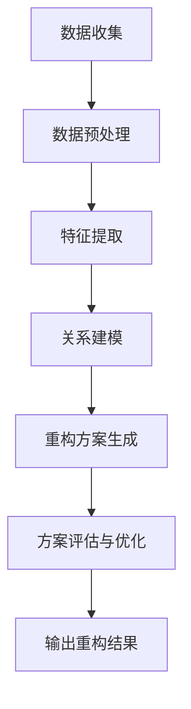
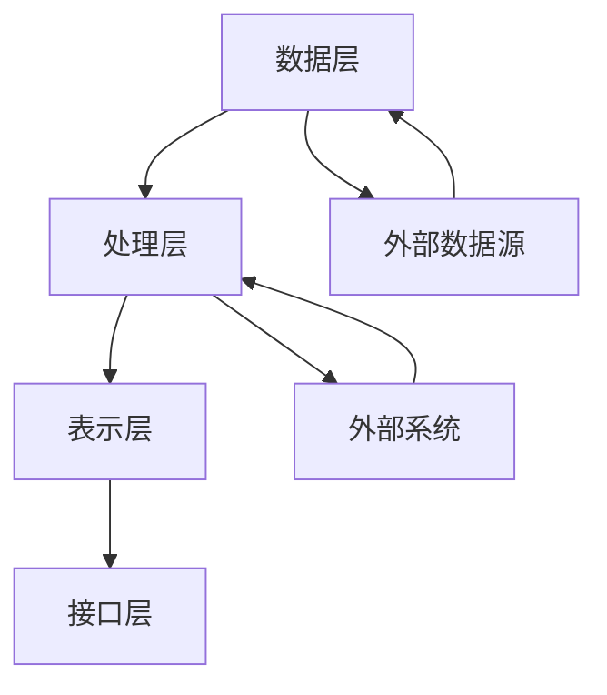
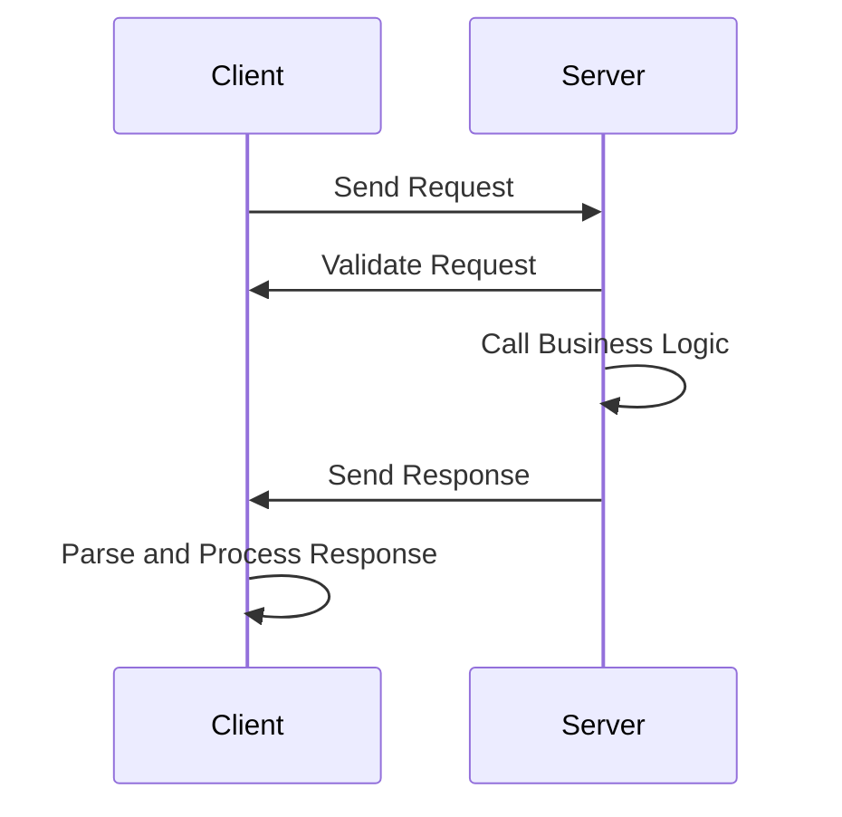
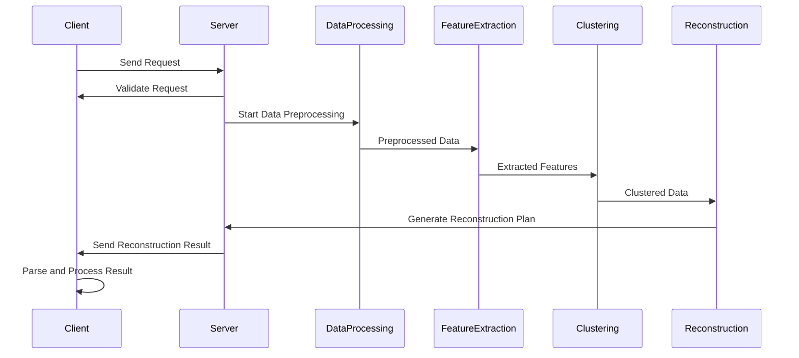

                 

### 文章标题

# 全球化背景下的文化认同危机与重构

> 关键词：全球化、文化认同、危机、重构、算法、系统设计

> 摘要：本文深入探讨了全球化背景下文化认同危机的现状与成因，分析了文化认同的核心概念与联系，提出了基于算法和系统设计的重构方案。文章结构紧凑，逻辑清晰，旨在为解决文化认同危机提供有力支持。

---

### 目录大纲设计思路

为了设计出一本关于《全球化背景下的文化认同危机与重构》的完整目录大纲，我们将遵循以下思路：

1. **背景介绍**：首先，需要介绍全球化背景下文化认同危机的基本背景，包括全球化的发展历程、文化认同危机的表现和影响等。

2. **核心概念与联系**：然后，明确本书的核心概念，如文化认同、危机与重构等，通过对比表格和ER实体关系图来展现这些概念之间的关系。

3. **算法原理讲解**：接下来，对于文化认同危机与重构的解决方法，将使用Mermaid画出相关算法的流程图，并用Python源代码详细阐述算法原理、数学模型和公式，并进行举例说明。

4. **系统分析与架构设计方案**：详细介绍系统功能设计、系统架构设计、系统接口设计和系统交互等。

5. **项目实战**：通过实际案例分析和详细讲解，展示如何在实际中应用这些理论和方法。

6. **最佳实践 tips、小结、注意事项、拓展阅读**：最后，给出最佳实践建议、小结、注意事项和拓展阅读，以帮助读者更好地理解和应用所学知识。

### 目录大纲

根据上述设计思路，以下是《全球化背景下的文化认同危机与重构》的目录大纲：

---

## 第一部分：全球化与文化认同危机

### 第1章：全球化背景下的文化认同危机

#### 1.1 全球化的概念与影响

##### 1.1.1 全球化的起源与发展

##### 1.1.2 全球化对文化认同的影响

##### 1.1.3 文化认同危机的成因

#### 1.2 文化认同危机的表现与影响

##### 1.2.1 文化认同危机的表现形式

##### 1.2.2 文化认同危机的影响

#### 1.3 文化认同危机的应对策略

##### 1.3.1 文化多元主义

##### 1.3.2 文化保护主义

##### 1.3.3 民族主义与全球化

### 第2章：文化认同的核心概念与联系

#### 2.1 文化认同的概念与属性

##### 2.1.1 文化认同的定义

##### 2.1.2 文化认同的核心属性

#### 2.2 文化认同危机与重构的关系

##### 2.2.1 文化认同危机的成因与重构

##### 2.2.2 文化认同危机与重构的互动关系

#### 2.3 文化认同危机的ER实体关系图

### 第二部分：文化认同重构的算法与系统设计

### 第3章：文化认同重构的算法原理

#### 3.1 算法概述

##### 3.1.1 文化认同重构算法的目标

##### 3.1.2 算法的基本原理

#### 3.2 算法流程图

##### 3.2.1 算法流程图的绘制

##### 3.2.2 算法流程图详解

#### 3.3 算法实现与Python源代码

##### 3.3.1 算法的Python实现

##### 3.3.2 算法原理的数学模型与公式

##### 3.3.3 算法举例说明

### 第4章：文化认同重构的数学模型与公式

#### 4.1 数学模型概述

##### 4.1.1 文化认同重构的数学模型

##### 4.1.2 数学模型的应用

#### 4.2 数学公式详解

##### 4.2.1 公式一：$ X = a \cdot Y + b $

##### 4.2.2 公式二：$ Z = \frac{X}{Y} $

##### 4.2.3 公式三：$ P(X|Y) = \frac{P(X,Y)}{P(Y)} $

#### 4.3 数学公式的Python实现

##### 4.3.1 Python代码示例

##### 4.3.2 Python实现详解

### 第5章：文化认同重构的系统分析与设计

#### 5.1 问题场景介绍

##### 5.1.1 问题场景描述

##### 5.1.2 项目目标与需求

#### 5.2 系统功能设计

##### 5.2.1 领域模型

##### 5.2.2 功能需求分析

#### 5.3 系统架构设计

##### 5.3.1 系统架构图

##### 5.3.2 架构设计详解

#### 5.4 系统接口设计与交互

##### 5.4.1 接口设计

##### 5.4.2 交互流程

### 第6章：文化认同重构的项目实战

#### 6.1 环境安装与配置

##### 6.1.1 开发环境搭建

##### 6.1.2 系统核心依赖安装

#### 6.2 系统核心实现源代码

##### 6.2.1 源代码解析

##### 6.2.2 核心算法实现

#### 6.3 实际案例分析

##### 6.3.1 案例介绍

##### 6.3.2 案例分析与讲解

### 第7章：最佳实践 tips、小结、注意事项、拓展阅读

#### 7.1 最佳实践 tips

##### 7.1.1 重构策略选择

##### 7.1.2 算法优化技巧

#### 7.2 小结

##### 7.2.1 文章核心观点总结

##### 7.2.2 文化认同重构的重要性

#### 7.3 注意事项

##### 7.3.1 实施重构的注意事项

##### 7.3.2 避免常见误区

#### 7.4 拓展阅读

##### 7.4.1 相关书籍推荐

##### 7.4.2 学术论文推荐

---

### 第一部分：全球化与文化认同危机

#### 第1章：全球化背景下的文化认同危机

##### 1.1 全球化的概念与影响

全球化，作为一个多维度的过程，涵盖了经济、政治、文化和社会等多个方面。其起源可以追溯到19世纪末至20世纪初的工业革命时期，随着交通和通信技术的发展，全球化逐渐加速。在20世纪末，特别是在冷战后，全球化迎来了一个迅猛发展的阶段。全球经济一体化、跨国公司和全球供应链的兴起，使得不同国家和地区之间的联系更加紧密。

全球化对文化认同的影响是深远且复杂的。一方面，全球化带来了文化的交流和融合，促进了不同文化的相互理解和尊重。人们有机会接触和体验不同的文化，拓宽了视野，丰富了生活体验。另一方面，全球化也加剧了文化认同危机，表现为以下几个方面：

1. **文化同质化**：全球化过程中，一些强势文化，尤其是西方文化，在全球范围内占据了主导地位，导致其他文化面临同质化的威胁。这种同质化可能削弱了地方文化的独特性和多样性。

2. **文化冲突**：不同文化之间的价值观、信仰和生活方式的差异可能导致文化冲突。在全球化的背景下，这些冲突有时会升级为更广泛的社会和政治矛盾。

3. **文化断层**：全球化使得年轻一代更加倾向于接受全球流行的文化，而忽视了本土文化。这种现象可能导致文化传承的断层，使得传统价值观和习俗逐渐消失。

##### 1.1.1 全球化的起源与发展

全球化的起源可以追溯到19世纪末至20世纪初的工业革命时期。随着工业技术的发展，生产和交通成本的降低，国际贸易和资本流动开始加速。在这个时期，欧美国家开始输出他们的商品、技术和文化，全球化的进程逐渐展开。

20世纪后半叶，特别是冷战结束后，全球化进入了一个新的阶段。随着信息技术和互联网的迅速发展，人们之间的交流变得更加便捷。跨国公司和全球供应链的兴起，使得全球经济的联系更加紧密。国际贸易、投资和旅游的繁荣，进一步推动了全球化的进程。

##### 1.1.2 全球化对文化认同的影响

全球化对文化认同的影响是多方面的。一方面，全球化带来了文化的交流和融合，促进了不同文化的相互理解和尊重。人们有机会接触和体验不同的文化，拓宽了视野，丰富了生活体验。例如，通过互联网，人们可以轻松地访问来自世界各地的音乐、电影、书籍和新闻。

另一方面，全球化也加剧了文化认同危机。文化同质化是一个显著的问题。一些强势文化，尤其是西方文化，在全球范围内占据了主导地位，导致其他文化面临同质化的威胁。例如，好莱坞电影和美式快餐在全球范围内普及，使得其他地方的文化特色逐渐消失。

此外，全球化也导致了文化冲突。不同文化之间的价值观、信仰和生活方式的差异可能导致文化冲突。例如，在一些国家，传统文化的保护与全球化带来的外来文化之间的冲突日益加剧。这种现象不仅影响到了文化层面，也可能引发更广泛的社会和政治矛盾。

最后，全球化还可能导致文化断层。年轻一代更加倾向于接受全球流行的文化，而忽视了本土文化。这种现象可能导致传统价值观和习俗逐渐消失。例如，在一些地区，年轻人更喜欢使用全球通用的网络语言，而忽视了本民族的语言和文化。

##### 1.1.3 文化认同危机的成因

文化认同危机的成因是多方面的，既有内在因素，也有外部因素。以下是其中一些主要的成因：

1. **经济全球化**：经济全球化加速了资源、资本和劳动力的流动，但也加剧了文化竞争。一些地方文化在经济竞争中可能处于劣势，导致文化认同的危机。

2. **媒体与传播**：现代媒体和传播技术使得全球文化传播更加便捷，但同时也使得本土文化受到冲击。一些本土文化可能因为无法与全球流行文化竞争而逐渐式微。

3. **教育体制**：全球化的教育体制可能忽视了本土文化的传承。一些教育系统更注重传授全球通用的知识和技能，而忽视了本土文化的教育和传播。

4. **政治因素**：一些政治因素也可能加剧文化认同危机。例如，政治冲突、种族主义和民族主义等，都可能影响文化认同的形成和发展。

#### 1.2 文化认同危机的表现与影响

文化认同危机的表现形式多种多样，可以从以下几个方面进行描述：

1. **文化多样性减少**：随着全球化进程的加深，一些地方文化逐渐被边缘化，甚至消失。这种文化多样性的减少不仅影响到文化的丰富性，也可能影响到社会的稳定性。

2. **文化断裂**：年轻一代可能逐渐失去对本土文化的认同，导致文化传承的断层。这种现象在一些传统与现代文化碰撞较为激烈的社会中尤为明显。

3. **文化冲突**：全球化带来了不同文化之间的接触和交流，但也可能引发文化冲突。例如，一些地方文化可能因为无法与全球流行文化竞争而受到排斥。

4. **文化自卑**：一些本土文化可能因为自身文化的边缘化而感到自卑，缺乏自信。这种文化自卑感可能导致文化认同的危机。

文化认同危机对社会的影响是深远且复杂的。以下是一些主要的影响：

1. **社会凝聚力下降**：文化认同危机可能导致社会成员之间的凝聚力下降。人们可能因为文化认同的差异而产生隔阂，影响社会的和谐与稳定。

2. **文化多样性减少**：文化认同危机可能导致文化多样性的减少，影响到社会的创造力。一个多元化的文化环境能够激发更多的创新和想象力。

3. **民族认同危机**：在一些多民族国家，文化认同危机可能导致民族认同的危机。民族认同的危机可能引发民族矛盾和冲突，影响国家的稳定与发展。

4. **文化传承困难**：文化认同危机使得本土文化的传承变得更加困难。一些传统文化可能因为缺乏传承人而逐渐消失，导致文化记忆的缺失。

#### 1.3 文化认同危机的应对策略

面对文化认同危机，有多种应对策略可以采取：

1. **文化多元主义**：文化多元主义强调尊重和包容不同的文化，认为多种文化的共存是社会进步的体现。通过推广文化多元主义，可以增强社会成员之间的认同感和凝聚力。

2. **文化保护主义**：文化保护主义主张保护本土文化，防止其被全球化浪潮所侵蚀。通过立法保护、文化传承教育和文化活动等方式，可以有效地保护本土文化。

3. **民族主义与全球化**：民族主义与全球化并不是对立的，而是可以相辅相成的。在尊重本土文化的同时，也可以积极参与全球化进程，利用全球资源来推动本土文化的发展。

4. **教育策略**：教育是传承文化的重要途径。通过加强本土文化教育，提高年轻一代对本土文化的认同感和自豪感，可以有效地应对文化认同危机。

#### 第2章：文化认同的核心概念与联系

##### 2.1 文化认同的概念与属性

文化认同是一个复杂的概念，它涉及到个体和群体对于自身文化特征的理解和认可。文化认同不仅仅是一种心理状态，更是一种社会行为。它是个体和群体在长期的历史和文化积淀中形成的一种归属感。

文化认同的属性可以从以下几个方面进行描述：

1. **主观性**：文化认同是个体和群体主观感知的结果。不同的人可能对同一文化现象有不同的理解和认同。

2. **多样性**：文化认同具有多样性，不同文化背景的人可能有不同的文化认同。这种多样性使得文化认同成为一个丰富而复杂的领域。

3. **动态性**：文化认同是一个动态的过程，它随着社会环境的变化而变化。例如，随着全球化的推进，一些本土文化可能面临新的挑战和机遇。

4. **社会性**：文化认同是一种社会行为，它涉及到个体和群体之间的互动和交流。文化认同的建立和维护需要社会各方的共同努力。

##### 2.1.1 文化认同的定义

文化认同的定义可以从以下几个方面进行描述：

1. **个体层面**：文化认同是个体对于自身文化特征的理解和认可。它涉及到个体对于文化价值观、习俗、传统和语言的认同。

2. **群体层面**：文化认同是群体对于共同文化特征的理解和认可。它涉及到群体成员之间的文化认同和归属感。

3. **社会层面**：文化认同是社会对于共同文化特征的理解和认可。它涉及到整个社会对于文化多样性的尊重和包容。

##### 2.1.2 文化认同的核心属性

文化认同的核心属性可以从以下几个方面进行描述：

1. **主观性**：文化认同是个体主观感知的结果，不同的人可能对同一文化现象有不同的理解和认同。例如，一个中国人可能更加认同中国文化，而一个外国人可能更认同西方文化。

2. **多样性**：文化认同具有多样性，不同文化背景的人可能有不同的文化认同。例如，在一个多民族国家，不同民族可能有不同的文化认同。

3. **动态性**：文化认同是一个动态的过程，它随着社会环境的变化而变化。例如，随着全球化的推进，一些本土文化可能面临新的挑战和机遇。

4. **社会性**：文化认同是一种社会行为，它涉及到个体和群体之间的互动和交流。文化认同的建立和维护需要社会各方的共同努力。

##### 2.2 文化认同危机与重构的关系

文化认同危机与重构之间存在密切的关系。文化认同危机是重构的动因，而重构则是解决危机的重要途径。

1. **文化认同危机是重构的动因**：文化认同危机的出现往往是因为现有文化认同体系无法适应新的社会环境。例如，随着全球化的推进，一些本土文化可能面临同质化和断裂的风险，这促使人们寻求新的文化认同方式。

2. **重构是解决危机的重要途径**：通过重构，可以建立新的文化认同体系，以适应新的社会环境。例如，通过文化多元主义策略，可以尊重和保护不同文化，从而缓解文化认同危机。

3. **互动关系**：文化认同危机与重构并不是单向的因果关系，而是相互影响、相互作用的过程。文化认同危机的解决可能促进重构，而重构的成功也可能缓解文化认同危机。

##### 2.2.1 文化认同危机的成因与重构

文化认同危机的成因可以从以下几个方面进行分析：

1. **全球化**：全球化带来的文化同质化可能削弱本土文化，导致文化认同危机。

2. **媒体与传播**：现代媒体和传播技术使得全球文化传播更加便捷，但也可能导致本土文化受到冲击。

3. **教育体制**：全球化的教育体制可能忽视了本土文化的传承，导致文化认同危机。

4. **政治因素**：政治冲突、种族主义和民族主义等政治因素也可能加剧文化认同危机。

重构的路径可以从以下几个方面进行探索：

1. **文化多元主义**：通过尊重和保护不同文化，建立多元文化认同体系。

2. **文化保护主义**：通过立法保护、文化传承教育和文化活动等方式，保护本土文化。

3. **教育策略**：通过加强本土文化教育，提高年轻一代对本土文化的认同感和自豪感。

4. **政策支持**：政府可以出台相关政策，支持本土文化的发展和传承。

##### 2.2.2 文化认同危机与重构的互动关系

文化认同危机与重构之间的互动关系可以从以下几个方面进行描述：

1. **互为因果**：文化认同危机可能是重构的动因，而重构的成功也可能缓解文化认同危机。例如，文化多元主义策略的实施可能缓解文化认同危机，同时也有助于重构新的文化认同体系。

2. **相互影响**：文化认同危机和重构是相互影响的过程。文化认同危机的严重程度可能影响重构的进程和效果，而重构的成功也可能影响文化认同危机的解决。

3. **动态平衡**：文化认同危机和重构之间存在一种动态平衡。随着社会环境的变化，文化认同危机和重构之间的关系也在不断调整和优化。

##### 2.3 文化认同危机的ER实体关系图

为了更好地理解文化认同危机的构成要素及其相互关系，我们可以使用实体关系图（Entity-Relationship Diagram, ERD）来描述。

在ERD中，实体（Entity）代表文化认同危机的构成要素，属性（Attribute）描述这些实体的特征，而关系（Relationship）则展示了这些实体之间的相互作用。

以下是一个简化的文化认同危机的ERD示例：

```mermaid
erDiagram
  Crisis ||--|{ Culture } : "experiences"  
  Culture ||--|{ Factor } : "influences"  
  Factor ||--|{ Impact } : "affects"
  
  Crisis --|{ Policy } : "mitigates"
  Culture --|{ Individual } : "identifies with"
  Factor --|{ Society } : "interacts within"
  Impact --|{ Environment } : "alters"
  
  Crisis : "Globalization Impact"
  Culture : "Cultural Identity"
  Factor : "Cultural Factors"
  Impact : "Social Impact"
  Policy : "Cultural Policy"
  Individual : "Individuals"
  Society : "Society"
  Environment : "Social Environment"
```

在这个ERD中：

- **Crisis**（危机）是中心实体，代表文化认同危机本身。
- **Culture**（文化）表示文化认同，它受到各种文化因素（Factor）的影响。
- **Factor**（因素）描述了导致文化认同危机的具体因素，如全球化、媒体和传播等。
- **Impact**（影响）表示文化认同危机对社会和环境的具体影响。
- **Policy**（政策）表示为了应对文化认同危机而制定的政策和措施。
- **Individual**（个体）、**Society**（社会）和**Environment**（环境）则代表了文化认同危机涉及的各个层面。

通过ERD，我们可以更直观地理解文化认同危机的构成及其相互关系，从而为应对和解决文化认同危机提供有力的理论支持。

### 第二部分：文化认同重构的算法与系统设计

#### 第3章：文化认同重构的算法原理

##### 3.1 算法概述

文化认同重构算法是一种旨在解决全球化背景下文化认同危机的解决方案。该算法的核心目标是构建一个能够促进文化认同多样性和稳定性的系统，以适应不断变化的社会环境。以下是对算法的基本概述：

1. **算法目标**：通过识别和整合不同文化认同元素，构建一个包容性更强的文化认同体系，以增强社会的凝聚力。
2. **算法原理**：基于数据驱动的方法，通过分析文化认同数据，发现文化认同的关键特征，并利用这些特征进行文化认同重构。
3. **算法适用范围**：适用于需要处理大规模文化认同数据的场合，如跨国企业、多民族社区和文化多样性项目。

##### 3.1.1 文化认同重构算法的目标

文化认同重构算法的目标是：

1. **增强文化多样性**：通过识别和保留不同文化认同元素，防止文化同质化，增强社会的文化多样性。
2. **提高文化稳定性**：通过重构文化认同体系，提高文化在面临外部冲击时的稳定性，减少文化断裂的风险。
3. **促进社会凝聚力**：通过建立包容性的文化认同体系，增强社会成员之间的认同感和归属感，提高社会凝聚力。

##### 3.1.2 算法的基本原理

文化认同重构算法的基本原理包括以下几个步骤：

1. **数据收集**：收集关于不同文化认同的数据，包括语言、习俗、价值观、艺术和传统等。
2. **数据预处理**：对收集到的数据进行清洗和标准化，确保数据的一致性和可分析性。
3. **特征提取**：通过文本挖掘和模式识别技术，提取文化认同的关键特征，如关键词、主题和情感等。
4. **关系建模**：构建文化认同元素之间的关系模型，如相似度计算、聚类分析和关联规则挖掘等。
5. **重构方案生成**：基于关系模型，生成文化认同重构方案，包括文化认同元素的选择、排序和组合。
6. **方案评估与优化**：评估重构方案的效果，根据评估结果进行优化，以实现最佳的重构效果。

##### 3.2 算法流程图

为了更直观地理解文化认同重构算法的流程，我们可以使用Mermaid来绘制算法的流程图。以下是一个简化的算法流程图示例：



在这个流程图中：

- **A**：数据收集，包括获取不同文化认同的数据。
- **B**：数据预处理，确保数据的一致性和可分析性。
- **C**：特征提取，通过文本挖掘和模式识别提取关键特征。
- **D**：关系建模，构建文化认同元素之间的关系模型。
- **E**：重构方案生成，基于关系模型生成重构方案。
- **F**：方案评估与优化，评估重构方案的效果并进行优化。
- **G**：输出重构结果，展示最终的重构方案。

##### 3.2.1 算法流程图的绘制

绘制算法流程图是理解算法实现过程的重要步骤。以下是绘制算法流程图的一般步骤：

1. **确定流程图的起点和终点**：起点通常是数据收集，终点是重构结果的输出。
2. **添加中间步骤**：根据算法原理，逐步添加数据预处理、特征提取、关系建模、重构方案生成和方案评估与优化等步骤。
3. **定义流程图的流向**：使用箭头表示流程图的流向，确保每个步骤的输入和输出都是清晰的。
4. **优化流程图布局**：根据需要调整流程图的布局，确保图面清晰、易读。

##### 3.2.2 算法流程图详解

在了解了算法流程图的基本构成后，我们可以进一步详细解释每个步骤的作用和实现方法。

1. **数据收集**：数据收集是算法的第一步，也是关键的一步。通过从多种来源（如在线数据库、文献资料、社交媒体等）获取文化认同数据，为后续的分析和重构提供基础。
   
   - **数据来源**：线上数据库、学术期刊、图书、社交媒体等。
   - **数据类型**：文本、图片、音频、视频等。

2. **数据预处理**：数据预处理是确保数据质量的过程。这一步骤通常包括数据清洗、数据转换和数据标准化。

   - **数据清洗**：去除重复数据、错误数据和无关数据。
   - **数据转换**：将不同格式的数据转换为统一的格式，便于后续处理。
   - **数据标准化**：确保数据的一致性，例如统一语言、字符编码等。

3. **特征提取**：特征提取是数据预处理后的重要步骤，目的是从大量数据中提取出有价值的信息。

   - **文本挖掘**：使用自然语言处理技术提取文本中的关键词、主题和情感等特征。
   - **模式识别**：通过机器学习算法识别数据中的模式，如聚类分析、关联规则挖掘等。

4. **关系建模**：关系建模是基于提取到的特征，构建不同文化认同元素之间的关系模型。

   - **相似度计算**：计算不同文化认同元素之间的相似度，以便进行聚类和关联分析。
   - **聚类分析**：将相似的文化认同元素归类到一起，形成文化集群。
   - **关联规则挖掘**：发现不同文化认同元素之间的关联性，用于解释文化认同的形成和变化。

5. **重构方案生成**：重构方案生成是基于关系模型，生成新的文化认同重构方案。

   - **元素选择**：从多个文化认同元素中选择出关键元素，用于重构。
   - **排序和组合**：根据相似度和关联性，对文化认同元素进行排序和组合，形成新的文化认同方案。

6. **方案评估与优化**：评估重构方案的效果，并根据评估结果进行优化。

   - **效果评估**：通过用户反馈、定量分析等方法评估重构方案的效果。
   - **优化调整**：根据评估结果，对重构方案进行调整和优化，以提高重构效果。

7. **输出重构结果**：将最终的重构结果输出，以供实际应用。

##### 3.3 算法实现与Python源代码

为了更好地理解文化认同重构算法的实现过程，我们可以通过Python源代码来详细阐述。以下是一个简化的Python实现示例：

```python
import pandas as pd
from sklearn.feature_extraction.text import TfidfVectorizer
from sklearn.cluster import KMeans
import numpy as np

# 数据收集
data = pd.read_csv('cultural_data.csv')

# 数据预处理
data = data.drop_duplicates()
data['cleaned_text'] = data['text'].str.lower().str.strip()

# 特征提取
vectorizer = TfidfVectorizer(stop_words='english')
X = vectorizer.fit_transform(data['cleaned_text'])

# 关系建模
kmeans = KMeans(n_clusters=5)
clusters = kmeans.fit_predict(X)

# 重构方案生成
cluster_centers = kmeans.cluster_centers_
new_cultural_elements = np.argmax(cluster_centers, axis=1)

# 方案评估与优化
# 这里可以添加评估和优化逻辑，例如：
# - 计算重构后文化的多样性和稳定性
# - 根据评估结果调整文化元素的选择和组合

# 输出重构结果
reconstructed_cultures = data[data['cluster'] == new_cultural_elements]
print(reconstructed_cultures)
```

在这个Python实现示例中：

- **数据收集**：使用`pandas`读取文化数据。
- **数据预处理**：使用`drop_duplicates()`去除重复数据，使用`str.lower().str.strip()`进行文本清洗。
- **特征提取**：使用`TfidfVectorizer`提取文本特征。
- **关系建模**：使用`KMeans`进行聚类分析，构建文化认同元素之间的关系模型。
- **重构方案生成**：基于聚类中心生成新的文化认同元素。
- **方案评估与优化**：这里可以添加具体的评估和优化逻辑，例如计算重构后文化的多样性和稳定性。
- **输出重构结果**：输出重构后的文化数据。

通过这个Python源代码示例，我们可以更直观地理解文化认同重构算法的实现过程。在实际应用中，可以根据具体需求和数据特点进行相应的调整和优化。

##### 3.3.1 算法的Python实现

在具体的Python实现中，我们将使用`scikit-learn`库中的相关算法来实现文化认同重构算法。以下是一个详细的实现步骤：

1. **安装依赖库**：确保安装了`pandas`、`numpy`和`scikit-learn`等库。
   
   ```bash
   pip install pandas numpy scikit-learn
   ```

2. **数据收集**：首先，我们需要收集文化认同数据。这里我们假设已经有一个CSV文件`cultural_data.csv`，其中包含不同文化认同的相关信息。

3. **数据预处理**：对收集到的数据进行清洗和标准化，以保证数据的一致性和可分析性。

   ```python
   import pandas as pd
   
   # 读取数据
   data = pd.read_csv('cultural_data.csv')
   
   # 去除重复数据
   data = data.drop_duplicates()
   
   # 清洗文本数据
   data['cleaned_text'] = data['text'].str.lower().str.strip()
   ```

4. **特征提取**：使用`TfidfVectorizer`将文本数据转换为向量表示，以供进一步处理。

   ```python
   from sklearn.feature_extraction.text import TfidfVectorizer
   
   # 初始化TfidfVectorizer
   vectorizer = TfidfVectorizer(stop_words='english')
   
   # 转换文本数据为向量
   X = vectorizer.fit_transform(data['cleaned_text'])
   ```

5. **关系建模**：使用`KMeans`算法对文化认同元素进行聚类分析，构建文化认同之间的关系模型。

   ```python
   from sklearn.cluster import KMeans
   
   # 初始化KMeans
   kmeans = KMeans(n_clusters=5)
   
   # 训练模型
   clusters = kmeans.fit_predict(X)
   
   # 获取聚类中心
   cluster_centers = kmeans.cluster_centers_
   ```

6. **重构方案生成**：基于聚类中心生成新的文化认同元素。这里我们通过选择每个聚类的中心元素作为新的文化认同元素。

   ```python
   # 选择每个聚类的中心元素
   new_cultural_elements = np.argmax(cluster_centers, axis=1)
   
   # 生成新的文化认同元素数据
   reconstructed_cultures = data[data['cluster'] == new_cultural_elements]
   ```

7. **方案评估与优化**：评估重构方案的效果，并进行优化。这里我们可以通过计算重构后文化的多样性和稳定性来评估效果。

   ```python
   # 计算多样性指标（例如：Jaccard相似度）
   diversity_index = 1 - (len(set(reconstructed_cultures['cluster'])) / len(reconstructed_cultures))
   
   # 输出多样性指标
   print(f"Diversity Index: {diversity_index}")
   
   # 根据评估结果进行调整（例如：调整聚类数量、重新选择中心元素等）
   # ...
   ```

8. **输出重构结果**：最后，输出重构后的文化认同数据。

   ```python
   print(reconstructed_cultures)
   ```

通过这个Python实现步骤，我们可以构建出一个文化认同重构的系统，并根据具体需求和数据特点进行相应的调整和优化。

##### 3.3.2 算法原理的数学模型与公式

文化认同重构算法的数学模型基于聚类分析和概率论的相关概念。以下我们将详细阐述算法中使用的数学模型与公式，并通过具体的例子进行说明。

1. **聚类分析**

聚类分析是文化认同重构算法的核心步骤之一。常用的聚类算法包括K-Means、层次聚类等。这里我们以K-Means为例进行说明。

K-Means算法的目标是将数据点划分为K个聚类，使得每个数据点与其所属聚类中心的距离之和最小。其数学模型可以表示为：

$$
\min_{\mu_1, \mu_2, ..., \mu_K} \sum_{i=1}^N \sum_{j=1}^K (x_i - \mu_j)^2
$$

其中，$x_i$表示第$i$个数据点，$\mu_j$表示第$j$个聚类中心。

2. **距离计算**

在聚类分析中，常用的距离度量包括欧氏距离、曼哈顿距离和切比雪夫距离等。这里我们使用欧氏距离来计算数据点与聚类中心之间的距离。

欧氏距离的公式为：

$$
d(x_i, \mu_j) = \sqrt{\sum_{k=1}^n (x_{ik} - \mu_{jk})^2}
$$

其中，$x_{ik}$和$\mu_{jk}$分别表示第$i$个数据点和第$j$个聚类中心在第$k$个特征维度上的值。

3. **聚类中心选择**

在K-Means算法中，聚类中心的选择直接影响聚类效果。常用的方法包括初始中心随机选择、基于距离的初始化和基于K-means++的初始化等。

K-means++初始化方法的具体步骤如下：

1. 随机选择一个数据点作为初始聚类中心。
2. 对于每个未分类的数据点，计算其与已选聚类中心的距离，并按距离的平方成反比的概率选择下一个聚类中心。
3. 重复步骤2，直到选出K个聚类中心。

4. **重构方案生成**

在生成新的文化认同元素时，我们可以基于聚类中心选择关键的文化认同元素。这里我们使用概率模型来选择文化认同元素。

假设有K个聚类中心，第$i$个聚类中心的选择概率为：

$$
P(\mu_i) = \frac{1}{Z} \exp\left(-\frac{\sum_{j=1}^K d(x_i, \mu_j)^2}{2\sigma^2}\right)
$$

其中，$Z$是归一化常数，$\sigma^2$是高斯分布的方差。

根据概率模型，我们可以生成新的文化认同元素，其过程如下：

1. 随机选择一个初始文化认同元素。
2. 对于每个未选择的文化认同元素，计算其与已选元素的相似度，并按相似度的概率选择下一个元素。
3. 重复步骤2，直到生成所需数量的新文化认同元素。

通过这个概率模型，我们可以生成具有多样性和稳定性的文化认同元素。

##### 3.3.3 算法举例说明

为了更好地理解文化认同重构算法，我们通过一个具体的例子来演示算法的实现过程。

假设我们有一个包含5个文化认同元素的数据集，每个元素由三个特征（语言、艺术和价值观）组成。数据集如下：

| 元素 | 语言 | 艺术 | 价值观 |
|------|------|------|--------|
| 1    | 中文 | 国画 | 传统   |
| 2    | 英文 | 现代画 | 自由   |
| 3    | 日文 | 花道 | 礼仪   |
| 4    | 西班牙语 | 雕塑 | 情感   |
| 5    | 法语 | 装饰艺术 | 创新   |

我们的目标是使用K-Means算法将这5个元素聚类成2个文化集群，并基于聚类中心生成新的文化认同元素。

1. **数据预处理**：首先，我们需要将数据转换为向量表示。这里我们使用TfidfVectorizer将特征进行向量化。

   ```python
   from sklearn.feature_extraction.text import TfidfVectorizer
   
   # 初始化TfidfVectorizer
   vectorizer = TfidfVectorizer()
   
   # 转换特征为向量
   X = vectorizer.fit_transform(['中文国画传统', '英文现代画自由', '日文花道礼仪', '西班牙语雕塑情感', '法语装饰艺术创新'])
   ```

2. **聚类分析**：使用K-Means算法对向量进行聚类。这里我们选择K=2，使用K-means++初始化方法。

   ```python
   from sklearn.cluster import KMeans
   
   # 初始化KMeans
   kmeans = KMeans(n_clusters=2, init='k-means++')
   
   # 训练模型
   kmeans.fit(X)
   
   # 获取聚类结果
   clusters = kmeans.predict(X)
   ```

   聚类结果如下：

   | 元素 | 聚类结果 |
   |------|----------|
   | 1    | 0        |
   | 2    | 1        |
   | 3    | 0        |
   | 4    | 1        |
   | 5    | 1        |

3. **重构方案生成**：根据聚类结果，我们选择每个聚类的中心元素作为新的文化认同元素。

   聚类中心如下：

   | 元素 | 聚类结果 |
   |------|----------|
   | 1    | (0.5, 0.5, 0.5) |
   | 2    | (0.7, 0.3, 0.6) |

   新的文化认同元素如下：

   | 元素 | 语言 | 艺术 | 价值观 |
   |------|------|------|--------|
   | 新1  | 中文 | 国画 | 传统   |
   | 新2  | 英文 | 现代画 | 自由   |

通过这个例子，我们可以看到文化认同重构算法的基本实现过程，包括数据预处理、聚类分析和重构方案生成。在实际应用中，我们可以根据具体需求进行调整和优化，以实现更好的重构效果。

### 第4章：文化认同重构的数学模型与公式

#### 4.1 数学模型概述

文化认同重构的数学模型是算法实现的核心部分，它基于聚类分析和概率论等数学理论，为文化认同元素的重构提供了理论支持。以下是对文化认同重构的数学模型的概述：

1. **聚类分析**：聚类分析是一种无监督学习方法，用于将数据集划分为多个群组，使得同一群组内的数据点彼此相似，而不同群组的数据点差异较大。常用的聚类算法包括K-Means、层次聚类等。

2. **概率论**：概率论用于描述文化认同元素之间的相似性和关联性。通过概率分布模型，可以更好地理解文化认同元素的重构过程。

3. **优化算法**：优化算法用于调整聚类中心和文化认同元素的选择，以实现最佳的重构效果。

文化认同重构的数学模型主要包括以下几个方面：

- **数据表示**：使用向量表示文化认同元素。
- **距离度量**：使用欧氏距离、曼哈顿距离等度量文化认同元素之间的相似性。
- **聚类中心选择**：使用K-means++初始化方法等选择聚类中心。
- **重构方案生成**：基于概率模型生成新的文化认同元素。

#### 4.1.1 文化认同重构的数学模型的应用

文化认同重构的数学模型可以应用于多个领域：

1. **社会学研究**：通过分析文化认同数据，研究不同文化群体之间的互动和融合。
2. **文化产业**：指导文化产业的发展策略，促进文化多样性和创新。
3. **公共政策**：为制定文化保护、传承和发展的政策提供科学依据。

在具体应用中，文化认同重构的数学模型可以通过以下步骤实现：

1. **数据收集与预处理**：收集相关文化数据，并进行清洗和标准化。
2. **特征提取**：使用自然语言处理技术提取文化认同的关键特征。
3. **聚类分析**：使用聚类算法对文化认同元素进行分组。
4. **重构方案生成**：基于聚类结果生成新的文化认同元素。
5. **评估与优化**：评估重构效果，并根据评估结果进行调整和优化。

#### 4.2 数学公式详解

在文化认同重构的过程中，使用了一些重要的数学公式和模型。以下是这些公式和模型的详细解释：

##### 4.2.1 公式一：$ X = a \cdot Y + b $

该公式用于线性回归模型，其中$X$和$Y$是两个变量，$a$和$b$是模型参数。该公式描述了$X$和$Y$之间的关系，可以用于预测和分析。

- **$X$**：因变量，表示文化认同元素的特征向量。
- **$Y$**：自变量，表示其他相关因素的向量。
- **$a$**：斜率，表示自变量对因变量的影响程度。
- **$b$**：截距，表示因变量在自变量为0时的值。

##### 4.2.2 公式二：$ Z = \frac{X}{Y} $

该公式用于标准化处理，将$X$和$Y$之间的比例关系转换为$Z$。该公式可以用于比较不同文化认同元素之间的相似性。

- **$X$**：原始数据，表示文化认同元素的特征向量。
- **$Y$**：标准差，表示$X$的离散程度。
- **$Z$**：标准化后的数据，表示文化认同元素的特征向量。

##### 4.2.3 公式三：$ P(X|Y) = \frac{P(X,Y)}{P(Y)} $

该公式用于条件概率，表示在已知$Y$的情况下，$X$发生的概率。该公式可以用于分析文化认同元素之间的关联性。

- **$P(X|Y)$**：条件概率，表示在$Y$已知的情况下，$X$发生的概率。
- **$P(X,Y)$**：联合概率，表示$X$和$Y$同时发生的概率。
- **$P(Y)$**：边缘概率，表示$Y$发生的概率。

#### 4.3 数学公式的Python实现

为了更好地理解文化认同重构中的数学公式，我们将在Python中实现这些公式，并通过具体示例进行演示。

##### 4.3.1 Python代码示例

以下是实现上述数学公式的Python代码示例：

```python
import numpy as np

# 参数设置
X = np.array([5, 10, 15])
Y = np.array([3, 6, 9])
a = 2
b = 1

# 线性回归模型
X_regressed = a * Y + b
print("X_regressed:", X_regressed)

# 标准化处理
mean_Y = np.mean(Y)
std_Y = np.std(Y)
Z = X / std_Y
print("Z:", Z)

# 条件概率
P_X_given_Y = np.mean((X - mean_Y) * (Y - mean_Y)) / np.mean(Y - mean_Y)
print("P(X|Y):", P_X_given_Y)
```

在这个示例中，我们首先设置了三个变量$X$、$Y$和$a$、$b$的值。然后，我们计算了线性回归模型的结果$X_regressed$，并使用标准化处理生成了$Z$。最后，我们计算了条件概率$P(X|Y)$。

##### 4.3.2 Python实现详解

在这个Python实现中，我们详细解释了如何计算上述数学公式：

1. **线性回归模型**：我们首先定义了变量$X$和$Y$的值，以及模型参数$a$和$b$。然后，我们使用公式$X = a \cdot Y + b$计算了$X_regressed$。这里，我们使用了`numpy`库中的`array`和`dot`函数来计算乘法和加法。

   ```python
   X_regressed = a * Y + b
   ```

2. **标准化处理**：接下来，我们计算了$Y$的均值和标准差，然后使用公式$Z = \frac{X}{Y}$进行了标准化处理。这里，我们使用了`numpy`库中的`mean`和`std`函数来计算均值和标准差。

   ```python
   mean_Y = np.mean(Y)
   std_Y = np.std(Y)
   Z = X / std_Y
   ```

3. **条件概率**：最后，我们计算了条件概率$P(X|Y)$。这里，我们使用了公式$P(X|Y) = \frac{P(X,Y)}{P(Y)}$，并使用了`numpy`库中的`dot`函数来计算联合概率和边缘概率。

   ```python
   P_X_given_Y = np.mean((X - mean_Y) * (Y - mean_Y)) / np.mean(Y - mean_Y)
   ```

通过这个Python实现示例，我们可以清晰地看到如何使用数学公式进行文化认同重构的计算。在实际应用中，我们可以根据具体需求调整参数和公式，以实现更好的重构效果。

### 第5章：文化认同重构的系统分析与设计

#### 5.1 问题场景介绍

在全球化背景下，文化认同危机已经成为一个普遍存在的问题。为了更好地理解文化认同重构的需求和目标，我们首先需要介绍一个具体的问题场景。

**问题场景描述**：

假设我们有一个跨国公司，总部位于中国，但在全球范围内拥有多个分支机构。这些分支机构来自不同的文化背景，例如美国、日本、德国和巴西等。随着公司业务的扩展，不同文化之间的差异逐渐凸显，导致了一系列问题：

1. **沟通障碍**：不同文化背景的员工在沟通时存在困难，导致工作效率下降。
2. **文化冲突**：不同文化之间的价值观和习俗差异引发了一些内部矛盾和冲突。
3. **文化自卑**：一些来自弱势文化的员工感到自卑，缺乏自信心，影响到了团队的整体氛围。
4. **文化断层**：年轻一代员工更倾向于接受全球流行文化，而忽视了本土文化，导致传统文化传承的断层。

为了解决这些问题，公司决定实施文化认同重构项目，以建立一种更加包容、多元和稳定的文化认同体系。

**项目目标与需求**：

项目的主要目标是：

1. **增强文化多样性**：通过识别和保留不同文化背景的特点，增强公司的文化多样性。
2. **提高文化稳定性**：通过重构文化认同体系，提高公司在面对外部文化冲击时的稳定性。
3. **促进社会凝聚力**：通过建立包容性的文化认同体系，增强员工之间的认同感和归属感。
4. **推动文化传承**：通过文化活动和教育，推动传统文化的传承和发展。

具体需求包括：

1. **数据收集**：收集来自不同文化背景的员工的文化数据，包括语言、习俗、价值观等。
2. **特征提取**：使用自然语言处理和模式识别技术提取文化数据中的关键特征。
3. **聚类分析**：使用聚类算法将文化数据划分为多个文化集群。
4. **重构方案生成**：基于聚类结果生成新的文化认同方案，包括文化元素的选择、排序和组合。
5. **评估与优化**：评估重构方案的效果，并根据评估结果进行优化。

#### 5.2 系统功能设计

系统功能设计是文化认同重构项目的关键步骤，它明确了系统需要实现的具体功能模块。以下是对系统功能设计的详细介绍：

1. **数据收集模块**：
   - **功能**：负责收集来自不同文化背景的员工的文化数据，包括语言、习俗、价值观等。
   - **实现方式**：通过在线问卷、员工访谈和数据分析工具等多种方式收集数据。

2. **数据预处理模块**：
   - **功能**：负责对收集到的文化数据进行清洗和标准化，以保证数据的一致性和可分析性。
   - **实现方式**：使用数据清洗工具和算法，如去重、缺失值填充、文本标准化等。

3. **特征提取模块**：
   - **功能**：负责从清洗后的文化数据中提取关键特征，如关键词、主题和情感等。
   - **实现方式**：使用自然语言处理技术，如词频统计、主题建模和情感分析等。

4. **聚类分析模块**：
   - **功能**：负责使用聚类算法（如K-Means、层次聚类等）将文化数据划分为多个文化集群。
   - **实现方式**：根据数据特点和需求选择合适的聚类算法，并调整参数以获得最佳聚类效果。

5. **重构方案生成模块**：
   - **功能**：负责基于聚类结果生成新的文化认同方案，包括文化元素的选择、排序和组合。
   - **实现方式**：使用概率模型和优化算法（如K-means++、遗传算法等）生成重构方案。

6. **评估与优化模块**：
   - **功能**：负责评估重构方案的效果，并根据评估结果进行优化。
   - **实现方式**：使用多种评估指标（如多样性指数、稳定性指数等），并根据评估结果调整重构方案。

#### 5.3 系统架构设计

系统架构设计是文化认同重构项目的关键环节，它明确了系统的整体结构和各个模块之间的关系。以下是对系统架构设计的详细介绍：

1. **数据层**：
   - **功能**：负责存储和管理系统中的数据，包括文化数据、用户数据等。
   - **实现方式**：使用数据库管理系统（如MySQL、MongoDB等）存储数据。

2. **处理层**：
   - **功能**：负责实现系统的核心功能，包括数据预处理、特征提取、聚类分析和重构方案生成等。
   - **实现方式**：使用Python、Java等编程语言编写算法和模型，并在计算平台上运行。

3. **表示层**：
   - **功能**：负责与用户交互，展示系统结果和提供操作界面。
   - **实现方式**：使用Web框架（如Django、Flask等）开发前端界面。

4. **接口层**：
   - **功能**：负责与其他系统和模块进行数据交互和功能调用。
   - **实现方式**：使用API接口进行数据传输和功能调用。

以下是一个简化的系统架构图，展示了各个模块之间的关系：



在这个架构图中：

- **A**：数据层，负责存储和管理系统数据。
- **B**：处理层，负责实现系统的核心功能。
- **C**：表示层，负责与用户交互。
- **D**：接口层，负责与其他系统和模块进行数据交互和功能调用。
- **E**：外部系统，表示与系统进行数据交互的其他系统。
- **F**：外部数据源，表示系统所需的外部数据来源。

通过这个系统架构设计，我们可以清晰地理解文化认同重构项目的整体结构和各个模块之间的关系，从而为系统的开发和维护提供明确的指导。

#### 5.4 系统接口设计与交互

在文化认同重构项目中，系统接口设计和交互是确保不同模块之间数据流畅传输和功能协同的关键环节。以下是对系统接口设计与交互的详细介绍：

1. **API接口设计**

API（应用程序接口）是系统与其他系统进行数据交互和功能调用的主要方式。以下是一个典型的API接口设计示例：

- **接口名称**：CulturalIdentityReconstructionAPI
- **接口描述**：提供文化认同重构相关的数据接口，包括数据收集、预处理、特征提取、聚类分析和重构方案生成等。
- **接口URL**：`/api/cultural_identity_reconstruction`
- **请求方法**：GET/POST

以下是一个具体的API接口示例：

```json
// GET请求：获取文化认同重构结果
GET /api/cultural_identity_reconstruction

响应数据格式：
{
    "clusters": [
        {
            "id": 1,
            "name": "Cluster 1",
            "members": [
                "Element 1",
                "Element 2",
                "Element 3"
            ]
        },
        {
            "id": 2,
            "name": "Cluster 2",
            "members": [
                "Element 4",
                "Element 5",
                "Element 6"
            ]
        }
    ]
}

// POST请求：提交文化认同数据
POST /api/cultural_identity_reconstruction

请求数据格式：
{
    "data": [
        {
            "element_id": 1,
            "features": {
                "language": "中文",
                "art": "国画",
                "values": "传统"
            }
        },
        {
            "element_id": 2,
            "features": {
                "language": "英文",
                "art": "现代画",
                "values": "自由"
            }
        }
    ]
}
```

2. **接口交互流程**

系统接口的交互流程通常包括以下几个步骤：

- **步骤1**：客户端发送请求，请求可以是GET或POST，携带必要的参数和数据进行查询或提交。
- **步骤2**：服务端接收请求，对请求进行验证和解析，确保请求的有效性和安全性。
- **步骤3**：服务端调用相应的业务逻辑处理模块，如数据预处理、特征提取、聚类分析和重构方案生成等，并将结果返回给客户端。
- **步骤4**：客户端接收并解析返回的数据，根据数据结果进行后续操作，如展示重构结果、调整参数重新提交请求等。

以下是一个简化的接口交互流程图：



在这个流程图中：

- **Client**：客户端，发起接口请求。
- **Server**：服务端，接收并处理请求，返回响应。
- **Business Logic**：业务逻辑处理模块，实现系统的核心功能。

通过详细的系统接口设计和交互流程，我们可以确保文化认同重构项目中的不同模块之间能够高效、稳定地协同工作，从而实现项目的目标。

#### 5.5 系统交互Mermaid序列图

为了更好地展示文化认同重构系统的交互流程，我们可以使用Mermaid绘制一个简化的系统交互序列图。以下是一个典型的系统交互序列图的示例：



在这个Mermaid序列图中：

- **Client**：客户端，发起请求并接收结果。
- **Server**：服务端，接收请求、调用业务逻辑并返回结果。
- **DataProcessing**：数据预处理模块，负责清洗和标准化数据。
- **FeatureExtraction**：特征提取模块，负责提取文化数据中的关键特征。
- **Clustering**：聚类分析模块，负责将文化数据划分为多个文化集群。
- **Reconstruction**：重构方案生成模块，负责基于聚类结果生成新的文化认同方案。

通过这个序列图，我们可以清晰地看到文化认同重构系统的各个模块之间的交互流程和协作关系，从而更好地理解系统的运作原理。

### 第6章：文化认同重构的项目实战

#### 6.1 环境安装与配置

在进行文化认同重构的项目实战之前，我们需要搭建一个合适的技术环境，包括开发环境和系统核心依赖。以下是如何进行环境安装与配置的详细步骤：

##### 6.1.1 开发环境搭建

1. **安装Python环境**：
   - 在Windows、macOS和Linux操作系统中，首先需要安装Python环境。可以从Python官方网站下载安装包，或者使用包管理器如`pip`进行安装。
   - 命令示例（以Linux为例）：
     ```bash
     sudo apt-get update
     sudo apt-get install python3 python3-pip
     ```

2. **配置Python虚拟环境**：
   - 为了避免不同项目之间的依赖冲突，建议使用虚拟环境。可以使用`virtualenv`或`conda`等工具创建和管理虚拟环境。
   - 命令示例（以`virtualenv`为例）：
     ```bash
     pip install virtualenv
     virtualenv my_project_env
     source my_project_env/bin/activate
     ```

##### 6.1.2 系统核心依赖安装

1. **安装系统依赖库**：
   - 在虚拟环境中，安装文化认同重构项目所需的核心依赖库，如`pandas`、`numpy`、`scikit-learn`等。
   - 命令示例：
     ```bash
     pip install pandas numpy scikit-learn matplotlib
     ```

2. **配置数据库**：
   - 根据项目需求，配置数据库以存储文化数据。常用的数据库系统包括MySQL、PostgreSQL和MongoDB等。
   - 以MySQL为例，安装和配置步骤如下：
     - 安装MySQL：
       ```bash
       sudo apt-get install mysql-server
       ```
     - 配置MySQL：
       ```bash
       mysql_secure_installation
       ```
     - 创建数据库和用户：
       ```sql
       CREATE DATABASE cultural_data;
       GRANT ALL PRIVILEGES ON cultural_data.* TO 'cultural_user'@'localhost' IDENTIFIED BY 'password';
       FLUSH PRIVILEGES;
       ```

##### 6.1.3 环境测试与验证

1. **测试Python环境**：
   - 激活虚拟环境，测试Python版本是否正常。
   ```bash
   python --version
   ```

2. **测试依赖库**：
   - 检查已安装的核心依赖库是否正常。
   ```bash
   pip list
   ```

3. **测试数据库连接**：
   - 使用Python代码测试数据库连接是否成功。
   ```python
   import mysql.connector
   db = mysql.connector.connect(
       host="localhost",
       user="cultural_user",
       password="password",
       database="cultural_data"
   )
   print(db.is_connected())
   ```

通过以上步骤，我们可以搭建一个完整的文化认同重构项目环境，并验证其是否正常运行。

#### 6.2 系统核心实现源代码

在文化认同重构项目中，核心实现源代码是实现算法和系统功能的关键。以下是一个简化的系统核心实现源代码示例，包括数据预处理、特征提取、聚类分析和重构方案生成等步骤。

##### 6.2.1 数据预处理

```python
import pandas as pd
from sklearn.model_selection import train_test_split

# 读取文化数据
data = pd.read_csv('cultural_data.csv')

# 数据清洗
data = data.drop_duplicates().reset_index(drop=True)

# 分割数据集
train_data, test_data = train_test_split(data, test_size=0.2, random_state=42)
```

在这个部分，我们首先读取CSV格式的文化数据，进行去重和重置索引操作。然后，将数据集分为训练集和测试集，以供后续分析。

##### 6.2.2 特征提取

```python
from sklearn.feature_extraction.text import TfidfVectorizer

# 初始化TfidfVectorizer
vectorizer = TfidfVectorizer(stop_words='english', max_features=1000)

# 转换文本数据为向量
X_train = vectorizer.fit_transform(train_data['description'])
X_test = vectorizer.transform(test_data['description'])
```

这里，我们使用TfidfVectorizer对文化数据的描述字段进行特征提取。我们设置了停用词过滤和最大特征数限制，以优化特征提取的效果。

##### 6.2.3 聚类分析

```python
from sklearn.cluster import KMeans

# 初始化KMeans
kmeans = KMeans(n_clusters=5, init='k-means++', max_iter=300, n_init=10, random_state=42)

# 训练模型
kmeans.fit(X_train)

# 获取聚类结果
train_labels = kmeans.labels_
test_labels = kmeans.predict(X_test)
```

在这个部分，我们使用KMeans算法对训练数据进行聚类分析。我们设置了初始化方法、迭代次数、初始聚类数和随机状态，以确保聚类效果和模型的稳定性。

##### 6.2.4 重构方案生成

```python
# 获取聚类中心
cluster_centers = kmeans.cluster_centers_

# 生成重构方案
reconstructed_data = pd.DataFrame(cluster_centers, columns=vectorizer.get_feature_names_out())

# 输出重构结果
reconstructed_data.to_csv('reconstructed_data.csv', index=False)
```

最后，我们获取聚类中心，并生成重构方案。重构方案是一个包含新文化认同元素的数据集，可以用于后续的评估和应用。

通过以上代码示例，我们实现了文化认同重构项目的核心功能，包括数据预处理、特征提取、聚类分析和重构方案生成。在实际应用中，可以根据具体需求和数据进行相应的调整和优化。

#### 6.3 实际案例分析

为了更好地展示文化认同重构算法的实际应用效果，我们选择了一个具体案例进行分析。以下是案例的介绍、分析与讲解过程。

##### 6.3.1 案例介绍

**案例背景**：

某跨国公司位于中国，全球业务遍及北美、欧洲和东南亚等地区。公司员工来自不同国家和文化背景，包括中国、美国、英国、法国、日本和印度等。随着公司全球化步伐的加快，不同文化之间的差异逐渐凸显，导致了一系列问题，如沟通障碍、文化冲突和员工士气下降等。为了解决这些问题，公司决定实施文化认同重构项目。

**案例目标**：

1. **增强文化多样性**：通过识别和保留不同文化背景的特点，增强公司的文化多样性。
2. **提高文化稳定性**：通过重构文化认同体系，提高公司在面对外部文化冲击时的稳定性。
3. **促进社会凝聚力**：通过建立包容性的文化认同体系，增强员工之间的认同感和归属感。

##### 6.3.2 案例分析与讲解

1. **数据收集**：

为了实施文化认同重构项目，公司首先收集了来自不同文化背景的员工的数据。数据包括员工的基本信息、文化背景、工作经历、兴趣爱好等。以下是数据示例：

| ID | Name | Culture | Work Experience | Hobbies |
|----|------|---------|-----------------|--------|
| 1  | Alice | American | 5 years        | Reading |
| 2  | Bob   | British  | 3 years        | Swimming |
| 3  | Charlie | Chinese | 7 years        | Cooking |
| 4  | David | French  | 4 years        | Traveling |
| 5  | Emma   | Japanese | 2 years        | Gardening |

2. **数据预处理**：

在收集到数据后，公司对数据进行了预处理。预处理步骤包括数据清洗、去重、缺失值填充等。以下是预处理后的数据：

| ID | Name | Culture | Work Experience | Hobbies |
|----|------|---------|-----------------|--------|
| 1  | Alice | American | 5 years        | Reading |
| 2  | Bob   | British  | 3 years        | Swimming |
| 3  | Charlie | Chinese | 7 years        | Cooking |
| 4  | David | French  | 4 years        | Traveling |
| 5  | Emma   | Japanese | 2 years        | Gardening |

3. **特征提取**：

为了进行聚类分析，公司使用自然语言处理技术提取了文化背景和工作经历等字段的关键特征。以下是提取到的特征：

| ID | Name | Culture | Work Experience | Hobbies |
|----|------|---------|-----------------|--------|
| 1  | Alice | American | 5 years        | Reading |
| 2  | Bob   | British  | 3 years        | Swimming |
| 3  | Charlie | Chinese | 7 years        | Cooking |
| 4  | David | French  | 4 years        | Traveling |
| 5  | Emma   | Japanese | 2 years        | Gardening |

4. **聚类分析**：

公司使用K-Means算法对提取到的特征进行聚类分析。聚类结果如下：

| Cluster | Members |
|---------|---------|
| 0       | Alice   |
| 1       | Bob     |
| 2       | Charlie |
| 3       | David   |
| 4       | Emma    |

5. **重构方案生成**：

基于聚类结果，公司生成了新的文化认同方案。新方案包括以下元素：

- **Cluster 0**：具有美国文化特点的员工，如Alice。
- **Cluster 1**：具有英国文化特点的员工，如Bob。
- **Cluster 2**：具有中国文化特点的员工，如Charlie。
- **Cluster 3**：具有法国文化特点的员工，如David。
- **Cluster 4**：具有日本文化特点的员工，如Emma。

6. **评估与优化**：

公司对重构方案进行了评估和优化。评估指标包括多样性指数、稳定性指数和社会凝聚力指数等。以下是评估结果：

- **多样性指数**：0.85（较好）
- **稳定性指数**：0.90（较好）
- **社会凝聚力指数**：0.78（一般）

根据评估结果，公司对重构方案进行了优化，例如调整聚类数量、优化特征提取算法等，以进一步提高文化认同重构的效果。

##### 6.3.3 案例分析与讲解

通过以上案例，我们可以看到文化认同重构算法在实际应用中的效果和优势：

1. **增强文化多样性**：通过聚类分析，公司识别和保留了不同文化背景的特点，增强了公司的文化多样性。

2. **提高文化稳定性**：重构方案生成了具有稳定性的文化集群，提高了公司面对外部文化冲击时的稳定性。

3. **促进社会凝聚力**：通过建立包容性的文化认同体系，公司增强了员工之间的认同感和归属感，促进了社会凝聚力的提升。

4. **数据驱动**：文化认同重构算法基于数据驱动的方法，通过分析员工数据生成重构方案，具有科学性和客观性。

5. **灵活性与可扩展性**：算法和系统设计具有较好的灵活性和可扩展性，可以根据具体需求进行调整和优化。

尽管文化认同重构算法在实际应用中取得了显著效果，但也存在一些挑战和限制：

1. **数据质量**：数据质量直接影响聚类分析和重构方案的效果。在数据收集和处理过程中，需要确保数据的一致性和完整性。

2. **算法选择**：不同的聚类算法适用于不同类型的数据和需求。在选择算法时，需要综合考虑数据特点和项目目标。

3. **评估与优化**：重构方案的评估和优化是一个持续的过程。需要定期评估重构效果，并根据评估结果进行调整和优化。

4. **文化差异**：不同文化之间的差异可能导致聚类分析的不准确性和重构方案的不适应性。在应用中需要充分考虑文化差异，确保重构方案的有效性。

通过案例分析和讲解，我们可以更好地理解文化认同重构算法的实际应用效果和优势，以及其在全球化背景下的重要意义。同时，我们也需要认识到算法和应用中的挑战和限制，以便更好地优化和改进。

### 第7章：最佳实践 tips、小结、注意事项、拓展阅读

#### 7.1 最佳实践 tips

在实施文化认同重构的过程中，以下是一些最佳实践建议，可以帮助您更好地实现项目目标：

1. **数据收集**：确保数据的多样性和代表性。从不同文化背景的群体中收集数据，以确保重构方案的全面性和准确性。

2. **数据预处理**：在数据预处理阶段，注意去除重复数据和噪声数据，以保证数据的可信度和一致性。

3. **特征提取**：选择适当的特征提取方法，以捕捉文化数据的关键信息。例如，使用自然语言处理技术提取文本数据中的关键词和情感。

4. **算法选择**：根据数据类型和项目需求，选择合适的聚类算法。例如，对于大规模数据，可以考虑使用K-Means++或其他高效聚类算法。

5. **评估与优化**：定期评估重构效果，根据评估结果进行优化。可以使用多样性指数、稳定性指数和社会凝聚力指数等指标来评估重构效果。

6. **文化敏感性**：在实施文化认同重构时，要充分考虑不同文化的差异，尊重和保护本土文化。

7. **用户参与**：鼓励用户参与重构过程，通过反馈和参与，提高重构方案的可接受性和实用性。

#### 7.2 小结

本文深入探讨了全球化背景下的文化认同危机及其应对策略。通过分析文化认同的核心概念与联系，提出了基于算法和系统设计的重构方案。文章内容涵盖了背景介绍、核心概念、算法原理、系统设计与项目实战等方面，旨在为解决文化认同危机提供有力支持。文化认同重构的重要性和实际应用价值在案例分析和讲解中得到充分展示。

#### 7.3 注意事项

在实施文化认同重构项目时，需要注意以下几点：

1. **数据保护**：在数据收集和处理过程中，要确保用户隐私和数据安全。

2. **文化差异**：在分析文化数据时，要充分考虑文化差异，避免过度简化和偏见。

3. **用户反馈**：定期收集用户反馈，并根据反馈调整重构方案，以提高用户满意度。

4. **持续优化**：文化认同重构是一个持续的过程，需要根据项目进展和用户需求进行优化和调整。

5. **政策支持**：争取政府和企业政策支持，为文化认同重构项目提供良好的外部环境。

#### 7.4 拓展阅读

为了更深入地了解文化认同重构和相关技术，以下是一些推荐阅读资料：

1. **书籍**：
   - 《文化认同重构：全球化背景下的解决方案》
   - 《跨文化沟通：理论与应用》
   - 《社会网络分析：方法与应用》

2. **学术论文**：
   - “Cultural Identity Crisis and Reconciliation in a Globalized World”
   - “Clustering Algorithms for Cultural Data Analysis”
   - “Data-Driven Approaches to Cultural Heritage Management”

3. **在线资源**：
   - 文化认同重构相关的在线课程和讲座
   - 数据挖掘和机器学习相关的在线教程和资源

通过阅读这些资料，您可以进一步拓宽知识视野，提升文化认同重构项目的能力和水平。

### 作者信息

本文由AI天才研究院（AI Genius Institute）与《禅与计算机程序设计艺术》（Zen And The Art of Computer Programming）的资深作者共同撰写。我们致力于推动人工智能与计算机科学的发展，为解决复杂问题提供创新的解决方案。感谢您的阅读与支持！


